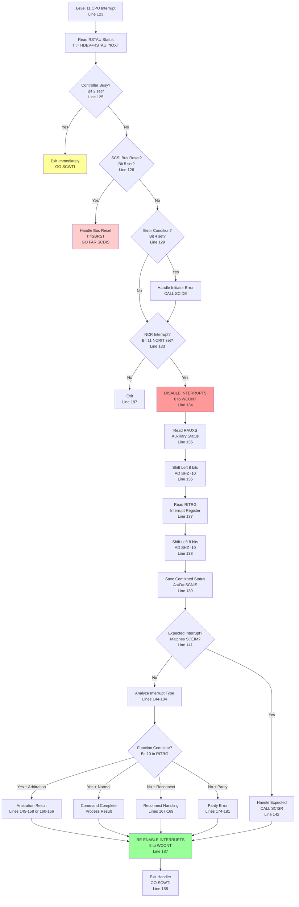
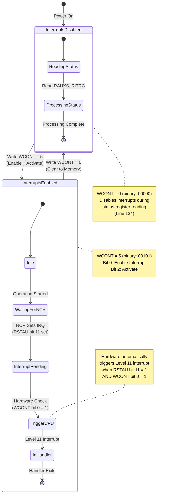
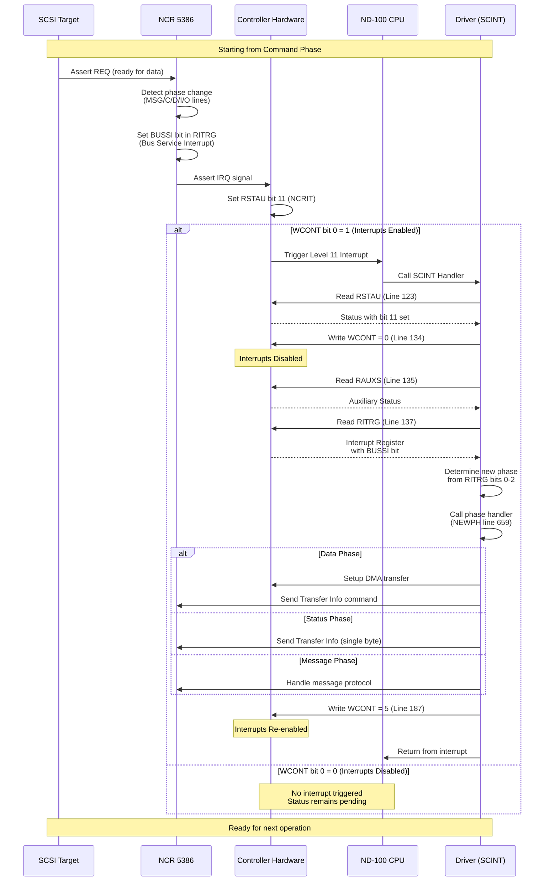

# IP-P2-SCSI-DRIV - Critical C# Interrupt Implementation Guide

**File:** `IP-P2-SCSI-DRIV.NPL`

**Purpose:** Essential documentation for C# SCSI driver interrupt implementation

---

## Table of Contents

1. [IOX Symbol Mapping Table](#1-iox-symbol-mapping-table)
2. [INTERRUPT FLOW - CRITICAL FOR C# IMPLEMENTATION](#2-interrupt-flow---critical-for-c-implementation)
3. [SCSI 8 Phases](#3-scsi-8-phases)
4. [Essential Mermaid Diagrams](#4-essential-mermaid-diagrams)
5. [Critical API Reference](#5-critical-api-reference)

---

## 1. IOX Symbol Mapping Table

Complete mapping from SINTRAN symbols to hardware register addresses:

### Controller Registers (Lines 25-36)

| SINTRAN Symbol | IOX Address | Hex | C# Enum | Description |
|----------------|-------------|-----|---------|-------------|
| RLMAR | 00 | 0x00 | RLMAR | Read Memory Address Register bits 0-15 |
| WLMAR | 01 | 0x01 | WLMAR | Write Memory Address Register bits 0-15 |
| REDAT | 02 | 0x02 | REDAT | Read Data (IOX mode only) |
| WRDAT | 03 | 0x03 | WRDAT | Write Data (IOX mode only) |
| **RSTAU** | **04** | **0x04** | **RSTAU** | **Read Status - CRITICAL FOR INTERRUPTS** |
| **WCONT** | **05** | **0x05** | **WCONT** | **Write Control - CRITICAL FOR INTERRUPTS** |
| RHMAR | 06 | 0x06 | RHMAR | Read Memory Address Register bits 16-23 |
| WHMAR | 07 | 0x07 | WHMAR | Write Memory Address Register bits 16-23 |

### NCR 5386 Registers (Lines 37-69)

| SINTRAN Symbol | IOX Address | Hex | C# Enum | Description |
|----------------|-------------|-----|---------|-------------|
| RNDAT | 40 (octal) | 0x20 | RNDAT | Read NCR Data Register |
| WNDAT | 41 (octal) | 0x21 | WNDAT | Write NCR Data Register |
| RNCOM | 42 (octal) | 0x22 | RNCOM | Read NCR Command Register |
| WNCOM | 43 (octal) | 0x23 | WNCOM | Write NCR Command Register |
| RNCNT | 44 (octal) | 0x24 | RNCNT | Read NCR Control Register |
| WNCNT | 45 (octal) | 0x25 | WNCNT | Write NCR Control Register |
| RDESI | 46 (octal) | 0x26 | RDESI | Read Destination ID Register |
| WDESI | 47 (octal) | 0x27 | WDESI | Write Destination ID Register |
| **RAUXS** | **50 (octal)** | **0x28** | **RAUXS** | **Read Auxiliary Status** |
| WAUXS | 51 (octal) | 0x29 | WAUXS | Write Auxiliary Status |
| ROIDN | 52 (octal) | 0x2A | ROIDN | Read Own ID Number |
| **RITRG** | **54 (octal)** | **0x2C** | **RITRG** | **Read Interrupt Register** |
| RSOUI | 56 (octal) | 0x2E | RSOUI | Read Source ID |
| RDIST | 62 (octal) | 0x32 | RDIST | Read Diagnostic Status |
| RTCM | 70 (octal) | 0x38 | RTCM | Read Transfer Counter MSB |
| WTCM | 71 (octal) | 0x39 | WTCM | Write Transfer Counter MSB |
| RTC2 | 72 (octal) | 0x3A | RTC2 | Read Transfer Counter 2nd |
| WTC2 | 73 (octal) | 0x3B | WTC2 | Write Transfer Counter 2nd |
| RTCL | 74 (octal) | 0x3C | RTCL | Read Transfer Counter Least |
| WTCL | 75 (octal) | 0x3D | WTCL | Write Transfer Counter Least |

### RSTAU Status Bits (Read Status Register)

| Bit | SINTRAN Symbol | Meaning | Interrupt Trigger |
|-----|----------------|---------|-------------------|
| 0 | - | Enabled Interrupt (from WCONT bit 0) | - |
| 1 | - | Not used | - |
| 2 | CTBUS | Busy (Controller Active) | - |
| 3 | - | Ready for transfer | - |
| 4 | - | OR of errors (bit 11) | - |
| 5 | - | Reset on SCSI bus | **YES** |
| 6 | - | NCR 5386 disabled | - |
| 7 | - | Single ended SCSI driver selected | - |
| 8 | - | Data request from NCR 5386 | - |
| 9 | - | Interrupt from NCR 5386 | **YES (if bit 0 set)** |
| 10 | - | Data acknowledge to NCR 5386 | - |
| **11** | **NCRIT** | **Interrupt from NCR (CRITICAL)** | **YES (if bit 0 set)** |
| 12 | - | BSY from SCSI bus | - |
| 13 | SCREQ | REQ from SCSI bus | - |
| 14 | - | ACK from SCSI bus | - |
| 15 | - | Differential SCSI receivers selected | - |

**IMPORTANT:** Bits 5 and 9 (NCRIT=11) give Level 11 CPU interrupt **ONLY IF** bit 0 (Enable Interrupt) is set.

### WCONT Control Word Bits (Write Control Register)

| Bit | SINTRAN Symbol | Meaning | C# Implementation |
|-----|----------------|---------|-------------------|
| **0** | **-** | **Enable Interrupt** | **MUST be set for interrupts** |
| 1 | - | Not used | Always 0 |
| **2** | **-** | **Activate** | **MUST be set with bit 0** |
| 3 | - | Test mode | Special diagnostics only |
| 4 | - | Clear Device | Reset state |
| 5 | ENDMA | ND-100 DMA enable | Set for DMA transfers |
| 6 | - | Write ND-100 Memory | Set for DMA read direction |
| 7 | - | Not used | Always 0 |
| 8 | - | Not used, must be zero | Always 0 |
| 9 | - | Not used, must be zero | Always 0 |
| 10 | - | Reset SCSI bus | Set to assert RST |
| 11-15 | - | Not used | Always 0 |

**CRITICAL VALUES:**
- **0** = Disable interrupt (clear to memory)
- **5** = Enable Interrupt (bit 0) + Activate (bit 2) = **0x05**

---

## 2. INTERRUPT FLOW - CRITICAL FOR C# IMPLEMENTATION

### 2.1 Understanding SCSI Interrupts and C# Implementation

#### What Triggers a Level 11 CPU Interrupt?

**Hardware Conditions (ALL must be true):**
1. WCONT bit 0 (Enable Interrupt) = 1
2. One of these RSTAU status bits is set:
   - Bit 5: Reset on SCSI bus
   - **Bit 11 (NCRIT): Interrupt from NCR 5386**

#### When to Set STATUS Bit 11 (NCRIT)

The hardware sets RSTAU bit 11 when:
1. NCR 5386 asserts its interrupt line (IRQ signal from chip)
2. This happens on:
   - Function complete (FUCOM bit in RITRG)
   - Bus service interrupt (BUSSI bit in RITRG)
   - Any NCR interrupt condition

#### C# Implementation Requirements

```csharp
// CRITICAL: Hardware state machine for interrupts

// When NCR 5386 completes a command or changes phase:
public void SetNcrInterrupt()
{
    // Step 1: Set RSTAU bit 11 (NCRIT)
    statusRegister |= (1 << 11); // NCRIT bit

    // Step 2: Check if interrupts enabled (WCONT bit 0)
    if ((controlWord & 0x01) != 0)
    {
        // Step 3: Trigger Level 11 CPU interrupt
        TriggerCpuInterrupt(level: 11);
    }
}

// When WCONT is written
public void WriteWCONT(ushort value)
{
    ushort oldControl = controlWord;
    controlWord = value;

    // Clear to memory (value = 0): Disable interrupts
    if (value == 0)
    {
        // Do NOT clear RSTAU bit 11 yet
        // Driver will read RAUXS and RITRG first
    }

    // Activate + Enable (value = 5): Re-enable interrupts
    else if ((value & 0x05) == 0x05)
    {
        // Check if NCR interrupt pending
        if ((statusRegister & (1 << 11)) != 0)
        {
            TriggerCpuInterrupt(level: 11);
        }
    }
}
```

### 2.2 SCINT Interrupt Handler Flow (Lines 123-188)

**Complete sequence with line numbers:**

#### Step 1: Read Device Status (Line 123)
```
Line 123: T := HDEV+RSTAU; *IOXT
```
**C# Implementation:**
```csharp
// Read RSTAU register
ushort deviceStatus = ReadRegister(RSTAU);
```

#### Step 2: Initial Status Checks (Lines 124-132)
```
Line 125: IF A BIT 2 GO SCWTI               % CONTROLLER BUSY
Line 126: IF A=:SCSSR BIT 5 THEN
Line 127:    T:=SBRST; GO FAR SCDIS         % SCSI BUS RESET RECEIVED
Line 129: IF A BIT 4 THEN
Line 130:    CALL SCIDE; A:=SCSSR           % "INITIATOR DETECTED ERROR"
```
**C# Implementation:**
```csharp
if ((deviceStatus & (1 << 2)) != 0) // CTBUS - Controller busy
    return; // Exit immediately

if ((deviceStatus & (1 << 5)) != 0) // SCSI bus reset
{
    HandleBusReset();
    return;
}

if ((deviceStatus & (1 << 4)) != 0) // Error condition
{
    HandleInitiatorError();
}
```

#### Step 3: NCR Interrupt Processing (Lines 133-139) - **CRITICAL**

```
Line 133: IF A=:SCSSR BIT 11 THEN              % INTERRUPT FROM NCR
Line 134:    "0"; T:=HDEV+WCONT; *IOXT         % CLEAR TO MEMORY (disable interrupt)
Line 135:    T+"RAUXS-WCONT"; *IOXT            % READ AUXILIARY STATUS
Line 136:    AD SHZ -10                         % Shift into accumulator
Line 137:    T+"RITRG-RAUXS"; *IOXT            % READ INTERRUPT REGISTER
Line 138:    AD SHZ -10                         % Shift into accumulator
Line 139:    A:=D=:SCNIS; 0=:SCCCW             % Save new status
```

**C# Implementation:**
```csharp
if ((deviceStatus & (1 << 11)) != 0) // NCRIT - Interrupt from NCR
{
    // CRITICAL: Disable interrupts first
    WriteRegister(WCONT, 0); // Clear to memory

    // Read NCR status registers
    byte auxiliaryStatus = ReadRegister(RAUXS);
    byte interruptRegister = ReadRegister(RITRG);

    // Combine into 16-bit status word
    ushort ncrStatus = (ushort)((auxiliaryStatus << 8) | interruptRegister);

    // Save for processing
    currentInterruptStatus = ncrStatus;
    controlCommandWord = 0;
}
```

**CRITICAL UNDERSTANDING:**
- **Line 134:** Writing 0 to WCONT **disables further interrupts** during processing
- **Lines 135-138:** NCR status MUST be read while interrupts are disabled
- **The hardware does NOT clear RSTAU bit 11** until after these reads complete

#### Step 4: Expected Interrupt Check (Lines 141-143)
```
Line 141: IF A/\177500=SCEIM THEN           % EXPECTED INTERRUPT
Line 142:    CALL SCISR                      % Call interrupt service routine
```

**C# Implementation:**
```csharp
// Check if interrupt matches expected pattern
if ((ncrStatus & 0x7F40) == expectedInterruptMask)
{
    // Handle expected interrupt (phase change, command complete, etc.)
    HandleExpectedInterrupt(ncrStatus);
}
else
{
    // Handle unexpected interrupts (arbitration, reconnect, etc.)
    HandleUnexpectedInterrupt(ncrStatus);
}
```

#### Step 5: Unexpected Interrupt Handling (Lines 144-184)

**Arbitration Timeout** (Lines 145-158):
```csharp
// Function Complete (bit 10) + Arbitration phase
if ((ncrStatus & 0x0400) != 0 && inArbitrationPhase)
{
    DecrementRetryCounter();
    if (retriesExhausted)
    {
        TerminateOperationWithTimeout();
    }
}
```

**Arbitration Won** (Lines 160-166):
```csharp
// Function Complete (bit 10) + Arbitration won
if ((ncrStatus & 0x0400) != 0 && arbitrationSuccessful)
{
    RemoveFromArbitrationQueue();
    ConnectPhysicalPath();
    EnableBusServiceInterrupts();
}
```

**Reconnect** (Lines 167-169):
```csharp
// Reconnect interrupt (bit 14)
if ((ncrStatus & 0x4000) != 0)
{
    SetReconnectPhase();
    EnableBusServiceInterrupts();
}
```

**Parity Error** (Lines 174-181):
```csharp
// Parity error bit (bit 6 in RITRG)
if ((interruptRegister & 0x40) != 0)
{
    IncrementParityErrorCounter();
    SendMessageParityError(); // Or Initiator Detected Error
}
```

#### Step 6: Re-enable Interrupt (Line 187) - **CRITICAL**

```
Line 187: 5\/SCCCW; T:=HDEV+WCONT; *IOXT   % ACTIVATE + ENABLE INTERRUPT
Line 188: GO SCWTI                          % Exit interrupt handler
```

**C# Implementation:**
```csharp
// CRITICAL: Always re-enable interrupts before exit
controlCommandWord |= 5; // Set bits 0 and 2
WriteRegister(WCONT, 5); // Activate + Enable Interrupt

// Exit interrupt handler
return;
```

**CRITICAL UNDERSTANDING:**
- **Line 187:** MUST write 5 to WCONT to re-enable interrupts
- **Bit 0:** Enable Interrupt
- **Bit 2:** Activate
- **If you forget this step, NO MORE INTERRUPTS will occur!**

### 2.3 Phase Change Interrupt Generation

**When does hardware trigger a phase change interrupt?**

1. **SCSI bus signals change** (MSG, C/D, I/O lines):
   ```
   Phase 0: DATA OUT    (MSG=0, C/D=0, I/O=0)
   Phase 1: DATA IN     (MSG=0, C/D=0, I/O=1)
   Phase 2: COMMAND     (MSG=0, C/D=1, I/O=0)
   Phase 3: STATUS      (MSG=0, C/D=1, I/O=1)
   Phase 4: Reserved
   Phase 5: Reserved
   Phase 6: MESSAGE OUT (MSG=1, C/D=1, I/O=0)
   Phase 7: MESSAGE IN  (MSG=1, C/D=1, I/O=1)
   ```

2. **NCR 5386 sets Bus Service Interrupt (BUSSI bit 11 in RITRG)**

3. **Hardware sets RSTAU bit 11 (NCRIT)**

4. **If WCONT bit 0 = 1, trigger Level 11 CPU interrupt**

**C# Implementation:**
```csharp
// When SCSI phase changes
public void OnPhaseChange(byte newPhase)
{
    // Set Bus Service Interrupt in RITRG
    interruptRegister |= (1 << 11); // BUSSI bit

    // Set phase information in RITRG bits 0-2
    interruptRegister = (byte)((interruptRegister & 0xF8) | (newPhase & 0x07));

    // Trigger NCR interrupt
    SetNcrInterrupt(); // Sets RSTAU bit 11 and triggers CPU interrupt
}
```

### 2.4 Complete C# Interrupt Implementation Example

```csharp
public class NDBusDiscControllerSCSI
{
    private ushort statusRegister;      // RSTAU
    private ushort controlWord;         // WCONT
    private byte interruptRegister;     // RITRG
    private byte auxiliaryStatus;       // RAUXS
    private ushort expectedInterruptMask;
    private bool interruptsEnabled;

    // Called when NCR 5386 completes a command or changes phase
    private void SetNcrInterrupt()
    {
        // Set RSTAU bit 11 (NCRIT)
        statusRegister |= (1 << 11);

        // Check if interrupts enabled
        if ((controlWord & 0x01) != 0)
        {
            TriggerCpuInterrupt(11); // Level 11 disk interrupt
        }
    }

    // IOX Write to WCONT (register 5)
    public void WriteWCONT(ushort value)
    {
        controlWord = value;

        // Handle special cases
        if (value == 0)
        {
            // Disable interrupts (line 134)
            interruptsEnabled = false;
        }
        else if ((value & 0x05) == 0x05)
        {
            // Enable interrupts + Activate (line 187)
            interruptsEnabled = true;

            // Check for pending NCR interrupt
            if ((statusRegister & (1 << 11)) != 0)
            {
                TriggerCpuInterrupt(11);
            }
        }
    }

    // IOX Read from RSTAU (register 4)
    public ushort ReadRSTAU()
    {
        // Return current status
        return statusRegister;
    }

    // IOX Read from RAUXS (register 0x28)
    public byte ReadRAUXS()
    {
        // Return auxiliary status
        return auxiliaryStatus;
    }

    // IOX Read from RITRG (register 0x2C)
    public byte ReadRITRG()
    {
        byte value = interruptRegister;

        // CRITICAL: Reading RITRG clears some bits in NCR 5386
        // But RSTAU bit 11 remains set until WCONT = 5

        return value;
    }

    // Simulated NCR command completion
    private void OnNcrCommandComplete(byte commandResult)
    {
        // Set Function Complete bit in RITRG
        interruptRegister |= (1 << 10); // FUCOM bit

        // Set command result in lower bits
        interruptRegister |= commandResult;

        // Update auxiliary status
        auxiliaryStatus = GetAuxiliaryStatusFromNcr();

        // Trigger interrupt
        SetNcrInterrupt();
    }

    // Simulated phase change
    private void OnScsiPhaseChange(byte newPhase)
    {
        // Set Bus Service Interrupt in RITRG
        interruptRegister = (byte)((1 << 11) | (newPhase & 0x07)); // BUSSI + phase

        // Update auxiliary status with new phase
        auxiliaryStatus = (byte)((auxiliaryStatus & 0xF8) | (newPhase & 0x07));

        // Trigger interrupt
        SetNcrInterrupt();
    }
}
```

---

## 3. SCSI 8 Phases

Understanding when interrupts fire during each phase:

### Phase 0: DATA OUT (Host to Target)

**Phase Signals:** MSG=0, C/D=0, I/O=0

**When Interrupt Fires:**
1. **Entry:** Bus Service Interrupt (BUSSI) when target requests phase
2. **During:** No interrupts (DMA transfer in progress)
3. **Exit:** Function Complete (FUCOM) or Bus Service Interrupt when phase changes

**C# Implementation:**
```csharp
private void HandleDataOutPhase()
{
    // Setup DMA transfer
    SetupDmaTransfer(
        memoryAddress: currentDataPointer,
        byteCount: currentByteCount,
        direction: DMA_TO_DEVICE
    );

    // Send "Transfer Info" command to NCR (command 224 for DMA)
    WriteNcrCommand(0x90); // 0x90 = DMA mode + Transfer Info

    // Wait for Function Complete interrupt
    expectedInterruptMask = (1 << 10); // FUCOM bit
}
```

### Phase 1: DATA IN (Target to Host)

**Phase Signals:** MSG=0, C/D=0, I/O=1

**When Interrupt Fires:**
1. **Entry:** Bus Service Interrupt (BUSSI) when target requests phase
2. **During:** No interrupts (DMA transfer in progress)
3. **Exit:** Function Complete (FUCOM) or Bus Service Interrupt when phase changes

**C# Implementation:**
```csharp
private void HandleDataInPhase()
{
    // Setup DMA transfer
    SetupDmaTransfer(
        memoryAddress: currentDataPointer,
        byteCount: currentByteCount,
        direction: DMA_FROM_DEVICE
    );

    // Send "Transfer Info" command to NCR (command 224 for DMA)
    WriteNcrCommand(0x90); // 0x90 = DMA mode + Transfer Info

    // Wait for Function Complete interrupt
    expectedInterruptMask = (1 << 10); // FUCOM bit
}
```

### Phase 2: COMMAND

**Phase Signals:** MSG=0, C/D=1, I/O=0

**When Interrupt Fires:**
1. **Entry:** Bus Service Interrupt (BUSSI) when target requests phase
2. **Exit:** Function Complete (FUCOM) when command block sent

**C# Implementation:**
```csharp
private void HandleCommandPhase()
{
    // Setup DMA for 14-byte command block
    SetupDmaTransfer(
        memoryAddress: commandBlockAddress,
        byteCount: 14,
        direction: DMA_TO_DEVICE
    );

    // Send "Transfer Info" command to NCR
    WriteNcrCommand(0x90); // DMA mode + Transfer Info

    expectedInterruptMask = (1 << 10); // FUCOM bit
}
```

### Phase 3: STATUS

**Phase Signals:** MSG=0, C/D=1, I/O=1

**When Interrupt Fires:**
1. **Entry:** Bus Service Interrupt (BUSSI) when target requests phase
2. **Exit:** Function Complete (FUCOM) after status byte read

**C# Implementation:**
```csharp
private void HandleStatusPhase()
{
    // Send "Transfer Info, single byte" command to NCR
    WriteNcrCommand(0x54); // 0x54 = Transfer Info, single byte

    // Poll for Data Register Full (or wait for FUCOM interrupt)
    byte statusByte = PollAndReadNcrData();

    SaveStatusByte(statusByte);

    expectedInterruptMask = (1 << 10); // FUCOM bit
}
```

### Phase 6: MESSAGE OUT

**Phase Signals:** MSG=1, C/D=1, I/O=0

**When Interrupt Fires:**
1. **Entry:** Bus Service Interrupt (BUSSI) when target requests phase
2. **Exit:** Function Complete (FUCOM) after message sent

**Typical Messages:**
- **IDENTIFY (0xC0 + LUN):** Sent during selection/reselection
- **MESSAGE REJECT (0x07):** Reject unsupported message
- **INITIATOR DETECTED ERROR (0x05):** Report parity error
- **MESSAGE PARITY ERROR (0x09):** Report parity on message
- **ABORT (0x06):** Abort current operation

**C# Implementation:**
```csharp
private void HandleMessageOutPhase()
{
    // Determine message to send
    byte message = DetermineMessageToSend();

    if (IsMultiByteMessage(message))
    {
        // Use DMA for multi-byte messages
        StoreMessageInBuffer(message);
        SetupDmaTransfer(messageBufferAddress, messageLength, DMA_TO_DEVICE);
        WriteNcrCommand(0x90); // DMA mode + Transfer Info
    }
    else
    {
        // Single byte - write directly to NCR data register
        WriteNcrCommand(0x54); // Transfer Info, single byte
        WriteNcrData(message);
    }

    expectedInterruptMask = (1 << 10); // FUCOM bit
}
```

### Phase 7: MESSAGE IN

**Phase Signals:** MSG=1, C/D=1, I/O=1

**When Interrupt Fires:**
1. **Entry:** Bus Service Interrupt (BUSSI) when target sends message
2. **Between bytes:** Function Complete (FUCOM) after each message byte
3. **Exit:** Function Complete (FUCOM) after "Message Accepted" command

**Typical Messages:**
- **COMMAND COMPLETE (0x00):** Operation finished
- **SAVE DATA POINTER (0x02):** Save current position
- **RESTORE POINTERS (0x03):** Restore saved position
- **DISCONNECT (0x04):** Target will disconnect
- **MESSAGE REJECT (0x07):** Message not supported
- **EXTENDED MESSAGE (0x01):** Multi-byte message follows

**C# Implementation:**
```csharp
private void HandleMessageInPhase()
{
    // Read first message byte
    WriteNcrCommand(0x54); // Transfer Info, single byte
    byte message = PollAndReadNcrData();

    if (message == 0x01) // Extended message
    {
        // Set up for multi-byte extended message
        expectedInterruptMask = MakeVector(FUCOM, HandleExtendedMessage);
    }
    else
    {
        // Process single-byte message
        ProcessMessage(message);

        // Send "Message Accepted" to NCR
        WriteNcrCommand(0x04);

        // Wait for Bus Service Interrupt (next phase)
        expectedInterruptMask = (1 << 11); // BUSSI bit
    }
}

private void ProcessMessage(byte message)
{
    switch (message)
    {
        case 0x00: // COMMAND COMPLETE
            SetCommandCompleteFlag();
            break;

        case 0x02: // SAVE DATA POINTER
            SaveDataPointer();
            break;

        case 0x03: // RESTORE POINTERS
            RestoreDataPointer();
            break;

        case 0x04: // DISCONNECT
            SetDisconnectFlag();
            break;

        case 0x07: // MESSAGE REJECT
            HandleMessageRejected();
            break;

        default:
            // Unknown message - reject it
            SendMessageReject();
            break;
    }
}
```

---

## 4. Essential Mermaid Diagrams

### 4.1 Complete Interrupt Handler Flow (SCINT)



### 4.2 WCONT Write Behavior (0 vs 5) - State Machine



### 4.3 Phase Change Interrupt Generation



### 4.4 Complete Read Operation with Interrupts

```mermaid
sequenceDiagram
    participant User as User Program
    participant Driver as SCSI Driver
    participant NCR as NCR 5386
    participant HW as Hardware
    participant CPU as CPU (Interrupt)
    participant Target as SCSI Target

    User->>Driver: SCLLD (Read Operation)
    Driver->>Driver: INITO: Initialize operation
    Driver->>HW: Write WCONT = 0<br/>(Disable interrupts)
    Driver->>NCR: Setup SELECT command
    Driver->>NCR: Write destination ID
    Driver->>HW: Write WCONT = 5<br/>(Enable interrupts)
    Driver->>User: Return BUSY

    Note over NCR,Target: Arbitration Phase
    NCR->>Target: Arbitrate for bus
    Target->>NCR: Grant arbitration
    NCR->>HW: Set FUCOM interrupt
    HW->>CPU: Level 11 Interrupt

    CPU->>Driver: SCINT Handler (Line 123)
    Driver->>HW: Read RSTAU
    Driver->>HW: Write WCONT = 0
    Driver->>HW: Read RAUXS
    Driver->>HW: Read RITRG
    Driver->>Driver: Arbitration Won (Line 160)
    Driver->>Driver: CNTHR: Connect thread
    Driver->>HW: Write WCONT = 5
    Driver->>CPU: Return from interrupt

    Note over NCR,Target: Message Out Phase (IDENTIFY)
    Target->>NCR: Request MESSAGE OUT
    NCR->>HW: Set BUSSI interrupt
    HW->>CPU: Level 11 Interrupt

    CPU->>Driver: SCINT Handler
    Driver->>HW: Write WCONT = 0
    Driver->>HW: Read status
    Driver->>Driver: NEWPH: Phase handler (Line 659)
    Driver->>Driver: MSOPH: Message Out (Line 776)
    Driver->>NCR: Send IDENTIFY message
    Driver->>HW: Write WCONT = 5
    Driver->>CPU: Return from interrupt

    Note over NCR,Target: Command Phase
    Target->>NCR: Request COMMAND
    NCR->>HW: Set BUSSI interrupt
    HW->>CPU: Level 11 Interrupt

    CPU->>Driver: SCINT Handler
    Driver->>HW: Write WCONT = 0
    Driver->>HW: Read status
    Driver->>Driver: COMPH: Command Phase (Line 745)
    Driver->>NCR: Setup DMA for command block
    Driver->>NCR: Send Transfer Info command
    Driver->>HW: Write WCONT = 5
    Driver->>CPU: Return from interrupt

    NCR->>Target: Transfer 14-byte command
    Target->>NCR: Command received
    NCR->>HW: Set FUCOM interrupt
    HW->>CPU: Level 11 Interrupt

    Note over NCR,Target: Data In Phase
    Target->>NCR: Request DATA IN
    NCR->>HW: Set BUSSI interrupt
    HW->>CPU: Level 11 Interrupt

    CPU->>Driver: SCINT Handler
    Driver->>HW: Write WCONT = 0
    Driver->>HW: Read status
    Driver->>Driver: DAIPH: Data In Phase (Line 710)
    Driver->>HW: Setup DMA transfer<br/>(memory address, byte count)
    Driver->>NCR: Send Transfer Info (DMA mode)
    Driver->>HW: Write WCONT = 5
    Driver->>CPU: Return from interrupt

    NCR->>Target: Request data
    Target->>NCR: Transfer data blocks
    NCR->>HW: DMA to memory
    HW->>HW: Update memory address register
    Target->>NCR: All data transferred
    NCR->>HW: Set FUCOM interrupt
    HW->>CPU: Level 11 Interrupt

    Note over NCR,Target: Status Phase
    Target->>NCR: Request STATUS
    NCR->>HW: Set BUSSI interrupt
    HW->>CPU: Level 11 Interrupt

    CPU->>Driver: SCINT Handler
    Driver->>HW: Write WCONT = 0
    Driver->>HW: Read status
    Driver->>Driver: STAPH: Status Phase (Line 758)
    Driver->>NCR: Transfer Info (single byte)
    Driver->>Driver: Poll for data ready
    Driver->>NCR: Read status byte
    Driver->>HW: Write WCONT = 5
    Driver->>CPU: Return from interrupt

    Note over NCR,Target: Message In Phase (COMMAND COMPLETE)
    Target->>NCR: Request MESSAGE IN
    NCR->>HW: Set BUSSI interrupt
    HW->>CPU: Level 11 Interrupt

    CPU->>Driver: SCINT Handler
    Driver->>HW: Write WCONT = 0
    Driver->>HW: Read status
    Driver->>Driver: MSIPH: Message In (Line 819)
    Driver->>NCR: Transfer Info (single byte)
    Driver->>Driver: Poll for data ready
    Driver->>NCR: Read message (0x00 = COMMAND COMPLETE)
    Driver->>Driver: Set 6SCCO flag
    Driver->>NCR: Send "Message Accepted"
    Driver->>HW: Write WCONT = 5
    Driver->>CPU: Return from interrupt

    Note over NCR,Target: Bus Free Phase
    Target->>NCR: Release bus
    NCR->>HW: Set FUCOM interrupt
    HW->>CPU: Level 11 Interrupt

    CPU->>Driver: SCINT Handler
    Driver->>HW: Write WCONT = 0
    Driver->>HW: Read status
    Driver->>Driver: TEROP: Terminate operation
    Driver->>Driver: Calculate status
    Driver->>User: Return FIN (success)
    Driver->>HW: Write WCONT = 5
    Driver->>CPU: Return from interrupt
```



### 4.5 Complete Write Operation with Interrupts

```mermaid
sequenceDiagram
    participant User as User Program
    participant Driver as SCSI Driver
    participant NCR as NCR 5386
    participant HW as Hardware
    participant CPU as CPU (Interrupt)
    participant Target as SCSI Target

    User->>Driver: SCLLD (Write Operation)
    Driver->>Driver: INITO: Initialize operation
    Driver->>HW: Write WCONT = 0
    Driver->>NCR: Setup SELECT command
    Driver->>HW: Write WCONT = 5
    Driver->>User: Return BUSY

    Note over NCR,Target: Arbitration & Selection
    NCR->>Target: Win arbitration
    NCR->>HW: FUCOM interrupt
    HW->>CPU: Level 11 Interrupt

    CPU->>Driver: SCINT Handler
    Driver->>HW: Write WCONT = 0
    Driver->>HW: Read RSTAU, RAUXS, RITRG
    Driver->>Driver: Handle arbitration won
    Driver->>HW: Write WCONT = 5
    Driver->>CPU: Return

    Note over NCR,Target: Message Out Phase
    Target->>NCR: Request MESSAGE OUT
    NCR->>HW: BUSSI interrupt
    HW->>CPU: Level 11 Interrupt

    CPU->>Driver: SCINT Handler
    Driver->>HW: Write WCONT = 0
    Driver->>HW: Read status
    Driver->>Driver: NEWPH -> MSOPH
    Driver->>NCR: Send IDENTIFY
    Driver->>HW: Write WCONT = 5
    Driver->>CPU: Return

    Note over NCR,Target: Command Phase
    Target->>NCR: Request COMMAND
    NCR->>HW: BUSSI interrupt
    HW->>CPU: Level 11 Interrupt

    CPU->>Driver: SCINT Handler
    Driver->>HW: Write WCONT = 0
    Driver->>Driver: NEWPH -> COMPH
    Driver->>HW: Setup DMA for command
    Driver->>NCR: Send WRITE command
    Driver->>HW: Write WCONT = 5
    Driver->>CPU: Return

    NCR->>Target: Transfer command block
    NCR->>HW: FUCOM interrupt
    HW->>CPU: Level 11 Interrupt

    Note over NCR,Target: Data Out Phase
    Target->>NCR: Request DATA OUT (ready for data)
    NCR->>HW: BUSSI interrupt
    HW->>CPU: Level 11 Interrupt

    CPU->>Driver: SCINT Handler
    Driver->>HW: Write WCONT = 0
    Driver->>Driver: NEWPH -> DAOPH (Line 706)

    rect rgb(255, 240, 240)
        Note over Driver,HW: CRITICAL: Setup DMA Write
        Driver->>HW: WCONT = 40 (0x28)<br/>Bit 5: DMA enable<br/>Bit 6: Write to memory = 0 (read from memory)
        Driver->>HW: Write MAR high (WHMAR)
        Driver->>HW: Write MAR low (WLMAR)
        Driver->>HW: Write Transfer Counter (WTCM, WTC2, WTCL)
        Driver->>NCR: Command 224 (0x90)<br/>DMA + Transfer Info
    end

    Driver->>HW: Write WCONT = 5
    Driver->>CPU: Return from interrupt

    HW->>HW: Start DMA engine
    loop For each word
        HW->>HW: Read from memory at MAR
        HW->>NCR: Write to NCR data register
        NCR->>Target: Transfer byte to SCSI bus
        HW->>HW: Increment MAR
        HW->>HW: Decrement Transfer Counter
    end

    NCR->>HW: FUCOM interrupt (transfer complete)
    HW->>CPU: Level 11 Interrupt

    Note over NCR,Target: Status Phase
    Target->>NCR: Request STATUS
    NCR->>HW: BUSSI interrupt
    HW->>CPU: Level 11 Interrupt

    CPU->>Driver: SCINT Handler
    Driver->>HW: Write WCONT = 0
    Driver->>Driver: NEWPH -> STAPH
    Driver->>NCR: Transfer Info (single byte)
    Driver->>NCR: Read status byte
    Driver->>HW: Write WCONT = 5
    Driver->>CPU: Return

    Note over NCR,Target: Message In Phase
    Target->>NCR: Request MESSAGE IN (COMMAND COMPLETE)
    NCR->>HW: BUSSI interrupt
    HW->>CPU: Level 11 Interrupt

    CPU->>Driver: SCINT Handler
    Driver->>HW: Write WCONT = 0
    Driver->>Driver: NEWPH -> MSIPH
    Driver->>NCR: Read message (0x00)
    Driver->>Driver: Set COMMAND COMPLETE flag
    Driver->>NCR: Message Accepted
    Driver->>HW: Write WCONT = 5
    Driver->>CPU: Return

    Note over NCR,Target: Bus Free
    Target->>NCR: Release bus
    NCR->>HW: FUCOM interrupt
    HW->>CPU: Level 11 Interrupt

    CPU->>Driver: SCINT Handler
    Driver->>Driver: TEROP: Terminate
    Driver->>User: Return FIN (success)
    Driver->>HW: Write WCONT = 5
    Driver->>CPU: Return
```



---

## 5. Critical API Reference

### 5.1 SCLLD - Main Entry Point (Lines 93-117)

**Purpose:** Initialize SCSI operation and start arbitration

**Call Sequence:**
```assembly
JPL I (SCLLD
JMP BUSY      % Operation queued
JMP ERROR     % Intermediate return (first disconnect)
JMP FIN       % Operation complete
```

**Entry Parameters:**
- **A** = Function Type (0-4)
- **X** = Unit Datafield

**Function Types:**
- **0-2:** Normal SCSI operation (read, write, etc.)
- **3:** Enable Timer
- **4:** Reset Request

**C# Implementation:**
```csharp
public enum ScsiFunction
{
    NormalOperation = 0,  // Read, write, seek, etc.
    EnableTimer = 3,      // Setup timeout timer
    ResetRequest = 4      // Request SCSI bus reset
}

public int SCLLD(ScsiFunction function, UnitDatafield unit)
{
    switch (function)
    {
        case ScsiFunction.NormalOperation:
            // Save control and return address
            unit.SUCON = controlWord;
            unit.SULRG = returnAddress;
            unit.SUTRG = 0;

            // Check NCR interface OK
            if (NCROK < 0)
            {
                return ErrorInInterface; // NCRST error
            }

            // Initialize operation
            INITO(unit);

            // If bus free, start arbitration
            if (BUSFL == 0)
            {
                SELEC();
            }
            break;

        case ScsiFunction.EnableTimer:
            unit.SUCON = controlWord;
            unit.SULRG = returnAddress;
            unit.SUTRG = 0;
            unit.SUTHS = (1 << 17); // 6SFUN bit
            ENTIM(unit);
            break;

        case ScsiFunction.ResetRequest:
            if ((NCROK & (1 << 15)) == 0) // Not already resetting
            {
                SCRXR = savedX;
                SCRLR = savedReturn;
                SCRCO = savedA;
                SCRST(); // Perform reset
            }
            else
            {
                return AlreadyInProgress;
            }
            break;
    }

    return BusyReturn; // GO SCWTI
}
```

### 5.2 SCINT - Interrupt Handler (Lines 123-189)

**Purpose:** Main interrupt service routine for SCSI controller

**Entry:** Level 11 CPU interrupt

**Exit:** Always re-enables interrupts (WCONT = 5)

**Key Operations:**
1. Read RSTAU device status
2. Check for controller busy, reset, errors
3. If NCR interrupt (bit 11):
   - Disable interrupts (WCONT = 0)
   - Read RAUXS and RITRG
   - Process expected or unexpected interrupt
4. Re-enable interrupts (WCONT = 5)

**C# Implementation:** See Section 2.2 above

### 5.3 SELEC - Activate Controller (Lines 376-398)

**Purpose:** Start arbitration and selection on SCSI bus

**Entry Parameters:**
- SCWAQ = Arbitration wait queue

**Key Operations:**
1. Disable interrupts (SCEIM = -1)
2. Write 0 to WCONT (clear to memory)
3. Setup destination ID and transfer counter
4. Write SELECT command to NCR (command 10 or 11)
5. Write 5 to WCONT (enable interrupts)

**C# Implementation:**
```csharp
private void SELEC()
{
    // Save registers
    SVTAD = TAD;
    SAVXR = X;

    // Disable interrupt processing
    SCEIM = -1;

    if (SCWAQ != null) // Queue not empty
    {
        // Disable hardware interrupts
        WriteRegister(WCONT, 0);

        // Set arbitration flag
        BUSFL |= (1 << 5); // 6SARB bit

        // Write destination ID (target SCSI ID)
        byte targetId = (byte)(SCWAQ.SUDLU >> 14);
        WriteRegister(WDESI, targetId);

        // Write waiting time to transfer counter
        WriteRegister(WTCM, (byte)(WATFS >> 16));
        WriteRegister(WTC2, (byte)(WATFS >> 8));
        WriteRegister(WTCL, (byte)WATFS);

        // Write SELECT command to NCR
        byte selectCommand;
        if ((SCWAQ.SUCON & (1 << 4)) != 0) // 4SINA - no ATN
            selectCommand = 0x08; // SELECT without ATN (command 10 octal)
        else
            selectCommand = 0x09; // SELECT with ATN (command 11 octal)

        WriteRegister(WNCOM, selectCommand);

        // Save current timer if running
        if (SCTST > 0)
        {
            SCTST.SUTMR = TMR;
        }

        // Enable select timeout
        SCTST = 1;
        TMR = -5; // 5 timer ticks
    }
    else
    {
        // Bus free
        BUSFL = 0;
    }

    // Re-enable interrupts
    WriteRegister(WCONT, 5);

    // Restore registers
    X = SAVXR;
    TAD = SVTAD;
}
```

### 5.4 NEWPH - New Phase Handler (Lines 659-698)

**Purpose:** Handle SCSI bus phase transitions and update data pointers

**Entry:** Called via Bus Service Interrupt (BUSSI)

**Key Operations:**
1. If old phase was DATA:
   - Read transfer counter from NCR
   - Calculate bytes transferred
   - Update memory address pointer
   - Handle odd byte boundary
2. Extract new phase from interrupt status
3. Dispatch to phase handler

**Phase Dispatch Table:**
- Phase 0: DAOPH (Data Out)
- Phase 1: DAIPH (Data In)
- Phase 2: COMPH (Command)
- Phase 3: STAPH (Status)
- Phase 6: MSOPH (Message Out)
- Phase 7: MSIPH (Message In)

**C# Implementation:**
```csharp
private void NEWPH()
{
    ushort oldStatus = BUSFL;

    // Check if old phase was data (bits 4-5 = 0)
    if ((oldStatus & 0x0030) == 0)
    {
        // Read transfer counter from NCR
        byte tcLow = ReadRegister(RTCL);
        byte tcMid = ReadRegister(RTC2);
        byte tcHigh = ReadRegister(RTCM);

        uint bytesRemaining = (uint)((tcHigh << 16) | (tcMid << 8) | tcLow);

        // Calculate bytes transferred
        uint oldByteCount = SCCBC;
        uint bytesTransferred = oldByteCount - bytesRemaining;

        // Update data pointer
        uint oldDataPointer = SCCDP;
        uint newDataPointer = oldDataPointer + bytesTransferred;

        // Handle odd byte boundary
        if ((newDataPointer & 0x01) != 0)
        {
            if ((BUSFL & 0x01) != 0) // Data to memory
            {
                // Force last byte to memory using test mode
                WriteRegister(WCONT, 0x68); // Set test mode (bit 3)
                ReadRegister(RLMAR); // Force flush
                WriteRegister(WCONT, 0); // Clear test mode
            }

            newDataPointer++; // Adjust for odd byte
        }

        // Save new values
        SCCBC = bytesRemaining;
        SCCDP = newDataPointer;
    }

    // Extract new phase from interrupt status (bits 0-2 of RITRG)
    byte newPhase = (byte)(currentInterruptStatus & 0x07);

    // Update bus flags
    BUSFL = (ushort)((BUSFL & 0xFE3F) | (newPhase << 6));

    // Dispatch to phase handler
    switch (newPhase)
    {
        case 0: DAOPH(); break;  // Data Out
        case 1: DAIPH(); break;  // Data In
        case 2: COMPH(); break;  // Command
        case 3: STAPH(); break;  // Status
        case 4: ILOPH(); break;  // Illegal Out
        case 5: ILIPH(); break;  // Illegal In
        case 6: MSOPH(); break;  // Message Out
        case 7: MSIPH(); break;  // Message In
    }
}
```

---

## Critical C# Implementation Checklist

Use this checklist to verify your C# SCSI driver implementation:

### Interrupt Hardware

- [ ] RSTAU bit 11 (NCRIT) is set when NCR asserts IRQ
- [ ] Level 11 CPU interrupt triggers when RSTAU bit 11 = 1 AND WCONT bit 0 = 1
- [ ] RSTAU bit 5 (SCSI bus reset) also triggers interrupt if WCONT bit 0 = 1
- [ ] Writing WCONT = 0 disables interrupt triggering
- [ ] Writing WCONT = 5 re-enables interrupt triggering

### Interrupt Handler Sequence

- [ ] Always read RSTAU first (line 123)
- [ ] Check controller busy (bit 2) and exit immediately if set
- [ ] Check SCSI bus reset (bit 5) before processing NCR interrupt
- [ ] When NCRIT (bit 11) is set:
  - [ ] Write 0 to WCONT immediately (line 134)
  - [ ] Read RAUXS (line 135)
  - [ ] Read RITRG (line 137)
  - [ ] Combine into 16-bit status word (lines 136, 138)
- [ ] Always write 5 to WCONT before exit (line 187)

### Phase Change Handling

- [ ] Bus Service Interrupt (BUSSI) in RITRG triggers phase change
- [ ] Phase information is in RITRG bits 0-2
- [ ] NEWPH handler reads transfer counter if old phase was DATA
- [ ] Memory address pointer is updated with bytes transferred
- [ ] Odd byte boundary is handled with test mode
- [ ] Phase dispatch table correctly routes to 8 phase handlers

### WCONT Register Behavior

- [ ] Value 0: Disables interrupts, allows status register reading
- [ ] Value 5: Enables interrupts and controller activation
- [ ] Value 40 (0x28): DMA mode for Data Out
- [ ] Value 140 (0x60): DMA mode for Data In
- [ ] Value 20 (octal) / 0x10: Clear controller
- [ ] Value 2000 (octal) / 0x400: Set SCSI bus reset

### NCR Command Execution

- [ ] Command 10 (octal) / 0x08: SELECT without ATN
- [ ] Command 11 (octal) / 0x09: SELECT with ATN
- [ ] Command 0: Disconnect
- [ ] Command 3: Set ATN
- [ ] Command 4: Message Accepted
- [ ] Command 13 (octal) / 0x0B: Start Diagnostic
- [ ] Command 24 (octal) / 0x14: Transfer Info
- [ ] Command 124 (octal) / 0x54: Transfer Info (single byte)
- [ ] Command 224 (octal) / 0x90: DMA mode + Transfer Info

### DMA Transfer Setup

- [ ] WCONT sets DMA enable and direction
- [ ] WHMAR and WLMAR set memory address
- [ ] WTCM, WTC2, WTCL set byte count
- [ ] NCR command 224 (0x90) starts DMA transfer
- [ ] Transfer counter counts down during DMA
- [ ] Function Complete interrupt fires when counter = 0 or phase changes

### Error Conditions

- [ ] RSTAU bit 4 (error flag) is checked
- [ ] Initiator Detected Error message (0x05) is sent on parity error
- [ ] Message Parity Error message (0x09) is sent on message parity error
- [ ] Message Reject (0x07) is sent for unsupported messages
- [ ] Abort message (0x06) is sent to terminate operations
- [ ] Bus reset clears all pending operations

### Critical Timing

- [ ] Interrupts are disabled (WCONT = 0) during status register reading
- [ ] Status registers are read before any processing
- [ ] NCR Command Register is written after status processing
- [ ] Interrupts are re-enabled (WCONT = 5) before handler exit
- [ ] No operations are performed between "write WCONT = 5" and handler exit

---

## Document Information

**Full Path:** `Z:\NorskData\Source Code\Sintran L\NPL\IP-P2-SCSI-DRIV.md`

**NPL Source File:** `Z:\NorskData\Source Code\Sintran L\NPL\IP-P2-SCSI-DRIV.NPL`

**C# Implementation:** `E:\Dev\Repos\Ronny\RetroCore\Emulated.HW\ND\CPU\NDBUS\NDBusDiscControllerSCSI.cs`

**Related Documentation:**
- `Z:\NorskData\Source Code\Sintran L\NPL\SCSI-controller.md` - Hardware register details
- `Z:\NorskData\Source Code\Sintran L\NPL\IP-P2-SCSI-DRIV-ANALYSIS.md` - Full driver analysis
- `Z:\NorskData\Source Code\Sintran L\NPL\IP-P2-SCSI-DISK.md` - Disk subsystem details

**Version:** 1.0
**Date:** 2025-10-13
**Author:** Generated from NPL source code analysis
