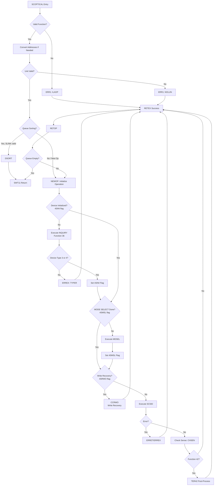
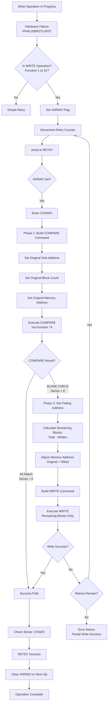
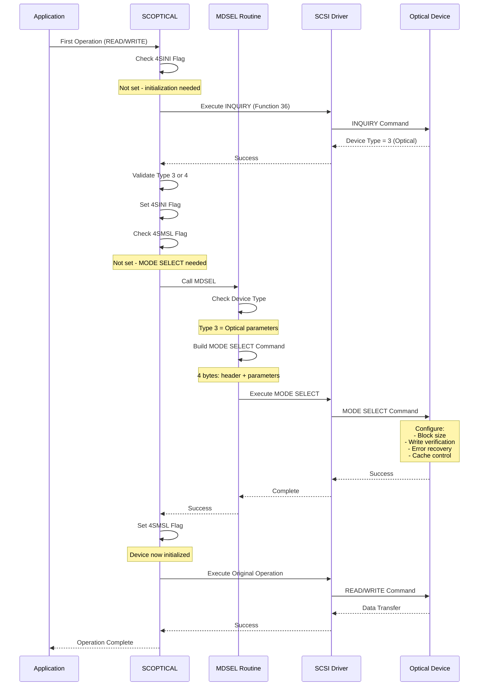
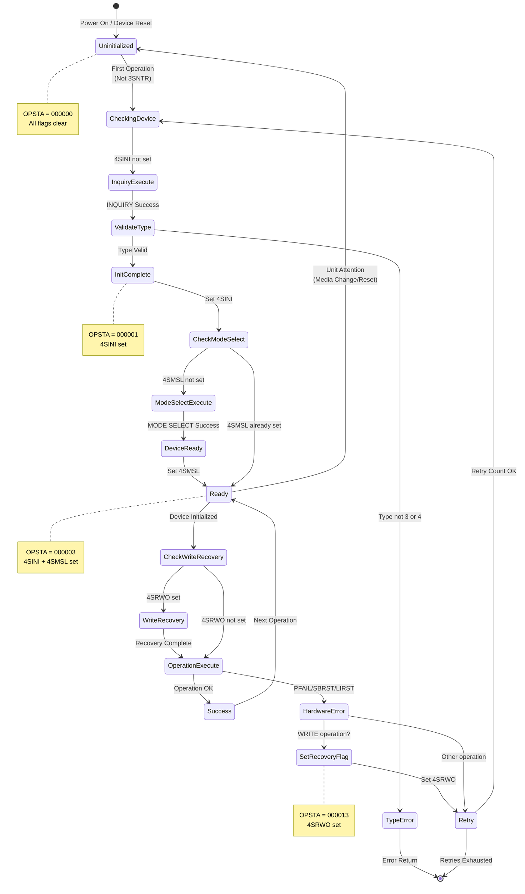
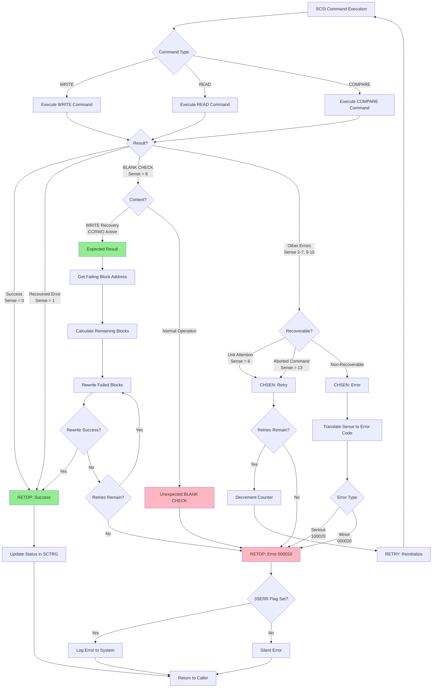

# SCSI Optical Disk Driver (IP-P2-SCSI-OPDI)

**Module:** `IP-P2-SCSI-OPDI.NPL`
**Module ID:** `8SCOD` (SCSI Optical Disk)
**Type:** Level 11 Driver
**Purpose:** SCSI optical disk operations with write recovery and device management

---

## 1. Overview

The SCSI Optical Disk Driver (`IP-P2-SCSI-OPDI.NPL`) is a specialized driver for optical storage devices in the Sintran L operating system. Unlike magnetic disk drivers, this driver implements sophisticated write recovery mechanisms, strict device initialization, and optical-specific optimizations.

### Key Differences from Magnetic Disks

Optical disks have fundamentally different characteristics than magnetic disks:

| Characteristic | Optical Disk | Magnetic Disk |
|----------------|--------------|---------------|
| **Write Speed** | 10-100x slower | Fast |
| **Seek Time** | 100-500ms | 5-15ms |
| **Media Type** | WORM/Rewritable | Rewritable |
| **Write Recovery** | Block-level verification | Simple retry |
| **Initialization** | Mandatory MODE SELECT | Optional |
| **Queue Sorting** | Not beneficial (SEEK) | Highly beneficial |
| **Cache** | Usually disabled | Usually enabled |

### Optical-Specific Features

1. **Write Recovery (CCRWO):** Block-level COMPARE and selective rewrite after power failures
2. **WORM Support:** Write-Once-Read-Many media handling
3. **Device Type Validation:** Only types 3 (optical) and 4 (WORM) supported
4. **Mandatory MODE SELECT:** Required device configuration before operations
5. **No Queue Sorting for SEEK:** Long seek times make sorting ineffective
6. **BLANK CHECK Handling:** Expected condition during write recovery

---

## 2. Complete API Reference

### Supported Functions

| Function | Name | Description | Double Address |
|----------|------|-------------|----------------|
| **0** | READ | Read data blocks from disk | 60 |
| **1** | WRITE | Write data blocks to disk | 61 |
| **2** | READ PARITY | Read with parity checking | 62 |
| **3** | COMPARE | Compare disk data with memory | 63 |
| **4** | SEEK | Position read/write head | - |
| **34** | RESERVE DEVICE | Reserve device for exclusive use | - |
| **35** | RELEASE DEVICE | Release reserved device | - |
| **37** | READ EXTENDED STATUS | Retrieve SCSI sense information | - |
| **42** | READ FORMAT | Get disk format and capacity | - |
| **73** | TEST UNIT READY | Check if device is ready | - |
| **74** | USER COMMAND | Execute custom SCSI command | - |
| **75** | INQUIRY | Read device type information | - |

### Function Entry Point: SCOPTICAL

**Entry Parameters:**
- `X` = DAQ (Disk Activity Queue) pointer
- `X.NFUNC` = Function code (0-75)
- `X.ABFUN` = Low 7 bits contain function code
- `X.MEMAD` = Memory address for data transfer
- `X.ABPA2` = Disk address (single or double word)
- `X.ABP32` = Transfer amount (blocks)
- `L` = Return address

**Exit Parameters:**
- `T` = Status code (0 = success, non-zero = error)
- `A` = Sense data (if T=0)
- `X` = Updated DAQ pointer
- `SCTRG` = Operation status (function code + error code)

### SCOPTICAL Routine

**Purpose:** Main dispatcher for all optical disk operations

**Key Operations:**
1. Extract and validate function code
2. Convert single to double addresses if needed
3. Validate unit data field
4. Queue management and sorting (if applicable)
5. Device initialization (INQUIRY + MODE SELECT)
6. Write recovery check (4SRWO flag)
7. Execute SCSI command via SCSID
8. Sense data validation
9. Post-processing (function 42)

### RETOP - Operation Termination

**Purpose:** Terminate operation and update status

**Entry Parameters:**
- `B` = Disk data field
- `X` = DAQ pointer
- `T` = Driver status
- `A` = Sense data (if T=0)

**Key Operations:**
1. Translate sense data to error codes
2. Handle COMPARE special case (miscompare = success)
3. Log errors if 3SERR flag set
4. Return to level 11 scheduler

**Status Translation (NEWST Array):**

| Sense | Value | Meaning | Error Code |
|-------|-------|---------|------------|
| 0 | NO SENSE | No error | 000000 |
| 1 | RECOVERED ERROR | Device corrected error | 000000 |
| 2 | NOT READY | Device not ready | 100020 |
| 3 | MEDIUM ERROR | Defect in media | 100020 |
| 4 | HARDWARE ERROR | Device hardware failure | 100020 |
| 5 | ILLEGAL REQUEST | Invalid command | 100020 |
| 6 | UNIT ATTENTION | Device reset/media changed | 100020 |
| 7 | DATA PROTECT | Media write-protected | 000020 |
| 8 | BLANK CHECK | Unwritten blocks | 000020 |
| 9 | VENDOR SPECIFIC | Vendor-specific error | 100020 |
| 10 | COPY ABORTED | Copy command failed | 100020 |
| 11 | ABORTED COMMAND | Command interrupted | 100020 |
| 12 | EQUAL | COMPARE matched | 000000 |
| 13 | VOLUME OVERFLOW | End of partition | 100020 |
| 14 | MISCOMPARE | COMPARE failed | 000020 |
| 15 | RESERVED | Reserved sense code | 100020 |

### MDSEL - MODE SELECT

**Purpose:** Configure optical disk parameters

**Entry Parameters:**
- `X` = DAQ pointer
- `SUTYP` = Device subtype (bits 10-13 = device type)
- `X.CMAD1:CMAD2` = Physical buffer address

**Key Operations:**
1. Check device type (3 = optical, others = default)
2. Build MODE SELECT command block
3. Set parameter count (4 bytes)
4. Execute via SCSID

**MODE SELECT Parameters:**
- Block size configuration
- Write verification mode
- Error recovery parameters
- Cache control (typically disabled)

### TER42 - READ FORMAT Post-Processing

**Purpose:** Return disk format and capacity information

**Entry Parameters:**
- `X` = DAQ pointer
- `SURSZ` = Sector/record size
- `X.MEMA1:MEMA2` = User buffer address

**Exit Data Structure:**

```
Offset 00: Disk Layout Index
           41 (51 decimal) = 2KB sectors (SURSZ=4000 octal)
           40 (50 decimal) = 1KB sectors (SURSZ=2000 octal)
           -1 = Non-standard size

Offset 10: Available Blocks (Double word)
           Total capacity - 1MB test reserve
           Calculated as: total - (SURSZ × 18432 / 15)
```

**Test Area Reservation:**
The driver reserves approximately 1 megabyte for testing and calibration. This is calculated as:
```
Reserved blocks = (SURSZ × 18432 / 15) + 1
Available blocks = Total capacity - Reserved blocks
```

### CHSEN - Sense Data Validation

**Purpose:** Determine if sense data indicates recoverable error

**Entry Parameters:**
- `A` = Sense data from SCSI command
- `X` = DAQ pointer
- `B` = Disk data field

**Actions:**

1. **Sense 0-1 (Acceptable):** Return to caller, continue operation
2. **Sense 6 (Unit Attention):** Decrement retry counter, RETRY
3. **Sense 13 (Aborted Command):** Decrement retry counter, RETRY
4. **Other Sense:** Jump to RETEX with error status

### Error Handling Routines

**ERRET - Hardware Error Recovery**

Handles hardware failures with retry logic:
- **PFAIL:** Power failure
- **SBRST:** SCSI bus reset
- **LIRST:** Link interface reset

For WRITE operations (functions 1, 61):
1. Set 4SRWO flag (write recovery needed)
2. Decrement retry counter
3. Jump to RETRY

**ERREX - Error Exit Preparation**

Prepares error exit with status code 20 (octal 16 decimal).

**ERR1 - Early Error Exit**

Handles configuration errors:
- **ILAOP:** Illegal operation (invalid function code)
- **NOLUN:** No logical unit (unit not configured)

**RETEX - Return with Status**

Returns from operation:
1. Clean up queue pointers
2. Call RETOP to terminate
3. Check for next queued operation
4. Start next operation or return to scheduler

---

## 3. Write Recovery Mechanism (CCRWO)

The **CCRWO** (Check/Compare/Rewrite Operation) routine is unique to the optical disk driver and implements sophisticated write recovery after hardware failures.

### Why Write Recovery?

Optical disk characteristics make write recovery essential:

1. **Slow Write Times:** Optical writes take 10-100x longer than magnetic
2. **WORM Media:** Some optical media is write-once, cannot simply rewrite
3. **Power Failure Resilience:** Long writes increase probability of interruption
4. **Partial Write Success:** Some blocks may write successfully before failure
5. **Data Integrity:** Must verify what was actually written

### Recovery Strategy

The recovery process uses a two-phase approach:

**Phase 1: COMPARE - Verify Written Blocks**
1. Build SCSI COMPARE command
2. Set original disk address
3. Set original block count
4. Set original memory address
5. Execute COMPARE via function 74 (user command)

**Phase 2: REWRITE - Selective Block Rewrite**
1. If BLANK CHECK returned: some blocks failed
2. Get failing block address from sense data
3. Calculate remaining blocks to write
4. Adjust memory address to failed block offset
5. Build SCSI WRITE command for remaining blocks
6. Execute WRITE via function 74

### CCRWO Entry Point

**Trigger:** 4SRWO flag set in OPSTA field

**When Set:**
- Write operation (function 1 or 61) in progress
- Hardware error occurred (PFAIL, SBRST, or LIRST)
- ERRET routine sets flag before retry

**Entry Check (Line 226):**
```assembly
IF X.OPSTA BIT 4SRWO GO FAR CCRWO
```

### COMPARE Command Construction

**Command Block Format:**
```
Byte 0-1: 27402 (octal) = SCSI COMPARE command
Byte 2-5: Device block address (from original ABPA2)
Byte 6-8: Number of blocks (from original ABPA3)
Byte 9-11: Byte count (blocks × block size)
```

**Memory Address:** Original memory address (data being written)

**Function:** 74 (user-specified SCSI command)

### COMPARE Results

**Case 1: All Blocks Match (Sense = 0)**
- All blocks written successfully before failure
- Recovery complete
- Jump to RETEX with success
- Next operation clears 4SRWO flag

**Case 2: Some Blocks Failed (Sense = 8, BLANK CHECK)**
- Hardware returns failing block address
- Indicates first unwritten or mismatched block
- Proceed to rewrite phase

### REWRITE Command Construction

**Calculate Remaining Work:**
```
Original: Write N blocks starting at LBA X from memory M
COMPARE failed at: LBA Y

Remaining blocks = N - (Y - X)
New start LBA = Y
New memory address = M + ((Y - X) × block_size)
```

**Command Block Format:**
```
Byte 0-1: 25000 (octal) = SCSI WRITE command
Byte 2-5: Failing block address (from COMPARE sense)
Byte 6-8: Remaining block count
Byte 9-11: New byte count
```

**Memory Address Calculation:**
```assembly
AD SHZ -1                    % Byte count → word count
A:=:D+X.MEMA2=:X.MEMA2      % Add to low word
A:=D+C+X.MEMA1=:X.MEMA1     % Add carry to high word
```

### Recovery Examples

**Example 1: Successful Recovery**
```
Initial Write:
- Function: 1 (WRITE)
- Address: LBA 5000
- Count: 20 blocks
- Memory: 0x20000

Event: Power failure after block 12

Recovery:
1. Set 4SRWO flag
2. Next operation checks 4SRWO → CCRWO
3. COMPARE 20 blocks at LBA 5000
4. BLANK CHECK at LBA 5012
5. Calculate: 20 - 12 = 8 blocks remain
6. Memory: 0x20000 + (12 × 512) = 0x23000
7. WRITE 8 blocks at LBA 5012 from 0x23000
8. Success - clear 4SRWO

Result: All 20 blocks written, no data loss
```

**Example 2: Multiple Retry Attempts**
```
Initial Write:
- Function: 61 (WRITE double address)
- Address: LBA 100000
- Count: 50 blocks
- Memory: 0x40000

Event: SCSI bus reset during write

Attempt 1:
1. Set 4SRWO, retry = 5
2. COMPARE → BLANK CHECK at LBA 100025
3. WRITE remaining 25 blocks
4. Hardware error → retry = 4

Attempt 2:
1. COMPARE → BLANK CHECK at LBA 100025
2. WRITE remaining 25 blocks
3. Success
4. Clear 4SRWO

Result: Recovery required 2 attempts, all blocks written
```

**Example 3: Unrecoverable Error**
```
Initial Write:
- Address: LBA 2000
- Count: 10 blocks

Event: Link reset during write

Attempts 1-5:
- Each attempt fails at LBA 2005
- Hardware error persists
- Retry counter exhausted

Result:
- Blocks 2000-2004: Written successfully
- Blocks 2005-2009: Failed
- Error returned to caller
- 4SRWO remains set
```

### Design Rationale

**Why COMPARE Instead of READ?**

1. **Efficiency:** COMPARE is faster (no data transfer)
2. **Accuracy:** Atomic comparison on device (no race conditions)
3. **BLANK CHECK:** SCSI provides specific sense with failing address
4. **Precision:** Identifies exact block that failed

**Why Block-Level Recovery?**

1. **WORM Media:** Cannot rewrite successfully written blocks
2. **Performance:** Rewriting only failures saves time on slow optical media
3. **Reliability:** Preserves partial success from long writes
4. **Wear Reduction:** Minimizes rewrites on optical media

**Why User Command (Function 74)?**

1. **Flexibility:** COMPARE not a standard disk function
2. **Control:** Direct SCSI command block construction
3. **Compatibility:** Standard SCSI COMPARE command
4. **Recovery:** Full control over recovery process

### Recovery Limitations

**Cannot Recover:**
1. **Media Defects:** Physical damage to optical disk
2. **Device Failure:** Drive hardware malfunction
3. **Bad Blocks:** Permanently unwritable blocks

**Retry Count:**
- Initialized from TACNS (typically 3-5)
- Decremented on each recovery attempt
- Error returned when exhausted
- Prevents infinite loops

**Flag Persistence:**
- 4SRWO persists until successful recovery
- Ensures recovery attempted on next operation
- Manual intervention may be needed if all retries fail

---

## 4. Mermaid Diagrams

### Optical Disk Operation Flow



### Write Recovery Mechanism (CCRWO)



### MODE SELECT Sequence



### Initialization Flow



### Error Handling with BLANK CHECK



---

## 5. Optical-Specific Features

### WORM Support (Write-Once-Read-Many)

**Device Type 4:** WORM optical disk

**Characteristics:**
- Write operations are permanent
- Cannot overwrite or erase
- Sequential or random write access
- Read operations unlimited

**Driver Support:**
1. Device type validation (types 3 and 4 accepted)
2. Write recovery preserves written blocks (cannot rewrite)
3. COMPARE verifies without reading back
4. Error handling for "media full" conditions

**WORM Implications:**
- Failed write blocks cannot be reused
- Write recovery must identify exact failed blocks
- CCRWO only rewrites unwritten blocks
- Bad blocks permanently lost

### No Queue Sorting for Long Seeks

**Problem:** Optical disk seeks are very slow (100-500ms)

**Solution:** Mark SEEK as special operation (3SPES flag)

**OPTYP(4) for SEEK:**
```
110004 (octal) = 3SERR + 3SPES
- 3SERR: Log errors
- 3SPES: Special operation, no sorting
```

**Effect:**
- SEEK operations execute immediately
- No insertion into sorted queue
- Elevator algorithm bypassed for SEEK
- Read/write operations may still be sorted

**Comparison:**

| Operation | Optical | Magnetic | Reason |
|-----------|---------|----------|--------|
| READ | Sorted | Sorted | Benefits from optimization |
| WRITE | Sorted | Sorted | Benefits from optimization |
| SEEK | Not sorted (3SPES) | Sorted | Too slow to benefit |

**Code (Lines 173-178):**
```assembly
IF L NBIT 3SPES THEN
   X.TYPCO BONE SSEEK=:X.TYPCO    % Mark sortable
FI
```

If 3SPES is set (SEEK), SSEEK flag is NOT set, so operation bypasses DSORT.

### Block Verification

**Automatic Verification:** During write recovery (CCRWO)

**COMPARE Command:**
- Verifies all written blocks
- No data transfer to memory
- Atomic operation on device
- Returns exact failing block address

**Verification Process:**
1. Write operation completes (or fails)
2. If hardware error: set 4SRWO
3. Next operation: CCRWO entry
4. COMPARE written blocks with source memory
5. If BLANK CHECK: identify failed blocks
6. Rewrite only failed blocks

**Benefits:**
- Ensures data integrity
- Minimizes rewrites on slow media
- Preserves WORM media (no unnecessary writes)
- Detects media defects early

**Manual Verification:** Function 3 (COMPARE)

Applications can explicitly verify data:
```
1. WRITE blocks to disk
2. Check status (success)
3. COMPARE blocks (function 3)
4. Check result:
   - Sense 0: Match
   - Sense 14: Miscompare
```

### Device Type Restrictions

**Supported Types:**

| Type | SCSI Name | Support | Reason |
|------|-----------|---------|--------|
| **3** | Optical Disk | YES | Primary target (rewritable optical) |
| **4** | WORM | YES | Write-once optical media |
| 0 | Direct Access | NO | Magnetic disk (use IP-P2-SCSI-DISK) |
| 1 | Sequential Access | NO | Tape (different driver) |
| 2 | Printer | NO | Not a disk |
| 5+ | Other | NO | Unsupported types |

**Validation Code (Lines 214-216):**
```assembly
IF SUTYP SHZ -10><3 AND ><4 THEN
   T:=TYPER; GO FAR ERREX
FI
```

**SUTYP Field:**
- Bits 10-13: Device type
- Shift right 10 positions to extract
- Compare with 3 and 4
- Reject if not match

**Why Restrict?**

1. **Optical-Specific Features:** CCRWO only makes sense for optical
2. **MODE SELECT Parameters:** Type 3 requires special configuration
3. **Performance Characteristics:** Optimizations tuned for optical
4. **Media Properties:** Write-once, slow seeks, etc.
5. **Code Clarity:** Separate drivers for different media types

**MODE SELECT Dependency (Lines 114-118):**
```assembly
MDSEL: IF SUTYP SHZ -10=3 THEN
          1                        % Type 3: Optical parameters
       ELSE
          "0"                      % Default parameters
       FI
```

Type 3 devices receive different MODE SELECT data than type 4 or others.

---

## 6. Comparison Table: Optical vs Magnetic Disk

### Feature Comparison

| Feature | Optical Disk (OPDI) | Magnetic Disk (DISK) | Significance |
|---------|---------------------|----------------------|--------------|
| **Write Recovery** | CCRWO (COMPARE + rewrite) | Simple retry | Optical: Preserves partial writes |
| **4SRWO Flag** | YES (bit 3 of OPSTA) | NO | Optical: Write recovery state |
| **MODE SELECT** | Mandatory (4SMSL flag) | Optional | Optical: Requires configuration |
| **Device Types** | 3, 4 only | 0, 1, 3, 4 | Optical: Specialized |
| **SEEK Sorting** | No (3SPES set) | Yes (sortable) | Optical: Long seeks don't benefit |
| **BLANK CHECK** | Expected (000020 minor) | Error (100020 serious) | Optical: Used in recovery |
| **MISCOMPARE** | Expected (000020 minor) | Error (100020 serious) | Optical: Used in verification |
| **Function 74** | Heavy use (CCRWO) | Limited use | Optical: Custom commands for recovery |
| **Retry Strategy** | Block-level recovery | Full retry | Optical: More sophisticated |
| **Cache** | Usually disabled | Usually enabled | Optical: Less benefit |

### Performance Characteristics

| Metric | Optical Disk | Magnetic Disk | Ratio |
|--------|--------------|---------------|-------|
| **Seek Time** | 100-500 ms | 5-15 ms | 10-50x slower |
| **Write Speed** | 150-600 KB/s | 50-150 MB/s | 100x slower |
| **Read Speed** | 1-6 MB/s | 50-150 MB/s | 10-25x slower |
| **Rotation Speed** | 1500-3000 RPM | 5400-15000 RPM | 2-10x slower |
| **Capacity** | 128 MB - 9.1 GB (1990s) | 40 MB - 2 GB (1990s) | Similar |
| **Access Time** | 150-600 ms | 8-20 ms | 10-30x slower |

### Error Handling Differences

**NEWST Array Translation:**

| Sense | Optical Error Code | Magnetic Error Code | Difference |
|-------|-------------------|---------------------|------------|
| 0 (NO SENSE) | 000000 | 000000 | Same |
| 1 (RECOVERED ERROR) | 000000 | 000000 | Same |
| 2 (NOT READY) | 100020 | 100020 | Same |
| 3 (MEDIUM ERROR) | 100020 | 100020 | Same |
| 4 (HARDWARE ERROR) | 100020 | 100020 | Same |
| 5 (ILLEGAL REQUEST) | 100020 | 100020 | Same |
| 6 (UNIT ATTENTION) | 100020 | 100020 | Same |
| 7 (DATA PROTECT) | 000020 | 000020 | Same |
| **8 (BLANK CHECK)** | **000020 (minor)** | **100020 (serious)** | **Optical: expected in recovery** |
| 9 (VENDOR SPECIFIC) | 100020 | 100020 | Same |
| 10 (COPY ABORTED) | 100020 | 100020 | Same |
| 11 (ABORTED COMMAND) | 100020 | 100020 | Same |
| 12 (EQUAL) | 000000 | 000000 | Same |
| 13 (VOLUME OVERFLOW) | 100020 | 100020 | Same |
| **14 (MISCOMPARE)** | **000020 (minor)** | **100020 (serious)** | **Optical: expected in verification** |
| 15 (RESERVED) | 100020 | 100020 | Same |

**Key Differences:**
- **BLANK CHECK (8):** Optical treats as minor (used in CCRWO recovery), magnetic treats as serious
- **MISCOMPARE (14):** Optical treats as minor (verification result), magnetic treats as serious

### Operation Type Control Words (OPTYP)

**Significant Differences:**

| Function | Name | Optical OPTYP | Magnetic OPTYP | Difference |
|----------|------|---------------|----------------|------------|
| 0 | READ | 100004 | 100004 | Same |
| 1 | WRITE | 100004 | 100004 | Same |
| 2 | READ PARITY | 100004 | 100004 | Same |
| 3 | COMPARE | 100004 | 100004 | Same |
| **4** | **SEEK** | **110004** | **000004** | **Optical: 3SPES set (no sort)** |
| 34 | RESERVE | 106004 | 106004 | Same |
| 35 | RELEASE | 000000 | 000000 | Same |
| 42 | READ FORMAT | 000000 (special) | 000000 (special) | Different processing |
| 60 | READ (double) | 074004 | 074004 | Same |
| 61 | WRITE (double) | 134002 | 134002 | Same |
| 62 | READ PARITY (double) | 000000 | 074004 | Optical: not implemented |
| 63 | COMPARE (double) | 000000 | 074004 | Optical: not implemented |

**OPTYP Flag Breakdown:**

Function 4 (SEEK):
- **Optical:** 110004 = 3SERR (log errors) + 3SPES (special, no sort)
- **Magnetic:** 000004 = Sortable operation

**Why Different?**
- Optical seeks are 10-50x slower than magnetic
- Sorting provides minimal benefit for optical
- Better to execute seek immediately than wait in queue
- Magnetic seeks benefit significantly from elevator algorithm

### Write Recovery Comparison

**Scenario:** 100-block write with power failure after 75 blocks

**Optical Recovery (CCRWO):**
```
1. WRITE 100 blocks (LBA 1000-1099)
2. Power failure after block 75
3. Set 4SRWO flag
4. Retry: Enter CCRWO
5. COMPARE 100 blocks
6. BLANK CHECK at LBA 1075
7. Calculate: 100 - 75 = 25 blocks remain
8. WRITE 25 blocks (LBA 1075-1099)
9. Success - clear 4SRWO
```

**Time:**
- Compare: ~1 second
- Write 25 blocks: ~5 seconds
- **Total: ~6 seconds**

**Data:**
- 75 blocks preserved
- 25 blocks rewritten
- **75% efficiency**

**Magnetic Recovery (Simple Retry):**
```
1. WRITE 100 blocks (LBA 1000-1099)
2. Power failure
3. Retry: WRITE 100 blocks again
4. Success
```

**Time:**
- Write 100 blocks: ~0.5 seconds
- **Total: ~0.5 seconds**

**Data:**
- All 100 blocks rewritten
- **0% efficiency** (but fast enough not to matter)

**Conclusion:**
- Optical: Sophisticated recovery essential due to slow writes
- Magnetic: Simple retry sufficient due to fast writes
- Optical: Data preservation important for WORM media
- Magnetic: Full rewrite is faster than verification

### Initialization Comparison

**Optical Initialization:**
```
First Operation:
1. Check 4SINI flag (not set)
2. Execute INQUIRY (function 36)
3. Validate device type = 3 or 4
4. Set 4SINI flag
5. Check 4SMSL flag (not set)
6. Execute MODE SELECT (mandatory)
7. Set 4SMSL flag
8. Execute operation
```

**Required:** INQUIRY + MODE SELECT

**Time:** ~100-200ms

**Magnetic Initialization:**
```
First Operation:
1. Check device ready
2. Execute operation
(MODE SELECT only if needed)
```

**Required:** None (optional MODE SELECT)

**Time:** ~10-20ms

**Why Different?**
- Optical requires block size configuration
- Optical needs write parameter setup
- Optical benefits from specific error recovery settings
- Magnetic works with defaults

### Function 42 (READ FORMAT) Differences

**Optical TER42:**
- Returns layout index 40 or 41 (1KB or 2KB sectors)
- Reserves ~1MB for test area
- Calculation: `(SURSZ × 18432 / 15) + 1` blocks reserved
- Returns: Total capacity - Reserved blocks

**Magnetic Function 42:**
- Returns standard layout indices for magnetic
- No test area reservation
- Simpler capacity calculation
- Returns: Total capacity

**Example (2KB sectors, 1GB disk):**

Optical:
```
Total: 524288 blocks (1GB / 2KB)
Reserved: (2048 × 18432 / 15) + 1 = 2516 blocks (~5MB)
Available: 521772 blocks
Layout: 41 (2KB)
```

Magnetic:
```
Total: 524288 blocks
Reserved: 0
Available: 524288 blocks
Layout: Different index
```

---

## Cross-Reference

### Related Drivers

- **IP-P2-SCSI-DISK.NPL:** Magnetic SCSI disk driver (types 0, 1)
- **IP-P2-SCSI-TAPE.NPL:** SCSI tape driver (type 1, sequential)
- **IP-P2-SCSI.NPL:** Common SCSI routines (SCSID, PUNDF, etc.)

### Common SCSI Features

Both optical and magnetic drivers share:
- **PUNDF:** Unit data field validation
- **SCSID:** SCSI command execution
- **DSORT:** Disk queue sorting (when applicable)
- **TO11Q:** Return to level 11 scheduler
- **Error logging:** PHLOG, 9FLEX

### Function 74 Usage

**Optical:** Heavy use in CCRWO
- COMPARE command construction
- WRITE command for failed blocks
- Custom SCSI command blocks

**Magnetic:** Limited use
- User-initiated custom commands
- Special diagnostic operations

### Status Flags

**Optical-Specific (OPSTA):**
- **Bit 0 (4SINI):** Initialization performed
- **Bit 1 (4SMSL):** MODE SELECT performed
- **Bit 3 (4SRWO):** Write recovery in progress

**Common:**
- **SLINK:** Queue link pointer
- **TACOU:** Retry counter
- **STPRW:** Access owner

### Operation Control Flags (OPTYP)

**Common Flags:**
- **Bit 17 (3SERR):** Error logging enabled
- **Bit 16 (3SNTR):** Neutral operation (skip init)
- **Bit 15 (3DPA3):** Parameter 3 double precision
- **Bit 14 (3DPA2):** Parameter 2 double precision
- **Bit 13 (3SPES):** Special operation (no sort)
- **Bit 12 (3SF42):** Function 42 post-processing

**Optical-Specific Usage:**
- **3SPES:** Set for SEEK (too slow to sort)
- **3SNTR:** Set for device management operations
- **3SF42:** Not used (special function 42 handling)

---

## Implementation Notes

### Performance Considerations

1. **Seek Optimization:** Don't sort seeks (too slow)
2. **Write Recovery:** Essential for slow optical writes
3. **Initialization:** MODE SELECT required, cache appropriately
4. **Compare vs Read:** Use COMPARE for verification (faster)
5. **Block-Level Recovery:** Minimizes rewrites on slow media

### Reliability Features

1. **4SRWO Flag:** Ensures write recovery after hardware failures
2. **BLANK CHECK:** Expected result during recovery
3. **Retry Counter:** Prevents infinite loops
4. **Device Validation:** Only optical types accepted
5. **Error Logging:** Comprehensive diagnostics

### WORM Media Handling

1. **Cannot Rewrite:** Recovery only writes unwritten blocks
2. **COMPARE Essential:** Verifies without destructive read
3. **Partial Success:** Preserves successfully written blocks
4. **Bad Blocks:** Permanently lost on WORM

### Porting Considerations

When adapting this driver:

1. **Hardware Timing:** Optical seeks and writes are much slower
2. **MODE SELECT:** Required for optical devices
3. **Write Recovery:** Critical for data integrity
4. **Device Types:** Validate types 3 and 4 only
5. **BLANK CHECK:** Handle as expected result in recovery
6. **Function 74:** Must support user-specified commands

---

## Summary

The SCSI Optical Disk Driver is a sophisticated, specialized driver optimized for the unique characteristics of optical storage media. Its key innovations are:

1. **CCRWO Write Recovery:** Block-level verification and selective rewrite after hardware failures
2. **WORM Support:** Preserves successfully written blocks on write-once media
3. **Optimized for Slow Media:** No seek sorting, block-level recovery
4. **Mandatory Initialization:** INQUIRY and MODE SELECT required
5. **Sophisticated Error Handling:** BLANK CHECK and MISCOMPARE as expected results

The driver demonstrates careful engineering for the challenges of optical storage: slow performance, write-once media, and the need for data integrity in long-running operations.

For magnetic disk operations, use **IP-P2-SCSI-DISK.NPL** instead. For common SCSI functions, see **IP-P2-SCSI.NPL**.

---

**Document Path:** `Z:\NorskData\Source Code\Sintran L\NPL\IP-P2-SCSI-OPDI.md`

**Source Analysis:** `Z:\NorskData\Source Code\Sintran L\NPL\IP-P2-SCSI-OPDI-Analysis.md`

**Source Code:** `Z:\NorskData\Source Code\Sintran L\NPL\IP-P2-SCSI-OPDI.NPL`
