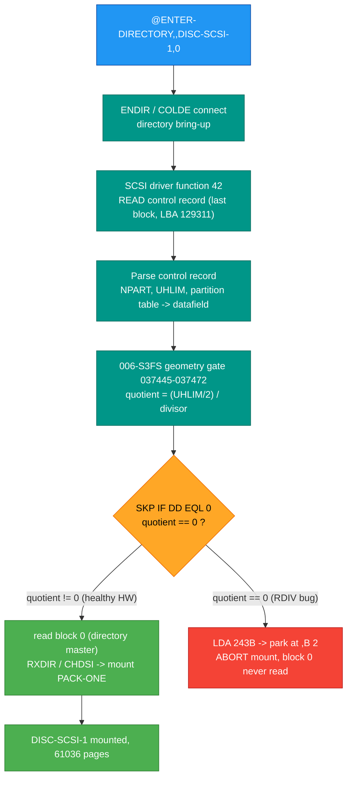
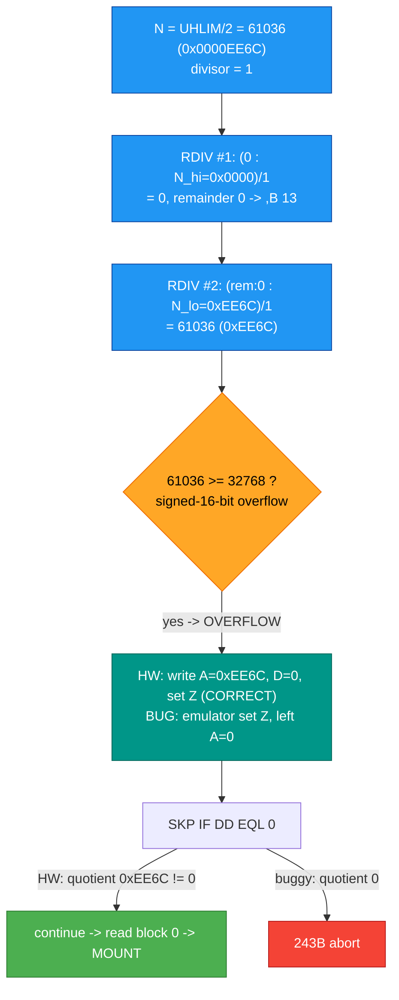

# SCSI ENTER-DIRECTORY - complete analysis, root cause, and fix

**Master reference** for the SINTRAN III (VSX/500 L07) SCSI `@ENTER-DIRECTORY`
mount path: the full carved flow, the last-block (control-record) decode, the
geometry routine with extracted pseudo-C, and the root-cause emulator bug that
blocked SCSI mounts - found, fixed, and VERIFIED LIVE 2026-07-14.

This document consolidates the deep reverse-engineering so it is not lost. It
supersedes the scattered working notes; companion docs are linked in
[section 11](#11-see-also--provenance).

---

## Evidence grading

- **VERIFIED** - proven from real disk bytes, carved L07 bytes, the live
  instruction+register trace, a microcode-emulator run, or fully determined
  arithmetic.
- **INFERRED** - strong reasoning from bytes + architecture, not one decisive
  source.
- **OPEN** - not settled by the material at hand; the closing check is named.

ND-100 addresses/values are **octal** (037445, 0111, 243B); runtime/load bases
are also shown in **hex** (0x3F25). SCSI LBAs, block counts, and disk-record
fields are **hex/decimal** as marked. 1 block = 1024 bytes; 1 ND page = 2048
bytes = 2 blocks (the "factor of 2" between pages and blocks).

---

## 0. TL;DR

- **Symptom:** `@ENTER-DIRECTORY,,DISC-SCSI-1,0` aborts with error **243B** (octal;
  = 0xA3 = 163 dec) **before block 0 is ever read**, so the SCSI disk never
  mounts. SMD / Winchester / floppy mount fine; the same SCSI disk can even BOOT
  SINTRAN - it only fails at ENTER-DIRECTORY.
- **Root cause:** an **emulator bug in the `RDIV` instruction**, not the disk. On
  a quotient overflow, RetroCore's `RDIV` early-returned WITHOUT writing the A/D
  result registers, leaving A stale (0). SINTRAN's mount geometry check then read
  a zero quotient and aborted with 243B.
- **Fix:** on overflow, set the Z error flag but ALWAYS write A = low 16 bits of
  the quotient and D = remainder (what real ND-100 hardware does). Applied to both
  the RetroCore (C#) and nd100x (C) emulators.
- **Proof:** after the fix the mount works. `@DIR` reports
  `DISC-SCSI-1 UNIT 0 ** 125 Mb ** : PACK-ONE ... OUT OF 61036 PAGES` - and 61036
  is exactly the quotient (`UHLIM/2`) that `RDIV` now writes. **VERIFIED LIVE.**

---

## 1. The symptom

| Fact | Grade |
|------|-------|
| `@ENTER-DIRECTORY,,DISC-SCSI-1,0` aborts with error 243B (octal) | VERIFIED (live) |
| The abort happens BEFORE block 0 (the directory master) is read | VERIFIED (trace: 0 block-0 reads) |
| SMD/Winchester/floppy mount correctly; only SCSI fails | VERIFIED (live + SMD baseline trace) |
| The same SCSI disk boots a full SINTRAN OS | VERIFIED (live) |
| The last-block read (LBA 129311) is the function-42 control-record connect, and is CORRECT/expected | VERIFIED |

**Important framing (do NOT regress):** the last-block read is the driver's
**function-42 control-record connect** to learn disk geometry. It is correct. It
is NOT "reading the last block expecting the directory master" and NOT a "geometry
probe" or "capacity leak". Block 0 simply was never reached because the 243B abort
fired first.

---

## 2. Full ENTER-DIRECTORY mount path



The bug turned node F down the red path (243B). With the RDIV fix, F takes the
green path and the disk mounts.

---

## 3. The control record (last block) decode

Read from `tor-disk.img` LBA **129311** (byte offset `0x07E47C00`), 32-bit values
big-endian on disk. This is the block the function-42 connect reads.

### 3.1 Header (16 bytes = 4 x 32-bit BE)

| Off | Word | Value | Name | Meaning | Grade |
|-----|------|-------|------|---------|-------|
| 0x00 | word[0] | 0x080054D9 | signature / NPART | high byte 0x08 read as NPART = 8 | VERIFIED value / OPEN meaning |
| 0x04 | word[1] | 0x80000000 | flags | bit 31 = table present | VERIFIED value / INFERRED meaning |
| 0x08 | word[2] | 0x00000000 | reserved | reserved | VERIFIED |
| 0x0C | word[3] | 0x0001DCD8 = **122072** | **UHLIM** | usable block count = 61036 pages x 2 (the load-bearing field) | **VERIFIED** |

### 3.2 Extent entries (12 bytes each = {flag, LBA, run})

| # | flag | LBA | run | Role |
|---|------|-----|-----|------|
| 0 | C0.. | 129311 | 1 | control-record block itself |
| 1 | C0.. | 129310 | 1 | parameter block |
| 2 | E0.. | 129309 | 1 | spare-pool extent |
| 3 | E0.. | 129289 | 20 | spare-pool extent |
| 4 | E0.. | 129269 | 20 | spare-pool extent |
| 5 | 00.. | - | - | null slot (skip) |
| 6 | E0.. | 129098 | 171 | spare-pool extent |

`C0..` = controller metadata; `E0..` = spare-pool. The six live extents tile
129098..129311 (214 blocks). Full field spec in
[scsi-disk-format.md](scsi-disk-format.md) section 4. Only the header UHLIM and a
partition/geometry field (which lands in datafield `,B 11`) feed the failing
geometry routine.

The divisor field `,B 11 = 0x0411` is real disk data: it is demand-paged from a
control-record buffer (buffer base 0xEFF8, word 0xF003 = 0x0411) and copied via
`MOVEW` into the mount datafield - NOT computed by the CPU. **VERIFIED** (trace
back-trace). It is correct data; not the fault.

---

## 4. The geometry routine (006-S3FS 037445-037472)

Disassembly source:
`tools/sintran-segment-carver/versions/L-VSX-500/re/segments-ref/006-S3FS/006-S3FS.asm`.
It runs at runtime **0x3F25** when the 006-S3FS overlay is mapped (beware: the
same low virtual address is shared by other overlays - only the instance at trace
lines 297260-297293 is this routine). `,B N` offsets are octal in the
disassembly, hex in the raw trace (`,B 11`=`$9,B`; `,B 17`=`$F,B`; `,B 20`=`$10,B`;
`,B 13`=`$B,B`; `,B 14`=`$C,B`).

### 4.1 Disassembly + executed values (VERIFIED from trace 297260-297287)

| Addr (oct) | Runtime | Mnemonic | Effect | Trace |
|-----------|---------|----------|--------|-------|
| 037445 | 0x3F25 | SAD ZIN SHR 1 | A:D := UHLIM>>1 : 0x0001DCD8 -> 0x0000EE6C (61036) | 297260 |
| 037446 | 0x3F26 | STD ,B 17 | store double 61036 (hi=,B17=0000, lo=,B20=EE6C) | 297261 |
| 037447 | 0x3F27 | LDA ,B 11 | A := geometry field = 0x0411 | 297262 |
| 037450 | 0x3F28 | AND 111 | A := 0x0411 AND 0111 = 0x0001 = divisor | 297263 |
| 037451 | 0x3F29 | COPY SA DT | T := A = 1 | 297264 |
| 037452 | 0x3F2A | JAF 2 | A != 0 -> jump, SKIP the fallback | 297265 |
| (037453 | 0x3F2B | SAT 10 | fallback T := 8 - skipped because A != 0) | - |
| 037454 | 0x3F2C | LDA ,B 17 | A := high word of 61036 = 0x0000 | 297266 |
| 037455 | 0x3F2D | COPY SA DD | D := 0x0000 | 297267 |
| 037456 | 0x3F2E | RCLR DA | A := 0 | 297268 |
| 037457 | 0x3F2F | RDIV ST | RDIV #1: (0:0)/1 = 0 | 297269 |
| 037460 | 0x3F30 | STA ,B 13 | q_high := 0 | 297270 |
| 037461 | 0x3F31 | LDA ,B 20 | A := low word = 0xEE6C | 297271 |
| 037462 | 0x3F32 | SWAP SD DA | A=EE6C,D=0000 -> A=0000,D=EE6C | 297272 |
| 037463 | 0x3F33 | RDIV ST | RDIV #2: dividend 0x0000EE6C=61036, /1=61036 >= 32768 -> OVERFLOW | 297273 |
| - | - | CPU log | "Z was set, now IID bit 7 (ERROR) is set"; quotient NOT written | 297274 |
| 037464 | 0x3F34 | STA ,B 14 | q_low := 0 (A never got the quotient - the bug) | 297275 |
| 037465 | 0x3F35 | LDD ,B 13 | A:D := ,B 13:,B 14 = 0x00000000 | 297277 |
| 037466 | 0x3F36 | JAF 5 | A == 0 -> no jump | 297279 |
| 037467 | 0x3F37 | SKP IF DD EQL 0 | A:D == 0 -> skip the continue -> error | 297281 |
| (037470 | 0x3F38 | continue | skipped) | - |
| 037471 | 0x3F39 | LDA 71 | A := 0x00A3 = 243B (error) | 297283 |
| 037472 | 0x3F3A | JMP 52 | -> STA ,B 2 : park 243B, abort mount | 297285-287 |

### 4.2 Extracted pseudo-C

Control flow is **VERIFIED** from bytes+trace; the semantic gloss (a usable-size /
geometry gate) is **INFERRED**.

```c
// 006-S3FS 037445-037472: usable-size / geometry gate for the SCSI mount.
// Computes (UHLIM/2)/divisor as a two-step 32-bit-by-16-bit long division;
// a ZERO quotient is treated as illegal geometry -> error 243B, abort mount.
uint32 N   = UHLIM >> 1;                     // 037445 SAD ZIN SHR 1  (122072>>1 = 61036)
store_double(df, /*,B*/017, N);              // 037446 STD ,B 17      (hi=,B17 lo=,B20)

word divisor = df[/*,B*/011] & 0111;         // 037447 LDA ,B 11 ; 037450 AND 111  (-> 1)
if (divisor == 0) divisor = 8;               // 037451 COPY SA DT ; 037452 JAF 2 ; 037453 SAT 10

// two-step long division: high word then (remainder:low word)
word q_hi = rdiv16(/*AD*/ 0,       N_hi(N), divisor);  // 037454-037460 RDIV #1 -> ,B 13
word q_lo = rdiv16(/*AD*/ rem_hi,  N_lo(N), divisor);  // 037461-037464 RDIV #2 -> ,B 14
                                             //   RDIV #2 overflows if divisor is too small
uint32 quotient = (q_hi << 16) | q_lo;       // 037465 LDD ,B 13

if (quotient == 0)                           // 037467 SKP IF DD EQL 0
    return park_error(243B);                 // 037471 LDA 71 -> STA ,B 2, abort (block 0 never read)

// else fall through: continue mount, read the directory master (block 0)
```

For this disk: `N = 61036`, `divisor = 1`, so the low step is `61036/1 = 61036`.
That quotient is >= 32768 and overflows a signed 16-bit `RDIV`. On correct
hardware the low 16 bits (0xEE6C = 61036) are still written, the quotient is
nonzero, and the mount proceeds. The bug was that the emulator did not write them.

---

## 5. Root cause: the RDIV overflow bug

### 5.1 What real ND-100 RDIV does on overflow (VERIFIED)

Microcode-emulator run of `RDIV ST` (opcode **141660**) with
`A=0, D=0xEE6C (167154 octal), T=1`:

- **A = 0xEE6C (61036)** - the low 16 bits of the quotient ARE written
- **D = 0** - remainder
- **STS = 010010 octal** - Z (overflow) set

So hardware, on a signed-16-bit overflow, **writes A (low 16 bits of quotient) and
D (remainder), THEN sets Z**. This matches the ND-100 Reference Manual
(`ND-06.014.2A`, RDIV): "if the division causes overflow, the error indicator Z is
set to one" plus "Affected: (A),(D)" - the manual never says A/D are left
untouched, and its timing table lists a distinct fast RDIV-overflow microcode
path.

### 5.2 The emulator bug

RetroCore `RDIV()` did:
```csharp
if (Math.Abs(result) >= 32768) { STS.Z = true; ...; return; }  // BUG: returns before writing A/D
regs.currentRegisters.A = (ushort)quotient;   // skipped on overflow -> A stays 0
regs.currentRegisters.D = (ushort)reminder;
```
On overflow it set Z and returned, leaving A at its stale value (0 from the earlier
`RCLR`). So `,B 14` got 0, the combined quotient read 0, `SKP IF DD EQL 0` diverted
to the 243B error, and the mount aborted before block 0.

### 5.3 The fix (applied to BOTH emulators)

On overflow: set Z (and trigger the IID interrupt) but ALWAYS fall through and
write `A = (ushort)quotient` and `D = (ushort)remainder`.

- RetroCore (C#): `E:\Dev\Repos\Ronny\RetroCore\Emulated.HW\ND\CPU\ND100\Instructions.RegisterOperations.cs`, `RDIV()` - builds clean, VERIFIED LIVE.
- nd100x (C, WSL): `~/repos/nd100x/src/cpu/cpu_instr.c`, `rdiv()` - same change, syntax-checks clean.

### 5.4 The divide-by-zero branch is CORRECT - do NOT change it

`RDIV` with divisor 0 is a SEPARATE branch. Microcode-emulator run of `RDIV ST`
with `A=0, D=0xEE6C, T=0`: **A/D/T unchanged, STS=010010 (Z set)**. The emulator
already does exactly this (early-return, leave A/D, set Z). So the divide-by-zero
early-return is right and must stay. **VERIFIED.**

### 5.5 Why the disk data was never the problem

`UHLIM = 122072` (= directory pages x 2), `,B 11 = 0x0411` (masked divisor 1), and
divisor 1 are all correct. Divisor 1 is a value the routine handles fine on correct
hardware (61036 is a nonzero quotient). No byte-order issue, no disk change needed.

---

## 6. Proof it works (VERIFIED LIVE 2026-07-14)

```
@ENTER-DIRECTORY,,DISC-SCSI-1,0
@DIR
DIR INDEX 0 : DISC-SCSI-1 UNIT 0 ** 125 Mb ** : PACK-ONE
      (MAIN AND DEFAULT DIRECTORY)
      3075 PAGES UNRESERVED AND 10164 PAGES UNUSED OUT OF 61036 PAGES
      MAXIMUM UNUSED CONTIGUOUS AREA ON DIRECTORY 4595 PAGES
```

`61036 PAGES` = `UHLIM/2` = exactly the quotient `RDIV` now writes. The gate at
037467 passes, block 0 is read, and PACK-ONE mounts. Closure confirmed.

---

## 7. Carve map (the kernel stages behind the flow)

Each stage was carved to .ASM + .pseudo.c + README under
`../../../tools/sintran-segment-carver/versions/L-VSX-500/re/kernel-carving/`.

| Stage | Role in the mount |
|-------|-------------------|
| [ENTER-DIRECTORY](../../../tools/sintran-segment-carver/versions/L-VSX-500/re/kernel-carving/ENTER-DIRECTORY) | top-level directory enter/mount entry |
| [COLDE-CONNECT](../../../tools/sintran-segment-carver/versions/L-VSX-500/re/kernel-carving/COLDE-CONNECT) | cold directory connect |
| [ENDIR-COMPLETE](../../../tools/sintran-segment-carver/versions/L-VSX-500/re/kernel-carving/ENDIR-COMPLETE) | ENDIR mount flow |
| [CHDSI-COMPLETE](../../../tools/sintran-segment-carver/versions/L-VSX-500/re/kernel-carving/CHDSI-COMPLETE) | change/check directory state |
| [RXDIR-CACHE-COMPLETE](../../../tools/sintran-segment-carver/versions/L-VSX-500/re/kernel-carving/RXDIR-CACHE-COMPLETE) | directory-block read/cache (block 0) |
| [NAMEWALK-COMPLETE](../../../tools/sintran-segment-carver/versions/L-VSX-500/re/kernel-carving/NAMEWALK-COMPLETE) | directory name walk |
| [SCSI-DISKLAYER-COMPLETE](../../../tools/sintran-segment-carver/versions/L-VSX-500/re/kernel-carving/SCSI-DISKLAYER-COMPLETE) | SCSI disk layer |
| [SCSI-DRIVER-COMPLETE](../../../tools/sintran-segment-carver/versions/L-VSX-500/re/kernel-carving/SCSI-DRIVER-COMPLETE) | SCSI driver |
| [FUNCTION-42-RETURN](../../../tools/sintran-segment-carver/versions/L-VSX-500/re/kernel-carving/FUNCTION-42-RETURN) | function-42 control-record connect return |
| [SCSDISK-TRANSFER](../../../tools/sintran-segment-carver/versions/L-VSX-500/re/kernel-carving/SCSDISK-TRANSFER) | SCSI disk transfer |
| [RCBLO](../../../tools/sintran-segment-carver/versions/L-VSX-500/re/kernel-carving/RCBLO) | read control block |
| [PRSRV-124B](../../../tools/sintran-segment-carver/versions/L-VSX-500/re/kernel-carving/PRSRV-124B) | reserve (MON 124) path |
| [RESERVE-LEAV2-ERRORS-COMPLETE](../../../tools/sintran-segment-carver/versions/L-VSX-500/re/kernel-carving/RESERVE-LEAV2-ERRORS-COMPLETE) | reserve/leave error paths |
| [SMD-DRIVER-BASELINE](../../../tools/sintran-segment-carver/versions/L-VSX-500/re/kernel-carving/SMD-DRIVER-BASELINE) | SMD baseline (the working oracle) |

---

## 8. The two-step RDIV, visualized



---

## 9. Related emulator note: DNZ - a 32-bit-vs-48-bit mismatch, NOT a production bug

An audit of the whole ND-100 instruction set for the RDIV bug class (error path
sets a flag and returns without writing a documented destination register) found
the CPU otherwise clean - FDV and MPY are provably correct. DNZ was investigated
and initially looked like a candidate, but the comparison turned out to be
apples-to-oranges:

- The DNZ candidate came from comparing RetroCore's **32-bit FP (FPP32) branch**
  against the **ND-120 microcode emulator**, which is a **32-bit FP** CPU
  (ROM ND-120-DELILAH-L). Reference:
  `E:\Dev\Repos\Ronny\ND120CPUEMU\ND120CPU\docs\DNZ_152375_TRACE.md`. That trace
  (opcode 152375, A=040370 octal, D=001064 octal, STS=0) ends at
  **A=000403, D=172016, Z=1** (the microcode does 6 mantissa right-shifts, then
  packs A and D). The trace doc explicitly notes "no FPP32 mode flag exists in this
  emulator" - the ND-120 simply runs this microcode.
- **But nd100x and RetroCore emulate the ND-100 in 48-bit FP** (the production
  path; this is what SINTRAN and the SCSI mount use). The 32-bit ND-120 result is
  therefore NOT the correct oracle for the 48-bit DNZ, and the emulators must NOT
  be changed to output 000403/172016 - that would make a 48-bit CPU emit 32-bit
  results.
- **Conclusion:** there is NO production DNZ bug demonstrated here. The 48-bit DNZ
  path was never actually compared. RetroCore's FPP32 branch may be latently wrong
  (it gives A=0 where the 32-bit ND-120 microcode gives 000403), but it is off the
  48-bit production path and must be validated against a 32-bit oracle only, never
  reconciled to 48-bit. **OPEN (separate, low priority):** the correctness of the
  48-bit DNZ path is not settled by the 32-bit trace and would need a 48-bit
  reference. Unlike RDIV, this is NOT on the disk-mount critical path.

---

## 10. VERIFIED / INFERRED / OPEN summary

| Claim | Grade |
|-------|-------|
| ENTER-DIRECTORY on SCSI aborts 243B before block 0 | VERIFIED (live + trace) |
| UHLIM = 0x0001DCD8 = 122072 (control-record word[3]) | VERIFIED (dd + trace) |
| Geometry routine 037445-037472 runs at 0x3F25, trace 297260-297287 | VERIFIED (trace) |
| N = UHLIM>>1 = 61036; divisor = (,B 11=0x0411)&0111 = 1 | VERIFIED (trace) |
| ,B 11 = 0x0411 is demand-paged disk data, not computed | VERIFIED (trace back-trace) |
| RDIV #2 (61036/1) overflows (61036 >= 32768) | VERIFIED (trace + arithmetic) |
| Real RDIV on overflow writes A=low16 quotient + D=remainder, sets Z | VERIFIED (microcode: A=0xEE6C, D=0, STS=010010) |
| Emulator RDIV early-returned on overflow without writing A/D (the bug) | VERIFIED (trace + code) |
| Fix applied to RetroCore + nd100x; mount works | VERIFIED LIVE (@DIR, 61036 pages) |
| RDIV divide-by-zero branch leaves A/D unchanged + sets Z (emulator correct) | VERIFIED (microcode) |
| Semantic purpose of the routine (usable-size/geometry gate) | INFERRED |
| DNZ candidate is a 32-bit(ND-120)-vs-48-bit(ND-100) mismatch, NOT a production bug | VERIFIED (do not reconcile 48-bit to 32-bit) |

---

## 11. See also / provenance

- Control-record decode + mount math + root cause: [scsi-control-record-and-mount-math.md](scsi-control-record-and-mount-math.md)
- Last-block physical field spec + parameter block: [scsi-disk-format.md](scsi-disk-format.md)
- Control-record connect + raw-vs-usable reconcile: [../../Filesystem/code-logic/scsi-mount-geometry.md](../../Filesystem/code-logic/scsi-mount-geometry.md)
- Debug journey + DAP/trace tooling + L07 address table: [SCSI-MOUNT-DEBUG-HANDOFF.md](SCSI-MOUNT-DEBUG-HANDOFF.md)
- Carves: `../../../tools/sintran-segment-carver/versions/L-VSX-500/re/kernel-carving/`
- Geometry routine disassembly: `../../../tools/sintran-segment-carver/versions/L-VSX-500/re/segments-ref/006-S3FS/006-S3FS.asm`
- Live instruction+register trace: `C:\Users\ronny\AppData\Local\trace\file-trace.txt` (lines 297260-297293)
- Disk image: `E:\Dev\Ronny\RetroFS\demo\test-images\ndfs\tor-disk.img`
- ND-100 RDIV manual reference: `Reference-Manuals\ND-06.014.2A EN ND-100 Reference Manual.md` (RDIV section)
- Emulator fixes: RetroCore `Emulated.HW\ND\CPU\ND100\Instructions.RegisterOperations.cs` (RDIV); nd100x `~/repos/nd100x/src/cpu/cpu_instr.c` (rdiv)

---

**Status:** SCSI ENTER-DIRECTORY root cause CLOSED and VERIFIED LIVE 2026-07-14.
Last updated 2026-07-14.
