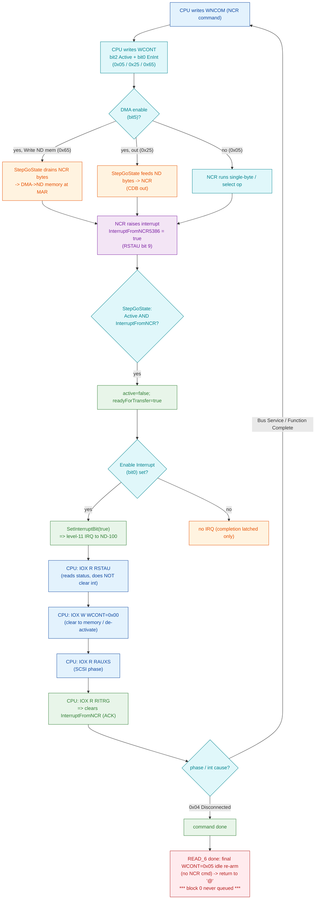

# SCSI IOX Transaction Log - `@ENTER-DIRECTORY,,DISC-SCSI-1,0`

Full device-side walkthrough of one mount transaction between the SINTRAN ND-100 CPU
and the emulated ND-3201 SCSI controller (which wraps an NCR 5386 SCSI protocol chip),
reconstructed byte-for-byte from a captured RetroCore trace.

## Provenance and scope

- **Trace (ground truth, device-side only):**
  `/mnt/c/Users/ronny/AppData/Local/trace/file-trace.txt`, mount transaction at wall-clock
  `20:33:47` (trace lines 157-1907). This file has **no `Opcodes;` CPU lines** (verified) - it is
  device-side only. Every IOX/DMA/interrupt fact below is read directly from those trace bytes and
  tagged **VERIFIED**. CPU-side *intent* is tagged **INFERRED** and attributed to the C# controller
  behavior or the reverse-engineering docs.
- **Controller register + control/status decode (C#):**
  `/mnt/e/Dev/Repos/Ronny/RetroCore/Emulated.HW/ND/CPU/NDBUS/NDBusDiscControllerSCSI.cs`
  (the `Register` enum, the `case Register.RSTAU:` status assembler at lines ~874-946, and the
  `case Register.WCONT:` control-word handler at lines ~1064-1176).
- **NCR 5386 command / interrupt / auxiliary-status decode (C#):**
  `/mnt/e/Dev/Repos/Ronny/RetroCore/Emulated.HW/NCR/SCSI/NCR5386/Enums.cs`,
  `NCR5386SCSI.CommandHandling.cs`, `NCR5386SCSI.StateHandling.cs`.
- **Disk target CDB handling (C#):**
  `/mnt/e/Dev/Repos/Ronny/RetroCore/Emulated.HW/Common/SCSI/SCSIHDD.cs`,
  `SCSIHDDMicropolis.cs`.
- **Related repo docs (relative links):** [nd-scsi-3201.md](nd-scsi-3201.md) (register docs),
  [scsi-transfer-status.md](scsi-transfer-status.md) (RSTAU gate),
  [SCSI-TRACE-HOWTO.md](SCSI-TRACE-HOWTO.md) (what a healthy transaction looks like),
  [SCSI-MOUNT-DEBUG-HANDOFF.md](SCSI-MOUNT-DEBUG-HANDOFF.md) (current bug state, sections 6b/7b),
  [scsi-open-last-block-read.md](scsi-open-last-block-read.md),
  [scsi-mount-geometry.md](scsi-mount-geometry.md).

**One-line result of the run (VERIFIED):** the mount is **not a hang**. SINTRAN issues exactly
three SCSI commands - `INQUIRY`, `READ CAPACITY`, `READ_6 lba=129311` (the LAST block) - the last
one DMAs 1024 bytes cleanly into ND memory, an interrupt is raised and acked, and the console
returns to `@` at `20:33:47.178`. **Block 0 is never read. No WRITE CDB is ever issued.** All 24
device interrupts in the transaction are delivered and acknowledged - there is **no dropped IRQ**.

---

## 1. Overview - how the ND-100 drives this SCSI controller over IOX

### 1.1 Address / interrupt basics (VERIFIED from C# constructor)

For SCSI Bus 1 (thumbwheel TW2=0) the controller answers at **IOX base 144300 (octal)**, IDENT
code **140440 (octal)**, logical device **2202**, on **interrupt level 11** (the disk output
channel). Each `reg=` name in the trace is an IOX offset added to that base. ND-100 memory and I/O
are **word-addressed, 16 bits wide**; the DMA Memory Address Register (MAR) below counts **words**,
not bytes (it advances by 1 per 16-bit word moved).

### 1.2 Controller register map (VERIFIED from the `Register` enum)

Offsets are octal (as the SINTRAN NPL driver uses them); the absolute IOX is `144300 + offset`.
"Wraps NCR" means the controller forwards the access straight to the NCR 5386 chip register.

| Off (oct) | IOX (oct) | Name | R/W | Purpose |
|--|--|--|--|--|
| 00 | 144300 | RLMAR | R | Read DMA Memory Address Register bits 0-15 (LSB word) |
| 01 | 144301 | WLMAR | W | Write MAR bits 0-15 |
| 02 | 144302 | REDAT | R | Read PIO data buffer (non-DMA path) |
| 03 | 144303 | WRDAT | W | Write PIO data buffer (non-DMA path) |
| 04 | 144304 | RSTAU | R | Read controller STATUS word (see 1.4) |
| 05 | 144305 | WCONT | W | Write CONTROL word (see 1.3) |
| 06 | 144306 | RHMAR | R | Read MAR bits 16-23 (MSB) |
| 07 | 144307 | WHMAR | W | Write MAR bits 16-23 |
| 040 | 144340 | RNDAT | R | Wraps NCR: read Data register (1 byte) |
| 041 | 144341 | WNDAT | W | Wraps NCR: write Data register (1 byte) |
| 042 | 144342 | RNCOM | R | Wraps NCR: read Command register |
| 043 | 144343 | WNCOM | W | Wraps NCR: write Command register (executes the command) |
| 044 | 144344 | RNCNT | R | Wraps NCR: read Control register |
| 045 | 144345 | WNCNT | W | Wraps NCR: write Control register |
| 046 | 144346 | RDESI | R | Wraps NCR: read Destination ID |
| 047 | 144347 | WDESI | W | Wraps NCR: write Destination ID |
| 050 | 144350 | RAUXS | R | Wraps NCR: read Auxiliary Status (phase + flags) |
| 051 | 144351 | WAUXS | W | Wraps NCR: write Auxiliary Status |
| 052 | 144352 | ROIDN | R | Wraps NCR: read Own ID |
| 053 | 144353 | WOIDN | W | Wraps NCR: write Own ID |
| 054 | 144354 | RITRG | R | Wraps NCR: read Interrupt register **and ack the NCR interrupt** |
| 056 | 144356 | RSOUI | R | Wraps NCR: read Source ID |
| 062 | 144362 | RDIST | R | Wraps NCR: read Diagnostic Status |
| 070 | 144370 | RTCM | R | Wraps NCR: read Transfer Counter MSB |
| 071 | 144371 | WTCM | W | Wraps NCR: write Transfer Counter MSB |
| 072 | 144372 | RTC2 | R | Wraps NCR: read Transfer Counter middle byte |
| 073 | 144373 | WTC2 | W | Wraps NCR: write Transfer Counter middle byte |
| 074 | 144374 | RTCL | R | Wraps NCR: read Transfer Counter LSB |
| 075 | 144375 | WTCL | W | Wraps NCR: write Transfer Counter LSB |

(`RXWC`/`RXWC_HI` at 010/012 are 3204-only external word-count reads and do not appear in this
3201 trace.)

### 1.3 Control word (`WCONT`) bit map (VERIFIED from the `WCONT` handler)

| Bit | Mask | Meaning |
|--|--|--|
| 0 | 0x0001 | **Enable Interrupt** - controller interrupts level 11 as soon as it is ready (not busy) |
| 2 | 0x0004 | **Activate** - start the operation whose NCR command was just written |
| 3 | 0x0008 | Test mode (count-address-registers self test) |
| 4 | 0x0010 | Clear Device - resets MAR/buffers, calls `ncr5386.DeviceReset()`, sets ReadyForTransfer |
| 5 | 0x0020 | **ND-100 DMA enable** - allow DMA to/from ND memory |
| 6 | 0x0040 | **Write ND-100 Memory** - DMA direction = NCR -> ND memory (data-in). Clear = ND -> NCR (out) |
| 10 | 0x0400 | Reset SCSI bus |

Control words actually seen in this transaction:

| Value | Decode | Role in the flow |
|--|--|--|
| `0x0000` | (all clear) | de-activate + "clear to memory" - the interrupt-handler entry step |
| `0x0005` | Enable Int + Activate | fire the NCR command and arm the completion IRQ |
| `0x0020` | DMA enable | arm MAR/counter for a **command-out** DMA (ND -> NCR), not yet active |
| `0x0025` | Enable Int + Activate + DMA enable | run the command-out DMA (CDB bytes ND -> NCR) |
| `0x0060` | DMA enable + Write ND mem | arm MAR/counter for a **data-in** DMA (NCR -> ND) |
| `0x0065` | Enable Int + Activate + DMA enable + Write ND mem | run the data-in DMA (NCR -> ND memory) |

### 1.4 Status word (`RSTAU`) bit map (VERIFIED from the `RSTAU` assembler)

| Bit | Mask | Meaning | Notes |
|--|--|--|--|
| 0 | 0x0001 | Enable Interrupt (echo of control bit 0) | |
| 2 | 0x0004 | Busy / Active | |
| 3 | 0x0008 | Ready for transfer | |
| 4 | 0x0010 | OR of errors (ND-100 bus DMA error) | never set in the emulator |
| 5 | 0x0020 | Reset on SCSI bus | (*) can raise IRQ |
| 6 | 0x0040 | NCR 5386 disabled | |
| 7 | 0x0080 | Single-ended SCSI driver selected | |
| 8 | 0x0100 | Data request from NCR 5386 | |
| 9 | 0x0200 | **Interrupt from NCR 5386** | (*) can raise IRQ |
| 10 | 0x0400 | Data acknowledge to NCR 5386 | |
| 11 | 0x0800 | BERROR (ND-100 bus DMA error) | never set in the emulator |
| 12 | 0x1000 | BSY from the SCSI bus | |
| 13 | 0x2000 | REQ from the SCSI bus | |
| 14 | 0x4000 | ACK from the SCSI bus | |
| 15 | 0x8000 | Differential SCSI receivers selected | never set in the emulator |

(*) These two bits raise a level-11 interrupt to the ND-100 **only if control bit 0 (Enable
Interrupt) is set.** Status values seen this run: `0x3208` (RFT+IntFromNCR+BSY+REQ), `0x5208`
(RFT+IntFromNCR+BSY+ACK), `0x0208` (RFT+IntFromNCR). **Bit 4 is never set** - the stale
`STATUS 100020` error described in [scsi-transfer-status.md](scsi-transfer-status.md) does not occur
in this build (VERIFIED: every RSTAU read is `0x0208`/`0x3208`/`0x5208`).

### 1.5 How DMA to ND memory works (VERIFIED from `WriteNextByteDMA`/`ReadNextByteDMA`/`StepGoState`)

1. SINTRAN writes the 24-bit target word address into **`WHMAR`** (bits 16-23) and **`WLMAR`**
   (bits 0-15). Combined they form `MAR`.
2. It loads the **NCR transfer counter** via `WTCM`/`WTC2`/`WTCL` with the byte count.
3. It writes the NCR **`WNCOM`** command `0x94` = `TransferInfo | DMA-Mode`.
4. It writes **`WCONT`** with DMA enable set: `0x0025` for a command/data-**out** transfer
   (`WriteNDMemory` clear -> bytes read from ND memory and fed to the NCR), or `0x0065` for a
   data-**in** transfer (`WriteNDMemory` set -> NCR bytes written to ND memory).
5. While `Active` and `DMAEnable`, `StepGoState` drains all pending NCR bytes. On a data-in
   transfer each byte is packed into 16-bit words (`WriteNextByteDMA`) and `MAR` advances by 1 word
   per 2 bytes. The trace prints one `DMA->ND xfer` line per byte for the data-in direction only;
   the command/data-out direction (ND -> NCR) is **not** logged byte-by-byte (INFERRED direction
   from the `WriteNDMemory` bit being clear; the resulting CDB is confirmed by the disk's `CDB op=`
   decode).

### 1.6 How completion is signaled (VERIFIED from `Ncr5386_OnInterrupt` + `StepGoState` + `RITRG`)

- When the NCR 5386 finishes a command it calls back and sets `regs.InterruptFromNCR5386 = true`
  (trace: `NCR interrupt raised intr=0x01`). This sets **RSTAU bit 9**.
- On the next `Clock` while `Active`, `StepGoState` sees `InterruptFromNCR5386`, sets
  `active=false`, `readyForTransfer=true`, and - **if control bit 0 (Enable Interrupt) is set** -
  calls `SetInterruptBit(true)`, i.e. raises the level-11 IRQ (trace:
  `completion: active->false rft->true intEnabled=True -> SetInterruptBit`).
- The ND-100 interrupt handler reads **`RSTAU`** to see why. **A `RSTAU` read deliberately does NOT
  clear the NCR interrupt** (comment in the C#: clearing there drops the completion IRQ and causes
  a mount timeout loop; see [SCSI-MOUNT-FIX-PLAN.md]-referenced fix #1). The interrupt is instead
  acknowledged when the handler reads **`RITRG`** (`RITRG ack: cleared intFromNCR`), which clears
  RSTAU bit 9.

---

## 2. The transaction at a glance

**Console reconstruction (VERIFIED from `CONOUT` lines):**
`@ENTER-DIRECTORY,,DISC-SCSI-1,0` typed -> device transaction 20:33:47.119-.178 ->
`@` prompt returns at 20:33:47.178. The later `stop-system` + `WAIT with IONI off` was the
operator typing `@stop-system`, not a driver deadlock.

**Three SCSI commands, structurally identical handshakes:**

| # | NCR select | CDB (op) | data-in | to MAR (word) | result |
|--|--|--|--|--|--|
| 1 | SelectWithATN dev 0 | `0x12` INQUIRY, alloc 8 | 8 bytes | `0x0094B8` | `00 00 05 01 34 00 00 00` |
| 2 | SelectWithATN dev 0 | `0x25` READ CAPACITY | 8 bytes | `0x0094B8` | `00 01 F9 1F 00 00 04 00` |
| 3 | SelectWithATN dev 0 | `0x08` READ_6 lba=129311, 1 blk | 1024 bytes | `0x04C600` | block `08 00 54 D9 80 ...` |

Note the READ CAPACITY op is printed as `SC_GET_WINDOW` by the disk's CDB decoder - that label is
**cosmetic**; the code path handles `0x25` as READ CAPACITY (VERIFIED: line 500 `command READ
CAPACITY`, line 501 `READ CAPACITY -> blockSize=1024 lastLBA=129311`).

**Aggregate counts (VERIFIED by grep over the trace):**

| Metric | Count |
|--|--|
| IOX writes (`IOX W`) | 126 |
| IOX reads (`IOX R`) | 90 |
| **Distinct IOX accesses total** | **216** |
| CDBs issued | 3 (INQUIRY, READ CAPACITY, READ_6) |
| NCR commands (`WNCOM`) | 21 (3x SelectWithATN, 15x TransferInfo, 3x MessageAccepted) |
| NCR interrupts raised | 24 |
| Controller completions (`SetInterruptBit`) | 24 |
| RITRG acks | 24 |
| DMA->ND data-in bytes logged | 1040 (8 + 8 + 1024) |

The 24/24/24 balance is the key interrupt-health fact: **every NCR interrupt produced exactly one
controller completion and exactly one RITRG ack. Nothing is dropped.**

### 2.1 The canonical per-command handshake (INFERRED CPU intent from the NCR/NPL sequence)

Each of the three commands walks the same SCSI initiator sequence. Reading the ordered ledger in
section 4, one command expands to:

```
  WDESI=0             ; target id 0
  WTCM/WTC2/WTCL      ; select timeout into NCR transfer counter (0x0000C8)
  WNCOM=0x08          ; SelectWithATN   -> NCR raises IRQ (selection won)
  WCONT=0x05          ; Enable Int + Activate -> completion IRQ to ND-100
  --- interrupt handler (repeats after every step) ---
  RSTAU               ; why did we interrupt?  (bit 9 = NCR int; does NOT clear it)
  WCONT=0x00          ; "clear to memory" / de-activate
  RAUXS               ; SCSI phase (MessageOut / Command / DataIn / Status / MessageIn)
  RITRG               ; read NCR interrupt cause AND acknowledge it
  ... dispatch on phase ...
  WNDAT=0xC0          ; MessageOut phase: send IDENTIFY byte 0xC0 (single-byte TransferInfo 0x54)
  WLMAR/WHMAR/WTCL, WNCOM=0x94, WCONT=0x25   ; Command phase: DMA the 6-byte CDB OUT (ND->NCR)
  WLMAR/WHMAR/WTCL, WNCOM=0x94, WCONT=0x65   ; DataIn phase: DMA the reply IN (NCR->ND)
  RAUXS=0x1A (Status, TC=0), RNDAT           ; Status phase: read 1 status byte (SS_GOOD=0x00)
  RAUXS=0x38 (MessageIn), RNDAT              ; MessageIn: read COMMAND COMPLETE message (0x00)
  WNCOM=0x04 (MessageAccepted)               ; ack the message
  RITRG=0x04 [Disconnected]                  ; target drops the bus -> command done
```

This mirrors the `SCINT` interrupt handler and `SELEC` routine in the SINTRAN NPL SCSI driver
(embedded as reference text inside `NDBusDiscControllerSCSI.cs`): `SCINT` reads `RSTAU`, checks
bit 2 (busy) and bit 11 (NCR int), writes 0 to `WCONT` ("CLEAR TO MEMORY"), reads `RAUXS`, reads
`RITRG`, then dispatches; `SELEC` ends with `5; WCONT` ("ENABLE INTERRUPT").

---

## 3. The three commands narrated

### 3.1 Command 1 - INQUIRY (trace 160-400)

SINTRAN selects target 0 with ATN (`WNCOM=0x08`), sends the IDENTIFY message byte `0xC0` in the
MessageOut phase, then DMAs a 6-byte INQUIRY CDB out of ND word buffer `0x9480` (`WLMAR=0x9480`,
`WTCL=0x0C`, `WCONT=0x25`). The disk logs `CDB op=0x12 (SC_INQUIRY) cdb=00,00,00,08,00`
(allocation length 8). The 8-byte reply DMAs **in** to word buffer `0x94B8` (`WCONT=0x65`):
observed byte stream `00 00 05 01 34 00 00 00` (VERIFIED from the eight `DMA->ND` lines). A Status
byte (`SS_GOOD` = `0x00`) and a COMMAND COMPLETE message (`0x00`) are read one byte at a time via
`RNDAT`, `MessageAccepted` is written, and the target disconnects (`RITRG=0x04 [Disconnected]`).

### 3.2 Command 2 - READ CAPACITY (trace 401-645)

Identical handshake. The CDB DMAs out of `0x9480` again; the disk logs
`CDB op=0x25 (SC_GET_WINDOW)` but executes **READ CAPACITY**, replying
`READ CAPACITY -> blockSize=1024 lastLBA=129311 capacityBytes=132415488`. The 8-byte reply DMAs
**in** to the same scratch word buffer `0x94B8`: observed `00 01 F9 1F 00 00 04 00` (VERIFIED),
which decodes as **last LBA = 0x0001F91F = 129311** and **block length = 0x00000400 = 1024 bytes**.
This 8-byte reply is the only device-supplied geometry input to what happens next.

### 3.3 Command 3 - READ_6 of the LAST block (trace 646-1907)

Same select/IDENTIFY/command handshake. The CDB this time is
`CDB op=0x08 (SC_READ_6) cdb=01,F9,1F,01,00`, decoded by the disk as
`lba=129311 blocks=1 len=1024`. **The LBA `0x01F91F` = 129311 is exactly the `lastLBA` that READ
CAPACITY just returned** - SINTRAN reads the *last* block of the device, not block 0
(INFERRED: the driver copies the READ-CAPACITY last-LBA straight into the READ_6 CDB; consistent
with [scsi-open-last-block-read.md](scsi-open-last-block-read.md) and
[scsi-mount-geometry.md](scsi-mount-geometry.md), which call this the control-record read (function-42 connect), not a capacity
leak). `readBlock lba=129311` returns `08 00 54 D9 80 00 00 00 ... 01 F9 1F ...` (the checksummed
area/layout table). This 1024-byte block DMAs **in** to word address `0x04C600`
(`WHMAR=0x0004`, `WLMAR=0xC600`, `WTC2=0x0004`, `WTCL=0x0400` = 1024 bytes). MAR advances from
`0x04C600` to `0x04C800` (512 words) across the burst (VERIFIED from the 1024 `DMA->ND` lines).
Status `SS_GOOD`, COMMAND COMPLETE, `MessageAccepted`, Disconnect - then **one final
`WCONT=0x0005`** (Enable Interrupt + Activate) at trace line 1907, with no NCR command behind it
and no further activity. The console returns to `@`.

---

## 4. The full chronological IOX ledger

Every distinct IOX access, NCR command, phase read, interrupt, ack, CDB and DMA event in the
transaction, in trace order, grouped by command. `trc` is the line number in the trace file.
Values are as printed by the emulator (hex for register values, NCR command/phase decodes verbatim).

> The command-out DMA bursts (6-byte CDB, ND -> NCR) do not appear as `DMA->ND` lines because that
> trace only fires on the NCR -> ND direction; they are represented here by the `CDB op=` event the
> disk logs when it receives the CDB. The 8-byte and 1024-byte **data-in** bursts are collapsed to a
> single summary row each (individual per-byte `DMA->ND` lines omitted for readability; byte streams
> are given in section 3).

### 4.1 Command 1 - INQUIRY

| # | trc | event | detail |
|--|--|--|--|
| 1 | 160 | IOX W | WCONT=0x0000 (clear to memory) |
| 2 | 162 | IOX W | WDESI=0x0000 (target id 0) |
| 3 | 164 | IOX W | WTCM=0x0000 |
| 4 | 166 | IOX W | WTC2=0x0000 |
| 5 | 168 | IOX W | WTCL=0x00C8 (select timeout counter) |
| 6 | 170 | IOX W | WNCOM=0x0008 |
| 7 | 172 | NCR CMD | 0x08 SelectWithATN |
| 8 | 173 | exec | SelectWithATN |
| 9 | 176 | NCR IRQ | intr=0x01 |
| 10 | 177 | IOX W | WCONT=0x0005 (Enable Int + Activate) |
| 11 | 180 | completion | SetInterruptBit |
| 12 | 182 | IOX R | RSTAU=0x3208 (RFT+IntFromNCR+BSY+REQ) |
| 13 | 183 | IOX W | WCONT=0x0000 |
| 14 | 185 | RAUXS | 0x30 Phase 6 MessageOut |
| 15 | 187 | IOX R | RAUXS=0x0030 |
| 16 | 188 | INT reg | 0x01 Function Complete |
| 17 | 191 | RITRG ack | intreg=0x0001 |
| 18 | 192 | IOX R | RITRG=0x0001 |
| 19 | 195 | NCR IRQ | intr=0x01 |
| 20 | 196 | IOX W | WCONT=0x0005 |
| 21 | 199 | completion | SetInterruptBit |
| 22 | 201 | IOX R | RSTAU=0x3208 |
| 23 | 202 | IOX W | WCONT=0x0000 |
| 24 | 204 | RAUXS | 0x30 Phase 6 MessageOut |
| 25 | 206 | IOX R | RAUXS=0x0030 |
| 26 | 207 | INT reg | 0x02 Bus Service |
| 27 | 210 | RITRG ack | intreg=0x0002 |
| 28 | 211 | IOX R | RITRG=0x0002 |
| 29 | 212 | IOX W | WNCOM=0x0054 |
| 30 | 214 | NCR CMD | 0x54 TransferInfo (single-byte) |
| 31 | 215 | exec | TransferInfo |
| 32 | 217 | IOX W | WNDAT=0x00C0 (IDENTIFY byte out) |
| 33 | 221 | NCR IRQ | intr=0x01 |
| 34 | 222 | IOX W | WCONT=0x0005 |
| 35 | 225 | completion | SetInterruptBit |
| 36 | 227 | IOX R | RSTAU=0x3208 |
| 37 | 228 | IOX W | WCONT=0x0000 |
| 38 | 230 | RAUXS | 0x10 Phase 2 Command |
| 39 | 232 | IOX R | RAUXS=0x0010 |
| 40 | 233 | INT reg | 0x02 Bus Service |
| 41 | 236 | RITRG ack | intreg=0x0002 |
| 42 | 237 | IOX R | RITRG=0x0002 |
| 43 | 238 | IOX W | WCONT=0x0020 (DMA enable, arm out) |
| 44 | 240 | IOX W | WHMAR=0x0000 |
| 45 | 241 | IOX W | WLMAR=0x9480 (CDB-out buffer, word) |
| 46 | 242 | IOX W | WTCM=0x0000 |
| 47 | 244 | IOX W | WTC2=0x0000 |
| 48 | 246 | IOX W | WTCL=0x000C (12 = CDB buffer size) |
| 49 | 248 | IOX W | WNCOM=0x0094 |
| 50 | 250 | NCR CMD | 0x94 TransferInfo (DMA mode) |
| 51 | 251 | exec | TransferInfo |
| 52 | 253 | IOX W | WCONT=0x0025 (Activate + DMA out) |
| 53 | 257 | CDB | op=0x12 SC_INQUIRY cdb=00,00,00,08,00 (alloc 8) |
| 54 | 264 | NCR IRQ | intr=0x01 |
| 55 | 265 | completion | SetInterruptBit |
| 56 | 267 | IOX R | RSTAU=0x3208 |
| 57 | 268 | IOX W | WCONT=0x0000 |
| 58 | 270 | RAUXS | 0x08 Phase 1 DataIn |
| 59 | 272 | IOX R | RAUXS=0x0008 |
| 60 | 273 | INT reg | 0x02 Bus Service |
| 61 | 276 | RITRG ack | intreg=0x0002 |
| 62 | 277 | IOX R | RITRG=0x0002 |
| 63 | 278 | IOX W | WCONT=0x0060 (DMA + Write ND mem, arm in) |
| 64 | 280 | IOX W | WHMAR=0x0000 |
| 65 | 281 | IOX W | WLMAR=0x94B8 (reply buffer, word) |
| 66 | 282 | IOX W | WTCM=0x0000 |
| 67 | 284 | IOX W | WTC2=0x0000 |
| 68 | 286 | IOX W | WTCL=0x0008 (8 bytes) |
| 69 | 288 | IOX W | WNCOM=0x0094 |
| 70 | 290 | NCR CMD | 0x94 TransferInfo (DMA mode) |
| 71 | 291 | exec | TransferInfo |
| 72 | 293 | IOX W | WCONT=0x0065 (Activate + DMA + Write ND mem) |
| - | 293-300 | DMA->ND | 8 bytes in @ MAR 0x94B8 -> `00 00 05 01 34 00 00 00` |
| 73 | 306 | NCR IRQ | intr=0x01 |
| 74 | 307 | completion | SetInterruptBit |
| 75 | 309 | IOX R | RSTAU=0x3208 |
| 76 | 310 | IOX W | WCONT=0x0000 |
| 77 | 312 | RAUXS | 0x1A Phase 3 Status (TC=0) |
| 78 | 314 | IOX R | RAUXS=0x001A |
| 79 | 315 | INT reg | 0x02 Bus Service |
| 80 | 318 | RITRG ack | intreg=0x0002 |
| 81 | 319 | IOX R | RITRG=0x0002 |
| 82 | 320 | IOX R | RLMAR=0x94BC (MAR after 8-byte in = 0x94B8+4 words) |
| 83 | 321 | IOX R | RHMAR=0x0000 |
| 84 | 322 | IOX W | WNCOM=0x0054 |
| 85 | 324 | NCR CMD | 0x54 TransferInfo (single-byte) |
| 86 | 325 | exec | TransferInfo |
| 87 | 327 | RAUXS | 0x98 DataRegisterFull + DataIn |
| 88 | 329 | IOX R | RAUXS=0x0098 |
| 89 | 331 | IOX R | RNDAT=0x0000 (status byte = SS_GOOD) |
| 90 | 333 | NCR IRQ | intr=0x01 |
| 91 | 334 | IOX W | WCONT=0x0005 |
| 92 | 337 | completion | SetInterruptBit |
| 93 | 339 | IOX R | RSTAU=0x3208 |
| 94 | 340 | IOX W | WCONT=0x0000 |
| 95 | 342 | RAUXS | 0x38 Phase 7 MessageIn |
| 96 | 344 | IOX R | RAUXS=0x0038 |
| 97 | 345 | INT reg | 0x02 Bus Service |
| 98 | 348 | RITRG ack | intreg=0x0002 |
| 99 | 349 | IOX R | RITRG=0x0002 |
| 100 | 350 | IOX W | WNCOM=0x0054 |
| 101 | 352 | NCR CMD | 0x54 TransferInfo (single-byte) |
| 102 | 353 | exec | TransferInfo |
| 103 | 355 | RAUXS | 0xB8 DataRegisterFull + MessageIn |
| 104 | 357 | IOX R | RAUXS=0x00B8 |
| 105 | 359 | IOX R | RNDAT=0x0000 (COMMAND COMPLETE message) |
| 106 | 361 | NCR IRQ | intr=0x01 |
| 107 | 362 | IOX W | WCONT=0x0005 |
| 108 | 365 | completion | SetInterruptBit |
| 109 | 367 | IOX R | RSTAU=0x5208 (RFT+IntFromNCR+BSY+**ACK**) |
| 110 | 368 | IOX W | WCONT=0x0000 |
| 111 | 370 | RAUXS | 0x38 Phase 7 MessageIn |
| 112 | 372 | IOX R | RAUXS=0x0038 |
| 113 | 373 | INT reg | 0x01 Function Complete |
| 114 | 376 | RITRG ack | intreg=0x0001 |
| 115 | 377 | IOX R | RITRG=0x0001 |
| 116 | 378 | IOX W | WNCOM=0x0004 |
| 117 | 380 | NCR CMD | 0x04 MessageAccepted |
| 118 | 381 | exec | MessageAccepted |
| 119 | 384 | NCR IRQ | intr=0x01 |
| 120 | 385 | IOX W | WCONT=0x0005 |
| 121 | 388 | completion | SetInterruptBit |
| 122 | 390 | IOX R | RSTAU=0x0208 (RFT+IntFromNCR only - bus dropped) |
| 123 | 391 | IOX W | WCONT=0x0000 |
| 124 | 393 | RAUXS | 0x00 Phase 0 (bus free) |
| 125 | 395 | IOX R | RAUXS=0x0000 |
| 126 | 396 | INT reg | 0x04 Disconnected |
| 127 | 399 | RITRG ack | intreg=0x0004 |
| 128 | 400 | IOX R | RITRG=0x0004 (target disconnected -> INQUIRY done) |

### 4.2 Command 2 - READ CAPACITY

Same 130-step handshake as Command 1 with these differences (full ordered ledger, trace 401-645):

| trc | event | detail |
|--|--|--|
| 401 | IOX W | WCONT=0x0005 (residual arm from CMD1 disconnect) |
| 404-414 | IOX W | WCONT=0x0000, WDESI=0, WTCM=0, WTC2=0, WTCL=0x00C8, WNCOM=0x0008 |
| 416 | NCR CMD | 0x08 SelectWithATN (dev 0) |
| 420-455 | (select) | IRQ, WCONT=0x05, RSTAU=0x3208, RAUXS=0x30 MessageOut, RITRG=0x01 then 0x02 |
| 456-461 | IDENTIFY | WNCOM=0x54, WNDAT=0x00C0 (IDENTIFY byte 0xC0) |
| 465-481 | (command) | IRQ, RSTAU=0x3208, RAUXS=0x10 Command phase, RITRG=0x02 |
| 482-497 | CDB out DMA | WCONT=0x20, WLMAR=0x9480, WTCL=0x000C, WNCOM=0x94, WCONT=0x25 |
| 501 | CDB | op=0x25 SC_GET_WINDOW cdb=00,00,00,00,00 (handled as READ CAPACITY) |
| 504 | READ CAP | **blockSize=1024 lastLBA=129311 capacityBytes=132415488** |
| 509-522 | (data-in arm) | IRQ, RSTAU=0x3208, RAUXS=0x08 DataIn, RITRG=0x02 |
| 523-538 | reply DMA | WCONT=0x60, WLMAR=0x94B8, WTCL=0x0008, WNCOM=0x94, WCONT=0x65 |
| 538-.. | DMA->ND | 8 bytes in @ MAR 0x94B8 -> `00 01 F9 1F 00 00 04 00` (lastLBA 129311, blk 1024) |
| 551-566 | (status) | IRQ, RSTAU=0x3208, RAUXS=0x1A Status, RITRG=0x02, RLMAR=0x94BC, RHMAR=0x0000 |
| 567-576 | status byte | WNCOM=0x54, RAUXS=0x98, RNDAT=0x0000 (SS_GOOD) |
| 578-594 | msg in | IRQ, RSTAU=0x3208, RAUXS=0x38 MessageIn, RITRG=0x02 |
| 595-604 | msg byte | WNCOM=0x54, RAUXS=0xB8, RNDAT=0x0000 (COMMAND COMPLETE) |
| 606-622 | complete | IRQ, RSTAU=**0x5208** (ACK), RAUXS=0x38, RITRG=0x01 Function Complete |
| 623-626 | accept | WNCOM=0x04 MessageAccepted |
| 629-645 | disconnect | IRQ, RSTAU=0x0208, RAUXS=0x00, RITRG=**0x04 Disconnected** -> READ CAPACITY done |

(This command contains 42 IOX writes and 30 IOX reads; every one is the same register/value pattern
as Command 1 - written totals per command are 41/30 (CMD1), 42/30 (CMD2), 43/30 (CMD3) - the only
substantive differences being the CDB, the READ CAPACITY reply bytes, and the residual `WCONT=0x0005`
arm inherited from the prior command's disconnect.)

### 4.3 Command 3 - READ_6 of block 129311

Full ordered ledger, trace 646-1907. Same handshake; the load-bearing differences are the CDB
(`READ_6 lba=129311`), the 1024-byte data buffer at word `0x04C600`, and the dangling final
`WCONT=0x0005`:

| trc | event | detail |
|--|--|--|
| 646 | IOX W | WCONT=0x0005 (residual arm from CMD2 disconnect) |
| 649-659 | IOX W | WCONT=0x0000, WDESI=0, WTCM/WTC2=0, WTCL=0x00C8, WNCOM=0x0008 |
| 661 | NCR CMD | 0x08 SelectWithATN (dev 0) |
| 665-700 | (select) | IRQ, WCONT=0x05, RSTAU=0x3208, RAUXS=0x30 MessageOut, RITRG=0x01 then 0x02 |
| 701-706 | IDENTIFY | WNCOM=0x54, WNDAT=0x00C0 |
| 710-726 | (command) | IRQ, RSTAU=0x3208, RAUXS=0x10 Command, RITRG=0x02 |
| 727-742 | CDB out DMA | WCONT=0x20, WLMAR=0x9480, WTCL=0x000C, WNCOM=0x94, WCONT=0x25 |
| 745 | CDB | op=0x08 SC_READ_6 cdb=01,F9,1F,01,00 |
| 747 | CDB | op=0x08 SC_READ_6 **lba=129311 blocks=1 len=1024** |
| 748,752 | readBlock | lba=129311 -> `08 00 54 D9 80 00 00 00 ... 01 F9 1F ...` |
| 757-767 | (data-in arm) | IRQ, RSTAU=0x3208, RAUXS=0x08 DataIn, RITRG=0x02 |
| 768-783 | data DMA | WCONT=0x60, **WHMAR=0x0004, WLMAR=0xC600**, WTC2=0x0004, **WTCL=0x0400** (1024), WNCOM=0x94, WCONT=0x65 |
| 783-1806 | DMA->ND | **1024 bytes in**, MAR 0x04C600 -> 0x04C800 (512 words) |
| 1812-1825 | (status) | IRQ, RSTAU=0x3208, RAUXS=0x1A Status, RITRG=0x02, **RLMAR=0xC800 RHMAR=0x0004** |
| 1828-1837 | status byte | WNCOM=0x54, RAUXS=0x98, RNDAT=0x0000 (SS_GOOD) |
| 1839-1855 | msg in | IRQ, RSTAU=0x3208, RAUXS=0x38 MessageIn, RITRG=0x02 |
| 1856-1865 | msg byte | WNCOM=0x54, RAUXS=0xB8, RNDAT=0x0000 (COMMAND COMPLETE) |
| 1867-1883 | complete | IRQ, RSTAU=**0x5208**, RAUXS=0x38, RITRG=0x01 Function Complete |
| 1884-1887 | accept | WNCOM=0x04 MessageAccepted |
| 1890-1906 | disconnect | IRQ, RSTAU=0x0208, RAUXS=0x00, RITRG=**0x04 Disconnected** -> READ_6 done |
| **1907** | IOX W | **WCONT=0x0005 (Enable Int + Activate) - final, no NCR command behind it, no follow-up** |

After trace 1907 the next device line is `CONOUT '@'` at 20:33:47.178. **No fourth SelectWithATN,
no block-0 CDB, no WRITE CDB.**

---

## 5. Interrupt analysis - did any IOX access want an IRQ it never got?

This is the point of the exercise: find an IOX write where SINTRAN appears to expect a completion
or an IRQ that the emulator never raises, or a register read whose value sends SINTRAN down the
wrong branch (e.g. away from queuing the block-0 read).

### 5.1 Every arm produced its completion (VERIFIED - no dropped IRQ)

Cross-checking the ledger for the completion contract in section 1.6:

- **24 `WCONT` writes with Activate (bit 2)** were issued (`0x0005` x18, `0x0025` x3, `0x0065` x3).
- **24 `NCR interrupt raised` events**, **24 `completion ... SetInterruptBit`**, **24 `RITRG ack`**.
  The three numbers are equal and they interleave 1:1:1 in trace order (section 4). Every armed
  operation completed and raised a level-11 IRQ, and every IRQ was acknowledged on `RITRG`.
- The Enable-Interrupt bit (control bit 0) was set on **every** `Activate` write in the run
  (`0x0005/0x0025/0x0065` all have bit 0 set), so every completion was allowed to reach the
  ND-100. There is no `Activate`-without-Enable-Interrupt case that would have silently swallowed a
  completion.
- **`RSTAU` never cleared the NCR interrupt** (VERIFIED: after each `RSTAU=…208` read, the very next
  relevant access is a `WCONT=0x0000` then `RAUXS` then `RITRG`, and only the `RITRG` line prints
  `cleared intFromNCR`). The fix documented in the C# (RSTAU must not ack) is holding.

**Conclusion (VERIFIED): there is no lost / missing / dropped interrupt in this transaction.** The
`case 4b` "lost completion IRQ -> timeout hang" hypothesis in
[SCSI-MOUNT-DEBUG-HANDOFF.md](SCSI-MOUNT-DEBUG-HANDOFF.md) is not supported by this trace - the
device-side interrupt machinery is fully balanced and the command returns to `@`.

### 5.2 The one anomalous IOX write - the dangling final arm (VERIFIED event, INFERRED meaning)

The single IOX access that "expects something more" is the **last** one:

```
  trc 1907 : IOX W  WCONT=0x0005   [Enable Interrupt][Active]   (active=True, intFromNCR=False, rft=False)
```

This arms the controller (Active + Enable Interrupt) but **no NCR command precedes it** (the last
`WNCOM` was `MessageAccepted` at trc 1884) and **nothing follows it** - the disk has disconnected,
so `DataRequestFromNCR5386` and `InterruptFromNCR5386` are both false. In the emulator,
`StepGoState` will run every `Clock` (because `active=true`) but find nothing to do, so **no IRQ is
raised and none is expected** - this is the SINTRAN `SELEC`/`SCWTI` idle re-arm ("check arbitration
queue, enable interrupt, busy-return"), waiting for a *reconnect* that the mount logic has already
decided not to trigger.

**This is the fingerprint of the bug, but it is NOT a device fault.** The controller is idling
exactly as told. The decision "do not select the target again to read block 0" was already made on
the CPU side, before this arm - and this trace has no CPU opcodes, so that branch cannot be pinned
from the device side alone (INFERRED, consistent with handoff section 6b/7b H1: a
capacity/geometry consistency check aborts the connect before block 0 is queued).

### 5.3 The register read that actually steers the flow (VERIFIED value, INFERRED consequence)

No *interrupt* is missing, but one *data value* is load-bearing. The only device-supplied input
that could send SINTRAN toward block 0 (or away from it) is the **READ CAPACITY reply**:

```
  trc 504 : READ CAPACITY -> blockSize=1024 lastLBA=129311 capacityBytes=132415488
  DMA->ND @ 0x94B8 : 00 01 F9 1F 00 00 04 00   (lastLBA = 0x0001F91F = 129311, block = 1024)
```

SINTRAN then uses `129311` verbatim as the READ_6 LBA (trc 745/747), i.e. it reads the *last*
block as the control-record read (function-42 connect). Per handoff H1, the block-0 PACK-ONE master claims capacity
**61036 pages = 122072 blocks**, while READ CAPACITY reports physical **129312 blocks
(lastLBA 129311)**; a consistency field derived from these two is the suspected gate that aborts
before block 0. **The only lever on the device side is therefore the content of these 8 bytes** -
not any interrupt, DMA, or phase, all of which are behaving. (Handoff also notes reporting
usable `122071` was rejected by the `ECAPD` check and raw `129311` also fails to mount, so the
correct value is a third thing that must be pinned live on the CPU side, not guessed here.)

### 5.4 Summary of candidates flagged

| Candidate | Verdict |
|--|--|
| An IOX write that armed an IRQ the emulator never raised | **None found.** 24 arms = 24 completions = 24 acks (VERIFIED). |
| A read that ack'd/cleared a pending IRQ prematurely (RSTAU) | **Not happening.** RSTAU never clears; only RITRG does (VERIFIED). |
| An IOX access that *should* have driven a follow-up (block-0) read but did not | **trc 1907 `WCONT=0x0005`** - a dangling idle re-arm with no NCR command and no follow-up select/CDB. Device is idling correctly; the missing block-0 select is a CPU-side decision (INFERRED). |
| A read returning a value that steers SINTRAN down the wrong branch | **The READ CAPACITY reply at trc 504 / `0x94B8` (`00 01 F9 1F 00 00 04 00`)** - the last-LBA/blocksize pair SINTRAN keys its geometry check and last-block probe on (VERIFIED bytes; INFERRED consequence). |

---

## 6. Diagrams

### 6.1 End-to-end sequence (one command shown in full; x3 for the mount)

```mermaid
sequenceDiagram
    autonumber
    participant CPU as SINTRAN CPU (ND-100, PIL 11)
    participant CTL as SCSI Controller (3201)
    participant NCR as NCR 5386
    participant DSK as Disk target (id 0)

    Note over CPU,DSK: Per command: SelectWithATN -> IDENTIFY -> CDB(DMA out) -> data(DMA in) -> status -> msg -> disconnect

    CPU->>CTL: IOX W WDESI=0, WTCM/WTC2/WTCL (timeout), WNCOM=0x08
    CTL->>NCR: SelectWithATN (dev 0)
    NCR->>DSK: arbitrate + select w/ ATN
    NCR-->>CTL: interrupt 0x01 (Function Complete)
    CPU->>CTL: IOX W WCONT=0x05 (EnInt+Active)
    CTL-->>CPU: level-11 IRQ (SetInterruptBit)
    CPU->>CTL: IOX R RSTAU=0x3208 (does NOT clear IRQ)
    CPU->>CTL: IOX W WCONT=0x00 (clear to memory)
    CPU->>CTL: IOX R RAUXS=0x30 (Phase 6 MessageOut)
    CPU->>CTL: IOX R RITRG (ACK IRQ, get cause)

    CPU->>CTL: IOX W WNCOM=0x54, WNDAT=0xC0 (IDENTIFY out)
    CPU->>CTL: IOX W WLMAR=0x9480,WTCL=0x0C,WNCOM=0x94,WCONT=0x25
    CTL->>NCR: TransferInfo DMA (CDB out)
    Note right of CTL: DMA reads CDB from ND word 0x9480 -> NCR
    NCR->>DSK: CDB (INQUIRY / READ CAPACITY / READ_6 lba=129311)
    DSK-->>NCR: DATA IN phase

    CPU->>CTL: IOX W WLMAR=..,WTCL=size,WNCOM=0x94,WCONT=0x65 (DMA + Write ND mem)
    DSK-->>NCR: data bytes
    NCR-->>CTL: byte stream
    CTL-->>CPU: DMA->ND (8 or 1024 bytes to MAR)
    NCR-->>CTL: interrupt (transfer done)
    CTL-->>CPU: level-11 IRQ

    DSK-->>NCR: STATUS (SS_GOOD) then COMMAND COMPLETE msg
    CPU->>CTL: IOX R RNDAT (status byte), RNDAT (message)
    CPU->>CTL: IOX W WNCOM=0x04 (MessageAccepted)
    NCR-->>CTL: interrupt 0x04 (Disconnected)
    CTL-->>CPU: level-11 IRQ ; CPU IOX R RITRG=0x04
    Note over CPU,DSK: After READ_6: one WCONT=0x05 idle re-arm, then return to '@' (block 0 never read)
```

### 6.2 Control-word / interrupt state flow



---

## 7. What to look at next (tie-back to the enter-directory bug)

The device side of this mount is **healthy**: selection, IDENTIFY, all three CDBs, both DMA
directions, all 24 interrupts, and all 24 acks behave exactly as the NCR 5386 / 3201 contract
requires, and the command returns cleanly to `@`. **No missing IRQ, no premature ack, no wrong
status bit.** So the reason block 0 is never read is not a dropped interrupt or a device-side
handshake gap - it is a **CPU-side branch** taken after the last-block area table is parsed.

Grounded, honest next steps:

1. **The only device-side lever is the READ CAPACITY reply** at trc 504 / ND word `0x94B8`
   (`00 01 F9 1F 00 00 04 00`). SINTRAN copies `lastLBA=129311` straight into the READ_6 CDB and
   (per handoff H1) feeds the capacity/geometry into a consistency check. If a *different* capacity
   or block-length in those 8 bytes makes SINTRAN queue a block-0 select, that is an
   emulator-testable change - but the handoff already tried usable `122071` (rejected by `ECAPD`)
   and raw `129311` (still no mount), so **do not keep guessing capacity numbers**; pin the field
   SINTRAN actually compares.
2. **The unpinned span is CPU-side and this trace cannot see it.** Between "area-table DMA
   completes" (trc 1806) and "return to `@`" (trc 1985) there must be a conditional branch that
   decides block-0-read vs return. Capture it with an opcode trace or a DATA watchpoint on the
   device datafield (handoff section 7b) - specifically the field that holds the master-block /
   first-directory-page LBA that should be `0`, not `129311`.
3. **The dangling `WCONT=0x0005` at trc 1907** is the observable device-side symptom of that
   CPU-side abort: the driver re-armed for a reconnect/next-select that its own logic then chose not
   to start. Confirm on the CPU side that this arm corresponds to `SELEC` returning with an empty
   arbitration queue (`BUSFL=0`) after the consistency check failed.

---

*Every hex/octal value, byte stream, MAR, count, phase, and interrupt in this document was read
directly from `/mnt/c/Users/ronny/AppData/Local/trace/file-trace.txt` (mount at 20:33:47) and
decoded against the RetroCore C# sources listed in the provenance section. Facts read from those
bytes are VERIFIED; CPU-side intent, which this device-only trace cannot show, is labelled
INFERRED.*
