# ND-3201 SCSI/Floppy Controller - Board Reference

**Board:** ND-3201, PN 350001 (also 3204/3205/3206/3207 variants)
**Firmware:** 45900E.bin (8KB ROM, Z80) - drives the FLOPPY half only (see below)
**Purpose:** SCSI and floppy disk controller for Norsk Data ND-100 minicomputer

---

## THE ARCHITECTURE: Two Independent Halves

This is the single most important fact about the board, and an earlier revision of this
document got it backwards. Read this before anything else.

The ND-3201 is **two independent controllers sharing one PCB and one host connector**:

| Half | Hardware | Who drives it |
|------|----------|---------------|
| **SCSI** | NCR 5386 | The **ND-100 host**. The NCR register file is hardware-decoded straight onto the ND-100 IOX bus. SINTRAN's driver is the SCSI protocol engine - it issues NCR commands, services NCR interrupts, and programs the transfer counter and MAR itself, phase by phase. |
| **Floppy** | Z80 + AM9517 DMA + FD1797 | The **Z80 firmware** (45900E.bin). Classic intelligent-controller model: the host writes a command block, the Z80 executes it and signals completion. |

**The Z80 never touches the NCR 5386. Not once, anywhere in the 8KB ROM.**

### Evidence (VERIFIED - exhaustive byte-level I/O sweep of 45900E.bin)

Every `D3`/`DB`/`ED 4x`/`ED 5x`/`ED 6x`/`ED 7x` I/O opcode in ram:0000-1fff was located and its
port resolved (including the `(C)`-register forms, traced back to what C holds). Findings:

1. **The claimed "NCR window" at Z80 ports 0x20-0x3D is a complete AM9517/8237 DMA register
   file** - every control register at its exact datasheet offset (0x28 Command/Status, 0x29
   Request, 0x2A Single Mask, 0x2B Mode, 0x2C Clear Byte Pointer, 0x2D Master Clear, channel n
   addr/count at 0x20+2n / 0x21+2n through the byte-pointer flip-flop). `IN A,(0x28)` at ram:012a
   reads it as Status. Under the old NCR reading, that same instruction would read NCR "Diagnostic
   Status" while 0x29 received `0x4|channel` as an NCR command - incoherent.
2. **The NCR5386 signature is absent.** No port anywhere receives an NCR command code
   (0x00/0x01/0x03/0x04/0x08/0x09/0x0B/0x24/0x54/0x94/0xA4), and no port is read in the
   "write command -> later read interrupt register" pattern that defines NCR usage.
3. **The only command-code-shaped byte stream goes to port 0x70, and they are FD179x opcodes** -
   0x02 Restore, 0x12/0x18/0x1C Seek, 0x88/0x8C Read Sector, 0xC4 Read Address, 0xD0/0xD4 Force
   Interrupt, 0xF0/0xF2 Write Track - confirmed by the adjacent 0x71/0x72/0x73 Track/Sector/Data
   triple and the `BIT 0,A` Busy poll on 0x70.
4. **The DMA exists to serve the floppy.** AM9517 channels are programmed immediately before every
   FD1797 data-moving command, and the current-address register is polled during Write Track
   (ram:1248). This explains what the 8237 is *for* without SCSI existing at all.
5. **No unattributed port block remains** in which an NCR could hide. The only partly-characterised
   ports are 0x75 and 0x76 (one write site each) - two isolated bytes, far too narrow for a
   16-register NCR file.

### Independent corroboration

- **The SINTRAN NPL driver** (`IP-P2-SCSI-DRIV.NPL`) drives the NCR directly over IOX. Its symbols
  map one-for-one onto NCR 5386 registers and match this document's ND-100 IOX table exactly:
  `WNCOM=43`&#8323; ("WRITE NCR COMMAND REGISTER") = IOX 0x23, `RITRG=54`&#8323; ("READ INTERRUPT
  REGISTER") = IOX 0x2C, `RAUXS=50`&#8323; = IOX 0x28, `RNDAT=40`&#8323; = IOX 0x20. The driver
  issues "Message Accepted TO NCR", "Set ATN TO NCR", "DMA MODE + TRANSFER INFO", and
  "SET RESET ON SCSI BUS" itself. A Z80-mediated SCSI path is impossible against this source.
- **The ND-3106/3112 manual (ND-11.021.1)**, cited later in this document, confirms the Z80-side
  ports 0x50-0x57, the command-block format, `FDVSEL` (port 0x74 = **Floppy Drive Select**) and the
  CTC assignment as *identical* to those **floppy controllers**. The Z80 half of the ND-3201 is
  essentially an ND-3112 floppy controller.

### Consequence for SCSI debugging

**The Z80 firmware is not in the SCSI path.** Questions about what the board does when the ND-100
writes WCONT during a *SCSI* operation are answered by the SINTRAN driver and the NCR 5386
datasheet - not by this ROM. See "What WCONT Actually Does" below.

### Open questions (INFERRED / UNVERIFIED)

- This ROM image maps only 0x0000-0x3FFF. A second or bank-switched ROM cannot be excluded from the
  image alone, though nothing observed suggests one.
- Ports 0x75/0x76 have a single write site each and are not fully characterised.
- Whether the floppy half answers on a *separate* IOX device address from the SCSI half (TH3 sets
  the floppy device number) is not verified here, though it would explain how both halves coexist
  behind one WCONT/RSTAU-shaped interface.

---

## Document Status and Retractions

**Corrected on the basis of the byte-level sweep above.** The following claims from the earlier
revision were DISPROVED and have been removed or rewritten. They are listed so that anyone holding
a copy of the old text knows not to trust it:

| Retracted claim | Reality |
|---|---|
| Z80 ports 0x20-0x3D are NCR 5386 registers | They are the AM9517 DMA controller (0x20-0x2D) |
| NCR INT -> CTC1 Ch3 -> dynamic Z80 ISR chain services SCSI phases | The Z80 never accesses the NCR. The chain does not exist |
| WCONT Active pulses CTC1 Ch0 in counter mode (TC=1), waking the Z80 for every command | CTC1 Ch0 is programmed in **timer** mode, prescaler 16, TC=16 (control word 0x95 at ram:0109). No 0xC5 counter-mode word is written to port 0x10 anywhere. That code is an interrupt-plumbing selftest: it installs a stub ISR, starts a timer, and checks the ISR ran (LED error 2 on failure) |
| SRAM 0x2000 is a host command mailbox polled by the idle loop | `ram:024a` reads `(0x2000)` and calls an **error trap** (0x1d1c = RST 08 + code 0x95) if it is non-zero. It is a RAM-corruption watchdog. Nothing writes a command there; nothing dispatches on its value |
| The Z80 command flow (ISR 0x02AB decode/dispatch) governs SCSI I/O | That flow is the **floppy** half's command path (ND-3112-style command block via ports 0x50-0x57) |
| "Change 4: Implement ExecuteGo() properly" in the C# recommendations | Based on the false Z80-command model. Retracted - see the C# section |
| ~25 function names (all `ncr5386_*`, most `scsi_*` / `nd100_bus_*`) | Misnamed. Corrected in the Ghidra DB and in the Function Reference below |

Claims that were **independently corroborated and are retained**: the ND-100 IOX register map
(matches the NPL driver), the RSTAU/WCONT bit tables, the POST and event error codes (traced to
ND-11.021.1), the 7-segment font, and the memory map.

Every claim below should be labelled VERIFIED (read from bytes/source) or INFERRED (reasoned).

---

## Section Map - which half does each section describe?

This document grew as a Z80 firmware analysis, so its sections are not physically grouped by half.
Rather than claim a tidy split that does not exist, here is what each section actually covers:

| Section | Half | Trust |
|---------|------|-------|
| Thumbwheel Switches | Both (TH1/TH2 = SCSI, TH3 = floppy) | Good |
| Hardware on Card, Memory Map | Board | Good |
| **Z80 I/O Port Map** | **Floppy** (Z80-side ports) | Corrected - 0x20-0x2D is AM9517, not NCR |
| RST / IM2 Vector Tables, Boot Sequence | Floppy (Z80 POST) | Good, but ISR *purposes* were inferred from the false NCR premise |
| ND-100 to Z80 Command Flow, Trigger Mechanism | Floppy | Trigger mechanism DISPROVED; command flow is the floppy protocol, not SCSI |
| Z80 to ND-100 Response Flow | Floppy | Good |
| **ND-100 Side Register Map (IOX)**, RSTAU/WCONT bits | **SCSI** | **Solid - corroborated by `IP-P2-SCSI-DRIV.NPL`** |
| POST / Event Error Codes | Floppy | Solid - traced to ND-11.021.1 |
| Function Reference | Floppy | 21 names corrected; ~13 still suspect |
| RAM Variable Reference | Floppy | Names inferred; treat with care |
| Deep Dive: NCR 5386 Interrupt Path | - | **RETRACTED IN FULL - fiction** |
| Deep Dive: FD1797 / AM9517 / CTC / Floppy Boot | Floppy | Good |
| **What WCONT Actually Does** | **Both** | **Solid - the authoritative answer for SCSI** |
| C# Emulator Analysis / Recommended Changes | SCSI | Several issues retracted - read the warnings |
| ND-3106/3112 Manual Confirmations | Floppy | Solid - independent manual |

**If you are debugging SCSI:** read "THE ARCHITECTURE", "What WCONT Actually Does", and
"ND-100 Side Register Map (IOX)". Ignore everything Z80.

**If you are implementing floppy support:** almost everything else applies, but re-verify names
against the Ghidra DB, which is now more accurate than this document's prose.

---

## Thumbwheel Switches

| Switch | Function | How it works |
|--------|----------|-------------|
| TH1 | SCSI device number (SCSI ID) | Wired to NCR 5386 ID strapping pins (pins 12-14). Uses "strapped ID" mode -- the chip reads its own SCSI ID from hardware pins without Z80 involvement. The Z80 firmware never reads this value. |
| TH2 | SCSI IDENT (IOX address) | Sets address comparator in bus interface glue logic. Pure hardware -- the Z80 is completely unaware of which IDENT the board responds to. |
| TH3 | Floppy device number | Not read by Z80. Likely configures floppy drive select logic in glue logic (port 0x74/0x75 decode) or affects which IOX sub-address the floppy registers respond to on the ND-100 side. |

### TH2 IDENT and IOX Address Mapping

| TH2 Setting | IOX Range (octal) | IDENT (octal) | IDENT (hex) | Device |
|-------------|-------------------|---------------|-------------|--------|
| 0, 4, 8, C | 144.300-144.377 | 140440 | 0xC120 | SCSI Bus 1 |
| 1, 5, 9, D | 144.400-144.477 | 140441 | 0xC121 | SCSI Bus 2 |
| 2, 6, A, E | 144.500-144.577 | 140442 | 0xC122 | SCSI Bus 3 |
| 3, 7, B, F | 144.600-144.677 | 140443 | 0xC123 | SCSI Bus 4 |

The IOX base address 0xC8C0 (octal 144300 = SCSI Bus 1) is hardcoded in the ROM identity data block at address 0x15F7. Only this one bus address exists in ROM 45900E -- the other three bus addresses (0xC900/0xC940/0xC980) are absent. This means either separate ROMs are built per bus position, or the ND-100 already knows the IOX base from the thumbwheel-selected IDENT code and ignores this field.

### Thumbwheel Reading -- The Z80 Does NOT Read Any Thumbwheel

Every IN instruction (both `IN A,(n)` and `IN r,(C)` forms) in the entire 8KB ROM was checked. The complete set of Z80 I/O read ports is:

| Port | Device |
|------|--------|
| 0x10 | CTC1 Ch0 |
| 0x16-0x17 | CTC2 Ch2/Ch3 (calibration) |
| 0x20-0x2D | AM9517 DMA registers (CORRECTED - not NCR 5386) |
| 0x50-0x57 | ND-100 bus interface |
| 0x70-0x71 | FD1797 status/track |
| 0x77 | Glue logic status |

No other ports are read. No thumbwheel input port exists in the firmware.

All Z80 configuration comes from the ND-100 host via command data read from ports 0x50-0x54. The SINTRAN driver on the ND-100 already knows the SCSI ID, device type, and geometry, and sends it as part of the command block.

## Hardware on Card

| Chip | Function |
|------|----------|
| Z80 CPU | Main controller processor |
| NCR 5386 | SCSI protocol controller |
| AM9517 | DMA controller |
| FD1797 | Floppy disc controller |
| Z80 CTC x2 | Counter/Timer (8 channels total) |
| TMM2063 | 8KB SRAM (0x2000-0x3FFF) |
| 3-digit 7-segment LED | POST error display |

## Memory Map

| Address Range | Type | Purpose |
|---------------|------|---------|
| 0x0000-0x1FFF | ROM | Firmware (45900E.bin) |
| 0x2000-0x206F | RAM | Stack area (SP=0x2070, grows down) |
| 0x2070-0x207F | RAM | IM2 interrupt vector table |
| 0x2080-0x20FF | RAM | Controller state (IX=0x2080 base) |
| 0x2100-0x219F | RAM | Drive control block (IY=0x2100 base) |
| 0x2200-0x22FF | RAM | SCSI command buffer |
| 0x22A0+ | RAM | SCSI data buffer |
| 0x2750+ | RAM | SCSI status buffer |

## Z80 I/O Port Map

### CTC x2 (ports 0x10-0x17)

| Port | Chip | Channel | Function |
|------|------|---------|----------|
| 0x10 | CTC1 | Ch0 | ND-100 command trigger (counter mode, external CLK/TRG) |
| 0x11 | CTC1 | Ch1 | Timeout/error timer |
| 0x12 | CTC1 | Ch2 | Transfer phase timer |
| 0x13 | CTC1 | Ch3 | SCSI phase timer |
| 0x14 | CTC2 | Ch0 | SCSI reselection timer |
| 0x15 | CTC2 | Ch1 | Timeout/error timer |
| 0x16 | CTC2 | Ch2 | CTC clock calibration |
| 0x17 | CTC2 | Ch3 | 7-segment display refresh |

### AM9517/8237 DMA Controller (ports 0x20-0x2D) - VERIFIED

**This block was previously and wrongly documented as "NCR 5386 SCSI Controller (ports
0x20-0x3D)".** It is the AM9517 DMA controller, at base 0x20. There is no NCR 5386 in the Z80's
I/O space. See "THE ARCHITECTURE" at the top of this document.

| Port | R/W | 8237 offset | Register | Evidence |
|------|-----|-------------|----------|----------|
| 0x20 | R/W | base+0x00 | Channel 0 Base/Current Address | `ram:1248: IN A,(0x20)` current-address readback during Write Track |
| 0x21 | R/W | base+0x01 | Channel 0 Base/Current Word Count | `ram:0718` `INC C` from addr port, then `OUT (C),E; OUT (C),D` |
| 0x22-0x27 | R/W | base+0x02..07 | Channels 1-3 Address / Word Count | `ram:0718`: port = `(A AND 3) * 2 + 0x20` |
| 0x28 | W | base+0x08 | Command Register | `ram:0709: LD A,0x20; OUT (0x28),A` |
| 0x28 | R | base+0x08 | Status Register | `ram:012a: IN A,(0x28)`, `ram:1dfc` |
| 0x29 | W | base+0x09 | Request Register | `ram:0141: LD A,0x4; OR C; OUT (0x29),A` (bit 2 = set/clear, bits 0-1 = channel) |
| 0x2A | W | base+0x0A | Single Mask Register | `ram:0714: OUT (0x2a),A` (A = channel); `ram:1e00: LD A,0xf; OUT (0x2a),A` |
| 0x2B | W | base+0x0B | Mode Register | `ram:0718: OUT (0x2b),A` then `AND 0x3` to extract the channel from the mode byte |
| 0x2C | W | base+0x0C | Clear Byte Pointer flip-flop | `ram:0718: OUT (0x2c),A` immediately before the 16-bit addr/count writes |
| 0x2D | W | base+0x0D | Master Clear | `ram:0709: LD A,0x20; OUT (0x2d),A` |

The 16-bit address and count are each written low-byte-then-high-byte to the *same* port, which is
only meaningful because of the byte-pointer flip-flop cleared via 0x2C. That sequence is the
signature that identifies this block beyond doubt.

The DMA serves the **floppy**: channels are programmed immediately before every FD1797 command that
moves data, and the current-address register is polled during Write Track (`ram:1248`).

Ports 0x2E-0x3F are never accessed by the ROM.

> **NOTE - do not confuse the two 0x20-0x3D ranges.** The ND-100's *IOX* offsets 0x20-0x3D really
> are the NCR 5386 register file (see Part 1). The Z80's *I/O port* range 0x20-0x2D is the AM9517.
> The earlier revision of this document appears to have assumed the Z80 ports mirrored the IOX
> offsets and copied the NCR table across. They are unrelated address spaces on opposite sides of
> the board.

### 7-Segment Display (ports 0x40-0x41)

| Port | R/W | Function |
|------|-----|----------|
| 0x40 | W | Digit select (active display segment mask: 0x7F/0xBF/0xDF) |
| 0x41 | W | Segment data (7-segment pattern) |

7-segment encoding table at ROM 0x1B2E:

| Digit | Pattern |
|-------|---------|
| 0 | 0x3F |
| 1 | 0x06 |
| 2 | 0x5B |
| 3 | 0x4F |
| 4 | 0x66 |
| 5 | 0x6D |
| 6 | 0x7D |
| 7 | 0x07 |
| 8 | 0x7F |
| 9 | 0x6F |

### ND-100 Bus Interface (ports 0x50-0x57)

These ports bridge the Z80 and the ND-100 host. Read and write access different registers at the same address.

| Port | Read Function | Write Function |
|------|--------------|----------------|
| 0x50 | Command word high byte (from ND-100) | DMA address low byte (to ND-100) |
| 0x51 | Block address low byte (from ND-100) | DMA address mid byte (to ND-100) |
| 0x52 | Block address mid byte (from ND-100) | DMA address high byte (to ND-100) |
| 0x53 | Block address high byte (from ND-100) | Bus mode control register |
| 0x54 | Command word low byte (from ND-100) | Status/flags (to ND-100) |
| 0x55 | DMA address readback low | SCSI ID (to ND-100) |
| 0x56 | DMA address readback mid | Sense/error flags (to ND-100) |
| 0x57 | DMA address readback high | Completion status (to ND-100) |

### FD1797 Floppy Disc Controller (ports 0x70-0x73)

| Port | R/W | FD1797 Register | Description |
|------|-----|----------------|-------------|
| 0x70 | R/W | Command / Status | Write: FD1797 commands (Restore, Seek, Read Sector, etc.). Read: status (bit 0=Busy, bit 7=Not Ready) |
| 0x71 | R/W | Track Register | Current track number. Read to verify position after seek |
| 0x72 | W | Sector Register | Sector number for read/write operations (never read by firmware) |
| 0x73 | W | Data Register | Target track number for Seek commands (never read - data transfer via AM9517 DMA) |

Port 0x70 serves dual purpose: the FD1797 always receives the write, AND the board glue logic monitors certain values (0xD0, 0xD4) as bus status signals to the ND-100 interface.

### Board Glue Logic (ports 0x74-0x77)

| Port | R/W | Function | Details |
|------|-----|----------|---------|
| 0x74 | W | Drive select + DMA direction | Bit 4: DMA direction toggle. Bit 5: DMA control. Written with drive mask from dcb_drive_select (0x2104) |
| 0x75 | W | Secondary control (side select?) | Written 0x00 during init |
| 0x76 | W | Timer/prescaler control | Only written during CTC calibration |
| 0x77 | R/W | Drive status / motor control | Read: bit 0=FDC busy/IRQ, bit 1=head loaded/WP. Write: motor control, bit 7 cleared for bus output |

## RST Vector Table

| Vector | Address | Name | Purpose |
|--------|---------|------|---------|
| RST 0 | 0x0000 | RST0 | Reset: init ports, jump to MAIN |
| RST 1 | 0x0008 | save_context_and_enter_cmd_loop | Save all regs + SP, enter command processor at 0x1D4C |
| RST 2 | 0x0010 | save_registers | Prologue: push DE, BC, AF, IX |
| RST 3 | 0x0018 | restore_registers | Epilogue: pop IX, AF, BC, DE |
| RST 4 | 0x0020 | ctc_write_01_03 | Write 0x01 then 0x03 to CTC port in C (reset/stop) |
| RST 5 | 0x0028 | ctc_write_c5_01 | Program CTC port C: control=0xC5 (counter mode, IRQ), constant=1 |
| RST 6 | 0x0030 | isr_save_and_reti | ISR entry: RETI + save registers |
| RST 7 | 0x0038 | (redirect) | JP 0x1D1C (event code 0x95 -> command processor) |
| NMI | 0x0066 | nmi_watchdog_handler | Decrement counter at 0x20AA; zero triggers reset |

## IM2 Interrupt Vector Table

The Z80 runs in **IM2 mode** with I=0x20. The vector table is at RAM 0x2070-0x207F, initialized from ROM at 0x0076.

CTC1 vector base = 0x70, CTC2 vector base = 0x78.

| CTC Channel | Port | Vector Addr | ISR Address | Function |
|-------------|------|-------------|-------------|----------|
| CTC1 Ch0 | 0x10 | 0x2070 | 0x02AB | **Command receive ISR** (ND-100 command handler) |
| CTC1 Ch1 | 0x11 | 0x2072 | 0x1D26 | Error/panic handler |
| CTC1 Ch2 | 0x12 | 0x2074 | 0x0BB8 | Transfer phase ISR (dynamically modified) |
| CTC1 Ch3 | 0x13 | 0x2076 | 0x0505 | SCSI phase ISR (dynamically modified) |
| CTC2 Ch0 | 0x14 | 0x2078 | 0x0AF3 | SCSI reselection handler |
| CTC2 Ch1 | 0x15 | 0x207A | 0x1D26 | Error/panic handler |
| CTC2 Ch2 | 0x16 | 0x207C | 0x141F | CTC calibration ISR |
| CTC2 Ch3 | 0x17 | 0x207E | 0x1AD5 | 7-segment display refresh |

Note: Vectors at 0x2074 and 0x2076 are dynamically modified during SCSI operations to point to different ISRs depending on the current transfer phase.

## Boot Sequence

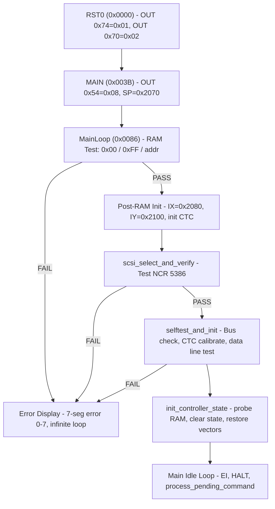

1. **RST0** (0x0000) -- Writes 0x01 to port 0x74, 0x02 to port 0x70, jumps to MAIN
2. **MAIN** (0x003B) -- Configures ports 0x54-0x56, sets SP=0x2070, jumps to MainLoop
3. **MainLoop** (0x0086) -- RAM test with three patterns:
   - Pattern 1: Fill 0x00, verify (checksum with 0x55 seed)
   - Pattern 2: Fill 0xFF, verify
   - Pattern 3: Fill with address high byte, verify
4. **probe_ram_size** (0x027B) -- Scans RAM from 0x2000 up, writes 0x55 pattern to detect mirroring. Validates usable size is between 1KB and 8KB
5. **init_ctc_channels** (0x0759) -- Resets all 8 CTC channels, sets IM2 mode (I=0x20), copies ROM vector table to 0x2070
6. **scsi_select_and_verify** (0x012E) -- Tests NCR 5386 connectivity by selecting and reading back ID
7. **selftest_and_init** (0x0161) -- Checks ND-100 bus (port 0x77/0x70), calibrates CTC clock, tests bus data lines with pattern 0x55/0xAA/0x0F/0xF0
8. **Main idle loop** (0x0244) -- `EI; HALT; CALL process_pending_command; JR HALT`

### Detailed Boot Sequence (Z80 Firmware)

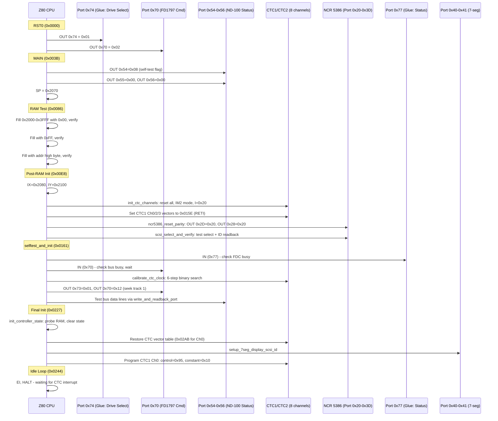

### C# Equivalent of Boot Sequence

The C# emulator does not emulate the Z80 boot. Here is what an equivalent `Reset()` or `ClearDevice()` method should logically do to match the firmware's end state:

```csharp
/// <summary>
/// Simulates the Z80 firmware boot sequence end-state.
/// On real hardware this takes thousands of Z80 clock cycles.
/// Called on power-on reset or WCONT Clear Device (bit 4).
/// </summary>
private void SimulateZ80Boot()
{
    // Step 1: RST0 + MAIN - initial port states
    // Port 0x74 = 0x01, Port 0x70 = 0x02
    // Port 0x54 = 0x08 (self-test in progress flag to ND-100)
    // Port 0x55 = 0x00, Port 0x56 = 0x00
    // The ND-100 can read RSTAU and see the controller is in self-test

    // Step 2: RAM test - we skip this (no Z80 RAM to test)

    // Step 3: CTC init - we don't emulate CTC timers
    // On real HW: IM2 mode set, vector table at 0x2070 initialized

    // Step 4: NCR 5386 reset and selftest
    ncr5386.DeviceReset();
    // Firmware writes 0x20 to Aux Status (reset parity)
    ncr5386.Write((byte)SCSIRegisters.AuxilaryStatus, 0x20);
    // Firmware writes 0x0F to Own ID register (enable all IDs initially)
    ncr5386.Write((byte)SCSIRegisters.IDRegister, 0x0F);

    // Step 5: CTC calibration - skip (no CTC to calibrate)

    // Step 6: Clear all controller state
    regs.Clear();
    bufferPointer = 0;
    readbufferPointer = 0;
    dma_bytes_written = 0;
    dma_bytes_read = 0;

    // Step 7: Set the proper SCSI Own ID from thumbwheel
    ncr5386.Write((byte)SCSIRegisters.IDRegister, regs.TW1);

    // Step 8: Controller is now ready
    // On real HW: Z80 enters HALT loop, CTC1 Ch0 ISR (0x02AB) handles commands
    regs.readyForTransfer = true;

    // If interrupts were enabled before clear, notify ND-100
    // (On real HW: the Z80 would only set ready after full boot)
    if (regs.interruptEnabled)
    {
        SetInterruptBit(true);
    }
}
```

## ND-100 to Z80 Command Flow

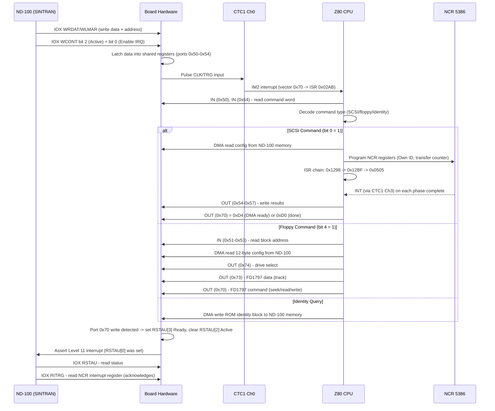

### Trigger Mechanism - RETRACTED (the CTC1 Ch0 counter-mode theory is DISPROVED)

The earlier revision claimed CTC1 Ch0 was configured in **counter mode** with **time constant 1**,
pulsed by the glue logic on every WCONT-Active write, and that this is what wakes the Z80 for every
host command. **This is wrong.** VERIFIED from bytes:

```
ram:00fa: 11 5e 01    LD DE,0x15e          ; stub ISR = "XOR A; RETI" at ram:015e
ram:00fd: ed 53 70 20 LD (0x2070),DE       ; IM2 vector slot for CTC1 ch0 (I=0x20, vector 0x70)
ram:0109: 3e 95       LD A,0x95            ; <-- CTC control word
ram:010b: d3 10       OUT (0x10),A
ram:010d: 3e 10       LD A,0x10            ; <-- time constant = 16
ram:010f: d3 10       OUT (0x10),A
ram:0111: fb          EI
ram:0112: 06 16       LD B,0x16
ram:0114: 10 fe       DJNZ 0x0114          ; delay, allow the timer to fire
ram:0116: a7          AND A                ; did the stub ISR run and zero A?
ram:0117: c2 b2 01    JP NZ,0x01b2         ; no -> LED Error 2
```

Decoding **0x95 = 1001_0101**: D0=1 control word, D1=0 no reset, D2=1 time constant follows,
D3=0 auto trigger, D4=1 rising edge, D5=0 prescaler /16, **D6=0 -> TIMER mode**, D7=1 interrupt
enable.

So CTC1 Ch0 is in **timer** mode, prescaler 16, **time constant 16** - not counter mode, not TC=1.
No `0xC5` counter-mode control word is written to port 0x10 anywhere in the ROM. What this code
actually is: an **interrupt-plumbing selftest**. It installs a stub ISR that zeroes A, starts a
timer, delays, and verifies the ISR ran - proving IM2 + CTC interrupts work. Failure lights LED
error 2.

The actual mechanism by which the host wakes the Z80 for a **floppy** command is not fully
determined. What is VERIFIED: `ram:0441` does `OUT (0x53),A; HALT` - it arms the ND-100 interface
control register and halts awaiting a host-driven interrupt. The command data itself moves over
ports 0x50-0x57 (see the ND-3106/3112 manual section), not through an SRAM mailbox.

**None of this applies to SCSI operations**, which the ND-100 drives directly against the NCR 5386.

### Command Receive ISR (0x02AB)

The ISR reads command data from the shared registers:

```
RST 0x30           ; save registers + RETI
IN A, (0x54)       ; read command low byte from ND-100
LD L, A
IN A, (0x50)       ; read command high byte from ND-100
LD H, A
BIT 0, A           ; check bit 0
JR NZ, SCSI_path   ; bit 0 = SCSI command
```

### Command Dispatch

Based on the command word read from ports 0x50/0x54:

| Port 0x50 Bits | Command Type | Handler Address | Description |
|----------------|-------------|-----------------|-------------|
| Bit 0 = 1 | SCSI disk I/O | 0x02DE | DMA reads config from ND-100 memory, processes SCSI operation |
| Bit 1 = 1 | Bus control | 0x1B4A | Special bus operations |
| Bit 4 = 1 | Device init | 0x0383 or 0x08A1 | Floppy init (0x08A1) or SCSI device init (0x0383) |
| Bits 1-4 = 0 | Diagnostic | 0x15B6 or 0x0376 | Identity/diagnostic response |

The dispatch at 0x036A uses a computed jump:
```
LD (0x2196), BC    ; store handler address
RST 0x18           ; restore registers
PUSH HL
LD HL, (0x2196)    ; load handler address
EX SP, HL          ; swap onto stack
EI
RET                ; "return" to handler
```

## Z80 to ND-100 Response Flow

### Completion Signaling

After processing, the command handler writes results and signals completion:

```
; Write result data to shared registers
OUT (0x54), A      ; flags/status byte
OUT (0x55), A      ; SCSI ID
OUT (0x56), A      ; sense/error info
OUT (0x57), A      ; completion status (bit 0 = error, bit 1 = special)

; Signal completion via port 0x70
CALL nd100_start_dma_transfer   ; writes 0xD4 -> data transfer ready
; or
CALL disconnect_nd100_bus       ; writes 0xD0 -> command complete, no data
```

### Port 0x70 Command Values

| Value | Meaning | When Used |
|-------|---------|-----------|
| 0x00 | Idle / clear | Init, after bus operations |
| 0x10 | Seek / bus select | start_nd100_bus_transfer |
| 0x18 | Bus command with data | nd100_bus_issue_cmd_and_wait |
| 0x88/0xA8 | Read/Write sector | nd100_block_transfer_loop |
| 0xC4 | DMA transfer phase | nd100_bus_dma_transfer |
| 0xD0 | Disconnect (done, no data) | disconnect_nd100_bus |
| 0xD4 | DMA start (data ready) | nd100_start_dma_transfer |
| 0xF0/0xF2 | SCSI execute command | scsi_execute_io_operation |

### Interrupt to ND-100

The write to port 0x70 causes the board hardware to:

1. Set RSTAU bit 3 ("Ready for transfer") / clear bit 2 ("Active")
2. If RSTAU bit 0 ("Enable Interrupt") was set by the ND-100 -> assert **level 11 interrupt** to ND-100

### Full Round-Trip Sequence Diagram

```
ND-100                    Board HW              CTC1 Ch0            Z80
  |                          |                     |                  |
  |-- IOX WCONT (Active) --> |                     |                  |
  |                          |-- latch regs -----> |                  |
  |                          |-- pulse CLK/TRG --> |                  |
  |                          |                     |-- count 1->0 --> |
  |                          |                     |   (INT vec 0x70) |
  |                          |                     |                  |-- ISR 0x02AB
  |                          |                     |                  |-- IN (0x50-0x54)
  |                          |                     |                  |-- process cmd
  |                          |                     |                  |-- OUT (0x54-0x57)
  |                          |<--- OUT (0x70) -----------------------------|
  |                          |                     |                  |
  |                          |-- set RSTAU[3] ---> |                  |
  |                          |-- assert IRQ 11 --> |                  |
  |<-- Level 11 interrupt -- |                     |                  |
  |                          |                     |                  |
  |-- IOX RSTAU (read) ----> |                     |                  |
```

## ND-100 Side Register Map (IOX)

These are the registers visible to the ND-100 host via IOX instructions. The SINTRAN driver uses these symbol names (from embedded driver source in the emulator):

| IOX Offset | Octal | Symbol | R/W | Description |
|------------|-------|--------|-----|-------------|
| 0x00 | 00 | RLMAR | R | Read Memory Address Register bits 0-15 |
| 0x01 | 01 | WLMAR | W | Write Memory Address Register bits 0-15 |
| 0x02 | 02 | REDAT | R | Read Data (16-bit, IOX mode only) |
| 0x03 | 03 | WRDAT | W | Write Data (16-bit, IOX mode only) |
| 0x04 | 04 | RSTAU | R | Read Status |
| 0x05 | 05 | WCONT | W | Write Control |
| 0x06 | 06 | RHMAR | R | Read Memory Address Register bits 16-23 |
| 0x07 | 07 | WHMAR | W | Write Memory Address Register bits 16-23 |
| 0x08 | 10 | RXWC_HI | R | Read External Wordcount bits 16-23 (3204 only) |
| 0x0A | 12 | RXWC | R | Read External Wordcount bits 0-15 (3204 only) |
| 0x20 | 40 | RNDAT | R | Read NCR Data Register |
| 0x21 | 41 | WNDAT | W | Write NCR Data Register |
| 0x22 | 42 | RNCOM | R | Read NCR Command Register |
| 0x23 | 43 | WNCOM | W | Write NCR Command Register |
| 0x24 | 44 | RNCNT | R | Read NCR Control Register |
| 0x25 | 45 | WNCNT | W | Write NCR Control Register |
| 0x26 | 46 | RDESI | R | Read Destination ID Register |
| 0x27 | 47 | WDESI | W | Write Destination ID Register |
| 0x28 | 50 | RAUXS | R | Read Auxiliary Status |
| 0x29 | 51 | WAUXS | W | Write Auxiliary Status |
| 0x2A | 52 | ROIDN | R | Read Own ID Number |
| 0x2B | 53 | WOIDN | W | Write Own ID Number |
| 0x2C | 54 | RITRG | R | Read Interrupt Register |
| 0x2E | 56 | RSOUI | R | Read Source ID |
| 0x32 | 62 | RDIST | R | Read Diagnostic Status |
| 0x38 | 70 | RTCM | R | Read Transfer Counter MSB |
| 0x39 | 71 | WTCM | W | Write Transfer Counter MSB |
| 0x3A | 72 | RTC2 | R | Read Transfer Counter 2nd |
| 0x3B | 73 | WTC2 | W | Write Transfer Counter 2nd |
| 0x3C | 74 | RTCL | R | Read Transfer Counter LSB |
| 0x3D | 75 | WTCL | W | Write Transfer Counter LSB |

### RSTAU Status Register Bits (IOX+4, Read)

| Bit | Name | Description |
|-----|------|-------------|
| 0 | Interrupt Enabled | From WCONT bit 0 |
| 2 | Busy (Active) | Controller is processing a command |
| 3 | Ready for Transfer | Controller has completed and is ready |
| 4 | Error | OR of error conditions |
| 5 | Reset on SCSI bus | SCSI bus reset detected (*) |
| 6 | NCR 5386 disabled | NCR chip is in disabled state |
| 7 | Single-ended | Single-ended SCSI driver selected |
| 8 | Data Request | Data request from NCR 5386 |
| 9 | NCR Interrupt | Interrupt from NCR 5386 (*) |
| 10 | Data Acknowledge | Data acknowledge to NCR 5386 |
| 11 | BERROR | ND-100 Bus DMA error |
| 12 | BSY | BSY signal from SCSI bus |
| 13 | REQ | REQ signal from SCSI bus |
| 14 | ACK | ACK signal from SCSI bus |
| 15 | Differential | Differential SCSI receivers selected |

(*) These bits generate an interrupt to ND-100 level 11 when bit 0 (Enable Interrupt) is set.

### WCONT Control Register Bits (IOX+5, Write)

| Bit | Name | Description |
|-----|------|-------------|
| 0 | Enable Interrupt | Allow interrupt to ND-100 level 11 |
| 2 | Active | Start the specified operation |
| 3 | Test | Test mode (MAR increments on read) |
| 4 | Clear Device | Clear controller registers |
| 5 | ND-100 DMA Enable | Allow DMA transfers to/from ND-100 memory |
| 6 | Write ND-100 Memory | Data direction: write into ND-100 memory |
| 10 | Reset SCSI Bus | Assert reset on the SCSI bus |

## POST Error Codes

On failure, the firmware halts and displays an error code on the 3-digit 7-segment LED display in an infinite loop.

| Error Code (C reg) | Address | Cause |
|---------------------|---------|-------|
| 0 | 0x01AA | RAM checksum fail (0x55 pattern mismatch) |
| 1 | 0x01AE | RAM write/read verify fail |
| 2 | 0x01B2 | CTC or bus initialization fail |
| 3 | 0x01B6 | NCR 5386 SCSI select/verify fail |
| 4 | 0x01BA | CTC clock calibration fail |
| 7 | 0x01BE | Unknown/fatal error |

## Event/Error Code Table (0x1CFB-0x1D3A)

Each entry is `RST 0x08` followed by a code byte. RST 0x08 saves all registers, captures SP, and enters the command processor at `scsi_command_entry_point` (0x1D4C) which reads the code byte from the return address.

The error code byte encodes two fields:
- **Bits 7:6** = severity/mode: 0x00=info (return), 0x40=warning (restart op), 0x80=fatal (full reinit)
- **Bits 5:0** = error code (matches ND-3106/3112 manual error codes exactly)

The error code is reported to the ND-100 via port 0x55 (DHI) as `error_code * 2` (shifted left by 1).

### Confirmed Error Codes (from ND-11.021.1 manual)

| Address | Byte | Octal | Error Code | Severity | Confirmed Meaning | Firmware Trigger |
|---------|------|-------|-----------|----------|-------------------|-----------------|
| 0x1CFB | 0x85 | 05 | 0x05 | Fatal | CRC error | NCR parity check failed |
| 0x1CFD | 0x86 | 06 | 0x06 | Fatal | **Sector not found** | SCSI bus error in reselection handler |
| 0x1CFF | 0x87 | 07 | 0x07 | Fatal | Track not found | Seek retry count exhausted |
| 0x1D01 | 0x88 | 10 | 0x08 | Fatal | Format not found | Seek verify failed after retries |
| 0x1D03 | 0x89 | 11 | 0x09 | Fatal | Diskette defect / Record Not Found | FD1797 status bits 3 or 4 in block transfer |
| 0x1D05 | 0x8A | 12 | 0x0A | Fatal | Format mismatch / Track mismatch | set_status_and_restart (stores B into IY+5) |
| 0x1D0A | 0x8B | 13 | 0x0B | Fatal | **Illegal format specified** | Invalid format code in init_floppy_drive |
| 0x1D0C | 0x8C | 14 | 0x0C | Fatal | Single sided diskette / Unexpected disconnect | check_scsi_bus_change detects disconnect |
| 0x1D0E | 0x8D | 15 | 0x0D | Fatal | Double sided diskette / Unexpected reconnect | check_scsi_bus_change detects reconnect |
| 0x1D10 | 0x8E | 16 | 0x0E | Fatal | **Write protected** | FD1797 status bit 6 or SCSI unit attention |
| 0x1D12 | 0x8F | 17 | 0x0F | Fatal | Deleted record / SCSI bus error | scsi_reselection_handler bus error |
| 0x1D14 | 0x90 | 20 | 0x10 | Fatal | **Drive not ready** | FD1797 status bit 7 or bus timeout |
| 0x1D16 | 0x91 | 21 | 0x11 | Fatal | Controller busy on start | FD1797 busy bit stuck / bus busy after selection |
| 0x1D18 | 0x92 | 22 | 0x12 | Fatal | **Lost data (over/underrun)** | FD1797 status bit 2 in block transfer |
| 0x1D1A | 0x93 | 23 | 0x13 | Fatal | Track zero not detected / Restore failed | Reselection retry exhausted |
| 0x1D1C | 0x95 | 25 | 0x15 | Fatal | **Microprogram out of range (RST 38H)** | Z80 executed 0xFF from invalid memory |
| 0x1D1E | 0x96 | 26 | 0x16 | Fatal | **Watchdog timeout (~10 sec)** | NMI counter at 0x20AA reached zero |
| 0x1D20 | 0x97 | 27 | 0x17 | Fatal | Undefined error / Read-write retries exhausted | scsi_execute_io_operation 3 retries failed |
| 0x1D22 | 0x98 | 30 | 0x18 | Fatal | **Track/sector out of range** | compute_chs_from_lba exceeds media max |
| 0x1D24 | 0x9A | 32 | 0x1A | Fatal | Compare error / Bus attention | CTC2 Ch0 ISR timeout |
| 0x1D26 | 0x9B | 33 | 0x1B | Fatal | **Internal DMA error** | NCR transfer counter mismatch |
| 0x1D28 | 0x20 | 40 | 0x20 | Info | **ND-100 bus error - command fetch** | DMA address readback mismatch |
| 0x1D2C | 0x22 | 42 | 0x22 | Info | ND-100 bus error - data transfer | |
| 0x1D2E | 0xA3 | 43 | 0x23 | Fatal | **Illegal command** | End of dispatch table (0xFF sentinel) |
| 0x1D32 | 0xA6 | 46 | 0x26 | Fatal | **Address register error** | DMA address verify mismatch |
| 0x1D34 | 0xA8 | 50 | 0x28 | Fatal | **No bootstrap found on diskette** | Boot block parse error |
| 0x1D36 | 0xA9 | 51 | 0x29 | Fatal | **Wrong bootstrap version** | Incompatible floppy monitor |

### Error Code to Port 0x55 (DHI) Mapping

The error code (lower 6 bits) is shifted left by 1 and written to port 0x55 (DHI). This is what the ND-100 sees when it reads the command block status:

| Error Code | Port 0x55 Value | Meaning |
|-----------|----------------|---------|
| 0x05 | 0x0A | CRC error |
| 0x06 | 0x0C | Sector not found |
| 0x07 | 0x0E | Track not found |
| 0x08 | 0x10 | Format not found |
| 0x09 | 0x12 | Diskette defect |
| 0x0A | 0x14 | Format mismatch |
| 0x0B | 0x16 | Illegal format |
| 0x0C | 0x18 | Single sided / disconnect |
| 0x0D | 0x1A | Double sided / reconnect |
| 0x0E | 0x1C | Write protected |
| 0x0F | 0x1E | Deleted record / bus error |
| 0x10 | **0x20** | **Drive not ready** |
| 0x11 | 0x22 | Controller busy |
| 0x12 | 0x24 | Lost data |
| 0x13 | 0x26 | Track 0 not detected |
| 0x15 | 0x2A | Microprogram crash |
| 0x16 | 0x2C | Watchdog timeout |
| 0x17 | 0x2E | Undefined / retries exhausted |
| 0x18 | 0x30 | Track/sector out of range |
| 0x1A | 0x34 | Compare error |
| 0x1B | 0x36 | Internal DMA error |
| 0x20 | 0x40 | ND-100 bus error (cmd fetch) |
| 0x22 | 0x44 | ND-100 bus error (data) |
| 0x23 | 0x46 | Illegal command |
| 0x26 | 0x4C | Address register error |
| 0x28 | 0x50 | No bootstrap found |
| 0x29 | 0x52 | Wrong bootstrap version |

## Function Reference

> **NAMING CORRECTION.** The names in the tables below came from the original speculative pass and
> many are wrong - they say "scsi"/"ncr5386" for code that is actually floppy or DMA. 21 functions
> were renamed in the Ghidra DB (`45900E.bin`) to match the verified evidence. Where a table below
> still shows an old name, the map here wins.

### Applied renames (Ghidra DB is authoritative)

| Address | Old name (WRONG) | Corrected name |
|---------|------------------|----------------|
| 0x012e | scsi_select_and_verify | `dma9517_channel_register_selftest` |
| 0x03f7 | scsi_data_transfer | `nd100_arm_iface_and_halt_for_host` |
| 0x0614 | scsi_start_io_operation | `nd100_write_completion_status` |
| 0x06a1 | nd100_start_dma_transfer | `fd1797_force_interrupt_d4` |
| 0x06b6 | scsi_enable_selection | `dma9517_mask_channel_and_nd100_ctrl` |
| 0x0708 | ncr5386_reset_parity | `dma9517_master_clear_and_init` |
| 0x0711 | ncr5386_set_own_id_and_program | `dma9517_program_and_unmask_channel` |
| 0x0717 | ncr5386_program_transfer | `dma9517_load_mode_addr_count` |
| 0x0732 | ncr5386_read_verify_transfer | `dma9517_readback_and_verify_addr_count` |
| 0x0aff | clear_nd100_bus_attention | `floppy_glue_control_write_74` |
| 0x0b46 | start_nd100_bus_transfer | `fd1797_seek_to_track` |
| 0x0bae | disconnect_nd100_bus | `fd1797_force_interrupt_d0` |
| 0x0e8b | nd100_bus_dma_transfer | `fd1797_read_address_with_side_select` |
| 0x0ee8 | nd100_bus_issue_cmd_and_wait | `fd1797_seek_step_issue_command` |
| 0x0fe6 | nd100_block_transfer_loop | `fd1797_read_write_sector_loop` |
| 0x1050 | scsi_select_target | `floppy_drive_motor_select_and_busy_poll` |
| 0x1090 | nd100_bus_output_and_wait | `floppy_drive_select_and_wait_ready` |
| 0x10ba | check_scsi_bus_change | `floppy_read_status_disk_change` |
| 0x11ce | scsi_execute_io_operation | `fd1797_format_write_track` |
| 0x1afa | setup_7seg_display_scsi_id | `ctc2_program_channel3` |
| 0x1d4c | scsi_command_entry_point | `controller_full_reset_and_init` |

Note the two most misleading of these: **`scsi_execute_io_operation` (0x11ce) is the floppy FORMAT
routine** (FD1797 Write Track 0xF0/0xF2 with DMA address polling), and **`setup_7seg_display_scsi_id`
(0x1afa) is CTC2 channel 3 programming** - nothing to do with either the display or SCSI.

### Still-suspect names (NOT yet renamed - no byte-level evidence gathered)

These carry SCSI-flavoured names but, given that no NCR access exists in this ROM, are very likely
misnamed too. Treat with suspicion until swept:

`scsi_transfer_with_disconnect` (0x03f1), `setup_dma_and_start_scsi` (0x045a),
`scsi_select_and_send` (0x0a37), `scsi_reselection_handler` (0x0a5d),
`setup_ncr_dma_pointer` (0x0b0b), `set_scsi_target_id` (0x103c),
`dispatch_by_scsi_id` (0x1a95), `add_scsi_id_offset_to_hl` (0x10df),
`scsi_init_data_buffer` (0x06c9), `scsi_setup_dma_and_select` (0x06d2),
`setup_scsi_params_table_a` (0x10e9), `setup_scsi_buffers_from_table` (0x10ee),
`copy_cdb_and_setup_lba` (0x0aa2).

### Boot and Initialization

| Address | Name | Description |
|---------|------|-------------|
| 0x0000 | RST0 | Reset vector, init ports 0x74/0x70, jump to MAIN |
| 0x003B | MAIN | Set SP, configure ports 0x54-0x56, jump to RAM test |
| 0x0086 | MainLoop | POST RAM test with 3 patterns (0x00, 0xFF, address) |
| 0x0161 | selftest_and_init | POST: bus check, CTC calibration, data line test, enter idle loop |
| 0x024A | process_pending_command | Check 0x2000 for pending command, dispatch if non-zero |
| 0x0253 | init_controller_state | Set IX=0x2080, probe RAM, clear state, wait for bus ready |
| 0x027B | probe_ram_size | Detect RAM top by writing 0x55, validate size bounds |
| 0x0759 | init_ctc_channels | Reset all CTC channels, set IM2 mode, copy vector table |
| 0x1395 | calibrate_ctc_clock | Binary search CTC calibration over 6 steps targeting 0x4000 |

### SCSI Operations

| Address | Name | Description |
|---------|------|-------------|
| 0x1D4C | scsi_command_entry_point | Main command processor: save context, extract ID/mode, dispatch |
| 0x0614 | scsi_start_io_operation | Prepare SCSI I/O, write status to ports 0x54-0x57, start transfer |
| 0x11CE | scsi_execute_io_operation | Core SCSI I/O: send CDB, handle phases via HALT+IRQ, retry x3 |
| 0x03F1 | scsi_transfer_with_disconnect | SCSI DMA transfer entry with disconnect/reselect enabled |
| 0x03F7 | scsi_data_transfer | DMA transfer via ND-100 bus, wait for interrupt completion |
| 0x0A37 | scsi_select_and_send | Arbitrate, select SCSI target, dispatch command |
| 0x0A5D | scsi_reselection_handler | Handle SCSI bus reselection, restore state, re-initiate |
| 0x06B6 | scsi_enable_selection | Enable SCSI bus selection via NCR Own ID register |
| 0x06C9 | scsi_init_data_buffer | Reset data buffer pointer to 0x2200, fall through to DMA setup |
| 0x06D2 | scsi_setup_dma_and_select | Program NCR transfer registers, handle bus selection |
| 0x012E | scsi_select_and_verify | POST: select target and verify ID readback |
| 0x103C | set_scsi_target_id | Convert SCSI ID bitmask to target number |
| 0x1050 | scsi_select_target | SCSI arbitration/selection through bus interface |
| 0x10BA | check_scsi_bus_change | Detect bus sense mismatch, call disconnect/reconnect handlers |
| 0x138A | store_status_by_unit | Store status byte in per-unit table at 0x2125 |

### AM9517 DMA Functions (was: "NCR 5386 Functions" - ENTIRELY MISNAMED)

**There are no NCR 5386 functions in this ROM.** Every function previously in this section is
AM9517 DMA code. Renamed in the Ghidra DB:

| Address | Old name (WRONG) | Corrected name | What it actually does |
|---------|------------------|----------------|-----------------------|
| 0x0708 | ncr5386_reset_parity | `dma9517_master_clear_and_init` | AM9517 Master Clear (0x2D) + Command register write 0x20 (0x28) |
| 0x0711 | ncr5386_set_own_id_and_program | `dma9517_program_and_unmask_channel` | Program channel addr/count, then unmask via Single Mask (0x2A) |
| 0x0717 | ncr5386_program_transfer | `dma9517_load_mode_addr_count` | Write Mode (0x2B), clear byte pointer (0x2C), load addr+count at 0x20+2n |
| 0x0732 | ncr5386_read_verify_transfer | `dma9517_readback_and_verify_addr_count` | Read back current addr/count, verify vs expected |

### ND-100 Bus Interface

| Address | Name | Description |
|---------|------|-------------|
| 0x048C | set_nd100_dma_address | Program DMA addr ports 0x50-0x52, verify via 0x55-0x57 |
| 0x04C3 | read_nd100_dma_address | Read current DMA address from ports 0x55-0x57 |
| 0x04CC | update_dma_transfer_remaining | Decrement remaining count, flag completion or adjust final block |
| 0x06A1 | nd100_start_dma_transfer | Write 0xD4 to port 0x70 (DMA start), set phase counter |
| 0x06B0 | nd100_resume_transfer | Re-issue bus command to continue/retry transfer |
| 0x0B46 | start_nd100_bus_transfer | Set up ports 0x70-0x74, handle reselection, enable IRQ |
| 0x0BAE | disconnect_nd100_bus | Write 0xD0 to port 0x70 (disconnect/done) |
| 0x0CC5 | resume_nd100_bus_transfer | Restore bus state, reprogram NCR DMA, resume transfer |
| 0x0FE6 | nd100_block_transfer_loop | Block-level sector transfer loop between SCSI and ND-100 |
| 0x1090 | nd100_bus_output_and_wait | Output to port 0x77/0x74, poll for ACK with 100-iteration timeout |
| 0x0F1E | store_cmd_and_poll_nd100 | Save command to 0x2108, poll port 0x70 bit 0 until not busy |
| 0x0F21 | poll_nd100_bus_ready | Poll port 0x70 bit 0, check bit 7 for errors |
| 0x0F15 | wait_nd100_bus_with_delay | Poll bus ready then add timed delay |
| 0x0E8B | nd100_bus_dma_transfer | Multi-phase DMA transfer with NCR 5386 setup |
| 0x0ED4 | nd100_bus_cmd_48 | Issue bus command 0x48 (short transfer) |
| 0x0ED8 | nd100_bus_cmd_reselect | Initiate SCSI reselection via bus interface |
| 0x0EE8 | nd100_bus_issue_cmd_and_wait | Output data+command to bus, wait, handle reselection retries |
| 0x1590 | send_default_buffer_to_nd100 | Set HL=0x2200, fall through to send_data_to_nd100_bus |
| 0x1593 | send_data_to_nd100_bus | Send DE bytes via port 0x57 with interrupt handshaking |

### Floppy Operations

| Address | Name | Description |
|---------|------|-------------|
| 0x08A1 | init_floppy_drive | Full FD1797 init: reset, clear DCB, set format (26/15/8 spt) |
| 0x09C7 | get_head_count | Extract head count from config bits 7:6 of 0x2081 |
| 0x09D4 | build_drive_select_mask | Build FD1797 drive select bitmask with density/motor flags |
| 0x09F4 | compute_chs_from_lba | Convert linear block address to cylinder/head/sector |
| 0x0E08 | clear_drive_select | Clear drive status byte 0x2105, fall through to seek |
| 0x0E0E | seek_and_select_drive | Seek/head-positioning with retry and recalibration |

### Disk Geometry and Buffers

| Address | Name | Description |
|---------|------|-------------|
| 0x07A4 | setup_disk_geometry | Init geometry from device descriptor: sector size, buffer, track layout |
| 0x078F | advance_write_buffer_index | Increment ring buffer write pointer with wrap |
| 0x0795 | advance_read_buffer_index | Increment ring buffer read pointer with wrap |
| 0x0AA2 | copy_cdb_and_setup_lba | Copy SCSI CDB to working buffer, byte-swap LBA |
| 0x0AD1 | init_disk_transfer_state | Compute CHS, clear status accumulators and flags |
| 0x0AFF | clear_nd100_bus_attention | Deassert attention bit on port 0x74 |
| 0x0B0B | setup_ncr_dma_pointer | Compute and program NCR DMA address registers |
| 0x0CBA | get_drive_table_entry_ptr | Return pointer into sector table at 0x2139 by sector number |
| 0x10E9 | setup_scsi_params_table_a | Load parameter table A (0x115D), fall through to buffer setup |
| 0x10EE | setup_scsi_buffers_from_table | Init SCSI RAM buffers and data structures from config table |
| 0x1143 | copy_counted_blocks | Copy multiple sized data blocks from table to destination |
| 0x1150 | memfill_byte_to_de | Fill BC bytes at (DE) with single byte from (HL) |
| 0x1157 | calc_remaining_size | Compute DE = DE - BC (remaining buffer space) |
| 0x045A | setup_dma_and_start_scsi | Set up DMA address, issue SCSI command to NCR 5386 |

### Display

| Address | Name | Description |
|---------|------|-------------|
| 0x1AFA | setup_7seg_display_scsi_id | Convert SCSI ID to 7-seg patterns, program CTC3 for refresh |
| 0x1B23 | digit_to_7seg_pattern | Lookup table: digit (0-7) -> 7-segment bit pattern |
| 0x1B38 | set_7seg_bits | OR bits into display state, write to port 0x41 |
| 0x1B3F | clear_7seg_bits | AND-complement bits from display state, write to port 0x41 |

### Utility

| Address | Name | Description |
|---------|------|-------------|
| 0x004B | WaitLoopB | Nested delay: A outer loops x B inner loops |
| 0x0057 | WaitLoop_A | Inner delay loop: B iterations of LD R,A; LD R,A; NOP; NOP |
| 0x0060 | ctc_write_port_pair_tail | Shared tail: OUT (C),E; OUT (C),D; POP DE; RET |
| 0x087A | divide_24by16 | 24-bit / 16-bit unsigned division, quotient in HL |
| 0x12D4 | short_delay | Busy-wait: 16 DJNZ iterations (~50us at 4MHz) |
| 0x10DF | add_scsi_id_offset_to_hl | Add SCSI target ID (from 0x2103) to HL for array indexing |
| 0x1A87 | write_and_readback_port | Write A to port C, wait, read back from port B |
| 0x1A95 | dispatch_by_scsi_id | Scan dispatch table for matching SCSI ID, redirect execution |
| 0x1D05 | set_status_and_restart | Store B as status code, re-enter command processor |

## RAM Variable Reference

### Controller State (IX = 0x2080)

| Address | Name | Description |
|---------|------|-------------|
| 0x2080 | controller_config | Configuration byte (bit 2: drive ready, bit 3: density) |
| 0x2081 | drive_config_byte | Bits 7:6 = head count encoding |
| 0x2082 | cylinder_position | Current cylinder/head position (byte-swapped) |
| 0x2085 | scsi_cdb_working | 7-byte SCSI CDB working copy |
| 0x208C | scsi_id_times2 | Current SCSI ID * 2 |
| 0x208D | io_flags | I/O operation flags (bit 3: data, bit 4: error, bit 7: abort) |
| 0x208E | scsi_status_copy | Copy of SCSI status |
| 0x208F | scsi_sense_copy | Copy of SCSI sense data |
| 0x2091 | geometry_working | 7-byte working copy of drive geometry |
| 0x2098 | media_descriptor | Media type descriptor (from port 0x50/0x54 command word) |
| 0x209D | device_type | Device type code (0x1E = special, 0x2C = floppy) |

### DMA and Transfer State

| Address | Name | Description |
|---------|------|-------------|
| 0x20A5 | state_flag_a5 | General state flag |
| 0x20AF | ram_top_address | Detected top of usable RAM |
| 0x20B1 | ram_usable_size | Usable RAM size |
| 0x20B3 | ram_size_minus_2200 | RAM available for buffers |
| 0x20B5 | sector_size | Computed sector size in bytes |
| 0x20B7 | ring_buf_max_count | Ring buffer maximum entry count |
| 0x20B8 | ring_buf_write_idx | Ring buffer write pointer |
| 0x20B9 | ring_buf_read_idx | Ring buffer read pointer |
| 0x20BA | scsi_bus_status | Current SCSI bus status |
| 0x20BB | transfer_result | Result code of last transfer |
| 0x20BC | nd100_bus_mode | ND-100 bus mode register cache |
| 0x20BF | scsi_target_id | Current SCSI target ID |
| 0x20C0 | dma_buffer_address | Z80 DMA buffer address (usually 0x2200) |
| 0x20C2 | dma_transfer_count | Current DMA block transfer count |
| 0x20C4 | nd100_dma_addr_lo | ND-100 DMA address bits 0-15 |
| 0x20C6 | nd100_dma_addr_hi | ND-100 DMA address bits 16-23 |
| 0x20C7 | dma_remaining_lo | Remaining transfer count bits 0-15 |
| 0x20C9 | dma_remaining_hi | Remaining transfer count bits 16-23 |
| 0x20CA | current_track_ptr | Current track pointer |
| 0x20D5 | state_flag_d5 | State flag |
| 0x20D6 | reselection_flag | SCSI reselection pending flag |
| 0x20DA | total_capacity | Total device capacity |

### Display and Watchdog

| Address | Name | Description |
|---------|------|-------------|
| 0x20A4 | display_state | Current 7-segment display register state |
| 0x20A7 | display_digit_ones | 7-seg pattern for ones digit |
| 0x20A8 | display_digit_tens | 7-seg pattern for tens digit |
| 0x20A9 | display_digit_prefix | 7-seg pattern for prefix digit (0 or E) |
| 0x20AA | nmi_watchdog_counter | NMI-decremented watchdog; zero triggers reset |

### Drive Control Block (IY = 0x2100)

| Address | Name | Description |
|---------|------|-------------|
| 0x2100 | drive_control_block | Base of drive control block |
| 0x2101 | dcb_head_count_alt | Alternate head count storage |
| 0x2102 | dcb_select_mask_alt | Alternate drive select mask |
| 0x2103 | dcb_head_count | Number of heads |
| 0x2104 | dcb_drive_select | Drive select bitmask for FD1797 |
| 0x2105 | dcb_drive_status | Current drive status byte |
| 0x2106 | motor_status | Motor on/off status |
| 0x2107 | sector_count_in_block | Sector count within current block |
| 0x2108 | last_bus_command | Last command written to port 0x70 |
| 0x2109 | last_bus_status | Status read back from port 0x70 |
| 0x210B | media_type_copy | Copy of media type from 0x2098 |
| 0x210D | scsi_config_flags | SCSI configuration flags |
| 0x210E | drive_error_flags | Drive error accumulator |
| 0x2113 | drive_ready_status | Drive ready/status byte |
| 0x2115 | scsi_interrupt_status | NCR 5386 interrupt status byte |
| 0x2120 | error_merge_byte | Merged error flags for status reporting |

### SCSI Buffer Configuration

| Address | Name | Description |
|---------|------|-------------|
| 0x2124 | current_drive_select | Currently selected drive byte |
| 0x2125 | per_unit_status_table | Per-unit status array (indexed by unit number) |
| 0x2129 | target_descriptor_table | SCSI target descriptor array |
| 0x2130 | ctc_calibration_value | CTC clock calibration result |
| 0x2131 | scsi_cmd_buffer_size | Size of SCSI command buffer (at 0x2200) |
| 0x2133 | scsi_data_buffer_size | Size of SCSI data buffer (at 0x22A0) |
| 0x2135 | scsi_status_buffer_size | Size of SCSI status buffer (0x50 = 80 bytes) |
| 0x2137 | scsi_params_base_ptr | Pointer to SCSI parameter table base |
| 0x2139 | sector_table | Sector mapping table |

### Context Save Area

| Address | Name | Description |
|---------|------|-------------|
| 0x2178 | saved_disk_params | 12-byte saved disk parameters (for disconnect/reconnect) |
| 0x2184 | saved_context | 14-byte saved CPU context |
| 0x218E | saved_sp | Saved stack pointer |
| 0x2192 | saved_iy | Saved IY register |
| 0x2194 | scsi_device_id | SCSI device ID from command |
| 0x2195 | cmd_mode_flags | Command mode flags (0x00=return, 0x40=normal, 0x80=target) |

## Deep Dive: NCR 5386 Interrupt Path to ND-100 - RETRACTED IN FULL

> **DISPROVED. DO NOT USE. Retained only so that readers holding the old text can see exactly what
> was withdrawn and why.**
>
> This entire section is built on the claim that the Z80 reads and writes NCR 5386 registers at
> ports 0x20-0x3D. **It does not.** An exhaustive byte-level sweep of every I/O opcode in the ROM
> found no NCR access of any kind: that port range is the AM9517 DMA controller, and the only
> command-code stream in the ROM goes to the FD1797 at port 0x70. See "THE ARCHITECTURE" at the top
> of this document.
>
> Consequently the following are all fiction: the NCR INT -> CTC1 Ch3 wiring, the dynamic ISR chain
> at (0x2076) "servicing SCSI phases", the three-phase SCSI ISR sequence (0x1298 / 0x12BF / 0x0505),
> and the claim that NCR interrupts reach the ND-100 only after Z80 processing.
>
> **What is actually true:** the NCR 5386 interrupts the **ND-100 directly** (RSTAU bit 9 = "NCR
> Interrupt"; level 11 when WCONT bit 0 enabled). SINTRAN's `SCINT` handler services it. The Z80 is
> not in this path at any point.
>
> The CTC channels and ISRs named below are real, but they serve the **floppy** half. Their true
> assignment is not established; the earlier mapping was derived from the false NCR premise and
> should not be trusted.

### How NCR 5386 interrupts reach the Z80 - RETRACTED (see warning above)

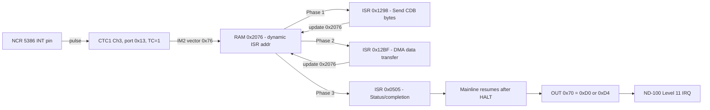

The NCR 5386 INT pin is wired to **CTC1 Channel 3 CLK/TRG input** (port 0x13). It does NOT connect directly to the Z80's INT pin.

When the NCR 5386 asserts INT (SCSI operation complete, reselection, bus service, etc.):
1. CTC1 Ch3 counts down 1->0 (counter mode, TC=1)
2. Fires IM2 interrupt with vector from 0x2076
3. Z80 executes the dynamic ISR pointed to by 0x2076

### Dynamic ISR chaining during SCSI I/O

The vector at 0x2076 is dynamically modified during SCSI operations. `scsi_execute_io_operation` (0x11CE) uses three SCSI phases, each with its own ISR:

**Phase 1 - Command out (0x2076 -> 0x1298 or 0x12A6):**
```
ISR 0x1298: Sends command bytes to NCR data ports (0x20/0x21),
            writes Own ID register (0x2A/0x2B),
            stores next ISR address into (0x2076), EI, RETI
ISR 0x12A6: Same but also writes to port 0x73 (drive data),
            used for wide/special commands
```

**Phase 2 - Data transfer (0x2076 -> 0x12BF):**
```
ISR 0x12BF: If B > 0 (more blocks): manipulates return stack
            so RETI returns to polling loop at 0x1245
            If B = 0 (last block): writes transfer counter to NCR,
            chains to next ISR via (0x2076) update
```

**Phase 3 - Status/completion (0x2076 -> 0x0505):**
```
ISR 0x0505: Default disk I/O handler - reads status from
            port 0x28, handles seek completion and sector positioning
```

Between phases, the mainline code HALTs waiting for each NCR interrupt.

### How it reaches the ND-100

The NCR 5386 interrupt does **NOT** propagate directly to the ND-100. The Z80 processes it first:

```
NCR 5386 INT pin
       |
       v
CTC1 Ch3 CLK/TRG (port 0x13, counter mode, TC=1)
       |
       v
Z80 IM2 interrupt -> ISR from (0x2076)
  - Processes NCR data (reads/writes NCR registers 0x20-0x3D)
  - Chains ISRs for multi-phase SCSI operations
  - After all phases: mainline code resumes after HALT
       |
       v
Z80 writes port 0x70 (0xD0=done, 0xD4=DMA ready, etc.)
       |
       v
Board hardware sets RSTAU[3] (Ready), clears RSTAU[2] (Active)
If RSTAU[0] (Enable Interrupt) was set -> assert ND-100 level 11 IRQ
```

### SCSI reselection interrupt path

CTC2 Ch0 (port 0x14, ISR at 0x0AF3) handles SCSI reselection events separately. This ISR:
- Immediately writes 0xD0 to port 0x70 (disconnect/abort)
- Clears drive select (port 0x74)
- Enters event handler 0x1D24

This suggests the NCR 5386 has a separate reselection signal routed to CTC2 Ch0, distinct from its main INT output on CTC1 Ch3.

### Uncertainty

- I cannot verify from firmware alone which NCR 5386 pin connects to which CTC channel. The firmware evidence strongly suggests Ch3 for normal operations and CTC2 Ch0 for reselection, but confirming requires the board schematic.
- The NCR 5386 has multiple interrupt sources (Function Complete, Bus Service, Disconnect, Reconnect, etc.) but only one INT pin. The two CTC channels may be driven by different board logic signals derived from NCR status, not directly from the INT pin.

<!-- END OF RETRACTED SECTION -->

---

## Deep Dive: FD1797 Floppy Disc Controller

> This and the AM9517 / CTC / Floppy Boot deep-dives below describe **the floppy half** - what the
> 45900E.bin ROM actually implements. Per the ND-3106/3112 manual section near the end of this
> document, the Z80-side interface is *identical* to those floppy controllers - port 0x74 is
> literally `FDVSEL` (Floppy Drive Select). The Z80 half of the ND-3201 is essentially an ND-3112.

### Confirmed Port Mapping

Ports 0x70-0x73 are the FD1797's four registers. This is confirmed by matching command encodings:

| Z80 Port | FD1797 Register | Evidence |
|----------|----------------|----------|
| 0x70 | Command/Status | All FD1797 commands written here; status polled here |
| 0x71 | Track Register | Read to verify current track position |
| 0x72 | Sector Register | Written with sector number before read/write |
| 0x73 | Data Register | Written with target track before seek commands |

### FD1797 Commands Used in Firmware

| Command | Value | Locations | Description |
|---------|-------|-----------|-------------|
| Restore | 0x00 | 0x08BF, 0x026E | Seek to track 0, polls busy bit |
| Seek | 0x12 | 0x0192 | Seek with head load (h=1) |
| Seek | 0x18 | 0x0EF0 | Seek with head load + verify |
| Seek | 0x1C | 0x0DED | Seek with flags from (IY+0x14) |
| Step-In | 0x48 | 0x0ED4 | Step toward higher tracks |
| Step-In | 0x4C | 0x0DC9 | Step-in with verify |
| Read Sector | 0x88/0x8C | 0x0C5C-0x0CA3 | Bit 2=multi-sector, bit 0=side |
| Read Address | 0xC4 | 0x0EB3 | Read sector ID field |
| Force Interrupt | 0xD0 | 0x0AF4, 0x0BB4 | Abort current operation |
| Force Interrupt | 0xD4 | 0x06A6 | Interrupt on index pulse |
| Write Track | 0xF0/0xF2 | 0x121E | Format track (F2 = with side select) |

### Glue Logic Ports (0x74-0x77)

These are NOT FD1797 registers. They are board-level control/status registers implemented in glue logic (PAL/GAL or discrete):

| Port | Direction | Function | Evidence |
|------|-----------|----------|----------|
| 0x74 | Write only | Drive select + DMA direction control | Bit 5 controls DMA direction; cleared at reset; set with drive mask from 0x2104 |
| 0x75 | Write only | Secondary control (side select?) | Written 0x00 during init at 0x08B9, 0x0257 |
| 0x76 | Write only | Timer/prescaler control | Only written during CTC calibration at 0x13BF |
| 0x77 | Read/Write | Drive status input + motor control | Read: bit 0=FDC busy, bit 1=head loaded/WP; Write: motor control |

### Port 0x70 Dual Purpose

Port 0x70 serves as BOTH the FD1797 command register AND is monitored by the ND-100 bus interface glue logic. When the Z80 writes a command to port 0x70:
- The FD1797 executes the floppy command (seek, read, write, etc.)
- The board glue logic simultaneously interprets certain values (especially 0xD0/0xD4) as bus status signals to the ND-100 interface

I don't know the exact mechanism of this dual routing. It could be:
- Simple address decode: FD1797 always receives the write, AND a latch captures it for the bus interface
- Or the glue logic uses port 0x74 state to determine routing

## Deep Dive: AM9517 DMA Controller

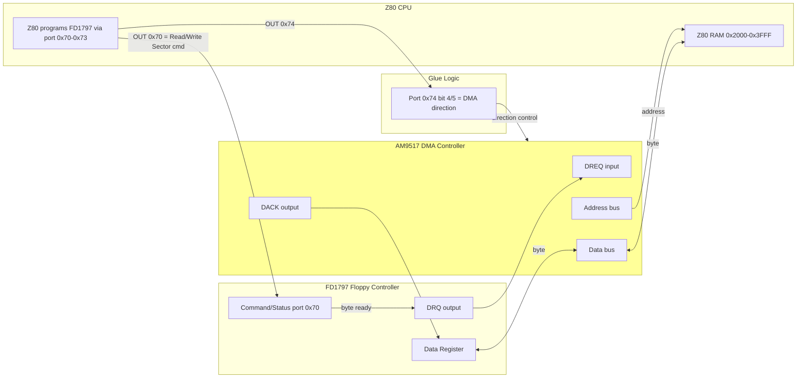

### Not Directly Z80-Accessible

There are **zero** Z80 I/O port instructions to any AM9517 registers in the firmware. The AM9517 is entirely **hardware-controlled** by the board glue logic.

The AM9517 sits between the FD1797 DRQ output and the Z80 RAM bus:
- FD1797 DRQ pin -> AM9517 DREQ input
- AM9517 address bus -> Z80 RAM address bus
- AM9517 data bus -> Z80 RAM data bus

During floppy read/write sector operations:
1. Z80 sets up the transfer via port 0x74 (DMA direction, drive select)
2. Z80 issues Read Sector or Write Sector command to FD1797 via port 0x70
3. Z80 HALTs waiting for interrupt
4. FD1797 asserts DRQ for each byte
5. AM9517 handles byte-by-byte DMA between FD1797 and Z80 RAM autonomously
6. When the sector transfer completes, FD1797 deasserts BUSY and asserts INTRQ
7. The interrupt wakes the Z80

The Z80 firmware never reads FD1797 port 0x73 (Data Register) via IN instruction during normal operation - 0 matches found. This confirms all data transfer goes through the AM9517 DMA, not programmed I/O.

### How Port 0x74 Controls DMA Direction

In `nd100_bus_dma_transfer` (0x0E8B), port 0x74 is written with:
- Bit 4 toggled: alternates transfer direction (read from disk vs. write to disk)
- Bit 5: set/cleared based on port 0x77 status

This configures the AM9517's direction control through the glue logic.

## Deep Dive: CTC Channel Usage

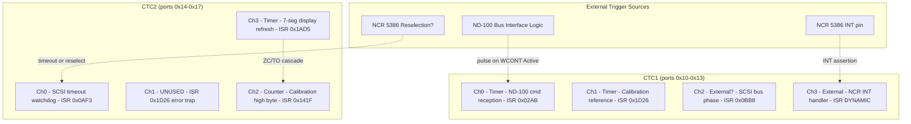

### CTC1 (ports 0x10-0x13)

#### CTC1 Ch0 (port 0x10) - ND-100 Command Reception

- **Mode:** Timer mode (control word 0x95), prescaler 16, time constant 0x10 (16)
- **Period:** 16 x 16 = 256 clock cycles
- **ISR:** 0x02AB (command receive handler)
- **Purpose:** Generates periodic interrupts to wake the Z80 from HALT. The ISR reads command data from the ND-100 bus interface (ports 0x50-0x54).
- **Note:** During early init, vector temporarily set to 0x015E (RETI, do nothing)
- **Uncertainty:** Earlier analysis suggested counter mode with external trigger from ND-100 bus. The control word 0x95 decodes as timer mode. I cannot determine from firmware alone whether the CLK/TRG pin also receives an external signal that would re-trigger the timer. The practical effect is the same: the Z80 wakes periodically and checks for commands.

#### CTC1 Ch1 (port 0x11) - Calibration Reference Timer

- **Mode:** Timer mode (control word 0xB5), prescaler 256, time constant 0xFF (255)
- **Period:** 256 x 255 = 65,280 clock cycles
- **ISR:** 0x1D26 (error handler - should never fire during normal operation)
- **Purpose:** Used during CTC clock calibration only. Provides a known time reference.
- **Dynamic:** Vector at 0x2072 temporarily changed to 0x141F during calibration, then restored.

#### CTC1 Ch2 (port 0x12) - SCSI Bus Phase Monitor

- **Mode:** Unknown - no explicit OUT to port 0x12 found in firmware
- **ISR:** 0x0BB8 (reads port 0x70 status, handles DMA direction, manages sector counting)
- **Purpose:** Fires on SCSI bus phase changes during I/O operations
- **Uncertainty:** May be triggered via CTC cascade (Ch1 ZC/TO -> Ch2 CLK/TRG) or by external hardware. No direct programming found.

#### CTC1 Ch3 (port 0x13) - NCR 5386 Interrupt Handler

- **Mode:** Unknown - no explicit OUT to port 0x13 found in firmware
- **ISR:** 0x0505 (default), dynamically changed to 0x1298/0x12A6/0x12BF during SCSI I/O
- **Purpose:** Primary NCR 5386 interrupt receiver. Handles SCSI data transfer phases.
- **Dynamic:** Vector at 0x2076 is the most heavily modified vector - switched between ISRs during every SCSI operation.
- **Uncertainty:** Same as Ch2 - no direct programming found, likely triggered by NCR 5386 INT via external CLK/TRG wiring.

### CTC2 (ports 0x14-0x17)

#### CTC2 Ch0 (port 0x14) - SCSI Timeout / Reselection Watchdog

- **Mode:** Unknown - only vector base written
- **ISR:** 0x0AF3 (writes 0xD0 to port 0x70, clears port 0x74, resets)
- **Purpose:** SCSI operation timeout. When it fires, aborts the current SCSI operation.
- **Uncertainty:** Programming may happen through RST 0x20 dispatch (C=0x14 seen in ISR).

#### CTC2 Ch1 (port 0x15) - Unused

- **Mode:** Not programmed
- **ISR:** 0x1D26 (error handler - safety trap)
- **Purpose:** Unused. If it ever fires, indicates a hardware fault.

#### CTC2 Ch2 (port 0x16) - Calibration Counter (High Byte)

- **Mode:** Counter mode (0x57), time constant 0xFF (255) during calibration
- **ISR:** 0x141F (calibration completion - reads counter values, stops timers)
- **Purpose:** Forms cascaded 16-bit counter with CTC2 Ch3 for clock measurement
- **Active only during:** calibrate_ctc_clock (0x1395)

#### CTC2 Ch3 (port 0x17) - 7-Segment Display Refresh

- **Mode:** Timer mode (0xB5), prescaler 256, time constant 0x80 (128)
- **Period:** 256 x 128 = 32,768 clock cycles
- **ISR:** 0x1AD5 (cycles through 3 display digits, outputs patterns to ports 0x40/0x41)
- **Purpose:** Multiplexes the 3-digit 7-segment display showing SCSI ID
- **Also used during:** CTC calibration as cascaded counter low byte (Ch3 ZC/TO -> Ch2 CLK/TRG)

## Deep Dive: Floppy Boot / Init Path

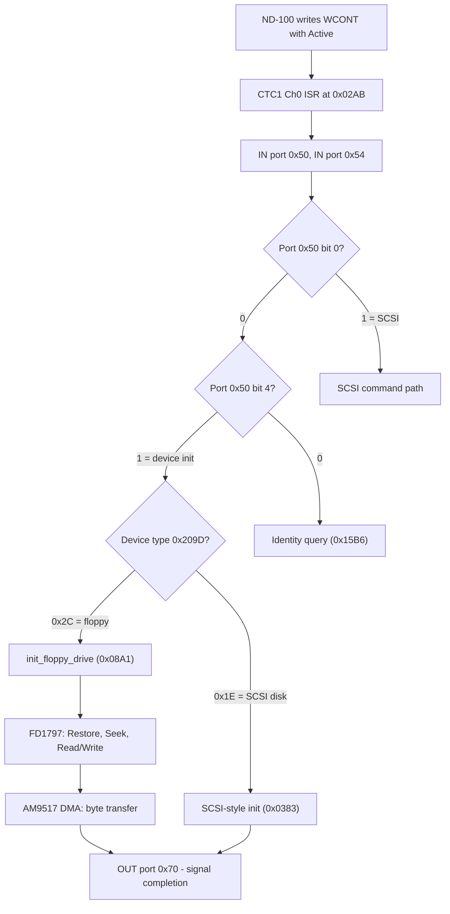

### How a Floppy Command Reaches the Z80

When the ND-100 sends a floppy command via IOX WCONT:

1. CTC1 Ch0 fires, ISR at 0x02AB reads ports 0x50/0x54
2. Port 0x50 bit 0 = 0 (NOT a SCSI command)
3. Port 0x50 bit 4 = 1 (device init command)
4. ISR reads additional data from ports 0x51-0x53 (block address)
5. DMA reads 12 bytes of device config from ND-100 memory into 0x2080
6. Checks device type at 0x209D:
   - **0x1E** -> handler at **0x0383** (SCSI device via floppy-style init)
   - **Other (0x2C = floppy)** -> handler at **0x08A1** (`init_floppy_drive`)

### Floppy Init Handler (0x08A1 = init_floppy_drive)

1. Sets IY = 0x2100 (drive control block)
2. Calls `disconnect_nd100_bus` (writes 0xD0 to port 0x70 = FD1797 Force Interrupt)
3. Checks motor status at 0x2106
4. If motor running: writes 0x00 to ports 0x74 (drive deselect), 0x75 (side deselect), 0x70 (FD1797 Restore), polls port 0x70 bit 0 until not busy
5. Clears 29 bytes of drive control block at 0x2100
6. Copies media type from 0x2098 to 0x210B
7. If device type = 0x2C (floppy):
   - Calls `get_head_count` (extracts from config bits 7:6 of 0x2081)
   - Calls `build_drive_select_mask` (sets density, motor, drive bits)
   - Derives sector count from format code table at 0x9C4: **26** (8" SD), **15** (5.25" DD), **8** (5.25" SD)
   - Calls `setup_disk_geometry` to compute buffer allocation and track layout
   - Calls `compute_chs_from_lba` for initial head positioning

### Floppy-Style SCSI Init Handler (0x0383)

This handles device type 0x1E (used for SCSI disks that use the floppy-like init path):

1. Calls `setup_disk_geometry` (0x07A4)
2. Reads port 0x77 bit 7 to select between two command templates (at 0x0C85 or 0x0C81)
3. Builds a command block at 0x2200 with transfer parameters
4. Copies 16 bytes from saved context (0x2184) and 12 bytes from saved disk params (0x2178) into the command buffer
5. Byte-swaps the command block entries (big-endian CDB format)
6. Calculates transfer size from remaining DMA count (0x20C7-0x20C9), caps at 0x17 (23) sectors
7. Calls `scsi_data_transfer` (0x03F7) to DMA the command data to ND-100 memory
8. Jumps to `scsi_start_io_operation` (0x0614) to begin the SCSI operation

### ND-3201 vs. ND-3112 Floppy Controller

The ND-3201 floppy implementation is **completely different** from the standalone ND-3112 floppy controller (NDBusFloppyDMA.cs):

| Aspect | ND-3112 (NDBusFloppyDMA.cs) | ND-3201 (this firmware) |
|--------|----------------------------|------------------------|
| CPU | None (hardware state machine) | Z80 |
| IOX Interface | Direct register mapping | Z80-mediated shared registers |
| DMA to ND-100 | Built-in DMA logic | Via ND-100 bus interface (ports 0x50-0x57) |
| Floppy DMA | Integrated | AM9517 (hardware-controlled, not Z80-accessible) |
| SCSI | None | NCR 5386 |
| Command Processing | Hardware state machine | Z80 firmware (ISR at 0x02AB dispatches) |

The ND-3201's floppy operations go through the same Z80 command processing pipeline as SCSI operations. The Z80 receives the command from the ND-100, programs the FD1797 and AM9517 for the floppy transfer, then signals completion back to the ND-100 via port 0x70.

## What WCONT Actually Does

**This section supersedes the "What the Z80 Does When WCONT is Written" material that follows it.**

WCONT (IOX+5) is written by the ND-100. What happens next depends on **which half of the board the
operation belongs to**, and the earlier revision conflated them.

### For a SCSI operation (VERIFIED against IP-P2-SCSI-DRIV.NPL)

The Z80 is not involved. WCONT is a **hardware control latch** on the SCSI half. The ND-100 drives
the NCR 5386 itself, and the interrupt it is waiting for comes from the **NCR**, not from firmware.

The decisive evidence is the tail of SINTRAN's interrupt handler `SCINT`:

```
SCINT: T:=HDEV+RSTAU; *IOXT              % READ DEVICE STATUS
       IF A=:SCSSR BIT 11 THEN           % INTERRUPT FROM NCR
          ...decode phase, service it, issue the next NCR command...
       FI
       5\/SCCCW; T:=HDEV+WCONT; *IOXT    % ACTIVATE+ENABLE INTERRUPT   <-- line 187
       GO SCWTI                          % park, wait for next interrupt
```

Line 187 is the **unconditional common tail**: every path that services an interrupt falls into it
on the way out. `SCCCW` is zeroed on handler entry (`0=:SCCCW`, line 139) and set to `40`&#8323;
only when a data transfer needs the DMA/direction bit (line 746). Therefore:

| Observed WCONT value | Meaning |
|---|---|
| `0x0005` (`5 \/ 0`) | SCINT exit re-arm, no transfer pending. Enable-Interrupt + Active only |
| `0x0065` (`5 \/ 40`&#8323;) | Same tail, during a data transfer (adds DMA-enable + write-direction) |

**A bare `WCONT=5` is not a request for work.** It means "I have finished servicing this interrupt;
re-arm the controller so a *future* NCR event can interrupt me," followed by parking at `SCWTI`.
`SCWTI` is the driver's normal wait-for-interrupt exit - **every** route out of the handler ends
`GO SCWTI` ("BUSY RETURN", "NO RETURN"), so "parked at SCWTI" is the ordinary idle state between
phases, not evidence of a hang.

**Consequence:** if the last interrupt serviced was a target Disconnect and nothing is queued, the
correct hardware behaviour after that final `WCONT=5` is **silence**. No NCR event exists, so no
interrupt should fire. A controller that manufactured a completion interrupt here would be wrong:
`SCINT` would re-enter, read RSTAU, find the NCR-interrupt bit (11) clear, service nothing, fall to
line 187, re-arm, and park again - an interrupt storm that accomplishes nothing.

Note also line 147: on Disconnect the driver calls `DCTHR` (disconnect logical thread) and goes to
`BUSFP` -> `SELEC`, which checks the **arbitration queue** for the next operation. If no further
work was queued, the driver is correctly idle - and the reason nothing was queued is a **CPU-side**
decision in SINTRAN's connect/verify layer, not a controller defect.

### For a floppy operation (INFERRED)

The Z80 half plausibly does use an ND-3112-style command-block model (host writes a command block,
controller executes, signals completion via port 0x70 -> RSTAU Ready -> level 11). The material
below describes that path. Treat it as **the floppy protocol**, and note that its specific trigger
mechanism (CTC1 Ch0 counter-mode pulse) is DISPROVED - see "Trigger Mechanism" above.

### WCONT Bit 4: Clear Device (VERIFIED, applies to both halves)

Asserts the Z80 RESET pin, so the floppy half reboots through its POST. This part of the original
analysis stands.

---

## What the Z80 Does When WCONT is Written - PARTIALLY RETRACTED

> **WARNING.** The SCSI branch of everything below is DISPROVED - the Z80 never touches the NCR
> 5386. Read "What WCONT Actually Does" above instead. The **floppy** and **Clear Device** paths
> remain broadly valid, but the trigger mechanism described (CTC1 Ch0 counter mode, TC=1) is
> refuted, and the function names cited were misnamed (see the Function Reference).

### WCONT Bit 2: Active (Start Operation) - SCSI branch RETRACTED

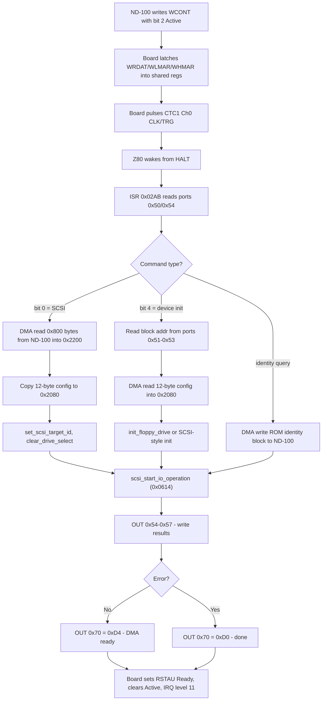

When the ND-100 sets the Active bit, the board hardware:
1. Latches whatever data was previously written to WRDAT/WLMAR/WHMAR into shared registers
2. Sends a pulse to CTC1 Ch0 CLK/TRG input
3. Z80 wakes from HALT, CTC fires IM2 interrupt -> ISR at 0x02AB

The Z80 ISR at 0x02AB then executes this sequence:

```
Step 1: Read command word
   IN A, (0x54)     ; command low byte from ND-100
   IN A, (0x50)     ; command high byte from ND-100
   Store to media_descriptor (0x2098)

Step 2: Decode command type from port 0x50 bits
   bit 0 = 1  ->  SCSI disk I/O command
   bit 1 = 1  ->  Bus control / special command
   bit 4 = 1  ->  Device init command
   all zero   ->  Identity / diagnostic query

Step 3: For SCSI commands (bit 0 set):
   a) DMA read 0x800 bytes from ND-100 memory (at MAR) into Z80 RAM at 0x2200
      using scsi_transfer_with_disconnect (0x03F1)
   b) Read ND-100 DMA address from 0x20C4-0x20C6
   c) If address is non-zero, loop back to (a) for more data
   d) Copy 12-byte default config from ROM 0x0377 to controller_config (0x2080)
   e) Set SCSI target ID = 1 via set_scsi_target_id (0x103C)
   f) Call clear_drive_select (0x0E08)
   g) Dispatch to scsi_start_io_operation (0x0614)

Step 4: For device init (bit 4 set):
   a) Reset CTC1 Ch3 ISR vector (0x2076) to default 0x0505
   b) Read block address: port 0x51 -> low, 0x52 -> mid, 0x53 -> high
      Store at block_address_lo (0x209A) and block_address_hi (0x209C)
   c) DMA read 12 bytes of device config from ND-100 memory into 0x2080
      using scsi_transfer_with_disconnect (0x03F1)
   d) Extract device type from drive_config_byte (0x2081) bits 5:0
   e) If device type = 0x1E: dispatch to handler 0x0383 (SCSI-style init)
      If device type = other: dispatch to init_floppy_drive (0x08A1)

Step 5: For identity query (bits 0-4 all zero, port 0x51=0, port 0x52=4):
   Dispatch to identity handler (0x15B6) which DMAs the ROM identity
   data block (from 0x15DF, contains IOX base 0xC8C0) to ND-100 memory

Step 6: Dispatch mechanism (at 0x036A):
   The handler address (in BC) is pushed onto the stack via EX SP,HL
   then RET jumps to it. The handler eventually calls
   scsi_start_io_operation (0x0614) which:
   a) Writes status/results to ports 0x54-0x57
   b) Either calls nd100_start_dma_transfer (OUT 0xD4 to port 0x70)
      or calls disconnect_nd100_bus (OUT 0xD0 to port 0x70)
   c) Board hardware sees port 0x70 write -> sets RSTAU[3] Ready,
      clears RSTAU[2] Active -> if RSTAU[0] IRQ enabled -> ND-100 level 11
```

### WCONT Bit 4: Clear Device

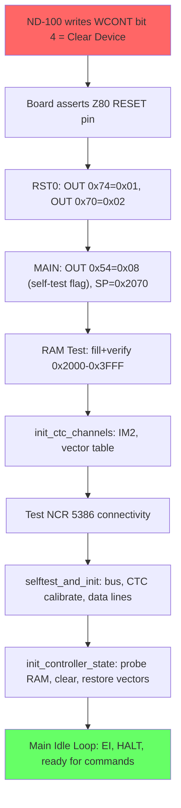

Clear Device causes a **hard reset** of the controller. Based on the Z80 firmware's reset sequence, the board hardware most likely asserts the Z80 RESET pin, causing the Z80 to restart from address 0x0000.

The Z80 then executes the full boot sequence:

```
Step 1: RST0 (0x0000) - Hardware init
   OUT (0x74), 0x01   ; initial drive select state
   OUT (0x70), 0x02   ; initial FD1797 state (Restore command variant)

Step 2: MAIN (0x003B) - Port init
   OUT (0x54), 0x08   ; status to ND-100: "self-test in progress"
   OUT (0x55), 0x00   ; clear SCSI ID
   OUT (0x56), 0x00   ; clear sense flags
   SP = 0x2070        ; initialize stack

Step 3: MainLoop (0x0086) - RAM test
   Fill 0x2000-0x3FFF with 0x00, verify (checksum with 0x55 seed)
   Fill with 0xFF, verify
   Fill with address high byte, verify
   On failure: display error code on 7-seg LEDs, halt forever

Step 4: Post-RAM-test init (0x00E8)
   SP = 0x2070
   IX = 0x2080 (controller state base)
   IY = 0x2100 (drive control block base)
   Call init_ctc_channels (0x0759): reset all CTC, set IM2, copy vector table
   Set CTC1 Ch0/Ch2/Ch3 vectors to 0x015E (RETI, safe during init)
   Call ncr5386_reset_parity (0x0708)
   Test NCR 5386 via scsi_select_and_verify (0x012E)
   Read port 0x28 (NCR aux status, flush pending state)

Step 5: selftest_and_init (0x0161)
   Check port 0x77 bit 0 (FDC busy), wait to clear
   Read port 0x70 bit 0 (bus busy), wait with timeout
   Call calibrate_ctc_clock (0x1395): binary search CTC calibration
   Write 0x01 to port 0x73, 0x12 to port 0x70 (seek to track 1)
   Enable interrupts, wait with timeout
   Test bus data lines with patterns (0x55, 0xAA, 0x0F, 0xF0)
   On failure: display error code 0-7 on 7-seg LEDs

Step 6: Final init (0x0227)
   Call init_controller_state (0x0253):
     Probe RAM size, clear state vars, init CTC (restores vector table)
   Set 0x2126-0x2128 = 0xFF (mark all units as uninitialized)
   Clear port 0x74 (drive deselect)
   Clear port 0x53 (ND-100 bus mode)
   Call setup_7seg_display_scsi_id (0x1AFA): show SCSI ID on display
   Program CTC1 Ch0 (port 0x10): control=0x95, constant=0x10

Step 7: Enter idle loop (0x0243)
   EI                              ; enable interrupts
   HALT                            ; sleep until CTC interrupt
   CALL process_pending_command    ; check for work
   JR back to HALT                 ; repeat

   Total time: thousands of Z80 clock cycles (RAM test alone is ~64K writes+reads)
```

The ND-100 can detect when boot completes because the CTC1 Ch0 ISR (0x02AB) only runs after the idle loop is entered. Before that, the CTC1 Ch0 vector points to 0x015E (RETI, do nothing). The SINTRAN driver typically waits for a timeout after Clear Device before sending the next command.

### WCONT Bit 4: Clear Device - The Reinit Path (0x80 mode)

There is also a **soft reinit** path in the Z80 firmware. When `scsi_command_entry_point` (0x1D4C) is entered with mode 0x80 (instead of a hard reset), it executes:

```
0x1DED: DI                          ; disable interrupts
0x1DEF: OUT (0x74), 0               ; clear drive select
0x1DF1: OUT (0x77), 0               ; clear motor control
        Clear state_flag_d5, current_drive_select, dcb_drive_select
0x1DFC: IN A, (0x28)                ; read NCR aux status (flush)
0x1DFE: LD A, 0x0F
0x1E00: OUT (0x2A), A               ; write 0x0F to NCR Own ID (all IDs enabled)
0x1E02: CALL disconnect_nd100_bus   ; OUT 0xD0 to port 0x70
0x1E05: CALL init_controller_state  ; probe RAM, clear state, init CTC
0x1E08: CALL calibrate_ctc_clock    ; recalibrate timers
0x1E0B: CALL ncr5386_reset_parity   ; reset NCR parity state
0x1E0E: CALL scsi_start_io_operation ; process initial status
0x1E11: JP 0x023B                   ; enter main idle loop
```

This soft reinit skips the RAM test and POST error checking, but still recalibrates the CTC and reinitializes all controller state. It takes less time than a hard reset but still involves significant Z80 processing.

### WCONT Bit 3: Test Mode

Test mode is handled entirely by the board hardware and glue logic. The Z80 firmware has no special handling for test mode. In test mode, reading RLMAR (IOX+0) causes the MAR to auto-increment, and if DMA Enable is also set, a memory read or write occurs. This is used for memory diagnostics without involving the Z80.

### WCONT Bit 5+6: DMA Enable + Write Direction

These bits control the AM9517 DMA controller and bus interface glue logic directly. The Z80 firmware does not see these bits. They configure whether DMA transfers go between the NCR 5386 and ND-100 memory, and in which direction.

### WCONT Bit 10: Reset SCSI Bus

This asserts the SCSI bus reset signal. The Z80 may or may not be involved. The NCR 5386 chip detects the reset and would interrupt the Z80 via CTC1 Ch3, entering the soft reinit path (mode 0x80).

## C# Emulator Analysis (NDBusDiscControllerSCSI.cs)

Comparison of the C# emulator at `RetroCore: Emulated.HW\ND\CPU\NDBUS\NDBusDiscControllerSCSI.cs` against the actual Z80 firmware behavior.

### Architecture Difference

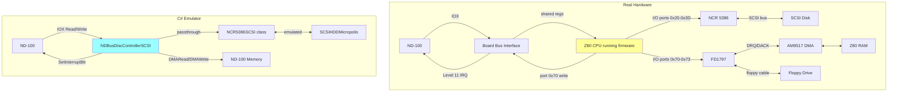

The C# emulator does NOT emulate the Z80. It emulates the controller at a higher level, passing NCR 5386 register reads/writes through directly from the ND-100 IOX interface to the NCR5386SCSI class. The real hardware has the Z80 as an active intermediary that receives commands, manages multi-phase SCSI transfers, handles floppy operations, and signals completion.

This means the SINTRAN driver talks "through" the emulated controller directly to the NCR 5386 emulation, whereas on real hardware the SINTRAN driver talks to the controller board, and the Z80 firmware mediates all NCR 5386 access.

### Issue 1: SetSCSIIdNumber writes to wrong NCR register

**File:** NDBusDiscControllerSCSI.cs, lines 792 and 804
**Severity:** Bug

```csharp
// Current code (WRONG):
ncr5386.Write((byte)SCSIRegisters.SourceID, (byte)regs.TW1);

// Should be:
ncr5386.Write((byte)SCSIRegisters.IDRegister, (byte)regs.TW1);
```

**Why:** The Source ID register (RSOUI, IOX offset 0x2E, octal 56) is a **read-only** register on the NCR 5386. It returns the SCSI ID of the device that selected or reselected the controller. Writing to it has no effect on the real chip.

The Z80 firmware writes the Own ID to the **ID Register** (WOIDN, port 0x2B). The SINTRAN driver also writes to WOIDN (not Source ID). The correct C# register is `SCSIRegisters.IDRegister`.

This bug exists in both `SetSCSIIdNumber()` (line 792) and `Reset()` (line 804).

### Issue 2: InterruptFromNCR5386 cleared on every RSTAU read

**File:** NDBusDiscControllerSCSI.cs, line 905
**Severity:** Potential bug - may cause lost interrupts

```csharp
// In the RSTAU read handler:
regs.InterruptFromNCR5386 = false;  // Clear flag
```

**Why:** On the real hardware, the NCR 5386 interrupt flag is acknowledged by reading the NCR's **Interrupt Register** (RITRG, IOX offset 0x2C), not by reading the controller's status register (RSTAU). The SINTRAN interrupt handler reads RSTAU first, then reads RITRG:

```
SCINT: T:= HDEV + RSTAU; *IOXT     % READ STATUS
       ...
       T+"RAUXS-WCONT"; *IOXT       % READ AUX STATUS
       T+"RITRG-RAUXS"; *IOXT       % READ INTERRUPT REG (acknowledges NCR IRQ)
```

If any code path reads RSTAU without following up with RITRG, or reads RSTAU twice (e.g., polling), the interrupt flag is lost on the first read. The flag should be cleared when RITRG is read, not when RSTAU is read.

On the real hardware, the NCR 5386 interrupt flag in RSTAU is a hardware signal -- it stays asserted as long as the NCR 5386's INT pin is active. It only clears when the NCR interrupt is acknowledged via RITRG read.

### Issue 3: ExecuteGo() is empty

**File:** NDBusDiscControllerSCSI.cs, lines 1326-1348
**Severity:** Design limitation (works only because SINTRAN programs NCR directly)

```csharp
private void ExecuteGo()
{
    dma_bytes_written = dma_bytes_read = 0;
    // ... debug logging ...
    return;  // <-- Returns immediately, all code below is dead

    // Dead code behind #if _GO_ ...
}
```

**Why this works anyway:** The SINTRAN driver programs the NCR 5386 directly via IOX registers (WNCOM, WDESI, WNDAT, transfer counters, etc.) and the C# emulator passes all those writes through to the NCR5386SCSI class. The NCR emulation handles the SCSI protocol autonomously. The controller emulator just manages DMA between NCR and ND-100 memory via `StepGoState()`.

**Why this differs from real hardware - RETRACTED.** The original claimed the Z80 "programs the NCR
5386 itself (ISRs at 0x1298/0x12A6/0x12BF)", "manages retries", and "handles disconnect/reconnect"
for SCSI. **All false** - the Z80 never touches the NCR (VERIFIED, see "THE ARCHITECTURE").

**Why it actually works - and why it is not merely "architecturally valid for emulation purposes":**
the "Why this works anyway" paragraph above is not a lucky accident, it is a correct description of
the hardware. On the real board the NCR 5386 is decoded straight onto the ND-100 IOX bus and
SINTRAN *is* the SCSI protocol engine. An emulator that passes IOX writes through to an NCR model
and lets the driver run the protocol is **faithful**, not a shortcut.

An empty `ExecuteGo()` is therefore not a design limitation for the SCSI path. `StepGoState()`
raising the IRQ only when `regs.InterruptFromNCR5386` is set matches the hardware contract: the
board completes a GO when the NCR has something to report, and stays silent otherwise. See
"What WCONT Actually Does".

**The residual limitation is real but is about FLOPPY, not SCSI:** the emulator has no Z80, so any
SINTRAN code that drives the *floppy* half through the ND-3112-style command word on ports
0x50-0x54 has nothing to talk to. That is Issue 7 (No floppy support), and it is the correct place
for this concern.

### Issue 4: NCR interrupt path skips Z80 processing - NOT AN ISSUE (RETRACTED)

> **This was never a defect. The emulator is right and this "issue" was the false model talking.**
>
> There is no Z80 processing to skip. The NCR 5386 interrupts the ND-100 **directly** (RSTAU bit 9,
> level 11 when WCONT bit 0 is set), and SINTRAN's `SCINT` services it. The claimed chain
> `NCR INT -> CTC1 Ch3 -> Z80 ISR (0x1298 -> 0x12BF -> 0x0505) -> port 0x70 -> ND-100` does not
> exist: the Z80 never reads or writes an NCR register anywhere in the ROM (VERIFIED by exhaustive
> I/O sweep).
>
> The premise "the Z80 only signals the ND-100 after the FULL operation completes" is also
> backwards for SCSI. Per `IP-P2-SCSI-DRIV.NPL`, the driver **wants** an interrupt per SCSI phase -
> `SCINT` decodes the phase, issues the next NCR command, re-arms (line 187) and parks at `SCWTI`.
> Signalling "after any single NCR interrupt" is not the emulator seeing intermediate states by
> accident; it is exactly the contract the driver is written against.
>
> The device trace corroborates this: 24 NCR interrupts = 24 controller completions = 24 RITRG
> acks, perfectly balanced, with the READ_6 data DMA'd successfully.

**Original text (RETRACTED), preserved for reference:**

**File:** NDBusDiscControllerSCSI.cs, lines 750-767 and 1220-1234
**Severity:** Timing/behavioral difference

On the real hardware:
```
NCR 5386 INT -> CTC1 Ch3 -> Z80 ISR chain (processes data, manages phases)
-> Z80 writes port 0x70 -> board sets RSTAU[3] -> ND-100 level 11 IRQ
```

In the C# emulator:
```
NCR interrupt -> set flag -> next Clock() -> StepGoState()
-> if InterruptFromNCR5386 && active: set readyForTransfer, clear active
-> if interruptEnabled: SetInterruptBit(true) -> immediate ND-100 IRQ
```

The Z80 firmware performs significant work between NCR interrupt and ND-100 notification:
1. Reads NCR status registers
2. Transfers data bytes via ISR chains (0x1298 -> 0x12BF -> 0x0505)
3. Manages command/data/status/message phases
4. Only signals the ND-100 after the FULL operation completes

The C# emulator signals the ND-100 after any single NCR interrupt, which may happen mid-operation (e.g., after command phase but before data phase). This could cause the SINTRAN driver to see intermediate states.

### Issue 5: Ncr5386_OnInterrupt immediate propagation commented out

**File:** NDBusDiscControllerSCSI.cs, lines 759-767
**Severity:** Uncertain - may be intentional

```csharp
// This code is commented out:
/*
if (regs.InterruptFromNCR5386 && regs.interruptEnabled)
{
    SetInterruptBit(true);
}
*/
```

The immediate interrupt propagation is disabled. Instead, `StepGoState()` handles it on the next `Clock()` cycle. This adds a one-cycle delay. I don't know if this was disabled to fix a specific timing issue or if it should be re-enabled.

### Issue 6: Clear Device immediately sets readyForTransfer

**File:** NDBusDiscControllerSCSI.cs, lines 1108-1127
**Severity:** Minor timing issue

```csharp
if ((value & 1 << 4) != 0)  // Clear Device
{
    regs.MemoryAddressLSB = 0;
    regs.MemoryAddressMSB = 0;
    bufferPointer = 0;
    readbufferPointer = 0;
    ncr5386.DeviceReset();
    regs.readyForTransfer = true;  // <-- Immediately ready
}
```

On the real hardware, after a Clear Device, the Z80 runs its full POST sequence (RAM test, CTC init, NCR 5386 selftest, CTC calibration) before becoming ready. This takes thousands of Z80 clock cycles. The immediate `readyForTransfer = true` could cause the ND-100 driver to send the next command before the controller has properly re-initialized.

For emulation purposes this is probably fine since there's no Z80 to re-initialize, but if timing-sensitive SINTRAN code checks for a delay after Clear Device, it would behave differently.

### Issue 7: No floppy support

**Severity:** Feature gap (probably intentional)

The C# emulator has no FD1797, AM9517, or floppy path. The Z80 firmware handles floppy through the same command receive ISR (port 0x50 bit 4 = device init, device type 0x2C = floppy). For systems that need floppy boot from the SCSI controller card, this would need to be added.

### Issue 8: DMA byte ordering uncertainty

**File:** NDBusDiscControllerSCSI.cs, lines 1282-1320
**Severity:** Uncertain

```csharp
// ReadNextByteDMA - even byte reads high byte of word:
data = (byte)(dma_read_data >> 8);

// WriteNextByteDMA - even byte writes to high byte of word:
dma_write_data = (ushort)((memData & 0x00FF) | ((data & 0xFF) << 8));
```

The emulator reads/writes the high byte first (even offset = MSB, odd offset = LSB). The ND-100 is big-endian and the SCSI bus transfers bytes MSB-first, so this is likely correct. However, I cannot verify the byte ordering from the Z80 firmware alone because the real DMA goes through the AM9517 hardware which may or may not swap bytes. If data appears byte-swapped in the emulator, this is the place to check.

### What Looks Correct

- **IOX register mapping** (RLMAR through WTCL) matches SINTRAN source symbols exactly
- **RSTAU status register bit layout** (bits 0-15) matches hardware documentation
- **WCONT control register bit layout** matches
- **NCR 5386 register passthrough** (IOX offsets 0x20-0x3D) correctly maps to NCR registers
- **InterruptLevel = 11** is correct for disk devices
- **IDENT clears interruptEnabled** matches expected ND-100 bus behavior
- **NDBusAddressLength = 63** is correct (IOX range covers 0x00-0x3F = 64 addresses, but 0-based = 63)
- **NCR register read/write mapping** matches the SINTRAN symbols and Z80 firmware port usage

---

## Recommended Changes

### Change 1: Fix SetSCSIIdNumber register (BUG FIX)

**What:** Change `SCSIRegisters.SourceID` to `SCSIRegisters.IDRegister` in two places.

**Where:** Lines 792 and 804 in NDBusDiscControllerSCSI.cs

**Why:** Source ID is read-only on the NCR 5386. The Own ID must be written to the ID Register. The Z80 firmware writes to port 0x2B (WOIDN = ID Register), and the SINTRAN driver also uses WOIDN. Writing to Source ID is a no-op on real hardware, meaning the emulated NCR 5386 may not have the correct Own ID set.

**How to test:**
1. Boot SINTRAN with the SCSI controller
2. Verify the controller responds to the correct SCSI ID (should be 7 for host)
3. If the NCR5386SCSI class ignores writes to SourceID, this bug has no effect. If it honors them (stores the value), then the Own ID is set via the wrong register and the actual IDRegister may be unset.
4. Check: does `ncr5386.Read((byte)SCSIRegisters.IDRegister)` return the TW1 value after `SetSCSIIdNumber()` is called? If not, the bug is active.

### Change 2: Move InterruptFromNCR5386 clear to RITRG read (BUG FIX)

**What:** Remove `regs.InterruptFromNCR5386 = false;` from the RSTAU read handler. Add it to the RITRG read handler instead.

**Where:**
- Remove from line 905 (case Register.RSTAU)
- Add to line 978-980 (case Register.RITRG), after the NCR read

**Why:** On real hardware, RSTAU bit 9 reflects the NCR 5386 INT pin state -- it stays set as long as the NCR is asserting interrupt. The interrupt is acknowledged (and the NCR clears INT) when the Interrupt Register is read via RITRG. Clearing the flag on RSTAU read means any double-read of RSTAU would lose the interrupt.

**How to test:**
1. Boot SINTRAN and run SCSI disk operations
2. Watch for "lost interrupt" symptoms: operations that hang waiting for an interrupt that was already cleared
3. Add logging to the RITRG read handler to verify it's being called and the flag is cleared there
4. Verify the SINTRAN interrupt handler sequence: RSTAU read -> RAUXS read -> RITRG read (the flag should survive until the RITRG read)

### Change 3: Consider re-enabling immediate NCR interrupt propagation (EVALUATION)

**What:** Evaluate whether the commented-out immediate interrupt code in `Ncr5386_OnInterrupt()` (lines 759-767) should be re-enabled.

**Where:** Lines 759-767

**Why:** Currently, NCR interrupts are delayed until the next `Clock()` cycle via `StepGoState()`. If the SINTRAN driver expects to see the interrupt on the same IOX cycle that triggered the NCR command, the one-cycle delay could cause timing issues. However, if re-enabling caused problems before (which is why it was commented out), the root cause should be investigated.

**How to test:**
1. Uncomment the immediate propagation code
2. Run the full SINTRAN boot and disk test suite
3. If it works, keep it enabled. If operations hang or produce errors, the delay is needed and the issue is elsewhere (possibly in the NCR5386SCSI state machine).

### Change 4: Implement ExecuteGo() properly - RATIONALE RETRACTED

> **The justification below is DISPROVED.** It rests on "the Z80 firmware actively manages the
> command lifecycle" for SCSI. It does not - the Z80 never touches the NCR 5386 (see "THE
> ARCHITECTURE"). The parenthetical in the original text, "The C# emulator works because SINTRAN
> programs the NCR directly", was the correct insight and should have been the conclusion.
>
> **Do NOT make a bare `WCONT=Active` produce a completion interrupt.** Per "What WCONT Actually
> Does", a `WCONT=5` with no NCR command loaded is `SCINT`'s exit re-arm (NPL line 187). Silence is
> the correct response. Manufacturing an interrupt there causes `SCINT` to re-enter, find RSTAU bit
> 11 clear, service nothing, re-arm, and park - an interrupt storm.
>
> The existing emulator behaviour - `StepGoState()` raising the ND-100 IRQ **only** when
> `regs.InterruptFromNCR5386` is set - already matches the hardware contract: a GO completes when
> the NCR has something to report. The sample code below happens to preserve that gate
> (`if (regs.InterruptFromNCR5386)`), so it is not itself harmful, but it should be adopted (if at
> all) as state-machine tidying, **not** as "matching the Z80 firmware".
>
> The doc-comment in the sample code below is factually wrong on points 1-4 and must not be pasted
> into the source.

**What:** Replace the empty ExecuteGo() with proper state management.

**Where:** Line 1326 in NDBusDiscControllerSCSI.cs

**Why (ORIGINAL, RETRACTED):** The empty ExecuteGo() relies on StepGoState() to handle everything, but the state transitions don't match the real hardware. On the real board, the Z80 firmware actively manages the command lifecycle. The C# emulator works because SINTRAN programs the NCR directly, but the state machine (active/ready/interrupt) should still behave correctly.

**Sample implementation based on Z80 firmware behavior:**

```csharp
/// <summary>
/// Execute the command that was loaded via IOX register writes.
///
/// On real hardware, writing WCONT with Active bit causes the board to:
/// 1. Latch command data into shared registers (Z80 ports 0x50-0x54)
/// 2. Pulse CTC1 Ch0 to wake the Z80 from HALT
/// 3. Z80 ISR at 0x02AB reads command, programs NCR, manages transfer phases
/// 4. Z80 writes completion to port 0x70 -> board sets Ready, clears Active
///
/// In this emulator, SINTRAN programs the NCR directly via IOX passthrough.
/// The NCR5386SCSI class handles the SCSI protocol autonomously.
/// ExecuteGo() just needs to manage the controller state machine correctly.
/// </summary>
private void ExecuteGo()
{
    dma_bytes_written = 0;
    dma_bytes_read = 0;

    // If the NCR already has a pending interrupt (from a previous operation),
    // the Z80 firmware would process it immediately and signal ready.
    if (regs.InterruptFromNCR5386)
    {
        regs.active = false;
        regs.readyForTransfer = true;

        if (regs.interruptEnabled)
        {
            SetInterruptBit(true);
        }
        return;
    }

    // If DMA is enabled, the NCR5386SCSI class will handle the SCSI protocol.
    // StepGoState() on each Clock() will transfer DMA bytes between NCR and
    // ND-100 memory. When NCR signals completion (interrupt), StepGoState()
    // will set readyForTransfer and generate the ND-100 interrupt.
    //
    // If DMA is NOT enabled, SINTRAN is doing register-level IOX access to
    // the NCR. The NCR interrupt will eventually fire when the SCSI operation
    // completes, and StepGoState() handles it.
    //
    // In both cases, the actual work happens in Clock() -> StepGoState().
    // Nothing more to do here.
}
```

**How to test:**
1. Boot SINTRAN with SCSI disk attached
2. Verify disk operations (read, write, format) complete without hanging
3. Check that the controller returns to ready state after each operation
4. Verify interrupt timing: ND-100 receives level 11 interrupt after each op completes
5. Test Clear Device (WCONT bit 4) followed by a new command

### Change 5: Clear Device should delay readyForTransfer (LOW PRIORITY)

**What:** After Clear Device, don't immediately set `readyForTransfer = true`. Instead, optionally add a small delay (a few Clock() cycles) before setting it.

**Where:** Line 1126

**Why:** On real hardware, the Z80 runs a full POST after reset (~thousands of cycles). If SINTRAN code checks for a delay after Clear Device, immediate ready could cause issues. However, this is likely not a problem in practice.

**How to test:**
1. Only implement if Clear Device operations cause problems (SINTRAN sends a command before the controller has re-initialized)
2. If no issues observed, leave as-is

## Additional C# Emulator Impacts from Firmware Analysis

Beyond the bugs documented in the Recommended Changes section above, the firmware analysis revealed these additional behavioral differences:

### Missing SCSI Operation Timeout

On the real hardware, CTC2 Ch0 (ISR at 0x0AF3) acts as a **watchdog timer** for SCSI operations. If the NCR 5386 doesn't complete within the timeout, the ISR fires and aborts:

```
0x0AF3: LD A, 0xD0        ; Force Interrupt / abort
        OUT (0x70), A     ; signal ND-100: disconnect
        CALL clear_nd100_bus_attention  ; clear drive select on port 0x74
        CALL event 0x1D24  ; enter error handler
```

The C# emulator has **no timeout mechanism** in `StepGoState()` or `Clock()`. If an NCR operation hangs (target doesn't respond, SCSI bus stuck), the controller stays in `active=true` forever, blocking all further operations.

**Suggested fix:** Add a cycle counter in `Clock()` that increments while `regs.active` is true. If it exceeds a threshold (derived from CTC2 Ch0's time constant on real hardware), force `regs.active = false`, set `regs.readyForTransfer = true`, and generate an interrupt with an error status.

### Bulk DMA Transfer in Single Clock Cycle

At line 1238 in `StepGoState()`:
```csharp
while (regs.DataRequestFromNCR5386 && regs.active)
{
    // transfers ALL pending bytes instantly
}
```

On real hardware, DMA happens byte-by-byte through the AM9517, with the Z80 ISR chains managing each phase. The entire transfer is spread across many clock cycles. The instant-transfer behavior is probably fine for SINTRAN, but could break timing-sensitive diagnostic software that polls RSTAU between DMA bytes.

### Missing SCSI Bus Reset Interrupt to ND-100

When WCONT bit 10 is set (Reset SCSI Bus), the C# emulator sets `regs.resetOnSCSIBus = true` (line 1130) and calls `ncr5386.InitiateResetSCSIBus()` (line 1134). RSTAU bit 5 will show the reset state. But there is no `SetInterruptBit(true)` call for the reset case.

On real hardware, RSTAU bit 5 (Reset on SCSI bus) generates an ND-100 level 11 interrupt if bit 0 (Enable Interrupt) is set. The Z80 firmware handles this through the soft reinit path (mode 0x80 in `scsi_command_entry_point`), which calls `disconnect_nd100_bus` (writes 0xD0 to port 0x70), triggering the ND-100 interrupt.

**Suggested fix:** After setting `regs.resetOnSCSIBus = true`, check if `regs.interruptEnabled` and call `SetInterruptBit(true)`.

### Missing Identity/Diagnostic Query Response

The Z80 firmware has an identity handler at 0x15B6 that responds to diagnostic queries from the ND-100. When the ND-100 sends a specific command word (port 0x50 bits 0-4 all zero, port 0x51=0, port 0x52=4), the Z80 DMAs a 0xC00-byte identity data block from ROM (address 0x15DF) to ND-100 memory. This block contains the IOX base address (0xC8C0) and controller identification data.

The C# emulator has no equivalent. If SINTRAN or diagnostic software queries the controller identity, there would be no response. This only affects device discovery and diagnostics, not normal disk I/O.

### Two Interrupt Sources in RSTAU

The RSTAU register documentation states:
> (*) Gives Interrupt to ND-100 if bit 0 (Enable Interrupt) is set.

This applies to both:
- **Bit 5:** Reset on SCSI bus
- **Bit 9:** Interrupt from NCR 5386

The C# emulator handles the NCR interrupt path (bit 9) but does not generate ND-100 interrupts for the SCSI bus reset path (bit 5). Both should trigger `SetInterruptBit(true)` when `regs.interruptEnabled` is set.

## Prioritized Change Summary

All issues found in the C# emulator, ordered by impact:

| Priority | Issue | Location | Risk if Unfixed |
|----------|-------|----------|----------------|
| **HIGH** | SetSCSIIdNumber writes to SourceID (read-only) instead of IDRegister | Lines 792, 804 | NCR 5386 may have wrong Own ID, causing SCSI arbitration/selection failures |
| **HIGH** | InterruptFromNCR5386 cleared on RSTAU read instead of RITRG read | Line 905 | Interrupts lost if RSTAU is read more than once before RITRG, causing hung operations |
| **MEDIUM** | No SCSI operation timeout (CTC2 Ch0 watchdog missing) | StepGoState/Clock | Controller hangs permanently if NCR operation never completes |
| **MEDIUM** | SCSI bus reset doesn't generate ND-100 interrupt | Lines 1130-1136 | ND-100 not notified of bus reset, driver may wait forever for status |
| **LOW** | ExecuteGo() empty - document architecture and add state handling | Line 1326 | Future maintainability; works now because SINTRAN programs NCR directly |
| **LOW** | No identity/diagnostic query response | N/A (missing feature) | Diagnostics and device discovery fail; normal I/O unaffected |
| **LOW** | Bulk DMA transfer in single Clock() cycle | Line 1238 | Timing difference; only matters for diagnostic software |
| **LOW** | Clear Device immediately sets readyForTransfer | Line 1126 | Timing difference; Z80 takes thousands of cycles to reboot |
| **INFO** | Ncr5386_OnInterrupt immediate propagation commented out | Lines 759-767 | Unknown if intentional; may need re-evaluation |
| **INFO** | DMA byte ordering (MSB first) | Lines 1282-1320 | Appears correct for ND-100 big-endian, but verify if data appears swapped |

## IOX Register Deep Dive: Z80 Firmware Behavior per Register

This section documents exactly what happens in the Z80 firmware for each IOX register, what the C# emulator currently does, and C# code showing what it should do based on the firmware analysis.

### Architecture: The Shared Register Block

The ND-100 accesses the controller via IOX instructions. The board has a **shared register block** between the ND-100 bus and the Z80:

```
ND-100 (IOX)                 Board Hardware              Z80 (I/O ports)
                          +-------------------+
IOX+0  RLMAR (Read)  <----|  MAR Low latch    |<--- OUT (0x50), L
IOX+1  WLMAR (Write) ---->|                   |
                          +-------------------+
IOX+2  REDAT (Read)  <----|  Data Buffer      |<--- OUT (0x54/0x55), data
IOX+3  WRDAT (Write) ---->|  (ring buffer)    |---> IN (0x54), data
                          +-------------------+
IOX+4  RSTAU (Read)  <----|  Status Latch     |<--- OUT (0x53/0x57), status
IOX+5  WCONT (Write) ---->|  Control Logic    |---> CTC1 Ch0 trigger
                          +-------------------+
IOX+6  RHMAR (Read)  <----|  MAR High latch   |<--- OUT (0x52), A
IOX+7  WHMAR (Write) ---->|                   |
                          +-------------------+
IOX+0x20-0x3D         <-->|  NCR 5386 direct  |<--> Z80 ports 0x20-0x3D
                          +-------------------+
```

The Z80 ports 0x50-0x57 map to the shared register block as follows:

| Z80 Port | Write Function | Read Function |
|----------|---------------|---------------|
| 0x50 | MAR low byte (DMA addr) | Command word high byte (from ND-100) |
| 0x51 | MAR mid byte (DMA addr) | Command param byte 1 (from ND-100) |
| 0x52 | MAR high byte (DMA addr) | Command param byte 2 (from ND-100) |
| 0x53 | Bus mode control (0x00=clear, 0x90=latch/readback) | Command param byte 3 (from ND-100) |
| 0x54 | Status/flags to ND-100 | Command word low byte (from ND-100) |
| 0x55 | SCSI ID / mid status to ND-100 | MAR readback low |
| 0x56 | Sense/direction flags to ND-100 | MAR readback mid |
| 0x57 | Completion/error status to ND-100 | MAR readback high |

---

### IOX+0 RLMAR: Read Memory Address Register (bits 0-15)

**ND-100 reads this to get the current DMA address.**

**Z80 firmware writes the MAR via ports 0x50-0x52** in `set_nd100_dma_address` (0x048C):
```
XOR A; OUT (0x53), A     ; clear control register
LD C, 0x50
OUT (C), L               ; port 0x50 = MAR low byte
INC C
OUT (C), H               ; port 0x51 = MAR mid byte
INC C
OUT (C), A               ; port 0x52 = MAR high byte
LD A, 0x90
OUT (0x53), A             ; latch the address (0x90 = activate)
CALL read_nd100_dma_address  ; verify by reading back from 0x55-0x57
XOR A; OUT (0x53), A     ; clear control register
```

**C# emulator current code:**
```csharp
case Register.RLMAR:
    rval = regs.MemoryAddressLSB;
    if (regs.testMode) regs.IncrementMarRegister();
    break;
```

**Assessment:** The C# code is correct. The auto-increment in test mode matches the hardware documentation. The Z80 firmware doesn't read RLMAR - it writes the MAR via ports 0x50-0x52 and the ND-100 reads it via IOX.

---

### IOX+1 WLMAR: Write Memory Address Register (bits 0-15)

**ND-100 writes this to set the DMA starting address.**

**Z80 firmware:** Does not directly see this write. The board hardware latches the value. When the ND-100 subsequently writes WCONT with Active, the CTC triggers the Z80, and the Z80 reads the command data from ports 0x50-0x54.

**C# emulator current code:**
```csharp
case Register.WLMAR:
    regs.MemoryAddressLSB = value;
    break;
```

**Assessment:** Correct. Simple latch.

---

### IOX+2 REDAT: Read Data

**ND-100 reads data from the controller's data buffer.**

**Z80 firmware writes data to the ND-100 via ports 0x54/0x55** using interrupt-driven OUTI instructions in ISRs at 0x15A8 and 0x15B0, and via `send_data_to_nd100_bus` (0x1593) which writes to port 0x57 as block acknowledgment.

The data transfer uses a ring buffer approach with the Z80 writing 2-byte values (port 0x55 = high, port 0x54 = low) via OUTI instructions during interrupt service.

**C# emulator current code:**
```csharp
case Register.REDAT:
    rval = DataBuffer[readbufferPointer];
    readbufferPointer = (readbufferPointer + 1) & BUFFER_MAX;
    break;
```

**Assessment:** Functionally correct as a ring buffer read. The Z80 firmware populates the buffer via ISR-driven port writes.

---

### IOX+3 WRDAT: Write Data

**ND-100 writes data to the controller's data buffer.**

**Z80 firmware reads command data from ports 0x50-0x54.** When the ND-100 writes WRDAT followed by WCONT with Active, the data appears on the Z80's read ports.

**C# emulator current code:**
```csharp
case Register.WRDAT:
    DataBuffer[bufferPointer] = value;
    bufferPointer = (bufferPointer + 1) & BUFFER_MAX;
    break;
```

**Assessment:** Correct. Stores into ring buffer.

---

### IOX+4 RSTAU: Read Status

**ND-100 reads this to check controller status and interrupt source.**

**Z80 firmware controls the status bits by writing to ports 0x53 (bus mode), 0x54-0x57 (status/results), and 0x70 (FD1797/completion).** The board glue logic assembles the RSTAU bits from these Z80 port writes and hardware signals.

Key Z80 actions that affect RSTAU:
- Writing 0xD0 to port 0x70 (`disconnect_nd100_bus`): clears Active (bit 2), sets Ready (bit 3)
- Writing 0xD4 to port 0x70 (`nd100_start_dma_transfer`): signals DMA ready
- Port 0x53 writes: affect bus mode/status bits
- NCR 5386 INT pin: sets bit 9 via hardware

**C# emulator current code:**
```csharp
case Register.RSTAU:
    if (regs.interruptEnabled) rval |= 1 << 0;
    if (regs.active) rval |= 1 << 2;
    if (regs.readyForTransfer) rval |= 1 << 3;
    if (regs.resetOnSCSIBus) rval |= 1 << 5;
    if (ncr5386.ChipDisabled()) rval |= 1 << 6;
    if (regs.DataRequestFromNCR5386) rval |= 1 << 8;
    if (regs.InterruptFromNCR5386) rval |= 1 << 9;
    if (regs.DataAcknowledgeToNCR5386) rval |= 1 << 10;
    if (ncr5386.SCSI_BSY()) rval |= 1 << 12;
    if (ncr5386.SCSI_REQ()) rval |= 1 << 13;
    if (ncr5386.SCSI_ACK()) rval |= 1 << 14;
    regs.InterruptFromNCR5386 = false;  // BUG: should clear on RITRG read
    break;
```

**Recommended C# code:**
```csharp
case Register.RSTAU:
    if (regs.interruptEnabled) rval |= 1 << 0;
    if (regs.active) rval |= 1 << 2;
    if (regs.readyForTransfer) rval |= 1 << 3;
    // Bit 4: OR of errors - not modeled (BERROR never happens in emulator)
    if (regs.resetOnSCSIBus) rval |= 1 << 5;
    if (ncr5386.ChipDisabled()) rval |= 1 << 6;
    // Bit 7: Single-ended - not modeled
    if (regs.DataRequestFromNCR5386) rval |= 1 << 8;
    if (regs.InterruptFromNCR5386) rval |= 1 << 9;
    if (regs.DataAcknowledgeToNCR5386) rval |= 1 << 10;
    // Bit 11: BERROR - never happens in emulator
    if (ncr5386.SCSI_BSY()) rval |= 1 << 12;
    if (ncr5386.SCSI_REQ()) rval |= 1 << 13;
    if (ncr5386.SCSI_ACK()) rval |= 1 << 14;
    // Bit 15: Differential - not modeled

    // DO NOT clear InterruptFromNCR5386 here.
    // On real hardware, RSTAU bit 9 reflects the NCR INT pin state.
    // It stays set as long as NCR is asserting interrupt.
    // The interrupt is acknowledged by reading RITRG (IOX+0x2C),
    // which causes the NCR to deassert INT.
    break;
```

---

### IOX+5 WCONT: Write Control

**ND-100 writes this to command the controller.**

This is the most complex register. See the "What the Z80 Does When WCONT is Written" section above for the full Z80 firmware trace.

**C# emulator current code (simplified):**
```csharp
case Register.WCONT:
    regs.interruptEnabled = (value & 1 << 0) != 0;
    regs.active = (value & 1 << 2) != 0;
    regs.testMode = (value & 1 << 3) != 0;
    regs.DMAEnable = (value & 1 << 5) != 0;
    regs.WriteNDMemory = (value & 1 << 6) != 0;

    if (regs.testMode) { /* immediate DMA read/write */ }
    if ((value & 1 << 4) != 0) { /* Clear Device: reset NCR, set ready */ }
    regs.resetOnSCSIBus = ((value & 1 << 10) != 0);
    if (regs.resetOnSCSIBus) { ncr5386.InitiateResetSCSIBus(); regs.readyForTransfer = true; }
    if (regs.active) { regs.readyForTransfer = false; ExecuteGo(); }
    else { if (interruptEnabled && readyForTransfer) SetInterruptBit(true); }
    break;
```

**Recommended C# code based on firmware analysis:**
```csharp
case Register.WCONT:
    regs.interruptEnabled = (value & 1 << 0) != 0;
    regs.active = (value & 1 << 2) != 0;
    regs.testMode = (value & 1 << 3) != 0;
    regs.DMAEnable = (value & 1 << 5) != 0;
    regs.WriteNDMemory = (value & 1 << 6) != 0;

    // Test Mode: immediate single-word DMA (no Z80 involvement on real HW)
    if (regs.testMode)
    {
        uint dma_address = regs.MAR;
        if (regs.WriteNDMemory)
        {
            DMAWrite(dma_address, regs.ReadWriteData);
        }
        else
        {
            regs.ReadWriteData = (ushort)DMARead(dma_address);
        }
    }

    // Clear Device: on real HW this asserts Z80 RESET, full reboot sequence
    // Z80 does: RAM test, CTC init, NCR selftest, CTC calibration
    // then writes 0x08 to port 0x54 (self-test status) during boot
    // and enters HALT idle loop when ready
    if ((value & 1 << 4) != 0)
    {
        regs.MemoryAddressLSB = 0;
        regs.MemoryAddressMSB = 0;
        bufferPointer = 0;
        readbufferPointer = 0;
        ncr5386.DeviceReset();
        regs.readyForTransfer = true;
        // On real HW: Z80 takes thousands of cycles before ready.
        // Consider adding a delay counter before setting readyForTransfer.
    }

    // Reset SCSI Bus
    regs.resetOnSCSIBus = ((value & 1 << 10) != 0);
    if (regs.resetOnSCSIBus)
    {
        ncr5386.InitiateResetSCSIBus();
        regs.readyForTransfer = true;
        // On real HW, RSTAU bit 5 generates ND-100 interrupt if bit 0 set
        if (regs.interruptEnabled)
        {
            SetInterruptBit(true);
        }
    }

    // Activate: start command processing
    // On real HW: board latches data, pulses CTC1 Ch0, Z80 ISR reads
    // command from ports 0x50-0x54, dispatches to handler, processes
    // SCSI/floppy operation, writes results to ports 0x54-0x57,
    // writes completion to port 0x70, board sets Ready and interrupts ND-100
    if (regs.active)
    {
        regs.readyForTransfer = false;
        dma_bytes_written = 0;
        dma_bytes_read = 0;

        // If NCR already has pending interrupt, complete immediately
        if (regs.InterruptFromNCR5386)
        {
            regs.active = false;
            regs.readyForTransfer = true;
            if (regs.interruptEnabled) SetInterruptBit(true);
        }
        // Otherwise: NCR5386SCSI handles the SCSI protocol.
        // StepGoState() on each Clock() transfers DMA bytes and
        // detects NCR completion.
    }
    else
    {
        // Not activating - just enabling interrupt.
        // If already ready, signal immediately.
        // This matches SINTRAN pattern: "5; T:= HDEV + WCONT; *IOXT"
        // which writes 5 (enable IRQ + active) after SELEC completes.
        if (regs.interruptEnabled && regs.readyForTransfer)
        {
            SetInterruptBit(true);
        }
    }
    break;
```

---

### IOX+6 RHMAR: Read Memory Address Register (bits 16-23)

**C# emulator:** `rval = regs.MemoryAddressMSB;` -- Correct.

---

### IOX+7 WHMAR: Write Memory Address Register (bits 16-23)

**C# emulator:** `regs.MemoryAddressMSB = (ushort)(value & 0xFF);` -- Correct.

---

### IOX+0x08 RXWC_HI: Read External Wordcount (bits 16-23, ND-3204 only)

**C# emulator:** `rval = regs.ExternalWordcountMSB;` -- Correct. Only used on ND-3204.

---

### IOX+0x0A RXWC: Read External Wordcount (bits 0-15, ND-3204 only)

**C# emulator:** `rval = regs.ExternalWordcountLSB;` -- Correct. Only used on ND-3204.

---

### IOX+0x20 RNDAT: Read NCR Data Register

**C# emulator:** `rval = ncr5386.Read((byte)SCSIRegisters.DataRegister);` -- Correct passthrough.

**Z80 firmware also reads this** via port 0x20 (IN A,(0x20)) in `scsi_execute_io_operation` at 0x1248 during the status phase to read SCSI status bytes.

---

### IOX+0x21 WNDAT: Write NCR Data Register

**C# emulator:** `ncr5386.Write((byte)SCSIRegisters.DataRegister, (byte)value);` -- Correct passthrough.

---

### IOX+0x22 RNCOM: Read NCR Command Register

**C# emulator:** `rval = ncr5386.Read((byte)SCSIRegisters.CommandRegister);` -- Correct.

**Note:** Per NCR 5386 datasheet, the Command Register is reset when the chip sets an interrupt, so the read value may not reflect the last command written.

---

### IOX+0x23 WNCOM: Write NCR Command Register

**C# emulator:** `ncr5386.Write((byte)SCSIRegisters.CommandRegister, (byte)value);` -- Correct.

This is the register that starts NCR operations. SINTRAN writes commands like:
- 0x03: Set ATN
- 0x04: Message Accepted
- 0x00: Disconnect
- Select With/Without ATN
- Transfer Info (single byte or DMA)

---

### IOX+0x24/0x25 RNCNT/WNCNT: NCR Control Register

**C# emulator:** Correct passthrough. Bits: 0=Select enable, 1=Reselect enable, 2=Parity enable.

---

### IOX+0x26/0x27 RDESI/WDESI: Destination ID Register

**C# emulator:** Correct passthrough. SINTRAN writes the target SCSI ID here before Select commands.

---

### IOX+0x28/0x29 RAUXS/WAUXS: Auxiliary Status Register

**C# emulator:** Correct passthrough.

**Z80 firmware** reads this at port 0x28 (IN A,(0x28)) in:
- `ncr5386_reset_parity` (0x0708): writes 0x20 to port 0x28 to reset diagnostic state
- ISR 0x0505: reads status to determine SCSI bus phase
- `scsi_command_entry_point` (0x1DFC): reads to flush/acknowledge NCR state during reinit

---

### IOX+0x2A/0x2B ROIDN/WOIDN: Own ID Register

**C# emulator:** Correct passthrough for WOIDN.

**Z80 firmware** writes port 0x2A (WOIDN) in:
- `ncr5386_set_own_id_and_program` (0x0711): sets Own ID for transfer operations
- `scsi_enable_selection` (0x06B6): writes 0x02 to enable selection
- `scsi_command_entry_point` (0x1E00): writes 0x0F during reinit (enable all IDs)

**BUG REMINDER:** `SetSCSIIdNumber()` writes to `SCSIRegisters.SourceID` instead of `SCSIRegisters.IDRegister`. Fix at lines 792 and 804.

---

### IOX+0x2C RITRG: Read Interrupt Register

**C# emulator current code:**
```csharp
case Register.RITRG:
    rval = ncr5386.Read((byte)SCSIRegisters.InterruptRegister);
    break;
```

**Recommended C# code:**
```csharp
case Register.RITRG:
    rval = ncr5386.Read((byte)SCSIRegisters.InterruptRegister);
    // Reading the Interrupt Register acknowledges the NCR interrupt.
    // The NCR deasserts INT, which clears RSTAU bit 9.
    // This is where InterruptFromNCR5386 should be cleared,
    // NOT in the RSTAU read handler.
    regs.InterruptFromNCR5386 = false;
    break;
```

**Why:** On real hardware, reading RITRG causes the NCR 5386 to deassert its INT pin, which clears the hardware signal that feeds into RSTAU bit 9. The SINTRAN interrupt handler reads RSTAU first (to check what happened), then reads RITRG (to acknowledge). Clearing the flag on RSTAU read would lose it before RITRG is read.

---

### IOX+0x2E RSOUI: Read Source ID

**C# emulator:** `rval = ncr5386.Read((byte)SCSIRegisters.SourceID);` -- Correct. Read-only register returning the ID of the selecting/reselecting device.

---

### IOX+0x32 RDIST: Read Diagnostic Status

**C# emulator:** `rval = ncr5386.Read((byte)SCSIRegisters.DiagnosticStatus);` -- Correct. Bit 7 (SLFCO) = selftest complete.

---

### IOX+0x38/0x39 RTCM/WTCM: Transfer Counter MSB

**C# emulator:** Correct passthrough. SINTRAN sets this as part of the SCSI Select command sequence.

---

### IOX+0x3A/0x3B RTC2/WTC2: Transfer Counter 2nd Byte

**C# emulator:** Correct passthrough.

---

### IOX+0x3C/0x3D RTCL/WTCL: Transfer Counter LSB

**C# emulator:** Correct passthrough.

---

### Summary: Z80 Port to IOX Register Mapping

This table shows how Z80 port writes/reads map to what the ND-100 sees via IOX:

| Z80 Action | Z80 Port | Direction | IOX Effect | IOX Register |
|-----------|----------|-----------|------------|-------------|
| Write MAR low | OUT (0x50), L | Z80 -> HW | Sets MAR low byte | Readable via RLMAR (IOX+0) |
| Write MAR mid | OUT (0x51), H | Z80 -> HW | Sets MAR mid byte | Readable via RLMAR (IOX+0) |
| Write MAR high | OUT (0x52), A | Z80 -> HW | Sets MAR high byte | Readable via RHMAR (IOX+6) |
| Latch MAR | OUT (0x53), 0x90 | Z80 -> HW | Activates readback | Enables RLMAR/RHMAR |
| Clear control | OUT (0x53), 0x00 | Z80 -> HW | Clears bus mode | - |
| Write status | OUT (0x53), mode | Z80 -> HW | Sets SCSI selection state | Affects RSTAU bits |
| Write flags | OUT (0x54), flags | Z80 -> HW | Device select / status | Readable via REDAT? |
| Write SCSI ID | OUT (0x55), id | Z80 -> HW | SCSI target ID | Readable via REDAT? |
| Write direction | OUT (0x56), dir | Z80 -> HW | Transfer direction flag | Affects RSTAU? |
| Write completion | OUT (0x57), status | Z80 -> HW | Error/done flags | Affects RSTAU ready |
| Write FD1797 cmd | OUT (0x70), cmd | Z80 -> HW | FD1797 command + bus status | Sets RSTAU Active/Ready |
| Read cmd high | IN A, (0x50) | HW -> Z80 | Gets ND-100 command word high | Written via WRDAT/WLMAR |
| Read param 1 | IN A, (0x51) | HW -> Z80 | Gets command parameter | Written via WRDAT |
| Read param 2 | IN A, (0x52) | HW -> Z80 | Gets command parameter | Written via WRDAT |
| Read param 3 | IN A, (0x53) | HW -> Z80 | Gets command parameter | Written via WRDAT |
| Read cmd low | IN A, (0x54) | HW -> Z80 | Gets ND-100 command word low | Written via WRDAT/WLMAR |
| Read MAR back | IN A, (0x55) | HW -> Z80 | Readback MAR low | After 0x90 latch |
| Read MAR back | IN A, (0x56) | HW -> Z80 | Readback MAR mid | After 0x90 latch |
| Read MAR back | IN A, (0x57) | HW -> Z80 | Readback MAR high | After 0x90 latch |

## Debugging: BUS RESET Loop

### Observed Symptom

The emulated SCSI controller loops indefinitely with this pattern every ~5 seconds:

```
BUS RESET -> 4s -> SELECTION:0 -> ReadCapacity -> STATUS:0 GOOD -> 5s -> BUS RESET -> repeat
```

The ReadCapacity SCSI command **succeeds every time** on the SCSI bus (correct 8-byte response, STATUS 0 GOOD, MESSAGE_IN 0x00 = Command Complete). But SINTRAN resets the bus again ~5 seconds later.

### Root Cause: RSTAU Read Clears NCR Interrupt Flag Too Early

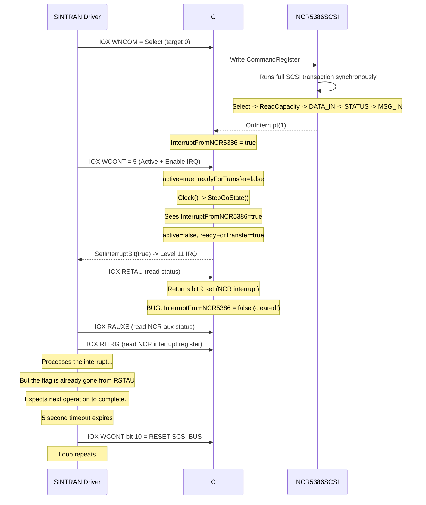

### The Specific Code Bug

In `NDBusDiscControllerSCSI.cs` line 905, inside the `RSTAU` read handler:

```csharp
// CURRENT CODE (BUGGY):
case Register.RSTAU:
    if (regs.interruptEnabled) rval |= 1 << 0;
    if (regs.active) rval |= 1 << 2;
    if (regs.readyForTransfer) rval |= 1 << 3;
    // ...
    if (regs.InterruptFromNCR5386) rval |= 1 << 9;
    // ...
    regs.InterruptFromNCR5386 = false;  // <- THIS CAUSES THE LOOP
    break;
```

On **real hardware**, RSTAU bit 9 is a **hardware signal** that mirrors the NCR 5386 INT pin. It stays asserted as long as the NCR's INT pin is active. Reading RSTAU does NOT clear it. The NCR only deasserts INT when its **Interrupt Register (RITRG, IOX+0x2C)** is read.

### Why This Causes the 5-Second Loop

The SINTRAN interrupt handler (SCINT) follows this exact sequence:

```
SCINT: T:= HDEV + RSTAU; *IOXT     % 1. Read status -> sees bit 9
       "0"; T:= HDEV + WCONT; *IOXT % 2. Clear controller
       T+"RAUXS-WCONT"; *IOXT       % 3. Read NCR aux status
       T+"RITRG-RAUXS"; *IOXT       % 4. Read NCR interrupt reg (acknowledge)
```

Step 1 reads RSTAU and sees the NCR interrupt (bit 9). But the C# emulator **immediately clears the flag**. After step 2 clears the controller, SINTRAN continues processing. But subsequent state checks may fail because the flag is gone.

More critically: if SINTRAN's processing path re-reads RSTAU (for any reason), or if `StepGoState()` needs the flag for state transitions, it's already cleared. The controller gets stuck in an incomplete state, and SINTRAN's 5-second watchdog timer fires.

### The Fix

```csharp
// FIXED CODE:
case Register.RSTAU:
    if (regs.interruptEnabled) rval |= 1 << 0;
    if (regs.active) rval |= 1 << 2;
    if (regs.readyForTransfer) rval |= 1 << 3;
    if (regs.resetOnSCSIBus) rval |= 1 << 5;
    if (ncr5386.ChipDisabled()) rval |= 1 << 6;
    if (regs.DataRequestFromNCR5386) rval |= 1 << 8;
    if (regs.InterruptFromNCR5386) rval |= 1 << 9;
    if (regs.DataAcknowledgeToNCR5386) rval |= 1 << 10;
    if (ncr5386.SCSI_BSY()) rval |= 1 << 12;
    if (ncr5386.SCSI_REQ()) rval |= 1 << 13;
    if (ncr5386.SCSI_ACK()) rval |= 1 << 14;
    // DO NOT clear InterruptFromNCR5386 here!
    // On real hardware this is a live signal from the NCR INT pin.
    break;

case Register.RITRG:
    rval = ncr5386.Read((byte)SCSIRegisters.InterruptRegister);
    // Clear the flag HERE - reading RITRG acknowledges the NCR interrupt,
    // causing the NCR to deassert INT, which clears RSTAU bit 9.
    regs.InterruptFromNCR5386 = false;
    break;
```

### Additional Check: NCR Chip Disabled

If `ncr5386.ChipDisabled()` returns `true`, RSTAU bit 6 would be set. The SINTRAN handler checks:

```
IF X:= 64 /\ A >< 0 THEN   % 64 decimal = 0x40 = bit 6
```

If bit 6 is set (NCR disabled), SINTRAN would treat the controller as non-functional and skip interrupt processing. Verify that `ChipDisabled()` returns `false` during normal operation.

### Additional Check: Interrupt Propagation Timing

The commented-out code in `Ncr5386_OnInterrupt()` (lines 759-767) means NCR interrupts are delayed until the next `Clock()` cycle. If `Clock()` doesn't run between the NCR completion and SINTRAN's WCONT write, the state transition may not happen in time.

**Recommended fix for `Ncr5386_OnInterrupt`:**

```csharp
private void Ncr5386_OnInterrupt(byte intr)
{
    if (intr != 0)
    {
        regs.InterruptFromNCR5386 = true;

        // Complete the operation immediately if controller is active.
        // On real hardware, the Z80 ISR chain handles this over many
        // cycles, but the end result is the same: active->false,
        // readyForTransfer->true, then ND-100 gets interrupt.
        if (regs.active)
        {
            regs.active = false;
            regs.readyForTransfer = true;
        }

        if (regs.interruptEnabled)
        {
            SetInterruptBit(true);
        }
    }
}
```

### What SINTRAN Expects to See in RSTAU

After a successful SCSI command, SINTRAN's interrupt handler expects:

| Bit | Value | Meaning |
|-----|-------|---------|
| 0 | 1 | Interrupt Enabled (we set it via WCONT) |
| 2 | 0 | NOT Busy (command complete) |
| 3 | 1 | Ready for Transfer (data available in DMA memory) |
| 9 | 1 | NCR Interrupt (SCSI operation complete) |

If any of these are wrong, SINTRAN either waits (bit 2 set = busy) or can't determine what happened (bit 9 clear = no interrupt source).

### What Causes SINTRAN to Issue BUS RESET

SINTRAN writes WCONT bit 10 (SCSI Bus Reset) in these situations:

1. **Initialization**: First boot, SINTRAN always resets the bus to discover devices
2. **Select timeout**: SELEC routine sets a 5-second timer (`-5 =:TMR`). If selection doesn't complete, it resets
3. **Error recovery**: After detecting a bus error, protocol violation, or unexpected disconnect
4. **No interrupt after command**: If the controller stays busy (RSTAU bit 2 set) for too long
5. **RSTAU shows unexpected state**: If the status bits don't match expected completion pattern

In your log, cause #2 or #4 is most likely - SINTRAN's 5-second timeout expires because the completion interrupt didn't propagate correctly to the ND-100.

## Floppy Boot Process

### Complete Floppy Boot Flow

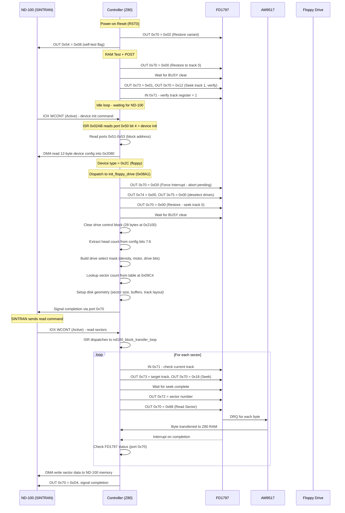

### Floppy Format Table

The firmware supports three floppy formats, selected by the lower nibble of the config byte:

| Format Code | Sectors/Track | Bytes/Sector | Media | Table at 0x09C4 |
|------------|---------------|-------------|-------|----------------|
| 0 | 26 (0x1A) | 128 | 8" Single Density | 0x09C4 |
| 1 | 15 (0x0F) | 256 | 5.25" Double Density or 8" DD | 0x09C5 |
| 2 | 8 (0x08) | 512 | 5.25" Double Density | 0x09C6 |

### Drive Select Mask (built by build_drive_select_mask at 0x09D4)

| Bit | Meaning | Source |
|-----|---------|--------|
| 0-3 | Drive select (one-hot: 0x01=drive 0, etc.) | Head count shifted |
| 4 | Motor on | Set when config bit 3 is NOT set |
| 7 | Mini-floppy / 8" density flag | Set when media descriptor bit 2 is set |

### FD1797 Status Bits and Error Mapping

After Read/Write Sector commands, port 0x70 status maps to errors:

| Bit | Mask | FD1797 Meaning | Firmware Action | Error Event |
|-----|------|---------------|----------------|-------------|
| 0 | 0x01 | BUSY | Poll until clear | 0x91 if stuck |
| 2 | 0x04 | Lost Data | Abort transfer | 0x92 (0x1D18) |
| 3 | 0x08 | CRC Error | Retry with recalibrate | Part of 0x89 |
| 4 | 0x10 | Record Not Found | Retry seek | 0x89 (0x1D03) |
| 5 | 0x20 | Record Type / Deleted | Used for EOF detection | Not an error |
| 6 | 0x40 | Write Protect | Abort write | 0x8E (0x1D10) |
| 7 | 0x80 | Not Ready | Abort operation | 0x90 (0x1D14) |

Status mask 0xBC (bits 7,5,4,3,2) is checked after Read Sector at 0x101C.
Status mask 0x18 (bits 4,3) is checked after Seek at 0x0E32.
Status mask 0x9C (bits 7,4,3,2) is checked after Read Address at 0x0EBF.

### Floppy Error Codes Sent to ND-100

All errors go through `scsi_start_io_operation` (0x0614) which writes to ports 0x54-0x57:

| Port | Content | Meaning |
|------|---------|---------|
| 0x54 | io_flags (0x208D) | Bit 3=complete, bit 4=check condition, bit 7=fatal |
| 0x55 | error_code * 2 (from 0x2194 << 1) | The error code shifted left by 1 |
| 0x56 | 0x00 or 0x80 | Bit 7 = SCSI device flag (0 for floppy) |
| 0x57 | completion status | 0x00=success, 0x01=error, 0x03=fatal error |

**Error code in port 0x55** is the event code lower 6 bits, shifted left. Examples:

| Event | Code byte | Lower 6 bits | Port 0x55 value | Meaning |
|-------|-----------|-------------|----------------|---------|
| 0x1D03 | 0x89 | 0x09 | 0x12 (18 dec) | CRC error / Record Not Found |
| 0x1D0A | 0x8B | 0x0B | 0x16 (22 dec) | Invalid format code |
| 0x1D10 | 0x8E | 0x0E | 0x1C (28 dec) | Write protect |
| 0x1D14 | 0x90 | 0x10 | 0x20 (32 dec) | **Drive not ready** |
| 0x1D16 | 0x91 | 0x11 | 0x22 (34 dec) | FD1797 busy timeout |
| 0x1D18 | 0x92 | 0x12 | 0x24 (36 dec) | Lost data |
| 0x1D1A | 0x93 | 0x13 | 0x26 (38 dec) | Restore failed |
| 0x1D20 | 0x97 | 0x17 | 0x2E (46 dec) | Read/write retries exhausted |
| 0x1D22 | 0x98 | 0x18 | 0x30 (48 dec) | Sector out of range |
| 0x1CFD | 0x86 | 0x06 | 0x0C (12 dec) | **SCSI bus error** |

### Your Specific Error Codes

**Error code 0x20 (decimal 32) = port 0x55 value 0x20:**
This is event 0x90 (lower 6 bits = 0x10, shifted left = 0x20). It means **"Drive Not Ready"** - triggered when FD1797 status bit 7 (Not Ready) is set. Causes:
- Floppy drive motor not spinning
- No disk inserted
- Drive door open
- Drive not connected

**Error code 0x06 (decimal 6) = port 0x55 value 0x06:**
Lower 6 bits = 0x03, so the event code would be 0x83 or similar. But 0x06 doesn't directly match an event table entry as a port 0x55 value. If 0x06 is seen in the **sense byte** (port 0x56 or 0x208F), it means **SCSI Sense Key 0x06 = "Unit Attention"** - the SCSI target device was reset or media was changed. This comes from the NCR 5386 reading the actual sense data from the SCSI target disk, not from the floppy path.

### Complete Error Code Reference

| Event Addr | Code Byte | Port 0x55 | Trigger | FD1797 Status | Meaning |
|-----------|-----------|-----------|---------|--------------|---------|
| 0x1CFB | 0x85 | 0x0A | NCR parity check | - | SCSI parity error |
| 0x1CFD | 0x86 | 0x0C | scsi_reselection_handler | - | SCSI bus error |
| 0x1CFF | 0x87 | 0x0E | - | - | Seek retry exhausted |
| 0x1D01 | 0x88 | 0x10 | seek_and_select_drive | Bit 3+4 | Seek verify failed |
| 0x1D03 | 0x89 | 0x12 | nd100_block_transfer_loop | Bit 3 or 4 | CRC / Record Not Found |
| 0x1D05 | 0x8A | 0x14 | set_status_and_restart | - | Track mismatch |
| 0x1D0A | 0x8B | 0x16 | init_floppy_drive | - | Invalid format code |
| 0x1D0C | 0x8C | 0x18 | check_scsi_bus_change | - | Unexpected disconnect |
| 0x1D0E | 0x8D | 0x1A | check_scsi_bus_change | - | Unexpected reconnect |
| 0x1D10 | 0x8E | 0x1C | scsi_execute_io_operation | - | Unit attention / Write protect |
| 0x1D12 | 0x8F | 0x1E | scsi_reselection_handler | - | SCSI bus error (reselect) |
| 0x1D14 | 0x90 | **0x20** | poll_nd100_bus_ready, scsi_select_target | Bit 7 | **Drive Not Ready / Bus timeout** |
| 0x1D16 | 0x91 | 0x22 | scsi_select_target | Bit 0 stuck | FD1797 busy timeout |
| 0x1D18 | 0x92 | 0x24 | nd100_block_transfer_loop | Bit 2 | **Lost Data** |
| 0x1D1A | 0x93 | 0x26 | nd100_bus_issue_cmd_and_wait | - | Reselection retry exhausted |
| 0x1D1C | 0x95 | 0x2A | process_pending_command | - | Command re-entry |
| 0x1D1E | 0x96 | 0x2C | NMI watchdog | - | Watchdog timeout |
| 0x1D20 | 0x97 | 0x2E | scsi_execute_io_operation | - | I/O retries exhausted (3x) |
| 0x1D22 | 0x98 | 0x30 | compute_chs_from_lba | - | Sector out of range |
| 0x1D24 | 0x9A | 0x34 | CTC2 Ch0 ISR | - | SCSI operation timeout |
| 0x1D26 | 0x9B | 0x36 | ncr5386_read_verify_transfer | - | Transfer counter mismatch |
| 0x1D28 | 0x20 | 0x40 | set_nd100_dma_address verify | - | DMA address readback fail |
| 0x1D2C | 0x22 | 0x44 | - | - | (reserved) |
| 0x1D2E | 0x22 | 0x44 | dispatch_by_scsi_id | - | End of dispatch table |
| 0x1D32 | 0xA6 | 0x4C | set_nd100_dma_address | - | DMA address mismatch |

## Confirmed from ND-3106/3112 Manual (ND-11.021.1)

The ND-3106/3112 floppy/streamer controller manual confirms the ND-100 bus interface architecture is shared across ND controllers. Key findings that apply to the ND-3201:

### Port 0x50-0x57 Register Names (confirmed identical)

| Port | Write Name | Write Function | Read Name | Read Function |
|------|-----------|---------------|-----------|---------------|
| 0x50 | ADL | DMA Address bits 0-7 | CW1 | Control Word low (bit 0=autoload, 4=activate, 5=ENI, 6=DMA enabled, 7=BERROR) |
| 0x51 | ADM | DMA Address bits 8-15 | POL | Pointer/data bits 0-7 |
| 0x52 | ADH | DMA Address bits 16-23 | POM | Pointer/data bits 8-15 |
| 0x53 | DD-T | DMA Direction+Test (bit 0=dir, 1=enable DMA, 7=NTEST) | POH | Pointer bits 16-23 |
| 0x54 | DLO | Data Out bits 0-7 | CW2 | Control Word bits 9-15 |
| 0x55 | DHI | Data Out bits 8-15 | - | ND-100 MAR bits 0-7 |
| 0x56 | NSTAT | Status for ND-100 (maps to HW status bits 5,6,8-13) | - | ND-100 MAR bits 8-15 |
| 0x57 | NFINI | Set RFT + error flags (bit 0=error, bit 1=hard error) | - | ND-100 MAR bits 16-23 |

**Writing to port 0x57 (NFINI) always sets RFT (Ready For Transfer)** and generates an ND-100 interrupt if enabled. This is the trigger mechanism.

### Command Block Format (6 words in ND-100 memory)

| Offset | Content |
|--------|---------|
| +0 | Command Word (bits 0-5=function, 6-7=unit, 8-9=bytes/sector, 10=sides, 11=density) |
| +1 | Device Address bits 0-15 (logical sector number) |
| +2 | Device Address bits 16-23 (high) + Memory Address bits 16-23 (low byte) |
| +3 | Memory Address bits 0-15 |
| +4 | Options (bit 15=wordcount mode) + Word Count bits 16-23 |
| +5 | Word Count bits 0-15 |
| +6 | **Status Word 1** (written by controller on completion) |
| +7 | **Status Word 2** (written by controller on completion) |
| +10 oct | Last Device Address |
| +11 oct | Last Memory Address |
| +12 oct | Remaining Word Count high |
| +13 oct | Remaining Word Count low |

### Error Codes (confirmed matching ND-3201 firmware events)

The 3106/3112 error codes stored in Status Word 1 bits 9-14 match the ND-3201 event table exactly:

| Octal | Hex | 3106/3112 Meaning | ND-3201 Event | Match |
|-------|-----|-------------------|---------------|-------|
| 05 | 0x05 | CRC error | 0x1CFB (0x85) | Partial |
| 06 | 0x06 | **Sector not found** | 0x1CFD (0x86) | YES |
| 07 | 0x07 | Track not found | 0x1CFF (0x87) | YES |
| 10 | 0x08 | Format not found | 0x1D01 (0x88) | YES |
| 11 | 0x09 | Diskette defect | 0x1D03 (0x89) | YES |
| 12 | 0x0A | Format mismatch | 0x1D05 (0x8A) | YES |
| 13 | 0x0B | Illegal format | 0x1D0A (0x8B) | YES |
| 14 | 0x0C | Single sided diskette | 0x1D0C (0x8C) | YES |
| 15 | 0x0D | Double sided diskette | 0x1D0E (0x8D) | YES |
| 16 | 0x0E | Write protected | 0x1D10 (0x8E) | YES |
| 17 | 0x0F | Deleted record | 0x1D12 (0x8F) | - |
| 20 | 0x10 | **Drive not ready** | 0x1D14 (0x90) | YES |
| 21 | 0x11 | Controller busy | 0x1D16 (0x91) | YES |
| 22 | 0x12 | Lost data | 0x1D18 (0x92) | YES |
| 23 | 0x13 | Track 0 not detected | 0x1D1A (0x93) | YES |
| 25 | 0x15 | Microprogram crash (Z80 hit 0xFF = RST 38H) | 0x1D1C (0x95) | YES |
| 26 | 0x16 | Watchdog timeout (~10 sec) | 0x1D1E (0x96) | YES |
| 27 | 0x17 | Undefined error | 0x1D20 (0x97) | YES |
| 30 | 0x18 | Track/sector out of range | 0x1D22 (0x98) | YES |
| 32 | 0x1A | Compare error | 0x1D24 (0x9A) | YES |
| 33 | 0x1B | Internal DMA error | 0x1D26 (0x9B) | YES |
| 40 | 0x20 | **ND-100 bus error - command fetch** | 0x1D28 (0x20) | YES |
| 42 | 0x22 | ND-100 bus error - data transfer | 0x1D2C (0x22) | YES |
| 43 | 0x23 | Illegal command | 0x1D2E (0xA3) | YES |
| 46 | 0x26 | Address register error | 0x1D32 (0xA6) | YES |
| 50 | 0x28 | No bootstrap found | 0x1D34 (0xA8) | YES |
| 51 | 0x29 | Wrong bootstrap version | 0x1D36 (0xA9) | YES |

### CTC Channel Assignment (3106/3112)

| Port | 3106/3112 Function | ND-3201 Equivalent |
|------|-------------------|-------------------|
| 0x10 | CTC Ch0: Interrupt from ND-100 | CTC1 Ch0: ND-100 command reception |
| 0x11 | CTC Ch1: Streamer exception | CTC1 Ch1: Calibration reference |
| 0x12 | CTC Ch2: FD1797 interrupt | CTC1 Ch2: SCSI bus phase |
| 0x13 | CTC Ch3: DMA controller interrupt | CTC1 Ch3: NCR 5386 interrupt |
| 0x14 | CTC Ch4: Compare error | CTC2 Ch0: SCSI timeout |
| 0x15 | CTC Ch5: Streamer ready | CTC2 Ch1: Unused |
| 0x16 | CTC Ch6: Timer | CTC2 Ch2: Calibration counter |
| 0x17 | CTC Ch7: Timer | CTC2 Ch3: Display refresh |

CTC Ch0 (port 0x10) = ND-100 command trigger is **confirmed identical** on both boards.

### Port 0x74 (FDVSEL) Drive Select Bits (confirmed)

| Bit | Function |
|-----|----------|
| 0-3 | Drive select (active low, directly from FD1797 active decode) |
| 4 | Motor control |
| 5 | DMA direction |
| 7 | Mini-floppy / density flag |

### Port 0x77 Read (Drive Status, confirmed)

Read from port 0x77 returns floppy drive status signals.

### Port 0x53 (DD-T) DMA Direction Details (confirmed)

| Bit | Function |
|-----|----------|
| 0 | DMA direction: 0 = Z80 to ND-100, 1 = ND-100 to Z80 |
| 1 | Enable DMA transfer between ND-100 and Z80 |
| 4-5 | Test register select |
| 7 | NTEST enable (0x90 = enable test/readback mode) |

This confirms the ND-3201 port 0x53 value 0x90 = bit 7 (NTEST) + bit 4 (test select) = enable readback mode. And value 0x02 = bit 1 = enable DMA.

### Watchdog Timer

The 3106/3112 has a watchdog timer that triggers error code 26 (octal) = 0x16 after ~10 seconds. The ND-3201 has the same via NMI at 0x0066 (event 0x96 = code 0x16). The timeout value is stored at RAM 0x20AA and decremented by NMI.

## Debugging: Intermittent BUS RESET on Real Hardware

The BUS RESET loop on real hardware (not the emulator) with an intermittent pattern ("comes and goes") points to timing-related issues. The SCSI transaction completes successfully on the bus but the controller fails to signal completion to the ND-100 in time.

### Possible Causes on Real Hardware

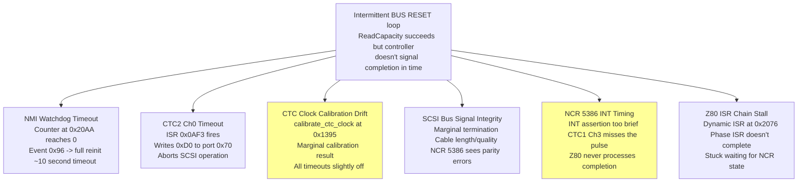

### Most Likely Cause: CTC Calibration + NCR INT Timing

The "comes and goes" nature suggests a marginal timing condition:

1. **CTC calibration** at boot (0x1395) measures the actual clock frequency and adjusts timer constants. If the result is near a boundary, some boots get a slightly different calibration, affecting all timeouts.

2. **NCR 5386 INT pulse width** - The NCR's INT output is connected to CTC1 Ch3 CLK/TRG. The CTC needs to see the pulse for at least one Z80 clock cycle to register it. If the NCR deasserts INT too quickly (e.g., because its internal state machine moves to the next phase), the CTC might miss it on some attempts.

3. **Temperature sensitivity** - Both CTC timing and SCSI bus signal levels are temperature-dependent. A cold board might calibrate differently than a warm one.

### What to Check on the Real Hardware

1. **Watch the 7-segment display** during the loop - does it show an error code? The error codes match the 3106/3112 manual exactly (see table above).

2. **Check SCSI bus termination** - both ends of the bus must be properly terminated. Missing or weak termination causes signal reflections.

3. **Check SCSI cable length** - total bus length must not exceed spec (6 meters for single-ended).

4. **Try with just one SCSI device** - remove all other devices to eliminate bus contention.

5. **Check the CTC clock crystal** - if the oscillator is marginal, CTC calibration will be unreliable.

6. **The 5-second interval** in your log matches the NMI watchdog/CTC timeout, not the ND-100 microcode timeout. This suggests the Z80 firmware itself is aborting the operation, not the ND-100.

## References

- ND-12.048 ND-100 SCSI Reference Guide
- ND-11.021.1 EN Floppy and Streamer Controller 3106/3112
- NCR 5386 SCSI Controller Users Guide (May 1985)
- FD1797 Floppy Disc Controller datasheet
- Z80 CTC Counter/Timer Circuit datasheet
- AM9517 DMA Controller datasheet
- ndwiki.org/wiki/3201
