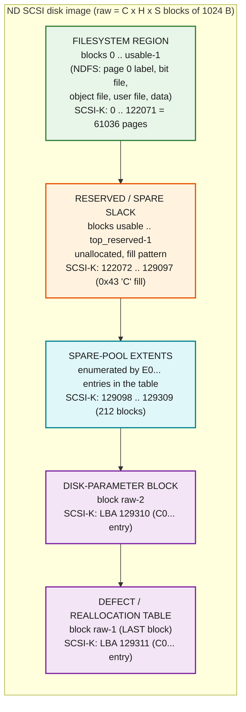

# ND SCSI disk PHYSICAL-MANAGEMENT layer - creation spec

**What this covers:** the disk-management layer *underneath* the SINTRAN
filesystem on an **ND SCSI (ND-3201 controller) disk** - the extra blocks a SCSI
disk carries beyond its declared filesystem capacity: the **spare / reserved
top-of-disk region**, the **disk-parameter block**, and the
**defect / reallocation table at the last block**. It is written as a
**creation specification** so an external tool (`retrofs` and its libraries) can
generate byte-valid ND SCSI disk images.

**Scope boundary.** The four NDFS on-disk structures (directory label, object
file, user file, page bitmap) are documented under
[`../../Filesystem/README.md`](../../Filesystem/README.md) and
[`../../Filesystem/on-disk-format/`](../../Filesystem/on-disk-format/). This
document is the layer *below* them - the physical medium the controller presents
to SINTRAN. It does **not** re-specify the filesystem; it specifies the region
map the filesystem lives inside and the controller metadata at the top of the
medium.

**This layer is SCSI / ND-3201-specific.** SMD disks and floppies do **not** have
it (proven below). See
[`nd-scsi-3201.md`](nd-scsi-3201.md) for the Z80 firmware analysis and
[`../../Filesystem/code-logic/scsi-mount-geometry.md`](../../Filesystem/code-logic/scsi-mount-geometry.md)
for the mount path that reads the last block.

**Rule of evidence** (same convention as the filesystem RE):

- **VERIFIED** - proven from real disk bytes (`SCSI-K.image`), the carved
  `006-S3FS` SINTRAN L bytes, the RetroCore C# target, or the ND-3201 firmware
  analysis, or from arithmetic that is fully determined.
- **INFERRED** - strong reasoning from the bytes + architecture, not one decisive
  source.
- **OPEN** - not decidable from the single available (defect-free) dump; the
  second dump or firmware read that would close it is named.

ND addresses are **octal**; SCSI LBAs, block counts and table fields are
**hex/decimal** as marked. 1 block = 1024 bytes; 1 ND page = 2048 bytes = 2
blocks.

---

## 0. TL;DR

1. **A SCSI disk is bigger than its filesystem.** On the real `SCSI-K.image`
   dump: raw = **129,312 blocks** (64,656 ND pages), usable filesystem =
   **122,072 blocks** (61,036 pages). The difference, **7,240 blocks
   (3,620 pages)**, is a reserved top-of-disk region. **VERIFIED.**

2. **`READ CAPACITY` reports the RAW size, not the usable size.** It returns
   last-LBA = `129311` (= raw total - 1). The usable figure (122,072) is a
   *filesystem / table-level* number SINTRAN derives from the directory and
   cross-checks against the table - it is **not** what the controller reports.
   **VERIFIED** (two independent ways, Section 3).

3. **The last block is a defect / reallocation table.** LBA `129311`
   (offset `0x07E47C00`) holds a signed table: a 16-byte header (signature,
   flags, usable-block-count) followed by 12-byte extent entries
   `{flag, physical-LBA, run-length}`. **VERIFIED** (decoded from real bytes,
   Section 4).

4. **The second-to-last block is a disk-parameter block.** LBA `129310` holds a
   device-type / vendor / revision / format-date record. **VERIFIED** (Section 5).

5. **SMD and floppy have no such table.** `SMD0.IMG` last block = all zeros;
   floppy `250305L07-XX-01D.IMG` last block = ordinary filesystem/loader data.
   The layer is unique to the ND-3201 SCSI controller. **VERIFIED** (Section 6).

6. **To create a valid image**, `retrofs` writes the filesystem in blocks
   `0 .. usable-1`, reserves the top region, and writes the parameter block and
   the defect/reallocation table at the top two blocks, with `READ CAPACITY`
   reporting the raw last-LBA (Section 8).

---

## 1. Layout of a full ND SCSI disk image



**Offset map (SCSI-K.image, VERIFIED):**

| Region | First LBA | Last LBA | Blocks | Byte offset (first) | Content |
|--------|-----------|----------|--------|---------------------|---------|
| Filesystem | 0 | 122071 | 122,072 | `0x00000000` | NDFS (label/bitmap/object/user/data). Tail `0x43` from block 122052. |
| Reserved slack | 122072 | 129097 | 7,026 | `0x07736000` | `0x43` ('C') fill, not enumerated in the table |
| Spare-pool extents | 129098 | 129309 | 212 | `0x07E12800` | `E0...` extents (mostly zero, top run `0x43`) |
| Parameter block | 129310 | 129310 | 1 | `0x07E47800` | disk-parameter record (`C0...` entry) |
| Defect / realloc table | 129311 | 129311 | 1 | `0x07E47C00` | the table (`C0...` entry) |

The exact filesystem/slack boundary in the fill pattern is cosmetic: on this disk
the `0x43` fill begins at block **122052** (inside the still-usable tail), so the
fill does not mark the usable boundary - the **usable count lives in the table
header and the directory**, not in the fill. **VERIFIED** (byte scan).

---

## 2. Raw vs usable capacity - the relationship

Definitions (all in 1024-byte blocks unless noted):

```
raw_blocks    = C x H x S                         (physical medium, whole ND pages => even)
last_LBA      = raw_blocks - 1                     (what READ CAPACITY reports)
usable_blocks = 2 x (directory pages-available)    (NDFS filesystem size)
reserved      = raw_blocks - usable_blocks          (top-of-disk reserve)
```

**SCSI-K.image (VERIFIED):**

| Quantity | Blocks | Pages | Hex | Source |
|----------|--------|-------|-----|--------|
| raw_blocks | 129,312 | 64,656 | `0x1F920` | image length 132,415,488 B / 1024; = `898*8*18` |
| last_LBA | 129,311 | - | `0x1F91F` | READ CAPACITY; carved probe reads exactly this |
| usable_blocks | 122,072 | 61,036 | `0x1DCD8` | table header word[3]; = directory pages x 2 |
| reserved | 7,240 | 3,620 | `0x1C48` | raw - usable |

**How `usable` is derived:** SINTRAN reads the NDFS directory label on page 0
(`pages-available` in the extended-info block, see
[`../../Filesystem/on-disk-format/extended-info-block.md`](../../Filesystem/on-disk-format/extended-info-block.md))
and the carved `CHDSI`/`GSIZE` path reconciles a stored capacity against the
configured disk-type geometry (`scsi-mount-geometry.md` Section 1). The
defect-table header **also** records `usable_blocks` (word[3]) so the controller /
format tool and SINTRAN agree. **VERIFIED** (table word[3] = directory pages x 2).

**What the accounting does and does NOT close (honest statement).** The table
enumerates only the **top 214 blocks** (2 metadata + 212 spare-pool, Section 4).
It does **not** enumerate the other **7,026** reserved blocks (122072..129097).
So `reserved` (7,240) is a *capacity difference*, while the last-block table is a
compact **directory of the top region**, not a full bitmap of the whole spare
area. The bulk 7,026 blocks are unallocated slack between the filesystem's
declared usable size and the physical top-region reserve. **VERIFIED**
(214 enumerated vs 7,240 reserved); **OPEN**: whether the slack is intended free
spare or just device-vs-format rounding needs a second disk / firmware.

---

## 3. What `READ CAPACITY` reports: RAW, not usable

**VERIFIED - two independent proofs that the controller presents the RAW medium:**

1. **Emulator/firmware model.** RetroCore `SCSIHDD.cs`:
   `DiskSizeInBlocks = cylinders*heads*sectors - 1 = 898*8*18 - 1 = 129311`, and
   `CommandReadCapacity()` returns that value as the last LBA (block size 1024).
   That is `raw_blocks - 1`, i.e. the **raw** last LBA. (Cited in
   `scsi-mount-geometry.md` Section 3.)

2. **The real disk proves it by construction.** On `SCSI-K.image` SINTRAN's mount
   issues a `READ(6)` of **LBA `0x1F91F` = 129311** and it returns `SS_GOOD` with
   real data - that block *is* the defect table. A block at LBA 129311 can only
   be addressed if `READ CAPACITY` reported a last-LBA >= 129311. If the
   controller clamped capacity to the usable 122,072, LBA 129311 would be out of
   bounds and the read would fail. It does not. Therefore **the controller reports
   the raw size and the top region is normally addressable.** **VERIFIED** (real
   bytes + carved probe).

**Consequence for `usable`:** `usable_blocks` is never surfaced by `READ
CAPACITY`. It is a **filesystem/table-level** figure. The controller hands
SINTRAN the whole raw medium; SINTRAN decides how much of it is the filesystem
from the directory label (cross-checked against the table header word[3]).

**Transparent defect remapping - OPEN.** Whether the ND-3201 firmware silently
re-routes a defective filesystem LBA to a spare block (SCSI "automatic
reallocation") cannot be proven from this **defect-free** dump: no filesystem LBA
is remapped here. The firmware analysis
([`nd-scsi-3201.md`](nd-scsi-3201.md)) documents *floppy* defect detection
(FD1797 "diskette defect", event `0x1D03`) but shows **no SCSI read-path LBA
translation** - the reserved-block table sits on the medium and reads as
host/format-tool-managed. Whether remap is automatic (firmware) or manual
(format/repair tool rewrites the table + moves data) is **OPEN**; a dump of a disk
with a **known reallocated bad sector** would settle it (an `E0...` extent whose
target block holds the *moved* data instead of fill/zero).

---

## 4. The defect / reallocation table (LAST block) - full field spec

> **Mount-math cross-reference.** This same last block is the SCSI **control
> record** the mount reads via the driver's function-42 connect. The header
> word[3] (`0x0001DCD8` = 122072 = **UHLIM**) and the partition-table field that
> lands in `,B 11` are the two values the `006-S3FS` geometry routine consumes -
> and the routine's `(UHLIM/2)/divisor` division is where the `@ENTER-DIRECTORY`
> **error 243B** originates. Full decode of the mount math, with the executed
> trace values and the pinpointed failure, is in
> [`scsi-control-record-and-mount-math.md`](scsi-control-record-and-mount-math.md).
> Per-field mount impact: **word[3]=UHLIM** feeds the geometry division;
> **word[0] high byte = NPART=8** feeds the function-42 partition parse; the
> `E0/C0` extent map is **not** used by the geometry routine.

Real bytes, `SCSI-K.image` LBA 129311, byte offset `0x07E47C00` (32-bit
**big-endian** words):

```
07e47c00: 0800 54d9 8000 0000 0000 0000 0001 dcd8   <- header (16 bytes)
07e47c10: c000 0000 0001 f91f 0000 0001            entry 0
          c000 0000 0001 f91e 0000 0001            entry 1  (07e47c1c)
07e47c28: e000 0000 0001 f91d 0000 0001            entry 2
07e47c34: e000 0000 0001 f909 0000 0014            entry 3
07e47c40: e000 0000 0001 f8f5 0000 0014            entry 4
07e47c4c: 0000 0000 0000 0000 0000 0000            entry 5  (null slot)
07e47c58: e000 0000 0001 f84a 0000 00ab            entry 6
07e47c64: 00 00 ... (zero fill to end of block)             terminator
```

### 4.1 Header (16 bytes, 4 x 32-bit BE) - VERIFIED layout, partial semantics

| Off | Word | Value (SCSI-K) | Meaning | Grade |
|-----|------|----------------|---------|-------|
| `0x00` | word[0] | `0x080054D9` | **signature / magic** (or per-disk checksum) | VERIFIED value / OPEN meaning |
| `0x04` | word[1] | `0x80000000` | **flags** - bit 31 = table valid/present | VERIFIED value / INFERRED meaning |
| `0x08` | word[2] | `0x00000000` | reserved (or high word of a 64-bit usable count = 0) | VERIFIED value / INFERRED meaning |
| `0x0C` | word[3] | `0x0001DCD8` = **122072** | **usable block count** | **VERIFIED** (= directory pages x 2) |

- **word[3] is proven** = usable blocks: `0x1DCD8 = 122072 = 61036 pages x 2`,
  matching the directory's declared filesystem size. This is the load-bearing
  field a reader trusts.
- **word[0] `0x080054D9`** is a fixed-looking signature. It is **not** a plain
  32-bit sum of the block (sum of words[1..] = `0x800DB350`) nor a plain XOR
  (XOR of words[1..] = `0x8001DCD8`). So it is either a magic constant or a
  checksum with an algorithm not derivable from one block. **OPEN** - a second
  disk dump distinguishes "constant" (same value) from "checksum" (different
  value); until then a writer should treat it as a copied constant (Section 8).
- **word[1] `0x80000000`**: only bit 31 set - a "valid" marker echoed in every
  live entry's flag (all set bit 31). INFERRED.

### 4.2 Entry format (12 bytes, 3 x 32-bit BE) - VERIFIED layout

```
+0  flag/type   (32-bit)   observed 0xC0000000 or 0xE0000000, 0 = empty slot
+4  physical LBA (32-bit)  the block/extent start, in raw LBA space
+8  run length  (32-bit)   number of consecutive blocks
```

Entries begin at header end (`0x10`) and are packed at 12-byte stride. **VERIFIED**
(the stride and 3-field split reproduce every non-zero region in the block
exactly).

### 4.3 Decoded entries (SCSI-K) - VERIFIED

| # | Off | flag | LBA (dec) | run | Covers | Block content | Note |
|---|-----|------|-----------|-----|--------|---------------|------|
| 0 | `0x10` | `C0000000` | 129311 | 1 | 129311 | the table itself | controller metadata |
| 1 | `0x1C` | `C0000000` | 129310 | 1 | 129310 | parameter block | controller metadata |
| 2 | `0x28` | `E0000000` | 129309 | 1 | 129309 | zero | spare-pool extent |
| 3 | `0x34` | `E0000000` | 129289 | 20 | 129289-129308 | zero | spare-pool extent |
| 4 | `0x40` | `E0000000` | 129269 | 20 | 129269-129288 | zero | spare-pool extent |
| 5 | `0x4C` | `00000000` | - | - | - | - | **null slot** (skipped, not terminator) |
| 6 | `0x58` | `E0000000` | 129098 | 171 | 129098-129268 | `0x43` fill | spare-pool extent |
| - | `0x64`+ | `00000000` | - | - | - | zero to end | terminator fill |

The six live extents cover **129098 .. 129311 contiguously = 214 blocks**
(`2 x C0` metadata + `212 x E0` spare-pool). **VERIFIED** (they tile with no gap
or overlap).

### 4.4 Flag-bit meanings - what is proven vs OPEN

Only two flag **values** occur, each tied to a role by the block content:

- **`0xC0000000`** marks the **controller's own metadata blocks** - the table
  (129311) and the parameter block (129310), and *only* those two. **VERIFIED**
  (association).
- **`0xE0000000`** marks **spare-pool / reserved extents** at the top of the
  medium. **VERIFIED** (association).
- **bit 31 (`0x80000000`)** = entry valid / in use (also the header's word[1]).
  A `0x00000000` word is an empty/null slot. **INFERRED.**
- The two values differ only in **bit 29 (`0x20000000`)**: clear = controller
  metadata (`C0`), set = spare-pool (`E0`). The precise per-bit naming
  (e.g. bit 30 = "allocated", bit 29 = "spare vs private", and whether other bits
  encode "defective/remapped") **cannot be proven from one defect-free dump** -
  no entry carries a bad-block or remap flag here. **OPEN** - the firmware
  (`nd-scsi-3201.md` reserved-block handling) or a dump with a real grown defect
  would pin bits 28..0.

### 4.5 Terminator - INFERRED

The live list is **not** terminated by the first all-zero slot: entry 5 (`0x4C`)
is an all-zero **null slot in the middle** of the list, followed by a live entry 6.
So the reader must **not** stop at the first zero. The table ends with zero fill to
the end of the 1024-byte block. INFERRED reader rule: iterate a fixed slot count
(`(1024 - 16) / 12 = 84` slots), skipping null (`flag == 0`) slots, to end of
block. Whether the firmware uses a fixed slot count or a header-stored entry count
is **OPEN** (word[2] is 0 here, consistent with "reserved" or "count high word");
a disk with more entries would show whether word[2]/another field is a live count.

### 4.6 Two readings of the E0 extents - INFERRED / OPEN

Because this dump is **defect-free**, the `E0...` extents are consistent with
either role, and one dump cannot separate them:

- **(a) Factory spare reserve** - the top 212 blocks are set aside as an alternate
  block pool; extents are zero/fill because none has been consumed.
- **(b) Grown-defect reallocation records** - each extent is a spare block already
  assigned to replace a filesystem defect; consumed top-down (129309 first).

The block contents lean toward **(a)** (the extents are zero or `0x43` fill, not
relocated live data), but this is **OPEN**; a dump of a disk with a *known*
reallocated sector distinguishes them.

---

## 5. The disk-parameter block (block raw-2)

Real bytes, `SCSI-K.image` LBA 129310, offset `0x07E47800`:

```
07e47800: 001e 444d 4d00 0000 0000 0000 0000 0000   ..DMM...........
07e47810: 0000 4320 3032 07c5 0811 0f33 2020 0000   ..C 02.....3  ..
07e47820: 00 ... (zero to end)
```

Decoded (VERIFIED bytes, INFERRED field names):

| Off | Bytes | Value | Meaning (INFERRED) |
|-----|-------|-------|--------------------|
| `0x00` | `00 1E` | `0x001E` = 30 | **device type word** - `0x1E` is exactly the "floppy-style SCSI disk" device type the ND-3201 init handler at `0x0383` serves (`nd-scsi-3201.md`) |
| `0x02` | `44 4D 4D` | `"DMM"` | vendor / media tag (ASCII) |
| `0x12` | `43 20 30 32` | `"C 02"` | revision string (ASCII) |
| `0x16` | `07 C5 08 11 0F 33` | 1989-08-17 15:51 | format/manufacture timestamp: `0x07C5`=**1989**, `08`=month, `0x11`=17, `0x0F`=15h, `0x33`=51m |
| `0x1C` | `20 20` | `"  "` | padding |

The device-type value `0x1E` cross-checks against the firmware
([`nd-scsi-3201.md`](nd-scsi-3201.md) "Floppy-Style SCSI Init Handler (0x0383) -
device type 0x1E"). This is the **disk-parameter / geometry-identity block**: it
tells the controller/host what kind of unit and format this is. **VERIFIED**
(bytes + the `0x1E` firmware cross-ref); field names **INFERRED**.

---

## 6. Cross-device confirmation - this layer is SCSI-only

| Device | Image | Size | Last block | Verdict |
|--------|-------|------|-----------|---------|
| SCSI (ND-3201) | `SCSI-K.image` | 129,312 blk | signed defect/realloc table (`0x080054D9...`) | **has the layer** |
| SMD | `SMD0.IMG` | 76,800 blk | **all zeros** | **no table** |
| Floppy | `250305L07-XX-01D.IMG` | 1,232 blk (616 pages) | **ordinary filesystem/loader data** (contains the `"IF HERE TYPE ANY CHAR"` loader text + code) | **no table** |

- `SMD0.IMG` last block (offset `0x04AFFC00`) is entirely `0x00`. **VERIFIED.**
- Floppy `250305L07-XX-01D.IMG` last block (offset `0x00133F00`) is live
  boot/loader content, not a table. **VERIFIED.**

So the defect / reallocation table and the parameter block are managed by the
**ND-3201 controller / SCSI format tooling**, not by the filesystem, and appear
**only** on SCSI units. SMD and floppy media hand SINTRAN a medium whose last
block is just part of the filesystem. **VERIFIED.**

---

## 7. How SINTRAN and the controller use this layer

- **Controller (`READ CAPACITY`)** reports the **raw** last-LBA; the whole medium
  including the top region is addressable (Section 3). **VERIFIED.**
- **SINTRAN mount** reads the **last block** (the control-record / function-42 connect) (`scsi-mount-geometry.md`): a
  highest-addressable-block presence/size probe. On the real disk that block is
  the defect table; the mount's carved path (`ENDIR -> CHDSI -> RXDIR -> RCBLO`)
  then reads **block 0** for the directory. **VERIFIED (carved).**
- **Known emulation failure:** when the emulator presents the raw disk but the
  controller drops the completion interrupt for that last-block probe (the
  `RSTAU`/`RITRG` bug), the mount stalls before block 0 - see
  [`SCSI-MOUNT-FIX-PLAN.md`](SCSI-MOUNT-FIX-PLAN.md) and
  [`../../Filesystem/code-logic/scsi-mount-geometry.md`](../../Filesystem/code-logic/scsi-mount-geometry.md)
  Section 4-5. The disk *content* is fine; the blocker is interrupt delivery +
  geometry match, not the last-block bytes. **VERIFIED (seam) / INFERRED (cause).**

---

## 8. How to CREATE a valid ND SCSI disk image (`retrofs`)

### 8.1 Steps

1. **Pick geometry** `C x H x S`. `raw_blocks = C x H x S` must be **even** so the
   medium is a whole number of 2048-byte ND pages (`raw_blocks` = 2 x pages).
   Example (matches SCSI-K): `898 x 8 x 18 = 129312` blocks = 64,656 pages.
   `last_LBA = raw_blocks - 1`.

2. **Set the reported capacity.** The SCSI target must answer `READ CAPACITY`
   with `last_LBA = raw_blocks - 1` and block size `1024`. (RAW, per Section 3 -
   do **not** report the usable count.)

3. **Choose `usable_blocks`** (even). Must satisfy
   `usable_blocks <= raw_blocks - reserved_top`, where `reserved_top` is the top
   region you reserve (at least 2 blocks: table + parameter block; SCSI-K reserved
   the top 214 as metadata+spare-pool and left 7,026 as slack). A minimal image
   can use `reserved_top = 2` and `usable_blocks = raw_blocks - 2`.

4. **Write the filesystem** into blocks `0 .. usable_blocks-1` per
   [`../../Filesystem/create-directory-placement.md`](../../Filesystem/create-directory-placement.md)
   and [`../../Filesystem/create-directory.md`](../../Filesystem/create-directory.md).
   The directory's `pages-available` **must equal** `usable_blocks / 2`.

5. **Fill the reserved slack** (`usable_blocks .. raw_blocks-3`). Cosmetic: the
   real SCSI disk uses `0x43` ('C'); zeros are equally acceptable (SMD uses zeros).

6. **Write the parameter block** at `raw_blocks-2` (Section 5): device-type word
   (`0x001E` for a floppy-style SCSI disk), optional vendor/rev/date. A minimal
   writer may leave it zero **only if** the table does not point a `C0...` entry at
   it; to faithfully reproduce an ND disk, include it and mark it `C0...`.

7. **Write the defect / reallocation table** at the last block `raw_blocks-1`
   (Section 4), big-endian:
   - Header: `word0 = 0x080054D9` (copied signature - see caveat), `word1 =
     0x80000000`, `word2 = 0x00000000`, `word3 = usable_blocks`.
   - Entries (12 bytes each, from offset `0x10`):
     - `C0000000, raw_blocks-1, 1` (the table block itself)
     - `C0000000, raw_blocks-2, 1` (the parameter block) - include if step 6 wrote one
     - optionally one or more `E0000000, start_LBA, run` extents describing the
       reserved spare pool
   - Zero-fill the rest of the block.

### 8.2 Minimal defect-free table (all spare, no defects)

A brand-new, defect-free disk has **no remapped-defect entries** - only the
controller-metadata `C0...` entries (and, to mirror ND, an `E0...` extent for the
spare pool). Example for `raw_blocks = N`, `usable = U`:

```
offset  bytes (big-endian)                     meaning
0x00    08 00 54 D9                            signature (copied constant)
0x04    80 00 00 00                            flags: table valid
0x08    00 00 00 00                            reserved
0x0C    <U as 32-bit BE>                       usable block count
0x10    C0 00 00 00  <N-1 BE>  00 00 00 01     table block (self)
0x1C    C0 00 00 00  <N-2 BE>  00 00 00 01     parameter block
0x28    E0 00 00 00  <U   BE>  <(N-2-U) BE>    spare pool: everything between
                                               filesystem end and metadata
0x34..  00 ...                                 zero fill to end of block
```

That single `E0` extent (step: `start = usable_blocks`, `run = raw_blocks-2 -
usable_blocks`) declares the whole gap between the filesystem and the two metadata
blocks as spare. SINTRAN reads `word3 = U` and is satisfied; the last block is
readable (the mount probe passes).

### 8.3 What is minimally required vs faithful

- **Minimum for SINTRAN to mount** (per `scsi-mount-geometry.md` Section 5): a
  page-aligned raw capacity, `READ CAPACITY` = raw last-LBA, and a **readable**
  last block. There is *no* required "label" content at the last block for the
  mount probe to pass - the probe checks presence/readability, and the size check
  reconciles *capacity*, not a signature.
- **Faithful ND SCSI reproduction** (what tools that *read* the table expect):
  write the full header (real `word3 = usable`) + the `C0...`/`E0...` extents +
  the parameter block, as in 8.2. `retrofs` should do the faithful version so the
  image round-trips through any ND-3201-aware tool.

### 8.4 Open items a writer must be aware of

- **Signature `word0`** - copy `0x080054D9` as a constant. **OPEN** whether it is
  a fixed magic or a per-disk checksum; if a second dump shows a *different*
  `word0`, it is a checksum and its algorithm must be recovered before images with
  arbitrary geometry are byte-perfect. (word[3]=usable is the field readers
  actually depend on, and it is fully specified.)
- **Flag low bits** (bits 28..0 of the `C0/E0` flags) - unused/zero on this disk;
  set them zero. Their meaning is **OPEN** (Section 4.4).
- **Entry-count vs fixed-slot terminator** - use zero-fill after the last entry and
  skip null slots on read (Section 4.5). Whether the firmware honours a stored
  count is **OPEN**; zero-fill is safe either way.

---

## 9. VERIFIED / INFERRED / OPEN summary

| Claim | Verdict |
|-------|---------|
| SCSI disk raw 129,312 blk vs usable 122,072 blk; reserved 7,240 blk | VERIFIED (bytes + arithmetic) |
| `READ CAPACITY` reports RAW last-LBA (129311), not usable | VERIFIED (RetroCore + real disk addresses LBA 129311) |
| Last block = defect/reallocation table; header 16 B + 12 B entries `{flag,LBA,run}` | VERIFIED (decoded bytes) |
| Header word[3] = usable block count (122072 = pages x 2) | VERIFIED |
| Header word[0] `0x080054D9` = signature (not plain sum/xor) | VERIFIED value / OPEN meaning |
| Entry flags: `C0...` = controller metadata blocks, `E0...` = spare-pool extents | VERIFIED (association) |
| Exact per-bit flag semantics; defect/remap bits | OPEN (defect-free dump) |
| Null slot mid-list; terminator = zero-fill, skip null slots | VERIFIED (bytes) / INFERRED (reader rule) |
| Block raw-2 = disk-parameter block (dev type 0x1E, vendor/rev/date) | VERIFIED (bytes + firmware 0x1E cross-ref) |
| SMD & floppy have no such table (SCSI/ND-3201-specific) | VERIFIED (both last blocks) |
| Firmware transparent LBA remap on read | OPEN (no remap present to observe) |
| E0 extents = factory spare reserve vs grown-defect records | OPEN (defect-free dump) |

**Provenance:** real dumps `SCSI-K.image` (last block `0x07E47C00`, parameter
block `0x07E47800`), `SMD0.IMG`, `250305L07-XX-01D.IMG`; carved `006-S3FS`
SINTRAN L bytes and RetroCore `SCSIHDD.cs` via
[`../../Filesystem/code-logic/scsi-mount-geometry.md`](../../Filesystem/code-logic/scsi-mount-geometry.md);
ND-3201 firmware analysis [`nd-scsi-3201.md`](nd-scsi-3201.md); floppy/streamer
controller manual
[`ND-11.021.1 EN-Floppy and Streamer Controller 3106 3112.md`](ND-11.021.1%20EN-Floppy%20and%20Streamer%20Controller%203106%203112.md).

## See also

- [`README.md`](README.md) - SCSI device documentation index
- [`nd-scsi-3201.md`](nd-scsi-3201.md) - ND-3201 Z80 firmware analysis (READ
  CAPACITY, defect handling, IOX ports, command flow)
- [`../../Filesystem/README.md`](../../Filesystem/README.md) - NDFS on-disk format
  and RE foundation (the layer *above* this one)
- [`../../Filesystem/code-logic/scsi-mount-geometry.md`](../../Filesystem/code-logic/scsi-mount-geometry.md)
  - why the mount reads the last block, and the raw-vs-usable size reconcile
- [`../../Filesystem/create-directory-placement.md`](../../Filesystem/create-directory-placement.md)
  - where the filesystem structures are placed when creating a disk
