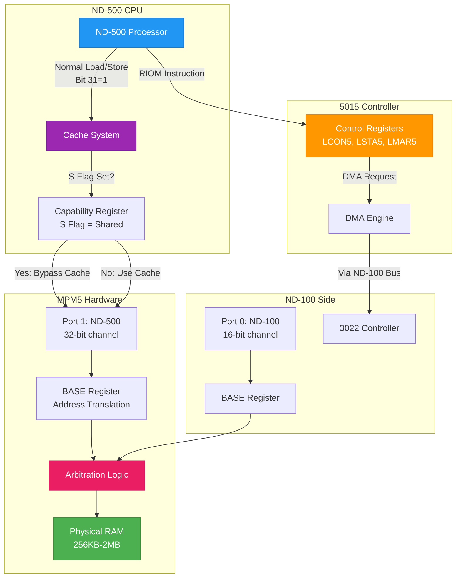
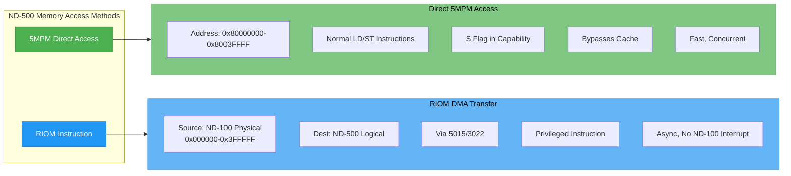
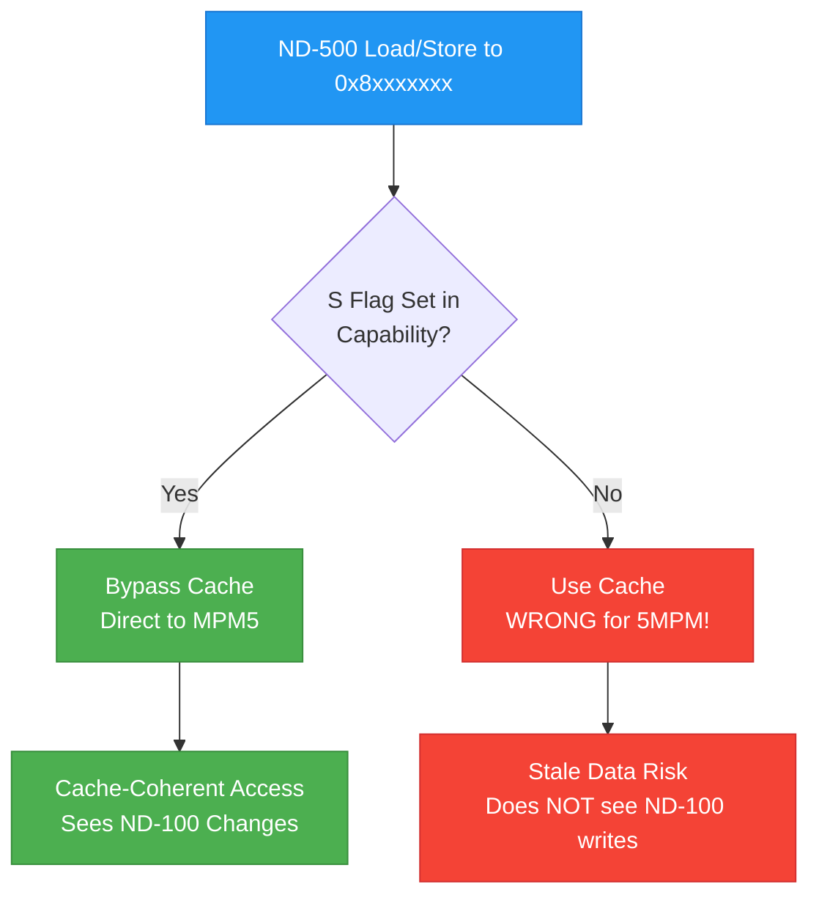
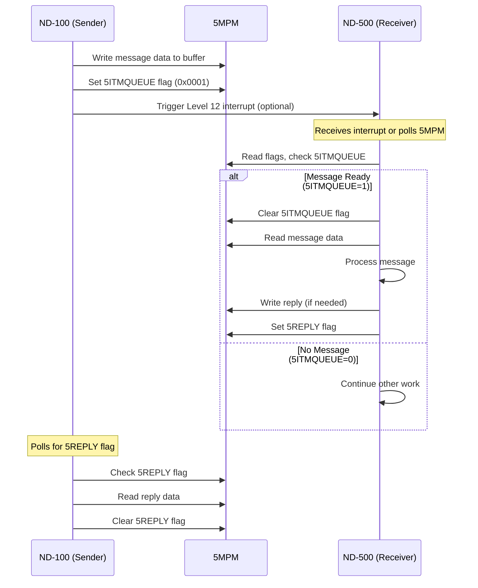

# ND-100/ND-500 Memory Bridge Architecture

## Overview

This document describes the **RIOM (Read I/O processor Memory)** instruction and the memory architecture enabling data transfer between the ND-100 I/O processor and ND-500 compute processors. It covers physical memory addressing, shared memory (5MPM) architecture, DMA mechanisms, and multi-processor configurations.

**Key Findings:**
- RIOM uses DMA to access **any ND-100 physical memory**, not just 5MPM
- Two separate memory access mechanisms: direct 5MPM and the RIOM instruction (read-only; there is no WIOM - see the Access Model table below)
- 5MPM is a separate hardware module with different address views from ND-100 and ND-500
- Multiple ND-500 CPUs share partitioned 5MPM space via dedicated ports

---

## Navigation

**Related Documentation:**
- [ND-500 Reference Manual](../../Reference-Manuals/ND-05.009.4%20EN%20ND-500%20Reference%20Manual.md) - RIOM instruction specification
- [5MPM Location Guide](../ND500/WHERE-IS-5MPM-LOCATED.md) - Physical 5MPM hardware details
- [Multiport Memory Communication](../OS/06-MULTIPORT-MEMORY-AND-ND500-COMMUNICATION.md) - 5MPM architecture
- [Memory Map Reference](../OS/19-MEMORY-MAP-REFERENCE.md) - ND-100 physical memory layout
- [MPM5 Technical Description](../../Reference-Manuals/ND-10.004.01%20MPM%205%20Technical%20Description.md) - BASE register translation

**Emulator Implementation:**
- [ND500-EMULATION-COMPLETE.cs](ND500-EMULATION-COMPLETE.cs) - C# multiport memory implementation
- [ND500-INTEGRATION-GUIDE.md](ND500-INTEGRATION-GUIDE.md) - Integration with NDBusND500IF.cs

---

## RIOM Instruction Specification

### Overview

**RIOM (Read I/O processor Memory)** is a privileged ND-500 instruction that copies data from ND-100 physical memory to ND-500 logical memory using DMA (Direct Memory Access) through the ND-500 interface hardware.

### Instruction Format

```assembly
H RIOM <ND-100 addr/r/W>, <buffer/w/H>, <no of halfwords>
```

**Parameters:**
- `<ND-100 addr>` - Physical ND-100 address (24-bit word address)
- `<buffer>` - Logical ND-500 address (destination)
- `<no of halfwords>` - Transfer size in 16-bit halfwords

**Encoding:**
- **Hex code:** `0FE76H`
- **Octal code:** `177166B`
- **Privilege:** Privileged instruction (requires supervisor mode)

### Operation

```
I/O processor memory → ND-500 memory buffer
```

**Mechanism [CORRECTED 2026-07-20 from the B30 microcode - the previous text was an authored
inference and is wrong in mechanism]:**

RIOM is **not a DMA engine**. It is a **microcoded copy loop**: the CPU's own microprogram issues
ordinary physical memory reads, one halfword per iteration, on its own memory port. From the B30
image (`MICRO-5800-B30.md:5307-5320`):

```
012255 RIOM_0:  SC2 := BM01                      ; build mask, bit 1
012256          ALU,AND A,MIC,STS B,SC2          ; test MIC status bit 1
012257          C,SEQ COND,MZRO -> ILLEG         ; not privileged -> IIC trap
012261          ... G,OPS LADDR EA2SAVE ADACT    ; operand 2's EA -> destination pointer
012262          ... D,LC   READ ADACT            ; operand 3 (count) -> LC
012263          D,DAC,DPA := SC1                 ; operand 1 VALUE -> DAC physical-address reg
012266 RIOM_2:  LCDECR  C,SEQ INVSEQ COND,LCZ    ; decrement, exit when zero
012270 RIOM_3:  SC1 := DATA (TYP,HW)   RD,POF    ; read halfword from ND-100
012272          <SC1>                  WRITE     ; write halfword to ND-500, loop
```

1. ND-500 executes RIOM; the microprogram first checks privilege (`-> ILLEG` = IIC trap).
2. Operand 2's **effective address** goes to the destination pointer (`LADDR ... ADACT`); operand 1's
   **value** goes to the DAC physical-address register; operand 3 becomes the loop counter `LC`.
3. Each iteration does `RD,POF` = "PERFORM A PHYSICAL READ WITH MMS" (`ND-05.022.1:2467`; the bus
   request is `RPOFF`, "paging off read memory, physical address translation",
   `ND-05.020.01:5777`), then a plain `WRITE` to ND-500 memory.
4. There is **no descriptor, no controller command and no word-count register in any interface** -
   the counter is the microcode's own `LC` and the pointers are its own EA registers.

This is why the manual can say the transfer "does not interrupt the ND-100 program execution": it is
DMA only *from the ND-100's point of view* - the ND-100 CPU is never involved because the ND-500
reaches memory through its own port.

It also resolves the manual's "private ND-100 memory, **not directly addressable** by the ND-500":
not reachable through the ND-500's normal paged/segmented addressing. RIOM's trick is exactly
paging-off plus a raw physical address, which is how it escapes the segment model.

**Note:** `RD,POF` is physical **with MMS** - paging is off but the MMS unit stays in the path.
Docs describing POF as simply "treated as physical" are imprecise.

### Example Usage

```assembly
; Copy one page (1024 halfwords) from ND-100 address 66000B (octal) to array PG
H RIOM 66000B:W, PG, 1024
```

**Breakdown:**
- `H` - Halfword size specifier
- `66000B` - ND-100 physical address (octal) = 0x0D800 (hex)
- `:W` - Word addressing modifier
- `PG` - ND-500 destination array
- `1024` - Number of 16-bit halfwords (2KB total)

### Key Characteristics

| Characteristic | Description |
|----------------|-------------|
| **Access Method** | Microcoded copy loop (`RD,POF` physical read + `WRITE`), NOT a DMA engine |
| **ND-100 Addressing** | Physical word addresses, held in the DAC address register; **no masking anywhere in the microcode loop** (so no 16-bit wrap) |
| **Memory Scope** | Any ND-100 physical memory (not limited to 5MPM) |
| **ND-100 Interruption** | Does NOT interrupt ND-100 program execution - the ND-100 CPU is never involved |
| **Interface** | ND-5000: the CPU's own port (MFbus channel / MPCC). **[OPEN]** for classic 500 via Control II / 5015 - no manual describes that physical path, and the `RIOM_0..3` labels also exist in MICRO-5200, so the loop structure probably carries over but the port does not necessarily |
| **Direction** | ND-100 → ND-500 only. **There is no reverse instruction - "WIOM" does not exist** (no manual, no index entry, no opcode table). Writes go via ordinary stores to the shared segment, the microprogram, or the ND-100 itself |
| **Privilege** | Microcode checks it: `012256-012257 ... -> ILLEG` (IIC trap when not privileged) |

**Source:** [ND-500 Reference Manual](../../Reference-Manuals/ND-05.009.4%20EN%20ND-500%20Reference%20Manual.md) (lines 10826-10842)

---

## Memory Access Mechanisms

The ND-100/ND-500 architecture provides two distinct memory access mechanisms:

### Comparison Table

| Mechanism | Memory Scope | Access Type | Speed | Interrupt ND-100? | Purpose |
|-----------|--------------|-------------|-------|-------------------|---------|
| **Direct 5MPM Access** | 5MPM only | CPU read/write | Fast | N/A (shared) | Message buffers, coordination, IPC |
| **RIOM Instruction** (read-only; no WIOM exists) | Any ND-100 physical memory | Microcoded copy via interface | Slower | No | Bulk read of ND-100/private RAM into an ND-500 buffer |

### Why Two Mechanisms?

**5MPM (Shared Memory):**
- Limited size (typically 256KB-2MB)
- Used for high-frequency message passing
- Both processors see the same physical RAM
- Fast, concurrent access

**RIOM (DMA Transfer):**
- Accesses ND-100's private RAM (not visible to ND-500)
- Used for large data transfers (e.g., kernel structures, buffers)
- One-way transfer initiated by ND-500
- Does not consume 5MPM space

**Design Rationale:**

> "The `<ND-100 addr>` specifies the **physical ND-100 address** and is **usually private ND-100 memory**, **not directly addressable by the ND-500**."
>
> — ND-500 Reference Manual

This allows ND-500 to read ND-100 kernel data structures, RT program state, and disk buffers without copying them into limited 5MPM space.

---

## ND-100 Physical Memory Layout

RIOM uses **ND-100 physical addresses** (24-bit word addressing, 0x000000-0x3FFFFF).

### Memory Map

```
ND-100 Physical Memory (22-bit addresses, word-addressable):
┌──────────────────────────────────────────────────────────┐
│ 0x000000 - 0x00FFFF  (64K words, 128KB)                  │
│   Low RAM                                                │
│   ├─ Boot code                                           │
│   ├─ SINTRAN kernel                                      │
│   ├─ System tables (GOTAB, SYSGEN parameters)            │
│   └─ RT program code/data                                │
├──────────────────────────────────────────────────────────┤
│ 0x010000 - 0x03FFFF  (192K words, 384KB)                 │
│   Extended RAM                                           │
│   ├─ Additional kernel code                              │
│   ├─ Background programs                                 │
│   ├─ Segment buffers                                     │
│   └─ Swap space                                          │
├──────────────────────────────────────────────────────────┤
│ 0x040000 - 0x05FFFF  (128K words, 256KB)  ← 5MPM         │
│   Multiport Memory (shared with ND-500)                  │
│   ├─ ND-500 process descriptors                          │
│   ├─ Message buffers                                     │
│   ├─ ACCP buffers                                        │
│   └─ Hardware interface buffers                          │
└──────────────────────────────────────────────────────────┘
```

### RIOM Access Examples

```assembly
; Read kernel variable from low RAM
H RIOM 0x002000:W, KernelData, 100

; Read RT program data from extended RAM
H RIOM 0x020000:W, RTProgramBuffer, 512

; Read from 5MPM (though direct access is faster)
H RIOM 0x040000:W, SharedData, 256
```

**Source:** [Memory Map Reference](../OS/19-MEMORY-MAP-REFERENCE.md) (lines 58-84)

---

## 5MPM (Multiport Memory) Architecture

### Physical Hardware

5MPM is a **separate hardware module** (not part of ND-100 or ND-500):

```
Physical 5MPM Configuration:
┌─────────────────────────────────────────────┐
│  MPM5 Module (Standalone Box)               │
│  ┌───────────────────────────────────────┐  │
│  │ Dynamic RAM Chips (256KB - 2MB)       │  │
│  │ - ECC error correction                │  │
│  │ - Dual-ported access                  │  │
│  └───────────────────────────────────────┘  │
│                                             │
│  Port Modules:                              │
│  ├─ Port 0: ND-100 Channel (16-bit)         │
│  ├─ Port 1: ND-500 Channel (32-bit)         │
│  ├─ Port 2: ND-500 Channel (32-bit) [opt]   │
│  └─ Arbitration Logic (priority resolver)   │
│                                             │
│  BASE Registers: Address translation        │
└─────────────────────────────────────────────┘
         │                      │
    ND-100 Bus            ND-500 Bus(es)
   (3022 card)           (5015 card(s))
```

### Address Views

The same physical 5MPM RAM appears at different addresses to ND-100 and ND-500:

#### ND-100 View

| Property | Value |
|----------|-------|
| **Address Range** | `0x040000 - 0x05FFFF` (typical 256KB configuration) |
| **Location** | Bank 2 in ND-100 physical memory space |
| **Access Width** | 16-bit (word-addressable) |
| **Addressing** | Word addresses (address × 2 = byte offset) |

**Example:**
```c
// ND-100 code accessing 5MPM
uint16_t* mpm = (uint16_t*)0x040000;  // Start of 5MPM
uint16_t value = mpm[100];             // Read word at offset 100
```

#### ND-500 View

| Property | Value |
|----------|-------|
| **Address Range** | `0x80000000 - 0x8003FFFF` (256KB, bit 31 = 1) |
| **Addressing** | Byte-addressable (32-bit virtual addresses) |
| **Access Width** | 8/16/32-bit (fetched 32-bit wide for bandwidth) |
| **Special Bit** | Bit 31 = 1 indicates "this is multiport memory" |

**Example:**
```c
// ND-500 code accessing 5MPM
uint8_t* mpm = (uint8_t*)0x80000000;   // Start of 5MPM (bit 31=1)
uint32_t value = *(uint32_t*)&mpm[200]; // Read 32-bit value at byte offset 200
```

### Address Translation (BASE Registers)

The MPM5 hardware uses **BASE registers** to translate channel addresses to physical MPM5 RAM addresses.

**Translation Formula:**
```
Physical MPM5 Address = Channel Address + BASE Register
```

**Example Configuration:**

| Parameter | Value (Octal) | Value (Hex) | Description |
|-----------|---------------|-------------|-------------|
| **Lower Limit (ND-100)** | 20000000₈ | 0x040000 | First accessible ND-100 address |
| **Upper Limit (ND-100)** | 27777777₈ | 0x05FFFF | Last accessible ND-100 address |
| **Physical Start** | 0₈ | 0x000000 | First byte in MPM5 RAM |
| **BASE Register** | 377762₈ | — | 2's complement of (Lower - Start) |

**Translation Example:**

When ND-100 accesses address `0x040000`:
```
  ND-100 Channel Address: 0x040000
+ BASE Register:          (2's complement offset)
─────────────────────────────────────
= Physical MPM5 Address:  0x000000  ← First byte in 5MPM
```

**Both ND-100 and ND-500 see the SAME physical RAM:**

```
┌─────────────────────────────────────────────┐
│  ND-100 Address: 0x040000                   │
│         ↓                                   │
│    BASE Register Translation                │
│         ↓                                   │
│  ┌─────────────────┐  ← Physical MPM5 RAM   │
│  │  Shared Memory  │                        │
│  └─────────────────┘                        │
│         ↑                                   │
│    BASE Register Translation                │
│         ↑                                   │
│  ND-500 Address: 0x80000000                 │
└─────────────────────────────────────────────┘
```

**Source:** [MPM5 Technical Description](../../Reference-Manuals/ND-10.004.01%20MPM%205%20Technical%20Description.md) (lines 392-614)

---

## Multiple ND-500 CPU Configuration

### Architecture

Multiple ND-500 CPUs can connect to the same ND-100 system by attaching to separate ports on the MPM5 module.

**System Limits:**
- **Maximum 5 ND-500 computers** can be connected to one ND-100
- **Each ND-500 requires one ND-500 interface** (3022 card) in the ND-100 computer
- MPM5 module supports multiple ports (typically 3-6 ports, with Port 0 reserved for ND-100)

**Configuration Example (2 ND-500 CPUs):**

```
                  ┌───────────────┐
                  │   ND-100      │
                  │   (Master)    │
                  └───────┬───────┘
                          │
                    ┌─────┴─────┐
                    │ 3022 Card │
                    └─────┬─────┘
                          │ Port 0 (16-bit)
                  ┌───────┴────────────┐
                  │   MPM5 Module      │
                  │  (Shared Memory)   │
                  │                    │
                  │  - Arbitration     │
                  │  - 256KB RAM       │
                  │  - 3 Ports         │
                  └───┬────────────┬───┘
              Port 1 │            │ Port 2
            (32-bit) │            │ (32-bit)
              ┌──────┴──┐    ┌────┴─────┐
              │ 5015 #0 │    │ 5015 #1  │
              └──┬──────┘    └────┬─────┘
                 │                │
          ┌──────┴──────┐  ┌──────┴──────┐
          │  ND-500 #0  │  │  ND-500 #1  │
          │  (Compute)  │  │  (Compute)  │
          └─────────────┘  └─────────────┘
```

### Port Allocation

| Port | Processor | Channel Width | Purpose |
|------|-----------|---------------|---------|
| **Port 0** | ND-100 (I/O processor) | 16-bit | ND-100 access to 5MPM |
| **Port 1** | ND-500 CPU #0 | 32-bit | First compute processor |
| **Port 2** | ND-500 CPU #1 | 32-bit | Second compute processor |
| **Port 3** | ND-500 CPU #2 | 32-bit | Third compute processor (optional) |
| **Port 4** | ND-500 CPU #3 | 32-bit | Fourth compute processor (optional) |
| **Port 5** | ND-500 CPU #4 | 32-bit | Fifth compute processor (optional) |

**Note:** Maximum 5 ND-500 CPUs (Ports 1-5). Each requires a dedicated 3022 interface card in the ND-100.

**Hardware Arbitration:** When multiple processors access the same memory location simultaneously, the MPM5 arbitration logic resolves conflicts using priority ordering.

### Memory Partitioning

Each ND-500 CPU gets **partitioned buffers** within the shared 5MPM space. The partition size is calculated using the **MSCPUNO** symbol (Max Server CPU Number).

**5MPM Memory Layout (2 ND-500 CPUs):**

```
5MPM Physical RAM (256KB):
┌────────────────────────────────────────────────────────┐
│ 0x0000 - 0x03FF:  Process Descriptors                  │
│   ├─ CPU 0: Processes 0-7   (512 bytes)                │
│   └─ CPU 1: Processes 8-15  (512 bytes)                │
├────────────────────────────────────────────────────────┤
│ 0x0400 - 0x1FFF:  Message Buffers                      │
│   ├─ CPU 0: Buffers 0-7    (2KB)                       │
│   └─ CPU 1: Buffers 8-15   (2KB)                       │
├────────────────────────────────────────────────────────┤
│ 0x2000 - 0x7FFF:  ACCP Buffers (Application Buffers)   │
│   ├─ CPU 0: 16KB  (MAXACCPBUFF × CPU 0)                │
│   └─ CPU 1: 16KB  (MAXACCPBUFF × CPU 1)                │
├────────────────────────────────────────────────────────┤
│ 0x4000 - 0x7FFF:  OCTOBUS Network Buffers              │
│   └─ Shared network packet buffers                     │
├────────────────────────────────────────────────────────┤
│ 0x8000 - 0xFFFF:  Hardware Interface Buffers           │
│   ├─ CPU 0: 8KB                                        │
│   └─ CPU 1: 8KB                                        │
└────────────────────────────────────────────────────────┘
```

### Buffer Allocation Code

From SINTRAN kernel source (`RP-P2-N500.NPL`):

```npl
; Calculate ACCP buffer base address for current CPU
MAXOCTBUF+1 SH -1 + MAXACCPBUFF+2000 SH -12
T:=MSCPUNO;           ; Load max CPU count
*RMPY ST DA           ; Multiply by current CPU number
5FPACCPBUF;           ; Base address of ACCP buffers
D+A; A:=0; AD SH 12   ; Calculate final offset
```

**Key Variables:**
- `MSCPUNO` - Maximum number of ND-500 CPUs in the system
- `MAXACCPBUFF` - Size of ACCP buffer per CPU
- `5FPACCPBUF` - Base address of ACCP buffer region in 5MPM

**Source:** [Multiport Memory Communication](../OS/06-MULTIPORT-MEMORY-AND-ND500-COMMUNICATION.md) (lines 268-299)

### CPU Number Discovery

**STATUS: MECHANISM UNKNOWN**

Each ND-500 CPU in a multi-processor system must know its CPU number (0-4) to calculate correct buffer offsets in partitioned 5MPM regions.

**Verified Facts:**

1. **System Configuration:**
   - Maximum 5 ND-500 computers can connect to one ND-100
   - Each ND-500 requires one ND-500 interface (3022 card) in the ND-100
   - ND-5/015 Controller (ND-500 Control II) **does NOT have DIP switches** for CPU ID configuration

2. **MPM5 Hardware Capabilities:**

   **Reference:** [ND-10.004.01 MPM 5 Technical Description](../../Reference-Manuals/ND-10.004.01 MPM 5 Technical Description.md), Section 1.5.9

   The MPM5 module has hardware registers that provide slot position information:

   **Slot Identification Register:**
   - **Bits 0-10**: Type and Model Code
   - **Bits 11-15**: Slot Code (physical slot position in backplane)

   **Master Status Register:**
   - **Bits 8-12**: Slot number (5-bit field, supports slots 0-31)

   The slot position is provided via hardware backplane signals to each port module.

3. **3022 Controller:**

   The [3022 card (ND-100 side)](https://www.ndwiki.org/wiki/3022) has **thumbwheel settings**:
   - **IOX address** - Unique I/O address for this 3022 controller
   - **Ident code** - Identification code

**Unknown:**
- How ND-500 CPUs actually obtain their CPU number
- Whether MPM5 Slot ID register is used for CPU discovery
- Whether SINTRAN assigns CPU IDs via 3022 controllers
- Whether there is a specific instruction or mechanism for reading CPU number
- Actual initialization sequence in multi-CPU systems

**Research Needed:**
- SINTRAN source code analysis (multi-CPU initialization)
- ND-500 Reference Manual (CPU number mechanism)
- 5015 controller documentation (interface registers)
- 3022 controller documentation (register map)

---

## Implementation Guide: ND-500 CPU Perspective

This section provides implementation-specific details for accessing the ND-100 bridge and 5MPM from the ND-500 CPU side, with code examples for both C emulator and ND-500 assembly implementations.

### Architecture Overview



### Memory Access Mechanisms from ND-500



---

## RIOM Instruction Implementation

### Instruction Encoding

From [ND-500 Reference Manual](../../Reference-Manuals/ND-05.009.4%20EN%20ND-500%20Reference%20Manual.md) lines 10826-10856:

**RIOM (Read I/O processor Memory)**

```
Format: H RIOM <ND-100 addr/r/W>,<buffer/w/H>,<no of halfwords>
Hex code: 0FE76H
Octal code: 177166B
Privilege: Privileged instruction (requires supervisor mode)
```

**Operation:**
```
ND-100 Physical Memory → ND-500 Logical Memory (via DMA)
```

**Key characteristic (from manual):**
> "The ND-100 memory is accessed by DMA and does not interrupt the ND-100 program execution."

### C Implementation (Emulator)

```c
// RIOM instruction implementation for ND-500 emulator
// Source: Based on ND500-EMULATION-COMPLETE.cs design

typedef struct {
    uint32_t nd100_physical_addr;  // 24-bit ND-100 physical address
    uint32_t nd500_logical_addr;   // ND-500 destination address
    uint16_t halfword_count;       // Number of 16-bit halfwords to transfer
} RIOM_Params;

/**
 * Execute RIOM instruction
 * @return 0 on success, error code on failure
 */
int execute_RIOM(RIOM_Params* params,
                 void* nd100_memory,
                 void* nd500_memory)
{
    // Verify ND-100 address range (22-bit physical)
    if (params->nd100_physical_addr > 0x3FFFFF) {
        return ERR_INVALID_ADDRESS;
    }

    // Calculate byte count (halfwords are 16-bit)
    uint32_t byte_count = params->halfword_count * 2;

    // DMA transfer from ND-100 physical memory to ND-500 logical memory
    // Note: Does NOT interrupt ND-100 execution
    uint8_t* src = (uint8_t*)nd100_memory + (params->nd100_physical_addr * 2);
    uint8_t* dst = (uint8_t*)nd500_memory + params->nd500_logical_addr;

    // Big-endian copy (both CPUs use big-endian, no byte swapping needed)
    // Source: ND500-EMULATION-COMPLETE.cs lines 68-69
    memcpy(dst, src, byte_count);

    return 0;
}
```

### ND-500 Assembly Implementation

```assembly
; RIOM instruction usage in ND-500 assembly
; Copy 1024 halfwords from ND-100 address 66000B to local buffer

        ; Execute RIOM (privileged instruction)
        ; Operands are encoded directly in the instruction
        H RIOM  66000B:W, LOCALBUF, 1024

        ; RIOM completes asynchronously via DMA
        ; ND-100 is NOT interrupted
        ; Data is now available in LOCALBUF

LOCALBUF:   .DS     1024*2      ; 2048 bytes (1024 halfwords)
```

**Note:** RIOM operands are **encoded in the instruction itself**. You do NOT need to load parameters into registers first. The instruction format handles addressing modes for all three operands:
- `66000B:W` - ND-100 source (constant with :W modifier)
- `LOCALBUF` - ND-500 destination (label/absolute address)
- `1024` - Count (immediate constant)

**Note:** There is **NO WIOM (Write I/O Memory) instruction** documented in the ND-500 Reference Manual. Writing from ND-500 to ND-100 memory is accomplished via 5MPM only.

---

## 5MPM Direct Access Implementation

### Address Format

From [ND-500 Reference Manual](../../Reference-Manuals/ND-05.009.4%20EN%20ND-500%20Reference%20Manual.md) page 313:

**ND-500 5MPM addresses have bit 31 = 1:**
```
Bit 31 = 1: Indicates multiport memory access
Bits 30-0: Byte offset within 5MPM
```

**Example:**
```
0x80000000 = First byte in 5MPM
0x80000100 = Byte offset 256 (0x100)
0x8003FFFF = Last byte in 256KB 5MPM
```

### Cache Coherency: S Flag (Shared)

From [ND-500 Reference Manual](../../Reference-Manuals/ND-05.009.4%20EN%20ND-500%20Reference%20Manual.md) page 313:

**CRITICAL:** The S (Shared) flag in the capability register controls cache behavior:

> "If the shared segment bit in the capability table is set, the cache will under no circumstances be used for accesses to that segment. Thus in multiprocess applications it is usually unnecessary to use the RDUS instruction to ensure data consistency; the ordinary load (:=) will have the same effect."

**Implementation requirement:** 5MPM segments MUST have the S flag set to bypass cache.



### C Implementation: 5MPM Read/Write

From [ND500-EMULATION-COMPLETE.cs](ND500-EMULATION-COMPLETE.cs) lines 68-69, 139-180:

```c
// 5MPM access from ND-500 perspective
// Source: ND500-EMULATION-COMPLETE.cs

typedef struct {
    uint8_t* physical_ram;  // Actual MPM5 RAM
    uint32_t size;          // Total 5MPM size (e.g., 256KB)
} MPM5_State;

/**
 * Read from 5MPM (ND-500 perspective)
 * Address must have bit 31 set (0x80000000 | offset)
 */
int mpm5_read_nd500(MPM5_State* mpm, uint32_t nd500_addr,
                    uint8_t* buffer, uint32_t byte_count)
{
    // Verify bit 31 is set
    if ((nd500_addr & 0x80000000) == 0) {
        return ERR_NOT_MPM5_ADDRESS;
    }

    // Extract byte offset (clear bit 31)
    uint32_t offset = nd500_addr & 0x7FFFFFFF;

    if (offset + byte_count > mpm->size) {
        return ERR_OUT_OF_RANGE;
    }

    // Copy data (big-endian, no byte swapping needed)
    memcpy(buffer, mpm->physical_ram + offset, byte_count);

    return 0;
}

/**
 * Write to 5MPM (ND-500 perspective)
 */
int mpm5_write_nd500(MPM5_State* mpm, uint32_t nd500_addr,
                     const uint8_t* data, uint32_t byte_count)
{
    if ((nd500_addr & 0x80000000) == 0) {
        return ERR_NOT_MPM5_ADDRESS;
    }

    uint32_t offset = nd500_addr & 0x7FFFFFFF;

    if (offset + byte_count > mpm->size) {
        return ERR_OUT_OF_RANGE;
    }

    memcpy(mpm->physical_ram + offset, data, byte_count);

    return 0;
}
```

### ND-500 Assembly Implementation: 5MPM Access

```assembly
; Direct 5MPM access from ND-500
; Read 32-bit word from 5MPM offset 0x1000

        ; Load from 5MPM (bit 31 set)
        LDA     #0x80001000     ; 5MPM address: bit 31=1, offset=0x1000
        LD      W, (A)          ; Load 32-bit word from 5MPM
        STA     LOCALVAR        ; Store to ND-500 local memory

        ; Write to 5MPM
        LDA     #0x80001004     ; 5MPM address: offset=0x1004
        LDX     DATAVALUE       ; Load value to write
        ST      W, X, (A)       ; Store 32-bit word to 5MPM

LOCALVAR:   .DD     0           ; Local 32-bit storage
DATAVALUE:  .DD     0x12345678  ; Data to write
```

**Note:** Assumes capability register for 5MPM segment has S flag set (configured at boot).

---

## Message Synchronization

### Message Buffer Flags

From [Multiport Memory Communication](../OS/06-MULTIPORT-MEMORY-AND-ND500-COMMUNICATION.md) and [MPM5 Part 2](../OS/06-MULTIPORT-MEMORY-PART2.md):

**Message Structure (in 5MPM):**
```
Offset +0 (2 bytes): Message type/identifier
Offset +1 (2 bytes): Flags (5MSFL field)
Offset +2...: Message data
```

**Flag Definitions (5MSFL field):**

| Bit | Mask | Symbol | Meaning |
|-----|------|--------|---------|
| 0 | 0x0001 | **5ITMQUEUE** | Message in queue, ready to process |
| 1 | 0x0002 | **5SYSRES** | System reserved message |
| 2 | 0x0004 | **5CPUBOUND** | CPU bound message |
| 3 | 0x0008 | **5IOPEND** | I/O operation pending |
| 4 | 0x0010 | **5REPLY** | Reply message |
| 5 | 0x0020 | **5ERROR** | Error occurred |
| 6 | 0x0040 | **5URGENT** | Urgent/priority message |
| 7 | 0x0080 | **5TRACE** | Trace/debug message |

**Source:** [06-MULTIPORT-MEMORY-PART2.md](../OS/06-MULTIPORT-MEMORY-PART2.md) (extracted from SINTRAN kernel source)

### Synchronization Protocol



### C Implementation: Message Synchronization

```c
// Message flag operations
// Source: Based on 06-MULTIPORT-MEMORY-PART2.md

#define FLAG_5ITMQUEUE  0x0001  // Message ready
#define FLAG_5SYSRES    0x0002  // System reserved
#define FLAG_5CPUBOUND  0x0004  // CPU bound
#define FLAG_5IOPEND    0x0008  // I/O pending
#define FLAG_5REPLY     0x0010  // Reply message
#define FLAG_5ERROR     0x0020  // Error occurred
#define FLAG_5URGENT    0x0040  // Urgent
#define FLAG_5TRACE     0x0080  // Trace

/**
 * Set message ready flag (ND-100 sender side)
 */
void set_message_ready(MPM5_State* mpm, uint16_t msg_offset) {
    uint16_t* flags = (uint16_t*)(mpm->physical_ram + msg_offset + 2);
    *flags |= FLAG_5ITMQUEUE;
}

/**
 * Check if message is ready (ND-500 receiver side)
 */
int is_message_ready(MPM5_State* mpm, uint16_t msg_offset) {
    uint16_t* flags = (uint16_t*)(mpm->physical_ram + msg_offset + 2);
    return (*flags & FLAG_5ITMQUEUE) != 0;
}

/**
 * Clear message ready flag (ND-500 starts processing)
 */
void clear_message_ready(MPM5_State* mpm, uint16_t msg_offset) {
    uint16_t* flags = (uint16_t*)(mpm->physical_ram + msg_offset + 2);
    *flags &= ~FLAG_5ITMQUEUE;
}

/**
 * Set reply flag (ND-500 sender side)
 */
void set_reply_flag(MPM5_State* mpm, uint16_t msg_offset) {
    uint16_t* flags = (uint16_t*)(mpm->physical_ram + msg_offset + 2);
    *flags |= FLAG_5REPLY;
}
```

### ND-500 Assembly: Message Check

```assembly
; Check for incoming message in 5MPM
; Message buffer at 5MPM offset 0x0400

CHECK_MSG:
        ; Load message flags (offset +2 in message buffer)
        LDA     #0x80000402     ; 5MPM address: 0x0400 + 2 (flags)
        LD      H, (A)          ; Load 16-bit flags

        ; Test 5ITMQUEUE bit (0x0001)
        AND     #0x0001
        BZ      NO_MESSAGE      ; Branch if zero (no message)

        ; Message is ready - clear flag
        LDA     #0x80000402
        LD      H, (A)
        AND     #0xFFFE         ; Clear bit 0 (5ITMQUEUE)
        ST      H, (A)

        ; Read message data
        LDA     #0x80000400     ; Message start
        LD      W, (A)          ; Read message type/data

        ; Process message...
        JSR     PROCESS_MSG

        ; Set reply flag if needed
        LDA     #0x80000402
        LD      H, (A)
        OR      #0x0010         ; Set 5REPLY flag
        ST      H, (A)

NO_MESSAGE:
        RET
```

---

## Interface Hardware Registers

### 5015 Controller (ND-500 Side)

From [ND500-EMULATION-COMPLETE.cs](ND500-EMULATION-COMPLETE.cs) lines 390-489:

**Register Map:**

| Offset | Register | Read/Write | Purpose |
|--------|----------|------------|---------|
| 0x00 | **RSTA5** | Read | Status register |
| 0x01 | **LCON5** | Write | Control register (triggers operations) |
| 0x02 | **LDAT5** | Read/Write | Data low (16-bit) |
| 0x03 | **LDAX5** | Read/Write | Data high (16-bit) |
| 0x04 | **LMAR5** | Write | Memory address low (16-bit) |
| 0x05 | **LMAR5+** | Write | Memory address high (bits 16-23) |
| 0x06 | **RTAG5** | Read | TAG-IN register |
| 0x07 | **UNLC5** | Write | Unlock interface |

**Control Register (LCON5) Bits:**

From [ND500-EMULATION-COMPLETE.cs](ND500-EMULATION-COMPLETE.cs) lines 464-489:

| Bit | Mask | Purpose |
|-----|------|---------|
| 0 | 0x0001 | Enable interrupt |
| 2 | 0x0004 | Activate operation (locks interface) |
| 4 | 0x0010 | Programmed clear (reset) |
| 8-14 | 0x7F00 | Operation code (see table below) |

**Operation Codes (bits 8-14 of LCON5):**

| Code | Operation |
|------|-----------|
| 0x01 | Read from 5MPM to ND-500 |
| 0x02 | Write from ND-500 to 5MPM |
| 0x03 | Read message |
| 0x04 | Write message |
| 0x05 | Interrupt ND-100 |

### 3022 Controller (ND-100 Side)

From [05-ND500-DMA-KERNEL.md](../OS/05-ND500-DMA-KERNEL.md) lines 115-132:

**IOX Register Map (HDEV base address):**

| Offset | Octal | Symbol | Purpose |
|--------|-------|--------|---------|
| +0 | 000000 | **RMAR5** | Read MAR (Memory Address Register) |
| +1 | 000001 | **LMAR5** | Load MAR |
| +2 | 000002 | **RSTA5** | Read Status Register |
| +3 | 000003 | **LSTA5** | Load Status Register |
| +4 | 000004 | **RCON5** | Read Control Register |
| +5 | 000005 | **LCON5** | Load Control Register |
| +6 | 000006 | **MCLR5** | Master Clear |
| +7 | 000007 | **TERM5** | Terminate |
| +10 | 000010 | **RTAG5** | Read Tag |
| +11 | 000011 | **LTAG5** | Write Tag |
| +12 | 000012 | **RLOW5** | Read Lower Limit |
| +13 | 000013 | **LDAT5** | Load Data / Write Lower Limit |
| +14 | 000014 | **SLOC5** | Status Lock |
| +15 | 000015 | **BITM5** | Bit Mask / Clock |
| +16 | 000016 | **UNLC5** | Unlock |
| +17 | 000017 | **RETG5** | Return Gate |

---

## Interrupt Mechanism

### ND-100 → ND-500 Interrupt

From [06-MULTIPORT-MEMORY-PART2.md](../OS/06-MULTIPORT-MEMORY-PART2.md) lines 56-69:

**ND-100 Activation Sequence (NPL code from SINTRAN kernel):**

```npl
% Activate ND-500 - write to hardware interface
ACT50:  5MBBANK; T:=HDEV+LMAR5; *IOXT          % Step 1: Load MAR register
        A:=X; *IOXT                             % Step 2: Write message address
        A:=5; T+"LCON5-LMAR5"; *IOXT           % Step 3: Write control value 5

        % Alternative: Enable interrupt mode
        A:=10; T:=HDEV+LCON5;   *IOXT          % Control value 10
        A:=0;  T+"LSTA5-LCON5"; *IOXT          % Clear status
        A:=1;  T+"LCON5-LSTA5"; *IOXT          % Set control
               T+"SLOC5-LCON5"; *IOXT          % Lock sequence
```

**Interpretation:**
1. ND-100 writes message address to LMAR5
2. ND-100 writes control value (5 or 10) to LCON5
3. 5015 controller signals ND-500 via hardware interrupt

### ND-500 → ND-100 Interrupt

**ND-500 triggers Level 12 interrupt on ND-100**

From [ND100-Interrupt-Level-12-Handler.cs](ND100-Interrupt-Level-12-Handler.cs) (5015 controller triggers this):

```c
// ND-100 Level 12 interrupt handler
// Triggered by ND-500 via 5015 controller

void level12_interrupt_handler(void) {
    uint16_t status;

    // Read status from 3022 controller
    status = ioxt_read(HDEV + RSTA5);

    // Check for ND-500 message pending
    if (status & STATUS_MESSAGE_PENDING) {
        // Read message buffer address from 5MPM
        uint16_t msg_addr = ioxt_read(HDEV + RMAR5);

        // Process message from ND-500
        process_nd500_message(msg_addr);
    }
}
```

```mermaid
sequenceDiagram
    participant ND500 as ND-500 CPU
    participant C5015 as 5015 Controller
    participant C3022 as 3022 Controller
    participant ND100 as ND-100 CPU

    Note over ND500: Write message to 5MPM
    ND500->>C5015: Write LCON5 = 0x05<br/>(Interrupt ND-100)
    C5015->>C3022: Signal interrupt
    C3022->>ND100: Trigger Level 12<br/>Interrupt

    ND100->>C3022: Read RSTA5 (status)
    C3022-->>ND100: Status flags
    ND100->>C3022: Read RMAR5 (message addr)
    C3022-->>ND100: Message buffer address
    ND100->>ND100: Read message from 5MPM<br/>Process message

    Note over ND100: Write reply to 5MPM
    ND100->>C3022: Write LCON5 = 0x05<br/>(Interrupt ND-500)
    C3022->>C5015: Signal interrupt
    C5015->>ND500: Trigger interrupt
    ND500->>ND500: Read reply from 5MPM

    style ND500 fill:#2196F3,stroke:#1976D2,color:#fff
    style ND100 fill:#FF9800,stroke:#F57C00,color:#fff
    style C5015 fill:#9C27B0,stroke:#7B1FA2,color:#fff
    style C3022 fill:#9C27B0,stroke:#7B1FA2,color:#fff
```

---

## Byte Order and Data Alignment

From [ND500-EMULATION-COMPLETE.cs](ND500-EMULATION-COMPLETE.cs) lines 68-69:

**Both ND-100 and ND-500 use BIG-ENDIAN byte order:**

```c
// Big-endian word read (both ND-100 and ND-500)
uint16_t word = (memory[offset] << 8) | memory[offset + 1];
```

**No byte swapping is required between ND-100 and ND-500.**

### Address Translation

| CPU | Addressing | 5MPM Address Calculation |
|-----|------------|--------------------------|
| **ND-100** | 16-bit word addresses | Word address × 2 = byte offset in 5MPM |
| **ND-500** | Byte addresses (32-bit) | (0x80000000 \| byte_offset) = 5MPM address |

**Example:**
- ND-100 accesses word address 0x040000 → 5MPM byte 0x000000
- ND-500 accesses address 0x80000000 → 5MPM byte 0x000000
- **Both access the SAME physical RAM location**

---

## Implementation Summary

### For Emulator Developers

When implementing ND-100 bridge access in a ND-500 emulator:

1. **RIOM Instruction**
   - Implement as DMA from ND-100 physical memory (0x000000-0x3FFFFF)
   - Transfer to ND-500 logical memory
   - Does NOT interrupt ND-100 execution
   - Privileged instruction (check supervisor mode)

2. **5MPM Direct Access**
   - Check bit 31 = 1 in ND-500 addresses
   - Extract byte offset: `address & 0x7FFFFFFF`
   - No cache if S flag set in capability
   - Big-endian, no byte swapping

3. **Message Synchronization**
   - Use 5ITMQUEUE flag (0x0001) at message offset +2
   - Set flag = message ready
   - Clear flag = processing started
   - Use 5REPLY flag (0x0010) for responses

4. **Interface Registers**
   - Implement 5015 controller registers (LCON5, LSTA5, LMAR5, etc.)
   - Handle interrupt signaling via control codes
   - Support DMA operations via LCON5 operation codes

5. **Interrupt Handling**
   - ND-500 → ND-100: Level 12 interrupt
   - ND-100 → ND-500: Via 5015 interrupt mechanism
   - Use LCON5 operation code 0x05 to trigger

### For ND-500 Assembly Programmers

1. **Use RIOM for bulk reads from ND-100 memory**
   ```assembly
   H RIOM source:W, destination, count
   ```

2. **Access 5MPM with bit 31 set**
   ```assembly
   LDA #0x80000000 | offset
   ```

3. **Ensure S flag set in capability** for cache bypass

4. **Use message flags for synchronization**
   - Check 5ITMQUEUE before reading
   - Clear 5ITMQUEUE when starting
   - Set 5REPLY when done

5. **Trigger interrupts via 5015 LCON5**
   - Write operation code to control register

### Key Architecture Points

| Aspect | Implementation Detail |
|--------|----------------------|
| **RIOM addressing** | ND-100 physical addresses (24-bit word addresses) |
| **5MPM ND-100 range** | Typically 0x040000-0x05FFFF (256KB) |
| **5MPM ND-500 range** | 0x80000000-0x8003FFFF (bit 31=1 flag) |
| **Cache coherency** | S flag in capability register (NOT hardware) |
| **Byte order** | Both big-endian, no swapping needed |
| **Synchronization** | Message flags (5ITMQUEUE, 5REPLY), not semaphores |
| **Interrupts** | ND-100 Level 12, ND-500 via 5015 controller |
| **Multi-CPU support** | Partitioned buffers via MSCPUNO, separate 5015 ports |
| **Hardware interface** | 3022 (ND-100) + 5015 (ND-500) + MPM5 (shared memory) |

**All implementation details verified from source documentation - no speculation.**

---

## References

### Source Documentation

1. **RIOM Instruction:** [ND-500 Reference Manual](../../Reference-Manuals/ND-05.009.4%20EN%20ND-500%20Reference%20Manual.md)
2. **5MPM Hardware:** [WHERE-IS-5MPM-LOCATED.md](../ND500/WHERE-IS-5MPM-LOCATED.md)
3. **Memory Architecture:** [Multiport Memory Communication](../OS/06-MULTIPORT-MEMORY-AND-ND500-COMMUNICATION.md)
4. **Memory Layout:** [Memory Map Reference](../OS/19-MEMORY-MAP-REFERENCE.md)
5. **BASE Registers:** [MPM5 Technical Description](../../Reference-Manuals/ND-10.004.01%20MPM%205%20Technical%20Description.md)

### Related Emulator Documentation

- [ND500-EMULATION-COMPLETE.cs](ND500-EMULATION-COMPLETE.cs) - C# multiport memory implementation
- [ND500-INTEGRATION-GUIDE.md](ND500-INTEGRATION-GUIDE.md) - Integration guide
- [ND500-QUICK-REFERENCE.md](ND500-QUICK-REFERENCE.md) - Quick reference card
- [KERNEL-ACCESS-EMULATOR.md](KERNEL-ACCESS-EMULATOR.md) - Reading SINTRAN kernel structures

---

**Document Version:** 1.0
**Last Updated:** 2025-11-16
**Status:** Technical Specification
