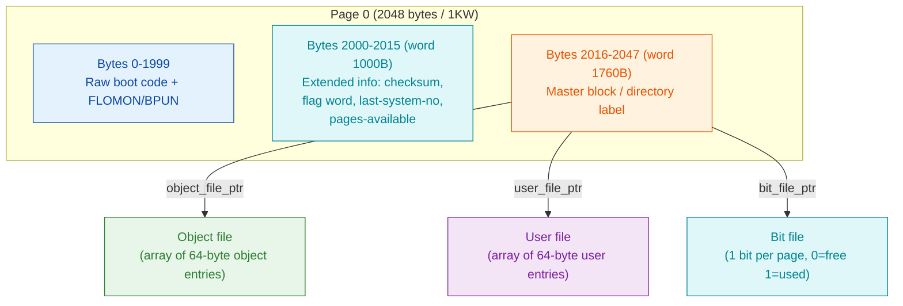

# SINTRAN III Filesystem - Reverse-Engineering Foundation

**Status:** Phase 0 - survey and scoping complete. This document is the grounded
foundation for the deeper reverse-engineering effort. It maps every source,
records what is already byte/doc-confirmed, gives the `006-S3FS` code map, and
lays out the phased plan with the open questions each later phase must resolve.

**Rule of evidence used throughout:** every claim is tagged
**VERIFIED** (confirmed from real disk bytes, official docs, or carved `006-S3FS`
bytes), **INFERRED** (deduced from a secondary source, not yet byte-proven), or
**OPEN** (an unanswered question routed to a later phase). NPL source is treated
as a *behaviour cross-check only* - it is a different revision than the carved
SINTRAN L image, so it is never taken as truth for on-disk offsets or addresses.

---

## 1. Overview - what the full RE must cover

The SINTRAN III filesystem (NDFS) stores, on every *directory device* (a disk or
disk partition), four on-disk structures plus the raw boot code:

1. **The master block / directory "label"** - the structured data that follows the
   raw boot code on page 0: directory name, status/flags, and pointers to the
   page bitmap (bit file), the object file, and the user file.
2. **The object file** - an array of 64-byte **object entries**, one per file
   version (name, owner, page list / file pointer, access rights, dates, flags).
3. **The user file** - an array of 64-byte **user entries** (accounts: name,
   password, quota, friends).
4. **The bit file** - the allocation **bitmap**, one bit per page (0 = free,
   1 = used).

The eventual full RE must document (a) the ON-DISK FORMAT of all four, (b) the
CODE LOGIC in `006-S3FS` for directory/user/file allocation, the bitmap
get-page/release-page primitives, and file I/O (read/write/append/delete), and
(c) how **CRDIR** (create-directory) lays the label + bit file + object file +
user file onto a fresh device.

### Page-0 and directory layout (VERIFIED against real disk `SMD0.IMG`)



---

## 2. Phased plan

| Phase | Scope | Primary sources | Exit criterion |
|-------|-------|-----------------|----------------|
| **0. Survey (this doc)** | Source map, initial findings, code map, open questions | all | this README |
| **1. Master block / on-disk label** | Byte-exact field layout at page-0 offset 2016; extended info at 2000; pointer-type encoding | real disk bytes + NDFS `master_block.c` + `006-S3FS` `GMAIN`/`GDIRA` | every field byte-proven against ≥2 real disks |
| **2. Object entry** | 64-byte record layout; access-bit tiers; file-type flags; file pointer / page list | NDFS `object_entry.c` + `006-S3FS` `ROBJE`/`WOBJE`/`COBJE` + `@DUMP-OBJECT-ENTRY` | field-by-field decode of a real object file |
| **3. User entry** | 64-byte record; password, quota, friends table | NDFS `user_entry.c` + `006-S3FS` `RUSER`/`WUSER`/`GUSEN` + `@DUMP-USER-ENTRY` | field-by-field decode of a real user file |
| **4. Page bitmap** | Bit-file page span, bit ordering, reserved blocks 0-6, get/release semantics | NDFS `bit_file.c` + `006-S3FS` `GPAGE`/`ALPAG`/`RLPAG`/`RPAGE`/`WPAGE`/`TESTB` | bitmap read from real disk matches `ndtool -i` used/free |
| **5. Allocation code** | Directory / user / object / file allocation control flow | `006-S3FS` `CRNEW`/`CROBJ`/`GCFIL`/`FFILE`/`EXPFI`/`CRALN`/`CRALF` + `INSUS`/`CHNUS` | self-contained ASM + pseudo-C per routine (golden-path style) |
| **6. File I/O** | read/write/append/delete; indexed vs contiguous; index-block (`RINDX`/`WINDX`) walk | `006-S3FS` `RFILE`/`WFILE`/`RDISK`/`WDISK`/`FGET`/`FPUT`/`FREA`/`FWRT`/`DELPG`/`COPAG` | trace a real read + write end to end |
| **7. CRDIR (boot-sector creation)** | How a fresh device gets label + bit file + object file + user file; bit-file placement + bad-page test | `006-S3FS` `CRDIR` (136741B) + `@CREATE-DIRECTORY` doc + NDFS `image_creator.c` | reproduce the layout NDFS `image_creator.c` produces and match `006-S3FS` byte-for-byte where carved |

Deliverable style per routine follows the MON-call **golden path**
(`../../tools/sintran-segment-carver/versions/L-VSX-500/re/mon-analysis/GOLDEN-PATH.md`):
one README + self-contained `.ASM` + `.pseudo.c`.

---

## 3. Source map

| Source | Type | What it provides | Exact anchors |
|--------|------|------------------|---------------|
| `006-S3FS` segment | carved SINTRAN L bytes (ground truth for CODE) | The whole filesystem segment disassembled and byte-identity-checked. Load base **26000B**, 54272 words. | `.../L-VSX-500/re/segments-ref/006-S3FS/006-S3FS.asm`, `.hex`, `.symbols.txt` (FILSYS-SYMBOLS). CRDIR=**136741B**; see §5 code map. |
| `SMD0.IMG` | real carved SINTRAN L system disk (ground truth for ON-DISK FORMAT) | Volume **PACK-ONE**, 38400 pages, 188 files, 10 users. Boot format = raw **binary SMD/ECC bootstrap** (page 0 word 0 = `PIOF` 150405B, then `IOX` to device window 1540-1547B); see [`on-disk-format/boot-sector.md`](on-disk-format/boot-sector.md). (An older `ndtool` build mislabelled this "None" - corrected via the `PIOF` opcode signature.) | `~/repos/nd100x/SMD0.IMG` (78643200 bytes). Master block at byte **2016** of page 0; extended info at **2000**. Read with `ndtool` or raw `xxd`. |
| `250305L07-XX-01D.IMG` | real carved SINTRAN L floppy image | Alternate small (1.2 MB) L-revision directory device for a second-disk cross-check. | `~/repos/nd100x/250305L07-XX-01D.IMG` (also `~/repos/nd100em/SINTRAN/VSXL1.IMG`, identical size). |
| **NDFS C library** | independent on-disk-format implementation (ground truth for LAYOUT, cross-checks the bytes) | Parses/writes every on-disk structure. Struct headers give exact byte offsets; `.c` files give the parse/serialize logic; `image_creator.c` shows fresh-device layout. | `~/repos/norskdata-ndfs/ndfs-c/include/ndfs/{master_block,object_entry,user_entry,bit_file,block_pointer}.h` and `src/*.c`. |
| `ndtool` | working NDFS inspector built on the library above | `-i` info, `-t`/`-u` listings, `--stat -v` per-file object-entry dump + block list, `--fsck`, raw dumps. | `/usr/local/bin/ndtool` (v0.0.3). Use to validate any decoded field against a known-good reader. |
| ND-60.128.5 Reference Manual | official docs (behaviour, field semantics) | Commands `CREATE-DIRECTORY`, `DUMP-OBJECT-ENTRY`, `DUMP-USER-ENTRY`, `DUMP-PAGE`, `CHANGE-OBJECT-ENTRY`, `CHANGE-USER-ENTRY`, `CHANGE-BIT-FILE`, allocation/quota commands. | `Reference-Manuals/ND-60.128.5 EN SINTRAN III Reference Manual.md` lines: CREATE-DIRECTORY 2068, DUMP-OBJECT-ENTRY 4348, DUMP-USER-ENTRY 4515. |
| ND-60.112.01 Appendix A - Data Fields | official docs (datafield layouts) | Disk/DF datafields, file-system semaphore, FLAGB bits. Directory/object-entry field tables are *not* explicitly headed here - see OPEN-Q4. | `Reference-Manuals/ND-60.112.01 SINTRAN III System documentation Appendix A - Data Fields.md`. |
| SINTRAN-STRUCTURES.md | prior analysis | Bitmap area note (`5BITM=000010B`), status bits, core map, disk datafields (SMD/Winchester/SCSI/floppy). | `SINTRAN/SINTRAN Structures/SINTRAN-STRUCTURES.md` (Bitmap Area line 290). |
| MON-call analyses | carved-worker cross-checks | Already-carved filesystem MON workers with role + provenance. | `.../re/mon-analysis/` - `41B-ReadObjectEntry` (ROBJE), `244B-GetDirEntry` (GDIEN), `221B-CreateFile` (CRFIL), `50B-OpenFile`, `43B-CloseFile`, `270B/271B` disk-page, `54B-DeleteFile`, `274B-GetFileIndexes`, etc. |
| NPL disk source | behaviour cross-check (DIFFERENT revision - not truth) | Disk-driver / page-fault behaviour. | `SINTRAN/NPL-SOURCE/NPL/*DISK*.NPL`. |

---

## 4. Initial findings (byte/doc-grounded)

### 4.1 Master block / directory label - **VERIFIED** from real `SMD0.IMG` bytes

The master block is a **32-byte** structure at byte offset **2016** of page 0
(word 1760B), preceded by a **16-byte** extended-info block at offset **2000**
(word 1750B). Raw bytes from `SMD0.IMG` page 0, offsets 0x7D0-0x7FF:

```
000007d0: 10b7 0000 0000 0000 8000 0066 0000 9051   <- extended info (2000)
000007e0: 5041 434b 2d4f 4e45 2700 0000 0000 0000   <- "PACK-ONE'" name (2016)
000007f0: 4000 48fc 4000 48fe 0000 4824 0000 2ca4   <- 3 block ptrs + unreserved
```

Master block field layout (offsets relative to 2016), all multi-byte values
**big-endian** - **VERIFIED**:

| Rel. offset | Field | Bytes on real disk | Decoded |
|-------------|-------|--------------------|---------|
| 0x00 (0-15) | Directory name (16 chars, terminated `0x27` `'`) | `50 41 43 4B 2D 4F 4E 45 27 ...` | `PACK-ONE` (matches `ndtool` volume) |
| 0x10 (16) | `object_file_ptr` (4-byte block pointer) | `40 00 48 FC` | type=**01 INDEXED**, block **44374B** (18684) |
| 0x14 (20) | `user_file_ptr` (4-byte block pointer) | `40 00 48 FE` | type=**01 INDEXED**, block **44376B** (18686) |
| 0x18 (24) | `bit_file_ptr` (4-byte block pointer) | `00 00 48 24` | type=**00 CONTIGUOUS**, block **44044B** (18468) |
| 0x1C (28) | `unreserved_pages` (4-byte) | `00 00 2C A4` | **26244B** (11428) |

**Block pointer encoding - VERIFIED:** a 4-byte big-endian value; **top 2 bits =
type** (0 contiguous, 1 indexed, 2 sub-indexed, 3 reserved), **bottom 30 bits =
block/page ID**.

Extended-info block (offset 2000), big-endian - **VERIFIED** layout, values from
`SMD0.IMG`:

| Rel. offset | Field | Real value |
|-------------|-------|-----------|
| 0x00 | checksum | `10B7` |
| 0x02/0x04/0x06 | reserved 1/2/3 | `0000` each |
| 0x08 | flag word | `8000` |
| 0x0A | last-system-number | `0066` (102) |
| 0x0C | pages-available (4-byte) | `110121B` (36945) |

Checksum algorithm - **VERIFIED (kernel)**: a **16-bit ADDITIVE SUM** of the extended
words. See [`on-disk-format/extended-info-block.md`](on-disk-format/extended-info-block.md)
section 2, which carries it out of the writer `WXDIR` = 37702B and the validator
`CHDSI` = 37763B in `006-S3FS`. Both use the identical summation.

**CORRECTED 2026-08-02.** This section previously read:

> Checksum algorithm - **VERIFIED** (from NDFS `master_block.c`):
> `checksum = (pages_lo XOR pages_hi XOR flag_word XOR res1 XOR res2 XOR res3) + last_system_number`.

That is **wrong**, and the "VERIFIED" tag rested on evidence that could not have caught it:

- **It was circular.** The cited proof was our own `master_block.c` — a re-implementation,
  not SINTRAN. It cannot disagree with itself.
- **The one sample could not tell XOR from ADD.** On PACK-ONE the only two words sharing a
  set bit are `flag=0x8000` and `pages_lo=0x9051`, both at bit 15. Under ADD the carry
  leaves bit 15; under XOR it cancels — and both land on the same stored value. A second
  disk breaks it immediately (`BIGDISK0-K.IMG` → `0x1051`, `scsi-1.img` → `0xC162`).
- **The "cross-check that passes" was unrelated.** `ndtool -i` reporting 38400/14277/24123
  pages says nothing whatsoever about a checksum formula, and `ndtool` is not an
  independent reader in any case — it links the same `ndfs-c` library
  (`ndfs-c/CMakeLists.txt`: `target_link_libraries(ndtool ndfs)`).

A writer following the old line would stamp a wrong checksum on every volume it created.

### 4.2 Object entry (file metadata) - **VERIFIED** layout (NDFS + `ndtool`), byte-decode PENDING

64-byte record in the object file. Layout from NDFS `object_entry.h`/`.c`
(big-endian), corroborated field-for-field by `ndtool --stat -v`:

| Offset | Field | Notes |
|--------|-------|-------|
| 0 | header (bit7 `0x80` = in use) | `NDFS_OBJECT_IN_USE` |
| 2-17 | object name (16 bytes, `0x27`-terminated) | |
| 18-21 | file type text (4 bytes, `0x27`-terminated) | e.g. `DATA`,`PROG`,`SYMB` |
| 22 / 24 | next-version / prev-version (versioning chain) | |
| 26 | access bits: 3 × 5-bit tiers OWN(0-4)/FRIEND(5-9)/PUBLIC(10-14); bits R/W/A/C/D | default `0x03FF` |
| 28 | file-type flags `L M A C I B P T` (library/magtape/allocated/contiguous/indexed/spooling/peripheral/terminal) | |
| 30 | device number | |
| 32 | file-type code (0 DATA,1 PROG,2 SYMB,3 TEXT) | |
| 34 | user index (owner) [word may pack user\|file index] | |
| 36 / 38 | current-open-count / total-open-count | |
| 40 / 44 / 48 | date created / last-read / last-write (ND timestamps) | |
| 52-55 | pages in file (32-bit) | |
| 56-59 | bytes-in-file minus 1 (32-bit; actual = stored + 1) | |
| 60-63 | file pointer (block pointer: contiguous start, or indexed index-block) | |

**INFERRED→to VERIFY (Phase 2):** the exact meaning of offsets 22-25 vs 34's
packed word, and whether the object file is itself an indexed file walked via
`RINDX`/`WINDX` (strongly suggested by `ROBJE` calling `RINDX` in the carved
worker). Confirm by decoding a real object entry with a raw dump + `ndtool --stat`.

### 4.3 User entry (account) - **VERIFIED** layout (NDFS), byte-decode PENDING

64-byte record in the user file (NDFS `user_entry.h`, big-endian):

| Offset | Field |
|--------|-------|
| 0 | flag (`0x81` = valid user) |
| 1 | enter count |
| 2-17 | user name (16 bytes, `0x27`-terminated) |
| 18-19 | password (16-bit) |
| 20-23 / 24-27 | date created / last date entered (ND time) |
| 28-31 / 32-35 | pages reserved (quota) / pages used |
| 36 / 37 | directory index / user index |
| 40-41 | default file access (16-bit) |
| 48-63 | friends: 8 × 2-byte entries |

**INFERRED→to VERIFY (Phase 3):** bytes 38-39 and 42-47 (the source keeps them as
raw pass-through; `user_entry.h` hints byte 47 = `mxobl/acobl`). Resolve against
`006-S3FS` `RUSER`/`WUSER` and `@DUMP-USER-ENTRY` of a real user.

### 4.4 Page bitmap (bit file) - **VERIFIED** semantics, byte-decode PENDING

- One **bit per page**, **0 = free, 1 = used** (NDFS `bit_file.h`). **VERIFIED.**
- **Blocks 0-6 are reserved** (system); first allocatable block = **7**
  (`NDFS_FIRST_ALLOC_BLOCK`). **VERIFIED** in NDFS; must confirm the same
  reservation in `006-S3FS` `ALPAG`/`GPAGE` (Phase 4).
- Contiguous-file allocation searches for a free *range*; single-page allocation
  takes the first free bit from block 7 up. **INFERRED** (NDFS behaviour) - verify
  the search direction against `006-S3FS`, since the doc says contiguous files are
  placed in the **highest** page range (`@CREATE-FILE` rule 3), which is the
  opposite direction and is an **OPEN** question (§6, Q3).
- Prior analysis `SINTRAN-STRUCTURES.md` notes a bitmap area constant
  `5BITM=000010B` - relationship to the on-disk bit file is **OPEN**.

### 4.5 Directory entry returned by MON 244 - **VERIFIED** size

The in-memory / returned **directory entry** is **24 words (42 bytes)**
(from the carved `244B-GetDirEntry`/GDIEN analysis). This is distinct from the
32-byte on-disk master block; the relationship between the two (which fields
overlap) is an **OPEN** question for Phase 1.

---

## 5. `006-S3FS` filesystem code map

Segment load base **26000B**. Byte offset of octal address `A` in the `.hex`:
`(A - 26000B)_octal_as_decimal * 2`. All addresses octal. One-line roles are from
the FILSYS symbol names + carved MON-worker cross-checks; bodies not yet
individually verified are marked so in their phase.

### Master block / directory

| Addr | Sym | Role (one line) |
|------|-----|-----------------|
| 30225B | `GDIRA` | Get directory address (base of a directory's in-core datafield) |
| 30235B | `GNAMA` | Get name address |
| 47402B | `GDIRI` | Get directory index |
| 47653B | `GMAIN` | Get main directory |
| 47716B | `WDIRE` | Write directory (entry/label) |
| 107106B / 107111B | `WDIEN` / `GDIEN` | Write / get directory entry (GDIEN = MON 244) |
| 107401B / 107403B | `RESDI` / `RELDI` | Reserve / release directory |
| **136741B** | **`CRDIR`** | **Create directory** - lays down label + bit/object/user files (Phase 7) |

Directory datafield accessors (offset getters into the directory DF, 43263B-43775B):
`DDEVN DLOGU DFRFL DUSEN DSPAC DNUSE DPASS DACCE DFNAM DPAGE DNFIL DDVNU DOBJI DBLSZ DBYTP DOUTF ...`

### Object entry

| Addr | Sym | Role |
|------|-----|------|
| 55563B / 55566B / 55750B | `FOBJB` / `ROBJE` / `WOBJE` | Find / read (MON 41) / write object block |
| 56307B / 56326B | `ROBJB` / `GOBJI` | Read object block / get object index |
| 61502B | `COBJE` | Change object entry |
| 63726B / 64146B | `CROBJ` / `DLOBJ` | Create / delete object |
| 104035B / 104037B / 104410B | `MROBJ` / `DROBJ` / `DWOBJ` | MON read / direct read / direct write object entry |

### User entry

| Addr | Sym | Role |
|------|-----|------|
| 53174B / 53243B | `TUSEN` / `FUSEB` | Test / find user block |
| 53246B / 53410B | `RUSER` / `WUSER` | Read / write user entry |
| 53721B | `RUSEB` | Read user block |
| 55111B | `GUSEN` | Get user entry |
| 55206B | `CUSED` | Change used (pages) |
| 62206B / 62314B | `CHNUS` / `INSUS` | Change / insert user |
| 105010B | `MRUSE` | MON read user entry |

### Page bitmap / allocation primitives

| Addr | Sym | Role |
|------|-----|------|
| 50627B | `ALPAG` | Allocate page (mark used in bit file) |
| 50632B / 50635B | `XRLPA` / `RLPAG` | Release page |
| 51025B | `TPAGF` | Test page free |
| 51120B | `RSPAG` | Reserve/set page |
| 51353B / 51355B | `TESTB` / `TESTP` | Test bit / test page |
| 76205B | `GPAGE` | Get (allocate) a page - core bitmap primitive |
| 101707B / 101711B | `RPAGE` / `WPAGE` | Read / write a bit-file page |
| 60147B / 60151B | `DLSPA` / `DLPAG` | Release / delete page(s) |
| 74510B | `DFPAG` | Deallocate/free page |

### File index blocks (indexed files)

| Addr | Sym | Role |
|------|-----|------|
| 51451B / 51453B | `GP5IX` / `RINDX` | Get index / read index block |
| 52066B | `FINDX` | Find index (walk index block for a file page) |
| 52163B | `PRKEY` | Process key |
| 52501B | `WINDX` | Write index block |

### File create / open / close / delete / rename / expand

| Addr | Sym | Role |
|------|-----|------|
| 64410B / 64670B | `CRNEW` / `GCFIL` | Create new / get-create file |
| 65144B | `FFILE` | Find file |
| 67432B / 67612B | `FOPEN` / `FCLOS` | File open / close |
| 103026B / 103034B / 103037B | `DOPEN` / `OPFIL` / `OLDOP` | Direct-open / open-file / open-old |
| 103350B / 103355B | `BCLOS` / `CLOFI` | Backup-close / close file |
| 105555B | `EXPFI` | Expand file |
| 105560B / 105562B | `CRALN` / `CRALF` | Create allocated (indexed / contiguous) |
| 106060B / 106063B | `MRNFI` / `MDLFI` | Rename / delete file |

### File I/O

| Addr | Sym | Role |
|------|-----|------|
| 102021B / 102023B | `RDISK` / `WDISK` | Read / write disk (page-level) |
| 102130B / 102132B | `RFILE` / `WFILE` | Read / write file |
| 102517B / 102625B | `FGET` / `FPUT` | File get / put (byte/record) |
| 77000B / 77230B | `REBUF` / `WRBUF` | Read / write buffer |
| 77542B / 100130B | `FREA` / `FWRT` | File read / write core |
| 100566B / 100570B | `FDREA` / `FDWRT` | File direct read / write |
| 107447B / 107451B | `RDPAG` / `WDPAG` | Read / write disk page |
| 110050B / 110472B | `COPAG` / `DELPG` | Copy page / delete page |

### Queue / lock plumbing (context, not FS structure)

`FCSTA INIQ RELQ WLOCQ LOCQ REAQ WRIQ APPQ TAKQ UNLQ` (26000B-26331B) - the
file-system request-queue and lock primitives that the I/O paths run on.

---

## 6. Open questions - what each later phase needs

1. **OPEN-Q1 (Phase 1):** Confirm the master-block layout against a **second** real
   directory device (`250305L07-XX-01D.IMG`) and against the `006-S3FS` writer
   `GMAIN`/`WDIRE`/`CRDIR` bytes, so the offsets are proven from the *producing
   code*, not only from the NDFS reader + one disk. Need: byte-trace of where
   `CRDIR` stores the three block pointers.

2. **OPEN-Q2 (Phase 1):** How does the on-disk 32-byte master block relate to the
   24-word (42-byte) directory entry that MON 244 (`GDIEN`) returns? Which fields
   are the same, which are in-core only? Need: `GDIEN`/`GDIRA` field trace.

3. **OPEN-Q3 (Phase 4):** Bitmap allocation direction. NDFS allocates upward from
   block 7, but `@CREATE-FILE` documents contiguous files placed in the **highest**
   address range. Resolve the real `GPAGE`/`ALPAG` search direction and the
   role of the reserved blocks 0-6 in `006-S3FS`. Need: `GPAGE` control-flow trace.

4. **OPEN-Q4 (Phase 2/3):** Appendix A (Data Fields) does not contain an explicit
   object-entry / user-entry field table under a findable heading. Locate the
   authoritative on-disk field table in the ND System Documentation set (or accept
   NDFS + `ndtool` + the carved code as the authority). Need: doc search of the
   full ND-60.112 / System Supervisor manuals.

5. **OPEN-Q5 (Phase 7):** CRDIR (136741B) is a JPL-heavy routine dispatching
   through an in-body pointer table (words at 137014B+). Full decode requires
   carving the referenced sub-routines and matching the bit-file bad-page test
   ("write/compare three test patterns", per the `@CREATE-DIRECTORY` doc) against
   the carved bytes. Need: closure-checked carve of `CRDIR` + callees, then compare
   the produced layout to NDFS `image_creator.c` (`bit_file_block = pages/2`,
   object/user index blocks adjacent).

---

## 7. Subfolders

- [`on-disk-format/`](on-disk-format/README.md) - master block, object entry,
  user entry, bitmap byte layouts (Phases 1-4), plus
  [`boot-sector.md`](on-disk-format/boot-sector.md) - the page-0 boot code and
  the three ND-100 boot formats (BPUN / FLOMON / raw binary bootstrap), with the
  real `SMD0.IMG` boot sector decoded, and
  [`extended-info-block.md`](on-disk-format/extended-info-block.md) - the 16-byte
  page-0 extended-info block (checksum, flag word, system number, capacity)
  decoded from the producing kernel routines `WXDIR`/`CHDSI`.
- [`code-logic/`](code-logic/README.md) - allocation, bitmap primitives, file I/O,
  CRDIR (Phases 5-7).
- [`create-directory.md`](create-directory.md) - full `CRDIR` create-directory
  walk-through (label, bit/object/user files, bad-page test, checksum), and
  [`create-directory-placement.md`](create-directory-placement.md) - the
  **VERIFIED bit-file placement formula** `bit = 9*floor(floor(pages/2)/9)` (round
  `pages/2` down to a multiple of 9), the supplied-address-vs-default branch, the
  all-image data table, and the concrete NDFS fix for `bit_file_block = pages/2`.
- [`boot-creation.md`](boot-creation.md) - the **boot half** of making a bootable
  device (separate from the filesystem structure): how the page-0 bootstrap is
  produced per device class (SMD [real bytes], floppy FLOMON/BPUN [real bytes],
  Winchester [derived], SCSI [derived]), the mass-storage-load / binary-load
  firmware contract and ALD presets, and how SINTRAN writes it
  (`DUMP-BOOTSTRAP` for floppy; pack-to-pack copy for hard disk).
- [`NDFS-VALIDATION.md`](NDFS-VALIDATION.md) - point-by-point validation of the
  independent NDFS on-disk-format report against the SINTRAN kernel bytes + real
  disk: confirmed / corrected / still-open per claim, and the 7 ranked open
  questions answered (the checksum is a 16-bit additive sum, not XOR; flag-word
  bit 15 = "directory entered"; bad checksum triggers rebuild, not rejection).
- [`code-logic/enter-directory.md`](code-logic/enter-directory.md) - the full
  end-to-end `@ENTER-DIRECTORY` (mount) trace from the carved bytes: command
  dispatch -> `ENDIR` 140176B (unit reserve + `GDIRA` datafield) -> `CHDSI`
  37763B -> the **page-0 read** (`RXDIR`/`RCBLO`, block 0, dispatched through the
  datafield transfer pointer) -> checksum/capacity/owner-interlock/flag-stamp ->
  `WXDIR` write-back, with the disk-controller read contract and the mount error
  codes.

---

**Last updated:** Phase 0 survey. Evidence base: real `SMD0.IMG` bytes, NDFS C
library, carved `006-S3FS` SINTRAN L bytes, ND-60.128.5 official docs.
