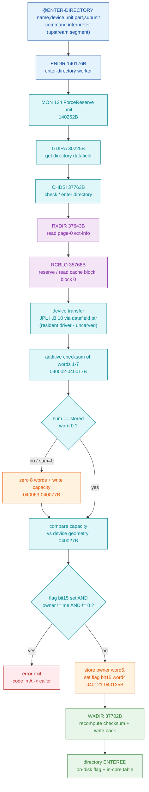

# ENTER-DIRECTORY (mount) - end-to-end code trace

The complete `@ENTER-DIRECTORY` (directory mount) path in SINTRAN III, traced from
the **carved SINTRAN L bytes** of segment `006-S3FS` (load base **26000B**). This
document extends the scattered `CHDSI` validation notes in
[`../NDFS-VALIDATION.md`](../NDFS-VALIDATION.md) into the full call graph, from the
command worker down to the page-0 device read and back up to the "entered" state.

**Evidence rule** - every claim is graded:

- **VERIFIED** - proven from the carved `006-S3FS` bytes (disassembly shown), or
  from the real disk / reference manual as cited.
- **INFERRED** - strong reasoning from the bytes + architecture, not a single
  decisive instruction.
- **OPEN** - crosses into an uncarved resident/driver overlay or is otherwise
  unsettled; the boundary is stated.

All addresses are **octal**. On-disk multi-byte values are **big-endian words** -
a fact about the disk format, stated so the decodes reproduce. Disassembly is the
byte-identity-checked whole-segment listing at
[`006-S3FS.asm`](../../../tools/sintran-segment-carver/versions/L-VSX-500/re/segments-ref/006-S3FS/006-S3FS.asm);
opcodes are grounded in
[`ND100-INSTRUCTION-SEMANTICS.md`](../../../tools/sintran-segment-carver/versions/L-VSX-500/re/instruction-semantics/ND100-INSTRUCTION-SEMANTICS.md).

---

## 1. Carved anchors (the call graph)

| Addr (octal) | Symbol | Role | Verdict |
|--------------|--------|------|---------|
| 140176B | `ENDIR` | **Enter-directory worker** - reserves the unit, gets the directory datafield, calls `CHDSI` | VERIFIED |
| 137731B | `RNDIR` | Rename/(re)name-directory helper directly above `ENDIR` (same datafield idiom) | VERIFIED (symbol) |
| 30225B | `GDIRA` | Get directory address (base of the in-core directory datafield) | VERIFIED |
| 37763B | `CHDSI` | **Check/enter directory** - read page 0, checksum, capacity, owner interlock, stamp flag, write back | VERIFIED |
| 37643B | `RXDIR` | **Read page-0 extended-info** via the buffer cache | VERIFIED |
| 35766B | `RCBLO` | Reserve/read a cache block (the page-cache lookup that drives the device read) | VERIFIED |
| 35240B | `CL1DB` | Clear/release one disk-cache buffer | VERIFIED (symbol) |
| 37702B | `WXDIR` | Recompute checksum + write the extended-info block back | VERIFIED |
| 40162B | `REENB` | Release directory - clear the "entered" flag bit + write back | VERIFIED |

Call chain (VERIFIED edges shown with the calling instruction):

```
@ENTER-DIRECTORY  (command interpreter - upstream segment, OPEN boundary)
     |
     v
ENDIR 140176B ---- 140402: JPL I 33 -> [140435]=037763 ----> CHDSI 37763B
     | 140244: JPL I 141 -> [140405]=030225 -> GDIRA 30225B
     | 140252: MON 124 (ForceReserve the unit)
     v
CHDSI 37763B ---- 040000: JPL I 143 -> [040143]=037643 ----> RXDIR 37643B
     | 040127: JPL I 30 -> [040157]=037702 ----> WXDIR 37702B   (rebuild / stamp write-back)
     v
RXDIR 37643B ---- 037652: JPL I 23 -> [037675]=035766 ----> RCBLO 35766B  (block 0)
     v
RCBLO 35766B ---- 036135/036142/036167/036174: JPL I ,B 10 ---->  device transfer
                   (local 10 = datafield word ,X 14, a resident driver entry - OPEN boundary)
```



---

## 2. Stage 1 - command dispatch and parameters

The operator command is (`Reference-Manuals/ND-60.128.5 EN SINTRAN III Reference
Manual.md`, ENTER-DIRECTORY):

```
@ENTER-DIRECTORY <directory name>,<device name>,<unit>[,<'F' or 'R'>][,<subunit>]
```

Example from the SCSI bug report: `ENTER-DIRECTORY ,,DISC-SCSI-1,0` -
directory-name omitted (rule 5: enter whatever directory is on the unit),
device `DISC-SCSI-1`, unit `0`.

- **`<directory name>`** - matched against, or an abbreviation of, the name found
  on the device (rule 2). Omitted -> the resident directory is entered as long as
  no other directory of that name is already entered (rule 5).
- **`<device name>` + `<unit>`** - selects the mass-storage unit datafield.
  `<unit>` is now always required (rule 7).
- **`<'F'/'R'>`** - fixed vs removable part (disks that have both).
- **`<subunit>`** - subdivided disks / directories, 0-5.

**Boundary (OPEN):** the command line is tokenised and the device/unit resolved to
a directory index by the **command interpreter**, which lives in a different
segment than `006-S3FS`. That upstream parse is not in the carved filesystem
segment. What *is* carved is the file-system worker it drives, **`ENDIR`
= 140176B**, which receives the directory index and the entering system number and
performs the mount. Everything from `ENDIR` down is VERIFIED below.

---

## 3. Stage 2 - unit reserve + directory datafield

`ENDIR` (140176B) prologue is the standard PLANC frame idiom (`SAB 27` = a
23-word frame; `STD I 30` saves the link). The body:

```
140244  135141   JPL I 141   ; -> [140405]=030225  GDIRA : get directory datafield
140245  014425   STX ,B 25   ; local 25 = directory datafield pointer (X)
140246  046003   LDA ,X 3    ; A = datafield word 3
140247  135137   JPL I 137   ; -> [140406]  (helper)
140250  046004   LDA ,X 4    ; A = datafield word 4 (unit / reserve descriptor)
140251  131005   JAZ 5       ; if 0 -> skip reserve (-> 140256)
140252  153124   MON 124     ; ForceReserve / PRSRV : reserve the mass-storage unit
140253  130003   JAP 3       ; if A >= 0 (reserved OK) -> 140256
140254  170547   SAA 147     ; else error 147B "device unit reserved for special use"
140255  125132   JMP I 132   ; -> error exit
140256  046000   LDA ,X 0    ; A = datafield word 0 (device flags/type)
140257  175355   BSKP ONE 150 DA ; test a device-type bit (150 octal = bit 13)
140260  124003   JMP 3       ; bit clear -> 140263
140261  170545   SAA 145     ; else error 145B "illegal on tape device"
140262  125126   JMP I 126   ; -> error exit
```

- **`GDIRA` 30225B** returns X = the in-core **directory datafield** (its base).
  This is the per-directory descriptor the rest of the flow indexes with `,X n`.
  VERIFIED (call at 140244 through pointer word 140405 = 030225).
- **`MON 124` (ForceReserve)** reserves the physical unit before any transfer.
  VERIFIED (opcode 153124 at 140252). A failed reserve returns **147B**.
- The device-type bit test (140256-140262) rejects a tape unit with **145B**.
  VERIFIED (SAA immediate); which datafield bit is the "tape" bit is INFERRED.

The datafield built here also carries the **transfer function pointer** (word
`,X 14`) that the page-0 read dispatches through - see Stage 3.

The entering **system number** is carried in `ENDIR` local 26 and handed to
`CHDSI`:

```
140401  050426   LDT ,B 26   ; T = entering system number
140402  135033   JPL I 33    ; -> [140435]=037763  CHDSI  (T = owner arg)
140403  125005   JMP I 5     ; CHDSI error return  -> error exit 140410
140404  124032   JMP 32      ; CHDSI ok return      -> 140436
```

VERIFIED: `ENDIR` calls `CHDSI` at 140402B (pointer word 140435 = 037763), passing
the entering system number in T; the fail/ok returns are the two words after the
call.

---

## 4. Stage 3 - THE page-0 read (the disk-driver contract)

This is the exact read a mass-storage / SCSI emulator must satisfy for mount to
work. `CHDSI` starts by reading the page-0 extended-info block through `RXDIR`:

```
CHDSI 37763B, entry:
037763  021154   STD I 154        ; save link
037766  170020   SAB 20           ; frame
037775  050401   LDT ,B 1
037776  054144   LDX 144
037777  146037   RADD SB DX       ; X = datafield-derived buffer descriptor
040000  135143   JPL I 143        ; -> [040143]=037643  RXDIR   <-- reads page 0
040001  124134   JMP 134          ; RXDIR error -> 040135
040002  ...                       ; checksum loop (Stage 4)
```

VERIFIED: `CHDSI` calls `RXDIR` at 040000B (pointer word 040143 = 037643) before
anything else.

### 4.1 RXDIR - read via the page cache

`RXDIR` body (37643B-37672B; word 37673B `ROP NOOP` separates the routine from its
literal pointer pool at 37674B+):

```
037643  021030   STD I 30                     ; save link
037646  170007   SAB 7                        ; frame
037647  135025   JPL I 25   ; -> [037674]=003752   resident prologue (OPEN boundary)
037650  146105   RADD CLD 0 DA                ; A := 0
037651  146101   RADD CLD 0 DD                ; D := 0   (32-bit block number = 0)
037652  135023   JPL I 23   ; -> [037675]=035766  RCBLO : reserve/read cache block 0
037653  124016   JMP 16     ; RCBLO error skip -> 037671
037654  014406   STX ,B 6                     ; local 6 := X (returned cache-buffer ptr)
037655  060021   ADD 21                       ; source offset into the page buffer
037656  054400   LDX ,B 0
037657  171010   SAT 10                       ; T := 8   (copy 8 words = ext-info block)
037660  144057   SWAP SA DX
037661  135016   JPL I 16   ; -> [037677]=001224   resident block copy (OPEN boundary)
037665  135013   JPL I 13   ; -> [037700]=035240  CL1DB : release the cache buffer
037666  040404   MIN ,B 4                     ; ok-return marker
037670  125011   JMP I 11   ; -> [037701]=003776   resident epilogue / return
037671  004402   STA ,B 2                     ; error path: store status
037672  124375   JMP -3     ; join epilogue
```

**What RXDIR does (VERIFIED):**

1. Calls **`RCBLO` 35766B** with the block number in the D register set to **0**
   (`RADD CLD 0 DD` at 037651). `RCBLO` is the disk-buffer-cache lookup: it
   reserves a cache buffer for the requested block and, on a miss, drives the
   device read. So the read target is **logical block / page 0**.
2. On return, X points at the cache buffer holding page 0 (`STX ,B 6`).
3. Copies **8 words** (`SAT 10`, T = 8) - the extended-info block - out of the page
   buffer via the resident block-copy routine.
4. Releases the cache buffer (`CL1DB` 35240B) and returns.

So `RXDIR` fetches **page 0 into a full-page cache buffer** and extracts the 8-word
extended-info sub-block. The 32-byte master block at word 1760B lives in the same
page-0 buffer.

### 4.2 RCBLO - where the physical transfer is issued

`RCBLO` 35766B is the page-cache manager. It matches the requested block number
against cached buffers (`,X 5`/`,X 6` = block hi/lo, `,X 12` = device) and, on a
miss, calls the **device transfer routine through a datafield function pointer**:

```
036100  054411   LDX ,B 11    ; X = the unit/device descriptor
036101  046014   LDA ,X 14    ; A = descriptor word 14 = TRANSFER FUNCTION POINTER
036102  004410   STA ,B 10    ; local 10 := that pointer
...
036135  135410   JPL I ,B 10  ; -> device transfer (READ)   indirect through local 10
036142  135410   JPL I ,B 10  ; (alternate read/format entry)
036167  135410   JPL I ,B 10
036174  135410   JPL I ,B 10
```

VERIFIED: the actual page transfer is an **indirect call through the device
datafield** (`,X 14`). The read/write direction and function selection are chosen
by the `AND`/`AAA` mask arithmetic at 036124-036174B just before each `JPL I ,B 10`.

**Boundary (NARROWED - see the RCBLO carve):** the routine that pointer targets -
the mass-storage / SCSI **driver transfer primitive** (`SCSDISK`, reached via the
datafield word `,X 14`) - is a **runtime-bound pointer into a resident driver
segment, not part of the carved `006-S3FS` segment**. `RCBLO` itself is now fully
carved and is resident in `006-S3FS` (NOT a foreign overlay), proven by sibling
coherence (WBLOC/WCBLO/WTAPE) - see
[`RCBLO/README.md`](../../../tools/sintran-segment-carver/versions/L-VSX-500/re/kernel-carving/RCBLO/README.md)
and [`RCBLO.ASM`](../../../tools/sintran-segment-carver/versions/L-VSX-500/re/kernel-carving/RCBLO/RCBLO.ASM).
The carved bytes prove the *request* (block 0, dispatched through the datafield
transfer pointer with a function code built by masking the op-code in `,B 12`); the
driver that turns that into device I/O (the `ABFUN` function code, the DMA word
count, the SCSI opcode/LBA) is `SCSDISK -> SCLLD` in the driver segment. The chain
`RCBLO -> ,X 14 -> SCSDISK -> SCLLD (INITO/SCWAQ)` is closed structurally there.
The SCSI side is also documented in
[`../DEBUG-scsi-enter-directory.md`](../DEBUG-scsi-enter-directory.md) (READ
CAPACITY geometry, READ(6)/READ(10), the `SUSI1/2/3` shift math, `SCDTS` status
translation).

> **Why the SCSI mount failed - RESOLVED, VERIFIED LIVE 2026-07-14:** the wire's
> last-block READ(6) is a **function-42 control-record read** (disk init), a
> *separate* operation that completes before `CHDSI` reads page 0. The page-0 read
> was then **never enqueued** (SCWAQ empty => `RCBLO`'s `JPL I ,B 10` for block 0
> never executed), and the mount took an error return with no I/O ("silence").
> **The root cause was NOT in SINTRAN**: it was a RetroCore ND-100 CPU-emulation
> bug in the `RDIV` (141600) opcode. On overflow `RDIV` early-returned without
> writing its A/D result registers, so the mount's geometry-check division
> `(UHLIM/2)/divisor` (divisor=1, quotient 61036 overflows) read a **zero quotient**
> at `SKP IF DD EQL 0` and aborted with error **243B before block 0 was read**.
> Fixed by always writing A/D on overflow; `@ENTER-DIRECTORY,,DISC-SCSI-1,0` now
> mounts and `@DIR` shows `PACK-ONE ... OUT OF 61036 PAGES` (= UHLIM/2, the quotient
> RDIV now writes). This matches the RCBLO carve's structural conclusion - an early
> exit before any page-0 transfer was dispatched (SCWAQ empty). Which routine holds
> the faulting `(UHLIM/2)/divisor` division was not pinned to a carved address and
> did not need to be. The factor-2 page/block hypothesis is REFUTED as the cause (it
> would corrupt a read, not remove it). Full analysis:
> [`RCBLO/README.md`](../../../tools/sintran-segment-carver/versions/L-VSX-500/re/kernel-carving/RCBLO/README.md).

### 4.3 The contract a disk-controller emulator must satisfy

For `@ENTER-DIRECTORY` to reach a valid mount, the emulated controller must serve
this read:

| Property | Value | Basis |
|----------|-------|-------|
| Logical block | **page 0** (block number = 0) | VERIFIED - `RADD CLD 0 DD` at 037651B feeds `RCBLO` |
| Transfer unit | one filesystem **page = 1024 words = 2048 bytes** | INFERRED - SINTRAN page-cache block is one page (`R3BUF` cache); cross-ref [`../DEBUG-scsi-enter-directory.md`](../DEBUG-scsi-enter-directory.md) sec 3 |
| Bytes the mount consumes | words **1750B-1757B** (ext-info, 8 words) + master block **1760B** (32 bytes) | VERIFIED - `SAT 10` copy + Stage 4 field reads; see [`../on-disk-format/extended-info-block.md`](../on-disk-format/extended-info-block.md), [`../on-disk-format/directory-label.md`](../on-disk-format/directory-label.md) |
| Delivery path | page cache -> **datafield transfer pointer** (`,X 14`), `JPL I ,B 10` | VERIFIED - `RCBLO` 036101/036135B |
| Byte order | **big-endian words** on disk; checksum is a 16-bit word sum | VERIFIED - [`../on-disk-format/extended-info-block.md`](../on-disk-format/extended-info-block.md) |
| Driver function code / DMA count / SCSI opcode+LBA | set inside the resident driver (`SCSDISK -> SCLLD`, reached via datafield `,X 14`) | NARROWED - `RCBLO` request carved; driver is a runtime-bound pointer into a foreign resident segment. See [`RCBLO/README.md`](../../../tools/sintran-segment-carver/versions/L-VSX-500/re/kernel-carving/RCBLO/README.md) |

**SCSI-geometry implication:** page 0 is **2048 bytes**. With a SCSI logical block
of **1024 bytes** that is **2 blocks at LBA 0**; with a **512-byte** sector it is
**4 sectors at LBA 0**. The driver derives LBA and count from READ CAPACITY via the
`SUSI1/2/3` shift instructions, so READ CAPACITY must report a power-of-two block
size and a capacity consistent with the actual READ payload, or page 0 is read from
the wrong LBA and the extended-info/master block decode to garbage. Full geometry
detail: [`../DEBUG-scsi-enter-directory.md`](../DEBUG-scsi-enter-directory.md) sec 4.

---

## 5. Stage 4 - master-block parse + validation (CHDSI)

With page 0 in hand, `CHDSI` validates and stamps the extended-info block. All of
this is VERIFIED from the carved bytes (and cross-checked against the real disk in
[`../on-disk-format/extended-info-block.md`](../on-disk-format/extended-info-block.md)).

### 5.1 Checksum recompute + compare

```
040002  170401  SAA 1
040007  143061  SKP IF DD LST ST   ; loop while counter < 8
040011  062000  ADD ,X 0           ; A += word   (plain 16-bit ADD, not XOR)
040012  173401  AAX 1
040013  146401  RADD AD1 0 DD      ; counter++ (words 1..7)
040014  124373  JMP -5
040015  173770  AAX -10            ; X -= 8 (back to block base)
040016  052000  LDT ,X 0           ; T = stored checksum (word 0)
040017  140065  SKP IF DA EQL ST   ; computed == stored ?
040020  124043  JMP 43             ; mismatch -> rebuild 040063
040021  131042  JAZ 42             ; sum == 0 -> also rebuild 040063
```

`checksum = (w1751 + w1752 + w1753 + w1754 + w1755 + w1756 + w1757) mod 2^16` - a
plain **16-bit additive sum** of the seven words after the checksum. VERIFIED
(identical loop in the writer `WXDIR`; numeric proof on PACK-ONE in
[`../on-disk-format/extended-info-block.md`](../on-disk-format/extended-info-block.md#2-checksum---a-16-bit-additive-sum-kernel-corrected)).

### 5.2 Capacity compare (good-checksum path)

```
040027  026006  LDD ,X 6           ; DD = stored pages-available (32-bit, words 6-7)
040030  140065  SKP IF DA EQL ST   ; compare high word vs device-geometry figure
040032  142041  SKP IF DD UEQ SL   ; compare low word
```

The stored capacity (words 1756B-1757B) is compared against a device-geometry
value `CHDSI` derives from the unit datafield. VERIFIED.

### 5.3 Bad-checksum REBUILD (self-heal, not reject)

```
040063  146107  RADD CLD 0 DX      ; X := 0
040064  171010  SAT 10             ; 8 words
040067  002406  STZ ,X ,B 6        ; zero-fill the 8-word block
040070  173401  AAX 1
040071  124374  JMP -4
040077  022006  STD ,X 6           ; write geometry-derived capacity into words 6-7
```

On a mismatched **or zero** checksum, `CHDSI` **does not reject the mount** - it
zeroes the 8-word extended-info block, writes the geometry-derived capacity, then
falls through to stamp owner + flag and recompute the checksum via `WXDIR`. VERIFIED.
Consequence for a driver bug: a garbage page-0 read does **not** raise a
checksum-mount error - it silently triggers a write-back, so the surfaced failure
is a *write* failure (device error) or a re-fail on the next enter. See
[`../DEBUG-scsi-enter-directory.md`](../DEBUG-scsi-enter-directory.md) sec 3.

### 5.4 Owner interlock (accept / reject)

```
040110  046004  LDA ,X 4           ; A = flag word
040111  175375  BSKP ONE 170 DA    ; bit 15 set (already entered) ?
040112  124007  JMP 7              ; not entered -> go stamp (040121)
040113  046005  LDA ,X 5           ; A = stored owner system number
040114  131005  JAZ 5              ; owner 0 (unowned) -> go stamp
040115  142065  SKP IF DA UEQ ST   ; stored owner == entering system ?
040116  124003  JMP 3              ; equal (re-enter by same system) -> go stamp
040117  044037  LDA 37             ; else load reject code -> error exit
040120  124015  JMP 15             ; -> 040135 error exit
```

VERIFIED (control flow): the mount is **rejected only when** the flag bit-15
"entered" is set **and** the stored owner is non-zero **and** differs from the
entering system - a cross-system interlock. An unowned block, a matching owner, or
a not-yet-entered block all proceed to the stamp.

**Reject code (INFERRED):** the reject at 040117B loads a code from the routine's
literal pool. Under the whole-segment listing the pool word does not resolve to a
clean file-system error number, so the exact octal returned by this specific branch
is not decisively recoverable from the bytes; the operator-visible meaning is
"directory already entered (by another system)" - reference-manual candidates 032B
"Directory entered" / 034B "Unit occupied". Marked INFERRED pending a live trace.

### 5.5 Stamp + write-back

```
040121  045034  LDA I 34           ; A = entering system number
040122  006005  STA ,X 5           ; store as owner (word 5)
040123  046004  LDA ,X 4           ; A = flag word
040124  174375  BSET ONE 170 DA    ; set bit 15 (170 octal = 15<<3) "entered"
040125  006004  STA ,X 4           ; store flag word back
040127  135030  JPL I 30           ; -> [040157]=037702  WXDIR : recompute checksum + write
```

VERIFIED: `CHDSI` writes the entering system number into word 5, sets flag bit 15,
and calls **`WXDIR` 37702B** to recompute the additive checksum and write the
8-word block back to page 0 (through the same page-cache -> datafield transfer path
in reverse).

---

## 6. Stage 5 - success path (what marks it "entered")

On success the directory is marked entered in **two places**:

1. **On disk** - extended-info **flag word bit 15** = 1 and **word 5** = the owner
   system number, written back by `WXDIR` (Stage 5.5). VERIFIED. This is why a
   volume left uncleanly (PACK-ONE) still shows flag `0x8000`, owner 102.
2. **In core** - the directory datafield (from `GDIRA`) is now the active,
   reserved descriptor; `ENDIR` takes its ok-return (140404 `JMP 32 -> 140436`) and
   the directory index is live in the system's **directory table**, so subsequent
   file opens on that directory resolve. The in-core directory-table bookkeeping
   past the `ENDIR` ok-return (default/main flags, per-user enter counts reset per
   rule 4) is only partially carved and tracked as OPEN in the
   [foundation README](../README.md).

Release is the mirror: **`REENB` 40162B** re-reads the block, clears flag bit 15
(`BSET ZRO 170 DA` at 040201B), and writes back via `WXDIR`. VERIFIED
(see [`../on-disk-format/extended-info-block.md`](../on-disk-format/extended-info-block.md) sec 3).

---

## 7. Error exits + codes

Codes the mount path can surface (octal). The `ENDIR` codes are VERIFIED from `SAA`
immediates in the carved bytes; the driver-layer codes come through `SCDTS` and are
documented in [`../DEBUG-scsi-enter-directory.md`](../DEBUG-scsi-enter-directory.md).
Meanings are from the file-system error table `D.2.1`
(`Reference-Manuals/ND-60.050.06 SINTRAN III Users Guide.md`).

| Code | Meaning | Raised when | Evidence |
|------|---------|-------------|----------|
| 147B | Device unit reserved for special use | `MON 124` ForceReserve fails at 140252-140254B | VERIFIED (`SAA 147` 140254B) |
| 145B | Illegal on tape device | device-type bit test rejects a tape unit 140256-140261B | VERIFIED (`SAA 145` 140261B); which bit = INFERRED |
| 32B | Directory entered | already-entered guard in `ENDIR` (140370B) | VERIFIED (`SAA 32` 140370B) |
| 40B | Directory not on specified unit | name/unit mismatch guard (140140B `SAA 40`) | VERIFIED (SAA) / INFERRED (branch) |
| 42B | Main directory not last one released | directory-table ordering guard (140315B `SAA 42`) | VERIFIED (SAA) / INFERRED (branch) |
| 032B / 034B | Directory entered / Unit occupied | `CHDSI` cross-system owner reject (040117B) | INFERRED (see 5.4) |
| 035B | Master block transfer error | a genuine failure of the page-0 read/write itself | INFERRED (the file-system name for a page-0 device-transfer failure) |
| 232B | Device error (SCSI default) | SCSI page-0 read/write hard failure, via `SCDTS` catch-all | VERIFIED (source) - see DEBUG doc |
| 141B | Transfer error | SCSI `TRANE`, via `SCDTS` | VERIFIED (source) - see DEBUG doc |
| 224B | Incompatible device sizes | mass-storage geometry mismatch | INFERRED - see DEBUG doc sec 2 |
| 252B | Not a multiple of hardware block size | geometry / block-size mismatch | INFERRED - see DEBUG doc sec 4 |

**243B "Approaching end of accounting file" is a red herring** - it is set *only*
by the RT-accounting collector at logout and has **no code path** from
`ENTER-DIRECTORY` / `CHDSI` / the mass-storage layer. A mount that appears to print
243B is either an unrelated logout event or an error-string mis-mapping in the
emulator. Full proof: [`../DEBUG-scsi-enter-directory.md`](../DEBUG-scsi-enter-directory.md) sec 1.

Note the file-system error table `D.2.1` tops out at 200B; the 2xxB codes above
(224B/232B/252B) are mass-storage / SCSI-layer codes translated by `SCDTS`, not
values in `ENDIR`/`CHDSI`'s own literal pool.

---

## 8. VERIFIED / INFERRED / OPEN summary

| Stage | Claim | Verdict |
|-------|-------|---------|
| 1 | Command syntax + params (name/device/unit/part/subunit) | VERIFIED (reference manual) |
| 1 | `@ENTER-DIRECTORY` -> `ENDIR` 140176B dispatch | VERIFIED (`ENDIR` calls `CHDSI`); command-line parse in upstream interpreter = OPEN boundary |
| 2 | `GDIRA` gets the directory datafield; `MON 124` reserves the unit | VERIFIED |
| 2 | Entering system number handed to `CHDSI` in T (140401-140402B) | VERIFIED |
| 3 | `CHDSI` calls `RXDIR` first (040000B) | VERIFIED |
| 3 | `RXDIR` reads **block 0** via `RCBLO` page cache | VERIFIED (`RADD CLD 0 DD` -> `RCBLO`) |
| 3 | 8-word ext-info extracted from a full page-0 buffer (`SAT 10`) | VERIFIED |
| 3 | Transfer dispatched through datafield pointer `,X 14` (`JPL I ,B 10`) | VERIFIED |
| 3 | Page-0 transfer = 2048 bytes; driver function code / SCSI opcode+LBA | INFERRED (page cache) / OPEN (resident driver) |
| 4 | Checksum = 16-bit additive sum of words 1-7 | VERIFIED |
| 4 | Capacity compare vs device geometry | VERIFIED |
| 4 | Bad/zero checksum -> zero + rebuild (not reject) | VERIFIED |
| 4 | Owner interlock (reject iff entered AND owner != me AND != 0) | VERIFIED (control flow); exact reject code = INFERRED |
| 5 | Stamp owner (word 5) + flag bit 15, write back via `WXDIR` | VERIFIED |
| 6 | On-disk "entered" = flag bit15 + owner word; `REENB` clears on release | VERIFIED |
| 6 | In-core directory-table bookkeeping past `ENDIR` ok-return | OPEN (partially carved) |
| 7 | `ENDIR` error codes 147/145/32/40/42B | VERIFIED (SAA) |
| 7 | Driver-layer codes 232/141/224/252B via `SCDTS`; 243B red herring | VERIFIED (NPL source, cross-ref DEBUG doc) |

**Provenance:** carved `006-S3FS` SINTRAN L bytes (`ENDIR` 140176B, `GDIRA`
30225B, `CHDSI` 37763B, `RXDIR` 37643B, `RCBLO` 35766B, `CL1DB` 35240B, `WXDIR`
37702B, `REENB` 40162B), load base 26000B, disassembly
[`006-S3FS.asm`](../../../tools/sintran-segment-carver/versions/L-VSX-500/re/segments-ref/006-S3FS/006-S3FS.asm);
error table `Reference-Manuals/ND-60.050.06 SINTRAN III Users Guide.md` D.2.1;
SCSI translation `SINTRAN/NPL-SOURCE/NPL/IP-P2-SCSI-DISK.NPL` (`SCDTS`);
real disk `SMD0.IMG` page-0 bytes 0x07D0-0x07FF.

---

## See also

- [`ENTER-DIRECTORY/` kernel carve](../../../tools/sintran-segment-carver/versions/L-VSX-500/re/kernel-carving/ENTER-DIRECTORY/README.md)
  - the comprehensive byte-verified carve of the whole chain (ENDIR + GDIRA +
  CHDSI + RXDIR + WXDIR), the MON-call table (MON 124 -> MCTAB[124]=037076 PRSRV),
  and the device-datafield hand-off contract. Full disassembly:
  [`ENTER-DIRECTORY.ASM`](../../../tools/sintran-segment-carver/versions/L-VSX-500/re/kernel-carving/ENTER-DIRECTORY/ENTER-DIRECTORY.ASM);
  pseudo-C: [`ENTER-DIRECTORY.pseudo.c`](../../../tools/sintran-segment-carver/versions/L-VSX-500/re/kernel-carving/ENTER-DIRECTORY/ENTER-DIRECTORY.pseudo.c).
- [`../NDFS-VALIDATION.md`](../NDFS-VALIDATION.md) - `CHDSI` validation vs the
  independent NDFS reader (checksum, flag, owner, capacity).
- [`../on-disk-format/extended-info-block.md`](../on-disk-format/extended-info-block.md)
  - the 8-word block field-by-field with `WXDIR`/`CHDSI` proof.
- [`../on-disk-format/directory-label.md`](../on-disk-format/directory-label.md)
  - the 32-byte master block (name + 3 block pointers + unreserved pages).
- [`../DEBUG-scsi-enter-directory.md`](../DEBUG-scsi-enter-directory.md) - the SCSI
  page-0 read geometry and the "accounting file" red-herring diagnosis.
- [`s3fs-code-map.md`](s3fs-code-map.md) - full `006-S3FS` routine map.
