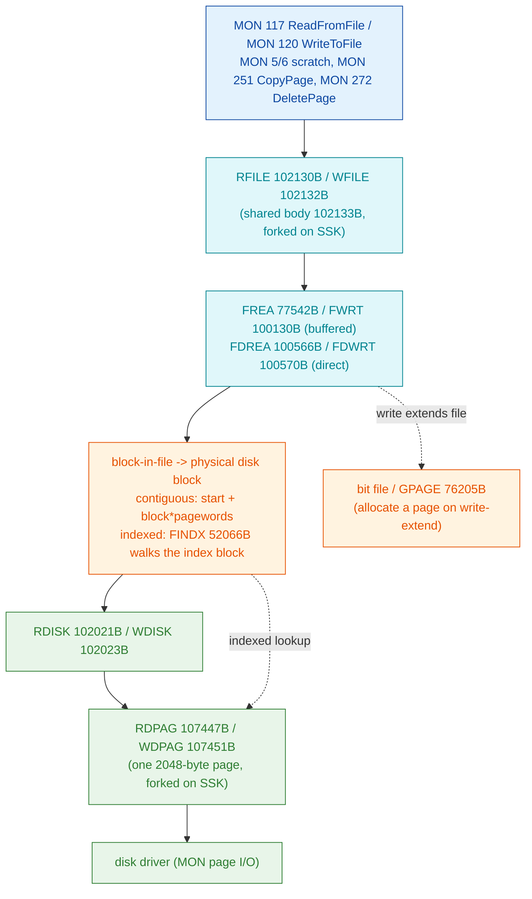

# File I/O logic (Phase 6)

How `006-S3FS` reads, writes, appends to and deletes files: the flow from an
open-file handle through the object entry's page list to the disk-page
primitives and the bitmap. Grounded in the carved SINTRAN L bytes.

**Evidence tags:** **VERIFIED** = traced in the `006-S3FS` bytes; **INFERRED** =
deduced from a helper pointer / carved cross-check; **OPEN** = unsettled.
Disassembly:
[`../../../tools/sintran-segment-carver/versions/L-VSX-500/re/segments-ref/006-S3FS/006-S3FS.asm`](../../../tools/sintran-segment-carver/versions/L-VSX-500/re/segments-ref/006-S3FS/006-S3FS.asm).
Companion: [`s3fs-code-map.md`](s3fs-code-map.md), [`allocation.md`](allocation.md).

---

## 1. The layered I/O stack (VERIFIED addresses)



---

## 2. `RFILE` / `WFILE` share one body forked on SSK (VERIFIED)

`RFILE` and `WFILE` are two prologues that set the read/write flag then fall into
a common body at 102133B:

```
RFILE 102130  BSET ZRO SSK   ; SSK = 0  (read)
      102131  JMP 2 -> 102133
WFILE 102132  BSET ONE SSK   ; SSK = 1  (write)
      102133  STD I 156      ; save return; SAB 17 -> 17-word frame
```

The body reads read-vs-write back later with `BSKP ONE SSK` (e.g. 102152B,
102202B, 102243B, 102321B) to pick the read arm vs the write arm. This is the
same idiom used by `RPAGE`/`WPAGE`, `RDISK`/`WDISK`, `RDPAG`/`WDPAG`. (VERIFIED.)

The body's dispatch pool (102503-102507B) holds the addresses of the four I/O
cores it calls into:

```
102504  100570   ; = FDWRT   (direct write)
102505  100130   ; = FWRT    (buffered write)
102506  100566   ; = FDREA   (direct read)
102507  077542   ; = FREA    (buffered read)
```

So `RFILE`/`WFILE` select **FREA/FWRT** (go through the file byte-buffer) or
**FDREA/FDWRT** (transfer straight to the caller buffer) depending on the request
and the SSK read/write flag. (VERIFIED: the four pool addresses and the SSK fork;
INFERRED: the exact buffered-vs-direct decision predicate.)

MON-level entries: [`117B-ReadFromFile`](../../../tools/sintran-segment-carver/versions/L-VSX-500/re/mon-analysis/117B-ReadFromFile/README.md),
[`120B-WriteToFile`](../../../tools/sintran-segment-carver/versions/L-VSX-500/re/mon-analysis/120B-WriteToFile/README.md).

### Error handling (VERIFIED)

The body validates the open handle before any transfer: it checks the open-file
descriptor's status bits and emits standard error codes - 125₈ / 126₈ (file not
opened for read / write), 132₈, 133₈ (access) - via `SAA nnn; JMP` at 102163-
102207B. These match the RFILE/WFILE MON error tables.

---

## 3. Block/page addressing - block-in-file to physical disk block (VERIFIED scale)

The body converts a file-relative **block number** to a physical disk address.
Core arithmetic in the shared body (102254-102305B):

```
102254  LDA ,B 13          ; A = block-in-file
102255  MPY ,X 14          ; * (,X 14 = words-per-page / device block size)
102256  RADD CLD SA DD      ; -> double word
102260  SAD ZIN SHR 12      ; scale (page<->word: shift by 12₈ = 10₁₀)
102262  LDD ,X 25          ; + file start block pointer (object entry file ptr)
102263  RADD ST DD
102264  RADD ADC CLD SA DA  ; add-with-carry -> physical block (double)
```

The **page<->word scale is ×1024** everywhere: `SHA ZIN 12` (shift left 12₈ =
10₁₀ = ×1024) turns a page number into a word offset, and `SAD ZIN SHR 12` /
`SHR 12` does the inverse. A page is 1024 words = 2048 bytes. This is the same
constant confirmed in the disk-page primitive `RDPAG` (107536B, 107620B).
(VERIFIED.)

`,X 25` in the open-file / object descriptor is the file's **start block pointer**
(the object-entry file pointer: contiguous-start for contiguous files, or the
index-block address for indexed files). `,X 14` is the device's words-per-page.

---

## 4. Indexed vs contiguous page lookup (VERIFIED fork, INFERRED index walk)

The body forks on the file's **type/flag** field early (102250B):

```
102250  LDA ,X 5           ; A = file flags/type
102251  SAT 10             ; T = 10₈ (the CONTIGUOUS marker)
102252  SKP IF DA EQL ST   ; if contiguous...
102253  JMP 33 -> 102306   ; else take the other arm
102254  ...                ; contiguous: start + block*pagewords (see §3)
```

- **Contiguous file:** physical block = `file_start + block_in_file` (the direct
  multiply-and-add of §3). No index block. (VERIFIED.)
- **Indexed file:** the block-in-file must be translated through the file's
  **index block**. `FINDX` 52066B walks an index block (read by `RINDX` 51453B /
  `GP5IX` 51451B) to map a logical page to its allocated disk block; a hole
  (unwritten page) yields NO SUCH PAGE. The `RFILE`/`WFILE` body reaches this via
  its pool (the alternate arm at 102306B and the index helpers). (VERIFIED that
  the fork exists and that `RINDX`/`FINDX` are the index primitives; the exact
  `JPL` into `FINDX` from the body is INFERRED - `FINDX`'s body was not traced
  here.)

This matches the object-entry file-type flags (`I` = indexed, `C` = contiguous;
README §4.2) and the doc's contiguous-vs-indexed distinction (ND-60.128.5
line 2151-2158).

---

## 5. The four MON-level flows

### Read - MON 117 `RFILE` (VERIFIED)

Open handle -> `RFILE` (SSK=0) -> validate access -> block->physical (§3/§4) ->
`FREA`/`FDREA` -> `RDISK`/`RDPAG` -> disk. Reads start on a **block boundary**
(the byte count and start-byte are set via the open-file's block-size fields).

### Write - MON 120 `WFILE` (VERIFIED)

Same path, SSK=1, into `FWRT`/`FDWRT` -> `WDISK`/`WDPAG`. When a write extends the
file past its current last page, the write path must **allocate** a new page:
for indexed files this calls `GPAGE` (76205B) to claim a bitmap page and records
it in the index block (`WINDX` 52501B); for contiguous files the space was pre-
reserved at create/expand time (`CRALF`/`EXPFI`). (VERIFIED: `WFILE` write arm and
the extend check at 102437-102460B, which compares current byte position against
the file's allocated size using `SUB ,X 22` / `SUB ,X 21` before deciding to
grow; INFERRED: the exact `GPAGE`/`WINDX` call sequence on extend - routed through
the file-core pool.)

### Append

Append is **not a separate primitive** - it is `WFILE` with the write position
set to the current end of file. The open-file descriptor carries the current
byte/max-byte position (`,X 17`/`,X 21`/`,X 22` in the descriptor); the byte-
position setters (`SETPO` 72465B, `SBYTE` 72622B, `SMAXB` 72620B) move it. So
"append" = position at max-byte, then `WFILE`. (VERIFIED that the descriptor
carries the position words used by the extend check; INFERRED that append reuses
`WFILE` with no distinct opcode.)

### Delete - MON 54 `MDLFI` (VERIFIED dispatcher)

`MDLFI` 106063B shares **one body** at 106065B with rename/set-temp/set-perm,
forked on (SSM,SSK):

```
STEFI 106052  BSET ONE SSM / BSET ONE SSK   ; set temporary file
SPEFI 106055  BSET ONE SSM / BSET ZRO SSK   ; set permanent file
MRNFI 106060  BSET ZRO SSM / BSET ONE SSK   ; rename file
MDLFI 106063  BSET ZRO SSM / BSET ZRO SSK   ; delete file
```

The body (frame `SAB 125`) reads the two flags back (`BSKP ONE SSM` at 106072B,
`BSKP ONE SSK` at 106074B) to pick the arm. The delete arm releases the file's
pages (through `DLPAG`/`DFPAG` -> `RLPAG` bitmap clear), deletes the index blocks
for indexed files, then calls `DLOBJ` (64146B) to clear the object entry.
(VERIFIED: the four entries, flag fork, frame; INFERRED: the exact page-release
and object-delete call order inside the arm.) MON-level:
[`54B-DeleteFile`](../../../tools/sintran-segment-carver/versions/L-VSX-500/re/mon-analysis/54B-DeleteFile/README.md),
[`232B-RenameFile`](../../../tools/sintran-segment-carver/versions/L-VSX-500/re/mon-analysis/232B-RenameFile/README.md).

Page-range delete on an open file is `DELPG` 110472B (MON 272 DeletePage): it
deletes the pages between two page numbers and frees their bits - see
[`272B-DeletePage`](../../../tools/sintran-segment-carver/versions/L-VSX-500/re/mon-analysis/272B-DeletePage/README.md).

---

## 6. The disk-page primitives - `RDPAG` / `WDPAG` (VERIFIED)

The bottom of the stack. `RDPAG` 107447B / `WDPAG` 107451B share a body at
107452B forked on SSK (read/write). It transfers exactly **one page** (2048
bytes):

```
RDPAG 107447  BSET ZRO SSK          ; read
WDPAG 107451  BSET ONE SSK          ; write
      107452  STD I 47 ; SAB 22
      107460  BSKP ONE SSK          ; fork: SAA 61 (write) / SAA 60 (read) function code
...
107536  SHA ZIN 12                  ; page number * 1024 -> word offset  (VERIFIED scale)
...
107620  SHA ZIN 12                  ; same scale on the address build
107623  BSKP ZRO SSC                ; check completion / carry
```

It validates the page against the directory's size and issues the driver
transfer. `SAA 60`/`SAA 61` at 107462-107464B are the read/write device function
codes. (VERIFIED.) `RDISK`/`WDISK` (102021B/102023B) sit one level up and iterate
`RDPAG`/`WDPAG` across a multi-page request, walking the descriptor list
(102031-102057B loop with `AAX 2`).

`RPAGE`/`WPAGE` (101707B/101711B) are the same idea specialised for **bit-file**
pages (the allocator reads/writes the bitmap through them).

`COPAG` 110050B (MON 251 CopyPage) copies pages between two open files by chaining
reads and writes - see
[`251B-CopyPage`](../../../tools/sintran-segment-carver/versions/L-VSX-500/re/mon-analysis/251B-CopyPage/README.md).

---

## 7. Summary

| Flow | Entry | Path | Status |
|------|-------|------|--------|
| Read | `RFILE` 102130B (MON 117) | -> FREA/FDREA -> RDISK/RDPAG -> disk | VERIFIED spine |
| Write | `WFILE` 102132B (MON 120) | -> FWRT/FDWRT -> WDISK/WDPAG; extend -> `GPAGE`+`WINDX` | VERIFIED spine; extend INFERRED |
| Append | `WFILE` at max-byte | no distinct opcode | INFERRED |
| Delete file | `MDLFI` 106063B (MON 54) | dispatcher 106065B -> release pages -> `DLOBJ` | VERIFIED dispatcher; arm INFERRED |
| Delete page range | `DELPG` 110472B (MON 272) | free bits between two pages | VERIFIED (carved worker) |
| Block->disk | shared body 102254B | contiguous multiply / indexed `FINDX` walk | VERIFIED fork; index walk INFERRED |
| Page/word scale | `SHA ZIN 12` = ×1024 | page = 1024 words = 2048 bytes | VERIFIED |
| Bottom transfer | `RDPAG`/`WDPAG` 107447B/107451B | one 2048-byte page, SSK-forked | VERIFIED |

**OPEN items:** the buffered-vs-direct predicate in `RFILE`; the exact `GPAGE`/
`WINDX` sequence on a write that extends an indexed file; the internals of
`FINDX`'s index-block walk; the delete arm's page-release order. All routed to a
deeper per-routine carve (golden-path style).

---

**Last updated:** Phase 6. Evidence base: carved `006-S3FS` SINTRAN L bytes,
already-carved MON workers, ND-60.128.5 docs.
