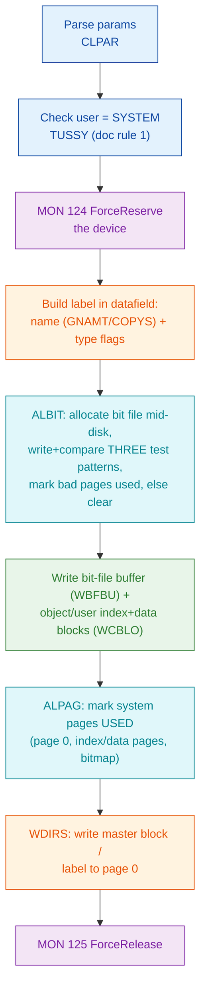
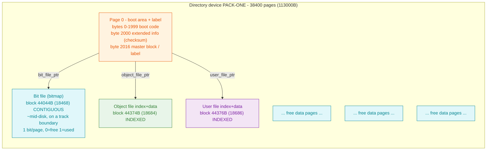

# CRDIR - How SINTRAN III CREATE-DIRECTORY lays down a fresh directory device

**Scope:** the on-disk "boot sector" / directory-label creation (Phase 7 of the
[Filesystem RE plan](README.md)). This walks, in order, everything
`@CREATE-DIRECTORY` writes onto a fresh directory device: the raw boot area vs the
structured label, the directory name + flags, the allocation and placement of the
bit file (bitmap) / object file / user file, the three-pattern bad-page test and
relocation, the reserved blocks and initial bitmap state, and the master-block
checksum.

**Rule of evidence** (same as the foundation doc):

- **VERIFIED** - proven from carved SINTRAN L `006-S3FS` `CRDIR`/`ALBIT` bytes,
  from real disk `SMD0.IMG` bytes, or from official ND documentation.
- **INFERRED** - deduced from the NDFS C oracle (`image_creator.c`) or docs, not
  yet byte-proven in `CRDIR`.
- **OPEN** - not resolvable statically; needs a live create-directory trace.

Octal is the primary radix for on-disk addresses and code addresses; multi-byte
on-disk values are **big-endian**.

---

## 0. Sources used here

| Source | Role | Location |
|--------|------|----------|
| `006-S3FS` `CRDIR` = **136741B** (extent 136741B..137477B) + `ALBIT` = **137500B** (137500B..137730B) | carved SINTRAN L bytes - **primary ground truth for the code** | `../../tools/sintran-segment-carver/versions/L-VSX-500/segments/006-S3FS.bin`, symbols in `.../re/segments-ref/006-S3FS/006-S3FS.symbols.txt` |
| `SMD0.IMG` volume `PACK-ONE` | real freshly-structured directory device - ground truth for the **produced layout** | `~/repos/nd100x/SMD0.IMG`, page 0 master block at byte 2016 |
| `image_creator.c` (`ndfs_create_image`) | independent **behavioural oracle** - builds a valid fresh image | `~/repos/norskdata-ndfs/ndfs-c/src/image_creator.c` |
| `master_block.c` (`ndfs_mb_write`, `ndfs_mb_write_extended`) | oracle for label field offsets + checksum | `~/repos/norskdata-ndfs/ndfs-c/src/master_block.c` |
| ND-60.128.5 `@CREATE-DIRECTORY` (p.63) + ND-60.050.06 Users Guide | official behaviour | `../../Reference-Manuals/ND-60.128.5 EN SINTRAN III Reference Manual.md` line 2071; `../../Reference-Manuals/ND-60.050.06 SINTRAN III Users Guide.md` line 5119 |

### The `CRDIR` decode

`CRDIR` is a JPL-dispatch routine: its subroutine calls go **P-relative indirect**
through an in-body pointer table interleaved with the code (this is exactly
OPEN-Q5 from the foundation doc). Decode recipe (VERIFIED to resolve to real
FILSYS symbols):

```
python3 -c "d=bytearray(open('006-S3FS.bin','rb').read());d[0::2],d[1::2]=d[1::2],d[0::2];open('/tmp/fs.le','wb').write(d)"
nd100-dis -a -o -b 11264 /tmp/fs.le | awk '$1>="136741"&&$1<="137731"'
```

Each `JPL I nn` / `JMP I nn` reads the pointer word at `(P+nn)` and jumps to its
contents. Resolving every pointer word in `CRDIR` (136741B..137477B) and `ALBIT`
(137500B..137730B) against `FILSYS-SYMBOLS` yields the call graph in the tables
below. **Callees that land below the segment load base 26000B** (`003752`,
`010500`, `010506`, `010421`, `001224`, `003776`) are **resident** SINTRAN
routines out of the `006-S3FS` window - noted as **OPEN** for exact naming;
`137454`/`137457`/`137466`/`137232`/`137116` are **local** error/return handlers
inside `CRDIR` (each does `STA ,B 2` to store a status code, then falls into the
release/return tail).

---

## 1. Raw boot area vs the structured label

**VERIFIED** (real disk `SMD0.IMG`, page 0):

Page 0 is one 1KW page = 2048 bytes. The **structured directory label lives at the
top of page 0**; everything before it is the raw boot area:

| Byte range (page 0) | Word (octal) | Contents |
|---------------------|--------------|----------|
| 0 .. 1999 | 0B .. 1747B | Raw boot code / `FLOMON`/`BPUN` bootstrap (or zero on a pure segment/data disk). On `PACK-ONE` the boot format is "None". |
| 2000 .. 2015 | 1750B | **Extended-info block** (16 bytes): checksum, 3 reserved words, flag word, last-system-number, pages-available. |
| 2016 .. 2047 | 1760B | **Master block / directory label** (32 bytes): directory name + 3 block pointers + unreserved-pages. |

So the label does **not** sit at the front of the device - it is written into the
tail of the boot page, leaving the low ~1KW for the boot loader. This matches the
Users Guide: *"the directory name is written on the first page of the device"*
(ND-60.050.06 line 5119).

`CRDIR` builds the label in an in-core directory datafield and writes the whole
page out at the end via **`WDIRS`** (write directory to disk, 40221B) - see §7.
The label field writes are done by the master-block accessors `GNAMT`/`PNAMT`
(name), `GDIRT`/`PDIRT`/`PDDRT` (datafield words), and `GDIRA` (get the datafield
base) - all called from `CRDIR` (VERIFIED, call graph §7).

---

## 2. Directory name, status bits and pointers in the master block

**VERIFIED** master-block layout (real `SMD0.IMG` bytes, offsets relative to byte
2016; corroborated by `master_block.c ndfs_mb_write`):

```
000007e0: 5041 434b 2d4f 4e45 2700 0000 0000 0000   "PACK-ONE'" name (2016)
000007f0: 4000 48fc 4000 48fe 0000 4824 0000 2ca4   3 block ptrs + unreserved
```

| Rel. off | Field | Real bytes | Decoded |
|----------|-------|-----------|---------|
| 0x00 | Directory name (16 bytes, `0x27` `'`-terminated) | `50 41 43 4B 2D 4F 4E 45 27 ..` | `PACK-ONE` |
| 0x10 | `object_file_ptr` | `40 00 48 FC` | type **1 INDEXED**, block **44374B** (18684) |
| 0x14 | `user_file_ptr` | `40 00 48 FE` | type **1 INDEXED**, block **44376B** (18686) |
| 0x18 | `bit_file_ptr` | `00 00 48 24` | type **0 CONTIGUOUS**, block **44044B** (18468) |
| 0x1C | `unreserved_pages` | `00 00 2C A4` | **26244B** (11428) |

- **Name**: `CRDIR` gets it via `GNAMT` (50223B) and copies it into the datafield
  with `COPYS` (copy string, 30104B) - both VERIFIED in the call graph. The name
  is upper-cased and `0x27`-terminated. Max 16 chars incl. hyphen (doc).
- **Status / special flags**: the *pointer type* is the flag that matters here.
  Each pointer is a 4-byte big-endian word whose **top 2 bits = type**
  (0 contiguous, 1 indexed, 2 sub-indexed, 3 reserved) and **bottom 30 bits =
  block ID** (`block_pointer.h`, VERIFIED). CRDIR always writes the **bit file
  CONTIGUOUS** (type 0) and the **object/user files INDEXED** (type 1) - VERIFIED
  from the real disk bytes and matched by the oracle (`image_creator.c` lines
  161-166).
- The `has_flomon` / boot-format state is a property of the raw boot area (an `!`
  bootstrap marker at the front of page 0), not a bit in the master block
  (`master_block.c detect_flomon`). **INFERRED** that `CRDIR` leaves the boot area
  as written by the loader; not separately proven from `CRDIR` bytes (**OPEN**).

---

## 3. Bit file, object file, user file - allocation, placement, pointers

### 3.1 Placement (VERIFIED from the real disk + doc)

- **Bit file** at block **44044B (18468)**, `18468 / 38400 = 0.481` -> *"in the
  middle of the directory ... starting from the beginning of a track"*
  (ND-60.128.5 line 2071; ND-60.050.06 line 5119). VERIFIED.
- **Object file** at **44374B (18684)** and **user file** at **44376B (18686)** -
  two blocks apart, placed together just past mid-disk (VERIFIED real disk).

Placing the bit file mid-disk is the reason a default contiguous file can be at
most half the disk (doc). The user may override the bit-file address with the last
`@CREATE-DIRECTORY` parameter (doc).

> **UPDATE - the bit-file formula is now VERIFIED from bytes.** `ALBIT`
> (137526B-137532B) computes `bit_file = 9 * floor(floor(pages/2)/9)` - i.e.
> `floor(pages/2)` **rounded down to a multiple of 9 pages** - which is byte-exact:
> `PACK-ONE` 36945 -> 18468 (NDFS `pages/2` = 18472, off by 4). The layout branch
> is keyed on *whether the last `@CREATE-DIRECTORY` parameter (a bit address) is
> supplied*, **not** on device type. The **object/user default-path offset**
> (bit+216 on the SMD) still does not fit any simple rule and stays **OPEN**. Full
> derivation, byte evidence, the all-image data table, and the NDFS "replace
> `pages/2` with THIS" recommendation are in
> [`create-directory-placement.md`](create-directory-placement.md).
>
> **INFERRED (oracle, superseded above for the bit file):** `image_creator.c`
> `build_custom_spec` uses `bit_file_block = pages/2`, then places the object/user
> index blocks *immediately after* the bitmap span
> (`object = bf + bitmap_pages`, `user = object + 2`). The NDFS built-in
> `spec_smd_75mb` hardcodes 18684/18686/18472 to approximate this real disk.

### 3.2 What `CRDIR` writes for each structure

**VERIFIED** call graph (the three structures, in `CRDIR` body order):

| Structure | `CRDIR` actions (resolved callees) |
|-----------|-------------------------------------|
| Bit file | `ALBIT` (137500B) is called at **137145B** - allocates + tests + builds the bitmap page(s) (§4). `ALPAG` (50627B, allocate/mark-used page) at 137324B; `WBFBU` (write bit-file buffer, 50565B) at 137167B/137354B. |
| Object / user files | index+data blocks written via `GDEVB` (get device buffer, 34557B), `RCBLO`/`WCBLO` (read/write core block, 35766B/36357B), `SETBL` (set block, 30164B), `CL1DB` (clear one disk buffer, 35240B). `PDDRT`/`GDDRT` (put/get directory datafield, 50127B/50121B) store the pointers into the datafield. |
| Master block | pointers assembled in the datafield, then `WDIRS` (40221B) at 137403B writes page 0 (§7). |

**INFERRED (oracle) - the index-block shape** the object/user pointers reference:
each INDEXED file is a one-page **index block** whose first 4-byte pointer points
to the file's first **data page** (`image_creator.c` lines 182-208):

- user file index block -> user data page = `user_file_block + 1`; that data page
  holds the first **user entry, "SYSTEM"** (`ndfs_ue_init`, `user_index = 0`,
  `pages_reserved = pages/2`).
- object file index block -> object data page = `object_file_block + 1`; the
  object data page is all zeros (no files yet).

Whether `CRDIR` seeds a `SYSTEM` user entry into the fresh user file is **not**
confirmable from the `CRDIR` bytes alone (the user-write worker `WUSER` 53410B is
not called directly inside the `CRDIR` window) - marked **OPEN**. The doc only
guarantees the *label* is written; the initial SYSTEM account is **INFERRED**
(oracle).

---

## 4. The bad-page test (three write/compare patterns) + relocation

**VERIFIED (doc)** - ND-60.128.5 line 2071:

> *"The bit file pages are tested by performing write and compare with three
> standard test patterns before being cleared. If there is a bad page in the bit
> file area the file system automatically locates the bit file on an adjacent
> track."*

and for the rest of the disk (line 2073): on non-ECC / unformatted-for-sparing
disks *"every page is tested by performing a read and compare from the disk. Any
page in error is marked as used in the bit map."* On ECC disks formatted with
spare-track re-allocation (TYPE C bit set) the whole-disk test is skipped.

**VERIFIED (`ALBIT` bytes, 137500B..137730B)** - the three-pattern loop is real:

- `ALBIT` computes the bit-file page span from the disk size via `GSIZE` (37101B,
  called at 137524B/137535B) and the bits/word split (`MPY 20` = octal 20 = **16
  bits per bitmap word**, VERIFIED opcode at 137710B; `RDIV` for the word/bit
  index).
- **Outer loop** over the bit-file pages: counter at `B+7`, bound `B+21`
  (137611B `LDA ,B 7` / 137612B `LDT ,B 21` / 137613B `SKP IF DT GRE SA`).
- **Inner loop = exactly three iterations** (137622B..137650B): counter `B+14`,
  compared against the literal **3** (`SAT 3` at 137624B, `SKP IF DT GRE SA`,
  i = 0,1,2). Per iteration it: loads pattern[i] from an in-body pattern table
  (`LDA I ,X 66` at 137636B), fills the page buffer with it via `SETBL`
  (30164B, 137640B), and writes it to the disk page via `WCBLO`
  (write core block, 36357B, 137643B). The read-back/compare section follows at
  137660B..137717B (`BSKP ONE` bit tests at 137664B), and on mismatch the page's
  bit is computed and set used.

This is a byte-for-byte confirmation of the doc's "write and compare with three
standard test patterns." The **three literal pattern values** are loaded from the
in-body table but were not extracted statically - **OPEN**.

**Relocation to an adjacent track** on a bad bit-file page (doc): `CRDIR` prints a
diagnostic (`OUTRC` 40730B + `OCTAL` 40336B at 137302B..137315B - "output value in
octal", the reported bad-page address) and re-runs allocation. The exact
"advance the bit-file base to the next track and retry" arithmetic is **INFERRED**
(doc) and not pinned in the carved bytes - **OPEN** (needs a live trace of a disk
with an injected bad page).

---

## 5. Reserved blocks (0-6) and initial bitmap state

**VERIFIED (oracle + code):**

- The freshly built bitmap marks these pages **used** (`image_creator.c` lines
  214-246): page **0** (master block), the **user file index block + its data
  page**, the **object file index block + its data page**, and every page of the
  **bitmap itself**. Everything else starts **free** (0).
- One **bit per page, 0 = free / 1 = used** (`bit_file.h`). VERIFIED. Cross-check:
  `ndtool -i SMD0.IMG` -> 38400 total / 14277 used / 24123 free.

**INFERRED (NDFS):** blocks **0-6 are reserved**; the allocator never hands out a
block below **7** (`NDFS_FIRST_ALLOC_BLOCK = 7`, enforced in `bit_file.c` lines
116/158 - it *starts scanning at 7* and *rejects* `start_block < 7`). Note this is
enforced by the *allocator*, not by pre-marking 1-6 used in the fresh bitmap
(`image_creator.c` only marks page 0). Whether real SINTRAN `CRDIR` reserves
exactly 7 blocks, and whether it pre-marks 1-6, is **OPEN** (the doc does not
state the reserved count; `ALPAG` at 137324B marks system pages but the exact set
was not traced).

---

## 6. Master-block checksum

**VERIFIED (`master_block.c ndfs_mb_write_extended`, corroborated by `SMD0.IMG`):**
the checksum lives in the **extended-info block** at byte 2000 (word 1750B), not in
the 32-byte label. Algorithm:

```
checksum = (pages_lo XOR pages_hi XOR flag_word
            XOR reserved1 XOR reserved2 XOR reserved3)
           + last_system_number      (16-bit wrap)
```

Real `SMD0.IMG` extended info (`10b7 0000 0000 0000 8000 0066 0000 9051`):
`pages_available = 0x9051 = 36945` (`pages_lo=0x9051`, `pages_hi=0`),
`flag_word=0x8000`, `reserved1..3=0`, `last_system_number=0x66=102`:
`(0x9051 ^ 0 ^ 0x8000 ^ 0 ^ 0 ^ 0) + 0x66 = 0x1051 + 0x66 = 0x10B7` -> matches the
stored `10B7`. VERIFIED.

**INFERRED / OPEN:** the checksum + extended-info block is a property of *disks big
enough to carry it* (`image_creator.c`: written when `pages > 1000`, i.e.
`ext_valid`; floppies omit it). The exact `CRDIR` instruction that computes and
stores this checksum was **not** isolated in the carved window (the extended-info
write is likely folded into the datafield-to-disk path via `WDIRS`) - **OPEN**.

---

## 7. The confirmed create sequence

**VERIFIED** ordering from the `CRDIR` call graph (P-relative-indirect callees
resolved to FILSYS symbols; `->` = the resolved routine):

| `CRDIR` addr | Call | Meaning |
|--------------|------|---------|
| 136745B | `-> 003752` (resident) | entry / save-context helper (**OPEN** name) |
| 136752B | `-> CLPAR` (44777B) | parse/clear the create parameters |
| 136754B | `-> COLDE` (132072B) | (cold-entry helper) |
| 136761B | `-> GNAMT` (50223B) | fetch the **directory name** |
| 136772B | `-> TUSSY` (53047B) | **test user is SYSTEM** (permission - doc rule 1) |
| 137000B | `-> GDIRI` (47402B) | get directory index |
| 137007B | `-> GDIRE` (131732B) | get directory entry |
| 137035B.. | `-> GDIRT` (50124B) | get directory datafield word (repeated) |
| **137046B** | **`MON 124`** | **ForceReserve** the directory/device |
| 137054B | `-> GSSIZ` | get system/segment size |
| 137056B | `-> GDIRA` (30225B) | get datafield base |
| 137065B | `-> COPYS` (30104B) | copy the **name** into the datafield |
| 137100B | `-> GDEVB` (34557B) | get device buffer |
| 137102B | `-> WTAPE` (36511B) | device write helper |
| 137105B | `-> CL1DB` (35240B) | clear a disk buffer |
| 137140B.. | `-> PDDRT` (50127B) | put directory datafield word (repeated) |
| **137145B** | **`-> ALBIT`** (137500B) | **allocate + bad-page-test + build the bit file** (§4) |
| 137153B | `-> GSIZE` (37101B) | get size |
| 137167B | `-> WBFBU` (50565B) | write bit-file buffer to disk |
| 137251B | `-> RCBLO` (35766B) | read core block |
| 137253B | `-> RELBU` (35476B) | release buffer |
| 137272B | `-> GDEVB` / 137273B `-> WCBLO` (36357B) | write core block (object/user structures) |
| 137302B.. | `-> OUTRC` (40730B) + `-> OCTAL` (40336B) | print bad-page/diagnostic value in octal |
| 137324B | `-> ALPAG` (50627B) | mark system pages **used** in the bitmap |
| 137354B | `-> WBFBU` | write bit-file buffer |
| 137366B | `-> GDIRA` / 137375B `-> WCBLO` | assemble + write directory blocks |
| 137401B | `-> CL1DB` | clear disk buffer |
| **137403B** | **`-> WDIRS`** (40221B) | **write the directory label (page 0) to disk** |
| **137417B** | **`MON 125`** | **ForceRelease** the directory/device |
| 137420B..137421B | `SAA -34` / `JMP I -> 003776` | store return status, return |

So the create order is: **permission-check + reserve -> build the label in the
datafield (name + flags) -> allocate & bad-page-test the bit file (three patterns)
-> write bit-file + object/user structures -> mark system pages used -> write the
label page (WDIRS) -> release.** VERIFIED.



### Resulting on-disk layout (VERIFIED from `SMD0.IMG`)



---

## 8. What stays INFERRED / OPEN (needs a live create-directory trace)

1. **Exact object/user placement math** - real disk uses 18684/18686 (past the
   mid-disk bit file at 18468); the NDFS `bf+bitmap_pages` formula does not
   reproduce this. **OPEN**.
2. **Whether `CRDIR` seeds the SYSTEM user entry** and zeroes the object data page
   - guaranteed by the oracle, not by the doc, and `WUSER` is not called in the
   `CRDIR` window. **OPEN**.
3. **The three literal test-pattern values** loaded by `ALBIT` (the count 3 is
   VERIFIED; the values are in an in-body table not extracted statically).
   **OPEN**.
4. **Bad-page relocation arithmetic** ("locate the bit file on an adjacent track")
   - doc-stated, diagnostic print path VERIFIED, but the retry math not pinned.
   **OPEN**.
5. **Reserved-block count / whether blocks 1-6 are pre-marked used** - NDFS uses 7;
   the doc is silent; `ALPAG` marks system pages but the exact set was not traced.
   **OPEN**.
6. **The extended-info checksum store instruction** inside `CRDIR` (algorithm and
   result VERIFIED; the storing opcode not isolated). **OPEN**.
7. **Resident callees** `003752`, `010500`, `010506`, `010421`, `001224`,
   `003776` are below the `006-S3FS` load base and were not named. **OPEN**.

A live `@CREATE-DIRECTORY` trace (breakpoint at 136741B, single-step the reserve
-> ALBIT -> WDIRS path, dump the target pages after each write) resolves all seven.

---

**Related:** [Filesystem foundation](README.md) (code map, Phase 7 exit criteria) -
[code-logic](code-logic/README.md) -
[boot-creation.md](boot-creation.md) (the separate **boot half**: the page-0
bootstrap per device class, which this doc deliberately leaves as-written).
