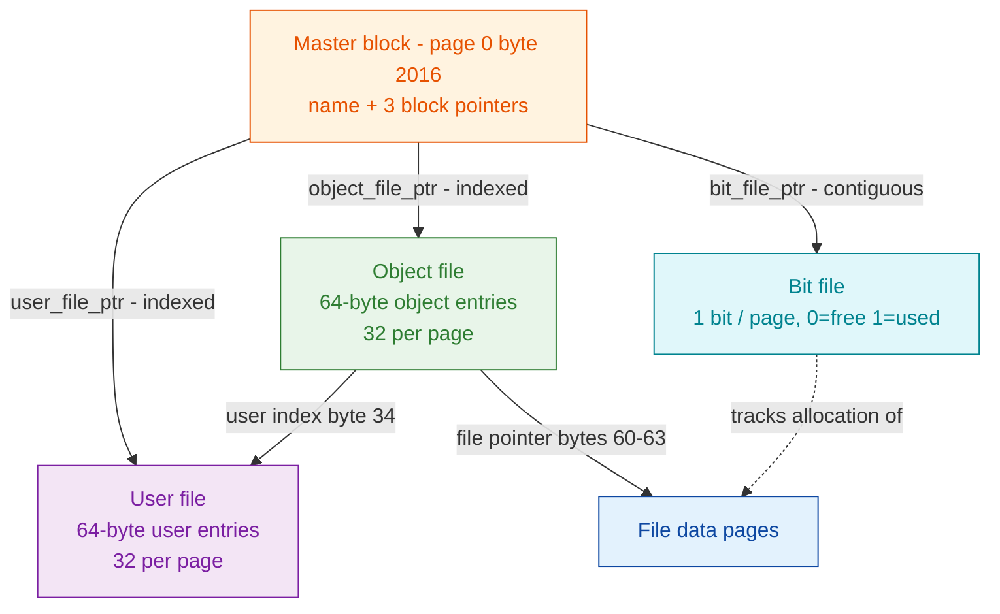

# SINTRAN III on-disk filesystem format (Phases 1-4)

Byte-exact layouts of the four on-disk structures that make up a SINTRAN III
*directory device*, each grounded in **real disk bytes** (`SMD0.IMG`,
volume PACK-ONE) and cross-checked against the NDFS C reader, the `ndtool`
inspector, and the carved `006-S3FS` filesystem code. See the
[Filesystem foundation](../README.md) for the full source map and phased plan.

**Evidence tags used throughout:** **VERIFIED** (real-disk bytes and/or the
producing code), **INFERRED** (NDFS/doc only), **OPEN** (unresolved, with the
source that would settle it). On-disk multi-byte values are **big-endian words**.

---

## The four structures

| # | Document | Structure | Size | Anchor |
|---|----------|-----------|------|--------|
| 1 | [directory-label.md](directory-label.md) | Master block / directory label | 32 B | page 0, byte 2016 |
| 1b | [extended-info-block.md](extended-info-block.md) | Extended-info block (checksum, flag word, system number, capacity) | 16 B | page 0, byte 2000 |
| 2 | [object-entry.md](object-entry.md) | Object (file) entry | 64 B | object file (indexed) |
| 3 | [user-entry.md](user-entry.md) | User (account) entry | 64 B | user file (indexed) |
| 4 | [page-bitmap.md](page-bitmap.md) | Page allocation bitmap (bit file) | 1 bit/page | bit file (contiguous) |

Page 0 also carries the raw boot code ahead of the master block:
[**boot-sector.md**](boot-sector.md) - the page-0 map and the three ND-100
boot-code formats (BPUN, FLOMON, raw binary bootstrap), with the real `SMD0.IMG`
boot sector decoded as evidence and the `PIOF`/`IOF` + `IOX`/`IOXT` detection
logic. **VERIFIED:** `SMD0.IMG` / PACK-ONE is a raw **SMD/ECC** bootstrap
(corrects the earlier "boot format None" reading).

---

## Block-pointer encoding (shared by all four)

Every 4-byte block pointer is a big-endian value: **top 2 bits = type**, **bottom
30 bits = block/page id**. Types: `0` contiguous, `1` indexed, `2` sub-indexed,
`3` reserved. Full derivation in
[directory-label.md 3.2](directory-label.md#32-block-pointer-encoding-the-2-bit-type--30-bit-page-id).
**VERIFIED.**

---

## Verification status (real disk PACK-ONE)

| Structure | Byte decode | Cross-reader (`ndtool`) | Producing code (`006-S3FS`) |
|-----------|-------------|-------------------------|-----------------------------|
| Master block | VERIFIED (2 disks) | `-i` volume/name match | `GMAIN`/`WDIRE`/`CRDIR` |
| Object entry | VERIFIED (3 entries) | `--stat` field-for-field | `ROBJE`/`COBJE`/`WOBJE` |
| User entry | VERIFIED (3 entries, all 10 users) | `-u` / `--friends` match | `RUSER`/`WUSER`/`GUSEN` |
| Page bitmap | VERIFIED (popcount = `ndtool` used/free) | `-i` 14277/24123 match | `GPAGE`/`ALPAG`/`RLPAG` |

**Real disk vs NDFS - one discrepancy:** on the SMD system disk the label points
the bit file at block **18468**, but the NDFS `image_creator` SMD template
hard-codes **18472**. The on-disk pointer is authoritative (the reader follows
it); only the NDFS *creator template* differs, because PACK-ONE was written by
genuine SINTRAN `CRDIR`. Details in
[directory-label.md 7](directory-label.md#7-where-the-real-disk-and-ndfs-disagree).

---

## Open questions carried forward

- **Master block:** `unreserved_pages` semantics vs the bitmap free count;
  relationship of the 32-byte label to the 24-word directory entry MON 244 returns.
- **Object entry:** extra header-byte flag bits (SEGFIL0 = `0x90`); byte 33;
  `next_version`/`prev_version` chaining.
- **User entry:** bytes 38-39 and 42-47 (byte 47 `mxobl`/`acobl`); password hashing.
- **Bitmap:** allocation search direction (upward vs highest-range) and the
  0-6 reservation in the carved `GPAGE`/`ALPAG` (OPEN-Q3).

See the [foundation README section 6](../README.md#6-open-questions---what-each-later-phase-needs)
for the full list. Allocation-code and CRDIR analysis (Phases 5-7) live under
[../code-logic/](../code-logic/README.md).

The extended-info block's checksum, flag word, system number and pages-available
are now **kernel-proven** (`WXDIR`/`CHDSI`) - see
[extended-info-block.md](extended-info-block.md) and the report validation in
[../NDFS-VALIDATION.md](../NDFS-VALIDATION.md).
</content>
