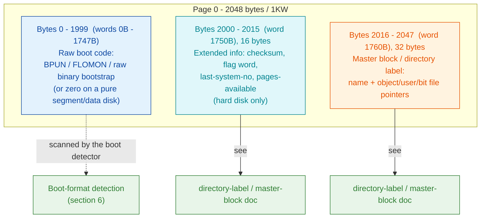
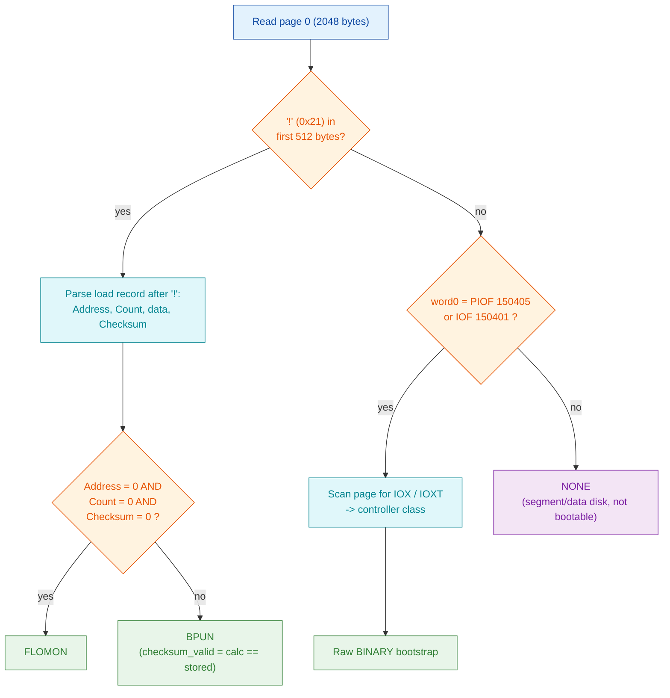

# Page-0 boot sector - the three ND-100 boot formats

**Scope:** the raw boot code that occupies the front of **page 0** of every
SINTRAN III directory device, ahead of the extended-info block and the master
block. This document maps page 0, defines the three boot-code formats
(**BPUN**, **FLOMON**, raw **binary** bootstrap), decodes the *real* boot sector
of `SMD0.IMG` as evidence, and gives the exact detection logic.

**Rule of evidence** (same as the [Filesystem foundation](../README.md)):
**VERIFIED** = confirmed from real disk bytes, the ND-100 opcode table, or the
carved SINTRAN L image; **INFERRED** = deduced from a secondary source;
**OPEN** = unresolved. All ND-100 values are **octal**; on-disk multi-byte
values are **big-endian** (the ND-100 is a big-endian machine).

---

## 1. Page-0 map

A page is **2048 bytes** (1KW). The boot code shares page 0 with two small
fixed-position structures at the tail; the master block and extended info have
their own docs, cross-linked below.



- Extended-info block (byte 2000 / word 1750B) and master block (byte 2016 /
  word 1760B): field-by-field layout in
  [`directory-label.md`](directory-label.md) and the
  [Filesystem foundation §4.1](../README.md).
- **VERIFIED** offsets: `NDFS_PAGE_SIZE = 2048`,
  `NDFS_EXTENDED_INFO_OFFSET = 2000`, `NDFS_MASTER_BLOCK_OFFSET = 2016`
  (`norskdata-ndfs/ndfs-c/include/ndfs/types.h`), and confirmed against the
  real `SMD0.IMG` bytes at 0x7D0 / 0x7E0.

**Correction to the "first 1024 bytes = boot sector" convention** (VERIFIED):
the boot *region* is not just the first 512 words. The real `SMD0.IMG`
bootstrap has live code (`IOX` instructions) as far as byte 0x3EA (word 765) and
beyond - the boot code runs right up to the extended-info block at word 1750B.
The usable boot area is therefore **words 0B - 1747B (bytes 0 - 1999)**, i.e.
1000 words, not 512. The "1024-byte boot sector" figure is a convenient
half-page approximation only.

---

## 2. ND-100 opcode signatures used by the detector

All four opcodes are **VERIFIED** against the carved instruction-semantics
reference
([`ND100-INSTRUCTION-SEMANTICS.md`](../../../tools/sintran-segment-carver/versions/L-VSX-500/re/instruction-semantics/ND100-INSTRUCTION-SEMANTICS.md),
§9.1 and §9.5) and the `nd100-as` / `nd100-dis` instruction tables.

| Mnemonic | Octal | 16-bit word | Effect | Role in boot detection |
|----------|-------|-------------|--------|------------------------|
| `IOF`  | 150401 | 0xD101 | `IONI = 0` - interrupts off | Legal boot-prologue opcode |
| `PIOF` | 150405 | 0xD105 | `IONI = 0; PONI = 0` - interrupts **and** paging off | Legal boot-prologue opcode |
| `IOX <dev>` | 164000 + dev | 0xE800 \| dev | `A = io_op(dev & 0x7FF, A)`; device address is the **literal** low 11 bits | Controller class from device window |
| `IOXT` | 150415 | 0xD10D | `A = io_op(T, A)`; device address taken from the **T register** at runtime | Controller = SCSI / NCR-5386 (indirect) |

A genuine ND-100 bootstrap **must** begin by disabling interrupts (and usually
paging) before it touches the controller, so the very first word of a raw boot
sector is always `PIOF` (150405) or `IOF` (150401). Nothing else can legally
start boot code - this is the whole binary-bootstrap signature.

---

## 3. Format 1 - BPUN (Bootable Punched Tape)

An ASCII preamble followed by a binary load record, delimited by `!` (0x21).
This is the ND absolute-binary boot container (`)BPUN` in MAC, `*BPUN` in NRL).

```
ASCII preamble  (bytes, terminated by CR = 0x0D):
    octal digits ... CR ... octal digits '!'
    B (start address) = octal value before the LAST CR
    C (boot address)  = octal value after the last CR, before '!'

'!'  delimiter                                    (0x21)

Binary load record (all multi-byte fields big-endian):
    Address   2 bytes   load address
    Count     2 bytes   word count
    Data      Count*2   program words
    Checksum  2 bytes   = sum of the Count data words (mod 2^16)
    Action    2 bytes   0 = execute at boot address; else stay in OPCOM
```

- **VERIFIED** parse layout against `norskdata-ndfs/ndfs-c/src/boot_loader.c`
  (`try_parse_bpun`): the checksum is a plain 16-bit running sum of the data
  words; `checksum_valid = (calc == stored)`.
- **OPEN:** no real BPUN (non-FLOMON) disk image was available in
  `~/repos/nd100x` to byte-confirm a populated load record. The layout is taken
  from the NDFS reader plus the ND floppy/streamer-controller manual note that
  the controller can "load BPUN-files of maximum 64 Kwords directly from the
  floppy by pressing LOAD"
  (`../../Devices/SCSI/ND-11.021.1 EN-Floppy and Streamer Controller 3106 3112.md`).

---

## 4. Format 2 - FLOMON (Floppy Monitor) - VERIFIED on a real floppy

FLOMON is a **BPUN with an empty load record**: immediately after `!` the
Address, Count **and** Checksum words are all zero. That three-zero record is
the "no program to load - hand control to the floppy monitor" convention.

**VERIFIED** from the real floppy `~/repos/nd100x/250305L07-XX-01D.IMG`
(volume `250305L07-XX-01D`, 616 pages). Page-0 head bytes:

```
00000000: 0030 002f 0032 000d 000a 0032 0021 0000   .0./.2.....2.!..
00000010: 0000 0000 0040 0003                        .....@..
```

Byte-by-byte decode:

| Bytes | Value | Meaning |
|-------|-------|---------|
| 0x00-0x0B | `'0' '/' '2' CR LF '2'` (each char right-justified in a 16-bit word) | ASCII preamble |
| 0x0C-0x0D | `00 21` | `!` delimiter (0x21) at byte 13 |
| 0x0E-0x0F | `00 00` | Address = 0 |
| 0x10-0x11 | `00 00` | Count = 0 |
| 0x12-0x13 | `00 00` | Checksum = 0 -> **FLOMON test passes** |
| 0x14 | `00` | following word-count byte = 0 (no inline data) |

The current NDFS reader classifies this image as **FLOMON** (confirmed by
running the freshly built `ndtool -i` - see §7). The FLOMON test in
`boot_loader.c` is exactly `address == 0 && count == 0 && file_checksum == 0`.

**Refinement to the "0/0 test" description** (VERIFIED): the detector requires
**three** zero words after `!` (Address, Count *and* Checksum), not just
Address/Count. A record with Address=0, Count=0 but a non-zero checksum is
treated as an ordinary (empty) BPUN, not FLOMON.

**OPEN:** the exact octal reading of the preamble `'0' '/' '2'` is unresolved -
`/` (0x2F) is not an octal digit. For FLOMON the preamble value is never used to
load (Address/Count are zero), so this does not affect boot behaviour; noted for
completeness only.

---

## 5. Format 3 - raw binary hard-disk bootstrap - VERIFIED on SMD0.IMG

No ASCII preamble, no `!` - just ND-100 machine code that the controller's
microcode loads into memory and jumps to. The signature is the first opcode
(`PIOF` / `IOF`, §2); the controller class comes from the first I/O instruction.

### 5.1 Real evidence: `~/repos/nd100x/SMD0.IMG` (volume `PACK-ONE`)

First 16 words of page 0 (big-endian, as stored on disk):

```
00000000: d105 d001 f10a d043 f100 d049 f13f a802   .......C...I.?..
00000010: 4813 d04a d048 580f 4e0c 0e0c b5fe 4809   H..J.HX.N.....H.
```

Disassembled (bytes byte-swapped to little-endian for `nd100-dis`, then decoded;
addresses and opcodes are octal):

```
000000  150405   PIOF                 ; word 0 = boot-prologue signature: interrupts + paging OFF
000001  150001   TRA STS
000002  170412   SAA 12
000003  150103   TRR PCR
...
000117  165544   IOX 1544             ; SMD controller: Read Status
000325  165545   IOX 1545             ; SMD controller: Load Control Word (start operation)
000744  165543   IOX 1543             ; SMD controller: Load Block Address
000754  165541   IOX 1541             ; SMD controller: Load Core Address
000760  165547   IOX 1547             ; SMD controller: Load Word Count
```

**Decode (VERIFIED):**
- **First opcode = `PIOF` (150405)** -> this is a genuine raw binary bootstrap.
- Every I/O instruction is a **literal `IOX`** in the octal device window
  **1540 - 1547** (registers 1541-1547 all appear). `nd100-dis` labels these
  "SMD1" - the second SMD register bank.
- Device window 1540-1547 (0x360-0x367) is the **SMD/ECC** controller base
  (`NDFS_SMD_ECC_BASES` = octal 1540,1550,540,550). No `IOXT` (150415) appears,
  so this is **not** a SCSI bootstrap.

**Conclusion (VERIFIED):** `SMD0.IMG` / `PACK-ONE` carries a **raw binary
bootstrap for an SMD/ECC disk controller** at device base **1540B**. The current
NDFS reader confirms it: boot format **Binary**, controller **SMD/ECC** (§7).

The same `PIOF` + SMD-`IOX` bootstrap is byte-identical in the sibling images
`SMD0-org.IMG` and `SMD0-L.IMG` (all three are `PACK-ONE`).

### 5.2 Controller windows (VERIFIED against `boot_loader.c`)

| Controller | `IOX` device window (octal) | Or `IOXT` |
|------------|-----------------------------|-----------|
| SMD / ECC | 1540-1547, 1550-1557, 540-547, 550-557 | - |
| Winchester | 500-507, 510-517 | - |
| Floppy | 1560-1567, 1570-1577 | - |
| SCSI / NCR-5386 | (device from T register) | `IOXT` 150415 present |

`SMD0.IMG`'s device 1544 falls in the first SMD/ECC window -> SMD/ECC.
**VERIFIED.**

---

## 6. Detection logic



- BPUN/FLOMON are tried first (any `!` in the first 512 bytes); only if none
  parses does the detector fall through to the `PIOF`/`IOF` opcode test.
- **VERIFIED** control flow from `boot_loader.c` `load_from_page0`,
  `try_parse_bpun`, `is_valid_binary`, `detect_controller_type`.

---

## 7. Cross-check: NDFS reference reader on the real images

Run of the **current** NDFS reader (`ndtool` rebuilt from `boot_loader.c` at
commit `1cde01a`, "detect hard-disk bootability via real ND-100 opcode"):

| Image | Volume | Page-0 head | Detected | Agrees with bytes? |
|-------|--------|-------------|----------|--------------------|
| `SMD0.IMG` | `PACK-ONE` | `D105 ...` = `PIOF` + SMD `IOX` | **Binary** (SMD/ECC) | yes - VERIFIED |
| `SMD0-org.IMG` | `PACK-ONE` | same | **Binary** | yes |
| `250305L07-XX-01D.IMG` | `250305L07-XX-01D` | preamble + `!` + 0/0/0 | **FLOMON** | yes - VERIFIED |
| `FLOPPY.IMG` | `211305B02-XX-01D` | bytes 0-2015 all `0x40` (spaces) | **None** | yes - space-filled, not bootable |

### 7.1 Correction to the existing "boot format None" claims

The [Filesystem foundation](../README.md) source map and
[`../create-directory.md`](../create-directory.md) both state that `PACK-ONE` /
`SMD0.IMG` has boot format **"None"**. That reading came from an **older
`ndtool` (built 2026-05-26 / 2026-06-13)** whose boot detector predates the
opcode-based logic. The stale detector used a "non-zero, non-uniform data"
heuristic that:

- **false-negatived** `SMD0.IMG` (real SMD bootstrap reported as *None*), and
- **false-positived** `FLOPPY.IMG` (space-filled `0x40` boot area reported as
  *Binary*).

With the current `boot_loader.c` opcode signature, both flip to the correct
answer: `SMD0.IMG` = **Binary/SMD-ECC** (it *does* carry a raw SMD bootstrap,
proven by the `PIOF` + `IOX 154x` disassembly in §5), and `FLOPPY.IMG` =
**None**. The "None" label for `PACK-ONE` in the foundation doc and
`create-directory.md` should be read as **Binary (SMD/ECC)**.

### 7.2 Stale wording in the NDFS format doc

`norskdata-ndfs/docs/NDFS-FORMAT.md` still describes the Binary format as
"Detected by checking for non-zero, non-uniform data in the first 1024 bytes."
That sentence describes the **old** heuristic; the shipping code
(`boot_loader.c`) now uses the `PIOF`/`IOF` opcode signature (§2). Noted as a
doc-vs-code drift in NDFS, not a fault in the format itself.

---

## 8. Status summary

| Claim | Status | Evidence |
|-------|--------|----------|
| Page-0 map (boot 0-1999, ext-info 2000, master block 2016) | **VERIFIED** | real `SMD0.IMG` bytes + NDFS `types.h` |
| Boot region is 1000 words, not 512 | **VERIFIED** | live `IOX` code past byte 1024 in `SMD0.IMG` |
| `PIOF`/`IOF`/`IOX`/`IOXT` opcode values | **VERIFIED** | carved instruction-semantics ref + `nd100-as` table |
| `SMD0.IMG` = raw SMD/ECC bootstrap | **VERIFIED** | disassembly (`PIOF` + `IOX 1541-1547`) + current `ndtool` |
| FLOMON = Address/Count/Checksum all zero after `!` | **VERIFIED** | real floppy `250305L07-XX-01D.IMG` + `boot_loader.c` |
| BPUN populated load-record layout | **INFERRED** | NDFS reader only; no non-FLOMON BPUN image available |
| Controller windows (SMD/Winchester/Floppy/SCSI) | **VERIFIED** (SMD path) / **INFERRED** (others) | SMD path proven on `SMD0.IMG`; other windows from `boot_loader.c` |
| Preamble octal reading `'0' '/' '2'` | **OPEN** | `/` is not an octal digit; unused for FLOMON |

---

## References

- Real images: `~/repos/nd100x/SMD0.IMG`, `SMD0-org.IMG`, `SMD0-L.IMG`,
  `250305L07-XX-01D.IMG`, `FLOPPY.IMG`.
- NDFS reader: `~/repos/norskdata-ndfs/ndfs-c/src/boot_loader.c`,
  `include/ndfs/types.h`, `docs/NDFS-FORMAT.md`.
- Opcode table:
  [`ND100-INSTRUCTION-SEMANTICS.md`](../../../tools/sintran-segment-carver/versions/L-VSX-500/re/instruction-semantics/ND100-INSTRUCTION-SEMANTICS.md).
- Disassembler: `~/repos/nd100-tools/nd100-dis` (little-endian; disk words are
  byte-swapped before decode).
- Related on-disk docs: [`directory-label.md`](directory-label.md),
  [`../README.md`](../README.md), [`../create-directory.md`](../create-directory.md).
- Boot-code *creation* (how the page-0 bootstrap is produced/written per device
  class, with the real SMD + floppy bytes and disassembly):
  [`../boot-creation.md`](../boot-creation.md).
</content>
</invoke>
