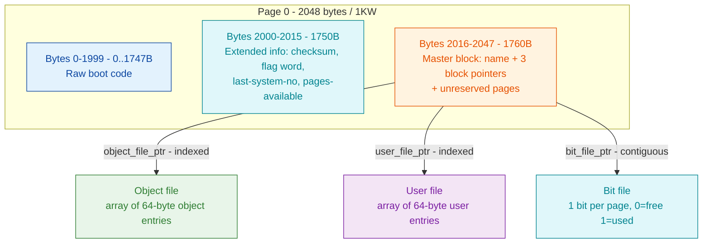

# Master block / directory label (Phase 1)

The **master block** (also called the directory *label*) is the structured record
that follows the raw boot code on page 0 of every SINTRAN III *directory device*
(a disk or disk partition). It names the volume and holds the three block
pointers that anchor the whole filesystem: the object file, the user file, and
the page bitmap (bit file). A 16-byte **extended-info** block sits just before it.

**Evidence rule:** every field is tagged **VERIFIED** (proven from real disk
bytes and/or the NDFS reader that round-trips those bytes), **INFERRED**
(NDFS/doc only, not independently byte-proven here), or **OPEN** (unresolved,
with the source that would settle it). On-disk multi-byte values are **big-endian
words** - this is a fact about the disk format itself, stated here so the hex
decodes are reproducible.

Sources: real disk `~/repos/nd100x/SMD0.IMG` (volume PACK-ONE) and
`~/repos/nd100x/250305L07-XX-01D.IMG`; NDFS C library
`~/repos/norskdata-ndfs/ndfs-c/` (`master_block.c`, `block_pointer.c`,
`types.h`); carved `006-S3FS` filesystem segment
(`GMAIN`/`WDIRE`/`GDIRA`, see the [foundation README](../README.md#5-006-s3fs-filesystem-code-map)).

---

## 1. On-disk location

Page 0 is 2048 bytes (1KW). It is laid out as:

| Byte range | Word (octal) | Region |
|------------|--------------|--------|
| 0 - 1999 | 0 - 1747B | Raw boot code (FLOMON / BPUN / raw-binary bootstrap) |
| **2000 - 2015** | **1750B** | **Extended-info block** (16 bytes) |
| **2016 - 2047** | **1760B** | **Master block / directory label** (32 bytes) |

Constants: `NDFS_EXTENDED_INFO_OFFSET = 2000`, `NDFS_MASTER_BLOCK_OFFSET = 2016`,
`NDFS_MASTER_BLOCK_SIZE = 32`, `NDFS_EXTENDED_INFO_SIZE = 16`
(`ndfs-c/include/ndfs/types.h`). **VERIFIED.**



---

## 2. Raw bytes from the real disk (`SMD0.IMG`, PACK-ONE)

`xxd -s 2000 -l 48 SMD0.IMG`:

```
000007d0: 10b7 0000 0000 0000 8000 0066 0000 9051   <- extended info (byte 2000)
000007e0: 5041 434b 2d4f 4e45 2700 0000 0000 0000   <- name "PACK-ONE'" (byte 2016)
000007f0: 4000 48fc 4000 48fe 0000 4824 0000 2ca4   <- 3 block ptrs + unreserved (byte 2032)
```

---

## 3. Master block field layout (offsets relative to byte 2016)

| Rel. off | Byte | Field | Size | Real bytes | Decoded | Verdict |
|----------|------|-------|------|------------|---------|---------|
| 0x00 | 2016 | Directory name | 16 | `50 41 43 4B 2D 4F 4E 45 27 00...` | `PACK-ONE` (terminated `0x27` `'`) | **VERIFIED** |
| 0x10 | 2032 | `object_file_ptr` | 4 | `40 00 48 FC` | type **01 INDEXED**, block **44374B** (18684) | **VERIFIED** |
| 0x14 | 2036 | `user_file_ptr` | 4 | `40 00 48 FE` | type **01 INDEXED**, block **44376B** (18686) | **VERIFIED** |
| 0x18 | 2040 | `bit_file_ptr` | 4 | `00 00 48 24` | type **00 CONTIGUOUS**, block **44044B** (18468) | **VERIFIED** |
| 0x1C | 2044 | `unreserved_pages` | 4 | `00 00 2C A4` | **26244B** (11428) | **VERIFIED** |

Decode logic: `ndfs_mb_parse()` reads the name at `off+0`, the three block
pointers at `off+0x10 / +0x14 / +0x18`, and the 32-bit unreserved-page count at
`off+0x1C` (`master_block.c` lines 54-62). Every offset above is exactly what
that reader consumes, and `ndtool -i SMD0.IMG` reports volume **PACK-ONE** -
matching the decoded name. **VERIFIED.**

### 3.1 Name field

16 bytes, ASCII, terminated by `0x27` (single quote `'`) when shorter than 16.
`50 41 43 4B 2D 4F 4E 45 27` = `P A C K - O N E '`. If the name fills all 16
bytes there is no terminator (see the floppy cross-check below, where the name is
exactly 16 chars). **VERIFIED.**

### 3.2 Block-pointer encoding (the 2-bit type + 30-bit page id)

A block pointer is a 4-byte big-endian value:

```
 bit 31 30 | 29 ................................ 0
   [ type ]  [        30-bit block / page id       ]
```

| Type (top 2 bits) | Meaning | `types.h` |
|-------------------|---------|-----------|
| 0 | **Contiguous** - id is the first page of a run | `NDFS_PTR_CONTIGUOUS` |
| 1 | **Indexed** - id is an index block listing data-page pointers | `NDFS_PTR_INDEXED` |
| 2 | **Sub-indexed** - id is a first-level index of index blocks | `NDFS_PTR_SUBINDEXED` |
| 3 | **Reserved** | `NDFS_PTR_RESERVED` |

Decode: `type = (value >> 30) & 3`, `block_id = value & 0x3FFFFFFF`
(`block_pointer.c` lines 12-18). Worked example - `object_file_ptr = 0x400048FC`:
`type = 0x400048FC >> 30 = 1` (INDEXED); `block_id = 0x400048FC & 0x3FFFFFFF =
0x48FC = 18684 = 44374B`. **VERIFIED.**

The object and user files are therefore **indexed** files (block id = an index
block); the bit file is **contiguous** (block id = first bitmap page). This is
confirmed by following the pointers on the real disk (see
[object-entry.md](object-entry.md) and [page-bitmap.md](page-bitmap.md)).

### 3.3 `unreserved_pages`

32-bit count of pages not permanently reserved to a specific structure. On
PACK-ONE = `0x2CA4 = 11428 = 26244B`. This is a bookkeeping figure written into
the label; it is **not** the free-page count (the bitmap gives that - 24123 free,
see [page-bitmap.md](page-bitmap.md)). NDFS reads it (`master_block.c` line 62)
and `image_creator.c` seeds it from the template but does not derive free space
from it. Exact SINTRAN semantics of this counter vs the bitmap: **OPEN** - resolve
against the `006-S3FS` `CRDIR`/`GMAIN` writer.

---

## 4. Extended-info block (offsets relative to byte 2000)

| Rel. off | Byte | Field | Size | Real bytes | Decoded | Verdict |
|----------|------|-------|------|------------|---------|---------|
| 0x00 | 2000 | `checksum` | 2 | `10 B7` | 0x10B7 | **VERIFIED** |
| 0x02 | 2002 | `reserved1` | 2 | `00 00` | 0 | **VERIFIED** |
| 0x04 | 2004 | `reserved2` | 2 | `00 00` | 0 | **VERIFIED** |
| 0x06 | 2006 | `reserved3` | 2 | `00 00` | 0 | **VERIFIED** |
| 0x08 | 2008 | `flag_word` | 2 | `80 00` | 0x8000 | **VERIFIED** |
| 0x0A | 2010 | `last_system_number` | 2 | `00 66` | 102 | **VERIFIED** |
| 0x0C | 2012 | `pages_available` | 4 | `00 00 90 51` | **110121B** (36945) | **VERIFIED** |

Reader: `ndfs_mb_parse()` (`master_block.c` lines 64-72). `pages_available`
36945 is the SMD 75 MB template's directory page count (`image_creator.c`
`spec_smd_75mb.ndfs_pages = 36945`). **VERIFIED.**

### 4.1 Checksum algorithm (VERIFIED from the kernel — NDFS formula CORRECTED)

The real algorithm is a plain **16-bit additive sum** of the seven extended-info
words *after* the checksum word:

```
checksum(w1750) = (w1751 + w1752 + w1753 + w1754 + w1755 + w1756 + w1757) mod 2^16
```

Proven from the SINTRAN kernel `006-S3FS`: the writer `WXDIR = 37702B` and the
enter-directory validator `CHDSI = 37763B` both run the identical `ADD ,X 0`
accumulation loop over the words. The NDFS reference's "XOR six words then add
`last_system_number`" (`master_block.c`) is **wrong** — it only reproduces PACK-ONE
by a carry/cancel coincidence: the single overlapping set bit (bit 15, shared by
`flag=0x8000` and `pages_lo=0x9051`) carries out past bit 15 under ADD exactly where
it cancels under XOR. Additive proof on PACK-ONE:
`0x8000 + 0x0066 + 0x9051 = 0x110B7 -> 0x10B7` = stored `checksum`. The kernel
writes and compares the full 16 bits, so NDFS's "low-byte-only valid" state is not
a kernel concept. Full derivation + the disassembly: [`extended-info-block.md`](extended-info-block.md)
and [`../NDFS-VALIDATION.md`](../NDFS-VALIDATION.md). **VERIFIED (kernel).**

### 4.2 FLOMON caveat (extended info not always valid)

`ndfs_mb_parse()` scans the first 256 bytes for a FLOMON `!` (`0x21`) followed by
two zero words; if found, `ext_valid = false` (`master_block.c` lines 16-38,
94-104). On such **floppy/FLOMON** disks the 16 bytes at 2000-2015 are boot-code
remnants, **not** a valid extended-info block. The 32-byte master block at 2016
is still valid. **VERIFIED** (see the floppy cross-check next).

---

## 5. Cross-check against a second real disk (`250305L07-XX-01D.IMG`)

`xxd -s 2000 -l 48` on the 12 MB floppy image:

```
000007d0: aa03 075b 0b5b 01e5 2446 494c 4520 2700  ...[.[..$FILE '.
000007e0: 3235 3033 3035 4c30 372d 5858 2d30 3144  250305L07-XX-01D
000007f0: 4000 0263 4000 0265 0000 0267 0000 0001  @..c@..e...g....
```

Decode (master block at 2016):

| Field | Bytes | Decoded |
|-------|-------|---------|
| Name (2016) | `32 35 ... 31 44` | `250305L07-XX-01D` (full 16 bytes, no terminator) |
| `object_file_ptr` (2032) | `40 00 02 63` | INDEXED, block **1143B** (611) |
| `user_file_ptr` (2036) | `40 00 02 65` | INDEXED, block **1145B** (613) |
| `bit_file_ptr` (2040) | `00 00 02 67` | CONTIGUOUS, block **1147B** (615) |
| `unreserved_pages` (2044) | `00 00 00 01` | 1 |

This disk is FLOMON (`ndtool -i` -> `Boot format: FLOMON`), so its bytes at
2000-2015 (`aa03 075b 0b5b 01e5 $FILE '`) are boot remnants, not extended info -
exactly as the FLOMON rule predicts. The object/user/bit pointers (611/613/615)
and unreserved=1 match the NDFS `spec_floppy_12mb` template `{616, 616, 611,
613, 615, 1, ...}` (`image_creator.c` lines 32-34) byte-for-byte. **VERIFIED.**

The **same 32-byte layout at offset 2016** holds on both a real SMD system disk
and a floppy - the master-block format is device-independent. **VERIFIED.**

---

## 6. Producing code (`006-S3FS`) - corroboration

The filesystem segment reads/writes the label through these primitives (roles
from FILSYS symbol names; full addresses in the
[foundation code map](../README.md#5-006-s3fs-filesystem-code-map)):

| Addr (octal) | Symbol | Role |
|--------------|--------|------|
| 30225B | `GDIRA` | Get directory address (base of a directory's in-core datafield) |
| 47653B | `GMAIN` | Get main directory |
| 47716B | `WDIRE` | Write directory (label) |
| 136741B | `CRDIR` | Create directory - lays down label + bit/object/user files |

The carved `244B-GetDirEntry` (GDIEN) worker calls `GDIRA`/`GNAMA` to build the
24-word (42-byte) *directory entry* returned to callers. That in-memory entry is
distinct from this 32-byte on-disk label; which fields overlap is tracked as
**OPEN-Q2** in the [foundation README](../README.md#6-open-questions---what-each-later-phase-needs).

---

## 7. Where the real disk and NDFS disagree

- **Bit-file placement on the SMD disk.** The real PACK-ONE label points the bit
  file at block **18468** (`00 00 48 24`). The NDFS `spec_smd_75mb` template
  hard-codes `bit_file_block = 18472` (`image_creator.c` line 36), 4 pages higher.
  The object/user file blocks (18684 / 18686) **do** match the template. This
  means PACK-ONE was created by genuine SINTRAN `CRDIR`, whose bit-file placement
  differs slightly from the NDFS image-creator's guess. **The on-disk label
  pointer (18468) is authoritative** - NDFS's reader follows the pointer, so it
  reads PACK-ONE correctly regardless; only the *creator* template disagrees.
  **VERIFIED discrepancy.**
- No field-level disagreements were found: every master-block and extended-info
  field the NDFS reader models decodes consistently on both real disks.

---

## 8. Summary field table (offset -> field -> verdict)

Master block (from byte 2016):

| Offset | Field | Verdict |
|--------|-------|---------|
| 0x00 (16 B) | Directory name (`0x27`-terminated) | VERIFIED |
| 0x10 (4 B) | object_file_ptr (2-bit type + 30-bit block) | VERIFIED |
| 0x14 (4 B) | user_file_ptr | VERIFIED |
| 0x18 (4 B) | bit_file_ptr | VERIFIED |
| 0x1C (4 B) | unreserved_pages (semantics vs bitmap: OPEN) | VERIFIED value / OPEN meaning |

Extended info (from byte 2000):

| Offset | Field | Verdict |
|--------|-------|---------|
| 0x00 | checksum | VERIFIED |
| 0x02/0x04/0x06 | reserved1/2/3 | VERIFIED |
| 0x08 | flag_word | VERIFIED |
| 0x0A | last_system_number | VERIFIED |
| 0x0C (4 B) | pages_available | VERIFIED |

**Provenance:** real bytes `SMD0.IMG` + `250305L07-XX-01D.IMG`; reader
`ndfs-c/src/master_block.c` + `block_pointer.c`; producer template
`ndfs-c/src/image_creator.c`; cross-reader `ndtool -i`.
</content>
</invoke>
