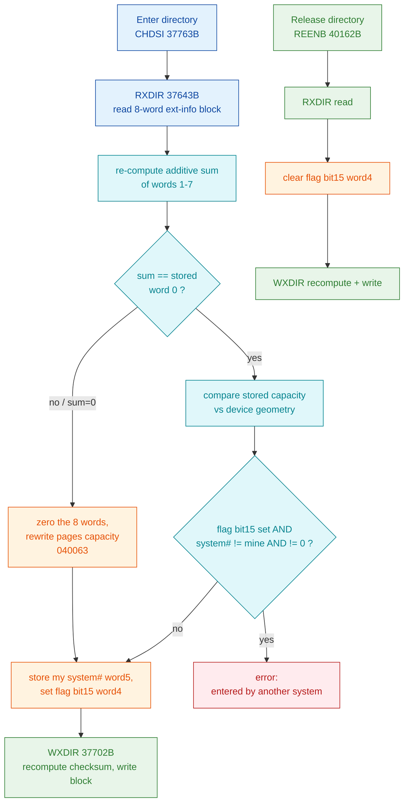

# Extended-info block (page-0 words 1750B-1757B)

The **extended-info block** is a **16-byte / 8-word** structure at page-0 byte
offset **2000** (word **1750B**, hex `0x07D0`), immediately preceding the 32-byte
[master block](directory-label.md) at byte 2016. It carries a checksum, a flag
word, the number of the system that has the directory entered, and the
directory's page capacity. On floppy (FLOMON) devices the 16 bytes are boot-code
remnants, not a valid extended-info block.

This document is grounded in the **producing kernel code** carved from the real
SINTRAN L image (`006-S3FS`), cross-checked against the real disk `SMD0.IMG`.
Where the kernel settles a question it is marked **VERIFIED (kernel)**; where only
the real disk bytes prove it, **VERIFIED (disk)**; guesses that the kernel does
*not* settle are **OPEN**.

**Evidence base:**
- Writer **`WXDIR`** = **37702B** in `006-S3FS` - computes the checksum and writes
  the block back.
- Validator / enter-directory **`CHDSI`** = **37763B** - reads the block
  (via `RXDIR` = 37643B), re-computes the checksum, compares, and on mismatch
  rebuilds the block; then stamps the flag word + system number.
- Release **`REENB`** = **40162B** - clears the "entered" flag bit and rewrites.
- Real disk `~/repos/nd100x/SMD0.IMG` (volume PACK-ONE), page-0 bytes 0x07D0.
- All addresses octal; on-disk multi-byte values are **big-endian words**.

---

## 1. Byte layout

Real bytes from `SMD0.IMG` (`xxd -s 0x7D0 -l 16`):

```
000007d0: 10b7 0000 0000 0000 8000 0066 0000 9051
```

| Word # | Page word | Byte off | Field | PACK-ONE value | Verdict |
|--------|-----------|----------|-------|----------------|---------|
| 0 | 1750B | 0x07D0 | **checksum** | `10B7` | VERIFIED (kernel + disk) |
| 1 | 1751B | 0x07D2 | reserved 1 | `0000` | VERIFIED (disk); purpose OPEN |
| 2 | 1752B | 0x07D4 | reserved 2 | `0000` | VERIFIED (disk); purpose OPEN |
| 3 | 1753B | 0x07D6 | reserved 3 | `0000` | VERIFIED (disk); purpose OPEN |
| 4 | 1754B | 0x07D8 | **flag word** | `8000` | VERIFIED (kernel + disk) |
| 5 | 1755B | 0x07DA | **system number** | `0066` (102) | VERIFIED (kernel + disk) |
| 6 | 1756B | 0x07DC | pages-available (high word) | `0000` | VERIFIED (kernel + disk) |
| 7 | 1757B | 0x07DE | pages-available (low word) | `9051` | VERIFIED (kernel + disk) |

Words 6-7 together form a 32-bit big-endian `pages_available` = `0x00009051` =
**110121B** (36945).

---

## 2. Checksum - a 16-bit ADDITIVE SUM (kernel-corrected)

**VERIFIED (kernel).** The checksum in word 0 is the **16-bit additive sum of the
seven words that follow it** (words 1-7), truncated to 16 bits:

```
checksum = (reserved1 + reserved2 + reserved3
            + flag_word + system_number
            + pages_hi + pages_lo)  mod 2^16
```

Both the writer (`WXDIR`) and the validator (`CHDSI`) use the *identical* summation
loop, so the algorithm is proven from both the producing and the consuming side.

### 2.1 Writer - `WXDIR` = 37702B

```
037707  170401  SAA 1            ; A = 1  (loop index start)
037710  146151  RADD CLD SA DD   ; D = 1  (running counter)
037711  173401  AAX 1            ; X++    -> point past the checksum word to word 1
037712  146105  RADD CLD 0 DA    ; A = 0  (sum accumulator)
037713  171010  SAT 10           ; T = 8
037714  143061  SKP IF DD LST ST ; while D < 8 ...
037715  124005  JMP 5            ;   ... else exit -> 037722
037716  062000  ADD ,X 0         ; A += mem[X]     (accumulate a word)
037717  173401  AAX 1            ; X++
037720  146401  RADD AD1 0 DD    ; D++             (count = 1..7)
037721  124373  JMP -5           ; loop -> 037714
037722  054400  LDX ,B 0         ; X = block base
037723  006000  STA ,X 0         ; mem[base+0] = A ; store the checksum in word 0
```

The loop runs for D = 1..7 (seven iterations) and adds words 1-7; the sum is
stored in word 0. `ADD` is a plain two's-complement add, so overflow past bit 15
is discarded - a pure 16-bit additive checksum.

### 2.2 Validator - `CHDSI` = 37763B (enter-directory)

`CHDSI` reads the block (`RXDIR`), then re-runs the same add loop and compares the
result to the stored word 0:

```
040002  170401  SAA 1            ; same add loop as WXDIR ...
040003  146151  RADD CLD SA DD
040004  173401  AAX 1
040005  146105  RADD CLD 0 DA
040006  171010  SAT 10
040007  143061  SKP IF DD LST ST
040010  124005  JMP 5            ; -> 040015
040011  062000  ADD ,X 0         ; A += word
040012  173401  AAX 1
040013  146401  RADD AD1 0 DD
040014  124373  JMP -5           ; -> 040007
040015  173770  AAX -10          ; X -= 8   (back to block base)
040016  052000  LDT ,X 0         ; T = stored checksum (word 0)
040017  140065  SKP IF DA EQL ST ; if computed(A) == stored(T) -> accept
040020  124043  JMP 43           ; mismatch -> rebuild path (040063)
040021  131042  JAZ 42           ; sum == 0 -> also rebuild
```

### 2.3 Numeric proof on PACK-ONE

Sum of words 1-7 = `0 + 0 + 0 + 0x8000 + 0x0066 + 0x0000 + 0x9051`
= `0x110B7` -> truncated to 16 bits = **`0x10B7`** = the stored checksum. Exact
match.

### 2.4 Why the earlier XOR-then-ADD guess also matched

A prior reconstruction (NDFS `master_block.c`) modelled the checksum as
`(pages_lo XOR pages_hi XOR flag XOR res1 XOR res2 XOR res3) + system_number`.
On PACK-ONE that also yields `0x10B7`, purely by coincidence: the only two
summed words that share a set bit are `flag = 0x8000` and `pages_lo = 0x9051`
(both bit 15). Under **ADD** the two bit-15s carry out past bit 15 and are lost;
under **XOR** they cancel. Both leave bit 15 clear in the low 16 bits, so a
single sample cannot distinguish the two. The kernel routine is unambiguously
**ADD** (see the `ADD ,X 0` in both loops - no `REXO`). The additive form is the
correct one; the XOR form is a look-alike that fails as soon as any two summed
words share a lower set bit.

### 2.5 "Low-byte-only valid" form

**Not a kernel concept.** `WXDIR` writes and `CHDSI` compares a full 16-bit sum;
there is no path that accepts a match on the low byte alone. The
"ValidLowByteOnly" tolerance is a reader-side heuristic, not something SINTRAN
produces or checks.

---

## 3. Flag word (word 4, 1754B) - bit 15 = "directory entered"

**VERIFIED (kernel + disk).** `CHDSI` (enter) **sets bit 15** of the flag word and
`REENB` (release) **clears bit 15**:

```
CHDSI, on enter:
040110  044004  LDA ,X 4         ; A = flag word
040111  175375  BSKP ONE 170 DA  ; skip if bit 15 already set (already entered)
040112  124007  JMP 7            ; -> checks system number ...
...
040123  046004  LDA ,X 4         ; A = flag word
040124  174375  BSET ONE 170 DA  ; A |= (1<<15)      set the "entered" bit
040125  006004  STA ,X 4         ; store flag word back

REENB, on release:
040200  046004  LDA ,X 4         ; A = flag word
040201  174175  BSET ZRO 170 DA  ; A &= ~(1<<15)     clear the "entered" bit
040202  006004  STA ,X 4         ; store flag word back
```

(The disassembler prints the bit-number field pre-shifted: `170` octal = 120
decimal = `15 << 3`, i.e. bit **15**.)

| Bit | Meaning | Evidence |
|-----|---------|----------|
| 15 (`0x8000`) | **Directory entered / in use** by a system (set on enter, cleared on release) | VERIFIED (kernel `CHDSI`/`REENB` + PACK-ONE flag = `0x8000`) |
| 0-14 | No meaning tested or set by these routines; `0` on the real disk | OPEN (no kernel evidence they are used on this version) |

The real PACK-ONE flag = `0x8000` therefore means the volume was left **entered by
system number 102** (below) - exactly what bit 15 + system number encode.

---

## 4. System number (word 5, 1755B)

**VERIFIED (kernel).** This is **the number of the system that currently has the
directory entered**. `CHDSI` compares it against the entering system and, on
success, stores the entering system's number:

```
040113  046005  LDA ,X 5         ; A = stored system number
040114  131005  JAZ 5            ; if 0 (no owner) -> proceed
040115  142065  SKP IF DA UEQ ST ; if stored == current system -> ok
040116  124003  JMP 3            ; else ...
040117  044037  LDA 37           ;   error: entered by a DIFFERENT system
040120  124015  JMP 15
040121  045034  LDA I 34         ; current system number
040122  006005  STA ,X 5         ; store as the new owner (word 5)
```

So the field answers OPEN-question 4 directly: it is the "system that entered
this directory". On PACK-ONE = `0x0066` = **102**. Combined with flag bit 15 set,
PACK-ONE was last entered - and not cleanly released - by system 102.

---

## 5. Pages-available (words 6-7, 1756B-1757B) - directory capacity

**VERIFIED (kernel).** A 32-bit big-endian count that `CHDSI` treats as the
directory's **page capacity** (total pages the directory spans), not a live
free-page count. On the good-checksum path it *reads* the stored value and
compares it against a value computed from device geometry; on the rebuild path it
*writes* the geometry-derived value:

```
040027  026006  LDD ,X 6         ; DD = stored pages-available (32-bit, words 6-7)
040030  140065  SKP IF DA EQL ST ; compare against computed capacity ...
...
040077  022006  STD ,X 6         ; (rebuild path) store computed capacity into words 6-7
```

On PACK-ONE `pages_available` = 36945, i.e. the directory's total usable page
count (the device geometry figure), **distinct** from the bitmap's live
free/used counts. See [directory-label.md](directory-label.md) and
[NDFS-VALIDATION.md](../NDFS-VALIDATION.md#unreserved-pages-vs-pages-available)
for how this differs from the master block's `unreserved_pages`.

---

## 6. Reserved words 1-3 (1751B-1753B)

**VERIFIED (disk): `0` on PACK-ONE.** The kernel routines carry these words only
as part of the checksummed range - `WXDIR` and `CHDSI` sum them but never test or
assign them individually. So on this SINTRAN L revision they are genuinely
reserved (zero, included in the checksum). Whether a different SINTRAN version
assigns them a version/type meaning is **OPEN** - the carved L image gives no such
meaning.

---

## 7. Enter / validate / release flow (kernel-proven)



**Behaviour on a bad checksum (answers OPEN-question 7):** the kernel does **not**
refuse the mount and does **not** merely warn. It treats a bad-or-zero checksum as
"extended info not yet initialised", **zeroes the 8-word block and rebuilds it**
(writes the capacity, then stamps system number + flag and recomputes the
checksum via `WXDIR`). The extended-info block is therefore a *self-healing*
convenience record, not a mount gate.

---

## 8. Field-by-field verdict

| Word | Field | Verdict | Basis |
|------|-------|---------|-------|
| 0 (1750B) | checksum = 16-bit ADD of words 1-7 | VERIFIED | `WXDIR` writes, `CHDSI` validates; disk match |
| 1-3 (1751-1753B) | reserved, `0`, summed only | VERIFIED value / OPEN purpose | disk + kernel (summed, never tested) |
| 4 (1754B) | flag word; bit 15 = entered | VERIFIED (bit 15) / OPEN (other bits) | `CHDSI` set / `REENB` clear; disk |
| 5 (1755B) | system number = current owner | VERIFIED | `CHDSI` compare + store; disk = 102 |
| 6-7 (1756-1757B) | pages-available = directory capacity | VERIFIED | `CHDSI` read/compare/write; disk = 36945 |

**Provenance:** carved `006-S3FS` SINTRAN L bytes (`WXDIR` 37702B, `RXDIR` 37643B,
`CHDSI` 37763B, `REENB` 40162B); real disk `SMD0.IMG` page-0 bytes 0x07D0-0x07DF.
