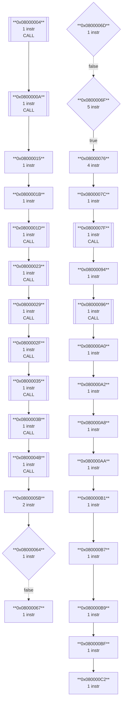
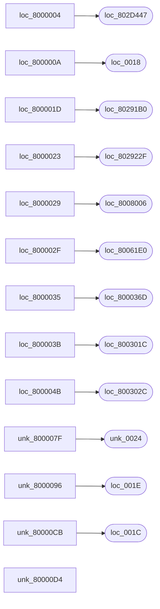

# Code Analysis Report

**Program:** nc-a06.dom
**Architecture:** ND-500 (Norsk Data)
**Source File:** `D:\ND\500\FraTor\nc\nc-a06.dom`
**Entry Point:** `0x08000004`
**Generated:** 2026-07-21 13:19:51

### Source Information

- **File Format:** DOM (FORTRAN-500 Object Module)
- **Target Domain:** 1
- **Entry Point:** 0x08000004
- **Program Size:** 191,678 bytes (187.2 KB)
- **DOM Version:** 97.251
- **Creation Date:** 2026-07-21

---

## Executive Summary

### Analysis Overview

| Metric | Value |
|--------|------:|
| Analysis Range | `0x08000004` - `0x0802ECC2` |
| Total Size | 191,678 bytes (187.2 KB) |
| Instructions Found | 51,439 |
| Symbols Discovered | 37,374 |
| Basic Blocks | 38,516 |
| Control Flow Edges | 49,883 |
| Cross-References | 10,366 |
| Reachable Addresses | 2,808 |
| Data Addresses | 0 |
| Memory Segments | 5,380 |

### Instruction Classification

| Category | Count |
|----------|------:|
| Call Instructions | 4,572 |
| Return Instructions | 737 |
| Branch Instructions | 5,803 |
| Jump Instructions | 3,153 |
| Memory Loads | 25,547 |
| Memory Stores | 25,547 |
| Stack Operations | 0 |
| System/Privileged | 0 |

## Control Flow Graph

*Showing 30 of 38516 basic blocks*



> **Note:** Only showing first 30 basic blocks. Full graph has 38516 blocks.

## Call Graph

*Showing call relationships (4557 callers, 590 callees)*



> **Note:** Only showing first 25 nodes. Full call graph has 4946 nodes.

## Symbols

**Total Symbols:** 37,374
- Code/Function Symbols: 2,646
- Data Symbols: 0
- Unknown Symbols: 34,728

### Code Symbols (Functions/Labels)

| Address | Name | Type | Size |
|---------|------|------|-----:|
| `0x08000004` | loc\_8000004 | Code | - |
| `0x0802D447` | loc\_802D447 | Code | - |
| `0x0800000A` | loc\_800000A | Code | - |
| `0x00000018` | loc\_0018 | Code | - |
| `0x08000015` | loc\_8000015 | Code | - |
| `0x0800001B` | loc\_800001B | Code | - |
| `0x0800001D` | loc\_800001D | Code | - |
| `0x080291B0` | loc\_80291B0 | Code | - |
| `0x08000023` | loc\_8000023 | Code | - |
| `0x0802922F` | loc\_802922F | Code | - |
| `0x08000029` | loc\_8000029 | Code | - |
| `0x08008006` | loc\_8008006 | Code | - |
| `0x0800002F` | loc\_800002F | Code | - |
| `0x080061E0` | loc\_80061E0 | Code | - |
| `0x08000035` | loc\_8000035 | Code | - |
| `0x0800036D` | loc\_800036D | Code | - |
| `0x0800003B` | loc\_800003B | Code | - |
| `0x0800301C` | loc\_800301C | Code | - |
| `0x0800004B` | loc\_800004B | Code | - |
| `0x0800302C` | loc\_800302C | Code | - |
| `0x0800005B` | loc\_800005B | Code | - |
| `0x08000061` | loc\_8000061 | Code | - |
| `0x00000008` | loc\_0008 | Code | - |
| `0x0000001E` | loc\_001E | Code | - |
| `0x0000001C` | loc\_001C | Code | - |
| `0x00000016` | loc\_0016 | Code | - |
| `0x00000014` | loc\_0014 | Code | - |
| `0x0000000F` | loc\_000F | Code | - |
| `0x00000028` | loc\_0028 | Code | - |
| `0x08000370` | loc\_8000370 | Code | - |
| `0x08000376` | loc\_8000376 | Code | - |
| `0x08000378` | loc\_8000378 | Code | - |
| `0x0800037E` | loc\_800037E | Code | - |
| `0x08000380` | loc\_8000380 | Code | - |
| `0x08000387` | loc\_8000387 | Code | - |
| `0x080085C1` | loc\_80085C1 | Code | - |
| `0x0800038D` | loc\_800038D | Code | - |
| `0x08000393` | loc\_8000393 | Code | - |
| `0x080249DC` | loc\_80249DC | Code | - |
| `0x0800039B` | loc\_800039B | Code | - |
| `0x00000031` | loc\_0031 | Code | - |
| `0x080003A0` | loc\_80003A0 | Code | - |
| `0x080003A6` | loc\_80003A6 | Code | - |
| `0x080003AE` | loc\_80003AE | Code | - |
| `0x080003B0` | loc\_80003B0 | Code | - |
| `0x00000020` | loc\_0020 | Code | - |
| `0x080003B9` | loc\_80003B9 | Code | - |
| `0x080003BC` | loc\_80003BC | Code | - |
| `0x08003078` | loc\_8003078 | Code | - |
| `0x080003C8` | loc\_80003C8 | Code | - |
| `0x08001328` | loc\_8001328 | Code | - |
| `0x080003D0` | loc\_80003D0 | Code | - |
| `0x080003D6` | loc\_80003D6 | Code | - |
| `0x00000030` | loc\_0030 | Code | - |
| `0x00000050` | loc\_0050 | Code | - |
| `0x00000038` | loc\_0038 | Code | - |
| `0x00000026` | loc\_0026 | Code | - |
| `0x000000AF` | loc\_00AF | Code | - |
| `0x0000003F` | loc\_003F | Code | - |
| `0x0000005E` | loc\_005E | Code | - |
| `0x00000005` | loc\_0005 | Code | - |
| `0x0000000B` | loc\_000B | Code | - |
| `0x00000019` | loc\_0019 | Code | - |
| `0x00000124` | loc\_0124 | Code | - |
| `0x080249BB` | loc\_80249BB | Code | - |
| `0x00000068` | loc\_0068 | Code | - |
| `0x0000002C` | loc\_002C | Code | - |
| `0x00000010` | loc\_0010 | Code | - |
| `0x00000080` | loc\_0080 | Code | - |
| `0x00000002` | loc\_0002 | Code | - |
| `0x0802AE01` | loc\_802AE01 | Code | - |
| `0x08001318` | loc\_8001318 | Code | - |
| `0x0800131A` | loc\_800131A | Code | - |
| `0x0800131D` | loc\_800131D | Code | - |
| `0x08001321` | loc\_8001321 | Code | - |
| `0x08001327` | loc\_8001327 | Code | - |
| `0x0800132A` | loc\_800132A | Code | - |
| `0x08001330` | loc\_8001330 | Code | - |
| `0x08001334` | loc\_8001334 | Code | - |
| `0x08001337` | loc\_8001337 | Code | - |
| `0x0800133A` | loc\_800133A | Code | - |
| `0x0800133D` | loc\_800133D | Code | - |
| `0x08001341` | loc\_8001341 | Code | - |
| `0x08001343` | loc\_8001343 | Code | - |
| `0x08001346` | loc\_8001346 | Code | - |
| `0x08001352` | loc\_8001352 | Code | - |
| `0x0000007D` | loc\_007D | Code | - |
| `0x0800135F` | loc\_800135F | Code | - |
| `0x08001363` | loc\_8001363 | Code | - |
| `0x08001366` | loc\_8001366 | Code | - |
| `0x0800136C` | loc\_800136C | Code | - |
| `0x0800136F` | loc\_800136F | Code | - |
| `0x08001371` | loc\_8001371 | Code | - |
| `0x08001373` | loc\_8001373 | Code | - |
| `0x08001375` | loc\_8001375 | Code | - |
| `0x08001378` | loc\_8001378 | Code | - |
| `0x0800137A` | loc\_800137A | Code | - |
| `0x0800137C` | loc\_800137C | Code | - |
| `0x0800137E` | loc\_800137E | Code | - |
| `0x08001381` | loc\_8001381 | Code | - |
| `0x08001385` | loc\_8001385 | Code | - |
| `0x08001388` | loc\_8001388 | Code | - |
| `0x0800138E` | loc\_800138E | Code | - |
| `0x08001391` | loc\_8001391 | Code | - |
| `0x08001393` | loc\_8001393 | Code | - |
| `0x08001396` | loc\_8001396 | Code | - |
| `0x08001398` | loc\_8001398 | Code | - |
| `0x0800139C` | loc\_800139C | Code | - |
| `0x0800139F` | loc\_800139F | Code | - |
| `0x080013A1` | loc\_80013A1 | Code | - |
| `0x080013A4` | loc\_80013A4 | Code | - |
| `0x080013A8` | loc\_80013A8 | Code | - |
| `0x080013AE` | loc\_80013AE | Code | - |
| `0x080013B1` | loc\_80013B1 | Code | - |
| `0x080013B7` | loc\_80013B7 | Code | - |
| `0x080013BB` | loc\_80013BB | Code | - |
| `0x080013BE` | loc\_80013BE | Code | - |
| `0x080013C1` | loc\_80013C1 | Code | - |
| `0x080013C4` | loc\_80013C4 | Code | - |
| `0x080013C8` | loc\_80013C8 | Code | - |
| `0x080013CA` | loc\_80013CA | Code | - |
| `0x080013CD` | loc\_80013CD | Code | - |
| `0x080013D9` | loc\_80013D9 | Code | - |
| `0x080013DD` | loc\_80013DD | Code | - |
| `0x080013E0` | loc\_80013E0 | Code | - |
| `0x080013E6` | loc\_80013E6 | Code | - |
| `0x080013E9` | loc\_80013E9 | Code | - |
| `0x080013EB` | loc\_80013EB | Code | - |
| `0x080013ED` | loc\_80013ED | Code | - |
| `0x080013EF` | loc\_80013EF | Code | - |
| `0x080013F3` | loc\_80013F3 | Code | - |
| `0x080013F5` | loc\_80013F5 | Code | - |
| `0x080013F7` | loc\_80013F7 | Code | - |
| `0x080013FA` | loc\_80013FA | Code | - |
| `0x080013FD` | loc\_80013FD | Code | - |
| `0x08001401` | loc\_8001401 | Code | - |
| `0x08001404` | loc\_8001404 | Code | - |
| `0x0800140A` | loc\_800140A | Code | - |
| `0x0800140D` | loc\_800140D | Code | - |
| `0x0800140F` | loc\_800140F | Code | - |
| `0x08001412` | loc\_8001412 | Code | - |
| `0x08001414` | loc\_8001414 | Code | - |
| `0x08001418` | loc\_8001418 | Code | - |
| `0x0800141B` | loc\_800141B | Code | - |
| `0x0800141E` | loc\_800141E | Code | - |
| `0x08001421` | loc\_8001421 | Code | - |
| `0x08001425` | loc\_8001425 | Code | - |
| `0x08001427` | loc\_8001427 | Code | - |
| `0x0800142A` | loc\_800142A | Code | - |
| `0x08001430` | loc\_8001430 | Code | - |
| `0x0800143C` | loc\_800143C | Code | - |
| `0x0800143E` | loc\_800143E | Code | - |
| `0x08001441` | loc\_8001441 | Code | - |
| `0x08001443` | loc\_8001443 | Code | - |
| `0x08001447` | loc\_8001447 | Code | - |
| `0x0800144A` | loc\_800144A | Code | - |
| `0x0800144D` | loc\_800144D | Code | - |
| `0x08001450` | loc\_8001450 | Code | - |
| `0x08001454` | loc\_8001454 | Code | - |
| `0x08001456` | loc\_8001456 | Code | - |
| `0x08001459` | loc\_8001459 | Code | - |
| `0x00000034` | loc\_0034 | Code | - |
| `0x08001466` | loc\_8001466 | Code | - |
| `0x0800146A` | loc\_800146A | Code | - |
| `0x0800146D` | loc\_800146D | Code | - |
| `0x08001473` | loc\_8001473 | Code | - |
| `0x08001476` | loc\_8001476 | Code | - |
| `0x08001478` | loc\_8001478 | Code | - |
| `0x0800147A` | loc\_800147A | Code | - |
| `0x0800147C` | loc\_800147C | Code | - |
| `0x0800147F` | loc\_800147F | Code | - |
| `0x08001481` | loc\_8001481 | Code | - |
| `0x08001483` | loc\_8001483 | Code | - |
| `0x08001485` | loc\_8001485 | Code | - |
| `0x08001488` | loc\_8001488 | Code | - |
| `0x0800148C` | loc\_800148C | Code | - |
| `0x0800148F` | loc\_800148F | Code | - |
| `0x08001495` | loc\_8001495 | Code | - |
| `0x08001498` | loc\_8001498 | Code | - |
| `0x0800149A` | loc\_800149A | Code | - |
| `0x0800149D` | loc\_800149D | Code | - |
| `0x0800149F` | loc\_800149F | Code | - |
| `0x080014A3` | loc\_80014A3 | Code | - |
| `0x080014A6` | loc\_80014A6 | Code | - |
| `0x080014A8` | loc\_80014A8 | Code | - |
| `0x080014AB` | loc\_80014AB | Code | - |
| `0x080014AF` | loc\_80014AF | Code | - |
| `0x080014B5` | loc\_80014B5 | Code | - |
| `0x080014B8` | loc\_80014B8 | Code | - |
| `0x080014BE` | loc\_80014BE | Code | - |
| `0x080014C2` | loc\_80014C2 | Code | - |
| `0x080014C5` | loc\_80014C5 | Code | - |
| `0x080014C8` | loc\_80014C8 | Code | - |
| `0x080014CB` | loc\_80014CB | Code | - |
| `0x080014CF` | loc\_80014CF | Code | - |
| `0x080014D1` | loc\_80014D1 | Code | - |
| `0x080014D4` | loc\_80014D4 | Code | - |
| `0x080014E0` | loc\_80014E0 | Code | - |
| `0x080014E2` | loc\_80014E2 | Code | - |
| `0x080014E5` | loc\_80014E5 | Code | - |
| ... | *(2446 more symbols)* | | |

## Basic Blocks

**Total Basic Blocks:** 38,516

### Statistics

- Minimum Block Size: 1 instructions
- Maximum Block Size: 10 instructions
- Average Block Size: 1.3 instructions

### Block Listing

| # | Start | End | Instructions | Successors |
|--:|-------|-----|-------------:|------------|
| 1 | `0x08000004` | `0x08000004` | 1 | `0x0802D447`, `0x0800000A` |
| 2 | `0x0800000A` | `0x0800000A` | 1 | `0x00000018`, `0x08000015` |
| 3 | `0x08000015` | `0x08000015` | 1 | `0x0800001B` |
| 4 | `0x0800001B` | `0x0800001B` | 1 | `0x0800001D` |
| 5 | `0x0800001D` | `0x0800001D` | 1 | `0x080291B0`, `0x08000023` |
| 6 | `0x08000023` | `0x08000023` | 1 | `0x0802922F`, `0x08000029` |
| 7 | `0x08000029` | `0x08000029` | 1 | `0x08008006`, `0x0800002F` |
| 8 | `0x0800002F` | `0x0800002F` | 1 | `0x080061E0`, `0x08000035` |
| 9 | `0x08000035` | `0x08000035` | 1 | `0x0800036D`, `0x0800003B` |
| 10 | `0x0800003B` | `0x0800003B` | 1 | `0x0800301C`, `0x0800004B` |
| 11 | `0x0800004B` | `0x0800004B` | 1 | `0x0800302C`, `0x0800005B` |
| 12 | `0x0800005B` | `0x08000062` | 2 | `0x08000061`, `0x08000064` |
| 13 | `0x08000064` | `0x08000064` | 1 | `0x0000E605`, `0x08000067` |
| 14 | `0x08000067` | `0x08000067` | 1 | `0x08000CE6` |
| 15 | `0x0800006D` | `0x0800006D` | 1 | `0x00000008`, `0x0800006F` |
| 16 | `0x0800006F` | `0x08000074` | 5 | `0x08000076` |
| 17 | `0x08000076` | `0x08000079` | 4 | `0x0800007C` |
| 18 | `0x0800007C` | `0x0800007C` | 1 | `0x0800007F` |
| 19 | `0x0800007F` | `0x0800007F` | 1 | `0x00000024`, `0x08000094` |
| 20 | `0x08000094` | `0x08000094` | 1 | `0x08000096` |
| 21 | `0x08000096` | `0x08000096` | 1 | `0x0000001E`, `0x080000A0` |
| 22 | `0x080000A0` | `0x080000A0` | 1 | `0x080000A2` |
| 23 | `0x080000A2` | `0x080000A2` | 1 | `0x080000A8` |
| 24 | `0x080000A8` | `0x080000A8` | 1 | `0x080000AA` |
| 25 | `0x080000AA` | `0x080000AA` | 1 | `0x080000B1` |
| 26 | `0x080000B1` | `0x080000B1` | 1 | `0x080000B7` |
| 27 | `0x080000B7` | `0x080000B7` | 1 | `0x080000B9` |
| 28 | `0x080000B9` | `0x080000B9` | 1 | `0x080000BF` |
| 29 | `0x080000BF` | `0x080000BF` | 1 | `0x080000C2` |
| 30 | `0x080000C2` | `0x080000C2` | 1 | `0x080000C4` |
| 31 | `0x080000C4` | `0x080000C4` | 1 | `0x080000C6` |
| 32 | `0x080000C6` | `0x080000C6` | 1 | `0x080000C8` |
| 33 | `0x080000C8` | `0x080000C8` | 1 | `0x080000CB` |
| 34 | `0x080000CB` | `0x080000CB` | 1 | `0x0000001C`, `0x080000D2` |
| 35 | `0x080000D2` | `0x080000D2` | 1 | `0x080000D4` |
| 36 | `0x080000D4` | `0x080000D4` | 1 | `0x00000016`, `0x080000DE` |
| 37 | `0x080000DE` | `0x080000E5` | 2 | `0x080000E4`, `0x080000E7` |
| 38 | `0x080000E7` | `0x080000E7` | 1 | `0x0000E605`, `0x080000EA` |
| 39 | `0x080000EA` | `0x080000EA` | 1 | `0x08000CE6` |
| 40 | `0x080000F0` | `0x080000F0` | 1 | `0x00000008`, `0x080000F2` |
| 41 | `0x080000F2` | `0x080000F7` | 5 | `0x080000F9` |
| 42 | `0x080000F9` | `0x080000FC` | 4 | `0x080000FF` |
| 43 | `0x080000FF` | `0x080000FF` | 1 | `0x08000102` |
| 44 | `0x08000102` | `0x08000102` | 1 | `0x00000024`, `0x08000117` |
| 45 | `0x08000117` | `0x08000117` | 1 | `0x08000119` |
| 46 | `0x08000119` | `0x08000119` | 1 | `0x0000001E`, `0x08000123` |
| 47 | `0x08000123` | `0x08000123` | 1 | `0x08000125` |
| 48 | `0x08000125` | `0x08000125` | 1 | `0x0800012B` |
| 49 | `0x0800012B` | `0x0800012B` | 1 | `0x0800012D` |
| 50 | `0x0800012D` | `0x0800012D` | 1 | `0x08000134` |
| 51 | `0x08000134` | `0x08000134` | 1 | `0x0800013A` |
| 52 | `0x0800013A` | `0x0800013A` | 1 | `0x0800013C` |
| 53 | `0x0800013C` | `0x0800013C` | 1 | `0x08000142` |
| 54 | `0x08000142` | `0x08000142` | 1 | `0x08000145` |
| 55 | `0x08000145` | `0x08000145` | 1 | `0x08000147` |
| 56 | `0x08000147` | `0x08000147` | 1 | `0x08000149` |
| 57 | `0x08000149` | `0x08000149` | 1 | `0x0800014B` |
| 58 | `0x0800014B` | `0x0800014B` | 1 | `0x0800014E` |
| 59 | `0x0800014E` | `0x0800014E` | 1 | `0x0000001C`, `0x08000155` |
| 60 | `0x08000155` | `0x08000155` | 1 | `0x08000157` |
| 61 | `0x08000157` | `0x08000157` | 1 | `0x00000016`, `0x08000161` |
| 62 | `0x08000161` | `0x08000168` | 2 | `0x08000167`, `0x0800016A` |
| 63 | `0x0800016A` | `0x0800016A` | 1 | `0x0000E605`, `0x0800016D` |
| 64 | `0x0800016D` | `0x0800016D` | 1 | `0x08000CE6` |
| 65 | `0x08000173` | `0x08000173` | 1 | `0x00000008`, `0x08000175` |
| 66 | `0x08000175` | `0x0800017A` | 5 | `0x0800017C` |
| 67 | `0x0800017C` | `0x0800017F` | 4 | `0x08000182` |
| 68 | `0x08000182` | `0x08000182` | 1 | `0x08000188` |
| 69 | `0x08000188` | `0x08000191` | 3 | `0x08000194` |
| 70 | `0x08000194` | `0x08000194` | 1 | `0x0800019A` |
| 71 | `0x0800019A` | `0x0800019C` | 2 | `0x080001A2` |
| 72 | `0x080001A2` | `0x080001A2` | 1 | `0x00000024`, `0x080001B1` |
| 73 | `0x080001B1` | `0x080001B1` | 1 | `0x080001B3` |
| 74 | `0x080001B3` | `0x080001B3` | 1 | `0x0000001E`, `0x080001BD` |
| 75 | `0x080001BD` | `0x080001BD` | 1 | `0x080001BF` |
| 76 | `0x080001BF` | `0x080001BF` | 1 | `0x080001C5` |
| 77 | `0x080001C5` | `0x080001C5` | 1 | `0x080001C7` |
| 78 | `0x080001C7` | `0x080001C7` | 1 | `0x080001CE` |
| 79 | `0x080001CE` | `0x080001CE` | 1 | `0x080001D4` |
| 80 | `0x080001D4` | `0x080001D4` | 1 | `0x080001D6` |
| 81 | `0x080001D6` | `0x080001D6` | 1 | `0x080001DC` |
| 82 | `0x080001DC` | `0x080001DC` | 1 | `0x080001DF` |
| 83 | `0x080001DF` | `0x080001DF` | 1 | `0x080001E1` |
| 84 | `0x080001E1` | `0x080001E1` | 1 | `0x080001E3` |
| 85 | `0x080001E3` | `0x080001E3` | 1 | `0x080001E5` |
| 86 | `0x080001E5` | `0x080001E5` | 1 | `0x080001E8` |
| 87 | `0x080001E8` | `0x080001E8` | 1 | `0x0000001C`, `0x080001EF` |
| 88 | `0x080001EF` | `0x080001EF` | 1 | `0x080001F1` |
| 89 | `0x080001F1` | `0x080001F1` | 1 | `0x00000016`, `0x080001FB` |
| 90 | `0x080001FB` | `0x08000205` | 3 | `0x00000086`, `0x08000208` |
| 91 | `0x08000208` | `0x0800020F` | 2 | `0x0800020E`, `0x08000211` |
| 92 | `0x08000211` | `0x08000211` | 1 | `0x0000E605`, `0x08000214` |
| 93 | `0x08000214` | `0x08000214` | 1 | `0x08000CE6` |
| 94 | `0x0800021A` | `0x0800021A` | 1 | `0x00000008`, `0x0800021C` |
| 95 | `0x0800021C` | `0x08000221` | 5 | `0x08000223` |
| 96 | `0x08000223` | `0x08000226` | 4 | `0x08000229` |
| 97 | `0x08000229` | `0x08000229` | 1 | `0x0800022C` |
| 98 | `0x0800022C` | `0x0800022C` | 1 | `0x00000024`, `0x08000241` |
| 99 | `0x08000241` | `0x08000241` | 1 | `0x08000243` |
| 100 | `0x08000243` | `0x08000243` | 1 | `0x0000001E`, `0x0800024D` |
| ... | | | *(38416 more blocks)* | |

## Control Flow Analysis

### Edge Type Distribution

| Edge Type | Count | Percentage |
|-----------|------:|-----------:|
| Call | 4,563 | 9.1% |
| Sequential | 35,922 | 72.0% |
| ConditionalJump | 5,803 | 11.6% |
| Jump | 2,858 | 5.7% |
| Return | 737 | 1.5% |

## Cross-References

### Reference Type Distribution

| Reference Type | Count |
|----------------|------:|
| Call | 4,563 |
| Branch | 5,803 |

### Cross-Reference Listing

| From | To | Type |
|------|----|----- |
| `0x08000004` | `0x0802D447` | Call |
| `0x0800000A` | `0x00000018` | Call |
| `0x0800001D` | `0x080291B0` | Call |
| `0x08000023` | `0x0802922F` | Call |
| `0x08000029` | `0x08008006` | Call |
| `0x0800002F` | `0x080061E0` | Call |
| `0x08000035` | `0x0800036D` | Call |
| `0x0800003B` | `0x0800301C` | Call |
| `0x0800004B` | `0x0800302C` | Call |
| `0x08000064` | `0x0000E605` | Branch |
| `0x0800006D` | `0x00000008` | Branch |
| `0x08000074` | `0x00000000` | Branch |
| `0x0800007F` | `0x00000024` | Call |
| `0x08000096` | `0x0000001E` | Call |
| `0x080000CB` | `0x0000001C` | Call |
| `0x080000D4` | `0x00000016` | Call |
| `0x080000E7` | `0x0000E605` | Branch |
| `0x080000F0` | `0x00000008` | Branch |
| `0x080000F7` | `0x00000000` | Branch |
| `0x08000102` | `0x00000024` | Call |
| `0x08000119` | `0x0000001E` | Call |
| `0x0800014E` | `0x0000001C` | Call |
| `0x08000157` | `0x00000016` | Call |
| `0x0800016A` | `0x0000E605` | Branch |
| `0x08000173` | `0x00000008` | Branch |
| `0x0800017A` | `0x00000000` | Branch |
| `0x080001A2` | `0x00000024` | Call |
| `0x080001B3` | `0x0000001E` | Call |
| `0x080001E8` | `0x0000001C` | Call |
| `0x080001F1` | `0x00000016` | Call |
| `0x08000205` | `0x00000086` | Branch |
| `0x08000211` | `0x0000E605` | Branch |
| `0x0800021A` | `0x00000008` | Branch |
| `0x08000221` | `0x00000000` | Branch |
| `0x0800022C` | `0x00000024` | Call |
| `0x08000243` | `0x0000001E` | Call |
| `0x08000278` | `0x0000001C` | Call |
| `0x08000281` | `0x00000016` | Call |
| `0x08000291` | `0x00000092` | Branch |
| `0x0800029D` | `0x00000086` | Branch |
| `0x080002A9` | `0x0000E605` | Branch |
| `0x080002B2` | `0x00000008` | Branch |
| `0x080002B9` | `0x00000000` | Branch |
| `0x080002C4` | `0x00000024` | Call |
| `0x080002DB` | `0x0000001E` | Call |
| `0x08000310` | `0x0000001C` | Call |
| `0x08000319` | `0x00000016` | Call |
| `0x08000343` | `0x00000014` | Call |
| `0x0800034C` | `0xF8000000` | Call |
| `0x08000355` | `0x08029455` | Call |
| `0x0800035B` | `0x0802DAB9` | Call |
| `0x08000361` | `0x08029455` | Call |
| `0x08000367` | `0x0802D1D8` | Call |
| `0x0800036D` | `0x00000028` | Call |
| `0x08000387` | `0x080085C1` | Call |
| `0x08000393` | `0x080249DC` | Call |
| `0x0800039D` | `0x00000031` | Branch |
| `0x080003BC` | `0x08003078` | Call |
| `0x080003D7` | `0x00000030` | Call |
| `0x080003FF` | `0x00000020` | Call |
| `0x0800042D` | `0x00000020` | Call |
| `0x0800044B` | `0x00000012` | Branch |
| `0x0800045D` | `0x0802CFF3` | Call |
| `0x0800046F` | `0x00000050` | Call |
| `0x080004B0` | `0x00000038` | Call |
| `0x080004CB` | `0x4E432D43` | Call |
| `0x080004D6` | `0x4E432D43` | Call |
| `0x080004E1` | `0x080085C1` | Call |
| `0x080004ED` | `0x4E432D43` | Call |
| `0x080004F8` | `0x4E432D43` | Call |
| `0x08000503` | `0x4E432D43` | Call |
| `0x0800050E` | `0x4E432D43` | Call |
| `0x0800051C` | `0x4E432D43` | Call |
| `0x08000529` | `0x00000055` | Branch |
| `0x08000535` | `0x00000026` | Branch |
| `0x0800054E` | `0x00000030` | Call |
| `0x08000571` | `0x00000030` | Call |
| `0x080005A1` | `0x00000030` | Call |
| `0x080005AF` | `0x4E432D43` | Call |
| `0x080005BA` | `0x4E432D43` | Call |
| `0x080005C5` | `0x4E432D43` | Call |
| `0x080005D0` | `0x4E432D43` | Call |
| `0x080005DB` | `0x4E432D43` | Call |
| `0x080005EB` | `0x4E432D43` | Call |
| `0x080005FB` | `0x4E432D43` | Call |
| `0x0800060B` | `0x4E432D43` | Call |
| `0x0800062A` | `0x00000030` | Call |
| `0x08000638` | `0x08004ACF` | Call |
| `0x08000641` | `0x08004E6D` | Call |
| `0x0800064A` | `0x08004974` | Call |
| `0x08000653` | `0x08004750` | Call |
| `0x0800066A` | `0x00000030` | Call |
| `0x0800067C` | `0x00000005` | Branch |
| `0x0800068B` | `0x0000000B` | Branch |
| `0x08000696` | `0x0802CFF3` | Call |
| `0x0800069F` | `0x4E432D43` | Call |
| `0x080006B1` | `0x0000000B` | Branch |
| `0x080006BC` | `0x0802CFF3` | Call |
| `0x080006C2` | `0x00000024` | Call |
| `0x080006CE` | `0x0000FDBB` | Branch |
| `0x080006DA` | `0x0000014C` | Call |
| `0x080006F1` | `0x0000001C` | Branch |
| `0x080006F4` | `0x00000018` | Call |
| `0x0800070D` | `0x00000018` | Call |
| `0x0800077B` | `0x00000124` | Call |
| `0x080007CB` | `0x00000124` | Call |
| `0x08000836` | `0x00000124` | Call |
| `0x08000886` | `0x00000124` | Call |
| `0x080008A4` | `0x00000137` | Branch |
| `0x080008FF` | `0x00000124` | Call |
| `0x0800090D` | `0x00000077` | Branch |
| `0x08000975` | `0x0000012C` | Call |
| `0x080009C8` | `0x00000124` | Call |
| `0x080009DB` | `0x080249BB` | Call |
| `0x08000A19` | `0x00000124` | Call |
| `0x08000A57` | `0x00000124` | Call |
| `0x08000A60` | `0x08005024` | Call |
| `0x08000A67` | `0x00000044` | Call |
| `0x08000A81` | `0x00001504` | Branch |
| `0x08000A86` | `0x00000000` | Branch |
| `0x08000A8B` | `0x00000008` | Branch |
| `0x08000A90` | `0x00000000` | Branch |
| `0x08000AD7` | `0x00000024` | Call |
| `0x08000AE8` | `0x0000004F` | Branch |
| `0x08000B2F` | `0x00000024` | Call |
| `0x08000B39` | `0x0000FF68` | Branch |
| `0x08000B3D` | `0x0000003C` | Call |
| `0x08000B4A` | `0x0000000F` | Branch |
| `0x08000B56` | `0x00000020` | Branch |
| `0x08000B5C` | `0x00001504` | Branch |
| `0x08000B5F` | `0x00000008` | Branch |
| `0x08000B64` | `0x00000000` | Branch |
| `0x08000B6E` | `0x00000000` | Branch |
| `0x08000B84` | `0x0000001C` | Call |
| `0x08000B8D` | `0x00000039` | Branch |
| `0x08000BB8` | `0x0000002C` | Call |
| `0x08000BD4` | `0x00000024` | Call |
| `0x08000BDC` | `0x00000044` | Call |
| `0x08000BEB` | `0x0000000F` | Branch |
| `0x08000BF7` | `0x00000023` | Branch |
| `0x08000C03` | `0x00001504` | Branch |
| `0x08000C06` | `0x00000008` | Branch |
| `0x08000C0B` | `0x00000000` | Branch |
| `0x08000C10` | `0x00000008` | Branch |
| `0x08000C44` | `0x00000024` | Call |
| `0x08000C52` | `0x0000004F` | Branch |
| `0x08000C93` | `0x00000024` | Call |
| `0x08000C9B` | `0x08000CA2` | Call |
| `0x08000CA2` | `0x00000068` | Call |
| `0x08000D3E` | `0x00000014` | Call |
| `0x08000D50` | `0x00000014` | Call |
| `0x08000D57` | `0x0802DAB9` | Call |
| `0x08000D5D` | `0x00000014` | Call |
| `0x08000D6D` | `0x00000024` | Call |
| `0x08000D78` | `0x080085C1` | Call |
| `0x08000D93` | `0x080031D8` | Call |
| `0x08000DA0` | `0x00000038` | Call |
| `0x08000DB4` | `0x0802B386` | Call |
| `0x08000DBE` | `0x00000020` | Branch |
| `0x08000DC4` | `0x00001504` | Branch |
| `0x08000DC7` | `0x00000008` | Branch |
| `0x08000DD1` | `0x00000008` | Branch |
| `0x08000DD5` | `0x00000004` | Call |
| `0x08000DE4` | `0x00000014` | Call |
| `0x08000DFF` | `0x0802B8BA` | Call |
| `0x08000E29` | `0x00000028` | Call |
| `0x08000E3D` | `0x0000005C` | Call |
| `0x08000E4C` | `0x0000000F` | Branch |
| `0x08000E58` | `0x00000080` | Branch |
| `0x08000EC9` | `0x0000002C` | Call |
| `0x08000F02` | `0x00000024` | Call |
| `0x08000F70` | `0x00000024` | Call |
| `0x08000F7C` | `0x08000F83` | Call |
| `0x08000F83` | `0x00000068` | Call |
| `0x0800101F` | `0x00000014` | Call |
| `0x08001031` | `0x00000014` | Call |
| `0x08001038` | `0x0802DAB9` | Call |
| `0x0800103E` | `0x00000014` | Call |
| `0x0800104E` | `0x00000024` | Call |
| `0x0800106E` | `0x00000014` | Call |
| `0x08001076` | `0x00000018` | Call |
| `0x08001096` | `0x00000002` | Call |
| `0x080010B0` | `0x0802AE01` | Call |
| `0x080010B9` | `0x0000006C` | Call |
| `0x080010CD` | `0x00000012` | Branch |
| `0x080010DC` | `0x00000072` | Branch |
| `0x0800111B` | `0x0000005C` | Call |
| `0x08001136` | `0x0802DAB9` | Call |
| `0x0800113C` | `0x00000038` | Call |
| `0x08001155` | `0x0000007F` | Branch |
| `0x08001162` | `0x00000072` | Branch |
| `0x080011A1` | `0x0000005C` | Call |
| `0x080011BC` | `0x0802DAB9` | Call |
| `0x080011C2` | `0x00000038` | Call |
| `0x080011FE` | `0x00000024` | Call |
| `0x0800123A` | `0x00000024` | Call |
| `0x08001248` | `0x00001504` | Branch |
| `0x0800124B` | `0x00000008` | Branch |
| `0x08001255` | `0x00000008` | Branch |
| `0x0800125A` | `0x00000000` | Branch |
| `0x08001266` | `0x00000072` | Branch |
| `0x080012CC` | `0x00000024` | Call |
| `0x08001346` | `0x0000002C` | Call |
| `0x0800135C` | `0x0000007D` | Branch |
| `0x080013CD` | `0x0000002C` | Call |
| `0x08001459` | `0x00000034` | Call |
| `0x080014D4` | `0x0000002C` | Call |
| `0x080014E5` | `0x0000001B` | Call |
| `0x080014F0` | `0x00000009` | Branch |
| `0x080014F3` | `0x080014FA` | Call |
| `0x080014FA` | `0x00000068` | Call |
| `0x08001596` | `0x00000014` | Call |
| `0x080015A8` | `0x0000009A` | Branch |
| `0x080015AB` | `0x080249BB` | Call |
| `0x080015B7` | `0x08002696` | Call |
| `0x080015C6` | `0x0000E605` | Branch |
| `0x080015CF` | `0x00000008` | Branch |
| `0x080015D4` | `0x00000000` | Branch |
| `0x080015E1` | `0x00000038` | Call |
| `0x080015F8` | `0x00000032` | Call |
| `0x0800161D` | `0x00000030` | Call |
| `0x08001626` | `0x00000022` | Call |
| `0x08001630` | `0x08005230` | Call |
| `0x08001636` | `0x08005535` | Call |
| `0x0800163C` | `0x08005024` | Call |
| `0x08001645` | `0x00000014` | Call |
| `0x0800164C` | `0x0802DAB9` | Call |
| `0x08001652` | `0x00000014` | Call |
| `0x08001662` | `0x00000018` | Call |
| `0x08001680` | `0x00000008` | Branch |
| `0x0800168A` | `0x00000000` | Branch |
| `0x08001690` | `0x00000008` | Branch |
| `0x08001698` | `0x0802AE01` | Call |
| `0x080016B1` | `0x00000008` | Branch |
| `0x080016BB` | `0x00000000` | Branch |
| `0x080016C1` | `0x00000008` | Branch |
| `0x080016CF` | `0x08001106` | Call |
| `0x080016EC` | `0x0802AE01` | Call |
| `0x08001705` | `0x00000008` | Branch |
| `0x0800170A` | `0x00000000` | Branch |
| `0x0800170F` | `0x00000000` | Branch |
| `0x08001715` | `0x00000008` | Branch |
| `0x08001723` | `0x08000F7A` | Call |
| `0x08001740` | `0x0802AE01` | Call |
| `0x08001764` | `0x00000008` | Branch |
| `0x08001769` | `0x00000000` | Branch |
| `0x0800176E` | `0x00000000` | Branch |
| `0x08001774` | `0x00000008` | Branch |
| `0x0800178B` | `0x00000002` | Call |
| `0x080017A5` | `0x0802AE01` | Call |
| `0x080017B6` | `0x0000009D` | Branch |
| `0x080017C9` | `0x00000008` | Branch |
| `0x080017CE` | `0x00000000` | Branch |
| `0x080017D3` | `0x00000000` | Branch |
| `0x080017E1` | `0x000000C5` | Branch |
| `0x080017E6` | `0x00000008` | Branch |
| `0x080017F6` | `0x00000008` | Branch |
| `0x080017FB` | `0x00000000` | Branch |
| `0x08001800` | `0x00000000` | Branch |
| `0x08001812` | `0x00000026` | Branch |
| `0x08001826` | `0x00000008` | Branch |
| `0x0800182B` | `0x00000000` | Branch |
| `0x08001830` | `0x00000000` | Branch |
| `0x08001849` | `0x00000008` | Branch |
| `0x0800184E` | `0x00000000` | Branch |
| `0x08001853` | `0x00000000` | Branch |
| `0x08001859` | `0x00000008` | Branch |
| `0x08001861` | `0x0000002C` | Call |
| `0x0800187D` | `0x00000026` | Branch |
| `0x08001891` | `0x00000008` | Branch |
| `0x08001896` | `0x00000000` | Branch |
| `0x0800189B` | `0x00000000` | Branch |
| `0x080018AD` | `0x00000026` | Branch |
| `0x080018C1` | `0x00000008` | Branch |
| `0x080018C6` | `0x00000000` | Branch |
| `0x080018CB` | `0x00000000` | Branch |
| `0x080018D4` | `0x00000008` | Branch |
| `0x080018E4` | `0x00000008` | Branch |
| `0x080018E9` | `0x00000000` | Branch |
| `0x080018EE` | `0x00000000` | Branch |
| `0x080018F4` | `0x00000008` | Branch |
| `0x080018FC` | `0x0000002C` | Call |
| `0x0800191F` | `0x00000008` | Branch |
| `0x08001924` | `0x00000000` | Branch |
| `0x08001929` | `0x00000000` | Branch |
| `0x0800192F` | `0x00000008` | Branch |
| `0x08001937` | `0x0802AE01` | Call |
| `0x08001950` | `0x00000008` | Branch |
| `0x08001955` | `0x00000000` | Branch |
| `0x0800195A` | `0x00000000` | Branch |
| `0x08001960` | `0x00000008` | Branch |
| `0x08001968` | `0x0802AE01` | Call |
| `0x08001984` | `0x00000008` | Branch |
| `0x08001994` | `0x00000008` | Branch |
| `0x0800199C` | `0x0802AE01` | Call |
| `0x080019B5` | `0x00000008` | Branch |
| `0x080019BF` | `0x00000000` | Branch |
| `0x080019C5` | `0x00000008` | Branch |
| `0x080019D3` | `0x08001106` | Call |
| `0x080019F0` | `0x0000002C` | Call |
| `0x08001A0B` | `0x0802AE01` | Call |
| `0x08001A24` | `0x00000008` | Branch |
| `0x08001A34` | `0x00000008` | Branch |
| `0x08001A42` | `0x08001106` | Call |
| `0x08001A67` | `0x00000008` | Branch |
| `0x08001A6C` | `0x00000000` | Branch |
| `0x08001A71` | `0x00000000` | Branch |
| `0x08001A7F` | `0x0802AE01` | Call |
| `0x08001A98` | `0x00000008` | Branch |
| `0x08001AA2` | `0x00000000` | Branch |
| `0x08001AA8` | `0x00000008` | Branch |
| `0x08001AB0` | `0x0802AE01` | Call |
| `0x08001AC9` | `0x00000008` | Branch |
| `0x08001ACE` | `0x00000000` | Branch |
| `0x08001AD3` | `0x00000000` | Branch |
| `0x08001AD9` | `0x00000008` | Branch |
| `0x08001AE7` | `0x08000F7A` | Call |
| `0x08001B04` | `0x0802AE01` | Call |
| `0x08001B28` | `0x00000008` | Branch |
| `0x08001B2D` | `0x00000000` | Branch |
| `0x08001B32` | `0x00000000` | Branch |
| `0x08001B38` | `0x00000008` | Branch |
| `0x08001B4F` | `0x00000002` | Call |
| `0x08001B69` | `0x0802AE01` | Call |
| `0x08001B7A` | `0x0000009D` | Branch |
| `0x08001B8D` | `0x00000008` | Branch |
| `0x08001B92` | `0x00000000` | Branch |
| `0x08001B97` | `0x00000000` | Branch |
| `0x08001BA6` | `0x00000026` | Branch |
| `0x08001BBA` | `0x00000008` | Branch |
| `0x08001BBF` | `0x00000000` | Branch |
| `0x08001BC4` | `0x00000000` | Branch |
| `0x08001BCD` | `0x00000008` | Branch |
| `0x08001BDD` | `0x00000008` | Branch |
| `0x08001BE2` | `0x00000000` | Branch |
| `0x08001BE7` | `0x00000000` | Branch |
| `0x08001BED` | `0x00000008` | Branch |
| `0x08001BF5` | `0x0802AE01` | Call |
| `0x08001C0E` | `0x00000008` | Branch |
| `0x08001C13` | `0x00000000` | Branch |
| `0x08001C18` | `0x00000000` | Branch |
| `0x08001C27` | `0x00000056` | Branch |
| `0x08001C34` | `0x00000026` | Branch |
| `0x08001C48` | `0x00000008` | Branch |
| `0x08001C4D` | `0x00000000` | Branch |
| `0x08001C52` | `0x00000000` | Branch |
| `0x08001C5B` | `0x00000008` | Branch |
| `0x08001C6B` | `0x00000008` | Branch |
| `0x08001C70` | `0x00000000` | Branch |
| `0x08001C75` | `0x00000000` | Branch |
| `0x08001C86` | `0x000000C5` | Branch |
| `0x08001C8B` | `0x00000008` | Branch |
| `0x08001C9B` | `0x00000008` | Branch |
| `0x08001CA0` | `0x00000000` | Branch |
| `0x08001CA5` | `0x00000000` | Branch |
| `0x08001CAE` | `0x00000008` | Branch |
| `0x08001CBE` | `0x00000008` | Branch |
| `0x08001CC3` | `0x00000000` | Branch |
| `0x08001CC8` | `0x00000000` | Branch |
| `0x08001CCE` | `0x00000008` | Branch |
| `0x08001CD6` | `0x0802AE01` | Call |
| `0x08001CEF` | `0x00000008` | Branch |
| `0x08001CFF` | `0x00000008` | Branch |
| `0x08001D07` | `0x0802AE01` | Call |
| `0x08001D24` | `0x0802CFF3` | Call |
| `0x08001D33` | `0x0802B168` | Call |
| `0x08001D3C` | `0x00000054` | Call |
| `0x08001D73` | `0x00000024` | Call |
| `0x08001DAF` | `0x00000024` | Call |
| `0x08001E1D` | `0x00000024` | Call |
| `0x08001E8C` | `0x00000024` | Call |
| `0x08001E9B` | `0x0000001B` | Branch |
| `0x08001E9E` | `0x080249BB` | Call |
| `0x08001EAA` | `0x0800540E` | Call |
| `0x08001EB0` | `0x08005024` | Call |
| `0x08001EB7` | `0x0000005C` | Call |
| `0x08001EEE` | `0x00000024` | Call |
| `0x08001F2A` | `0x00000024` | Call |
| `0x08001F98` | `0x00000024` | Call |
| `0x08002019` | `0x0000002C` | Call |
| `0x0800202F` | `0x0000007D` | Branch |
| `0x080020A0` | `0x0000002C` | Call |
| `0x080020AF` | `0x0000001B` | Branch |
| `0x080020B2` | `0x080249BB` | Call |
| `0x080020BE` | `0x08005230` | Call |
| `0x080020C4` | `0x08005024` | Call |
| `0x080020CB` | `0x0000005C` | Call |
| `0x08002102` | `0x00000024` | Call |
| `0x0800213E` | `0x00000024` | Call |
| `0x0800217A` | `0x00000024` | Call |
| `0x080021FA` | `0x0000002C` | Call |
| `0x0800220C` | `0x00000072` | Branch |
| `0x08002272` | `0x00000024` | Call |
| `0x080022EC` | `0x0000002C` | Call |
| `0x08002302` | `0x0000007D` | Branch |
| `0x08002373` | `0x0000002C` | Call |
| `0x08002384` | `0x0000001B` | Call |
| `0x0800238F` | `0x00000034` | Branch |
| `0x08002392` | `0x080249BB` | Call |
| `0x0800239E` | `0x08002696` | Call |
| `0x080023A4` | `0x08005230` | Call |
| `0x080023B4` | `0x00000009` | Branch |
| `0x080023B7` | `0x08005535` | Call |
| `0x080023BD` | `0x08005024` | Call |
| `0x080023C4` | `0x00000054` | Call |
| `0x080023D2` | `0x00001504` | Branch |
| `0x080023D5` | `0x00000008` | Branch |
| `0x080023DF` | `0x00000008` | Branch |
| `0x080023E4` | `0x00000000` | Branch |
| `0x08002415` | `0x00000024` | Call |
| `0x08002429` | `0x00000020` | Branch |
| `0x0800242F` | `0x00001504` | Branch |
| `0x08002432` | `0x00000008` | Branch |
| `0x0800243C` | `0x00000008` | Branch |
| `0x08002441` | `0x00000000` | Branch |
| `0x08002473` | `0x00000024` | Call |
| `0x08002487` | `0x00000038` | Branch |
| `0x080024B4` | `0x00000024` | Call |
| `0x08002522` | `0x00000024` | Call |
| `0x08002533` | `0x0000001B` | Call |
| `0x0800253E` | `0x00000025` | Branch |
| `0x08002541` | `0x080249BB` | Call |
| `0x08002557` | `0x08002696` | Call |
| `0x0800255D` | `0x08005024` | Call |
| `0x08002564` | `0x00000018` | Call |
| `0x0800256F` | `0x00000034` | Call |
| `0x080025A6` | `0x00000024` | Call |
| `0x080025BA` | `0x00000020` | Branch |
| `0x080025C0` | `0x00001504` | Branch |
| `0x080025C3` | `0x00000008` | Branch |
| `0x080025CD` | `0x00000008` | Branch |
| `0x080025D2` | `0x00000000` | Branch |
| `0x08002604` | `0x00000024` | Call |
| `0x08002618` | `0x00000020` | Branch |
| `0x0800261E` | `0x00001504` | Branch |
| `0x08002621` | `0x00000008` | Branch |
| `0x08002626` | `0x00000000` | Branch |
| `0x0800262B` | `0x00000008` | Branch |
| `0x08002630` | `0x00000000` | Branch |
| `0x08002662` | `0x00000024` | Call |
| `0x08002670` | `0x00000025` | Branch |
| `0x08002673` | `0x080249BB` | Call |
| `0x08002689` | `0x08002696` | Call |
| `0x0800268F` | `0x08005024` | Call |
| `0x08002696` | `0x00000034` | Call |
| `0x080026B8` | `0x08002F08` | Call |
| `0x080026BE` | `0x080028DE` | Call |
| `0x080026CA` | `0x00000040` | Call |
| `0x080026E1` | `0x00000028` | Call |
| `0x080026FC` | `0x08001B40` | Call |
| `0x08002712` | `0x0000002A` | Call |
| `0x08002722` | `0x00000040` | Call |
| `0x08002739` | `0x00000028` | Call |
| `0x08002754` | `0x08001B80` | Call |
| `0x0800276A` | `0x0000002A` | Call |
| `0x0800277E` | `0x0000005E` | Branch |
| `0x08002787` | `0x00000040` | Call |
| `0x0800279E` | `0x00000028` | Call |
| `0x080027B9` | `0x08001BC0` | Call |
| `0x080027CF` | `0x0000002A` | Call |
| `0x080027E2` | `0x00000040` | Call |
| `0x080027F9` | `0x00000028` | Call |
| `0x08002814` | `0x08001BC0` | Call |
| `0x0800282A` | `0x0000002A` | Call |
| `0x0800283A` | `0x00000032` | Branch |
| `0x08002858` | `0x08001C64` | Call |
| `0x08002876` | `0x00000030` | Branch |
| `0x08002887` | `0x00000008` | Branch |
| `0x0800288C` | `0x00000000` | Branch |
| `0x08002891` | `0x00000000` | Branch |
| `0x08002897` | `0x00000008` | Branch |
| `0x0800289C` | `0x0802AE01` | Call |
| `0x080028A8` | `0x00000012` | Branch |
| `0x080028AB` | `0x00000014` | Call |
| `0x080028BC` | `0x00000019` | Branch |
| `0x080028BF` | `0x00000038` | Call |
| `0x080028CF` | `0x08005024` | Call |
| `0x080028DE` | `0x000001D0` | Call |
| `0x08002905` | `0x00000090` | Branch |
| `0x0800292E` | `0x000001A8` | Call |
| `0x0800295D` | `0x000001A8` | Call |
| `0x0800298C` | `0x000001A8` | Call |
| `0x0800299F` | `0x00000032` | Branch |
| `0x080029C8` | `0x000001A8` | Call |
| `0x080029DB` | `0x00000010` | Branch |
| `0x080029E8` | `0x00000061` | Branch |
| `0x08002A11` | `0x000001A8` | Call |
| `0x08002A40` | `0x000001A8` | Call |
| `0x08002A53` | `0x00000090` | Branch |
| `0x08002A7C` | `0x000001A8` | Call |
| `0x08002AAB` | `0x000001A8` | Call |
| `0x08002ADA` | `0x000001A8` | Call |
| `0x08002AF4` | `0x0000001C` | Branch |
| `0x08002AF7` | `0x0000001C` | Call |
| `0x08002B15` | `0x0000001C` | Branch |
| `0x08002B18` | `0x0000001C` | Call |
| `0x08002B31` | `0x0000001C` | Call |
| `0x08002B79` | `0x000001B0` | Call |
| `0x08002B82` | `0x0000001C` | Call |
| `0x08002BA5` | `0x000001A8` | Call |
| ... | ... | *(9866 more)* |

## Memory Segments

### Segment Type Summary

| Type | Count | Total Size |
|------|------:|-----------:|
| Code | 2,690 | 2,719 bytes |
| Unused | 2,690 | 188,959 bytes |

### Segment Listing

| Start | End | Type | Size |
|-------|-----|------|-----:|
| `0x08000004` | `0x08000004` | Code | 1 |
| `0x08000005` | `0x08000009` | Unused | 5 |
| `0x0800000A` | `0x0800000A` | Code | 1 |
| `0x0800000B` | `0x08000014` | Unused | 10 |
| `0x08000015` | `0x08000015` | Code | 1 |
| `0x08000016` | `0x0800001A` | Unused | 5 |
| `0x0800001B` | `0x0800001B` | Code | 1 |
| `0x0800001C` | `0x0800001C` | Unused | 1 |
| `0x0800001D` | `0x0800001D` | Code | 1 |
| `0x0800001E` | `0x08000022` | Unused | 5 |
| `0x08000023` | `0x08000023` | Code | 1 |
| `0x08000024` | `0x08000028` | Unused | 5 |
| `0x08000029` | `0x08000029` | Code | 1 |
| `0x0800002A` | `0x0800002E` | Unused | 5 |
| `0x0800002F` | `0x0800002F` | Code | 1 |
| `0x08000030` | `0x08000034` | Unused | 5 |
| `0x08000035` | `0x08000035` | Code | 1 |
| `0x08000036` | `0x0800003A` | Unused | 5 |
| `0x0800003B` | `0x0800003B` | Code | 1 |
| `0x0800003C` | `0x0800004A` | Unused | 15 |
| `0x0800004B` | `0x0800004B` | Code | 1 |
| `0x0800004C` | `0x0800005A` | Unused | 15 |
| `0x0800005B` | `0x0800005B` | Code | 1 |
| `0x0800005C` | `0x08000060` | Unused | 5 |
| `0x08000061` | `0x08000061` | Code | 1 |
| `0x08000062` | `0x080001D7` | Unused | 374 |
| `0x080001D8` | `0x080001D8` | Code | 1 |
| `0x080001D9` | `0x0800036C` | Unused | 404 |
| `0x0800036D` | `0x0800036D` | Code | 1 |
| `0x0800036E` | `0x0800036F` | Unused | 2 |
| `0x08000370` | `0x08000370` | Code | 1 |
| `0x08000371` | `0x08000375` | Unused | 5 |
| `0x08000376` | `0x08000376` | Code | 1 |
| `0x08000377` | `0x08000377` | Unused | 1 |
| `0x08000378` | `0x08000378` | Code | 1 |
| `0x08000379` | `0x0800037D` | Unused | 5 |
| `0x0800037E` | `0x0800037E` | Code | 1 |
| `0x0800037F` | `0x0800037F` | Unused | 1 |
| `0x08000380` | `0x08000380` | Code | 1 |
| `0x08000381` | `0x08000386` | Unused | 6 |
| `0x08000387` | `0x08000387` | Code | 1 |
| `0x08000388` | `0x0800038C` | Unused | 5 |
| `0x0800038D` | `0x0800038D` | Code | 1 |
| `0x0800038E` | `0x08000392` | Unused | 5 |
| `0x08000393` | `0x08000393` | Code | 1 |
| `0x08000394` | `0x0800039A` | Unused | 7 |
| `0x0800039B` | `0x0800039B` | Code | 1 |
| `0x0800039C` | `0x0800039C` | Unused | 1 |
| `0x0800039D` | `0x0800039D` | Code | 1 |
| `0x0800039E` | `0x0800039F` | Unused | 2 |
| `0x080003A0` | `0x080003A0` | Code | 1 |
| `0x080003A1` | `0x080003A5` | Unused | 5 |
| `0x080003A6` | `0x080003A6` | Code | 1 |
| `0x080003A7` | `0x080003A7` | Unused | 1 |
| `0x080003A8` | `0x080003A8` | Code | 1 |
| `0x080003A9` | `0x080003AD` | Unused | 5 |
| `0x080003AE` | `0x080003AE` | Code | 1 |
| `0x080003AF` | `0x080003AF` | Unused | 1 |
| `0x080003B0` | `0x080003B0` | Code | 1 |
| `0x080003B1` | `0x080003B2` | Unused | 2 |
| `0x080003B3` | `0x080003B3` | Code | 1 |
| `0x080003B4` | `0x080003B8` | Unused | 5 |
| `0x080003B9` | `0x080003B9` | Code | 1 |
| `0x080003BA` | `0x080003BB` | Unused | 2 |
| `0x080003BC` | `0x080003BC` | Code | 1 |
| `0x080003BD` | `0x080003C7` | Unused | 11 |
| `0x080003C8` | `0x080003C8` | Code | 1 |
| `0x080003C9` | `0x080003CD` | Unused | 5 |
| `0x080003CE` | `0x080003CE` | Code | 1 |
| `0x080003CF` | `0x080003CF` | Unused | 1 |
| `0x080003D0` | `0x080003D0` | Code | 1 |
| `0x080003D1` | `0x080003D5` | Unused | 5 |
| `0x080003D6` | `0x080003D6` | Code | 1 |
| `0x080003D7` | `0x08000CE3` | Unused | 2,317 |
| `0x08000CE4` | `0x08000CE4` | Code | 1 |
| `0x08000CE5` | `0x08001317` | Unused | 1,587 |
| `0x08001318` | `0x08001318` | Code | 1 |
| `0x08001319` | `0x08001319` | Unused | 1 |
| `0x0800131A` | `0x0800131A` | Code | 1 |
| `0x0800131B` | `0x0800131C` | Unused | 2 |
| `0x0800131D` | `0x0800131D` | Code | 1 |
| `0x0800131E` | `0x08001320` | Unused | 3 |
| `0x08001321` | `0x08001321` | Code | 1 |
| `0x08001322` | `0x08001326` | Unused | 5 |
| `0x08001327` | `0x08001328` | Code | 2 |
| `0x08001329` | `0x08001329` | Unused | 1 |
| `0x0800132A` | `0x0800132A` | Code | 1 |
| `0x0800132B` | `0x0800132F` | Unused | 5 |
| `0x08001330` | `0x08001330` | Code | 1 |
| `0x08001331` | `0x08001333` | Unused | 3 |
| `0x08001334` | `0x08001334` | Code | 1 |
| `0x08001335` | `0x08001336` | Unused | 2 |
| `0x08001337` | `0x08001337` | Code | 1 |
| `0x08001338` | `0x08001339` | Unused | 2 |
| `0x0800133A` | `0x0800133A` | Code | 1 |
| `0x0800133B` | `0x0800133C` | Unused | 2 |
| `0x0800133D` | `0x0800133D` | Code | 1 |
| `0x0800133E` | `0x08001340` | Unused | 3 |
| `0x08001341` | `0x08001341` | Code | 1 |
| `0x08001342` | `0x08001342` | Unused | 1 |
| ... | ... | ... | *(5280 more)* |

## Detected Strings

*No strings detected*

## Disassembly Listing

*Showing 2,000 of 51,439 instructions*

```asm

; === loc_8000004 ===
0x08000004:      0x08000004 0xC3 0x08 0x02 0xD4 0x47 0x00       call $0x802D447,$0

; === loc_800000A ===
0x0800000A:      0x0800000A 0xC3 0x08 0x02 0xCC 0xB7 0x01 0xC4 0x00 0x00 0x00 0x18 call $0x802CCB7,$1,0x18

; === loc_8000015 ===
0x08000015:      0x08000015 0x0C 0xCF 0x08 0x00 0x30 0x08       w1 := $0x8003008

; === loc_800001B ===
0x0800001B:      0x0800001B 0x20 0x43                           w1 =: B.0xC

; === loc_800001D ===
0x0800001D:      0x0800001D 0xC3 0x08 0x02 0x91 0xB0 0x00       call $0x80291B0,$0

; === loc_8000023 ===
0x08000023:      0x08000023 0xC3 0x08 0x02 0x92 0x2F 0x00       call $0x802922F,$0

; === loc_8000029 ===
0x08000029:      0x08000029 0xC3 0x08 0x00 0x80 0x06 0x00       call $0x8008006,$0

; === loc_800002F ===
0x0800002F:      0x0800002F 0xC3 0x08 0x00 0x61 0xE0 0x00       call $0x80061E0,$0

; === loc_8000035 ===
0x08000035:      0x08000035 0xC3 0x08 0x00 0x03 0x6D 0x00       call $0x800036D,$0

; === loc_800003B ===
0x0800003B:      0x0800003B 0xC3 0x08 0x00 0x04 0x6F 0x02 0xC4 0x08 0x00 0x30 0x1C 0xC4 0x08 0x00 0x30 0x14 call $0x800046F,$2,0x800301C,0x8003014

; === loc_800004B ===
0x0800004B:      0x0800004B 0xC3 0x08 0x00 0x04 0x6F 0x02 0xC4 0x08 0x00 0x30 0x2C 0xC4 0x08 0x00 0x30 0x24 call $0x800046F,$2,0x800302C,0x8003024

; === loc_800005B ===
0x0800005B:      0x0800005B 0x08 0xC4 0x08 0x00 0x0C 0xE4       h1 := 0x08000CE4
0x08000062:      0x08000062 0x08 0x02                           h1 := $2

; === unk_8000064 ===
0x08000064:      0x08000064 0xC9 0xE6 0x05                      if>go $0xE605

; === unk_8000067 ===
0x08000067:      0x08000067 0x47 0xC4 0x08 0x00 0x0C 0xE6       f set1 0x08000CE6
0x0800006D:      0x0800006D 0xC4 0x08                           if=go $8

; === unk_800006F ===
0x0800006F:  ???
0x08000070:      0x08000070 0x30 0x31                           by1 comp -15
0x08000072:  ???
0x08000073:  ???
0x08000074:      0x08000074 0xC4 0x00                           if=go $0

; === unk_8000076 ===
0x08000076:  ???
0x08000077:  ???
0x08000078:  ???
0x08000079:      0x08000079 0x0C 0xC1 0x1E                      w1 := B.0x1E

; === unk_800007C ===
0x0800007C:      0x0800007C 0x09 0xC5 0x1E                      h2 := IND(B.0x1E)

; === unk_800007F ===
0x0800007F:      0x0800007F 0xC3 0x08 0x02 0xC9 0xE6 0x05 0x49 0xF4 0x02 0xC4 0x08 0x00 0x30 0x34 0xF5 0x00 0xC4 0x00 0x00 0x00 0x04 call $0x802C9E6,$5,0x24,0x2,0x8003034,R2.0x0000,0x4

; === unk_8000094 ===
0x08000094:      0x08000094 0x08 0x47                           h1 := B.0x1C

; === unk_8000096 ===
0x08000096:      0x08000096 0xC3 0x08 0x02 0xCE 0xB3 0x02 0xC1 0x1E 0xF4 0x02 call $0x802CEB3,$2,0x1E,0x2

; === unk_80000A0 ===
0x080000A0:      0x080000A0 0x0C 0x49                           w1 := B.0x24

; === unk_80000A2 ===
0x080000A2:      0x080000A2 0x20 0xC4 0x08 0x00 0x21 0x68       w1 =: 0x08002168

; === unk_80000A8 ===
0x080000A8:      0x080000A8 0x08 0x4A                           h1 := B.0x28

; === unk_80000AA ===
0x080000AA:      0x080000AA 0xFC 0x10 0xC4 0x08 0x00 0x21 0x6C  h1 =: 0x0800216C

; === unk_80000B1 ===
0x080000B1:      0x080000B1 0x0C 0xC4 0x08 0x00 0x21 0x68       w1 := 0x08002168

; === unk_80000B7 ===
0x080000B7:      0x080000B7 0x20 0x45                           w1 =: B.0x14

; === unk_80000B9 ===
0x080000B9:      0x080000B9 0x08 0xC4 0x08 0x00 0x21 0x6C       h1 := 0x0800216C

; === unk_80000BF ===
0x080000BF:      0x080000BF 0xFC 0x10 0x46                      h1 =: B.0x18

; === unk_80000C2 ===
0x080000C2:      0x080000C2 0x0C 0x45                           w1 := B.0x14

; === unk_80000C4 ===
0x080000C4:      0x080000C4 0x20 0x47                           w1 =: B.0x1C

; === unk_80000C6 ===
0x080000C6:      0x080000C6 0x08 0x46                           h1 := B.0x18

; === unk_80000C8 ===
0x080000C8:      0x080000C8 0xFC 0x10 0x48                      h1 =: B.0x20

; === unk_80000CB ===
0x080000CB:      0x080000CB 0xC3 0x08 0x00 0x88 0xFF 0x01 0x47  call $0x80088FF,$1,0x1C

; === unk_80000D2 ===
0x080000D2:      0x080000D2 0x08 0x45                           h1 := B.0x14

; === unk_80000D4 ===
0x080000D4:      0x080000D4 0xC3 0x08 0x02 0xCE 0xB3 0x02 0xC1 0x16 0xF4 0x02 call $0x802CEB3,$2,0x16,0x2

; === unk_80000DE ===
0x080000DE:      0x080000DE 0x08 0xC4 0x08 0x00 0x0C 0xE4       h1 := 0x08000CE4
0x080000E5:      0x080000E5 0x08 0x02                           h1 := $2

; === unk_80000E7 ===
0x080000E7:      0x080000E7 0xC9 0xE6 0x05                      if>go $0xE605

; === unk_80000EA ===
0x080000EA:      0x080000EA 0x47 0xC4 0x08 0x00 0x0C 0xE6       f set1 0x08000CE6
0x080000F0:      0x080000F0 0xC4 0x08                           if=go $8

; === unk_80000F2 ===
0x080000F2:  ???
0x080000F3:      0x080000F3 0x30 0x38                           by1 comp -8
0x080000F5:  ???
0x080000F6:  ???
0x080000F7:      0x080000F7 0xC4 0x00                           if=go $0

; === unk_80000F9 ===
0x080000F9:  ???
0x080000FA:  ???
0x080000FB:  ???
0x080000FC:      0x080000FC 0x0C 0xC1 0x1E                      w1 := B.0x1E

; === unk_80000FF ===
0x080000FF:      0x080000FF 0x09 0xC5 0x1E                      h2 := IND(B.0x1E)

; === unk_8000102 ===
0x08000102:      0x08000102 0xC3 0x08 0x02 0xC9 0xE6 0x05 0x49 0xF4 0x02 0xC4 0x08 0x00 0x30 0x39 0xF5 0x00 0xC4 0x00 0x00 0x00 0x03 call $0x802C9E6,$5,0x24,0x2,0x8003039,R2.0x0000,0x3

; === unk_8000117 ===
0x08000117:      0x08000117 0x08 0x47                           h1 := B.0x1C

; === unk_8000119 ===
0x08000119:      0x08000119 0xC3 0x08 0x02 0xCE 0xB3 0x02 0xC1 0x1E 0xF4 0x02 call $0x802CEB3,$2,0x1E,0x2

; === unk_8000123 ===
0x08000123:      0x08000123 0x0C 0x49                           w1 := B.0x24

; === unk_8000125 ===
0x08000125:      0x08000125 0x20 0xC4 0x08 0x00 0x21 0x70       w1 =: 0x08002170

; === unk_800012B ===
0x0800012B:      0x0800012B 0x08 0x4A                           h1 := B.0x28

; === unk_800012D ===
0x0800012D:      0x0800012D 0xFC 0x10 0xC4 0x08 0x00 0x21 0x74  h1 =: 0x08002174

; === unk_8000134 ===
0x08000134:      0x08000134 0x0C 0xC4 0x08 0x00 0x21 0x70       w1 := 0x08002170

; === unk_800013A ===
0x0800013A:      0x0800013A 0x20 0x45                           w1 =: B.0x14

; === unk_800013C ===
0x0800013C:      0x0800013C 0x08 0xC4 0x08 0x00 0x21 0x74       h1 := 0x08002174

; === unk_8000142 ===
0x08000142:      0x08000142 0xFC 0x10 0x46                      h1 =: B.0x18

; === unk_8000145 ===
0x08000145:      0x08000145 0x0C 0x45                           w1 := B.0x14

; === unk_8000147 ===
0x08000147:      0x08000147 0x20 0x47                           w1 =: B.0x1C

; === unk_8000149 ===
0x08000149:      0x08000149 0x08 0x46                           h1 := B.0x18

; === unk_800014B ===
0x0800014B:      0x0800014B 0xFC 0x10 0x48                      h1 =: B.0x20

; === unk_800014E ===
0x0800014E:      0x0800014E 0xC3 0x08 0x00 0x88 0xFF 0x01 0x47  call $0x80088FF,$1,0x1C

; === unk_8000155 ===
0x08000155:      0x08000155 0x08 0x45                           h1 := B.0x14

; === unk_8000157 ===
0x08000157:      0x08000157 0xC3 0x08 0x02 0xCE 0xB3 0x02 0xC1 0x16 0xF4 0x02 call $0x802CEB3,$2,0x16,0x2

; === unk_8000161 ===
0x08000161:      0x08000161 0x08 0xC4 0x08 0x00 0x0C 0xE4       h1 := 0x08000CE4
0x08000168:      0x08000168 0x08 0x02                           h1 := $2

; === unk_800016A ===
0x0800016A:      0x0800016A 0xC9 0xE6 0x05                      if>go $0xE605

; === unk_800016D ===
0x0800016D:      0x0800016D 0x47 0xC4 0x08 0x00 0x0C 0xE6       f set1 0x08000CE6
0x08000173:      0x08000173 0xC4 0x08                           if=go $8

; === unk_8000175 ===
0x08000175:  ???
0x08000176:      0x08000176 0x30 0x3C                           by1 comp -4
0x08000178:  ???
0x08000179:  ???
0x0800017A:      0x0800017A 0xC4 0x00                           if=go $0

; === unk_800017C ===
0x0800017C:  ???
0x0800017D:  ???
0x0800017E:  ???
0x0800017F:      0x0800017F 0x0C 0xC1 0x1E                      w1 := B.0x1E

; === unk_8000182 ===
0x08000182:      0x08000182 0x0D 0xC4 0x08 0x00 0x02 0x98       w2 := 0x08000298

; === unk_8000188 ===
0x08000188:      0x08000188 0x6D 0x03                           w2 * $3
0x0800018A:      0x0800018A 0xFE 0x29 0xE1 0x08 0x00 0x0C 0xB4  h2 laddr 0x08000CB4(R2)
0x08000191:      0x08000191 0x0A 0xC5 0x1E                      h3 := IND(B.0x1E)

; === unk_8000194 ===
0x08000194:      0x08000194 0x0F 0xC4 0x08 0x00 0x02 0x98       w4 := 0x08000298

; === unk_800019A ===
0x0800019A:      0x0800019A 0x6F 0x03                           w4 * $3
0x0800019C:      0x0800019C 0x0B 0xE3 0x08 0x00 0x0C 0xB2       h4 := 0x08000CB2(R4)

; === unk_80001A2 ===
0x080001A2:      0x080001A2 0xC3 0x08 0x02 0xC9 0xE6 0x05 0x49 0xF4 0x02 0xF5 0x00 0xF6 0x00 0xF7 0x00 call $0x802C9E6,$5,0x24,0x2,R2.0x0000,R3.0x0000,R4.0x0000

; === unk_80001B1 ===
0x080001B1:      0x080001B1 0x08 0x47                           h1 := B.0x1C

; === unk_80001B3 ===
0x080001B3:      0x080001B3 0xC3 0x08 0x02 0xCE 0xB3 0x02 0xC1 0x1E 0xF4 0x02 call $0x802CEB3,$2,0x1E,0x2

; === unk_80001BD ===
0x080001BD:      0x080001BD 0x0C 0x49                           w1 := B.0x24

; === unk_80001BF ===
0x080001BF:      0x080001BF 0x20 0xC4 0x08 0x00 0x21 0x78       w1 =: 0x08002178

; === unk_80001C5 ===
0x080001C5:      0x080001C5 0x08 0x4A                           h1 := B.0x28

; === unk_80001C7 ===
0x080001C7:      0x080001C7 0xFC 0x10 0xC4 0x08 0x00 0x21 0x7C  h1 =: 0x0800217C

; === unk_80001CE ===
0x080001CE:      0x080001CE 0x0C 0xC4 0x08 0x00 0x21 0x78       w1 := 0x08002178

; === unk_80001D4 ===
0x080001D4:      0x080001D4 0x20 0x45                           w1 =: B.0x14

; === unk_80001D6 ===
0x080001D6:      0x080001D6 0x08 0xC4 0x08 0x00 0x21 0x7C       h1 := 0x0800217C

; === unk_80001DC ===
0x080001DC:      0x080001DC 0xFC 0x10 0x46                      h1 =: B.0x18

; === unk_80001DF ===
0x080001DF:      0x080001DF 0x0C 0x45                           w1 := B.0x14

; === unk_80001E1 ===
0x080001E1:      0x080001E1 0x20 0x47                           w1 =: B.0x1C

; === unk_80001E3 ===
0x080001E3:      0x080001E3 0x08 0x46                           h1 := B.0x18

; === unk_80001E5 ===
0x080001E5:      0x080001E5 0xFC 0x10 0x48                      h1 =: B.0x20

; === unk_80001E8 ===
0x080001E8:      0x080001E8 0xC3 0x08 0x00 0x88 0xFF 0x01 0x47  call $0x80088FF,$1,0x1C

; === unk_80001EF ===
0x080001EF:      0x080001EF 0x08 0x45                           h1 := B.0x14

; === unk_80001F1 ===
0x080001F1:      0x080001F1 0xC3 0x08 0x02 0xCE 0xB3 0x02 0xC1 0x16 0xF4 0x02 call $0x802CEB3,$2,0x16,0x2

; === unk_80001FB ===
0x080001FB:      0x080001FB 0xFD 0xD0 0xC4 0x08 0x00 0x02 0x96 0x1F w1 getbi 0x08000296,$31
0x08000203:      0x08000203 0x41 0xD0                           bi test W1
0x08000205:      0x08000205 0xC5 0x00 0x86                      if=go $0x86

; === unk_8000208 ===
0x08000208:      0x08000208 0x08 0xC4 0x08 0x00 0x0C 0xE4       h1 := 0x08000CE4
0x0800020F:      0x0800020F 0x08 0x02                           h1 := $2

; === unk_8000211 ===
0x08000211:      0x08000211 0xC9 0xE6 0x05                      if>go $0xE605

; === unk_8000214 ===
0x08000214:      0x08000214 0x47 0xC4 0x08 0x00 0x0C 0xE6       f set1 0x08000CE6
0x0800021A:      0x0800021A 0xC4 0x08                           if=go $8

; === unk_800021C ===
0x0800021C:  ???
0x0800021D:      0x0800021D 0x30 0x3D                           by1 comp -3
0x0800021F:  ???
0x08000220:  ???
0x08000221:      0x08000221 0xC4 0x00                           if=go $0

; === unk_8000223 ===
0x08000223:  ???
0x08000224:  ???
0x08000225:  ???
0x08000226:      0x08000226 0x0C 0xC1 0x1E                      w1 := B.0x1E

; === unk_8000229 ===
0x08000229:      0x08000229 0x09 0xC5 0x1E                      h2 := IND(B.0x1E)

; === unk_800022C ===
0x0800022C:      0x0800022C 0xC3 0x08 0x02 0xC9 0xE6 0x05 0x49 0xF4 0x02 0xC4 0x08 0x00 0x30 0x40 0xF5 0x00 0xC4 0x00 0x00 0x00 0x04 call $0x802C9E6,$5,0x24,0x2,0x8003040,R2.0x0000,0x4

; === unk_8000241 ===
0x08000241:      0x08000241 0x08 0x47                           h1 := B.0x1C

; === unk_8000243 ===
0x08000243:      0x08000243 0xC3 0x08 0x02 0xCE 0xB3 0x02 0xC1 0x1E 0xF4 0x02 call $0x802CEB3,$2,0x1E,0x2

; === unk_800024D ===
0x0800024D:      0x0800024D 0x0C 0x49                           w1 := B.0x24

; === unk_800024F ===
0x0800024F:      0x0800024F 0x20 0xC4 0x08 0x00 0x21 0x80       w1 =: 0x08002180

; === unk_8000255 ===
0x08000255:      0x08000255 0x08 0x4A                           h1 := B.0x28

; === unk_8000257 ===
0x08000257:      0x08000257 0xFC 0x10 0xC4 0x08 0x00 0x21 0x84  h1 =: 0x08002184

; === unk_800025E ===
0x0800025E:      0x0800025E 0x0C 0xC4 0x08 0x00 0x21 0x80       w1 := 0x08002180

; === unk_8000264 ===
0x08000264:      0x08000264 0x20 0x45                           w1 =: B.0x14

; === unk_8000266 ===
0x08000266:      0x08000266 0x08 0xC4 0x08 0x00 0x21 0x84       h1 := 0x08002184

; === unk_800026C ===
0x0800026C:      0x0800026C 0xFC 0x10 0x46                      h1 =: B.0x18

; === unk_800026F ===
0x0800026F:      0x0800026F 0x0C 0x45                           w1 := B.0x14

; === unk_8000271 ===
0x08000271:      0x08000271 0x20 0x47                           w1 =: B.0x1C

; === unk_8000273 ===
0x08000273:      0x08000273 0x08 0x46                           h1 := B.0x18

; === unk_8000275 ===
0x08000275:      0x08000275 0xFC 0x10 0x48                      h1 =: B.0x20

; === unk_8000278 ===
0x08000278:      0x08000278 0xC3 0x08 0x00 0x88 0xFF 0x01 0x47  call $0x80088FF,$1,0x1C

; === unk_800027F ===
0x0800027F:      0x0800027F 0x08 0x45                           h1 := B.0x14

; === unk_8000281 ===
0x08000281:      0x08000281 0xC3 0x08 0x02 0xCE 0xB3 0x02 0xC1 0x16 0xF4 0x02 call $0x802CEB3,$2,0x16,0x2

; === unk_800028B ===
0x0800028B:      0x0800028B 0x44 0xC4 0x08 0x00 0x13 0x14       w test 0x08001314
0x08000291:      0x08000291 0xC5 0x00 0x92                      if=go $0x92

; === unk_8000294 ===
0x08000294:      0x08000294 0x0C 0xC4 0x08 0x00 0x13 0x14       w1 := 0x08001314

; === unk_800029A ===
0x0800029A:      0x0800029A 0x44 0xF4 0x04                      w test R1.0x4
0x0800029D:      0x0800029D 0xC5 0x00 0x86                      if=go $0x86

; === unk_80002A0 ===
0x080002A0:      0x080002A0 0x08 0xC4 0x08 0x00 0x0C 0xE4       h1 := 0x08000CE4
0x080002A7:      0x080002A7 0x08 0x02                           h1 := $2

; === unk_80002A9 ===
0x080002A9:      0x080002A9 0xC9 0xE6 0x05                      if>go $0xE605

; === unk_80002AC ===
0x080002AC:      0x080002AC 0x47 0xC4 0x08 0x00 0x0C 0xE6       f set1 0x08000CE6
0x080002B2:      0x080002B2 0xC4 0x08                           if=go $8

; === unk_80002B4 ===
0x080002B4:  ???
0x080002B5:      0x080002B5 0x30 0x44                           by1 comp B.0x10
0x080002B7:  ???
0x080002B8:  ???
0x080002B9:      0x080002B9 0xC4 0x00                           if=go $0

; === unk_80002BB ===
0x080002BB:  ???
0x080002BC:  ???
0x080002BD:  ???
0x080002BE:      0x080002BE 0x0C 0xC1 0x1E                      w1 := B.0x1E

; === unk_80002C1 ===
0x080002C1:      0x080002C1 0x09 0xC5 0x1E                      h2 := IND(B.0x1E)

; === unk_80002C4 ===
0x080002C4:      0x080002C4 0xC3 0x08 0x02 0xC9 0xE6 0x05 0x49 0xF4 0x02 0xC4 0x08 0x00 0x30 0x48 0xF5 0x00 0xC4 0x00 0x00 0x00 0x04 call $0x802C9E6,$5,0x24,0x2,0x8003048,R2.0x0000,0x4

; === unk_80002D9 ===
0x080002D9:      0x080002D9 0x08 0x47                           h1 := B.0x1C

; === unk_80002DB ===
0x080002DB:      0x080002DB 0xC3 0x08 0x02 0xCE 0xB3 0x02 0xC1 0x1E 0xF4 0x02 call $0x802CEB3,$2,0x1E,0x2

; === unk_80002E5 ===
0x080002E5:      0x080002E5 0x0C 0x49                           w1 := B.0x24

; === unk_80002E7 ===
0x080002E7:      0x080002E7 0x20 0xC4 0x08 0x00 0x21 0x88       w1 =: 0x08002188

; === unk_80002ED ===
0x080002ED:      0x080002ED 0x08 0x4A                           h1 := B.0x28

; === unk_80002EF ===
0x080002EF:      0x080002EF 0xFC 0x10 0xC4 0x08 0x00 0x21 0x8C  h1 =: 0x0800218C

; === unk_80002F6 ===
0x080002F6:      0x080002F6 0x0C 0xC4 0x08 0x00 0x21 0x88       w1 := 0x08002188

; === unk_80002FC ===
0x080002FC:      0x080002FC 0x20 0x45                           w1 =: B.0x14

; === unk_80002FE ===
0x080002FE:      0x080002FE 0x08 0xC4 0x08 0x00 0x21 0x8C       h1 := 0x0800218C

; === unk_8000304 ===
0x08000304:      0x08000304 0xFC 0x10 0x46                      h1 =: B.0x18

; === unk_8000307 ===
0x08000307:      0x08000307 0x0C 0x45                           w1 := B.0x14

; === unk_8000309 ===
0x08000309:      0x08000309 0x20 0x47                           w1 =: B.0x1C

; === unk_800030B ===
0x0800030B:      0x0800030B 0x08 0x46                           h1 := B.0x18

; === unk_800030D ===
0x0800030D:      0x0800030D 0xFC 0x10 0x48                      h1 =: B.0x20

; === unk_8000310 ===
0x08000310:      0x08000310 0xC3 0x08 0x00 0x88 0xFF 0x01 0x47  call $0x80088FF,$1,0x1C

; === unk_8000317 ===
0x08000317:      0x08000317 0x08 0x45                           h1 := B.0x14

; === unk_8000319 ===
0x08000319:      0x08000319 0xC3 0x08 0x02 0xCE 0xB3 0x02 0xC1 0x16 0xF4 0x02 call $0x802CEB3,$2,0x16,0x2

; === unk_8000323 ===
0x08000323:      0x08000323 0x0C 0xC4 0x08 0x00 0x21 0x90       w1 := 0x08002190

; === unk_8000329 ===
0x08000329:      0x08000329 0x20 0x47                           w1 =: B.0x1C

; === unk_800032B ===
0x0800032B:      0x0800032B 0x08 0xC4 0x08 0x00 0x21 0x94       h1 := 0x08002194

; === unk_8000331 ===
0x08000331:      0x08000331 0xFC 0x10 0x48                      h1 =: B.0x20

; === unk_8000334 ===
0x08000334:      0x08000334 0x0C 0x47                           w1 := B.0x1C

; === unk_8000336 ===
0x08000336:      0x08000336 0x20 0x45                           w1 =: B.0x14

; === unk_8000338 ===
0x08000338:      0x08000338 0x08 0x48                           h1 := B.0x20

; === unk_800033A ===
0x0800033A:      0x0800033A 0xFC 0x10 0x46                      h1 =: B.0x18

; === unk_800033D ===
0x0800033D:      0x0800033D 0x0C 0xC4 0x08 0x00 0x02 0x04       w1 := 0x08000204

; === unk_8000343 ===
0x08000343:      0x08000343 0xC3 0x08 0x02 0x43 0x52 0x02 0xF4 0x00 0x45 call $0x8024352,$2,R1.0x0000,0x14

; === unk_800034C ===
0x0800034C:      0x0800034C 0xC3 0xF8 0x00 0x00 0x00 0x00       call $0xF8000000,$0

; === unk_8000352 ===
0x08000352:      0x08000352 0xC1 0x00 0x0F                      go $0xF
0x08000355:      0x08000355 0xC3 0x08 0x02 0x94 0x55 0x00       call $0x8029455,$0

; === unk_800035B ===
0x0800035B:      0x0800035B 0xC3 0x08 0x02 0xDA 0xB9 0x00       call $0x802DAB9,$0

; === unk_8000361 ===
0x08000361:      0x08000361 0xC3 0x08 0x02 0x94 0x55 0x00       call $0x8029455,$0

; === unk_8000367 ===
0x08000367:      0x08000367 0xC3 0x08 0x02 0xD1 0xD8 0x00       call $0x802D1D8,$0

; === loc_800036D ===
0x0800036D:      0x0800036D 0xB8 0xCD 0x28                      ents $40

; === loc_8000370 ===
0x08000370:      0x08000370 0x0C 0xCF 0x08 0x00 0x30 0x6C       w1 := $0x800306C

; === loc_8000376 ===
0x08000376:      0x08000376 0x20 0x43                           w1 =: B.0xC

; === loc_8000378 ===
0x08000378:      0x08000378 0x0C 0xC4 0x08 0x01 0x06 0x7C       w1 := 0x0801067C

; === loc_800037E ===
0x0800037E:      0x0800037E 0x20 0x46                           w1 =: B.0x18

; === loc_8000380 ===
0x08000380:      0x08000380 0xFC 0x0A 0xC4 0x08 0x01 0x06 0x7C  b=: 0x0801067C

; === loc_8000387 ===
0x08000387:      0x08000387 0xC3 0x08 0x00 0x85 0xC1 0x00       call $0x80085C1,$0

; === loc_800038D ===
0x0800038D:      0x0800038D 0x0C 0xC4 0x08 0x00 0x02 0x04       w1 := 0x08000204

; === loc_8000393 ===
0x08000393:      0x08000393 0xC3 0x08 0x02 0x49 0xDC 0x01 0xF4 0x00 call $0x80249DC,$1,R1.0x0000

; === loc_800039B ===
0x0800039B:      0x0800039B 0x42 0xD0                           by test W1
0x0800039D:      0x0800039D 0xC5 0x00 0x31                      if=go $0x31

; === loc_80003A0 ===
0x080003A0:      0x080003A0 0x4A 0xC4 0x08 0x00 0x13 0x28       w stz 0x08001328

; === loc_80003A6 ===
0x080003A6:      0x080003A6 0x4D 0x45                           w set1 B.0x14
0x080003A8:      0x080003A8 0x0C 0xCF 0x08 0x00 0x03 0xD7       w1 := $0x80003D7

; === loc_80003AE ===
0x080003AE:      0x080003AE 0x20 0x47                           w1 =: B.0x1C

; === loc_80003B0 ===
0x080003B0:      0x080003B0 0xFC 0x87 0x48                      by set1 B.0x20
0x080003B3:      0x080003B3 0x0C 0xC4 0x08 0x01 0x06 0x7C       w1 := 0x0801067C

; === loc_80003B9 ===
0x080003B9:      0x080003B9 0x20 0xC1 0x21                      w1 =: B.0x21

; === loc_80003BC ===
0x080003BC:      0x080003BC 0xC3 0x08 0x00 0x04 0x6F 0x02 0xC4 0x08 0x00 0x30 0x78 0x47 call $0x800046F,$2,0x8003078,0x1C

; === loc_80003C8 ===
0x080003C8:      0x080003C8 0x4D 0xC4 0x08 0x00 0x13 0x28       w set1 0x08001328
0x080003CE:      0x080003CE 0x0D 0x46                           w2 := B.0x18

; === loc_80003D0 ===
0x080003D0:      0x080003D0 0x21 0xC4 0x08 0x01 0x06 0x7C       w2 =: 0x0801067C

; === loc_80003D6 ===
0x080003D6:      0x080003D6 0x80                                ret
0x080003D7:      0x080003D7 0xB8 0xCD 0x30                      ents $48

; === unk_80003DA ===
0x080003DA:      0x080003DA 0x0C 0xCF 0x08 0x00 0x30 0x88       w1 := $0x8003088

; === unk_80003E0 ===
0x080003E0:      0x080003E0 0x20 0x43                           w1 =: B.0xC

; === unk_80003E2 ===
0x080003E2:      0x080003E2 0xC1 0x00 0x5F                      go $0x5F
0x080003E5:      0x080003E5 0x0C 0xC4 0x08 0x00 0x21 0xB8       w1 := 0x080021B8

; === unk_80003EB ===
0x080003EB:      0x080003EB 0x20 0x4A                           w1 =: B.0x28

; === unk_80003ED ===
0x080003ED:      0x080003ED 0x08 0xC4 0x08 0x00 0x21 0xBC       h1 := 0x080021BC

; === unk_80003F3 ===
0x080003F3:      0x080003F3 0xFC 0x10 0x4B                      h1 =: B.0x2C

; === unk_80003F6 ===
0x080003F6:      0x080003F6 0x0C 0x4A                           w1 := B.0x28

; === unk_80003F8 ===
0x080003F8:      0x080003F8 0x20 0x48                           w1 =: B.0x20

; === unk_80003FA ===
0x080003FA:      0x080003FA 0x08 0x4B                           h1 := B.0x2C

; === unk_80003FC ===
0x080003FC:      0x080003FC 0xFC 0x10 0x49                      h1 =: B.0x24

; === unk_80003FF ===
0x080003FF:      0x080003FF 0xC3 0x08 0x02 0x58 0x5E 0x01 0x48  call $0x802585E,$1,0x20

; === unk_8000406 ===
0x08000406:      0x08000406 0x20 0x47                           w1 =: B.0x1C

; === unk_8000408 ===
0x08000408:      0x08000408 0x0C 0x47                           w1 := B.0x1C

; === unk_800040A ===
0x0800040A:      0x0800040A 0x20 0x46                           w1 =: B.0x18

; === unk_800040C ===
0x0800040C:      0x0800040C 0x0C 0x46                           w1 := B.0x18

; === unk_800040E ===
0x0800040E:      0x0800040E 0x20 0x45                           w1 =: B.0x14

; === unk_8000410 ===
0x08000410:      0x08000410 0xC1 0x00 0x53                      go $0x53
0x08000413:      0x08000413 0x0C 0xC4 0x08 0x00 0x21 0xC8       w1 := 0x080021C8

; === unk_8000419 ===
0x08000419:      0x08000419 0x20 0x4A                           w1 =: B.0x28

; === unk_800041B ===
0x0800041B:      0x0800041B 0x08 0xC4 0x08 0x00 0x21 0xCC       h1 := 0x080021CC

; === unk_8000421 ===
0x08000421:      0x08000421 0xFC 0x10 0x4B                      h1 =: B.0x2C

; === unk_8000424 ===
0x08000424:      0x08000424 0x0C 0x4A                           w1 := B.0x28

; === unk_8000426 ===
0x08000426:      0x08000426 0x20 0x48                           w1 =: B.0x20

; === unk_8000428 ===
0x08000428:      0x08000428 0x08 0x4B                           h1 := B.0x2C

; === unk_800042A ===
0x0800042A:      0x0800042A 0xFC 0x10 0x49                      h1 =: B.0x24

; === unk_800042D ===
0x0800042D:      0x0800042D 0xC3 0x08 0x02 0x58 0x5E 0x01 0x48  call $0x802585E,$1,0x20

; === unk_8000434 ===
0x08000434:      0x08000434 0x20 0x47                           w1 =: B.0x1C

; === unk_8000436 ===
0x08000436:      0x08000436 0x0C 0x47                           w1 := B.0x1C

; === unk_8000438 ===
0x08000438:      0x08000438 0x20 0x46                           w1 =: B.0x18

; === unk_800043A ===
0x0800043A:      0x0800043A 0x0C 0x46                           w1 := B.0x18

; === unk_800043C ===
0x0800043C:      0x0800043C 0x20 0x45                           w1 =: B.0x14

; === unk_800043E ===
0x0800043E:      0x0800043E 0xC1 0x00 0x25                      go $0x25
0x08000441:      0x08000441 0x0C 0xC4 0x08 0x01 0x06 0x7C       w1 := 0x0801067C

; === unk_8000447 ===
0x08000447:      0x08000447 0x2D 0x02 0xF4 0x17                 by comp2 $2,R1.0x17
0x0800044B:      0x0800044B 0xD9 0x00 0x12                      if<<go $0x12

; === unk_800044E ===
0x0800044E:      0x0800044E 0x0C 0xC4 0x08 0x01 0x06 0x7C       w1 := 0x0801067C

; === unk_8000454 ===
0x08000454:      0x08000454 0x0C 0xF4 0x14                      w1 := R1.0x14

; === unk_8000457 ===
0x08000457:      0x08000457 0xB4 0xE0 0x08 0x00 0x30 0x90       jumpg 0x08003090(R1)
0x0800045D:      0x0800045D 0xC3 0x08 0x02 0xCF 0xF3 0x00       call $0x802CFF3,$0

; === unk_8000463 ===
0x08000463:      0x08000463 0x0C 0xC4 0x08 0x01 0x06 0x7C       w1 := 0x0801067C

; === unk_8000469 ===
0x08000469:      0x08000469 0x4F 0xF4 0x14                      w incr R1.0x14
0x0800046C:      0x0800046C 0x0C 0x45                           w1 := B.0x14

; === unk_800046E ===
0x0800046E:      0x0800046E 0x80                                ret
0x0800046F:      0x0800046F 0xB8 0xCD 0x50                      ents $80

; === unk_8000472 ===
0x08000472:      0x08000472 0x0C 0xCF 0x08 0x00 0x30 0xA4       w1 := $0x80030A4

; === unk_8000478 ===
0x08000478:      0x08000478 0x20 0x43                           w1 =: B.0xC

; === unk_800047A ===
0x0800047A:      0x0800047A 0x0C 0xC4 0x08 0x01 0x06 0x7C       w1 := 0x0801067C

; === unk_8000480 ===
0x08000480:      0x08000480 0x20 0x4B                           w1 =: B.0x2C

; === unk_8000482 ===
0x08000482:      0x08000482 0xFC 0x0A 0xC4 0x08 0x01 0x06 0x7C  b=: 0x0801067C

; === unk_8000489 ===
0x08000489:      0x08000489 0x0C 0xC4 0x08 0x00 0x21 0xD8       w1 := 0x080021D8

; === unk_800048F ===
0x0800048F:      0x0800048F 0x20 0xC1 0x40                      w1 =: B.0x40

; === unk_8000492 ===
0x08000492:      0x08000492 0x08 0xC4 0x08 0x00 0x21 0xDC       h1 := 0x080021DC

; === unk_8000498 ===
0x08000498:      0x08000498 0xFC 0x10 0xC1 0x44                 h1 =: B.0x44

; === unk_800049C ===
0x0800049C:      0x0800049C 0x0C 0xC1 0x40                      w1 := B.0x40

; === unk_800049F ===
0x0800049F:      0x0800049F 0x20 0x4E                           w1 =: B.0x38

; === unk_80004A1 ===
0x080004A1:      0x080004A1 0x08 0xC1 0x44                      h1 := B.0x44

; === unk_80004A4 ===
0x080004A4:      0x080004A4 0xFC 0x10 0x4F                      h1 =: B.0x3C

; === unk_80004A7 ===
0x080004A7:      0x080004A7 0x14 0xC4 0x08 0x00 0x01 0xD8       d1 := 0x080001D8

; === unk_80004AD ===
0x080004AD:      0x080004AD 0x28 0xC1 0x48                      d1 =: B.0x48

; === unk_80004B0 ===
0x080004B0:      0x080004B0 0xC3 0x08 0x02 0x4C 0x85 0x05 0x4E 0xC1 0x48 0x49 0xC5 0x14 0xC5 0x18 call $0x8024C85,$5,0x38,0x48,0x24,0x4341542D,0x434F5059

; === unk_80004BE ===
0x080004BE:      0x080004BE 0x20 0x4D                           w1 =: B.0x34

; === unk_80004C0 ===
0x080004C0:      0x080004C0 0x0C 0x4D                           w1 := B.0x34

; === unk_80004C2 ===
0x080004C2:      0x080004C2 0x20 0x4C                           w1 =: B.0x30

; === unk_80004C4 ===
0x080004C4:      0x080004C4 0x0C 0x4C                           w1 := B.0x30

; === unk_80004C6 ===
0x080004C6:      0x080004C6 0x20 0x47                           w1 =: B.0x1C

; === unk_80004C8 ===
0x080004C8:      0x080004C8 0xC1 0x01 0xE4                      go $0x1E4
0x080004CB:      0x080004CB 0xC3 0x08 0x00 0x23 0xC4 0x01 0xC5 0x24 call $0x80023C4,$1,0x4E432D43

; === unk_80004D3 ===
0x080004D3:      0x080004D3 0xC1 0x01 0xEF                      go $0x1EF
0x080004D6:      0x080004D6 0xC3 0x08 0x00 0x25 0x6F 0x01 0xC5 0x24 call $0x800256F,$1,0x4E432D43

; === unk_80004DE ===
0x080004DE:      0x080004DE 0xC1 0x01 0xE4                      go $0x1E4
0x080004E1:      0x080004E1 0xC3 0x08 0x00 0x85 0xC1 0x00       call $0x80085C1,$0

; === unk_80004E7 ===
0x080004E7:      0x080004E7 0xC1 0x01 0xDB                      go $0x1DB
0x080004EA:      0x080004EA 0xC1 0x01 0xD8                      go $0x1D8
0x080004ED:      0x080004ED 0xC3 0x08 0x00 0x20 0xCB 0x01 0xC5 0x24 call $0x80020CB,$1,0x4E432D43

; === unk_80004F5 ===
0x080004F5:      0x080004F5 0xC1 0x01 0xCD                      go $0x1CD
0x080004F8:      0x080004F8 0xC3 0x08 0x00 0x1D 0x3C 0x01 0xC5 0x24 call $0x8001D3C,$1,0x4E432D43

; === unk_8000500 ===
0x08000500:      0x08000500 0xC1 0x01 0xC2                      go $0x1C2
0x08000503:      0x08000503 0xC3 0x08 0x00 0x06 0xDA 0x01 0xC5 0x24 call $0x80006DA,$1,0x4E432D43

; === unk_800050B ===
0x0800050B:      0x0800050B 0xC1 0x01 0xB7                      go $0x1B7
0x0800050E:      0x0800050E 0xC3 0x08 0x00 0x0B 0xDC 0x01 0xC5 0x24 call $0x8000BDC,$1,0x4E432D43

; === unk_8000516 ===
0x08000516:      0x08000516 0xC1 0x01 0xAC                      go $0x1AC
0x08000519:      0x08000519 0xC1 0x01 0xA9                      go $0x1A9
0x0800051C:      0x0800051C 0xC3 0x08 0x00 0x1E 0xB7 0x01 0xC5 0x24 call $0x8001EB7,$1,0x4E432D43

; === unk_8000524 ===
0x08000524:      0x08000524 0xC1 0x01 0x9E                      go $0x19E
0x08000527:      0x08000527 0x44 0x49                           w test B.0x24
0x08000529:      0x08000529 0xC5 0x00 0x55                      if=go $0x55

; === unk_800052C ===
0x0800052C:      0x0800052C 0x0C 0xC5 0x24                      w1 := IND(B.0x24)

; === unk_800052F ===
0x0800052F:      0x0800052F 0x0C 0xF4 0x02                      w1 := R1.0x2

; === unk_8000532 ===
0x08000532:      0x08000532 0x43 0xF4 0x00                      h test R1.0x0000
0x08000535:      0x08000535 0xC7 0x00 0x26                      if><go $0x26

; === unk_8000538 ===
0x08000538:      0x08000538 0x0C 0xC5 0x24                      w1 := IND(B.0x24)

; === unk_800053B ===
0x0800053B:      0x0800053B 0x0D 0xF4 0x00                      w2 := R1.0x0000

; === unk_800053E ===
0x0800053E:      0x0800053E 0x21 0x4C                           w2 =: B.0x30

; === unk_8000540 ===
0x08000540:      0x08000540 0x09 0xF4 0x04                      h2 := R1.0x4

; === unk_8000543 ===
0x08000543:      0x08000543 0xFC 0x11 0x4D                      h2 =: B.0x34

; === unk_8000546 ===
0x08000546:      0x08000546 0x14 0xC4 0x08 0x00 0x01 0xD0       d1 := 0x080001D0

; === unk_800054C ===
0x0800054C:      0x0800054C 0x28 0x4E                           d1 =: B.0x38

; === unk_800054E ===
0x0800054E:      0x0800054E 0xC3 0x08 0x02 0x52 0x4B 0x03 0x4C 0x4E 0xC5 0x14 call $0x802524B,$3,0x30,0x38,0x4341542D

; === unk_8000558 ===
0x08000558:      0x08000558 0xC1 0x00 0x23                      go $0x23
0x0800055B:      0x0800055B 0x0C 0xC5 0x24                      w1 := IND(B.0x24)

; === unk_800055E ===
0x0800055E:      0x0800055E 0x0D 0xF4 0x00                      w2 := R1.0x0000

; === unk_8000561 ===
0x08000561:      0x08000561 0x21 0x4C                           w2 =: B.0x30

; === unk_8000563 ===
0x08000563:      0x08000563 0x09 0xF4 0x04                      h2 := R1.0x4

; === unk_8000566 ===
0x08000566:      0x08000566 0xFC 0x11 0x4D                      h2 =: B.0x34

; === unk_8000569 ===
0x08000569:      0x08000569 0x14 0xC4 0x08 0x00 0x01 0xD8       d1 := 0x080001D8

; === unk_800056F ===
0x0800056F:      0x0800056F 0x28 0x4E                           d1 =: B.0x38

; === unk_8000571 ===
0x08000571:      0x08000571 0xC3 0x08 0x02 0x52 0x4B 0x03 0x4C 0x4E 0xC5 0x14 call $0x802524B,$3,0x30,0x38,0x4341542D

; === unk_800057B ===
0x0800057B:      0x0800057B 0xC1 0x00 0x31                      go $0x31
0x0800057E:      0x0800057E 0x0C 0xC4 0x08 0x00 0x21 0xE0       w1 := 0x080021E0

; === unk_8000584 ===
0x08000584:      0x08000584 0x20 0x4E                           w1 =: B.0x38

; === unk_8000586 ===
0x08000586:      0x08000586 0x08 0xC4 0x08 0x00 0x21 0xE4       h1 := 0x080021E4

; === unk_800058C ===
0x0800058C:      0x0800058C 0xFC 0x10 0x4F                      h1 =: B.0x3C

; === unk_800058F ===
0x0800058F:      0x0800058F 0x0C 0x4E                           w1 := B.0x38

; === unk_8000591 ===
0x08000591:      0x08000591 0x20 0x4C                           w1 =: B.0x30

; === unk_8000593 ===
0x08000593:      0x08000593 0x08 0x4F                           h1 := B.0x3C

; === unk_8000595 ===
0x08000595:      0x08000595 0xFC 0x10 0x4D                      h1 =: B.0x34

; === unk_8000598 ===
0x08000598:      0x08000598 0x14 0xC4 0x08 0x00 0x01 0xD0       d1 := 0x080001D0

; === unk_800059E ===
0x0800059E:      0x0800059E 0x28 0xC1 0x40                      d1 =: B.0x40

; === unk_80005A1 ===
0x080005A1:      0x080005A1 0xC3 0x08 0x02 0x52 0x4B 0x03 0x4C 0xC1 0x40 0xC5 0x14 call $0x802524B,$3,0x30,0x40,0x4341542D

; === unk_80005AC ===
0x080005AC:      0x080005AC 0xC1 0x01 0x16                      go $0x116
0x080005AF:      0x080005AF 0xC3 0x08 0x00 0x3B 0xD1 0x01 0xC5 0x24 call $0x8003BD1,$1,0x4E432D43

; === unk_80005B7 ===
0x080005B7:      0x080005B7 0xC1 0x01 0x0B                      go $0x10B
0x080005BA:      0x080005BA 0xC3 0x08 0x00 0x10 0xB9 0x01 0xC5 0x24 call $0x80010B9,$1,0x4E432D43

; === unk_80005C2 ===
0x080005C2:      0x080005C2 0xC1 0x01 0x00                      go $0x100
0x080005C5:      0x080005C5 0xC3 0x08 0x00 0x43 0x5D 0x01 0xC5 0x24 call $0x800435D,$1,0x4E432D43

; === unk_80005CD ===
0x080005CD:      0x080005CD 0xC1 0x00 0xF5                      go $0xF5
0x080005D0:      0x080005D0 0xC3 0x08 0x00 0x0B 0x3D 0x01 0xC5 0x24 call $0x8000B3D,$1,0x4E432D43

; === unk_80005D8 ===
0x080005D8:      0x080005D8 0xC1 0x00 0xEA                      go $0xEA
0x080005DB:      0x080005DB 0xC3 0x08 0x00 0x3C 0x58 0x02 0xC5 0x24 0xC4 0x00 0x00 0x00 0x02 call $0x8003C58,$2,0x4E432D43,0x2

; === unk_80005E8 ===
0x080005E8:      0x080005E8 0xC1 0x00 0xDA                      go $0xDA
0x080005EB:      0x080005EB 0xC3 0x08 0x00 0x3C 0x58 0x02 0xC5 0x24 0xC4 0x00 0x00 0x00 0x00 call $0x8003C58,$2,0x4E432D43,0x00000000

; === unk_80005F8 ===
0x080005F8:      0x080005F8 0xC1 0x00 0xCA                      go $0xCA
0x080005FB:      0x080005FB 0xC3 0x08 0x00 0x3C 0x58 0x02 0xC5 0x24 0xC4 0x00 0x00 0x00 0x01 call $0x8003C58,$2,0x4E432D43,0x1

; === unk_8000608 ===
0x08000608:      0x08000608 0xC1 0x00 0xBA                      go $0xBA
0x0800060B:      0x0800060B 0xC3 0x08 0x00 0x0E 0x3D 0x01 0xC5 0x24 call $0x8000E3D,$1,0x4E432D43

; === unk_8000613 ===
0x08000613:      0x08000613 0xC1 0x00 0xAF                      go $0xAF
0x08000616:      0x08000616 0x0C 0xC5 0x24                      w1 := IND(B.0x24)

; === unk_8000619 ===
0x08000619:      0x08000619 0x0D 0xF4 0x00                      w2 := R1.0x0000

; === unk_800061C ===
0x0800061C:      0x0800061C 0x21 0x4C                           w2 =: B.0x30

; === unk_800061E ===
0x0800061E:      0x0800061E 0x09 0xF4 0x04                      h2 := R1.0x4

; === unk_8000621 ===
0x08000621:      0x08000621 0xFC 0x11 0x4D                      h2 =: B.0x34

; === unk_8000624 ===
0x08000624:      0x08000624 0x0C 0xC4 0x08 0x00 0x01 0xE0       w1 := 0x080001E0

; === unk_800062A ===
0x0800062A:      0x0800062A 0xC3 0x08 0x02 0x51 0x95 0x02 0x4C 0xF4 0x00 call $0x8025195,$2,0x30,R1.0x0000

; === unk_8000633 ===
0x08000633:      0x08000633 0x20 0x48                           w1 =: B.0x20

; === unk_8000635 ===
0x08000635:      0x08000635 0xC1 0x00 0x3F                      go $0x3F
0x08000638:      0x08000638 0xC3 0x08 0x00 0x4A 0xCF 0x00       call $0x8004ACF,$0

; === unk_800063E ===
0x0800063E:      0x0800063E 0xC1 0x00 0x5E                      go $0x5E
0x08000641:      0x08000641 0xC3 0x08 0x00 0x4E 0x6D 0x00       call $0x8004E6D,$0

; === unk_8000647 ===
0x08000647:      0x08000647 0xC1 0x00 0x55                      go $0x55
0x0800064A:      0x0800064A 0xC3 0x08 0x00 0x49 0x74 0x00       call $0x8004974,$0

; === unk_8000650 ===
0x08000650:      0x08000650 0xC1 0x00 0x4C                      go $0x4C
0x08000653:      0x08000653 0xC3 0x08 0x00 0x47 0x50 0x00       call $0x8004750,$0

; === unk_8000659 ===
0x08000659:      0x08000659 0xC1 0x00 0x43                      go $0x43
0x0800065C:      0x0800065C 0x0C 0xC5 0x24                      w1 := IND(B.0x24)

; === unk_800065F ===
0x0800065F:      0x0800065F 0x0D 0xF4 0x00                      w2 := R1.0x0000

; === unk_8000662 ===
0x08000662:      0x08000662 0x21 0x4C                           w2 =: B.0x30

; === unk_8000664 ===
0x08000664:      0x08000664 0x09 0xF4 0x04                      h2 := R1.0x4

; === unk_8000667 ===
0x08000667:      0x08000667 0xFC 0x11 0x4D                      h2 =: B.0x34

; === unk_800066A ===
0x0800066A:      0x0800066A 0xC3 0x08 0x00 0x51 0x9E 0x01 0x4C  call $0x800519E,$1,0x30

; === unk_8000671 ===
0x08000671:      0x08000671 0xC1 0x00 0x2B                      go $0x2B
0x08000674:      0x08000674 0x08 0xC1 0x21                      h1 := B.0x21

; === unk_8000677 ===
0x08000677:      0x08000677 0x20 0x4C                           w1 =: B.0x30

; === unk_8000679 ===
0x08000679:      0x08000679 0x42 0xC1 0x33                      by test B.0x33
0x0800067C:      0x0800067C 0xC7 0x00 0x05                      if><go $0x5

; === unk_800067F ===
0x0800067F:      0x0800067F 0xC0 0xDD                           go -35
0x08000681:      0x08000681 0x04 0xC1 0x33                      by1 := B.0x33

; === unk_8000684 ===
0x08000684:      0x08000684 0xFC 0x34 0xCD 0xA6                 by1 + -90
0x08000688:      0x08000688 0x2D 0x03 0xD0                      by comp2 $3,W1
0x0800068B:      0x0800068B 0xD9 0x00 0x0B                      if<<go $0xB

; === unk_800068E ===
0x0800068E:      0x0800068E 0x0C 0x4C                           w1 := B.0x30

; === unk_8000690 ===
0x08000690:      0x08000690 0xB4 0xE0 0x08 0x00 0x2F 0x48       jumpg 0x08002F48(R1)
0x08000696:      0x08000696 0xC3 0x08 0x02 0xCF 0xF3 0x00       call $0x802CFF3,$0

; === unk_800069C ===
0x0800069C:      0x0800069C 0xC1 0x00 0x26                      go $0x26
0x0800069F:      0x0800069F 0xC3 0x08 0x00 0x0A 0x67 0x02 0xC5 0x24 0xC5 0x1C call $0x8000A67,$2,0x4E432D43,0x2D420000

; === unk_80006A9 ===
0x080006A9:      0x080006A9 0xC1 0x00 0x19                      go $0x19
0x080006AC:      0x080006AC 0x2D 0xC1 0x1F 0xCD 0x3D            by comp2 B.0x1F,$61
0x080006B1:      0x080006B1 0xD9 0x00 0x0B                      if<<go $0xB

; === unk_80006B4 ===
0x080006B4:      0x080006B4 0x0C 0x47                           w1 := B.0x1C

; === unk_80006B6 ===
0x080006B6:      0x080006B6 0xB4 0xE0 0x08 0x00 0x2F 0xCC       jumpg 0x08002FCC(R1)
0x080006BC:      0x080006BC 0xC3 0x08 0x02 0xCF 0xF3 0x00       call $0x802CFF3,$0

; === unk_80006C2 ===
0x080006C2:      0x080006C2 0xC3 0x08 0x02 0x59 0x8D 0x01 0x49  call $0x802598D,$1,0x24

; === unk_80006C9 ===
0x080006C9:      0x080006C9 0x2D 0xC1 0x1F 0xCD 0x46            by comp2 B.0x1F,$70
0x080006CE:      0x080006CE 0xC7 0xFD 0xBB                      if><go $0xFDBB

; === unk_80006D1 ===
0x080006D1:      0x080006D1 0x0D 0x4B                           w2 := B.0x2C

; === unk_80006D3 ===
0x080006D3:      0x080006D3 0x21 0xC4 0x08 0x01 0x06 0x7C       w2 =: 0x0801067C

; === unk_80006D9 ===
0x080006D9:      0x080006D9 0x80                                ret
0x080006DA:      0x080006DA 0xB8 0xCE 0x01 0x4C                 ents $0x14C

; === unk_80006DE ===
0x080006DE:      0x080006DE 0x0C 0xCF 0x08 0x00 0x31 0x50       w1 := $0x8003150

; === unk_80006E4 ===
0x080006E4:      0x080006E4 0x20 0x43                           w1 =: B.0xC

; === unk_80006E6 ===
0x080006E6:      0x080006E6 0x0C 0xC4 0x08 0x01 0x06 0x7C       w1 := 0x0801067C

; === unk_80006EC ===
0x080006EC:      0x080006EC 0x2D 0xF4 0x1F 0xCD 0x43            by comp2 R1.0x1F,$67
0x080006F1:      0x080006F1 0xC7 0x00 0x1C                      if><go $0x1C

; === unk_80006F4 ===
0x080006F4:      0x080006F4 0xC3 0x08 0x02 0xC9 0x15 0x04 0x46 0xC4 0x00 0x00 0x00 0xFF 0xC4 0x08 0x00 0x01 0xC0 0xC4 0x00 0x00 0x00 0x05 call $0x802C915,$4,0x18,0xFF,0x80001C0,0x5

; === unk_800070A ===
0x0800070A:      0x0800070A 0xC1 0x00 0x19                      go $0x19
0x0800070D:      0x0800070D 0xC3 0x08 0x02 0xC9 0x15 0x04 0x46 0xC4 0x00 0x00 0x00 0xFF 0xC4 0x08 0x00 0x01 0xC8 0xC4 0x00 0x00 0x00 0x06 call $0x802C915,$4,0x18,0xFF,0x80001C8,0x6

; === unk_8000723 ===
0x08000723:      0x08000723 0x08 0xCE 0x00 0xFF                 h1 := $0xFF

; === unk_8000727 ===
0x08000727:      0x08000727 0xFC 0x10 0xC2 0x01 0x1C            h1 =: B.0x11C

; === unk_800072C ===
0x0800072C:      0x0800072C 0xFD 0x3C 0x46                      w1 laddr B.0x18
0x0800072F:      0x0800072F 0x20 0xC2 0x01 0x1E                 w1 =: B.0x11E

; === unk_8000733 ===
0x08000733:      0x08000733 0x0C 0xC2 0x01 0x1C                 w1 := B.0x11C

; === unk_8000737 ===
0x08000737:      0x08000737 0x20 0xC2 0x01 0x2C                 w1 =: B.0x12C

; === unk_800073B ===
0x0800073B:      0x0800073B 0x08 0xC2 0x01 0x20                 h1 := B.0x120

; === unk_800073F ===
0x0800073F:      0x0800073F 0xFC 0x10 0xC2 0x01 0x30            h1 =: B.0x130

; === unk_8000744 ===
0x08000744:      0x08000744 0x0C 0xC2 0x01 0x2C                 w1 := B.0x12C

; === unk_8000748 ===
0x08000748:      0x08000748 0x20 0xC2 0x01 0x24                 w1 =: B.0x124

; === unk_800074C ===
0x0800074C:      0x0800074C 0x08 0xC2 0x01 0x30                 h1 := B.0x130

; === unk_8000750 ===
0x08000750:      0x08000750 0xFC 0x10 0xC2 0x01 0x28            h1 =: B.0x128

; === unk_8000755 ===
0x08000755:      0x08000755 0x0C 0xC4 0x08 0x00 0x21 0xEC       w1 := 0x080021EC

; === unk_800075B ===
0x0800075B:      0x0800075B 0x20 0xC2 0x01 0x3C                 w1 =: B.0x13C

; === unk_800075F ===
0x0800075F:      0x0800075F 0x08 0xC4 0x08 0x00 0x21 0xF0       h1 := 0x080021F0

; === unk_8000765 ===
0x08000765:      0x08000765 0xFC 0x10 0xC2 0x01 0x40            h1 =: B.0x140

; === unk_800076A ===
0x0800076A:      0x0800076A 0x0C 0xC2 0x01 0x3C                 w1 := B.0x13C

; === unk_800076E ===
0x0800076E:      0x0800076E 0x20 0xC2 0x01 0x34                 w1 =: B.0x134

; === unk_8000772 ===
0x08000772:      0x08000772 0x08 0xC2 0x01 0x40                 h1 := B.0x140

; === unk_8000776 ===
0x08000776:      0x08000776 0xFC 0x10 0xC2 0x01 0x38            h1 =: B.0x138

; === unk_800077B ===
0x0800077B:      0x0800077B 0xC3 0x08 0x02 0xCB 0xF0 0x02 0xC2 0x01 0x24 0xC2 0x01 0x34 call $0x802CBF0,$2,0x124,0x134

; === unk_8000787 ===
0x08000787:      0x08000787 0x08 0xCE 0x00 0xFF                 h1 := $0xFF

; === unk_800078B ===
0x0800078B:      0x0800078B 0xFC 0x10 0xC2 0x01 0x1C            h1 =: B.0x11C

; === unk_8000790 ===
0x08000790:      0x08000790 0xFD 0x3C 0x46                      w1 laddr B.0x18
0x08000793:      0x08000793 0x20 0xC2 0x01 0x1E                 w1 =: B.0x11E

; === unk_8000797 ===
0x08000797:      0x08000797 0x0C 0xC2 0x01 0x1C                 w1 := B.0x11C

; === unk_800079B ===
0x0800079B:      0x0800079B 0x20 0xC2 0x01 0x2C                 w1 =: B.0x12C

; === unk_800079F ===
0x0800079F:      0x0800079F 0x08 0xC2 0x01 0x20                 h1 := B.0x120

; === unk_80007A3 ===
0x080007A3:      0x080007A3 0xFC 0x10 0xC2 0x01 0x30            h1 =: B.0x130

; === unk_80007A8 ===
0x080007A8:      0x080007A8 0x0C 0xC2 0x01 0x2C                 w1 := B.0x12C

; === unk_80007AC ===
0x080007AC:      0x080007AC 0x20 0xC2 0x01 0x24                 w1 =: B.0x124

; === unk_80007B0 ===
0x080007B0:      0x080007B0 0x08 0xC2 0x01 0x30                 h1 := B.0x130

; === unk_80007B4 ===
0x080007B4:      0x080007B4 0xFC 0x10 0xC2 0x01 0x28            h1 =: B.0x128

; === unk_80007B9 ===
0x080007B9:      0x080007B9 0x0C 0xC5 0x14                      w1 := IND(B.0x14)

; === unk_80007BC ===
0x080007BC:      0x080007BC 0x0D 0xF4 0x00                      w2 := R1.0x0000

; === unk_80007BF ===
0x080007BF:      0x080007BF 0x21 0xC2 0x01 0x34                 w2 =: B.0x134

; === unk_80007C3 ===
0x080007C3:      0x080007C3 0x09 0xF4 0x04                      h2 := R1.0x4

; === unk_80007C6 ===
0x080007C6:      0x080007C6 0xFC 0x11 0xC2 0x01 0x38            h2 =: B.0x138

; === unk_80007CB ===
0x080007CB:      0x080007CB 0xC3 0x08 0x02 0xCB 0xF0 0x02 0xC2 0x01 0x24 0xC2 0x01 0x34 call $0x802CBF0,$2,0x124,0x134

; === unk_80007D7 ===
0x080007D7:      0x080007D7 0x0C 0x45                           w1 := B.0x14

; === unk_80007D9 ===
0x080007D9:      0x080007D9 0x0C 0xF4 0x04                      w1 := R1.0x4

; === unk_80007DC ===
0x080007DC:      0x080007DC 0x20 0x45                           w1 =: B.0x14

; === unk_80007DE ===
0x080007DE:      0x080007DE 0x08 0xCE 0x00 0xFF                 h1 := $0xFF

; === unk_80007E2 ===
0x080007E2:      0x080007E2 0xFC 0x10 0xC2 0x01 0x1C            h1 =: B.0x11C

; === unk_80007E7 ===
0x080007E7:      0x080007E7 0xFD 0x3C 0x46                      w1 laddr B.0x18
0x080007EA:      0x080007EA 0x20 0xC2 0x01 0x1E                 w1 =: B.0x11E

; === unk_80007EE ===
0x080007EE:      0x080007EE 0x0C 0xC2 0x01 0x1C                 w1 := B.0x11C

; === unk_80007F2 ===
0x080007F2:      0x080007F2 0x20 0xC2 0x01 0x2C                 w1 =: B.0x12C

; === unk_80007F6 ===
0x080007F6:      0x080007F6 0x08 0xC2 0x01 0x20                 h1 := B.0x120

; === unk_80007FA ===
0x080007FA:      0x080007FA 0xFC 0x10 0xC2 0x01 0x30            h1 =: B.0x130

; === unk_80007FF ===
0x080007FF:      0x080007FF 0x0C 0xC2 0x01 0x2C                 w1 := B.0x12C

; === unk_8000803 ===
0x08000803:      0x08000803 0x20 0xC2 0x01 0x24                 w1 =: B.0x124

; === unk_8000807 ===
0x08000807:      0x08000807 0x08 0xC2 0x01 0x30                 h1 := B.0x130

; === unk_800080B ===
0x0800080B:      0x0800080B 0xFC 0x10 0xC2 0x01 0x28            h1 =: B.0x128

; === unk_8000810 ===
0x08000810:      0x08000810 0x0C 0xC4 0x08 0x00 0x21 0xF8       w1 := 0x080021F8

; === unk_8000816 ===
0x08000816:      0x08000816 0x20 0xC2 0x01 0x3C                 w1 =: B.0x13C

; === unk_800081A ===
0x0800081A:      0x0800081A 0x08 0xC4 0x08 0x00 0x21 0xFC       h1 := 0x080021FC

; === unk_8000820 ===
0x08000820:      0x08000820 0xFC 0x10 0xC2 0x01 0x40            h1 =: B.0x140

; === unk_8000825 ===
0x08000825:      0x08000825 0x0C 0xC2 0x01 0x3C                 w1 := B.0x13C

; === unk_8000829 ===
0x08000829:      0x08000829 0x20 0xC2 0x01 0x34                 w1 =: B.0x134

; === unk_800082D ===
0x0800082D:      0x0800082D 0x08 0xC2 0x01 0x40                 h1 := B.0x140

; === unk_8000831 ===
0x08000831:      0x08000831 0xFC 0x10 0xC2 0x01 0x38            h1 =: B.0x138

; === unk_8000836 ===
0x08000836:      0x08000836 0xC3 0x08 0x02 0xCB 0xF0 0x02 0xC2 0x01 0x24 0xC2 0x01 0x34 call $0x802CBF0,$2,0x124,0x134

; === unk_8000842 ===
0x08000842:      0x08000842 0x08 0xCE 0x00 0xFF                 h1 := $0xFF

; === unk_8000846 ===
0x08000846:      0x08000846 0xFC 0x10 0xC2 0x01 0x1C            h1 =: B.0x11C

; === unk_800084B ===
0x0800084B:      0x0800084B 0xFD 0x3C 0x46                      w1 laddr B.0x18
0x0800084E:      0x0800084E 0x20 0xC2 0x01 0x1E                 w1 =: B.0x11E

; === unk_8000852 ===
0x08000852:      0x08000852 0x0C 0xC2 0x01 0x1C                 w1 := B.0x11C

; === unk_8000856 ===
0x08000856:      0x08000856 0x20 0xC2 0x01 0x2C                 w1 =: B.0x12C

; === unk_800085A ===
0x0800085A:      0x0800085A 0x08 0xC2 0x01 0x20                 h1 := B.0x120

; === unk_800085E ===
0x0800085E:      0x0800085E 0xFC 0x10 0xC2 0x01 0x30            h1 =: B.0x130

; === unk_8000863 ===
0x08000863:      0x08000863 0x0C 0xC2 0x01 0x2C                 w1 := B.0x12C

; === unk_8000867 ===
0x08000867:      0x08000867 0x20 0xC2 0x01 0x24                 w1 =: B.0x124

; === unk_800086B ===
0x0800086B:      0x0800086B 0x08 0xC2 0x01 0x30                 h1 := B.0x130

; === unk_800086F ===
0x0800086F:      0x0800086F 0xFC 0x10 0xC2 0x01 0x28            h1 =: B.0x128

; === unk_8000874 ===
0x08000874:      0x08000874 0x0C 0xC5 0x14                      w1 := IND(B.0x14)

; === unk_8000877 ===
0x08000877:      0x08000877 0x0D 0xF4 0x00                      w2 := R1.0x0000

; === unk_800087A ===
0x0800087A:      0x0800087A 0x21 0xC2 0x01 0x34                 w2 =: B.0x134

; === unk_800087E ===
0x0800087E:      0x0800087E 0x09 0xF4 0x04                      h2 := R1.0x4

; === unk_8000881 ===
0x08000881:      0x08000881 0xFC 0x11 0xC2 0x01 0x38            h2 =: B.0x138

; === unk_8000886 ===
0x08000886:      0x08000886 0xC3 0x08 0x02 0xCB 0xF0 0x02 0xC2 0x01 0x24 0xC2 0x01 0x34 call $0x802CBF0,$2,0x124,0x134

; === unk_8000892 ===
0x08000892:      0x08000892 0x0C 0x45                           w1 := B.0x14

; === unk_8000894 ===
0x08000894:      0x08000894 0x0C 0xF4 0x04                      w1 := R1.0x4

; === unk_8000897 ===
0x08000897:      0x08000897 0x20 0x45                           w1 =: B.0x14

; === unk_8000899 ===
0x08000899:      0x08000899 0x0C 0xC4 0x08 0x01 0x06 0x7C       w1 := 0x0801067C

; === unk_800089F ===
0x0800089F:      0x0800089F 0x2D 0xF4 0x1F 0xCD 0x43            by comp2 R1.0x1F,$67
0x080008A4:      0x080008A4 0xC7 0x01 0x37                      if><go $0x137

; === unk_80008A7 ===
0x080008A7:      0x080008A7 0x08 0xCE 0x00 0xFF                 h1 := $0xFF

; === unk_80008AB ===
0x080008AB:      0x080008AB 0xFC 0x10 0xC2 0x01 0x1C            h1 =: B.0x11C

; === unk_80008B0 ===
0x080008B0:      0x080008B0 0xFD 0x3C 0x46                      w1 laddr B.0x18
0x080008B3:      0x080008B3 0x20 0xC2 0x01 0x1E                 w1 =: B.0x11E

; === unk_80008B7 ===
0x080008B7:      0x080008B7 0x0C 0xC2 0x01 0x1C                 w1 := B.0x11C

; === unk_80008BB ===
0x080008BB:      0x080008BB 0x20 0xC2 0x01 0x2C                 w1 =: B.0x12C

; === unk_80008BF ===
0x080008BF:      0x080008BF 0x08 0xC2 0x01 0x20                 h1 := B.0x120

; === unk_80008C3 ===
0x080008C3:      0x080008C3 0xFC 0x10 0xC2 0x01 0x30            h1 =: B.0x130

; === unk_80008C8 ===
0x080008C8:      0x080008C8 0x0C 0xC2 0x01 0x2C                 w1 := B.0x12C

; === unk_80008CC ===
0x080008CC:      0x080008CC 0x20 0xC2 0x01 0x24                 w1 =: B.0x124

; === unk_80008D0 ===
0x080008D0:      0x080008D0 0x08 0xC2 0x01 0x30                 h1 := B.0x130

; === unk_80008D4 ===
0x080008D4:      0x080008D4 0xFC 0x10 0xC2 0x01 0x28            h1 =: B.0x128

; === unk_80008D9 ===
0x080008D9:      0x080008D9 0x0C 0xC4 0x08 0x00 0x22 0x04       w1 := 0x08002204

; === unk_80008DF ===
0x080008DF:      0x080008DF 0x20 0xC2 0x01 0x3C                 w1 =: B.0x13C

; === unk_80008E3 ===
0x080008E3:      0x080008E3 0x08 0xC4 0x08 0x00 0x22 0x08       h1 := 0x08002208

; === unk_80008E9 ===
0x080008E9:      0x080008E9 0xFC 0x10 0xC2 0x01 0x40            h1 =: B.0x140

; === unk_80008EE ===
0x080008EE:      0x080008EE 0x0C 0xC2 0x01 0x3C                 w1 := B.0x13C

; === unk_80008F2 ===
0x080008F2:      0x080008F2 0x20 0xC2 0x01 0x34                 w1 =: B.0x134

; === unk_80008F6 ===
0x080008F6:      0x080008F6 0x08 0xC2 0x01 0x40                 h1 := B.0x140

; === unk_80008FA ===
0x080008FA:      0x080008FA 0xFC 0x10 0xC2 0x01 0x38            h1 =: B.0x138

; === unk_80008FF ===
0x080008FF:      0x080008FF 0xC3 0x08 0x02 0xCB 0xF0 0x02 0xC2 0x01 0x24 0xC2 0x01 0x34 call $0x802CBF0,$2,0x124,0x134

; === unk_800090B ===
0x0800090B:      0x0800090B 0x44 0x45                           w test B.0x14
0x0800090D:      0x0800090D 0xC7 0x00 0x77                      if><go $0x77

; === unk_8000910 ===
0x08000910:      0x08000910 0x08 0xCE 0x00 0xFF                 h1 := $0xFF

; === unk_8000914 ===
0x08000914:      0x08000914 0xFC 0x10 0xC2 0x01 0x1C            h1 =: B.0x11C

; === unk_8000919 ===
0x08000919:      0x08000919 0xFD 0x3C 0x46                      w1 laddr B.0x18
0x0800091C:      0x0800091C 0x20 0xC2 0x01 0x1E                 w1 =: B.0x11E

; === unk_8000920 ===
0x08000920:      0x08000920 0x0C 0xC2 0x01 0x1C                 w1 := B.0x11C

; === unk_8000924 ===
0x08000924:      0x08000924 0x20 0xC2 0x01 0x34                 w1 =: B.0x134

; === unk_8000928 ===
0x08000928:      0x08000928 0x08 0xC2 0x01 0x20                 h1 := B.0x120

; === unk_800092C ===
0x0800092C:      0x0800092C 0xFC 0x10 0xC2 0x01 0x38            h1 =: B.0x138

; === unk_8000931 ===
0x08000931:      0x08000931 0x0C 0xC2 0x01 0x34                 w1 := B.0x134

; === unk_8000935 ===
0x08000935:      0x08000935 0x20 0xC2 0x01 0x2C                 w1 =: B.0x12C

; === unk_8000939 ===
0x08000939:      0x08000939 0x08 0xC2 0x01 0x38                 h1 := B.0x138

; === unk_800093D ===
0x0800093D:      0x0800093D 0xFC 0x10 0xC2 0x01 0x30            h1 =: B.0x130

; === unk_8000942 ===
0x08000942:      0x08000942 0x08 0x0C                           h1 := $12

; === unk_8000944 ===
0x08000944:      0x08000944 0xFC 0x10 0xC2 0x01 0x24            h1 =: B.0x124

; === unk_8000949 ===
0x08000949:      0x08000949 0x0C 0xCF 0x08 0x00 0x13 0x18       w1 := $0x8001318

; === unk_800094F ===
0x0800094F:      0x0800094F 0x20 0xC2 0x01 0x26                 w1 =: B.0x126

; === unk_8000953 ===
0x08000953:      0x08000953 0x0C 0xC2 0x01 0x24                 w1 := B.0x124

; === unk_8000957 ===
0x08000957:      0x08000957 0x20 0xC2 0x01 0x44                 w1 =: B.0x144

; === unk_800095B ===
0x0800095B:      0x0800095B 0x08 0xC2 0x01 0x28                 h1 := B.0x128

; === unk_800095F ===
0x0800095F:      0x0800095F 0xFC 0x10 0xC2 0x01 0x48            h1 =: B.0x148

; === unk_8000964 ===
0x08000964:      0x08000964 0x0C 0xC2 0x01 0x44                 w1 := B.0x144

; === unk_8000968 ===
0x08000968:      0x08000968 0x20 0xC2 0x01 0x3C                 w1 =: B.0x13C

; === unk_800096C ===
0x0800096C:      0x0800096C 0x08 0xC2 0x01 0x48                 h1 := B.0x148

; === unk_8000970 ===
0x08000970:      0x08000970 0xFC 0x10 0xC2 0x01 0x40            h1 =: B.0x140

; === unk_8000975 ===
0x08000975:      0x08000975 0xC3 0x08 0x02 0xCB 0xF0 0x02 0xC2 0x01 0x2C 0xC2 0x01 0x3C call $0x802CBF0,$2,0x12C,0x13C

; === unk_8000981 ===
0x08000981:      0x08000981 0xC1 0x00 0x5A                      go $0x5A
0x08000984:      0x08000984 0x08 0xCE 0x00 0xFF                 h1 := $0xFF

; === unk_8000988 ===
0x08000988:      0x08000988 0xFC 0x10 0xC2 0x01 0x1C            h1 =: B.0x11C

; === unk_800098D ===
0x0800098D:      0x0800098D 0xFD 0x3C 0x46                      w1 laddr B.0x18
0x08000990:      0x08000990 0x20 0xC2 0x01 0x1E                 w1 =: B.0x11E

; === unk_8000994 ===
0x08000994:      0x08000994 0x0C 0xC2 0x01 0x1C                 w1 := B.0x11C

; === unk_8000998 ===
0x08000998:      0x08000998 0x20 0xC2 0x01 0x2C                 w1 =: B.0x12C

; === unk_800099C ===
0x0800099C:      0x0800099C 0x08 0xC2 0x01 0x20                 h1 := B.0x120

; === unk_80009A0 ===
0x080009A0:      0x080009A0 0xFC 0x10 0xC2 0x01 0x30            h1 =: B.0x130

; === unk_80009A5 ===
0x080009A5:      0x080009A5 0x0C 0xC2 0x01 0x2C                 w1 := B.0x12C

; === unk_80009A9 ===
0x080009A9:      0x080009A9 0x20 0xC2 0x01 0x24                 w1 =: B.0x124

; === unk_80009AD ===
0x080009AD:      0x080009AD 0x08 0xC2 0x01 0x30                 h1 := B.0x130

; === unk_80009B1 ===
0x080009B1:      0x080009B1 0xFC 0x10 0xC2 0x01 0x28            h1 =: B.0x128

; === unk_80009B6 ===
0x080009B6:      0x080009B6 0x0C 0xC5 0x14                      w1 := IND(B.0x14)

; === unk_80009B9 ===
0x080009B9:      0x080009B9 0x0D 0xF4 0x00                      w2 := R1.0x0000

; === unk_80009BC ===
0x080009BC:      0x080009BC 0x21 0xC2 0x01 0x34                 w2 =: B.0x134

; === unk_80009C0 ===
0x080009C0:      0x080009C0 0x09 0xF4 0x04                      h2 := R1.0x4

; === unk_80009C3 ===
0x080009C3:      0x080009C3 0xFC 0x11 0xC2 0x01 0x38            h2 =: B.0x138

; === unk_80009C8 ===
0x080009C8:      0x080009C8 0xC3 0x08 0x02 0xCB 0xF0 0x02 0xC2 0x01 0x24 0xC2 0x01 0x34 call $0x802CBF0,$2,0x124,0x134

; === unk_80009D4 ===
0x080009D4:      0x080009D4 0x0C 0x45                           w1 := B.0x14

; === unk_80009D6 ===
0x080009D6:      0x080009D6 0x0C 0xF4 0x04                      w1 := R1.0x4

; === unk_80009D9 ===
0x080009D9:      0x080009D9 0x20 0x45                           w1 =: B.0x14

; === unk_80009DB ===
0x080009DB:      0x080009DB 0xC3 0x08 0x02 0x49 0xBB 0x00       call $0x80249BB,$0

; === unk_80009E1 ===
0x080009E1:      0x080009E1 0x20 0xC4 0x08 0x00 0x02 0x00       w1 =: 0x08000200

; === unk_80009E7 ===
0x080009E7:      0x080009E7 0x08 0xCE 0x00 0xFF                 h1 := $0xFF

; === unk_80009EB ===
0x080009EB:      0x080009EB 0xFC 0x10 0xC2 0x01 0x1C            h1 =: B.0x11C

; === unk_80009F0 ===
0x080009F0:      0x080009F0 0xFD 0x3C 0x46                      w1 laddr B.0x18
0x080009F3:      0x080009F3 0x20 0xC2 0x01 0x1E                 w1 =: B.0x11E

; === unk_80009F7 ===
0x080009F7:      0x080009F7 0x0C 0xC2 0x01 0x1C                 w1 := B.0x11C

; === unk_80009FB ===
0x080009FB:      0x080009FB 0x20 0xC2 0x01 0x2C                 w1 =: B.0x12C

; === unk_80009FF ===
0x080009FF:      0x080009FF 0x08 0xC2 0x01 0x20                 h1 := B.0x120

; === unk_8000A03 ===
0x08000A03:      0x08000A03 0xFC 0x10 0xC2 0x01 0x30            h1 =: B.0x130

; === unk_8000A08 ===
0x08000A08:      0x08000A08 0x0C 0xC2 0x01 0x2C                 w1 := B.0x12C

; === unk_8000A0C ===
0x08000A0C:      0x08000A0C 0x20 0xC2 0x01 0x24                 w1 =: B.0x124

; === unk_8000A10 ===
0x08000A10:      0x08000A10 0x08 0xC2 0x01 0x30                 h1 := B.0x130

; === unk_8000A14 ===
0x08000A14:      0x08000A14 0xFC 0x10 0xC2 0x01 0x28            h1 =: B.0x128

; === unk_8000A19 ===
0x08000A19:      0x08000A19 0xC3 0x08 0x00 0x85 0x48 0x01 0xC2 0x01 0x24 call $0x8008548,$1,0x124

; === unk_8000A22 ===
0x08000A22:      0x08000A22 0x08 0xCE 0x00 0x80                 h1 := $0x80

; === unk_8000A26 ===
0x08000A26:      0x08000A26 0xFC 0x10 0xC2 0x01 0x1C            h1 =: B.0x11C

; === unk_8000A2B ===
0x08000A2B:      0x08000A2B 0x0C 0xCF 0x08 0x00 0x14 0x3C       w1 := $0x800143C

; === unk_8000A31 ===
0x08000A31:      0x08000A31 0x20 0xC2 0x01 0x1E                 w1 =: B.0x11E

; === unk_8000A35 ===
0x08000A35:      0x08000A35 0x0C 0xC2 0x01 0x1C                 w1 := B.0x11C

; === unk_8000A39 ===
0x08000A39:      0x08000A39 0x20 0xC2 0x01 0x2C                 w1 =: B.0x12C

; === unk_8000A3D ===
0x08000A3D:      0x08000A3D 0x08 0xC2 0x01 0x20                 h1 := B.0x120

; === unk_8000A41 ===
0x08000A41:      0x08000A41 0xFC 0x10 0xC2 0x01 0x30            h1 =: B.0x130

; === unk_8000A46 ===
0x08000A46:      0x08000A46 0x0C 0xC2 0x01 0x2C                 w1 := B.0x12C

; === unk_8000A4A ===
0x08000A4A:      0x08000A4A 0x20 0xC2 0x01 0x24                 w1 =: B.0x124

; === unk_8000A4E ===
0x08000A4E:      0x08000A4E 0x08 0xC2 0x01 0x30                 h1 := B.0x130

; === unk_8000A52 ===
0x08000A52:      0x08000A52 0xFC 0x10 0xC2 0x01 0x28            h1 =: B.0x128

; === unk_8000A57 ===
0x08000A57:      0x08000A57 0xC3 0x08 0x00 0x84 0xAB 0x01 0xC2 0x01 0x24 call $0x80084AB,$1,0x124

; === unk_8000A60 ===
0x08000A60:      0x08000A60 0xC3 0x08 0x00 0x50 0x24 0x00       call $0x8005024,$0

; === unk_8000A66 ===
0x08000A66:      0x08000A66 0x80                                ret
0x08000A67:      0x08000A67 0xB8 0xCD 0x44                      ents $68

; === unk_8000A6A ===
0x08000A6A:      0x08000A6A 0x0C 0xCF 0x08 0x00 0x31 0x64       w1 := $0x8003164

; === unk_8000A70 ===
0x08000A70:      0x08000A70 0x20 0x43                           w1 =: B.0xC

; === unk_8000A72 ===
0x08000A72:      0x08000A72 0x0C 0x46                           w1 := B.0x18

; === unk_8000A74 ===
0x08000A74:      0x08000A74 0x6C 0xCD 0x41                      w1 * $65
0x08000A77:      0x08000A77 0xFE 0x28 0xE0 0x07 0xFF 0xEA 0x16  h1 laddr 0x07FFEA16(R1)
0x08000A7F:      0x08000A7F 0x08 0x02                           h1 := $2

; === unk_8000A81 ===
0x08000A81:      0x08000A81 0xC9 0x15 0x04                      if>go $0x1504

; === unk_8000A84 ===
0x08000A84:  ???
0x08000A85:  ???
0x08000A86:      0x08000A86 0xC4 0x00                           if=go $0

; === unk_8000A88 ===
0x08000A88:  ???
0x08000A89:  ???
0x08000A8A:      0x08000A8A 0x80                                ret
0x08000A8B:      0x08000A8B 0xC4 0x08                           if=go $8

; === unk_8000A8D ===
0x08000A8D:  ???
0x08000A8E:      0x08000A8E 0x31 0x6E                           by2 comp B.0xB8
0x08000A90:      0x08000A90 0xC4 0x00                           if=go $0

; === unk_8000A92 ===
0x08000A92:  ???
0x08000A93:  ???
0x08000A94:  ???
0x08000A95:      0x08000A95 0x0C 0x46                           w1 := B.0x18

; === unk_8000A97 ===
0x08000A97:      0x08000A97 0xFC 0x86 0xE0 0x08 0x00 0x17 0xCC  bi set1 0x080017CC(R1)
0x08000A9E:      0x08000A9E 0xC1 0x00 0x99                      go $0x99
0x08000AA1:      0x08000AA1 0x08 0xCE 0x00 0x80                 h1 := $0x80

; === unk_8000AA5 ===
0x08000AA5:      0x08000AA5 0xFC 0x10 0x47                      h1 =: B.0x1C

; === unk_8000AA8 ===
0x08000AA8:      0x08000AA8 0x0C 0x46                           w1 := B.0x18

; === unk_8000AAA ===
0x08000AAA:      0x08000AAA 0x6C 0xCD 0x41                      w1 * $65
0x08000AAD:      0x08000AAD 0xFE 0x28 0xE0 0x07 0xFF 0xEA 0x16  h1 laddr 0x07FFEA16(R1)
0x08000AB4:      0x08000AB4 0x20 0xC1 0x1E                      w1 =: B.0x1E

; === unk_8000AB7 ===
0x08000AB7:      0x08000AB7 0x0C 0x47                           w1 := B.0x1C

; === unk_8000AB9 ===
0x08000AB9:      0x08000AB9 0x20 0x4B                           w1 =: B.0x2C

; === unk_8000ABB ===
0x08000ABB:      0x08000ABB 0x08 0x48                           h1 := B.0x20

; === unk_8000ABD ===
0x08000ABD:      0x08000ABD 0xFC 0x10 0x4C                      h1 =: B.0x30

; === unk_8000AC0 ===
0x08000AC0:      0x08000AC0 0x0C 0x4B                           w1 := B.0x2C

; === unk_8000AC2 ===
0x08000AC2:      0x08000AC2 0x20 0x49                           w1 =: B.0x24

; === unk_8000AC4 ===
0x08000AC4:      0x08000AC4 0x08 0x4C                           h1 := B.0x30

; === unk_8000AC6 ===
0x08000AC6:      0x08000AC6 0xFC 0x10 0x4A                      h1 =: B.0x28

; === unk_8000AC9 ===
0x08000AC9:      0x08000AC9 0x0C 0xC5 0x14                      w1 := IND(B.0x14)

; === unk_8000ACC ===
0x08000ACC:      0x08000ACC 0x0D 0xF4 0x00                      w2 := R1.0x0000

; === unk_8000ACF ===
0x08000ACF:      0x08000ACF 0x21 0x4D                           w2 =: B.0x34

; === unk_8000AD1 ===
0x08000AD1:      0x08000AD1 0x09 0xF4 0x04                      h2 := R1.0x4

; === unk_8000AD4 ===
0x08000AD4:      0x08000AD4 0xFC 0x11 0x4E                      h2 =: B.0x38

; === unk_8000AD7 ===
0x08000AD7:      0x08000AD7 0xC3 0x08 0x02 0xCB 0xF0 0x02 0x49 0x4D call $0x802CBF0,$2,0x24,0x34

; === unk_8000ADF ===
0x08000ADF:      0x08000ADF 0x0C 0x45                           w1 := B.0x14

; === unk_8000AE1 ===
0x08000AE1:      0x08000AE1 0x0C 0xF4 0x04                      w1 := R1.0x4

; === unk_8000AE4 ===
0x08000AE4:      0x08000AE4 0x20 0x45                           w1 =: B.0x14

; === unk_8000AE6 ===
0x08000AE6:      0x08000AE6 0x44 0x45                           w test B.0x14
0x08000AE8:      0x08000AE8 0xC5 0x00 0x4F                      if=go $0x4F

; === unk_8000AEB ===
0x08000AEB:      0x08000AEB 0x08 0xCE 0x00 0x80                 h1 := $0x80

; === unk_8000AEF ===
0x08000AEF:      0x08000AEF 0xFC 0x10 0x47                      h1 =: B.0x1C

; === unk_8000AF2 ===
0x08000AF2:      0x08000AF2 0x0C 0x46                           w1 := B.0x18

; === unk_8000AF4 ===
0x08000AF4:      0x08000AF4 0x6C 0xCD 0x41                      w1 * $65
0x08000AF7:      0x08000AF7 0xFE 0x28 0xE0 0x07 0xFF 0xEA 0x16  h1 laddr 0x07FFEA16(R1)
0x08000AFE:      0x08000AFE 0x20 0xC1 0x1E                      w1 =: B.0x1E

; === unk_8000B01 ===
0x08000B01:      0x08000B01 0x0C 0x47                           w1 := B.0x1C

; === unk_8000B03 ===
0x08000B03:      0x08000B03 0x20 0x4B                           w1 =: B.0x2C

; === unk_8000B05 ===
0x08000B05:      0x08000B05 0x08 0x48                           h1 := B.0x20

; === unk_8000B07 ===
0x08000B07:      0x08000B07 0xFC 0x10 0x4C                      h1 =: B.0x30

; === unk_8000B0A ===
0x08000B0A:      0x08000B0A 0x0C 0x4B                           w1 := B.0x2C

; === unk_8000B0C ===
0x08000B0C:      0x08000B0C 0x20 0x49                           w1 =: B.0x24

; === unk_8000B0E ===
0x08000B0E:      0x08000B0E 0x08 0x4C                           h1 := B.0x30

; === unk_8000B10 ===
0x08000B10:      0x08000B10 0xFC 0x10 0x4A                      h1 =: B.0x28

; === unk_8000B13 ===
0x08000B13:      0x08000B13 0x0C 0xC4 0x08 0x00 0x22 0x10       w1 := 0x08002210

; === unk_8000B19 ===
0x08000B19:      0x08000B19 0x20 0x4F                           w1 =: B.0x3C

; === unk_8000B1B ===
0x08000B1B:      0x08000B1B 0x08 0xC4 0x08 0x00 0x22 0x14       h1 := 0x08002214

; === unk_8000B21 ===
0x08000B21:      0x08000B21 0xFC 0x10 0xC1 0x40                 h1 =: B.0x40

; === unk_8000B25 ===
0x08000B25:      0x08000B25 0x0C 0x4F                           w1 := B.0x3C

; === unk_8000B27 ===
0x08000B27:      0x08000B27 0x20 0x4D                           w1 =: B.0x34

; === unk_8000B29 ===
0x08000B29:      0x08000B29 0x08 0xC1 0x40                      h1 := B.0x40

; === unk_8000B2C ===
0x08000B2C:      0x08000B2C 0xFC 0x10 0x4E                      h1 =: B.0x38

; === unk_8000B2F ===
0x08000B2F:      0x08000B2F 0xC3 0x08 0x02 0xCB 0xF0 0x02 0x49 0x4D call $0x802CBF0,$2,0x24,0x34

; === unk_8000B37 ===
0x08000B37:      0x08000B37 0x44 0x45                           w test B.0x14
0x08000B39:      0x08000B39 0xC7 0xFF 0x68                      if><go $0xFF68

; === unk_8000B3C ===
0x08000B3C:      0x08000B3C 0x80                                ret
0x08000B3D:      0x08000B3D 0xB8 0xCD 0x3C                      ents $60

; === unk_8000B40 ===
0x08000B40:      0x08000B40 0x0C 0xCF 0x08 0x00 0x31 0x78       w1 := $0x8003178

; === unk_8000B46 ===
0x08000B46:      0x08000B46 0x20 0x43                           w1 =: B.0xC

; === unk_8000B48 ===
0x08000B48:      0x08000B48 0x44 0x45                           w test B.0x14
0x08000B4A:      0x08000B4A 0xC5 0x00 0x0F                      if=go $0xF

; === unk_8000B4D ===
0x08000B4D:      0x08000B4D 0x0C 0xC5 0x14                      w1 := IND(B.0x14)

; === unk_8000B50 ===
0x08000B50:      0x08000B50 0x0C 0xF4 0x02                      w1 := R1.0x2

; === unk_8000B53 ===
0x08000B53:      0x08000B53 0x43 0xF4 0x00                      h test R1.0x0000
0x08000B56:      0x08000B56 0xC7 0x00 0x20                      if><go $0x20
0x08000B5A:      0x08000B5A 0x08 0x02                           h1 := $2

; === unk_8000B5C ===
0x08000B5C:      0x08000B5C 0xC9 0x15 0x04                      if>go $0x1504

; === unk_8000B5F ===
0x08000B5F:      0x08000B5F 0xC4 0x08                           if=go $8

; === unk_8000B61 ===
0x08000B61:  ???
0x08000B62:      0x08000B62 0x13 0x18                           f4 := $24

; === unk_8000B64 ===
0x08000B64:      0x08000B64 0xC4 0x00                           if=go $0

; === unk_8000B66 ===
0x08000B66:  ???
0x08000B67:  ???
0x08000B68:      0x08000B68 0x0C 0xC4 0x08 0x00 0x01 0xBC       w1 := 0x080001BC

; === unk_8000B6E ===
0x08000B6E:      0x08000B6E 0xC4 0x00                           if=go $0

; === unk_8000B70 ===
0x08000B70:  ???
0x08000B71:  ???
0x08000B72:      0x08000B72 0x02                                bp
0x08000B73:      0x08000B73 0xC1 0x00 0x68                      go $0x68
0x08000B76:      0x08000B76 0x0C 0xC5 0x14                      w1 := IND(B.0x14)

; === unk_8000B79 ===
0x08000B79:      0x08000B79 0x0D 0xF4 0x00                      w2 := R1.0x0000

; === unk_8000B7C ===
0x08000B7C:      0x08000B7C 0x21 0x47                           w2 =: B.0x1C

; === unk_8000B7E ===
0x08000B7E:      0x08000B7E 0x09 0xF4 0x04                      h2 := R1.0x4

; === unk_8000B81 ===
0x08000B81:      0x08000B81 0xFC 0x11 0x48                      h2 =: B.0x20

; === unk_8000B84 ===
0x08000B84:      0x08000B84 0xC3 0x08 0x00 0x88 0x25 0x01 0x47  call $0x8008825,$1,0x1C

; === unk_8000B8B ===
0x08000B8B:      0x08000B8B 0x42 0xD0                           by test W1
0x08000B8D:      0x08000B8D 0xC5 0x00 0x39                      if=go $0x39

; === unk_8000B90 ===
0x08000B90:      0x08000B90 0x08 0x0C                           h1 := $12

; === unk_8000B92 ===
0x08000B92:      0x08000B92 0xFC 0x10 0x49                      h1 =: B.0x24

; === unk_8000B95 ===
0x08000B95:      0x08000B95 0x0C 0xCF 0x08 0x00 0x13 0x18       w1 := $0x8001318

; === unk_8000B9B ===
0x08000B9B:      0x08000B9B 0x20 0xC1 0x26                      w1 =: B.0x26

; === unk_8000B9E ===
0x08000B9E:      0x08000B9E 0x0C 0x49                           w1 := B.0x24

; === unk_8000BA0 ===
0x08000BA0:      0x08000BA0 0x20 0x4D                           w1 =: B.0x34

; === unk_8000BA2 ===
0x08000BA2:      0x08000BA2 0x08 0x4A                           h1 := B.0x28

; === unk_8000BA4 ===
0x08000BA4:      0x08000BA4 0xFC 0x10 0x4E                      h1 =: B.0x38

; === unk_8000BA7 ===
0x08000BA7:      0x08000BA7 0x0C 0x4D                           w1 := B.0x34

; === unk_8000BA9 ===
0x08000BA9:      0x08000BA9 0x20 0x4B                           w1 =: B.0x2C

; === unk_8000BAB ===
0x08000BAB:      0x08000BAB 0x08 0x4E                           h1 := B.0x38

; === unk_8000BAD ===
0x08000BAD:      0x08000BAD 0xFC 0x10 0x4C                      h1 =: B.0x30

; === unk_8000BB0 ===
0x08000BB0:      0x08000BB0 0x0C 0xC5 0x14                      w1 := IND(B.0x14)

; === unk_8000BB3 ===
0x08000BB3:      0x08000BB3 0x49 0x46                           h stz B.0x18

; === unk_8000BB5 ===
0x08000BB5:      0x08000BB5 0x48 0xC1 0x1A                      by stz B.0x1A

; === unk_8000BB8 ===
0x08000BB8:      0x08000BB8 0xC3 0x08 0x00 0x51 0x41 0x03 0x4B 0xF4 0x00 0xC1 0x1B call $0x8005141,$3,0x2C,R1.0x0000,0x1B

; === unk_8000BC3 ===
0x08000BC3:      0x08000BC3 0xC1 0x00 0x18                      go $0x18
0x08000BC6:      0x08000BC6 0x0C 0xC5 0x14                      w1 := IND(B.0x14)

; === unk_8000BC9 ===
0x08000BC9:      0x08000BC9 0x0D 0xF4 0x00                      w2 := R1.0x0000

; === unk_8000BCC ===
0x08000BCC:      0x08000BCC 0x21 0x49                           w2 =: B.0x24

; === unk_8000BCE ===
0x08000BCE:      0x08000BCE 0x09 0xF4 0x04                      h2 := R1.0x4

; === unk_8000BD1 ===
0x08000BD1:      0x08000BD1 0xFC 0x11 0x4A                      h2 =: B.0x28

; === unk_8000BD4 ===
0x08000BD4:      0x08000BD4 0xC3 0x08 0x00 0x51 0x9E 0x01 0x49  call $0x800519E,$1,0x24

; === unk_8000BDB ===
0x08000BDB:      0x08000BDB 0x80                                ret
0x08000BDC:      0x08000BDC 0xB8 0xCD 0x44                      ents $68

; === unk_8000BDF ===
0x08000BDF:      0x08000BDF 0x0C 0xCF 0x08 0x00 0x31 0x8C       w1 := $0x800318C

; === unk_8000BE5 ===
0x08000BE5:      0x08000BE5 0x20 0x43                           w1 =: B.0xC

; === unk_8000BE7 ===
0x08000BE7:      0x08000BE7 0x4D 0x46                           w set1 B.0x18
0x08000BE9:      0x08000BE9 0x44 0x45                           w test B.0x14
0x08000BEB:      0x08000BEB 0xC5 0x00 0x0F                      if=go $0xF

; === unk_8000BEE ===
0x08000BEE:      0x08000BEE 0x0C 0xC5 0x14                      w1 := IND(B.0x14)

; === unk_8000BF1 ===
0x08000BF1:      0x08000BF1 0x0C 0xF4 0x02                      w1 := R1.0x2

; === unk_8000BF4 ===
0x08000BF4:      0x08000BF4 0x43 0xF4 0x00                      h test R1.0x0000
0x08000BF7:      0x08000BF7 0xC7 0x00 0x23                      if><go $0x23

; === unk_8000BFA ===
0x08000BFA:      0x08000BFA 0x08 0xC4 0x08 0x00 0x0D 0xEC       h1 := 0x08000DEC
0x08000C01:      0x08000C01 0x08 0x02                           h1 := $2

; === unk_8000C03 ===
0x08000C03:      0x08000C03 0xC9 0x15 0x04                      if>go $0x1504

; === unk_8000C06 ===
0x08000C06:      0x08000C06 0xC4 0x08                           if=go $8

; === unk_8000C08 ===
0x08000C08:  ???
0x08000C09:      0x08000C09 0x11 0x88                           f2 := R.0x20

; === unk_8000C0B ===
0x08000C0B:      0x08000C0B 0xC4 0x00                           if=go $0

; === unk_8000C0D ===
0x08000C0D:  ???
0x08000C0E:  ???
0x08000C0F:      0x08000C0F 0x80                                ret
0x08000C10:      0x08000C10 0xC4 0x08                           if=go $8

; === unk_8000C12 ===
0x08000C12:  ???
0x08000C13:  ???
0x08000C14:  ???
0x08000C15:  ???
0x08000C16:  ???
0x08000C17:      0x08000C17 0xC1 0x00 0x38                      go $0x38
0x08000C1A:      0x08000C1A 0x08 0xCE 0x00 0x80                 h1 := $0x80

; === unk_8000C1E ===
0x08000C1E:      0x08000C1E 0xFC 0x10 0x47                      h1 =: B.0x1C

; === unk_8000C21 ===
0x08000C21:      0x08000C21 0x0C 0xCF 0x08 0x00 0x11 0x88       w1 := $0x8001188

; === unk_8000C27 ===
0x08000C27:      0x08000C27 0x20 0xC1 0x1E                      w1 =: B.0x1E

; === unk_8000C2A ===
0x08000C2A:      0x08000C2A 0x0C 0x47                           w1 := B.0x1C

; === unk_8000C2C ===
0x08000C2C:      0x08000C2C 0x20 0x4B                           w1 =: B.0x2C

; === unk_8000C2E ===
0x08000C2E:      0x08000C2E 0x08 0x48                           h1 := B.0x20

; === unk_8000C30 ===
0x08000C30:      0x08000C30 0xFC 0x10 0x4C                      h1 =: B.0x30

; === unk_8000C33 ===
0x08000C33:      0x08000C33 0x0C 0x4B                           w1 := B.0x2C

; === unk_8000C35 ===
0x08000C35:      0x08000C35 0x20 0x49                           w1 =: B.0x24

; === unk_8000C37 ===
0x08000C37:      0x08000C37 0x08 0x4C                           h1 := B.0x30

; === unk_8000C39 ===
0x08000C39:      0x08000C39 0xFC 0x10 0x4A                      h1 =: B.0x28

; === unk_8000C3C ===
0x08000C3C:      0x08000C3C 0x0C 0xC5 0x14                      w1 := IND(B.0x14)

; === unk_8000C3F ===
0x08000C3F:      0x08000C3F 0x49 0x46                           h stz B.0x18

; === unk_8000C41 ===
0x08000C41:      0x08000C41 0x48 0xC1 0x1A                      by stz B.0x1A

; === unk_8000C44 ===
0x08000C44:      0x08000C44 0xC3 0x08 0x00 0x51 0x41 0x03 0x49 0xF4 0x00 0xC1 0x1B call $0x8005141,$3,0x24,R1.0x0000,0x1B

; === unk_8000C4F ===
0x08000C4F:      0x08000C4F 0x42 0xC1 0x1B                      by test B.0x1B
0x08000C52:      0x08000C52 0xC5 0x00 0x4F                      if=go $0x4F

; === unk_8000C55 ===
0x08000C55:      0x08000C55 0x08 0xCE 0x00 0x80                 h1 := $0x80

; === unk_8000C59 ===
0x08000C59:      0x08000C59 0xFC 0x10 0x47                      h1 =: B.0x1C

; === unk_8000C5C ===
0x08000C5C:      0x08000C5C 0x0C 0xCF 0x08 0x00 0x11 0x88       w1 := $0x8001188

; === unk_8000C62 ===
0x08000C62:      0x08000C62 0x20 0xC1 0x1E                      w1 =: B.0x1E

; === unk_8000C65 ===
0x08000C65:      0x08000C65 0x0C 0x47                           w1 := B.0x1C

; === unk_8000C67 ===
0x08000C67:      0x08000C67 0x20 0x4B                           w1 =: B.0x2C

; === unk_8000C69 ===
0x08000C69:      0x08000C69 0x08 0x48                           h1 := B.0x20

; === unk_8000C6B ===
0x08000C6B:      0x08000C6B 0xFC 0x10 0x4C                      h1 =: B.0x30

; === unk_8000C6E ===
0x08000C6E:      0x08000C6E 0x0C 0x4B                           w1 := B.0x2C

; === unk_8000C70 ===
0x08000C70:      0x08000C70 0x20 0x49                           w1 =: B.0x24

; === unk_8000C72 ===
0x08000C72:      0x08000C72 0x08 0x4C                           h1 := B.0x30

; === unk_8000C74 ===
0x08000C74:      0x08000C74 0xFC 0x10 0x4A                      h1 =: B.0x28

; === unk_8000C77 ===
0x08000C77:      0x08000C77 0x0C 0xC4 0x08 0x00 0x22 0x20       w1 := 0x08002220

; === unk_8000C7D ===
0x08000C7D:      0x08000C7D 0x20 0x4F                           w1 =: B.0x3C

; === unk_8000C7F ===
0x08000C7F:      0x08000C7F 0x08 0xC4 0x08 0x00 0x22 0x24       h1 := 0x08002224

; === unk_8000C85 ===
0x08000C85:      0x08000C85 0xFC 0x10 0xC1 0x40                 h1 =: B.0x40

; === unk_8000C89 ===
0x08000C89:      0x08000C89 0x0C 0x4F                           w1 := B.0x3C

; === unk_8000C8B ===
0x08000C8B:      0x08000C8B 0x20 0x4D                           w1 =: B.0x34

; === unk_8000C8D ===
0x08000C8D:      0x08000C8D 0x08 0xC1 0x40                      h1 := B.0x40

; === unk_8000C90 ===
0x08000C90:      0x08000C90 0xFC 0x10 0x4E                      h1 =: B.0x38

; === unk_8000C93 ===
0x08000C93:      0x08000C93 0xC3 0x08 0x00 0x60 0x8B 0x02 0x49 0x4D call $0x800608B,$2,0x24,0x34

; === unk_8000C9B ===
0x08000C9B:      0x08000C9B 0xC3 0x08 0x00 0x0C 0xA2 0x00       call $0x8000CA2,$0

; === unk_8000CA1 ===
0x08000CA1:      0x08000CA1 0x80                                ret

; === unk_8000CA2 ===
0x08000CA2:      0x08000CA2 0xB8 0xCD 0x68                      ents $104

; === unk_8000CA5 ===
0x08000CA5:      0x08000CA5 0x0C 0xCF 0x08 0x00 0x31 0xA0       w1 := $0x80031A0

; === unk_8000CAB ===
0x08000CAB:      0x08000CAB 0x20 0x43                           w1 =: B.0xC

; === unk_8000CAD ===
0x08000CAD:      0x08000CAD 0x0C 0xC4 0x08 0x01 0x06 0x80       w1 := 0x08010680

; === unk_8000CB3 ===
0x08000CB3:      0x08000CB3 0x20 0x47                           w1 =: B.0x1C

; === unk_8000CB5 ===
0x08000CB5:      0x08000CB5 0xFC 0x0A 0xC4 0x08 0x01 0x06 0x80  b=: 0x08010680

; === unk_8000CBC ===
0x08000CBC:      0x08000CBC 0x4A 0x45                           w stz B.0x14

; === unk_8000CBE ===
0x08000CBE:      0x08000CBE 0x0C 0xCF 0x08 0x00 0x0D 0x6D       w1 := $0x8000D6D

; === unk_8000CC4 ===
0x08000CC4:      0x08000CC4 0x20 0x4A                           w1 =: B.0x28

; === unk_8000CC6 ===
0x08000CC6:      0x08000CC6 0x04 0x02                           by1 := $2

; === unk_8000CC8 ===
0x08000CC8:      0x08000CC8 0x1C 0x4B                           by1 =: B.0x2C

; === unk_8000CCA ===
0x08000CCA:      0x08000CCA 0x14 0xC4 0x08 0x01 0x06 0x7C       d1 := 0x0801067C

; === unk_8000CD0 ===
0x08000CD0:      0x08000CD0 0x28 0xC1 0x2D                      d1 =: B.0x2D

; === unk_8000CD3 ===
0x08000CD3:      0x08000CD3 0x08 0xCE 0x00 0x80                 h1 := $0x80

; === unk_8000CD7 ===
0x08000CD7:      0x08000CD7 0xFC 0x10 0x48                      h1 =: B.0x20

; === unk_8000CDA ===
0x08000CDA:      0x08000CDA 0x0C 0xCF 0x08 0x00 0x11 0x88       w1 := $0x8001188

; === unk_8000CE0 ===
0x08000CE0:      0x08000CE0 0x20 0xC1 0x22                      w1 =: B.0x22

; === unk_8000CE3 ===
0x08000CE3:      0x08000CE3 0x0C 0x48                           w1 := B.0x20

; === unk_8000CE5 ===
0x08000CE5:      0x08000CE5 0x20 0xC1 0x40                      w1 =: B.0x40

; === unk_8000CE8 ===
0x08000CE8:      0x08000CE8 0x08 0x49                           h1 := B.0x24

; === unk_8000CEA ===
0x08000CEA:      0x08000CEA 0xFC 0x10 0xC1 0x44                 h1 =: B.0x44

; === unk_8000CEE ===
0x08000CEE:      0x08000CEE 0x0C 0xC1 0x40                      w1 := B.0x40

; === unk_8000CF1 ===
0x08000CF1:      0x08000CF1 0x20 0x4E                           w1 =: B.0x38

; === unk_8000CF3 ===
0x08000CF3:      0x08000CF3 0x08 0xC1 0x44                      h1 := B.0x44

; === unk_8000CF6 ===
0x08000CF6:      0x08000CF6 0xFC 0x10 0x4F                      h1 =: B.0x3C

; === unk_8000CF9 ===
0x08000CF9:      0x08000CF9 0x0C 0xC4 0x08 0x00 0x22 0x30       w1 := 0x08002230

; === unk_8000CFF ===
0x08000CFF:      0x08000CFF 0x20 0xC1 0x50                      w1 =: B.0x50

; === unk_8000D02 ===
0x08000D02:      0x08000D02 0x08 0xC4 0x08 0x00 0x22 0x34       h1 := 0x08002234

; === unk_8000D08 ===
0x08000D08:      0x08000D08 0xFC 0x10 0xC1 0x54                 h1 =: B.0x54

; === unk_8000D0C ===
0x08000D0C:      0x08000D0C 0x0C 0xC1 0x50                      w1 := B.0x50

; === unk_8000D0F ===
0x08000D0F:      0x08000D0F 0x20 0xC1 0x48                      w1 =: B.0x48

; === unk_8000D12 ===
0x08000D12:      0x08000D12 0x08 0xC1 0x54                      h1 := B.0x54

; === unk_8000D15 ===
0x08000D15:      0x08000D15 0xFC 0x10 0xC1 0x4C                 h1 =: B.0x4C

; === unk_8000D19 ===
0x08000D19:      0x08000D19 0x0C 0xC4 0x08 0x00 0x22 0x3C       w1 := 0x0800223C

; === unk_8000D1F ===
0x08000D1F:      0x08000D1F 0x20 0xC1 0x60                      w1 =: B.0x60

; === unk_8000D22 ===
0x08000D22:      0x08000D22 0x08 0xC4 0x08 0x00 0x22 0x40       h1 := 0x08002240

; === unk_8000D28 ===
0x08000D28:      0x08000D28 0xFC 0x10 0xC1 0x64                 h1 =: B.0x64

; === unk_8000D2C ===
0x08000D2C:      0x08000D2C 0x0C 0xC1 0x60                      w1 := B.0x60

; === unk_8000D2F ===
0x08000D2F:      0x08000D2F 0x20 0xC1 0x58                      w1 =: B.0x58

; === unk_8000D32 ===
0x08000D32:      0x08000D32 0x08 0xC1 0x64                      h1 := B.0x64

; === unk_8000D35 ===
0x08000D35:      0x08000D35 0xFC 0x10 0xC1 0x5C                 h1 =: B.0x5C

; === unk_8000D39 ===
0x08000D39:      0x08000D39 0x49 0x46                           h stz B.0x18

; === unk_8000D3B ===
0x08000D3B:      0x08000D3B 0x48 0xC1 0x1A                      by stz B.0x1A

; === unk_8000D3E ===
0x08000D3E:      0x08000D3E 0xC3 0x08 0x00 0x35 0x1A 0x06 0x45 0x4E 0xC1 0x48 0xC1 0x58 0x4A 0xC1 0x1B call $0x800351A,$6,0x14,0x38,0x48,0x58,0x28,0x1B

; === unk_8000D4D ===
0x08000D4D:      0x08000D4D 0xC1 0x00 0x10                      go $0x10
0x08000D50:      0x08000D50 0xC3 0x08 0x02 0xAF 0x0D 0x01 0x45  call $0x802AF0D,$1,0x14

; === unk_8000D57 ===
0x08000D57:      0x08000D57 0xC3 0x08 0x02 0xDA 0xB9 0x00       call $0x802DAB9,$0

; === unk_8000D5D ===
0x08000D5D:      0x08000D5D 0xC3 0x08 0x02 0xAF 0x0D 0x01 0x45  call $0x802AF0D,$1,0x14

; === unk_8000D64 ===
0x08000D64:      0x08000D64 0x0D 0x47                           w2 := B.0x1C

; === unk_8000D66 ===
0x08000D66:      0x08000D66 0x21 0xC4 0x08 0x01 0x06 0x80       w2 =: 0x08010680

; === unk_8000D6C ===
0x08000D6C:      0x08000D6C 0x80                                ret
0x08000D6D:      0x08000D6D 0xB8 0xCD 0x24                      ents $36

; === unk_8000D70 ===
0x08000D70:      0x08000D70 0x0C 0xCF 0x08 0x00 0x31 0xCC       w1 := $0x80031CC

; === unk_8000D76 ===
0x08000D76:      0x08000D76 0x20 0x43                           w1 =: B.0xC

; === unk_8000D78 ===
0x08000D78:      0x08000D78 0xC3 0x08 0x00 0x85 0xC1 0x00       call $0x80085C1,$0

; === unk_8000D7E ===
0x08000D7E:      0x08000D7E 0x0C 0xCF 0x08 0x00 0x0D 0xA0       w1 := $0x8000DA0

; === unk_8000D84 ===
0x08000D84:      0x08000D84 0x20 0x45                           w1 =: B.0x14

; === unk_8000D86 ===
0x08000D86:      0x08000D86 0x04 0x02                           by1 := $2

; === unk_8000D88 ===
0x08000D88:      0x08000D88 0x1C 0x46                           by1 =: B.0x18

; === unk_8000D8A ===
0x08000D8A:      0x08000D8A 0x14 0xC4 0x08 0x01 0x06 0x7C       d1 := 0x0801067C

; === unk_8000D90 ===
0x08000D90:      0x08000D90 0x28 0xC1 0x19                      d1 =: B.0x19

; === unk_8000D93 ===
0x08000D93:      0x08000D93 0xC3 0x08 0x00 0x04 0x6F 0x02 0xC4 0x08 0x00 0x31 0xD8 0x45 call $0x800046F,$2,0x80031D8,0x14

; === unk_8000D9F ===
0x08000D9F:      0x08000D9F 0x80                                ret
0x08000DA0:      0x08000DA0 0xB8 0xCD 0x38                      ents $56

; === unk_8000DA3 ===
0x08000DA3:      0x08000DA3 0x0C 0xCF 0x08 0x00 0x31 0xE8       w1 := $0x80031E8

; === unk_8000DA9 ===
0x08000DA9:      0x08000DA9 0x20 0x43                           w1 =: B.0xC

; === unk_8000DAB ===
0x08000DAB:      0x08000DAB 0x0C 0xC4 0x08 0x01 0x06 0x80       w1 := 0x08010680

; === unk_8000DB1 ===
0x08000DB1:      0x08000DB1 0x0C 0xF4 0x14                      w1 := R1.0x14

; === unk_8000DB4 ===
0x08000DB4:      0x08000DB4 0xC3 0x08 0x02 0xB3 0x86 0x01 0xF4 0x00 call $0x802B386,$1,R1.0x0000

; === unk_8000DBC ===
0x08000DBC:      0x08000DBC 0x42 0xD0                           by test W1
0x08000DBE:      0x08000DBE 0xC5 0x00 0x20                      if=go $0x20
0x08000DC2:      0x08000DC2 0x08 0x02                           h1 := $2

; === unk_8000DC4 ===
0x08000DC4:      0x08000DC4 0xC9 0x15 0x04                      if>go $0x1504

; === unk_8000DC7 ===
0x08000DC7:      0x08000DC7 0xC4 0x08                           if=go $8

; === unk_8000DC9 ===
0x08000DC9:  ???
0x08000DCA:      0x08000DCA 0x1A 0x3C 0xC4 0x00 0x00 0x00 0xFF  w move -4,0x000000FF

; === unk_8000DD1 ===
0x08000DD1:      0x08000DD1 0xC4 0x08                           if=go $8

; === unk_8000DD3 ===
0x08000DD3:  ???
0x08000DD4:  ???
0x08000DD5:      0x08000DD5 0xB8 0xC4 0x00 0x00 0x00 0x04       ents 0x00000004

; === unk_8000DDB ===
0x08000DDB:      0x08000DDB 0xC1 0x00 0x2C                      go $0x2C
0x08000DDE:      0x08000DDE 0x0C 0xC4 0x08 0x01 0x06 0x80       w1 := 0x08010680

; === unk_8000DE4 ===
0x08000DE4:      0x08000DE4 0xC3 0x08 0x02 0xC8 0x99 0x03 0xF4 0x14 0xC4 0x08 0x00 0x1A 0x3C 0xC4 0x00 0x00 0x00 0xFF call $0x802C899,$3,0x14,0x8001A3C,0xFF

; === unk_8000DF6 ===
0x08000DF6:      0x08000DF6 0x0C 0xC4 0x08 0x01 0x06 0x80       w1 := 0x08010680

; === unk_8000DFC ===
0x08000DFC:      0x08000DFC 0x0C 0xF4 0x14                      w1 := R1.0x14

; === unk_8000DFF ===
0x08000DFF:      0x08000DFF 0xC3 0x08 0x02 0xB8 0xBA 0x01 0xF4 0x00 call $0x802B8BA,$1,R1.0x0000

; === unk_8000E07 ===
0x08000E07:      0x08000E07 0x08 0xCE 0x00 0xFF                 h1 := $0xFF

; === unk_8000E0B ===
0x08000E0B:      0x08000E0B 0xFC 0x10 0x47                      h1 =: B.0x1C

; === unk_8000E0E ===
0x08000E0E:      0x08000E0E 0x0C 0xCF 0x08 0x00 0x1A 0x3C       w1 := $0x8001A3C

; === unk_8000E14 ===
0x08000E14:      0x08000E14 0x20 0xC1 0x1E                      w1 =: B.0x1E

; === unk_8000E17 ===
0x08000E17:      0x08000E17 0x0C 0x47                           w1 := B.0x1C

; === unk_8000E19 ===
0x08000E19:      0x08000E19 0x20 0x4C                           w1 =: B.0x30

; === unk_8000E1B ===
0x08000E1B:      0x08000E1B 0x08 0x48                           h1 := B.0x20

; === unk_8000E1D ===
0x08000E1D:      0x08000E1D 0xFC 0x10 0x4D                      h1 =: B.0x34

; === unk_8000E20 ===
0x08000E20:      0x08000E20 0x0C 0x4C                           w1 := B.0x30

; === unk_8000E22 ===
0x08000E22:      0x08000E22 0x20 0x4A                           w1 =: B.0x28

; === unk_8000E24 ===
0x08000E24:      0x08000E24 0x08 0x4D                           h1 := B.0x34

; === unk_8000E26 ===
0x08000E26:      0x08000E26 0xFC 0x10 0x4B                      h1 =: B.0x2C

; === unk_8000E29 ===
0x08000E29:      0x08000E29 0xC3 0x08 0x02 0x58 0x5E 0x01 0x4A  call $0x802585E,$1,0x28

; === unk_8000E30 ===
0x08000E30:      0x08000E30 0x20 0x49                           w1 =: B.0x24

; === unk_8000E32 ===
0x08000E32:      0x08000E32 0x0C 0x49                           w1 := B.0x24

; === unk_8000E34 ===
0x08000E34:      0x08000E34 0x20 0x46                           w1 =: B.0x18

; === unk_8000E36 ===
0x08000E36:      0x08000E36 0x0C 0x46                           w1 := B.0x18

; === unk_8000E38 ===
0x08000E38:      0x08000E38 0x20 0x45                           w1 =: B.0x14

; === unk_8000E3A ===
0x08000E3A:      0x08000E3A 0x0C 0x45                           w1 := B.0x14

; === unk_8000E3C ===
0x08000E3C:      0x08000E3C 0x80                                ret
0x08000E3D:      0x08000E3D 0xB8 0xCD 0x5C                      ents $92

; === unk_8000E40 ===
0x08000E40:      0x08000E40 0x0C 0xCF 0x08 0x00 0x31 0xFC       w1 := $0x80031FC

; === unk_8000E46 ===
0x08000E46:      0x08000E46 0x20 0x43                           w1 =: B.0xC

; === unk_8000E48 ===
0x08000E48:      0x08000E48 0x4D 0x46                           w set1 B.0x18
0x08000E4A:      0x08000E4A 0x44 0x45                           w test B.0x14
0x08000E4C:      0x08000E4C 0xC5 0x00 0x0F                      if=go $0xF

; === unk_8000E4F ===
0x08000E4F:      0x08000E4F 0x0C 0xC5 0x14                      w1 := IND(B.0x14)

; === unk_8000E52 ===
0x08000E52:      0x08000E52 0x0C 0xF4 0x02                      w1 := R1.0x2

; === unk_8000E55 ===
0x08000E55:      0x08000E55 0x43 0xF4 0x00                      h test R1.0x0000
0x08000E58:      0x08000E58 0xC7 0x00 0x80                      if><go $0x80

; === unk_8000E5B ===
0x08000E5B:      0x08000E5B 0x08 0xCE 0x00 0x80                 h1 := $0x80

; === unk_8000E5F ===
0x08000E5F:      0x08000E5F 0xFC 0x10 0x47                      h1 =: B.0x1C

; === unk_8000E62 ===
0x08000E62:      0x08000E62 0x0C 0xCF 0x08 0x00 0x11 0x88       w1 := $0x8001188

; === unk_8000E68 ===
0x08000E68:      0x08000E68 0x20 0xC1 0x1E                      w1 =: B.0x1E

; === unk_8000E6B ===
0x08000E6B:      0x08000E6B 0x0C 0x47                           w1 := B.0x1C

; === unk_8000E6D ===
0x08000E6D:      0x08000E6D 0x20 0x4D                           w1 =: B.0x34

; === unk_8000E6F ===
0x08000E6F:      0x08000E6F 0x08 0x48                           h1 := B.0x20

; === unk_8000E71 ===
0x08000E71:      0x08000E71 0xFC 0x10 0x4E                      h1 =: B.0x38

; === unk_8000E74 ===
0x08000E74:      0x08000E74 0x0C 0x4D                           w1 := B.0x34

; === unk_8000E76 ===
0x08000E76:      0x08000E76 0x20 0x4B                           w1 =: B.0x2C

; === unk_8000E78 ===
0x08000E78:      0x08000E78 0x08 0x4E                           h1 := B.0x38

; === unk_8000E7A ===
0x08000E7A:      0x08000E7A 0xFC 0x10 0x4C                      h1 =: B.0x30

; === unk_8000E7D ===
0x08000E7D:      0x08000E7D 0x08 0xCE 0x00 0x80                 h1 := $0x80

; === unk_8000E81 ===
0x08000E81:      0x08000E81 0xFC 0x10 0x49                      h1 =: B.0x24

; === unk_8000E84 ===
0x08000E84:      0x08000E84 0x0C 0xCF 0x08 0x00 0x0D 0xEC       w1 := $0x8000DEC

; === unk_8000E8A ===
0x08000E8A:      0x08000E8A 0x20 0xC1 0x26                      w1 =: B.0x26

; === unk_8000E8D ===
0x08000E8D:      0x08000E8D 0x0C 0x49                           w1 := B.0x24

; === unk_8000E8F ===
0x08000E8F:      0x08000E8F 0x20 0xC1 0x44                      w1 =: B.0x44

; === unk_8000E92 ===
0x08000E92:      0x08000E92 0x08 0x4A                           h1 := B.0x28

; === unk_8000E94 ===
0x08000E94:      0x08000E94 0xFC 0x10 0xC1 0x48                 h1 =: B.0x48

; === unk_8000E98 ===
0x08000E98:      0x08000E98 0x0C 0xC1 0x44                      w1 := B.0x44

; === unk_8000E9B ===
0x08000E9B:      0x08000E9B 0x20 0x4F                           w1 =: B.0x3C

; === unk_8000E9D ===
0x08000E9D:      0x08000E9D 0x08 0xC1 0x48                      h1 := B.0x48

; === unk_8000EA0 ===
0x08000EA0:      0x08000EA0 0xFC 0x10 0xC1 0x40                 h1 =: B.0x40

; === unk_8000EA4 ===
0x08000EA4:      0x08000EA4 0x0C 0xC4 0x08 0x00 0x22 0x4C       w1 := 0x0800224C

; === unk_8000EAA ===
0x08000EAA:      0x08000EAA 0x20 0xC1 0x54                      w1 =: B.0x54

; === unk_8000EAD ===
0x08000EAD:      0x08000EAD 0x08 0xC4 0x08 0x00 0x22 0x50       h1 := 0x08002250

; === unk_8000EB3 ===
0x08000EB3:      0x08000EB3 0xFC 0x10 0xC1 0x58                 h1 =: B.0x58

; === unk_8000EB7 ===
0x08000EB7:      0x08000EB7 0x0C 0xC1 0x54                      w1 := B.0x54

; === unk_8000EBA ===
0x08000EBA:      0x08000EBA 0x20 0xC1 0x4C                      w1 =: B.0x4C

; === unk_8000EBD ===
0x08000EBD:      0x08000EBD 0x08 0xC1 0x58                      h1 := B.0x58

; === unk_8000EC0 ===
0x08000EC0:      0x08000EC0 0xFC 0x10 0xC1 0x50                 h1 =: B.0x50

; === unk_8000EC4 ===
0x08000EC4:      0x08000EC4 0x49 0x46                           h stz B.0x18

; === unk_8000EC6 ===
0x08000EC6:      0x08000EC6 0x48 0xC1 0x1A                      by stz B.0x1A

; === unk_8000EC9 ===
0x08000EC9:      0x08000EC9 0xC3 0x08 0x00 0x33 0xED 0x04 0x4B 0x4F 0xC1 0x4C 0xC1 0x1B call $0x80033ED,$4,0x2C,0x3C,0x4C,0x1B

; === unk_8000ED5 ===
0x08000ED5:      0x08000ED5 0xC1 0x00 0xA7                      go $0xA7
0x08000ED8:      0x08000ED8 0x08 0xCE 0x00 0x80                 h1 := $0x80

; === unk_8000EDC ===
0x08000EDC:      0x08000EDC 0xFC 0x10 0x47                      h1 =: B.0x1C

; === unk_8000EDF ===
0x08000EDF:      0x08000EDF 0x0C 0xCF 0x08 0x00 0x11 0x88       w1 := $0x8001188

; === unk_8000EE5 ===
0x08000EE5:      0x08000EE5 0x20 0xC1 0x1E                      w1 =: B.0x1E

; === unk_8000EE8 ===
0x08000EE8:      0x08000EE8 0x0C 0x47                           w1 := B.0x1C

; === unk_8000EEA ===
0x08000EEA:      0x08000EEA 0x20 0x4B                           w1 =: B.0x2C

; === unk_8000EEC ===
0x08000EEC:      0x08000EEC 0x08 0x48                           h1 := B.0x20

; === unk_8000EEE ===
0x08000EEE:      0x08000EEE 0xFC 0x10 0x4C                      h1 =: B.0x30

; === unk_8000EF1 ===
0x08000EF1:      0x08000EF1 0x0C 0x4B                           w1 := B.0x2C

; === unk_8000EF3 ===
0x08000EF3:      0x08000EF3 0x20 0x49                           w1 =: B.0x24

; === unk_8000EF5 ===
0x08000EF5:      0x08000EF5 0x08 0x4C                           h1 := B.0x30

; === unk_8000EF7 ===
0x08000EF7:      0x08000EF7 0xFC 0x10 0x4A                      h1 =: B.0x28

; === unk_8000EFA ===
0x08000EFA:      0x08000EFA 0x0C 0xC5 0x14                      w1 := IND(B.0x14)

; === unk_8000EFD ===
0x08000EFD:      0x08000EFD 0x49 0x46                           h stz B.0x18

; === unk_8000EFF ===
0x08000EFF:      0x08000EFF 0x48 0xC1 0x1A                      by stz B.0x1A

; === unk_8000F02 ===
0x08000F02:      0x08000F02 0xC3 0x08 0x00 0x51 0x41 0x03 0x49 0xF4 0x00 0xC1 0x1B call $0x8005141,$3,0x24,R1.0x0000,0x1B

; === unk_8000F0D ===
0x08000F0D:      0x08000F0D 0x08 0xCE 0x00 0x80                 h1 := $0x80

; === unk_8000F11 ===
0x08000F11:      0x08000F11 0xFC 0x10 0x47                      h1 =: B.0x1C

; === unk_8000F14 ===
0x08000F14:      0x08000F14 0x0C 0xCF 0x08 0x00 0x11 0x88       w1 := $0x8001188

; === unk_8000F1A ===
0x08000F1A:      0x08000F1A 0x20 0xC1 0x1E                      w1 =: B.0x1E

; === unk_8000F1D ===
0x08000F1D:      0x08000F1D 0x0C 0x47                           w1 := B.0x1C

; === unk_8000F1F ===
0x08000F1F:      0x08000F1F 0x20 0x4B                           w1 =: B.0x2C

; === unk_8000F21 ===
0x08000F21:      0x08000F21 0x08 0x48                           h1 := B.0x20

; === unk_8000F23 ===
0x08000F23:      0x08000F23 0xFC 0x10 0x4C                      h1 =: B.0x30

; === unk_8000F26 ===
0x08000F26:      0x08000F26 0x0C 0x4B                           w1 := B.0x2C

; === unk_8000F28 ===
0x08000F28:      0x08000F28 0x20 0x49                           w1 =: B.0x24

; === unk_8000F2A ===
0x08000F2A:      0x08000F2A 0x08 0x4C                           h1 := B.0x30

; === unk_8000F2C ===
0x08000F2C:      0x08000F2C 0xFC 0x10 0x4A                      h1 =: B.0x28

; === unk_8000F2F ===
0x08000F2F:      0x08000F2F 0x0C 0xC4 0x08 0x00 0x22 0x5C       w1 := 0x0800225C

; === unk_8000F35 ===
0x08000F35:      0x08000F35 0x20 0x4F                           w1 =: B.0x3C

; === unk_8000F37 ===
0x08000F37:      0x08000F37 0x08 0xC4 0x08 0x00 0x22 0x60       h1 := 0x08002260

; === unk_8000F3D ===
0x08000F3D:      0x08000F3D 0xFC 0x10 0xC1 0x40                 h1 =: B.0x40

; === unk_8000F41 ===
0x08000F41:      0x08000F41 0x0C 0x4F                           w1 := B.0x3C

; === unk_8000F43 ===
0x08000F43:      0x08000F43 0x20 0x4D                           w1 =: B.0x34

; === unk_8000F45 ===
0x08000F45:      0x08000F45 0x08 0xC1 0x40                      h1 := B.0x40

; === unk_8000F48 ===
0x08000F48:      0x08000F48 0xFC 0x10 0x4E                      h1 =: B.0x38

; === unk_8000F4B ===
0x08000F4B:      0x08000F4B 0x0C 0xC4 0x08 0x00 0x22 0x68       w1 := 0x08002268

; === unk_8000F51 ===
0x08000F51:      0x08000F51 0x20 0xC1 0x4C                      w1 =: B.0x4C

; === unk_8000F54 ===
0x08000F54:      0x08000F54 0x08 0xC4 0x08 0x00 0x22 0x6C       h1 := 0x0800226C

; === unk_8000F5A ===
0x08000F5A:      0x08000F5A 0xFC 0x10 0xC1 0x50                 h1 =: B.0x50

; === unk_8000F5E ===
0x08000F5E:      0x08000F5E 0x0C 0xC1 0x4C                      w1 := B.0x4C

; === unk_8000F61 ===
0x08000F61:      0x08000F61 0x20 0xC1 0x44                      w1 =: B.0x44

; === unk_8000F64 ===
0x08000F64:      0x08000F64 0x08 0xC1 0x50                      h1 := B.0x50

; === unk_8000F67 ===
0x08000F67:      0x08000F67 0xFC 0x10 0xC1 0x48                 h1 =: B.0x48

; === unk_8000F6B ===
0x08000F6B:      0x08000F6B 0x49 0x46                           h stz B.0x18

; === unk_8000F6D ===
0x08000F6D:      0x08000F6D 0x48 0xC1 0x1A                      by stz B.0x1A

; === unk_8000F70 ===
0x08000F70:      0x08000F70 0xC3 0x08 0x00 0x31 0x65 0x04 0x49 0x4D 0xC1 0x44 0xC1 0x1B call $0x8003165,$4,0x24,0x34,0x44,0x1B

; === unk_8000F7C ===
0x08000F7C:      0x08000F7C 0xC3 0x08 0x00 0x0F 0x83 0x00       call $0x8000F83,$0

; === unk_8000F82 ===
0x08000F82:      0x08000F82 0x80                                ret

; === unk_8000F83 ===
0x08000F83:      0x08000F83 0xB8 0xCD 0x68                      ents $104

; === unk_8000F86 ===
0x08000F86:      0x08000F86 0x0C 0xCF 0x08 0x00 0x32 0x10       w1 := $0x8003210

; === unk_8000F8C ===
0x08000F8C:      0x08000F8C 0x20 0x43                           w1 =: B.0xC

; === unk_8000F8E ===
0x08000F8E:      0x08000F8E 0x0C 0xC4 0x08 0x01 0x06 0x80       w1 := 0x08010680

; === unk_8000F94 ===
0x08000F94:      0x08000F94 0x20 0x47                           w1 =: B.0x1C

; === unk_8000F96 ===
0x08000F96:      0x08000F96 0xFC 0x0A 0xC4 0x08 0x01 0x06 0x80  b=: 0x08010680

; === unk_8000F9D ===
0x08000F9D:      0x08000F9D 0x4A 0x45                           w stz B.0x14

; === unk_8000F9F ===
0x08000F9F:      0x08000F9F 0x0C 0xCF 0x08 0x00 0x10 0x4E       w1 := $0x800104E

; === unk_8000FA5 ===
0x08000FA5:      0x08000FA5 0x20 0x4A                           w1 =: B.0x28

; === unk_8000FA7 ===
0x08000FA7:      0x08000FA7 0x04 0x02                           by1 := $2

; === unk_8000FA9 ===
0x08000FA9:      0x08000FA9 0x1C 0x4B                           by1 =: B.0x2C

; === unk_8000FAB ===
0x08000FAB:      0x08000FAB 0x14 0xC4 0x08 0x01 0x06 0x7C       d1 := 0x0801067C

; === unk_8000FB1 ===
0x08000FB1:      0x08000FB1 0x28 0xC1 0x2D                      d1 =: B.0x2D

; === unk_8000FB4 ===
0x08000FB4:      0x08000FB4 0x08 0xCE 0x00 0x80                 h1 := $0x80

; === unk_8000FB8 ===
0x08000FB8:      0x08000FB8 0xFC 0x10 0x48                      h1 =: B.0x20

; === unk_8000FBB ===
0x08000FBB:      0x08000FBB 0x0C 0xCF 0x08 0x00 0x11 0x88       w1 := $0x8001188

; === unk_8000FC1 ===
0x08000FC1:      0x08000FC1 0x20 0xC1 0x22                      w1 =: B.0x22

; === unk_8000FC4 ===
0x08000FC4:      0x08000FC4 0x0C 0x48                           w1 := B.0x20

; === unk_8000FC6 ===
0x08000FC6:      0x08000FC6 0x20 0xC1 0x40                      w1 =: B.0x40

; === unk_8000FC9 ===
0x08000FC9:      0x08000FC9 0x08 0x49                           h1 := B.0x24

; === unk_8000FCB ===
0x08000FCB:      0x08000FCB 0xFC 0x10 0xC1 0x44                 h1 =: B.0x44

; === unk_8000FCF ===
0x08000FCF:      0x08000FCF 0x0C 0xC1 0x40                      w1 := B.0x40

; === unk_8000FD2 ===
0x08000FD2:      0x08000FD2 0x20 0x4E                           w1 =: B.0x38

; === unk_8000FD4 ===
0x08000FD4:      0x08000FD4 0x08 0xC1 0x44                      h1 := B.0x44

; === unk_8000FD7 ===
0x08000FD7:      0x08000FD7 0xFC 0x10 0x4F                      h1 =: B.0x3C

; === unk_8000FDA ===
0x08000FDA:      0x08000FDA 0x0C 0xC4 0x08 0x00 0x22 0x78       w1 := 0x08002278

; === unk_8000FE0 ===
0x08000FE0:      0x08000FE0 0x20 0xC1 0x50                      w1 =: B.0x50

; === unk_8000FE3 ===
0x08000FE3:      0x08000FE3 0x08 0xC4 0x08 0x00 0x22 0x7C       h1 := 0x0800227C

; === unk_8000FE9 ===
0x08000FE9:      0x08000FE9 0xFC 0x10 0xC1 0x54                 h1 =: B.0x54

; === unk_8000FED ===
0x08000FED:      0x08000FED 0x0C 0xC1 0x50                      w1 := B.0x50

; === unk_8000FF0 ===
0x08000FF0:      0x08000FF0 0x20 0xC1 0x48                      w1 =: B.0x48

; === unk_8000FF3 ===
0x08000FF3:      0x08000FF3 0x08 0xC1 0x54                      h1 := B.0x54

; === unk_8000FF6 ===
0x08000FF6:      0x08000FF6 0xFC 0x10 0xC1 0x4C                 h1 =: B.0x4C

; === unk_8000FFA ===
0x08000FFA:      0x08000FFA 0x0C 0xC4 0x08 0x00 0x22 0x84       w1 := 0x08002284

; === unk_8001000 ===
0x08001000:      0x08001000 0x20 0xC1 0x60                      w1 =: B.0x60

; === unk_8001003 ===
0x08001003:      0x08001003 0x08 0xC4 0x08 0x00 0x22 0x88       h1 := 0x08002288

; === unk_8001009 ===
0x08001009:      0x08001009 0xFC 0x10 0xC1 0x64                 h1 =: B.0x64

; === unk_800100D ===
0x0800100D:      0x0800100D 0x0C 0xC1 0x60                      w1 := B.0x60

; === unk_8001010 ===
0x08001010:      0x08001010 0x20 0xC1 0x58                      w1 =: B.0x58

; === unk_8001013 ===
0x08001013:      0x08001013 0x08 0xC1 0x64                      h1 := B.0x64

; === unk_8001016 ===
0x08001016:      0x08001016 0xFC 0x10 0xC1 0x5C                 h1 =: B.0x5C

; === unk_800101A ===
0x0800101A:      0x0800101A 0x49 0x46                           h stz B.0x18

; === unk_800101C ===
0x0800101C:      0x0800101C 0x48 0xC1 0x1A                      by stz B.0x1A

; === unk_800101F ===
0x0800101F:      0x0800101F 0xC3 0x08 0x00 0x35 0x1A 0x06 0x45 0x4E 0xC1 0x48 0xC1 0x58 0x4A 0xC1 0x1B call $0x800351A,$6,0x14,0x38,0x48,0x58,0x28,0x1B

; === unk_800102E ===
0x0800102E:      0x0800102E 0xC1 0x00 0x10                      go $0x10
0x08001031:      0x08001031 0xC3 0x08 0x02 0xAF 0x0D 0x01 0x45  call $0x802AF0D,$1,0x14

; === unk_8001038 ===
0x08001038:      0x08001038 0xC3 0x08 0x02 0xDA 0xB9 0x00       call $0x802DAB9,$0

; === unk_800103E ===
0x0800103E:      0x0800103E 0xC3 0x08 0x02 0xAF 0x0D 0x01 0x45  call $0x802AF0D,$1,0x14

; === unk_8001045 ===
0x08001045:      0x08001045 0x0D 0x47                           w2 := B.0x1C

; === unk_8001047 ===
0x08001047:      0x08001047 0x21 0xC4 0x08 0x01 0x06 0x80       w2 =: 0x08010680

; === unk_800104D ===
0x0800104D:      0x0800104D 0x80                                ret
0x0800104E:      0x0800104E 0xB8 0xCD 0x24                      ents $36

; === unk_8001051 ===
0x08001051:      0x08001051 0x0C 0xCF 0x08 0x00 0x32 0x3C       w1 := $0x800323C

; === unk_8001057 ===
0x08001057:      0x08001057 0x20 0x43                           w1 =: B.0xC

; === unk_8001059 ===
0x08001059:      0x08001059 0x0C 0xCF 0x08 0x00 0x10 0x76       w1 := $0x8001076

; === unk_800105F ===
0x0800105F:      0x0800105F 0x20 0x45                           w1 =: B.0x14

; === unk_8001061 ===
0x08001061:      0x08001061 0x04 0x02                           by1 := $2

; === unk_8001063 ===
0x08001063:      0x08001063 0x1C 0x46                           by1 =: B.0x18

; === unk_8001065 ===
0x08001065:      0x08001065 0x14 0xC4 0x08 0x01 0x06 0x7C       d1 := 0x0801067C

; === unk_800106B ===
0x0800106B:      0x0800106B 0x28 0xC1 0x19                      d1 =: B.0x19

; === unk_800106E ===
0x0800106E:      0x0800106E 0xC3 0x08 0x00 0x59 0x8B 0x01 0x45  call $0x800598B,$1,0x14

; === unk_8001075 ===
0x08001075:      0x08001075 0x80                                ret
0x08001076:      0x08001076 0xB8 0x18                           ents $24

; === unk_8001078 ===
0x08001078:      0x08001078 0x0C 0xCF 0x08 0x00 0x32 0x50       w1 := $0x8003250

; === unk_800107E ===
0x0800107E:      0x0800107E 0x20 0x43                           w1 =: B.0xC

; === unk_8001080 ===
0x08001080:      0x08001080 0x0C 0xC4 0x08 0x01 0x06 0x80       w1 := 0x08010680

; === unk_8001086 ===
0x08001086:      0x08001086 0x0C 0xF4 0x14                      w1 := R1.0x14

; === unk_8001089 ===
0x08001089:      0x08001089 0x0D 0x45                           w2 := B.0x14

; === unk_800108B ===
0x0800108B:      0x0800108B 0x0D 0xF5 0x02                      w2 := R2.0x2

; === unk_800108E ===
0x0800108E:      0x0800108E 0x0E 0x45                           w3 := B.0x14

; === unk_8001090 ===
0x08001090:      0x08001090 0x0E 0xF6 0x02                      w3 := R3.0x2

; === unk_8001093 ===
0x08001093:      0x08001093 0x0A 0xF6 0x00                      h3 := R3.0x0000

; === unk_8001096 ===
0x08001096:      0x08001096 0xC3 0x08 0x02 0xAD 0x0D 0x04 0xF4 0x00 0xF5 0x02 0xC4 0x00 0x00 0xFF 0xFF 0xF6 0x00 call $0x802AD0D,$4,R1.0x0000,0x2,0xFFFF,R3.0x0000

; === unk_80010A7 ===
0x080010A7:      0x080010A7 0x0C 0xC4 0x08 0x01 0x06 0x80       w1 := 0x08010680

; === unk_80010AD ===
0x080010AD:      0x080010AD 0x0C 0xF4 0x14                      w1 := R1.0x14

; === unk_80010B0 ===
0x080010B0:      0x080010B0 0xC3 0x08 0x02 0xAE 0x01 0x01 0xF4 0x00 call $0x802AE01,$1,R1.0x0000

; === unk_80010B8 ===
0x080010B8:      0x080010B8 0x80                                ret
0x080010B9:      0x080010B9 0xB8 0xCD 0x6C                      ents $108

; === unk_80010BC ===
0x080010BC:      0x080010BC 0x0C 0xCF 0x08 0x00 0x32 0x64       w1 := $0x8003264

; === unk_80010C2 ===
0x080010C2:      0x080010C2 0x20 0x43                           w1 =: B.0xC

; === unk_80010C4 ===
0x080010C4:      0x080010C4 0x4D 0x46                           w set1 B.0x18
0x080010C6:      0x080010C6 0x2D 0x02 0xC4 0x08 0x00 0x02 0x9B  by comp2 $2,0x0800029B
0x080010CD:      0x080010CD 0xD9 0x00 0x12                      if<<go $0x12

; === unk_80010D0 ===
0x080010D0:      0x080010D0 0x0C 0xC4 0x08 0x00 0x02 0x98       w1 := 0x08000298

; === unk_80010D6 ===
0x080010D6:      0x080010D6 0x41 0xE0 0x08 0x00 0x32 0x6E       bi test 0x0800326E(R1)
0x080010DC:      0x080010DC 0xC7 0x00 0x72                      if><go $0x72

; === unk_80010DF ===
0x080010DF:      0x080010DF 0x0C 0xC4 0x08 0x00 0x22 0xB4       w1 := 0x080022B4

; === unk_80010E5 ===
0x080010E5:      0x080010E5 0x20 0xC1 0x64                      w1 =: B.0x64

; === unk_80010E8 ===
0x080010E8:      0x080010E8 0x08 0xC4 0x08 0x00 0x22 0xB8       h1 := 0x080022B8

; === unk_80010EE ===
0x080010EE:      0x080010EE 0xFC 0x10 0xC1 0x68                 h1 =: B.0x68

; === unk_80010F2 ===
0x080010F2:      0x080010F2 0x0C 0xC1 0x64                      w1 := B.0x64

; === unk_80010F5 ===
0x080010F5:      0x080010F5 0x20 0xC1 0x5C                      w1 =: B.0x5C

; === unk_80010F8 ===
0x080010F8:      0x080010F8 0x08 0xC1 0x68                      h1 := B.0x68

; === unk_80010FB ===
0x080010FB:      0x080010FB 0xFC 0x10 0xC1 0x60                 h1 =: B.0x60

; === unk_80010FF ===
0x080010FF:      0x080010FF 0x0C 0xC4 0x08 0x01 0x06 0x7C       w1 := 0x0801067C

; === unk_8001105 ===
0x08001105:      0x08001105 0x0C 0xF4 0x14                      w1 := R1.0x14

; === unk_8001108 ===
0x08001108:      0x08001108 0xFE 0x7B 0xC4 0x08 0x01 0x06 0x7C 0x47 0x08 d bmove 0x0801067C,B.0x1C,$8

; === unk_8001111 ===
0x08001111:      0x08001111 0xFE 0x7B 0xF4 0x05 0xC4 0x08 0x01 0x06 0x7C 0x08 d bmove R1.0x5,0x0801067C,$8

; === unk_800111B ===
0x0800111B:      0x0800111B 0xB5 0xF4 0x00 0x01 0xC1 0x5C       callg R1.0x0000,$1,0x5C

; === unk_8001121 ===
0x08001121:      0x08001121 0xFE 0x7B 0x47 0xC4 0x08 0x01 0x06 0x7C 0x08 d bmove B.0x1C,0x0801067C,$8

; === unk_800112A ===
0x0800112A:      0x0800112A 0xC1 0x00 0x12                      go $0x12
0x0800112D:      0x0800112D 0xFE 0x7B 0x47 0xC4 0x08 0x01 0x06 0x7C 0x08 d bmove B.0x1C,0x0801067C,$8

; === unk_8001136 ===
0x08001136:      0x08001136 0xC3 0x08 0x02 0xDA 0xB9 0x00       call $0x802DAB9,$0

; === unk_800113C ===
0x0800113C:      0x0800113C 0xC3 0x08 0x02 0x8C 0xFB 0x02 0xC4 0x00 0x00 0x00 0x38 0xC4 0x00 0x00 0x01 0xB6 call $0x8028CFB,$2,0x38,0x1B6

; === unk_800114C ===
0x0800114C:      0x0800114C 0x4A 0x46                           w stz B.0x18

; === unk_800114E ===
0x0800114E:      0x0800114E 0x2D 0xC4 0x08 0x00 0x02 0x9B 0x01  by comp2 0x0800029B,$1
0x08001155:      0x08001155 0xC7 0x00 0x7F                      if><go $0x7F

; === unk_8001158 ===
0x08001158:      0x08001158 0xFD 0xD0 0xC4 0x08 0x00 0x02 0x91 0x1F w1 getbi 0x08000291,$31
0x08001160:      0x08001160 0x41 0xD0                           bi test W1
0x08001162:      0x08001162 0xC5 0x00 0x72                      if=go $0x72

; === unk_8001165 ===
0x08001165:      0x08001165 0x0C 0xC4 0x08 0x00 0x22 0xE0       w1 := 0x080022E0

; === unk_800116B ===
0x0800116B:      0x0800116B 0x20 0xC1 0x64                      w1 =: B.0x64

; === unk_800116E ===
0x0800116E:      0x0800116E 0x08 0xC4 0x08 0x00 0x22 0xE4       h1 := 0x080022E4

; === unk_8001174 ===
0x08001174:      0x08001174 0xFC 0x10 0xC1 0x68                 h1 =: B.0x68

; === unk_8001178 ===
0x08001178:      0x08001178 0x0C 0xC1 0x64                      w1 := B.0x64

; === unk_800117B ===
0x0800117B:      0x0800117B 0x20 0xC1 0x5C                      w1 =: B.0x5C

; === unk_800117E ===
0x0800117E:      0x0800117E 0x08 0xC1 0x68                      h1 := B.0x68

; === unk_8001181 ===
0x08001181:      0x08001181 0xFC 0x10 0xC1 0x60                 h1 =: B.0x60

; === unk_8001185 ===
0x08001185:      0x08001185 0x0C 0xC4 0x08 0x01 0x06 0x7C       w1 := 0x0801067C

; === unk_800118B ===
0x0800118B:      0x0800118B 0x0C 0xF4 0x14                      w1 := R1.0x14

; === unk_800118E ===
0x0800118E:      0x0800118E 0xFE 0x7B 0xC4 0x08 0x01 0x06 0x7C 0x47 0x08 d bmove 0x0801067C,B.0x1C,$8

; === unk_8001197 ===
0x08001197:      0x08001197 0xFE 0x7B 0xF4 0x05 0xC4 0x08 0x01 0x06 0x7C 0x08 d bmove R1.0x5,0x0801067C,$8

; === unk_80011A1 ===
0x080011A1:      0x080011A1 0xB5 0xF4 0x00 0x01 0xC1 0x5C       callg R1.0x0000,$1,0x5C

; === unk_80011A7 ===
0x080011A7:      0x080011A7 0xFE 0x7B 0x47 0xC4 0x08 0x01 0x06 0x7C 0x08 d bmove B.0x1C,0x0801067C,$8

; === unk_80011B0 ===
0x080011B0:      0x080011B0 0xC1 0x00 0x12                      go $0x12
0x080011B3:      0x080011B3 0xFE 0x7B 0x47 0xC4 0x08 0x01 0x06 0x7C 0x08 d bmove B.0x1C,0x0801067C,$8

; === unk_80011BC ===
0x080011BC:      0x080011BC 0xC3 0x08 0x02 0xDA 0xB9 0x00       call $0x802DAB9,$0

; === unk_80011C2 ===
0x080011C2:      0x080011C2 0xC3 0x08 0x02 0x8C 0xFB 0x02 0xC4 0x00 0x00 0x00 0x38 0xC4 0x00 0x00 0x01 0xB6 call $0x8028CFB,$2,0x38,0x1B6

; === unk_80011D2 ===
0x080011D2:      0x080011D2 0x4A 0x46                           w stz B.0x18

; === unk_80011D4 ===
0x080011D4:      0x080011D4 0x08 0xCE 0x00 0x80                 h1 := $0x80

; === unk_80011D8 ===
0x080011D8:      0x080011D8 0xFC 0x10 0x47                      h1 =: B.0x1C

; === unk_80011DB ===
0x080011DB:      0x080011DB 0x0C 0xCF 0x08 0x00 0x0E 0x70       w1 := $0x8000E70

; === unk_80011E1 ===
0x080011E1:      0x080011E1 0x20 0xC1 0x1E                      w1 =: B.0x1E

; === unk_80011E4 ===
0x080011E4:      0x080011E4 0x0C 0x47                           w1 := B.0x1C

; === unk_80011E6 ===
0x080011E6:      0x080011E6 0x20 0x4B                           w1 =: B.0x2C

; === unk_80011E8 ===
0x080011E8:      0x080011E8 0x08 0x48                           h1 := B.0x20

; === unk_80011EA ===
0x080011EA:      0x080011EA 0xFC 0x10 0x4C                      h1 =: B.0x30

; === unk_80011ED ===
0x080011ED:      0x080011ED 0x0C 0x4B                           w1 := B.0x2C

; === unk_80011EF ===
0x080011EF:      0x080011EF 0x20 0x49                           w1 =: B.0x24

; === unk_80011F1 ===
0x080011F1:      0x080011F1 0x08 0x4C                           h1 := B.0x30

; === unk_80011F3 ===
0x080011F3:      0x080011F3 0xFC 0x10 0x4A                      h1 =: B.0x28

; === unk_80011F6 ===
0x080011F6:      0x080011F6 0x0C 0xC5 0x14                      w1 := IND(B.0x14)

; === unk_80011F9 ===
0x080011F9:      0x080011F9 0x49 0x46                           h stz B.0x18

; === unk_80011FB ===
0x080011FB:      0x080011FB 0x48 0xC1 0x1A                      by stz B.0x1A

; === unk_80011FE ===
0x080011FE:      0x080011FE 0xC3 0x08 0x00 0x51 0x41 0x03 0x49 0xF4 0x00 0xC1 0x1B call $0x8005141,$3,0x24,R1.0x0000,0x1B

; === unk_8001209 ===
0x08001209:      0x08001209 0x0C 0x45                           w1 := B.0x14

; === unk_800120B ===
0x0800120B:      0x0800120B 0x0C 0xF4 0x04                      w1 := R1.0x4

; === unk_800120E ===
0x0800120E:      0x0800120E 0x20 0x45                           w1 =: B.0x14

; === unk_8001210 ===
0x08001210:      0x08001210 0x08 0xCE 0x00 0x80                 h1 := $0x80

; === unk_8001214 ===
0x08001214:      0x08001214 0xFC 0x10 0x47                      h1 =: B.0x1C

; === unk_8001217 ===
0x08001217:      0x08001217 0x0C 0xCF 0x08 0x00 0x11 0x04       w1 := $0x8001104

; === unk_800121D ===
0x0800121D:      0x0800121D 0x20 0xC1 0x1E                      w1 =: B.0x1E

; === unk_8001220 ===
0x08001220:      0x08001220 0x0C 0x47                           w1 := B.0x1C

; === unk_8001222 ===
0x08001222:      0x08001222 0x20 0x4B                           w1 =: B.0x2C

; === unk_8001224 ===
0x08001224:      0x08001224 0x08 0x48                           h1 := B.0x20

; === unk_8001226 ===
0x08001226:      0x08001226 0xFC 0x10 0x4C                      h1 =: B.0x30

; === unk_8001229 ===
0x08001229:      0x08001229 0x0C 0x4B                           w1 := B.0x2C

; === unk_800122B ===
0x0800122B:      0x0800122B 0x20 0x49                           w1 =: B.0x24

; === unk_800122D ===
0x0800122D:      0x0800122D 0x08 0x4C                           h1 := B.0x30

; === unk_800122F ===
0x0800122F:      0x0800122F 0xFC 0x10 0x4A                      h1 =: B.0x28

; === unk_8001232 ===
0x08001232:      0x08001232 0x0C 0xC5 0x14                      w1 := IND(B.0x14)

; === unk_8001235 ===
0x08001235:      0x08001235 0x49 0x46                           h stz B.0x18

; === unk_8001237 ===
0x08001237:      0x08001237 0x48 0xC1 0x1A                      by stz B.0x1A

; === unk_800123A ===
0x0800123A:      0x0800123A 0xC3 0x08 0x00 0x51 0x41 0x03 0x49 0xF4 0x00 0xC1 0x1B call $0x8005141,$3,0x24,R1.0x0000,0x1B
0x08001246:      0x08001246 0x08 0x02                           h1 := $2

; === unk_8001248 ===
0x08001248:      0x08001248 0xC9 0x15 0x04                      if>go $0x1504

; === unk_800124B ===
0x0800124B:      0x0800124B 0xC4 0x08                           if=go $8

; === unk_800124D ===
0x0800124D:  ???
0x0800124E:      0x0800124E 0x0E 0xF4 0xC4                      w3 := R1.0xC4

; === unk_8001251 ===
0x08001251:  ???
0x08001252:  ???
0x08001253:  ???
0x08001254:      0x08001254 0x80                                ret
0x08001255:      0x08001255 0xC4 0x08                           if=go $8

; === unk_8001257 ===
0x08001257:  ???
0x08001258:      0x08001258 0x32 0x9E                           by3 comp R.0x78
0x0800125A:      0x0800125A 0xC4 0x00                           if=go $0

; === unk_800125C ===
0x0800125C:  ???
0x0800125D:  ???
0x0800125E:  ???
0x0800125F:      0x0800125F 0x2D 0xC4 0x08 0x00 0x02 0x9B 0x01  by comp2 0x0800029B,$1
0x08001266:      0x08001266 0xC7 0x00 0x72                      if><go $0x72

; === unk_8001269 ===
0x08001269:      0x08001269 0x08 0xCE 0x00 0x80                 h1 := $0x80

; === unk_800126D ===
0x0800126D:      0x0800126D 0xFC 0x10 0x47                      h1 =: B.0x1C

; === unk_8001270 ===
0x08001270:      0x08001270 0x0C 0xCF 0x08 0x00 0x11 0x04       w1 := $0x8001104

; === unk_8001276 ===
0x08001276:      0x08001276 0x20 0xC1 0x1E                      w1 =: B.0x1E

; === unk_8001279 ===
0x08001279:      0x08001279 0x0C 0x47                           w1 := B.0x1C

; === unk_800127B ===
0x0800127B:      0x0800127B 0x20 0x4B                           w1 =: B.0x2C

; === unk_800127D ===
0x0800127D:      0x0800127D 0x08 0x48                           h1 := B.0x20

; === unk_800127F ===
0x0800127F:      0x0800127F 0xFC 0x10 0x4C                      h1 =: B.0x30

; === unk_8001282 ===
0x08001282:      0x08001282 0x0C 0x4B                           w1 := B.0x2C

; === unk_8001284 ===
0x08001284:      0x08001284 0x20 0x49                           w1 =: B.0x24

; === unk_8001286 ===
0x08001286:      0x08001286 0x08 0x4C                           h1 := B.0x30

; === unk_8001288 ===
0x08001288:      0x08001288 0xFC 0x10 0x4A                      h1 =: B.0x28

; === unk_800128B ===
0x0800128B:      0x0800128B 0x0C 0xC4 0x08 0x00 0x22 0xF0       w1 := 0x080022F0

; === unk_8001291 ===
0x08001291:      0x08001291 0x20 0x4F                           w1 =: B.0x3C

; === unk_8001293 ===
0x08001293:      0x08001293 0x08 0xC4 0x08 0x00 0x22 0xF4       h1 := 0x080022F4

; === unk_8001299 ===
0x08001299:      0x08001299 0xFC 0x10 0xC1 0x40                 h1 =: B.0x40

; === unk_800129D ===
0x0800129D:      0x0800129D 0x0C 0x4F                           w1 := B.0x3C

; === unk_800129F ===
0x0800129F:      0x0800129F 0x20 0x4D                           w1 =: B.0x34

; === unk_80012A1 ===
0x080012A1:      0x080012A1 0x08 0xC1 0x40                      h1 := B.0x40

; === unk_80012A4 ===
0x080012A4:      0x080012A4 0xFC 0x10 0x4E                      h1 =: B.0x38

; === unk_80012A7 ===
0x080012A7:      0x080012A7 0x0C 0xC4 0x08 0x00 0x22 0xFC       w1 := 0x080022FC

; === unk_80012AD ===
0x080012AD:      0x080012AD 0x20 0xC1 0x4C                      w1 =: B.0x4C

; === unk_80012B0 ===
0x080012B0:      0x080012B0 0x08 0xC4 0x08 0x00 0x23 0x00       h1 := 0x08002300

; === unk_80012B6 ===
0x080012B6:      0x080012B6 0xFC 0x10 0xC1 0x50                 h1 =: B.0x50

; === unk_80012BA ===
0x080012BA:      0x080012BA 0x0C 0xC1 0x4C                      w1 := B.0x4C

; === unk_80012BD ===
0x080012BD:      0x080012BD 0x20 0xC1 0x44                      w1 =: B.0x44

; === unk_80012C0 ===
0x080012C0:      0x080012C0 0x08 0xC1 0x50                      h1 := B.0x50

; === unk_80012C3 ===
0x080012C3:      0x080012C3 0xFC 0x10 0xC1 0x48                 h1 =: B.0x48

; === unk_80012C7 ===
0x080012C7:      0x080012C7 0x49 0x46                           h stz B.0x18

; === unk_80012C9 ===
0x080012C9:      0x080012C9 0x48 0xC1 0x1A                      by stz B.0x1A

; === unk_80012CC ===
0x080012CC:      0x080012CC 0xC3 0x08 0x00 0x30 0xCD 0x04 0x49 0x4D 0xC1 0x44 0xC1 0x1B call $0x80030CD,$4,0x24,0x34,0x44,0x1B

; === unk_80012D8 ===
0x080012D8:      0x080012D8 0x08 0xCE 0x00 0x80                 h1 := $0x80

; === unk_80012DC ===
0x080012DC:      0x080012DC 0xFC 0x10 0x47                      h1 =: B.0x1C

; === unk_80012DF ===
0x080012DF:      0x080012DF 0x0C 0xCF 0x08 0x00 0x0F 0xFC       w1 := $0x8000FFC

; === unk_80012E5 ===
0x080012E5:      0x080012E5 0x20 0xC1 0x1E                      w1 =: B.0x1E

; === unk_80012E8 ===
0x080012E8:      0x080012E8 0x0C 0x47                           w1 := B.0x1C

; === unk_80012EA ===
0x080012EA:      0x080012EA 0x20 0x4D                           w1 =: B.0x34

; === unk_80012EC ===
0x080012EC:      0x080012EC 0x08 0x48                           h1 := B.0x20

; === unk_80012EE ===
0x080012EE:      0x080012EE 0xFC 0x10 0x4E                      h1 =: B.0x38

; === unk_80012F1 ===
0x080012F1:      0x080012F1 0x0C 0x4D                           w1 := B.0x34

; === unk_80012F3 ===
0x080012F3:      0x080012F3 0x20 0x4B                           w1 =: B.0x2C

; === unk_80012F5 ===
0x080012F5:      0x080012F5 0x08 0x4E                           h1 := B.0x38

; === unk_80012F7 ===
0x080012F7:      0x080012F7 0xFC 0x10 0x4C                      h1 =: B.0x30

; === unk_80012FA ===
0x080012FA:      0x080012FA 0x08 0xCE 0x00 0x80                 h1 := $0x80

; === unk_80012FE ===
0x080012FE:      0x080012FE 0xFC 0x10 0x49                      h1 =: B.0x24

; === unk_8001301 ===
0x08001301:      0x08001301 0x0C 0xCF 0x08 0x00 0x0C 0xE4       w1 := $0x8000CE4

; === unk_8001307 ===
0x08001307:      0x08001307 0x20 0xC1 0x26                      w1 =: B.0x26

; === unk_800130A ===
0x0800130A:      0x0800130A 0x0C 0x49                           w1 := B.0x24

; === unk_800130C ===
0x0800130C:      0x0800130C 0x20 0xC1 0x44                      w1 =: B.0x44

; === unk_800130F ===
0x0800130F:      0x0800130F 0x08 0x4A                           h1 := B.0x28

; === unk_8001311 ===
0x08001311:      0x08001311 0xFC 0x10 0xC1 0x48                 h1 =: B.0x48

; === unk_8001315 ===
0x08001315:      0x08001315 0x0C 0xC1 0x44                      w1 := B.0x44

; === loc_8001318 ===
0x08001318:      0x08001318 0x20 0x4F                           w1 =: B.0x3C

; === loc_800131A ===
0x0800131A:      0x0800131A 0x08 0xC1 0x48                      h1 := B.0x48

; === loc_800131D ===
0x0800131D:      0x0800131D 0xFC 0x10 0xC1 0x40                 h1 =: B.0x40

; === loc_8001321 ===
0x08001321:      0x08001321 0x0C 0xC4 0x08 0x00 0x23 0x0C       w1 := 0x0800230C

; === loc_8001327 ===
0x08001327:      0x08001327 0x20 0xC1 0x54                      w1 =: B.0x54

; === loc_800132A ===
0x0800132A:      0x0800132A 0x08 0xC4 0x08 0x00 0x23 0x10       h1 := 0x08002310

; === loc_8001330 ===
0x08001330:      0x08001330 0xFC 0x10 0xC1 0x58                 h1 =: B.0x58

; === loc_8001334 ===
0x08001334:      0x08001334 0x0C 0xC1 0x54                      w1 := B.0x54

; === loc_8001337 ===
0x08001337:      0x08001337 0x20 0xC1 0x4C                      w1 =: B.0x4C

; === loc_800133A ===
0x0800133A:      0x0800133A 0x08 0xC1 0x58                      h1 := B.0x58

; === loc_800133D ===
0x0800133D:      0x0800133D 0xFC 0x10 0xC1 0x50                 h1 =: B.0x50

; === loc_8001341 ===
0x08001341:      0x08001341 0x49 0x46                           h stz B.0x18

; === loc_8001343 ===
0x08001343:      0x08001343 0x48 0xC1 0x1A                      by stz B.0x1A

; === loc_8001346 ===
0x08001346:      0x08001346 0xC3 0x08 0x00 0x33 0xED 0x04 0x4B 0x4F 0xC1 0x4C 0xC1 0x1B call $0x80033ED,$4,0x2C,0x3C,0x4C,0x1B

; === loc_8001352 ===
0x08001352:      0x08001352 0xFD 0xD0 0xC4 0x08 0x00 0x02 0x96 0x1F w1 getbi 0x08000296,$31
0x0800135A:      0x0800135A 0x41 0xD0                           bi test W1
0x0800135C:      0x0800135C 0xC5 0x00 0x7D                      if=go $0x7D

; === loc_800135F ===
0x0800135F:      0x0800135F 0x08 0xCE 0x00 0x80                 h1 := $0x80

; === loc_8001363 ===
0x08001363:      0x08001363 0xFC 0x10 0x47                      h1 =: B.0x1C

; === loc_8001366 ===
0x08001366:      0x08001366 0x0C 0xCF 0x08 0x00 0x10 0x80       w1 := $0x8001080

; === loc_800136C ===
0x0800136C:      0x0800136C 0x20 0xC1 0x1E                      w1 =: B.0x1E

; === loc_800136F ===
0x0800136F:      0x0800136F 0x0C 0x47                           w1 := B.0x1C

; === loc_8001371 ===
0x08001371:      0x08001371 0x20 0x4D                           w1 =: B.0x34

; === loc_8001373 ===
0x08001373:      0x08001373 0x08 0x48                           h1 := B.0x20

; === loc_8001375 ===
0x08001375:      0x08001375 0xFC 0x10 0x4E                      h1 =: B.0x38

; === loc_8001378 ===
0x08001378:      0x08001378 0x0C 0x4D                           w1 := B.0x34

; === loc_800137A ===
0x0800137A:      0x0800137A 0x20 0x4B                           w1 =: B.0x2C

; === loc_800137C ===
0x0800137C:      0x0800137C 0x08 0x4E                           h1 := B.0x38

; === loc_800137E ===
0x0800137E:      0x0800137E 0xFC 0x10 0x4C                      h1 =: B.0x30

; === loc_8001381 ===
0x08001381:      0x08001381 0x08 0xCE 0x00 0x80                 h1 := $0x80

; === loc_8001385 ===
0x08001385:      0x08001385 0xFC 0x10 0x49                      h1 =: B.0x24

; === loc_8001388 ===
0x08001388:      0x08001388 0x0C 0xCF 0x08 0x00 0x0C 0xE4       w1 := $0x8000CE4

; === loc_800138E ===
0x0800138E:      0x0800138E 0x20 0xC1 0x26                      w1 =: B.0x26

; === loc_8001391 ===
0x08001391:      0x08001391 0x0C 0x49                           w1 := B.0x24

; === loc_8001393 ===
0x08001393:      0x08001393 0x20 0xC1 0x44                      w1 =: B.0x44

; === loc_8001396 ===
0x08001396:      0x08001396 0x08 0x4A                           h1 := B.0x28

; === loc_8001398 ===
0x08001398:      0x08001398 0xFC 0x10 0xC1 0x48                 h1 =: B.0x48

; === loc_800139C ===
0x0800139C:      0x0800139C 0x0C 0xC1 0x44                      w1 := B.0x44

; === loc_800139F ===
0x0800139F:      0x0800139F 0x20 0x4F                           w1 =: B.0x3C

; === loc_80013A1 ===
0x080013A1:      0x080013A1 0x08 0xC1 0x48                      h1 := B.0x48

; === loc_80013A4 ===
0x080013A4:      0x080013A4 0xFC 0x10 0xC1 0x40                 h1 =: B.0x40

; === loc_80013A8 ===
0x080013A8:      0x080013A8 0x0C 0xC4 0x08 0x00 0x23 0x1C       w1 := 0x0800231C

; === loc_80013AE ===
0x080013AE:      0x080013AE 0x20 0xC1 0x54                      w1 =: B.0x54

; === loc_80013B1 ===
0x080013B1:      0x080013B1 0x08 0xC4 0x08 0x00 0x23 0x20       h1 := 0x08002320

; === loc_80013B7 ===
0x080013B7:      0x080013B7 0xFC 0x10 0xC1 0x58                 h1 =: B.0x58

; === loc_80013BB ===
0x080013BB:      0x080013BB 0x0C 0xC1 0x54                      w1 := B.0x54

; === loc_80013BE ===
0x080013BE:      0x080013BE 0x20 0xC1 0x4C                      w1 =: B.0x4C

; === loc_80013C1 ===
0x080013C1:      0x080013C1 0x08 0xC1 0x58                      h1 := B.0x58

; === loc_80013C4 ===
0x080013C4:      0x080013C4 0xFC 0x10 0xC1 0x50                 h1 =: B.0x50

; === loc_80013C8 ===
0x080013C8:      0x080013C8 0x49 0x46                           h stz B.0x18

; === loc_80013CA ===
0x080013CA:      0x080013CA 0x48 0xC1 0x1A                      by stz B.0x1A

; === loc_80013CD ===
0x080013CD:      0x080013CD 0xC3 0x08 0x00 0x33 0xED 0x04 0x4B 0x4F 0xC1 0x4C 0xC1 0x1B call $0x80033ED,$4,0x2C,0x3C,0x4C,0x1B

; === loc_80013D9 ===
0x080013D9:      0x080013D9 0x08 0xCE 0x00 0x80                 h1 := $0x80

; === loc_80013DD ===
0x080013DD:      0x080013DD 0xFC 0x10 0x47                      h1 =: B.0x1C

; === loc_80013E0 ===
0x080013E0:      0x080013E0 0x0C 0xCF 0x08 0x00 0x0F 0x78       w1 := $0x8000F78

; === loc_80013E6 ===
0x080013E6:      0x080013E6 0x20 0xC1 0x1E                      w1 =: B.0x1E

; === loc_80013E9 ===
0x080013E9:      0x080013E9 0x0C 0x47                           w1 := B.0x1C

; === loc_80013EB ===
0x080013EB:      0x080013EB 0x20 0x4F                           w1 =: B.0x3C

; === loc_80013ED ===
0x080013ED:      0x080013ED 0x08 0x48                           h1 := B.0x20

; === loc_80013EF ===
0x080013EF:      0x080013EF 0xFC 0x10 0xC1 0x40                 h1 =: B.0x40

; === loc_80013F3 ===
0x080013F3:      0x080013F3 0x0C 0x4F                           w1 := B.0x3C

; === loc_80013F5 ===
0x080013F5:      0x080013F5 0x20 0x4D                           w1 =: B.0x34

; === loc_80013F7 ===
0x080013F7:      0x080013F7 0x08 0xC1 0x40                      h1 := B.0x40

; === loc_80013FA ===
0x080013FA:      0x080013FA 0xFC 0x10 0x4E                      h1 =: B.0x38

; === loc_80013FD ===
0x080013FD:      0x080013FD 0x08 0xCE 0x00 0x80                 h1 := $0x80

; === loc_8001401 ===
0x08001401:      0x08001401 0xFC 0x10 0x49                      h1 =: B.0x24

; === loc_8001404 ===
0x08001404:      0x08001404 0x0C 0xCF 0x08 0x00 0x0C 0xE4       w1 := $0x8000CE4

; === loc_800140A ===
0x0800140A:      0x0800140A 0x20 0xC1 0x26                      w1 =: B.0x26

; === loc_800140D ===
0x0800140D:      0x0800140D 0x0C 0x49                           w1 := B.0x24

; === loc_800140F ===
0x0800140F:      0x0800140F 0x20 0xC1 0x4C                      w1 =: B.0x4C

; === loc_8001412 ===
0x08001412:      0x08001412 0x08 0x4A                           h1 := B.0x28

; === loc_8001414 ===
0x08001414:      0x08001414 0xFC 0x10 0xC1 0x50                 h1 =: B.0x50

; === loc_8001418 ===
0x08001418:      0x08001418 0x0C 0xC1 0x4C                      w1 := B.0x4C

; === loc_800141B ===
0x0800141B:      0x0800141B 0x20 0xC1 0x44                      w1 =: B.0x44

; === loc_800141E ===
0x0800141E:      0x0800141E 0x08 0xC1 0x50                      h1 := B.0x50

; === loc_8001421 ===
0x08001421:      0x08001421 0xFC 0x10 0xC1 0x48                 h1 =: B.0x48

; === loc_8001425 ===
0x08001425:      0x08001425 0x08 0x04                           h1 := $4

; === loc_8001427 ===
0x08001427:      0x08001427 0xFC 0x10 0x4B                      h1 =: B.0x2C

; === loc_800142A ===
0x0800142A:      0x0800142A 0x0C 0xC4 0x08 0x00 0x02 0x98       w1 := 0x08000298

; === loc_8001430 ===
0x08001430:      0x08001430 0x6C 0x03                           w1 * $3
0x08001432:      0x08001432 0xFE 0x28 0xE0 0x08 0x00 0x0C 0xB2  h1 laddr 0x08000CB2(R1)
0x08001439:      0x08001439 0x20 0xC1 0x2E                      w1 =: B.0x2E

; === loc_800143C ===
0x0800143C:      0x0800143C 0x0C 0x4B                           w1 := B.0x2C

; === loc_800143E ===
0x0800143E:      0x0800143E 0x20 0xC1 0x5C                      w1 =: B.0x5C

; === loc_8001441 ===
0x08001441:      0x08001441 0x08 0x4C                           h1 := B.0x30

; === loc_8001443 ===
0x08001443:      0x08001443 0xFC 0x10 0xC1 0x60                 h1 =: B.0x60

; === loc_8001447 ===
0x08001447:      0x08001447 0x0C 0xC1 0x5C                      w1 := B.0x5C

; === loc_800144A ===
0x0800144A:      0x0800144A 0x20 0xC1 0x54                      w1 =: B.0x54

; === loc_800144D ===
0x0800144D:      0x0800144D 0x08 0xC1 0x60                      h1 := B.0x60

; === loc_8001450 ===
0x08001450:      0x08001450 0xFC 0x10 0xC1 0x58                 h1 =: B.0x58

; === loc_8001454 ===
0x08001454:      0x08001454 0x49 0x46                           h stz B.0x18

; === loc_8001456 ===
0x08001456:      0x08001456 0x48 0xC1 0x1A                      by stz B.0x1A

; === loc_8001459 ===
0x08001459:      0x08001459 0xC3 0x08 0x00 0x33 0xED 0x04 0x4D 0xC1 0x44 0xC1 0x54 0xC1 0x1B call $0x80033ED,$4,0x34,0x44,0x54,0x1B

; === loc_8001466 ===
0x08001466:      0x08001466 0x08 0xCE 0x00 0x80                 h1 := $0x80

; === loc_800146A ===
0x0800146A:      0x0800146A 0xFC 0x10 0x47                      h1 =: B.0x1C

; === loc_800146D ===
0x0800146D:      0x0800146D 0x0C 0xCF 0x08 0x00 0x12 0x0C       w1 := $0x800120C

; === loc_8001473 ===
0x08001473:      0x08001473 0x20 0xC1 0x1E                      w1 =: B.0x1E

; === loc_8001476 ===
0x08001476:      0x08001476 0x0C 0x47                           w1 := B.0x1C

; === loc_8001478 ===
0x08001478:      0x08001478 0x20 0x4D                           w1 =: B.0x34

; === loc_800147A ===
0x0800147A:      0x0800147A 0x08 0x48                           h1 := B.0x20

; === loc_800147C ===
0x0800147C:      0x0800147C 0xFC 0x10 0x4E                      h1 =: B.0x38

; === loc_800147F ===
0x0800147F:      0x0800147F 0x0C 0x4D                           w1 := B.0x34

; === loc_8001481 ===
0x08001481:      0x08001481 0x20 0x4B                           w1 =: B.0x2C

; === loc_8001483 ===
0x08001483:      0x08001483 0x08 0x4E                           h1 := B.0x38

; === loc_8001485 ===
0x08001485:      0x08001485 0xFC 0x10 0x4C                      h1 =: B.0x30

; === loc_8001488 ===
0x08001488:      0x08001488 0x08 0xCE 0x00 0x80                 h1 := $0x80

; === loc_800148C ===
0x0800148C:      0x0800148C 0xFC 0x10 0x49                      h1 =: B.0x24

; === loc_800148F ===
0x0800148F:      0x0800148F 0x0C 0xCF 0x08 0x00 0x0C 0xE4       w1 := $0x8000CE4

; === loc_8001495 ===
0x08001495:      0x08001495 0x20 0xC1 0x26                      w1 =: B.0x26

; === loc_8001498 ===
0x08001498:      0x08001498 0x0C 0x49                           w1 := B.0x24

; === loc_800149A ===
0x0800149A:      0x0800149A 0x20 0xC1 0x44                      w1 =: B.0x44

; === loc_800149D ===
0x0800149D:      0x0800149D 0x08 0x4A                           h1 := B.0x28

; === loc_800149F ===
0x0800149F:      0x0800149F 0xFC 0x10 0xC1 0x48                 h1 =: B.0x48

; === loc_80014A3 ===
0x080014A3:      0x080014A3 0x0C 0xC1 0x44                      w1 := B.0x44

; === loc_80014A6 ===
0x080014A6:      0x080014A6 0x20 0x4F                           w1 =: B.0x3C

; === loc_80014A8 ===
0x080014A8:      0x080014A8 0x08 0xC1 0x48                      h1 := B.0x48

; === loc_80014AB ===
0x080014AB:      0x080014AB 0xFC 0x10 0xC1 0x40                 h1 =: B.0x40

; === loc_80014AF ===
0x080014AF:      0x080014AF 0x0C 0xC4 0x08 0x00 0x23 0x2C       w1 := 0x0800232C

; === loc_80014B5 ===
0x080014B5:      0x080014B5 0x20 0xC1 0x54                      w1 =: B.0x54

; === loc_80014B8 ===
0x080014B8:      0x080014B8 0x08 0xC4 0x08 0x00 0x23 0x30       h1 := 0x08002330

; === loc_80014BE ===
0x080014BE:      0x080014BE 0xFC 0x10 0xC1 0x58                 h1 =: B.0x58

; === loc_80014C2 ===
0x080014C2:      0x080014C2 0x0C 0xC1 0x54                      w1 := B.0x54

; === loc_80014C5 ===
0x080014C5:      0x080014C5 0x20 0xC1 0x4C                      w1 =: B.0x4C

; === loc_80014C8 ===
0x080014C8:      0x080014C8 0x08 0xC1 0x58                      h1 := B.0x58

; === loc_80014CB ===
0x080014CB:      0x080014CB 0xFC 0x10 0xC1 0x50                 h1 =: B.0x50

; === loc_80014CF ===
0x080014CF:      0x080014CF 0x49 0x46                           h stz B.0x18

; === loc_80014D1 ===
0x080014D1:      0x080014D1 0x48 0xC1 0x1A                      by stz B.0x1A

; === loc_80014D4 ===
0x080014D4:      0x080014D4 0xC3 0x08 0x00 0x33 0xED 0x04 0x4B 0x4F 0xC1 0x4C 0xC1 0x1B call $0x80033ED,$4,0x2C,0x3C,0x4C,0x1B

; === loc_80014E0 ===
0x080014E0:      0x080014E0 0x49 0x46                           h stz B.0x18

; === loc_80014E2 ===
0x080014E2:      0x080014E2 0x48 0xC1 0x1A                      by stz B.0x1A

; === loc_80014E5 ===
0x080014E5:      0x080014E5 0xC3 0x08 0x00 0x25 0x64 0x01 0xC1 0x1B call $0x8002564,$1,0x1B

; === loc_80014ED ===
0x080014ED:      0x080014ED 0x42 0xC1 0x1B                      by test B.0x1B
0x080014F0:      0x080014F0 0xC5 0x00 0x09                      if=go $0x9

; === loc_80014F3 ===
0x080014F3:      0x080014F3 0xC3 0x08 0x00 0x14 0xFA 0x00       call $0x80014FA,$0

; === loc_80014F9 ===
0x080014F9:      0x080014F9 0x80                                ret

; === loc_80014FA ===
0x080014FA:      0x080014FA 0xB8 0xCD 0x68                      ents $104

; === loc_80014FD ===
0x080014FD:      0x080014FD 0x0C 0xCF 0x08 0x00 0x32 0xA8       w1 := $0x80032A8

; === loc_8001503 ===
0x08001503:      0x08001503 0x20 0x43                           w1 =: B.0xC

; === loc_8001505 ===
0x08001505:      0x08001505 0x0C 0xC4 0x08 0x01 0x06 0x80       w1 := 0x08010680

; === loc_800150B ===
0x0800150B:      0x0800150B 0x20 0x47                           w1 =: B.0x1C

; === loc_800150D ===
0x0800150D:      0x0800150D 0xFC 0x0A 0xC4 0x08 0x01 0x06 0x80  b=: 0x08010680

; === loc_8001514 ===
0x08001514:      0x08001514 0x4A 0x45                           w stz B.0x14

; === loc_8001516 ===
0x08001516:      0x08001516 0x0C 0xCF 0x08 0x00 0x16 0x62       w1 := $0x8001662

; === loc_800151C ===
0x0800151C:      0x0800151C 0x20 0x4A                           w1 =: B.0x28

; === loc_800151E ===
0x0800151E:      0x0800151E 0x04 0x02                           by1 := $2

; === loc_8001520 ===
0x08001520:      0x08001520 0x1C 0x4B                           by1 =: B.0x2C

; === loc_8001522 ===
0x08001522:      0x08001522 0x14 0xC4 0x08 0x01 0x06 0x7C       d1 := 0x0801067C

; === loc_8001528 ===
0x08001528:      0x08001528 0x28 0xC1 0x2D                      d1 =: B.0x2D

; === loc_800152B ===
0x0800152B:      0x0800152B 0x08 0xCE 0x00 0x80                 h1 := $0x80

; === loc_800152F ===
0x0800152F:      0x0800152F 0xFC 0x10 0x48                      h1 =: B.0x20

; === loc_8001532 ===
0x08001532:      0x08001532 0x0C 0xCF 0x08 0x00 0x12 0x0C       w1 := $0x800120C

; === loc_8001538 ===
0x08001538:      0x08001538 0x20 0xC1 0x22                      w1 =: B.0x22

; === loc_800153B ===
0x0800153B:      0x0800153B 0x0C 0x48                           w1 := B.0x20

; === loc_800153D ===
0x0800153D:      0x0800153D 0x20 0xC1 0x40                      w1 =: B.0x40

; === loc_8001540 ===
0x08001540:      0x08001540 0x08 0x49                           h1 := B.0x24

; === loc_8001542 ===
0x08001542:      0x08001542 0xFC 0x10 0xC1 0x44                 h1 =: B.0x44

; === loc_8001546 ===
0x08001546:      0x08001546 0x0C 0xC1 0x40                      w1 := B.0x40

; === loc_8001549 ===
0x08001549:      0x08001549 0x20 0x4E                           w1 =: B.0x38

; === loc_800154B ===
0x0800154B:      0x0800154B 0x08 0xC1 0x44                      h1 := B.0x44

; === loc_800154E ===
0x0800154E:      0x0800154E 0xFC 0x10 0x4F                      h1 =: B.0x3C

; === loc_8001551 ===
0x08001551:      0x08001551 0x0C 0xC4 0x08 0x00 0x23 0x3C       w1 := 0x0800233C

; === loc_8001557 ===
0x08001557:      0x08001557 0x20 0xC1 0x50                      w1 =: B.0x50

; === loc_800155A ===
0x0800155A:      0x0800155A 0x08 0xC4 0x08 0x00 0x23 0x40       h1 := 0x08002340

; === loc_8001560 ===
0x08001560:      0x08001560 0xFC 0x10 0xC1 0x54                 h1 =: B.0x54

; === loc_8001564 ===
0x08001564:      0x08001564 0x0C 0xC1 0x50                      w1 := B.0x50

; === loc_8001567 ===
0x08001567:      0x08001567 0x20 0xC1 0x48                      w1 =: B.0x48

; === loc_800156A ===
0x0800156A:      0x0800156A 0x08 0xC1 0x54                      h1 := B.0x54

; === loc_800156D ===
0x0800156D:      0x0800156D 0xFC 0x10 0xC1 0x4C                 h1 =: B.0x4C

; === loc_8001571 ===
0x08001571:      0x08001571 0x0C 0xC4 0x08 0x00 0x23 0x48       w1 := 0x08002348

; === loc_8001577 ===
0x08001577:      0x08001577 0x20 0xC1 0x60                      w1 =: B.0x60

; === loc_800157A ===
0x0800157A:      0x0800157A 0x08 0xC4 0x08 0x00 0x23 0x4C       h1 := 0x0800234C

; === loc_8001580 ===
0x08001580:      0x08001580 0xFC 0x10 0xC1 0x64                 h1 =: B.0x64

; === loc_8001584 ===
0x08001584:      0x08001584 0x0C 0xC1 0x60                      w1 := B.0x60

; === loc_8001587 ===
0x08001587:      0x08001587 0x20 0xC1 0x58                      w1 =: B.0x58

; === loc_800158A ===
0x0800158A:      0x0800158A 0x08 0xC1 0x64                      h1 := B.0x64

; === loc_800158D ===
0x0800158D:      0x0800158D 0xFC 0x10 0xC1 0x5C                 h1 =: B.0x5C

; === loc_8001591 ===
0x08001591:      0x08001591 0x49 0x46                           h stz B.0x18

; === loc_8001593 ===
0x08001593:      0x08001593 0x48 0xC1 0x1A                      by stz B.0x1A

; === loc_8001596 ===
0x08001596:      0x08001596 0xC3 0x08 0x00 0x35 0x1A 0x06 0x45 0x4E 0xC1 0x48 0xC1 0x58 0x4A 0xC1 0x1B call $0x800351A,$6,0x14,0x38,0x48,0x58,0x28,0x1B

; === loc_80015A5 ===
0x080015A5:      0x080015A5 0x42 0xC1 0x1B                      by test B.0x1B
0x080015A8:      0x080015A8 0xC5 0x00 0x9A                      if=go $0x9A

; === loc_80015AB ===
0x080015AB:      0x080015AB 0xC3 0x08 0x02 0x49 0xBB 0x00       call $0x80249BB,$0

; === loc_80015B1 ===
0x080015B1:      0x080015B1 0x20 0xC4 0x08 0x00 0x02 0x00       w1 =: 0x08000200

; === loc_80015B7 ===
0x080015B7:      0x080015B7 0xC3 0x08 0x00 0x26 0x96 0x00       call $0x8002696,$0

; === loc_80015BD ===
0x080015BD:      0x080015BD 0x08 0xC4 0x08 0x00 0x12 0x0C       h1 := 0x0800120C
0x080015C4:      0x080015C4 0x08 0x02                           h1 := $2

; === unk_80015C6 ===
0x080015C6:      0x080015C6 0xC9 0xE6 0x05                      if>go $0xE605

; === unk_80015C9 ===
0x080015C9:      0x080015C9 0x4C 0xC4 0x08 0x00 0x32 0xB4       d stz 0x080032B4

; === unk_80015CF ===
0x080015CF:      0x080015CF 0xC4 0x08                           if=go $8

; === unk_80015D1 ===
0x080015D1:  ???
0x080015D2:      0x080015D2 0x12 0x0E                           f3 := $14

; === unk_80015D4 ===
0x080015D4:      0x080015D4 0xC4 0x00                           if=go $0

; === unk_80015D6 ===
0x080015D6:  ???
0x080015D7:  ???
0x080015D8:      0x080015D8 0x06 0xF4 0x00                      by3 := R1.0x0000

; === unk_80015DB ===
0x080015DB:      0x080015DB 0x0C 0xC1 0x32                      w1 := B.0x32

; === unk_80015DE ===
0x080015DE:      0x080015DE 0x09 0xC5 0x32                      h2 := IND(B.0x32)

; === unk_80015E1 ===
0x080015E1:      0x080015E1 0xC3 0x08 0x02 0xC9 0xE6 0x05 0x4E 0xF4 0x02 0xC4 0x08 0x00 0x32 0xBA 0xF5 0x00 0xC4 0x00 0x00 0x00 0x02 call $0x802C9E6,$5,0x38,0x2,0x80032BA,R2.0x0000,0x2

; === unk_80015F6 ===
0x080015F6:      0x080015F6 0x08 0x4C                           h1 := B.0x30

; === unk_80015F8 ===
0x080015F8:      0x080015F8 0xC3 0x08 0x02 0xCE 0xB3 0x02 0xC1 0x32 0xF4 0x02 call $0x802CEB3,$2,0x32,0x2

; === unk_8001602 ===
0x08001602:      0x08001602 0x0C 0x4E                           w1 := B.0x38

; === unk_8001604 ===
0x08001604:      0x08001604 0x20 0x4A                           w1 =: B.0x28

; === unk_8001606 ===
0x08001606:      0x08001606 0x08 0x4F                           h1 := B.0x3C

; === unk_8001608 ===
0x08001608:      0x08001608 0xFC 0x10 0x4B                      h1 =: B.0x2C

; === unk_800160B ===
0x0800160B:      0x0800160B 0x0C 0x4A                           w1 := B.0x28

; === unk_800160D ===
0x0800160D:      0x0800160D 0x20 0x48                           w1 =: B.0x20

; === unk_800160F ===
0x0800160F:      0x0800160F 0x08 0x4B                           h1 := B.0x2C

; === unk_8001611 ===
0x08001611:      0x08001611 0xFC 0x10 0x49                      h1 =: B.0x24

; === unk_8001614 ===
0x08001614:      0x08001614 0x0C 0x48                           w1 := B.0x20

; === unk_8001616 ===
0x08001616:      0x08001616 0x20 0x4C                           w1 =: B.0x30

; === unk_8001618 ===
0x08001618:      0x08001618 0x08 0x49                           h1 := B.0x24

; === unk_800161A ===
0x0800161A:      0x0800161A 0xFC 0x10 0x4D                      h1 =: B.0x34

; === unk_800161D ===
0x0800161D:      0x0800161D 0xC3 0x08 0x00 0x85 0x48 0x01 0x4C  call $0x8008548,$1,0x30

; === unk_8001624 ===
0x08001624:      0x08001624 0x08 0x48                           h1 := B.0x20

; === unk_8001626 ===
0x08001626:      0x08001626 0xC3 0x08 0x02 0xCE 0xB3 0x02 0xC1 0x22 0xF4 0x02 call $0x802CEB3,$2,0x22,0x2

; === unk_8001630 ===
0x08001630:      0x08001630 0xC3 0x08 0x00 0x52 0x30 0x00       call $0x8005230,$0

; === unk_8001636 ===
0x08001636:      0x08001636 0xC3 0x08 0x00 0x55 0x35 0x00       call $0x8005535,$0

; === unk_800163C ===
0x0800163C:      0x0800163C 0xC3 0x08 0x00 0x50 0x24 0x00       call $0x8005024,$0

; === unk_8001642 ===
0x08001642:      0x08001642 0xC1 0x00 0x10                      go $0x10
0x08001645:      0x08001645 0xC3 0x08 0x02 0xAF 0x0D 0x01 0x45  call $0x802AF0D,$1,0x14

; === unk_800164C ===
0x0800164C:      0x0800164C 0xC3 0x08 0x02 0xDA 0xB9 0x00       call $0x802DAB9,$0

; === unk_8001652 ===
0x08001652:      0x08001652 0xC3 0x08 0x02 0xAF 0x0D 0x01 0x45  call $0x802AF0D,$1,0x14

; === unk_8001659 ===
0x08001659:      0x08001659 0x0D 0x47                           w2 := B.0x1C

; === unk_800165B ===
0x0800165B:      0x0800165B 0x21 0xC4 0x08 0x01 0x06 0x80       w2 =: 0x08010680

; === unk_8001661 ===
0x08001661:      0x08001661 0x80                                ret
0x08001662:      0x08001662 0xB8 0x18                           ents $24

; === unk_8001664 ===
0x08001664:      0x08001664 0x0C 0xCF 0x08 0x00 0x32 0xDC       w1 := $0x80032DC

; === unk_800166A ===
0x0800166A:      0x0800166A 0x20 0x43                           w1 =: B.0xC

; === unk_800166C ===
0x0800166C:      0x0800166C 0xC1 0x06 0xAC                      go $0x6AC
0x0800166F:      0x0800166F 0x0C 0xC4 0x08 0x01 0x06 0x80       w1 := 0x08010680

; === unk_8001675 ===
0x08001675:      0x08001675 0x0C 0xF4 0x14                      w1 := R1.0x14
0x08001679:      0x08001679 0x08 0x02                           h1 := $2

; === unk_800167B ===
0x0800167B:      0x0800167B 0xAD 0x0D 0x04 0xF4 0x00            w2 lind $13,$4,R1.0x0000
0x08001680:      0x08001680 0xC4 0x08                           if=go $8

; === unk_8001682 ===
0x08001682:  ???
0x08001683:      0x08001683 0x32 0xE8 0xC4 0x00                 by3 comp IND(B.0xC400)(R1)
0x08001687:  ???
0x08001688:  ???
0x0800168A:      0x0800168A 0xC4 0x00                           if=go $0

; === unk_800168C ===
0x0800168C:  ???
0x0800168D:  ???
0x0800168E:      0x0800168E 0x0B 0x0C                           h4 := $12

; === unk_8001690 ===
0x08001690:      0x08001690 0xC4 0x08                           if=go $8

; === unk_8001692 ===
0x08001692:  ???
0x08001693:      0x08001693 0x06 0x80                           by3 := R.0x0000

; === unk_8001695 ===
0x08001695:      0x08001695 0x0C 0xF4 0x14                      w1 := R1.0x14

; === unk_8001698 ===
0x08001698:      0x08001698 0xC3 0x08 0x02 0xAE 0x01 0x01 0xF4 0x00 call $0x802AE01,$1,R1.0x0000

; === unk_80016A0 ===
0x080016A0:      0x080016A0 0x0C 0xC4 0x08 0x01 0x06 0x80       w1 := 0x08010680

; === unk_80016A6 ===
0x080016A6:      0x080016A6 0x0C 0xF4 0x14                      w1 := R1.0x14
0x080016AA:      0x080016AA 0x08 0x02                           h1 := $2

; === unk_80016AC ===
0x080016AC:      0x080016AC 0xAD 0x0D 0x04 0xF4 0x00            w2 lind $13,$4,R1.0x0000
0x080016B1:      0x080016B1 0xC4 0x08                           if=go $8

; === unk_80016B3 ===
0x080016B3:  ???
0x080016B4:      0x080016B4 0x32 0xF4 0xC4                      by3 comp R1.0xC4
0x080016B7:  ???
0x080016B8:  ???
0x080016B9:  ???
0x080016BB:      0x080016BB 0xC4 0x00                           if=go $0

; === unk_80016BD ===
0x080016BD:  ???
0x080016BE:  ???
0x080016BF:      0x080016BF 0x0A 0x0C                           h3 := $12

; === unk_80016C1 ===
0x080016C1:      0x080016C1 0xC4 0x08                           if=go $8

; === unk_80016C3 ===
0x080016C3:  ???
0x080016C4:      0x080016C4 0x06 0x80                           by3 := R.0x0000

; === unk_80016C6 ===
0x080016C6:      0x080016C6 0x0C 0xF4 0x14                      w1 := R1.0x14

; === unk_80016C9 ===
0x080016C9:      0x080016C9 0x09 0xC4 0x08 0x00 0x11 0x04       h2 := 0x08001104

; === unk_80016CF ===
0x080016CF:      0x080016CF 0xC3 0x08 0x02 0xAD 0x0D 0x04 0xF4 0x00 0xC4 0x08 0x00 0x11 0x06 0xC4 0x00 0x00 0xFF 0xFF 0xF5 0x00 call $0x802AD0D,$4,R1.0x0000,0x8001106,0xFFFF,R2.0x0000

; === unk_80016E3 ===
0x080016E3:      0x080016E3 0x0C 0xC4 0x08 0x01 0x06 0x80       w1 := 0x08010680

; === unk_80016E9 ===
0x080016E9:      0x080016E9 0x0C 0xF4 0x14                      w1 := R1.0x14

; === unk_80016EC ===
0x080016EC:      0x080016EC 0xC3 0x08 0x02 0xAE 0x01 0x01 0xF4 0x00 call $0x802AE01,$1,R1.0x0000

; === unk_80016F4 ===
0x080016F4:      0x080016F4 0x0C 0xC4 0x08 0x01 0x06 0x80       w1 := 0x08010680

; === unk_80016FA ===
0x080016FA:      0x080016FA 0x0C 0xF4 0x14                      w1 := R1.0x14
0x080016FE:      0x080016FE 0x08 0x02                           h1 := $2

; === unk_8001700 ===
0x08001700:      0x08001700 0xAD 0x0D 0x04 0xF4 0x00            w2 lind $13,$4,R1.0x0000
0x08001705:      0x08001705 0xC4 0x08                           if=go $8

; === unk_8001707 ===
0x08001707:  ???
0x08001708:      0x08001708 0x33 0x00                           by4 comp $0
0x0800170A:      0x0800170A 0xC4 0x00                           if=go $0

; === unk_800170C ===
0x0800170C:  ???
0x0800170D:  ???
0x0800170F:      0x0800170F 0xC4 0x00                           if=go $0

; === unk_8001711 ===
0x08001711:  ???
0x08001712:  ???
0x08001713:      0x08001713 0x05 0x0C                           by2 := $12

; === unk_8001715 ===
0x08001715:      0x08001715 0xC4 0x08                           if=go $8

; === unk_8001717 ===
0x08001717:  ???
0x08001718:      0x08001718 0x06 0x80                           by3 := R.0x0000

; === unk_800171A ===
0x0800171A:      0x0800171A 0x0C 0xF4 0x14                      w1 := R1.0x14

; === unk_800171D ===
0x0800171D:      0x0800171D 0x09 0xC4 0x08 0x00 0x0F 0x78       h2 := 0x08000F78

; === unk_8001723 ===
0x08001723:      0x08001723 0xC3 0x08 0x02 0xAD 0x0D 0x04 0xF4 0x00 0xC4 0x08 0x00 0x0F 0x7A 0xC4 0x00 0x00 0xFF 0xFF 0xF5 0x00 call $0x802AD0D,$4,R1.0x0000,0x8000F7A,0xFFFF,R2.0x0000

; === unk_8001737 ===
0x08001737:      0x08001737 0x0C 0xC4 0x08 0x01 0x06 0x80       w1 := 0x08010680

; === unk_800173D ===
0x0800173D:      0x0800173D 0x0C 0xF4 0x14                      w1 := R1.0x14

; === unk_8001740 ===
0x08001740:      0x08001740 0xC3 0x08 0x02 0xAE 0x01 0x01 0xF4 0x00 call $0x802AE01,$1,R1.0x0000

; === unk_8001748 ===
0x08001748:      0x08001748 0x0C 0xC4 0x08 0x00 0x02 0x2C       w1 := 0x0800022C

; === unk_800174E ===
0x0800174E:      0x0800174E 0x20 0x45                           w1 =: B.0x14

; === unk_8001750 ===
0x08001750:      0x08001750 0xC1 0x00 0x64                      go $0x64
0x08001753:      0x08001753 0x0C 0xC4 0x08 0x01 0x06 0x80       w1 := 0x08010680

; === unk_8001759 ===
0x08001759:      0x08001759 0x0C 0xF4 0x14                      w1 := R1.0x14
0x0800175D:      0x0800175D 0x08 0x02                           h1 := $2

; === unk_800175F ===
0x0800175F:      0x0800175F 0xAD 0x0D 0x04 0xF4 0x00            w2 lind $13,$4,R1.0x0000
0x08001764:      0x08001764 0xC4 0x08                           if=go $8

; === unk_8001766 ===
0x08001766:  ???
0x08001767:      0x08001767 0x33 0x08                           by4 comp $8
0x08001769:      0x08001769 0xC4 0x00                           if=go $0

; === unk_800176B ===
0x0800176B:  ???
0x0800176C:  ???
0x0800176E:      0x0800176E 0xC4 0x00                           if=go $0

; === unk_8001770 ===
0x08001770:  ???
0x08001771:  ???
0x08001772:      0x08001772 0x05 0x0C                           by2 := $12

; === unk_8001774 ===
0x08001774:      0x08001774 0xC4 0x08                           if=go $8

; === unk_8001776 ===
0x08001776:  ???
0x08001777:      0x08001777 0x06 0x80                           by3 := R.0x0000

; === unk_8001779 ===
0x08001779:      0x08001779 0x0C 0xF4 0x14                      w1 := R1.0x14

; === unk_800177C ===
0x0800177C:      0x0800177C 0x0D 0xC5 0x14                      w2 := IND(B.0x14)

; === unk_800177F ===
0x0800177F:      0x0800177F 0x0D 0xF5 0x02                      w2 := R2.0x2

; === unk_8001782 ===
0x08001782:      0x08001782 0x0E 0xC5 0x14                      w3 := IND(B.0x14)

; === unk_8001785 ===
0x08001785:      0x08001785 0x0E 0xF6 0x02                      w3 := R3.0x2

; === unk_8001788 ===
0x08001788:      0x08001788 0x0A 0xF6 0x00                      h3 := R3.0x0000

; === unk_800178B ===
0x0800178B:      0x0800178B 0xC3 0x08 0x02 0xAD 0x0D 0x04 0xF4 0x00 0xF5 0x02 0xC4 0x00 0x00 0xFF 0xFF 0xF6 0x00 call $0x802AD0D,$4,R1.0x0000,0x2,0xFFFF,R3.0x0000

; === unk_800179C ===
0x0800179C:      0x0800179C 0x0C 0xC4 0x08 0x01 0x06 0x80       w1 := 0x08010680

; === unk_80017A2 ===
0x080017A2:      0x080017A2 0x0C 0xF4 0x14                      w1 := R1.0x14

; === unk_80017A5 ===
0x080017A5:      0x080017A5 0xC3 0x08 0x02 0xAE 0x01 0x01 0xF4 0x00 call $0x802AE01,$1,R1.0x0000

; === unk_80017AD ===
0x080017AD:      0x080017AD 0x0C 0x45                           w1 := B.0x14

; === unk_80017AF ===
0x080017AF:      0x080017AF 0x0C 0xF4 0x04                      w1 := R1.0x4

; === unk_80017B2 ===
0x080017B2:      0x080017B2 0x20 0x45                           w1 =: B.0x14

; === unk_80017B4 ===
0x080017B4:      0x080017B4 0x44 0x45                           w test B.0x14
0x080017B6:      0x080017B6 0xC6 0x9D                           if><go -99

; === unk_80017B8 ===
0x080017B8:      0x080017B8 0x0C 0xC4 0x08 0x01 0x06 0x80       w1 := 0x08010680

; === unk_80017BE ===
0x080017BE:      0x080017BE 0x0C 0xF4 0x14                      w1 := R1.0x14
0x080017C2:      0x080017C2 0x08 0x02                           h1 := $2

; === unk_80017C4 ===
0x080017C4:      0x080017C4 0xAD 0x0D 0x04 0xF4 0x00            w2 lind $13,$4,R1.0x0000
0x080017C9:      0x080017C9 0xC4 0x08                           if=go $8

; === unk_80017CB ===
0x080017CB:  ???

; === unk_80017CC ===
0x080017CC:      0x080017CC 0x33 0x10                           by4 comp $16
0x080017CE:      0x080017CE 0xC4 0x00                           if=go $0

; === unk_80017D0 ===
0x080017D0:  ???
0x080017D1:  ???
0x080017D3:      0x080017D3 0xC4 0x00                           if=go $0

; === unk_80017D5 ===
0x080017D5:  ???
0x080017D6:  ???
0x080017D7:      0x080017D7 0x05 0xFD 0xD0 0xC4 0x08 0x00       by2 := R2.0x800

; === unk_80017DD ===
0x080017DD:      0x080017DD 0x02                                bp
0x080017DE:      0x080017DE 0x92                                w3 neg
0x080017DF:      0x080017DF 0x1C 0x41                           by1 =: B.0x4

; === unk_80017E1 ===
0x080017E1:      0x080017E1 0xD0 0xC5                           ifkgo -59

; === unk_80017E3 ===
0x080017E3:  ???
0x080017E4:      0x080017E4 0x26 0x0C                           f3 =: $12

; === unk_80017E6 ===
0x080017E6:      0x080017E6 0xC4 0x08                           if=go $8

; === unk_80017E8 ===
0x080017E8:  ???
0x080017E9:      0x080017E9 0x06 0x80                           by3 := R.0x0000

; === unk_80017EB ===
0x080017EB:      0x080017EB 0x0C 0xF4 0x14                      w1 := R1.0x14
0x080017EF:      0x080017EF 0x08 0x02                           h1 := $2

; === unk_80017F1 ===
0x080017F1:      0x080017F1 0xAD 0x0D 0x04 0xF4 0x00            w2 lind $13,$4,R1.0x0000
0x080017F6:      0x080017F6 0xC4 0x08                           if=go $8

; === unk_80017F8 ===
0x080017F8:  ???
0x080017F9:      0x080017F9 0x33 0x18                           by4 comp $24
0x080017FB:      0x080017FB 0xC4 0x00                           if=go $0

; === unk_80017FD ===
0x080017FD:  ???
0x080017FE:  ???
0x08001800:      0x08001800 0xC4 0x00                           if=go $0

; === unk_8001802 ===
0x08001802:  ???
0x08001803:  ???
0x08001804:      0x08001804 0x19 0xC1 0x00 0x53                 by move B.0x0000,B.0x4C

; === unk_8001808 ===
0x08001808:      0x08001808 0xFD 0xD0 0xC4 0x08 0x00 0x02 0x92 0x1B w1 getbi 0x08000292,$27
0x08001810:      0x08001810 0x41 0xD0                           bi test W1
0x08001812:      0x08001812 0xC5 0x00 0x26                      if=go $0x26

; === unk_8001815 ===
0x08001815:      0x08001815 0x0C 0xC4 0x08 0x01 0x06 0x80       w1 := 0x08010680

; === unk_800181B ===
0x0800181B:      0x0800181B 0x0C 0xF4 0x14                      w1 := R1.0x14
0x0800181F:      0x0800181F 0x08 0x02                           h1 := $2

; === unk_8001821 ===
0x08001821:      0x08001821 0xAD 0x0D 0x04 0xF4 0x00            w2 lind $13,$4,R1.0x0000
0x08001826:      0x08001826 0xC4 0x08                           if=go $8

; === unk_8001828 ===
0x08001828:  ???
0x08001829:      0x08001829 0x33 0x34                           by4 comp -12
0x0800182B:      0x0800182B 0xC4 0x00                           if=go $0

; === unk_800182D ===
0x0800182D:  ???
0x0800182E:  ???
0x08001830:      0x08001830 0xC4 0x00                           if=go $0

; === unk_8001832 ===
0x08001832:  ???
0x08001833:  ???
0x08001834:      0x08001834 0x19 0xC1 0x00 0x23                 by move B.0x0000,-29

; === unk_8001838 ===
0x08001838:      0x08001838 0x0C 0xC4 0x08 0x01 0x06 0x80       w1 := 0x08010680

; === unk_800183E ===
0x0800183E:      0x0800183E 0x0C 0xF4 0x14                      w1 := R1.0x14
0x08001842:      0x08001842 0x08 0x02                           h1 := $2

; === unk_8001844 ===
0x08001844:      0x08001844 0xAD 0x0D 0x04 0xF4 0x00            w2 lind $13,$4,R1.0x0000
0x08001849:      0x08001849 0xC4 0x08                           if=go $8

; === unk_800184B ===
0x0800184B:  ???
0x0800184C:      0x0800184C 0x33 0x50                           by4 comp B.0x40
0x0800184E:      0x0800184E 0xC4 0x00                           if=go $0

; === unk_8001850 ===
0x08001850:  ???
0x08001851:  ???
0x08001853:      0x08001853 0xC4 0x00                           if=go $0

; === unk_8001855 ===
0x08001855:  ???
0x08001856:  ???
0x08001857:      0x08001857 0x16 0x0C                           d3 := $12

; === unk_8001859 ===
0x08001859:      0x08001859 0xC4 0x08                           if=go $8

; === unk_800185B ===
0x0800185B:  ???
0x0800185C:      0x0800185C 0x06 0x80                           by3 := R.0x0000

; === unk_800185E ===
0x0800185E:      0x0800185E 0x0C 0xF4 0x14                      w1 := R1.0x14

; === unk_8001861 ===
0x08001861:      0x08001861 0xC3 0x08 0x02 0xAE 0x61 0x03 0xF4 0x00 0xC4 0x00 0x00 0x00 0x2C 0xC4 0x00 0x00 0xFF 0xFF call $0x802AE61,$3,R1.0x0000,0x2C,0xFFFF

; === unk_8001873 ===
0x08001873:      0x08001873 0xFD 0xD0 0xC4 0x08 0x00 0x02 0x92 0x1C w1 getbi 0x08000292,$28
0x0800187B:      0x0800187B 0x41 0xD0                           bi test W1
0x0800187D:      0x0800187D 0xC5 0x00 0x26                      if=go $0x26

; === unk_8001880 ===
0x08001880:      0x08001880 0x0C 0xC4 0x08 0x01 0x06 0x80       w1 := 0x08010680

; === unk_8001886 ===
0x08001886:      0x08001886 0x0C 0xF4 0x14                      w1 := R1.0x14
0x0800188A:      0x0800188A 0x08 0x02                           h1 := $2

; === unk_800188C ===
0x0800188C:      0x0800188C 0xAD 0x0D 0x04 0xF4 0x00            w2 lind $13,$4,R1.0x0000
0x08001891:      0x08001891 0xC4 0x08                           if=go $8

; === unk_8001893 ===
0x08001893:  ???
0x08001894:      0x08001894 0x33 0x68                           by4 comp B.0xA0
0x08001896:      0x08001896 0xC4 0x00                           if=go $0

; === unk_8001898 ===
0x08001898:  ???
0x08001899:  ???
0x0800189B:      0x0800189B 0xC4 0x00                           if=go $0

; === unk_800189D ===
0x0800189D:  ???
0x0800189E:  ???
0x0800189F:      0x0800189F 0x16 0xC1 0x00                      d3 := B.0x0000

; === unk_80018A2 ===
0x080018A2:      0x080018A2 0x53 0xFD 0xD0 0xC4 0x08 0x00 0x02  w add2 R2.0x800,$2
0x080018A9:      0x080018A9 0x92                                w3 neg
0x080018AA:      0x080018AA 0x1B 0x41 0xD0                      f move B.0x4,F1

; === unk_80018AD ===
0x080018AD:      0x080018AD 0xC5 0x00 0x26                      if=go $0x26

; === unk_80018B0 ===
0x080018B0:      0x080018B0 0x0C 0xC4 0x08 0x01 0x06 0x80       w1 := 0x08010680

; === unk_80018B6 ===
0x080018B6:      0x080018B6 0x0C 0xF4 0x14                      w1 := R1.0x14
0x080018BA:      0x080018BA 0x08 0x02                           h1 := $2

; === unk_80018BC ===
0x080018BC:      0x080018BC 0xAD 0x0D 0x04 0xF4 0x00            w2 lind $13,$4,R1.0x0000
0x080018C1:      0x080018C1 0xC4 0x08                           if=go $8

; === unk_80018C3 ===
0x080018C3:  ???
0x080018C4:      0x080018C4 0x33 0x80                           by4 comp R.0x0000
0x080018C6:      0x080018C6 0xC4 0x00                           if=go $0

; === unk_80018C8 ===
0x080018C8:  ???
0x080018C9:  ???
0x080018CB:      0x080018CB 0xC4 0x00                           if=go $0

; === unk_80018CD ===
0x080018CD:  ???
0x080018CE:  ???
0x080018CF:      0x080018CF 0x16 0xC1 0x00                      d3 := B.0x0000

; === unk_80018D2 ===
0x080018D2:      0x080018D2 0x23 0x0C                           w4 =: $12

; === unk_80018D4 ===
0x080018D4:      0x080018D4 0xC4 0x08                           if=go $8

; === unk_80018D6 ===
0x080018D6:  ???
0x080018D7:      0x080018D7 0x06 0x80                           by3 := R.0x0000

; === unk_80018D9 ===
0x080018D9:      0x080018D9 0x0C 0xF4 0x14                      w1 := R1.0x14
0x080018DD:      0x080018DD 0x08 0x02                           h1 := $2

; === unk_80018DF ===
0x080018DF:      0x080018DF 0xAD 0x0D 0x04 0xF4 0x00            w2 lind $13,$4,R1.0x0000
0x080018E4:      0x080018E4 0xC4 0x08                           if=go $8

; === unk_80018E6 ===
0x080018E6:  ???
0x080018E7:      0x080018E7 0x33 0x98                           by4 comp R.0x60
0x080018E9:      0x080018E9 0xC4 0x00                           if=go $0

; === unk_80018EB ===
0x080018EB:  ???
0x080018EC:  ???
0x080018EE:      0x080018EE 0xC4 0x00                           if=go $0

; === unk_80018F0 ===
0x080018F0:  ???
0x080018F1:  ???
0x080018F2:      0x080018F2 0x13 0x0C                           f4 := $12

; === unk_80018F4 ===
0x080018F4:      0x080018F4 0xC4 0x08                           if=go $8

; === unk_80018F6 ===
0x080018F6:  ???
0x080018F7:      0x080018F7 0x06 0x80                           by3 := R.0x0000

; === unk_80018F9 ===
0x080018F9:      0x080018F9 0x0C 0xF4 0x14                      w1 := R1.0x14

; === unk_80018FC ===
0x080018FC:      0x080018FC 0xC3 0x08 0x02 0xAE 0x61 0x03 0xF4 0x00 0xC4 0x00 0x00 0x00 0x2C 0xC4 0x00 0x00 0xFF 0xFF call $0x802AE61,$3,R1.0x0000,0x2C,0xFFFF

; === unk_800190E ===
0x0800190E:      0x0800190E 0x0C 0xC4 0x08 0x01 0x06 0x80       w1 := 0x08010680

; === unk_8001914 ===
0x08001914:      0x08001914 0x0C 0xF4 0x14                      w1 := R1.0x14
0x08001918:      0x08001918 0x08 0x02                           h1 := $2

; === unk_800191A ===
0x0800191A:      0x0800191A 0xAD 0x0D 0x04 0xF4 0x00            w2 lind $13,$4,R1.0x0000
0x0800191F:      0x0800191F 0xC4 0x08                           if=go $8

; === unk_8001921 ===
0x08001921:  ???
0x08001922:      0x08001922 0x33 0xAC                           by4 comp R.0xB0
0x08001924:      0x08001924 0xC4 0x00                           if=go $0

; === unk_8001926 ===
0x08001926:  ???
0x08001927:  ???
0x08001929:      0x08001929 0xC4 0x00                           if=go $0

; === unk_800192B ===
0x0800192B:  ???
0x0800192C:  ???
0x0800192D:      0x0800192D 0x12 0x0C                           f3 := $12

; === unk_800192F ===
0x0800192F:      0x0800192F 0xC4 0x08                           if=go $8

; === unk_8001931 ===
0x08001931:  ???
0x08001932:      0x08001932 0x06 0x80                           by3 := R.0x0000

; === unk_8001934 ===
0x08001934:      0x08001934 0x0C 0xF4 0x14                      w1 := R1.0x14

; === unk_8001937 ===
0x08001937:      0x08001937 0xC3 0x08 0x02 0xAE 0x01 0x01 0xF4 0x00 call $0x802AE01,$1,R1.0x0000

; === unk_800193F ===
0x0800193F:      0x0800193F 0x0C 0xC4 0x08 0x01 0x06 0x80       w1 := 0x08010680

; === unk_8001945 ===
0x08001945:      0x08001945 0x0C 0xF4 0x14                      w1 := R1.0x14
0x08001949:      0x08001949 0x08 0x02                           h1 := $2

; === unk_800194B ===
0x0800194B:      0x0800194B 0xAD 0x0D 0x04 0xF4 0x00            w2 lind $13,$4,R1.0x0000
0x08001950:      0x08001950 0xC4 0x08                           if=go $8

; === unk_8001952 ===
0x08001952:  ???
0x08001953:      0x08001953 0x33 0xC0                           by4 comp [UNKNOWN OPERAND/MODE]
0x08001955:      0x08001955 0xC4 0x00                           if=go $0

; === unk_8001957 ===
0x08001957:  ???
0x08001958:  ???
0x0800195A:      0x0800195A 0xC4 0x00                           if=go $0

; === unk_800195C ===
0x0800195C:  ???
0x0800195D:  ???
0x0800195E:      0x0800195E 0x04 0x0C                           by1 := $12

; === unk_8001960 ===
0x08001960:      0x08001960 0xC4 0x08                           if=go $8

; === unk_8001962 ===
0x08001962:  ???
0x08001963:      0x08001963 0x06 0x80                           by3 := R.0x0000

; === unk_8001965 ===
0x08001965:      0x08001965 0x0C 0xF4 0x14                      w1 := R1.0x14

; === unk_8001968 ===
0x08001968:      0x08001968 0xC3 0x08 0x02 0xAE 0x01 0x01 0xF4 0x00 call $0x802AE01,$1,R1.0x0000

; === unk_8001970 ===
0x08001970:      0x08001970 0xC1 0x03 0xBA                      go $0x3BA
0x08001973:      0x08001973 0x0C 0xC4 0x08 0x01 0x06 0x80       w1 := 0x08010680

; === unk_8001979 ===
0x08001979:      0x08001979 0x0C 0xF4 0x14                      w1 := R1.0x14
0x0800197D:      0x0800197D 0x08 0x02                           h1 := $2

; === unk_800197F ===
0x0800197F:      0x0800197F 0xAD 0x0D 0x04 0xF4 0x00            w2 lind $13,$4,R1.0x0000
0x08001984:      0x08001984 0xC4 0x08                           if=go $8

; === unk_8001986 ===
0x08001986:  ???
0x08001987:      0x08001987 0x33 0xC4 0xC4 0x00 0x00 0xFF       by4 comp 0xC40000FF
0x0800198D:  ???
0x0800198F:  ???
0x08001990:  ???
0x08001991:  ???
0x08001992:      0x08001992 0x0F 0x0C                           w4 := $12

; === unk_8001994 ===
0x08001994:      0x08001994 0xC4 0x08                           if=go $8

; === unk_8001996 ===
0x08001996:  ???
0x08001997:      0x08001997 0x06 0x80                           by3 := R.0x0000

; === unk_8001999 ===
0x08001999:      0x08001999 0x0C 0xF4 0x14                      w1 := R1.0x14

; === unk_800199C ===
0x0800199C:      0x0800199C 0xC3 0x08 0x02 0xAE 0x01 0x01 0xF4 0x00 call $0x802AE01,$1,R1.0x0000

; === unk_80019A4 ===
0x080019A4:      0x080019A4 0x0C 0xC4 0x08 0x01 0x06 0x80       w1 := 0x08010680

; === unk_80019AA ===
0x080019AA:      0x080019AA 0x0C 0xF4 0x14                      w1 := R1.0x14
0x080019AE:      0x080019AE 0x08 0x02                           h1 := $2

; === unk_80019B0 ===
0x080019B0:      0x080019B0 0xAD 0x0D 0x04 0xF4 0x00            w2 lind $13,$4,R1.0x0000
0x080019B5:      0x080019B5 0xC4 0x08                           if=go $8

; === unk_80019B7 ===
0x080019B7:  ???
0x080019B8:      0x080019B8 0x33 0xD4 0xC4                      by4 comp B.0xC4(R1)
0x080019BB:  ???
0x080019BC:  ???
0x080019BD:  ???
0x080019BF:      0x080019BF 0xC4 0x00                           if=go $0

; === unk_80019C1 ===
0x080019C1:  ???
0x080019C2:  ???
0x080019C3:      0x080019C3 0x0B 0x0C                           h4 := $12

; === unk_80019C5 ===
0x080019C5:      0x080019C5 0xC4 0x08                           if=go $8

; === unk_80019C7 ===
0x080019C7:  ???
0x080019C8:      0x080019C8 0x06 0x80                           by3 := R.0x0000

; === unk_80019CA ===
0x080019CA:      0x080019CA 0x0C 0xF4 0x14                      w1 := R1.0x14

; === unk_80019CD ===
0x080019CD:      0x080019CD 0x09 0xC4 0x08 0x00 0x11 0x04       h2 := 0x08001104

; === unk_80019D3 ===
0x080019D3:      0x080019D3 0xC3 0x08 0x02 0xAD 0x0D 0x04 0xF4 0x00 0xC4 0x08 0x00 0x11 0x06 0xC4 0x00 0x00 0xFF 0xFF 0xF5 0x00 call $0x802AD0D,$4,R1.0x0000,0x8001106,0xFFFF,R2.0x0000

; === unk_80019E7 ===
0x080019E7:      0x080019E7 0x0C 0xC4 0x08 0x01 0x06 0x80       w1 := 0x08010680

; === unk_80019ED ===
0x080019ED:      0x080019ED 0x0C 0xF4 0x14                      w1 := R1.0x14

; === unk_80019F0 ===
0x080019F0:      0x080019F0 0xC3 0x08 0x02 0xAE 0x61 0x03 0xF4 0x00 0xC4 0x00 0x00 0x00 0x2C 0xC4 0x00 0x00 0xFF 0xFF call $0x802AE61,$3,R1.0x0000,0x2C,0xFFFF

; === unk_8001A02 ===
0x08001A02:      0x08001A02 0x0C 0xC4 0x08 0x01 0x06 0x80       w1 := 0x08010680

; === unk_8001A08 ===
0x08001A08:      0x08001A08 0x0C 0xF4 0x14                      w1 := R1.0x14

; === unk_8001A0B ===
0x08001A0B:      0x08001A0B 0xC3 0x08 0x02 0xAE 0x01 0x01 0xF4 0x00 call $0x802AE01,$1,R1.0x0000

; === unk_8001A13 ===
0x08001A13:      0x08001A13 0x0C 0xC4 0x08 0x01 0x06 0x80       w1 := 0x08010680

; === unk_8001A19 ===
0x08001A19:      0x08001A19 0x0C 0xF4 0x14                      w1 := R1.0x14
0x08001A1D:      0x08001A1D 0x08 0x02                           h1 := $2

; === unk_8001A1F ===
0x08001A1F:      0x08001A1F 0xAD 0x0D 0x04 0xF4 0x00            w2 lind $13,$4,R1.0x0000
0x08001A24:      0x08001A24 0xC4 0x08                           if=go $8

; === unk_8001A26 ===
0x08001A26:  ???
0x08001A27:      0x08001A27 0x33 0xE0 0xC4 0x00 0x00 0xFF       by4 comp 0xC40000FF(R1)
0x08001A2D:  ???
0x08001A2F:  ???
0x08001A30:  ???
0x08001A31:  ???
0x08001A32:      0x08001A32 0x0D 0x0C                           w2 := $12

; === unk_8001A34 ===
0x08001A34:      0x08001A34 0xC4 0x08                           if=go $8

; === unk_8001A36 ===
0x08001A36:  ???
0x08001A37:      0x08001A37 0x06 0x80                           by3 := R.0x0000

; === unk_8001A39 ===
0x08001A39:      0x08001A39 0x0C 0xF4 0x14                      w1 := R1.0x14

; === unk_8001A3C ===
0x08001A3C:      0x08001A3C 0x09 0xC4 0x08 0x00 0x11 0x04       h2 := 0x08001104

; === unk_8001A42 ===
0x08001A42:      0x08001A42 0xC3 0x08 0x02 0xAD 0x0D 0x04 0xF4 0x00 0xC4 0x08 0x00 0x11 0x06 0xC4 0x00 0x00 0xFF 0xFF 0xF5 0x00 call $0x802AD0D,$4,R1.0x0000,0x8001106,0xFFFF,R2.0x0000

; === unk_8001A56 ===
0x08001A56:      0x08001A56 0x0C 0xC4 0x08 0x01 0x06 0x80       w1 := 0x08010680

; === unk_8001A5C ===
0x08001A5C:      0x08001A5C 0x0C 0xF4 0x14                      w1 := R1.0x14
0x08001A60:      0x08001A60 0x08 0x02                           h1 := $2

; === unk_8001A62 ===
0x08001A62:      0x08001A62 0xAD 0x0D 0x04 0xF4 0x00            w2 lind $13,$4,R1.0x0000
0x08001A67:      0x08001A67 0xC4 0x08                           if=go $8

; === unk_8001A69 ===
0x08001A69:  ???
0x08001A6A:  ???
0x08001A6B:  ???
0x08001A6C:      0x08001A6C 0xC4 0x00                           if=go $0

; === unk_8001A6E ===
0x08001A6E:  ???
0x08001A6F:  ???
0x08001A71:      0x08001A71 0xC4 0x00                           if=go $0

; === unk_8001A73 ===
0x08001A73:  ???
0x08001A74:  ???
0x08001A75:      0x08001A75 0x02                                bp
0x08001A76:      0x08001A76 0x0C 0xC4 0x08 0x01 0x06 0x80       w1 := 0x08010680

; === unk_8001A7C ===
0x08001A7C:      0x08001A7C 0x0C 0xF4 0x14                      w1 := R1.0x14

; === unk_8001A7F ===
0x08001A7F:      0x08001A7F 0xC3 0x08 0x02 0xAE 0x01 0x01 0xF4 0x00 call $0x802AE01,$1,R1.0x0000

; === unk_8001A87 ===
0x08001A87:      0x08001A87 0x0C 0xC4 0x08 0x01 0x06 0x80       w1 := 0x08010680

; === unk_8001A8D ===
0x08001A8D:      0x08001A8D 0x0C 0xF4 0x14                      w1 := R1.0x14
0x08001A91:      0x08001A91 0x08 0x02                           h1 := $2

; === unk_8001A93 ===
0x08001A93:      0x08001A93 0xAD 0x0D 0x04 0xF4 0x00            w2 lind $13,$4,R1.0x0000
0x08001A98:      0x08001A98 0xC4 0x08                           if=go $8

; === unk_8001A9A ===
0x08001A9A:  ???
0x08001A9B:      0x08001A9B 0x33 0xF0 0xC4 0x00 0x00 0xFF 0xFF  by4 comp DESC(0x0000FFFF)(R1)
0x08001AA2:      0x08001AA2 0xC4 0x00                           if=go $0

; === unk_8001AA4 ===
0x08001AA4:  ???
0x08001AA5:  ???
0x08001AA6:      0x08001AA6 0x16 0x0C                           d3 := $12

; === unk_8001AA8 ===
0x08001AA8:      0x08001AA8 0xC4 0x08                           if=go $8

; === unk_8001AAA ===
0x08001AAA:  ???
0x08001AAB:      0x08001AAB 0x06 0x80                           by3 := R.0x0000

; === unk_8001AAD ===
0x08001AAD:      0x08001AAD 0x0C 0xF4 0x14                      w1 := R1.0x14

; === unk_8001AB0 ===
0x08001AB0:      0x08001AB0 0xC3 0x08 0x02 0xAE 0x01 0x01 0xF4 0x00 call $0x802AE01,$1,R1.0x0000

; === unk_8001AB8 ===
0x08001AB8:      0x08001AB8 0x0C 0xC4 0x08 0x01 0x06 0x80       w1 := 0x08010680

; === unk_8001ABE ===
0x08001ABE:      0x08001ABE 0x0C 0xF4 0x14                      w1 := R1.0x14
0x08001AC2:      0x08001AC2 0x08 0x02                           h1 := $2

; === unk_8001AC4 ===
0x08001AC4:      0x08001AC4 0xAD 0x0D 0x04 0xF4 0x00            w2 lind $13,$4,R1.0x0000
0x08001AC9:      0x08001AC9 0xC4 0x08                           if=go $8

; === unk_8001ACB ===
0x08001ACB:  ???
0x08001ACC:      0x08001ACC 0x34 0x08                           w1 comp $8
0x08001ACE:      0x08001ACE 0xC4 0x00                           if=go $0

; === unk_8001AD0 ===
0x08001AD0:  ???
0x08001AD1:  ???
0x08001AD3:      0x08001AD3 0xC4 0x00                           if=go $0

; === unk_8001AD5 ===
0x08001AD5:  ???
0x08001AD6:  ???
0x08001AD7:      0x08001AD7 0x0D 0x0C                           w2 := $12

; === unk_8001AD9 ===
0x08001AD9:      0x08001AD9 0xC4 0x08                           if=go $8

; === unk_8001ADB ===
0x08001ADB:  ???
0x08001ADC:      0x08001ADC 0x06 0x80                           by3 := R.0x0000

; === unk_8001ADE ===
0x08001ADE:      0x08001ADE 0x0C 0xF4 0x14                      w1 := R1.0x14

; === unk_8001AE1 ===
0x08001AE1:      0x08001AE1 0x09 0xC4 0x08 0x00 0x0F 0x78       h2 := 0x08000F78

; === unk_8001AE7 ===
0x08001AE7:      0x08001AE7 0xC3 0x08 0x02 0xAD 0x0D 0x04 0xF4 0x00 0xC4 0x08 0x00 0x0F 0x7A 0xC4 0x00 0x00 0xFF 0xFF 0xF5 0x00 call $0x802AD0D,$4,R1.0x0000,0x8000F7A,0xFFFF,R2.0x0000

; === unk_8001AFB ===
0x08001AFB:      0x08001AFB 0x0C 0xC4 0x08 0x01 0x06 0x80       w1 := 0x08010680

; === unk_8001B01 ===
0x08001B01:      0x08001B01 0x0C 0xF4 0x14                      w1 := R1.0x14

; === unk_8001B04 ===
0x08001B04:      0x08001B04 0xC3 0x08 0x02 0xAE 0x01 0x01 0xF4 0x00 call $0x802AE01,$1,R1.0x0000

; === unk_8001B0C ===
0x08001B0C:      0x08001B0C 0x0C 0xC4 0x08 0x00 0x02 0x2C       w1 := 0x0800022C

; === unk_8001B12 ===
0x08001B12:      0x08001B12 0x20 0x45                           w1 =: B.0x14

; === unk_8001B14 ===
0x08001B14:      0x08001B14 0xC1 0x00 0x64                      go $0x64
0x08001B17:      0x08001B17 0x0C 0xC4 0x08 0x01 0x06 0x80       w1 := 0x08010680

; === unk_8001B1D ===
0x08001B1D:      0x08001B1D 0x0C 0xF4 0x14                      w1 := R1.0x14
0x08001B21:      0x08001B21 0x08 0x02                           h1 := $2

; === unk_8001B23 ===
0x08001B23:      0x08001B23 0xAD 0x0D 0x04 0xF4 0x00            w2 lind $13,$4,R1.0x0000
0x08001B28:      0x08001B28 0xC4 0x08                           if=go $8

; === unk_8001B2A ===
0x08001B2A:  ???
0x08001B2B:      0x08001B2B 0x34 0x18                           w1 comp $24
0x08001B2D:      0x08001B2D 0xC4 0x00                           if=go $0

; === unk_8001B2F ===
0x08001B2F:  ???
0x08001B30:  ???
0x08001B32:      0x08001B32 0xC4 0x00                           if=go $0

; === unk_8001B34 ===
0x08001B34:  ???
0x08001B35:  ???
0x08001B36:      0x08001B36 0x0D 0x0C                           w2 := $12

; === unk_8001B38 ===
0x08001B38:      0x08001B38 0xC4 0x08                           if=go $8

; === unk_8001B3A ===
0x08001B3A:  ???
0x08001B3B:      0x08001B3B 0x06 0x80                           by3 := R.0x0000

; === unk_8001B3D ===
0x08001B3D:      0x08001B3D 0x0C 0xF4 0x14                      w1 := R1.0x14

; === loc_8001B40 ===
0x08001B40:      0x08001B40 0x0D 0xC5 0x14                      w2 := IND(B.0x14)

; === loc_8001B43 ===
0x08001B43:      0x08001B43 0x0D 0xF5 0x02                      w2 := R2.0x2

; === loc_8001B46 ===
0x08001B46:      0x08001B46 0x0E 0xC5 0x14                      w3 := IND(B.0x14)

; === loc_8001B49 ===
0x08001B49:      0x08001B49 0x0E 0xF6 0x02                      w3 := R3.0x2

; === loc_8001B4C ===
0x08001B4C:      0x08001B4C 0x0A 0xF6 0x00                      h3 := R3.0x0000

; === loc_8001B4F ===
0x08001B4F:      0x08001B4F 0xC3 0x08 0x02 0xAD 0x0D 0x04 0xF4 0x00 0xF5 0x02 0xC4 0x00 0x00 0xFF 0xFF 0xF6 0x00 call $0x802AD0D,$4,R1.0x0000,0x2,0xFFFF,R3.0x0000

; === loc_8001B60 ===
0x08001B60:      0x08001B60 0x0C 0xC4 0x08 0x01 0x06 0x80       w1 := 0x08010680

; === loc_8001B66 ===
0x08001B66:      0x08001B66 0x0C 0xF4 0x14                      w1 := R1.0x14

; === loc_8001B69 ===
0x08001B69:      0x08001B69 0xC3 0x08 0x02 0xAE 0x01 0x01 0xF4 0x00 call $0x802AE01,$1,R1.0x0000

; === loc_8001B71 ===
0x08001B71:      0x08001B71 0x0C 0x45                           w1 := B.0x14

; === loc_8001B73 ===
0x08001B73:      0x08001B73 0x0C 0xF4 0x04                      w1 := R1.0x4

; === loc_8001B76 ===
0x08001B76:      0x08001B76 0x20 0x45                           w1 =: B.0x14

; === loc_8001B78 ===
0x08001B78:      0x08001B78 0x44 0x45                           w test B.0x14
0x08001B7A:      0x08001B7A 0xC6 0x9D                           if><go -99

; === loc_8001B7C ===
0x08001B7C:      0x08001B7C 0x0C 0xC4 0x08 0x01 0x06 0x80       w1 := 0x08010680

; === loc_8001B82 ===
0x08001B82:      0x08001B82 0x0C 0xF4 0x14                      w1 := R1.0x14
0x08001B86:      0x08001B86 0x08 0x02                           h1 := $2

; === unk_8001B88 ===
0x08001B88:      0x08001B88 0xAD 0x0D 0x04 0xF4 0x00            w2 lind $13,$4,R1.0x0000
0x08001B8D:      0x08001B8D 0xC4 0x08                           if=go $8

; === unk_8001B8F ===
0x08001B8F:  ???
0x08001B90:      0x08001B90 0x34 0x28                           w1 comp -24
0x08001B92:      0x08001B92 0xC4 0x00                           if=go $0

; === unk_8001B94 ===
0x08001B94:  ???
0x08001B95:  ???
0x08001B97:      0x08001B97 0xC4 0x00                           if=go $0

; === unk_8001B99 ===
0x08001B99:  ???
0x08001B9A:  ???
0x08001B9B:      0x08001B9B 0x0D 0xFD 0xD0 0xC4 0x08 0x00       w2 := R2.0x800

; === unk_8001BA1 ===
0x08001BA1:      0x08001BA1 0x02                                bp
0x08001BA2:      0x08001BA2 0x94                                f1 neg
0x08001BA3:      0x08001BA3 0x1A 0x41 0xD0                      w move B.0x4,W1

; === unk_8001BA6 ===
0x08001BA6:      0x08001BA6 0xC5 0x00 0x26                      if=go $0x26

; === unk_8001BA9 ===
0x08001BA9:      0x08001BA9 0x0C 0xC4 0x08 0x01 0x06 0x80       w1 := 0x08010680

; === unk_8001BAF ===
0x08001BAF:      0x08001BAF 0x0C 0xF4 0x14                      w1 := R1.0x14
0x08001BB3:      0x08001BB3 0x08 0x02                           h1 := $2

; === unk_8001BB5 ===
0x08001BB5:      0x08001BB5 0xAD 0x0D 0x04 0xF4 0x00            w2 lind $13,$4,R1.0x0000
0x08001BBA:      0x08001BBA 0xC4 0x08                           if=go $8

; === unk_8001BBC ===
0x08001BBC:  ???
0x08001BBD:      0x08001BBD 0x34 0x38                           w1 comp -8
0x08001BBF:      0x08001BBF 0xC4 0x00                           if=go $0

; === unk_8001BC1 ===
0x08001BC1:  ???
0x08001BC2:  ???
0x08001BC4:      0x08001BC4 0xC4 0x00                           if=go $0

; === unk_8001BC6 ===
0x08001BC6:  ???
0x08001BC7:  ???
0x08001BC8:      0x08001BC8 0x14 0xC1 0x00                      d1 := B.0x0000

; === unk_8001BCB ===
0x08001BCB:      0x08001BCB 0x23 0x0C                           w4 =: $12

; === unk_8001BCD ===
0x08001BCD:      0x08001BCD 0xC4 0x08                           if=go $8

; === unk_8001BCF ===
0x08001BCF:  ???
0x08001BD0:      0x08001BD0 0x06 0x80                           by3 := R.0x0000

; === unk_8001BD2 ===
0x08001BD2:      0x08001BD2 0x0C 0xF4 0x14                      w1 := R1.0x14
0x08001BD6:      0x08001BD6 0x08 0x02                           h1 := $2

; === unk_8001BD8 ===
0x08001BD8:      0x08001BD8 0xAD 0x0D 0x04 0xF4 0x00            w2 lind $13,$4,R1.0x0000
0x08001BDD:      0x08001BDD 0xC4 0x08                           if=go $8

; === unk_8001BDF ===
0x08001BDF:  ???
0x08001BE0:      0x08001BE0 0x34 0x4C                           w1 comp B.0x30
0x08001BE2:      0x08001BE2 0xC4 0x00                           if=go $0

; === unk_8001BE4 ===
0x08001BE4:  ???
0x08001BE5:  ???
0x08001BE7:      0x08001BE7 0xC4 0x00                           if=go $0

; === unk_8001BE9 ===
0x08001BE9:  ???
0x08001BEA:  ???
0x08001BEB:      0x08001BEB 0x11 0x0C                           f2 := $12

; === unk_8001BED ===
0x08001BED:      0x08001BED 0xC4 0x08                           if=go $8

; === unk_8001BEF ===
0x08001BEF:  ???
0x08001BF0:      0x08001BF0 0x06 0x80                           by3 := R.0x0000

; === unk_8001BF2 ===
0x08001BF2:      0x08001BF2 0x0C 0xF4 0x14                      w1 := R1.0x14

; === unk_8001BF5 ===
0x08001BF5:      0x08001BF5 0xC3 0x08 0x02 0xAE 0x01 0x01 0xF4 0x00 call $0x802AE01,$1,R1.0x0000

; === unk_8001BFD ===
0x08001BFD:      0x08001BFD 0x0C 0xC4 0x08 0x01 0x06 0x80       w1 := 0x08010680

; === unk_8001C03 ===
0x08001C03:      0x08001C03 0x0C 0xF4 0x14                      w1 := R1.0x14
0x08001C07:      0x08001C07 0x08 0x02                           h1 := $2

; === unk_8001C09 ===
0x08001C09:      0x08001C09 0xAD 0x0D 0x04 0xF4 0x00            w2 lind $13,$4,R1.0x0000
0x08001C0E:      0x08001C0E 0xC4 0x08                           if=go $8

; === unk_8001C10 ===
0x08001C10:  ???
0x08001C11:      0x08001C11 0x34 0x60                           w1 comp B.0x80
0x08001C13:      0x08001C13 0xC4 0x00                           if=go $0

; === unk_8001C15 ===
0x08001C15:  ???
0x08001C16:  ???
0x08001C18:      0x08001C18 0xC4 0x00                           if=go $0

; === unk_8001C1A ===
0x08001C1A:  ???
0x08001C1B:  ???
0x08001C1C:      0x08001C1C 0x0D 0xFD 0xD0 0xC4 0x08 0x00       w2 := R2.0x800

; === unk_8001C22 ===
0x08001C22:      0x08001C22 0x02                                bp
0x08001C23:      0x08001C23 0x94                                f1 neg
0x08001C24:      0x08001C24 0x1A 0x41 0xD0                      w move B.0x4,W1

; === unk_8001C27 ===
0x08001C27:      0x08001C27 0xC5 0x00 0x56                      if=go $0x56

; === unk_8001C2A ===
0x08001C2A:      0x08001C2A 0xFD 0xD0 0xC4 0x08 0x00 0x02 0x92 0x1C w1 getbi 0x08000292,$28
0x08001C32:      0x08001C32 0x41 0xD0                           bi test W1
0x08001C34:      0x08001C34 0xC5 0x00 0x26                      if=go $0x26

; === unk_8001C37 ===
0x08001C37:      0x08001C37 0x0C 0xC4 0x08 0x01 0x06 0x80       w1 := 0x08010680

; === unk_8001C3D ===
0x08001C3D:      0x08001C3D 0x0C 0xF4 0x14                      w1 := R1.0x14
0x08001C41:      0x08001C41 0x08 0x02                           h1 := $2

; === unk_8001C43 ===
0x08001C43:      0x08001C43 0xAD 0x0D 0x04 0xF4 0x00            w2 lind $13,$4,R1.0x0000
0x08001C48:      0x08001C48 0xC4 0x08                           if=go $8

; === unk_8001C4A ===
0x08001C4A:  ???
0x08001C4B:      0x08001C4B 0x34 0x70                           w1 comp B.0xC0
0x08001C4D:      0x08001C4D 0xC4 0x00                           if=go $0

; === unk_8001C4F ===
0x08001C4F:  ???
0x08001C50:  ???
0x08001C52:      0x08001C52 0xC4 0x00                           if=go $0

; === unk_8001C54 ===
0x08001C54:  ???
0x08001C55:  ???
0x08001C56:      0x08001C56 0x14 0xC1 0x00                      d1 := B.0x0000

; === unk_8001C59 ===
0x08001C59:      0x08001C59 0x23 0x0C                           w4 =: $12

; === unk_8001C5B ===
0x08001C5B:      0x08001C5B 0xC4 0x08                           if=go $8

; === unk_8001C5D ===
0x08001C5D:  ???
0x08001C5E:      0x08001C5E 0x06 0x80                           by3 := R.0x0000

; === unk_8001C60 ===
0x08001C60:      0x08001C60 0x0C 0xF4 0x14                      w1 := R1.0x14

; === loc_8001C64 ===
0x08001C64:      0x08001C64 0x08 0x02                           h1 := $2

; === loc_8001C66 ===
0x08001C66:      0x08001C66 0xAD 0x0D 0x04 0xF4 0x00            w2 lind $13,$4,R1.0x0000
0x08001C6B:      0x08001C6B 0xC4 0x08                           if=go $8

; === loc_8001C6D ===
0x08001C6D:  ???
0x08001C6E:      0x08001C6E 0x34 0x84                           w1 comp R.0x10
0x08001C70:      0x08001C70 0xC4 0x00                           if=go $0

; === loc_8001C72 ===
0x08001C72:  ???
0x08001C73:  ???
0x08001C75:      0x08001C75 0xC4 0x00                           if=go $0

; === loc_8001C77 ===
0x08001C77:  ???
0x08001C78:  ???
```

*... 49,439 more instructions not shown*

---

*Report generated by RetroCore CodeAnalyzer*

*https://github.com/HackerCorpLabs/RetroCore*
