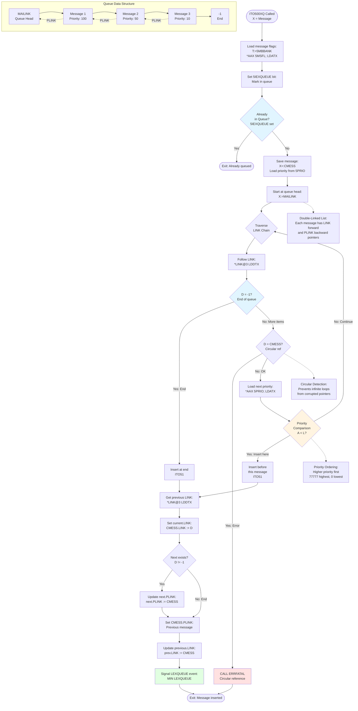

# CC-P2-N500.NPL API Documentation

**File:** Z:\NorskData\Source Code\Sintran L\NPL\CC-P2-N500.NPL
**Total Lines:** 806
**Total APIs/Subroutines:** 29+
**Related Files:** MP-P2-N500.NPL (Main ND-500 driver routines)

---

## ND-500 Interface Symbol Mappings

The ND-500 controller card uses IOX (I/O Execute) operations at specific offsets from the hardware device base address (HDEV). The following table maps IOX offsets to their symbolic names and functions:

| IOX Offset |  Octal | Enum                | Symbol                     | Comment                         |
| :--------: | :----: | :------------------ | :------------------------- | :------------------------------ |
|     +0     | 000000 | ReadMarX2           | `RMAR5`                    | Read MAR                        |
|     +1     | 000001 | LoadMarX2           | `LMAR5`                    | Load MAR                        |
|     +2     | 000002 | ReadStatusRegister  | `RSTA5`                    | Read status                     |
|     +3     | 000003 | LoadStatusRegister  | `LSTA5`                    | Load status                     |
|     +4     | 000004 | ReadControlRegister | `RCON5`                    | Read control                    |
|     +5     | 000005 | LoadControlRegister | `LCON5`                    | Load control                    |
|     +6     | 000006 | MasterClear         | `MCLR5`                    | Master clear                    |
|     +7     | 000007 | Terminate           | `TERM5`                    | Terminate                       |
|     +10    | 000010 | ReadTagIn           | `RTAG5`                    | Read tag                        |
|     +11    | 000011 | WriteTagOut         | `LTAG5`                    | Write tag                       |
|     +12    | 000012 | ReadLowerLimit      | `RLOW5`                    | Read lower limit                |
|     +13    | 000013 | WriteDataX          | `LDAT5` or `LLOW5`         | Load data / write lower         |
|     +14    | 000014 | ReadLockedMaybe     | `SLOC5`                    | Possibly "slot" / "status lock" |
|     +15    | 000015 | WriteData           | `BITM5`, `CLKD5`, or `S15` | Unclear — may depend on context |
|     +16    | 000016 | ReadLocked          | `UNLC5`                    | Unlock — plausible              |
|     +17    | 000017 | LastIOX             | `RETG5`                    | Return/End gate                 |

### Usage with HDEV Base Address

All IOX operations combine the hardware device base address (HDEV) with the appropriate symbol offset:

```assembly
T:=HDEV+RSTA5        ; Point to status register (HDEV+2)
*IOXT                ; Read status into A register

T:=HDEV+LCON5        ; Point to control register (HDEV+5)
A:=40; *IOXT         ; Write 40 to control register

T:=HDEV+UNLC5        ; Point to unlock register (HDEV+16)
*IOXT                ; Execute unlock operation
```

### Common Utility Level Usage

CC-P2-N500.NPL provides common utility routines that support ND-500 operations including:
- **5MCST/X5MCST**: Microcode stop using UNLC5, LCON5, and RETG5 registers
- **Inter-PIT communication**: CALLROUT mechanism for calling routines across PITs
- **Queue management**: Priority-ordered insertion and removal using message structures
- **Synchronization**: SLOCK/SUNLOCK using test-and-set for shared memory access

For more detailed symbol usage patterns, see **MP-P2-N500.md** which contains extensive documentation of ND-500 hardware interface operations including message dispatch, monitor calls, and driver-level control.

---

## File Overview and Purpose

CC-P2-N500.NPL is a companion module to MP-P2-N500.NPL that provides **common utility routines** and **inter-PIT communication functions** for the ND-500 subsystem in SINTRAN III. While MP-P2-N500.NPL contains the main driver kernel and monitor call handlers, CC-P2-N500.NPL provides:

1. **Process Management Utilities** - Semaphore checking, escape handling, abort processing
2. **Inter-PIT Communication** - CALLROUT mechanism for calling routines across different PITs (5PIT, MPIT, RPIT)
3. **Queue Management** - Insertion/removal of messages in ND-500 execution and time queues
4. **Low-Level Control** - CPU activation, locking, status management
5. **Device Support** - Terminal I/O integration, XMSG disconnect
6. **System Integration** - Filesystem/command processor interface, UECOM handling

**Key Design Pattern:** Many routines in CC-P2-N500.NPL act as **trampolines** that use the CALLROUT mechanism to invoke actual implementations on different PITs (particularly MPIT and RPIT), enabling proper privilege level separation.

---

## Relationship to MP-P2-N500.NPL

### Division of Responsibilities

| **CC-P2-N500.NPL (Common/Utility)** | **MP-P2-N500.NPL (Main Driver)** |
|-------------------------------------|----------------------------------|
| Process semaphore checking (FSEMA) | Main driver kernel (5STDRIV, N500) |
| Queue insertion/removal (ITO500XQ, IFM500XQ) | Message decoding (DECOMESS, MCHANDEL) |
| Inter-PIT calling (CALLROUT) | Monitor call processing (M516, M517, etc.) |
| Low-level activation (LOWACT500) | High-level activation (XACT500, XACTRDY) |
| Escape/abort handling (ESC5ON, 5BABORT) | Process restart (5RRTWT, 5XACTRT) |
| Locking primitives (SLOCK, SUNLOCK) | Swapper control (5ACTSWAPPER) |
| CPU datafield utilities (GCPUDF) | Driver-level I/O (NINSTR, NOUTSTR) |

### Cross-References from CC-P2-N500 to MP-P2-N500

The following CC-P2-N500 routines call or reference MP-P2-N500 routines:

1. **KICK500, TER500, IACT500, ACTRDY** (Lines 182-193) - Trampoline wrappers that use CALLROUT to invoke:
   - `0TER500` on alternative PIT (terminate ND-500)
   - `0ACT500` on alternative PIT (activate ND-500)
   - `0ACTRDY` on alternative PIT (process ready notification)

2. **RSTARTALL** (Line 193) - Calls `0RSTARTALL` via CALLROUT to restart all processes with error messages (implemented in MP-P2-N500 as XRSTARTALL)

3. **CLEAN** (Line 197) - Calls `0CLEAN` via CALLROUT for process cleanup

4. **MSINIT** (Line 198) - Calls `0MSINIT` via CALLROUT to initialize ND-500 data structures

5. **5ERACTIVATE, 5PRACTIVATE** (Lines 199-200) - Call corresponding routines on alternative PIT to reactivate ND-500 processes

6. **5XGBUFF, 5GBUFF, 5CONOMD** (Lines 201-203) - Buffer management and OMD routines

7. **ESC5ON** (Lines 43-56) - Sets up escape handling, then calls `ESC500` on monitor level (defined in MP-P2-N500)

8. **5BABORT** (Lines 69-88) - Prepares abort sequence, then continues in `FROMESC` on 5PIT

### Inter-Module Communication Pattern

```
Application Level (User Program)
        |
        v
CC-P2-N500 (Common utilities on 5PIT/Current PIT)
        |
        +--> CALLROUT mechanism (switches PITs)
        |
        v
MP-P2-N500 (Driver kernel on MPIT/RPIT/5PIT)
        |
        v
ND-500 Hardware
```

---

## API List by Line Number

### 1. **FSEMA** (Lines 21-26)

- **Line Range:** 21-26
- **Description:** Check if the program has reserved a ND-500 process
- **Execution Level:** User level (must be called with interrupt off or monitor level disabled when called from level 1)
- **Entry Parameters:**
  - D = RT-description address
- **Exit Parameters:**
  - EXIT: The program has not reserved any ND-500 process
  - EXIT+1: X = Process description of the reserved ND-500 process
- **Purpose:** Traverse the resource link chain to find ND-500 process descriptions
- **Assembly Analysis:**
  ```
  FSEMA: X:="BRESLINK"+D              % Start at resource link chain
         DO WHILE X:=X.RESLINK><D     % Traverse until back at RT-desc
            IF X>>="S500S"+5PRDSIZE AND X<<"S500E" THEN EXITA FI
         OD; EXIT
  ```
  This searches the circular resource link list for process descriptions in the ND-500 range [S500S+5PRDSIZE, S500E)

---

### 2. **ESC5ON** (Lines 43-56)

- **Line Range:** 43-56
- **Description:** User level subroutine to ESCON in SINTRAN III
- **Execution Level:** User level (called with interrupt off)
- **Entry Parameters:**
  - X = Terminal datafield
  - A = FLAGB
- **Exit Parameters:**
  - EXIT: Exit from ESCON, A = FLAGB in terminal datafield
  - EXIT+1: Continue in ESCON
- **Purpose:** Handle escape key processing from terminal
- **Key Operations:**
  1. Find ND-500 process in reservation queue
  2. Check message buffer for escape/break flag (5IBRK bit)
  3. If break detected, return to caller
  4. If not, start ESC500 on monitor level with process message
  5. Set 5ESCON flag in process status
- **Cross-Reference:** Calls `ESC500` in MP-P2-N500.NPL (line 55 of MP-P2-N500)

#### Escape Processing Sequence

```mermaid
sequenceDiagram
    participant User as User Program
    participant Terminal as Terminal Driver
    participant ESC5ON as ESC5ON (CC)
    participant Resource as Resource Queue
    participant Message as Message Buffer
    participant ESC500 as ESC500 Driver (MP)
    participant Process as ND-500 Process
    participant XCLEAN as XCLEAN Cleanup

    User->>Terminal: Press ESCAPE key
    Terminal->>ESC5ON: Call ESC5ON<br/>X=Terminal DF<br/>A=FLAGB

    ESC5ON->>Resource: Find ND-500 process<br/>Search BRESLINK chain
    Resource-->>ESC5ON: X=Process descriptor

    alt No ND-500 Process
        ESC5ON->>User: Exit: No process found
    else ND-500 Process Found
        ESC5ON->>Message: Check 5IBRK bit<br/>T:=5MBBANK<br/>*AAX 5MSFL; LDATX

        alt Break Already Detected
            Message-->>ESC5ON: 5IBRK bit set
            ESC5ON->>Terminal: Return FLAGB<br/>Exit (no skip)
        else No Break Yet
            Message-->>ESC5ON: 5IBRK bit clear

            ESC5ON->>ESC5ON: Set 5ESCON flag<br/>in process status
            ESC5ON->>ESC500: Switch to monitor level<br/>Call ESC500
            Note over ESC500: MP-P2-N500.NPL<br/>Main driver ESC500<br/>line 55

            ESC500->>ESC500: Process escape request:<br/>- Check process state<br/>- Validate message<br/>- Prepare for cleanup

            alt Process Can Be Interrupted
                ESC500->>Process: Set abort flag<br/>Mark for termination
                Process->>Process: Save state

                ESC500->>XCLEAN: Call XCLEAN<br/>Resource cleanup
                Note over XCLEAN: RP-P2-N500.NPL<br/>XCLEAN routine<br/>lines 662-719

                XCLEAN->>XCLEAN: Remove from waiting queue<br/>5MWQU traversal
                XCLEAN->>XCLEAN: Free datafields<br/>from READYQ
                XCLEAN->>XCLEAN: Mark disk queue<br/>requests inactive
                XCLEAN-->>ESC500: Cleanup complete

                ESC500->>Process: Terminate process<br/>Release resources
                Process-->>User: Return to monitor
            else Process Cannot Be Interrupted
                ESC500->>Message: Set 5IBRK flag<br/>for later handling
                ESC500-->>ESC5ON: Deferred interrupt
            end

            ESC5ON->>Terminal: Exit+1: Continue ESCON
            Terminal-->>User: Process interrupted
        end
    end

    note right of ESC5ON
        Integration Points:
        - User level: ESC5ON entry
        - Monitor level: ESC500 driver
        - RT level: XCLEAN cleanup
        - Handles break/escape gracefully
    end note

    note left of XCLEAN
        Cleanup Operations:
        1. Remove from 5MWQU
        2. Free READYQ datafields
        3. Clear disk queue (BFQUE)
        4. Release all resources
        5. Terminate shadow process
    end note
```

---

### 3. **FESC1** (Lines 59-60)

- **Line Range:** 59-60
- **Description:** Empty stub for escape handling continuation
- **Purpose:** Placeholder for future implementation or patching point

---

### 4. **5BABORT, M5BABORT** (Lines 69-88)

- **Line Range:** 69-88
- **Description:** Subroutine called from ABORT-BATCH and ABORT-JOB commands
- **Execution Level:** Called on SPIT; continues on 5PIT if ND-500
- **Entry Parameters:** None (uses RTREF for current program)
- **Exit Parameters:** Not specified
- **Purpose:** Start cleaning-up (log-off) ND-500 process
- **Key Operations:**
  1. **5BABORT** (Lines 70-82):
     - Search for ND-500 process in resource link chain
     - Switch to 5PIT
     - Save return address (L reg) in message buffer at LRET offset
     - Save B register for later restoration
     - Load process description
     - Set A=1 to indicate ABORT-JOB/ABORT-BATCH
     - Continue in FESC1/FROMESC on 5PIT
  2. **M5BABORT** (Lines 85-87):
     - Monitor level entry point
     - Switch back to SPIT
     - Return to MONEN
- **Assembly Analysis:**
  ```
  5BABORT:  RTREF+"BRESLINK"                           % Get resource link
           DO WHILE A.RESLINK<<"S500S" OR A>>="S500E"  % Find ND-500 process
              IF A=RTREF THEN EXIT FI
           OD; A=:D
           "N5PIT+ADPIT+ALEVB+ERNG2"
           A=:RTREF.ACTPRI; *TRR PCR                   % Switch to 5PIT
           T:=5MBBANK; X:=D.MESSBUFF                   % Get message buffer
           A:=L; *AAX LRET; STATX                      % Save return address
           A:=B; *AAX 5BRG-LRET; STATX                 % Save B register
           *AAX XADPR-5BRG; LDXTX                      % Load process desc
           A:=1                                        % Indicate abort
           GO FESC1                                    % Continue
  ```

---

### 5. **CALLROUT, R5PIT, RRPIT, RMPIT** (Lines 102-134)

- **Line Range:** 102-134
- **Description:** Routine to call a routine on another PIT (Privilege Instruction Table)
- **Execution Level:** Can be called from any level
- **Entry Parameters:**
  - T = Routine number (index into routine vector)
  - DPIT must be alternative PIT
- **Exit Parameters:**
  - D = Original return address (passed to called routine)
  - T, D registers destroyed
- **Purpose:** **Critical inter-PIT communication mechanism** - enables calling routines on RPIT/MPIT/5PIT
- **Variables:**
  - TREG, AREG, XREG: Saved registers
  - CLVL: Current level (from PCR)
- **Key Operations:**
  1. Save interrupt state (K-bit from status register)
  2. Save all registers
  3. Read current PCR to get normal PIT
  4. Use GOVECTOR to determine target PIT for routine
  5. Switch to new PIT if different
  6. Use GOVECTOR to get routine address
  7. Call routine with T register pointing to code
  8. Return points (R5PIT, RRPIT, RMPIT) restore original PIT
- **Return Entry Points:**
  - **R5PIT** (Line 122): Return from RPIT to 5PIT
  - **RMPIT** (Line 123): Return from MPIT to 5PIT
  - **RRPIT** (Line 124): Return from RPIT to original

#### Inter-PIT Communication Sequence

```mermaid
sequenceDiagram
    participant Caller as Calling Routine<br/>(Any PIT)
    participant CALLROUT as CALLROUT Mechanism
    participant Vector as GOVECTOR/RETVECTOR<br/>Tables
    participant TargetPIT as Target PIT<br/>(RPIT/MPIT/5PIT)
    participant Routine as Target Routine
    participant Return as Return Handler

    Caller->>CALLROUT: Call with T=routine number
    Note over CALLROUT: Save ION/IOF state<br/>in K-bit

    CALLROUT->>CALLROUT: Save registers:<br/>TREG, AREG, XREG
    CALLROUT->>CALLROUT: Read PCR to get<br/>current PIT and level

    CALLROUT->>Vector: GOVECTOR(T*2)<br/>Get target PIT
    Vector-->>CALLROUT: Return target PIT

    alt PIT Switch Needed
        CALLROUT->>CALLROUT: Build new PCR:<br/>ADPIT+ERNG2+level
        Note over CALLROUT: If level = 0:<br/>Use RTREF.ACTPRI

        CALLROUT->>TargetPIT: TRR PCR<br/>Switch to target PIT
        Note over TargetPIT: Level 1 -> Level 12<br/>or vice versa

        CALLROUT->>Vector: RETVECTOR lookup<br/>Get return handler address
        Vector-->>CALLROUT: Return handler (R5PIT/RRPIT/RMPIT)
        CALLROUT->>CALLROUT: Store return handler in L
    end

    CALLROUT->>Vector: GOVECTOR(T*2+1)<br/>Get routine address
    Vector-->>CALLROUT: Routine address in T

    CALLROUT->>CALLROUT: Restore registers:<br/>AREG, XREG
    CALLROUT->>CALLROUT: Restore ION/IOF state

    CALLROUT->>Routine: T=P<br/>Call target routine
    Note over Routine: Execute on target PIT<br/>with full privileges

    Routine-->>Return: Return to handler<br/>(R5PIT/RRPIT/RMPIT)

    alt Return to 5PIT from RPIT
        Return->>Return: R5PIT: Build PCR for 5PIT
    else Return to 5PIT from MPIT
        Return->>Return: RMPIT: Build PCR for 5PIT
    else Return to original from RPIT
        Return->>Return: RRPIT: Restore original PIT
    end

    Return->>Caller: TRR PCR<br/>Return to original PIT
    Note over Caller: Execution continues<br/>in original context

    note right of CALLROUT
        Vector Table Structure:
        - GOVECTOR(even): Target PIT
        - GOVECTOR(odd): Routine address
        - RETVECTOR: Return handlers
    end note

    note right of TargetPIT
        PIT Switching enables:
        - Level 1 (user) -> Level 12 (driver)
        - Monitor PIT (MPIT) operations
        - RT-Program PIT (RPIT) operations
    end note
```
- **Assembly Analysis:**
  ```
  CALLROUT: A=:D; *TRA STS; IOF; BLDA 170 DA      % Save ION/IOF state in K-bit
        T=:TREG:=D=:AREG; X=:XREG                 % Save registers
        A SH -5/\170=:CLVL; *TRA PGC              % Get current level from PCR
        A/\74000=:D                               % Extract normal PIT
        TREG*2; GOVECTOR(A)                       % Get target PIT from vector table
        IF A><D THEN                              % Need to switch PIT?
           A=:T:="ADPIT+ERNG2"\/CLVL; T\/A        % Build new PCR with target PIT
           CLVL-ALEVB:=:T
           IF T=0 THEN A=:RTREF.ACTPRI FI; *TRR PCR  % Switch PIT
           A:=D SH -13/\17; RETVECTOR(A)          % Get return point address
           L=:D:=A                                % Setup return
        FI
        TREG*2+1; T:=GOVECTOR(A)                  % Get routine address (odd entry)
        AREG; X:=XREG                             % Restore registers
        IF K THEN *ION FI; T=:P                   % Call with original ION/IOF state
  ```
- **Vector Table Structure:**
  - Even indices (T*2): Target PIT for routine
  - Odd indices (T*2+1): Routine address

---

### 6. **5IORESTART** (Lines 136-137)

- **Line Range:** 136-137
- **Description:** Stub for I/O restart handling
- **Purpose:** Called when process no longer has ND-500 reservation

---

### 7. **KICK500, TER500, IACT500, ACTRDY, RSTARTALL, IBMOVE, CLEAN, MSINIT, 5ERACTIVATE, 5PRACTIVATE, 5XGBUFF, 5GBUFF, 5CONOMD** (Lines 179-204)

- **Line Range:** 179-204
- **Description:** Trampoline routines that use CALLROUT to invoke implementations on other PITs
- **Execution Level:** Various
- **Purpose:** Provide unified entry points that delegate to actual implementations
- **Patch Points:**
  - `*NNJ00` (Line 183): Direct exit for "old" ND-500 models
  - `*NNJ01` (Line 190): Direct exit for "old" ND-500 models
- **Individual Routines:**

  1. **KICK500** (Lines 183-185):
     - Entry: None
     - Exit: Direct exit if old 500
     - Exit+1: Sends Octobus kick to ND-500
     - Calls: `0KICK500` via CALLROUT

  2. **TER500** (Lines 186-187):
     - Entry: X = -1 (no message) or X><-1 (actual message)
     - Exit: Error, ND-500 not terminated
     - Exit+1: OK, ND-500 stopped
     - Checks: `5CPUSTOPPED` flag before proceeding
     - Calls: `0TER500` via CALLROUT (implemented as XTER500 in MP-P2-N500)

  3. **IACT500** (Line 188):
     - Purpose: Common activate for ND500/ND5000
     - Calls: `0ACT500` via CALLROUT (implemented as XACT500 in MP-P2-N500)

  4. **ACTRDY** (Lines 189-192):
     - Purpose: Process ready; activate ND5000 (exit is patched in if ND500)
     - Patch Point: `*NNJ01` for old 500 models
     - Calls: `0ACTRDY` via CALLROUT (implemented as XACTRDY in MP-P2-N500)

  5. **RSTARTALL** (Line 193):
     - Entry: A = Error code
     - Purpose: Restart all processes with error message
     - Calls: `0RSTARTALL` via CALLROUT (implemented as XRSTARTALL in MP-P2-N500)

  6. **IBMOVE** (Lines 194-196):
     - Entry: X = Terminal datafield (resident part), IN5MSG = ND-500 msg waiting
     - Purpose: Move bytes from terminal input buffer to ND-500 buffer
     - Operations:
       - Calls FSEMA to check if program still has reserved ND-500 process
       - If no reservation, goes to 5IORESTART
       - Otherwise calls `0IBMOVE` via CALLROUT

  7. **CLEAN** (Line 197):
     - Purpose: 5MTRANS routine to clean up on process termination
     - Calls: `0CLEAN` via CALLROUT

  8. **MSINIT** (Line 198):
     - Purpose: Initialize ND-500 data structures (moved to MPIT)
     - Calls: `0MSINIT` via CALLROUT

  9. **5ERACTIVATE** (Line 199):
     - Entry: X = Process description (interrupt must be off)
     - Purpose: Reactivate a ND-500 process
     - Calls: `05ERACTIVATE` via CALLROUT

  10. **5PRACTIVATE** (Line 200):
      - Entry: X = Process description (interrupt must be off)
      - Purpose: Reactivate a ND-500 process
      - Calls: `05PRACTIVATE` via CALLROUT

  11. **5XGBUFF** (Line 201):
      - Purpose: Get buffer operations
      - Calls: `05XGBUFF` via CALLROUT

  12. **5GBUFF** (Line 202):
      - Purpose: Get buffer operations
      - Calls: `05GBUFF` via CALLROUT

  13. **5CONOMD** (Line 203):
      - Purpose: Connect OMD operations
      - Calls: `05CONOMD` via CALLROUT

---

### 8. **5MCST, X5MCST** (Lines 212-218)

- **Line Range:** 212-218
- **Description:** Subroutine to stop N500 (Micro stop)
- **Execution Level:** Not specified
- **Entry Parameters:**
  - X5MCST: Uses HDEV
  - 5MCST: T = Device base address
- **Exit Parameters:** None
- **Purpose:** Perform hardware microcode stop of ND-500
- **Key Operations:**
  1. Unlock device (T+UNLC5) - IOX at offset +16
  2. Disable TAG-IN decoding (write 40 to LCON5) - IOX at offset +5
  3. Write 2 to RETG5 register - IOX at offset +17
- **Assembly Analysis:**
  ```
  X5MCST: T:=HDEV                      % Get device base address
  5MCST: T+UNLC5; *IOXT                % Execute IOX at HDEV+16 (UNLOCK)
         A:=40; T+"LCON5-UNLC5"; *IOXT % Execute IOX at HDEV+5 (disable TAG-IN)
         A:=2;  T+"RETG5-LCON5"; *IOXT % Execute IOX at HDEV+17 (write to RETG5)
         EXIT
  ```

This routine demonstrates typical IOX operation sequencing: adjusting the T register offset relative to HDEV to target specific controller registers. See the "ND-500 Interface Symbol Mappings" section for all available IOX operations.

---

### 9. **ITO500XQ** (Lines 232-267)

- **Line Range:** 232-267
- **Description:** Insert message in the N500 execution queue (priority-ordered)
- **Execution Level:** Called from other levels than driver in IOF
- **Entry Parameters:**
  - X = Message to insert in queue
- **Exit Parameters:** None
- **Prerequisites:** The N100/N500 general semaphore must be locked
- **Variables:**
  - CMESS: Current message address
  - LREG: Saved L register (priority of message to insert)
- **Purpose:** Insert ND-500 message into priority-ordered execution queue
- **Patch Points:**
  - `*NNC01`, `*NNC02`, `*NNC03`: CNVBYADR/CNVWADR conversion points
- **Key Operations:**
  1. Load message flags and mark process in execution queue (5IEXQUEUE bit)
  2. If already in queue, exit immediately
  3. Save message priority from message.5PRIO field
  4. Traverse MAILINK chain to find insertion point
  5. Insert before first message with lower priority
  6. Update forward (LINK) and backward (PLINK) pointers
  7. Signal LEXQUEUE event

#### Queue Management Flowchart


- **Assembly Analysis:**
  ```
  ITO500XQ:
       T:=5MBBANK; *AAX 5MSFL; LDATX                    % Get message flags
       A=:D BONE 5IEXQUEUE; *STATX; AAX -5MSFL          % Set in-queue bit
       IF D BIT 5IEXQUEUE THEN EXIT FI                  % Already in queue?
       A:=L=:"LREG"; X=:CMESS                           % Save priority
       *AAX 5PRIO; LDATX                                % A = message priority
       A=:L; T:=5MBBANK; X:=MAILINK                     % Start at queue head
       DO
          *LINK@3 LDDTX                                 % Follow LINK chain
       WHILE D><-1                                      % Until end (-1)
          IF D=CMESS THEN CALL ERRFATAL FI              % Circular ref check
          T:=A; X:=:D
          *AAX 5PRIO; LDATX; AAX -5PRIO                 % Get next priority
          IF A<L THEN                                   % Insert here?
             X:=D; GO ITO51                             % Yes, insert before
          FI
       OD
  ITO51: T:=5MBBANK; *LINK@3 LDDTX                     % Get previous.LINK
       X=:L:=CMESS; *LINK@3 STDTX                       % Set current.LINK
       IF D><-1 THEN
          T:=A; X=:A:=D; *AAX PLINK; STATX              % Update backward link
       FI
       T:=5MBBANK; X:=CMESS; A:=L
       *AAX PLINK; STATX; AAX -PLINK                    % Set message PLINK
       A:=T; D:=X
       X:=L; *LINK@3 STDTX                              % Update previous.LINK
       MIN LEXQUEUE; 0/\0                               % Signal event
       X:=CMESS; GO LREG
  ```
- **Data Structure:** Doubly-linked priority queue with head at MAILINK

---

### 10. **IFM500XQ, FR5TMQ** (Lines 286-306)

- **Line Range:** 286-306
- **Description:** Remove message from ND-500 execution queue or time queue
- **Execution Level:** Called from lower levels than driver in IOF
- **Entry Parameters:**
  - X = Message to remove
  - B = N500 CPU-datafield
- **Exit Parameters:** None
- **Prerequisites:** The N100/N500 general semaphore must be locked
- **Variables:**
  - CMESS: Current message address
- **Purpose:** Remove message from doubly-linked queue structures
- **Patch Point:**
  - `*NNC04`: CNVBYADR conversion point
- **Key Operations:**
  1. **IFM500XQ** (Lines 289-294):
     - Clear 5IEXQUEUE bit in message flags
     - Exit if message not in execution queue
     - Decrement LEXQUEUE counter
     - Fall through to FELLS
  2. **FR5TMQ** (Lines 295-299):
     - Clear 5ITMQUEUE bit in message flags
     - Exit if message not in time queue
     - Fall through to FELLS
  3. **FELLS** (Lines 299-306):
     - Update forward link of previous element
     - Update backward link of next element (if exists)
     - Return with X = removed message
- **Assembly Analysis:**
  ```
  IFM500XQ:
       T:=5MBBANK; *AAX 5MSFL; LDATX
       A=:D BZERO 5IEXQUEU; *STATX; AAX -5MSFL          % Clear in-queue bit
       IF D NBIT 5IEXQUEUE THEN EXIT FI                 % Not in queue?
       IF LEXQUEUE-1<0 THEN A:=0 FI; A=:LEXQUEUE        % Decrement counter
       GO FELLS
  FR5TMQ:
       T:=5MBBANK; *AAX 5MSFL; LDATX
       A=:D BZERO 5ITMQUEUE; *STATX; AAX -5MSFL         % Clear time-queue bit
       IF D NBIT 5ITMQUEUE THEN EXIT FI                 % Not in time queue?
  FELLS: T:=5MBBANK; X=:CMESS
       *LINK@3 LDDTX; AAX PLINK; LDXTX; LINK@3 STDTX    % prev.LINK = curr.LINK
       IF D><-1 THEN
          T:=A; X=:A:=D; *AAX PLINK; STATX              % next.PLINK = curr.PLINK
       FI
       X:=CMESS; EXIT
  ```

---

### 11. **LOWACT500, XLOWACT500** (Lines 318-326)

- **Line Range:** 318-326
- **Description:** Activate N500 from lower levels than driver level
- **Execution Level:** Must be called with interrupt off
- **Entry Parameters:**
  - B = ND500 CPU datafield
- **Exit Parameters:** None
- **Purpose:** Activate ND-500 driver from interrupt or low-level code
- **Patch Point:**
  - `*NNJ03` (Line 320): Direct exit for ND5000 (not needed for ND5000)
- **Key Operations:**
  1. Save CPU datafield in LV12B DB (Level 12 B register)
  2. Set Level 12 P register to 5STDRIV (driver entry point)
  3. Activate Level 12 (driver level)
- **Assembly Analysis:**
  ```
  LOWACT500:
  *NNJ03=*
       EXIT                                % Direct exit if nd5000
  XLOWACT500:
       A:=B; *IRW LV12B DB                 % Save CPU datafield in level 12 B-reg
       "5STDRIV"; *IRW LV12B DP            % Set level 12 P-reg to driver entry
       LV12; *MST PID; EXIT                % Activate level 12
  ```
- **Cross-Reference:** Activates 5STDRIV in MP-P2-N500.NPL (line 656)

---

### 12. **SETIOWAIT** (Lines 336-345)

- **Line Range:** 336-345
- **Description:** Sets the calling program in I/O wait state
- **Execution Level:** Any level
- **Entry Parameters:**
  - X = Address of current process description
- **Exit Parameters:** None
- **Purpose:** Put ND-500 shadow process in I/O wait until ND-500 driver restarts it
- **Key Operations:**
  1. Disable interrupts
  2. Check if process has buffer flag (F5BUFF) set
  3. If not buffered:
     - Set 5REWA flag in process status (mark for driver restart)
     - Set 5WAIT flag in RT-description status (I/O wait)
     - Call RWAIT on monitor level to activate next process
     - Activate monitor level
  4. Re-enable interrupts
- **Assembly Analysis:**
  ```
  SETIOWAIT: *IOF
       IF X.PSTAT NBIT F5BUFF THEN                      % Not buffered?
          A BONE 5REWA=:X.PSTAT                         % Mark for driver restart
          RTREF.STATUS BONE 5WAIT=:X.STATUS             % Set I/O-wait
          "RWAIT"; *IRW MLEVB DP                        % Call RWAIT
          MLEV; *MST PIE; MST PID                       % Activate monitor level
       FI; *ION
       EXIT
  ```
- **Flags:**
  - F5BUFF: Process has buffer (no wait needed)
  - 5REWA: Restart by ND-500 driver
  - 5WAIT: I/O wait state

---

### 13. **MONICO, EMONICO, OKMONICO, MCCO** (Lines 359-372)

- **Line Range:** 359-372
- **Description:** Subroutines to restart a ND-500 process after a monitor call
- **Execution Level:** Driver level
- **Entry Parameters:**
  - X = Message address
  - A = Function value (return value)
  - D = Secondary return value
  - T = K flip-flop (error flag)
- **Exit Parameters:** None
- **Variables:**
  - KKFLIP: Saved K (error) flag
- **Purpose:** Complete monitor call and restart ND-500 process
- **Individual Routines:**
  1. **EMONICO** (Line 361):
     - Entry point for error return
     - Sets A=D=0, T=1 (error flag)
     - Falls through to MONICO
  2. **OKMONICO** (Line 362):
     - Entry point for success return
     - Sets T=0 (no error), A=D=0
     - Falls through to MONICO
  3. **MONICO** (Lines 363-366):
     - Saves function value in message.FUNCV
     - Saves error flag in message.KFLIP
     - Clears message.NUMPA (number of parameters)
     - Sets 3MONCO flag and XMICF (restart after monitor call)
     - Falls through to MCCO
  4. **MCCO** (Lines 367-372):
     - Sets H500A flag (140300 octal)
     - Writes ND-500 status
     - Loads process description from message.XADPR
     - Sets process active (5ACTIVE flag) and clears run status
     - Returns with X = message
- **Assembly Analysis:**
  ```
  EMONICO:  A=:D:=0; T:=1; GO MONICO                    % Error path
  OKMONICO: T:=0; A:=0; D:=0                            % Success path
  MONICO:   T=:KKFLIP:=5MBBANK; *AAX FUNCV; STDTX       % Save function value
            A:=KKFLIP; *AAX KFLIP-FUNCV; STATX          % Save error flag
            *AAX NUMPA-KFLIP; STZTX                     % Clear param count
            3MONCO; *AAX -NUMPA; STATX XMICF            % Restart after moncall
  MCCO:     T:=5MBBANK; 140300; *AAX H500A; STATX; AAX -H500A
            L=:D; MSGN500; CALL WN5STATUS; L:=D         % Write status
            T:=5MBBANK; X=:D; *AAX XADPR; LDXTX         % Load process desc
            X.PSTAT/\5CLRUNSTATUS+5ACTIVE=:X.PSTAT      % Set active, clear run status
            X:=D; EXIT
  ```

---

### 14. **FSYSINTERFACE, TS3COMPROC** (Lines 394-418)

- **Line Range:** 394-418
- **Description:** Interface to call SINTRAN III filesystem and command segment routines from ND-500
- **Execution Level:** Driver level (switches to FPIT/SPIT)
- **Entry Parameters:**
  - X = Logical address of ND-500 message
  - Register values in message (input parameters to filesystem routines)
- **Exit Parameters:**
  - EXIT: Normal return from filesystem routine
  - EXIT+1: Skip return from filesystem routine
  - T, A, D, X = Values returned from filesystem routine
- **Variables:**
  - OFLDX: Pointer to OFLCK (stack lock)
  - SEG5: Saved segment
- **Purpose:** Enable ND-500 system monitor to call SINTRAN III OS services
- **Individual Routines:**
  1. **TS3COMPROC** (Line 398):
     - Entry point for S3 command segment calls
     - Sets T=5OPSEG (segment for command processor)
     - Falls through to IFSYINIT
  2. **FSYSINTERFACE** (Lines 399-400):
     - Entry point for filesystem calls
     - Sets T=0 (no segment switching)
     - Locks RT-program stack (OFLCK)
     - Falls through to IFSYINIT
  3. **IFSYINIT** (Lines 401-417):
     - Saves CPU datafield
     - Switches segment if needed (for S3OPCOM)
     - Switches to NFPIT (filesystem PIT) or NSPIT (command segment PIT)
     - Resets stack pointer
     - Loads TAD and X registers from message (5TADRG, 5XRG)
     - Calls FSYSENTRY with register values
     - Saves return parameters back to message
     - Restores segment and PIT
     - Unlocks stack if needed
     - Sets up skip return based on 5ERRFLAG
- **Assembly Analysis:**
  ```
  TS3COMPROC: T:=5OPSEG; A:=L=:5LREG; GO IFSYINIT       % S3 command segment
  FSYSINTERFACE: T:=0                                   % Filesystem (no segment)
       A:=L=:5LREG; OFLDX; CALL XLOCK                   % Lock stack
  IFSYINIT: X=:B; T=:SEG5
       IF T=0 THEN
          "NFPIT+ADPIT+ALEVB+ERNG2"                     % Filesystem PIT
       ELSE
          CALL M1MEXY; T=:SEG5                          % Switch to S3.OPCOM segment
          "NSPIT+ADPIT+ALEVB+ERNG2"                     % Command segment PIT
       FI; A=:CURPROG.ACTPRI; *TRR PCR                  % Switch PIT
       "STACK"=:CSTCK                                   % Reset stack
       TAD:=5TADRG; X:=5XRG; 0=:5ERRFLAG; CALL FSYSENTRY % Call filesystem
       MIN 5ERRFLAG                                     % Mark skip return
       TAD=:5TADRG; X=:5XRG                             % Save return values
       IF T:=SEG5><0 THEN CALL M1MEXY FI                % Restore segment
       "N5PIT+ADPIT+ALEVB+ERNG2"=:CURPROG.ACTPRI; *TRR PCR % Reset to 5PIT
       IF XADPROC.PSTAT NBIT OFLDUNLOCK THEN OFLDX; CALL XUNLOCK FI
       5LREG=:L; IF 5ERRFLAG=0 THEN L+1 FI              % Setup skip return
       TAD:=5TADRG; A=:5AREG; X:=5XRG; DBASE=:B; A=:5AREG
       EXIT
  ```

---

### 15. **X5DCN** (Lines 431-449)

- **Line Range:** 431-449
- **Description:** Disconnect from XMSG on level 1
- **Execution Level:** Level 1
- **Entry Parameters:**
  - A = Process description
- **Exit Parameters:** ION
- **Variables:**
  - AREG, LREG: Saved registers
- **Purpose:** Disconnect XMSG XT-block and activate driver level disconnect routine
- **Key Operations:**
  1. Disable interrupts
  2. Save registers
  3. Get message buffer from process description
  4. Check if XT-block exists (XTBLK field)
  5. If XT-block exists:
     - Clear XTBLK field
     - Save L register in LV12B DL
     - Get CPU datafield
     - Save CPU datafield in LV12B DB
     - Set P register to P12DCN (driver disconnect routine)
     - Activate Level 12 (driver level)
  6. Restore registers
  7. Re-enable interrupts
- **Assembly Analysis:**
  ```
  X5DCN: *IOF
       A=:AREG:=L=:LREG
       T:=5MBBANK
       X:=AREG.MESSBUFF                        % Get message buffer
       *AAX XTBLK; LDATX                       % Get XT-block
       IF A >< 0 THEN                          % XT-block exists?
             *STZTX; AAX -XTBLK                % Clear XTBLK
             *IRW LV12B DL                     % Save L in level 12
             CALL GCPUDF; CALL ERRFATAL        % Get CPU datafield
             *IRW LV12B DB                     % Save in level 12 B-reg
             "P12DCN"; *IRW LV12B DP           % Set driver disconnect routine
             LV12; *MST PID                    % Activate driver level
       FI; A:=AREG
       LREG=:L
       *ION
       EXIT
  ```
- **Cross-Reference:** Activates P12DCN in MP-P2-N500.NPL (line 3746)

---

### 16. **5CSETDV** (Lines 463-471)

- **Line Range:** 463-471
- **Description:** Call SETDV on a splitted-datafield device
- **Execution Level:** Called from 5PIT
- **Entry Parameters:**
  - T = Function code for SETDV
  - A = Address of SETDV routine
  - X = Resident datafield
  - Interrupt is off
- **Exit Parameters:** None
- **Variables:**
  - LREG: Saved L register (SETDV routine address)
- **Purpose:** Switch to RPIT to call device SETDV routine, then return to 5PIT
- **Key Operations:**
  1. Save SETDV routine address in L
  2. Switch to RPIT
  3. Setup registers: A=function code, X=datafield, L=routine address
  4. Call routine at L
  5. Switch back to 5PIT
  6. Return
- **Assembly Analysis:**
  ```
  5CSETDV: A:=:L=:"LREG"
       X=:D; "NRPIT+ADPIT+ALEVB+ERNG2"=:RTREF.ACTPRI; *TRR PCR % Switch to RPIT
       A:=T; X:=D; L:=:P                       % A=function, X=datafield, call routine
       X=:D; "N5PIT+ADPIT+ALEVB+ERNG2"; *TRR PCR    % Switch back to 5PIT
       A=:RTREF.ACTPRI
       X:=D; GO LREG
  ```

---

### 17. **L3STDV** (Lines 481-491)

- **Line Range:** 481-491
- **Description:** Monitor function to start terminal output driver
- **Execution Level:** Monitor level (activated from STTDRIV on MPIT)
- **Entry Parameters:**
  - X = Terminal datafield
- **Exit Parameters:** Goes to MONEN
- **Purpose:** Start terminal driver on RPIT using window mechanism
- **Key Operations:**
  1. Disable interrupts
  2. Extract bank number and physical page from terminal datafield
  3. Build logical address in window WND41 (142000 octal)
  4. Setup terminal window entry
  5. Switch to RPIT
  6. Call STDEV (start device driver)
  7. Switch back to MPIT
  8. Clear terminal window entry
  9. Go to MONEN
- **Assembly Analysis:**
  ```
  L3STDV: *IOF
       AD:=X.DTDFPHPAGE                        % A=bank, D=physical page
       A:=:D/\1777+"WND41*2000"=:B:=142000     % B=logical addr in window
       T:=0; X:="WND41+WND41+174000"; *STDTX   % Setup window entry
       "NRPIT+ADPIT+MLEVB+ERNG2"; *TRR PCR     % Switch to RPIT
       CALL STDEV                              % Start terminal driver
       "NMPIT+ADPIT+MLEVB+ERNG2"; *TRR PCR     % Switch back to MPIT
       T:=0; X:="WND41+WND41+174000"; *STZTX   % Clear window entry
       GO MONEN
  ```

---

### 18. **SPITMQ** (Lines 501-511)

- **Line Range:** 501-511
- **Description:** Start process currently in time queue
- **Execution Level:** Not specified
- **Entry Parameters:**
  - X = Message to restart
  - A = Restart reason
- **Exit Parameters:** None
- **Variables:**
  - SPIRET: Saved return address
- **Purpose:** Restart ND-500 process from time queue with reason code
- **Key Operations:**
  1. Save return address
  2. Clear restart reason if -1
  3. Store reason in message.5ADP3
  4. Set NUMPA=4 (number of parameters)
  5. Clear FUNCV and KFLIP fields
  6. Set 3MONCO flag and MICFU (restart after monitor call function)
  7. Call MCCO to complete restart
- **Assembly Analysis:**
  ```
  SPITMQ: T:=L=:"SPIRET"
       A=:D; IF A><-1 THEN A:=0 FI             % Clear if -1
       T:=5MBBANK; *AAX 5ADP3; STDTX           % Store reason
       A:=4; *AAX NUMPA-5ADP3; STATX           % 4 parameters
       A:=0=:D; *AAX FUNCV-NUMPA; STDTX        % Clear function value
       *AAX KFLIP-FUNCV; STZTX; AAX -KFLIP     % Clear error flag
       3MONCO; *MICFU@3 STATX                  % Set restart flag
       CALL MCCO; GO SPIRET
  ```

---

### 19. **XNW5ST, NW5ST, PNW5ST, INW5ST** (Lines 528-577)

- **Line Range:** 528-577
- **Description:** No-wait ND-500 start routines
- **Execution Level:** Called on break in IOF
- **Entry Parameters:**
  - XNW5ST: X = RTRES (from RTREF)
  - PNW5ST: B = Address of "big" terminal datafield
  - NW5ST: B = Address of resident datafield
- **Exit Parameters:**
  - EXIT: ND-500 process restarted
  - EXIT+1: ND-500 process not restarted
- **Variables:**
  - NWFLAG: Flag indicating call type
  - NWBSAVE: Saved B register
  - NWPROC: Process description
  - NWSTATUS: Process status
  - NW5RET: Return address
- **Purpose:** Restart ND-500 process on terminal break when in no-wait mode
- **Key Operations:**
  1. **Entry point selection:**
     - XNW5ST: From RT-description, NWFLAG=1
     - PNW5ST: From terminal datafield pointer
     - NW5ST: From resident datafield
     - INW5ST: Common entry, NWFLAG=0
  2. **Validation:**
     - Check if X (RTRES) is non-zero
     - Check if process not in wait queues (WLINK=0, TLINK=0, not 5RWAIT)
     - Call FSEMA to find ND-500 process reservation
  3. **Status check:**
     - Get process status from message buffer
     - Check if process has T5BUF flag (buffered)
     - If not buffered, read ND-500 status (RN5STATUS)
  4. **Restart logic:**
     - If status is I5TMQU (in time queue):
       - Remove from time queue (FR5TMQU)
       - Call SPITMQU to restart with reason 1
       - Terminate ND-500 (TER500)
       - Lock execution queue (SLOCK)
       - Insert in execution queue (ITO500XQ)
       - Unlock (SUNLOCK)
       - Activate ND-500 (IACT500)
     - If status is STOPPED:
       - Restart after monitor call (OKMONICO)
       - Activate ND-500
  5. **Priority handling:**
     - Set 55BRKPRIOR flag in process status
     - Set 5BRKF flag in RT-description status
- **Patch Points:**
  - `*NNT01` (Line 549): TER500 call point
  - `*NNJ04` (Line 558): Branch point for ND5000
- **Assembly Analysis:**
  ```
  XNW5ST: A:=L=:"NW5RET"; X:=RTRES; A:=1; GO 0NW5ST
  PNW5ST: X:=TDRADDR.RTRES; GO INW5ST
  NW5ST:  X:=RTRES
  INW5ST: A:=L=:"NW5RET"; A:=0
  0NW5ST: IF X=0 THEN EXITA FI; A=:NWFLAG
       IF X.WLINK=0 AND X.TLINK=0 AND X.STATUS NBIT 5RWAIT THEN EXITA FI
       D:=X; CALL FSEMA; GO NWRET; X=:NWPROC   % Find ND-500 process
       A:=X.PSTAT; T:=5MBBANK; X:=X.MESSBUFF
       IF A NBIT T5BUF GO NIQUEUE              % Buffered?
       CALL RN5STATUS                          % Read status
       IF A=I5TMQU OR A=STOPPED THEN           % In time queue or stopped?
          A=:NWSTATUS
          CALL GCPUDF; CALL ERRFATAL
          A:=:B=:NWBSAVE                       % Get CPU datafield
          IF NWSTATUS=I5TMQU THEN              % In time queue?
             CALL FR5TMQU; A:=1; CALL SPITMQU  % Remove and restart
             CALL TER500; 0/\0
             CALL SLOCK; 0/\0
             CALL ITO500XQ                     % Insert in exec queue
             CALL SUNLOCK
          ELSE                                 % Stopped
             CALL OKMONICO                     % Restart after moncall
          FI
          CALL IACT500                         % Activate ND-500
          GO W5ST
          *TRA STS
          IF A SH -5/\170><LV12B THEN CALL LOWACT500 FI
  W5ST:     NWBSAVE=:B
       ELSE
  NIQUEUE:  IF NWFLAG=0 THEN
             CALL SLOCK; 0/\0
             T:=5MBBANK; *AAX 5MSFL; LDATX
             A BONE 55REP; *STATX              % Set repeat flag
             CALL SUNLOCK
          FI
          MIN "NW5RET"
       FI
       NWPROC.PSTAT BONE 55BRKPRIOR=:X.PSTAT  % Set break priority
       IF X:=X.RTRES><0 THEN X.STATUS BONE 5BRKF=:X.STATUS FI
       GO NW5RET
  NWRET: MIN "NW5RET"; GO NW5RET
  ```

---

### 20. **5RETUECOM** (Lines 586-598)

- **Line Range:** 586-598
- **Description:** Change PITs before returning after MON UECOM (317)
- **Execution Level:** Called in IOF from FROMESC
- **Entry Parameters:** None (uses global state)
- **Exit Parameters:** Does not return normally
- **Purpose:** Handle return from user escape command (UECOM)
- **Key Operations:**
  1. Switch to SPIT
  2. Re-enable interrupts
  3. If GP3SW (filesystem escape flag) is set:
     - Setup reentrant segment (GP3RSEGM)
     - Disable interrupts
     - Call STUPR on monitor level
     - Activate monitor level
     - Re-enable interrupts
     - Clear GP3SW
  4. Load return context from UEXREG, UECMRET
  5. Jump to return address
- **Assembly Analysis:**
  ```
  5RETUECOM:
       "ADPIT+NSPIT+ALEVB+ERNG2"=:RTREF.ACTPRI; *TRR PCR % Switch to SPIT
       *ION
       IF GP3SW><0 THEN                        % Escape in filesystem?
          GP3RSEGM=:RTREF.RSEGM; *IOF          % Setup reentrant segment
          "STUPR"; *IRW MLEVB DP               % Call STUPR on monitor
          MLEV; *MST PID; ION                  % Activate monitor level
          0=:GP3SW                             % Clear flag
       FI; X:=UEXREG
       TAD:=UECMRET                            % Get return values
       D=:P                                    % Jump to return address
  ```

---

### 21. **5OCTOSWITCH** (Lines 612-623)

- **Line Range:** 612-623
- **Description:** Call octobus routines on MPIT from 5PIT
- **Execution Level:** Called from 5PIT
- **Entry Parameters:** None (data in physical memory and stack window on DPIT per B-reg)
- **Exit Parameters:**
  - EXIT: OK
  - EXIT+1: Error
- **Purpose:** Switch to MPIT to execute octobus operations
- **Key Operations:**
  1. Save return address (L register) in 2LREGOCTO
  2. Disable interrupts
  3. Switch to MPIT (cannot tolerate interrupt between PCR setup and switch)
  4. Re-enable interrupts
  5. Restore registers from 2TADOCTOREG, 2XREGOCTO, 2PREGOCTO
  6. Call octobus routine (L points to routine)
  7. On return, save registers
  8. Disable interrupts
  9. Switch back to 5PIT
  10. Re-enable interrupts
  11. Return to saved address
- **Assembly Analysis:**
  ```
  5OCTOSWITCH: A:=L=:"2LREGOCTO"; *IOF
       "NMPIT+ADPIT+ALEVB+ERNG2"=:RTREF.ACTPRI  % Switch to MPIT (critical section)
       *TRR PCR; ION                            % Complete switch, re-enable int
       2PREGOCTO=:L;TAD:=2TADOCTOREG;X:=2XREGOCTO % Restore registers
       L:=:P; GO ERR; MIN "2LREGOCTO"           % Call routine, skip on OK
  ERR:   TAD=:2TADOCTOREG; X=:2XREGOCTO; *IOF   % Save registers
       "N5PIT+ADPIT+ALEVB+ERNG2"=:RTREF.ACTPRI  % Switch to 5PIT (critical section)
       *TRR PCR; ION                            % Complete switch
       GO 2LREGOCTO
  ```

---

### 22. **GCPUDF** (Lines 637-644)

- **Line Range:** 637-644
- **Description:** Get CPU datafield of CPU on which process is running
- **Execution Level:** Any level
- **Entry Parameters:**
  - X = Address of message within bank
- **Exit Parameters:**
  - EXIT: Error, illegal CPU number in message
  - EXIT+1: A = CPU datafield
- **Registers Destroyed:** T
- **Purpose:** Validate CPU number and return CPU datafield address
- **Key Operations:**
  1. Load CPU number from message.5CPUN
  2. Validate CPU number (must be <= 1)
  3. Calculate datafield address: A = CPU_num * 5CPUDFSZ + S5CPUDF
  4. Validate address is within bounds (<= E5CPUDF)
  5. Return datafield address
- **Assembly Analysis:**
  ```
  GCPUDF: T:=5MBBANK; *AAX 5CPUN; LDATX; AAX -5CPUN
       IF A/\377-1>=0 THEN                     % CPU number valid (0 or 1)?
          A*5CPUDFSZ+"S5CPUDF"                 % Calculate datafield addr
          IF A<<="E5CPUDF" THEN EXITA FI       % Within bounds?
       FI
       EXIT                                    % Error exit
  ```

---

### 23. **GETC5PROC** (Lines 657-662)

- **Line Range:** 657-662
- **Description:** Get current executing process number
- **Execution Level:** Any level
- **Entry Parameters:**
  - B = CPU datafield
- **Exit Parameters:**
  - A = Current executing process
- **Registers Destroyed:** T, D
- **Purpose:** Read current process from ND-500 CPU shared memory
- **Key Operations:**
  1. Load MAILINK address
  2. Read X5PRO field with cache fooling (BCM 120 bit set)
  3. Perform double-read to ensure cache coherency
  4. Return current process address
- **Assembly Analysis:**
  ```
  GETC5PROC: T:=5MBBANK; X=:D:=MAILINK; *AAX X5PRO
       *BSET BCM 120 DX; LDATX                 % Cache fool read 1
       *BSET BCM 120 DX; LDATX                 % Cache fool read 2
       X:=D; EXIT
  ```
- **Note:** BCM 120 bit set forces cache bypass for ND-500 shared memory coherency

---

### 24. **RN5STATUS, WN5STATUS** (Lines 679-687)

- **Line Range:** 679-687
- **Description:** Get or set status word in ND-500 message
- **Execution Level:** Any level
- **Entry Parameters:**
  - X = Address of message within bank
  - If WN5STATUS: A = Value to set
- **Exit Parameters:**
  - If RN5STATUS: A = Value read
- **Registers Destroyed:** T, D
- **Purpose:** Read/write ND-500 process status with cache coherency
- **Key Operations:**
  1. **RN5STATUS** (Lines 680-683):
     - Fool cache with double-read (BCM 120)
     - Read status from message.N5STA field
     - Return value in A
  2. **WN5STATUS** (Lines 685-686):
     - Write value to message.N5STA field
     - Return
- **Assembly Analysis:**
  ```
  RN5STATUS: T:=5MBBANK
       *BSET BCM 120 DX; N5STA@3 LDATX         % Cache fool read 1
       *BSET BCM 120 DX; N5STA@3 LDATX         % Cache fool read 2
       EXIT

  WN5STATUS: T:=5MBBANK; *N5STA@3 STATX       % Write status
       EXIT
  ```

---

### 25. **SLOCK, SUNLOCK** (Lines 702-772)

- **Line Range:** 702-772
- **Description:** Lock/unlock N500 execution queue/interrupt semaphore
- **Execution Level:** Any level
- **Entry Parameters:** None
- **Exit Parameters:**
  - If SUNLOCK: OK
  - If SLOCK: Exit=error, Exit+1=OK (semaphore locked)
- **Variables:**
  - TREG, AREG, DREG, XREG, BREG: Saved registers
  - TADREG: Triple (TAD) saved
  - LREG: Saved L register
  - 1COUNT, 2COUNT: Loop counters
  - TSET: Logical test-and-set instruction (140123 octal) for non-Rask CPU
  - TSETP: Physical test-and-set instruction (140516 octal) for Rask CPU
- **Purpose:** **Critical synchronization primitive** for ND-100/ND-500 shared memory access
- **Patch Points:**
  - `*NNJ05` (Line 711): Direct exit+1 for old 500 (no locking needed)
  - `*NNJ06` (Line 763): Direct exit for old 500 (no unlocking needed)
- **Key Operations:**

  1. **SLOCK** (Lines 710-761):
     - Check if old ND-500 (patch point `*NNJ05`) - if so, return success immediately
     - Save all registers
     - Detect CPU type (Rask or CX) by reading 1HWINF
     - Setup test-and-set instruction:
       - **Rask CPU:** Use physical test-and-set (TSETP) on N500DF.X500DF+X5SEMA
       - **CX CPU:** Use logical test-and-set (TSET) with window setup (WNDN5)
     - Execute test-and-set (EXR SD)
     - If A=0, lock acquired successfully (go to SOKRET)
     - If A<>0, lock busy:
       - Check if already locked by N100 (X5RES=-1) - if so, return success
       - Otherwise, wait with timeout:
         - Outer loop: 2 iterations (approx 200ms total)
         - Inner loop: -3720 iterations (Rask) or -1750 (CX) with 100 microsecond delays
         - Each test-and-set attempt has 54-130 instruction delay between tries
     - If timeout expires, set N5LTIMOUT error and return failure
     - On success (SOKRET): Set X5RES=-1 to mark N100 as owner
     - Restore registers and return skip

  2. **SUNLOCK** (Lines 762-772):
     - Check if old ND-500 (patch point `*NNJ06`) - if so, return immediately
     - Save TAD and X registers
     - Check X5RES field
     - If X5RES=-1 (locked by N100):
       - Clear X5SEMA (release lock)
       - Clear X5RES (clear owner)
     - Restore registers and return

#### Atomic Locking State Diagram

```mermaid
stateDiagram-v2
    [*] --> SLOCK: Request Lock

    state SLOCK {
        [*] --> CheckOld: NNJ05 Patch
        CheckOld --> SkipLock: Old 500
        CheckOld --> SaveRegs: New 500

        SaveRegs --> DetectCPU: Read 1HWINF RASK bit
        DetectCPU --> SetupRask: Rask CPU<br/>(K-bit set)
        DetectCPU --> SetupCX: CX CPU<br/>(K-bit clear)

        SetupRask --> TestAndSet: TSETP (140516)<br/>Physical test-and-set
        SetupCX --> SetupWindow: Setup WNDN5 window<br/>PIT entry 142000
        SetupWindow --> TestAndSet: TSET (140123)<br/>Logical test-and-set

        state TestAndSet {
            [*] --> Execute: EXR SD<br/>Execute test-and-set
            Execute --> CheckZero: Check A register
            CheckZero --> SOKRET: A = 0<br/>Lock acquired!
            CheckZero --> CheckOwner: A != 0<br/>Already locked

            CheckOwner --> CheckN100: Read X5RES
            CheckN100 --> SOKRET: X5RES = -1<br/>We already own it
            CheckN100 --> WaitLoop: Other owner

            state WaitLoop {
                [*] --> OuterLoop: 2 iterations<br/>(~200ms total)
                OuterLoop --> InnerLoop

                state InnerLoop {
                    [*] --> SetCount: -3720 (Rask)<br/>-1750 (CX)
                    SetCount --> Retry: EXR SD attempt
                    Retry --> GotIt: A = 0
                    Retry --> Delay: A != 0
                    Delay --> DecrLoop: 54-130 instr delay
                    DecrLoop --> Retry: Count > 0
                    DecrLoop --> [*]: Count expired
                }

                InnerLoop --> GotIt: Lock acquired
                InnerLoop --> NextOuter: Inner timeout
                NextOuter --> OuterLoop: Try again
                OuterLoop --> [*]: Outer expired
            }

            WaitLoop --> SOKRET: Lock acquired
            WaitLoop --> Timeout: All attempts failed
        }

        Timeout --> SetError: N5LTIMOUT error
        SetError --> ClearWindow: CX: Clear WNDN5
        ClearWindow --> RestoreFail: Restore registers
        RestoreFail --> [*]: Exit (no skip)

        SOKRET --> MarkOwner: Set X5RES = -1<br/>N100 owns lock
        MarkOwner --> ClearWindowSuccess: CX: Clear WNDN5
        ClearWindowSuccess --> RestoreSuccess: Restore registers
        RestoreSuccess --> [*]: Exit+1 (skip)

        SkipLock --> [*]: Exit+1 (skip)
    }

    SLOCK --> Locked: Lock Acquired

    state Locked {
        note right of Locked
            Critical Section:
            - Queue manipulation (ITO500XQ)
            - Message status updates
            - Shared memory access
            - Only N100 OR ND-500
        end note
    }

    Locked --> SUNLOCK: Release Lock

    state SUNLOCK {
        [*] --> CheckOldUnlock: NNJ06 Patch
        CheckOldUnlock --> SkipUnlock: Old 500
        CheckOldUnlock --> SaveRegsUnlock: New 500

        SaveRegsUnlock --> CheckOwner: Read X5RES
        CheckOwner --> NotN100: X5RES != -1<br/>Not our lock
        CheckOwner --> ClearLock: X5RES = -1<br/>We own it

        ClearLock --> ClearSema: X5SEMA := 0<br/>Release semaphore
        ClearSema --> ClearOwner: X5RES := 0<br/>Clear owner
        ClearOwner --> RestoreUnlock: Restore registers

        NotN100 --> RestoreUnlock
        RestoreUnlock --> [*]: Exit

        SkipUnlock --> [*]: Exit
    }

    SUNLOCK --> [*]: Unlocked

    note right of DetectCPU
        CPU Type Detection:
        - Rask/Delilah: TSETP (physical)
        - CX: TSET (logical + window)
        - 1HWINF RASK bit determines type
    end note

    note left of WaitLoop
        Timeout: ~200ms total
        - Outer: 2 iterations
        - Inner: 3720 (Rask) or 1750 (CX)
        - Delay: 54-130 instructions
        - Prevents deadlock
    end note

    note left of Locked
        X5SEMA Values:
        - 0 = Unlocked
        - 1 = Locked

        X5RES Values:
        - -1 = Locked by N100
        - Other = Locked by ND-500
    end note
    
    classDef entryState fill:#3F51B5,stroke:#303F9F,stroke-width:2px,color:#fff
    classDef successState fill:#4CAF50,stroke:#388E3C,stroke-width:2px,color:#fff
    classDef errorState fill:#F44336,stroke:#D32F2F,stroke-width:2px,color:#fff
    classDef processState fill:#2196F3,stroke:#1976D2,stroke-width:2px,color:#fff
    classDef waitState fill:#FF9800,stroke:#F57C00,stroke-width:2px,color:#fff
    classDef criticalState fill:#9C27B0,stroke:#7B1FA2,stroke-width:2px,color:#fff
    
    class SLOCK entryState
    class SOKRET,MarkOwner,RestoreSuccess,SkipLock successState
    class Timeout,SetError,RestoreFail errorState
    class TestAndSet,CheckZero,CheckOwner processState
    class WaitLoop,OuterLoop,InnerLoop,Delay waitState
    class Locked criticalState
    class SUNLOCK entryState
```

- **Assembly Analysis:**
  ```
  SLOCK:
  *NNJ05=*
       P+1; EXITA                              % Old 500: no lock needed
       TAD=:TADREG; X=:XREG; A:=L=:"LREG"
       1HWINF; *RASK@3 BLDA DA                 % Check if Rask CPU (K-bit)
       IF K THEN
          "N500DF".X500DF+"X5SEMA"=:X; T:=5MBBANK % Physical test-and-set
          TSETP=:D
       ELSE                                    % Logical test-and-set
          "N500DF".X500DF=:D; 5MBBANK; AD SHZ 6
          A=:D:=142000
          X:="WNDN5+WNDN5+174000"; T:=0; *STDTX % Setup window
          "N500DF".X500DF+"X5SEMA"/\1777+"WNDN5*2000"=:T
          TSET=:D
       FI
       *EXR SD                                 % Test-and-set
       IF A=0 GO SOKRET                        % Lock acquired?
       T=:L:=5MBBANK; X=:A:="N500DF".X500DF
       *AAX X5RES; LDXTX
       IF X+1=0 GO SOKRET                      % Already locked by N100?
       T:=L; X:=A
       -2=:1COUNT                              % 2 outer loops
       FOR 1COUNT DO
          IF K THEN -3720 ELSE -1750 FI        % Loop count (Rask vs CX)
          A=:L
          DO WHILE L<0
             *EXR SD                           % Try lock
             IF A=0 GO SOKRET                  % Got it?
             IF K THEN A:=-130 ELSE A:=-54 FI  % Delay count
             DO WHILE A<0; A+1; OD             % Delay loop
             L+1
          OD
       OD
       N5LTIMOUT=:AREG; GO SRET                % Timeout error
  SOKRET:T:=5MBBANK; X:="N500DF".X500DF
       A:=-1; *AAX X5RES; STATX                % Mark N100 as owner
       MIN "LREG"                              % Skip return
  SRET:  IF K NBIT THEN
          X:="WNDN5+WNDN5+174000"; T:=0; *STZTX % Clear window
       FI
       TAD:=TADREG; X:=XREG; GO LREG

  SUNLOCK:
  *NNJ06=*
       P+1; EXIT                               % Old 500: no unlock needed
       TAD=:TADREG; X=:XREG
       "N500DF".X500DF+"X5SEMA"=:X; T:=5MBBANK
       *AAX X5RES; LDATX
       IF A+1=0 THEN                           % Locked by N100?
          *STZTX; AAX -X5RES; STZTX            % Clear lock and owner
       FI
       TAD:=TADREG; X:=XREG; EXIT
  ```

- **Synchronization Details:**
  - **Test-and-set timing:** Approximately 100 microseconds per attempt
  - **Delay between attempts:** 54-130 instructions (varies by CPU type)
  - **Total wait time:** Up to 200 milliseconds before timeout
  - **Performance assumption:** Rask/Delilah CPUs are 2x faster than CX-CPU

---

### 26. **F5DBHS** (Lines 785-798)

- **Line Range:** 785-798
- **Description:** Check if a program has any 500-file-transfer-buffer-headers
- **Execution Level:** Must be called in IOF
- **Entry Parameters:**
  - A = RT-description address
- **Exit Parameters:**
  - EXIT: No 500-file-transfer-buffer-header reserved
  - EXIT+1: A = Address of 500-file-transfer-buffer-header
- **Variables:**
  - TADREG: Triple (TAD) saved
  - XREG: Saved X register
- **Purpose:** Check for file transfer buffers in resource link chain
- **Key Operations:**
  1. Save TAD and X registers
  2. Start at resource link chain (BRESLINK+A)
  3. Traverse resource link list
  4. Check if resource address > 5DVBSTART (file buffer range)
  5. If found, restore registers and return with A=buffer address
  6. If not found, restore registers and return exit
- **Assembly Analysis:**
  ```
  F5DBHS: TAD=:TADREG; X=:XREG
       X:="BRESLINK"+A                         % Start at resource link
       DO WHILE X:=X.RESLINK><A                % Traverse list
          IF X>>5DVBSTART THEN                 % File buffer?
             TAD:=TADREG; A:=X; X:=XREG
             EXITA                             % Yes, return skip with addr
          FI
       OD
       TAD:=TADREG; X:=XREG
       EXIT                                    % Not found
  ```

---

## Unique Functionality

### 1. Inter-PIT Communication (CALLROUT)

**Unique Feature:** CC-P2-N500 provides the **CALLROUT mechanism** (lines 102-134), which is a sophisticated privilege-level switching system that allows code running on one PIT (Privilege Instruction Table) to call routines on a different PIT.

**Why Unique:**
- Enables secure cross-privilege-level calls without violating protection boundaries
- Uses vector tables (GOVECTOR, RETVECTOR) to map routine indices to target PITs and routine addresses
- Preserves interrupt state (K-bit) across PIT transitions
- Provides symmetric return paths (R5PIT, RRPIT, RMPIT)

**Use Cases:**
- 5PIT calling routines on MPIT (monitor level)
- 5PIT calling routines on RPIT (device driver level)
- RPIT calling routines back to 5PIT

### 2. Dual Test-and-Set Support (SLOCK/SUNLOCK)

**Unique Feature:** The SLOCK/SUNLOCK routines (lines 702-772) provide **CPU-specific test-and-set implementations**:
- **Rask/Delilah CPUs:** Physical test-and-set (TSETP, instruction 140516)
- **CX CPUs:** Logical test-and-set (TSET, instruction 140123) with window mechanism

**Why Unique:**
- Runtime CPU detection (1HWINF RASK bit)
- Different performance characteristics (3720 vs 1750 loop counts)
- Cache-coherency handling via window setup for CX CPUs
- Timeout with exponential backoff (100 microsecond delays)
- N100 ownership tracking (X5RES=-1)

### 3. Cache Coherency Management

**Unique Feature:** Multiple routines use **cache fooling techniques** to ensure coherency when accessing ND-500 shared memory:
- GETC5PROC (lines 657-662): Double-read with BCM 120 bit set
- RN5STATUS (lines 680-683): Double-read with BCM 120 bit set

**Why Unique:**
- Required for ND-100/ND-500 shared memory architecture
- BCM 120 bit forces cache bypass
- Double-read ensures up-to-date value from shared memory
- Critical for multi-processor synchronization

### 4. Priority-Ordered Queue Management

**Unique Feature:** ITO500XQ (lines 232-267) implements **priority-ordered insertion** into the ND-500 execution queue.

**Why Unique:**
- Doubly-linked list with both LINK (forward) and PLINK (backward) pointers
- Priority-based insertion (searches for first lower-priority message)
- Circular reference detection (ERRFATAL if message already in queue)
- Atomic operation with 5IEXQUEUE flag
- CNVBYADR/CNVWADR conversion points for address translation

### 5. No-Wait Terminal Restart Logic

**Unique Feature:** The NW5ST family of routines (lines 528-577) provides **sophisticated break-handling** for no-wait terminal mode.

**Why Unique:**
- Four entry points (XNW5ST, NW5ST, PNW5ST, INW5ST) for different call contexts
- Checks multiple conditions before restart (WLINK=0, TLINK=0, not 5RWAIT)
- Handles two restart scenarios:
  - **In time queue (I5TMQU):** Remove from time queue, terminate CPU, insert in execution queue, activate
  - **Stopped:** Restart after monitor call
- Sets break priority flags (55BRKPRIOR, 5BRKF)
- Driver-level activation if not already at driver level

### 6. Filesystem/Command Processor Bridge

**Unique Feature:** FSYSINTERFACE/TS3COMPROC (lines 394-418) provides a **secure bridge** between ND-500 and SINTRAN III OS services.

**Why Unique:**
- Segment switching for S3.OPCOM command segment
- Stack locking (OFLCK) for RT-program protection
- PIT switching (NFPIT for filesystem, NSPIT for commands)
- Stack pointer reset
- Bidirectional parameter passing (5TADRG, 5XRG)
- Skip-return support based on 5ERRFLAG
- Automatic segment/PIT restoration

### 7. Escape/Abort Processing

**Unique Feature:** ESC5ON (lines 43-56) and 5BABORT (lines 69-88) provide **multi-level escape handling**.

**Why Unique:**
- User-level detection of escape key (5IBRK bit in message buffer)
- Automatic transition to monitor level (ESC500)
- Preservation of return context (LRET, 5BRG)
- Integration with swapper (HASSWAP check)
- PIT switching (SPIT → 5PIT → MPIT)
- Support for both ABORT-JOB and ABORT-BATCH commands

### 8. Window-Based Device Access

**Unique Feature:** L3STDV (lines 481-491) uses **memory windows** to access terminal datafields across privilege boundaries.

**Why Unique:**
- Dynamic window setup (WND41 at 174000 octal)
- Physical page mapping (DTDFPHPAGE)
- Bank number integration
- Temporary window creation and cleanup
- Secure device driver activation on RPIT

### 9. Trampoline Architecture

**Unique Feature:** Multiple routines (KICK500, TER500, IACT500, etc., lines 179-204) use a **trampoline pattern** with the @ICR/@CR directives.

**Why Unique:**
- @ICR (Incremental Code Relocation) allows dynamic patching
- Enables different implementations for ND-500 vs ND-5000
- Patch points (`*NNJ00`, `*NNJ01`, `*NNJ03`, `*NNJ04`, `*NNJ05`, `*NNJ06`) allow version-specific code
- Unified API despite hardware differences
- Runtime adaptation to hardware capabilities

---

## Symbol Definitions Used

### Process Description Fields
- **BRESLINK** - Base resource link (start of resource chain)
- **RESLINK** - Resource link pointer (next in chain)
- **RTRES** - RT-description resource pointer
- **RTREF** - RT-description reference
- **MESSBUFF** - Message buffer address
- **PSTAT** - Process status word
- **STATUS** - RT-description status word
- **ACTPRI** - Active priority (PCR value)
- **CURPROG** - Current program pointer
- **XADPROC** - Process description address

### Process Status Flags (PSTAT)
- **5IEXQUEUE** (bit) - Process in execution queue
- **5ITMQUEUE** (bit) - Process in time queue
- **5IBRK** (bit) - Break/escape pending
- **5ACTIVE** - Process active flag
- **5REWA** - Restart by driver flag
- **5WAIT** - I/O wait flag
- **5RWAIT** - Resource wait flag
- **52ESCSET** - Escape set flag
- **F5BUFF** - Process has buffer
- **T5BUF** - Terminal buffer flag
- **55REP** - Repeat flag
- **55BRKPRIOR** - Break priority flag
- **5BRKF** - Break flag
- **5ESCON** - Escape on flag
- **5CLRUNSTATUS** - Clear run status mask
- **OFLDUNLOCK** - Stack unlock flag

### ND-500 Message Fields
- **5MSFL** - Message flags offset
- **5PRIO** - Priority offset
- **LINK** - Forward link offset
- **PLINK** - Backward link (previous) offset
- **XADPR** - Process description address offset
- **FUNCV** - Function value offset
- **KFLIP** - K flip-flop (error flag) offset
- **NUMPA** - Number of parameters offset
- **LRET** - L register return address offset
- **5BRG** - B register save offset
- **5ADP3** - Address parameter 3 offset
- **H500A** - ND-500 status flag
- **XTBLK** - XT-block pointer offset
- **N5STA** - ND-500 status offset
- **5CPUN** - CPU number offset
- **SENDE** - Send end pointer offset
- **5TADRG** - TAD register save area offset
- **5XRG** - X register save area offset
- **5AREG** - A register save area offset

### ND-500 Control Flags
- **3MONCO** - Monitor call complete flag
- **XMICF** - Restart after monitor call flag
- **MICFU** - Monitor call function flag

### ND-500 Status Values
- **I5TMQU** - In time queue status
- **STOPPED** - Process stopped status

### Memory Banks and Windows
- **5MBBANK** - ND-500 message bank number
- **WNDN5** - Window N5 index (for CX CPU test-and-set)
- **WND41** - Window 41 index (for terminal access)
- **DBASE** - Data base register

### Queue Management
- **MAILINK** - Main execution queue link head
- **LEXQUEUE** - Execution queue length counter
- **X5PRO** - Current process offset in MAILINK

### CPU Datafields
- **S5CPUDF** - Start of CPU datafield array
- **E5CPUDF** - End of CPU datafield array
- **5CPUDFSZ** - CPU datafield size
- **N500DF** - ND-500 datafield structure
- **X500DF** - ND-500 datafield offset
- **5CPUSTOPPED** - CPU stopped flag
- **N5LTIMOUT** - Lock timeout error code

### Semaphore and Locking
- **X5SEMA** - ND-500 semaphore offset
- **X5RES** - ND-500 reservation owner (-1 = N100)
- **OFLCK** - Stack lock (OFLDX points to this)

### Process Ranges
- **S500S** - Start of ND-500 process range
- **S500E** - End of ND-500 process range
- **5PRDSIZE** - Process description size
- **5DVBSTART** - Start of device buffer range

### PIT (Privilege Instruction Table) Values
- **NRPIT** - RPIT value (device driver level)
- **NMPIT** - MPIT value (monitor level)
- **N5PIT** - 5PIT value (ND-500 level)
- **NSPIT** - SPIT value (system level)
- **NFPIT** - FPIT value (filesystem level)
- **ADPIT** - Alternative PIT field
- **ALEVB** - Alternative level B field
- **ERNG2** - Ring 2 field
- **MLEVB** - Monitor level B field
- **LV12B** - Level 12 B register

### Register Save Areas
- **ALEVB DX** - Alternative level X register
- **ALEVB DB** - Alternative level B register
- **ALEVB DP** - Alternative level P register
- **LV12B DL** - Level 12 L register
- **LV12B DB** - Level 12 B register
- **LV12B DP** - Level 12 P register
- **MLEVB DP** - Monitor level P register

### Octobus Communication
- **2LREGOCTO** - Octobus L register save
- **2TADOCTOREG** - Octobus TAD register save
- **2XREGOCTO** - Octobus X register save
- **2PREGOCTO** - Octobus P register save

### Interrupt Control
- **PID** - Program identifier
- **PIE** - Program interrupt enable
- **PGC** - Program counter
- **PCR** - Program control register
- **STS** - Status register
- **DPREG** - D-P register pair

### Device Control
- **HDEV** - Device base address (base for all IOX operations)
- **UNLC5** - Unlock register (IOX offset +16, octal 000016)
- **LCON5** - Load control register (IOX offset +5, octal 000005)
- **RETG5** - Return/End gate (IOX offset +17, octal 000017)
- **RSTA5** - Read status register (IOX offset +2, octal 000002)
- **LSTA5** - Load status register (IOX offset +3, octal 000003)

For the complete IOX symbol table including RMAR5, LMAR5, RCON5, MCLR5, TERM5, RTAG5, LTAG5, RLOW5, LDAT5/LLOW5, SLOC5, BITM5/CLKD5/S15, and others, see the "ND-500 Interface Symbol Mappings" section at the beginning of this document and MP-P2-N500.md for detailed usage patterns.

### Segment Management
- **5OPSEG** - Operations segment
- **SEG5** - ND-500 segment
- **RSEGM** - Reentrant segment

### Filesystem/UECOM
- **GP3SW** - GP3 switch (filesystem escape flag)
- **GP3RSEGM** - GP3 reentrant segment
- **UEXREG** - User escape X register
- **UECMRET** - User escape command return value
- **FSYSENTRY** - Filesystem entry point

### Terminal Data
- **DTDFPHPAGE** - Terminal datafield physical page
- **TDRADDR** - Terminal driver address
- **DBPROG** - Database program

### Stack Management
- **STACK** - Stack pointer
- **CSTCK** - Current stack pointer

### Time Queue
- **WLINK** - Wait link
- **TLINK** - Time link

### Error Handling
- **5ERRFLAG** - Error flag (0 = skip return)
- **ERRFATAL** - Fatal error routine

### Monitor Routines
- **MONEN** - Monitor entry point
- **STUPR** - Setup R routine
- **RWAIT** - Resource wait routine
- **FROMESC** - From escape routine
- **STDEV** - Start device routine

### Hardware Detection
- **1HWINF** - Hardware information
- **RASK** - Rask CPU flag (bit in 1HWINF)

### Conversion Points (for address translation)
- **CNVBYADR** - Convert by address
- **CNVWADR** - Convert write address

### Miscellaneous
- **DBPROG** - Database program identifier
- **HASSWAP** - Has swap pointer (CLFIE+1 points to CLFIE.RTRES)
- **CLFIE** - Current file entry
- **MFUNC** - Monitor function
- **MTOR** - Monitor flag
- **BCM** - Bank control mode (bit 120 = cache fool)

---

## Assembly Code Analysis for Key Routines

### 1. CALLROUT - Inter-PIT Call Mechanism

**Purpose:** Call a routine on a different PIT while preserving context

**Critical Assembly Sequence:**
```assembly
CALLROUT:
    A=:D; *TRA STS; IOF; BLDA 170 DA      % Read status, extract ION/IOF to K-bit
    T=:TREG:=D=:AREG; X=:XREG             % Save all registers
    A SH -5/\170=:CLVL; *TRA PGC          % Extract current level from PCR
    A/\74000=:D                           % Extract normal PIT (bits 14-15)
    TREG*2; GOVECTOR(A)                   % Index into GOVECTOR (even entry)
    IF A><D THEN                          % Need to switch PIT?
       A=:T:="ADPIT+ERNG2"\/CLVL; T\/A    % Build new PCR: ADPIT | ERNG2 | level
       CLVL-ALEVB:=:T                     % Calculate alternative level index
       IF T=0 THEN A=:RTREF.ACTPRI FI     % Use ACTPRI if not alt level
       *TRR PCR                           % Transfer to PCR (switch PIT)
       A:=D SH -13/\17; RETVECTOR(A)      % Get return vector index
       L=:D:=A                            % D = original return, L = return vector addr
    FI
    TREG*2+1; T:=GOVECTOR(A)              % Get routine address (odd entry)
    AREG; X:=XREG                         % Restore A and X
    IF K THEN *ION FI                     % Restore interrupt state
    T=:P                                  % Jump to routine
```

**Key Points:**
- PCR encoding: bits 14-15 = PIT, bits 5-9 = level
- GOVECTOR even entries = target PIT, odd entries = routine address
- RETVECTOR maps original PIT to return point label
- Interrupt state preserved in K-bit across entire operation

**Return Path (RRCOM):**
```assembly
RRCOM:
    D=:L:=A                               % Restore original return address
    *TRA STS; IOF; BLDA 170 DA            % Get ION/IOF state
    A SH -5/\170\/"ADPIT+ERNG2"; T\/A     % Build PCR with original PIT
    A/\170-ALEVB:=:T                      % Calculate alt level
    IF T=0 THEN X=:T; A=:RTREF.ACTPRI; X:=T FI
    *TRR PCR                              % Switch back to original PIT
    IF K THEN *ION FI                     % Restore interrupt state
    A:=D; EXIT                            % Return to caller
```

### 2. SLOCK - Atomic Lock with Timeout

**Purpose:** Acquire ND-100/ND-500 shared memory semaphore

**CPU Detection and Setup:**
```assembly
1HWINF; *RASK@3 BLDA DA                   % Read hardware info, K=1 if Rask
IF K THEN
   % Rask CPU: Use physical test-and-set
   "N500DF".X500DF+"X5SEMA"=:X            % X = physical address of semaphore
   T:=5MBBANK                             % T = bank number
   TSETP=:D                               % D = test-and-set instruction (140516)
ELSE
   % CX CPU: Use logical test-and-set with window
   "N500DF".X500DF=:D                     % D = ND-500 datafield base
   5MBBANK; AD SHZ 6                      % Shift to get bank:page
   A=:D:=142000                           % D = window base address (142000)
   X:="WNDN5+WNDN5+174000"; T:=0; *STDTX  % Setup window entry
   "N500DF".X500DF+"X5SEMA"/\1777+"WNDN5*2000"=:T  % T = logical addr in window
   TSET=:D                                % D = test-and-set instruction (140123)
FI
```

**Test-and-Set Loop with Timeout:**
```assembly
*EXR SD                                   % Execute test-and-set (D points to instr)
IF A=0 GO SOKRET                          % A=0 means lock acquired

% Lock busy, check if we already own it
T=:L:=5MBBANK; X=:A:="N500DF".X500DF
*AAX X5RES; LDXTX                         % Read owner field
IF X+1=0 GO SOKRET                        % X=-1 means N100 owns it

% Wait with timeout
-2=:1COUNT                                % Outer loop: 2 iterations (200ms total)
FOR 1COUNT DO
   IF K THEN -3720 ELSE -1750 FI          % Inner loop count (Rask vs CX)
   A=:L
   DO WHILE L<0
      *EXR SD                             % Try to acquire lock
      IF A=0 GO SOKRET                    % Got it?
      IF K THEN A:=-130 ELSE A:=-54 FI    % Delay count
      DO WHILE A<0; A+1; OD               % Spin delay (~100 microseconds)
      L+1
   OD
OD

% Timeout
N5LTIMOUT=:AREG; GO SRET                  % Return error
```

**Success Path:**
```assembly
SOKRET:
   T:=5MBBANK; X:="N500DF".X500DF
   A:=-1; *AAX X5RES; STATX               % Mark N100 as owner (X5RES=-1)
   MIN "LREG"                             % Skip return (success)
```

**Timing Analysis:**
- Inner loop iteration: ~100 microseconds
- Delay between test-and-set: 54-130 instructions (CPU-dependent)
- Total timeout: 2 * 100ms = 200 milliseconds
- Performance scaling: Rask loops 2x more than CX (3720 vs 1750)

### 3. ITO500XQ - Priority Queue Insertion

**Purpose:** Insert message into priority-ordered execution queue

**Mark In-Queue and Check:**
```assembly
T:=5MBBANK; *AAX 5MSFL; LDATX             % Read message flags
A=:D BONE 5IEXQUEUE; *STATX; AAX -5MSFL   % Set in-queue bit
IF D BIT 5IEXQUEUE THEN EXIT FI           % Already in queue? Exit
```

**Priority-Based Insertion:**
```assembly
A:=L=:"LREG"; X=:CMESS                    % Save L, X = message to insert
*AAX 5PRIO; LDATX                         % A = message priority
A=:L; T:=5MBBANK; X:=MAILINK              % L = priority, X = queue head
DO
   *LINK@3 LDDTX                          % Load next link (D=next, T=bank, X=current)
WHILE D><-1                               % Until end of queue (-1)
   IF D=CMESS THEN CALL ERRFATAL FI       % Circular reference check
   T:=A; X:=:D                            % T=bank, X=next message
   *AAX 5PRIO; LDATX; AAX -5PRIO          % A = next priority
   IF A<L THEN                            % Insert before lower priority?
      X:=D; GO ITO51                      % Yes, X=insertion point
   FI
OD
```

**Double-Link Update:**
```assembly
ITO51:
   T:=5MBBANK; *LINK@3 LDDTX              % D = previous.LINK (next msg)
   X=:L:=CMESS; *LINK@3 STDTX             % current.LINK = previous.LINK
   IF D><-1 THEN                          % If not end of queue
      T:=A; X=:A:=D; *AAX PLINK; STATX    % next.PLINK = current
   FI
   T:=5MBBANK; X:=CMESS; A:=L
   *AAX PLINK; STATX; AAX -PLINK          % current.PLINK = previous
   A:=T; D:=X
   X:=L; *LINK@3 STDTX                    % previous.LINK = current
   MIN LEXQUEUE; 0/\0                     % Signal queue event
```

**Data Structure:**
```
MAILINK (head) <--┐
    |             |
    v             |
  ┌─────────────┐ |
  │ PLINK  ─────┼─┘
  │ LINK   ─────┼──> (higher priority)
  │ 5PRIO = 10  │
  └─────────────┘
        |
        v
  ┌─────────────┐
  │ PLINK  ─────┼──> (previous)
  │ LINK   ─────┼──> (lower priority)
  │ 5PRIO = 5   │
  └─────────────┘
        |
        v
       -1 (end)
```

### 4. Cache Coherency - GETC5PROC

**Purpose:** Read current process with cache bypass

**Cache Fooling Technique:**
```assembly
GETC5PROC:
   T:=5MBBANK; X=:D:=MAILINK; *AAX X5PRO  % T=bank, X=MAILINK, offset X5PRO
   *BSET BCM 120 DX; LDATX                % Set BCM bit 120, load (cache bypass)
   *BSET BCM 120 DX; LDATX                % Second read ensures coherency
   X:=D; EXIT
```

**Why Double-Read?**
- First read: Forces cache line invalidation
- Second read: Fetches fresh value from shared memory
- BCM 120: "Bypass Cache Mode" - forces read from main memory
- Required for ND-100/ND-500 multi-processor shared memory

**Similar pattern in RN5STATUS:**
```assembly
RN5STATUS:
   T:=5MBBANK
   *BSET BCM 120 DX; N5STA@3 LDATX        % Cache fool read 1
   *BSET BCM 120 DX; N5STA@3 LDATX        % Cache fool read 2
   EXIT
```

### 5. NW5ST - No-Wait Restart Logic

**Purpose:** Restart ND-500 process on terminal break

**Validation Chain:**
```assembly
0NW5ST:
   IF X=0 THEN EXITA FI                   % No RTRES? Exit
   A=:NWFLAG                              % Save flag
   % Check if process is waiting
   IF X.WLINK=0 AND X.TLINK=0 AND X.STATUS NBIT 5RWAIT THEN EXITA FI
   D:=X; CALL FSEMA; GO NWRET             % Find ND-500 process
   X=:NWPROC                              % Save process desc
```

**Status-Based Restart:**
```assembly
A:=X.PSTAT; T:=5MBBANK; X:=X.MESSBUFF
IF A NBIT T5BUF GO NIQUEUE                % Buffered? Don't restart
CALL RN5STATUS                            % Read ND-500 status

IF A=I5TMQU OR A=STOPPED THEN
   A=:NWSTATUS
   CALL GCPUDF; CALL ERRFATAL             % Get CPU datafield
   A:=:B=:NWBSAVE                         % B = CPU datafield

   IF NWSTATUS=I5TMQU THEN                % In time queue?
      CALL FR5TMQU                        % Remove from time queue
      A:=1; CALL SPITMQU                  % Restart with reason 1
      CALL TER500; 0/\0                   % Terminate ND-500
      CALL SLOCK; 0/\0                    % Lock queue
      CALL ITO500XQ                       % Insert in execution queue
      CALL SUNLOCK                        % Unlock
   ELSE                                   % Stopped
      CALL OKMONICO                       % Restart after monitor call
   FI

   CALL IACT500                           % Activate ND-500
   GO W5ST
   *TRA STS                               % Check if at driver level
   IF A SH -5/\170><LV12B THEN CALL LOWACT500 FI  % Activate driver if needed
W5ST:
   NWBSAVE=:B
```

**Priority Flags:**
```assembly
NWPROC.PSTAT BONE 55BRKPRIOR=:X.PSTAT    % Set break priority
IF X:=X.RTRES><0 THEN
   X.STATUS BONE 5BRKF=:X.STATUS         % Set break flag
FI
```

**Restart Sequence for I5TMQU:**
1. Remove from time queue (FR5TMQU)
2. Restart with reason code 1 (SPITMQU)
3. Terminate current ND-500 execution (TER500)
4. Lock execution queue (SLOCK)
5. Insert message with priority (ITO500XQ)
6. Unlock queue (SUNLOCK)
7. Activate ND-500 CPU (IACT500)
8. Activate driver if not at driver level (LOWACT500)

---

## Cross-Reference Table: CC-P2-N500 ↔ MP-P2-N500

| **CC-P2-N500 Routine** | **Line** | **MP-P2-N500 Routine** | **MP Line** | **Call Type** |
|------------------------|----------|------------------------|-------------|---------------|
| ESC5ON | 43-56 | ESC500 | 55-91 | Direct call (IRW) |
| 5BABORT | 69-82 | (continues in FROMESC) | - | Context switch |
| KICK500 | 183-185 | (via CALLROUT to 0KICK500) | - | Trampoline |
| TER500 | 186-187 | XTER500 | 2923-2962 | CALLROUT |
| IACT500 | 188 | XACT500 | 3052-3099 | CALLROUT |
| ACTRDY | 189-192 | XACTRDY | 2974-3040 | CALLROUT |
| RSTARTALL | 193 | XRSTARTALL | 3113-3240 | CALLROUT |
| CLEAN | 197 | (via CALLROUT to 0CLEAN) | - | Trampoline |
| MSINIT | 198 | (via CALLROUT to 0MSINIT) | - | Trampoline |
| 5ERACTIVATE | 199 | (via CALLROUT to 05ERACTIVATE) | - | Trampoline |
| 5PRACTIVATE | 200 | (via CALLROUT to 05PRACTIVATE) | - | Trampoline |
| LOWACT500 | 318-326 | 5STDRIV | 656-721 | Activates via LV12 |
| X5DCN | 431-449 | P12DCN | 3746-3749 | Activates via LV12 |
| MONICO/EMONICO/OKMONICO | 359-372 | (called by monitor call handlers) | 1267-1406 | Return path |

**Call Flow Example: Terminal Break Restart**
```
User presses BREAK
    ↓
NW5ST (CC-P2-N500, line 528)
    ↓
FSEMA (CC-P2-N500, line 21) - Find ND-500 process
    ↓
RN5STATUS (CC-P2-N500, line 679) - Read status
    ↓
FR5TMQU (CC-P2-N500, line 295) - Remove from time queue
    ↓
SPITMQU (CC-P2-N500, line 501) - Restart with reason
    ↓
TER500 (CC-P2-N500, line 186) → CALLROUT → XTER500 (MP-P2-N500, line 2923)
    ↓
SLOCK (CC-P2-N500, line 710) - Lock queue
    ↓
ITO500XQ (CC-P2-N500, line 236) - Insert in execution queue
    ↓
SUNLOCK (CC-P2-N500, line 762) - Unlock queue
    ↓
IACT500 (CC-P2-N500, line 188) → CALLROUT → XACT500 (MP-P2-N500, line 3052)
    ↓
LOWACT500 (CC-P2-N500, line 318)
    ↓
5STDRIV (MP-P2-N500, line 656) - Driver kernel activated
```

---

## Summary

CC-P2-N500.NPL is a **critical support module** for the ND-500 subsystem that provides:

1. **Process Management Utilities** - Semaphore checking, escape handling, abort processing
2. **Inter-PIT Communication** - Sophisticated CALLROUT mechanism for cross-privilege calls
3. **Queue Management** - Priority-ordered insertion/removal with locking
4. **CPU Control** - Activation, termination, and status management
5. **Synchronization Primitives** - Advanced test-and-set with timeout and CPU detection
6. **Cache Coherency** - Double-read techniques for shared memory access
7. **System Integration** - Filesystem/command processor bridge, XMSG disconnect
8. **Hardware Abstraction** - Support for multiple CPU types (Rask, CX) and ND-500/ND-5000

The module works in close cooperation with MP-P2-N500.NPL, providing foundational utilities that the main driver kernel depends on for proper operation. The CALLROUT mechanism is particularly important, enabling secure cross-PIT communication while maintaining privilege level separation.

**Key architectural contributions:**
- **Trampoline pattern** for hardware version independence
- **Lock-free operation** for old ND-500 models (via patch points)
- **Priority-based scheduling** via ITO500XQ
- **Multi-processor synchronization** via SLOCK/SUNLOCK with timeout
- **Break-handling** for no-wait terminal mode

---

**Generated:** 2025-10-13
**Source File:** Z:\NorskData\Source Code\Sintran L\NPL\CC-P2-N500.NPL
**Total Lines:** 806
**Total APIs:** 29
