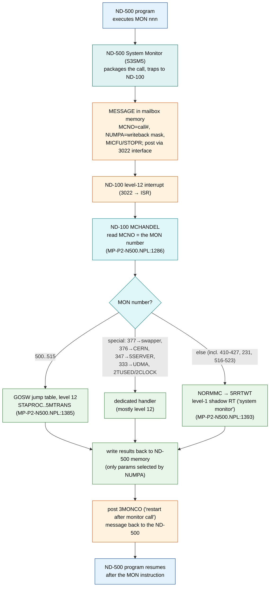

# ND-500 Monitor Calls: Activation, Mapping, and Response — Complete Process

**Scope:** How a monitor call issued by an ND-500 program is activated, routed
between the ND-500 and the ND-100, dispatched, handled, and answered — and how to
find the code for any MON call. All claims are sourced (NPL line, ND-500
disassembly address, or symbol); items are tagged **VERIFIED** / **UNCERTAIN**.

**Companion docs (see [README.md](README.md) for the full MON index):**
- Per-call routing table: [ND500-MON-CALL-ROUTING-MAP.md](ND500-MON-CALL-ROUTING-MAP.md)
- Message/parameter layout: [../ND500-MONITOR-CALL-PARAMETER-PASSING.md](../ND500-MONITOR-CALL-PARAMETER-PASSING.md)
- Call mechanism deep-dive: [../ND500-MONITOR-CALL-MECHANISM.md](../ND500-MONITOR-CALL-MECHANISM.md)
- Bus/message spec: [../ND500-BUS-INTERFACE-REFERENCE.md](../ND500-BUS-INTERFACE-REFERENCE.md)
- ND-100-side MON dispatch (level 14 / GOTAB): [../../OS/23-MON-CALL-DISPATCH-DEVELOPER-GUIDE.md](../../OS/23-MON-CALL-DISPATCH-DEVELOPER-GUIDE.md)

---

## 0. The three actors (and who does NOT dispatch)

An ND-500 monitor call involves up to three code bodies:

| Actor | CPU | Role | Where the code is |
|---|---|---|---|
| **ND-500 System Monitor** (`S3SM5`) | ND-500 | **First responder / packager** — on a MON trap it builds a message and traps to the ND-100. Its own internal dispatch is **UNCERTAIN** (not recoverable from the current linear disassembly). The ND-100 does the actual servicing. | segment `030-S3SM5.bin` (ND-500 code) |
| **ND-100 N500 driver** | ND-100 | **The real dispatcher/servicer.** `MCHANDEL` reads the MON number and either services on **level 12** (calls 500–515 + special cases) or forwards to the **level-1 shadow RT** (`NORMMC` → `5RRTWT`) for everything else, then writes results back | `../../NPL-SOURCE/NPL/MP-P2-N500.NPL` (`MCHANDEL`/`NORMMC` lines 1246-1406), `5P-P2-MON60.NPL` |
| **ND-500 Swapper** | ND-500 | **NOT a MON dispatcher.** A paging worker + a SINTRAN client via `MON 377B`; only sees swap work as *messages* keyed by a private function code | `swapper/swapper-k01-pseg.asm` |

> **Key correction (VERIFIED from `MP-P2-N500.NPL`):** despite the name, the ND-500
> System Monitor does **not** service these calls on the ND-500 side. `S3SM5`
> packages the call; the **ND-100** driver services 500–515 (level 12) and forwards
> the rest (incl. 410–427) to the ND-100 level-1 shadow RT. See
> [ND500-MON-CALL-ROUTING-MAP.md](ND500-MON-CALL-ROUTING-MAP.md) for the per-call proof.

> **VERIFIED (swapper is not the dispatcher):** the swapper disassembly has no MON
> entry vector; every MON trap it contains is `MON 0B` (exit guard, once) or
> `MON 377B` (the generic SINTRAN gateway, 15×). It dispatches on a private message
> function code (DSEG `0x26190`, ~29 entries), never on a MON number. It does swap
> work (`RPHS`/`WPHS` page moves) and forwards via `MON 377B`. See
> [../swapper/swapper-k01-deep-analysis.md](../swapper/swapper-k01-deep-analysis.md).

So: **the ND-500 System Monitor is the universal first-responder**; the ND-100
driver is the second-stage handler for forwarded calls; the swapper is neither.

---

## 1. The end-to-end flow



> The ND-500 System Monitor **packages** the call (green = ND-500 side); all
> servicing shown here is on the **ND-100**. Whether any call is fully serviced
> ND-500-side without a message is **UNCERTAIN** (the S3SM5 code is not yet decoded).

---

## 2. Activation: how a MON call crosses from the ND-500 to the ND-100

The ND-500 does **not** interrupt the ND-100 directly per call. It uses the
shared **message mailbox** and the 3022/5015 bus interface.

1. The ND-500 System Monitor decides a call needs ND-100 service and **builds a
   message** in mailbox memory. Field offsets (**VERIFIED** from symbols /
   `../ND500-MONITOR-CALL-PARAMETER-PASSING.md`):

   | Field | Offset (oct) | Meaning |
   |---|---|---|
   | `MICFU` | 006 | message function / micro-function code |
   | `STOPR` | 011 | stop reason / dispatch selector (`MOCALL`, `5FMOCALL`, …) |
   | `NUMPA` | 012 | **write-back mask** — which parameters to copy back |
   | `MCNO`  | 013 | **the monitor-call number** |
   | `MSWMC` | 014 | swapper-monitor-call subfield |
   | `SMCNO` | 037 | saved monitor-call number |

2. It posts the message through the 3022 interface (load the MAR, poke the
   activate bit), which raises a **level-12 interrupt** on the ND-100.
   Full electrical/register detail: [../ND500-BUS-INTERFACE-REFERENCE.md](../ND500-BUS-INTERFACE-REFERENCE.md).

3. On the ND-100, the level-12 ISR reads the message `STOPR`; for `MOCALL` /
   `5FMOCALL` it enters the monitor-call handler `MCHANDLE` (a.k.a. `5MONICO`).
   **This is how ND-500 monitor calls reach SINTRAN** — via the message `STOPR`
   field, not a hardware MON trap on the ND-100.

---

## 3. Mapping: how the ND-100 decides what to do

Inside `MCHANDLE`, the ND-100 reads `MCNO` (the MON number) and splits by range
(**VERIFIED** `../../NPL-SOURCE/NPL/MP-P2-N500.NPL:1269-1393`):

```npl
SYMBOL L12MIN=500   SYMBOL L12MAX=523
IF A >= L12MIN AND A <= L12MAX THEN         % extended ND-500 calls
   A=:5CMNO; CALL MBSUSPROC
   5CMNO-L12MIN GOSW                        % jump table indexed by (MON - 500)
      STAPROC,  NSTOPROC, SWITPROC, NINSTR,
      NOUTSTR,  GERRC,    5SIBMO,   SPRIO,
      SWMC,     DVIO,     A5XMSG,   B5XMSG,
      M5TMOUT,  5MTRANS,  M516, M517, M520, M521, M522, M523;
FI
GO NORMMC                                    % else: execute as a normal MON call
```

- **MON 500–523** → the **`GOSW`** jump table, handled on level 12. Each slot is a
  named ND-100 handler:

  | MON | oct | Handler | | MON | oct | Handler |
  |---|---|---|---|---|---|---|
  | 500 | 764 | STAPROC (start process) | | 510 | 774 | SWMC (swapper MON call) |
  | 501 | 765 | NSTOPROC (stop) | | **511** | 777 | **DVIO** (direct virtual I/O) |
  | 502 | 766 | SWITPROC (switch) | | **512** | 1000 | **A5XMSG** (XMSG A) |
  | 503 | 767 | NINSTR (DVINST) | | **513** | 1001 | **B5XMSG** (XMSG B) |
  | 504 | 770 | NOUTSTR | | 514 | 1002 | M5TMOUT (timeout) |
  | 505 | 771 | GERRC (get err = gerrcod) | | **515** | 1003 | **5MTRANS** (transfer) |
  | 506 | 772 | 5SIBMO (SIB) | | 516–523 | 1004–1013 | M516–M523 (patchable) |
  | 507 | 773 | SPRIO (set priority) | | | | |

- **Special cases** (checked before the range test, **VERIFIED** `MP-P2-N500.NPL`):
  `377`→swapper (`SWPDECODER`), `376`→`CERN`, `347`→`5SERVER` (nucleus), `333`→UDMA
  fast call, plus `2TUSED`/`2CLOCK` — each has a dedicated handler (mostly level 12).
- **MON 516–523** are patch stubs that immediately `GO NORMMC` (`:1397-1402`).
- **Everything else** → `NORMMC` (`:1393`) → **`5RRTWT`**, the ND-100 **level-1
  shadow RT** ("system monitor") that runs the call. **This includes the 4xx calls
  410, 411, 416, 417, 425, 426, 427 and 231** — VERIFIED forwarded to the ND-100,
  not handled ND-500-side. (Earlier notes/prompts that called 410–515 "ND-500-side"
  are corrected by the ND-100 source; see the routing map.)

Per-call detail (first responder, servicer, ND-500-vs-forwarded, evidence lines) is
in [ND500-MON-CALL-ROUTING-MAP.md](ND500-MON-CALL-ROUTING-MAP.md).

---

## 4. Response: how the ND-100 answers

1. The handler produces results in the message/parameter area.
2. **Write-back is selective:** the `NUMPA` mask (offset `012₈`) is a bit per
   parameter — bit *k* set ⇒ parameter *k+1* (`5AP(k+1)`/`5DP(k+1)`) is copied
   back into the ND-500's address space. Unset ⇒ left untouched. (VERIFIED,
   `../ND500-MONITOR-CALL-PARAMETER-PASSING.md` §4.)
3. The ND-100 posts a **`3MONCO` = "restart after monitor call"** message back to
   the ND-500 (message function codes `3MONCO`=24, `3WMONCO`=26 "wait monitor
   call"; VERIFIED `../ND500-BUS-INTERFACE-REFERENCE.md` §7.4). The ND-500 program
   resumes at the instruction after its `MON`.

---

## 5. How to find the code for ANY MON call

**ND-500 monitor calls (issued by ND-500 programs):**
1. Look up the routing in [ND500-MON-CALL-ROUTING-MAP.md](ND500-MON-CALL-ROUTING-MAP.md).
2. If **ND-100-handled (500–523)**: the handler symbol is in the `GOSW` table
   above → read it in `MP-P2-N500.NPL` (search the symbol, e.g. `DVIO`, `A5XMSG`).
3. If **ND-100 NORMMC (<500 standard)**: it runs the normal ND-100 MON handler —
   see the ND-100 dispatch below.
4. If **ND-500-local**: disassemble `030-S3SM5.bin` with `nd500-dis`
   (`/home/ronny/repos/ragge/pcc-nd500/bin/nd500-dis`) and align `N500-SYMBOLS`
   (handler names: `FIXSEG`, `UNFIX`, `WSEG`, `STAPROC`, …). See
   [../../tools/sintran-segment-carver/versions/L-VSX-500/segments/030-S3SM5-DISASSEMBLY-PROMPT.md](../../../tools/sintran-segment-carver/versions/L-VSX-500/segments/030-S3SM5-DISASSEMBLY-PROMPT.md).

**ND-100 monitor calls (issued by ND-100 programs) — MON nnn, 0..377:**
- Dispatch is via **level 14 → `GOTAB`** (256-entry jump table). Full method,
  including reading `GOTAB` in memory and setting a DAP breakpoint on the
  dispatch, is in [../../OS/23-MON-CALL-DISPATCH-DEVELOPER-GUIDE.md](../../OS/23-MON-CALL-DISPATCH-DEVELOPER-GUIDE.md).
- The handler for MON *n* is `GOTAB(n)`; the resident handler code is reached via
  the composite level-4 view (see the guide). Undocumented/unclear ND-100 calls
  are tracked in [../../tools/sintran-segment-carver/ghidra-tasks/TASK-05-undocumented-mon-calls.md](../../../tools/sintran-segment-carver/ghidra-tasks/TASK-05-undocumented-mon-calls.md).

**MON 60B (N500M) — the ND-100 background monitor's own call:** the ND-500
Background Monitor (`ND-500-MON-J:PROG`, ND-100 code) uses `MON 60B` with a
subfunction stub array; decoded in [../ND500-MON-RE-FINDINGS.md](../ND500-MON-RE-FINDINGS.md).

---

## 6. Source references

| What | Where |
|---|---|
| ND-100 GOSW dispatch (500–523), NORMMC | `../../NPL-SOURCE/NPL/MP-P2-N500.NPL:1269-1393` |
| SEGMONC (execute MON on behalf of ND-500) | `../../NPL-SOURCE/NPL/5P-P2-MON60.NPL:2302` |
| MON 60B subfunction interface | `../../NPL-SOURCE/NPL/5P-P2-MON60.NPL` (FUNCTION-CODE tables) |
| Message fields, write-back (NUMPA) | `../ND500-MONITOR-CALL-PARAMETER-PASSING.md` |
| Message posting, level-12 ISR, 3MONCO/3WMONCO | `../ND500-BUS-INTERFACE-REFERENCE.md` |
| ND-500 System Monitor code | `../../tools/sintran-segment-carver/versions/L-VSX-500/segments/030-S3SM5.asm` |
| ND-500 Swapper (not a MON dispatcher) | `../swapper/swapper-k01-deep-analysis.md` |
| ND-100 MON dispatch (level 14 / GOTAB) | `../../OS/23-MON-CALL-DISPATCH-DEVELOPER-GUIDE.md` |
