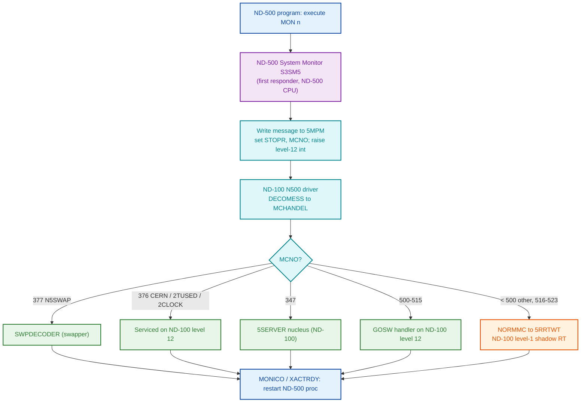

# ND-500 MON Call Routing Map

Complete routing map for monitor calls issued by ND-500 programs: which component
is the first responder, which component services each call, and whether it is
handled ND-500-side or forwarded to the ND-100 SINTRAN kernel.

This document covers the **ND-500 System Monitor segment (S3SM5)** and the
**ND-100 driver side**. The ND-500 swapper is covered by a parallel analysis; see
[ND500-SWAPPER-ANALYSIS.md](../ND500-SWAPPER-ANALYSIS.md).

**Primary sources**

- ND-100 driver dispatch: `../../NPL-SOURCE/NPL/MP-P2-N500.NPL` (MCHANDEL / NORMMC,
  lines 1246-1406; 5RRTWT lines 21-24; SWPDECODER line 912).
- ND-500 System Monitor disassembly:
  `../../../tools/sintran-segment-carver/versions/L-VSX-500/segments/030-S3SM5.asm`
  (+ raw `030-S3SM5.bin`, 49152 bytes) and its task prompt
  `.../segments/030-S3SM5-DISASSEMBLY-PROMPT.md`.
- Symbols: `../../NPL-SOURCE/SYMBOLS/L07/N500-SYMBOLS.SYMB.TXT`.
- Companion docs: [ND500-MONITOR-CALL-MECHANISM.md](../ND500-MONITOR-CALL-MECHANISM.md),
  [ND500-MONITOR-CALL-PARAMETER-PASSING.md](../ND500-MONITOR-CALL-PARAMETER-PASSING.md),
  [ND500-BUS-INTERFACE-REFERENCE.md](../ND500-BUS-INTERFACE-REFERENCE.md).

Every claim is tagged **[VERIFIED]** (read directly from the cited source) or
**[UNCERTAIN]** (inferred, or not recoverable from the available artifact).

---

## 1. The three actors

| Actor | What it is | Runs on |
|-------|-----------|---------|
| **ND-500 System Monitor** (segment `S3SM5`, SINTRAN segment 30 octal) | Resident ND-500 (32-bit, byte-addressed) code, mapped by SINTRAN via 5PIT | ND-500 CPU |
| **ND-500 swapper** | Resident ND-500 code; communicates through `SWMSG`, uses MON `N5SWAP=377` | ND-500 CPU |
| **ND-100 N500 driver** | `MP-P2-N500.NPL` — level-12 interrupt driver + `MCHANDEL` dispatcher, plus level-1 RT ("shadow") processing reached via `5RRTWT` | ND-100 CPU |

**[VERIFIED]** `S3SM5` is ND-500 machine code, not ND-100 code: the disassembly
prompt records that `nd100-dis` finds only 108 control-flow instructions in the
whole 49152-byte segment (noise), whereas the ND-500 disassembler yields valid
ND-500 mnemonics. Confirmed also by the `:PSEG/:DSEG = ND-500 byte-addressed`
convention documented in `ND500-L-RELEASE-RE-TASK-HANDOFF.md`.

---

## 2. ND-100 side — the MCHANDEL dispatcher (VERIFIED)

When an ND-500 process executes a `MON` instruction, the ND-500 microcode writes a
message into 5MPM, sets the stop reason, and raises a **level-12 interrupt** to the
ND-100. The driver's answer decoder (`DECOMESS`) calls **`MCHANDEL`**
(`MP-P2-N500.NPL:1286`), which is the central ND-100-side dispatcher.

`MCHANDEL` reads the monitor-call number `MCNO` from the message, saves it in
`SMCNO` (line 1302), then routes as follows (all **[VERIFIED]** from
`MP-P2-N500.NPL`):

| Test in MCHANDEL | MON # (octal) | Action | Line |
|------------------|---------------|--------|------|
| `A = 2TUSED` | (time-used) | Serviced on level 12: return ND-500 CPU time (`500TUSED`), restart proc | 1303-1309 |
| `A = 2CLOCK` | (clock) | Serviced on level 12: MON-60 buffer copy back to ND-500 | 1310-1344 |
| `A = N5SWAP` | **377** | `SWPDECODER` — decode swapper function (swapper path) | 1346-1357 |
| `A = CERN` | **376** | Execute patched `CERNCODE` on ND-100 (site-special) | 1358-1370 |
| `A = 333` (and `5FUDMA><0`) | **333** (UDMA) | `N5FUD` fast UDMA path, then `NORMMC` | 1375-1378 |
| `A = 347` | **347** | `GO 5SERVER` — nucleus MON call (handler external to this module) | 1381 |
| `L12MIN ≤ A ≤ L12MAX` | **500-523** | Level-12 **GOSW** fast-path dispatch (table below) | 1382-1392 |
| otherwise | `< 500` (and 231, 410, 411, 416, 417, 425, 426, 427, …) | `GO NORMMC` — forward to the system monitor | 1393 |

Constants (`MP-P2-N500.NPL:1269-1273`): `L12MIN=500`, `L12MAX=523`, `CERN=376`,
`N5SWAP=377`.

### 2.1 The level-12 GOSW table — MON 500-523 (VERIFIED)

`MP-P2-N500.NPL:1385`:

```
5CMNO-L12MIN GOSW
   STAPROC,   NSTOPROC,  SWITPROC,  NINSTR,
   NOUTSTR,   GERRC,     5SIBMO,    SPRIO,
   SWMC,      DVIO,      A5XMSG,    B5XMSG,
   M5TMOUT,   5MTRANS,   M516,      M517,
   M520,      M521,      M522,      M523;
```

The index is `MCNO - 500` (octal). This is a genuine dispatch table indexed by the
MON number, on the **ND-100** side:

| MON # (oct) | Handler | Role |
|:-----------:|---------|------|
| 500 | STAPROC | Start ND-500 process |
| 501 | NSTOPROC | Stop process |
| 502 | SWITPROC | Switch process |
| 503 | NINSTR | Device input string (DVINST) |
| 504 | NOUTSTR | Device output string |
| 505 | GERRC | Get error code |
| 506 | 5SIBMO | SIBAS monitor call |
| 507 | SPRIO | Set priority |
| 510 | SWMC | Switch context / monitor call |
| 511 | DVIO | Device I/O |
| 512 | A5XMSG | XMSG "A" function (for ND-500) |
| 513 | B5XMSG | XMSG "B" function (for ND-500) |
| 514 | M5TMOUT | Timeout |
| 515 | 5MTRANS | Memory transfer |
| 516 | M516 | Patch stub → `GO NORMMC` (reserved) |
| 517 | M517 | Patch stub → `GO NORMMC` (reserved) |
| 520 | M520 | Patch stub → `GO NORMMC` (reserved) |
| 521 | M521 | Patch stub → `GO NORMMC` (reserved) |
| 522 | M522 | Patch stub → `GO NORMMC` (reserved) |
| 523 | M523 | Patch stub → `GO NORMMC` (reserved) |

**[VERIFIED]** The 516-523 entries are patch stubs: each is defined as
`GO NORMMC; 0/\0` (`MP-P2-N500.NPL:1397-1402`), i.e. by default they fall straight
through to the forward path and exist only so new driver-level MON calls can be
patched in without relinking.

Note the handlers themselves (STAPROC, DVIO, A5XMSG, …) are declared as ND-100
subroutines in this module (`SUBR` list, `MP-P2-N500.NPL:1246-1247`), so
**MON 500-515 are serviced on the ND-100, on driver level 12** — they are *not*
re-dispatched to ND-500 code.

### 2.2 NORMMC — the forward path (VERIFIED)

`MP-P2-N500.NPL:1277-1283`:

```
NORMMC:
   IF CSTOPREASON=5FMOCALL THEN
      "5FRTBAK"=:PROCAD.MFUNC          % file-transfer variant
   FI
   CALL 5RRTWT; GO NXTMSG
```

The comment at the dispatch site (`line 1393`) reads
`% MONITOR CALL SHOULD BE HANDLED BY THE SYSTEM MONITOR.` `5RRTWT`
(`MP-P2-N500.NPL:21-24`, "restart RT wait") restarts the ND-100 process — the
shadow RT-program — which then completes the call on level 1. So a forwarded MON
call is taken out of the level-12 fast path and handed to level-1 RT processing.

**[VERIFIED]** MON numbers `< 500` that are not one of the special cases in the
table above (2TUSED, 2CLOCK, 376, 377, 333-fast, 347) reach `NORMMC` and are
forwarded. This includes **231, 410, 411, 416, 417, 425, 426, 427** — none of them
is special-cased in `MCHANDEL` (grep of `MP-P2-N500.NPL` finds them only as code
addresses, never as MON constants). MON `347` is the one `< 500` value pulled out
before the forward, branching to the external nucleus handler `5SERVER`.

---

## 3. ND-500 side — does S3SM5 contain its own dispatch table?

**[UNCERTAIN] — a monitor-call dispatch table could not be reliably recovered from
`030-S3SM5.asm`.** Findings:

1. **The linear disassembly is not trustworthy as-is.** Of 33 250 emitted lines,
   **17 556 (53 %) are `??? ; opcode 0x0000` / undecodable**, and the "decoded"
   instructions around them are nonsensical (e.g. `call $1777777777771414000000`).
   ND-500 uses **variable-length instructions**, so a straight linear sweep from
   offset 0 desynchronises permanently the first time it steps into data or
   mis-sizes an operand. Correct disassembly requires following control flow from
   known entry points — which are exactly what is missing.

2. **The `-b` base does not change decoding.** Per `nd500-dis` help, for raw files
   `-b <addr>` only *maps file offsets to display addresses*; it does not alter how
   bytes are decoded. So there is no base that "makes the symbols land on routine
   entries" by re-decoding — re-running with `-b 0x08000000` versus offset-0 yields
   identical instruction bytes, only relabelled addresses.

3. **N500-SYMBOLS cannot label S3SM5 offsets.** Every value in
   `N500-SYMBOLS.SYMB.TXT` is a 16-bit quantity (`0 … 177777` octal; verified max =
   `177777`). These are **ND-100-side interface addresses**, not 32-bit ND-500 byte
   offsets into the segment. A few names do exist and by coincidence fall numerically
   inside the 49152-byte range (e.g. `UNFIX=112463`, `WSEG=112463`, `GPRNA=100310`),
   but testing them as byte offsets lands **mid-instruction on desynced fragments**,
   not on routine entries — e.g. octal `112463` decodes as `w1 =: $14` bracketed by
   `???` lines (`030-S3SM5.asm:26337-26343`), not a `ret`-bounded routine head.
   `SPRNA=166654` is outside the segment entirely. The candidate handler names from
   the S3SM5 prompt (`FIXSE`, `WSEGN`, `GERRC`, `SPRNA`, `GPRNA`, `GPRNU`, `MXPIS`)
   are scattered across `N500-SYMBOLS`, `RTLO-SYMBOLS`, and `SYMBOL-2-LIST`, i.e. they
   are ND-100 kernel/runtime symbols, reinforcing that they are not S3SM5 code labels.

**Conclusion.** With the current artifact (a single linear-sweep disassembly, no
proven symbol alignment, no control-flow-guided entry recovery) an S3SM5-internal
MON dispatch table **cannot be enumerated with confidence**. Extracting it would
require a control-flow disassembler seeded from verified ND-500 entry points (or a
Ghidra ND-500 SLEIGH module), which is out of reach here. The routing conclusions
below therefore rest on the **VERIFIED ND-100 source** plus the documented
mechanism, not on decoded S3SM5 code.

---

## 4. Complete per-call routing table

Legend for "Serviced by":
- **ND-100 L12** = ND-100 driver, level-12 fast path (GOSW / special case).
- **ND-100 RT** = forwarded via `NORMMC → 5RRTWT` to the ND-100 level-1 shadow
  RT-program (the "system monitor" of the comment).
- **ND-500 swapper / S3SM5** = ND-500-side resident code.

| MON (oct) | First responder | Serviced by | ND-500-side or forwarded to ND-100 | Evidence |
|:---------:|-----------------|-------------|-----------------------------------|----------|
| 231 | ND-100 MCHANDEL | ND-100 RT (`NORMMC`) | Forwarded to ND-100 | Not special-cased; falls through `MP-P2-N500.NPL:1393` **[VERIFIED]** |
| 255 | (swapper) | ND-500 swapper | ND-500-side | Swapper path; see swapper analysis **[UNCERTAIN here]** |
| 347 | ND-100 MCHANDEL | ND-100 nucleus `5SERVER` (external module) | Forwarded to ND-100 | `IF A=347 GO 5SERVER` `MP-P2-N500.NPL:1381` **[VERIFIED]** |
| 376 (CERN) | ND-100 MCHANDEL | ND-100 (`CERNCODE`, if enabled) | Handled on ND-100 L12 | `MP-P2-N500.NPL:1358-1370` **[VERIFIED]** |
| 377 (N5SWAP) | ND-100 MCHANDEL | `SWPDECODER` (swapper) | ND-100 decodes swapper request | `MP-P2-N500.NPL:1346-1348`, `912` **[VERIFIED]** |
| 410 | ND-100 MCHANDEL | ND-100 RT (`NORMMC`) | Forwarded to ND-100 | `< 500`, not special-cased `MP-P2-N500.NPL:1393` **[VERIFIED]** |
| 411 | ND-100 MCHANDEL | ND-100 RT (`NORMMC`) | Forwarded to ND-100 | as above **[VERIFIED]** |
| 416 | ND-100 MCHANDEL | ND-100 RT (`NORMMC`) | Forwarded to ND-100 | as above **[VERIFIED]** |
| 417 | ND-100 MCHANDEL | ND-100 RT (`NORMMC`) | Forwarded to ND-100 | as above **[VERIFIED]** |
| 425 | ND-100 MCHANDEL | ND-100 RT (`NORMMC`) | Forwarded to ND-100 | as above **[VERIFIED]** |
| 426 | ND-100 MCHANDEL | ND-100 RT (`NORMMC`) | Forwarded to ND-100 | as above **[VERIFIED]** |
| 427 | ND-100 MCHANDEL | ND-100 RT (`NORMMC`) | Forwarded to ND-100 | as above **[VERIFIED]** |
| 500 | ND-100 MCHANDEL | ND-100 L12 `STAPROC` | Handled on ND-100 | GOSW `MP-P2-N500.NPL:1386` **[VERIFIED]** |
| 501 | ND-100 MCHANDEL | ND-100 L12 `NSTOPROC` | Handled on ND-100 | GOSW **[VERIFIED]** |
| 502 | ND-100 MCHANDEL | ND-100 L12 `SWITPROC` | Handled on ND-100 | GOSW **[VERIFIED]** |
| 503 | ND-100 MCHANDEL | ND-100 L12 `NINSTR` | Handled on ND-100 | GOSW **[VERIFIED]** |
| 504 | ND-100 MCHANDEL | ND-100 L12 `NOUTSTR` | Handled on ND-100 | GOSW **[VERIFIED]** |
| 505 | ND-100 MCHANDEL | ND-100 L12 `GERRC` | Handled on ND-100 | GOSW **[VERIFIED]** |
| 506 | ND-100 MCHANDEL | ND-100 L12 `5SIBMO` | Handled on ND-100 | GOSW **[VERIFIED]** |
| 507 | ND-100 MCHANDEL | ND-100 L12 `SPRIO` | Handled on ND-100 | GOSW **[VERIFIED]** |
| 510 | ND-100 MCHANDEL | ND-100 L12 `SWMC` | Handled on ND-100 | GOSW **[VERIFIED]** |
| 511 | ND-100 MCHANDEL | ND-100 L12 `DVIO` | Handled on ND-100 | GOSW `MP-P2-N500.NPL:1387` **[VERIFIED]** |
| 512 | ND-100 MCHANDEL | ND-100 L12 `A5XMSG` | Handled on ND-100 | GOSW **[VERIFIED]** |
| 513 | ND-100 MCHANDEL | ND-100 L12 `B5XMSG` | Handled on ND-100 | GOSW **[VERIFIED]** |
| 514 | ND-100 MCHANDEL | ND-100 L12 `M5TMOUT` | Handled on ND-100 | GOSW **[VERIFIED]** |
| 515 | ND-100 MCHANDEL | ND-100 L12 `5MTRANS` | Handled on ND-100 | GOSW **[VERIFIED]** |
| 516-523 | ND-100 MCHANDEL | patch stub → `NORMMC` (ND-100 RT) | Forwarded unless patched | `MP-P2-N500.NPL:1397-1402` **[VERIFIED]** |

**Reconciliation with the S3SM5 prompt.** The S3SM5 disassembly prompt lists
MON 410, 411, 416, 417, 425, 426, 427, 500, 501, 505, 510, 511, 512, 513, 515 as
"handled ND-500-side." That is **not corroborated by the ND-100 source**: for
500-515 the ND-100 GOSW handlers are ND-100 subroutines (§2.1), and 410-427 are
forwarded to ND-100 RT (§2.2). The most consistent reading (see §5) is that S3SM5
is the **ND-500-side first responder / packager** for these calls, while the actual
service is completed on the ND-100. Confirming any ND-500-local completion inside
S3SM5 requires the decoded segment, which is **[UNCERTAIN]** (§3).

---

## 5. Reconciling the three actors — control flow

**[VERIFIED] portions** come from `MP-P2-N500.NPL` and the mechanism/parameter
docs. **[UNCERTAIN] portions** (the ND-500-internal role of S3SM5) are inferred.



**Sequence of responsibility**

1. **First responder = the ND-500 System Monitor (S3SM5)** on the ND-500 CPU. It
   receives the `MON` and, for anything needing OS services on the ND-100, packages
   a message in 5MPM, sets the stop reason, and traps to the ND-100 via level-12
   interrupt. *(ND-500-side detail **[UNCERTAIN]** — mechanism doc + §8.3 of the
   manual as cited by the S3SM5 prompt; not decoded from the segment.)*

2. **Second responder = the ND-100 N500 driver.** `MCHANDEL` **[VERIFIED]**
   dispatches by `MCNO`:
   - MON 500-515 → serviced immediately on **level 12** by the GOSW handlers.
   - MON 377 → swapper decode; 376/2TUSED/2CLOCK/347 → their special handlers.
   - everything else (`< 500`, and unpatched 516-523) → `NORMMC → 5RRTWT`, i.e.
     handed to the **level-1 shadow RT-program** ("the system monitor" of the
     source comment).

3. **Return.** After service, `MONICO`/`XACTRDY` write the result to the message
   and reactivate the ND-500 process (see
   [ND500-MONITOR-CALL-PARAMETER-PASSING.md](../ND500-MONITOR-CALL-PARAMETER-PASSING.md)).

4. **Swapper** is a separate ND-500 actor: its traffic is recognised by the ND-100
   driver as MON `377` (`N5SWAP`) carried in `SWMSG` and decoded by `SWPDECODER`
   (`MP-P2-N500.NPL:912`). Its page-fault / swap-in-out logic is the subject of the
   parallel swapper analysis; **MON 255** belongs to that path and is not resolvable
   from `MP-P2-N500.NPL` **[UNCERTAIN here]**.

---

## 6. Open items

- **[UNCERTAIN]** S3SM5-internal MON handler entries and parameter conventions:
  blocked on a control-flow-guided ND-500 disassembly with proven symbol alignment
  (§3). The linear `030-S3SM5.asm` is insufficient.
- **[UNCERTAIN]** MON 255 exact semantics — resolve in the swapper analysis.
- **[UNCERTAIN]** `5SERVER` (nucleus MON 347) body — defined outside
  `MP-P2-N500.NPL`; locate in the nucleus module to confirm handling.

---

**Sources cited**: `../../NPL-SOURCE/NPL/MP-P2-N500.NPL`,
`../../NPL-SOURCE/SYMBOLS/L07/N500-SYMBOLS.SYMB.TXT`,
`../../../tools/sintran-segment-carver/versions/L-VSX-500/segments/030-S3SM5.asm`,
`.../segments/030-S3SM5-DISASSEMBLY-PROMPT.md`,
[ND500-MONITOR-CALL-MECHANISM.md](../ND500-MONITOR-CALL-MECHANISM.md),
[ND500-MONITOR-CALL-PARAMETER-PASSING.md](../ND500-MONITOR-CALL-PARAMETER-PASSING.md).
