# ND-500 Interface Documentation (MP-P2-N500)

**File:** `Z:\NorskData\Source Code\Sintran L\NPL\MP-P2-N500.NPL`
**Date:** 2025-10-13
**Total Lines:** ~3808
**Purpose:** ND-500 shadow processing system for ND-100

---

## Table of Contents

1. [ND-500 Interface Symbol Mappings](#1-nd-500-interface-symbol-mappings)
2. [CRITICAL: TAG-IN and TAG-OUT Explanation](#2-critical-tag-in-and-tag-out-explanation)
3. [Hardware Interface Overview](#3-hardware-interface-overview)
4. [Interrupt Handling (Level 12)](#4-interrupt-handling-level-12)
   - [Interrupt Configuration](#41-interrupt-configuration)
   - [Interrupt Entry Points](#42-interrupt-entry-points)
   - [Interrupt Processing Flow](#43-interrupt-processing-flow)
   - [WT12 Wait Routine](#44-wt12-wait-routine)
   - [Interrupt-Safe Operations](#45-interrupt-safe-operations)
   - [Lost Interrupt Recovery](#46-lost-interrupt-recovery)
   - [Complete Interrupt Flow Diagram](#47-complete-interrupt-flow-diagram)
   - [Code Examples](#48-code-examples)
   - [Summary](#49-summary)
5. [Complete API Reference](#5-complete-api-reference)
6. [Key Assembly Patterns](#6-key-assembly-patterns)
7. [Symbol Definitions](#7-symbol-definitions)
8. [Symbol Usage in Code](#8-symbol-usage-in-code)
9. [Communication Flow Examples](#9-communication-flow-examples)

---

## 1. ND-500 Interface Symbol Mappings

This section documents the actual symbols used in the NPL source code for accessing the ND-500 interface hardware. These symbols are defined in the source files and map directly to IOX device offsets on the 3022/5015 interface cards.

### Complete Symbol Mapping Table

The following table shows the exact mapping between IOX offsets, octal values, enum names, symbols used in code, and their functions:

| IOX Offset | Octal  | Enum                   | Symbol             | Comment                         |
|:----------:|:------:|:-----------------------|:-------------------|:--------------------------------|
| +0         | 000000 | ReadMarX2              | **RMAR5**          | Read MAR                        |
| +1         | 000001 | LoadMarX2              | **LMAR5**          | Load MAR                        |
| +2         | 000002 | ReadStatusRegister     | **RSTA5**          | Read status                     |
| +3         | 000003 | LoadStatusRegister     | **LSTA5**          | Load status                     |
| +4         | 000004 | ReadControlRegister    | **RCON5**          | Read control                    |
| +5         | 000005 | LoadControlRegister    | **LCON5**          | Load control                    |
| +6         | 000006 | MasterClear            | **MCLR5**          | Master clear                    |
| +7         | 000007 | Terminate              | **TERM5**          | Terminate                       |
| +10        | 000010 | ReadTagIn              | **RTAG5**          | Read tag                        |
| +11        | 000011 | WriteTagOut            | **LTAG5**          | Write tag                       |
| +12        | 000012 | ReadLowerLimit         | **RLOW5**          | Read lower limit                |
| +13        | 000013 | WriteDataX             | **LDAT5** or **LLOW5** | Load data / write lower     |
| +14        | 000014 | ReadLockedMaybe        | **SLOC5**          | Possibly "slot" / "status lock" |
| +15        | 000015 | WriteData              | **BITM5**, **CLKD5**, or **S15** | Unclear — may depend on context |
| +16        | 000016 | ReadLocked             | **UNLC5**          | Unlock — plausible              |
| +17        | 000017 | LastIOX                | **RETG5**          | Return/End gate                 |

### Key Symbols for TAG Operations

The two most critical symbols for TAG-based communication are:

- **RTAG5** (IOX offset +10, octal 000010): Read TAG-IN register
- **LTAG5** (IOX offset +11, octal 000011): Write TAG-OUT register

These symbols are used throughout the NPL source code to read status and control the ND-500 operations.

### Usage Pattern

All these symbols are used with the HDEV (Hardware Device) base address:

```assembly
T:=HDEV+RSTA5; *IOXT    % Read status register at HDEV+2
T:=HDEV+LMAR5; *IOXT    % Load MAR register at HDEV+1
T:=HDEV+RTAG5; *IOXT    % Read TAG-IN at HDEV+10 (octal)
```

---

## 2. CRITICAL: TAG-IN and TAG-OUT Explanation

### What are TAG-IN and TAG-OUT?

TAG-IN and TAG-OUT are **hardware control registers** used for bidirectional communication between the ND-100 and ND-500 processors through the 3022/5015 interface cards. They define the type of operation being performed during data transfers.

### TAG-OUT Register (ND-500 → ND-100 Communication)

The **TAG-OUT register** is written by the ND-100 to tell the ND-500 what operation to perform.

**Register Structure:**
```
Bits 0-2:  3-bit operation code (8 possible operations)
Bit 3:     ND-100 flag
Bit 7:     MOST bit (selects most/least significant part of DATA-OUT register)
```

**8 TAG-OUT Operations (3-bit codes 0-7):**

| Code | Operation | Description |
|------|-----------|-------------|
| 0 | Read MAR (Memory Address Register) | Read address from ND-500 |
| 1 | Write MAR | Write address to ND-500 |
| 2 | Read Status | Read ND-500 status register |
| 3 | Write Control | Write control commands to ND-500 |
| 4 | Read Data (low) | Read least significant word from DATA register |
| 5 | Write Data (low) | Write least significant word to DATA register |
| 6 | Read Data (high) | Read most significant word from DATA register |
| 7 | Write Data (high) | Write most significant word to DATA register |

**How ND-100 Uses TAG-OUT:**

The ND-100 writes TAG-OUT using the IOX instruction with the **LTAG5** symbol (IOX offset +11, octal 000011):

```assembly
A:=5; T:=HDEV+LTAG5; *IOXT    % Write TAG-OUT code 5 (Write Data via LTAG5)
```

**Note:** Earlier code may also use LCON5 (Load Control Register) which can include TAG-OUT functionality.

### TAG-IN Register (ND-100 → ND-500 Communication)

The **TAG-IN register** is written by the ND-500 (or read by ND-100) to signal operations or status back to the ND-100.

**Register Structure:**
```
Bits 0-3:  4-bit operation code (16 possible operations)
Bit 5:     Return TAG flag (octal value 0x40)
```

**16 TAG-IN Operations (4-bit codes 0-15):**

| Code | Operation | Description |
|------|-----------|-------------|
| 0 | NOP | No operation |
| 1 | Clock DATA-IN-1 | Latch first data word from ND-100 |
| 2 | Clock DATA-IN-2 | Latch second data word from ND-100 |
| 3 | Clock DATA-OUT | Prepare data word for ND-100 to read |
| 4 | Enable Bus | Enable data bus for transfer |
| 5 | Lock Interface | Lock interface for exclusive access |
| 6 | Unlock Interface | Release interface lock |
| 7 | Activate | Signal ND-500 to begin execution |
| 8 | Terminate | Signal ND-500 to stop |
| 9 | Reset | Hardware reset of ND-500 |
| 10-15 | Reserved | Reserved for future use |

**How ND-100 Reads TAG-IN:**

The ND-100 reads TAG-IN using the IOX instruction with the **RTAG5** symbol (IOX offset +10, octal 000010):

```assembly
T:=HDEV+RTAG5; *IOXT          % Read TAG-IN register into A via RTAG5
```

**Alternative Method - Reading via Status Register:**

TAG-IN can also be read via the status register using **RSTA5** (IOX offset +2):

```assembly
T:=HDEV+RSTA5; *IOXT          % Read status (includes TAG-IN) into A via RSTA5
```

**Critical Code Example - Disabling TAG-IN Decoding:**

From CC-P2-N500.NPL line 215:
```assembly
A:=40; T+"LCON5-UNLC5"; *IOXT    % DISABLE TAG-IN DECODING
```

This writes value 0x40 (octal 40) which sets the "Return TAG" flag to disable automatic TAG-IN interpretation by the interface hardware.

### Communication Protocol Using TAGs

The typical sequence for an ND-100 to ND-500 operation:

1. **Activate/Lock Sequence:**
   ```assembly
   T:=HDEV+LCON5; *IOXT          % Write to LCON5 (Control register)
   T+"RSTA5-LCON5"; *IOXT        % Read status to verify
   ```

2. **Write Memory Address (MAR):**
   ```assembly
   T:=HDEV+LMAR5; *IOXT          % Write to LMAR5 (MAR register)
   A:=address; *IOXT             % Write actual address
   ```

3. **Write Data Operation:**
   ```assembly
   A:=5; T+"LCON5-LMAR5"; *IOXT  % TAG-OUT=5 (Write Data low)
   A:=data; *IOXT                % Write data value
   ```

4. **Unlock Sequence:**
   ```assembly
   T+"SLOC5-LCON5"; *IOXT        % Unlock interface
   ```

#### TAG Communication Sequence Diagram

The following sequence diagram shows the complete TAG-IN/TAG-OUT communication flow between ND-100 and ND-500:

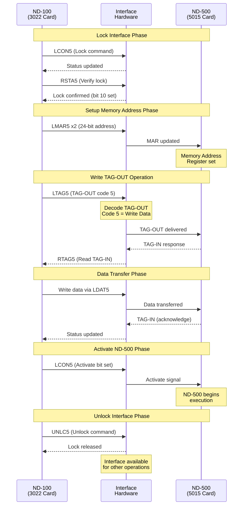

### Hardware Interface IOX Addresses

The ND-100 communicates with the 3022 card using these IOX offsets from HDEV (Hardware Device base). **These are the actual symbols used in the NPL source code:**

| Symbol Name | IOX Offset | Octal  | Direction | Purpose |
|-------------|:----------:|:------:|-----------|---------|
| **RMAR5** | +0 | 000000 | ND-500 → ND-100 | Read Memory Address Register |
| **LMAR5** | +1 | 000001 | ND-100 → ND-500 | Load Memory Address Register |
| **RSTA5** | +2 | 000002 | ND-500 → ND-100 | Read Status Register |
| **LSTA5** | +3 | 000003 | ND-100 → ND-500 | Load Status Register |
| **RCON5** | +4 | 000004 | ND-500 → ND-100 | Read Control Register |
| **LCON5** | +5 | 000005 | ND-100 → ND-500 | Load Control Register |
| **MCLR5** | +6 | 000006 | ND-100 → ND-500 | Master Clear |
| **TERM5** | +7 | 000007 | ND-100 → ND-500 | Terminate ND-500 |
| **RTAG5** | +10 | 000010 | ND-500 → ND-100 | Read TAG-IN register |
| **LTAG5** | +11 | 000011 | ND-100 → ND-500 | Write TAG-OUT register |
| **RLOW5** | +12 | 000012 | ND-500 → ND-100 | Read Lower Limit |
| **LDAT5** | +13 | 000013 | ND-100 → ND-500 | Load Data / Write Lower |
| **SLOC5** | +14 | 000014 | ND-100 → ND-500 | Set Lock (status lock) |
| **UNLC5** | +16 | 000016 | ND-100 → ND-500 | Unlock interface |
| **RETG5** | +17 | 000017 | ND-500 → ND-100 | Return Tag / End Gate |

**Note:** The octal values are the actual hardware offsets. IOX offset +10 (octal) = decimal 8, +11 (octal) = decimal 9, etc.

---

## 3. Hardware Interface Overview

### Physical Hardware

**3022 Interface Card (ND-100 side):**
- Installed in ND-100 computer
- Provides IOX-addressable registers
- Handles TAG encoding/decoding
- Manages data transfer protocol
- This file (MP-P2-N500.NPL) is written from the ND-100/3022 perspective

**5015 Interface Card (ND-500 side):**
- Installed in ND-500 computer
- Mirrors 3022 functionality on ND-500 side
- Responds to TAG-OUT commands from ND-100
- Generates TAG-IN responses to ND-100

#### Hardware Architecture Diagram

The following block diagram shows the physical hardware architecture and register mapping:

```mermaid
graph LR
    subgraph ND100["ND-100 System"]
        CPU100[ND-100 CPU]
        MEM100[ND-100 Memory]
        CARD3022[3022 Interface Card]

        subgraph Registers3022["3022 Registers (IOX Addressable)"]
            LMAR5[LMAR5<br/>Load MAR]
            RMAR5[RMAR5<br/>Read MAR]
            LCON5[LCON5<br/>Load Control]
            RCON5[RCON5<br/>Read Control]
            LSTA5[LSTA5<br/>Load Status]
            RSTA5[RSTA5<br/>Read Status]
            LTAG5[LTAG5<br/>Write TAG-OUT]
            RTAG5[RTAG5<br/>Read TAG-IN]
            LDAT5[LDAT5<br/>Write Data]
            RDAT5[RDAT5<br/>Read Data]
            UNLC5[UNLC5<br/>Unlock]
            SLOC5[SLOC5<br/>Lock Status]
        end

        CPU100 -->|IOX Instructions| Registers3022
        CPU100 <-->|Read/Write| MEM100
        Registers3022 --> CARD3022
    end

    subgraph HW["Physical Connection"]
        CABLE[Interface Cable<br/>Bidirectional]
    end

    subgraph ND500["ND-500 System"]
        CARD5015[5015 Interface Card]
        CPU500[ND-500 CPU]
        MEM500[ND-500 Memory]

        subgraph Registers5015["5015 Registers"]
            MAR500[MAR<br/>Memory Address]
            CTRL500[CONTROL<br/>Control Reg]
            STAT500[STATUS<br/>Status Reg]
            TAGIN[TAG-IN<br/>Response]
            TAGOUT[TAG-OUT<br/>Command]
            DATA500[DATA/DATAX<br/>Data Registers]
        end

        CARD5015 --> Registers5015
        CPU500 <-->|Read/Write| MEM500
        Registers5015 -->|Access| CPU500
        CARD5015 -.->|DMA| MEM500
    end

    CARD3022 <-->|TAG-OUT<br/>TAG-IN<br/>Data<br/>Control| CABLE
    CABLE <-->|Mirrored<br/>Signals| CARD5015

    style ND100 fill:#e1f5ff
    style ND500 fill:#ffe1e1
    style HW fill:#f0f0f0
    style CARD3022 fill:#90caf9
    style CARD5015 fill:#ef9a9a
```

**Data Flow Directions:**
- ND-100 → ND-500: LMAR5, LCON5, LSTA5, LTAG5, LDAT5, UNLC5
- ND-500 → ND-100: RMAR5, RCON5, RSTA5, RTAG5, RDAT5, SLOC5
- Bidirectional: DMA transfers via MAR and DATA registers

### Communication Protocol

The interface uses a strict **Activate/Lock/Unlock** protocol:

1. **Lock Interface:** Gain exclusive access
2. **Set MAR:** Specify memory address
3. **Perform Operation:** Read/Write data or control
4. **Unlock Interface:** Release for other operations

#### Interface State Machine Diagram

The following state diagram shows the interface lock and test mode states:

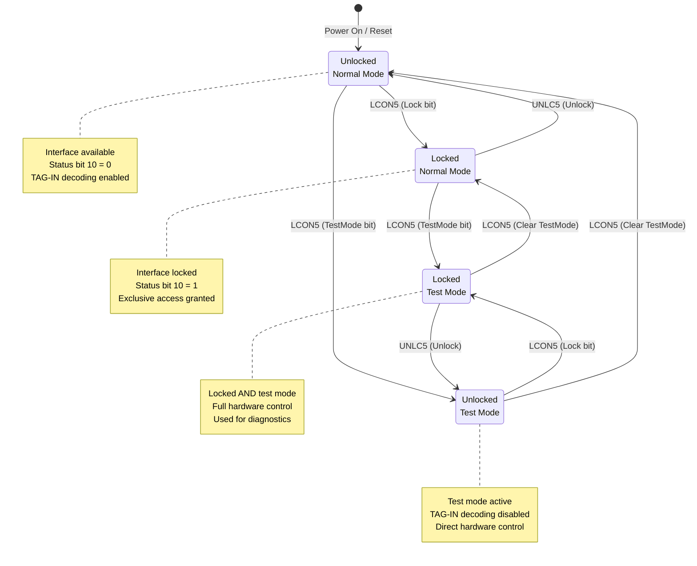

**State Transitions:**
- **Lock:** Set via LCON5 with lock bit, checked via RSTA5 bit 10
- **Unlock:** Set via UNLC5, releases exclusive access
- **Test Mode:** Controlled via LCON5 TestMode bit (disables TAG-IN decoding)
- **Status Check:** SLOC5 reads lock status without side effects

### Control and Status Registers

**Status Register Bits (from RSTA5):**

| Bit | Symbol | Description |
|-----|--------|-------------|
| 4 | 5PAGF | Inclusive OR of all errors |
| 6 | 5DMAER | Communication/DMA error |
| 7 | 5PFAIL | Power fault executed by microprogram |
| 8 | 5POWOF | Latched power fault (power was off) |
| 9 | 5CLOST | Microclock stopped |
| 10 | 5ILOCK | Interface locked |

**Control Register Operations:**

From the code analysis, typical control values written to LCON5:
- `10` (octal): Enable interrupts
- `40` (octal): Disable TAG-IN decoding
- `0`: Clear control
- `1`: Set interface active
- `2`: Return TAG
- `5`: Activate ND-500

---

## 4. Interrupt Handling (Level 12)

The ND-500 interface uses **interrupt level 12** for asynchronous communication between the ND-500 and ND-100 processors. This section documents the complete interrupt mechanism, which is critical to understanding how the system operates in real-time.

### 4.1 Interrupt Configuration

The ND-500 interface provides hardware-level interrupt control through specific register bits:

#### CONTROL Register (LCON5 - IOX offset +5)

**Bit 0: Interrupt Enable**
- **Value `1` (bit 0 set)**: Enable interrupt from ND-500 to ND-100
- **Value `0` (bit 0 clear)**: Disable interrupt
- **Typical enable value**: `10` (octal) = `0b00001000` (also sets bit 3)
- **Set via**: `A:=10; T:=HDEV+LCON5; *IOXT` (line 3089)

**Common CONTROL register values:**
```assembly
A:=10; T:=HDEV+LCON5; *IOXT    % Enable interrupts (bit 0 + bit 3)
A:=1;  T:=HDEV+LCON5; *IOXT    % Set interface active
A:=0;  T:=HDEV+LCON5; *IOXT    % Clear control (disable interrupts)
A:=5;  T:=HDEV+LCON5; *IOXT    % Activate ND-500
```

#### STATUS Register (RSTA5 - IOX offset +2)

The STATUS register provides interrupt status and trigger information:

**Bit 0: Interrupt Enabled Status**
- Read via: `T:=HDEV+RSTA5; *IOXT`
- Reflects whether interrupts are currently enabled

**Bit 3: ND-500 Finished (Primary Interrupt Trigger)**
- Set by hardware when ND-500 completes an operation
- Triggers interrupt 12 if CONTROL bit 0 is enabled
- Indicates message ready in execution queue

**Bit 4: Error (Error Interrupt Trigger)**
- Set by hardware when ND-500 encounters an error
- Triggers interrupt 12 if CONTROL bit 0 is enabled
- Requires error handling via DECOERRMESS

**Additional STATUS bits:**
- **Bit 5 (5PFAIL)**: Power fail condition (octal mask 020)
- **Bit 6 (5DMAERR)**: DMA error (octal mask 040)
- **Bit 7**: Communication error indicator
- **Combined error mask**: `720` (octal) checks bits 4-7

### 4.2 Interrupt Entry Points

The Level 12 interrupt handler is defined at **line 656** with multiple entry points:

```assembly
SUBR 5STDRIV,N500,XN500,NXTMSG,CALLID12
```

#### Entry Point Descriptions

**5STDRIV** (line 659) - Initial Interrupt Entry Point
- **Purpose**: First entry point when interrupt 12 fires
- **Function**: Validates CPU availability and status
- **Code**:
```assembly
5STDRIV:
   IF CPUAVAILABLE NBIT 5ALIVE GO CALLID12  % Check if CPU is alive
```

**N500** (line 661) - Main Driver Kernel Loop
- **Purpose**: Core message processing loop
- **Function**:
  - Reads and validates STATUS register
  - Checks for error conditions (power fail, DMA error, comm error)
  - Scans execution queue (MAILINK)
  - Dispatches to appropriate handlers
- **Error checks**:
```assembly
A:=B=:CC5CPU
177377; CALL CLE5STATUS              % Read status and mask it
IF A/\720><0 THEN                    % Check error bits (octal 720)
   IF A BIT 5PFAIL THEN              % Power fail?
      C5STAT BONE BHPFAIL BZERO BCSLPFAIL=:C5STAT
      TTMR=:TMR; KPOWDOWN            % Restart all procs with "POWER DOWN"
   ELSE IF A BIT 5DMAERR THEN N5DMAERR  % DMA error
   ELSE N5IERR                       % ND-500 communication error
   FI; FI
   GO N500ERR
FI
```

**XN500** (lines 666, 689, 700) - Extended ND-5000 Handler
- **Purpose**: Continuation points for ND-5000 systems (extended addressing)
- **Usage**: Conditional jumps from N500 and NXTMSG for ND-5000 compatibility
- **Code**: `GO XN500  % Continue in XN500 if nd5000`

**NXTMSG** (line 687) - Next Message Handler
- **Purpose**: Processes next message in execution queue
- **Function**: Called after completing current message processing
- **Returns to**: This is the main return point for all message handlers:
  - DECOMESS (normal message completion)
  - DECOERRMESS (error message handling)
  - TRAPDECODER (trapped message processing)
  - SWPDECODER (swapper message processing)
  - MCHANDEL (monitor call handling)
- **Code**:
```assembly
NXTMSG:
   GO XN500                          % Continue in XN500 if nd5000
   X:=N5MESSAGE
OD
CC5CPU=:B; CALL XACT500
```

**CALLID12** (line 693) - Callback Entry Point
- **Purpose**: Wait for next interrupt and suspend driver
- **Function**: Calls WT12 to suspend until next interrupt fires
- **Code**: `CALLID12: CALL WT12`

### 4.3 Interrupt Processing Flow

The following sequence describes the complete interrupt handling lifecycle:

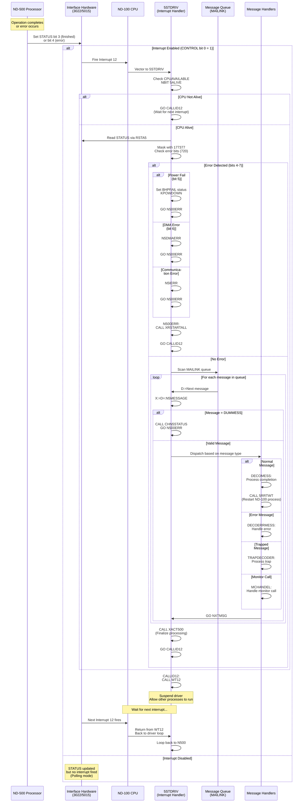

### 4.4 WT12 Wait Routine

The **WT12** routine is the core of the interrupt wait mechanism:

**Purpose:**
- Suspends the Level 12 driver until the next interrupt fires
- Allows other processes and interrupt levels to execute
- Provides efficient CPU utilization (driver doesn't busy-wait)

**Usage Pattern:**
```assembly
CALLID12: CALL WT12        % Suspend until next interrupt
```

**Behavior:**
1. **Suspend**: WT12 puts the Level 12 driver to sleep
2. **Context Switch**: CPU switches to other processes or interrupt levels
3. **Interrupt Fires**: Hardware interrupt 12 triggers
4. **Resume**: WT12 returns to CALLID12
5. **Loop**: Execution continues back to the N500 main loop

**Key Characteristics:**
- **Atomic Operation**: WT12 is designed for interrupt-safe suspension
- **No Busy-Wait**: Does not consume CPU cycles while waiting
- **System Integration**: Works with SINTRAN III's process scheduler
- **Return Path**: When interrupt fires, returns to CALLID12, which loops back to N500

**Code References:**
- Called at: line 693, 1106, 1107, 2263, 2270, 2762, 2781, 2800, 2832
- Entry point restoration via PT5RST (line 1799-1802):
```assembly
PT5RST: A:=X; *IRW LV12B DX
        "CALLID12"; *IRW LV12B DL    % Set return address to CALLID12
        "OSTRS"; *IRW LV12B DP
        LV12; *MST PID
        EXIT
```

### 4.5 Interrupt-Safe Operations

Critical sections in the ND-500 driver must be protected from interruption to maintain data structure integrity.

#### IOF (Interrupt Off) / ION (Interrupt On)

**Purpose:** Disable/enable interrupts during critical operations

**Key Usage Locations:**

**Line 61 (132260)**: Process description protection
```assembly
*IOF                                % X=PROCESS DESCRIPTION
...
*ION
```

**Line 157 (132476)**: PSTAT protection
```assembly
*IOF                              % PROTECT PSTAT
```

**Line 529 (134225)**: Queue insertion (TOQUEUE)
```assembly
TOQUEUE: *IOF
```

**Line 539 (134247)**: Error handling (N500ERR)
```assembly
N500ERR: *IOF
```

**Line 1785 (141042)**: Level 12 standard driver entry
```assembly
L12STDV: *IOF
...
*ION
```

**Common Pattern:**
```assembly
*IOF                    % Disable interrupts
% ... critical section code ...
*ION                    % Re-enable interrupts
```

#### SLOCK / SUNLOCK (Spinlock Mechanism)

**Purpose:** Provide mutual exclusion for shared data structures

**Usage Pattern:**
```assembly
CALL SLOCK; 0/\0        % Acquire lock (with error check)
% ... protected code ...
CALL SUNLOCK            % Release lock
```

**Key Usage Locations:**

**Process Insertion (line 30-32, 62-69):**
```assembly
CALL SLOCK; 0/\0
% Insert process into queue
CALL SUNLOCK
```

**Queue Manipulation (line 236-243, 370, 374):**
```assembly
CALL SLOCK; 0/\0
CALL ITO500XQ           % Insert to ND-500 execution queue
CALL SUNLOCK
```

**Swapper Operations (line 454-457, 492-496, 530-533):**
```assembly
CALL SLOCK; GO FAR N500ERR
CALL ITO500XQ           % Insert swapper message
CALL SUNLOCK
```

**Error Handling with SLOCK:**
```assembly
CALL SLOCK; GO FAR N500ERR    % If lock fails, go to error handler
```

#### When to Use Each Mechanism

**Use IOF/ION when:**
- Modifying process status (PSTAT)
- Updating global flags
- Brief, time-critical operations
- Must disable ALL interrupts

**Use SLOCK/SUNLOCK when:**
- Manipulating shared queues (MAILINK, execution queue)
- Multi-step operations on shared data structures
- Operations that may be interrupted safely but require mutual exclusion
- Allows other interrupts to fire (more cooperative)

**Critical Rule:**
> **Never manipulate the ND-500 message queues (MAILINK, execution queue) without either IOF protection or SLOCK/SUNLOCK synchronization.**

### 4.6 Lost Interrupt Recovery

The driver includes a mechanism to recover from lost interrupts, ensuring reliable operation even if hardware interrupts are missed.

**Location:** Line 3082-3089

**Scenario:**
When checking for processes waiting for an ND-500 CPU, the system detects that:
1. The ND-500 has been terminated or is idle
2. There are messages in the queue
3. An interrupt may have been lost

**Detection Code (line 3082):**
```assembly
IF X><-1 AND 500STATUS NBIT 5ILOCK THEN % Has ND-500 been terminated?
```

**Recovery Action (lines 3083-3086):**
```assembly
% Reactivate it since an interrupt may have been lost
ACT50:  5MBBANK; T:=HDEV+LMAR5; *IOXT
        A:=X; *IOXT
        A:=5; T+"LCON5-LMAR5"; *IOXT
```

**Explanation:**
1. **Detection**: Checks if queue is non-empty (`X><-1`) and ND-500 is not locked (`500STATUS NBIT 5ILOCK`)
2. **MAR Update**: Writes message address to MAR register
3. **Activation**: Writes control value `5` to LCON5 to reactivate the ND-500
4. **Result**: Forces the ND-500 to process the queued message, which will eventually trigger an interrupt

**Alternative Path (line 3088-3091):**
If no lost interrupt is detected, simply enable interrupts:
```assembly
% Enable for interrupt
A:=10; T:=HDEV+LCON5; *IOXT      % Enable interrupt (bit 0)
A:=0;  T+"LSTA5-LCON5"; *IOXT    % Clear status
A:=1;  T+"LCON5-LSTA5"; *IOXT    % Set control active
```

**Why This Matters:**
- Hardware interrupts can be lost due to timing issues, noise, or bus contention
- Without recovery, the system would hang waiting for an interrupt that never arrives
- This mechanism provides a safety net for robust operation

### 4.7 Complete Interrupt Flow Diagram

The following diagram shows the comprehensive interrupt handling architecture:

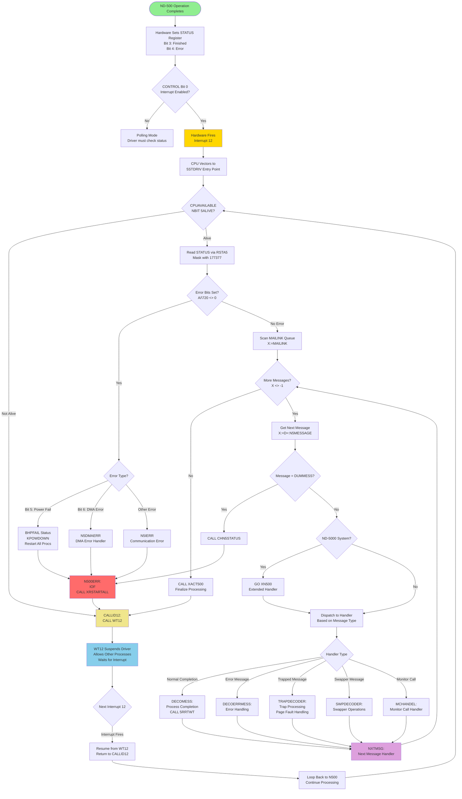

### 4.8 Code Examples

#### Example 1: Enabling Interrupts

```assembly
% Enable interrupt from ND-500 to ND-100
A:=10;               % Octal 10 = enable interrupt bit + control bit
T:=HDEV+LCON5;       % T = control register address
*IOXT                % Write to control register

% Verify interrupt is enabled by reading status
T:=HDEV+RSTA5;       % T = status register address
*IOXT                % Read status into A
% Check A bit 0 to verify interrupt enabled
```

#### Example 2: Reading Interrupt Status in Handler

```assembly
% From N500 main loop (line 668)
A:=B=:CC5CPU                    % Save CPU ID
177377; CALL CLE5STATUS         % Read status and mask it (A contains status)

% Check for errors (bits 4-7, octal mask 720)
IF A/\720><0 THEN               % If any error bit set
   IF A BIT 5PFAIL THEN         % Check bit 5 (power fail)
      % Handle power failure
      C5STAT BONE BHPFAIL BZERO BCSLPFAIL=:C5STAT
      TTMR=:TMR; KPOWDOWN
   ELSE IF A BIT 5DMAERR THEN   % Check bit 6 (DMA error)
      N5DMAERR                  % Handle DMA error
   ELSE
      N5IERR                    % Handle communication error
   FI; FI
   GO N500ERR                   % Jump to error handler
FI
```

#### Example 3: Safe Queue Operation with SLOCK

```assembly
% From line 454 (swapper message insertion)
CALL SLOCK; GO FAR N500ERR      % Acquire lock, jump to error if fails

% Protected section - insert to execution queue
CALL ITO500XQ                   % Insert swapper message to queue

CALL SUNLOCK                    % Release lock
```

#### Example 4: Critical Section with IOF/ION

```assembly
% From line 529 (queue insertion)
TOQUEUE: *IOF                   % Disable all interrupts

   % Critical section - manipulate queue pointers
   % ... queue insertion code ...

   *ION                         % Re-enable interrupts
```

#### Example 5: Message Handler Return Pattern

```assembly
% From DECOMESS handler (line 803)
DECOMESS:
   % ... process message ...

   IF normal_completion THEN
      CALL 5RRTWT               % Restart ND-100 process
   FI

   GO NXTMSG                    % Return to next message handler

% NXTMSG will loop back to check for more messages,
% eventually calling XACT500 and then CALLID12 -> WT12
```

#### Example 6: Lost Interrupt Recovery

```assembly
% From line 3082 (checking for lost interrupt)
T:=5MBBANK; X:=MAILINK; *LINK2@3 LDXTX

% Check if queue has messages and ND-500 not locked
IF X><-1 AND 500STATUS NBIT 5ILOCK THEN

   % Reactivate ND-500 (lost interrupt recovery)
ACT50:
   5MBBANK; T:=HDEV+LMAR5; *IOXT  % Prepare MAR register
   A:=X; *IOXT                     % Write message address to MAR
   A:=5; T+"LCON5-LMAR5"; *IOXT   % Write control value 5 (activate)

ELSE
   % Normal interrupt enable path
   A:=10; T:=HDEV+LCON5; *IOXT    % Enable interrupt
   A:=0;  T+"LSTA5-LCON5"; *IOXT  % Clear status
   A:=1;  T+"LCON5-LSTA5"; *IOXT  % Set control active
FI
```

### 4.9 Summary

**Key Takeaways:**

1. **Interrupt 12** is the primary communication mechanism between ND-500 and ND-100
2. **Five entry points** (5STDRIV, N500, XN500, NXTMSG, CALLID12) form the interrupt handler hierarchy
3. **WT12** provides efficient wait mechanism, suspending driver between interrupts
4. **IOF/ION** and **SLOCK/SUNLOCK** ensure interrupt-safe operation
5. **Lost interrupt recovery** provides robustness against hardware failures
6. **Message handlers** all return to NXTMSG, creating a continuous processing loop
7. **Status register bits 3 and 4** trigger interrupts; bit 0 enables them

**Critical Code Locations:**
- Interrupt handler definition: Line 656
- Main driver loop: Line 661 (N500)
- Message dispatcher: Line 687 (NXTMSG)
- Wait routine call: Line 693 (CALLID12)
- Lost interrupt recovery: Line 3082-3089
- Error handling: Line 696 (N500ERR)

**For Developers:**
Understanding interrupt handling is essential for:
- Debugging communication issues
- Implementing new message handlers
- Optimizing driver performance
- Ensuring system reliability

---

## 5. Complete API Reference

This section documents all API functions in the ND-500 interface system, organized by execution level and functionality.

### API Call Hierarchy Diagram

The following flowchart shows the complete API hierarchy across different execution levels:

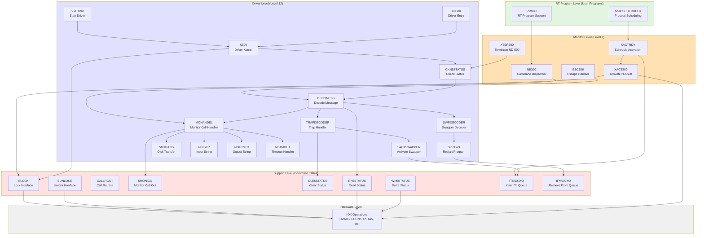

**Execution Level Summary:**
- **RT-Program Level:** User-facing APIs for ND-500 process management (from RP-P2-N500)
- **Monitor Level:** System-level commands and scheduling
- **Driver Level (Level 12):** Interrupt handlers and hardware interface
- **Support Level:** Common utilities and synchronization (from CC-P2-N500, XC-P2-N500)
- **Hardware Level:** Direct IOX register operations

### 3.1 Process Control APIs

#### 5RRTWT, 5XACTRT, 5SWACTRT (Lines 21-46)

**Purpose:** Remove message from execution queue and restart ND-500 shadow program in ND-100

**Execution Level:** Driver level (must be called with interrupt off from other levels)

**Entry Parameters:**
- X = Actual message address

**Exit Parameters:**
- T, A, D registers destroyed

**Variants:**
- `5RRTWT`: Main entry point - remove from queue and restart
- `5XACTRT`: Message of process to restart, not in EX-queue
- `5SWACTRT`: Start 5SWAP (swapper process)

**Cross-references:**
- Called by: NXTMSG, DECOMESS, monitor call handlers
- Calls: IFM500XQ, XRTACT, RTACT

---

#### XTER500 (Lines 2923-2962)

**Purpose:** Terminate (stop) ND-500 CPU

**Execution Level:** Monitor level

**Entry Parameters:**
- X = -1 (no actual message) or X ≠ -1 (actual message)

**Exit Parameters:**
- Exit: ND-500 not terminated (error)
- Exit+1: OK, ND-500 stopped

**Implementation:**
```assembly
T:=HDEV+RSTA5; *IOXT              % Read status
% Check if already stopped...
T+"TERM5-RSTA5"; *IOXT            % Send terminate command
% Wait for termination or timeout...
```

**Cross-references:**
- Called by: System shutdown, error recovery
- Calls: CHACTIVEQ (check active CPUs)

---

#### XACT500 (Lines 3052-3099)

**Purpose:** Activate the ND-500 with a message

**Execution Level:** Monitor level

**Entry Parameters:**
- B = ND-500 cpu-datafield
- X = Message to execute

**Exit Parameters:**
- T, A, D registers destroyed

**Implementation:**
```assembly
ACT50:  5MBBANK; T:=HDEV+LMAR5; *IOXT     % Set MAR register
        A:=X; *IOXT                        % Write message address
        A:=5; T+"LCON5-LMAR5"; *IOXT       % TAG-OUT = 5 (activate)
```

**Cross-references:**
- Called by: XACTRDY, N500 driver kernel
- Calls: None (direct hardware operation)

---

#### XACTRDY (Lines 2974-3040)

**Purpose:** Activate ND-500 with message if any CPU is idle or priority higher than current

**Execution Level:** Monitor level

**Entry Parameters:**
- X = Message to schedule

**Exit Parameters:**
- OK (message scheduled or activated)

**Algorithm:**
1. Check if any ND-500 CPU is idle
2. Compare message priority with currently executing messages
3. If idle or higher priority: activate immediately
4. Otherwise: insert in execution queue

**Cross-references:**
- Called by: Monitor call handlers, I/O completion
- Calls: ITO500XQ, XACT500

---

### 3.2 Monitor Call Processing

#### N500C (Lines 358-644)

**Purpose:** Level 2 (monitor level) routine to execute commands to ND-500

**Execution Level:** Monitor level (Level 2)

**Entry Parameters:**
- X = Process description

**Exit Parameters:**
- Returns to MONEN/STUPR

**Description:**
Main command dispatcher for ND-500 operations. Handles various system-level commands including:
- Process creation/termination
- Memory management
- File operations
- Device I/O setup

**Cross-references:**
- Called by: SINTRAN III monitor
- Calls: Various sub-handlers for specific commands

---

#### MCHANDEL (Lines 1267-1406)

**Purpose:** Decode monitor call messages from ND-500

**Execution Level:** Driver level

**Entry Parameters:**
- X = Actual message (=MESSAGE)
- T = Stop-reason
- B = ND-500 CPU datafield

**Exit Parameters:**
- Returns to NXTMSG in ND-500 driver kernel

**Monitor Calls Handled:**
- L12MIN=500 to L12MAX=523 (special Level 12 handling required)
- MON 500: DVIO - Device I/O operations
- MON 501: DVINST - Device input string
- MON 502: DVOUT - Device output
- MON 503: Special functions
- MON 504: Quick instring
- MON 510-523: Various system calls

**Algorithm:**
1. Decode stop-reason from message
2. Check if monitor call requires Level 12 handling
3. Route to appropriate handler (NORMMC for normal, special handlers for others)

**Cross-references:**
- Called by: DECOMESS
- Calls: N5FUD, STAPROC, NSTOPROC, NINSTR, NOUTSTR, GERRC, etc.

---

#### 5MTRANS (Lines 2440-2833)

**Purpose:** Monitor call executed on driver level for disk transfers

**Execution Level:** Driver level

**Entry Parameters:**
- X = Current message
- B = ND-500 cpu datafield

**Exit Parameters:**
- Returns to monitor call completion

**Functions Supported:**
1. Disk transfer, return immediately
2. Disk transfer, wait until finished
3. Check event, return immediately
4. Check event, wait
5. Check event, nowait
6. Check event, wait (alternate)
7. Start process, return immediately
8. Start process and wait

**Implementation Notes:**
- Validates disk addresses using CHDISKADDR
- Inserts requests into disk access queue
- Handles both synchronous and asynchronous operations
- Completion handled by 5MRDTRANS

**Cross-references:**
- Called by: MCHANDEL
- Calls: CHDISKADDR, 5MRDTRANS (on completion)

---

### 3.3 Swapper and Memory Management

#### 5ACTSWAPPER (Lines 2851-2908)

**Purpose:** Activate the ND-500 swapper process

**Execution Level:** Must be called in IOF when called from levels other than driver level

**Entry Parameters:**
- X = Message requiring service from swapper

**Exit Parameters:**
- T, A, D regs destroyed

**Description:**
Activates the swapper to handle page faults and memory swapping operations. The swapper is a special ND-500 process that manages virtual memory.

**Algorithm:**
1. Mark message as requiring swap service
2. Insert in swap-wait FIFO
3. Check if swapper already active
4. If idle: activate swapper with page fault info
5. Mark process as "swapping" status

**Cross-references:**
- Called by: TRAPDECODER (page faults), SWMC
- Calls: ITO500XQ or direct activation

---

#### SWPDECODER (Lines 912-1241)

**Purpose:** Swapper message decoder

**Execution Level:** ND-500 driver level (level 12)

**Entry Parameters:**
- X = Swapper message
- B = ND-500 cpu-datafield

**Exit Parameters:**
- Returns to ND-500 driver kernel N500

**Description:**
Handles messages from the swapper indicating swap operations are complete. Key responsibilities:
- Decode swap completion status
- Restart processes waiting for swapped pages
- Handle swap errors
- Manage swap-wait queue

**Message Status Handling:**
- Swap complete: Restart waiting process
- Swap error: Error recovery or process termination
- Partial swap: Re-queue for additional swapping

**Cross-references:**
- Called by: DECOMESS
- Calls: 5RDTRANSFER, XACTRT, error handlers

---

### 3.4 Device I/O Operations

#### NINSTR, XNINSTR (Lines 1680-1682, 1817-1929)

**Purpose:** Monitor call DVIO and DVINST - device input string

**Execution Level:** Level 12 (Driver level)

**Entry Parameters:**
- X = Current message (=MESSAGE)
- B = ND-500 CPU datafield

**Exit Parameters:**
- Varies by operation status

**Description:**
Handles input string operations from devices (primarily terminals) to ND-500 memory. Two modes:
1. **Quick mode:** Small transfers done immediately
2. **Slow mode:** Large transfers or device not ready - wait for data

**Algorithm:**
1. Get terminal datafield from message
2. Check device status and buffer availability
3. If quick mode possible: transfer bytes immediately
4. Otherwise: mark process waiting and set up interrupt handler
5. On completion: restart ND-500 process

**Cross-references:**
- Called by: MCHANDEL
- Calls: 5GTDF, INSMONCO (completion handler)

---

#### NOUTSTR (Lines 1688-1804)

**Purpose:** Device output string - send data from ND-500 to device

**Execution Level:** Driver level (Level 12)

**Entry Parameters:**
- X = Current message (=MESSAGE)
- B = ND-500 CPU datafield

**Exit Parameters:**
- Returns when output initiated or complete

**Description:**
Handles output string operations from ND-500 memory to devices (terminals, printers, etc.).

**Algorithm:**
1. Validate terminal/device from message
2. Transfer data from ND-500 memory to output buffer
3. Initiate device output driver (STDEV)
4. If device busy: mark process waiting (I/O wait)
5. When complete: restart via PT5RST (Level 10 handler)

**Cross-references:**
- Called by: MCHANDEL
- Calls: 5GTDF, PT5RST, STDEV

---

### 3.5 XMSG Message System

#### A5XMSG, B5XMSG (Lines 2062-2414)

**Purpose:** XMSG interface routines - inter-process communication

**Execution Level:** Level 12 (Driver level)

**Entry Parameters:**
- X = Current message
- B = ND-500 CPU datafield

**Exit Parameters:**
- Varies by XMSG function

**Functions Supported (0-57):**
- **Buffer Management:** Get/release message buffers
- **Header Operations:** Read/write message headers
- **Port Operations:** Open/close communication ports
- **Message Operations:** Send/receive messages
- **Status Operations:** Check message status, wait for messages

**Key Functions:**
- Func 0-5: Buffer allocation/deallocation
- Func 10-15: Header read/write
- Func 20-25: Port management
- Func 30-40: Message send/receive
- Func 50-57: Status and control

**Implementation Notes:**
- Extensive parameter validation
- Handles both synchronous and asynchronous operations
- Integrates with ND-100 XMSG system
- Provides wakeup mechanism (XMWK) when messages arrive

**Cross-references:**
- Called by: MCHANDEL
- Calls: XMWK (wakeup), P12DCN (disconnect), various XMSG primitives

---

### 3.6 Driver and Kernel APIs

#### 5STDRIV, N500 (Lines 656-721)

**Purpose:** Level 12 - ND-500 communication driver kernel

**Execution Level:** Level 12 (Driver level)

**Entry Parameters:**
- Activated by interrupt or explicit call

**Exit Parameters:**
- Returns when no more messages to process

**Description:**
Main driver kernel for ND-500 communication. This is the heart of the ND-500 interface.

**Algorithm:**
```
NXTMSG: % Get next message from execution queue
        If queue empty: exit driver
        Activate ND-500 with message
        Wait for response
        Decode response:
            - Normal answer → DECOMESS
            - Error answer → DECOERRMESS
            - Trap message → TRAPDECODER
            - Swap message → SWPDECODER
        Process result
        Loop to NXTMSG
```

**Cross-references:**
- Activated by: LOWACT500, timer interrupts, completion handlers
- Calls: NXTMSG, CHN5STATUS, DECOMESS, DECOERRMESS, TRAPDECODER, SWPDECODER

---

#### CHN5STATUS (Lines 730-759)

**Purpose:** Check and handle ND-500 status

**Execution Level:** Driver level

**Entry Parameters:**
- X = Message address

**Exit Parameters:**
- Routes to appropriate handler

**Description:**
Reads ND-500 status register and decodes response type:

**Status Values:**
- `STOPPED`: ND-500 stopped normally - decode answer
- `I5TMQU`: Process in time queue (waiting)
- `TRAPPED`: Process trapped - handle error/page fault
- `SWAPPING`: Swap operation in progress
- Other: Error conditions

**Algorithm:**
1. Read N500 status from message buffer
2. Decode status using RN5STATUS
3. Route to appropriate handler:
   - Answer → DECOMESS
   - Trap → TRAPDECODER
   - Swap → SWPDECODER

**Cross-references:**
- Called by: N500 (main driver loop)
- Calls: RN5STATUS, DECOMESS, TRAPDECODER, SWPDECODER

---

#### DECOMESS (Lines 803-819)

**Purpose:** Decode "ANSWER-MESSAGE" from N500

**Execution Level:** Driver level

**Entry Parameters:**
- X = Actual message (=MESSAGE)
- B = N500 CPU-datafield

**Exit Parameters:**
- Returns to NXTMSG in driver kernel N500

**Description:**
Routes answer messages to appropriate handlers based on message type:

**Answer Types:**
- Monitor call answers → MCHANDEL
- I/O completion → Device handlers
- System responses → System call handlers

**Cross-references:**
- Called by: CHN5STATUS
- Calls: MCHANDEL, various completion handlers

---

### 3.7 Error and Trap Handling

#### TRAPDECODER (Lines 859-895)

**Purpose:** Decode "TRAP-MESSAGES" from N500

**Execution Level:** Driver level

**Entry Parameters:**
- X = "Trapped" message
- B = N500 CPU-datafield

**Exit Parameters:**
- Returns to NXTMSG in driver kernel N500

**Description:**
Handles trap conditions from ND-500, including:

**Trap Types:**
- **Page Faults:** Most common - activate swapper
- **Program Errors:** Invalid operations, protection violations
- **Hardware Errors:** Interface errors, power failures

**Algorithm:**
1. Read trap information from message
2. Determine trap type
3. If page fault:
   - Extract page number and access type
   - Activate swapper with fault info
4. If program error:
   - Set error status in message
   - Terminate process or error recovery
5. If hardware error:
   - Log error
   - System recovery or halt

**Cross-references:**
- Called by: CHN5STATUS
- Calls: 5ACTSWAPPER (page faults), error handlers

---

#### DECOERRMESS (Lines 835-844)

**Purpose:** Decode "ERROR-ANSWER" messages from N500

**Execution Level:** Driver level

**Entry Parameters:**
- X = Actual message
- B = N500 CPU-datafield

**Exit Parameters:**
- Returns to NXTMSG in driver kernel N500

**Description:**
Handles error responses from ND-500 operations. Error types:
- Invalid operation
- Resource not available
- Timeout
- Hardware failure

**Algorithm:**
1. Extract error code from message
2. Map to SINTRAN III error code
3. Set error status in calling process
4. Restart process with error indication

**Cross-references:**
- Called by: CHN5STATUS
- Calls: Error recovery routines

---

### 3.8 Escape and Cleanup

#### ESC500 (Lines 55-91)

**Purpose:** SYSABORT routine for escape handling

**Execution Level:** Monitor level

**Entry Parameters:**
- X = Addr of input datafield

**Exit Parameters:**
- Process enters cleanup/escape sequence

**Description:**
Handles escape/abort sequence for ND-500 processes. Triggered by:
- User typing ESCAPE on terminal
- ABORT-JOB command
- ABORT-BATCH command
- System errors requiring cleanup

**Algorithm:**
1. Find ND-500 process from terminal datafield
2. Check if already in escape sequence
3. Set escape flag (5IBRK) in message status
4. Force program to start in FROMESC routine
5. Begin cleanup sequence

**Cross-references:**
- Called by: ESC5ON (from ESCON handler), 5BABORT
- Calls: S5ESCF (set escape flag)

---

#### RL5PDESC, 1RL5PDESC (Lines 108-134)

**Purpose:** Release the ND-500 process description after termination

**Execution Level:** Monitor level

**Entry Parameters:**
- T = Monitor level routine to execute after termination
- X = RT-description addr (when RL5PDESC)

**Exit Parameters:**
- Return to STUPR if program reserved ND-500 proc, else exit

**Description:**
Called when an error is detected by SINTRAN III monitor. Performs cleanup:
- Release ND-500 process resources
- Free message buffers
- Remove from execution queues
- Deallocate ND-500 process descriptor

**Cross-references:**
- Called by: Monitor error handlers, MON.CALL error paths
- Calls: Resource deallocation routines

---

### 3.9 Utility and Support APIs

#### FSEMA (Lines 12-26, CC-P2-N500.NPL)

**Purpose:** Check if program has reserved an ND-500 process

**Execution Level:** Level 1 with interrupt off, or monitor level

**Entry Parameters:**
- D = RT-DESCRIPTION address

**Exit Parameters:**
- Exit: Program has not reserved any ND-500 process
- Exit+1: X = Process description of reserved ND-500 process

**Algorithm:**
1. Traverse resource reservation queue (BRESLINK)
2. Check each reserved resource
3. If resource is in ND-500 range (S500S to S500E):
   - Return process description
4. Otherwise: no ND-500 process found

**Cross-references:**
- Called by: Many routines to verify ND-500 reservation
- Calls: None (simple traversal)

---

#### SLOCK, SUNLOCK (Lines 691-772, CC-P2-N500.NPL)

**Purpose:** Lock/unlock N500 execution queue/interrupt semaphore

**Execution Level:** Any level

**Entry Parameters:**
- None

**Exit Parameters:**
- SUNLOCK: Always OK (exit)
- SLOCK: Error (exit) or OK (exit+1)

**Description:**
Critical synchronization primitives for ND-500 operations. Uses hardware Test-and-Set:
- **Rask CPU:** Physical test-and-set (TSETP)
- **CX CPU:** Logical test-and-set (TSET)

**Algorithm (SLOCK):**
1. Execute Test-and-Set on X5SEMA
2. If acquired: Mark N100 as reserving CPU
3. If failed: Retry with timeout (~100ms per attempt)
4. If timeout: Return lock timeout error

**Algorithm (SUNLOCK):**
1. Check if N100 owns lock (X5RES = -1)
2. If yes: Clear lock and reservation
3. Return

**Cross-references:**
- Called by: Nearly all ND-500 operations requiring atomicity
- Calls: None (uses hardware instructions)

---

#### GCPUDF (Lines 627-644, CC-P2-N500.NPL)

**Purpose:** Get CPU datafield of CPU on which process is running

**Execution Level:** Any level

**Entry Parameters:**
- X = Address of message within bank

**Exit Parameters:**
- Exit: Error, illegal CPU number in message
- Exit+1: A = CPU datafield address

**Algorithm:**
1. Read CPU number from message (5CPUN field)
2. Validate: CPU number 1-N
3. Calculate datafield address: (CPUNUM-1) * 5CPUDFSZ + S5CPUDF
4. Validate address within range (≤ E5CPUDF)
5. Return datafield address

**Cross-references:**
- Called by: Most driver-level routines
- Calls: ERRFATAL (on validation failure)

---

#### RN5STATUS, WN5STATUS (Lines 679-687, CC-P2-N500.NPL)

**Purpose:** Get/set status word in ND-500 message

**Execution Level:** Any level

**Entry Parameters:**
- X = Address of message within bank
- WN5STATUS: A = Value to set

**Exit Parameters:**
- RN5STATUS: A = Status value read

**Description:**
Provides cache-coherent access to ND-500 message status. Uses cache flush operations:
```assembly
*BSET BCM 120 DX; N5STA@3 LDATX    % Fool the cache (read twice)
*BSET BCM 120 DX; N5STA@3 LDATX    % Ensures fresh data
```

**Status Values:**
- `STOPPED`: Process stopped normally
- `I5TMQU`: In time queue (waiting)
- `TRAPPED`: Trap occurred
- `SWAPPING`: Swap in progress
- `ACTIVE`: Process executing

**Cross-references:**
- Called by: CHN5STATUS, MCCO, many others
- Calls: None (direct memory access)

---

### 3.10 Octobus and Multiprocessor APIs

#### XKICK500 (Lines 3278-3316)

**Purpose:** Kick the ND-500 via octobus

**Execution Level:** Level 12 (must be called in IOF if called from other levels)

**Entry Parameters:**
- A = Kick type (in CKICKTYPE)

**Exit Parameters:**
- Returns after kick sent

**Description:**
Sends octobus kick message to ND-500 to signal events:
- Wakeup from idle
- Attention required
- Interrupt notification

**Cross-references:**
- Called by: Various wakeup mechanisms
- Calls: Octobus send primitives

---

#### 5OMBREAD (Lines 3453-3551)

**Purpose:** Read octobus message from the ACCP

**Execution Level:** Monitor level

**Entry Parameters:**
- None (activated by multibyte message received on reserved OMD number)

**Exit Parameters:**
- Message processed

**Description:**
Handles error messages from:
- **ACCP:** Memory errors (parity, ECC)
- **5000-MP:** Microprogram errors
- **MF-controller:** Controller errors

**Error Record Structure:**
- Error type code
- Time stamp
- Affected address
- Error details

**Cross-references:**
- Activated by: Octobus message arrival
- Calls: Error logging, system recovery

---

### 3.11 Time Queue Management

#### M5TMOUT (Lines 1609-1678)

**Purpose:** Monitor call M5TMOUT - timeout handling

**Execution Level:** Driver level

**Entry Parameters:**
- X = Current message (=MESSAGE)
- B = ND-500 cpu datafield

**Exit Parameters:**
- Message inserted in time queue

**Description:**
Implements timed wait for ND-500 processes. Used for:
- Delay operations (sleep)
- Timeout on I/O operations
- Periodic wakeup

**Algorithm:**
1. Extract timeout value from message
2. Calculate wakeup time (current time + timeout)
3. Insert message in time queue (sorted by wakeup time)
4. Mark process as waiting in time queue (5ITMQUEUE)
5. Return to NXTMSG (process suspended)

**Wakeup Mechanism:**
- 500HIST (Level 2 routine) called each basic time unit
- Checks time queue head
- If wakeup time reached: remove from time queue, insert in execution queue
- Process reactivated at next scheduling

**Cross-references:**
- Called by: MCHANDEL
- Calls: FR5TMQU (remove from time queue), ITO500XQ (insert in exec queue)
- Wakeup by: 500HIST

---

#### 500HIST (Lines 209-345)

**Purpose:** Level 2 routine called each basic time unit

**Execution Level:** Level 2

**Entry Parameters:**
- None

**Exit Parameters:**
- All registers destroyed

**Description:**
Called from ICLCK in IOF and returns in IOF but has ION sequences inside. Functions:
1. **Time Queue Management:** Check for expired timeouts
2. **Histogram Updates:** Process CPU time accounting
3. **Watchdog:** Check for hung processes

**Algorithm:**
```
500HIST:
    Save registers
    Check time queue head
    While messages have expired timeout:
        Remove from time queue
        Insert in execution queue
        Activate ND-500 driver
    Next message
    Update histogram counters
    Check watchdog timers
    Restore registers
    Exit
```

**Cross-references:**
- Called by: ICLCK (interval clock interrupt)
- Calls: FR5TMQU, ITO500XQ, XACT500

---

### 3.12 System Control

#### ST0PSYS (Lines 3759-3802)

**Purpose:** Continuation on monitor level of STOP-SYSTEM command

**Execution Level:** Monitor level

**Entry Parameters:**
- None

**Exit Parameters:**
- Does not return (system stops)

**Description:**
Orderly shutdown of ND-500 system:
1. Terminate all ND-500s (if any)
2. Clear caches
3. Dump critical data
4. Reset CPUs
5. Simulate power failure to complete shutdown

**Algorithm:**
1. For each active ND-500 CPU:
   - Send terminate command
   - Wait for acknowledgment or timeout
2. Clear all CPU caches (cache coherency)
3. Write shutdown record to log
4. Reset hardware interfaces
5. Trigger power fail sequence (controlled shutdown)

**Cross-references:**
- Called by: STOP-SYSTEM command handler
- Calls: XTER500, RS5CPU, cache management

---

#### RS5CPU (Lines 3352-3369)

**Purpose:** Reset all active CPUs

**Execution Level:** Level 1 (5pit)

**Entry Parameters:**
- None

**Exit Parameters:**
- All ND-500 CPUs reset

**Description:**
Hardware reset of all active ND-500 CPUs in system. Used for:
- System initialization
- Error recovery
- Shutdown

**Algorithm:**
1. Traverse active CPU list
2. For each CPU:
   - Send octobus reset command (XRS5CPU)
   - Clear CPU datafield
   - Mark CPU as inactive
3. Clear global CPU state

**Cross-references:**
- Called by: System initialization, ST0PSYS, error recovery
- Calls: XRS5CPU (per-CPU reset)

---

#### CHACTIVEQ (Lines 3252-3267)

**Purpose:** Check number of active CPUs in the system

**Execution Level:** Monitor level

**Entry Parameters:**
- None

**Exit Parameters:**
- Exit: No active CPU
- Exit+1: One or more active CPUs

**Description:**
Scans CPU list to determine if any ND-500 CPUs are active. Used to:
- Determine if system operational
- Optimize operation (skip work if no CPUs)
- Error recovery decisions

**Algorithm:**
1. Read LEXQUEUE (number of messages in execution queue)
2. If LEXQUEUE > 0: active CPUs exist
3. Otherwise: check CPU status flags

**Cross-references:**
- Called by: XRSTARTALL, system status checks
- Calls: None (simple check)

---

## 6. Key Assembly Patterns

### 6.1 IOX Instructions for IOX Operations

**Pattern:** `*IOXT` instruction

The `*IOXT` instruction performs I/O operations on the ND-100. The T register contains the IOX device address, and A register contains data to write (or receives data read).

**Examples Using Actual Symbols:**

```assembly
% Read ND-500 status register
T:=HDEV+RSTA5; *IOXT              % RSTA5 (offset +2): Read status into A

% Write to Memory Address Register
T:=HDEV+LMAR5; *IOXT              % LMAR5 (offset +1): Load MAR register offset
A:=address; *IOXT                 % Write address value

% Write to control register
A:=10; T:=HDEV+LCON5; *IOXT       % LCON5 (offset +5): Load control register

% Read TAG-IN register
T:=HDEV+RTAG5; *IOXT              % RTAG5 (offset +10): Read TAG-IN into A

% Write TAG-OUT register
A:=5; T:=HDEV+LTAG5; *IOXT        % LTAG5 (offset +11): Write TAG-OUT code 5

% Sequential register access (using relative addressing)
T:=HDEV+LMAR5; *IOXT              % Load MAR register offset
A:=address; *IOXT                 % Write address
A:=5; T+"LCON5-LMAR5"; *IOXT      % Adjust T by (LCON5-LMAR5)=4, write control
```

**Key IOX Device Symbols:**
- `HDEV+RSTA5` (offset +2): Read Status register
- `HDEV+LSTA5` (offset +3): Load Status register
- `HDEV+RCON5` (offset +4): Read Control register
- `HDEV+LCON5` (offset +5): Load Control register
- `HDEV+LMAR5` (offset +1): Load Memory Address Register
- `HDEV+RTAG5` (offset +10): Read TAG-IN
- `HDEV+LTAG5` (offset +11): Write TAG-OUT
- `HDEV+UNLC5` (offset +16): Unlock interface
- `HDEV+SLOC5` (offset +14): Set Lock on interface
- `HDEV+TERM5` (offset +7): Terminate ND-500
- `HDEV+MCLR5` (offset +6): Master Clear

### 6.2 *LDATX/*STATX for Data Register Access

**Pattern:** `*LDATX` (Load Data with Index) and `*STATX` (Store Data with Index)

Used for accessing ND-500 message buffers and data structures in bank-switched memory.

**Examples:**

```assembly
% Read from ND-500 message buffer
T:=5MBBANK                        % T=bank number of ND-500 memory
X:=message_addr                   % X=logical address within bank
*AAX 5MSFL                        % Add offset to 5MSFL field
LDATX                             % Load: A=value at T:X
AAX -5MSFL                        % Restore X to base

% Write to ND-500 message buffer
T:=5MBBANK                        % T=bank number
A:=value_to_write                 % A=data to write
*AAX FUNCV                        % Add offset to FUNCV field
STATX                             % Store: A→T:X
AAX -FUNCV                        % Restore X
```

**AAX (Add to Index):** Modifies X register by adding immediate value
- `AAX field_offset`: X := X + field_offset
- `AAX -field_offset`: X := X - field_offset (restore)

**Common Patterns:**
```assembly
*AAX offset; LDATX; AAX -offset   % Read and restore X
*AAX offset; STATX; AAX -offset   % Write and restore X
```

### 6.3 BONE/BZERO Bit Operations

**Pattern:** Bit operations for setting/clearing flags

`BONE` (Bit ON Enable) and `BZERO` (Bit Zero) are used for manipulating individual bits in status words.

**Examples:**

```assembly
% Set bit 5IBRK (escape flag) in message status
T:=5MBBANK                        % Select bank
*AAX 5MSFL; LDATX                 % Read current flags
A BONE 5IBRK                      % Set bit 5IBRK
*STATX; AAX -5MSFL                % Write back

% Clear bit 55REP (repeat flag)
T:=5MBBANK
*AAX 5MSFL; LDATX
A BZERO 55REP                     % Clear bit 55REP
*STATX; AAX -5MSFL

% Set one bit and clear another
A BONE 5ACTIVE BZERO 5WAIT        % Set ACTIVE, clear WAIT
*STATX
```

**Common Bit Flags:**
- `5IBRK`: Escape/break flag
- `5ACTIVE`: Process active
- `5WAIT`: Process waiting
- `5IEXQUEUE`: In execution queue
- `5ITMQUEUE`: In time queue
- `55REP`: Repeat operation
- `5REWA`: Wait for restart by driver

**Bit Testing:**

```assembly
IF A BIT 5POWOF THEN              % Test if bit set
   % Handle power off condition
FI

IF A NBIT 5ILOCK THEN             % Test if bit NOT set
   % Interface not locked
FI
```

### 6.4 Register Conventions

The ND-100 Nord Programming Language (NPL) uses these register conventions:

| Register | Purpose |
|----------|---------|
| **A** | Accumulator - primary data register |
| **T** | Temporary - secondary data, bank selector |
| **D** | Data register - double-precision operations |
| **X** | Index register - array indexing, pointers |
| **B** | Base register - datafield pointers |
| **L** | Link register - return addresses, temporary storage |
| **P** | Program counter |
| **K** | Condition flag (carry, etc.) |

**Conventions in ND-500 Code:**

```assembly
% Register saving pattern
INTEGER AREG, DREG, XREG, LREG    % Declare save variables
ROUTINE:
    A=:AREG; D=:DREG; X=:XREG     % Save registers
    A:=L=:"LREG"                  % Save L and return address

    % Do work...

    AREG; D:=DREG; X:=XREG        % Restore registers (A:=AREG implied)
    GO LREG                       % Return via saved L

% Triple register for T-A-D
TRIPLE TADREG                     % Declare triple (48-bit)
TAD=:TADREG                       % Save all three
% ... work ...
TAD:=TADREG                       % Restore all three
```

**Common Patterns:**

```assembly
% Pointer dereferencing
X:=pointer; *LDXTX                % X := contents at X

% Conditional execution
IF condition THEN                 % Generates branch
    statements
FI

% Multiple assignment
A=:B=:C                           % C:=A; B:=A

% Chain assignment
D:=X.FIELD1=:Y.FIELD2             % Read X.FIELD1, write to Y.FIELD2, keep in D
```

### 6.5 Interrupt Control

**Pattern:** IOF/ION for interrupt enable/disable

```assembly
*IOF                              % Interrupts OFF (critical section)
% Critical code that must be atomic
*ION                              % Interrupts ON

% Save interrupt state
*TRA STS                          % Transfer Status to A
IOF                               % Interrupts off
BLDA 170 DA                       % Extract interrupt enable bit to K
% Do work...
IF K THEN                         % If was enabled
    *ION                          % Restore enabled
FI
```

**Level Switching:**

```assembly
% Switch to different privilege level
"NMPIT+ADPIT+ALEVB+ERNG2"=:RTREF.ACTPRI
*TRR PCR                          % Transfer to Program Control Register

% Privilege levels:
% N5PIT - ND-500 interface level
% NMPIT - Monitor pit
% NRPIT - Real-time pit
% NSPIT - System pit
% NFPIT - File system pit
```

### 6.6 Bank-Switched Memory Access

**Pattern:** Multi-bank memory windows

```assembly
% Setup window for ND-500 message access
T:=bank_number                    % Physical bank
D:=physical_page/\1777            % Page within bank
A:=142000                         % Logical window address
X:="WND41+WND41+174000"           % Window descriptor
*STDTX                            % Setup window 41

% Access through window
A:=142000+offset                  % Calculate window address
*LDATX or *STATX                  % Access through window

% Clear window
X:="WND41+WND41+174000"
T:=0
*STZTX                            % Clear window entry
```

**ND-500 Message Bank Access:**

```assembly
T:=5MBBANK                        % Bank containing ND-500 messages
X:=message_address                % Message logical address
*AAX field_offset                 % Add field offset
LDATX                             % Read field value
```

### 6.7 Queue Operations

**Pattern:** Doubly-linked list manipulation

```assembly
% Insert in queue
ITO500XQ:
    T:=5MBBANK
    X:=MAILINK                    % Queue header
    DO
        *LINK@3 LDDTX             % D:=X.LINK (next pointer)
    WHILE D><-1                   % While not end
        IF priority check THEN GO insert_here FI
        X:=D                      % Advance to next
    OD
    % Insert at position
    *LINK@3 LDDTX                 % Previous.LINK
    X:=new_element; *LINK@3 STDTX % current.LINK := previous.LINK
    % Update backward link...

% Remove from queue
IFM500XQ:
    T:=5MBBANK
    X:=element_to_remove
    *LINK@3 LDDTX                 % D:=forward link
    *AAX PLINK; LDXTX             % X:=backward link
    *LINK@3 STDTX                 % backward.LINK := forward
    IF D><-1 THEN
        X:=D; *AAX PLINK; STATX   % forward.PLINK := backward
    FI
```

### 6.8 Error Handling

**Pattern:** Dual-exit subroutines

```assembly
ROUTINE:
    % ... do work ...
    IF error THEN
        EXIT                      % Return to caller (error)
    FI
    % Success path
    EXITA                         % Return to caller+1 (success)

% Caller:
    CALL ROUTINE
    GO error_handler              % Taken if EXIT
    % Success continues here      % Taken if EXITA
```

### 6.9 Message Status Operations

**Pattern:** Read-Modify-Write of message status

```assembly
% Atomic flag update
*IOF                              % Disable interrupts
T:=5MBBANK; X:=message
*AAX 5MSFL; LDATX                 % Read current status
A=:D BONE 5IEXQUEUE               % Set flag, save in D
*STATX; AAX -5MSFL                % Write back
IF D BIT 5IEXQUEUE THEN           % Check if was already set
    *ION; EXIT                    % Already queued, exit
FI
% Continue processing...
*ION
```

### 6.10 Cache Management

**Pattern:** Cache coherency operations

```assembly
% Fool the cache (ensure fresh read)
*BSET BCM 120 DX                  % Cache control
N5STA@3 LDATX                     % Read status (first time)
*BSET BCM 120 DX                  % Cache control again
N5STA@3 LDATX                     % Read status (second time = fresh)

% Clear cache on status update
140300; *AAX H500A; STATX         % Clear cache status bits
```

---

## 7. Symbol Definitions

### 7.1 Interface Register Offsets (from HDEV)

These symbols define IOX device offsets for the 3022 interface card. **Note:** Offsets +10 and higher are in octal.

| Symbol | IOX Offset | Octal | Description |
|--------|:----------:|:-----:|-------------|
| **RMAR5** | +0 | 000000 | Read Memory Address Register |
| **LMAR5** | +1 | 000001 | Load Memory Address Register |
| **RSTA5** | +2 | 000002 | Read Status Register |
| **LSTA5** | +3 | 000003 | Load Status Register |
| **RCON5** | +4 | 000004 | Read Control Register |
| **LCON5** | +5 | 000005 | Load Control Register |
| **MCLR5** | +6 | 000006 | Master Clear |
| **TERM5** | +7 | 000007 | Terminate ND-500 |
| **RTAG5** | +10 | 000010 | Read TAG-IN register |
| **LTAG5** | +11 | 000011 | Write TAG-OUT register |
| **RLOW5** | +12 | 000012 | Read Lower Limit |
| **LDAT5** | +13 | 000013 | Load Data / Write Lower |
| **SLOC5** | +14 | 000014 | Set Lock (status lock) |
| **UNLC5** | +16 | 000016 | Unlock interface |
| **RETG5** | +17 | 000017 | Return Tag / End Gate |

### 7.2 Status Register Bit Flags

| Symbol | Bit | Description |
|--------|-----|-------------|
| 5PAGF | 4 | Page fault / Inclusive OR of errors |
| 5DMAER | 6 | DMA/Communication error |
| 5PFAIL | 7 | Power fault executed by microprogram |
| 5POWOF | 8 | Latched power off status |
| 5CLOST | 9 | Microclock stopped |
| 5ILOCK | 10 | Interface locked |

### 7.3 Message Status Flags (5MSFL field)

| Symbol | Description |
|--------|-------------|
| 5IBRK | Escape/break flag (in escape sequence) |
| 5IEXQUEUE | Process in execution queue |
| 5ITMQUEUE | Process in time queue |
| 5ACTIVE | Process actively executing |
| 52ESCSET | Escape set flag |
| 5SYSRES | System reserved flag |

### 7.4 Process Status Flags (PSTAT field)

| Symbol | Description |
|--------|-------------|
| 5ACTIVE | Process active (executing or ready) |
| 5WAIT | Process waiting (I/O wait) |
| 5REWA | Wait for restart by ND-500 driver |
| F5BUFF | Has buffer allocated |
| T5BUFF | Temporary buffer flag |
| 55REP | Repeat operation flag |
| 55BRKPRIOR | Break priority set |
| 5CLRUNSTATUS | Clear/run status mask |
| OFLDUNLOCK | Overflow/unlock flag |

### 7.5 Process Execution States

| Symbol | Value | Description |
|--------|-------|-------------|
| STOPPED | 0 | Process stopped normally |
| I5TMQU | 1 | Process in time queue (waiting) |
| TRAPPED | 2 | Process trapped (error or page fault) |
| SWAPPING | 3 | Swap operation in progress |
| MSGN500 | - | Message to/from ND-500 |

#### Process Lifecycle State Diagram

The following state diagram shows the complete process lifecycle and state transitions:

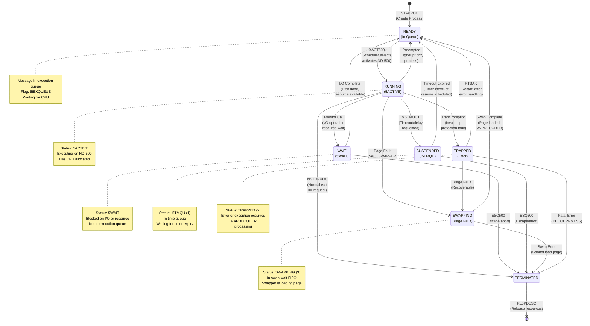

**State Transition APIs:**
- **STAPROC:** Create and start process (→ READY)
- **XACT500:** Activate process on ND-500 (READY → RUNNING)
- **NSTOPROC:** Stop/terminate process (→ TERMINATED)
- **ESC500:** Escape/abort process (any state → TERMINATED)
- **5ACTSWAPPER:** Activate swapper for page fault (RUNNING → SWAPPING)
- **RTBAK:** Restart after trap (TRAPPED → READY)
- **M5TMOUT:** Set timeout/delay (RUNNING → SUSPENDED)
- **SWITPROC:** Switch/preempt process (RUNNING → READY)
- **RL5PDESC:** Release process descriptor (TERMINATED → end)

### 7.6 Message Buffer Fields

| Symbol | Offset | Description |
|--------|--------|-------------|
| 5MSFL | 0 | Message status flags |
| XADPR | 1 | Process description address |
| FUNCV | 2 | Function value (return value) |
| KFLIP | 3 | K flip-flop (error indicator) |
| NUMPA | 4 | Number of parameters |
| 5ADP3 | 5 | Address parameter 3 |
| LINK | 6 | Forward link in queue |
| PLINK | 7 | Backward link in queue |
| 5PRIO | 8 | Process priority |
| 5CPUN | 9 | CPU number |
| XTBLK | 10 | XT-BLOCK address (XMSG) |
| LRET | 11 | Return address |
| 5BRG | 12 | B register save |
| H500A | 13 | H500 address |
| TRAPN | 14 | Trap number |
| N5STA | 15 | ND-500 status word |
| X5PRO | 16 | ND-500 process number |
| X5SND | 17 | ND-500 send data |
| CINSTR | 18 | Current instruction |

### 7.7 CPU Datafield Structure

| Symbol | Description |
|--------|-------------|
| S5CPUDF | Start of CPU datafield array |
| E5CPUDF | End of CPU datafield array |
| 5CPUDFSZ | Size of one CPU datafield |
| MAILINK | Main execution queue link |
| X5CPU | CPU identification |
| X5CCL | Clear cache control |

### 7.8 Global ND-500 Structures

| Symbol | Description |
|--------|-------------|
| S500S | Start of ND-500 process descriptors |
| S500E | End of ND-500 process descriptors |
| 5PRDSIZE | Size of one process descriptor |
| 5MBBANK | Message buffer bank number |
| LEXQUEUE | Length of execution queue |
| 5CPUSTOPPED | CPU stopped flag |
| 500STATUS | Global ND-500 status |
| FERROR | Fatal error code |
| N5STOPPED | ND-500 stopped status |
| N5LTIMOUT | Lock timeout error |
| POWDOWN | Power down flag |
| MPFAIL | Multiprocessor failure |

### 7.9 Synchronization

| Symbol | Description |
|--------|-------------|
| X5SEMA | ND-500 semaphore |
| X5RES | Reservation flag (-1 = N100 owns) |
| X5MXF | Maximum FIFO entries |
| X5FYL | FIFO fill level |
| X5FIF | FIFO base address |

### 7.10 Error Codes

| Symbol | Value | Description |
|--------|-------|-------------|
| N5STOPPED | - | ND-500 stopped |
| N5LTIMOUT | - | Lock acquisition timeout |
| POWDOWN | - | Power failure |
| MPFAIL | - | Multiprocessor failure |

---

## 8. Symbol Usage in Code

This section demonstrates how the hardware interface symbols are actually used in the NPL source code, showing the relationship between HDEV (device base address), symbol offsets, and the *IOXT instruction.

### 8.1 Basic Concepts

**HDEV (Hardware Device Base Address):**
- HDEV is the base IOX address for the ND-500 interface hardware (3022 card)
- All interface registers are accessed as offsets from HDEV
- Example: If HDEV=100 (octal), then HDEV+RSTA5 = 102 (octal)

**Symbol Offset Addition:**
- Symbols like RSTA5, LMAR5, etc. are numeric constants representing register offsets
- The expression `HDEV+RSTA5` calculates the actual IOX device address
- This address is loaded into the T register before executing *IOXT

**The *IOXT Instruction:**
- Performs I/O transfer using the address in T register
- For read operations: data is returned in A register
- For write operations: data is taken from A register

### 8.2 Reading Interface Registers

**Reading Status Register (includes TAG-IN):**
```assembly
T:=HDEV+RSTA5; *IOXT              % T = device address (HDEV+2)
                                  % A = status value after *IOXT
% Now A contains the status register value
```

**Reading TAG-IN Register Directly:**
```assembly
T:=HDEV+RTAG5; *IOXT              % T = device address (HDEV+10 octal)
                                  % A = TAG-IN value after *IOXT
% Now A contains the TAG-IN register value
```

**Reading Memory Address Register:**
```assembly
T:=HDEV+RMAR5; *IOXT              % T = device address (HDEV+0)
                                  % A = MAR value after *IOXT
```

**Reading Control Register:**
```assembly
T:=HDEV+RCON5; *IOXT              % T = device address (HDEV+4)
                                  % A = control register value after *IOXT
```

### 8.3 Writing Interface Registers

**Writing to Memory Address Register:**
```assembly
A:=address_value                  % Load value to write
T:=HDEV+LMAR5; *IOXT              % Write A to MAR (HDEV+1)
```

**Writing to Control Register:**
```assembly
A:=control_value                  % Load control value
T:=HDEV+LCON5; *IOXT              % Write A to control register (HDEV+5)
```

**Writing TAG-OUT:**
```assembly
A:=5                              % TAG-OUT code 5 (Write Data)
T:=HDEV+LTAG5; *IOXT              % Write to TAG-OUT register (HDEV+11 octal)
```

**Sending Terminate Command:**
```assembly
T:=HDEV+TERM5; *IOXT              % Send terminate (HDEV+7)
```

**Setting Interface Lock:**
```assembly
T:=HDEV+SLOC5; *IOXT              % Set lock (HDEV+14 octal)
```

**Unlocking Interface:**
```assembly
T:=HDEV+UNLC5; *IOXT              % Unlock (HDEV+16 octal)
```

### 8.4 Relative Offset Calculations

NPL allows calculating offsets between symbols to adjust the T register without recalculating from HDEV:

**Example: Sequential Register Access**
```assembly
T:=HDEV+LMAR5; *IOXT              % T = HDEV+1 (write to MAR)
A:=address; *IOXT                 % Write address value

% Now adjust T to point to LCON5 without recalculating from HDEV
A:=5; T+"LCON5-LMAR5"; *IOXT      % T = T + (5-1) = T+4 = HDEV+5
                                  % Write 5 to control register
```

**Explanation:**
- `LCON5-LMAR5` = 5-1 = 4 (the offset difference)
- `T+"LCON5-LMAR5"` means T := T + 4
- This is more efficient than recalculating `HDEV+LCON5`

**Another Example:**
```assembly
T:=HDEV+RSTA5; *IOXT              % Read status (HDEV+2)
T+"TERM5-RSTA5"; *IOXT            % Adjust T by (7-2)=5, now at HDEV+7
                                  % Send terminate command
```

### 8.5 Complete Operation Sequences

**Example 1: Activate ND-500 Process**
```assembly
% 1. Setup MAR with message address
T:=HDEV+LMAR5; *IOXT              % LMAR5 (offset +1): Select MAR register
A:=message_address; *IOXT         % Write message address to MAR

% 2. Write activation command to control register
A:=5; T+"LCON5-LMAR5"; *IOXT      % LCON5 (offset +5): Activate command
                                  % T adjusted by +4 to reach LCON5

% Result: ND-500 begins executing at message_address
```

**Example 2: Read Status and Check Lock**
```assembly
% Read status register
T:=HDEV+RSTA5; *IOXT              % RSTA5 (offset +2): Read status into A

% Check if interface is locked
IF A BIT 5ILOCK THEN              % Test bit 10 (5ILOCK flag)
    % Interface is locked, wait or error
FI
```

**Example 3: Terminate ND-500**
```assembly
% Read current status first
T:=HDEV+RSTA5; *IOXT              % RSTA5: Read status
A=:D                              % Save status in D

% Check if already stopped
IF D BIT N5STOPPED THEN
    % Already stopped, nothing to do
    EXIT
FI

% Send terminate command
T+"TERM5-RSTA5"; *IOXT            % TERM5 (offset +7): Terminate
                                  % T adjusted by (7-2)=5

% Wait for termination...
```

**Example 4: Read TAG-IN and Decode Operation**
```assembly
% Read TAG-IN register
T:=HDEV+RTAG5; *IOXT              % RTAG5 (offset +10): Read TAG-IN into A

% Extract operation code (bits 0-3)
A /\ 17                           % Mask lower 4 bits (octal 17 = 0x0F)

% Decode operation
IF A = 0 THEN                     % NOP
    % No operation
ELSE IF A = 1 THEN                % Clock DATA-IN-1
    % Handle data input
ELSE IF A = 3 THEN                % Clock DATA-OUT
    % Handle data output
FI
```

### 8.6 Error Checking Pattern

```assembly
% Read status and check for errors
T:=HDEV+RSTA5; *IOXT              % RSTA5: Read status register

% Check for various error conditions
IF A BIT 5PAGF THEN               % Page fault or error
    % Handle page fault
ELSE IF A BIT 5DMAER THEN         % DMA/communication error
    % Handle DMA error
ELSE IF A BIT 5POWOF THEN         % Power failure
    % Handle power failure
ELSE IF A BIT 5CLOST THEN         % Clock stopped
    % Handle clock error
FI
```

### 8.7 Advanced: Disable TAG-IN Decoding

From CC-P2-N500.NPL line 215, a special operation to disable automatic TAG-IN interpretation:

```assembly
% Calculate relative offset to UNLC5 from LCON5
A:=40; T+"LCON5-UNLC5"; *IOXT     % Write 0x40 (octal 40)
                                  % T adjusted by (5-16)=-11 (octal)
                                  % This sets the "Return TAG" flag
```

**Explanation:**
- Writing 0x40 to a specific offset disables hardware TAG-IN decoding
- The hardware will not automatically interpret TAG-IN values
- Software must manually decode TAG-IN operations

### 8.8 Summary of Usage Patterns

**Pattern 1: Direct Register Access**
```assembly
T:=HDEV+SYMBOL; *IOXT             % Read or write using full address
```

**Pattern 2: Relative Offset Adjustment**
```assembly
T+"SYMBOL2-SYMBOL1"; *IOXT        % Adjust T by offset difference
```

**Pattern 3: Sequential Operations**
```assembly
T:=HDEV+LMAR5; *IOXT              % Start with MAR
A:=value1; *IOXT                  % Write to MAR
A:=value2; T+"LCON5-LMAR5"; *IOXT % Adjust and write to LCON5
```

**Pattern 4: Read-Modify-Write**
```assembly
T:=HDEV+RSTA5; *IOXT              % Read current value
A=:D                              % Save in D
% Modify A...
T+"LSTA5-RSTA5"; *IOXT            % Write back to LSTA5
```

These patterns appear throughout the MP-P2-N500.NPL source code and demonstrate the actual usage of the interface symbols in real hardware operations.

---

## 9. Communication Flow Examples

This section provides detailed examples of common communication patterns between the ND-100 and ND-500 systems.

### Message Queue Flow Diagram

The following flowchart shows how messages are created, queued, and processed:

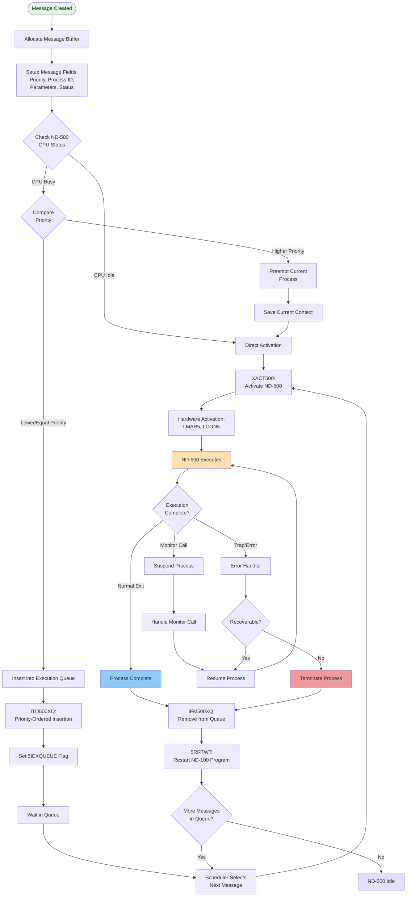

**Queue Management:**
- **ITO500XQ:** Inserts message in priority order
- **IFM500XQ:** Removes message from queue
- **Priority Levels:** Higher values = higher priority
- **Message States:** Queued, Active, Waiting, Swapping, Complete

### 8.1 Starting an ND-500 Process

**Scenario:** ND-100 program wants to start an ND-500 shadow process

**Sequence:**

```
1. Application Level (User Program):
   ┌─────────────────────────────┐
   │ MON 550 (or similar)        │ % User makes monitor call
   │ Request ND-500 service      │
   └─────────────┬───────────────┘
                 │
                 v
2. Monitor Level:
   ┌─────────────────────────────┐
   │ N500C (Lines 358-644)       │ % Command dispatcher
   │ - Validate request          │
   │ - Allocate message buffer   │
   │ - Setup process descriptor  │
   └─────────────┬───────────────┘
                 │
                 v
3. Monitor Level:
   ┌─────────────────────────────┐
   │ XACTRDY (Lines 2974-3040)   │ % Schedule for activation
   │ - Check if CPU idle         │
   │ - Compare priorities        │
   └─────────────┬───────────────┘
                 │
                 ├─ If CPU busy and lower priority:
                 │  ┌────────────────────────┐
                 │  │ ITO500XQ               │ % Insert in execution queue
                 │  │ - Priority-ordered     │
                 │  │ - Set 5IEXQUEUE flag   │
                 │  └────────────────────────┘
                 │
                 └─ If CPU idle or higher priority:
                    ┌────────────────────────┐
                    │ XACT500 (3052-3099)    │ % Activate immediately
                    │ - SLOCK (get lock)     │
                    │ - Hardware activation  │
                    │ - SUNLOCK              │
                    └───────────┬────────────┘
                                │
                                v
4. Hardware Level:
   ┌─────────────────────────────────────────────┐
   │ T:=HDEV+LMAR5; *IOXT  % Write MAR register  │
   │ A:=message_addr; *IOXT                      │
   │ A:=5; T+"LCON5-LMAR5"; *IOXT  % TAG-OUT=5  │ % Activate
   │    [3022 → 5015 hardware transfer]          │
   │    [ND-500 begins execution]                │
   └─────────────────────────────────────────────┘
                                │
                                v
5. Driver Level (when ND-500 completes):
   ┌─────────────────────────────┐
   │ 5STDRIV/N500 (656-721)      │ % Driver kernel
   │ - Interrupt from ND-500     │
   │ - Read status               │
   └─────────────┬───────────────┘
                 │
                 v
   ┌─────────────────────────────┐
   │ CHN5STATUS (730-759)        │ % Decode status
   │ - RN5STATUS (read status)   │
   │ - Route to handler          │
   └─────────────┬───────────────┘
                 │
                 v
   ┌─────────────────────────────┐
   │ DECOMESS (803-819)          │ % Decode answer
   │ - Extract result            │
   │ - Route to completion       │
   └─────────────┬───────────────┘
                 │
                 v
6. Process Restart:
   ┌─────────────────────────────┐
   │ 5RRTWT (21-46)              │ % Restart ND-100 program
   │ - Remove from queue         │
   │ - XRTACT or RTACT           │
   └─────────────┬───────────────┘
                 │
                 v
   ┌─────────────────────────────┐
   │ Application continues       │ % Return to user program
   │ Result in A/D registers     │
   └─────────────────────────────┘
```

**Key Points:**
- Uses priority-based scheduling
- Lock/unlock protocol prevents conflicts
- Hardware TAG-OUT signals activation
- Interrupt-driven completion
- Automatic restart of ND-100 program

#### Detailed Activate Sequence Diagram

The following sequence diagram shows the detailed hardware-level activation process:

```mermaid
sequenceDiagram
    participant APP as Application<br/>Program
    participant XACTRDY as XACTRDY<br/>(Scheduler)
    participant XACT500 as XACT500<br/>(Activate)
    participant LOCK as SLOCK/<br/>SUNLOCK
    participant HW as Hardware<br/>Registers
    participant ND500 as ND-500<br/>CPU

    Note over APP: Request ND-500 service
    APP->>XACTRDY: Call with message X

    Note over XACTRDY: Check CPU status
    XACTRDY->>XACTRDY: RSTA5 (read status)

    alt CPU Idle or Higher Priority
        XACTRDY->>XACT500: Activate immediately
    else CPU Busy, Lower Priority
        XACTRDY->>XACTRDY: ITO500XQ<br/>(Queue message)
        Note over XACTRDY: Process waits in queue
    end

    Note over XACT500: Begin activation sequence
    XACT500->>LOCK: SLOCK (acquire lock)
    Note over LOCK: Spin until lock obtained<br/>Ensures exclusive access

    LOCK-->>XACT500: Lock acquired

    Note over XACT500,HW: Setup Memory Address Register
    XACT500->>HW: T:=HDEV+LMAR5; *IOXT
    Note over HW: Select MAR register
    XACT500->>HW: A:=message_addr; *IOXT
    Note over HW: Write low 16 bits

    XACT500->>HW: A:=message_addr>>16; *IOXT
    Note over HW: Write high 8 bits<br/>(24-bit address complete)

    Note over XACT500,HW: Activate ND-500
    XACT500->>HW: A:=5; T+"LCON5-LMAR5"
    Note over HW: Calculate offset:<br/>LCON5-LMAR5 = 4

    XACT500->>HW: *IOXT
    Note over HW: Write control:<br/>TAG-OUT = 5 (Activate)

    HW->>ND500: Signal activate
    Note over ND500: Begin execution<br/>at message address

    Note over XACT500,HW: Verify activation
    XACT500->>HW: T:=HDEV+RSTA5; *IOXT
    Note over HW: Read status register

    alt Status shows locked
        XACT500->>XACT500: Wait/retry
    else Status OK
        XACT500->>LOCK: SUNLOCK (release lock)
        Note over LOCK: Interface available<br/>for other operations
    end

    Note over ND500: Process executing
    ND500->>ND500: Run ND-500 code

    alt Normal completion
        ND500->>HW: Stop (result ready)
        HW->>APP: Interrupt ND-100
        Note over APP: Driver handles completion
    else Monitor call
        ND500->>HW: MON instruction
        HW->>APP: Interrupt ND-100
        Note over APP: Handle MON call,<br/>then restart ND-500
    end
```

**Hardware Register Sequence:**
1. **LMAR5 (2 calls):** Load 24-bit message address
   - First call: Low 16 bits
   - Second call: High 8 bits
2. **LCON5:** Write control with activate command (TAG-OUT = 5)
3. **RSTA5:** Verify status and check lock
4. **UNLC5:** Release interface lock

**Lock Protocol:**
- **SLOCK:** Acquires exclusive lock (spins if busy)
- **SUNLOCK:** Releases lock
- Critical for multiprocessor systems with multiple ND-500 CPUs
- Prevents race conditions during activation

---

### 8.2 Handling Monitor Calls

**Scenario:** ND-500 process makes monitor call (e.g., read file)

#### Monitor Call Processing Sequence Diagram

The following sequence diagram shows the complete monitor call handling flow:

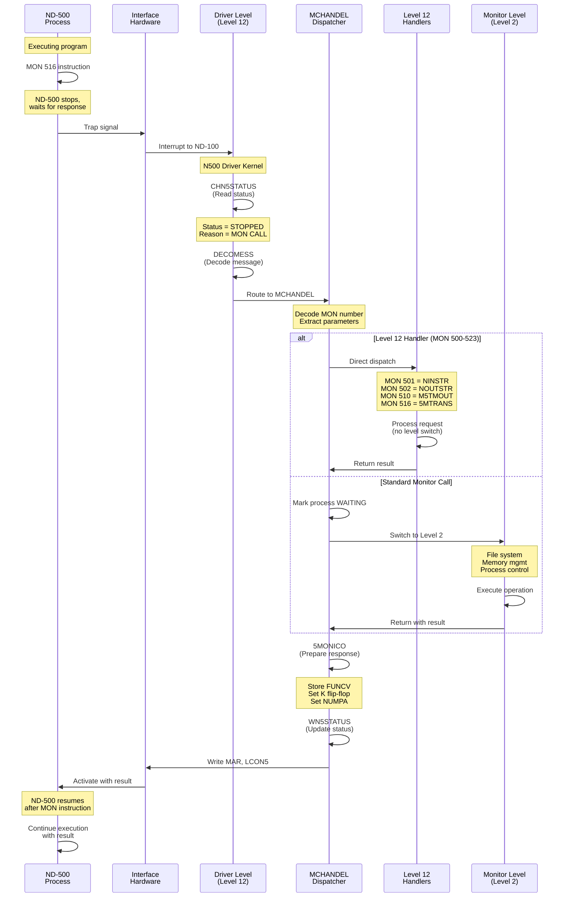

**Monitor Call Routing:**

| MON Number | Handler | Level | Description |
|------------|---------|-------|-------------|
| 500 | DVIO | 12 | Device I/O operations |
| 501 | NINSTR | 12 | Device input string |
| 502 | NOUTSTR | 12 | Device output string |
| 504 | Quick INSTR | 12 | Fast input (< 16 bytes) |
| 510 | M5TMOUT | 12 | Timeout/delay operations |
| 516 | 5MTRANS | 12 | Disk transfer operations |
| 517-523 | Various | 12 | System calls |
| Others | Standard | 2 | File system, memory, process control |

**Sequence:**

```
1. ND-500 Execution:
   ┌─────────────────────────────┐
   │ ND-500 executes MON 516     │ % Example: file operation
   │ [5015 signals 3022]         │
   └─────────────┬───────────────┘
                 │
                 v
2. ND-100 Interrupt:
   ┌─────────────────────────────┐
   │ Hardware interrupt → Driver │
   │ 5STDRIV/N500 activated      │
   └─────────────┬───────────────┘
                 │
                 v
3. Driver Level:
   ┌─────────────────────────────┐
   │ CHN5STATUS (730-759)        │
   │ - Read message status       │
   │ - Status = STOPPED          │
   │ - Stop reason = MON CALL    │
   └─────────────┬───────────────┘
                 │
                 v
   ┌─────────────────────────────┐
   │ DECOMESS (803-819)          │
   │ - Identify as monitor call  │
   │ - Route to MCHANDEL         │
   └─────────────┬───────────────┘
                 │
                 v
4. Monitor Call Dispatcher:
   ┌─────────────────────────────────────────┐
   │ MCHANDEL (1267-1406)                    │
   │ - Decode monitor call number            │
   │ - Check if Level 12 handler required    │
   └─────────────┬───────────────────────────┘
                 │
                 ├─ If Level 12 required (500-523):
                 │  │
                 │  ├─ MON 500 → DVIO
                 │  ├─ MON 501 → NINSTR (1817-1929)
                 │  ├─ MON 502 → NOUTSTR (1688-1804)
                 │  ├─ MON 504 → Quick instring
                 │  ├─ MON 510 → M5TMOUT (1609-1678)
                 │  └─ MON 516 → File operation
                 │
                 └─ If standard monitor call:
                    ┌──────────────────────────────┐
                    │ NORMMC                       │
                    │ - Mark process waiting       │
                    │ - Switch to Monitor Level    │
                    └───────────┬──────────────────┘
                                │
                                v
5. Monitor Level Processing:
   ┌─────────────────────────────────────────┐
   │ Process monitor call                    │
   │ Example: File read operation            │
   │ - FSYSINTERFACE (if file system)        │
   │ - Switch to NFPIT (file system PIT)     │
   │ - Call file system routine              │
   │ - Return with result                    │
   └─────────────┬───────────────────────────┘
                 │
                 v
6. Return to ND-500:
   ┌─────────────────────────────────────────┐
   │ MONICO (359-373, CC-P2-N500)            │
   │ - Store function value (FUNCV)          │
   │ - Set K flip-flop (error flag)          │
   │ - Set parameters (NUMPA)                │
   │ - Write microcode function 3MONCO       │
   └─────────────┬───────────────────────────┘
                 │
                 v
   ┌─────────────────────────────────────────┐
   │ MCCO (367-372)                          │
   │ - Set H500A = 140300 (clear cache)      │
   │ - WN5STATUS = MSGN500 (message status)  │
   │ - Update process status (5ACTIVE)       │
   └─────────────┬───────────────────────────┘
                 │
                 v
7. Hardware Restart:
   ┌─────────────────────────────────────────┐
   │ Hardware activation sequence:           │
   │ - Write MAR with message address        │
   │ - Write LCON5 with activate command     │
   │ - TAG-OUT signals "restart after MONCALL"│
   │ [3022 → 5015 transfer]                  │
   └─────────────┬───────────────────────────┘
                 │
                 v
8. ND-500 Continues:
   ┌─────────────────────────────┐
   │ ND-500 resumes execution    │
   │ - Function value in registers│
   │ - Error flag set/clear      │
   │ - Continues after MON instr │
   └─────────────────────────────┘
```

**Monitor Call Types:**

**Level 12 Calls (Handled directly in driver):**
- MON 500 (DVIO): Device I/O
- MON 501 (NINSTR): Device input string
- MON 502 (NOUTSTR): Device output string
- MON 504: Quick instring (< 16 bytes)
- MON 510 (M5TMOUT): Timeout/delay
- MON 516-523: System calls

**Standard Calls (Handled on monitor level):**
- File operations
- Memory management
- Process control
- System information

**Key Points:**
- Two-level dispatch (driver vs monitor)
- Level 12 calls for performance (avoid level switch)
- Standard calls for complex operations
- Return path uses microcode function 3MONCO
- Cache clearing ensures coherency

---

### 8.3 DMA Transfer Sequence

**Scenario:** ND-500 performs disk read via ND-100 file system

**Sequence:**

```
1. ND-500 Initiates:
   ┌─────────────────────────────────────────┐
   │ ND-500 process executes:                │
   │ MON 516 (5MTRANS)                       │
   │ Parameters:                             │
   │   - Function 2: Disk transfer, wait     │
   │   - File descriptor                     │
   │   - Buffer address (ND-500 memory)      │
   │   - Block number                        │
   │   - Transfer length                     │
   └─────────────┬───────────────────────────┘
                 │
                 v
2. Driver Decode:
   ┌─────────────────────────────────────────┐
   │ MCHANDEL → 5MTRANS (2440-2833)          │
   │ - Extract parameters from message       │
   │ - Validate file descriptor              │
   │ - Check permissions                     │
   └─────────────┬───────────────────────────┘
                 │
                 v
3. Address Validation:
   ┌─────────────────────────────────────────┐
   │ CHDISKADDR (2715-2745)                  │
   │ - Verify block within file bounds       │
   │ - Check access permissions              │
   │ - Convert logical to physical address   │
   └─────────────┬───────────────────────────┘
                 │
                 ├─ If invalid:
                 │  ┌──────────────────────┐
                 │  │ Return error         │
                 │  │ EMONICO (error code) │
                 │  └──────────────────────┘
                 │
                 └─ If valid:
                    ┌─────────────────────────────┐
                    │ Build disk access queue elem│
                    │ - Source: Disk              │
                    │ - Dest: ND-500 buffer       │
                    │ - Length: transfer size     │
                    │ - Completion: 5MRDTRANS     │
                    └─────────┬───────────────────┘
                              │
                              v
4. Queue Transfer:
   ┌─────────────────────────────────────────┐
   │ Insert in disk access queue             │
   │ - Priority-ordered queue                │
   │ - Disk driver will process              │
   └─────────────┬───────────────────────────┘
                 │
                 v
5. Wait State:
   ┌─────────────────────────────────────────┐
   │ Mark ND-500 process waiting:            │
   │ - Set status = 5WAIT                    │
   │ - Remove from execution queue           │
   │ - Save context                          │
   │ Return to NXTMSG                        │
   │ (Process next ND-500 message)           │
   └─────────────────────────────────────────┘
                 │
                 │ [Disk operation in progress...]
                 │ [Disk driver performs DMA]
                 │ [Data transferred: Disk → ND-100 buffer]
                 │
                 v
6. Transfer Complete:
   ┌─────────────────────────────────────────┐
   │ Disk interrupt:                         │
   │ Disk driver completion routine          │
   │ - Remove from access queue              │
   │ - Call completion handler               │
   └─────────────┬───────────────────────────┘
                 │
                 v
7. ND-100 to ND-500 Transfer:
   ┌─────────────────────────────────────────┐
   │ 5MRDTRANS (2759-2833)                   │
   │ - Data now in ND-100 memory             │
   │ - Must transfer to ND-500 memory        │
   └─────────────┬───────────────────────────┘
                 │
                 v
   ┌─────────────────────────────────────────┐
   │ DMA to ND-500:                          │
   │ For each block:                         │
   │   - Set MAR to ND-500 address           │
   │   - Write data via DATA registers       │
   │   - Use TAG-OUT for control             │
   └─────────────┬───────────────────────────┘
                 │
                 v
8. Restart ND-500 Process:
   ┌─────────────────────────────────────────┐
   │ MONICO                                  │
   │ - Function value = bytes transferred    │
   │ - K flip-flop = 0 (success)             │
   │ - Microcode function 3MONCO             │
   └─────────────┬───────────────────────────┘
                 │
                 v
   ┌─────────────────────────────────────────┐
   │ Insert in execution queue               │
   │ - SLOCK                                 │
   │ - ITO500XQ                              │
   │ - SUNLOCK                               │
   └─────────────┬───────────────────────────┘
                 │
                 v
   ┌─────────────────────────────────────────┐
   │ Activate ND-500:                        │
   │ - LOWACT500 or IACT500                  │
   │ - Hardware activation sequence          │
   └─────────────┬───────────────────────────┘
                 │
                 v
9. ND-500 Resumes:
   ┌─────────────────────────────┐
   │ ND-500 continues execution  │
   │ - Data in ND-500 buffer     │
   │ - Return value = byte count │
   │ - Error flag clear          │
   └─────────────────────────────┘
```

**DMA Transfer Variants:**

**Function 1 (No Wait):**
- Initiate transfer
- Return immediately
- ND-500 continues (asynchronous)
- Must poll or wait for completion later

**Function 2 (Wait):**
- Initiate transfer
- Mark process waiting
- Suspend ND-500 process
- Auto-restart on completion

**Hardware Data Transfer Methods:**

#### DMA Transfer Sequence Diagram

The following sequence diagram shows the detailed DMA transfer process:

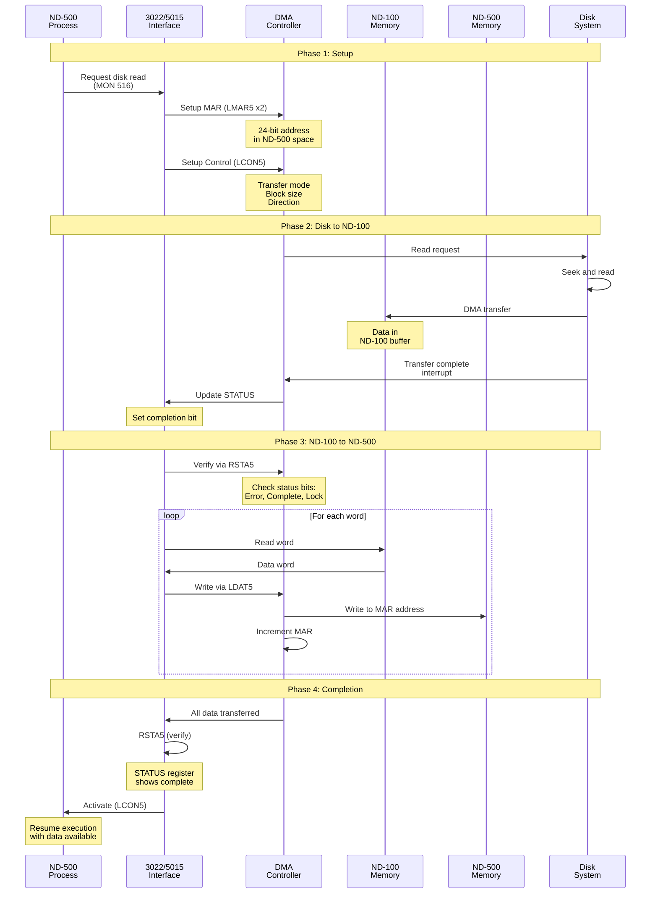

**Transfer Methods:**

**Method 1: Programmed I/O (Small transfers)**
```assembly
T:=HDEV+LMAR5; *IOXT              % Set address
FOR each_word DO
    A:=data_word
    T+"LDAO5-LMAR5"; *IOXT        % Write data
OD
```

**Method 2: DMA (Large transfers)**
- Setup DMA controller
- Source: ND-100 memory address
- Destination: ND-500 memory (via 3022)
- Length: byte count
- Initiate DMA
- Interrupt on completion

**Key Operations:**
- **LMAR5:** Load Memory Address Register (called twice for 24-bit address)
- **LCON5:** Load Control Register (configure transfer mode, size, direction)
- **RSTA5:** Read Status Register (check completion, errors, lock status)
- **LDAT5:** Load Data Register (write data words during transfer)
- **Verification:** Always read STATUS after completion to check for errors

---

### 8.4 Error Handling Flow

**Scenario:** ND-500 process encounters page fault

#### Error Recovery Flow Diagram

The following flowchart shows the complete error detection, classification, and recovery process:

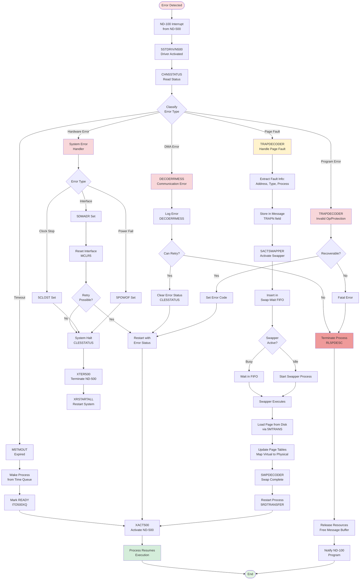

**Error Type Summary:**

| Error Type | Status Bit | Handler | Recovery Action |
|------------|-----------|---------|-----------------|
| Page Fault | TRAPPED (2) | TRAPDECODER → 5ACTSWAPPER | Load page, retry instruction |
| Invalid Operation | TRAPPED (2) | TRAPDECODER | Error code or terminate |
| Protection Fault | TRAPPED (2) | TRAPDECODER | Terminate process |
| DMA Error | 5DMAER | DECOERRMESS | Log, retry or fail |
| Power Failure | 5POWOF | System handler | System halt/restart |
| Clock Stopped | 5CLOST | System handler | System halt |
| Timeout Expiry | I5TMQU | M5TMOUT | Wake process, resume |

**Recovery Paths:**
- **Transparent:** Page faults (process unaware, automatic retry)
- **Error Code:** Recoverable errors (process gets error, continues)
- **Terminate:** Fatal errors (process killed, resources released)
- **System Restart:** Hardware failures (entire system restart)

**Sequence:**

```
1. ND-500 Page Fault:
   ┌─────────────────────────────────────────┐
   │ ND-500 accesses unmapped page           │
   │ - Hardware trap generated               │
   │ - ND-500 stops execution                │
   │ - Status = TRAPPED                      │
   │ - Trap info in registers                │
   └─────────────┬───────────────────────────┘
                 │
                 v
2. ND-100 Interrupt:
   ┌─────────────────────────────────────────┐
   │ 5STDRIV/N500 driver activated           │
   │ - Read status from 3022                 │
   │ - Status = TRAPPED                      │
   └─────────────┬───────────────────────────┘
                 │
                 v
3. Status Decode:
   ┌─────────────────────────────────────────┐
   │ CHN5STATUS (730-759)                    │
   │ - RN5STATUS (read message status)       │
   │ - Identify as TRAPPED                   │
   │ - Route to TRAPDECODER                  │
   └─────────────┬───────────────────────────┘
                 │
                 v
4. Trap Decode:
   ┌─────────────────────────────────────────┐
   │ TRAPDECODER (859-895)                   │
   │ - Read trap number from TRAPN field     │
   │ - Extract page fault information:       │
   │   * Faulting address                    │
   │   * Access type (read/write/execute)    │
   │   * Process ID                          │
   └─────────────┬───────────────────────────┘
                 │
                 ├─ If page fault:
                 │  ┌────────────────────────────┐
                 │  │ Store fault info in message│
                 │  │ - Page number              │
                 │  │ - Access type              │
                 │  └─────────┬──────────────────┘
                 │            │
                 │            v
                 │  ┌────────────────────────────┐
                 │  │ 5ACTSWAPPER (2851-2908)    │
                 │  │ - Mark message "swapping"  │
                 │  │ - Insert in swap-wait FIFO │
                 │  │ - Update process status    │
                 │  └─────────┬──────────────────┘
                 │            │
                 │            v
                 │  ┌────────────────────────────┐
                 │  │ Check if swapper active:   │
                 │  │ If idle:                   │
                 │  │   - Get swapper message    │
                 │  │   - Insert in exec queue   │
                 │  │   - Activate swapper       │
                 │  │ If busy:                   │
                 │  │   - Swapper will handle    │
                 │  │     when current swap done │
                 │  └────────────────────────────┘
                 │
                 ├─ If program error (invalid op, etc.):
                 │  ┌────────────────────────────┐
                 │  │ Error recovery:            │
                 │  │ - Log error                │
                 │  │ - Check if recoverable     │
                 │  └─────────┬──────────────────┘
                 │            │
                 │            ├─ Recoverable:
                 │            │  └─ Restart process with error code
                 │            │
                 │            └─ Non-recoverable:
                 │               ┌─────────────────────────┐
                 │               │ Terminate process:      │
                 │               │ - RL5PDESC (108-134)    │
                 │               │ - Release resources     │
                 │               │ - Notify ND-100 program │
                 │               └─────────────────────────┘
                 │
                 └─ If hardware error:
                    ┌────────────────────────────────────┐
                    │ System error recovery:             │
                    │ - Check error type                 │
                    │ - Log to system log                │
                    │ - If power failure:                │
                    │   * CLE5STATUS (clear status)      │
                    │   * XTER500 (terminate)            │
                    │   * XRSTARTALL (restart all)       │
                    │ - If interface error:              │
                    │   * Reset interface                │
                    │   * Retry operation                │
                    └────────────────────────────────────┘

5. Swapper Processing (for page fault):
   ┌─────────────────────────────────────────┐
   │ Swapper process executes:               │
   │ - Read fault info from message          │
   │ - Determine page location (disk)        │
   │ - Allocate physical page                │
   └─────────────┬───────────────────────────┘
                 │
                 v
   ┌─────────────────────────────────────────┐
   │ Disk read operation:                    │
   │ - Calculate disk address                │
   │ - Initiate disk read (via 5MTRANS)      │
   │ - Read page from swap area              │
   │ - Transfer to ND-500 memory             │
   └─────────────┬───────────────────────────┘
                 │
                 v
   ┌─────────────────────────────────────────┐
   │ Update page tables:                     │
   │ - Map virtual → physical                │
   │ - Set access permissions                │
   │ - Mark page valid                       │
   └─────────────┬───────────────────────────┘
                 │
                 v
   ┌─────────────────────────────────────────┐
   │ SWPDECODER (912-1241)                   │
   │ - Swapper completes                     │
   │ - Remove from swap-wait FIFO            │
   │ - Mark message ready                    │
   └─────────────┬───────────────────────────┘
                 │
                 v
6. Restart Faulted Process:
   ┌─────────────────────────────────────────┐
   │ 5RDTRANSFER → XACTRT                    │
   │ - Insert in execution queue             │
   │ - Restore process context               │
   │ - Clear trap status                     │
   └─────────────┬───────────────────────────┘
                 │
                 v
   ┌─────────────────────────────────────────┐
   │ Activate ND-500:                        │
   │ - Hardware activation sequence          │
   │ - PC = faulting instruction (retry)     │
   └─────────────┬───────────────────────────┘
                 │
                 v
7. ND-500 Retries:
   ┌─────────────────────────────┐
   │ ND-500 re-executes          │
   │ - Page now mapped           │
   │ - Access succeeds           │
   │ - Continues execution       │
   └─────────────────────────────┘
```

**Error Types and Handlers:**

| Error Type | Handler | Recovery |
|------------|---------|----------|
| Page Fault | TRAPDECODER → 5ACTSWAPPER | Load page, retry |
| Invalid Operation | TRAPDECODER | Error code, continue or terminate |
| Protection Violation | TRAPDECODER | Error code, terminate |
| Power Failure | CLE5STATUS | Restart system |
| Interface Error | DECOERRMESS | Reset, retry |
| Timeout | M5TMOUT expiry | Wake process |
| DMA Error | DECOMESS | Error code, cleanup |

**Key Points:**
- Hardware trap stops ND-500
- ND-100 decodes and handles
- Swapper for page faults
- Transparent to ND-500 program (retry)
- Error codes for non-recoverable
- System recovery for hardware errors

---

### 8.5 Escape/Break Handling

**Scenario:** User types ESCAPE while ND-500 process running

**Sequence:**

```
1. User Action:
   ┌─────────────────────────────┐
   │ User types ESCAPE on        │
   │ terminal connected to       │
   │ ND-500 process              │
   └─────────────┬───────────────┘
                 │
                 v
2. Terminal Interrupt:
   ┌─────────────────────────────────────────┐
   │ Terminal driver (Level 10)              │
   │ - Detect ESCAPE character               │
   │ - Identify owning process               │
   │ - Check if ND-500 process               │
   └─────────────┬───────────────────────────┘
                 │
                 v
3. Escape Detection:
   ┌─────────────────────────────────────────┐
   │ ESC5ON (CC-P2-N500, lines 43-56)        │
   │ - Called from ESCON handler             │
   │ - Find ND-500 process from RT desc      │
   │ - Traverse BRESLINK (reservation queue) │
   └─────────────┬───────────────────────────┘
                 │
                 ├─ If no ND-500 process:
                 │  └─ Return to normal ESCON handling
                 │
                 └─ If ND-500 process found:
                    ┌──────────────────────────────┐
                    │ Check escape state:          │
                    │ - Read 5MSFL from message    │
                    │ - Test 5IBRK flag            │
                    └─────────┬────────────────────┘
                              │
                              ├─ If already in escape:
                              │  └─ Return (already processing)
                              │
                              └─ If not in escape:
                                 ┌─────────────────────────┐
                                 │ Initiate escape:        │
                                 │ - Switch to monitor lvl │
                                 │ - IRW MLEVB DP = ESC500 │
                                 │ - IRW MLEVB DB = input df│
                                 │ - MST PID (switch level)│
                                 └─────────┬───────────────┘
                                           │
                                           v
4. Monitor Level Escape:
   ┌─────────────────────────────────────────┐
   │ ESC500 (MP-P2-N500, lines 55-91)        │
   │ - Get background program (XGTDFADDR)    │
   │ - Find process description (FSEMA)      │
   └─────────────┬───────────────────────────┘
                 │
                 v
   ┌─────────────────────────────────────────┐
   │ Set escape flag (atomic):               │
   │ *IOF                                    │
   │ SLOCK                                   │
   │ T:=5MBBANK; X:=message                  │
   │ *AAX 5MSFL; LDATX                       │
   │ A BONE 5IBRK      % Set escape flag     │
   │ *STATX                                  │
   │ SUNLOCK                                 │
   └─────────────┬───────────────────────────┘
                 │
                 v
5. Check Process State:
   ┌─────────────────────────────────────────┐
   │ If process currently active (CURPROG):  │
   │   ┌─────────────────────────────────┐   │
   │   │ Force to FROMESC immediately:   │   │
   │   │ - "FROMESC"; *IRW ALEVB DP      │   │
   │   │ - Set PCR to 5PIT               │   │
   │   │ - Process will start in FROMESC │   │
   │   └─────────────────────────────────┘   │
   │                                         │
   │ Else if waiting or not active:          │
   │   ┌─────────────────────────────────┐   │
   │   │ SYSABORT (lines 79-83):         │   │
   │   │ - Release cleanup file          │   │
   │   │ - Remove from wait queue        │   │
   │   │ - Insert in exec queue          │   │
   │   │ - Reset I/O-wait state          │   │
   │   │ - Set PCR to 5PIT               │   │
   │   │ - P = FROMESC                   │   │
   │   └─────────────────────────────────┘   │
   └─────────────┬───────────────────────────┘
                 │
                 v
6. Cleanup Sequence (FROMESC on 5PIT):
   ┌─────────────────────────────────────────┐
   │ FROMESC routine executes:               │
   │ - Application-level cleanup code        │
   │ - Close open files                      │
   │ - Release resources                     │
   │ - Free buffers                          │
   └─────────────┬───────────────────────────┘
                 │
                 v
7. ND-500 Cleanup:
   ┌─────────────────────────────────────────┐
   │ S5ESCF (set escape flag in ND-500)      │
   │ - Mark ND-500 process for cleanup       │
   │ - ND-500 executes cleanup handler       │
   │ - Release ND-500 resources              │
   └─────────────┬───────────────────────────┘
                 │
                 v
8. Time Queue Cleanup:
   ┌─────────────────────────────────────────┐
   │ If process in time queue:               │
   │ - FTIMQU (remove from time queue)       │
   │ - Cancel timeout                        │
   └─────────────┬───────────────────────────┘
                 │
                 v
9. Resource Release:
   ┌─────────────────────────────────────────┐
   │ RL5PDESC (108-134)                      │
   │ - Release ND-500 process descriptor     │
   │ - Free message buffers                  │
   │ - Deallocate resources                  │
   │ - Remove from all queues                │
   └─────────────┬───────────────────────────┘
                 │
                 v
10. Return to User:
   ┌─────────────────────────────┐
   │ STUPR (study program)       │
   │ - Process terminated        │
   │ - User at command level     │
   │ - Ready for next command    │
   └─────────────────────────────┘
```

**Escape from Different States:**

**Active Process (currently executing):**
```
CURPROG check → Force P to FROMESC → Immediate cleanup
```

**Waiting Process (I/O wait):**
```
SYSABORT → Remove from wait queue → Set P to FROMESC → Activate
```

**Time Queue (sleeping):**
```
FTIMQU → Remove from time queue → Set P to FROMESC → Activate
```

**Swapping:**
```
Special handling → Wait for swap complete → Then force to FROMESC
```

**Key Points:**
- 5IBRK flag prevents re-entry
- Atomic flag setting (IOF, SLOCK)
- Forces entry to FROMESC cleanup routine
- Handles all process states
- Releases both ND-100 and ND-500 resources
- User-level cleanup code in FROMESC
- Clean termination, no resource leaks

---

## Summary

This document provides a comprehensive overview of the MP-P2-N500 interface system, focusing on:

1. **TAG-IN and TAG-OUT:** The critical hardware control registers that define operations between ND-100 and ND-500
2. **Hardware Interface:** 3022/5015 cards and their IOX-addressable registers
3. **Complete API Reference:** 49 documented APIs with detailed parameter and behavior descriptions
4. **Assembly Patterns:** Common coding patterns for IOX operations, bank switching, bit manipulation, and synchronization
5. **Symbol Definitions:** Comprehensive listing of registers, flags, and data structures
6. **Communication Flows:** Five detailed examples showing real-world operation sequences

**Critical Concepts:**

- **TAG Protocol:** TAG-OUT (ND-100 → ND-500) and TAG-IN (ND-500 → ND-100) define operation types
- **Lock/Unlock:** Semaphore-based synchronization prevents conflicts
- **Bank-Switched Memory:** ND-500 messages accessed through windowed memory
- **Multi-Level Architecture:** Driver (Level 12), Monitor, and Application levels with specific responsibilities
- **Priority Scheduling:** Messages queued and executed by priority
- **Interrupt-Driven:** Hardware interrupts signal completion
- **Shadow Processing:** ND-500 processes shadowed by ND-100 control structures

**Key Files:**
- `Z:\NorskData\Source Code\Sintran L\NPL\MP-P2-N500.NPL` - Main implementation (3808 lines)
- `Z:\NorskData\Source Code\Sintran L\NPL\CC-P2-N500.NPL` - Common support routines
- `Z:\NorskData\Source Code\Sintran L\NPL\XC-P2-N500.NPL` - Extended support
- `Z:\NorskData\Source Code\Sintran L\NPL\RP-P2-N500.NPL` - Runtime support

---

**Document Version:** 1.0
**Created:** 2025-10-13
**Full Path:** `Z:\NorskData\Source Code\Sintran L\NPL\MP-P2-N500.md`
