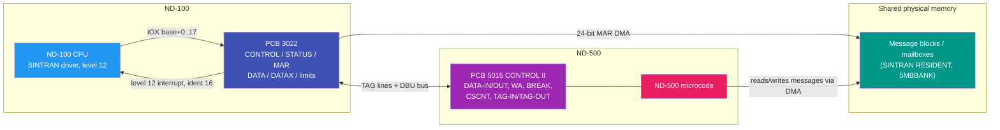

# ND-500 Bus Interface Reference (PCB 3022 / PCB 5015)

**The authoritative reference for how the ND-100 and the ND-500 communicate.**

**Date:** 2026-07-08
**Supersedes:** old/ND-500-INTERFACE.md, old/ND500-BOOT-DETECTION-MECHANISM.md, and the
interface-register content of the Emulator/ folder docs (ND500-QUICK-REFERENCE.md,
DETAILED-TAG-MECHANISM-EXPLANATION.md).
**Evidence trail:** every claim here is anchored in
[ND500-EVIDENCE-AND-CONTRADICTIONS.md](ND500-EVIDENCE-AND-CONTRADICTIONS.md)
("dossier" below). Citations of the form (dossier 2.5.5) point at the section holding
the verbatim quotes and file:line references.
**Emulator gap list:**
[ND500-EMULATOR-DISCREPANCY-AUDIT.md](ND500-EMULATOR-DISCREPANCY-AUDIT.md).

---

## 1. Scope, sources and conventions

This document describes the OLD ND-500 DMA interface: the **PCB 3022** card in the
ND-100 bus talking to the **PCB 5015 (CONTROL II)** card in the ND-500, plus the
shared message memory and the level-12 driver protocol on top. The ND-5000/SAMSON
generation (Octobus/MFbus) is covered as a delta in section 13.

Primary sources:

| Source | Referred to as |
|---|---|
| SINTRAN III NPL driver sources (`../NPL-SOURCE/NPL/`) | NPL:file:line |
| Symbol tables (`../NPL-SOURCE/SYMBOLS/`, K03/L07/M06 verified identical for these symbols) | SYM |
| ND-30.013.02 Test Micro Program Descriptions for ND-500 (`../../Reference-Manuals/500/`) | TMP |
| NEC-01 ND-500 course (same section-3 text as TMP, noisier OCR) | NEC-01 |
| ND-06.015.02 ND-100 Functional Description | ND-06.015.02 |
| ND-10.004.01 MPM 5 Technical Description | ND-10.004.01 |
| ND-05.012.01 ND-500 Micro Program Guide | ND-05.012.01 |
| ND-60.136.04A ND-500 Loader Monitor | ND-60.136.04A |

Conventions:

- **All numbers are OCTAL unless stated otherwise** (SINTRAN convention).
- Register offsets are relative to the interface's IOX base device number.
- Claims that could not be verified are tagged **UNVERIFIED**; do not build on them
  without new evidence. Reasoned-but-unquoted conclusions are tagged **DERIVED**.
- Memory sizes are given in words with bytes in parentheses where relevant.

What this document deliberately does NOT do: repeat the fabricated "high-level TAG
message protocol" of the older documents. Sections 3.3 and 10 state explicitly what
replaced it and why.

---

## 2. Hardware overview

Components (TMP sections 2-3; dossier 4.5, 4.10, 4.12):

- **PCB 3022** - "N-100 N-500 Interface", sits in the ND-100 bus. Holds the CONTROL,
  STATUS, MAR, DATA, DATAX, upper/lower DMA limit and TAG-OUT-side registers. Up to
  5 cards per ND-100, device number selected by switch J12 / thumbwheel (section
  3.1). Hard-wired to ND-100 interrupt level 12 (ND hardware catalogue entry for
  the 3022). Connectors: A = ND-500 interface, B = not present, C = standard ND-100
  system bus.
- **PCB 5015 "CONTROL II"** - the ND-500 side of the interface. Holds
  DATA-IN/DATA-OUT (32-bit), BREAK, WA (control-store write address), CSCNT
  (control-store control) and the TAG-IN/TAG-OUT registers.
- **PCB 5012 "N-500 Control 1"** (part number 322512) - CPU controller #1 in the
  ND-500/1 CPU: OR logic, ALU functions and loop control; typical position #14 in
  the ND-500/1 crate (ND hardware catalogue entry for part 322512). Not part of the
  ND-100 communication path.
- **Buses** (TMP section 2): CDB (internal ND-500 CPU bus), DBU (bus between 3022 and
  5015), BDU/DOUB (data bus on the 3022), XD bus (control-store load path).
- **Message memory** - physical ND-100-addressable memory holding the mailbox area
  (message blocks). The message block "resides in RESIDENT of SINTRAN III"
  (ND-05.012.01 section 13; dossier 4.9). On multiport (MPM) systems the same
  physical RAM is visible to both machines at different channel addresses through
  BASE-register translation (section 8.4; dossier 4.10).
- **DMA engine** - the 3022 transfers data between ND-100 memory (addressed by its
  24-bit MAR) and the ND-500, initiated by ND-500 TAG-OUT operations, bounded by the
  limit registers (sections 3.4, 4).



The communication model in one paragraph: SINTRAN builds a **message** in the mailbox
area, points the 3022's **MAR** at it, and pokes the **CONTROL** register; the ND-500
microcode DMA-fetches the message, executes, writes an answer message, and interrupts
the ND-100 on **level 12**; the driver reads **STATUS**, walks the message queue and
dispatches on each message's status word. No data flows through "TAG message codes" -
the TAG lines are register-level strobes used by microcode and test programs
(section 10; dossier 2.2, 4.5).

---

## 3. IOX register reference

### 3.1 Device numbers, thumbwheel and ident

(ND-06.015.02 section D.13.1; dossier 4.1. "Thumbwheel settings 5-15 are not valid.")

| Thumbwheel | IOX base (oct) | Register range (oct) | Ident (oct) |
|---|---|---|---|
| 0 | 60 | 60-77 | 16 |
| 1 | 1060 | 1060-1077 | 116 |
| 2 | 660 | 660-677 | 36 |
| 3 | 760 | 760-777 | 114 |
| 4 | 560 | 560-577 | 76 |

In SINTRAN the base lives in the per-CPU datafield slot HDEV (displacement 177775,
B-relative); every access is `T:=HDEV+offset; *IOXT` (dossier 2.1, 2.8). There is no
fixed system-wide device number - older docs claiming "typically 1560B" or "100-120B"
or "500B/600B" are all unsupported (dossier C10).

### 3.2 Register offsets and the four-mode decode

The interface decodes each offset differently depending on two mode bits in CONTROL:
bit 2 (activate = LOCK) and bit 3 (TEST MODE). Source: TMP section 3.14, reproduced
in NEC-01 - this is the origin of the four-column table found in older docs and in
the C# emulator header (dossier 4.4).

Offsets with their SINTRAN symbol names (SYM; dossier 2.1) and their function in each
mode. "-" = not available/no effect documented.

| Off | Symbol(s) | Unlocked + not test | Locked + not test | Unlocked + TEST | Locked + TEST |
|-----|-----------|---------------------|-------------------|-----------------|---------------|
| 0  | RMAR5 | Read MAR (2 reads: LS first) | - | Read MAR (2 reads) | - |
| 1  | LMAR5 | Load MAR (2 writes: MS first) | - | Load MAR (2 writes) | - |
| 2  | RSTA5 | Read STATUS | Read STATUS | Read STATUS | Read STATUS |
| 3  | LSTA5 | - | - | Load STATUS | - |
| 4  | RCON5 | - | - | Read CONTROL | Read CONTROL |
| 5  | LCON5 | Load CONTROL | - | Load CONTROL | - |
| 6  | MCLR5 | Master Clear (strobe) | Master Clear (strobe) | Load DATA register | - |
| 7  | TERM5 | Terminate | Terminate | Load DATA register | - |
| 10 | RTAG5 / RUPP5 | Read TAG-IN | Read TAG-IN | Load upper limit | - |
| 11 | LTAG5 / LUPP5 | Write TAG-OUT | Write TAG-OUT | Load upper limit | - |
| 12 | RLOW5 | - | - | Read lower limit | - |
| 13 | LLOW5 (also "WDAT") | Write DATAX | Write DATAX | Load lower limit | - |
| 14 | SLOC5 | Set locked | Set locked | - | - |
| 15 | CLKD5 | - | Clock DATA | - | - |
| 16 | UNLC5 | Release locked | Release locked | - | - |
| 17 | RETG5 | Return tag (bit0 = reverse tag bus, bit1 = stop bit) | Return tag | - | - |
| 20 | 5MODE | UNVERIFIED - symbol exists (SYM), outside the TMP-documented range; function unknown | | | |

Notes:

- **Locked + test mode exposes ONLY RSTA (read STATUS) and RCON (read CONTROL)**
  (TMP section 3.14 table 2; dossier 4.4).
- **MCLR (offset 6) is a command strobe**: executing the IOX restarts the ND-500
  microprogram at control-store address 0; no data word is involved in non-test mode
  (TMP 6.3.1/TST01; dossier 4.2). In unlocked+test the same offset loads the DATA
  register instead.
- **MAR two-step access** (TMP section 3.3): load most-significant part first; read
  least-significant part first. When read, MAR bits 24-31 mirror bits 8-15.
- **Limit registers**: "ND-100 bits 0-15 go to limit register bits 8-23"
  (TMP section 3.14; section 4 below).
- **RETG5**: TST02 flips the STOP BIT from A-bit1; TST04 flips the reverse-tag-bus
  from A-bit0 (dossier 4.5). This is why the 5MCST stop sequence ends with
  `A:=2 -> RETG5` (section 9.1).
- DERIVED: the "Unlocked + not test" and "Locked + not test" columns differ mainly in
  that RMAR/LMAR/LCON (and LSTA) disappear when locked - the lock protects the
  address/control state of a running ND-500 operation from the ND-100.

### 3.3 Registers SINTRAN never touches

A whole-tree grep of the SINTRAN NPL sources (dossier 2.2) proves the driver uses
ONLY: RSTA5, LSTA5, LCON5, LMAR5, TERM5, SLOC5, UNLC5, RETG5.

**Never issued by SINTRAN:** RMAR5 (read MAR), RCON5 (read CONTROL), MCLR5 (master
clear), RTAG5/LTAG5 (TAG), RUPP5/LUPP5 and RLOW5/LLOW5 (DMA limits), CLKD5, 5MODE.

Consequences:

1. Any documentation or emulator behavior in which SINTRAN exchanges "TAG codes"
   with the ND-500 is wrong. The TAG registers are real hardware (section 10) used
   by the ND-500 microcode and by test/loader programs - not by the OS driver.
2. SINTRAN never reads back MAR or CONTROL and never programs the DMA limit
   registers. (The Loader Monitor / test programs do.)
3. An emulator that only aims to run SINTRAN needs, at minimum, faithful RSTA5,
   LSTA5, LCON5, LMAR5, TERM5, SLOC5, UNLC5 and RETG5 semantics - but the microcode
   side (message DMA, answer writing, stop reasons) is what makes those registers
   mean anything.

---

## 4. CONTROL and STATUS registers

### 4.1 CONTROL register (write LCON5, read RCON5)

Hardware bit map (TMP section 3.1; dossier 4.3):

| Bit | Meaning |
|---|---|
| 0 | Enable interrupt from ND-500 |
| 1 | Not used |
| 2 | Activate ND-500 operation (and LOCK the communication) |
| 3 | TEST MODE |
| 4 | ND-500 programmed clear (side effect: clears STATUS bit 6 DMA error - TST25) |
| 5 | Disable TAG-IN decoding when locked |
| 6 | DMA error |
| 7 | Command chaining |
| 8-14 | ND-500 operation |
| 15 | Not used |

CONTROL values SINTRAN actually writes (dossier 2.4, 4.3):

| Value | Bits | Where | Purpose |
|---|---|---|---|
| 1 | 0 | activate sequence (MP:3091) | enable interrupt from ND-500 |
| 5 | 0+2 | reactivate path ACT50 (MP:3086) | enable interrupt + activate/lock |
| 10 | 3 | before every LSTA5 write (MP:3089; XC:55; PH-RESTART:129) | enter TEST MODE so the status write decodes |
| 40 | 5 | 5MCST stop sequence (CC:215) | disable TAG-IN decoding |
| 0 | - | after status writes (XC:58; PH-RESTART:132) | leave test mode / clear control |
| 400 | 8 | power-fail stop (PH-RESTART:133) | ND-500 operation field, power-fail stop path |

The test-program idiom `SAA 044; IOX LCON` = bits 2+5 = activate + disable-TAG
(TMP section 3.15.1) also appears in hardware-side sequences (dossier 4.13).

**Common misreading, corrected:** the NPL comment "Enable for interrupt" sits on the
`A:=10` write (MP:3089), but octal 10 is TEST MODE (bit 3), not an interrupt-enable.
The comment names the goal of the whole four-write sequence:
`LCON5:=10` (test mode) -> `LSTA5:=0` (clear status - legal only in test mode) ->
`LCON5:=1` (leave test mode, enable interrupt) -> `SLOC5` (set lock).
(Dossier C5, 4.3.)

### 4.2 STATUS register (read RSTA5, write LSTA5 in test mode only)

Hardware bit map (TMP section 3.2) with SINTRAN symbols where they exist
(dossier 2.3, 4.3):

| Bit (dec) | Mask (oct) | SINTRAN symbol | Meaning |
|---|---|---|---|
| 0 | 000001 | - | Interrupt enabled |
| 1 | 000002 | - | Not used |
| 2 | 000004 | - | ND-500 busy |
| 3 | 000010 | - | ND-500 finished |
| 4 | 000020 | 5PAGF | Error (inclusive OR of errors) |
| 5 | 000040 | 5ILOC (code: 5ILOCK) | Interface LOCKED = ND-500 running |
| 6 | 000100 | 5DMAER (code: 5DMAERR) | DMA / communication error |
| 7 | 000200 | 5PFAIL | ND-500 power fault, set by microprogram (stop bit set) |
| 8 | 000400 | 5POWOF | ND-500 power is/has been off (latched) |
| 9 | 001000 | 5CLOST (SYM: 5CLOS) | ND-500 micro clock has stopped |
| 10-14 | 076000 | - | ND-500 stop reason |
| 15 | 100000 | - | CONTROL register bit 15 |

- Bits 0, 5, 9 and 15 cannot be set/reset by LSTA5 (TST26; dossier 4.3).
- The driver's ISR error mask is 720 = 5PAGF+5DMAER+5PFAIL+5POWOF (MP:669).
- CLE5STATUS clear masks: 177377 clears the latched 5POWOF; 177177 additionally
  clears 5PFAIL (XC:36-45; dossier 2.3).
- **Stop reasons live in TWO places** (dossier C12): the hardware field STATUS bits
  10-14, and the message field STOPR (offset 11). The SINTRAN driver dispatches ONLY
  on the message field (section 7.3). The numeric stop-reason codes are UNVERIFIED
  (older docs claim MOCALL=1, TRAPCODE=2, 5FMOCALL=3, TPSTRA=65 - plausible,
  unconfirmed).

---

## 5. Activation protocol (ND-100 -> ND-500)

Everything the ND-100 tells the ND-500 travels as a **message** (section 6). The
hardware handshake merely points the interface at the message and wakes the
microcode. From XACT500 (NPL:MP-P2-N500.NPL:3052-3099, quoted in dossier 2.5.1):

### 5.1 Preconditions checked by the driver

1. Message-queue head field X5CPU must be MPACTIVE and no power-fail pending
   (MP:3061-3062).
2. Read RSTA5. If 5CLOST (clock stopped) - give up. If 5ILOCK (still running) -
   terminate first (XTER500, section 9.2), then proceed (MP:3063-3068).

### 5.2 Path A - reactivate with a specific message (ACT50)

Used when a message with status MSGN500 or WAITING is queued ("waiting for ND-500
CPU"), or when the queue is non-empty but the interface is unlocked ("Reactivate it
since an interrupt may have been lost" - MP:3083):

```
ACT50: 5MBBANK; T:=HDEV+LMAR5; *IOXT     % MAR (MS part) := message bank
       A:=X; *IOXT                       % MAR (LS part) := message address
       A:=5; T+"LCON5-LMAR5"; *IOXT      % CONTROL := 5 (int enable + activate/lock)
```

The MAR is loaded most-significant-part first (matches TMP section 3.3). Writing
CONTROL bit 2 locks the interface and starts the ND-500 operation; the microcode
DMA-fetches the message MAR points at.

### 5.3 Path B - enable sequence (no waiting message)

```
A:=10; T:=HDEV+LCON5;   *IOXT    % CONTROL := 10  (test mode)
A:=0;  T+"LSTA5-LCON5"; *IOXT    % STATUS  := 0   (clear - legal in test mode)
A:=1;  T+"LCON5-LSTA5"; *IOXT    % CONTROL := 1   (leave test, enable interrupt)
       T+"SLOC5-LCON5"; *IOXT    % SLOC5          (set lock; A still 1, value unused)
TTMR=:TMR                        % arm the software timeout
```

After either path the driver clears its 5CPUSTOPPED flag (MP:3097).

### 5.4 What the ND-500 does (microcode view)

"Nothing but an activate or a terminate from the ND-100 can cause the micro program
to leave the IDLE loop" (ND-05.012.01 section 13; dossier 4.9). On activate, the
microcode fetches the message (DMA through MAR), sets message status "in process",
executes the function (MICFU), writes the answer status and result fields, and
raises the ND-100 interrupt (STATUS "finished" + interrupt if CONTROL bit 0 was
set). DERIVED from ND-05.012.01 section 13 + TMP; exact microcode steps are not in
the SINTRAN sources.

---

## 6. Message memory

### 6.1 Location and addressing

The mailbox area lives in ND-100-addressable physical memory ("RESIDENT of SINTRAN
III", ND-05.012.01 section 13). SINTRAN computes the bank once at init:
`5FPMAILBOX=:D:=0; AD SH 12; A=:5MBBANK  % MEMORY BANK FOR MESSAGES`
(NPL:RP-P2-N500.NPL:737), then addresses every message as (bank=5MBBANK,
offset=message address) with the physical-access instructions LDATX/STATX/LDDTX/
STDTX/STZTX (dossier 2.6.1). The interface reaches the same memory through its
24-bit MAR (TMP section 3.3). On multiport systems the same physical RAM is visible
to the ND-500 through the MPM port at a different channel address (section 8.4).

### 6.2 Message block layout

Six-word header + data part (ND-05.012.01 section 13), field offsets from the symbol
tables (dossier 2.6.2, 4.9):

| Offset (oct) | Symbol | Content |
|---|---|---|
| -1 (177777) | 5MSFL | message flag word (bits: 5IEXQUEUE, 5CPUBOUND, 5IBRK...) |
| 0 | LINK / LINK1 | queue link (read as double word LINK@3) |
| 1 | LINK2 | second link word |
| 2 | N5STA | message STATUS word (RN5STATUS/WN5STATUS) |
| 3 | SENDE | sender (watchdog message uses -1) |
| 4 | X5CPU | receiver / CPU field (checked = MPACTIVE) |
| 5 | X5ACT | size / activation field |
| 6 | MICFU | micro-function (command) code |
| 7 | N500A | ND-500 logical address |
| 11 | N100A / STOPR / ACPRO | ND-100 physical address / stop reason / actual process (direction-dependent overlay) |
| 13 | NRBYT | byte count |
| 143 | SPFLA | special flag -> routine address (DECOMESS dispatch override) |
| 144 | XADPR | process descriptor address |
| 147 | PLINK | process link |

### 6.3 Message status word (N5STA) values

Manual definition (ND-05.012.01 section 13): 0 = block free, 1 = message to ND-500,
2 = message in process, 3 = answer to ND-100, 4 = error return from ND-500.

SINTRAN symbols with UNVERIFIED numeric values (dossier 2.6.5, 4.9): MSGN500
(plausibly 1), WAITING, ANSWER (plausibly 3), 5ERANSWER (plausibly 4), plus
swapper-message states PSWWAIT, PSW1WAIT, SWPWAIT, SWPPING, SWACTIVE and the dummy
message DUMMESS. High bits of N5STA carry flags: the driver preserves them with
`A/\160000\/MSGN500  % Keep pow. fail flags` (MP:992). Status values above 100 mean
"restart the ND-100 process" to the ISR dispatch (section 7.3).

### 6.4 MICFU command codes

Semantics verified, numeric values UNVERIFIED (dossier 2.6.5):

| Symbol | Meaning | Written at |
|---|---|---|
| 3START | start process | MP:2991 (dispatch check MP:808) |
| 3MONCO | restart after monitor call | MP:808, MP:2887 |
| 3WMONCO | wait monitor call | MP:808 |
| 3TRACO | trap continue | MP:808 |
| 3FITRNSF | file transfer | MP:2991 |
| 3RPREG | read P register (histogram message) | RP:803, RP:811 |
| 3RMICV | read microprogram version (watchdog message) | RP:282, RP:384, RP:822 |
| 3SWMESS / SWFUN | message to swapper / swapper function | MP:2876-2877 |

### 6.5 Per-CPU shared extension (X500DF) - FIFO and semaphore (ND-5000 era)

| Offset (oct) | Symbol | Content |
|---|---|---|
| 3 | X5HEN | FIFO fetch pointer ("hente") |
| 4 | X5FYL | FIFO fill pointer ("fylle") |
| 5 | X5MXF | FIFO wrap limit |
| 6 | X5FIF | FIFO base |
| 47 | X5RES | semaphore owner (-1 = held by ND-100) |
| UNVERIFIED | X5SEMA | test-and-set word |

Semaphore protocol SLOCK/SUNLOCK (NPL:CC-P2-N500.NPL:702-772; dossier 2.6.4): on
old-500 systems both are NO-OPS (direct exit - the semaphore belongs to the ND-5000
generation). Otherwise: hardware test-and-set (`TSET` = instruction 140123 logical,
`TSETP` = 140516 physical for RASK CPUs) on X5SEMA; winner writes -1 into X5RES;
SUNLOCK releases only if X5RES is -1; bounded spin with approx. 100 ms per outer
loop, error N5LTIMOUT on timeout.

---

## 7. Level-12 interrupt service (ND-500 -> ND-100)

### 7.1 Level and ident

The 3022 interrupts the ND-100 on **level 12**. HARDWARE-confirmed: the ND hardware
catalogue entry for the 3022 states it is connected to hardware interrupt level 12
(via switch J12 for the device number). Software-confirmed independently: driver
header "Level 12 - ND5000 communication driver kernel" (NPL:MP-P2-N500.NPL:654);
ND-60.133.02A "HDLC output and the ND-500 driver are handled by level 12"; ident
tables ID12T/ITB12 (PH-OPPSTART:3176-3177). The **ident code is 16** octal for
thumbwheel 0 (then 116/36/114/76 - section 3.1). TMP itself avoids the interrupt
system entirely (dossier 4.7).

### 7.2 Driver kernel flow - 5STDRIV / N500 (old 500)

(NPL:MP-P2-N500.NPL:656-694; dossier 2.5.6.)

1. If the CPU is not alive (CPUAVAILABLE NBIT 5ALIVE) -> wait.
2. `CALL CLE5STATUS` with mask 177377 - reads RSTA5, clears latched power bits if
   needed (section 9.3).
3. If `status /\ 720 >< 0` (any of 5PAGF/5DMAER/5PFAIL/5POWOF):
   - 5PFAIL -> flag BHPFAIL, restart all processes with "power down" (KPOWDOWN);
   - 5DMAERR -> N5DMAERR; otherwise N5IERR;
   - all error paths -> N500ERR -> XRSTARTALL (restart all processes).
4. Otherwise scan the execution queue: start at MAILINK, follow LINK fields
   (physical reads via 5MBBANK) until -1; for every message that is not DUMMESS call
   CHN5STATUS (7.3).
5. `CALL XACT500` (give the ND-500 its next work - section 5), then wait for the
   next level-12 interrupt (WT12).

### 7.3 Message dispatch - CHN5STATUS

(NPL:MP-P2-N500.NPL:730-758.) Dispatch on the message status word N5STA:

| N5STA | Action |
|---|---|
| ANSWER and message = HIMESS | HISTSAMPLE (histogram sample) |
| ANSWER and message = WATCHDOG | under SLOCK: IFM500XQ; reset watchdog timer |
| ANSWER (other) | DECOMESS - decode the answer (7.4) |
| 5ERANSWER | DECOERRMESS - decode error answer |
| > 100 | 5RRTWT - restart the waiting ND-100 process |
| MSGN500 or WAITING | XTER500 - terminate the ND-500 (section 9.2) |

Note the last row: seeing "message to ND-500 / waiting" status while processing
answers is treated as an inconsistency and terminates the ND-500 - it does NOT mean
"keep waiting" (dossier 6.3).

### 7.4 Answer decoding - DECOMESS

(NPL:MP-P2-N500.NPL:790-819; dossier 2.5.7.) If the message's SPFLA field is nonzero,
jump to that routine address. Otherwise, if MICFU is one of 3MONCO/3TRACO/3START/
3WMONCO, read the message STOPR field and dispatch:

| STOPR | Action |
|---|---|
| MOCALL | MCHANDLE - monitor call from ND-500 |
| 5FMOCALL | MCHANDLE - file-transfer monitor call |
| TRAPCODE | TRAPDECODER - ND-500 trap |
| other | 5RRTWT - restart the ND-100 process |

**This is how ND-500 monitor calls reach SINTRAN** - through the message STOPR
field, not through TAG codes and not through STATUS bits (dossier C6, C12).

### 7.5 ND-5000 variant - XN500

(NPL:MP-P2-N500.NPL:700-720.) Instead of following MAILINK links, drain the
shared-memory FIFO: while X5HEN (fetch) differs from X5FYL (fill), advance X5HEN
with wrap at X5MXF, compute the element address from X5FIF, check the message's
5MSFL flag bit 5IEXQUEUE, dispatch via CHN5STATUS. The old-500 vs ND-5000 paths are
selected by generation patch points (*NNJ07/*NNJ08 etc.) in the driver source.

---

## 8. Boot, detection and initialization

### 8.1 Detection - CH5CPUPRESENT

(NPL:PH-P2-OPPSTART.NPL:3895-3945, quoted in dossier 2.5.5.) For each generated
ND-500 CPU datafield:

1. Arm the ND-100 internal-interrupt trap for IOX errors: `A:=200; *TRR IIE`.
2. Attempt `IOX read of RSTA5` (via HDEV), then read IIC.
3. **A=0 means NO IOX error - the 3022 IS present**: flag the CPU
   `CPUAVAILABLE ... \/OLD500` and set 5ALIVE.
4. If the IOX faulted, probe the **Octobus**: read IOX 100406 (status) under the
   same trap; if it answers, wait for data-ready (bit 3), then send two frames via
   IOX 100405: CMMACLE ("masterclear Samson system") and CMACONT ("continue accp"),
   and flag the CPU as SAMSON.

Exit = no CPU present; Exit+1 = present. The reversed-polarity version of this test
found in the retired boot-detection doc is wrong (dossier C1).

CPUAVAILABLE encoding (dossier 2.5.5, C8): type value (OLD500/SAMSON) in the LOW bits
(masked by 5CPUTYPE), flag bits in the high bits (mask 140000 preserved on update);
5ALIVE and 5NOTPRESENT are flag bits. Numeric values UNVERIFIED.

### 8.2 Microcode (control store) load

(Dossier 4.8.) The ND-500 control store is loaded FROM the ND-100 through the
3022/5015 path - there is no separate loader hardware:

- A control-store word is 144 bits, written as 9 x 16-bit parts (18 bytes per word).
- Per 16-bit part: control-store address -> WA register (TAG-IN strobe WACLK), data
  -> BREAK register (BRKCLK), part-select/load-enable word -> CSCNT (CNTCLK).
  CSCNT bit 0 = control store load, bit 1 = control store read; bits 2-5 select the
  word part (CS8-0). Read-back returns through DATA-OUT-1.
- Operator layer (ND-60.136.04A section 8.10.6): LOAD-CONTROL-STORE (default file
  CONTROL-STORE:DATA, default size 20000B words), COMPARE-CONTROL-STORE,
  MICRO-START <address>. The microcode is automatically reloaded on warm start.
- SINTRAN's NPL does not contain this loop; the ND-500 Monitor (Loader Monitor)
  performs it. TMP section 3.16 documents the register-level procedure.

### 8.3 Mailbox initialization - XMSINIT

(NPL:RP-P2-N500.NPL:725-859; dossier 2.6.1.) At startup SINTRAN: computes 5MBBANK
from 5FPMAILBOX; zeroes the whole mailbox area; builds the per-CPU shared extension
datafields (X500DF) and per-process message buffers (process descriptor field
MESSBUFF points to each process's message); creates the histogram message HIMESS
(MICFU=3RPREG) and the watchdog message WATCHDOG (SENDE=-1, MICFU=3RMICV); and
initializes the swap-wait FIFO.

### 8.4 Multiport memory configuration (MPM 5)

(ND-10.004.01; dossier 4.10.) Relevant to the bus interface because the mailbox RAM
may physically be multiport memory visible to both machines:

- Twin 16-bit port module (PCB 5152/5155), up to 29 address bits; ND-500 port
  transfers 32(+4) bits, ND-100 port 16(+2) bits, same physical RAM, interleave
  reconciles the widths.
- Each port has an address window (lower/upper limit) and a BASE register that
  translates channel address to bank address. BASE increment = 64KW (128KB);
  programmed value = 2's complement of (base - lower limit) - worked example in the
  manual gives register value 377762 for lower limit 000020, base 000002.
- Port control register: bits 0-1 interleave, 2-3 bank, 4-5 speed-up, bit 6 channel
  width (POLARITY CONTRADICTED WITHIN THE MANUAL - UNVERIFIED which value means
  32-bit), bit 7 wait.
- The MPM has NO knowledge of ND-500 cache semantics (S-bit is CPU-level - dossier
  C11).

---

## 9. Master clear, terminate, power-fail

### 9.1 Stopping the microcode - 5MCST ("micro stop")

(NPL:CC-P2-N500.NPL:207-217; dossier 2.5.3.)

```
X5MCST: T:=HDEV
5MCST:  T+UNLC5; *IOXT                   % UNLOCK
        A:=40; T+"LCON5-UNLC5"; *IOXT    % CONTROL := 40 (disable TAG-IN decoding)
        A:=2;  T+"RETG5-LCON5"; *IOXT    % RETG5 := 2   (SET THE STOP BIT)
```

The header comment says "stop N500 (Micro stop)"; the XTER500 caller comment says
"master clear it". The sequence does NOT touch the MCLR5 register - it sets the
microcode STOP BIT through RETG5 bit 1 (TST02 semantics, dossier 4.5). The hardware
test-program version of a full master clear (TMP section 3.15.1) starts with these
same three steps and then adds the real `IOX MCLR` strobe plus TAG/activate resets
(dossier 4.13).

### 9.2 Terminate - XTER500

(NPL:MP-P2-N500.NPL:2911-2962; dossier 2.5.2.)

1. If already stopped (5CPUSTOPPED) - done.
2. Read RSTA5. If 5ILOCK (running): write TERM5, then poll RSTA5 in a bounded loop
   ("Wait for nd-500 to unlock i/f") until 5ILOCK clears.
3. If it never clears: `CALL X5MCST  % Time out; master clear it`, then error
   ESPTIMOUT (optionally writing the message status back first).
4. On success set 5CPUSTOPPED.

DERIVED hardware semantics: TERM5 asks the ND-500 to stop at the next opportunity;
the microcode acknowledges by releasing the interface lock (STATUS bit 5).

### 9.3 Clearing latched power status - CLE5STATUS

(NPL:XC-P2-N500.NPL:30-64; dossier 2.3.) Read RSTA5; if 5POWOF or 5PFAIL latched:
terminate if needed, then `LCON5:=10` (test mode), read RSTA5, write the masked
status back via LSTA5 (mask 177377 or 177177), `LCON5:=0`, re-read RSTA5. This is
the only way to clear the latches, because LSTA5 only decodes in unlocked+test mode
(section 3.2).

### 9.4 Power-fail stop - 5PF path

(NPL:PH-P2-RESTART.NPL:100-139; dossier 2.5.4.) On ND-100 power-fail, for each
ND-500 CPU (skipping SAMSON types): read RSTA5; if 5ILOC, write TERM5, short wait,
re-read, skip the CPU if still locked; then `LCON5:=10` (test mode), read RSTA5,
write status back WITH 5POWOF set (LSTA5), `LCON5:=0`, `LCON5:=400`, `SLOC5`,
`TERM5`. The 5POWOF latch tells the restart path that ND-500 state was lost.

STATUS bits involved: bit 7 5PFAIL "power fault executed by microprogram" (the
ND-500 detected its own power problem; the stop bit gets set) vs bit 8 5POWOF
"power is/has been off" (latched; survives until CLE5STATUS clears it).

---

## 10. TAG-IN / TAG-OUT - what they really are

The TAG registers are the **register-level control channel between the 3022 and the
5015**, used by the ND-500 microcode, the microcode loader and the test programs.
SINTRAN never uses them (section 3.3). They are NOT a message protocol and carry no
"monitor call" or "page fault" codes (dossier C6).

### 10.1 TAG-IN (ND-100 -> 5015, written via offset 11 WTAG)

"Bits 0-3 in the TAG-IN register on 5015 give 16 code values. Bit 4 is not used, and
bit 5 (octal 040) is used to return TAG-IN bits (0-4)." (TMP section 3.12; names
OCR-corrected, positions reliable; dossier 4.5.)

| Code | Name | Function |
|---|---|---|
| 0 | - | not used |
| 1 | DICLK1 | clock DATA-IN-1 register |
| 2 | DICLK2 | clock DATA-IN-2 register |
| 3 | DUCLK | clock DATA-OUT register |
| 4 | WACLK | clock control-store write-address (WA) register |
| 5 | BRKCLK | clock BREAK register |
| 6 | TGCLK | clock TAG-OUT register |
| 7 | CNTCLK | clock CSCNT register |
| 10 | DIEN | enable DATA-IN register to CDB bus |
| 11 | DUEN | enable DATA-OUT register (least significant) |
| 12 | WAR | read WA register |
| 13 | BRKR | read BREAK register |
| 14 | CNTR | read CSCNT register |
| 15 | RESBRK | reset break |
| 16 | DUNL | unlock |
| 17 | EOUTEN | enable data line driver |

(Codes are shown OCTAL here for consistency; the manual lists them decimal 0-15.)

### 10.2 TAG-OUT (5015 -> 3022, driven by ND-500 microcode)

"Bits 0-2 give 8 code values. Bit 3 means ND-100 if it is 0. Bit 7 is the MOST bit"
(selects most/least half of the 32-bit data registers). (TMP section 3.13.)

| Code | Function |
|---|---|
| 0 | read memory address register (MAR) |
| 1 | write MAR |
| 2 | read STATUS register |
| 3 | write STATUS register |
| 4 | read CONTROL register |
| 5 | reset activate |
| 6 | read DATA register (and ND-100 memory) |
| 7 | write DATA register (and then into ND-100 memory) |

Codes 6/7 are how the ND-500 microcode performs DMA against ND-100 memory - fetching
messages and writing answers (section 5.4).

### 10.3 The fabricated protocol, for the record

Older docs (ND500-IF-LOCKING.md pre-correction, Emulator/DETAILED-TAG-MECHANISM-
EXPLANATION.md, Emulator/ND500-QUICK-REFERENCE.md) and the C# emulator implement
TAG-IN "high-level codes" 8 = MonitorCallRequest, 9 = PageFaultRequest,
16 = OperationComplete and TAG-OUT 1 = DMARead / 2 = DMAWrite / 3 = ClearInterrupt.
None of that exists: code 8 is DIEN, code 9 is DUEN, the code field is 4 bits (16 is
unrepresentable), and the real TAG-OUT 1/2/3 are write-MAR/read-STATUS/write-STATUS
(dossier C6). Monitor calls travel in messages (section 7.4).

---

## 11. Monitor calls (interface view)

Flow (all verified in dossier 2.5.6-2.5.7): ND-500 process executes a monitor call;
the microcode stops the process, writes the stop reason into the message STOPR field
(and the hardware stop-reason field, STATUS bits 10-14), sets the message status to
"answer" and interrupts level 12; the driver's DECOMESS sees MICFU in
{3MONCO,3TRACO,3START,3WMONCO} and STOPR in {MOCALL,5FMOCALL} and calls MCHANDLE;
after servicing, SINTRAN restarts the ND-500 process by setting MICFU=3MONCO and
re-activating (sections 5, 6.4).

Deep dives (parameter passing, MON >255, response write-back):
[ND500-MONITOR-CALL-MECHANISM.md](ND500-MONITOR-CALL-MECHANISM.md) and
[ND500-MONITOR-CALL-PARAMETER-PASSING.md](ND500-MONITOR-CALL-PARAMETER-PASSING.md).

---

## 12. Swapper and scheduling (interface view)

- The swapper "process" is ND-500 process #0 (S500S/5SWPROC), but the DISK WORK is
  done by the ND-100 RT-program 5SWRT: it reserves process #0, waits for message
  status PSW1WAIT, performs the transfer with MON 131 (ABSLI) and restarts the
  swapper with MONICO (NPL:RP-P2-N500.NPL:16-58; dossier 2.7). Any statement that
  "the swapper runs on the ND-500" is wrong (dossier C3).
- 5ACTSWAPPER hands work to the swapper: under SLOCK, if SWMSG status is PSWWAIT the
  request is written into the swapper message (HSWPI/SWPFU/SWPST/NUMPA/FUNCV,
  MICFU=3MONCO) and the ND-500 is activated; otherwise the request is queued in the
  swap-wait FIFO (NPL:MP-P2-N500.NPL:2851-2908; dossier 2.7).
- Scheduling/queue mechanics (execution queue, XACTRDY CPU selection on ND-5000,
  priorities): [ND500-SCHEDULING-ANALYSIS.md](ND500-SCHEDULING-ANALYSIS.md);
  swapper loading: [ND500-SWAPPER-LOADING-MECHANISM.md](ND500-SWAPPER-LOADING-MECHANISM.md).

---

## 13. ND-5000 / SAMSON differences

(Dossier 4.11; NPL evidence in 2.5.5, 2.5.6, 2.6.4-2.6.5.)

| Aspect | Old ND-500 (3022 DMA) | ND-5000 (SAMSON) |
|---|---|---|
| Physical path | 3022 <-> 5015 cards, DBU bus | Octobus + access module (MC68000 "ACCP") + MFbus shared memory |
| Detection | trapped IOX read of RSTA5 | trapped IOX 100406 read; master-clear via IOX 100405 frames (CMMACLE, CMACONT) |
| Wakeup ND-100 -> ND-500 | MAR + CONTROL activate | XKICK500 / octobus "kick" (N100KICK, IDLEKICK) |
| Answer delivery | execution queue walked from MAILINK | shared-memory FIFO (X5HEN/X5FYL/X5FIF) |
| Mutual exclusion | none needed (driver-level) | X5SEMA hardware test-and-set (SLOCK/SUNLOCK) |
| Driver path | N500 branch of 5STDRIV | XN500 branch (selected by *NNJ patch points) |
| Mailbox model | CONTROL/STATUS/MAR registers | "mailbox contains 3 registers: Control, Status, Address" (ND-05.009.4 section 1.3) - same triple, new transport |

The IOX numbers 100405/100406 and the MAILINK symbol are SINTRAN-side facts
(verified in NPL); they appear in no hardware manual in this repository (dossier
4.11). Full architecture:
[ND5000-SAMSON-ARCHITECTURE.md](ND5000-SAMSON-ARCHITECTURE.md).

---

## 14. Appendix: what a correct emulation must model

Minimum state machine for a SINTRAN-compatible 3022 emulation (with master-reference
section links):

1. **Registers:** CONTROL (4.1), STATUS (4.2), 24-bit MAR with two-step access
   (3.2), DATA/DATAX, upper/lower DMA limits, TAG-IN/TAG-OUT (10), the lock
   flip-flop (STATUS bit 5) and the test-mode bit (CONTROL bit 3).
2. **Four-mode IOX decode** exactly per the table in 3.2 - including: LSTA5 decodes
   ONLY in unlocked+test; locked+test exposes only RSTA/RCON; offsets 6/7/10/11/13
   re-decode to DATA/limit loads in unlocked+test.
3. **Mode transitions:** CONTROL bit 2 sets lock + starts the operation; SLOC5 sets
   lock; UNLC5/TERM5-completion/"reset activate" (TAG-OUT 5) clear it; MCLR5 strobe
   restarts microcode at control-store address 0 (available in BOTH not-test
   columns, unlocked and locked).
4. **Interrupt:** raise level 12 with the thumbwheel ident (16/116/36/114/76) when
   the operation completes/ND-500 stops, gated by CONTROL bit 0 (mirrored in STATUS
   bit 0). STATUS bits 0/5/9/15 are not writable via LSTA5.
5. **Message engine (the actual protocol):** on activate, fetch the message at MAR
   from ND-100 memory (contiguous words); execute MICFU; write answer status into
   N5STA (+ STOPR when stopping for a monitor call/trap); interrupt. The invented
   "high-level TAG code" callbacks in the current C# code must go (10.3).
6. **Stop/clear:** RETG5 bit1 = stop bit (micro stop); TERM5 = terminate request ->
   microcode releases the lock; 5PFAIL/5POWOF latches clearable only through the
   test-mode LSTA5 path (9.3).
7. **Timing hooks:** the driver arms a software timeout (TTMR) after activation and
   spins on 5ILOCK with bounded loops after TERM5 - an emulator must complete
   operations and clear the lock in finite time or SINTRAN will master-clear it.
8. **Validation vectors:** the reference IOX sequences in TMP section 3.15
   (master-clear, write-tag, write-data, read-data) and the SINTRAN sequences quoted
   in the dossier (activate 2.5.1, terminate 2.5.2, power-fail 2.5.4, detection
   2.5.5) are executable test cases.

The concrete gap list against the current C# implementation is maintained in
[ND500-EMULATOR-DISCREPANCY-AUDIT.md](ND500-EMULATOR-DISCREPANCY-AUDIT.md).

---

**Version history**

| Date | Change |
|---|---|
| 2026-07-08 | Initial version, written from the Phase 2 evidence dossier |
