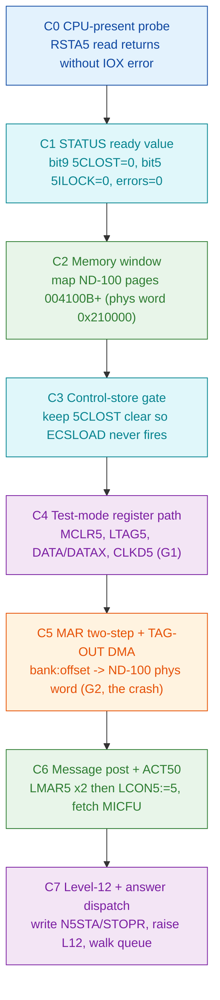

# ND-500 Bus Interface Reference - Deep Validation and Gap Report

Validates `SINTRAN/ND500/ND500-BUS-INTERFACE-REFERENCE.md` (the "REFERENCE" below) against the
newly-carved system-monitor evidence produced this cycle, focused on what the RetroCore emulator
(`NDBusND500IF` in `E:\Dev\Repos\Ronny\RetroCore`) must implement to CONNECT and bootstrap the
ND-500 CPU.

**Date:** 2026-07-15
**Scope:** consistency check of the REFERENCE section-by-section; gap/extension list; an
emulator-actionable bring-up checklist.
**This document does NOT edit the REFERENCE.** All paths are repo-root-relative
(root `E:\Dev\Ronny\NDInsight`). All numbers OCTAL unless prefixed `0x` (hex) or marked decimal.

Evidence tags: **PROVEN** (read from carved bytes or NPL source), **INFERRED** (reasoned, not
directly read), **OPEN** (unknown; experiment named).

## Sources validated against

| Short name | File |
|---|---|
| CARVE-IOX | `tools/sintran-segment-carver/versions/L-VSX-500/re/ND500-SYSTEM-MONITOR/ND500-3022-IOX-INTERFACE.md` |
| CARVE-DRV | `tools/sintran-segment-carver/versions/L-VSX-500/re/ND500-SYSTEM-MONITOR/ND500-3022-IOX-DRIVER.ASM` |
| CARVE-GATE | `tools/sintran-segment-carver/versions/L-VSX-500/re/ND500-SYSTEM-MONITOR/ND500-CONTROL-STORE-GATE.md` |
| CARVE-5MPM | `tools/sintran-segment-carver/versions/L-VSX-500/re/ND500-SYSTEM-MONITOR/ND500-5MPM-MESSAGE-AND-ACTIVATION.md` |
| CARVE-L12 | `tools/sintran-segment-carver/versions/L-VSX-500/re/ND500-SYSTEM-MONITOR/ND500-LEVEL12-RETURN-PATH.ASM` |
| CARVE-FUNCS | `tools/sintran-segment-carver/versions/L-VSX-500/re/ND500-SYSTEM-MONITOR/FUNCS-dispatch-table.md` |
| CARVE-MEMCONF | `tools/sintran-segment-carver/versions/L-VSX-500/re/ND500-SYSTEM-MONITOR/FUNCS-BODIES/FUNCS-memconfig-reserve.ASM` |
| CARVE-README | `tools/sintran-segment-carver/versions/L-VSX-500/re/ND500-SYSTEM-MONITOR/README.md` |
| CALLER-MON | `SINTRAN/ND500/nd-500-mon/nd-500-mon-j04.prog.md` |
| SUBFN | `SINTRAN/ND500/nd-500-mon/mon60-callers/SUBFUNCTION-TABLE.md` |
| SWAP | `SINTRAN/ND500/swapper/swapper-k01-deep-analysis.md` |
| CRASH | `SINTRAN/ND500/nd-500-mon/nd-500-control-store-debug-handoff.md` |
| AUDIT | `SINTRAN/ND500/ND500-EMULATOR-DISCREPANCY-AUDIT.md` |
| NPL-MP / NPL-XC | `SINTRAN/ND500/MP-P2-N500.md`, `SINTRAN/ND500/XC-P2-N500.md` |

The carve byte source is segment `030-S3SM5` (the resident ND-500 System Monitor, load base
`040000B`) and `026-S3IMPIT` (the resident interrupt PIT, base `032000B`), per CARVE-README.

---

## 1. Consistency check (section by section)

Legend: **CONFIRMED** (carve agrees), **CONTRADICTED** (carve disagrees - both cited),
**EXTENDED** (carve adds detail the REFERENCE lacks but does not contradict), **UNSUPPORTED**
(no new evidence either way).

### REFERENCE 2 - Hardware overview
- 3022 in ND-100 bus, 5015 in ND-500, DBU bus, level-12, 24-bit MAR DMA to message memory:
  **CONFIRMED** in shape. CARVE-IOX/CARVE-DRV show the exact `IOXT` device access to the 3022;
  CARVE-L12 shows the level-12 ISR chain. No byte-level contradiction.
- Message memory "resides in RESIDENT of SINTRAN III": **CONFIRMED** - CARVE-5MPM: message lives
  in ND-100 physical memory, bank `5MBBANK`, reached by `LDATX`/`STATX`/`LDDTX`/`STDTX`.

### REFERENCE 3.1 - Device numbers / thumbwheel / ident
- Base in per-CPU slot, every access `T:=HDEV+offset; *IOXT`: **CONFIRMED with a precision.**
  CARVE-IOX/CARVE-DRV show the actual idiom in the resident system monitor is
  `LDX ,B -56 (interface descriptor); LDT ,X -3 (IOX device number); AAT <off>; IOXT`. The device
  number sits at descriptor offset `-3`. The REFERENCE's "HDEV displacement 177775, B-relative"
  describes the level-12 driver's datafield; the system monitor reaches the same device number
  through the CPU-DF at `,B -56 / ,X -3`. Both are the same device; **EXTENDED** - the emulator
  needs the device number, not the specific SINTRAN slot.

### REFERENCE 3.2 - Register offsets and the four-mode decode
- Every offset in the table (`+2 RSTA5`, `+5 LCON5`, `+6 MCLR5`, `+11 LTAG5`, `+13 LLOW5/WDAT`,
  `+14 SLOC5`, `+15 CLKD5`, `+16 UNLC5`, `+17 RETG5`, plus `+0/1 RMAR5/LMAR5`, `+10 RTAG5/RUPP5`):
  **CONFIRMED at the byte level.** CARVE-IOX cross-validates the whole map against the
  `AAT <n>` operands preceding each `IOXT` in `030-S3SM5` and states the two independent sources
  (driver bytes and TMP hardware manual) "agree on every register."
- The four-mode decode itself (offsets 6/7/13 re-decoding to DATA/limit loads in test mode):
  **CONFIRMED by usage.** CARVE-DRV's `REDAT` (`051052B`) reads back a data word from `dev+6`
  after driving `dev+11` (LTAG5) and `dev+15` (CLKD5) - i.e. it operates the interface in the
  TEST-mode data path exactly as REFERENCE 3.2 note "In unlocked+test the same offset [6] loads
  the DATA register instead" predicts. This is strong independent confirmation of the four-mode
  model.

### REFERENCE 3.3 - "Registers SINTRAN never touches" - **CONTRADICTED (the key finding)**

REFERENCE 3.3 states: "A whole-tree grep of the SINTRAN NPL sources proves the driver uses ONLY:
RSTA5, LSTA5, LCON5, LMAR5, TERM5, SLOC5, UNLC5, RETG5" and lists as **"Never issued by
SINTRAN":** RMAR5, RCON5, **MCLR5**, RTAG5/**LTAG5**, RUPP5/LUPP5 and RLOW5/**LLOW5**, **CLKD5**,
5MODE.

The carved resident ND-500 System Monitor (`030-S3SM5`) - which is part of SINTRAN III - **does
issue four of those "never" registers**, byte-proven in CARVE-DRV:

| REFERENCE 3.3 says "never" | Carved use in `030-S3SM5` (CARVE-DRV line) | Register |
|---|---|---|
| MCLR5 (dev+6) | `051103-051105`: `LDT ,X -3; AAT 6; IOXT` in `REDAT`; also `5MCLE` FUNCS[035] | dev+6 |
| LTAG5 (dev+11) | `051121-051124`: `AAT 11; IOXT` in `WRTAG`; `051060-051063` in `REDAT` | dev+11 |
| LLOW5 / WDAT (dev+13) | `051037-051040`: `AAT 13; IOXT` in `WRDAT` | dev+13 |
| CLKD5 (dev+15) | `051071-051072`: `AAT 15; IOXT` in `REDAT` | dev+15 |

**Reconciliation (not a wash - a real scope error in the REFERENCE).** REFERENCE 3.3's grep
covered the NPL level-12 *communication driver* (`MP/XC/CC/RP/PH-P2-N500.NPL`). That claim is
true *for that driver*. But the ND-500 **System Monitor** (`030-S3SM5`, the MON 60 server side,
whose source is not in `NPL-SOURCE/NPL/`) is a *second* resident SINTRAN component and it drives
the interface at the register-strobe / DATA-register level - the very thing REFERENCE 3.3 and
REFERENCE 10 attribute exclusively to "the microcode loader and test programs." The system
monitor's `REGRE`/`REGWR`/`PMREA`/`PMWRI`/`AMEMR`/`AMEMW`/`CSLOA`/`CSREA` operations
(CARVE-FUNCS) perform register and memory examine/deposit by directly cycling LTAG5 (TAG-OUT
codes), the DATA register (dev+6/7 in test mode), CLKD5 and MCLR5.

Consequence for the emulator: **the claim "an emulator that only aims to run SINTRAN needs only
RSTA5/LSTA5/LCON5/LMAR5/TERM5/SLOC5/UNLC5/RETG5" (REFERENCE 3.3 item 3) is wrong.** To service
`@ND-500` operator commands (VERSION, EXAMINE, DEPOSIT, register read/write, control-store
load/read) the emulator must ALSO implement MCLR5, LTAG5 (TAG-OUT), the DATA/DATAX registers
(dev+6/7/13 in test mode) and CLKD5 with faithful semantics. See gap G1 and checklist rows C4-C5.

### REFERENCE 4.1 - CONTROL register
- Bit map and the CONTROL values SINTRAN writes (1, 5, 10, 40, 0, 400): **UNSUPPORTED by new
  bytes / not contradicted.** The carve does not re-derive the CONTROL bit map; it uses LCON5
  writes consistent with it (e.g. CARVE-DRV `REDAT` writes `A:=44` then `A:=40` to LCON5, matching
  REFERENCE 4.1 "bits 2+5 = activate + disable-TAG" and "40 = disable TAG-IN decoding"). No
  contradiction.

### REFERENCE 4.2 - STATUS register (and bit 9 5CLOST) - **CONFIRMED + EXTENDED**
- Bit map incl. bit 5 `5ILOC`/`5ILOCK` (000040) and bit 9 `5CLOST`/`5CLOS` (001000) "micro clock
  stopped": **CONFIRMED by byte + NPL.** CARVE-GATE and NPL-XC:219 (`BIT 5CLOST=9 (001000) =
  Microclock stopped`), NPL-MP:436/2495 (`5CLOS 5CLOST 9 000011`). Symbol values `5CLOS=000011`
  (bit 9), `5ILOC=000005` (bit 5) confirmed.
- **EXTENDED (the emulator gate):** CARVE-GATE establishes what the REFERENCE only implies -
  when the micro clock is stopped (no control store loaded), **STATUS bit 9 is SET**; the driver
  reads this as "control store not loaded" and the MON 60 path returns `ECSLOAD` (`2032B`). The
  REFERENCE names the bit but never states this polarity or its ECSLOAD consequence. This is the
  single most important operational fact for bring-up (checklist C3).

### REFERENCE 5 - Activation protocol (ACT50) - **CONFIRMED**
- ACT50: `5MBBANK -> LMAR5 (MS)`, `A:=X -> LMAR5 (LS)`, `A:=5 -> LCON5`: **CONFIRMED byte-mapped.**
  CARVE-5MPM reproduces the sequence and pins `LMAR5=dev+1`, `LCON5=dev+5` against the
  byte-validated register map. Preconditions (RSTA5; give up on 5CLOST; terminate first on
  5ILOCK): CONFIRMED against NPL-MP.

### REFERENCE 6 - Message memory / layout / status words / MICFU - **CONFIRMED + EXTENDED**
- 6.1 addressing via `5MBBANK` + physical primitives: **CONFIRMED** (CARVE-5MPM; NPL-RP shows
  `T:=5MBBANK; *AAX <field> LDATX/LDDTX` throughout).
- 6.2 message header offsets (-1 5MSFL, 0/1 LINK, 2 N5STA, 3 SENDE, 4 X5CPU, 5 X5ACT, 6 MICFU,
  7 N500A, 11 N100A/STOPR/ACPRO, 13 NRBYT): **CONFIRMED.** CARVE-5MPM reproduces the same header
  and **EXTENDS** it with offset `37 = SMCNO` (saved mon-call number) and the explicit
  reconciliation that offset 13 is `NRBYT` (byte count) or `MCNO` (mon-call number) direction-
  dependent - "same slot, direction-dependent meaning. Not a contradiction."
- 6.3 N5STA values (MSGN500=1, WAITING=2, ANSWER=3, 5ERANSWER=4): **CONFIRMED at byte level by
  the ISR.** CARVE-L12 `CHN5STATUS` (135205B) tests `SAT 3` (135213) then `SAT 4` (135241) -
  N5STA == ANSWER(3) then == 5ERANSWER(4) - exactly the REFERENCE 7.3 dispatch.
- 6.4 MICFU codes (3MONCO=24, 3TRACO=25, ...): **CONFIRMED at byte level.** CARVE-README /
  CARVE-L12: `DECOM` "dispatches on the MICFU code (`SAT 24`=3MONC monitor-call, `SAT 25`=3TRAC
  trace)."

### REFERENCE 7 - Level-12 interrupt service - **CONFIRMED**
- 7.2/7.3/7.4 chain 5STDRIV -> CHN5STATUS -> DECOMESS -> MCHANDLE: **CONFIRMED byte-located.**
  CARVE-L12 pins `5STDR=135010 -> CHN5S=135205 -> DECOM=135361 -> MCHAN=137206` in `026-S3IMPIT`
  (NOT `030-S3SM5`; overlay verified by code coherence). Dispatch on N5STA (ANSWER/5ERANSWER) and
  then MICFU/STOPR: CONFIRMED as above.

### REFERENCE 8.1 - Detection (CH5CPUPRESENT) - **CONFIRMED (mechanism)**
- Trapped `IOX read of RSTA5`, A=0 => 3022 present: **CONFIRMED in mechanism** by CARVE-IOX (the
  status read is `IOXT dev+2` via `RSTAT`). The detection *routine* itself (`PH-P2-OPPSTART`) is
  not re-carved here; **UNSUPPORTED** at byte level but not contradicted.

### REFERENCE 8.2 - Control-store load - **CONFIRMED + LOCATED**
- "loaded FROM the ND-100 through the 3022/5015 path": **CONFIRMED and LOCATED.** CARVE-FUNCS
  pins `CSLOA` (FUNCS[037], `153441B`) = LOAD CONTROL STORE and `CSREA`/`CSWRI`/`MPSTA`/`MPSTO`/
  `5MCLE` (023/024/025/034/035). The REFERENCE says "SINTRAN's NPL does not contain this loop;
  the ND-500 Monitor performs it" - the carve shows the loop is in the *resident* System Monitor
  `030-S3SM5` (`CSLOA` body in `FUNCS-BODIES/FUNCS-controlstore-micro.ASM`), reached by MON 60
  subfunction 037. This is a refinement, not a contradiction: it is still "the monitor," but it
  is resident SINTRAN code, and it uses the register set REFERENCE 3.3 said SINTRAN never uses.

### REFERENCE 10 - TAG-IN / TAG-OUT - **CONFIRMED as hardware; scope note**
- TAG registers are real register-level strobes, NOT a fabricated message protocol: **CONFIRMED.**
  CARVE-IOX: "`WRTAG` = `LTAG5` = Write TAG-OUT - a real hardware register ... NOT the fabricated
  TAG code protocol (message codes 8/9/16)."
- TAG-OUT code table (0 read MAR ... 6 read DATA+ND100 mem, 7 write DATA+ND100 mem):
  **UNSUPPORTED by new bytes but consistent.** The crash (CRASH section 2-3) is a TAG-OUT
  write-to-ND-100-memory (code 7 or the emulator's equivalent) - operationally consistent with
  REFERENCE 10.2. Note the SCOPE correction from 3.3 above: the assertion that only the loader /
  test programs drive TAG-OUT is too narrow - the resident System Monitor drives LTAG5 too.

### REFERENCE 11 - Monitor calls (interface view) - **TWO CONTRADICTIONS**

(a) **Skip/direct polarity - CONTRADICTED.** REFERENCE 11 says "skip-return signals error."
CALLER-MON section 5.4 proves from the shipped binary AND from the handler source that this is
BACKWARDS: the ND-100 MON contract is **skip-return on SUCCESS**. At the gateway `146256B`,
`146257` (P+1, direct) is the ERROR path (it compares A against ECSLOAD) and `146260` (P+2, skip)
is SUCCESS. Confirmed from the SINTRAN side: `5P-P2-MON60.NPL:2247` `5OKRET` does `MIN ZPREG`
(skip return) with `ZAREG:=0`; `ERET` stores the error code and does NOT skip. **The REFERENCE's
"skip-return signals error" must be inverted.**

(b) **The second retry constant / PFECSLOAD guess - CONTRADICTED (refuted).** REFERENCE 11 says
the second wait-and-retry constant is "most plausibly PFECSLOAD = 2063B ... but the disassembly
recorded 0x080F (= 2063 DECIMAL) - a base-confusion discrepancy pending recheck." CALLER-MON
section 10.1 settles it from the bytes: the stored constant at `146305` is `004017B` = `0x080F`;
`PFECSLOAD` is `2063` OCTAL = `0x0433`; these are different numbers. **`004017B` is NOT
PFECSLOAD; its identity is OPEN** (no MON-60 status symbol has value `4017B`). The "base
confusion" was in the original analysis, not the symbol table. ECSLOAD = `2032B` = `0x041A` at
`146304` remains **CONFIRMED**.

### REFERENCE 12 - Swapper - **CONFIRMED + one correction absorbed**
- Swapper is ND-500 process #0, disk work by ND-100 RT-program 5SWAP, MON 60 subfunctions
  007/054/076/121: **CONFIRMED.** SWAP proves the swapper is a CLIENT: it DMA-reads its message
  from ND-100 memory (`RIOM` x3), dispatches on its own 29-entry table, and traps outward with
  `MON 377B` (= MON 255, N5SWAP) for disk/fatal. No contradiction with REFERENCE 12; SWAP adds
  the outbound-trap direction the REFERENCE does not cover (EXTENDED, see G4).

### REFERENCE 13 - ND-5000 / SAMSON - **UNSUPPORTED (out of this cycle's scope)**
- Not re-validated this cycle; the carve is old-500 (3022/5015). No contradiction found.

### REFERENCE 14 - Appendix (emulator state machine) - **CONFIRMED direction; incomplete**
- The invented "high-level TAG code" callbacks must go, replace with the message engine:
  **CONFIRMED** by AUDIT D01/D02 and by CARVE-IOX. Item 5 (message engine) and item 6 (stop/clear)
  are the right targets. Incompleteness is covered in Gaps below.

### Contradiction tally

**Three contradictions** between the REFERENCE and the carved bytes:

1. **REFERENCE 3.3** "SINTRAN never touches MCLR5 / LTAG5 / LLOW5(WDAT) / CLKD5" - CONTRADICTED by
   `030-S3SM5` (CARVE-DRV): the resident ND-500 System Monitor issues all four.
2. **REFERENCE 11** "skip-return signals error" - CONTRADICTED (CALLER-MON 5.4): skip = success.
3. **REFERENCE 11** "second retry constant most plausibly PFECSLOAD 2063B" - CONTRADICTED /
   refuted (CALLER-MON 10.1): the constant is `004017B` = 0x080F, not PFECSLOAD; identity OPEN.

(Plus multiple EXTENDED items where the carve deepens, not contradicts, the REFERENCE - most
importantly the bit-9/ECSLOAD gate and the SMCNO/MCNO overlay.)

---

## 2. Gap / extension list - what the emulator still needs

### G1 - The register set the System Monitor uses is broader than REFERENCE 3.3 lists (CRITICAL)
The emulator, per REFERENCE 3.3 item 3 and AUDIT, may implement only the 8 level-12-driver
registers. To bootstrap via MON 60 the emulator ALSO needs **MCLR5 (dev+6), LTAG5/TAG-OUT
(dev+11), DATA (dev+6/7 test-mode), DATAX/LLOW5 (dev+13), CLKD5 (dev+15)**. Where the answer
lives: **CARVE-DRV** (WADR/WRDAT/RDATL/REDAT/WRTAG bodies) and **CARVE-FUNCS-BODIES**
(`FUNCS-register-memory.ASM`, `FUNCS-controlstore-micro.ASM`) - both PROVEN. This is the
register-level examine/deposit path used by `REGRE`/`REGWR`/`PMREA`/`PMWRI`/`AMEMR`/`AMEMW`/
`CSLOA`/`CSREA`.

### G2 - The MAR -> ND-100 physical address arithmetic (the crash cause) (CRITICAL - crash fix now PROVEN as an identity; only byte-layout OPEN)
The REFERENCE gives the MAR two-step (MS first / LS first, bits 24-31 mirror 8-15) but **never
states the arithmetic that turns MAR into an ND-100 physical address**, which is exactly what the
RetroCore "Unmapped memory" crash needs (CRASH section 2-5).

What is PROVEN:
- MAR is loaded `{5MBBANK (MS), message address (LS)}` (CARVE-5MPM, REFERENCE 5.2).
- `5MBBANK` is computed once: `5FPMAILBOX=:D:=0; AD SH 12; A=:5MBBANK` (REFERENCE 6.1, NPL-RP:737).
  So the bank is a 64KW-granular selector derived from the mailbox physical page.
- The physical primitives use bank:offset addressing: `T:=5MBBANK; *AAX <field> LDATX/LDDTX`
  (NPL-RP throughout) - i.e. physical word = bank-base + word offset.
- MEM-CONF on the crashing system places **ND-500 physical address 0 at ND-100 page `004100B`
  = physical word `0x210000`** (byte `0x420000`); register block at `004212B`, phys-seg table at
  `004252B` (CRASH section 4, PROVEN from the monitor's own MEM-CONF output; the monitor's
  "ND-100 WORD" column reads `00010200000B` = `0x210000`, matching the page arithmetic exactly).

What was INFERRED, now UPGRADED to a PROVEN identity (do not chase a numeric formula):
- The emulator does NOT need a separately-derived `bank*0x10000` formula. The ND-500 microcode DMAs
  the message through MAR `{5MBBANK, addr}` (ACT50, `SINTRAN/ND500/MP-P2-N500.md:817-819`); the
  SINTRAN driver reads/writes that SAME message with the physical primitives `LDATX`/`LDDTX`/`STATX`
  using the SAME pair `T=5MBBANK, X=addr`
  (`SINTRAN/ND500/ND500-MONITOR-CALL-PARAMETER-PASSING.md:98,111,315`). Because both touch the same
  mailbox word, they MUST resolve to the same ND-100 physical word.
  **Therefore the fix is: `ProcessTagOut` / `WriteND100Memory` must route through the identical
  physical-address logic the emulator already uses for `LDATX`/`LDDTX`/`STATX` - not a separate
  `bank*0200000B` calc.** The emulator's LDATX path already works (SINTRAN boots), so any divergence
  between the two IS the crash. (PROVEN from the NPL bytes.)

What is STILL OPEN (narrower than before):
- Only the hardware bit-layout: how the ND-100 forms a 24-bit physical address from `(T,X)`, and
  whether MAR is a word or a byte address (CRASH H2's `MAR<<1` question). This is an architecture
  fact, settled by the ND-100 Reference Manual (ND-06.014) physical-addressing section, or
  empirically by a live nd100x DAP trace: watch the two `LMAR5` writes and a driver `LDATX` to the
  message, confirm both physical addresses are equal and that `ProcessTagOut` produces the same one
  (which also directly tests the crash fix). Carving the `LDATX`/`STATX` primitive bodies at
  `143300B` in `030-S3SM5` (CARVE-5MPM, not yet disassembled) also pins it.

### G3 - Message queue / slot structure: how messages are linked (PARTIAL)
The REFERENCE (6.2, 7.2) says the ISR "walks the execution queue from MAILINK, follows LINK
fields until -1" and that `DUMMESS` heads the queue as a sentinel. What the emulator needs to
answer messages correctly:
- **PROVEN:** LINK is a double word at offsets 0/1 (`LINK@3` = read as double), read via
  `LDDTX` with bank `5MBBANK`; the walk skips the node whose address equals `DUMMESS`
  (REFERENCE 6.3; NPL-RP:416 `T:=5MBBANK; *LINK@3 LDDTX % Always skip first message`). CARVE-L12
  `5STDRIV` (135047-135071) shows the link-follow loop byte-for-byte: `LDX ,B 22` (MAILINK head),
  `SAT -1` end sentinel test, `LDDTX`, `RADD CLD SD DX` (advance), loop back to `135050`.
- **OPEN:** the precise per-message slot allocation (how a free block at N5STA=0 is chosen, how
  MESSBUFF per-process buffers relate to the queue). Where it likely lives: `XMSINIT`
  (`RP-P2-N500.NPL:725-859`, REFERENCE 8.3) and the FIFO/X500DF extension (REFERENCE 6.5) - for
  old-500 the linked-list walk above is sufficient; the FIFO path is ND-5000 only.

### G4 - Outbound direction (ND-500 -> ND-100 service request) not in the REFERENCE (EXTENSION)
The REFERENCE covers ND-100 -> ND-500 activation and the level-12 answer path, but not the ND-500
domain trapping *outward* for a service. SWAP proves the swapper issues `MON 377B` (= MON 255,
N5SWAP, handler `SWPDECODER`) with a sub-function code as arg1 (dominant sub-fn = 2, 7 params;
fatal = SWPFA `2047B`). This is not a bus-register behavior (it is an ND-500 supervisor trap
decoded by SINTRAN), so it is arguably out of the bus-interface REFERENCE's scope - but the
emulator's ND-500 side must generate it. Where it lives: SWAP sections 2-3 (PROVEN byte-exact);
`5P-P2-MON60.NPL` SWMC / N5SWAP path.

### G5 - DEFINE-MEMORY-CONFIGURATION register/field layout (PARTIAL)
The REFERENCE 8.4 covers MPM BASE/window translation generically. The concrete DEFMC operation
(FUNCS[040], `155742B`) that writes the ND-100-page-for-ND-500-address-0 mapping is carved
(CARVE-MEMCONF lines 2-85) but not fully field-decoded here; it reads message fields (`,X 60`,
`,X 10`) and builds the config. **Where it lives:** CARVE-MEMCONF `DEFMC` body + the MEM-CONF
output in CRASH section 4. For bring-up the emulator only needs to HONOR the window (map ND-100
pages `004100B`+), not re-implement DEFMC - see checklist C2.

### G6 - The `004017B` (0x080F) retry status identity (OPEN)
Second wait-and-retry constant in the MON 60 gateway. Not PFECSLOAD (refuted, section 1/G above).
Identity OPEN. Where it likely resolves: the `5IFUNC` dispatch / status table in
`5P-P2-MON60.NPL` (the L07 build revision), or driving the monitor and observing which condition
returns it. Low priority for bring-up (the gateway retries unconditionally on both statuses).

---

## 3. Emulator-actionable checklist (bring-up order)

Target: `NDBusND500IF` (RetroCore C#). Each row maps an interface behavior to what the model
must implement, in the order needed to get from "CPU probe" to "message post + answer." Cross-
references AUDIT D-numbers and CRASH hypotheses H1-H4.

| # | Interface behavior | What `NDBusND500IF` must do | Evidence | AUDIT / CRASH ref | Status |
|---|---|---|---|---|---|
| C0 | CPU-present probe (CH5CPUPRESENT) | An `IOX read of RSTA5` (dev+2) must complete WITHOUT raising an IOX-error internal interrupt, so `A=0` after `TRR IIE`/`IIC`; then SINTRAN flags the CPU present + `5ALIVE`, type OLD500=1 | REFERENCE 8.1; CARVE-IOX | AUDIT: bases/idents already correct | PROVEN mechanism |
| C1 | STATUS ready value | `RSTA5` returns a ready-idle word: **bit 9 5CLOST=0, bit 5 5ILOCK=0, bit 2 busy=0, bits 4/6/7/8 errors=0, stop-reason 10-14=0** (value 0, optionally bit 0 int-enabled) | CARVE-GATE; REFERENCE 4.2 | - | PROVEN (bits); INFERRED exact word |
| C2 | Memory window backing | Back ND-100 physical memory through at least page `004252B` (word `0x22A400`); ND-500 addr 0 sits at page `004100B` = word `0x210000`. If real RAM is smaller, mailbox/window DMA is unmapped | CRASH 4; CARVE-MEMCONF | **CRASH H1 (most likely)** | PROVEN (addresses) |
| C3 | Control-store load + 5CLOST gate | On MON 60 the driver reads RSTA5 and returns `ECSLOAD` (2032B) if 5CLOST set; keep 5CLOST CLEAR to pass the gate even without a real microcode image. `CSLOA` = FUNCS[037] loads CS; MCLR5 (dev+6) restarts microcode at CS addr 0 | CARVE-GATE; CARVE-FUNCS | AUDIT D02 | PROVEN |
| C4 | Test-mode register path (broader set) | Implement **MCLR5 (dev+6)** strobe, **LTAG5 (dev+11)** TAG-OUT write, **DATA (dev+6/7 in test)**, **DATAX/LLOW5 (dev+13)**, **CLKD5 (dev+15)**, per the four-mode decode; the System Monitor drives these for register/memory examine-deposit and CS load. Do NOT assume only the 8 driver registers | CARVE-DRV; CARVE-IOX; REFERENCE 3.2 | AUDIT D06/D07/D08; **corrects REFERENCE 3.3** | PROVEN |
| C5 | MAR two-step + TAG-OUT DMA to ND-100 memory (the crash fix) | Assemble MAR = `{5MBBANK(MS), message addr(LS)}`, MS written first; on TAG-OUT code 6/7 route the DMA through the SAME physical-address logic the emulator already uses for `LDATX`/`LDDTX`/`STATX` (both reach the same mailbox word) - NOT a separate `bank*0200000B` calc; bound-check against C2's mapped RAM before writing | REFERENCE 3.2/5.2; CARVE-5MPM; `MP-P2-N500.md:817-819`; CRASH 3-5 | **CRASH H2/H4**; AUDIT D09 | PROVEN identity (MAR map == LDATX map); byte-layout OPEN |
| C6 | Message post + ACT50 activation | On `LCON5:=5` (int-enable + activate/lock, dev+5) after two `LMAR5` writes (dev+1): lock (STATUS bit5), DMA-fetch the 6-word header at MAR, read `MICFU` (off 6), execute, write answer `N5STA`/`STOPR`, then finish. Must clear the lock or respond to TERM5 in finite time | CARVE-5MPM; REFERENCE 5-6 | AUDIT D02/D12 | PROVEN sequence |
| C7 | Level-12 interrupt + answer dispatch | Raise level 12 (ident 16 for thumbwheel 0), gated by CONTROL bit 0. SINTRAN ISR `5STDRIV` reads RSTA5, walks LINK from MAILINK skipping DUMMESS, dispatches `CHN5STATUS` on N5STA (3=ANSWER, 4=5ERANSWER), `DECOMESS` on MICFU (24=3MONCO,25=3TRACO)/STOPR | CARVE-L12; REFERENCE 7 | AUDIT D01/D03 (gate on CONTROL bit0) | PROVEN byte-located |

### Bring-up notes
- **Start with C1+C2+C3.** CRASH ranks H1 (RAM too small vs the `0x210000`+ window) first and
  cheapest; combined with the 5CLOST gate (C3) these unblock `VERSION`/`STATUS` without a real
  microcode engine.
- **C5 is the current live blocker.** The "Unmapped memory" crash is a TAG-OUT DMA write whose
  target overshoots mapped RAM. Fix order: confirm C2 (map the window), then instrument the MAR
  assembly (CRASH H2) to confirm the bank:offset -> physical formula in G2. Also apply AUDIT D09
  (the +2-word DMA stride bug corrupts multi-word transfers).
- **Polarity reminder (from REFERENCE 11 contradiction):** MON 60 returns SKIP on SUCCESS,
  DIRECT (P+1) on ERROR. If the emulator's harness checks return polarity, do not invert it.

---

## Summary

- **Contradictions found: 3** - (1) REFERENCE 3.3 "SINTRAN never touches MCLR5/LTAG5/LLOW5/CLKD5"
  vs the carved `030-S3SM5` System Monitor which uses all four; (2) REFERENCE 11 "skip-return
  signals error" (it signals success); (3) REFERENCE 11's tentative PFECSLOAD identity for the
  `004017B` retry constant (refuted; identity OPEN).
- **Top 3 gaps:** G2 - the MAR -> ND-100 physical address mapping (the crash cause). Now PROVEN as
  an IDENTITY: the MAR-DMA target and the driver's `LDATX`/`LDDTX` on `{5MBBANK, addr}` reach the
  same mailbox word, so the emulator must reuse its existing LDATX physical-address logic in
  `ProcessTagOut`; only the hardware byte-layout (word vs byte address) stays OPEN, closable by the
  ND-100 manual (ND-06.014) or a live nd100x DAP trace. G1 - the broader test-mode register set
  (MCLR5/LTAG5/DATA/DATAX/CLKD5) the emulator must implement, not just the 8 level-12-driver
  registers; G3 - the message queue slot allocation (linked-list walk is PROVEN; free-block/MESSBUFF
  allocation OPEN).
- **Output:** `SINTRAN/ND500/ND500-BUS-INTERFACE-VALIDATION.md`.

The register MAP, the 5CLOST/ECSLOAD gate, the ACT50 activation, the message layout, and the
level-12 answer chain are all now byte-confirmed and emulator-actionable. The remaining
bring-up risk is concentrated in C2/C5 (memory window + MAR->physical DMA), which is precisely
where the current RetroCore crash sits.
