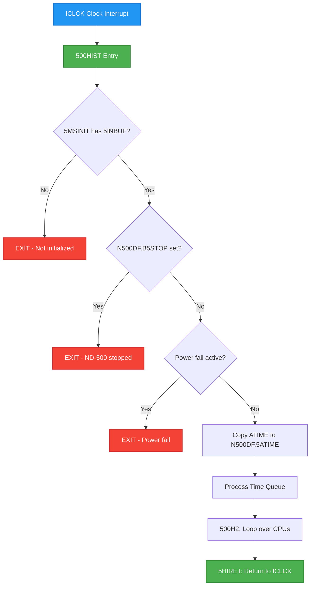
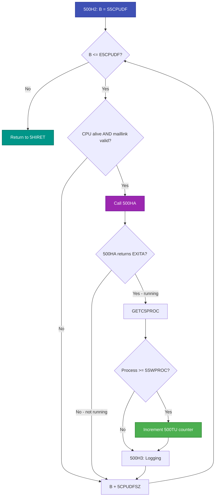
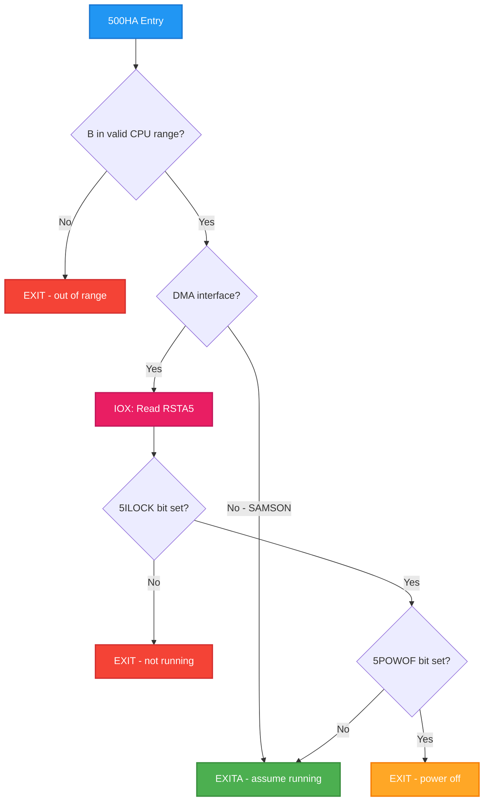
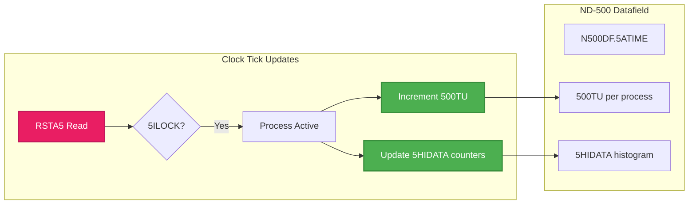
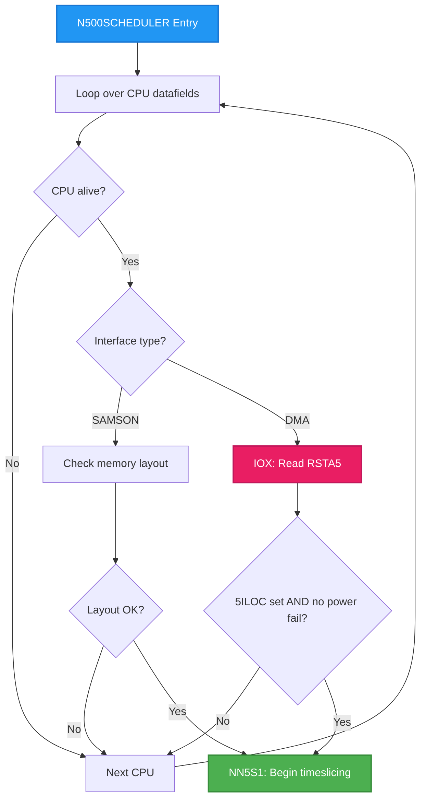
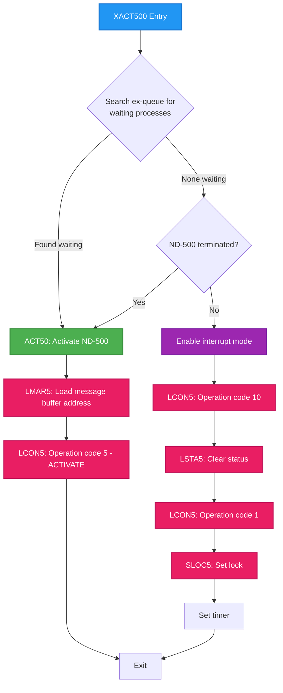
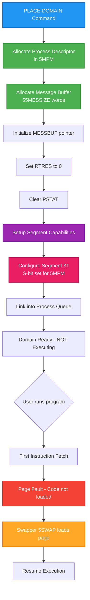
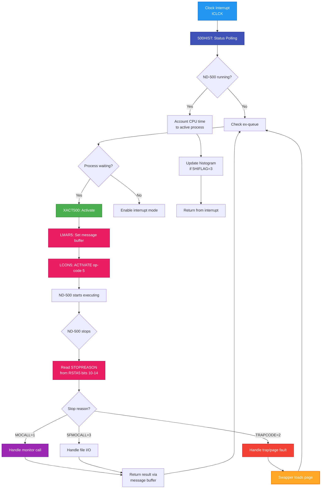

# Deep Analysis: ND-500 Bus Interface (PCB 3022) - Complete IOX Command Reference

## Purpose

Complete deep-dive analysis of all IOX commands for the ND-500 interface. All values verified from NPL source code and NEC-01 documentation. Speculation is explicitly marked.

---

## Symbol to Value Mapping Table

### IOX Register Offsets (HDEV + offset)

| SINTRAN Symbol | Offset (Octal) | Offset (Decimal) | Offset (Hex) | Direction | Purpose |
|----------------|----------------|------------------|--------------|-----------|---------|
| RMAR5 | 000 | 0 | 0x00 | Read | Read Memory Address Register |
| LMAR5 | 001 | 1 | 0x01 | Write | Load Memory Address Register |
| RSTA5 | 002 | 2 | 0x02 | Read | Read Status Register |
| LSTA5 | 003 | 3 | 0x03 | Write | Load Status Register |
| RCON5 | 004 | 4 | 0x04 | Read | Read Control Register |
| LCON5 | 005 | 5 | 0x05 | Write | Load Control Register |
| MCLR5 | 006 | 6 | 0x06 | Cmd/Read | Master Clear / Read DATA |
| TERM5 | 007 | 7 | 0x07 | Cmd/Write | Terminate / Load DATA |
| RTAG5 | 010 | 8 | 0x08 | Read | Read TAG-IN / Read UPPER-LIM |
| LTAG5 | 011 | 9 | 0x09 | Write | Write TAG-OUT / Load UPPER-LIM |
| RLOW5 | 012 | 10 | 0x0A | Read | Read Lower Limit |
| WDAT5/LLOW5 | 013 | 11 | 0x0B | Write | Write DATAX / Load Lower Limit |
| SLOC5 | 014 | 12 | 0x0C | Read | Set Locked / Status Lock |
| CLXD5 | 015 | 13 | 0x0D | Write | Clock DATA |
| UNLC5 | 016 | 14 | 0x0E | Cmd | Unlock |
| RETG5 | 017 | 15 | 0x0F | Write | Return Gate |

---

## Status Register (RSTA5) - Complete Bit Map

> **Source Verification:** Bit positions verified from SINTRAN L07 symbol files (D:\ND\S\L07\SYMBOL-1-LIST.SYMB.TXT).
> NPL truncates symbols to 5 characters. Symbol values are **bit positions** (e.g., 5ILOC=000005 means bit 5).

### Read via IOX offset +2 (HDEV+RSTA5)

```
Bit:  15  14  13  12  11  10   9   8   7   6   5   4   3   2   1   0
     +---+---+---+---+---+---+---+---+---+---+---+---+---+---+---+---+
     |C15|        STOPREASON     |CLO|POF|PFA|DMA|ILK|PAG|FIN|BSY| - |INT|
     +---+---+---+---+---+---+---+---+---+---+---+---+---+---+---+---+
```

| Bit | SINTRAN Symbol | Octal Mask | Hex Mask | Decimal | Meaning | Source |
|-----|----------------|------------|----------|---------|---------|--------|
| 0 | INTE | 000001 | 0x0001 | 1 | Interrupt enabled | NEC-01 3.2 |
| 1 | - | 000002 | 0x0002 | 2 | Not used | NEC-01 3.2 |
| 2 | BUSY | 000004 | 0x0004 | 4 | ND-500 busy | NEC-01 3.2 |
| 3 | FIN | 000010 | 0x0008 | 8 | ND-500 finished | NEC-01 3.2 |
| 4 | 5PAGF | 000020 | 0x0010 | 16 | Inclusive OR of errors | XC-P2-N500.NPL:41 |
| 5 | 5ILOCK | 000040 | 0x0020 | 32 | Interface locked | MP-P2-N500.NPL:2935 |
| 6 | 5DMAER | 000100 | 0x0040 | 64 | DMA/communication error | XC-P2-N500.NPL:42 |
| 7 | 5PFAIL | 000200 | 0x0080 | 128 | Power fault (microprogram) | XC-P2-N500.NPL:43 |
| 8 | 5POWOF | 000400 | 0x0100 | 256 | Power has been off | XC-P2-N500.NPL:44 |
| 9 | 5CLOST | 001000 | 0x0200 | 512 | Microclock stopped | XC-P2-N500.NPL:45 |
| 10-14 | STOPREASON | 037000 | 0x3E00 | 15872 | Stop reason (5 bits) | NEC-01 3.2 |
| 15 | CNTRL15 | 100000 | 0x8000 | 32768 | Control reg bit 15 | NEC-01 3.2 |

### Stop Reason Values (Bits 10-14)

**Source**: N500-SYMBOLS.SYMB.TXT, ND-60.136.04A ND-500 Loader Monitor

The STOPREASON field (bits 10-14) is written by ND-500 microcode when the CPU stops. The value is also copied to the message buffer at offset STOPR (000011 octal = 9 decimal).

**Extraction**: `STOPREASON = (RSTA5 >> 10) & 0x1F`

| Octal | Decimal | Symbol | Full Name | Meaning | When Set |
|-------|---------|--------|-----------|---------|----------|
| 000001 | 1 | MOCAL | MOCALL | Monitor call | ND-500 executed MON instruction |
| 000002 | 2 | TRAPC | TRAPCODE | Trap occurred | Hardware trap (page fault, etc.) |
| 000003 | 3 | 5FMOC | 5FMOCALL | File transfer MON | File I/O monitor call |
| 000101 | 65 | - | (TPSTRA) | N500M RUNN return | MON 407B return from RUNN |

**Code Path** (MP-P2-N500.NPL lines 808-814):
```
IF A=3MONCO OR A=3TRACO OR A=3START OR A=3WMONCO THEN
   T:=5MBBANK; *AAX STOPR; LDATX; AAX -STOPR
   IF A=MOCALL THEN CALL MCHANDLE           % STOP-REASON IS MON.CALL
   ELSE IF A=5FMOCALL THEN CALL MCHANDLE    % STOP-REASON IS FILE-TRANSFER MONCALL
   ELSE IF A=TRAPCODE THEN CALL TRAPDECODER % STOP-REASON IS TRAP
   ELSE CALL 5RRTWT                         % RESTART ND-100 PROCESS
```

**Related Documentation**: See [ND500-MONITOR-CALL-MECHANISM.md](ND500-MONITOR-CALL-MECHANISM.md) Section 5.2 for complete stop reason handling.

### Status Register Masks (from XC-P2-N500.NPL lines 37-38)

| Purpose | Octal | Hex | Binary | Effect |
|---------|-------|-----|--------|--------|
| Clear 5POWOF | 177377 | 0xFEFF | 1111 1110 1111 1111 | ANDs out bit 8 |
| Clear 5POWOF+5PFAIL | 177177 | 0xFE7F | 1111 1110 0111 1111 | ANDs out bits 7-8 |

---

## Control Register (LCON5) - Complete Bit Map

### Write via IOX offset +5 (HDEV+LCON5)

```
Bit:  15  14  13  12  11  10   9   8   7   6   5   4   3   2   1   0
     +---+---+---+---+---+---+---+---+---+---+---+---+---+---+---+---+
     | - |      OPERATION CODE       |CHN|DMA|TAG|CLR|TST|ACT| - |INT|
     +---+---+---+---+---+---+---+---+---+---+---+---+---+---+---+---+
```

| Bit | NEC-01 Symbol | Octal Mask | Hex Mask | Decimal | Meaning | Source |
|-----|---------------|------------|----------|---------|---------|--------|
| 0 | INTE | 000001 | 0x0001 | 1 | Enable interrupt from ND-500 | NEC-01 3.1 |
| 1 | - | 000002 | 0x0002 | 2 | Not used | NEC-01 3.1 |
| 2 | ACTV | 000004 | 0x0004 | 4 | Activate ND-500 (locks comm) | NEC-01 3.1 |
| 3 | TEST | 000010 | 0x0008 | 8 | Test mode | NEC-01 3.1 |
| 4 | PCLY | 000020 | 0x0010 | 16 | ND-500 programmed clear | NEC-01 3.1 |
| 5 | DTAG | 000040 | 0x0020 | 32 | Disable TAG-IN when locked | NEC-01 3.1 |
| 6 | DMAERR | 000100 | 0x0040 | 64 | DMA error | NEC-01 3.1 |
| 7 | CMDCH | 000200 | 0x0080 | 128 | Command chaining | NEC-01 3.1 |
| 8-14 | NDOP | 077600 | 0x7F00 | 32512 | Operation code (7 bits) | NEC-01 3.1 |
| 15 | - | 100000 | 0x8000 | 32768 | Not used | NEC-01 3.1 |

---

## LCON5 Values Written by SINTRAN (VERIFIED)

| Value (Octal) | Value (Hex) | Value (Dec) | Bits Set | NPL Source | Purpose |
|---------------|-------------|-------------|----------|------------|---------|
| 0 | 0x00 | 0 | None | XC-P2-N500.NPL:58 | Clear control |
| 1 | 0x01 | 1 | bit 0 | MP-P2-N500.NPL:3091 | Enable interrupt only |
| 5 | 0x05 | 5 | bits 0,2 | MP-P2-N500.NPL:3086 | **ACTIVATE** |
| 10 | 0x08 | 8 | bit 3 | MP-P2-N500.NPL:3089 | Test mode |
| 40 | 0x20 | 32 | bit 5 | CC-P2-N500.NPL:215 | Disable TAG-IN |
| 400 | 0x100 | 256 | bit 8 | PH-P2-RESTART.NPL:133 | **POWER FAIL RECOVERY** |

### Operation Codes (bits 8-14) - ONLY TWO VERIFIED

| Op Code | Hex in bits 8-14 | Full LCON5 Value | Source | Usage |
|---------|------------------|------------------|--------|-------|
| 0 | 0x00 | 0x05 (with bits 0,2) | MP-P2-N500.NPL:3086 | Normal start/resume |
| 1 | 0x01 | 0x100 | PH-P2-RESTART.NPL:133 | Power fail recovery |

**CRITICAL**: Operations 2-127 (0x02-0x7F) are NOT found in any SINTRAN source code. Do NOT add them.

---

## RETG5 (Return Gate) Register - Bit Map

### Write via IOX offset +17 (HDEV+RETG5)

| Bit | Function | Value | Evidence | Effect |
|-----|----------|-------|----------|--------|
| 0 | Unknown | 0x01 | Not used in SINTRAN | Unknown |
| 1 | **MICROCLOCK STOP** | 0x02 | CC-P2-N500.NPL:216 | Sets 5CLOST, halts CPU |
| 2-15 | Unknown | - | Not used in SINTRAN | Unknown |

**ONLY verified value written to RETG5: 2 (0x02)**

Source: `A:=2; T+"RETG5-LCON5"; *IOXT` (CC-P2-N500.NPL line 216)

---

## Complete IOX Sequences from SINTRAN Source

### 1. MICRO STOP (5MCST) - Force halt ND-500

**Source**: CC-P2-N500.NPL lines 212-218
```
Line 214: T+UNLC5; *IOXT                   ; IOX to HDEV+14 (unlock)
Line 215: A:=40; T+"LCON5-UNLC5"; *IOXT    ; A=0x20, IOX to HDEV+5 (disable TAG-IN)
Line 216: A:=2;  T+"RETG5-LCON5"; *IOXT    ; A=0x02, IOX to HDEV+15 (stop microclock)
```

| Step | Register | Offset | Value Written | Hex | Effect |
|------|----------|--------|---------------|-----|--------|
| 1 | UNLC5 | +14 | (any) | - | Unlock interface |
| 2 | LCON5 | +5 | 40 (oct) | 0x20 | Disable TAG-IN decoding |
| 3 | RETG5 | +17 | 2 | 0x02 | Stop microclock (bit 1) |

**Result**: Status register bit 9 (5CLOST) is set. ND-500 CPU halts.

---

### 2. TERMINATE (XTER500) - Graceful stop request

**Source**: MP-P2-N500.NPL lines 2928-2962
```
Line 2933: T:=HDEV+RSTA5; *IOXT            ; Read status
Line 2935: IF A BIT 5ILOCK THEN            ; Check bit 5 (0x0020)
Line 2936:    T+"TERM5-RSTA5"; *IOXT       ; IOX to HDEV+7 (terminate)
Line 2940:    *IOXT                         ; Poll status
Line 2941:    WHILE A BIT 5ILOCK           ; Wait for unlock
Line 2944: IF A NBIT 5ILOCK GO OKRET       ; Success if bit 5 clear
Line 2945: CALL X5MCST                     ; Timeout: force stop
```

| Step | Register | Offset | Value | Action |
|------|----------|--------|-------|--------|
| 1 | RSTA5 | +2 | Read | Get status |
| 2 | Check | - | bit 5 | Is 5ILOCK set? |
| 3 | TERM5 | +7 | (any) | Issue terminate |
| 4 | RSTA5 | +2 | Read | Poll status |
| 5 | Loop | - | - | Wait for bit 5 clear |
| 6 | Timeout | - | - | Call 5MCST if stuck |

---

### 3. ACTIVATE (XACT500) - Start ND-500 execution

**Source**: MP-P2-N500.NPL lines 3057-3099
```
Line 3063: T:=HDEV+RSTA5; *IOXT            ; Read status
Line 3065: IF A NBIT 5CLOST THEN           ; Check bit 9 NOT set
Line 3066:    IF A BIT 5ILOCK THEN         ; Check bit 5 set
Line 3067:       CALL XTER500; 0/\0        ; Terminate first
Line 3084: ACT50: 5MBBANK; T:=HDEV+LMAR5; *IOXT  ; Load bank to MAR
Line 3085:        A:=X; *IOXT              ; Load message address
Line 3086:        A:=5; T+"LCON5-LMAR5"; *IOXT   ; A=0x05, activate!
```

**Path A - Normal Activation (ACT50)**:

| Step | Register | Offset | Value | Hex | Action |
|------|----------|--------|-------|-----|--------|
| 1 | RSTA5 | +2 | Read | - | Get status |
| 2 | Check | - | bit 9 | 0x0200 | Is clock running? |
| 3 | Check | - | bit 5 | 0x0020 | Is interface locked? |
| 4 | LMAR5 | +1 | Bank | - | Set 5MPM bank |
| 5 | LMAR5 | +1 | Addr | - | Set message address |
| 6 | LCON5 | +5 | 5 | 0x05 | **ACTIVATE** (bits 0+2) |

**Path B - Enable for Interrupt**:
```
Line 3089: A:=10; T:=HDEV+LCON5; *IOXT     ; A=0x08, test mode
Line 3090: A:=0;  T+"LSTA5-LCON5"; *IOXT   ; A=0x00, clear status
Line 3091: A:=1;  T+"LCON5-LSTA5"; *IOXT   ; A=0x01, enable interrupt
Line 3092:        T+"SLOC5-LCON5"; *IOXT   ; Lock interface
```

| Step | Register | Offset | Value | Hex | Action |
|------|----------|--------|-------|-----|--------|
| 1 | LCON5 | +5 | 10 (oct) | 0x08 | Test mode |
| 2 | LSTA5 | +3 | 0 | 0x00 | Clear status |
| 3 | LCON5 | +5 | 1 | 0x01 | Enable interrupt |
| 4 | SLOC5 | +14 | (any) | - | Lock interface |

---

### 4. POWER FAIL RECOVERY

**Source**: PH-P2-RESTART.NPL lines 117-135
```
Line 117: A+RSTA5=:T; *IOXT               ; Read status
Line 119: T+"TERM5-RSTA5"; *IOXT          ; Terminate
Line 121: T+"RSTA5-TERM5"; *IOXT          ; Re-read status
Line 129: A+LCON5=:T; A:=10; *IOXT        ; A=0x08, test mode
Line 130: T+"RSTA5-LCON5"; *IOXT          ; Read status
Line 131: A BONE 5POWOF; T+"LSTA5-RSTA5"; *IOXT  ; Set 5POWOF in status
Line 132: A:="0"; T+"LCON5-LSTA5"; *IOXT  ; Clear control
Line 133: A:=400; *IOXT                    ; A=0x100, POWER FAIL RECOVERY!
Line 134: T+"SLOC5-LCON5"; *IOXT          ; Lock
Line 135: T+"TERM5-SLOC5"; *IOXT          ; Terminate
```

| Step | Register | Offset | Value | Hex | Action |
|------|----------|--------|-------|-----|--------|
| 1 | RSTA5 | +2 | Read | - | Check status |
| 2 | TERM5 | +7 | (any) | - | Terminate if running |
| 3 | LCON5 | +5 | 10 (oct) | 0x08 | Test mode |
| 4 | RSTA5 | +2 | Read | - | Read status |
| 5 | LSTA5 | +3 | OR 5POWOF | 0x0100 | Set power-off flag |
| 6 | LCON5 | +5 | 0 | 0x00 | Clear control |
| 7 | **LCON5** | +5 | **400 (oct)** | **0x100** | **POWER FAIL RECOVERY** |
| 8 | SLOC5 | +14 | (any) | - | Lock |
| 9 | TERM5 | +7 | (any) | - | Terminate |

**This is the ONLY place operation code 1 (bit 8) is used.**

---

### 5. CLEAR STATUS (CLE5STATUS)

**Source**: XC-P2-N500.NPL lines 47-64
```
Line 50: A=:D; T:=HDEV+RSTA5; *IOXT        ; Read status, save mask in D
Line 51: IF A BIT 5POWOF OR A BIT 5PFAIL   ; Check bits 8 or 7
Line 55:    10; T:=HDEV+LCON5; *IOXT       ; A=0x08, test mode
Line 56:    T+"RSTA5-LCON5"; *IOXT         ; Read status
Line 57:    A/\D; T+"LSTA5-RSTA5"; *IOXT   ; AND with mask, write back
Line 58:    "0"; T+"LCON5-LSTA5"; *IOXT    ; Clear control
```

| Step | Register | Offset | Value | Hex | Action |
|------|----------|--------|-------|-----|--------|
| 1 | RSTA5 | +2 | Read | - | Get status |
| 2 | Check | - | bits 7,8 | 0x0180 | Power fault? |
| 3 | LCON5 | +5 | 10 (oct) | 0x08 | Test mode |
| 4 | RSTA5 | +2 | Read | - | Re-read status |
| 5 | LSTA5 | +3 | A AND D | - | Clear bits per mask |
| 6 | LCON5 | +5 | 0 | 0x00 | Clear control |

---

### 6. CONTINUOUS STATUS POLLING (500HIST) - Clock Interrupt Handler

SINTRAN continuously reads the status register on every clock interrupt for CPU accounting and scheduling. This is **by design**, not a bug.

**Source**: MP-P2-N500.NPL lines 200-345

---

#### 6.1 Entry Point and Preconditions

```
Line 220: 500HIST:
Line 221:    IF 5MSINIT NBIT 5INBUF THEN EXIT      % ND-500 not initialized
Line 222:    IF "N500DF".SYSINITFLAG BIT B5STOP EXIT  % ND-500 stopped
Line 226:    IF A/\C5PFMASK><0 THEN EXIT           % Power fail in progress
```

Three conditions cause immediate exit:
1. **5MSINIT not initialized** - The ND-500 subsystem buffer (5INBUF) hasn't been set up
2. **B5STOP flag set** - ND-500 has been explicitly stopped
3. **Power fail active** - Any CPU has C5PFMASK bits set (power failure in progress)

---

#### 6.2 Data Structures Updated by 500HIST

| Data Structure | Source Line | Update Frequency | Purpose |
|----------------|-------------|------------------|---------|
| **N500DF.5ATIME** | 227 | Every tick | Copy of ATIME (absolute system time) |
| **Time Queue** | 228-246 | Every tick | Expire timers, restart waiting processes |
| **500TU** | 280-281 | When ND-500 active | Per-process CPU time accounting |
| **5HIDATA.S5** | 285 | When 5HIFLAG=3 | Total histogram samples |
| **5HIDATA.S1** | 288 | When swapper active | Swapper-active sample count |
| **Per-process counters** | 293-294 | When 5HIFLAG=3 | Active process histogram data |

---

#### 6.3 500HIST Main Flow Diagram



---

#### 6.4 Time Queue Processing (Lines 228-246)

The time queue holds processes waiting for timeouts (MON 5TMOUT). On each tick:

```
Line 227: AD:=ATIME=:"N500DF".5ATIME           % Copy atime to ND-500 datafield
Line 228: DO
Line 229:    "N500DF"=:B
Line 230:    X:=X500DF; T:=5MBBANK; *AAX X5BTI; LDDTX
Line 231: WHILE D><-1                          % Search time queue for expired timers
Line 234:    A=:L:=5ATM2-D:=5ATM1; *RADD ADC CM1 SL DA
Line 235: WHILE A>=0                           % Until no more procs to start
Line 239:    CALL XTER500; 0/\0                % Terminate running process
Line 240:    CALL FR5TMQU                      % Free time queue entry
Line 242:    CALL ITO500XQ                     % Restart process (into execution queue)
```

**For each expired timer**:
1. **XTER500** - Terminate the ND-500 process (signal it to stop)
2. **FR5TMQU** - Free the time queue entry
3. **ITO500XQ** - Place process in execution queue for restart

---

#### 6.5 500H2 CPU Loop (Lines 272-298)

The main CPU status checking loop iterates over all ND-500 CPU datafields.



**Source** (MP-P2-N500.NPL lines 272-282):

```
Line 272: 500H2: A:="S5CPUDF"=:B
Line 273:        DO WHILE B <<= "E5CPUDF"
Line 274:           IF CPUAVAILABLE BIT 5ALIVE AND MAILINK><-1 THEN  % CPU present?
Line 275:              CALL 500HA; GO 500H3           % Yes, running?
Line 276:              CALL GETC5PROC                 % Get current active process
Line 277:              IF A >= 5SWPROC THEN           % Any active process?
Line 278:                 A-5SWPROC*5PRDSIZE+"S500S"  % Calculate process desc addr
Line 279:                 X:=A.MESSBUFF; T:=5MBBANK
Line 280:                 *AAX 500TU; LDDTX           % Increment ND-500 CPU time
Line 281:                 D+1; A:=A+C; *STDTX         % For current active process
Line 282:              FI
```

---

#### 6.6 500HA Status Check Subroutine (Lines 264-269)

The 500HA subroutine determines if a specific ND-500 CPU is actively running.



**Source** (MP-P2-N500.NPL lines 264-269):

```
Line 264: 500HA: IF B<<"S5CPUDF" OR B>>"E5CPUDF" THEN EXIT FI
Line 265:        IF CPUAVAILABLE/\5CPUTYPE><SAMSON THEN    % DMA interface?
Line 266:           T:=HDEV+RSTA5; *IOXT                   % READ STATUS
Line 267:           IF A NBIT 5ILOCK OR A BIT 5POWOF THEN EXIT FI
Line 268:        FI
Line 269:        EXITA
```

**The 500HA subroutine checks**:
- **5ILOCK (bit 5)** - If set, ND-500 is running (interface locked)
- **5POWOF (bit 8)** - If set, skip this CPU (power problem detected)

| Step | Register | Offset | Bits Checked | Purpose |
|------|----------|--------|--------------|---------|
| 1 | Check | - | B range | CPU datafield in valid range? |
| 2 | Check | - | 5CPUTYPE | DMA interface (not SAMSON)? |
| 3 | RSTA5 | +2 | 5ILOCK (bit 5) | Is ND-500 actively running? |
| 4 | RSTA5 | +2 | 5POWOF (bit 8) | Power failure detected? |

**Return behavior**:
- **EXIT** = ND-500 is NOT running (or invalid/powered off)
- **EXITA** = ND-500 IS running (interface locked, proceed with accounting)

---

#### 6.7 Process State Symbols (Lines 211-216)

500HIST uses these constants to classify process states for histogram logging:

| Symbol | Value (Octal) | Value (Decimal) | Meaning |
|--------|---------------|-----------------|---------|
| LIDLE | 2 | 2 | Process is idle |
| LSWPWAIT | 4 | 4 | Waiting for swapper |
| LSWPPING | 6 | 6 | Using swapper |
| LINMCALL | 10 | 8 | Executing monitor call |
| LACTIVE | 12 | 10 | Process is active on ND-500 |
| LCPU | 14 | 12 | Waiting for ND-500 CPU (in ex-queue) |

---

#### 6.8 Histogram Mode (5HIFLAG=3, Lines 283-296)

When process histogram logging is enabled, 500HIST collects detailed sampling data:

```
Line 283: 500H3:       IF 5HIFLAG=3 THEN                   % Process-logg-all
Line 285:                 MIN "5HIDATA".S5; P+1; MIN X.S4; 0/\0    % Increment samples
Line 286:                 X:=SWMSG; CALL RN5STATUS                 % A:=swmsg.n5status
Line 287:                 IF A><PSWWAIT THEN                       % Swapper active?
Line 288:                    MIN "5HIDATA".S1; P+1; MIN X.S0; 0/\0 % Swapper-active counter
Line 291:              FI
Line 292:              CALL GETC5PROC
Line 293:              IF A>=5SWPROC THEN               % Any active process?
Line 294:                 A SH 1+"5HIDATA"+6=:X         % Calculate histogram offset
Line 295:                 MIN X.S1; P+1; MIN X.S0; 0/\0 % Increment active counter
```

**Histogram data structure (5HIDATA)**:
- **S5**: Total sample count
- **S1**: Swapper-active count
- **Per-process counters**: Indexed by (process_number * 2) + 6

---

#### 6.9 Data Flow Diagram



---

#### 6.10 Why Continuous Polling is Necessary

| Purpose | Description |
|---------|-------------|
| **CPU time accounting** | Track which ND-500 process is active each tick for billing/reporting |
| **Histogram sampling** | Performance monitoring data collection (when enabled) |
| **Time queue management** | Expire timers and restart waiting processes |
| **Process status logging** | Feed data to scheduler for load balancing decisions |
| **Watchdog handling** | Detect hung ND-500 processors via lack of activity |

**Polling frequency**: Every basic time unit (~20ms clock tick)

**Important for emulator developers**: Your emulator will see frequent IOX reads to HDEV+RSTA5. This is normal SINTRAN behavior for monitoring ND-500 activity without requiring the ND-500 to actively report back. The frequency is approximately 50 times per second.

---

### 7. N500SCHEDULER TIMESLICER - Undocumented IOX Usage

The timeslicer (N500SCHEDULER) contains an additional IOX status read not documented in the main ND-500 interface guide.

**Source**: RP-P2-N500.NPL lines 82-99

---

#### 7.1 Purpose

Before performing timeslicing operations, the scheduler must verify that at least one ND-500 CPU is available and running. This avoids wasted effort if all ND-500 CPUs are down.

---

#### 7.2 Source Code Analysis

```
Line 82:          "S5CPUDF"=:B
Line 83:          % Test if there is anything to do - any nd-500 cpus in use ?
Line 84:          DO WHILE B<<="E5CPUDF"
Line 85:             IF CPUAVAILABLE BIT 5ALIVE THEN
Line 86:                IF A/\5CPUTYPE=SAMSON THEN
Line 87:                   % Nd-500 samson on octobus line - test if memory layout ok : -
Line 88:                   IF MAILINK><-1  THEN
Line 89:                      A:=0; X:="S5CPUDF"
Line 90:                      DO WHILE X<<="E5CPUDF"; A\/X.C5STAT; X+5CPUDFSIZE; OD
Line 91:                      IF A/\C5PFMASK=0 GO NN5S1
Line 92:                   FI
Line 93:                ELSE
Line 94:                   % Nd-500 on dma interface - test if power present & running : -
Line 95:                   T:=HDEV+RSTA5; *IOXT      % Check if activated and not in power-fail
Line 96:                   IF A BIT 5ILOC AND C5STAT NBIT BHPFAIL GO NN5S1
Line 97:                FI
Line 98:             FI; B+5CPUDFSZ
Line 99:          OD
```

---

#### 7.3 IOX Operation Details

**Line 94-95**: `T:=HDEV+RSTA5; *IOXT`

| Field | Value |
|-------|-------|
| Register | RSTA5 (Status Register) |
| Offset | +2 (octal 002) |
| Operation | Read |
| Called By | N500SCHEDULER (timeslicer) |
| Frequency | Once per timeslice cycle |

---

#### 7.4 Status Bits Checked

**Line 95**: `IF A BIT 5ILOC AND C5STAT NBIT BHPFAIL GO NN5S1`

| Bit | Symbol | Value | Check |
|-----|--------|-------|-------|
| 5 | 5ILOC (5ILOCK) | 0x0020 | Must be SET (interface locked = running) |
| - | C5STAT.BHPFAIL | varies | Must be CLEAR (no power fail) |

**Note**: `5ILOC` appears to be an alternate symbol for `5ILOCK` (both refer to bit 5).

---

#### 7.5 Control Flow



---

#### 7.6 Difference from 500HA

| Aspect | 500HA (MP-P2-N500.NPL) | N500SCHEDULER (RP-P2-N500.NPL) |
|--------|------------------------|--------------------------------|
| **Caller** | 500HIST (clock interrupt) | Timeslicer (scheduler) |
| **Frequency** | Every clock tick (~20ms) | Once per timeslice cycle |
| **Purpose** | CPU accounting, histogram | Check if ANY CPU available |
| **Bit checked** | 5ILOCK, 5POWOF | 5ILOC, C5STAT.BHPFAIL |
| **Action on success** | Account time to process | Begin timeslice operations |

---

## Status Polling Summary

| Context | Source | Frequency | Purpose |
|---------|--------|-----------|---------|
| **500HIST (clock interrupt)** | MP-P2-N500.NPL:266 | Every clock tick | CPU accounting, scheduling |
| **XTER500 (terminate)** | MP-P2-N500.NPL:2940 | Polling loop | Wait for ND-500 to stop |
| **XACT500 (activate)** | MP-P2-N500.NPL:3063 | Once per activation | Verify state before start |
| **CLE5STATUS** | XC-P2-N500.NPL:50 | On demand | Check for power fault |
| **Power fail recovery** | PH-P2-RESTART.NPL:117 | On power event | Recovery sequence |

---

## TAG-IN Register Codes (from NEC-01 Section 3.12)

| Code | Name | Meaning |
|------|------|---------|
| 0 | - | Not used |
| 1 | DICLK1 | Clock DATA-IN-1 register |
| 2 | DICLK2 | Clock DATA-IN-2 register |
| 3 | DOCLK | Clock DATA-OUT register (both) |
| 4 | WACLK | Clock write-addr register |
| 5 | BRKCLK | Clock BREAK register |
| 6 | TGCLK | Clock TAG-OUT register |
| 7 | CYCLK | Clock CSCNT register |
| 8 | DIEN | Enable DATA-IN to CDB bus |
| 9 | DOEN | Enable DATA-OUT (LSB) |
| 10 | WAR | Read write-addr register |
| 11 | BRKR | Read BREAK register |
| 12 | CNTR | Read CSCNT register |
| 13 | RESBRK | Reset break |
| 14 | DUNL | Unlock |
| 15 | EDIDEN | Enable data line driver |

**Bit 5 (0x20)**: Return TAG-IN bits 0-4 (used with CC-P2-N500.NPL line 215)

---

## TAG-OUT Register Codes (from NEC-01 Section 3.13)

| Code | Meaning |
|------|---------|
| 0 | Read memory address register |
| 1 | Write memory address register |
| 2 | Read STATUS register |
| 3 | Write STATUS register |
| 4 | Read CONTROL register |
| 5 | Reset activate |
| 6 | Read DATA register (and ND-100 memory) |
| 7 | Write DATA register (then into ND-100 memory) |

**Bit 7 (MOST)**: Selects most significant part of DATA-OUT register

---

## Mode Restrictions Summary

| Register | Locked + Not Test | Locked + Test | Unlocked + Not Test | Unlocked + Test |
|----------|-------------------|---------------|---------------------|-----------------|
| RMAR5 (+0) | - | - | Read | Read |
| LMAR5 (+1) | - | - | Write | Write |
| RSTA5 (+2) | Read | Read | Read | Read |
| LSTA5 (+3) | - | - | - | Write |
| RCON5 (+4) | - | Read | - | Read |
| LCON5 (+5) | - | - | Write | Write |
| MCLR5 (+6) | Master Clear | - | Master Clear | Read DATA |
| TERM5 (+7) | Terminate | - | Terminate | Load DATA |
| RTAG5 (+10) | Read TAG-IN | - | Read TAG-IN | Read UPPER-LIM |
| LTAG5 (+11) | Write TAG-OUT | - | Write TAG-OUT | Load UPPER-LIM |
| RLOW5 (+12) | - | - | - | Read LOWER-LIM |
| WDAT5 (+13) | Write DATAX | - | Write DATAX | Load LOWER-LIM |
| SLOC5 (+14) | - | - | Set Lock | - |
| CLXD5 (+15) | Clock DATA | - | - | - |
| UNLC5 (+16) | Unlock | Unlock | Unlock | Unlock |
| RETG5 (+17) | Return tag | Return tag | Return tag | Return tag |

---

## 8. Code Loading via ND-500 Interface

### Overview

The ND-500 does NOT load code at domain creation time. SINTRAN III uses **demand paging** - code and data are loaded on page fault, not during PLACE-DOMAIN. The interface is used primarily for:
1. Communication setup (message buffers)
2. Process activation (starting/stopping ND-500 execution)
3. Interrupt signaling

**Key Insight**: PLACE-DOMAIN creates metadata only - the actual code loading happens through the swapper (5SWAP) when page faults occur.

### IOX Commands Used for Domain Setup

#### 8.1 Message Buffer Address Loading (ACT50)

**Source**: MP-P2-N500.NPL lines 3084-3086

```npl
ACT50:           5MBBANK; T:=HDEV+LMAR5; *IOXT
                 A:=X; *IOXT
                 A:=5; T+"LCON5-LMAR5"; *IOXT
```

**IOX Sequence**:

| Step | Register | Value | Purpose |
|------|----------|-------|---------|
| 1 | LMAR5 (+1) | 5MBBANK | Load base address of message buffer bank |
| 2 | LMAR5 (+1) | X | Load specific message buffer address |
| 3 | LCON5 (+5) | 5 | Operation code 5 = ACTIVATE |

#### 8.2 Interrupt Enable Sequence (No Process Waiting)

**Source**: MP-P2-N500.NPL lines 3089-3092

```npl
                 A:=10; T:=HDEV+LCON5;   *IOXT
                 A:=0;  T+"LSTA5-LCON5"; *IOXT
                 A:=1;  T+"LCON5-LSTA5"; *IOXT
                        T+"SLOC5-LCON5"; *IOXT
```

**IOX Sequence**:

| Step | Register | Value | Purpose |
|------|----------|-------|---------|
| 1 | LCON5 (+5) | 10 (octal) | Operation code 8 = enable interrupt |
| 2 | LSTA5 (+3) | 0 | Clear status register |
| 3 | LCON5 (+5) | 1 | Operation code 1 = set interrupt enable |
| 4 | SLOC5 (+14) | - | Set interface lock |

#### 8.3 Activation Flow Diagram



### 8.4 5MPM Window Setup

**Purpose**: Map ND-100 virtual address space to physical 5MPM location for message buffer access.

**Source**: 5P-P2-MON60.NPL lines 1096-1106

```npl
SUBR SUPDWINDOW,XSUPDWINDOW
XSUPDWINDOW:
       T:=1777/\D; GO INSUPWINDOW
SUPDWINDOW:
       T:=5MBBANK; X:=5PRDESCR.MESSBUFF; *AAX ABUFA; LDDTX  % AD=PHYS ADDR OF MON60 BUFFER
       T:=0
INSUPWINDOW:
       AD SHZ 6; A=:CURPROG.BUFWINDOW                       % PHYS.PAGE OF MON60 BUFFER TO RT-DESCR
       A=:D:="WNDBF*2000"+T=:LOGBADR
       X:="WNDBF+WNDBF+174000"; T:=0; A:=142000; *STDTX     % SET PIT ENTRY
       EXIT
```

**What It Does**:
1. Gets physical address of message buffer from 5MPM (via 5MBBANK)
2. Calculates physical page number (shift right 6 bits)
3. Stores in CURPROG.BUFWINDOW for RT descriptor
4. Sets up PIT (Page Identification Table) entry for virtual mapping
5. LOGBADR contains logical address for ND-100 access

---

## 9. Domain Setup and Segment Capabilities

### Overview

A **domain** is an ND-500 process execution context, consisting of:
- Process descriptor (5PRDSIZE = 32 words in 5MPM)
- Message buffer (55MESSIZE = 128 words in 5MPM)
- Up to 32 segment capabilities
- Trap door (Segment 31/37 octal) for ND-100 monitor calls

### 9.1 Process Descriptor Structure

**Source**: N500-SYMBOLS.SYMB.TXT, SINTRAN-DOMAIN-SETUP-DEEP-DIVE.md

| Offset (Octal) | Symbol | Size | Purpose |
|----------------|--------|------|---------|
| 000000 | MESSBUF | 2 | Pointer to message buffer |
| 000002 | RTRES | 1 | RT process reservation |
| 000003 | PSTAT | 1 | Process status flags |
| 000004 | - | 28 | Process-specific data |

**Process Status (PSTAT) Bits**:

| Bit | Symbol | Meaning |
|-----|--------|---------|
| 0 | 5LTSLPRI | Low timeslice priority |
| 1 | SLICE | Timesliceable |
| 2 | 55BRKPRIOR | Waiting for break priority |
| 3 | F5BUFF | Using file buffer |

### 9.2 Message Buffer Structure

**Size**: 55MESSIZE = 128 words (256 bytes)

| Offset (Octal) | Symbol | Purpose |
|----------------|--------|---------|
| 000000 | 55MSN | Message start negative offset |
| 000001 | XADPR | Process descriptor address |
| 000002 | LINK | Link to next in queue |
| 000003 | LINK2 | Secondary link |
| 000005 | 5CPUN | CPU number |
| 000011 | STOPR | Stop reason (copied from status bits 10-14) |
| 000013 | MICFU | Microfunction code |
| 000015 | 5MSFL | Message flags |
| 000017 | 5STAT | Status word |
| 000023 | 5PRIO | Process priority |
| 000025 | ABUFA | Physical address of buffer |
| 000037 | WANTP | Wanted page |

### 9.3 Segment Capability Format

**Source**: ND-500 Reference Manual, SINTRAN-DOMAIN-SETUP-DEEP-DIVE.md

Each segment capability is a 16-bit word:

```
Bit:  15  14  13  12  11  10   9   8   7   6   5   4   3   2   1   0
     +---+---+---+---+---+---+---+---+---+---+---+---+---+---+---+---+
     | - | - | S | P | W |        Physical Segment Number            |
     +---+---+---+---+---+---+---+---+---+---+---+---+---+---+---+---+
```

| Bit | Name | Meaning |
|-----|------|---------|
| 13 | S (SHARED) | **CRITICAL**: Bypass cache for 5MPM access |
| 12 | P (PRIVILEGED) | Kernel mode only |
| 11 | W (WRITE) | Write permission |
| 0-10 | - | Physical segment number (11 bits) |

**The S-Bit (Bit 13)**: When set, all memory accesses to this segment bypass the ND-500 cache and go directly to 5MPM. This is MANDATORY for message buffers in shared memory.

### 9.4 Segment 31 (Trap Door to ND-100)

**Segment 37 (octal) = Segment 31 (decimal)** is special:
- When ND-500 accesses segment 31, it triggers a trap
- ND-500 microcode signals ND-100 via STOPREASON
- ND-100 handles the monitor call
- Results returned via message buffer

**Why Segment 31?**: The ND-500 has 32 segments (0-31). Segment 31 is reserved as the "escape hatch" for system calls that require ND-100 services.

### 9.5 Domain Initialization Flow



---

## 10. Process Scheduling via Interface

### Overview

ND-500 process scheduling is managed by the ND-100. The interface provides:
1. **Status checking** - Determine if ND-500 is available
2. **Activation** - Start ND-500 execution
3. **Termination** - Stop ND-500 execution
4. **Timeslicing** - Preempt running processes

### 10.1 N500SCHEDULER Entry Point

**Source**: RP-P2-N500.NPL lines 78-99

```npl
N500SCHEDULER:
       IF "N500DF".SYSINITFLAG BIT B5STOP THEN EXIT FI
       A:=L=:"TSLREG"
       "S5CPUDF"=:B
       % Test if there is anything to do - any nd-500 cpus in use ?
       DO WHILE B<<="E5CPUDF"
          IF CPUAVAILABLE BIT 5ALIVE THEN
             IF A/\5CPUTYPE=SAMSON THEN
                % Nd-500 samson on octobus line - test if memory layout ok : -
                IF MAILINK><-1  THEN
                   A:=0; X:="S5CPUDF"
                   DO WHILE X<<="E5CPUDF"; A\/X.C5STAT; X+5CPUDFSIZE; OD
                   IF A/\C5PFMASK=0 GO NN5S1
                FI
             ELSE
                % Nd-500 on dma interface - test if power present & running : -
                T:=HDEV+RSTA5; *IOXT                % Check if activated and not in power-fail
                IF A BIT 5ILOC AND C5STAT NBIT BHPFAIL GO NN5S1
             FI
          FI; B+5CPUDFSZ
       OD
       GO TSLREG
```

**IOX Used**: `RSTA5` (+2) - Read status to check 5ILOC (interface locked = ND-500 running)

### 10.2 LOWACT500 / XLOWACT500 (Low-Level Activation)

**Source**: CC-P2-N500.NPL lines 318-322

These routines perform the actual ND-500 activation:
1. Verify CPU available
2. Set message buffer address
3. Issue ACTIVATE operation code

### 10.3 Execution Queue Structure

Processes waiting for ND-500 CPU are linked via the execution queue (ex-queue):

```
MAILINK → Message 1 → Message 2 → Message 3 → ... → -1 (end)
              ↓            ↓            ↓
         LINK field   LINK field   LINK field
```

**Queue Walking** (MP-P2-N500.NPL lines 3072-3079):

```npl
X:=MAILINK
DO                                      % Search ex-queue
   T:=5MBBANK; *LINK@3 LDDTX           % Next message via LINK field
WHILE D><-1                             % Until end of queue
   IF X:=D><DUMMESS THEN
      CALL RN5STATUS                    % Check message status
      IF A=MSGN500 OR A=WAITING GO ACT50  % Found waiting process
   FI
OD
```

### 10.4 Process States in Scheduling

| Status | Value (Octal) | Meaning | Next Action |
|--------|---------------|---------|-------------|
| WAITING | 4 | Waiting for CPU | Can be activated |
| MSGN500 | (varies) | ND-500 message pending | Can be activated |
| PSW1WAIT | (varies) | Waiting for swapper | Wait for page |
| SWPPING | 6 | Using swapper | Continue swapping |

### 10.5 Timeslice Processing

**Source**: RP-P2-N500.NPL lines 102-184

The timeslicer iterates over all ND-500 process descriptors:

```npl
DOX:   IF CINDEX>>MX5PROCS GO FAR EDOX           % All processes searched?
       *IOF
       IF X.RTRES=0 OR X.PSTAT NBIT SLICE OR A/\5RUNSTATUS=5INCOMM GO FAR EFIX
       X=:B=:CTSLPROC                            % Timesliced process
       T:=5MBBANK; X:=X.MESSBUFF; *AAX 5TSLC; LDDTX
       AD=:DTSCOUNT; *AAX 5TSLS-5TSLC; LDATX
       ...
```

**Timeslice Variables in Message Buffer**:

| Offset | Symbol | Purpose |
|--------|--------|---------|
| 5TSLC | - | Timeslice count (double word) |
| 5TSLS | - | Timeslice status |
| 5PRIO | - | Current priority |
| L500C | - | CPU time used (16 bits) |

### 10.6 Complete Scheduling Cycle



### 10.7 IOX Commands Summary for Scheduling

| Operation | Register | Value | When Used |
|-----------|----------|-------|-----------|
| Check status | RSTA5 (+2) | - | N500SCHEDULER, 500HIST |
| Set msg buffer | LMAR5 (+1) | Address | ACT50 activation |
| Activate | LCON5 (+5) | 5 | Start ND-500 |
| Enable interrupt | LCON5 (+5) | 10, 1 | No process waiting |
| Clear status | LSTA5 (+3) | 0 | Reset status bits |
| Set lock | SLOC5 (+14) | - | Lock interface |
| Terminate | TERM5 (+7) | - | Stop ND-500 |

---

## Related Documents

- [ND-500 Interface Overview](ND-500-INTERFACE.md) - High-level interface description
- [MP-P2-N500 Analysis](MP-P2-N500.md) - Main driver module analysis
- [CC-P2-N500 Analysis](CC-P2-N500.md) - Command/control module analysis
- [XC-P2-N500 Analysis](XC-P2-N500.md) - Exception handling analysis
- [ND500 Initialization Guide](ND500-INITIALIZATION-AND-EXECUTION-GUIDE.md) - Boot and startup sequences
- [ND500 Boot Detection](ND500-BOOT-DETECTION-MECHANISM.md) - Hardware detection mechanism

---

## Verification Checklist

- [x] All 16 IOX register offsets mapped with symbols
- [x] Status register all 16 bits documented with SINTRAN symbols
- [x] Control register all 16 bits documented
- [x] All LCON5 values written by SINTRAN found and mapped
- [x] Operation codes identified (only 0 and 1 verified)
- [x] RETG5 bit 1 (0x02) verified as microclock stop
- [x] 7 complete operational sequences extracted with line numbers
- [x] All values in octal, hex, and decimal
- [x] Mode restrictions table from NEC-01
- [x] Continuous status polling (500HIST) fully documented with Mermaid diagrams
- [x] N500SCHEDULER IOX usage documented (RP-P2-N500.NPL line 94)
- [x] Process state symbols documented (LIDLE, LSWPWAIT, etc.)
- [x] Time queue processing documented
- [x] Histogram mode (5HIFLAG=3) documented
- [x] Stop reason values (bits 10-14) fully documented with verified numeric values from symbols
- [x] **Code loading mechanism documented with IOX sequences (Section 8)**
- [x] **Domain setup and segment capabilities documented (Section 9)**
- [x] **Process scheduling via interface documented (Section 10)**
- [x] **ACT50 activation sequence IOX commands documented**
- [x] **5MPM window setup (SUPDWINDOW) documented**
- [x] **Execution queue structure documented**
- [x] **Timeslice processing documented**
- [x] No speculation presented as fact

---

**Document Version**: 1.4
**Last Updated**: 2026-01-29
**Sources**: NPL source code (CC-P2-N500.NPL, MP-P2-N500.NPL, XC-P2-N500.NPL, PH-P2-RESTART.NPL, RP-P2-N500.NPL, 5P-P2-MON60.NPL), NEC-01 course documentation, N500-SYMBOLS.SYMB.TXT

**Version History**:
- 1.4: Added Sections 8-10: Code loading via interface (ACT50, SUPDWINDOW), Domain setup and segment capabilities (S-bit for 5MPM, Segment 31 trap door), Process scheduling via interface (N500SCHEDULER, execution queue, timeslicing)
- 1.3: Added verified stop reason values (MOCALL=1, TRAPCODE=2, 5FMOCALL=3) with numeric values from symbol files
- 1.2: Expanded Section 6 with Mermaid diagrams, time queue processing, histogram mode, process states; Added Section 7 for N500SCHEDULER IOX usage
- 1.1: Added continuous status polling (500HIST) analysis explaining clock interrupt behavior
- 1.0: Initial complete IOX command reference
