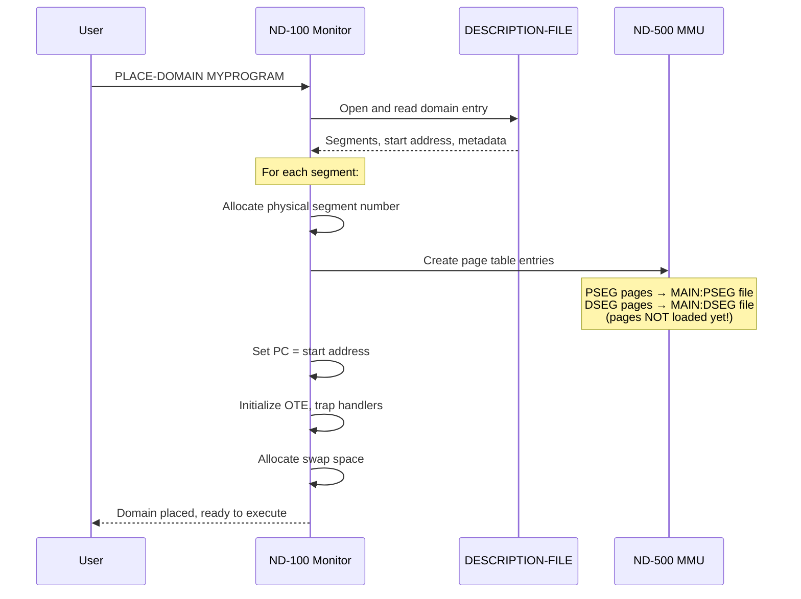
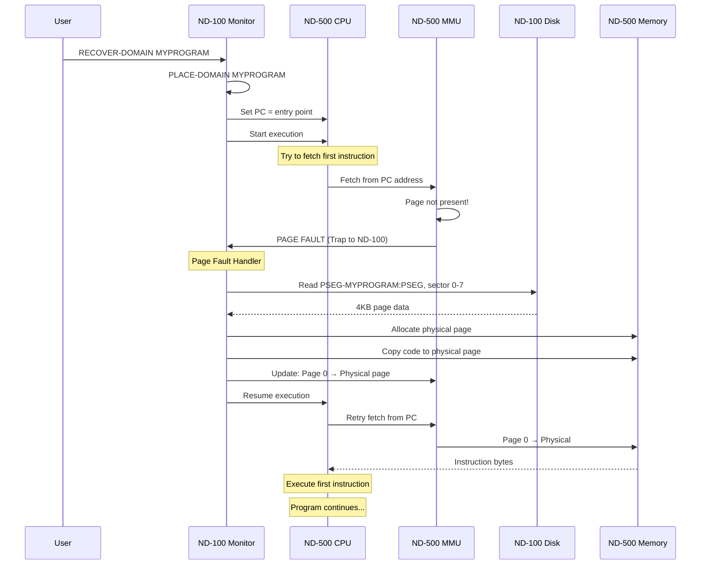

# ND-500 CPU Initialization, Loading, and Program Execution

**Complete Operational Guide for ND-500 CPU Initialization, Domain Setup, and Program Execution**

**Version:** 1.0
**Date:** 2025-11-06
**Purpose:** Comprehensive guide for system operators and developers on how to initialize the ND-500 CPU, load programs via domains (DOM), and execute programs using PSEG/DSEG segments.

---

## Table of Contents

1. [Overview](#1-overview)
2. [ND-500 CPU Initialization](#2-nd-500-cpu-initialization)
3. [Domain Concepts (DOM)](#3-domain-concepts-dom)
4. [Program and Data Segments (PSEG/DSEG)](#4-program-and-data-segments-psegdseg)
5. [Complete Workflow: Compile → Load → Execute](#5-complete-workflow-compile--load--execute)
6. [PLACE-DOMAIN Command](#6-place-domain-command)
7. [RECOVER-DOMAIN and Execution](#7-recover-domain-and-execution)
8. [Memory Fixing Options](#8-memory-fixing-options)
9. [Operational Procedures](#9-operational-procedures)
10. [Troubleshooting](#10-troubleshooting)

---

## 1. Overview

### 1.1 What is the ND-500?

The ND-500 is a **byte-addressed** computation processor that works in conjunction with the ND-100 control processor:

```
┌─────────────────┐         ┌─────────────────┐
│    ND-100       │ ←─5MPM─→│    ND-500       │
│  Control CPU    │         │  Compute CPU    │
│  Word-addressed │         │  Byte-addressed │
│  Owns all I/O   │         │  Computation    │
│  Runs SINTRAN   │         │  No direct I/O  │
└─────────────────┘         └─────────────────┘
```

**Key Points:**
- **ND-100**: Manages all I/O, file system, and OS functions
- **ND-500**: Pure computation engine, no device access
- **5MPM (Multiport Memory)**: Shared RAM for inter-CPU communication
- **Domains**: ND-500 equivalent of "programs" or "processes"

### 1.2 Architecture Overview

```
User Program Execution Flow:

1. Compile source → Relocatable .NRF file
2. Link modules → :PSEG (code) + :DSEG (data) + :DESC (metadata)
3. PLACE-DOMAIN → Setup memory mapping (no code loaded yet!)
4. RECOVER-DOMAIN → Start execution
5. Page faults → ND-100 loads code/data on-demand
6. Execution continues with demand paging
```

---

## 2. ND-500 CPU Initialization

### 2.1 System Boot Detection

During SINTRAN boot (in `SINTR` routine), the system detects ND-500 presence:

```npl
% From PH-P2-OPPSTART.NPL boot sequence
CALL SYSEVAL              % Detect CPU type (ND-100/110/120)
CALL DETECTND500          % Check for ND-500 coprocessor
IF ND500PRESENT THEN
    CALL INIT5MPM         % Initialize multiport memory
    CALL INIT5PROCS       % Setup process descriptor table
    CALL LOAD5XMSG        % Load XMSG kernel into 5MPM
FI
```

### 2.2 Multiport Memory (5MPM) Setup

**Physical Address Allocation:**

```
ND-100 Physical Memory:
┌─────────────────────────────┐
│ 0x000000 - 0x03FFFF        │ Regular RAM (256KB)
├─────────────────────────────┤
│ 0x040000 - 0x05FFFF        │ 5MPM (128KB)
│   - Process Descriptors    │ ← Shared with ND-500
│   - Message Buffers        │
│   - XMSG Kernel            │
│   - Communication Area     │
├─────────────────────────────┤
│ 0x060000+                  │ Additional RAM
└─────────────────────────────┘
```

**5MPM Structure:**

```
5MPM Memory Layout (in shared physical RAM):

┌─────────────────────────────┐ 5MPM Base (S500S)
│ Process Descriptor 0        │ ← 5PRDSIZE words each
│   XADPROC (self-pointer)    │
│   MESSBUFF (message buffer) │
│   STATUS (process status)   │
├─────────────────────────────┤
│ Process Descriptor 1        │
├─────────────────────────────┤
│ Process Descriptor 2-N      │
├─────────────────────────────┤ (S500E)
│ Message Buffer Pool         │ ← Each 55MESSIZE words
├─────────────────────────────┤
│ XMSG Kernel Code            │ ← Communication subsystem
├─────────────────────────────┤
│ Shared Data Area            │
└─────────────────────────────┘ 5MPM End
```

### 2.3 ND-500 CPU Startup

**Initialization Sequence:**

1. **Hardware Detection**
   ```
   @SINTRAN-SERVICE
   *TEST-ND500-PRESENCE
   ```
   - Checks for 5015 Control Board on 3022 bus
   - Verifies ND-500 responds to control signals

2. **Memory Mapping**
   - ND-100 allocates physical 5MPM region
   - ND-500 maps same physical memory to its address space
   - Both CPUs can access 5MPM simultaneously

3. **Process Table Initialization**
   - Create process descriptor slots (typically 8-16 slots)
   - Allocate message buffers for inter-CPU communication
   - Initialize TAG-IN/TAG-OUT signaling registers

4. **Ready State**
   - ND-500 waits for first domain to be placed
   - Monitor kernel ready to handle ND-500 requests

---

## 3. Domain Concepts (DOM)

### 3.1 What is a Domain?

A **domain** is the ND-500 equivalent of a program or process. It consists of:

```
Domain Structure:

┌─────────────────────────────────┐
│ Domain Name: MY-PROGRAM         │
├─────────────────────────────────┤
│ Start Address: Seg 1, Offset 0  │
├─────────────────────────────────┤
│ Segments (0-31):                │
│   Seg 0:  [not used]            │
│   Seg 1:  MAIN:PSEG/MAIN:DSEG   │ ← Main program
│   Seg 2:  SUBR:PSEG/SUBR:DSEG   │ ← Subroutines
│   Seg 30: FORTLIB:PSEG          │ ← Fortran runtime
│   Seg 31: [indirect/monitor]    │ ← Monitor calls to ND-100
├─────────────────────────────────┤
│ Trap Handlers                   │
│ Registers (OTE, CTE)            │
└─────────────────────────────────┘
```

### 3.2 Logical Addressing

**ND-500 Address Format:**

```
32-bit Logical Address:
┌──────────┬─────────────┐
│ Segment  │   Offset    │
│ (5 bits) │  (16 bits)  │
└──────────┴─────────────┘
  31    16 15          0

Example: Address 0x00011234
  Segment: 1
  Offset:  0x1234
  → "Segment 1, byte 0x1234"
```

### 3.3 Domain Files

**Created by Linkage-Loader:**

| File Type | Extension | Content | Purpose |
|-----------|-----------|---------|---------|
| Program Segment | `:PSEG` | Executable machine code | Read-only instructions |
| Data Segment | `:DSEG` | Initial data values | Modifiable data |
| Link Info | `:LINK` | Symbols, debug info | Debugging, additional linking |
| Description | `:DESC` | Domain metadata | Used by PLACE-DOMAIN |

**Description File Entry (`:DESC`):**

```
Domain Entry Structure:

Domain Name:        MY-PROGRAM
Entry Point:        Segment 1, Offset 0x100
Segments:
  - Segment 1:
      PSEG file:  MAIN:PSEG
      DSEG file:  MAIN:DSEG
      PSEG size:  16384 bytes
      DSEG size:  8192 bytes
      Attributes: Public, Shared
  - Segment 2:
      PSEG file:  SUBR:PSEG
      [...]
Trap Handlers:
  Trap 0 (overflow):    Segment 1, Offset 0x2000
  Trap 1 (divide by 0): Segment 1, Offset 0x2100
  [...]
```

---

## 4. Program and Data Segments (PSEG/DSEG)

### 4.1 PSEG - Program Segment

**Characteristics:**
- Contains **executable machine code**
- **Read-only** (cannot be modified during execution)
- Can be **shared** between multiple users running same program
- Loaded **on-demand** via page faults
- Remains in `:PSEG` file, never modified

**Example PSEG Content:**

```assembly
; Segment 1, Offset 0x0000 - Entry point
START:
    STWS    R15, #0x8000        ; Initialize stack pointer
    LDWS    R0, #0              ; Clear R0
    CALL    #INIT               ; Call initialization
    CALL    #MAIN               ; Call main program
    MON     0                   ; Exit to monitor

INIT:
    ; Initialization code
    RET

MAIN:
    ; Main program code
    RET
```

### 4.2 DSEG - Data Segment

**Characteristics:**
- Contains **initial data values**
- **Read-write** (modified during execution)
- **Copy-on-write**: Modified pages go to swap file, not back to `:DSEG`
- Each user gets **private copy** of modified pages
- `:DSEG` file remains clean initial state

**Example DSEG Content:**

```
; Segment 1, Data Section
Offset 0x0000:  Stack area (4KB)
Offset 0x1000:  Global variables:
    COUNTER:    0x00000000      ; 32-bit integer
    MESSAGE:    "Hello World"   ; String constant
    ARRAY:      [0,0,0,...]     ; Integer array
Offset 0x2000:  Heap area (dynamic allocation)
```

### 4.3 Copy-on-Write Mechanism

**Why Modified Pages Don't Go Back to :DSEG:**

```
User 1 runs MY-PROGRAM:
┌─────────────────┐
│ DSEG Page 0     │ ← Loaded from MAIN:DSEG
│ (unmodified)    │
└─────────────────┘

User 1 writes to DSEG Page 0:
┌─────────────────┐
│ DSEG Page 0     │ ← Modified, goes to SWAP FILE
│ (modified)      │    (NOT back to MAIN:DSEG!)
└─────────────────┘

User 2 runs MY-PROGRAM:
┌─────────────────┐
│ DSEG Page 0     │ ← Fresh copy from MAIN:DSEG
│ (unmodified)    │    (User 1's changes not visible)
└─────────────────┘
```

**Benefits:**
- Multiple users can run same program simultaneously
- `:DSEG` file is always clean initial state
- Each user has private data space
- Can restart with clean data by exiting and restarting

---

## 5. Complete Workflow: Compile → Load → Execute

### 5.1 Step 1: Compilation

**Compile Source Code:**

```
@ND-500 FORTRAN
FTN: COMPILE MYPROGRAM,"MYPROGRAM:LIST","MYPROGRAM"
FTN: EXIT
```

**What Happens:**
1. ND-500 Fortran compiler activated
2. Reads `MYPROGRAM:FTN` source file
3. Generates `MYPROGRAM:NRF` (ND Relocatable Format)
4. Creates listing file `MYPROGRAM:LIST`

**NRF File Contains:**
- Machine instructions (relocatable addresses)
- Data definitions
- Symbol table (entry points, externals)
- Relocation information

### 5.2 Step 2: Linking (Creating Domain)

**Load and Link Modules:**

```
@ND-500 LINKAGE-LOADER
NLL: SET-DOMAIN "MYPROGRAM"
NLL: LOAD-SEGMENT MYPROGRAM
NLL: LINK-LIBRARY FORTLIB
NLL: EXIT
```

**What Happens:**
1. Create new domain "MYPROGRAM"
2. Load `MYPROGRAM:NRF` module
3. Resolve external references (link Fortran library)
4. Separate code and data
5. Generate output files:
   - `PSEG-MYPROGRAM:PSEG` (executable code)
   - `DSEG-MYPROGRAM:DSEG` (initial data)
   - `LINK-MYPROGRAM:LINK` (symbols, debug info)
   - Update `DESCRIPTION-FILE:DESC` with domain entry

**Multi-Segment Example:**

```
@ND-500 LINKAGE-LOADER
NLL: SET-DOMAIN "TWO-SEGMENTS"

; Create first segment (subroutines)
NLL: OPEN-SEGMENT "SUBROUTINES" P
NLL: LOAD-SEGMENT SUBR-MODULE
NLL: CLOSE-SEGMENT

; Create second segment (main program)
NLL: SET-SEGMENT-NUMBER 2
NLL: LOAD-SEGMENT MAIN-MODULE
NLL: LINK-SEGMENT SUBROUTINES

; Fortran library as segment 30
NLL: SET-SEGMENT-NUMBER 30
NLL: LINK-SEGMENT FORTLIB

NLL: EXIT
```

### 5.3 Step 3: PLACE-DOMAIN (Memory Setup)

**Place Domain in Memory:**

```
@ND-500
N500: PLACE-DOMAIN MYPROGRAM
```

**What PLACE-DOMAIN Does:**



**Memory State After PLACE-DOMAIN:**

```
Page Tables Created (but NO code loaded yet!):

Segment 1, PSEG Pages:
  Page 0:  → PSEG-MYPROGRAM:PSEG, sector 0-7    [NOT PRESENT]
  Page 1:  → PSEG-MYPROGRAM:PSEG, sector 8-15   [NOT PRESENT]
  Page 2:  → PSEG-MYPROGRAM:PSEG, sector 16-23  [NOT PRESENT]
  ...

Segment 1, DSEG Pages:
  Page 0:  → DSEG-MYPROGRAM:DSEG, sector 0-7    [NOT PRESENT]
  Page 1:  → DSEG-MYPROGRAM:DSEG, sector 8-15   [NOT PRESENT]
  ...

ND-500 Physical Memory:
  [Empty - no pages loaded yet]

Swap File:
  [Space allocated for modified DSEG pages]
```

**CRITICAL**: At this point, **NO CODE IS IN MEMORY**. Only the mapping tables are set up.

### 5.4 Step 4: Execution (RECOVER-DOMAIN / GO)

**Start Execution:**

```
N500: RECOVER-DOMAIN MYPROGRAM
```

Or simply:

```
@ND-500 MYPROGRAM
```

**Execution Sequence:**



**Key Points:**
- First instruction access causes page fault
- Monitor loads code page from `:PSEG` file
- Subsequent instructions in same page execute without faults
- Each new page accessed causes another page fault (first time only)
- After "warm-up" period, most frequently used pages stay in memory

---

## 6. PLACE-DOMAIN Command

### 6.1 Command Syntax

```
PLACE-DOMAIN <domain-name>
```

**Purpose:** Prepare an ND-500 domain for execution by setting up memory mapping.

### 6.2 What PLACE-DOMAIN Does

**Detailed Steps:**

1. **Find Domain Entry**
   - Search `DESCRIPTION-FILE:DESC` for domain name
   - Read segment list, entry point, trap handlers

2. **Allocate Resources**
   - Allocate ND-500 process descriptor in 5MPM
   - Allocate message buffer for I/O communication
   - Allocate physical segment numbers

3. **Setup Page Tables**
   - For each segment in domain:
     - Create page table for PSEG pages
     - Create page table for DSEG pages
     - Set all pages as "NOT PRESENT"
     - Record source file and sector for each page

4. **Initialize Registers**
   - PC (Program Counter) = entry point address
   - OTE (Own Trap Enable) = trap configuration
   - CTE (Child Trap Enable) = child trap settings
   - Trap handler addresses

5. **Allocate Swap Space**
   - Reserve sectors in swap file for modified DSEG pages
   - Record swap sector numbers in page tables

6. **Link to Process Descriptor**
   - Connect domain to process descriptor in 5MPM
   - Mark process as "ready to run"

### 6.3 PLACE-DOMAIN Example

```
@ND-500
N500: PLACE-DOMAIN FORTRAN-TEST

Domain: FORTRAN-TEST
  Segment 1:  PSEG-FORTRAN-TEST:PSEG (4 pages)
              DSEG-FORTRAN-TEST:DSEG (2 pages)
  Segment 30: FORTLIB:PSEG (shared library)
  Entry point: Segment 1, offset 0x0100
  Process ID: 3
  Swap allocation: Sectors 1000-1063 (8 pages)

Domain placed, ready to execute.

N500:
```

---

## 7. RECOVER-DOMAIN and Execution

### 7.1 RECOVER-DOMAIN Command

```
RECOVER-DOMAIN <domain-name>
```

**Equivalent to:**
```
PLACE-DOMAIN <domain-name>
GO
```

**Shortcut:** Just type domain name:
```
@ND-500 MYPROGRAM
```

### 7.2 Execution States

**Process Lifecycle:**

```
┌──────────────┐
│ Domain Files │ :PSEG, :DSEG, :DESC files exist
└──────┬───────┘
       │ PLACE-DOMAIN
       ▼
┌──────────────┐
│   Placed     │ Page tables setup, not running
└──────┬───────┘
       │ GO / RECOVER-DOMAIN
       ▼
┌──────────────┐
│   Running    │ ND-500 executing, page faults loading code
└──────┬───────┘
       │ Program exits (MON 0) or error
       ▼
┌──────────────┐
│  Terminated  │ Process descriptor freed
└──────────────┘
```

### 7.3 Demand Paging During Execution

**Page Fault Flow:**

```
1. ND-500 accesses address → Page not present → PAGE FAULT

2. ND-100 Monitor handles fault:
   - Decode address (segment, offset, page number)
   - Find page table entry
   - Determine source:
     * First access to DSEG page? → Load from :DSEG file
     * Previously modified DSEG page? → Load from swap file
     * PSEG page? → Always load from :PSEG file
   - Find free physical page (may need to swap out victim page)
   - Read 4KB page from disk
   - Copy to ND-500 physical memory
   - Update page table: Present = 1, Physical page number = allocated page
   - Resume ND-500 execution

3. ND-500 retries access → Page now present → Success!

4. Execution continues...
```

**Performance Characteristics:**

- **Cold Start**: Many page faults as code/data loaded for first time
- **Warm State**: Working set in memory, few page faults
- **Page Faults**: Typically 1-5ms delay (disk read + copy)
- **Swapping**: Inactive pages swapped out to free memory for active processes

---

## 8. Memory Fixing Options

### 8.1 Why Fix Memory?

**Problem:** Demand paging causes unpredictable delays

**When fixing is needed:**
- Real-time programs with strict timing requirements
- DMA I/O operations requiring contiguous physical memory
- Shared memory communication with ND-100
- Eliminating page fault latency

### 8.2 FIX-SEGMENT-SCATTERED

**Command:**
```
N500: FIX-SEGMENT-SCATTERED <segment-name>, <P|D>, <start-offset>, <length>
```

**Example:**
```
N500: FIX-SEGMENT-SCATTERED MYPROGRAM, D, 0, 8000
```

**What It Does:**
- Loads all pages in specified range (offset 0 to 8000 bytes)
- Places pages in **any available** physical memory locations
- Sets FPM (Fixed Page Mark) bit in page table
- Pages **cannot be swapped out**
- Pages can be **non-contiguous** in physical memory

**Use Case:** Fast startup, eliminate page faults, no DMA requirements

**Physical Memory Example:**
```
Logical Pages → Physical Pages (scattered):
  Page 0  →  Physical page 15  [FIXED]
  Page 1  →  Physical page 42  [FIXED]
  Page 2  →  Physical page 8   [FIXED]
  Page 3  →  Physical page 27  [FIXED]
```

### 8.3 FIX-SEGMENT-CONTIGUOUS

**Command:**
```
N500: FIX-SEGMENT-CONTIGUOUS <segment-name>, <P|D>, <start-offset>, <length>
```

**Example:**
```
N500: FIX-SEGMENT-CONTIGUOUS IO-BUFFER, D, 0, 16384
```

**What It Does:**
- Loads all pages in specified range
- Finds **contiguous block** of physical pages
- May need to swap out other processes to create contiguous block
- Sets FPM bit
- Pages **cannot be swapped out**

**Use Case:** DMA I/O operations that cross page boundaries, need physically contiguous memory

**Physical Memory Example:**
```
Logical Pages → Physical Pages (contiguous):
  Page 0  →  Physical page 100  [FIXED]
  Page 1  →  Physical page 101  [FIXED]
  Page 2  →  Physical page 102  [FIXED]
  Page 3  →  Physical page 103  [FIXED]
```

**DMA Benefit:**
```
DMA Transfer Setup:
  Physical address: 0x64000 (page 100 * 4096)
  Length: 16384 bytes
  → DMA controller can use single descriptor for entire buffer
```

### 8.4 FIX-SEGMENT-ABSOLUTE

**Command:**
```
N500: FIX-SEGMENT-ABSOLUTE <segment-name>, <P|D>, <physical-addr>, <start-offset>, <length>
```

**Example:**
```
N500: FIX-SEGMENT-ABSOLUTE SHARED-DATA, D, 50000, 0, 4000
```

**What It Does:**
- Allocates memory at **specific physical address**
- Loads pages to that exact physical location
- Sets FPM bit
- Used for shared memory between ND-100 and ND-500

**Use Case:** RT-COMMON shared memory, specific hardware mapping

**Shared Memory Example:**
```
ND-100 Side:
  RT-COMMON segment → Physical address 0x50000-0x50FFF

ND-500 Side:
  SHARED-DATA segment → Fixed at physical 0x50000-0x50FFF

Result:
  Both CPUs access SAME physical RAM
  ND-100 writes → ND-500 reads instantly
  ND-500 writes → ND-100 reads instantly
```

### 8.5 UNFIX-SEGMENT

**Command:**
```
N500: UNFIX-SEGMENT <segment-name>, <P|D>
```

**Example:**
```
N500: UNFIX-SEGMENT MYPROGRAM, D
```

**What It Does:**
- Clears FPM bit on all pages in segment
- Pages can now be swapped out by memory manager
- Frees physical memory for other processes
- Next access may cause page fault if swapped out

---

## 9. Operational Procedures

### 9.1 Standard Program Execution

**Simple Program:**

```
; Step 1: Compile
@ND-500 FORTRAN
FTN: COMPILE HELLO,"HELLO:LIST","HELLO"
FTN: EXIT

; Step 2: Link
@ND-500 LINKAGE-LOADER
NLL: SET-DOMAIN "HELLO"
NLL: LOAD-SEGMENT HELLO
NLL: LINK-LIBRARY FORTLIB
NLL: EXIT

; Step 3: Execute
@ND-500 HELLO

; Program runs, output appears on terminal
```

### 9.2 Complex Multi-Segment Program

**Program with Multiple Modules:**

```
; Compile all modules
@ND-500 FORTRAN
FTN: COMPILE MAIN,"MAIN:LIST","MAIN"
FTN: COMPILE SUBR1,"SUBR1:LIST","SUBR1"
FTN: COMPILE SUBR2,"SUBR2:LIST","SUBR2"
FTN: EXIT

; Link into multi-segment domain
@ND-500 LINKAGE-LOADER
NLL: SET-DOMAIN "BIG-PROGRAM"

; Main program in segment 1
NLL: LOAD-SEGMENT MAIN

; Subroutines in segment 2
NLL: SET-SEGMENT-NUMBER 2
NLL: OPEN-SEGMENT "UTILITIES" P
NLL: LOAD-SEGMENT SUBR1
NLL: LOAD-SEGMENT SUBR2
NLL: CLOSE-SEGMENT

; Link segments together
NLL: SET-SEGMENT-NUMBER 1
NLL: LINK-SEGMENT UTILITIES

; Fortran library in segment 30
NLL: SET-SEGMENT-NUMBER 30
NLL: LINK-SEGMENT FORTLIB

NLL: EXIT

; Execute
@ND-500 BIG-PROGRAM
```

### 9.3 Real-Time Program with Fixed Memory

**Real-Time Application:**

```
; Normal compile and link
@ND-500 FORTRAN
FTN: COMPILE RT-CONTROL,"RT-CONTROL:LIST","RT-CONTROL"
FTN: EXIT

@ND-500 LINKAGE-LOADER
NLL: SET-DOMAIN "RT-CONTROL"
NLL: LOAD-SEGMENT RT-CONTROL
NLL: LINK-LIBRARY FORTLIB
NLL: EXIT

; Place domain
@ND-500
N500: PLACE-DOMAIN RT-CONTROL

; Fix critical sections in memory
N500: FIX-SEGMENT-SCATTERED RT-CONTROL, P, 0, 0         ; All code
N500: FIX-SEGMENT-SCATTERED RT-CONTROL, D, 0, 4000      ; First 4KB of data

; Fix I/O buffer contiguously for DMA
N500: FIX-SEGMENT-CONTIGUOUS RT-CONTROL, D, 10000, 8000  ; DMA buffer

; Start execution
N500: GO

; Program runs with no page faults
```

### 9.4 Debugging a Domain

**Check Domain Status:**

```
@ND-500
N500: LIST-DOMAINS

Domain Name          Status    Segments  Process ID
----------------------------------------------------------------
FORTRAN-TEST        Running      2          3
BIG-PROGRAM         Placed       3          -
IDLE-TASK           Running      1          1

N500: EXAMINE-DOMAIN FORTRAN-TEST

Domain: FORTRAN-TEST
  Status: Running
  Process ID: 3
  Entry Point: Segment 1, Offset 0x0100
  PC: Segment 1, Offset 0x1234
  Segments:
    Segment 1:
      PSEG: PSEG-FORTRAN-TEST:PSEG (16384 bytes, 4 pages)
        Page 0: Physical page 15, PRESENT
        Page 1: Physical page 42, PRESENT
        Page 2: NOT PRESENT
        Page 3: NOT PRESENT
      DSEG: DSEG-FORTRAN-TEST:DSEG (8192 bytes, 2 pages)
        Page 0: Physical page 27, PRESENT, MODIFIED
        Page 1: NOT PRESENT
    Segment 30:
      PSEG: FORTLIB:PSEG (shared)
  Page faults: 15
  Execution time: 1.523 seconds

N500:
```

### 9.5 Shared Library Management

**Creating Shared Library:**

```
; Compile library modules
@ND-500 FORTRAN
FTN: COMPILE MATHLIB,"MATHLIB:LIST","MATHLIB"
FTN: EXIT

; Create as public segment
@ND-500 LINKAGE-LOADER
NLL: SET-DOMAIN "MATHLIB"
NLL: OPEN-SEGMENT "MATHLIB" P          ; Public attribute
NLL: LOAD-SEGMENT MATHLIB
NLL: CLOSE-SEGMENT
NLL: EXIT

; Use in multiple programs
@ND-500 LINKAGE-LOADER
NLL: SET-DOMAIN "PROG1"
NLL: LOAD-SEGMENT PROG1-MAIN
NLL: LINK-SEGMENT MATHLIB              ; References MATHLIB segment
NLL: EXIT

@ND-500 LINKAGE-LOADER
NLL: SET-DOMAIN "PROG2"
NLL: LOAD-SEGMENT PROG2-MAIN
NLL: LINK-SEGMENT MATHLIB              ; Same MATHLIB segment
NLL: EXIT

; Both programs share same PSEG-MATHLIB:PSEG code in memory
```

---

## 10. Troubleshooting

### 10.1 Common Errors

**Error: "Domain not found"**

```
@ND-500 MYPROGRAM
Domain not found: MYPROGRAM
```

**Cause:** Domain not created in DESCRIPTION-FILE:DESC

**Solution:**
1. Check domain was linked: `@ND-500 LINKAGE-LOADER`, `NLL: LIST-DOMAINS`
2. If missing, re-run linkage loader
3. Verify `:PSEG` and `:DSEG` files exist

**Error: "XMSG Kernel not loaded"**

```
@ND-500 MYPROGRAM
ND-500 error: XMSG kernel not initialized
```

**Cause:** 5MPM or XMSG subsystem not initialized

**Solution:**
```
@SINTRAN-SERVICE
*START-XMSG
*EXIT
```

**Error: "Segment fault"**

```
@ND-500 MYPROGRAM
Segment fault at PC=0x00021234
```

**Cause:** Program accessed invalid segment or exceeded segment bounds

**Solution:**
1. Check program logic (array bounds, pointer errors)
2. Verify all segments properly linked
3. Use debugger to trace execution: `@ND-500 DEBUGGER`

**Error: "Page allocation failed"**

```
@ND-500 MYPROGRAM
System error: Cannot allocate physical page
```

**Cause:** ND-500 memory exhausted

**Solution:**
1. UNFIX segments that don't need to be fixed
2. Terminate unused domains
3. Increase ND-500 memory (hardware)

### 10.2 Performance Issues

**Problem: Excessive Page Faults**

**Symptoms:**
- Program runs slowly
- Frequent disk activity
- High page fault count

**Solutions:**
1. Fix critical code sections:
   ```
   N500: FIX-SEGMENT-SCATTERED MYPROGRAM, P, 0, 0
   ```

2. Fix frequently accessed data:
   ```
   N500: FIX-SEGMENT-SCATTERED MYPROGRAM, D, 0, 8000
   ```

3. Increase working set size (system tuning)

**Problem: Slow Startup**

**Symptoms:**
- Long delay before program responds
- Many initial page faults

**Solution:** Pre-load critical pages:
```
N500: PLACE-DOMAIN MYPROGRAM
N500: FIX-SEGMENT-SCATTERED MYPROGRAM, P, 0, 16384    ; First 16KB of code
N500: FIX-SEGMENT-SCATTERED MYPROGRAM, D, 0, 4096     ; First 4KB of data
N500: GO
```

### 10.3 Memory Debugging

**Check Memory Usage:**

```
@ND-500
N500: SHOW-MEMORY

ND-500 Memory Status:
  Total physical memory: 2048 pages (8MB)
  Free pages: 312
  Fixed pages: 256
  Active pages: 1480

  Domains using memory:
    FORTRAN-TEST:  45 pages (180KB)
    BIG-PROGRAM:   128 pages (512KB)
    RT-CONTROL:    512 pages (2MB, fixed)

N500:
```

**Check Page Table:**

```
N500: EXAMINE-PAGES MYPROGRAM, D, 0, 8

Segment 1, DSEG Pages:
  Page 0:  Physical 15, PRESENT, MODIFIED (in swap sector 1000)
  Page 1:  Physical 42, PRESENT, MODIFIED (in swap sector 1008)
  Page 2:  NOT PRESENT (source: DSEG-MYPROGRAM:DSEG, sector 16)
  Page 3:  NOT PRESENT (source: DSEG-MYPROGRAM:DSEG, sector 24)
  Page 4:  Physical 27, PRESENT
  Page 5:  NOT PRESENT
  Page 6:  NOT PRESENT
  Page 7:  NOT PRESENT

N500:
```

---

## Summary

### Key Concepts

1. **ND-500 CPU** is a computation coprocessor controlled by ND-100
2. **Domains** are ND-500 programs, stored in `:PSEG`/`:DSEG`/`:DESC` files
3. **PLACE-DOMAIN** sets up memory mapping without loading code
4. **Demand paging** loads code/data on first access (page fault)
5. **Modified DSEG pages** go to swap file, not back to `:DSEG`
6. **Fixing memory** eliminates page faults for real-time performance

### Essential Commands

| Command | Purpose |
|---------|---------|
| `@ND-500 FORTRAN` | Compile Fortran source to .NRF |
| `@ND-500 LINKAGE-LOADER` | Create domain from .NRF modules |
| `PLACE-DOMAIN <name>` | Setup memory mapping |
| `RECOVER-DOMAIN <name>` | Place + execute |
| `@ND-500 <name>` | Execute domain (shortcut) |
| `FIX-SEGMENT-SCATTERED` | Fix pages in memory (any location) |
| `FIX-SEGMENT-CONTIGUOUS` | Fix pages contiguously (for DMA) |
| `FIX-SEGMENT-ABSOLUTE` | Fix at specific address (shared memory) |
| `UNFIX-SEGMENT` | Allow pages to be swapped |

### Related Documentation

- **09-ND500-CODE-LOADING.md** - Detailed code loading process
- **12-ND500-DOMAIN-SETUP-AND-MEMORY-MAPPING.md** - Memory mapping internals
- **06-MULTIPORT-MEMORY-AND-ND500-COMMUNICATION.md** - 5MPM and messaging
- **07-ND500-IO-AND-USER-INTERACTION.md** - I/O proxy model
- **ND500-INTEGRATION-GUIDE.md** - Emulator implementation guide

---

**END OF DOCUMENT**
