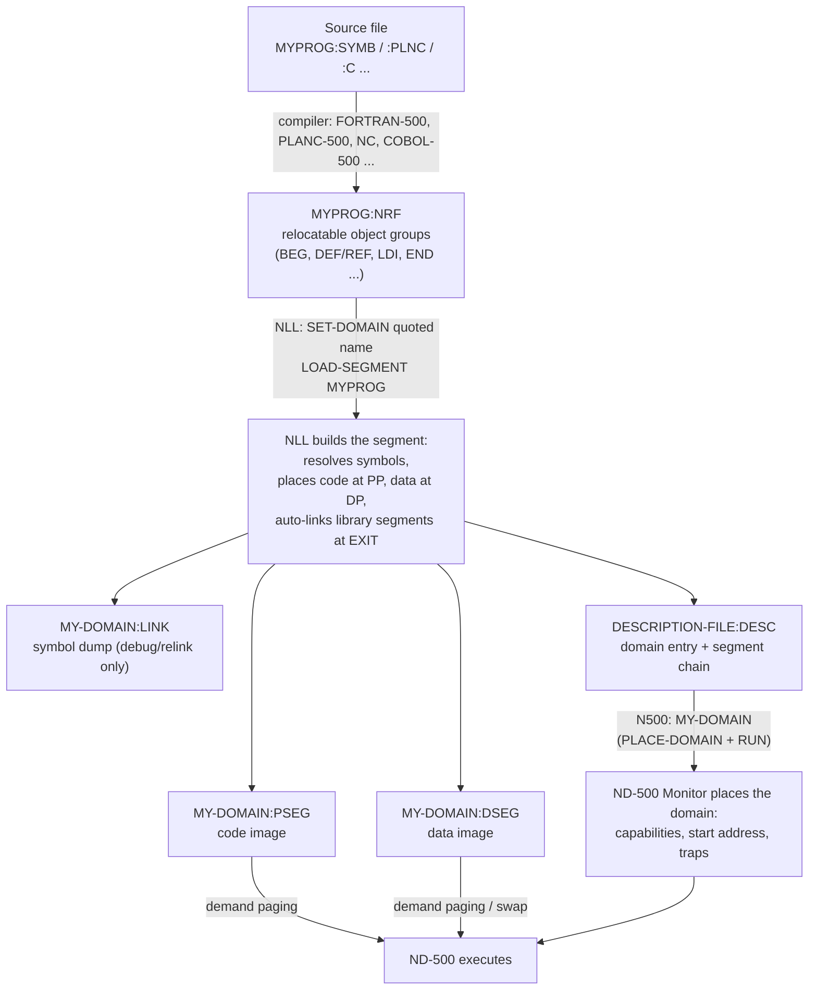
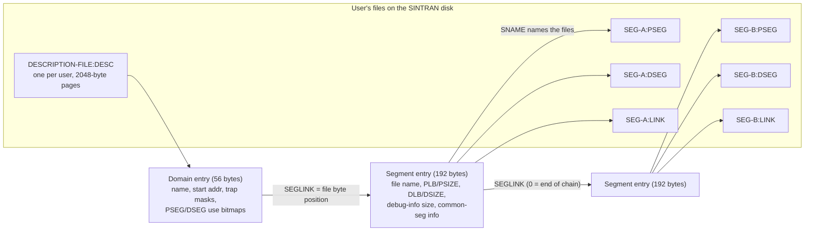

# The ND Linkage-Loader (NLL) for the ND-500 — What It Is, What It Does, Why It Is Needed

**Date**: 2026-08-17
**Purpose**: the one-stop page on NLL. It ties together the scattered manuals, install logs,
file-format decodes and reverse-engineering notes in this repo, and points at each of them
instead of repeating them.

**How claims are graded in this document**:

| Grade | Meaning |
|---|---|
| DOCUMENTED | Stated in a vendor manual (mainly `E:\Dev\Ronny\NDInsight\Reference-Manuals\ND-60.136.04A ND-500 Loader Monitor.md`) |
| OBSERVED | Seen in a real install session, a real file, or a real binary in/near this repo |
| INFERRED | A conclusion drawn from the above; could be wrong, marked so |

---

## 1. What NLL is, in one paragraph

The ND Linkage-Loader (NLL, product ND-210319, prompt `NLL:`) is the program that turns
compiler output into runnable ND-500 programs. ND-500 compilers (FORTRAN-500, COBOL-500,
PLANC-500, NC, and the rest) do not produce something you can run — they produce a
relocatable object file of type `:NRF`. NLL reads those `:NRF` files, resolves the symbols,
and builds a **domain**: the ND-500's unit of "a program". A domain is not one file — it is
up to 32 segments, each stored as a `:PSEG` file (code) and a `:DSEG` file (data), plus an
optional `:LINK` file (symbols), all indexed by an entry in the user's
`DESCRIPTION-FILE:DESC`. Once NLL has built the domain, the ND-500 Monitor (`N500:` prompt)
can place it and run it by name. NLL is itself an ND-500 program (a domain), it is not part
of base SINTRAN, and it ships on its own floppy (media `210319H02-XX-01D`).
(DOCUMENTED: manual above; OBSERVED: the floppy and its files, section 6.)

Oddly for its central role, NLL and the ND-500 Monitor are two faces of one manual and share
many commands — the manual `ND-60.136.04A` covers both. NLL **builds** domains; the Monitor
**runs** them. (DOCUMENTED, see the side-by-side table in
`E:\Dev\Ronny\NDInsight\Reference-Manuals\500\ND-500-MON-SETUP-AND-OPERATIONS-GUIDE.md`
section 1.)

---

## 2. Why it is needed

### 2.1 Every ND-500 program is a domain, and only NLL makes domains

On the ND-500 there is no "just run this file". The only executable unit the ND-500 Monitor
knows is the **domain**: an address space of 1 to 32 segments, recorded not as a file but as
a table entry in the owning user's `DESCRIPTION-FILE:DESC`
(DOCUMENTED, ND-60.136.04A chapter 2; summarized in
`E:\Dev\Ronny\NDInsight\Reference-Manuals\500\ND-500-MON-SETUP-AND-OPERATIONS-GUIDE.md`
section 3.0). NLL is the only tool in the classic (old-format) toolchain that:

- creates and names domains,
- creates segments and loads `:NRF` compiler output into them,
- writes the `:PSEG` / `:DSEG` / `:LINK` files,
- writes the description-file entries that let a bare name resolve to those files.

No NLL means no way to go from compiled code to something the Monitor can start. The
compilers themselves are delivered **as NLL-built domains**: all thirteen vendor product
floppies checked in the description-file corpus (FORTRAN-500 from 1982 through COBOL-85,
LED, NOTIS tools to 1989) ship as `DESCRIPTION-FILE:DESC` + `:PSEG`/`:DSEG`/`:LINK` sets —
the exact output shape of NLL (OBSERVED,
`E:\Dev\Ronny\NDInsight\SINTRAN\File-Formats\DESCRIPTION-FILE-FORMAT.md` section 5a).
Setting up a compiler's runtime libraries is also NLL work: the vendor's own utility file on
the NLL floppy walks through building the shared `FORTRAN-LIB-I` library segment with NLL
commands (`SET-DOMAIN`, `OPEN-SEGMENT`, `TOTAL-SEGMENT-LOAD`, `SET-AUTO-LINK-SEGMENT`,
`SET-AUTO-LOAD-FILE`) (OBSERVED, the `linkage-load-h02.util` file on the media, section 6).

### 2.2 Symptoms of its absence

On a SINTRAN system where NLL was never installed (OBSERVED, live session log in
`E:\Dev\Ronny\NDInsight\Installation\INSTALL-ND-LINKAGE-LOADER-AND-BACKUP-SYSTEM.md`
sections 1 and 5):

| What you type | What you get | What it really means |
|---|---|---|
| `@ND-500-LINKAGE-LOADER` | `TOO LONG PARAMETER` | **Misleading.** With no standard domain defined, the name is treated as a domain name; domain names max out at 16 characters and this one is 21. Says nothing about the product being missing. |
| `N500: LINKAGE-LOADER` | `DESCRIPTION FILE ERROR: DESCRIPTION-FILE` / `NO SUCH FILE NAME` | **The honest symptom.** There is no `DESCRIPTION-FILE:DESC` for this user — NLL has never been installed or run here. |

And more quietly: without NLL you cannot link anything you compile, you cannot rebuild a
library segment, and you cannot create or copy a domain at all.

---

## 3. What it does in detail

### 3.1 Input: `:NRF` relocatable files

The compilers emit ND Relocatable Format: a byte stream of small "groups" — a control byte
(5-bit control number + 3-bit numeric length) followed by numeric and optional symbolic
fields. Control numbers cover module start/end (`BEG`/`END`), symbol definition and
reference (`DEF`/`REF`/`DDF`/`DRF`), literal bytes to place (`LDI`/`LDN`), load-pointer
control (`PMO`/`DMO`/`SLA`/`AJS`), library conditional loading (`LIB`, fast-load vectors
`LBB`), and debug regions (`DBG` — NLL copies the bytes between two `DBG` markers to the
`:LINK` file instead of `:PSEG`/`:DSEG`). NLL walks this stream keeping a program pointer
(PP) and a data pointer (DP), placing bytes into the program and data images and resolving
symbols as definitions arrive. (DOCUMENTED, ND-60.136.04A chapter 12; bit packing VERIFIED
against a real compiler-produced file — full decode in
`E:\Dev\Ronny\NDInsight\SINTRAN\File-Formats\NRF-FILE-FORMAT.md`.)

### 3.2 Output: three files per segment plus the description file

For every segment of the domain, NLL produces (DOCUMENTED, ND-60.136.04A chapter 2;
formats OBSERVED/decoded in the File-Formats docs):

| File | Contents | Used when | Decode |
|---|---|---|---|
| `NAME:PSEG` | The instruction (program) image. Read-only at run time, demand-paged straight from this file, never written back — so it needs no swap-file space. | Run time | (raw code image) |
| `NAME:DSEG` | The data image. May swap; if mapped directly onto its file, writes become permanent. | Run time | (raw data image) |
| `NAME:LINK` | NLL's in-memory loader symbol table, serialized at CLOSE-SEGMENT: 32-byte cells (name, value, flags) in ascending value order, hence every non-empty `:LINK` is exactly 32k+1 bytes. Used for relinking and by the symbolic debugger; NOT needed to run — several shipped domains have a 0-byte `:LINK`. | Load time / debugger only | `E:\Dev\Ronny\NDInsight\SINTRAN\File-Formats\LINK-FILE-FORMAT.md` (writer carved from NLL's own PSEG) |
| `DESCRIPTION-FILE:DESC` | The per-user domain index: 56-byte domain entries (name, start address, trap masks, segment bitmap) each pointing at a chain of 192-byte segment entries (file name, PLB/PSIZE, DLB/DSIZE, common-segment info). One file per user, up to 256 domains. | Every name lookup | `E:\Dev\Ronny\NDInsight\SINTRAN\File-Formats\DESCRIPTION-FILE-FORMAT.md` (offsets code-proven, 48/48 size checks across 13 vendor floppies) |

A key point that trips newcomers: **the domain itself is not a file**. Deleting the
`:PSEG`/`:DSEG` files does not delete the domain, and copying the files does not create one —
the domain exists as description-file bookkeeping that names those files. (DOCUMENTED.)

### 3.3 The command vocabulary

The everyday case is three commands (DOCUMENTED, ND-60.136.04A sections 1.1.2 and 6.x;
worked forms in the setup guide sections 3.1-3.3):

```
NLL: SET-DOMAIN "MY-DOMAIN"     double quotes = create NEW domain
NLL: LOAD-SEGMENT MYPROG        load the compiler's :NRF output
NLL: EXIT                       resolve libraries, update the files, return
```

The full command set, grouped as the manual's chapter 6 groups it (all DOCUMENTED; the
complete list with per-command pages is in the manual's table of contents):

| Group | Commands | What they do |
|---|---|---|
| Domains (6.1) | `SET-DOMAIN`, `END-DOMAIN`, `CLEAR-DOMAIN`, `DELETE-DOMAIN`, `LIST-DOMAIN`, `WRITE-DOMAIN-STATUS`, `RENAME-DOMAIN`, `COPY-DOMAIN`, `RELEASE-DOMAIN` | Pick/create the current domain, list it, copy a whole domain (segments and all), clean up. `DELETE-DOMAIN` removes the domain entry but keeps the files. |
| Segments (6.2) | `OPEN-SEGMENT` (with attributes, e.g. `P` = usable by other domains), `CLOSE-SEGMENT`, `LINK-SEGMENT`, `LIBRARY-SEGMENT-LINK`, `FORCE-SEGMENT-LINK`, `APPEND-SEGMENT`, `SET-SEGMENT-NUMBER`, `CLEAR-SEGMENT`, `DELETE-SEGMENT`, `RENAME-SEGMENT`, `LIST-SEGMENT`, `WRITE-SEGMENT-STATUS`, `DEFINE-SEGMENT-SIZE` | Manage the up-to-32 segments of the current domain. `CLOSE-SEGMENT` is when the `:LINK` symbol dump is written. |
| Loading NRF (6.3) | `LOAD-SEGMENT`, `RELOAD-SEGMENT`, `LIBRARY-SEGMENT-LOAD`, `OMITTED-SEGMENT-LOAD`, `SELECTED-SEGMENT-LOAD`, `TOTAL-SEGMENT-LOAD` | Read `:NRF` files into the open segment. The LIBRARY/OMITTED/SELECTED/TOTAL forms control which modules of a library actually load. |
| COMMON segments (6.4) | `COMMON-SEGMENT-OPEN`, `COMMON-SEGMENT-CLOSE`, `COMMON-SEGMENT-APPEND`, `COMMON-SEGMENT-NUMBER` | FORTRAN-style shared common blocks as their own segments. |
| Auto-link / auto-load (6.5, 6.6) | `SET-AUTO-LINK-SEGMENT`, `DELETE-AUTO-LINK-SEGMENT`, `LIST-AUTO-LINK-SEGMENTS`, `SET-AUTO-LOAD-FILE`, `DELETE-AUTO-LOAD-FILE`, `LIST-AUTO-LOAD-FILE` | Per-language defaults: which library segment gets linked and which library files get loaded automatically at `EXIT` (e.g. the FORTRAN runtime). This is how a plain user's `LOAD-SEGMENT` + `EXIT` picks up the right runtime without naming it. |
| Labels/references (6.7) | `PROGRAM-REFERENCE`, `DATA-REFERENCE`, `DEFINE-ENTRY`, `DEFINE-COMMON`, `LIST-ENTRIES-DEFINED`, `LIST-ENTRIES-UNDEFINED`, `LIST-MAP`, `SYSTEM-ENTRIES-ON`, `GLOBAL-ENTRIES`, `KILL-ENTRIES` | Inspect and patch the symbol table by hand. |
| Shared with ND-100 (6.8) | `MATCH-RTCOMMON`, `MATCH-COMMON-RT-SEGMENT`, `LINK-RT-PROGRAM` | Wire ND-500 data addresses to ND-100 RT-common / RT segments so the two CPUs share memory. |
| Miscellaneous (6.9, 6.10) | `PAGE-MODE`, `LOW-ADDRESS`/`HIGH-ADDRESS`, `ENTRY-ROUTINES`, `SET-IO-BUFFERS`, the NRF editor commands, `LOCAL-TRAP-DISABLE`, `EXIT` | Tuning, NRF file surgery, trap setup, and leaving (which finishes the current domain and updates all files). |

### 3.4 Multi-segment domains and shared library segments

Why split a program into several segments (DOCUMENTED, ND-60.136.04A section 2.1; list
reproduced in the setup guide section 3.0): time-critical parts can stay fixed in memory
while the rest pages; one library segment on disk can be part of many domains; the Monitor
keeps ONE in-memory copy of a program segment shared by several users; segments can carry
different protection; two programs can talk through a shared data segment; and changing one
segment does not force reloading the whole domain.

The shared-library pattern (DOCUMENTED, worked example in the setup guide section 3.2):

```
NLL: SET-DOMAIN "TWO-SEGMENTS"
NLL: OPEN-SEGMENT "SUBROUTINES" P     P attribute = usable by other domains
NLL: LOAD-SEGMENT SUBR-FILE
NLL: CLOSE-SEGMENT
NLL: SET-SEGMENT-NUMBER 2             keep clear of segment 1
NLL: LOAD-SEGMENT MAINPROG
NLL: LINK-SEGMENT SUBROUTINES
NLL: EXIT
```

A second domain that wants the same subroutines loads only its own main program and repeats
`LINK-SEGMENT SUBROUTINES`. A segment is declared in exactly one home domain; every other
domain — including other users' domains, which is how the SYSTEM-owned FORTRAN library is
shared machine-wide — reaches it through `LINK-SEGMENT`. Linking requires the segment to
have no unresolved references into unlinked segments of its home domain. (DOCUMENTED.)

The vendor's own use of this is visible on the distribution media: the `:UTIL` file builds a
`LIBRARY-DOMAIN` holding `FORTRAN-LIB-I` as a `P` segment on segment number 36, then
registers it with `SET-AUTO-LINK-SEGMENT FORTRAN-LIB-I FORTRAN` so every FORTRAN link picks
it up automatically (OBSERVED, `D:\ND\500\linkage-loader\linkage-load-h02.util`).

---

## 4. The pipeline and the file relationships, as pictures

### 4.1 Compile → NRF → NLL → domain → RUN



(Pipeline DOCUMENTED, ND-60.136.04A sections 1.1.1-1.1.3; the run-time delivery step is
PROVEN by execution, section 8 below.)

### 4.2 What points at what



(Layout OBSERVED and code-proven — offsets carved from the Monitor's own reader, sizes
verified 48/48 across thirteen vendor floppies:
`E:\Dev\Ronny\NDInsight\SINTRAN\File-Formats\DESCRIPTION-FILE-FORMAT.md`.)

---

## 5. The install story

Full detail lives in two companion documents — the live-session walkthrough
`E:\Dev\Ronny\NDInsight\Installation\INSTALL-ND-LINKAGE-LOADER-AND-BACKUP-SYSTEM.md` and the
worked product-install procedure
`E:\Dev\Ronny\NDInsight\Installation\ND500-PROGRAM-INSTALL-LINKAGE-LOADER-210319.md`.
The short version (all OBSERVED unless marked):

- **Media**: NLL H02 ships on floppy `210319H02-XX-01D`, article ND-210319. On this machine
  the image is `C:\Users\ronny\Downloads\ND-disk-00042.img`, and an exported copy of its
  contents sits in `D:\ND\500\linkage-loader\` (inventoried in section 6 below).
- **Hard prerequisite**: the Backup System (floppy `210337I04-XX-01D`) must be installed
  first — the NLL installer's environment check fails hard without it.
- **Users**: `DOMAIN-USER` must exist with disk space (the installer defaults the domain
  there but does not create the user; a missing user aborts the whole installer), and
  `UTILITY` needs at least 177 free pages.
- **The installer** (`IN-NLL-XX-H02:PROG`, an ND-100 program) presents a 5-module menu that
  must run in order: get start info, delete old files, check environment, copy files,
  exit. Module 4 copies the `:UTIL` file to UTILITY, the domain to DOMAIN-USER, and defines
  standard domain `LINKAGE-LOADER`.
- **The big trap (G12)**: module 4 can report `COPYING FINISHED` while having copied
  nothing — the success message is printed before the work and the result is never checked.
  Always verify with `@LIST-FILES (DOMAIN-USER)`.
- **The recovery that is measured to work**: the floppy is itself a complete NLL
  installation under FLOPPY-USER, so four plain `COPY-FILE`s (DESC + PSEG + DSEG + LINK)
  onto the owning user, then `DEFINE-STANDARD-DOMAIN LINKAGE-LOADER LINKAGE-LOAD-H02`,
  gives a working loader. The floppy's description file does not hard-code its directory,
  so plain file copies are enough. (`SOURCE EMPTY` on the `:LINK` copy is expected — it is
  0 bytes on the media.)
- **Persistence**: standard domains survive a warm start but NOT a cold start. The
  installer's own closing message says to append
  `@ND-500-MONITOR` + `DEFINE-STANDARD-DOMAIN LINKAGE-LOADER (DOMAIN-USER)LINKAGE-LOAD-H02`
  to the ND500-HENT file on user SYSTEM.
- **Verify it works**: `N500: LINKAGE-LOADER` should answer with the `NLL:` prompt;
  `LIST-DOMAIN` should show `LINKAGE-LOAD-H02` with a start address.
- **Running it needs a live ND-500 lane**: NLL is ND-500 code, so starting it loads the
  control store and the swapper and allocates memory. Without a defined ND-500 swap file it
  stops with `SWAPPING SPACE NOT AVAILABLE`; the fix is `@GIVE-USER-SPACE SYSTEM`,
  `@CREATE-FILE SWAP-FILE-0:SWAP` (contiguous), then `DEFINE-SWAP-FILE` in the Monitor
  (OBSERVED,
  `E:\Dev\Ronny\NDInsight\SINTRAN\ND5000\NLL-INSTALL-SWAPFILE-UNBLOCKED-5SWAP-PROTECT-VIOLATION-2026-07-31.md`).

### 5.1 Why NLL was the gating install for the ND-5000 bring-up

Because NLL is an ND-500 domain, installing and starting it exercises the **entire** ND-100
to ND-500 stack in one command: mount floppy → `RECOVER-DOMAIN` → load control store → load
swapper → allocate memory → place and run ND-500 code. That made "install NLL" the natural
end-to-end acceptance test for the emulated ND-5000 lane, and every layer that was not ready
showed up as an install failure: the machine not made available (`@SET-AVAIL` missing), no
CPU attached in interactive sessions, no swap file on the pack, and finally a protect
violation in shadow process 5SWAP once memory allocation actually ran — a pre-existing
emulator defect, not an install problem. The methodical chase is in
`E:\Dev\Ronny\NDInsight\SINTRAN\ND5000\NLL-INSTALL-ROOT-CAUSE-PLAN-2026-07-30.md` and its
follow-up
`E:\Dev\Ronny\NDInsight\SINTRAN\ND5000\NLL-INSTALL-SWAPFILE-UNBLOCKED-5SWAP-PROTECT-VIOLATION-2026-07-31.md`
(all OBSERVED).

---

## 6. What is on the install media (verified directory listing)

`D:\ND\500\linkage-loader\` — listed 2026-08-17, all files present:

| File | Size (bytes) | What it is | Grade |
|---|---|---|---|
| `ND-disk-00042.img` | 1,310,720 | The raw floppy image itself, volume label `210319H02-XX-01D` | OBSERVED |
| `in-nll-xx-h02.prog` | 194,484 | The ND-100 installer program (the 5-module menu) | OBSERVED |
| `in-nll-xx-h02.xcom` | 26,030 | Installer data | OBSERVED |
| `in-nll-xx-h02.init` | 15,514 | Installer text/init data (7-bit text with parity bits set) | OBSERVED |
| `description-file.desc` | 22,528 | The floppy's own description file: domains `LINKAGE-LOAD-H02` and `SCRATCH-DOMAIN` — this is what makes the floppy a runnable NLL installation in itself | OBSERVED |
| `linkage-load-h02.pseg` | 123,989 | NLL's program segment — 123,989 bytes of ND-500 code, starts straight in with instruction bytes (no header) | OBSERVED |
| `linkage-load-h02.dseg` | 2,184,977 | NLL's data segment (sparse on the media: 44 allocated pages) — holds the command tables, file-type tables, messages | OBSERVED |
| `linkage-load-h02.link` | 0 | Empty — the linker ships with no symbol dump of its own | OBSERVED |
| `linkage-load-h02.util` | 2,440 | Vendor utility command scripts: patch recipes (`LOOK-AT-DATA` on the CAPS and SIWISH flags) and the FORTRAN library-domain / auto-link setup jobs for new and old installations | OBSERVED |
| `linkage-load-h02.TXT` | 2,440 | A readable (parity-stripped) copy of the `:UTIL` content; same length, bytes differ | OBSERVED |

The file dates on the media are March 1988. The `:UTIL` content answers the old open
question "what is `:UTIL` for" from
`E:\Dev\Ronny\NDInsight\Installation\ND500-PROGRAM-INSTALL-LINKAGE-LOADER-210319.md`
section 9: it is a vendor-supplied script/recipe file, not a domain segment type
(OBSERVED — its text is plain `@LINKAGE-LOADER` command sequences and `@ND` patch dialogs).

### 6.1 Reverse-engineering staging area

`E:\Dev\Ronny\NDInsight\SINTRAN\ND500\nll-re\` (untracked) holds the carve workbench for NLL
itself — listed 2026-08-17:

| File | Size (bytes) | What it is |
|---|---|---|
| `LINKAGE-LOAD-H02.PSEG` | 123,989 | NLL's code, staged for disassembly |
| `LINKAGE-LOAD-H02.DSEG` | 2,184,977 | NLL's data, staged |
| `LINKAGE-LOAD-H02.PSEG.dis` | 1,998,562 | Full `nd500-dis` disassembly listing of the PSEG |
| `LINKAGE-LOAD-H02.UTIL` | 2,440 | Copy of the utility file |

There are no separate notes files in that folder; the findings from this carve are written
up where they belong — the `:LINK` writer (serializer at virtual `B001166C`, called from the
CLOSE-SEGMENT worker; the 32-byte cell layout; the SMAX 32k+1 law) is fully documented in
`E:\Dev\Ronny\NDInsight\SINTRAN\File-Formats\LINK-FILE-FORMAT.md` section 4a, which cites
this `.dis` listing as its evidence (OBSERVED). The same carve confirmed NLL's DSEG carries
the full loader command table (`OPEN-SEGMENT`, `CLOSE-SEGMENT`, `LINK-SEGMENT`,
`LIBRARY-SEGMENT-LINK`, `FORCE-SEGMENT-LINK`, `GLOBAL-ENTRIES`, ...) and a file-type table
`NRF'BRF'LINK'SYMB'DATA'RTFIL'` — and that the J04 debug Monitor contains none of the loader
commands and never reads `:LINK`, pinning the loader/monitor split at the binary level
(OBSERVED, `LINK-FILE-FORMAT.md` section 5).

---

## 7. NLL vs LINKER-B01 (and the newer ND Linker)

Two different generations of the same job (DOCUMENTED + OBSERVED):

| | NLL (this document) | ND Linker / LINKER-B01 |
|---|---|---|
| Product | ND-210319 (earlier ND-10319) | ND-211224 |
| Input | `:NRF` | `:NRF` |
| Output | Old domain format: `:PSEG` + `:DSEG` + `:LINK` per segment, indexed by `DESCRIPTION-FILE:DESC` | New self-contained `:DOM` file — one file IS the domain |
| Name resolution | Description file + Monitor standard-domain table | The `.DOM` file by name |
| Migration | — | `CONVERT-DOMAIN` converts old-format domains to `:DOM` |
| In this repo | The 210319 media and everything above | `E:\Dev\Ronny\NDInsight\SINTRAN\ND500-APPS\LINKER-B01\` — preserved with userguide, links C DOMs in the nd500x emulator |

Sources: `E:\Dev\Ronny\NDInsight\SINTRAN\ND500-APPS\README.md` (LINKER-B01 as "ND Linkage
editor / domain linker", the C/PLANC link chain, the missing-FORTRAN-LIB gap),
`E:\Dev\Ronny\NDInsight\SINTRAN\File-Formats\NRF-FILE-FORMAT.md` (both consumers of NRF,
with the ND Linker manual as the newer NRF revision), and
`E:\Dev\Ronny\NDInsight\SINTRAN\File-Formats\DOM-FILE-FORMAT.md` (the `:DOM` format that
replaced the trio). Practical difference for this project: real SINTRAN with the classic
ND-500 Monitor runs old-format NLL domains; the nd500x emulator's shell runs `:DOM` files —
which is why both toolchains are kept.

---

## 8. How NLL's output meets the swapper: the run-time connection

NLL's `:PSEG`/`:DSEG` files are not just install artifacts — they are exactly what SINTRAN's
load rhythm delivers into ND-500 memory at run time. The execution-verified account is
`E:\Dev\Ronny\ND500UC\docs\ND500-PROCESS-LIFECYCLE.md (chapter 1)`
section 6:

- **PLACE transfers no bytes.** `PLACE-DOMAIN` builds ND-100-side bookkeeping from the
  description-file entries NLL wrote; the code arrives later, on demand (PROVEN there).
- The staged load of a real domain is chunked `RESIWR` DMA of the segment images (the very
  bytes NLL put in the files) into ND-500 memory, then cache control, context image, deposits
  (P := start address — the STADR that NLL recorded in the domain entry), and `3START`
  (PROVEN there, milestone 10).
- The test binaries that proved it — `SWAPPER-K01.PSEG` / `SWAPPER-K01.DSEG` from the
  preserved SINTRAN distribution — are themselves NLL products: the swapper is an ND-500
  domain in the same old three-file format (OBSERVED file shape; INFERRED that NLL built
  them, since NLL is the only old-format producer, but no build record of the swapper
  exists in the repo).
- After start, demand paging pulls further pages from the `:PSEG` (read-only, never written
  back — which is why NLL-built program segments need no swap space) while `:DSEG` pages go
  through the swap file. Page faults are routed to the swapper domain
  (section 6.2-6.3 of that document, PROVEN/DOCUMENTED as marked there).

So the chain is closed end to end: NLL writes the bytes and the bookkeeping; the Monitor's
PLACE reads the bookkeeping; SINTRAN's message sequence delivers the bytes; the microcode
runs them.

---

## 9. Documentation inventory

| Full path | What it contributes |
|---|---|
| `E:\Dev\Ronny\NDInsight\Reference-Manuals\ND-60.136.04A ND-500 Loader Monitor.md` | THE vendor manual: NLL + Monitor, domains/segments (ch 2), loader commands (ch 6), description file (ch 11), NRF (ch 12), errors (ch 13-14), examples (ch 15) |
| `E:\Dev\Ronny\NDInsight\Reference-Manuals\500\ND-500-MON-SETUP-AND-OPERATIONS-GUIDE.md` | The digest: what a domain is, NLL-vs-Monitor split, worked SET-DOMAIN/LOAD-SEGMENT/LINK-SEGMENT examples, install pointer |
| `E:\Dev\Ronny\NDInsight\Installation\INSTALL-ND-LINKAGE-LOADER-AND-BACKUP-SYSTEM.md` | Live install session: symptoms before install, Backup System prerequisite, the 5-module installer, all gotchas G1-G12, the measured 4-copy recovery |
| `E:\Dev\Ronny\NDInsight\Installation\ND500-PROGRAM-INSTALL-LINKAGE-LOADER-210319.md` | Product-install procedure for the 210319 media: where the media is, pack state, routes A/B/C, ND-100 vs ND-500 install compared, 11 failure modes |
| `E:\Dev\Ronny\NDInsight\SINTRAN\File-Formats\NRF-FILE-FORMAT.md` | NLL's input format, bit-verified against a real compiler NRF |
| `E:\Dev\Ronny\NDInsight\SINTRAN\File-Formats\DESCRIPTION-FILE-FORMAT.md` | NLL's index output, offsets code-proven, 13-floppy corpus |
| `E:\Dev\Ronny\NDInsight\SINTRAN\File-Formats\LINK-FILE-FORMAT.md` | The `:LINK` file decoded from NLL's own serializer code |
| `E:\Dev\Ronny\NDInsight\SINTRAN\File-Formats\DOM-FILE-FORMAT.md` | The newer self-contained format that replaced the trio |
| `E:\Dev\Ronny\NDInsight\SINTRAN\ND500-APPS\README.md` | The preserved ND-500 program set incl. LINKER-B01, and the compile/link chain in nd500x |
| `E:\Dev\Ronny\NDInsight\SINTRAN\ND5000\NLL-INSTALL-ROOT-CAUSE-PLAN-2026-07-30.md` | Why the NLL install gated the ND-5000 bring-up; hypothesis-driven debugging record |
| `E:\Dev\Ronny\NDInsight\SINTRAN\ND5000\NLL-INSTALL-SWAPFILE-UNBLOCKED-5SWAP-PROTECT-VIOLATION-2026-07-31.md` | The swap-file prerequisite measured live; the 5SWAP protect violation |
| `E:\Dev\Ronny\ND500UC\docs\ND500-PROCESS-LIFECYCLE.md (chapter 1)` | Section 6: the proven load rhythm that delivers NLL's PSEG/DSEG bytes into ND-500 memory |
| `E:\Dev\Ronny\NDInsight\SINTRAN\ND500\SINTRAN-DOMAIN-SETUP-DEEP-DIVE.md` | Domain placement internals (use with that document's noted corrections) |
| `E:\Dev\Ronny\NDInsight\SINTRAN\ND500\nll-re\LINKAGE-LOAD-H02.PSEG.dis` | Full disassembly of NLL itself — the evidence base for the `:LINK` decode |
| `D:\ND\500\linkage-loader\` | The install media export (section 6 above) plus the raw floppy image |

---

## 10. Gaps — what is still not known

1. **Root cause of the installer's silent module-4 failure (G12).** The copy claims success
   and does nothing; no error is emitted. The recovery is measured and reliable, but the
   installer bug itself was never carved.
   (`E:\Dev\Ronny\NDInsight\Installation\INSTALL-ND-LINKAGE-LOADER-AND-BACKUP-SYSTEM.md` G12.)
2. **The Backup System media is missing on this machine.** `210337I04-XX-01D` /
   `ND-disk-00081.img` could not be found in a search; a fresh pack without the Backup
   System already installed cannot take the installer route until it turns up.
   (`E:\Dev\Ronny\NDInsight\Installation\ND500-PROGRAM-INSTALL-LINKAGE-LOADER-210319.md` §1.)
3. **No multi-segment domain in the sample corpus.** Every DESC file examined has
   one-segment chains, so the linked-list walk beyond length 1, and several segment-entry
   fields (MINPAGES/MAXPAGES, the fixed-area fields, DLINKDATE's meaning), are unexercised.
   (`E:\Dev\Ronny\NDInsight\SINTRAN\File-Formats\DESCRIPTION-FILE-FORMAT.md` §4, §5a.)
4. **The L-era `:LINK` string/module regions are undecoded** (needs an L-series NLL binary),
   and it is unexplained why NLL and LED ship with 0-byte `:LINK` files while every compiler
   has one. (`E:\Dev\Ronny\NDInsight\SINTRAN\File-Formats\LINK-FILE-FORMAT.md` §6.)
5. **A write-side proof of the DESC `size - 1` convention** would have to come from NLL's
   DESC writer; only the reader side and the file evidence are proven so far.
   (`DESCRIPTION-FILE-FORMAT.md` §5a.)
6. **The 5SWAP protect violation** that appears once NLL actually allocates memory on the
   emulated ND-5000 lane is an open emulator defect, independent of NLL.
   (`E:\Dev\Ronny\NDInsight\SINTRAN\ND5000\NLL-INSTALL-SWAPFILE-UNBLOCKED-5SWAP-PROTECT-VIOLATION-2026-07-31.md` §3.)
7. **INFERRED items in this document**: that the SWAPPER-K01 files were built with NLL
   (section 8 — file shape is old-format, but no build record exists), and that
   `linkage-load-h02.TXT` on the media export is a parity-stripped copy of `:UTIL`
   (same size, readable text, bytes differ — not byte-compared beyond that).

---

**Document created**: 2026-08-17.
**Method**: every repo source read in full; the media directory `D:\ND\500\linkage-loader\`
and the staging directory `E:\Dev\Ronny\NDInsight\SINTRAN\ND500\nll-re\` listed live; nothing
outside this file was modified.
