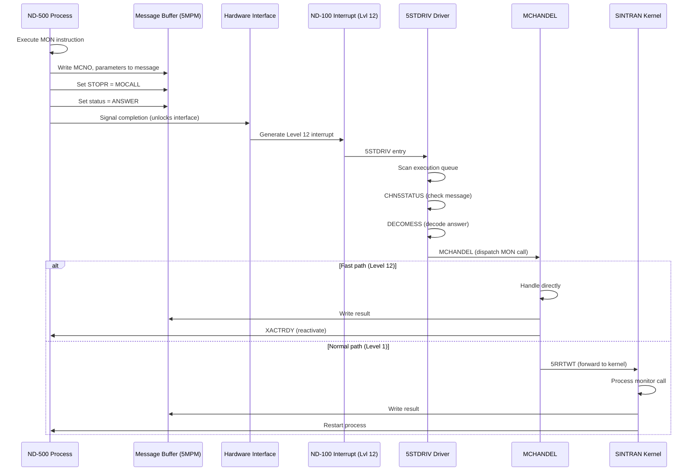
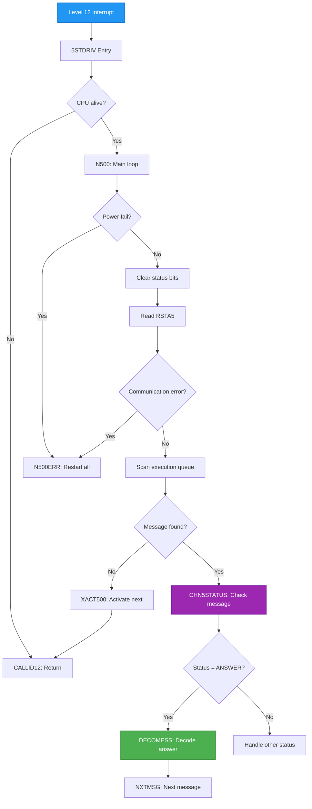
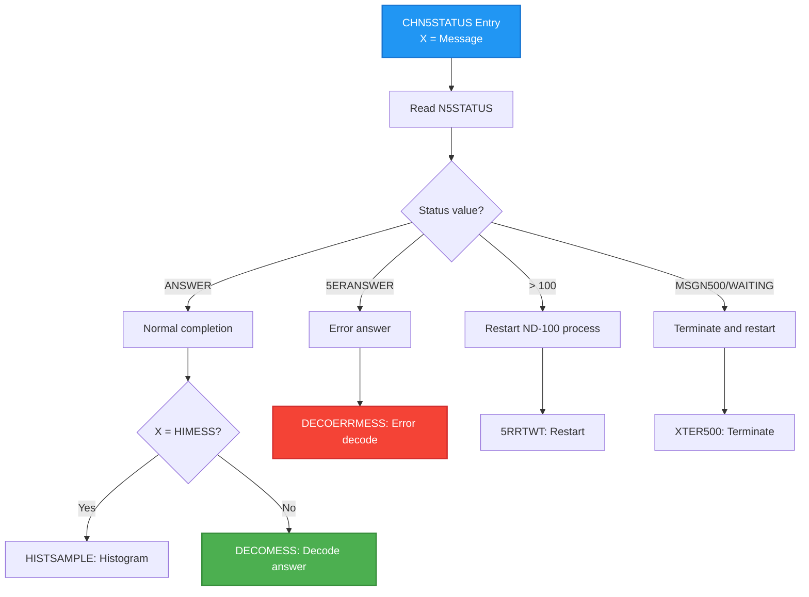
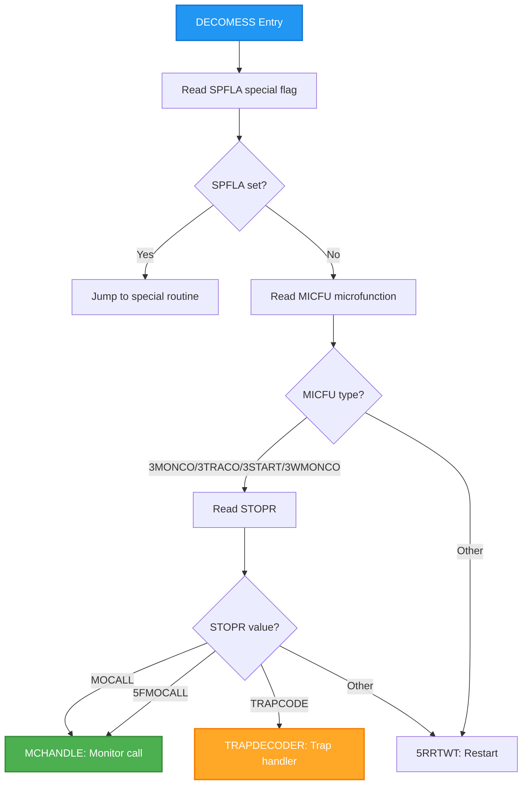
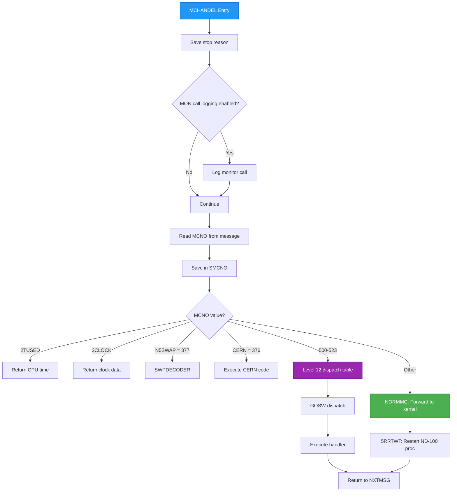
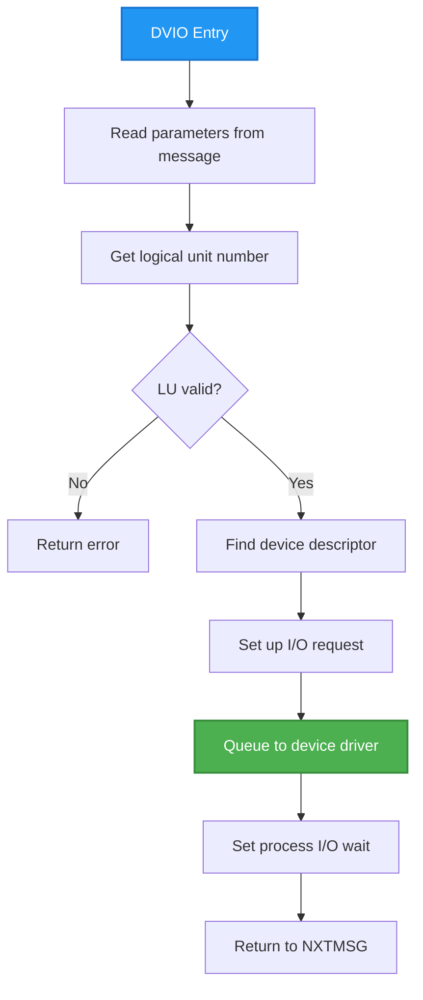
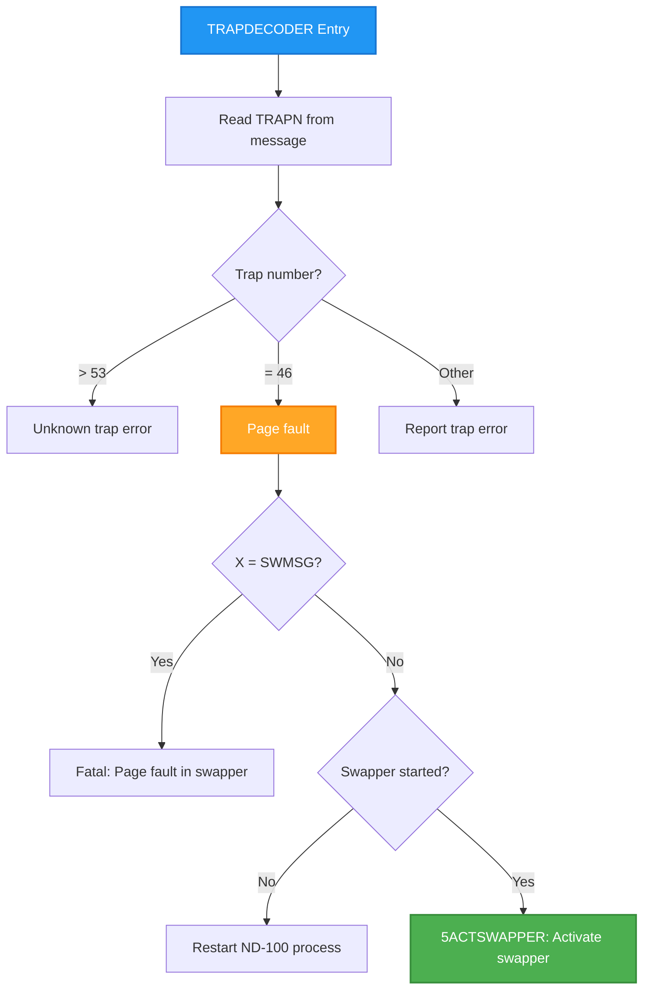
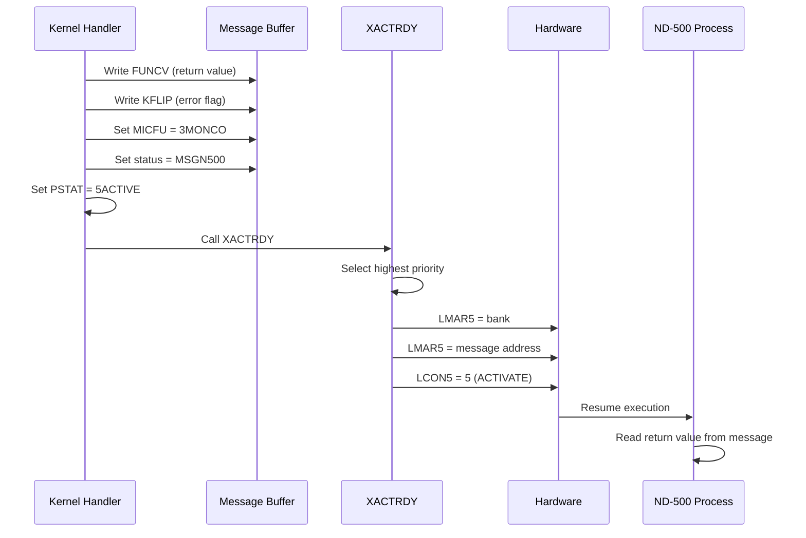
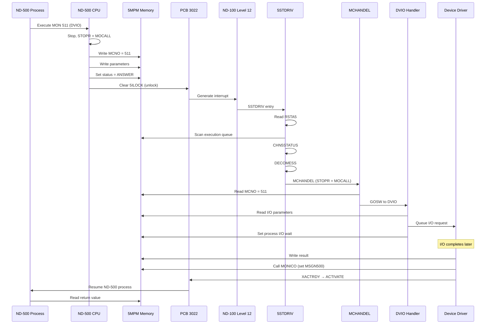

# ND-500 Monitor Call Mechanism - Deep Analysis

## Purpose

Complete analysis of how ND-500 processes make monitor calls to SINTRAN running on ND-100. When ND-500 needs OS services (I/O, memory, etc.), it triggers an interrupt that causes ND-100 to process the request.

**Key Sources**:
- MP-P2-N500.NPL (lines 656-818, 1251-1439) - Driver and MCHANDEL
- CC-P2-N500.NPL - Status routines

---

## 1. Overview: The Inter-Processor Call Mechanism



---

## 2. How ND-500 Initiates a Monitor Call

### 2.1 ND-500 Executes MON Instruction

When an ND-500 process needs OS services, it executes a **MON instruction** (monitor call). This causes:

1. ND-500 microcode **stops execution**
2. Sets **STOPR (stop reason) = MOCALL** (or 5FMOCALL for file transfers)
3. Writes message to **5MPM shared memory**:
   - MCNO: Monitor call number
   - Parameters in message buffer
   - Sets status to ANSWER
4. **Unlocks the interface** (clears 5ILOCK bit in status register)
5. Hardware generates interrupt to ND-100

### 2.2 Message Buffer Layout

```
┌─────────────────────────────────────────┐
│  Message Buffer (in 5MPM)               │
├─────────────────────────────────────────┤
│  MICFU    │ Microfunction code          │
│  STOPR    │ Stop reason (MOCALL/TRAP)   │
│  MCNO     │ Monitor call number         │
│  SMCNO    │ Saved monitor call number   │
│  FUNCV    │ Function value (return)     │
│  KFLIP    │ K flip-flop (error flag)    │
│  NUMPA    │ Number of parameters        │
│  Parameters...                          │
└─────────────────────────────────────────┘
```

---

## 3. ND-100 Interrupt Handler (5STDRIV)

### 3.1 Driver Entry Point

**Source**: MP-P2-N500.NPL lines 656-698



### 3.2 Key Code (5STDRIV loop)

```
Line 659: 5STDRIV:
Line 660:        IF CPUAVAILABLE NBIT 5ALIVE GO CALLID12
Line 661: N500:
Line 662:        DO
Line 663:           IF C5STAT/\C5PFMASK >< 0  GO CALLID12  % Power fail check
Line 668:           177377; CALL CLE5STATUS                % Read and clear status
Line 678:           X:=MAILINK                             % Start scanning queue
Line 679:           DO
Line 680:           WHILE X><-1
Line 683:              X:=D=:N5MESSAGE                     % Current message
Line 685:              CALL CHN5STATUS; GO N500ERR        % Check message status
Line 687: NXTMSG:
Line 692:           CC5CPU=:B; CALL XACT500               % Activate next process
Line 693: CALLID12: CALL WT12                             % Return from interrupt
Line 694:        OD
```

---

## 4. CHN5STATUS - Message Status Check

### 4.1 Status Dispatch

**Source**: MP-P2-N500.NPL lines 730-759



### 4.2 Key Code

```
Line 734: CALL RN5STATUS                          % Read message status
Line 735: IF A=ANSWER THEN                        % Normal answer?
Line 746:    CALL DECOMESS                        % Decode answer from ND-500
Line 749: ELSE IF A=5ERANSWER THEN
Line 750:    CALL DECOERRMESS                     % Decode error answer
Line 751: ELSE IF A>>100 THEN
Line 752:    CALL 5RRTWT                          % Restart ND-100 process
Line 753: ELSE IF A=MSGN500 OR A=WAITING THEN
Line 755:    CALL XTER500; GO LREG                % Terminate first
```

---

## 5. DECOMESS - Answer Decoder

### 5.1 Stop Reason Dispatch

**Source**: MP-P2-N500.NPL lines 803-818



### 5.2 Stop Reason Values (STOPR Field)

**STOPR field location**: Offset 000011 (octal) = 9 (decimal) in message buffer

**Source**: Verified from D:\ND\S\L07\SYMBOL-1-LIST.SYMB.TXT

| Octal | Decimal | NPL Symbol | Full Name | Meaning |
|:-----:|:-------:|:----------:|-----------|---------|
| 000001 | 1 | MOCAL | MOCALL | Normal MON instruction executed |
| 000002 | 2 | TRAPC | TRAPCODE | Hardware trap occurred (page fault, etc.) |
| 000003 | 3 | 5FMOC | 5FMOCALL | File transfer monitor call |
| 000101 | 65 | - | (TPSTRA return) | Return from N500M RUNN function |

> **Verification**: MOCAL=000001, TRAPC=000002, 5FMOC=000003 confirmed from SYMBOL-1-LIST.SYMB.TXT lines 3921, 249, 747.

**Note**: Stop reason values are set by ND-500 microcode when the CPU stops. The value 65 (101 octal) is specifically mentioned in the ND-500 Loader/Monitor manual (ND-60.136.04) as the value set by MON 407B (TPSTRA) when returning from the N500M RUNN function.

### 5.3 Status Register Stop Reason Bits

The stop reason is extracted from the status register (RSTA5) bits 10-14:

```
Status Register RSTA5:
┌────┬────┬────┬────┬────┬────┬────┬────┬────┬────┬────┬────┬────┬────┬────┬────┐
│ 15 │ 14 │ 13 │ 12 │ 11 │ 10 │  9 │  8 │  7 │  6 │  5 │  4 │  3 │  2 │  1 │  0 │
└────┴────┴────┴────┴────┴────┴────┴────┴────┴────┴────┴────┴────┴────┴────┴────┘
         │    │    │    │    │         │         │
         └────┴────┴────┴────┘         │         └─ 5ILOCK (interface locked)
                    │                  └─ 5POWOF (power off)
                    └─ STOPREASON (5 bits, mask 037000 octal = 0x3E00)
```

**Mask**: 037000 (octal) = 15872 (decimal) = 0x3E00 (hex)

**Extraction**: `STOPREASON = (RSTA5 >> 10) & 0x1F`

---

## 6. MCHANDEL - Monitor Call Handler

### 6.1 Overview

**MCHANDEL** (lines 1251-1406) is the central dispatcher for ND-500 monitor calls.

**Source**: MP-P2-N500.NPL lines 1251-1394

### 6.2 Monitor Call Dispatch Flow



### 6.3 Level 12 Monitor Calls (Fast Path)

Monitor calls 500-523 (octal) are handled **directly on Level 12** for speed:

```
Line 1382: IF A >= L12MIN AND A <= L12MAX THEN
Line 1385:    5CMNO-L12MIN GOSW
Line 1386:       STAPROC,    NSTOPROC,   SWITPROC,   NINSTR,
Line 1387:       NOUTSTR,    GERRC,      5SIBMO,     SPRIO,
Line 1388:       SWMC,       DVIO,       A5XMSG,     B5XMSG,
Line 1389:       M5TMOUT,    5MTRANS,    M516,       M517,
Line 1390:       M520,       M521,       M522,       M523;
```

| MON # (Oct) | Symbol | Purpose |
|-------------|--------|---------|
| 500 | STAPROC | Start process |
| 501 | NSTOPROC | Stop process |
| 502 | SWITPROC | Switch process |
| 503 | NINSTR | Input string (DVINST) |
| 504 | NOUTSTR | Output string |
| 505 | GERRC | Get error code |
| 506 | 5SIBMO | SIBAS monitor call |
| 507 | SPRIO | Set priority |
| 510 | SWMC | Switch context |
| 511 | DVIO | Device I/O |
| 512 | A5XMSG | XMSG A function |
| 513 | B5XMSG | XMSG B function |
| 514 | M5TMOUT | Timeout |
| 515 | 5MTRANS | Memory transfer |
| 516-523 | Patch | Reserved for extensions |

### 6.4 Normal Monitor Calls (Forwarded to Kernel)

Monitor calls NOT in the 500-523 range are forwarded to the background monitor:

```
Line 1393: GO NORMMC  % MONITOR CALL SHOULD BE HANDLED BY THE SYSTEM MONITOR.

Line 1277: NORMMC:
Line 1278:         IF CSTOPREASON=5FMOCALL THEN
Line 1280:            "5FRTBAK"=:PROCAD.MFUNC
Line 1282:         FI
Line 1283:         CALL 5RRTWT; GO NXTMSG
```

**5RRTWT** = "Restart ND-100 RT Wait" - hands off to Level 1 processing.

---

## 7. DVIO and DVINST - Device I/O

### 7.1 DVIO (MON 511)

**DVIO** handles device output from ND-500 processes.

**Source**: MP-P2-N500.NPL lines 1688-1910



### 7.2 DVINST (MON 503) - NINSTR

**NINSTR** handles device input (called via XNINSTR routine).

```
Line 1770: IF A=511 THEN                          % DVIO
Line 1774:    X=:N5MESSAGE; CALL XNINSTR          % XNINSTR in NINSTR routine
```

---

## 8. Trap Handling (Page Faults)

### 8.1 TRAPDECODER

When ND-500 encounters a **trap** (like page fault), the mechanism is similar:

**Source**: MP-P2-N500.NPL lines 859-895



### 8.2 Key Code

```
Line 868: ELSE IF D = 46 THEN                     % PAGE FAULT
Line 869: ITRAPDECODER: IF X>< SWMSG THEN
Line 876:               IF A-5SWPROC=0 GO ITRPERR % Page fault in swapper?
Line 877:               MSWPFAULT SHZ 10+D
Line 879:               CALL 5ACTSWAPPER          % Activate the swapper
```

---

## 9. Return Path: Restarting ND-500 Process

### 9.1 MONICO - Return from Monitor Call

**Source**: CC-P2-N500.NPL lines 359-372

After processing a monitor call, the result is returned via **MONICO**:

```
Line 363: MONICO:   T=:KKFLIP:=5MBBANK; *AAX FUNCV; STDTX  % Save function value
Line 364:           A:=KKFLIP; *AAX KFLIP-FUNCV; STATX     % Set error flag
Line 366:           3MONCO; *AAX -NUMPA; STATX XMICF       % Restart after MON call
Line 368:           L=:D; MSGN500; CALL WN5STATUS; L:=D    % Set status = MSGN500
Line 370:           X.PSTAT/\5CLRUNSTATUS+5ACTIVE=:X.PSTAT % Set proc active
```

### 9.2 Status Flow Back



---

## 10. Complete Call Sequence Example

### 10.1 Example: ND-500 Process Calls MON DVIO (511)



---

## 11. Key Data Structures

### 11.1 Message Buffer Fields for Monitor Calls

**Source**: N500-SYMBOLS.SYMB.TXT, MP-P2-N500.NPL

| Field | Offset (Oct) | Offset (Dec) | Purpose |
|-------|--------------|--------------|---------|
| **STOPR** | 000011 | 9 | Stop reason (MOCALL=1, TRAPCODE=2, 5FMOCALL=3) |
| **TRAPN** | 000016 | 14 | Trap number (46=page fault, >53=unknown) |
| **MICFU** | @3 index | - | Microfunction code (3MONCO, 3TRACO, etc.) |
| **MCNO** | - | - | Monitor call number |
| **SMCNO** | - | - | Saved monitor call number |
| **FUNCV** | - | - | Function return value (double word) |
| **KFLIP** | - | - | K flip-flop (0=OK, 1=error) |
| **NUMPA** | - | - | Number of parameters |
| **N5STA** | - | - | Process status (ANSWER, MSGN500) |

**Note**: Offsets marked "-" were not found in symbol files. The @3 notation indicates indexed access via register.

### 11.2 Microfunction Codes (MICFU Field)

**Source**: N500-SYMBOLS.SYMB.TXT

| Octal | Decimal | Symbol | Full Name | Meaning |
|-------|---------|--------|-----------|---------|
| 000023 | 19 | 3STAR | 3START | Start completion |
| 000024 | 20 | 3MONC | 3MONCO | Monitor call completion |
| 000025 | 21 | 3TRAC | 3TRACO | Trap completion |
| 000026 | 22 | 3WMON | 3WMONCO | Write monitor call completion |
| 000034 | 28 | 3MONO | 3MONO | Monitor output |
| 000046 | 38 | 33MON | 33MON | Extended monitor function |

**Additional microfunctions** referenced in code:

| Symbol | Meaning |
|--------|---------|
| 3RMED | Read memory edit |
| 3WMEP | Write memory edit page |
| 3RMEP | Read memory edit page |
| 3WMED | Write memory edit data |
| 3PHSREAD | Physical segment read |
| 3PHSWRITE | Physical segment write |
| 3FITRNSF | File transfer |
| 3SWMESS | Swapper message |

---

## 12. Emulator Implementation Notes

### 12.1 What the Emulator Must Implement

1. **ND-500 MON instruction**:
   - Stop execution
   - Set STOPR, MCNO in message buffer
   - Clear 5ILOCK (unlock interface)

2. **Interrupt generation**:
   - Trigger Level 12 interrupt to ND-100 emulator

3. **Message buffer handling**:
   - Read/write all MON call fields
   - Track status transitions

4. **Driver emulation**:
   - 5STDRIV queue scanning
   - CHN5STATUS dispatch
   - MCHANDEL monitor call routing

### 12.2 Simplified Flow for Emulator

```
ND-500 executes MON:
  1. Write MCNO, parameters to message in 5MPM
  2. Set STOPR = MOCALL
  3. Set status = ANSWER
  4. Clear 5ILOCK bit
  5. Signal interrupt to ND-100

ND-100 handles interrupt:
  1. Read status register (RSTA5)
  2. Scan execution queue
  3. Find message with status = ANSWER
  4. Dispatch based on MCNO:
     - 500-523: Handle directly
     - Other: Forward to background

Return to ND-500:
  1. Write return value (FUNCV)
  2. Set status = MSGN500
  3. Set MICFU = 3MONCO
  4. Call XACTRDY
  5. Write LCON5 = 5 to activate
```

---

## 13. Related Documents

- [ND500-SCHEDULING-ANALYSIS.md](ND500-SCHEDULING-ANALYSIS.md) - Process scheduling and execution queue
- [ND500-SWAPPER-ANALYSIS.md](ND500-SWAPPER-ANALYSIS.md) - Swapper and page fault handling
- [ND500-IF-USAGE-DEEP-ANALYSIS.md](ND500-IF-USAGE-DEEP-ANALYSIS.md) - IOX commands
- [MP-P2-N500.md](MP-P2-N500.md) - Main driver module analysis
- [../OS/14-MONITOR-KERNEL-MONCALLS.md](../OS/14-MONITOR-KERNEL-MONCALLS.md) - SINTRAN monitor calls

---

## 14. Verification Checklist

- [x] Inter-processor call mechanism documented
- [x] 5STDRIV driver entry point documented
- [x] CHN5STATUS status dispatch documented
- [x] DECOMESS answer decoder documented
- [x] MCHANDEL monitor call handler documented with Mermaid
- [x] Level 12 fast-path monitor calls listed (500-523)
- [x] Normal monitor call forwarding (NORMMC) documented
- [x] DVIO/DVINST device I/O documented
- [x] Trap handling (page faults) documented
- [x] Return path (MONICO) documented
- [x] Complete call sequence example with sequence diagram
- [x] Key data structures documented
- [x] Emulator implementation notes included
- [x] **Stop reason codes verified with actual numeric values from symbols**
- [x] **Microfunction codes verified with actual numeric values from symbols**
- [x] **Status register bit layout documented (bits 10-14 = STOPREASON)**
- [x] No speculation presented as fact

---

**Document Version**: 1.1
**Last Updated**: 2026-01-29
**Sources**:
- MP-P2-N500.NPL (lines 656-818, 1251-1439)
- CC-P2-N500.NPL (lines 359-372)
- N500-SYMBOLS.SYMB.TXT (MOCAL, TRAPC, 5FMOC, 3STAR, 3MONC, 3TRAC, 3WMON values)
- ND-60.136.04A ND-500 Loader Monitor (TPSTRA stop reason 65)
