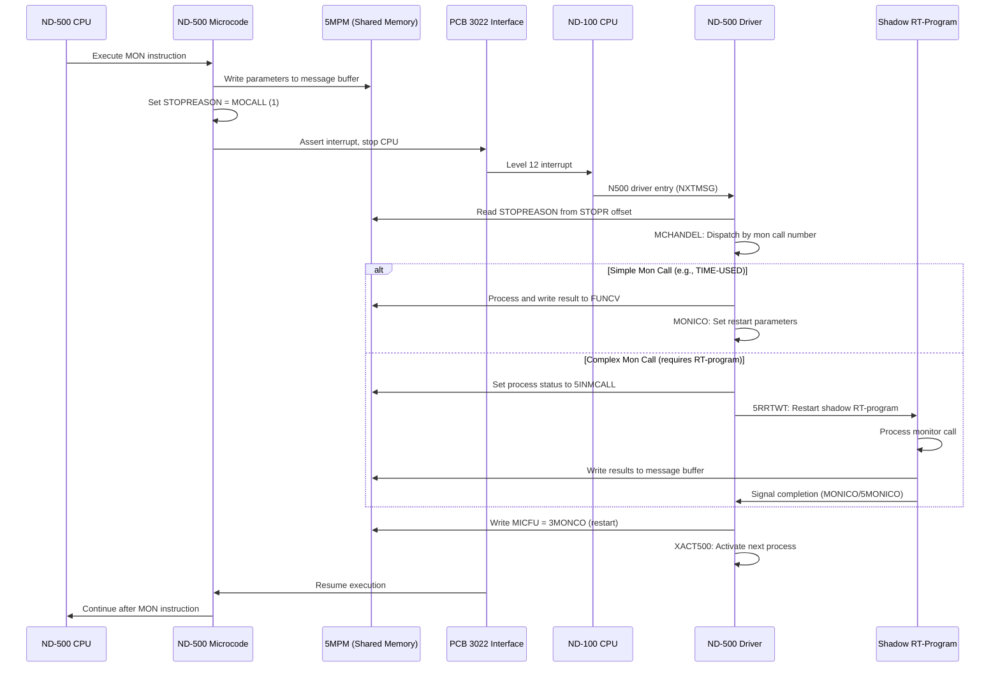
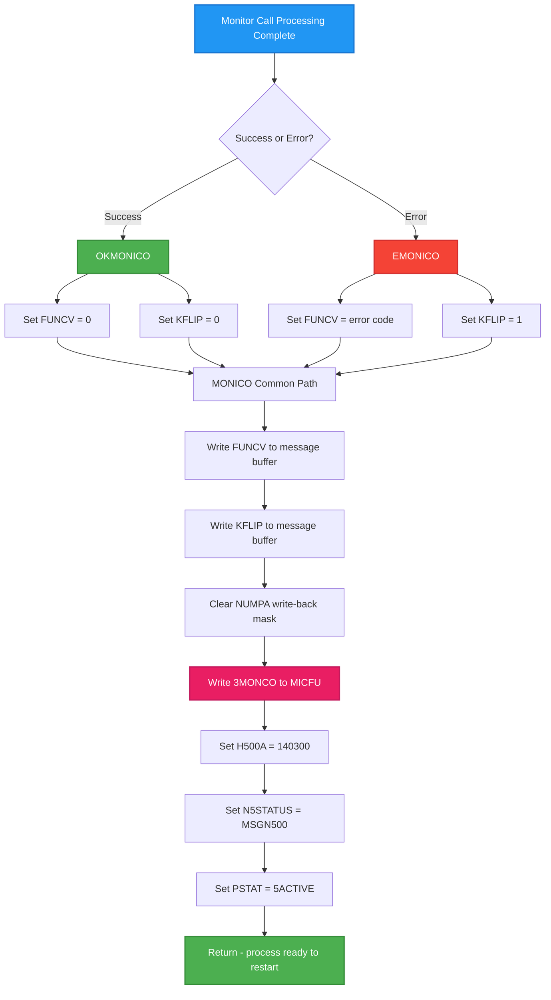
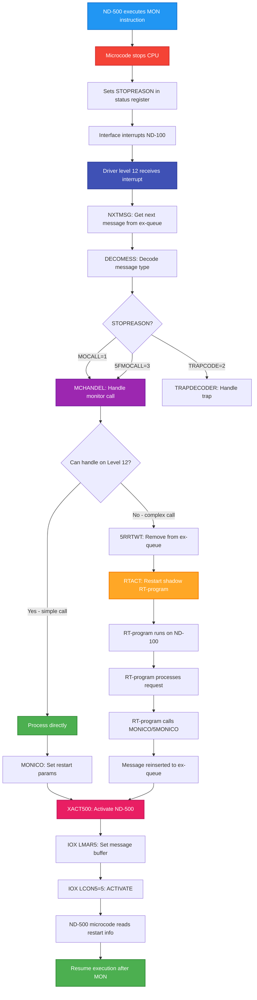

# ND-500 Monitor Call Parameter Passing and Response Mechanism

## Purpose

Complete documentation of how monitor call parameters are passed between ND-500 and ND-100, how responses are returned, and what happens during monitor call processing. All information verified from NPL source code with line numbers.

---

## 1. Overview: The Complete Monitor Call Lifecycle

When an ND-500 process executes a MON instruction, the following sequence occurs:



---

## 2. Message Buffer Parameter Layout

**Source**: N500-SYMBOLS.SYMB.TXT

### 2.1 Complete Message Buffer Offsets

| Offset (Oct) | Offset (Dec) | Symbol | Size | Purpose |
|--------------|--------------|--------|------|---------|
| 000002 | 2 | N5STA | 1 | Process status (MSGN500, N5IOWAIT, etc.) |
| 000006 | 6 | MICFU | 1 | Microfunction code for restart |
| 000007 | 7 | H500A | 1 | ND-500 auxiliary status |
| 000011 | 9 | STOPR | 1 | Stop reason (copied from status bits 10-14) |
| 000011 | 9 | KFLIP | 1 | Error flag (K flip-flop) |
| 000012 | 10 | NUMPA | 1 | Parameter write-back mask |
| 000013 | 11 | FUNCV | 2 | Function return value (double word) |
| 000013 | 11 | MCNO | 1 | Monitor call number (same offset as FUNCV) |
| 000037 | 31 | SMCNO | 1 | Saved monitor call number |
| 000060 | 48 | XMICF | 1 | Extended microfunction |
| 000100 | 64 | 5AP1 | 2 | Parameter 1 (input, double word) |
| 000101 | 65 | 5DP1 | 2 | Parameter 1 (output, double word) |
| 000102 | 66 | 5AP2 | 2 | Parameter 2 (input, double word) |
| 000103 | 67 | 5DP2 | 2 | Parameter 2 (output, double word) |
| 000104 | 68 | 5AP3 | 2 | Parameter 3 (input, double word) |
| 000105 | 69 | 5DP3 | 2 | Parameter 3 (output, double word) |
| 000106 | 70 | 5AP4 | 2 | Parameter 4 (input, double word) |
| 000107 | 71 | 5DP4 | 2 | Parameter 4 (output, double word) |

### 2.2 Parameter Reading Example

**Source**: MP-P2-N500.NPL lines 1455-1465 (N5FUD routine for MON 333 UDMA)

```npl
%-------------------------- GET PARAMETERS
       T:=5MBBANK; *LDATX X5SND              % GET 500 PROC. NO
       A=:N5SE
       *AAX 5PPA2; LDDTX                     % GET BUFFER ADDRESS
       AD=:DBUA;  *AAX 5AP1-5PPA2; LDDTX     % GET FUNCTION (parameter 1)
       IF A >< 0 GO UERR; A:=D=:UFU
       *AAX 5AP2-5AP1; LDDTX                 % GET PIO DATA (parameter 2)
       A:=D=:UPIO
       *AAX 5AP3-5AP2; LDDTX                 % GET LOG DEV (parameter 3)
       IF A >< 0 GO UERR; A:=D=:UNI
       *AAX 5AP4-5AP3; LDDTX                 % GET IPAR1 (parameter 4)
       AD=:IPAR1
```

**Pattern**:
- `T:=5MBBANK` - Set bank to 5MPM message buffer bank
- `*AAX offset; LDDTX` - Read double word from offset into AD register
- Parameters are double words (32 bits) even for 16-bit values

---

## 3. Monitor Call Number Handling

### 3.1 Standard Monitor Calls (0-377 octal = 0-255 decimal)

**Source**: MP-P2-N500.NPL lines 1290-1291

```npl
T:=5MBBANK; *AAX MCNO; LDATX              % YES, LOG
IF A<<1000 THEN                           % MON.CALL NUMBER 777B IS THE HIGHEST MON.CALL TO LOG
```

Monitor call numbers are stored at offset MCNO (000013 octal = 11 decimal).

### 3.2 Extended Monitor Calls (>255 decimal = >377 octal)

**The ND-500 supports monitor calls beyond 255**. These are handled specially on level 12.

**Source**: MP-P2-N500.NPL lines 1269-1271, 1382-1393

```npl
SYMBOL L12MIN=               500       % FIRST MON CALL THAT REQUIRES SPECIAL
                                       % TREATMENT ON LEVEL 12
SYMBOL L12MAX=               523       % LAST
...
IF A >= L12MIN AND A <= L12MAX THEN    % SPECIAL HANDLING ON LEVEL 12?
   A=:5CMNO; CALL MBSUSPROC
   5CMNO-L12MIN GOSW
      STAPROC,    NSTOPROC,   SWITPROC,   NINSTR,
      NOUTSTR,    GERRC,      5SIBMO,     SPRIO,
      SWMC,       DVIO,       A5XMSG,     B5XMSG,
      M5TMOUT,    5MTRANS,    M516,       M517,
      M520,       M521,       M522,       M523;
FI
GO NORMMC         % MONITOR CALL SHOULD BE HANDLED BY THE SYSTEM MONITOR.
```

### 3.3 Extended Monitor Call Dispatch Table

| Mon Call | Octal | Handler | Purpose |
|----------|-------|---------|---------|
| 500 | 764 | STAPROC | Start process |
| 501 | 765 | NSTOPROC | Stop process |
| 502 | 766 | SWITPROC | Switch process |
| 503 | 767 | NINSTR | Input string (DVINST) |
| 504 | 770 | NOUTSTR | Output string |
| 505 | 771 | GERRC | Get error code |
| 506 | 772 | 5SIBMO | SIB monitor call |
| 507 | 773 | SPRIO | Set priority |
| 510 | 774 | SWMC | Swapper monitor call |
| 511 | 777 | DVIO | Direct virtual I/O |
| 512 | 1000 | A5XMSG | XMSG A function |
| 513 | 1001 | B5XMSG | XMSG B function |
| 514 | 1002 | M5TMOUT | Timeout handling |
| 515 | 1003 | 5MTRANS | Transfer |
| 516-523 | 1004-1013 | M516-M523 | Patchable entries |

### 3.4 Special Monitor Calls Outside Range

| Mon Call | Octal | Symbol | Handler | Purpose |
|----------|-------|--------|---------|---------|
| 255 | 377 | N5SWAP | SWPDECODER | Swapper internal |
| 254 | 376 | CERN | (special) | CERN code execution |
| 231 | 347 | - | 5SERVER | Nucleus call |
| 219 | 333 | - | N5FUD | UDMA fast call |

---

## 4. Response Value Write-Back Mechanism

### 4.1 The NUMPA Write-Back Mask

When a monitor call completes, only certain parameters need to be written back to the ND-500 address space. The NUMPA field controls which parameters are written.

**Offset**: NUMPA = 000012 octal = 10 decimal

**Bit Meaning**:

| Bit | Mask (Oct) | Mask (Dec) | Parameter Written Back |
|-----|------------|------------|------------------------|
| 0 | 000001 | 1 | Parameter 1 (5AP1/5DP1) |
| 1 | 000002 | 2 | Parameter 2 (5AP2/5DP2) |
| 2 | 000004 | 4 | Parameter 3 (5AP3/5DP3) |
| 3 | 000010 | 8 | Parameter 4 (5AP4/5DP4) |
| 15 | 100000 | 32768 | Extended write-back (DVIO) |

### 4.2 Setting Write-Back Mask Examples

**Source**: MP-P2-N500.NPL line 3705-3706 (INSMONCO)

```npl
IF A-511=0 THEN A:=100000 ELSE A:=4 FI   % 511=DVIO gets bit 15, others get bit 2
*AAX NUMPA-SMCNO; STATX                   % STORE WRITE BACK MASK
```

**Source**: MP-P2-N500.NPL lines 1901-1904 (DVIO/DVINST handling)

```npl
IF X.SMCNO=511 THEN                    % WHICH MONITOR CALL IS IT
   100000=:X.NUMPAR                    % MON DVIO; SET MONITOR CALL WRITE-BACK MASK
ELSE
   4=:X.NUMPAR                         % MON DVINST; SET MONITOR CALL WRITE-BACK MASK
FI
```

### 4.3 Writing Response Values

**Source**: MP-P2-N500.NPL lines 2300-2325

```npl
*AAX 5AP2; STZTX; AAX 5DP2-5AP2; STATX; AAX -5DP2   % Write parameter 2 result
...
*AAX 5AP3; STZTX; AAX 5DP3-5AP3; STATX             % Write parameter 3 result
...
*AAX 5AP4; STZTX; AAX 5DP4-5AP4; STATX             % Write parameter 4 result
```

---

## 5. Monitor Call Restart Mechanism

### 5.1 The MONICO Family of Routines

**Source**: CC-P2-N500.NPL lines 359-372

```npl
SUBR MONICO,EMONICO,OKMONICO,MCCO
INTEGER KKFLIP
EMONICO:  A=:D:=0; T:=1; GO MONICO          % Error restart (K=1)
OKMONICO: T:=0; A:=0; D:=0                  % OK restart (K=0, FUNCV=0)
MONICO:   T=:KKFLIP:=5MBBANK; *AAX FUNCV; STDTX      % SAVE FUNCTION VALUE
          A:=KKFLIP; *AAX KFLIP-FUNCV; STATX         % SET ERROR FLAG ON/OFF
          *AAX NUMPA-KFLIP; STZTX
          3MONCO; *AAX -NUMPA; STATX XMICF           % RESTART AFTER MONITOR CALL
MCCO:     T:=5MBBANK; 140300; *AAX H500A; STATX; AAX -H500A
          L=:D; MSGN500; CALL WN5STATUS; L:=D
          T:=5MBBANK; X=:D; *AAX XADPR; LDXTX
          X.PSTAT/\5CLRUNSTATUS+5ACTIVE=:X.PSTAT    % SET PROC. ACTIVE
          X:=D; EXIT
```

### 5.2 Restart Entry Points

| Routine | KFLIP | FUNCV | Purpose |
|---------|-------|-------|---------|
| OKMONICO | 0 | 0 | Successful return, no error |
| EMONICO | 1 | (error code) | Error return with code in AD |
| MONICO | (param) | (param) | General restart with parameters |
| 5MONICO | (param) | (param) | Extended with cache control |
| 5EMONICO | 1 | (param) | Extended error restart |

### 5.3 Microfunction Codes for Restart

**Source**: N500-SYMBOLS.SYMB.TXT

| Octal | Decimal | Symbol | Meaning |
|-------|---------|--------|---------|
| 000023 | 19 | 3STAR(T) | Start execution |
| 000024 | 20 | 3MONC(O) | Monitor call complete - resume |
| 000025 | 21 | 3TRAC(O) | Trap complete - resume |
| 000026 | 22 | 3WMON(CO) | Write monitor call complete |

### 5.4 The Restart Sequence



---

## 6. What Happens on ND-500 During Monitor Call Processing

### 6.1 ND-500 CPU State: STOPPED

**Critical**: When an ND-500 process executes a monitor call, **the ND-500 CPU stops**. It does NOT continue executing another domain during the wait.

**Evidence**: The STOPREASON field (status register bits 10-14) indicates the CPU has stopped:
- MOCALL (1) = Monitor call
- TRAPCODE (2) = Trap (page fault, etc.)
- 5FMOCALL (3) = File transfer monitor call

**Source**: MP-P2-N500.NPL lines 808-814

```npl
*MICFU@3 LDATX                                       % MIC.FUNC
IF A=3MONCO OR A=3TRACO OR A=3START OR A=3WMONCO THEN
   T:=5MBBANK; *AAX STOPR; LDATX; AAX -STOPR
   IF A=MOCALL THEN CALL MCHANDLE                    % STOP-REASON IS MON.CALL
   ELSE IF A=5FMOCALL THEN CALL MCHANDLE             % STOP-REASON IS FILE-TRANSFER MONCALL
   ELSE IF A=TRAPCODE THEN CALL TRAPDECODER          % STOP-REASON IS TRAP
   ELSE CALL 5RRTWT                                  % RESTART ND-100 PROCESS
   FI FI FI
```

### 6.2 Execution Queue Processing

While one ND-500 process is stopped waiting for a monitor call, the ND-100 can:
1. Process the monitor call
2. Process other messages in the execution queue
3. Restart other waiting ND-500 processes

**Source**: MP-P2-N500.NPL line 818

```npl
GO NXTMSG                                            % HANDLE NEXT MESS. IN EX-QUEUE
```

### 6.3 Process Status During Wait

| Status Value | Symbol | Meaning |
|--------------|--------|---------|
| 5INMCALL | 000010 (oct) | Process executing monitor call |
| 5ACTIVE | - | Process active on ND-500 |
| N5IOWAIT | - | Process waiting for I/O |
| MSGN500 | 000001 (oct) | ND-500 message pending |

**Source**: MP-P2-N500.NPL line 1372

```npl
PROCAD.PSTAT/\5CLRUNSTATUS+5INMCALL=:X.PSTAT         % MARK PROC. IN MON.CALL.
```

### 6.4 ND-500 CPU Reactivation

When ready to restart an ND-500 process, XACT500 is called:

**Source**: MP-P2-N500.NPL lines 3084-3091

```npl
ACT50:           5MBBANK; T:=HDEV+LMAR5; *IOXT       % Load message buffer address
                 A:=X; *IOXT
                 A:=5; T+"LCON5-LMAR5"; *IOXT        % Operation code 5 = ACTIVATE
ELSE
                 % Enable for interrupt (no process waiting)
                 A:=10; T:=HDEV+LCON5;   *IOXT
                 A:=0;  T+"LSTA5-LCON5"; *IOXT
                 A:=1;  T+"LCON5-LSTA5"; *IOXT
                        T+"SLOC5-LCON5"; *IOXT
```

---

## 7. The Shadow RT-Program Mechanism

### 7.1 Why Shadow Programs?

Complex monitor calls that require significant processing (file I/O, terminal I/O, etc.) cannot be handled entirely on driver level 12. Instead:
1. The ND-500 driver removes the message from the execution queue
2. The shadow RT-program (running on ND-100) is restarted
3. The RT-program processes the request
4. When complete, the RT-program calls MONICO/5MONICO to restart the ND-500 process

### 7.2 5RRTWT: Remove and Restart

**Source**: MP-P2-N500.NPL lines 21-42

```npl
SUBR 5RRTWT,5XACTRT,5SWACTRT
...
5RRTWT: A:=L=:"LREG"=:"LRG"
       T:=5MBBANK; *AAX 5MSFL; LDATX; AAX -5MSFL
       IF A BIT 5SYSRES THEN
          ...
       FI
       CALL SLOCK; 0/\0
       CALL IFM500XQ                                 % REMOVE MESSAGE FROM EX-QUEUE
       CALL SUNLOCK
ACTRT: IF X><-1 THEN
          T:=5MBBANK; *SENDE@3 LDATX
          IF A+1=0 GO LREG                           % HISTOGRAM/WATCHDOG MESSAGE
          X=:CMESS; *AAX XADPR; LDXTX                % X=PROCESS DESCRIPTION
ACT5SWAP: X.PSTAT BONE F5BUFF BZERO T5BUFF=:X.PSTAT  % MARK THAT PROCESS IS RESTARTED BY THE DRIVER
          X:=:B
          *TRA STS
          IF A NBIT 17 THEN CALL XRTACT ELSE CALL RTACT FI  % INTERRUPT OFF OR ON?
```

### 7.3 Complete Monitor Call Flow with Shadow Program



---

## 8. Summary Tables

### 8.1 Key Offsets in Message Buffer

| Symbol | Offset (Oct) | Purpose | Direction |
|--------|--------------|---------|-----------|
| N5STA | 000002 | Process status | R/W |
| MICFU | 000006 | Microfunction for restart | W |
| STOPR | 000011 | Stop reason code | R |
| KFLIP | 000011 | Error flag (K flip-flop) | W |
| NUMPA | 000012 | Write-back mask | W |
| FUNCV | 000013 | Return value | W |
| MCNO | 000013 | Monitor call number | R |
| SMCNO | 000037 | Saved mon call number | R/W |
| 5AP1-5AP4 | 000100-000106 | Input parameters | R |
| 5DP1-5DP4 | 000101-000107 | Output parameters | W |

### 8.2 Extended Monitor Call Summary

| Range | Handling |
|-------|----------|
| 0-255 (0-377 oct) | Standard: System monitor or driver level |
| 500-523 (764-1013 oct) | Driver level dispatch table (GOSW) |
| 254 (376 oct) | CERN special code execution |
| 255 (377 oct) | N5SWAP swapper internal |
| 219 (333 oct) | UDMA fast call |
| 231 (347 oct) | Nucleus call |

### 8.3 ND-500 State During Monitor Call

| Phase | ND-500 CPU | ND-100 | Message Status |
|-------|------------|--------|----------------|
| MON executed | Stopped | Running | In ex-queue |
| Driver processing | Stopped | Level 12 | 5INMCALL |
| RT-program active | Stopped | Level 1 | Removed from ex-queue |
| Completion | Starting | Returns | MSGN500 |
| After XACT500 | Running | Available | 5ACTIVE |

---

## Related Documents

- [ND500-MONITOR-CALL-MECHANISM.md](ND500-MONITOR-CALL-MECHANISM.md) - High-level monitor call mechanism
- [ND500-IF-USAGE-DEEP-ANALYSIS.md](ND500-IF-USAGE-DEEP-ANALYSIS.md) - Complete IOX command reference
- [ND500-SCHEDULING-ANALYSIS.md](ND500-SCHEDULING-ANALYSIS.md) - Process scheduling details
- [SINTRAN-DOMAIN-SETUP-DEEP-DIVE.md](SINTRAN-DOMAIN-SETUP-DEEP-DIVE.md) - Domain and message buffer setup

---

**Document Version**: 1.0
**Created**: 2026-01-29
**Sources**: NPL source code (MP-P2-N500.NPL, CC-P2-N500.NPL, XC-P2-N500.NPL), N500-SYMBOLS.SYMB.TXT
