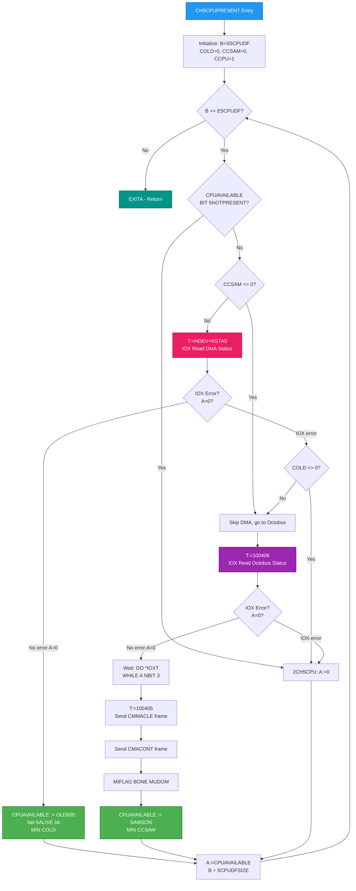
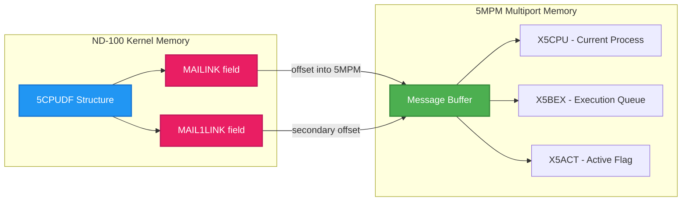
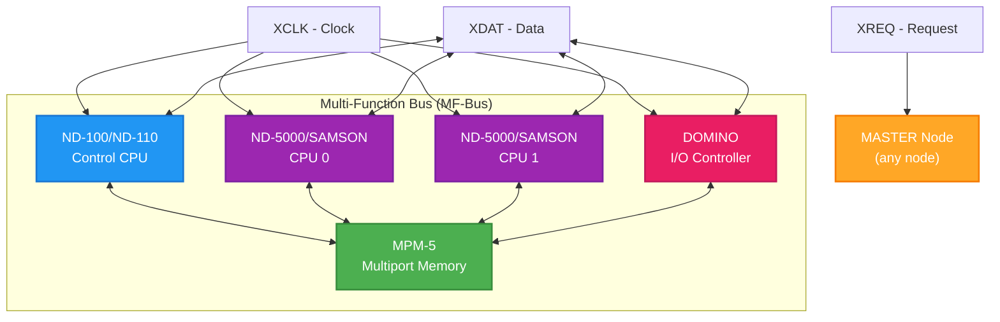
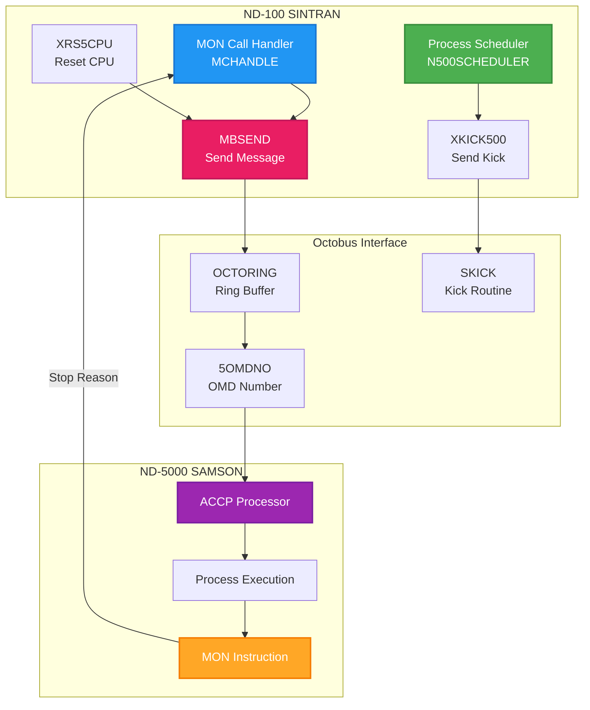
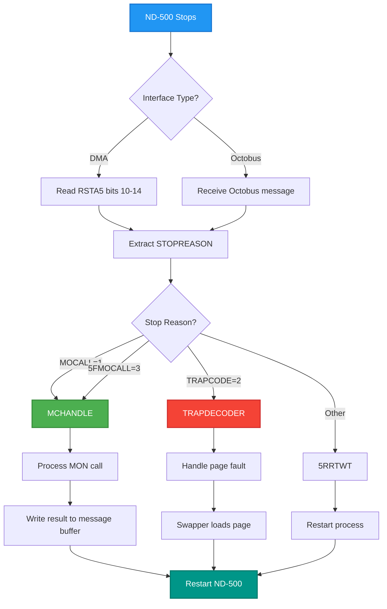

# ND-500/ND-5000 Interface Comprehensive Guide for Emulator Implementation

**Complete Reference for DMA (PCB 3022) and Octobus (SAMSON) Interfaces**

---

## Table of Contents

1. [Introduction](#1-introduction)
2. [CPU Detection Flow (CH5CPUPRESENT)](#2-cpu-detection-flow-ch5cpupresent)
3. [MUDOM Flag](#3-mudom-flag)
4. [MAILINK and MAIL1LINK](#4-mailink-and-mail1link)
5. [Multiple Interface Handling](#5-multiple-interface-handling)
6. [DMA Interface (PCB 3022)](#6-dma-interface-pcb-3022)
7. [Octobus Interface (SAMSON)](#7-octobus-interface-samson)
8. [SINTRAN Octobus Usage](#8-sintran-octobus-usage)
9. [MON Call Handling](#9-mon-call-handling)
10. [Code Patch Points](#10-code-patch-points)
11. [C# Implementation Guide](#11-c-implementation-guide)
12. [Appendix A: Symbol Tables](#appendix-a-symbol-tables)
13. [Appendix B: Source Code Cross-Reference](#appendix-b-source-code-cross-reference)

---

## 1. Introduction

### Purpose

This document provides complete technical specifications for implementing ND-500 (DMA/PCB 3022) and ND-5000 (Octobus/SAMSON) hardware interfaces in a C# emulator. It consolidates verified information from NPL source code and Norsk Data reference manuals.

### Scope

The guide covers:
- **Hardware detection** at boot time
- **Communication protocols** for both interface types
- **Status monitoring** and process scheduling
- **MON call handling** across interfaces
- **C# implementation patterns** for emulator developers

### Interface Types

| Generation | CPU | Interface | Communication |
|------------|-----|-----------|---------------|
| 1st/2nd | ND-500/1, ND-500/2 | DMA (PCB 3022) | Direct IOX registers |
| 3rd | ND-5000 (SAMSON) | Octobus + MFB | Message passing via serial bus |

### Key Differences Summary

| Aspect | DMA Interface (OLD500) | Octobus Interface (SAMSON) |
|--------|------------------------|---------------------------|
| Detection IOX | HDEV+RSTA5 (+2) | 100406 (octal) |
| Activation | LOWACT500 via IOX | XKICK500 via SKICK |
| Reset | XTER500, X5MCST | XRS5CPU via MBSEND |
| Status Poll | 500HA reads RSTA5 | 500HA returns EXITA immediately |
| Terminate | XTER500 | XKICK500 with IDLEKICK |
| Communication | Direct register I/O | Octobus message passing |

---

## 2. CPU Detection Flow (CH5CPUPRESENT)

### Source Code Analysis

**Source**: `PH-P2-OPPSTART.NPL` lines 3893-3943

The CH5CPUPRESENT subroutine detects all ND-500/ND-5000 CPUs during SINTRAN cold start.

```npl
SUBR CH5CPUPRESENT

CH5CPUPRESENT: B=:D; A:="S5CPUDF"=:B:=0; *TRR IIE
       0=:COMD=:CCSAM=:COLD; 1=:CCPU
       DO WHILE B<<="E5CPUDF"
          IF CPUAVAILABLE BIT 5NOTPRESENT GO 2CH5CPU
          IF CCSAM><0 GO 1CH5CPU              % Skip DMA check if SAMSON already found
          T:=HDEV+RSTA5; *TRA IIC             % Setup IOX error handling
          A:=200; *TRR IIE; IOXT; TRA IIC     % Read DMA status register
          IF A=0 THEN                         % No IOX error = DMA present
             CPUAVAILABLE/\140000\/OLD500     % Set CPU type to OLD500
             A BONE 5ALIVE                    % Set alive flag
             MIN COLD
          ELSE
             IF COLD><0 GO 2CH5CPU            % If DMA found before, skip Octobus
1CH5CPU:     *TRA IIC                         % Setup IOX error handling
             A:=200; *TRR IIE
             T:=100406; *IOXT; TRA IIC        % Read Octobus status at 100406
             IF A=0 THEN                      % No IOX error = Octobus present
                DO                            % Wait for data ready
                   *IOXT
                WHILE A NBIT 3                % Bit 3 = data ready
                OD
                ASTATION\/COMD=:5STATION      % Station address
                A SH 10 BONE CBIT BONE EBIT=:X
                T:=100405; A\/CMMACLE; *IOXT  % Send master clear frame
                A:=X\/CMACONT; *IOXT          % Send continue ACCP frame
                MIFLAG BONE MUDOM=:MIFLAG     % Set MUDOM flag
                CPUAVAILABLE/\140000\/SAMSON  % Set CPU type to SAMSON
                MIN CCSAM
             ELSE
2CH5CPU:        A:=0
             FI
          FI
          A=:CPUAVAILABLE
          MIN CCPU; MIN COMD; B+5CPUDDFSZ     % Next CPU datafield
       OD; D=:B
       EXITA
```

### Detection Flow Diagram



### Detection Logic Summary

| Step | IOX Address | Test | Result |
|------|-------------|------|--------|
| 1 | HDEV+RSTA5 (+2) | IOX returns A=0 | DMA interface present -> OLD500 |
| 2 | 100406 (octal) | IOX returns A=0 | Octobus present -> SAMSON |
| 3 | If both fail | A != 0 | No CPU at this slot |

### Detection Variables

| Variable | Purpose | Initial Value |
|----------|---------|---------------|
| COLD | DMA found flag | 0 |
| CCSAM | SAMSON found flag | 0 |
| CCPU | CPU counter | 1 |
| COMD | Command counter | 0 |

---

## 3. MUDOM Flag

### Definition

**Source**: `SYMBOL-1-LIST.SYMB.TXT`

```
MUDOM = 000001 (octal) = bit 0
```

### Location

- **Stored in**: `MIFLAG` (Machine Interface Flag)
- **Set when**: SAMSON (ND-5000) CPU detected at boot

### Source Reference

**Source**: `PH-P2-OPPSTART.NPL` line 3933

```npl
MIFLAG BONE MUDOM=:MIFLAG     % Set bit 0 in MIFLAG when SAMSON found
```

### Purpose

MUDOM indicates the system has ND-5000 (SAMSON) CPUs with multi-domain capability:

| Effect | Source File | Line |
|--------|-------------|------|
| Different scheduling behavior | RP-P2-N500.NPL | 238 |
| Different power fail handling | RP-P2-N500.NPL | 257 |
| Multi-CPU coordination | RP-P2-N500.NPL | 827 |

### Usage Pattern

```npl
IF MIFLAG BIT MUDOM THEN
   % SAMSON-specific code path
ELSE
   % DMA interface (OLD500) code path
FI
```

### Emulator Implementation

```csharp
public class MachineFlags
{
    // MIFLAG bit definitions
    public const ushort MUDOM = 0x0001;  // Bit 0: Multi-domain capability (SAMSON)

    private ushort miflag;

    public bool HasSamsonCpu => (miflag & MUDOM) != 0;

    public void SetMudom()
    {
        miflag |= MUDOM;
    }
}
```

---

## 4. MAILINK and MAIL1LINK

### Definition

- **MAILINK**: Field in CPU datafield (5CPUDF) - pointer to message buffer in 5MPM
- **MAIL1LINK**: Secondary mailbox link field in 5CPUDF

### Initialization

**Source**: `5P-P2-MON60.NPL` lines 560-564

```npl
X:="S5CPUDF"
DO WHILE X<<="E5CPUDF"
   A:=-1=:X.MAIL1LINK=:X.MAILINK    % Both initialized to -1
   X+5CPUDFSZ
OD
```

### Value Meaning

| Value | Meaning |
|-------|---------|
| -1 | Not initialized / No buffer allocated |
| >= 0 | Offset into 5MPM for message buffer |

### Usage Pattern

```npl
IF MAILINK><-1 THEN              % Buffer allocated?
   T:=5MBBANK; X:=MAILINK        % Access buffer in 5MPM bank
   *AAX X5CPU; LDATX             % Read CPU field from message buffer
FI
```

### Key Usage Locations

| File | Line | Purpose |
|------|------|---------|
| MP-P2-N500.NPL | 274 | `MAILINK><-1` - Check if CPU has message buffer |
| MP-P2-N500.NPL | 579 | `X:=MAILINK` - Access execution queue |
| CC-P2-N500.NPL | 658 | `GETC5PROC: X:=MAILINK` - Get current process from buffer |
| RP-P2-N500.NPL | 87 | `IF MAILINK><-1` - Check buffer before scheduling |
| RP-P2-N500.NPL | 753 | `T:=MSDFCPU.MAIL1LINK` - Access secondary mailbox |

### MAILINK Usage Diagram



### Emulator Implementation

```csharp
public class CpuDatafield
{
    public const int MAILINK_NOT_INITIALIZED = -1;

    public short Mailink { get; set; } = MAILINK_NOT_INITIALIZED;
    public short Mail1link { get; set; } = MAILINK_NOT_INITIALIZED;

    public bool HasMessageBuffer => Mailink != MAILINK_NOT_INITIALIZED;

    public ushort GetMessageBufferAddress(ushort mpmBank)
    {
        if (!HasMessageBuffer)
            throw new InvalidOperationException("Message buffer not allocated");
        return (ushort)((mpmBank << 16) + Mailink);
    }
}
```

---

## 5. Multiple Interface Handling

### CPU Datafield Loop Structure

SINTRAN supports multiple ND-500/ND-5000 CPUs through the 5CPUDF array:

```npl
X:="S5CPUDF"                    % Start of CPU datafield array
DO WHILE X<<="E5CPUDF"          % Loop until end
   IF X.CPUAVAILABLE BIT 5ALIVE AND MAILINK><-1 THEN
      % Process this CPU
   FI
   X+5CPUDFSZ                   % Move to next CPU datafield
OD
```

### Key Symbols

| Symbol | Purpose |
|--------|---------|
| S5CPUDF | Start address of CPU datafield array |
| E5CPUDF | End address of CPU datafield array |
| 5CPUDFSZ | Size of one CPU datafield structure |

### Per-CPU Fields

| Field | Offset | Purpose |
|-------|--------|---------|
| CPUAVAILABLE | +0 | CPU status and type flags |
| MAILINK | (varies) | Message buffer pointer |
| MAIL1LINK | (varies) | Secondary mailbox link |
| HDEV | (varies) | Hardware device address |
| CPUNO | (varies) | CPU number |
| 5STATION | (varies) | Octobus station address |
| C5STAT | (varies) | CPU status flags |

### CPUAVAILABLE Bit Layout

```
Bits 15-14: CPU Type (5CPUTYPE mask = 140000 octal)
  00 = Not configured
  01 = OLD500 (DMA interface)
  10 = SAMSON (Octobus interface)

Bit 5ALIVE: CPU is operational
Bit 5NOTPRESENT: CPU slot not populated
```

### Emulator Implementation

```csharp
public enum CpuType : ushort
{
    None = 0x0000,
    OLD500 = 0x4000,   // 01 << 14
    SAMSON = 0x8000    // 10 << 14
}

public class CpuDatafieldArray
{
    private const ushort CPUTYPE_MASK = 0xC000;  // 140000 octal
    private const ushort ALIVE_BIT = 0x0020;    // 5ALIVE
    private const ushort NOTPRESENT_BIT = 0x0040; // 5NOTPRESENT

    private List<CpuDatafield> cpus = new List<CpuDatafield>();

    public CpuType GetCpuType(int index)
    {
        return (CpuType)(cpus[index].CpuAvailable & CPUTYPE_MASK);
    }

    public bool IsCpuAlive(int index)
    {
        return (cpus[index].CpuAvailable & ALIVE_BIT) != 0;
    }

    public bool IsCpuPresent(int index)
    {
        return (cpus[index].CpuAvailable & NOTPRESENT_BIT) == 0;
    }

    public void ForEachAliveCpu(Action<CpuDatafield> action)
    {
        for (int i = 0; i < cpus.Count; i++)
        {
            if (IsCpuAlive(i) && cpus[i].HasMessageBuffer)
            {
                action(cpus[i]);
            }
        }
    }
}
```

---

## 6. DMA Interface (PCB 3022)

### IOX Register Map

| Symbol | Offset (Oct) | Offset (Dec) | Direction | Purpose |
|--------|--------------|--------------|-----------|---------|
| RMAR5 | +0 | 0 | Read | Read Memory Address Register |
| LMAR5 | +1 | 1 | Write | Load Memory Address Register |
| RSTA5 | +2 | 2 | Read | Read Status Register |
| LSTA5 | +3 | 3 | Write | Load Status Register |
| RCON5 | +4 | 4 | Read | Read Control Register |
| LCON5 | +5 | 5 | Write | Load Control Register |
| MCLR5 | +6 | 6 | Cmd | Master Clear |
| TERM5 | +7 | 7 | Write | Terminate |
| RTAG5 | +10 | 8 | Read | Read TAG-IN |
| LTAG5 | +11 | 9 | Write | Write TAG-OUT |
| RLOW5 | +12 | 10 | Read | Read Lower Limit |
| WDAT5/LLOW5 | +13 | 11 | Write | Write DATA |
| SLOC5 | +14 | 12 | Read | Set Locked |
| CLXD5 | +15 | 13 | Write | Clock DATA |
| UNLC5 | +16 | 14 | Cmd | Unlock |
| RETG5 | +17 | 15 | Write | Return Gate |

### Status Register (RSTA5) Bit Map

```
Bit:  15  14  13  12  11  10   9   8   7   6   5   4   3   2   1   0
     +---+---+---+---+---+---+---+---+---+---+---+---+---+---+---+---+
     |C15|        STOPREASON     |CLO|POF|PFA|DMA|ILK|PAG|FIN|BSY| - |INT|
     +---+---+---+---+---+---+---+---+---+---+---+---+---+---+---+---+
```

| Bit | Symbol | Mask (Oct) | Mask (Hex) | Meaning |
|-----|--------|------------|------------|---------|
| 0 | INTE | 000001 | 0x0001 | Interrupt enabled |
| 2 | BUSY | 000004 | 0x0004 | ND-500 busy |
| 3 | FIN | 000010 | 0x0008 | ND-500 finished |
| 4 | 5PAGF | 000020 | 0x0010 | Error flag |
| 5 | 5ILOCK | 000040 | 0x0020 | Interface locked (CPU running) |
| 6 | 5DMAER | 000100 | 0x0040 | DMA error |
| 7 | 5PFAIL | 000200 | 0x0080 | Power fail |
| 8 | 5POWOF | 000400 | 0x0100 | Power off |
| 9 | 5CLOST | 001000 | 0x0200 | Microclock stopped |
| 10-14 | STOPREASON | 037000 | 0x3E00 | Stop reason (5 bits) |
| 15 | CNTRL15 | 100000 | 0x8000 | Control bit 15 |

### Stop Reason Values (Bits 10-14)

**Extraction**: `STOPREASON = (RSTA5 >> 10) & 0x1F`

| Octal | Decimal | Symbol | Meaning |
|-------|---------|--------|---------|
| 000001 | 1 | MOCALL | Monitor call |
| 000002 | 2 | TRAPCODE | Trap occurred |
| 000003 | 3 | 5FMOCALL | File transfer MON |
| 000101 | 65 | TPSTRA | N500M RUNN return |

### Control Register (LCON5) Bit Map

| Bit | Symbol | Mask (Oct) | Mask (Hex) | Meaning |
|-----|--------|------------|------------|---------|
| 0 | INTE | 000001 | 0x0001 | Enable interrupt |
| 2 | ACTV | 000004 | 0x0004 | Activate ND-500 |
| 3 | TEST | 000010 | 0x0008 | Test mode |
| 4 | PCLY | 000020 | 0x0010 | Programmed clear |
| 5 | DTAG | 000040 | 0x0020 | Disable TAG-IN |
| 6 | DMAERR | 000100 | 0x0040 | DMA error |
| 7 | CMDCH | 000200 | 0x0080 | Command chaining |
| 8-14 | NDOP | 077600 | 0x7F00 | Operation code |

### LCON5 Values Used by SINTRAN

| Value (Oct) | Hex | Decimal | Bits Set | Source | Purpose |
|-------------|-----|---------|----------|--------|---------|
| 0 | 0x00 | 0 | None | XC-P2-N500.NPL:58 | Clear control |
| 1 | 0x01 | 1 | bit 0 | MP-P2-N500.NPL:3091 | Enable interrupt only |
| 5 | 0x05 | 5 | bits 0,2 | MP-P2-N500.NPL:3086 | **ACTIVATE** |
| 10 | 0x08 | 8 | bit 3 | MP-P2-N500.NPL:3089 | Test mode |
| 40 | 0x20 | 32 | bit 5 | CC-P2-N500.NPL:215 | Disable TAG-IN |
| 400 | 0x100 | 256 | bit 8 | PH-P2-RESTART.NPL:133 | **Power fail recovery** |

### MAR Calculation

**Physical Address = (5MBBANK << 16) + MAILINK + field_offset**

Where:
- `5MBBANK` = Bank number in ND-100 addressing (typically 174 octal for 5MPM)
- `MAILINK` = Offset within the message buffer
- `field_offset` = Offset to specific field (e.g., X5CPU, X5BEX)

### Complete IOX Sequences

#### MICRO STOP (5MCST) - Force halt ND-500

**Source**: CC-P2-N500.NPL lines 212-218

| Step | Register | Offset | Value | Effect |
|------|----------|--------|-------|--------|
| 1 | UNLC5 | +14 | (any) | Unlock interface |
| 2 | LCON5 | +5 | 40 (oct) | Disable TAG-IN |
| 3 | RETG5 | +17 | 2 | Stop microclock |

#### TERMINATE (XTER500) - Graceful stop

**Source**: MP-P2-N500.NPL lines 2928-2962

| Step | Register | Offset | Value | Action |
|------|----------|--------|-------|--------|
| 1 | RSTA5 | +2 | Read | Get status |
| 2 | Check | - | bit 5 | Is 5ILOCK set? |
| 3 | TERM5 | +7 | (any) | Issue terminate |
| 4 | RSTA5 | +2 | Read | Poll status |
| 5 | Loop | - | - | Wait for bit 5 clear |
| 6 | Timeout | - | - | Call 5MCST if stuck |

#### ACTIVATE (XACT500) - Start ND-500

**Source**: MP-P2-N500.NPL lines 3057-3099

| Step | Register | Offset | Value | Action |
|------|----------|--------|-------|--------|
| 1 | RSTA5 | +2 | Read | Get status |
| 2 | Check | - | bit 9 | Is clock running? |
| 3 | Check | - | bit 5 | Is interface locked? |
| 4 | LMAR5 | +1 | Bank | Set 5MPM bank |
| 5 | LMAR5 | +1 | Addr | Set message address |
| 6 | LCON5 | +5 | 5 | **ACTIVATE** |

### Emulator Implementation

```csharp
public class DmaInterface
{
    private const ushort RSTA5_OFFSET = 2;
    private const ushort LMAR5_OFFSET = 1;
    private const ushort LCON5_OFFSET = 5;
    private const ushort TERM5_OFFSET = 7;
    private const ushort SLOC5_OFFSET = 12;

    // Status register bits
    private const ushort INTE = 0x0001;
    private const ushort BUSY = 0x0004;
    private const ushort FIN = 0x0008;
    private const ushort ILOCK = 0x0020;
    private const ushort POWOF = 0x0100;
    private const ushort CLOST = 0x0200;
    private const ushort STOPREASON_MASK = 0x3E00;
    private const int STOPREASON_SHIFT = 10;

    // Control register values
    private const ushort CTRL_ACTIVATE = 0x0005;
    private const ushort CTRL_INTERRUPT_ENABLE = 0x0001;
    private const ushort CTRL_TEST_MODE = 0x0008;
    private const ushort CTRL_POWER_FAIL_RECOVERY = 0x0100;

    private ushort statusRegister;
    private ushort controlRegister;
    private ushort marHigh;  // Memory Address Register high
    private ushort marLow;   // Memory Address Register low
    private bool interfaceLocked;
    private bool cpuRunning;

    public ushort ReadRSTA5()
    {
        ushort status = 0;
        if (interruptEnabled) status |= INTE;
        if (cpuBusy) status |= BUSY;
        if (cpuFinished) status |= FIN;
        if (interfaceLocked) status |= ILOCK;
        if (powerOff) status |= POWOF;
        if (clockStopped) status |= CLOST;
        status |= (ushort)((stopReason & 0x1F) << STOPREASON_SHIFT);
        return status;
    }

    public void WriteLCON5(ushort value)
    {
        controlRegister = value;

        if ((value & CTRL_ACTIVATE) == CTRL_ACTIVATE)
        {
            // Activate ND-500
            interfaceLocked = true;
            cpuRunning = true;
        }

        interruptEnabled = (value & CTRL_INTERRUPT_ENABLE) != 0;
    }

    public void WriteLMAR5(ushort value)
    {
        // First write = bank, second write = address
        if (marWriteState == 0)
        {
            marHigh = value;
            marWriteState = 1;
        }
        else
        {
            marLow = value;
            marWriteState = 0;
        }
    }

    public int GetStopReason()
    {
        return (statusRegister & STOPREASON_MASK) >> STOPREASON_SHIFT;
    }
}
```

---

## 7. Octobus Interface (SAMSON)

### Overview

**Source**: ndwiki.org/wiki/OCTOBUS

Octobus is a high-speed serial command bus for system-internal signal/command transfer. It manages and synchronizes processors in multi-processor configurations including DOMINO I/O controllers.

### Protocol Characteristics

| Property | Value |
|----------|-------|
| Message Size | 32 bits |
| Maximum Nodes | 62 per bus (bridgeable for more) |
| Master Node | Any node can be MASTER (supplies XCLK) |
| Bus Arbitration | Any node can request via XREQ |
| Reliability | Power fail tolerant, hardware retries |

### Octobus Signals

| Signal | Name | Purpose |
|--------|------|---------|
| XREQ | Transmit Request | Node requests bus control |
| XCLK | Clock | Master-supplied clock signal |
| XDAT | Data | Serial data transfer |
| XRFO | Refresh Oscillator | Memory refresh timing |

### Data Rates

| Cable Length | Clock Frequency | Data Rate |
|--------------|-----------------|-----------|
| 6 meters | 4 MHz | 1.0 Mbits/s |
| 60 meters | 1 MHz | 0.250 Mbits/s |
| 120 meters | 0.5 MHz | 0.125 Mbits/s |

### Bus Types

- **Local Octobus**: Internal backwired in MF-Bus, TTL levels
- **Global Octobus**: Non-backwired, differential cable

### Device Address Ranges (IOX)

| Interface | Input Controller | Output Controller |
|-----------|-----------------|-------------------|
| 0 | 100400-100407 | 100410-100417 |
| 1 | 100420-100427 | 100430-100437 |

**Note** (PH-P2-OPPSTART.NPL line 4036):
> "NOTE !!! THIS OCTOBUS DRIVER ONLY HANDLE ONE OCTOBUS INTERFACE (DEVICE 0)"

### Octobus Ident Codes (Level 13 Interrupts)

When the Octobus interface signals an interrupt on level 13, the SINTRAN interrupt handler reads the ident code from the controller using the IDENT instruction. The Octobus uses two distinct ident codes to differentiate between input and output interrupts:

| Controller | IOX Address | Ident Code (Oct) | Ident Code (Dec) | Purpose |
|------------|-------------|------------------|------------------|---------|
| Input | 100400 | 60 | 48 | Receive interrupt (message received) |
| Output | 100404 | 61 | 49 | Transmit interrupt (ready for next message) |

**Why Two Ident Codes?**

The Octobus interface has separate input and output controllers:
- **Input Controller (100400-100407)**: Handles incoming Octobus messages from SAMSON CPUs
- **Output Controller (100410-100417)**: Handles outgoing Octobus messages to SAMSON CPUs

When either controller needs service, it asserts an interrupt on level 13. The IDENT instruction returns:
- **Ident 60**: Input controller caused the interrupt (message received)
- **Ident 61**: Output controller caused the interrupt (transmit buffer empty)

**Ident Code Pattern**

This follows the ND-100 device addressing convention (from NEC-01 ND-500 Course):

| Device Range | Ident Range | Device Type |
|--------------|-------------|-------------|
| 100200-100274 | 20-37 | Bus Controller (positions 0-15) |
| 100300-100374 | 40-57 | Bus Controller (extended positions) |
| 100400-100474 | 60-77 | Octobus interfaces |

The formula: `Ident Code = ((Device Address - 100200) / 4) + 20`

**ITB13 Table Storage**

The SINTRAN ITB13 (Ident Table Level 13) stores both Octobus datafields at offset +37:

```
ITB13+37/IOCT0;OOCT0    % Both input and output datafields
```

The interrupt handler uses the ident code (60 or 61) to select the appropriate datafield (IOCT0 for input, OOCT0 for output).

### Key Octobus Registers (Interface 0)

| Address (Oct) | Hex | Type | Purpose |
|---------------|-----|------|---------|
| 100405 | 0x8105 | Write | Command register (CMMACLE, CMACONT) |
| 100406 | 0x8106 | Read | Status register |
| 100407 | 0x8107 | Read | Data register |

### Octobus Commands

| Command | Symbol | Purpose |
|---------|--------|---------|
| Master Clear | CMMACLE | Reset Samson system |
| Continue ACCP | CMACONT | Resume ACCP processor |

### Status Register (100406) Bits

| Bit | Purpose |
|-----|---------|
| 3 | Data ready |

### Architecture Diagram



### OCSTART Initialization

**Source**: PH-P2-OPPSTART.NPL lines 4030-4086

1. Check if Octobus interface present: `T:=HDEV+2; *IOXT`
2. If IOX error (A=7), interface not present
3. Clear interface: `T:=HDEV+DCONT; 20; *IOXT`
4. Allocate memory for buffer pool and tables
5. Create buffer pool with `CBPOOL`
6. Set bank numbers for level link elements

### Emulator Implementation

```csharp
public class OctobusInterface
{
    // Octobus register addresses (octal converted to hex)
    private const ushort OCTO_INPUT_BASE = 0x8100;    // 100400
    private const ushort OCTO_OUTPUT_BASE = 0x8104;   // 100404
    private const ushort OCTO_COMMAND_REG = 0x8105;   // 100405
    private const ushort OCTO_STATUS_REG = 0x8106;    // 100406
    private const ushort OCTO_DATA_REG = 0x8107;      // 100407

    // Ident codes for level 13 interrupts
    private const byte IDENT_INPUT = 0x30;   // 60 octal = 48 decimal
    private const byte IDENT_OUTPUT = 0x31;  // 61 octal = 49 decimal

    // Status bits
    private const ushort DATA_READY_BIT = 0x0008;     // Bit 3

    private bool dataReady;
    private bool inputInterruptPending;
    private bool outputInterruptPending;
    private ushort stationAddress;

    /// <summary>
    /// Returns the ident code for the pending interrupt.
    /// Called by SINTRAN's IDENT instruction on level 13.
    /// </summary>
    public byte GetIdentCode()
    {
        // Input has priority over output
        if (inputInterruptPending)
            return IDENT_INPUT;   // 60 octal
        if (outputInterruptPending)
            return IDENT_OUTPUT;  // 61 octal
        return 0;  // No interrupt pending
    }

    /// <summary>
    /// Check if Octobus has a pending level 13 interrupt
    /// </summary>
    public bool HasPendingInterrupt => inputInterruptPending || outputInterruptPending;

    public ushort ReadStatus(ushort address)
    {
        if (address == OCTO_STATUS_REG)
        {
            ushort status = 0;
            if (dataReady) status |= DATA_READY_BIT;
            return status;
        }
        return 0xFFFF;  // IOX error
    }

    public bool IsOctobusPresent()
    {
        // Octobus present if IOX read returns 0 (no error)
        return true;  // In emulator, configure as needed
    }

    public void WriteCommand(ushort address, ushort value)
    {
        if (address == OCTO_COMMAND_REG)
        {
            // Process Octobus commands
            ProcessCommand(value);
        }
    }

    /// <summary>
    /// Signal that a message has been received (triggers ident 60)
    /// </summary>
    public void SignalMessageReceived()
    {
        inputInterruptPending = true;
        dataReady = true;
    }

    /// <summary>
    /// Signal that output buffer is ready (triggers ident 61)
    /// </summary>
    public void SignalOutputReady()
    {
        outputInterruptPending = true;
    }

    /// <summary>
    /// Clear interrupt after SINTRAN has serviced it
    /// </summary>
    public void AcknowledgeInterrupt(byte identCode)
    {
        if (identCode == IDENT_INPUT)
            inputInterruptPending = false;
        else if (identCode == IDENT_OUTPUT)
            outputInterruptPending = false;
    }
}
```

---

## 8. SINTRAN Octobus Usage

### SAMSON Process Scheduling

**Source**: RP-P2-N500.NPL lines 85-96

```npl
IF A/\5CPUTYPE=SAMSON THEN
   % Nd-500 samson on octobus line - test if memory layout ok : -
   IF MAILINK><-1  THEN
      A:=0; X:="S5CPUDF"
      DO WHILE X<<="E5CPUDF"; A\/X.C5STAT; X+5CPUDFSIZE; OD
      IF A/\C5PFMASK=0 GO NN5S1      % No power fail -> schedule
   FI
ELSE
   % Nd-500 on dma interface - test if power present & running : -
   T:=HDEV+RSTA5; *IOXT              % Check if activated and not in power-fail
   IF A BIT 5ILOC AND C5STAT NBIT BHPFAIL GO NN5S1
FI
```

### XKICK500 - Octobus Kick Mechanism

**Source**: MP-P2-N500.NPL lines 3278-3316

```npl
XKICK500:
   A=:CKICKTYPE                      % Save kick type
   IF CLVL><LV12B THEN               % Not on driver level?
      % Switch to level 12 for Octobus operation
      "LV12KICK";*IRW LV12B DP
      LV12; *MST PID
   FI
LV12KICK:
   T:=5STATION; X:=OCTORING; A:=CKICKTYPE
   CALL SKICK                        % Send Octobus kick
```

**Kick Types**:

| Symbol | Purpose |
|--------|---------|
| IDLEKICK | Wake idle CPU |
| CLRKICK | Clear and kick |
| N100KICK | ND-100 initiated kick |

### XRS5CPU - Octobus Reset CPU

**Source**: MP-P2-N500.NPL lines 3328-3342

```npl
XRS5CPU:
   % Build Octobus message
   5STATION=:"LMFIELD".MOCTSTATION   % Station number
   OMDACCP =:        X.MOCTOMD       % OMD number
   0       =:        X.MBROADCAST    % Not broadcast
   1       =:        X.MMSGLENGTH    % Message length = 1 byte
   CMCPURES SHZ 10=: X.MCOMMAND      % Send "Reset CPU"
   "LMDF"=:B; T:=5OMDNO; X:=OCTORING
   CALL MBSEND                       % Send via Octobus
```

### 500HA Status Check - SAMSON Handling

**Source**: MP-P2-N500.NPL lines 264-269

```npl
500HA: IF B<<"S5CPUDF" OR B>>"E5CPUDF" THEN EXIT FI
       IF CPUAVAILABLE/\5CPUTYPE><SAMSON THEN    % DMA interface?
          T:=HDEV+RSTA5; *IOXT                   % Read status
          IF A NBIT 5ILOCK OR A BIT 5POWOF THEN EXIT FI
       FI
       EXITA                                     % SAMSON: always assume running
```

**Key Point**: For SAMSON CPUs, 500HA does NOT read hardware status - it returns EXITA immediately, assuming the CPU is running. Status is communicated via Octobus messages instead.

### Octobus Message Structure

**Source**: 5OMBREAD (MP-P2-N500.NPL lines 3372-3449)

| Field | Type | Purpose |
|-------|------|---------|
| toctoheader | octoheader | Standard Octobus header |
| errcode | byte | Error code (hwfault=200b) |
| errtype | byte | Error type (accperr=1, mperr=2) |
| process_no | integer2 | Process number |
| trapping_p | integer4 | Trapping address |
| restart_p | integer4 | Restart address |
| trap_no | integer2 | Trap number |
| mms_sts | integer4 | MMS status |
| log_addr | integer4 | Logical address |
| phys_addr | integer4 | Physical address |
| Phys_seg | integer2 | Physical segment |

### Octobus Message Flow



### Emulator Implementation

```csharp
public class OctobusController
{
    public enum KickType { Idle, Clear, Nd100 }

    private Queue<OctobusMessage> messageQueue = new Queue<OctobusMessage>();

    public void SendKick(int station, int omdNo, KickType kickType)
    {
        var msg = new OctobusMessage
        {
            Station = station,
            OmdNumber = omdNo,
            Command = GetKickCommand(kickType)
        };
        messageQueue.Enqueue(msg);
    }

    public void ResetCpu(int station)
    {
        var msg = new OctobusMessage
        {
            Station = station,
            OmdNumber = OMDACCP,
            Broadcast = false,
            MessageLength = 1,
            Command = CMCPURES << 8  // Shift left 10 octal = 8 decimal
        };
        SendMessage(msg);
    }
}

public class OctobusMessage
{
    public int Station { get; set; }
    public int OmdNumber { get; set; }
    public bool Broadcast { get; set; }
    public int MessageLength { get; set; }
    public int Command { get; set; }

    // Error fields
    public byte ErrorCode { get; set; }
    public byte ErrorType { get; set; }
    public short ProcessNumber { get; set; }
    public int TrappingAddress { get; set; }
    public int RestartAddress { get; set; }
    public short TrapNumber { get; set; }
}
```

---

## 9. MON Call Handling

### Overview

MON call handling is the SAME for both DMA and Octobus interfaces. The difference is only in how the stop reason is communicated:
- **DMA**: Read from RSTA5 bits 10-14
- **Octobus**: Received via Octobus message

### MON Call Path

**Source**: MP-P2-N500.NPL lines 805-818

```npl
% MIC.FUNC determines action
IF A=3MONCO OR A=3TRACO OR A=3START OR A=3WMONCO THEN
   T:=5MBBANK; *AAX STOPR; LDATX     % Read stop reason
   IF A=MOCALL THEN CALL MCHANDLE           % Monitor call
   ELSE IF A=5FMOCALL THEN CALL MCHANDLE    % File transfer mon call
   ELSE IF A=TRAPCODE THEN CALL TRAPDECODER % Trap
   ELSE CALL 5RRTWT                         % Restart ND-100 process
   FI FI FI
ELSE
   CALL 5RRTWT                       % Restart ND-100 process
FI
```

### Stop Reason Handling

| Stop Reason | Value | Handler | Purpose |
|-------------|-------|---------|---------|
| MOCALL | 1 | MCHANDLE | Standard monitor call |
| TRAPCODE | 2 | TRAPDECODER | Hardware trap/page fault |
| 5FMOCALL | 3 | MCHANDLE | File I/O monitor call |
| Other | - | 5RRTWT | Restart ND-100 process |

### MON Call Handler Flow



### MCHANDLE Function

The MCHANDLE function processes monitor calls from ND-500:

1. Read MON call number from message buffer
2. Validate MON call number
3. Dispatch to appropriate handler
4. Write result back to message buffer
5. Signal ND-500 to continue

### Emulator Implementation

```csharp
public class MonCallHandler
{
    public enum StopReason : byte
    {
        MonitorCall = 1,
        TrapCode = 2,
        FileMonitorCall = 3
    }

    private readonly MessageBuffer messageBuffer;
    private readonly Swapper swapper;

    public void HandleStop(StopReason reason)
    {
        switch (reason)
        {
            case StopReason.MonitorCall:
            case StopReason.FileMonitorCall:
                HandleMonCall();
                break;
            case StopReason.TrapCode:
                HandleTrap();
                break;
            default:
                RestartProcess();
                break;
        }
    }

    private void HandleMonCall()
    {
        int monCallNumber = messageBuffer.ReadMonCallNumber();

        // Dispatch to appropriate handler
        var result = DispatchMonCall(monCallNumber);

        // Write result back
        messageBuffer.WriteResult(result);

        // Signal ND-500 to continue
        RestartNd500();
    }

    private void HandleTrap()
    {
        int trapNumber = messageBuffer.ReadTrapNumber();

        if (trapNumber == PAGE_FAULT)
        {
            // Get wanted page from message buffer
            int wantedPage = messageBuffer.ReadWantedPage();
            swapper.LoadPage(wantedPage);
        }

        RestartNd500();
    }
}
```

---

## 10. Code Patch Points

### *NNJ Markers

SINTRAN uses patch markers (*NNJ) to enable/disable code paths based on CPU type. These are compile-time patches that modify instruction flow.

### Verified Patch Points

| Marker | Location | Function |
|--------|----------|----------|
| *NNJ03 | CC-P2-N500.NPL:321 | LOWACT500 exits immediately for SAMSON |
| *NNJ13 | MP-P2-N500.NPL:2982 | XACTRDY direct exit for OLD500 |
| *NNJ14 | MP-P2-N500.NPL:3059 | XACT500 jumps to XACTRDY for ND5000 |

### NNJ03 - LOWACT500 SAMSON Path

**Source**: CC-P2-N500.NPL line 321

```npl
LOWACT500:
   *NNJ03                            % Patch point
   IF CPUAVAILABLE/\5CPUTYPE=SAMSON THEN
      EXIT                           % SAMSON uses XKICK500, not LOWACT500
   FI
   % Continue with DMA activation...
```

### NNJ14 - XACT500 ND5000 Path

**Source**: MP-P2-N500.NPL line 3059

```npl
XACT500:
   *NNJ14                            % Patch point
   IF CPUAVAILABLE/\5CPUTYPE=SAMSON THEN
      GO XACTRDY                     % Skip DMA sequence for SAMSON
   FI
   % Continue with DMA activation...
```

### Emulator Implementation

```csharp
public class Nd500Controller
{
    private readonly CpuType cpuType;

    public void LowActivate()
    {
        // NNJ03 equivalent
        if (cpuType == CpuType.SAMSON)
        {
            return;  // SAMSON uses Kick, not LowActivate
        }

        // DMA activation sequence
        DmaActivate();
    }

    public void Activate()
    {
        // NNJ14 equivalent
        if (cpuType == CpuType.SAMSON)
        {
            ActivateReady();
            return;
        }

        // DMA activation sequence
        DmaActivateSequence();
    }
}
```

---

## 11. C# Implementation Guide

### Complete CPU Type Detection

```csharp
public enum CpuType { None, OLD500, SAMSON }

public class CpuDetector
{
    private readonly IoxController iox;

    public CpuType DetectCpu(ushort hdev)
    {
        // Try DMA first (HDEV+RSTA5 = HDEV+2)
        var dmaResult = iox.TryRead((ushort)(hdev + 2));
        if (dmaResult.Success && dmaResult.Value == 0)
        {
            return CpuType.OLD500;
        }

        // Try Octobus (100406 octal = 0x8106)
        var octoResult = iox.TryRead(0x8106);
        if (octoResult.Success && octoResult.Value == 0)
        {
            return CpuType.SAMSON;
        }

        return CpuType.None;
    }
}
```

### Complete Interface Controller

```csharp
public interface INd500Interface
{
    void Activate(ushort messageBufferAddress);
    void Terminate();
    bool IsRunning { get; }
    int GetStopReason();
    void Reset();
}

public class DmaInterfaceController : INd500Interface
{
    private readonly IoxController iox;
    private readonly ushort hdev;

    // Register offsets
    private const ushort RSTA5 = 2;
    private const ushort LMAR5 = 1;
    private const ushort LCON5 = 5;
    private const ushort TERM5 = 7;

    // Status bits
    private const ushort ILOCK = 0x0020;
    private const ushort POWOF = 0x0100;
    private const ushort STOPREASON_MASK = 0x3E00;

    // Control values
    private const ushort ACTIVATE = 0x0005;

    public void Activate(ushort messageBufferAddress)
    {
        // Load message buffer address
        iox.Write((ushort)(hdev + LMAR5), mpmBank);
        iox.Write((ushort)(hdev + LMAR5), messageBufferAddress);

        // Activate (bits 0+2 = 5)
        iox.Write((ushort)(hdev + LCON5), ACTIVATE);
    }

    public void Terminate()
    {
        var status = iox.Read((ushort)(hdev + RSTA5));
        if ((status & ILOCK) != 0)
        {
            iox.Write((ushort)(hdev + TERM5), 0);

            // Poll until unlocked
            while ((iox.Read((ushort)(hdev + RSTA5)) & ILOCK) != 0)
            {
                // Timeout handling...
            }
        }
    }

    public bool IsRunning
    {
        get
        {
            var status = iox.Read((ushort)(hdev + RSTA5));
            return (status & ILOCK) != 0 && (status & POWOF) == 0;
        }
    }

    public int GetStopReason()
    {
        var status = iox.Read((ushort)(hdev + RSTA5));
        return (status & STOPREASON_MASK) >> 10;
    }

    public void Reset()
    {
        // Micro stop sequence
        iox.Write((ushort)(hdev + 14), 0);  // UNLC5: Unlock
        iox.Write((ushort)(hdev + LCON5), 0x20);  // Disable TAG-IN
        iox.Write((ushort)(hdev + 15), 2);  // RETG5: Stop microclock
    }
}

public class OctobusInterfaceController : INd500Interface
{
    private readonly OctobusController octobus;
    private readonly int station;
    private int lastStopReason;

    public void Activate(ushort messageBufferAddress)
    {
        // SAMSON uses kick mechanism
        octobus.SendKick(station, OMDACCP, KickType.Nd100);
    }

    public void Terminate()
    {
        octobus.SendKick(station, OMDACCP, KickType.Idle);
    }

    public bool IsRunning
    {
        get
        {
            // SAMSON: Always assume running
            // Status comes via Octobus messages
            return true;
        }
    }

    public int GetStopReason()
    {
        // Stop reason comes from Octobus message
        return lastStopReason;
    }

    public void Reset()
    {
        octobus.ResetCpu(station);
    }

    public void ProcessOctobusMessage(OctobusMessage msg)
    {
        lastStopReason = ExtractStopReason(msg);
    }
}
```

### Message Buffer Implementation

```csharp
public class MessageBuffer
{
    // Offsets (octal to decimal)
    private const int XADPR = 1;      // Process descriptor address
    private const int LINK = 2;       // Link to next in queue
    private const int CPUN = 5;       // CPU number
    private const int STOPR = 9;      // Stop reason
    private const int MICFU = 11;     // Microfunction code
    private const int MSFL = 13;      // Message flags
    private const int STAT = 15;      // Status word
    private const int PRIO = 19;      // Process priority
    private const int ABUFA = 21;     // Physical address of buffer
    private const int WANTP = 31;     // Wanted page

    private readonly ushort[] buffer;

    public MessageBuffer()
    {
        buffer = new ushort[128];  // 55MESSIZE = 128 words
    }

    public int StopReason
    {
        get => buffer[STOPR];
        set => buffer[STOPR] = (ushort)value;
    }

    public int WantedPage
    {
        get => buffer[WANTP];
        set => buffer[WANTP] = (ushort)value;
    }

    public int Link
    {
        get => buffer[LINK];
        set => buffer[LINK] = (ushort)value;
    }

    public int ProcessPriority
    {
        get => buffer[PRIO];
        set => buffer[PRIO] = (ushort)value;
    }
}
```

### Factory Pattern for Interface Creation

```csharp
public class Nd500InterfaceFactory
{
    public INd500Interface CreateInterface(CpuDatafield cpu)
    {
        var cpuType = (CpuType)(cpu.CpuAvailable & 0xC000);

        return cpuType switch
        {
            CpuType.OLD500 => new DmaInterfaceController(cpu.Hdev),
            CpuType.SAMSON => new OctobusInterfaceController(cpu.Station),
            _ => throw new InvalidOperationException("Unknown CPU type")
        };
    }
}
```

---

## Appendix A: Symbol Tables

> **Source**: All symbol values verified from `D:\ND\S\L07\N500-SYMBOLS.SYMB.TXT` and `D:\ND\S\L07\SYMBOL-1-LIST.SYMB.TXT`
>
> **Important Note on Symbol Values**: In NPL assembler, symbols are truncated to 5 characters. Symbol values are typically:
> - **Bit positions** for status bits (used with `BIT`/`NBIT` operators)
> - **Enumeration values** for type codes
> - **Offset values** for structure fields and registers
>
> To convert a bit position to a mask: `Mask = 1 << BitPosition`

### CPU Type Constants

| Symbol | NPL Symbol | Symbol Value (Oct) | Symbol File | Notes |
|--------|------------|-------------------|-------------|-------|
| OLD500 | OLD50 | 000001 | N500-SYMBOLS.SYMB.TXT:6174 | CPU type enum value 1 |
| SAMSON | SAMSO | 000003 | N500-SYMBOLS.SYMB.TXT:5041 | CPU type enum value 3 |
| 5CPUTYPE | 5CPUT | 000007 | N500-SYMBOLS.SYMB.TXT:396 | Bit position 7 |

**Usage in Code**: The 140000 octal mask (bits 14-15) is used as a literal in NPL code to extract CPU type:
```npl
IF CPUAVAILABLE/\140000\/OLD500    % Mask bits 14-15, OR with OLD500
IF CPUAVAILABLE/\5CPUTYPE=SAMSON   % Compare type field to SAMSON
```

**Derived Values for Emulator**:

| Symbol | Shifted Mask (Oct) | Shifted Mask (Hex) | Calculation |
|--------|-------------------|-------------------|-------------|
| OLD500 mask | 040000 | 0x4000 | 1 << 14 (type value 1 in bits 14-15) |
| SAMSON mask | 140000 | 0xC000 | 3 << 14 (type value 3 in bits 14-15) |
| 5CPUTYPE mask | 140000 | 0xC000 | Bits 14-15 mask |

### Status Register Bits (RSTA5)

Symbol values ARE **bit positions**, not masks. To get the mask: `Mask = 1 << BitPosition`

| Symbol | NPL Symbol | Bit Position (Oct) | Bit (Dec) | Mask (Oct) | Mask (Hex) | Symbol File Line |
|--------|------------|-------------------|-----------|------------|------------|------------------|
| 5PAGF | 5PAGF | 000004 | 4 | 000020 | 0x0010 | N500-SYMBOLS:1270 |
| 5ILOCK | 5ILOC | 000005 | 5 | 000040 | 0x0020 | N500-SYMBOLS:1008 |
| 5DMAER | 5DMAE | 000006 | 6 | 000100 | 0x0040 | N500-SYMBOLS:1188 |
| 5PFAIL | 5PFAI | 000007 | 7 | 000200 | 0x0080 | N500-SYMBOLS:1387 |
| 5POWOF | 5POWO | 000010 | 8 | 000400 | 0x0100 | N500-SYMBOLS:1586 |
| 5CLOST | 5CLOS | 000011 | 9 | 001000 | 0x0200 | N500-SYMBOLS:282 |

**Note**: INTE, BUSY, FIN, and STOPREASON bits are not defined as named symbols in the N500 symbol file; they are used as literal values in NPL code.

### CPU Datafield Flags

| Symbol | NPL Symbol | Bit Position (Oct) | Bit (Dec) | Mask (Oct) | Mask (Hex) | Symbol File Line |
|--------|------------|-------------------|-----------|------------|------------|------------------|
| 5ALIVE | 5ALIV | 000015 | 13 | 020000 | 0x2000 | N500-SYMBOLS:560 |
| 5NOTPRESENT | 5NOTP | 000017 | 15 | 100000 | 0x8000 | N500-SYMBOLS:24 |

### Stop Reasons (STOPR Field)

These are enumeration values, not bit positions:

| Symbol | NPL Symbol | Value (Oct) | Value (Dec) | Symbol File Line |
|--------|------------|-------------|-------------|------------------|
| MOCALL | MOCAL | 000001 | 1 | N500-SYMBOLS:5640 |
| TRAPCODE | TRAPC | 000002 | 2 | N500-SYMBOLS:276 |
| 5FMOCALL | 5FMOC | 000003 | 3 | N500-SYMBOLS:1004 |

### IOX Register Offsets (DMA Interface PCB 3022)

All values are offsets from HDEV base address:

| Symbol | NPL Symbol | Offset (Oct) | Offset (Dec) | Direction | Symbol File Line |
|--------|------------|--------------|--------------|-----------|------------------|
| RMAR5 | RMAR5 | 000000 | 0 | Read | N500-SYMBOLS:1195 |
| LMAR5 | LMAR5 | 000001 | 1 | Write | N500-SYMBOLS:7143 |
| RSTA5 | RSTA5 | 000002 | 2 | Read | N500-SYMBOLS:1194 |
| LSTA5 | LSTA5 | 000003 | 3 | Write | N500-SYMBOLS:7142 |
| RCON5 | RCON5 | 000004 | 4 | Read | N500-SYMBOLS:1193 |
| LCON5 | LCON5 | 000005 | 5 | Write | N500-SYMBOLS:7141 |
| MCLR5 | MCLR5 | 000006 | 6 | Command | N500-SYMBOLS:7065 |
| TERM5 | TERM5 | 000007 | 7 | Write | N500-SYMBOLS:4598 |
| RTAG5 | RTAG5 | 000010 | 8 | Read | N500-SYMBOLS:1192 |
| LTAG5 | LTAG5 | 000011 | 9 | Write | N500-SYMBOLS:7140 |
| RLOW5 | RLOW5 | 000012 | 10 | Read | N500-SYMBOLS:1190 |
| LLOW5/WDAT5 | LLOW5 | 000013 | 11 | Write | N500-SYMBOLS:7137 |
| SLOC5 | SLOC5 | 000014 | 12 | Read | N500-SYMBOLS:508 |
| UNLC5 | UNLC5 | 000016 | 14 | Command | N500-SYMBOLS:3600 |
| RETG5 | RETG5 | 000017 | 15 | Write | N500-SYMBOLS:1189 |

**Note**: CLXD5 (offset 015/13) not found in symbol files - may be defined inline in source.

### Message Buffer Offsets (5MPM)

| Symbol | NPL Symbol | Offset (Oct) | Offset (Dec) | Purpose | Symbol File Line |
|--------|------------|--------------|--------------|---------|------------------|
| X5BEX | X5BEX | 000000 | 0 | Execution queue head | N500-SYMBOLS:6934 |
| LINK2 | LINK2 | 000001 | 1 | Secondary link | N500-SYMBOLS:7106 |
| X5CPU | X5CPU | 000004 | 4 | Current process | N500-SYMBOLS:6881 |
| X5ACT | X5ACT | 000005 | 5 | Active flag | N500-SYMBOLS:6838 |
| MICFU | MICFU | 000006 | 6 | Microfunction code | N500-SYMBOLS:5266 |
| STOPR | STOPR | 000011 | 9 | Stop reason | N500-SYMBOLS:3186 |
| WANTP | WANTP | 000013 | 11 | Wanted page | N500-SYMBOLS:1614 |
| 55MSN | 55MSN | 000030 | 24 | Message sequence number | N500-SYMBOLS:1542 |
| ABUFA | ABUFA | 000140 | 96 | Physical buffer address | N500-SYMBOLS:2641 |
| XADPR | XADPR | 000144 | 100 | Process descriptor address | N500-SYMBOLS:6717 |
| 55MESSIZE | 55MES | 000200 | 128 | Message buffer size (words) | N500-SYMBOLS:277 |

**Negative Offsets** (from structure base, two's complement):

| Symbol | NPL Symbol | Offset (Oct) | Offset (Dec) | Purpose | Symbol File Line |
|--------|------------|--------------|--------------|---------|------------------|
| 5CPUN | 5CPUN | 177772 | -6 | CPU number | N500-SYMBOLS:1543 |
| 5PRIO | 5PRIO | 177773 | -5 | Process priority | N500-SYMBOLS:1584 |
| MIFLAG | MIFLA | 177770 | -8 | Machine interface flag | N500-SYMBOLS:5399 |
| 5MSFL | 5MSFL | 177777 | -1 | Message flags | N500-SYMBOLS:1457 |

### CPU Datafield Structure Offsets

| Symbol | NPL Symbol | Offset (Oct) | Offset (Dec) | Purpose | Symbol File Line |
|--------|------------|--------------|--------------|---------|------------------|
| 5OMDNO | 5OMDN | 000000 | 0 | OMD number | N500-SYMBOLS:1546 |
| C5STAT | C5STA | 000015 | 13 | CPU status flags | N500-SYMBOLS:4132 |
| MAIL1LINK | MAIL1 | 000021 | 17 | Secondary mailbox link | N500-SYMBOLS:7011 |
| MAILINK | MAILI | 000022 | 18 | Primary mailbox link | N500-SYMBOLS:5614 |
| CPUAVAILABLE | CPUAV | 000027 | 23 | CPU availability flags | N500-SYMBOLS:3680 |
| 5CPUDFSIZE | 5CPUD | 000046 | 38 | CPU datafield size | N500-SYMBOLS:1082 |
| HDEV | HDEV | 177775 | -3 | Hardware device address | N500-SYMBOLS:6907 |
| XHDEV | XHDEV | 177774 | -4 | Extended HDEV | N500-SYMBOLS:6906 |
| CPUNO | CPUNO | 177764 | -12 | CPU number | N500-SYMBOLS:5042 |
| 5STAT | 5STAT | 000017 | 15 | Status field | N500-SYMBOLS:397 |

### CPU Datafield Array Addresses

| Symbol | NPL Symbol | Address (Oct) | Purpose | Symbol File |
|--------|------------|---------------|---------|-------------|
| S5CPUDF | S5CPU | 052222 | Start of CPU datafield array | SYMBOL-2-LIST:519 |
| E5CPUDF | E5CPU | 052404 | End of CPU datafield array | SYMBOL-2-LIST:523 |
| 5MBBANK | 5MBBA | 004654 | 5MPM memory bank address | N500-SYMBOLS:847 |

### Octobus Commands and Symbols

| Symbol | NPL Symbol | Value (Oct) | Value (Dec) | Purpose | Symbol File Line |
|--------|------------|-------------|-------------|---------|------------------|
| CMMACLE | CMMAC | 000041 | 33 | Master clear frame | N500-SYMBOLS:4365 |
| CMACONT | CMACO | 000042 | 34 | Continue ACCP frame | N500-SYMBOLS:5036 |
| CMCPURES | CMCPU | 000071 | 57 | CPU reset command | N500-SYMBOLS:3588 |
| OMDACCP | OMDAC | 000003 | 3 | ACCP OMD number | N500-SYMBOLS:6016 |

### Octobus Kick Types

| Symbol | NPL Symbol | Value (Oct) | Value (Dec) | Purpose | Symbol File Line |
|--------|------------|-------------|-------------|---------|------------------|
| N100KICK | N100K | 000001 | 1 | ND-100 initiated kick | N500-SYMBOLS:5875 |
| CLRKICK | CLRKI | 000003 | 3 | Clear and kick | N500-SYMBOLS:4838 |
| IDLEKICK | IDLEK | 000006 | 6 | Wake idle CPU | N500-SYMBOLS:6962 |

### Octobus Infrastructure

| Symbol | NPL Symbol | Value (Oct) | Purpose | Symbol File Line |
|--------|------------|-------------|---------|------------------|
| OCTORING | OCTOR | 000000 | Octobus ring buffer | N500-SYMBOLS:5771 |
| DCONT | DCONT | 000003 | Device control offset | N500-SYMBOLS:1113 |
| LV12B | LV12B | 000140 | Level 12 base address | N500-SYMBOLS:5152 |

### Octobus Addresses and Ident Codes

| Address (Oct) | Address (Hex) | Ident (Oct) | Ident (Dec) | Purpose |
|---------------|---------------|-------------|-------------|---------|
| 100400 | 0x8100 | 60 | 48 | Input controller base |
| 100404 | 0x8104 | 61 | 49 | Output controller base |
| 100405 | 0x8105 | - | - | Command register |
| 100406 | 0x8106 | - | - | Status register |
| 100407 | 0x8107 | - | - | Data register |

**Octobus Datafield Addresses** (from SYMBOL-2-LIST.SYMB.TXT):

| Symbol | Address (Oct) | Purpose |
|--------|---------------|---------|
| IOCT0 | 123511 | Input controller datafield |
| OOCT0 | 123537 | Output controller datafield |

**Ident Code Usage:**
- When Octobus input controller interrupts on level 13, IDENT instruction returns 60 (octal)
- When Octobus output controller interrupts on level 13, IDENT instruction returns 61 (octal)
- SINTRAN uses ident code to select IOCT0 (input datafield) or OOCT0 (output datafield)

### Flags and Masks

| Symbol | NPL Symbol | Value (Oct) | Bit Position | Mask (Hex) | Purpose | Symbol File Line |
|--------|------------|-------------|--------------|------------|---------|------------------|
| MUDOM | MUDOM | 000001 | 0 | 0x0001 | Multi-domain flag (SAMSON present) | N500-SYMBOLS:5663 |
| BHPFAIL | BHPFA | 000000 | 0 | 0x0001 | Power fail bit in C5STAT | N500-SYMBOLS:3059 |
| CBIT | CBIT | 000017 | 15 | 0x8000 | Control bit | N500-SYMBOLS:3438 |
| EBIT | EBIT | 000007 | 7 | 0x0080 | Enable bit | N500-SYMBOLS:377 |

### Octobus Status Bit (100406)

| Bit | Purpose |
|-----|---------|
| 3 | Data ready (message received) |

---

## Appendix B: Source Code Cross-Reference

### Primary Source Files

| File | Lines | Content |
|------|-------|---------|
| PH-P2-OPPSTART.NPL | 3893-3943 | CH5CPUPRESENT detection routine |
| PH-P2-OPPSTART.NPL | 4030-4086 | OCSTART initialization |
| 5P-P2-MON60.NPL | 560-564 | MAILINK initialization |
| MP-P2-N500.NPL | 264-269 | 500HA status check |
| MP-P2-N500.NPL | 805-818 | MON call handling |
| MP-P2-N500.NPL | 3278-3316 | XKICK500 kick routine |
| MP-P2-N500.NPL | 3328-3342 | XRS5CPU reset routine |
| MP-P2-N500.NPL | 3352-3369 | RS5CPU (both CPU types) |
| MP-P2-N500.NPL | 3372-3449 | 5OMBREAD message structure |
| RP-P2-N500.NPL | 85-96 | Scheduler SAMSON path |
| RP-P2-N500.NPL | 305-384 | N500TMR timer routine |
| CC-P2-N500.NPL | 318-326 | LOWACT500/XLOWACT500 |
| CC-P2-N500.NPL | 612-622 | 5OCTOSWITCH |
| CC-P2-N500.NPL | 658-662 | GETC5PROC |

### Key Function Locations

| Function | File | Lines | Purpose |
|----------|------|-------|---------|
| CH5CPUPRESENT | PH-P2-OPPSTART.NPL | 3893-3943 | Detect CPUs at boot |
| OCSTART | PH-P2-OPPSTART.NPL | 4030-4086 | Initialize Octobus |
| 500HA | MP-P2-N500.NPL | 264-269 | Check if CPU active |
| MCHANDLE | MP-P2-N500.NPL | 805+ | Handle MON calls |
| XKICK500 | MP-P2-N500.NPL | 3278-3316 | Send Octobus kick |
| XRS5CPU | MP-P2-N500.NPL | 3328-3342 | Reset SAMSON CPU |
| XTER500 | MP-P2-N500.NPL | 2928-2962 | Terminate ND-500 |
| XACT500 | MP-P2-N500.NPL | 3057-3099 | Activate ND-500 |
| LOWACT500 | CC-P2-N500.NPL | 318-326 | Low-level activation |
| N500SCHEDULER | RP-P2-N500.NPL | 78-99 | Scheduler entry |

### Symbol Definition Files

**Source Directory**: `D:\ND\S\L07\`

| File | Content | Size |
|------|---------|------|
| N500-SYMBOLS.SYMB.TXT | ND-500 specific symbols (7143+ entries) | Primary source for this document |
| SYMBOL-1-LIST.SYMB.TXT | System-wide symbol definitions | Cross-reference |
| SYMBOL-2-LIST.SYMB.TXT | Additional symbols (addresses) | Contains S5CPUDF, E5CPUDF, IOCT0, OOCT0 |
| FILSYS-SYMBOLS.SYMB.TXT | File system symbols | |
| RTLO-SYMBOLS.SYMB.TXT | Runtime loader symbols | |
| XMSG-SYMBOL-LIST.SYMB.TXT | XMSG message system symbols | |
| LIBRARY-MARKS.SYMB.TXT | Library markers | |

**Symbol Format**: `SYMBOL=OCTAL_VALUE` (symbols truncated to 5 characters)

---

## Document Information

**Version**: 1.1
**Created**: 2026-01-29
**Updated**: 2026-01-30
**Author**: Generated from SINTRAN III NPL source analysis

### Changelog

**v1.1 (2026-01-30)**:
- Updated Appendix A with verified symbol values from `D:\ND\S\L07\` SINTRAN L distribution
- Added symbol file line references for all values
- Clarified that symbol values are bit positions (not masks) - masks must be calculated as `1 << BitPosition`
- Added negative offset symbols for structure fields
- Added Octobus kick types, commands, and infrastructure symbols
- Added CPU datafield structure offsets and array addresses
- Updated symbol definition files table with actual file inventory

### Sources

- NPL source code: CC-P2-N500.NPL, MP-P2-N500.NPL, XC-P2-N500.NPL, PH-P2-OPPSTART.NPL, RP-P2-N500.NPL, 5P-P2-MON60.NPL
- NEC-01 course documentation
- ND-05.009.4 EN ND-500 Reference Manual
- ndwiki.org/wiki/OCTOBUS (Octobus protocol reference)
- **Symbol definition files**: `D:\ND\S\L07\` (N500-SYMBOLS.SYMB.TXT, SYMBOL-1-LIST.SYMB.TXT, SYMBOL-2-LIST.SYMB.TXT)

### Verification

All information in this document is verified from:
1. NPL source code with specific line number references
2. Official Norsk Data reference manuals
3. **Symbol definition files from SINTRAN L distribution** (`D:\ND\S\L07\*.TXT`) with specific line references
4. All symbol values verified against actual SINTRAN L07 build symbols

**No speculation is presented as fact.**

---

**Parent:** [README.md](README.md) - ND-500 Documentation
**Related:** [ND5000-SAMSON-ARCHITECTURE.md](ND5000-SAMSON-ARCHITECTURE.md) - SAMSON details
**Related:** [ND500-IF-USAGE-DEEP-ANALYSIS.md](ND500-IF-USAGE-DEEP-ANALYSIS.md) - DMA interface details
**Emulator:** [../Emulator/ND500-EMULATION-COMPLETE.cs](../Emulator/ND500-EMULATION-COMPLETE.cs) - C# implementation
