# ND-500 Process Scheduling - Deep Analysis

## Purpose

Complete analysis of how SINTRAN III (running on ND-100) schedules and manages processes on the ND-500 coprocessor. SINTRAN is the **master scheduler** - it maintains all process state and controls which process runs on the ND-500.

**Key Sources**:
- CC-P2-N500.NPL (execution queue management, status routines)
- MP-P2-N500.NPL (XACT500 activation)
- RP-P2-N500.NPL (N500SCHEDULER timeslicer)

---

## 1. Scheduling Architecture Overview

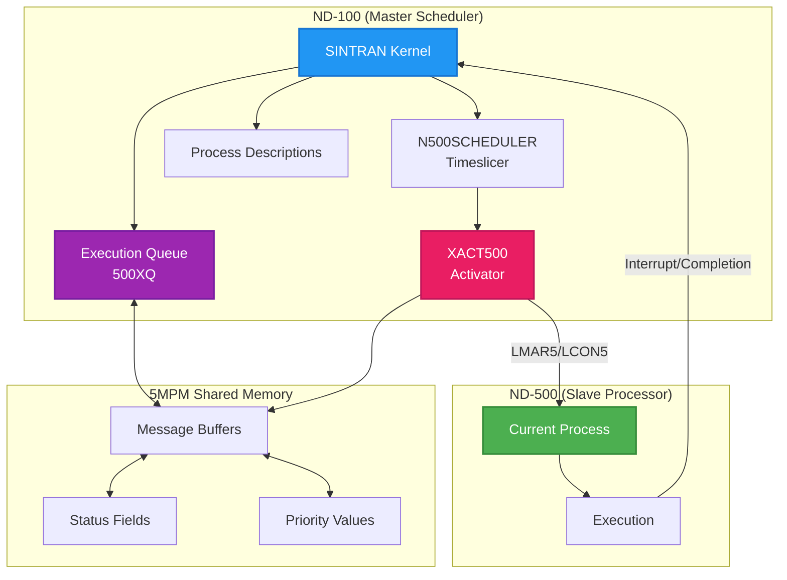

**Key Principle**: The ND-500 does NOT schedule itself. SINTRAN on ND-100:
- Maintains all process state
- Manages the execution queue
- Decides which process runs next
- Physically activates the ND-500 hardware

---

## 2. The Execution Queue (500XQ)

### 2.1 Queue Structure

The execution queue is a **priority-ordered linked list** of messages (processes) waiting for ND-500 CPU time.

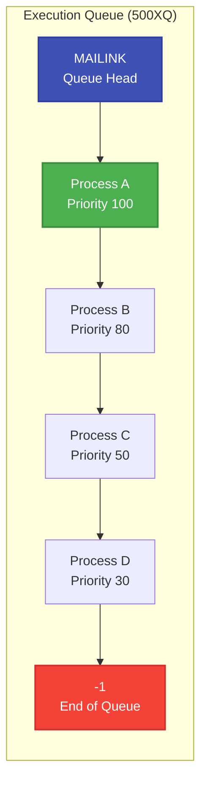

**Queue Properties**:
- **MAILINK**: Queue head pointer (in CPU datafield)
- **LINK**: Forward pointer to next message
- **PLINK**: Backward pointer to previous message
- **5PRIO**: Priority value (higher = more urgent)
- **5IEXQUEUE**: Flag indicating process is in queue

### 2.2 ITO500XQ - Insert To Execution Queue

**Source**: CC-P2-N500.NPL lines 232-266

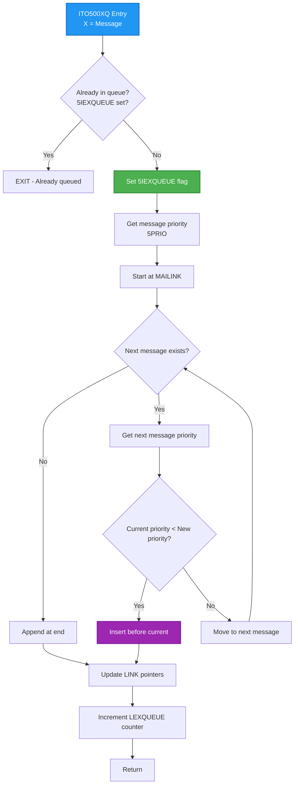

**Key Code** (lines 241-252):

```
Line 241: *AAX 5PRIO; LDATX                    % Get new message priority
Line 242: A=:L; T:=5MBBANK; X:=MAILINK
Line 243: DO
Line 244:    *LINK@3 LDDTX
Line 245: WHILE D><-1                          % Traverse queue
Line 249:    *AAX 5PRIO; LDATX; AAX -5PRIO     % A = current.5PRIORITY
Line 250:    IF A<L THEN                       % Insert before if lower priority
Line 251:       X:=D; GO ITO51
Line 252:    FI
Line 253: OD
```

### 2.3 IFM500XQ - Remove From Execution Queue

**Source**: CC-P2-N500.NPL lines 286-306

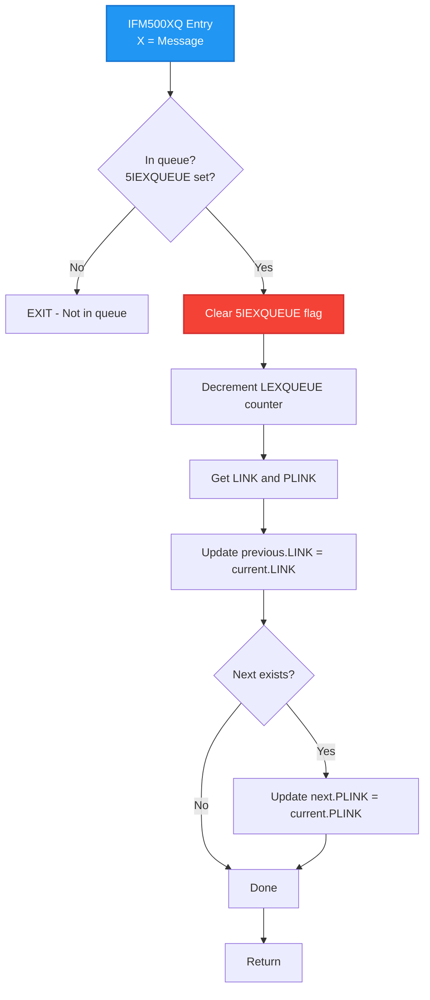

---

## 3. Process Status Management

### 3.1 Status Read/Write Routines

**Source**: CC-P2-N500.NPL lines 679-687

| Routine | Purpose | Code |
|---------|---------|------|
| **RN5STATUS** | Read process status from 5MPM | `*BSET BCM 120 DX; N5STA@3 LDATX` |
| **WN5STATUS** | Write process status to 5MPM | `*N5STA@3 STATX` |

**Note**: RN5STATUS reads twice to "fool the cache" - ensures fresh data from shared memory.

### 3.2 Process Status Values

| Status | Meaning | When Set |
|--------|---------|----------|
| **MSGN500** | Ready for ND-500 CPU | After monitor call completion (MCCO) |
| **WAITING** | Waiting for ND-500 CPU | In queue, not yet selected |
| **I5TMQU** | In time queue | Waiting for timeout |
| **STOPPED** | Process stopped | Explicit stop command |
| **SWPWAIT** | Waiting for swapper | Needs page swap |
| **SWPPING** | Using swapper | Swapper processing request |

### 3.3 Status Transition Diagram

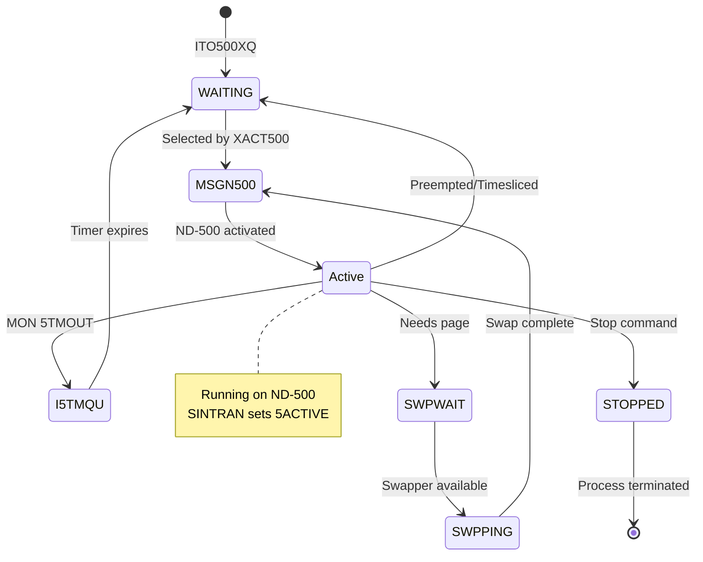

---

## 4. XACT500 - Process Activation

### 4.1 Overview

**XACT500** is the main routine that selects and activates the next process on ND-500.

**Source**: MP-P2-N500.NPL lines 3057-3099

### 4.2 Activation Flow

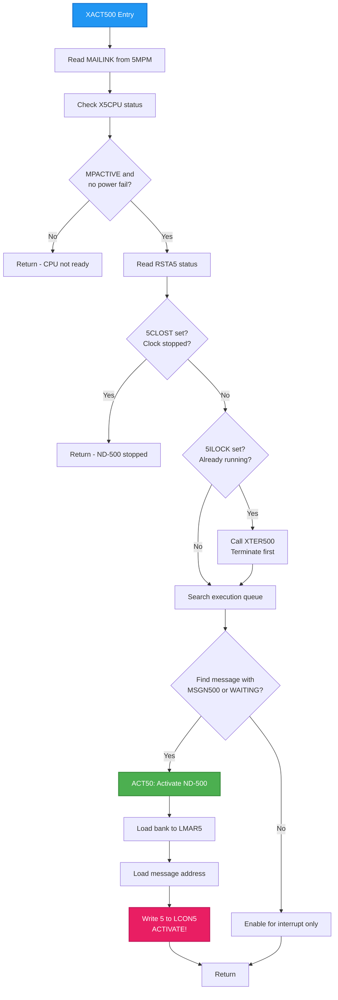

### 4.3 Key Code (ACT50 Activation)

```
Line 3071: X:=MAILINK
Line 3072: DO                                  % Search execution queue
Line 3073:    T:=5MBBANK; *LINK@3 LDDTX       % Next message
Line 3074: WHILE D><-1
Line 3075:    IF X:=D><DUMMESS THEN
Line 3076:       CALL RN5STATUS                % Get message status
Line 3077:       IF A=MSGN500 OR A=WAITING GO ACT50  % Ready for CPU?
Line 3078:    FI
Line 3079: OD

Line 3084: ACT50: 5MBBANK; T:=HDEV+LMAR5; *IOXT    % Load bank
Line 3085:        A:=X; *IOXT                      % Load message address
Line 3086:        A:=5; T+"LCON5-LMAR5"; *IOXT     % ACTIVATE (bits 0+2)
```

### 4.4 Enable for Interrupt (No Process Ready)

When no process is ready, XACT500 enables ND-500 to generate an interrupt when it finishes:

```
Line 3089: A:=10; T:=HDEV+LCON5; *IOXT    % Test mode
Line 3090: A:=0;  T+"LSTA5-LCON5"; *IOXT  % Clear status
Line 3091: A:=1;  T+"LCON5-LSTA5"; *IOXT  % Enable interrupt
Line 3092:        T+"SLOC5-LCON5"; *IOXT  % Lock interface
```

---

## 5. LOWACT500 - Low-Level Activation

### 5.1 Purpose

**LOWACT500** activates ND-500 from **lower interrupt levels** (not from driver level 12).

**Source**: CC-P2-N500.NPL lines 318-326

### 5.2 Mechanism

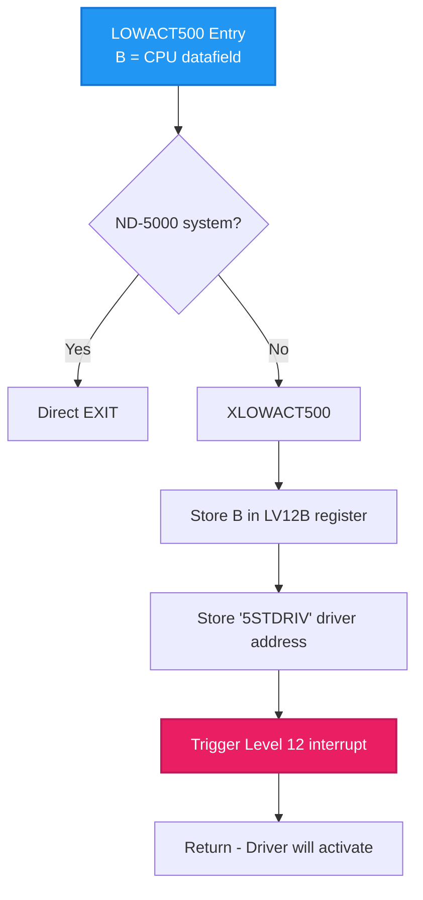

**Key Code**:

```
Line 322: XLOWACT500:
Line 323:        A:=B; *IRW LV12B DB           % Store CPU datafield
Line 324:        "5STDRIV"; *IRW LV12B DP      % Store driver address
Line 325:        LV12; *MST PID; EXIT          % Trigger Level 12
```

**Why Level 12?**: The ND-500 driver runs at interrupt level 12. LOWACT500 schedules the actual activation to run at the proper level.

---

## 6. N500SCHEDULER - Timeslicer

### 6.1 Overview

**N500SCHEDULER** is the timeslicer for ND-500 processes. It's called from the ND-100 timeslicer (RTSLI) and handles:
- CPU time tracking
- Priority adjustment based on CPU usage
- Timeslice expiration
- Process preemption

**Source**: RP-P2-N500.NPL lines 60-179

### 6.2 Timeslicer Flow

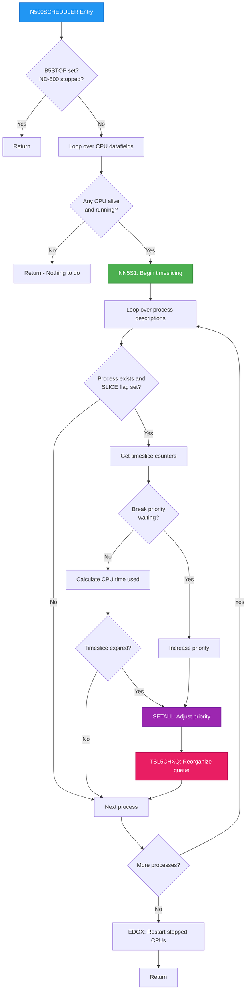

### 6.3 Timeslice Classes and Priority Tables

The timeslicer uses tables to determine priority adjustments:

| Table | Purpose |
|-------|---------|
| **TSLPRITAB** | Priority value for each timeslice element |
| **TSLTIMTAB** | Time limit for each timeslice element |
| **TSLNEXTAB** | Next element in timeslice chain |
| **TSLLPRITAB** | Low priority threshold per class |
| **TSLBRKELEM** | Break element per class |

### 6.4 Key Timeslice Fields (per process)

| Field | Purpose |
|-------|---------|
| **5TSLC** | Timeslice counter |
| **5TSLS** | Timeslice status |
| **5PRIO** | Current priority |
| **L500C** | ND-500 CPU time used (low 16 bits) |
| **SLICE** | Process is timesliced flag |

### 6.5 TSL5CHXQ - Queue Reorganization

After priority adjustment, **TSL5CHXQ** (called at line 159) reorganizes the execution queue to maintain priority order.

---

## 7. Complete Scheduling Cycle

### 7.1 Sequence Diagram

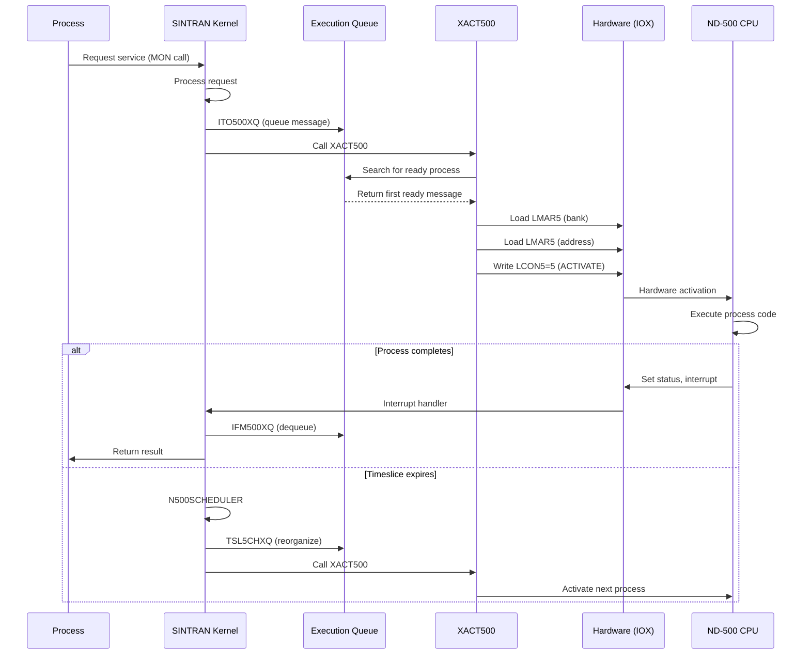

### 7.2 State Machine

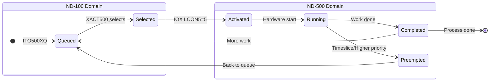

---

## 8. Priority-Based Scheduling Details

### 8.1 Priority Insertion

When a process is inserted into the queue (ITO500XQ), it's placed **before** all processes with lower priority:

```
Line 250: IF A<L THEN                    % If current priority < new priority
Line 251:    X:=D; GO ITO51              % Insert before current
```

### 8.2 Priority Adjustment by Timeslicer

The timeslicer adjusts priority based on CPU time consumed:

```
Line 127: A:=CL5CPU-5TNEXT=:D:=0
Line 128: T:=TSLTUNIT; *RDIV ST          % Compute CPU time used
Line 129: IF A+5TCOUNT<0 GO CONWAIT      % Timeslice finished?
Line 130: CL5CPU=:5TNEXT                 % Set new reference time
Line 131: CTSLSTATUS/\TSLELMSK=:X        % Get timeslice element
Line 132: A:=CTSLSTATUS/\177400\/TSLNEXTAB(X)  % Find next element
```

**Result**: Processes that use more CPU time get lower priority (fair scheduling).

---

## 9. Key Data Structures

### 9.1 CPU Datafield (5CPUDF)

| Field | Purpose |
|-------|---------|
| **MAILINK** | Head of execution queue (MAILI=000022 verified from SYMBOL-1-LIST.SYMB.TXT) |
| **CPUAVAILABLE** | CPU status flags (5ALIVE=bit 13, LV1ACT, LV2ACT) |
| **C5STAT** | CPU status (power fail flags) |
| **HDEV** | Hardware device address |

> **Note:** 5ALIVE (5ALIV=000015) is bit 13 in CPUAVAILABLE, NOT in RSTA5 status register.

### 9.2 Message Buffer (in 5MPM)

| Field | Offset | Purpose |
|-------|--------|---------|
| **LINK** | +0 | Forward pointer in queue |
| **PLINK** | varies | Backward pointer |
| **N5STA** | varies | Process status |
| **5PRIO** | varies | Priority value |
| **5MSFL** | varies | Message flags (5IEXQUEUE) |
| **5TSLC** | varies | Timeslice counter |
| **5TSLS** | varies | Timeslice status |

### 9.3 Process Description (S500S array)

| Field | Purpose |
|-------|---------|
| **RTRES** | Resource reference (0 = not used) |
| **PSTAT** | Process status flags |
| **MESSBUFF** | Pointer to message buffer |
| **SLICE** | Timeslice flag |

---

## 10. Emulator Implementation Notes

### 10.1 What the Emulator Must Track

| Component | Emulator Requirement |
|-----------|---------------------|
| **Execution Queue** | Maintain linked list in 5MPM |
| **Process Status** | Track N5STA field per message |
| **Priority** | Maintain 5PRIO, handle insertion order |
| **Timeslice State** | Track 5TSLC, 5TSLS, L500C |
| **Queue Flags** | Track 5IEXQUEUE in 5MSFL |

### 10.2 Key IOX Commands for Scheduling

| Command | Register | Value | Effect |
|---------|----------|-------|--------|
| Load bank | LMAR5 | 5MBBANK | Set memory bank |
| Load address | LMAR5 | message addr | Set message location |
| **ACTIVATE** | LCON5 | 5 (0x05) | Start ND-500 |
| Enable interrupt | LCON5 | 1 (0x01) | Wait for completion |

### 10.3 Interrupt Flow

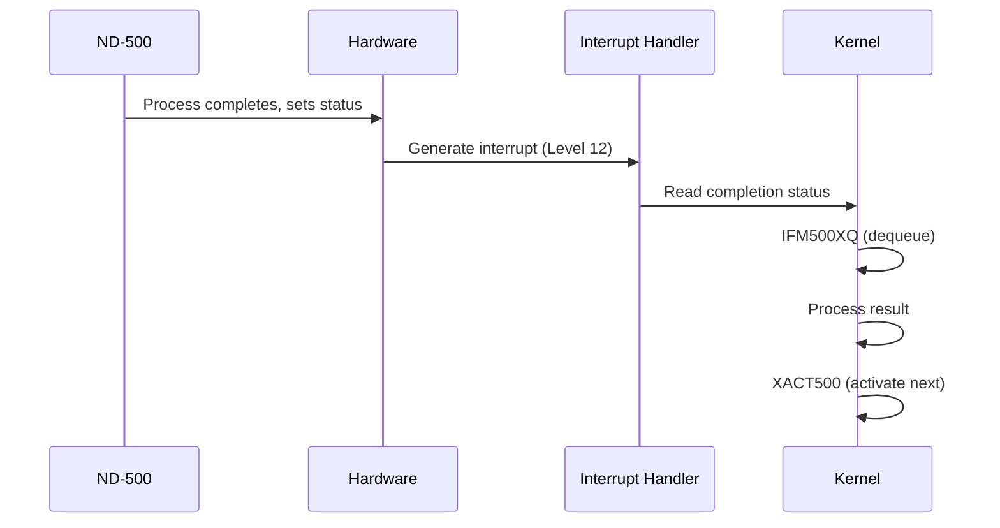

---

## 11. Related Documents

- [ND500-IF-USAGE-DEEP-ANALYSIS.md](ND500-IF-USAGE-DEEP-ANALYSIS.md) - IOX commands and 500HIST polling
- [ND500-SWAPPER-ANALYSIS.md](ND500-SWAPPER-ANALYSIS.md) - Swapper event-driven scheduling
- [MP-P2-N500.md](MP-P2-N500.md) - Main driver module analysis
- [CC-P2-N500.md](CC-P2-N500.md) - Command/control module analysis
- [RP-P2-N500.md](RP-P2-N500.md) - Runtime/timeslicer analysis
- [../OS/17-SCHEDULER-AND-PRIORITIES.md](../OS/17-SCHEDULER-AND-PRIORITIES.md) - General SINTRAN scheduling

---

## 12. Verification Checklist

- [x] Execution queue structure documented (500XQ)
- [x] ITO500XQ insertion algorithm documented
- [x] IFM500XQ removal algorithm documented
- [x] Process status values and transitions documented
- [x] XACT500 activation flow documented with Mermaid
- [x] LOWACT500 low-level activation documented
- [x] N500SCHEDULER timeslicer documented
- [x] Priority-based scheduling mechanism documented
- [x] Complete scheduling cycle sequence diagram
- [x] Key data structures documented
- [x] Emulator implementation notes included
- [x] No speculation presented as fact

---

**Document Version**: 1.0
**Last Updated**: 2026-01-29
**Sources**: CC-P2-N500.NPL (lines 232-326, 679-687), MP-P2-N500.NPL (lines 3057-3099), RP-P2-N500.NPL (lines 60-179)
