# ND-500 Swapper (5SWAP) - Deep Analysis

> **Corrected 2026-07-08.** Earlier versions said the swapper "runs on the ND-500";
> that was wrong. **5SWAP is an ND-100 RT-program** (5SWRT, RP-P2-N500.NPL:16-58,
> using *2BANK and MON 131/ABSLI - both ND-100 constructs). What lives on the ND-500
> side is **process #0** (S500S/5SWPROC), whose message buffer SWMSG carries the swap
> requests; the ND-100 program serves that process. See
> [ND500-SWAPPER-LOADING-MECHANISM.md](ND500-SWAPPER-LOADING-MECHANISM.md) and
> [ND500-BUS-INTERFACE-REFERENCE.md](ND500-BUS-INTERFACE-REFERENCE.md) section 12.

## Purpose

Complete analysis of the SINTRAN III swapper subsystem for ND-500. The swapper is an **event-driven segment loading and page swapping service** - NOT a passive polling mechanism.

**Source**: MP-P2-N500.NPL (lines 1031-1188, 2851-2908, 2970-3040)

---

## 1. What the Swapper Does

The swapper subsystem (ND-100 RT-program **5SWAP**/5SWRT serving ND-500 **process
#0**) handles:

| Function | Description |
|----------|-------------|
| **Segment allocation** | Allocating disk pages for new memory segments |
| **Page swapping** | Reading/writing memory pages to/from disk |
| **Disk I/O coordination** | Managing disk transfers via queue pool elements (on the ND-100) |
| **ND-500 memory service** | Serving page faults and segment loads FOR the ND-500 processes |

---

## 2. Swapper State Machine

### 2.1 Process States (from perspective of processes using the swapper)

| Symbol | Value (Oct) | Value (Dec) | Meaning |
|--------|-------------|-------------|---------|
| LSWPWAIT | 4 | 4 | Process waiting for swapper (blocked in queue) |
| LSWPPING | 6 | 6 | Process using swapper (request being processed) |
| LACTIVE | 12 | 10 | Process active (has swapper result) |

### 2.2 Swapper Internal States

| Symbol | Meaning |
|--------|---------|
| PSWWAIT | Swapper is idle, waiting for work |
| SWPPING | Swapper is actively processing a request |
| PSW1WAIT | Swapper waiting for disk I/O completion |

### 2.3 State Transition Diagram

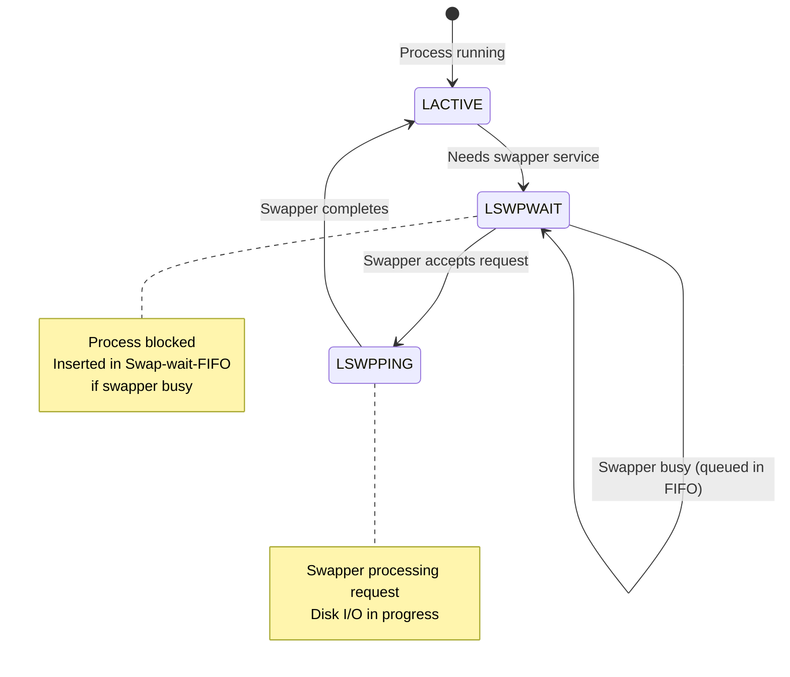

---

## 3. Complete Request Flow

### 3.1 High-Level Flow

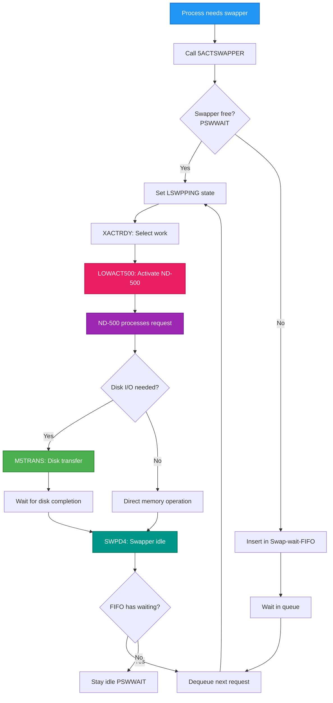

### 3.2 5ACTSWAPPER Subroutine (Lines 2851-2908)

This is the **key entry point** for requesting swapper service.

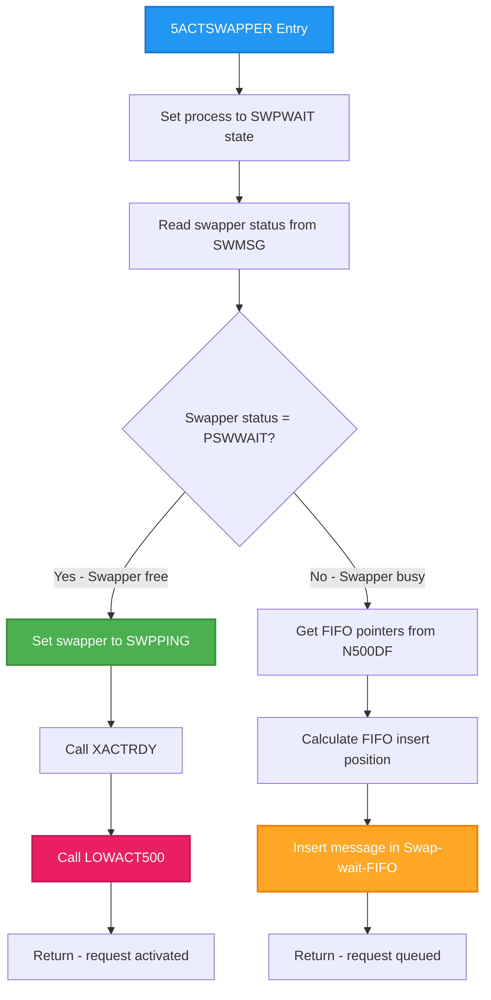

**Source** (MP-P2-N500.NPL lines 2862-2906):

```
Line 2862: SWPWAIT; CALL WN5STATUS                    % Mark process waiting
Line 2864: X:=SWMSG; CALL RN5STATUS
Line 2865: IF A=PSWWAIT THEN                          % Swapper free?
Line 2870:    SWPPING; CALL WN5STATUS                 % Mark swapper in use
Line 2871:    X:=SWMSG; CALL XACTRDY                  % Reactivate ND-500
Line 2872:    CALL LOWACT500
Line 2898: ELSE
Line 2899:    T:=5MBBANK; X:="N500DF".X500DF
Line 2900:    *AAX X5MXF; LDATX                       % Get FIFO pointers
Line 2901:    A=:L; *AAX X5SWF-X5MXF; LDDTX
Line 2902:    IF A=:D+1>=L THEN A:=0 FI               % Wrap FIFO
Line 2903:    D SH 1=:L; *AAX X5SWB-X5SWF; LDDTX      % Compute FIFO address
Line 2904:    X:=D+L; T:=A+C; CMSGTOSW; *STDTX        % Insert message
Line 2906: FI
```

---

## 4. FIFO Queue Processing (SWPD4)

When the swapper completes a request, it checks the Swap-wait-FIFO for waiting processes.

### 4.1 SWPD4 Flow Diagram

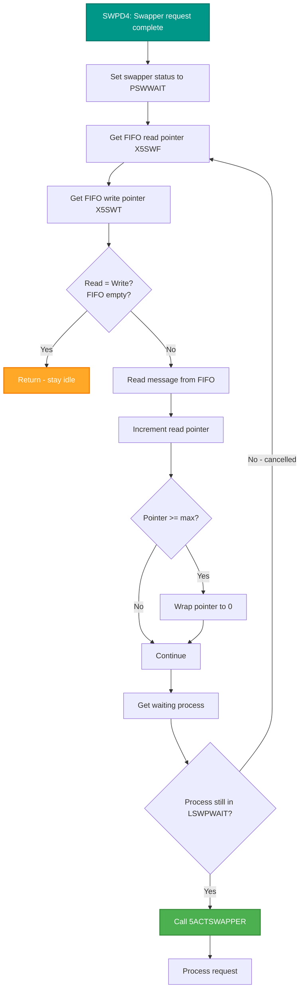

**Source** (MP-P2-N500.NPL lines 1031-1066):

```
Line 1031: SWPD4: PSWWAIT; X:=SWMSG; CALL WN5STATUS   % Swapper now idle
Line 1032:        T:=5MBBANK; X:="N500DF".X500DF
Line 1033:        *AAX X5SWF; LDDTX                   % Get FIFO read pointer
Line 1034:        A=:D; *AAX X5SWT-X5SWF; LDATX       % Get FIFO write pointer
Line 1035:        IF A=D GO SWPD5                     % FIFO empty? Exit
Line 1040:        % Dequeue and process waiting request
Line 1050:        IF process still in LSWPWAIT        % Still waiting?
Line 1052:           CALL 5ACTSWAPPER                 % Yes, activate it
```

---

## 5. Work Triggering Mechanisms

### 5.1 What Triggers Actual Work

The swapper is **event-driven**, not polling-based. Work is triggered by:

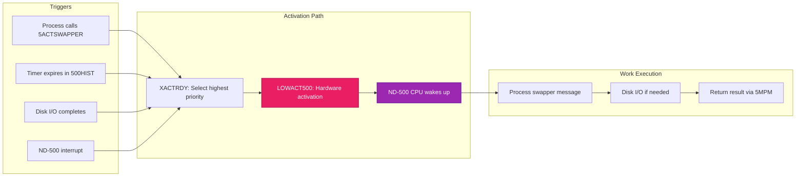

### 5.2 XACTRDY - Priority-Based Work Selection (Lines 2970-3040)

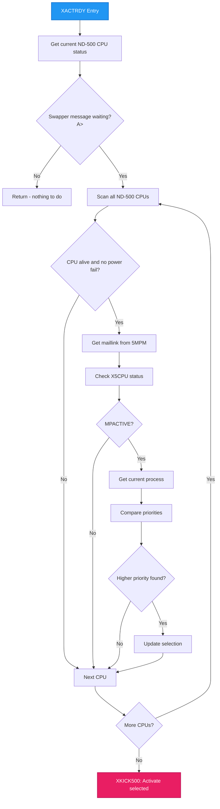

### 5.3 LOWACT500 - Physical ND-500 Activation

**LOWACT500** is the **critical hardware activation routine**. It sets flags that physically wake up the ND-500 CPU.

```
Line 245: CPUAVAILABLE BONE LV2ACT=:CPUAVAILABLE
Line 251: CALL LOWACT500
Line 459: CALL LOWACT500; LTTMR=:TMR    % Reactivate ND-500
```

| Action | Effect |
|--------|--------|
| Set LV2ACT bit in CPUAVAILABLE | Signal that Level 2 work is ready |
| Write to hardware registers | Physical wake-up of ND-500 |
| ND-500 exits idle loop | Begins processing messages |

---

## 6. Swapper Operations

### 6.1 LSWPAGE - Disk I/O (Lines 1070-1114)

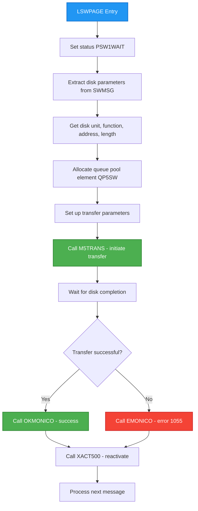

**Source** (MP-P2-N500.NPL lines 1070-1095):

```
Line 1070: LSWPAGE:
Line 1071:    X:=SWMSG; PSW1WAIT; CALL WN5STATUS
Line 1072:    T:=5MBBANK; *AAX HSWPI; LDDTX
Line 1080:    % Extract disk parameters
Line 1085:    T:="QP100".QP5SW                    % Swapper queue element
Line 1086:    -1=:X.QP5SW; X:=T                   % "LINK OUT"
Line 1088:    "5SWAP"=:X.RTRES; 0=:X.NLINK        % Mark swapper as owner
Line 1092:    *LDF I (XABSF; STF ABFUN,X          % Function code
Line 1093:    *LDD I (XABLO; STD ABPA2,X          % Disk address
Line 1094:    *LDA I (XABLN; STA ABP31,X          % Byte length
Line 1095:    CALL M5TRANS; GO BUSR
```

### 6.2 LALLOPAGE - Page Allocation (Lines 1170-1188)

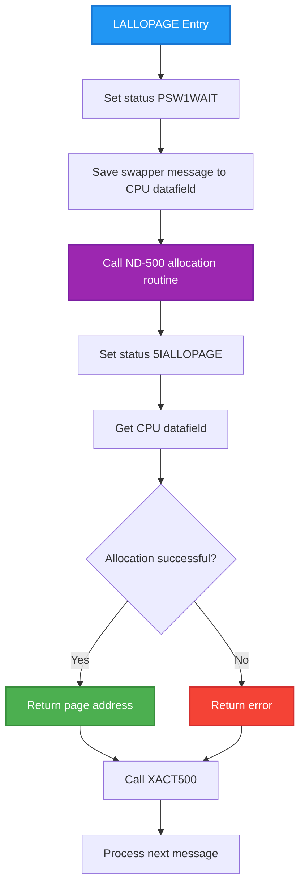

---

## 7. Communication via 5MPM

### 7.1 Shared Memory Structure

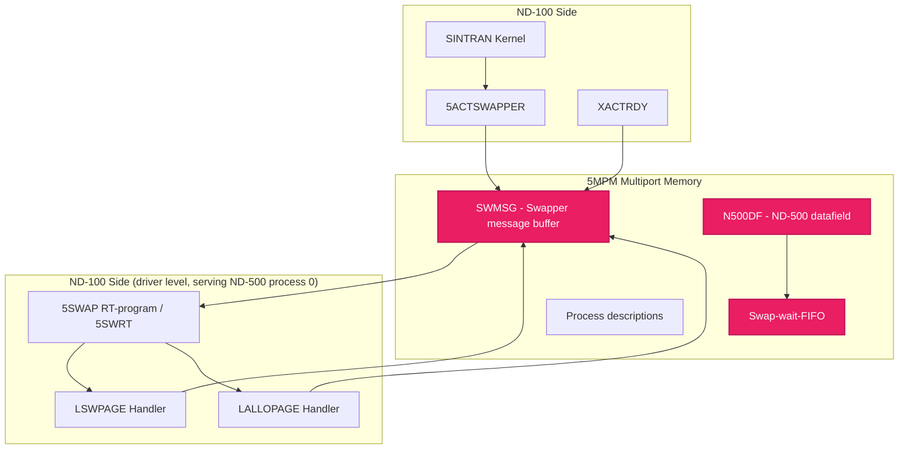

### 7.2 Key 5MPM Addresses

> **Source:** Values verified from SINTRAN L07 symbol files (../NPL-SOURCE/SYMBOLS/L07/SYMBOL-2-LIST.SYMB.TXT)

| Symbol | Octal Value | Purpose |
|--------|:-----------:|---------|
| SWMSG | 110054 | Swapper message buffer (request/response) |
| N500DF.X500DF | - | ND-500 system datafield base |
| X5SWF | - | Swap-wait-FIFO read pointer |
| X5SWT | - | Swap-wait-FIFO write pointer |
| X5MXF | - | FIFO maximum size |
| X5SWB | - | FIFO base address |

---

## 8. Complete Swapper Lifecycle

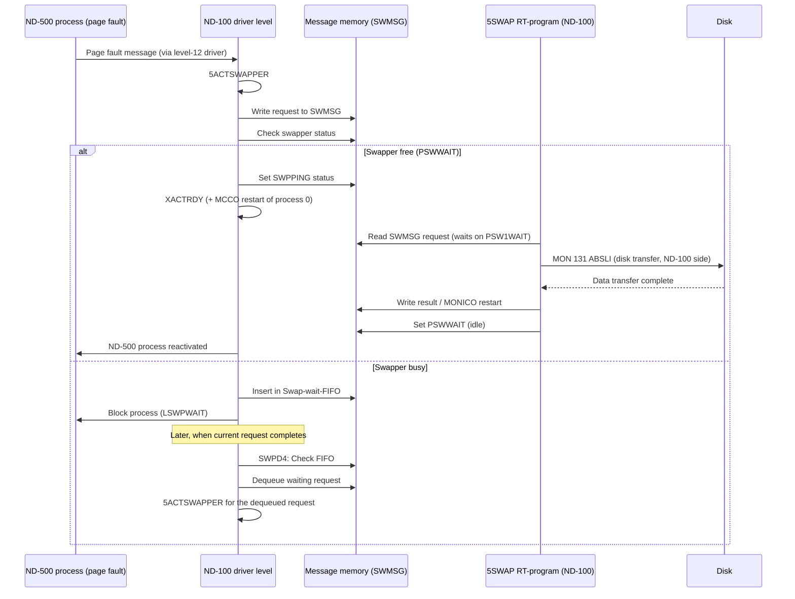

---

## 9. Key Insights for Emulator Developers

### 9.1 The Swapper is NOT Polling

The swapper is **event-driven**:

1. **Process requests service** -> 5ACTSWAPPER called (on the ND-100)
2. **XACTRDY evaluates priority** -> selects highest-priority work
3. **The ND-500 is (re)activated** -> and the 5SWAP RT-program (ND-100) is
   scheduled to perform the disk work (5SWRT waits on PSW1WAIT, then MON 131)
4. **Completion triggers next** -> SWPD4 checks the swap-wait FIFO

### 9.2 Critical Code Paths to Emulate

| Path | Source Lines | Purpose |
|------|--------------|---------|
| 5ACTSWAPPER | 2851-2908 | Request entry point |
| XACTRDY | 2970-3040 | Priority selection |
| LOWACT500 | 245, 251, 459 | Hardware activation |
| SWPD4 | 1031-1066 | FIFO processing |
| LSWPAGE | 1070-1114 | Disk I/O |
| LALLOPAGE | 1170-1188 | Page allocation |

### 9.3 State Transitions to Track

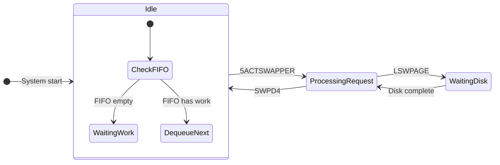

---

## 10. Related Documents

- [ND500-BUS-INTERFACE-REFERENCE.md](ND500-BUS-INTERFACE-REFERENCE.md) - authoritative bus-interface spec
- [ND500-SWAPPER-LOADING-MECHANISM.md](ND500-SWAPPER-LOADING-MECHANISM.md) - how the swapper is loaded (verified)
- [ND500-IF-USAGE-DEEP-ANALYSIS.md](ND500-IF-USAGE-DEEP-ANALYSIS.md) - IOX commands and 500HIST polling
- [MP-P2-N500.md](MP-P2-N500.md) - Main driver module analysis
- [../OS/15-DISK-IO-SUBSYSTEM.md](../OS/15-DISK-IO-SUBSYSTEM.md) - Disk I/O and queue pools
- [../OS/17-SCHEDULER-AND-PRIORITIES.md](../OS/17-SCHEDULER-AND-PRIORITIES.md) - Task scheduling

---

## 11. Verification Checklist

- [x] Swapper purpose documented (segment loading, page swapping)
- [x] State machine documented (LSWPWAIT, LSWPPING, LACTIVE)
- [x] 5ACTSWAPPER flow documented with Mermaid diagram
- [x] FIFO queue processing (SWPD4) documented
- [x] Work triggering mechanisms documented (XACTRDY, LOWACT500)
- [x] Disk I/O path (LSWPAGE) documented
- [x] Page allocation path (LALLOPAGE) documented
- [x] 5MPM communication structure documented
- [x] Complete lifecycle sequence diagram included
- [x] No speculation presented as fact

---

**Document Version**: 2.0 (corrected execution side: 5SWAP runs on the ND-100)
**Last Updated**: 2026-07-08
**Source**: MP-P2-N500.NPL (lines 1031-1188, 2851-2908, 2970-3040), RP-P2-N500.NPL (lines 16-58)

---

## 12. ND-100 -> ND-500 swapper message routing (SWMSG -> 0x240B8)

This section carves the ND-100 side of the swapper request message and closes it against
the ND-500-side proof in
[swapper/swapper-k01-deep-analysis.md](swapper/swapper-k01-deep-analysis.md) (sections 3, 4.2,
5) and [swapper/swapper-k01.dseg.md](swapper/swapper-k01.dseg.md) (0x240B0-0x240BC message
control area).

Provenance rule: the NPL sources (`SINTRAN/NPL-SOURCE/NPL/MP-P2-N500.NPL`, `RP-P2-N500.NPL`)
are a DIFFERENT REVISION than the L07 bytes the swapper carve is taken from. NPL is treated
here as authoritative LOGIC and FIELD-NAMES; the byte-level offsets are the L07 truth taken
from `SINTRAN/NPL-SOURCE/SYMBOLS/L07/N500-SYMBOLS.SYMB.TXT` (assembled symbol table, values
octal, names truncated to 5 characters). Labels below: PROVEN (read from carved bytes / a
symbol-table value / an NPL statement), INFERRED, OPEN.

### 12.1 SWMSG field layout (PROVEN offsets, L07 symbol table)

All values octal. Offsets are relative to the SWMSG base. SWMSG carries two regions: a low
"mic message" region (the words the ND-500 microcode MON mechanism exchanges) and a high
swapper-administration region. Symbol names in the L07 table are 5-char truncations of the
NPL names.

| Field (NPL) | L07 sym | Offset (oct) | Region | Written by / read by | Cite (L07 syms) |
|---|---|---|---|---|---|
| MICFU (MICFUNC) | MICFU | 000006 | mic msg | 5ACTSWAPPER writes 3MONCO | line 5266 |
| N500A | N500A | 000007 | mic msg | disk/param path | line 5745 |
| NUMPA | NUMPA | 000012 | mic msg | 5ACTSWAPPER writes 6 | line 5744 |
| FUNCV | FUNCV | 000013 | mic msg | 5ACTSWAPPER writes 0 | line 2127 |
| TRAPN | TRAPN | 000016 | mic msg | trap number (fault path) | line 744 |
| SWPFU (SWAP FUNCTION) | SWPFU | 000101 | admin | 5ACTSWAPPER writes SWACTIVE; SWPDECODER reads | line 3594 |
| RETP2 | RETP2 | 000102 | admin | return-value slot | line 925 |
| SWPST (SWAP STATUS/REASON) | SWPST | 000103 | admin | 5ACTSWAPPER writes swap-function/reason | line 3480 |
| HSWPI (-> SWPINFO ptr) | HSWPI | 000104 | admin | 5ACTSWAPPER writes MSGTOSW address | line 6463 |
| SWPIN | SWPIN | 000105 | admin | cleared on completion | line 4985 |
| SPFLAG | SPFLA | 000143 | admin | error/flag word | line 4126 |
| XADPR | XADPR | 000144 | admin | proc-descr address | line 6717 |

(SWFMAX/SWFMA = 000006, line 4127; SWFUN = 000007, line 4986 - these are the MSGTOSW-relative
"swap function" offset and the SWPDECODER upper bound, see 12.3-12.4.)

### 12.2 What 5ACTSWAPPER packs (PROVEN from NPL logic)

`SINTRAN/NPL-SOURCE/NPL/MP-P2-N500.NPL`, routine `5ACTSWAPPER` at NPL line 2857 (octal addr
144762):

- line 2866 `AD:=CMSGTOSW; *AAX HSWPI; STDTX`      -> SWMSG.HSWPI(104) := address of MSGTOSW (the SWPINFO pointer)
- line 2867 `SWACTIVE; *AAX SWPFU-HSWPI; STATX`    -> SWMSG.SWPFU(101) := SWACTIVE  (a state marker, NOT the function code)
- lines 2874-2882: X:=MSGTOSW; read MSGTOSW.MICFUNC(6); `IF 3SWMESS=D` then read MSGTOSW.SWFUN(7), else read MSGTOSW.TRAPN(16) (fault path)
- line 2883 `X:=SWMSG; *AAX SWPST; STATX`          -> SWMSG.SWPST(103) := A   (comment: "Save reason for activating swapper"); A = MSGTOSW.SWFUN for a message activation, or the trap number for a fault activation
- line 2884 `A:=6; *AAX NUMPA-SWPST; STATX`        -> SWMSG.NUMPA(12) := 6
- line 2885 `A:=0=:D; *AAX FUNCV-NUMPA; STDTX`     -> SWMSG.FUNCV(13) := 0
- line 2887 `3MONCO; *MICFU@3 STATX`               -> SWMSG.MICFU(6)  := 3MONCO

So the ND-100 stores the "why the swapper was activated" value in **SWPST**, not SWPFU.

### 12.3 SWPFU is the OTHER direction (PROVEN) - the leading candidate is REFUTED

`SWPDECODER` (`MP-P2-N500.NPL` line 913, octal addr 135443) reads SWMSG.SWPFU as the
dispatch index for swapper -> ND-100 paging requests:

- line 914 `T:=5MBBANK; *AAX SWPFU; LDATX  % Swap-function`
- line 915 `IF A >> SWFMAX GO FAR ESWPFATAL`   (SWFMAX/SWFMA = 6)
- lines 917-919 `A GOSW` into a 7-entry table: ESWPFATAL(0), LNEWSWAP(1), LSWPAGE(2), LPRSUSPEND(3), LALLOPAGE(4), LDATREADY(5), LCLTSB(6)

This is the swapper-issues / ND-100-serves direction and matches the ND-500 side exactly: the
swapper's 15 `MON 377B` (N5SWAP) call sites carry selector VALUES 1,2,4,5,6 plus SWPFA=0o2047
(a code far above SWFMAX -> falls to ESWPFATAL via the bound check) - see
[swapper/swapper-k01-deep-analysis.md](swapper/swapper-k01-deep-analysis.md) section 3.1.
Therefore **SWPFU is the swapper->ND-100 request code, and is REFUTED as the source of the
swapper's 0x240B8 function code.**

### 12.4 What actually becomes 0x240B8 (PROVEN chain + one INFERRED hop)

ND-500 side, PROVEN from the swapper bytes
(`SINTRAN/ND500/swapper/swapper-k01-pseg.asm`):

- line 10535 `call ...377,$4,$1000225050(=1),$1000440260,$1000440264,b.24` - swapper issues MON 377B sub-function **1** (LNEWSWAP) with 0x240B0 and 0x240B4 as OUT parameters the ND-100 fills
- line 10544 `w1 := $1000440260`  (load [0x240B0])
- line 10545 `w1 =: $1000440270`  (store into [0x240B8])   => **[0x240B8] := [0x240B0]**
- lines 10560-10566 bound check: `w test [0x240B8]` (>= 0) and `w comp2 [0x240B8],$34` (`$34` = 0o34 = 28 decimal) => valid range **0..0o34 (0..28)**
- line 10577 `h riom $1000440264,$1000440274,$1000440074+`  (DMA the message body from ND-100 addr [0x240B4] into buffer [0x240BC])
- lines 10599-10600 `w1 := $1000440270; jumpg $1000460630+`  (dispatch on [0x240B8] via the 29-entry table at 0x26198)

The bound (0..0o34 = 0..28) and the 29-entry table (array descriptor max_index 0x1C = 28, deep-analysis
sec 4.2) are consistent to the byte. The coordinator brief's "0..20" is imprecise; the carved
`w comp2 ...,$34` gives 0..0o34 = 0..28.

**The exact-fit evidence that this code is SWPST (carrying SWFUN):** the ND-100 message-to-swapper
function codes (the `MSW*` family, MSGTOSW.SWFUN values) span exactly 0..0o34 in the L07 symbol
table - 29 distinct codes matching the 29-entry table:

| MSW code (L07 sym) | value (oct) | | MSW code (L07 sym) | value (oct) |
|---|---|---|---|---|
| MSWFI | 000000 | | MSWMC | 000014 |
| MSWUF | 000001 | | MSWSP | 000015 |
| MSWSO | 000002 | | MSWSG | 000016 |
| MSWMI | 000003 | | MSWIS | 000017 |
| MSWMD | 000004 | | MSWRS | 000020 |
| MSWIN | 000005 | | MSWWB | 000023 |
| MSWPO | 000006 | | MSWSW | 000024 |
| MSWST (MSWSTART) | 000007 | | MSWPR | 000033 |
| MSWFO | 000010 | | MSWDO | 000034 |
| MSWIP | 000011 | | | |
| MSWPF | 000012 | | | |
| MSWME | 000013 | | | |

(L07 symbol lines 5462-5713; names are 5-char truncations, full spellings not recovered except
MSWST=MSWSTART and MSWSW=MSWSWAIT which appear spelled out at `MP-P2-N500.NPL` lines 431 and 464.)
The maximum, **MSWDO = 0o34 = 28**, is exactly the table's max index (0x1C = 28). 5ACTSWAPPER
stores MSGTOSW.SWFUN into SWMSG.SWPST (12.2). The ND-100 tests SWFUN against `MSWSTART`
(`MP-P2-N500.NPL` line 431) and `MSWSWAIT` (line 464), confirming SWFUN takes MSW* values.

### 12.5 Verdict

- **SWPFU -> 0x240B8: REFUTED (PROVEN).** SWPFU is the swapper->ND-100 request code decoded by
  SWPDECODER (bound SWFMAX=6, 7-entry table). It is not the ND-100->swapper function code.
- **SWPST -> 0x240B8: the answer, INFERRED (strong / structurally near-proven).** SWMSG.SWPST
  (offset 0o103) holds the ND-100->swapper "reason/function" = MSGTOSW.SWFUN (an MSW* code 0..0o34)
  for message activations, or a trap number for fault activations. The swapper receives it as the
  OUT parameter of MON 377B sub-function 1 (LNEWSWAP), stores it at 0x240B0, copies it to 0x240B8
  (pseg lines 10544-10545), bound-checks 0..0o34, and jumpg-dispatches. The 29-entry table range
  0..0o34 = 0..28 matches the MSW* code range 0..MSWDO(0o34) exactly.

- **OPEN (what would close it to the byte):** the single ND-100 instruction that copies SWPST
  (or the SWFUN it holds) into the MON 377B sub-function-1 OUT parameter that the swapper stores
  at 0x240B0 is not located in these files, and the NPL revision differs from the L07 bytes.
  Settling experiments: (a) trace a live 5ACTSWAPPER -> swapper LNEWSWAP round trip and observe
  which SWMSG word appears at ND-500 [0x240B0]/[0x240B8]; (b) carve the L07 ND-100 LNEWSWAP
  handler (MP-P2-N500 `LNEWSWAP`, NPL line 933) and find the OUT-parameter write; (c) run each
  MSW* activation and record which 0x26198 handler index the swapper reaches.

### 12.6 Function-code map (0..0o34) - as far as the NPL names them

The MSW* codes above ARE the swapper's 0..28 dispatch namespace. Full symbolic spellings beyond
MSWSTART(0o7) and MSWSWAIT(0o24) are NOT recovered from the available files (the L07 table
truncates to 5 chars and no definition block with comments was located). Named/known so far:
MSWFI=0, MSWSTART(MSWST)=0o7, MSWPFAULT(MSWPF)=0o12 (used at `MP-P2-N500.NPL` line 877 as
`MSWPFAULT SHZ 10`), MSWSWAIT(MSWSW)=0o24, MSWDO=0o34 (max). The remaining MSW* codes are
listed with values above; their full names and per-handler semantics are OPEN.

**Section source:** `SINTRAN/NPL-SOURCE/NPL/MP-P2-N500.NPL` (5ACTSWAPPER 2857-2907, SWPDECODER
913-919, lines 431/464/877), `SINTRAN/NPL-SOURCE/SYMBOLS/L07/N500-SYMBOLS.SYMB.TXT` (offset and
MSW* value symbols), `SINTRAN/ND500/swapper/swapper-k01-pseg.asm` (pseg 10535/10544-10545/
10560-10566/10577/10599-10600), and the ND-500-side proof in
[swapper/swapper-k01-deep-analysis.md](swapper/swapper-k01-deep-analysis.md).
