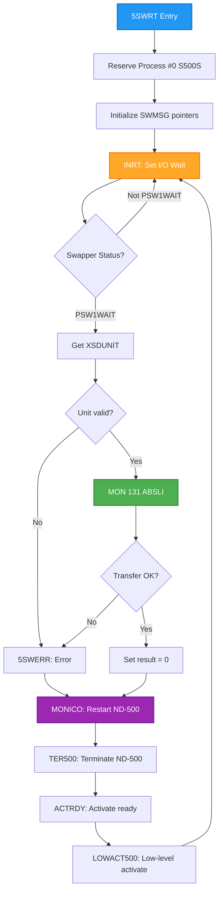
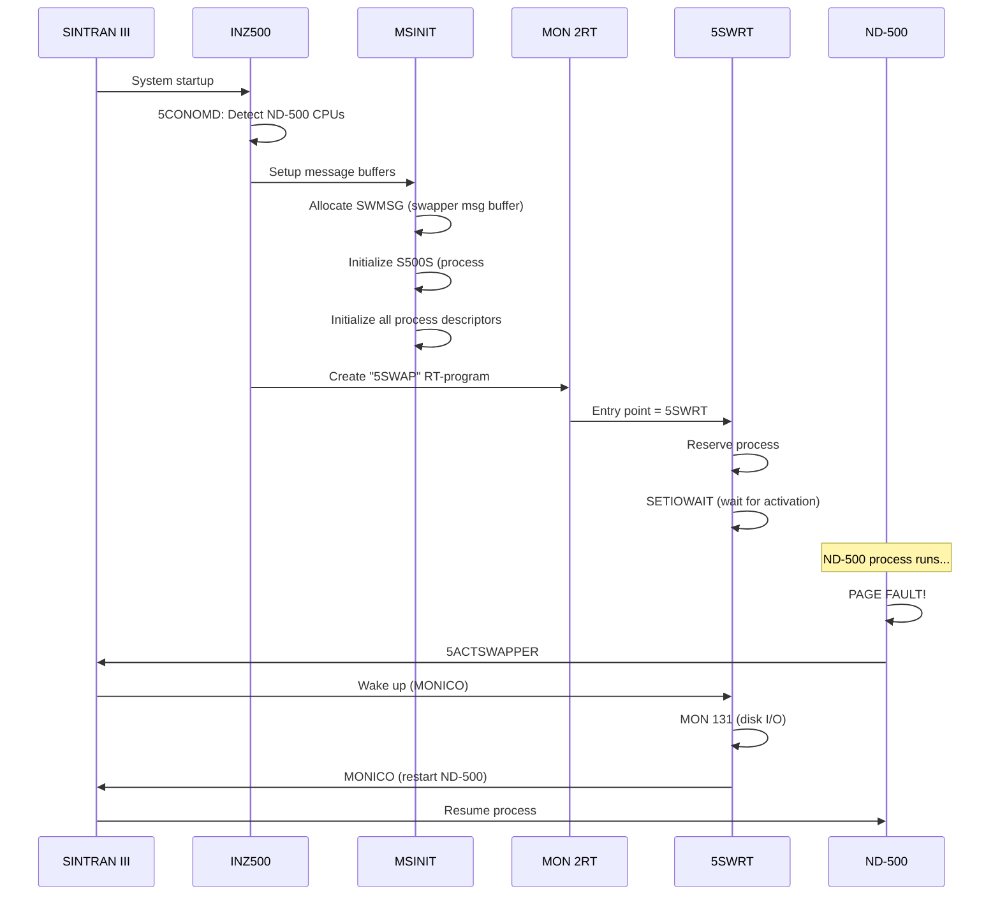

# ND-500 Swapper Loading Mechanism

**Complete Analysis of How the Swapper is Loaded and Initialized for ND-500 Systems**

---

## Overview

The ND-500 swapper is **NOT** code that runs on the ND-500 processor. Instead, it is an **ND-100 RT-program** named "5SWAP" that handles page swapping for ND-500 processes. The swapper communicates with ND-500 via shared multiport memory (5MPM).

This document traces the complete loading and initialization sequence from SINTRAN III NPL source code.

---

## Key Insight: Swapper Architecture

```
┌─────────────────────────────────────────────────────────────────────────────┐
│                        ND-500 Swapper Architecture                          │
├─────────────────────────────────────────────────────────────────────────────┤
│                                                                             │
│  ND-100 Side                            ND-500 Side                         │
│  ────────────                           ───────────                         │
│                                                                             │
│  ┌──────────────────┐                   ┌──────────────────┐               │
│  │ RT-Program       │                   │ User Process     │               │
│  │ "5SWAP"          │◄──────────────────┤ (Page Fault)     │               │
│  │ (5SWRT entry)    │     5MPM          │                  │               │
│  └────────┬─────────┘   Message         └──────────────────┘               │
│           │             Buffer                   │                          │
│           │                                      │ TRAP                     │
│           ▼                                      ▼                          │
│  ┌──────────────────┐                   ┌──────────────────┐               │
│  │ SINTRAN III      │                   │ ND-500 Microcode │               │
│  │ Monitor Calls    │                   │ (Sets MICFU=3)   │               │
│  │ (MON 131 ABSLI)  │                   │                  │               │
│  └──────────────────┘                   └──────────────────┘               │
│                                                                             │
└─────────────────────────────────────────────────────────────────────────────┘
```

**The swapper runs entirely on the ND-100**, using SINTRAN III monitor calls to perform disk I/O for the ND-500 processes.

---

## 1. System Initialization Sequence

### 1.1 INZ500 - Main ND-500 System Initialization

**Source**: `5P-P2-MON60.NPL` lines 616-680

```npl
INZ500:
    A:=L=:"INZ5LREG"
    MLEV; *MST PIE
    IF 5MSINIT NBIT 5CHALIVE THEN
       CALL 5CONOMD                            % Detect ND-500 CPUs
       5MSINIT BONE 5CHALIVE=:5MSINIT
    FI
    IF N5CPU=0 THEN ENOCPU; GO FAR INZRET FI   % No ND-500 CPUs found
    CALL CHMEMDEF; GO FAR INZRET
    IF 5MSINIT BIT 5ALBUF GO FAR INZ2

    % ... allocate various buffers ...

INZ1:
    5MSINIT BONE 5ALBUF=:5MSINIT

INZ2:
    IF 5MSINIT NBIT 5INBUF THEN
       CALL MSINIT; 5MSINIT BONE 5INBUF=:5MSINIT  % SETUP MESSAGE BUFFERS
       "S5CPUDF"=:NCCPUDF
    FI
    IF 5MSINIT NBIT 5RTSTART THEN
       CALL IN5FUDMA                           % Initialize Fast-UDMA option
       "A5PIT"=:D; CALL DALTON
       "5SWAP"=:INZRTP; A:="INZPRT"; *MON 2RT  % <<<< CREATE 5SWAP RT-PROGRAM
       CALL ALTOFF
       5MSINIT BONE 5RTSTART=:5MSINIT
    FI
```

**Key Steps**:
1. **5CONOMD** - Detect ND-500 CPUs connected to system
2. **MSINIT** - Set up message buffers including swapper message buffer (SWMSG)
3. **MON 2RT** - Create the "5SWAP" RT-program (swapper)

---

### 1.2 MSINIT/XMSINIT - Message Buffer Initialization

**Source**: `MP-P2-N500.NPL` (via CC-P2-N500.NPL dispatch) lines 40533-40667

```npl
XMSINIT: *1BANK; COPY SD DA; STA I (SVDRE; 2BANK
    5FPMAILBOX=:D:=0; AD SH 12; A=:5MBBANK     % Memory bank for messages

    % ... initialize CPU datafields ...

MSIN0:
    A:=55MSNEGSIZE+D=:SWMSG                    % <<<< SWMSG = Swapper Message Buffer
    T:=5MBBANK; A=:X:=0 BONE 5SYSRES
    *AAX 5MSFL; STATX; AAX -5MSFL
    5SWPROC=:MSINPROCNO; X:="S500S"            % <<<< S500S = Swapper Process Descriptor
    FOR MSINPROCNO DO WHILE MSINPROCNO<<=MX5PROCS
       X=:MSPRDESCR
       % ... initialize each process message buffer ...
       A:=D+55MSNEGSIZE=:X.MESSBUFF            % Message buffer address into process descriptor
       T:=5MBBANK; X:=:A; *AAX XADPR; STATX
       MSINPROCNO; *SENDE@3 STATX
       X:=MSPRDESCR+5PRDSIZE; 55MESSIZE; D+A
    OD
```

**Key Variables**:
| Variable | Purpose |
|----------|---------|
| `SWMSG` | Swapper message buffer address in 5MPM |
| `S500S` | Swapper process descriptor (process #0) |
| `5SWPROC` | Swapper process number |
| `5MBBANK` | Memory bank for 5MPM buffers |
| `55MESSIZE` | Size of each message buffer |

---

### 1.3 Creating the 5SWAP RT-Program

**Source**: `5P-P2-MON60.NPL` line 674

```npl
"5SWAP"=:INZRTP; A:="INZPRT"; *MON 2RT
```

This executes Monitor Call 2 (RT - Create RT-Program) with:
- **Name**: "5SWAP"
- **Entry point**: The 5SWRT routine

The RT-program is created as a system RT-program with special privileges.

---

## 2. The 5SWRT RT-Program (Swapper Code)

**Source**: `RP-P2-N500.NPL` lines 12-58

```npl
%      ( R )    N 5 0 0 - A B S T R A N S   P R O G R A M
%
%      RT-program to read/write page from/to disk to/from memory
%
SUBR 5SWRT
5SWRT: *2BANK; IOF
       "S500S"=:B; X:=RTREF
       CALL BRESERVE; IF A<0 THEN CALL ERRFATAL FI  % RESERVE PROCESS #0
       0=:PSTAT
       X:=SWMSG; T:=5MBBANK; A:="S500S"; *AAX XADPR; STATX  % ADDR OF PROC.DESCR
       A:=SWMSG+"SWPINFO"=:D:=5MBBANK; AD=:DSWMSG           % PHYS.ADDR OF SWPINFO IN SWMSG
       GO INRT; *)FILL

       % - B-reg will be set by actswapper
       DO
          *ION
INRT:     X:="S500S"; CALL FAR SETIOWAIT                % WAIT FOR ACTIVATION
          *IOF
          "S500S".PSTAT BZERO F5BUFF=:X.PSTAT
          X:=SWMSG; CALL RN5STATUS
          IF A><PSW1WAIT THEN
             GO INRT                                      % Not ready, wait again
          FI
          *ION
          IF T:=XSDUNIT=0 THEN A:=-1; GO 5SWERR FI
          "ABSLI"; *MON 131                              % <<<< DISK I/O VIA MON 131
          IF X:="N500DF".SYSINITFLAG BIT B5STOP GO INRT
          IF A>=0 THEN
             T:=0=:A=:D                                   % TRANSFER OK.
          ELSE
5SWERR:      A=:SWEHSTAT
             % ... error handling ...
          FI
          *IOF
          X:=SWMSG; CALL MONICO                          % RESTART SWAPPER (on ND-500)
          % ... continue loop ...
       OD
```

### Swapper Main Loop



---

## 3. Swapper Activation Mechanism

### 3.1 5ACTSWAPPER - Activate the Swapper

**Source**: `MP-P2-N500.NPL` lines 2857-2907

When an ND-500 process needs page swapping (page fault), the `5ACTSWAPPER` routine is called:

```npl
5ACTSWAPPER: A:=L=:"LREG"
    CALL SLOCK; 0/\0                                % Lock semaphore
    X=:D=:MSGTOSW; A:=5MBBANK
    *NNC24,CNVWADR
    AD=:CMSGTOSW
    SWPWAIT; CALL WN5STATUS                         % Mark: waiting for swapper
    X:=SWMSG; CALL RN5STATUS
    IF A=PSWWAIT THEN                               % Swapper free?
       T:=5MBBANK; X:=SWMSG
       AD:=CMSGTOSW; *AAX HSWPI; STDTX
       SWACTIVE; *AAX SWPFU-HSWPI; STATX
       X:="N500DF".X500DF; *AAX X5SWO
       CMSGTOSW; T:=5MBBANK; *STDTX
       X:=MSGTOSW; SWPPING; CALL WN5STATUS          % Mark: using swapper
       T:=5MBBANK; *AAX 5MSFL; LDATX
       % ... set up message for swapper ...
       X:=SWMSG; *AAX SWPST; STATX                  % Save reason for activating
       A:=6; *AAX NUMPA-SWPST; STATX                % Par #2 & #3 will be written
       A:=0=:D; *AAX FUNCV-NUMPA; STDTX
       *AAX KFLIP-FUNCV; STZTX; AAX -KFLIP
       3MONCO; *MICFU@3 STATX
       CALL MCCO                                     % Restart swapper via mon.call
       CALL SUNLOCK
       CALL XACTRDY
       GO OUT
    ELSE
       % Swapper busy - insert in Swap-wait-fifo
       % ...
    FI
OUT:   X:=MSGTOSW; GO LREG
```

### 3.2 5SWACTRT - Start the Swapper RT-Program

**Source**: `MP-P2-N500.NPL` line 45

```npl
5SWACTRT: A:=L=:"LREG"; X:="S500S"; GO ACT5SWAP    % START 5SWAP
```

This is called to restart the swapper RT-program after it completes a page I/O operation.

---

## 4. Data Structures

### 4.1 Swapper Process Descriptor (S500S)

The swapper uses process descriptor #0, located at address `S500S`:

| Offset | Field | Description |
|--------|-------|-------------|
| 0 | PSTAT | Process status flags |
| ... | MESSBUFF | Pointer to message buffer (SWMSG) |
| ... | ... | Other standard process descriptor fields |

**Symbol table entry**: `S500S=115542` (octal)

### 4.2 Swapper Message Buffer (SWMSG)

**Source**: `MP-P2-N500.NPL` line 40578

```npl
A:=55MSNEGSIZE+D=:SWMSG
```

The swapper message buffer is allocated as the first message buffer during MSINIT.

| Offset | Field | Description |
|--------|-------|-------------|
| SWPINFO | Swap info | Page fault information |
| SWPST | Swap status | Reason for activation |
| SWPFU | Swap function | Operation to perform |
| HSWPI | ... | Swap information pointer |

### 4.3 Key Variables

**Source**: `DP-P2-VARIABLES.NPL` lines 116-118

```npl
INTEGER 5SWPROC                    % Swapper process number
INTEGER 5SSEGSIZE                  % Size of Swapper's Segment Table Entry
INTEGER BMMSIZE                    % Size of Swapper's Memory Map Element in bytes
```

---

## 5. Complete Loading Sequence



---

## 6. Why Swapper Runs on ND-100

The swapper runs on the ND-100 because:

1. **Disk I/O Controllers** - Disk controllers are connected to the ND-100 I/O bus, not the ND-500
2. **SINTRAN Ownership** - All disk drivers and file system code are part of SINTRAN on ND-100
3. **Monitor Calls** - The swapper uses MON 131 (ABSLI - absolute disk I/O) which is an ND-100 monitor call
4. **Simplicity** - Only one copy of disk driver code needed (on ND-100)
5. **Coordination** - ND-100 coordinates all ND-500 processes and their memory needs

The ND-500 sends page fault requests via the 5MPM message buffer, and the ND-100 swapper services these requests.

---

## 7. Related Documentation

- [ND500-SWAPPER-ANALYSIS.md](ND500-SWAPPER-ANALYSIS.md) - Swapper event-driven behavior
- [ND500-SCHEDULING-ANALYSIS.md](ND500-SCHEDULING-ANALYSIS.md) - Process scheduling
- [ND500-MONITOR-CALL-MECHANISM.md](ND500-MONITOR-CALL-MECHANISM.md) - Monitor call dispatch
- [../OS/06-MULTIPORT-MEMORY-AND-ND500-COMMUNICATION.md](../OS/06-MULTIPORT-MEMORY-AND-ND500-COMMUNICATION.md) - 5MPM architecture

---

## 8. Source Code References

| File | Lines | Content |
|------|-------|---------|
| `5P-P2-MON60.NPL` | 616-680 | INZ500 initialization |
| `MP-P2-N500.NPL` | 40533-40667 | XMSINIT message buffer setup |
| `MP-P2-N500.NPL` | 2857-2907 | 5ACTSWAPPER routine |
| `MP-P2-N500.NPL` | 45 | 5SWACTRT entry point |
| `RP-P2-N500.NPL` | 12-58 | 5SWRT RT-program |
| `DP-P2-VARIABLES.NPL` | 116-118 | Swapper variables |

---

## 9. Summary

**The ND-500 swapper is loaded as follows:**

1. **INZ500** is called during SINTRAN system startup
2. **MSINIT** allocates the swapper message buffer (SWMSG) and process descriptor (S500S)
3. **MON 2RT** creates the "5SWAP" RT-program with entry point at 5SWRT
4. **5SWRT** runs on ND-100, waiting for activation
5. When ND-500 process page faults, **5ACTSWAPPER** wakes the swapper
6. Swapper performs disk I/O via **MON 131** (ABSLI)
7. Swapper restarts ND-500 via **MONICO**

**Critical Point**: The swapper is NOT loaded into ND-500 memory. It runs entirely on the ND-100 as an RT-program, communicating with ND-500 via shared multiport memory (5MPM).

---

## 10. Verification and Assumptions

### Verified from Source Code

The following facts are **directly verified** from NPL source code:

| Claim | Source | Line(s) |
|-------|--------|---------|
| 5SWAP RT-program created via MON 2RT | 5P-P2-MON60.NPL | 674 |
| 5SWRT is the swapper entry point | RP-P2-N500.NPL | 16-17 |
| SWMSG is swapper message buffer | MP-P2-N500.NPL | 40578 |
| S500S is process descriptor #0 | MP-P2-N500.NPL | 40581 |
| 5SWPROC is swapper process number | DP-P2-VARIABLES.NPL | 116 |
| Swapper uses MON 131 (ABSLI) for disk I/O | RP-P2-N500.NPL | 37 |
| 5ACTSWAPPER activates the swapper | MP-P2-N500.NPL | 2857 |
| MSINIT initializes message buffers | 5P-P2-MON60.NPL | 668 |
| INZ500 is called during system init | 5P-P2-MON60.NPL | 616 |
| Swapper waits via SETIOWAIT | RP-P2-N500.NPL | 28 |
| MONICO restarts ND-500 process | RP-P2-N500.NPL | 51 |

### Interpretations (Low Uncertainty)

The following are **interpretations** based on code patterns but not explicitly stated in comments:

1. **"Swapper runs on ND-100"** - Interpretation based on:
   - 5SWRT uses ND-100 monitor calls (MON 131)
   - Code is in RP-P2-N500.NPL which contains ND-100 RT-programs
   - Uses `*2BANK` (ND-100 instruction)
   - Comments say "N500-ABSTRANS PROGRAM" but it performs disk I/O via ND-100

2. **"Page fault triggers swapper"** - Interpretation based on:
   - Comments mention "trap (pagefault)" at line 2879
   - MICFU field set to 3 (3SWMESS or trap number)
   - Source comment at line 2876: "% Message to swapper?"

3. **"Process #0 is special swapper process"** - Interpretation based on:
   - `5SWPROC=:MSINPROCNO; X:="S500S"` suggests process #0 = swapper
   - Consistent use of S500S for swapper operations

### Assumptions (Higher Uncertainty)

1. **MON 2RT parameter format** - Assumed that INZRTP contains "5SWAP" name and INZPRT contains entry point address. The exact MON 2RT parameter format is not fully documented in this code.

2. **Exact message buffer layout** - The exact byte-level layout of SWMSG fields (SWPINFO, SWPST, SWPFU, HSWPI) is inferred from field offsets in AAX instructions, not from explicit structure definitions.

3. **Diagram accuracy** - The sequence diagram shows logical flow; exact timing and intermediate steps may differ.

### What This Document Does NOT Cover

- **Swapper algorithm details** - How the swapper decides which pages to swap
- **Swap file management** - How swap files are created and managed
- **Page table management** - How ND-500 page tables are updated
- **Memory allocation** - How physical memory is allocated for ND-500 processes

---

**Document Version**: 1.0
**Created**: 2026-01-29
**Source**: SINTRAN III NPL Source Code Analysis
