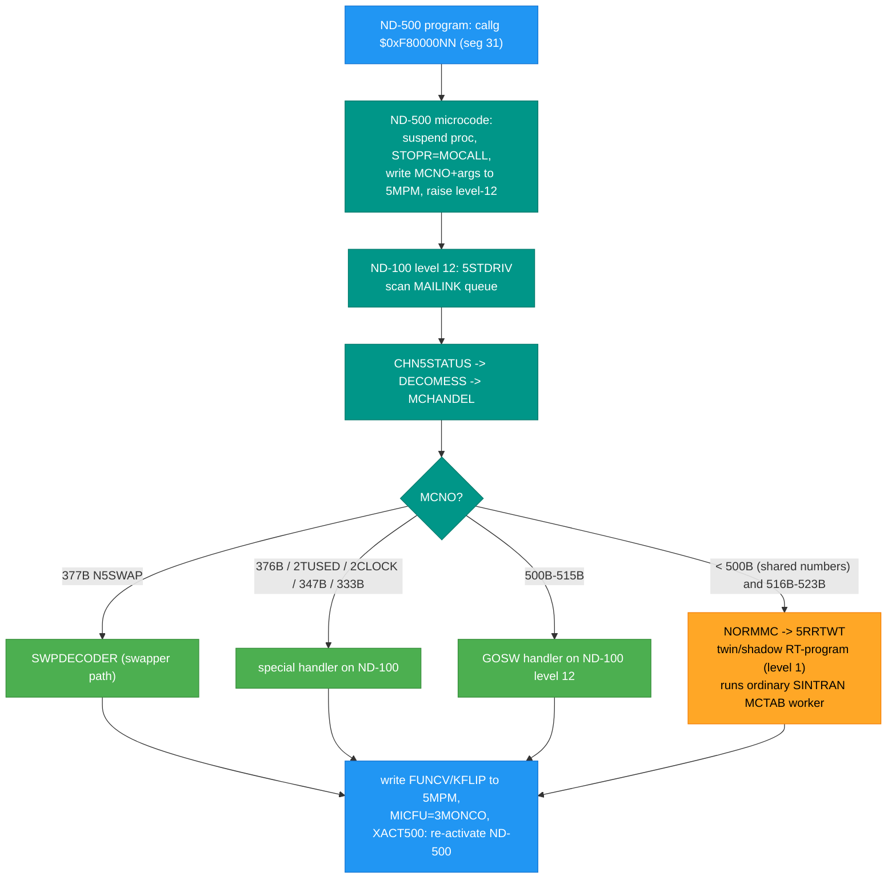

# ND-500 Monitor (MON) Calls -> SINTRAN III on ND-100: Complete Mapping

**Full path:** `SINTRAN/ND500/ND500-TO-SINTRAN-MON-MAPPING.md`

This document answers, end to end and with per-claim evidence, how a MON call
issued by an ND-500 program reaches SINTRAN III on the ND-100 and gets serviced.
It consolidates the mechanism, the dispatch table(s), the shared-vs-ND-500-specific
number analysis, the definitive ">255" explanation (with the real ND-100 MON-field
width), and argument marshalling.

Every claim is tagged **[VERIFIED]** (byte/source-proven at the cited file:line) or
**[INFERRED]**. Companion docs (not superseded): `ND500-MONITOR-CALL-MECHANISM.md`,
`ND500-MONITOR-CALL-PARAMETER-PASSING.md`, `MON/ND500-MON-CALL-ROUTING-MAP.md`.
This doc adds the pieces those lacked: the `callg` segment-31 gate, the ND-100 MON
instruction bit-width, and the shared-number space analysis.

---

## 0. TL;DR (the five questions)

1. **Mechanism:** ND-500 program does `callg $0xF80000NN` into segment 31 (the
   OS/monitor gate). NN(hex) is the MON number as a plain integer. The ND-500
   microcode suspends the process, writes a message into 5MPM shared memory with
   `MCNO` = that number, and raises a level-12 interrupt to the ND-100. The ND-100
   driver `MP-P2-N500` (`5STDRIV` -> `CHN5STATUS` -> `DECOMESS` -> `MCHANDEL`)
   software-decodes `MCNO` and either services it on level 12 or forwards it to a
   level-1 twin/shadow RT-program that runs the ordinary SINTRAN worker. Result is
   written back to 5MPM and the ND-500 process is re-activated.
2. **Dispatch table:** yes - `MCHANDEL`'s `GOSW` in `MP-P2-N500.NPL:1385` covers the
   500B-523B special range. Numbers BELOW 500B are NOT in a table; they fall through
   `NORMMC -> 5RRTWT` to the twin process and are dispatched by SINTRAN's ordinary
   `MCTAB` on the ND-100 (same table native ND-100 MON calls use).
3. **Same numbers?** Below 500B: YES, one shared number space - ND-500 MON n is
   serviced by the SAME ND-100 worker as native ND-100 MON n (50B OPEN, 117B RFILE,
   120B WFILE, 256B DEABF, 162B OUTST, 327B file-system function). The 500B-523B range
   is ND-500-specific (no native ND-100 equivalent).
4. **>255:** The ND-100 native `MON` INSTRUCTION has an 8-bit number field (0-377B =
   0-255). The ND-500 path does NOT use that instruction. `MCNO` is a full 16-bit
   message field decoded in SOFTWARE by `MCHANDEL`, so it is not bound by the 8-bit
   limit; 500B-523B (320-339 dec) dispatch fine. The boundary is exact: 377B=255=0xFF
   is the last native MON; 400B=256=0x100 is the first number only reachable via the
   ND-500 software-decode path.
5. **Marshalling:** `callg` passes arguments by reference (frame offsets / addresses),
   exactly like an ordinary ND-500 domain call (ND-05.009.4 section 4.2.5.2). The
   ND-500 microcode copies the argument words into the 5MPM message parameter slots
   `5AP1..5AP4` (offsets 100B..107B); the ND-100 worker reads them from there and
   writes results back into `5DP1..5DP4`/`FUNCV`, gated by the `NUMPA` write-back mask.

---

## 1. The mechanism, step by step

### 1.1 The segment-31 monitor gate (ND-500 side)

**[VERIFIED]** By ND-500 architecture, monitor calls are ordinary domain calls to a
routine on an indirect segment; "by convention segment number 31 (octal 37) is used
for interfacing to the operating system" and "monitor calls look exactly like regular
routine calls, and parameters are transferred through the same mechanisms."
(`Reference-Manuals/ND-60.136.04A ND-500 Loader Monitor.md:1157`; ND-05.009.4 section
4.2.5.2 at `Reference-Manuals/ND-05.009.4 EN ND-500 Reference Manual.md:1526-1530`.)

**[VERIFIED]** The compiled form is `callg $0xF80000NN`. The top byte 0xF8 selects
segment 31 (`0xF8000000 >> 27 = 31`); the low bits are the routine offset. For the
SINTRAN monitor gate the offset IS the MON number directly (not scaled): the nd500x
emulator decodes it as `uint32_t mon_number = offset;`
(`~/repos/nd500x/src/cpu/nd500_indirect.c:386`), and its worked example is
`CALLG 0xF8000180` = segment 31, offset 0x180 = 384 = MON 600 octal
(`nd500_indirect.c:291, 386-391`).

**[VERIFIED]** NN(hex) equals the MON number as a plain integer, independent of the
base it is written in (octal in SINTRAN docs, hex in the gate). Confirmed by
arithmetic against the known examples:

| MON (octal) | name        | integer | gate offset |
|:-----------:|-------------|:-------:|:-----------:|
| 256B        | DEABF       | 174     | 0xAE        |
| 504B        | DVOUTS      | 324     | 0x144       |
| 513B        | B5XMSG      | 331     | 0x14B       |
| 500B        | STAPROC     | 320     | 0x140       |
| 523B        | (patch)     | 339     | 0x153       |

(Octal-to-integer conversions computed; DEABF/DVOUTS/B5XMSG names per
`MON/ND500-MON-CALL-ROUTING-MAP.md` and `tools/.../re/MON-CALL-INDEX.md:201`.)

### 1.2 ND-500 microcode: suspend + post message

**[VERIFIED]** "When a monitor call is executed, the ND-500 process is suspended and a
twin process in the ND-100 is started to execute the call on behalf of the ND-500
process." (`ND-60.136.04A:1988-1992`.) The microcode stops the CPU, sets STOPREASON =
MOCALL(1) (or 5FMOCALL(3) for file transfer), writes the parameters and `MCNO` into the
5MPM message buffer, and raises a level-12 interrupt to the ND-100
(`SINTRAN/ND500/ND500-MONITOR-CALL-MECHANISM.md:52-81, 211-245`; stop-reason symbols
MOCAL=1/TRAPC=2/5FMOC=3 verified from `SYMBOLS/L07/SYMBOL-1-LIST.SYMB.TXT`).

### 1.3 ND-100 driver: 5STDRIV -> MCHANDEL

**[VERIFIED]** Level 12 enters `5STDRIV` (`MP-P2-N500.NPL:659`), which scans the
`MAILINK` execution queue, calls `CHN5STATUS` (`:730`) to check message status, and on
an ANSWER calls `DECOMESS` (`:803`). `DECOMESS` reads `MICFU` and `STOPR` and, for a
monitor-call stop reason, calls `MCHANDEL` (dispatch site `MP-P2-N500.NPL:1286`).
(Chain documented and line-cited in `ND500-MONITOR-CALL-MECHANISM.md:118-136, 168-224`
and `ND500-MONITOR-CALL-PARAMETER-PASSING.md:312-323`.)

### 1.4 MCHANDEL dispatch

**[VERIFIED]** `MCHANDEL` reads `MCNO`, saves it in `SMCNO`, and routes
(`MP-P2-N500.NPL`, per `MON/ND500-MON-CALL-ROUTING-MAP.md:56-67`):

| Test | MON (octal) | Action | Line |
|------|:-----------:|--------|------|
| `A = 2TUSED` | time-used | serviced on level 12 | 1303-1309 |
| `A = 2CLOCK` | clock | serviced on level 12 | 1310-1344 |
| `A = N5SWAP` | 377 | `SWPDECODER` (swapper) | 1346-1357 |
| `A = CERN` | 376 | site-special `CERNCODE` on ND-100 | 1358-1370 |
| `A = 333` (UDMA) | 333 | `N5FUD` fast path, then `NORMMC` | 1375-1378 |
| `A = 347` | 347 | `GO 5SERVER` (nucleus) | 1381 |
| `L12MIN <= A <= L12MAX` | 500-523 | level-12 `GOSW` (see 2.1) | 1382-1392 |
| otherwise | < 500 | `GO NORMMC` -> forward to twin | 1393 |

Constants `L12MIN=500, L12MAX=523, CERN=376, N5SWAP=377`
(`MP-P2-N500.NPL:1269-1273`).

### 1.5 Return path

**[VERIFIED]** The worker writes `FUNCV` (return value) and `KFLIP` (error flag) into
the message, sets `MICFU=3MONCO` and status `MSGN500`, marks the process 5ACTIVE, and
`XACT500`/`XACTRDY` re-activate the ND-500 process via IOX `LMAR5`/`LCON5=5`
(`CC-P2-N500.NPL:359-372`, MONICO; `MP-P2-N500.NPL:3084-3091`, ACT50 - both cited in
`ND500-MONITOR-CALL-PARAMETER-PASSING.md:228-241, 355-369`).

### 1.6 Full-chain diagram



---

## 2. The dispatch tables

### 2.1 Level-12 GOSW table - MON 500B-523B (ND-500-specific)

**[VERIFIED]** `MP-P2-N500.NPL:1385`, index = `MCNO - 500B`:

```
5CMNO-L12MIN GOSW
   STAPROC,   NSTOPROC,  SWITPROC,  NINSTR,
   NOUTSTR,   GERRC,     5SIBMO,    SPRIO,
   SWMC,      DVIO,      A5XMSG,    B5XMSG,
   M5TMOUT,   5MTRANS,   M516,      M517,
   M520,      M521,      M522,      M523;
```

| MON (oct) | handler | role |
|:---------:|---------|------|
| 500 | STAPROC | start ND-500 process |
| 501 | NSTOPROC | stop process |
| 502 | SWITPROC | switch process |
| 503 | NINSTR | device input string (DVINST) |
| 504 | NOUTSTR | device output string (DVOUTS) |
| 505 | GERRC | get error code |
| 506 | 5SIBMO | SIBAS monitor call |
| 507 | SPRIO | set priority |
| 510 | SWMC | switch context / swapper MON |
| 511 | DVIO | direct virtual device I/O |
| 512 | A5XMSG | XMSG "A" function |
| 513 | B5XMSG | XMSG "B" function |
| 514 | M5TMOUT | timeout |
| 515 | 5MTRANS | memory transfer |
| 516-523 | M516..M523 | patch stubs (`GO NORMMC; 0/\0`), `MP-P2-N500.NPL:1397-1402` |

**[VERIFIED]** The GOSW handlers (STAPROC, DVIO, A5XMSG, ...) are ND-100 subroutines
declared in this module (`MP-P2-N500.NPL:1246-1247`); MON 500-515 are serviced on the
ND-100 level 12, not re-dispatched to ND-500 code
(`MON/ND500-MON-CALL-ROUTING-MAP.md:114-117`).

### 2.2 Numbers below 500B - NO local table, forward to SINTRAN MCTAB

**[VERIFIED]** Everything below 500B that is not one of the special cases in 1.4 hits
`NORMMC` (`MP-P2-N500.NPL:1277-1283, 1393`): the comment is
`% MONITOR CALL SHOULD BE HANDLED BY THE SYSTEM MONITOR.` `5RRTWT`
(`MP-P2-N500.NPL:21-24`) removes the message from the ex-queue and restarts the
ND-100 twin/shadow RT-program, which completes the call on level 1
(`ND500-MONITOR-CALL-PARAMETER-PASSING.md:373-406`).

**[INFERRED, mechanism-consistent]** The twin process then issues the request the same
way a native ND-100 program would, so the actual dispatch is SINTRAN's normal
monitor-call table `MCTAB@005620B` (the byte-verified SINTRAN dispatch model;
`memory: sintran-mon-dispatch-model`, and the per-call workers in
`tools/.../re/MON-CALL-INDEX.md`). There is no separate below-500B table inside
`MP-P2-N500`.

---

## 3. Shared vs ND-500-specific numbers

**[VERIFIED]** "The services provided are the same as in a ND-100 system"
(`ND-60.136.04A:1988`). Below 500B the ND-500 and ND-100 LARGELY use ONE shared MON
number space; the number reaches the same ND-100 worker. This holds for the file-system
family below but is NOT universal - at least MON 45B is a verified reuse (DBRK native vs
GTYPR for ND-500; see the exception table and subsection below). Examples (worker
addresses from `tools/.../re/MON-CALL-INDEX.md`):

| MON (oct) | meaning | ND-500 usable | ND-100 native | shared worker |
|:---------:|---------|:-------------:|:-------------:|---------------|
| 50 | OPEN | yes | yes | same file-system OPEN |
| 117 | RFILE | yes (`ND-60.136.04A:3860`) | yes | same |
| 120 | WFILE | yes | yes | same |
| 162 | OUTST | yes (`:1994`) | yes | same |
| 64 | ERMSG | yes (`:3844`) | yes | same |
| 256 | DEABF (full file name) | yes | yes | `DEABF=111015`, 006-S3FS (`MON-CALL-INDEX.md:201`) |
| 327 | file-system function | yes | yes | `MFFSC=111563`, 006-S3FS (`:240`) |

**Exception - REUSED number [VERIFIED]:**

| MON (oct) | native ND-100 | ND-500 | note |
|:---------:|---------------|--------|------|
| 45 | DBRK define breakpoint (`ND-860228-2-EN:2593`; `BDBRK`, `MON-CALL-INDEX.md:82`) | GTYPR get file/device info (`ND-60.136.04A:5915`; = FSMTY 327B fn4, `ND-60230-5-EN K-version.md:9475`) | Same number, different service per caller set. See the detailed subsection below. |

**ND-500-specific numbers** (no native ND-100 equivalent, serviced by the driver):
500B-523B (section 2.1), plus the special cases 333B (UDMA fast), 347B (nucleus
`5SERVER`), 376B (CERN), 377B (swapper `N5SWAP`).

**The 45B GTYPR-vs-DBRK question - [VERIFIED: a genuine number REUSE].** MON 45B means
DIFFERENT things to the two caller sets, each confirmed by a primary source:

- **Native ND-100 programs: 45B = DBRK** "Define debug breakpoint" - part of the
  debug-breakpoint family (45B DBRK, 46B GBRK, 51B DMAC) in the manual's
  "advised not to use / not documented" internal list
  (`ND-860228-2-EN SINTRAN III Monitor Calls.md:2593`; worker `BDBRK`,
  `MON-CALL-INDEX.md:82`).
- **ND-500 programs: 45B = GTYPR** - tabulated WITH its argument list in the ND-500
  Loader Monitor manual (`ND-60.136.04A:5915`:
  `45B  GTYPR  <unit> <typing> <status> <Sintran III open file number>`), and equated
  to FSMTY (MON 327) function 4 by the K-version release information
  ("`<function = 4>` (same as MON GTYPR (MON 45))", `ND-60230-5-EN ... K-version.md:9475`).
  The FraTor ND-500 tools (convert-dom, file-compare, linker, planc) call gate
  `0xF8000025` with exactly this 4-argument signature - byte-proof that, for an ND-500
  caller, 45B is GTYPR, not DBRK.

**[VERIFIED from the carved SINTRAN mapper] Native 45B = DBRK, and it was NOT deleted in
newer versions.** Reading the real monitor-call table `MCTAB@005620B` (not a symbol
guess): `MCTAB[45B]` = `005665B` = **`BDBRK=002235`**, with the coherent breakpoint family
at the adjacent slots `MCTAB[46B]=BGBRK=002245`, `MCTAB[47B]=BSBRK=002274`
(`tools/.../re/MON-CALL-INDEX.md`, derived from the carved L07 image; `prove-mon.py 45`
cross-check). The `BDBRK/BGBRK/BSBRK` breakpoint family is present in **K03, L07 AND M06**
(`SYMBOL-1-LIST`: K03 `BDBRK=001661`; L07 `BDBRK=002235`; M06 `BDBRK=002024`), so DBRK is
stable across versions - it is NOT a deprecated call that 45B was repurposed from.
Conversely, `GTYPR` does NOT appear in ANY ND-100 SINTRAN symbol table (`SYMBOL-1-LIST` /
`SYMBOL-2-LIST`); it exists only in the ND-500 symbol set (`N500-SYMBOLS`, worker address).

So **45B is a CROSS-MONITOR reuse, not a within-native-table collision and not a version
deletion**: the native SINTRAN monitor-call table (for ND-100 programs) unambiguously has
45B = DBRK on all carved versions, while the ND-500 Monitor's OWN call set (for ND-500
programs, documented in `ND-60.136.04A`) has 45B = GTYPR. Two separate monitor namespaces,
same number. This means the "single shared number space below 500B" rule at the top of
section 3 is NOT universal - the file-system family (50B/117B/120B/256B/327B ...) is shared,
but 45B is serviced differently for ND-500 callers.

**[VERIFIED from the dispatch source] The base MCHANDEL logic sends ND-500 45B to the
native DBRK worker - there is NO GTYPR mapping in the code.** Full decode in `MCHANDEL`
(`MP-P2-N500.NPL:1286-1393`), tests `A` (= MCNO) in this exact order; unmatched -> `NORMMC`:

```
MCHANDEL:                              ; A = MCNO (ND-500 MON number)
  IF A=2TUSED  -> ... GO NXTMSG        ; :1303
  IF A=2CLOCK  -> ... GO NXTMSG        ; :1310
  IF A=N5SWAP  -> ... (swapper)        ; :1346
  IF A=CERN    -> ... (376B)           ; :1358
  N5MPA: JMP *2; JMP *1                ; :1380  runtime PATCH slot (no-op by default)
  IF A=333 AND 5FUDMA><0 -> UDMA fast  ; :1375
  IF A=347 GO 5SERVER                  ; :1381
  IF A>=L12MIN(500) AND A<=L12MAX(523) ; :1382
        -> 5CMNO-500 GOSW {STAPROC..M523}   ; :1385
  GO NORMMC                            ; :1393 "handled by the SYSTEM MONITOR"
NORMMC: ... CALL 5RRTWT; GO NXTMSG     ; :1277 -> ND-100 twin RT-prog (level 1)
                                       ; -> native MON 45 -> MCTAB[45B] = BDBRK (DBRK)
```

45B (=45, below 500) matches none of the special cases -> `GO NORMMC` -> `5RRTWT` -> the
ND-100 twin RT-program re-issues it as an ordinary ND-100 MON 45 -> `MCTAB[45B]` = `BDBRK`.
**So in the s3vs-4 source, an ND-500 MON 45B is serviced as DBRK, not GTYPR.**

**[VERIFIED FROM L07 BYTES] The carved L07 image routes ND-500 45B to NORMMC (native ->
DBRK); it is NOT special-cased and NOT patched to GTYPR.** MCHANDEL's decode is in the PIT
overlay `017-S3SMPIT` / `026-S3IMPIT` (load base 032000B), NOT in `030-S3SM5` (the earlier
`030-S3SM5` @140356 "STAPR" match was a coincidence of the arbitrary `-b 040000` display
base). Re-disassembled from `segments/017-S3SMPIT.bin` (byte-swapped, `nd100-dis -b 032000`):

- `N5MPA = 137525` bytes = `124002 (JMP 2)` / `124001 (JMP 1)` = the **no-op default
  `JMP *2; JMP *1`** - both words fall straight to 137527. UNPATCHED; special-cases nothing.
- MCHANDEL's only sub-500B equality tests are `2TUSED=114B`, `2CLOCK=113B`, `N5SWAP=377B`,
  `CERN=376B`, `A=333`, `A=347` - NONE is 45B. Constant `000045` occurs once in the whole
  segment (at 115105, outside the decode region 137206-137571). `GTYPR=107550` and
  `MFFSC=111563` (FSMTY) have ZERO occurrences in `017-S3SMPIT`.
- Decode tail (byte order): `IF A=333 -> N5FUD`; `N5MPA (no-op)`; `IF A=347 GO 5SERVER`;
  `IF A<500 OR A>523 -> NORMMC (137571)`; else `A-500` GOSW into the 20-entry handler
  pointer table `{STAPROC..M523}`. Constant pool confirms it: 137614=333, 137621=347,
  137622=050211(5SERV), 137623=500(L12MIN), 137624=523(L12MAX).

45B is none of {333,347,376,377,113,114}, is not in 500-523, and hits the unpatched N5MPA
no-op ahead of those checks -> it takes `JMP I @137620` = `GO NORMMC` -> `5RRTWT` -> native
MON 45 -> `MCTAB[45B]` = `BDBRK`. **Byte-proven: in the L07 disk image, ND-500 45B = DBRK.**

**[OPEN - low likelihood] The manual-documented "45B GTYPR" (`ND-60.136.04A:5915`) is not
delivered by the L07 disk image.** The only escape hatch (the N5MPA patch slot) is the no-op
default, so if any SINTRAN routes 45B to GTYPR it must (a) apply a runtime patch to N5MPA at
boot - possible in principle but there is NO evidence of one, and N5MPA is byte-confirmed
no-op on disk - or (b) be a different revision than L07. On the evidence, treat "ND-500 45B =
GTYPR" as a manual claim NOT realised by the carved system; the realised behaviour is DBRK.

**Correction note:** an earlier version of this section concluded "GTYPR uses a
different number; the 45B GTYPR premise is incorrect." That was wrong - it weighed the
L07 symbol tables and the native `DBRK` assignment but missed the ND-500 Loader Monitor
manual's own MON-call table (`:5915`) and the K-version equivalence (`:9475`), both of
which assign GTYPR the number 45B for ND-500 callers. See
`Developer/MON/calls/45B_GetTypeRing.yaml`.

---

## 4. The >255 question (definitive)

**[VERIFIED] The ND-100 native `MON` INSTRUCTION has an 8-bit number field.**
- Opcode `MON = 153000B` (`ND-06.026-1-EN ND-110 Functional Description.md:8048`);
  encoding shows the monitor-call number in the low 8 bits, `MON 153000`
  (`ND-60.096.01 MAC ... User's Guide.md:1473-1479`, section 2.3.14, bits 8..0).
- "The MON instruction may have up to 377B different codes (8 lower bits in the MON
  instruction) and the T14 register will be equal to this code with sign extension
  (bit 7 is sign)." (`ND-06.014.2A EN ND-100 Reference Manual.md:1656`; identically
  `ND-06.015.02 ND-100 Functional Description.md:2515`.)
- "The MON instruction may have up to 255 different codes (the eight least significant
  bits) ... loaded into the T register on level 14."
  (`ND-06.026-1-EN ND-110 Functional Description.md:2298, 3799-3801`.)

So a NATIVE ND-100 MON is hard-limited to 0-377B = 0-255. The T14 value is even sign-
extended from bit 7, so the native field is effectively a signed 8-bit code.

**[VERIFIED] The ND-500 path is NOT an ND-100 MON instruction and is not bound by that
field.** The ND-500 issues `callg` into segment 31; the ND-500 microcode writes the
number into the 5MPM message field `MCNO` (offset 000013B), and the ND-100 driver
decodes it in software. `MCNO` is a full 16-bit word: the driver's own logging gate is
`IF A<<1000 ... % MON.CALL NUMBER 777B IS THE HIGHEST MON.CALL TO LOG`
(`MP-P2-N500.NPL:1290-1291`), and `MCHANDEL` compares it against `L12MAX=523`
(`:1269-1273, 1382`). A software comparison against a 16-bit field has no 8-bit ceiling.

**The boundary is exact:**

| number | octal | native ND-100 MON? | ND-500 gate offset |
|:------:|:-----:|:------------------:|:------------------:|
| 255 | 377B | yes (last) | 0xFF |
| 256 | 400B | NO (overflows 8-bit field) | 0x100 |
| 320 | 500B | NO | 0x140 |
| 339 | 523B | NO | 0x153 |

So MON 377B=255=0xFF is the last value a native ND-100 `MON` instruction can encode,
and MON 400B=256=0x100 is the first value only reachable via the ND-500 `callg`+`MCNO`
software-decode path. (Note MON 400B MACRO and the whole 500B-523B block live above
that line; the ND-500 error-code space itself starts at 1000B,
`ND-60.136.04A:3780-3795`.) **[INFERRED]** native ND-100 programs simply never use
numbers above 377B because they cannot encode them; the extended numbers exist only in
the software-decoded ND-500 (and equivalent) message paths.

---

## 5. Argument marshalling

**[VERIFIED] ND-500 side = ordinary domain-call arguments.** `callg` (call with
argument list) passes arguments by reference through the normal ND-500 routine-call
mechanism; "monitor calls look exactly like regular routine calls, and parameters are
transferred through the same mechanisms" (`ND-60.136.04A:1157`; ND-05.009.4 section
4.2.5.2, `ND-05.009.4 EN ND-500 Reference Manual.md:1526-1551` - the call saves P/B and
domain registers into the called domain's information table and enters via the start-
address vector; arguments are the CALLG list). The nd500x decoder collects these as
`arg_addresses[]` / `arg_count` on the seg-31 gate
(`~/repos/nd500x/src/cpu/nd500_indirect.c:404-...`).

**[VERIFIED] Crossing into the 5MPM message.** The ND-500 microcode places the argument
words into the message parameter slots; the ND-100 worker reads them from there. Slot
layout (`SYMBOLS/L07/N500-SYMBOLS.SYMB.TXT`, tabulated in
`ND500-MONITOR-CALL-PARAMETER-PASSING.md:57-95`):

| offset (oct) | symbol | direction | meaning |
|:------------:|--------|:---------:|---------|
| 100 | 5AP1 | in  | parameter 1 (double word) |
| 101 | 5DP1 | out | parameter 1 result |
| 102 | 5AP2 | in  | parameter 2 |
| 103 | 5DP2 | out | parameter 2 result |
| 104 | 5AP3 | in  | parameter 3 |
| 105 | 5DP3 | out | parameter 3 result |
| 106 | 5AP4 | in  | parameter 4 |
| 107 | 5DP4 | out | parameter 4 result |
| 013 | FUNCV | out | function return value (double) |
| 013 | MCNO | in  | monitor call number |
| 012 | NUMPA | out | write-back mask |
| 011 | KFLIP | out | error flag |

The ND-100 worker reads `5AP1..5AP4` (each a 32-bit double word even for 16-bit values;
`*AAX offset; LDDTX` pattern, `MP-P2-N500.NPL:1455-1465`) and writes results into
`5DP1..5DP4`/`FUNCV`. The `NUMPA` mask (bit n -> write back parameter n+1; bit 15 =
extended write-back for DVIO) controls which slots are copied back to the ND-500 address
space (`ND500-MONITOR-CALL-PARAMETER-PASSING.md:171-218`,
`MP-P2-N500.NPL:1901-1904, 2300-2325, 3705-3706`).

---

## 6. Open / unverified items

- **[RESOLVED]** 45B is a VERIFIED reuse: DBRK for native ND-100 callers, GTYPR for
  ND-500 callers (section 3, exception table + subsection). What remains **[UNRESOLVED]**
  is only the mechanism - how an ND-500 MON 45B is routed to GTYPR instead of the native
  DBRK worker (remapping, FSMTY-fn4 alias, or Loader-Monitor servicing) - needs a live
  trace.
- **[UNCERTAIN]** S3SM5-internal ND-500-side handler table - not recoverable from the
  current linear disassembly (`MON/ND500-MON-CALL-ROUTING-MAP.md:146-184`). The routing
  conclusions here rest on the VERIFIED ND-100 driver source, not on decoded S3SM5.
- **[INFERRED]** Below-500B calls dispatch through SINTRAN's native `MCTAB` in the twin
  process (section 2.2); mechanism-consistent but the twin's own dispatch site is not
  re-verified in this pass.

---

**Primary sources:** `SINTRAN/NPL-SOURCE/NPL/MP-P2-N500.NPL`,
`SINTRAN/NPL-SOURCE/NPL/CC-P2-N500.NPL`, `SINTRAN/NPL-SOURCE/SYMBOLS/L07/*`,
`Reference-Manuals/ND-05.009.4 EN ND-500 Reference Manual.md` (section 4.2.5.2),
`Reference-Manuals/ND-60.136.04A ND-500 Loader Monitor.md`,
`Reference-Manuals/ND-06.014.2A EN ND-100 Reference Manual.md`,
`Reference-Manuals/ND-06.026-1-EN ND-110 Functional Description.md`,
`Reference-Manuals/ND-60.096.01 MAC ... User's Guide.md`,
`Reference-Manuals/ND-860228-2-EN SINTRAN III Monitor Calls.md`,
`tools/sintran-segment-carver/versions/L-VSX-500/re/MON-CALL-INDEX.md`,
`~/repos/nd500x/src/cpu/nd500_indirect.c` (WSL, cross-check).

**Created:** 2026-07-30. ASCII only.
