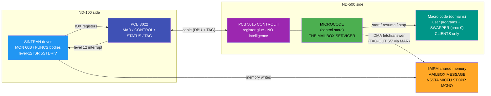
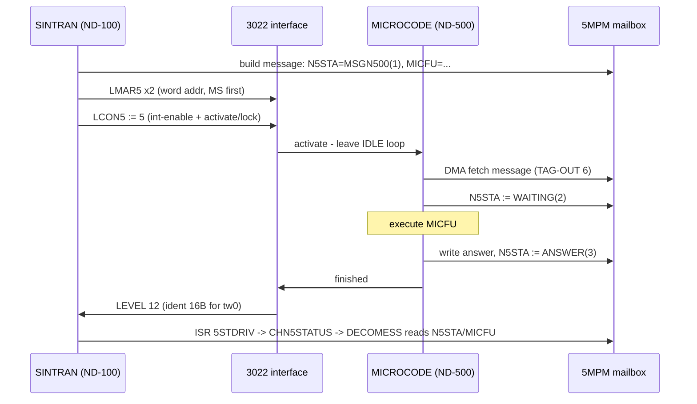
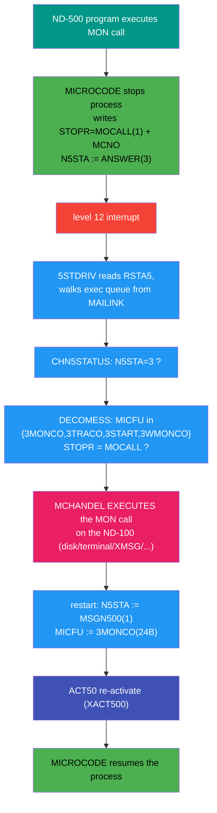
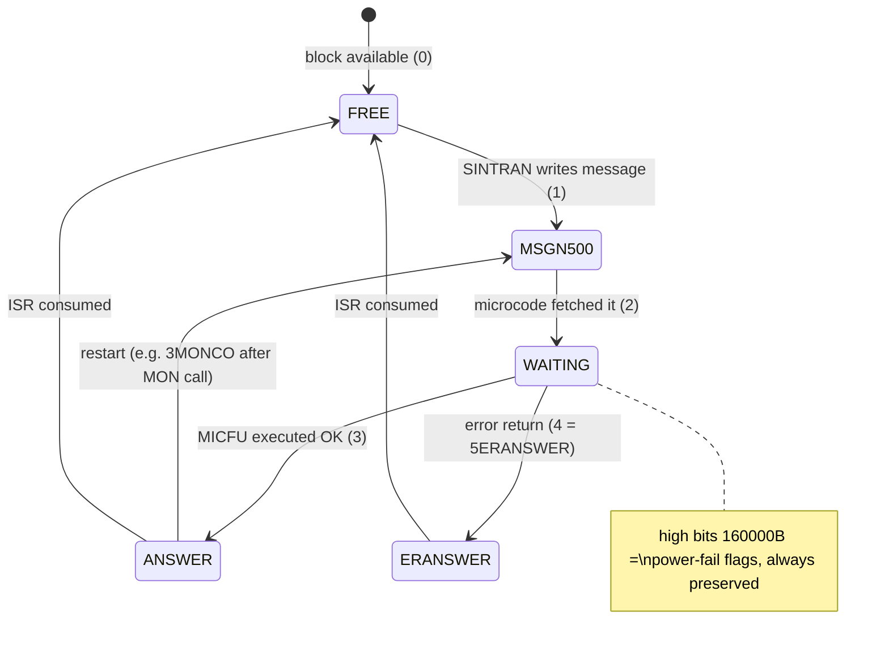

# Who answers the 5MPM mailbox on the ND-500 side?

**Full path:** `E:\Dev\Ronny\NDInsight\SINTRAN\ND500\ND500-WHO-ANSWERS-THE-MAILBOX.md`
**Answer: THE MICROCODE.** Not the 5015 controller, not the swapper. That is why the command
field is named `MICFU` = MICro FUnction, and why NOTHING works until the control store is loaded.

Evidence grades: MANUAL/DERIVED (ND-05.012.01 Micro Program Guide section 13 - the microcode's
internals exist in no SINTRAN source; they live only in the CONTROL-STORE:DATA image),
cross-consistent with the byte-verified carve (FUNCS bodies, activation protocol) and the
2026-07-16 live traces (`ND500-CS-LOAD-TRACE-FINDINGS-2026-07-16.md`).

## Architecture at a glance

## The mailbox round trip (any command, e.g. the 3RMICV watchdog)

## The MON-call ping-pong (every ND-500 I/O rides this)

## N5STA message lifecycle

## The three layers on the ND-500 side

| Layer | What it is | Mailbox role |
|---|---|---|
| **PCB 5015 "CONTROL II"** | register glue: DATA-IN/OUT, WA, BREAK, CSCNT, TAG + cable | **None.** No intelligence; it clocks registers when the 3022 strobes TAG-IN codes. |
| **The MICROPROGRAM** (control-store contents) | the CPU's firmware, loaded at cold start via WA/BREAK/CSCNT (144-bit words) | **THE mailbox servicer.** Idle ND-500 = microcode IDLE loop. CONTROL activate wakes it; the microcode DMA-fetches the message at MAR (TAG-OUT codes 6/7), sets `N5STA=WAITING(2)`, executes `MICFU`, writes the answer (`ANSWER(3)`/`5ERANSWER(4)`, power-fail high bits preserved), raises level 12. |
| **Macro code** (domains: user programs, the SWAPPER as process 0) | normal ND-500 programs | **Clients only.** Programs never touch the mailbox. The microcode starts/resumes them (`3START`/`3MONCO`) and, when one executes a MON call, the MICROCODE stops it and writes the outgoing message (`STOPR=MOCALL(1)`, `MCNO=<call>`). The swapper merely receives its own work as `3SWMESS(5)` messages like any process receives service. |

## Which MICFU is handled where

- **Pure-microcode services** (no macro instruction ever executes): `3RMICV(1)` read microprogram
  version - the microcode reports its own version constant (stored in microword 1, last 16-bit
  part; observed `027232B`/`0x2E9A` in the A-series ND-5800 image).
- **Process control** (microcode -> macro execution): `3START(23B)` start process,
  `3MONCO(24B)` continue after monitor call, `3TRACO(25B)` trap continue, `3WMONCO(26B)` wait.
- **Deliveries to a macro client**: `3SWMESS(5)` to the swapper (SWFUN function field).

## Consequences

1. **Control store loaded is a hard precondition for ANY mailbox answer** - the gate
   (`RSTA5` bit 9 `5CLOST`) is not bureaucracy; with the clock stopped there is literally no
   servicer. Cold start therefore ALWAYS downloads (classic 500 has no microcode ROM).
2. A MON call from an ND-500 program is a **microcode-written message**, serviced by SINTRAN
   on the ND-100 (level-12 ISR: `5STDRIV -> CHN5STATUS -> DECOMESS -> MCHANDEL`), and the
   restart is again a message (`3MONCO`) executed by the microcode. All ND-500 I/O rides this.
3. **Emulator mapping (RetroCore):** `NDBusND500IF`'s activate/answer engine PLAYS THE
   MICROCODE'S ROLE (fetch at MAR-as-word-address, MICFU dispatch, answer, level 12) - see
   `MAILBOX RECV`/`MAILBOX ANSW` decode lines in the trace. Phase 3/4-full hands `3START`/`3MONCO`
   to the attached `CpuND500` (real macro execution behind the 5015); pure-microcode services
   stay in the engine and should answer from the CACHED control store (e.g. version = cached
   word 1, part 7) rather than constants. Phase 5 (optional) = interpret the real microcode.

Related: `ND500-5MPM-MESSAGE-AND-ACTIVATION.md` (message layout + lifecycle),
`ND500-CS-LOAD-TRACE-FINDINGS-2026-07-16.md` (load/verify protocol, MAR word addressing),
`ND500-BUS-INTERFACE-REFERENCE.md` sections 5-7, `swapper\README.md` (the swapper as client).
