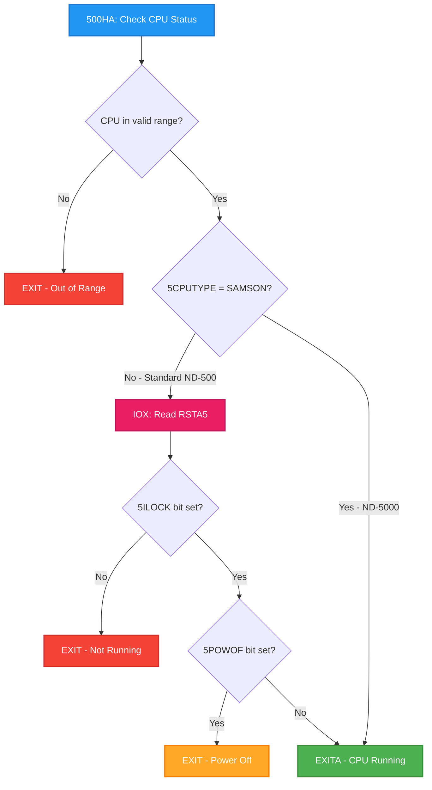
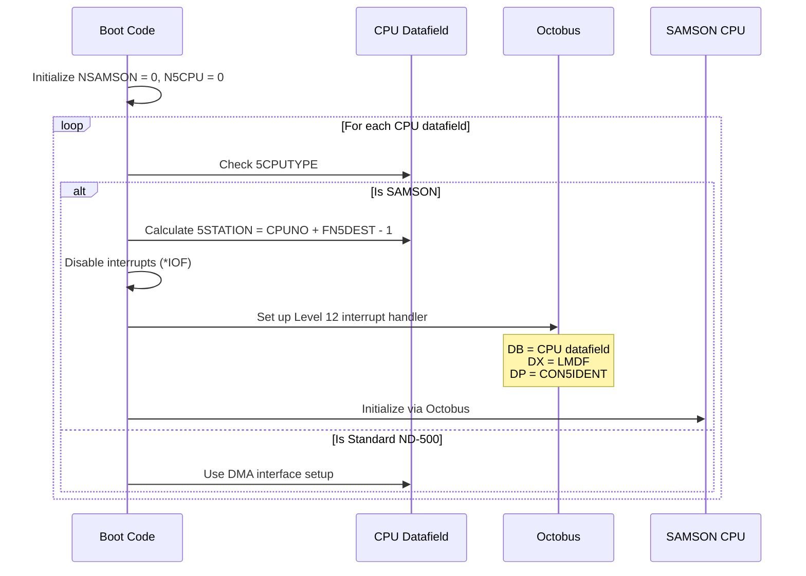

# ND-5000 (SAMSON) Architecture Differences

**How SINTRAN III Handles ND-5000 vs Standard ND-500 Systems**

---

## Overview

This document analyzes how SINTRAN III distinguishes between standard ND-500 systems (using DMA interface PCB 3022) and ND-5000 "SAMSON" systems (using Octobus/Multi Function Bus architecture).

**Important Note:** The ND-5000 maintains **software compatibility** with ND-500 - it runs the same instruction set, uses the same registers, and executes the same programs. The differences documented here are in the **hardware interface** between the ND-100 (I/O processor) and the main CPU.

---

## Table of Contents

1. [CPU Generations](#1-cpu-generations)
2. [Hardware Interface Differences](#2-hardware-interface-differences)
3. [SAMSON Detection and Initialization](#3-samson-detection-and-initialization)
4. [Status Checking Differences](#4-status-checking-differences)
5. [Communication Mechanisms](#5-communication-mechanisms)
6. [Execution Queue Differences](#6-execution-queue-differences)
7. [Key Variables and Symbols](#7-key-variables-and-symbols)
8. [I/O Architecture](#8-io-architecture)
9. [Mermaid Diagrams](#9-mermaid-diagrams)
10. [Verification and Assumptions](#10-verification-and-assumptions)

---

## 1. CPU Generations

The ND-500 CPU **software architecture** had three physical implementations:

| Generation | Implementation | Systems | Interface |
|------------|----------------|---------|-----------|
| 1st | ND-500/1 | ND-520, ND-540, ND-560 | DMA (PCB 3022) |
| 2nd | ND-500/2 | ND-510, ND-530, ND-550, ND-560, ND-570, ND-580 | DMA (PCB 3022) |
| 3rd | **ND-5000 (SAMSON)** | ND-5X00 series | **Octobus + MFB** |

**Source:** ND-05.009.4 EN ND-500 Reference Manual, pages 17-18

All three implementations run the **same instruction set**, **same registers**, and **same addressing modes**. The difference is purely in hardware implementation and the interface to the I/O processor (ND-100/ND-110).

---

## 2. Hardware Interface Differences

### Standard ND-500 (DMA Interface - PCB 3022)

```
┌──────────┐                  ┌──────────┐
│  ND-100  │    PCB 3022      │  ND-500  │
│   I/O    │◄────────────────►│   CPU    │
│Processor │   DMA Interface  │ ND-500/1 │
└────┬─────┘                  │ ND-500/2 │
     │                        └────┬─────┘
     │                             │
     │      ┌──────────┐           │
     └─────►│   5MPM   │◄──────────┘
            │ Multiport│
            │  Memory  │
            └──────────┘
```

**Characteristics:**
- IOX commands via PCB 3022 device registers
- Status read via `RSTA5` register (IOX operation)
- 5ILOCK bit indicates CPU running
- 5POWOF bit indicates power failure

### ND-5000 (SAMSON - Octobus + MFB)

```
┌──────────┐                  ┌──────────┐
│ ND-100/  │    Octobus       │  ND-5000 │
│  ND-110  │◄────────────────►│ (SAMSON) │
│   I/O    │  Multi Function  │   CPU    │
│Processor │      Bus         │          │
└────┬─────┘                  └────┬─────┘
     │                             │
     │      ┌──────────┐           │
     └─────►│   MFB    │◄──────────┘
            │  Shared  │
            │  Memory  │
            └──────────┘
```

**Characteristics:**
- Communication via Octobus protocol
- Status via `MAILINK` (mailbox link) in shared memory
- Multi Function Bus (MFB) for direct memory access
- Up to 32 MB physical memory
- Private memory regions possible

---

## 3. SAMSON Detection and Initialization

### Boot-Time Detection

During SINTRAN cold start, the system checks for Octobus presence:

**Source:** `PH-P2-OPPSTART.NPL` lines 3921-3929

```npl
1CH5CPU:     *TRA IIC                                % Read octobus if. status
             A:=200; *TRR IIE
             T:=100406; *IOXT; TRA IIC
             IF A=0 THEN                             % Octobus present? - (assumes Samson)
                DO                                   % Wait for data ready
                   *IOXT
                WHILE A NBIT 3
                OD
                ASTATION\/COMD=:5STATION
```

**Detection Logic:**
1. Read Octobus interface status via IOX (device 100406 octal)
2. If A=0, Octobus is present (assumes SAMSON)
3. Wait for data ready (bit 3)
4. Store station number in `5STATION`

### CPU Counting and Registration

**Source:** `RP-P2-N500.NPL` lines 973-980

```npl
X:="S5CPUDF"; 0=:NSAMSON=:N5CPU
DO WHILE X<<="E5CPUDF"
   IF X.CPUAVAILABLE/\5CPUTYPE=SAMSON THEN
      X.CPUNO+FN5DEST-1=:X.5STATION
      *IOF
      A:=X;        *IRW LV12B DB
      "LMDF";      *IRW LV12B DX
      "CON5IDENT"; *IRW LV12B DP
```

**What This Does:**
1. Initialize `NSAMSON` (SAMSON count) and `N5CPU` (total ND-500 count) to 0
2. Loop through CPU datafields (`S5CPUDF` to `E5CPUDF`)
3. For each SAMSON CPU:
   - Calculate Octobus station number: `CPUNO + FN5DEST - 1`
   - Store in `5STATION` field
   - Disable interrupts (`*IOF`)
   - Set up level 12 interrupt (`*IRW LV12B`) with:
     - DB = CPU datafield address
     - DX = LMDF (local message data field)
     - DP = CON5IDENT (connection identification)

---

## 4. Status Checking Differences

The most significant operational difference is how SINTRAN checks if an ND-500/ND-5000 CPU is active.

### 500HA Subroutine

**Source:** `MP-P2-N500.NPL` lines 264-269

```npl
% Local subroutine to test if nd-500 active
500HA: IF B<<"S5CPUDF" OR B>>"E5CPUDF" THEN EXIT FI
       IF CPUAVAILABLE/\5CPUTYPE><SAMSON THEN    % DMA interface?
          T:=HDEV+RSTA5; *IOXT
          IF A NBIT 5ILOCK OR A BIT 5POWOF THEN EXIT FI
       FI
       EXITA
```

### Interpretation

| CPU Type | Check Method | Running If |
|----------|--------------|------------|
| ND-500 (DMA) | `IOX RSTA5` register | `5ILOCK` bit set AND `5POWOF` bit clear |
| ND-5000 (SAMSON) | Skip hardware check | Assume running (use MAILINK for actual status) |

**Key Point:** For SAMSON, the 500HA subroutine **does not perform hardware status check** - it immediately returns via `EXITA`. The actual status is determined by checking `MAILINK` elsewhere.

### MAILINK Status Checking

**Source:** `RP-P2-N500.NPL` lines 85-91

```npl
IF A/\5CPUTYPE=SAMSON THEN
   % Nd-500 samson on octobus line - test if memory layout ok : -
   IF MAILINK><-1  THEN
      A:=0; X:="S5CPUDF"
      DO WHILE X<<="E5CPUDF"; A\/X.C5STAT; X+5CPUDFSIZE; OD
      IF A/\C5PFMASK=0 GO NN5S1
   FI
```

**Logic:**
- For SAMSON: Check if `MAILINK` is initialized (not -1)
- If initialized: Check all CPU status fields for power fail mask
- If no power fails detected: proceed to scheduling (`NN5S1`)

---

## 5. Communication Mechanisms

### Standard ND-500: IOX Commands

Communication uses IOX instructions to PCB 3022 registers:

| Register | Direction | Purpose |
|----------|-----------|---------|
| RSTA5 | Read | Status (5ILOCK, 5POWOF bits) |
| WSTA5 | Write | Commands |
| WDAT5 | Write | Data out |
| RDAT5 | Read | Data in |

### ND-5000 (SAMSON): Mailbox + Shared Memory

Communication via shared memory structures:

| Mechanism | Purpose |
|-----------|---------|
| `MAILINK` | Mailbox link (message queue pointer) |
| `MAIL1LINK` | Secondary mailbox link |
| `5STATION` | Octobus station number |
| MFB shared memory | Direct data access |

**Initialization of mailbox links:**

**Source:** `5P-P2-MON60.NPL` lines 560-564

```npl
X:="S5CPUDF"
DO WHILE X<<="E5CPUDF"
   A:=-1=:X.MAIL1LINK=:X.MAILINK
   X+5CPUDFSZ
OD
```

Both `MAILINK` and `MAIL1LINK` are initialized to -1 (invalid) at startup.

---

## 6. Execution Queue Differences

A significant scheduling difference exists for SAMSON systems.

**Source:** `s3vs-4.symb` line 57255 (also in performance sampling code)

```npl
IF CPUAVAILABLE/\5CPUTYP=SAMSON GO OUT % Only one exec. q.
```

**Implication:** SAMSON systems use **only one execution queue** while standard ND-500 systems may use multiple execution queues.

This affects process scheduling - SAMSON appears to have a simpler queue model.

---

## 7. Key Variables and Symbols

### From DP-P2-VARIABLES.NPL

| Variable | Type | Description | Source Line |
|----------|------|-------------|-------------|
| `NSAMSON` | INTEGER | Number of SAMSON CPUs | 112 |
| `N5CPU` | INTEGER | Total number of ND-500/5000 CPUs | (nearby) |
| `5SWPROC` | INTEGER | Swapper process number | 116 |

### CPU Datafield Fields (per CPU)

| Field | Purpose |
|-------|---------|
| `CPUAVAILABLE` | CPU availability flags |
| `5CPUTYPE` | CPU type (SAMSON or other) |
| `5STATION` | Octobus station number (SAMSON only) |
| `MAILINK` | Mailbox link for communication |
| `MAIL1LINK` | Secondary mailbox link |
| `CPUNO` | CPU number |
| `C5STAT` | CPU status flags |
| `HDEV` | Hardware device base address |

### Constants

| Symbol | Value | Description |
|--------|-------|-------------|
| `SAMSON` | (defined) | CPU type constant for ND-5000 |
| `RSTA5` | (offset) | Read status register offset |
| `5ILOCK` | bit 5 | Interface locked (CPU running) |
| `5POWOF` / `5POWOFF` | bit 8 | Power off |
| `5ALIVE` | (bit) | CPU is alive/present |

---

## 8. I/O Architecture

### Current Implementation (from source code)

The I/O system remains on the ND-100/ND-110 "I/O processor" for both standard ND-500 and ND-5000:

**Source:** ND-05.009.4 EN ND-500 Reference Manual, page 18

> **THE I/O PROCESSOR:**
> - Supervises the CPU
> - Runs the I/O system, file system, operating system and job scheduling
> - Runs local I/O-processor jobs

For both ND-500 and ND-5000, the I/O processor (ND-100/ND-110) handles:
- Disk I/O (including SCSI)
- Terminal I/O
- Network I/O
- All device drivers

### Multi Function Bus (MFB) - ND-5000

The ND-5000 uses Multi Function Bus for memory:

**Source:** ND-05.009.4 EN ND-500 Reference Manual, page 19

> **MEMORY:**
> - Multi Function Bus main memory with direct access for the ND-5000 CPU, the I/O processor CPU and DMA transfer devices
> - Physical main memory up to 32 Mbytes
> - Memory fully or partially shared between the I/O processor and ND-500 type CPU

**Key Difference:** MFB allows **direct DMA access** from I/O devices to shared memory, potentially bypassing the I/O processor for data transfer.

### DOMINO I/O System (Future)

**Source:** ND-05.009.4 EN ND-500 Reference Manual, page 17

> Until now the I/O processor has been an ND-100, but when the DOMINO I/O system is introduced, other types of I/O processors will be possible.

**Source:** ND Linker User Guide, page 3088

> Use this command if you are programming for the PIOC or DOMINO.

**Note:** DOMINO uses Motorola MC680x0 processors, representing a move away from ND-100 as the I/O processor. This is **not fully documented in available NPL sources**.

### Octobus Devices

Device numbers 2400-2477 (octal) are reserved for Octobus devices:

| Device Range | Description |
|--------------|-------------|
| 2400-2417 | Octobus unit 0 |
| 2420-2437 | Octobus unit 1 |
| 2440-2457 | Octobus unit 2 |
| 2460-2477 | Octobus unit 3 |

**Source:** Monitor Calls manual, Appendix I

---

## 9. Mermaid Diagrams

### System Architecture Comparison

```mermaid
flowchart TB
    subgraph ND500["Standard ND-500 System"]
        A1[ND-100 I/O Processor]
        B1[PCB 3022 DMA Interface]
        C1[ND-500/1 or ND-500/2 CPU]
        D1[5MPM Multiport Memory]

        A1 <-->|IOX Commands| B1
        B1 <-->|DMA| C1
        A1 <-->|Memory Access| D1
        C1 <-->|Memory Access| D1
    end

    subgraph ND5000["ND-5000 (SAMSON) System"]
        A2[ND-100/ND-110 I/O Processor]
        B2[Octobus Interface]
        C2[ND-5000 CPU]
        D2[MFB Shared Memory]

        A2 <-->|Mailbox| B2
        B2 <-->|Octobus| C2
        A2 <-->|MFB Direct| D2
        C2 <-->|MFB Direct| D2
    end

    style A1 fill:#2196F3,stroke:#1976D2,stroke-width:2px,color:#fff
    style A2 fill:#2196F3,stroke:#1976D2,stroke-width:2px,color:#fff
    style B1 fill:#9C27B0,stroke:#7B1FA2,stroke-width:2px,color:#fff
    style B2 fill:#9C27B0,stroke:#7B1FA2,stroke-width:2px,color:#fff
    style C1 fill:#4CAF50,stroke:#388E3C,stroke-width:2px,color:#fff
    style C2 fill:#4CAF50,stroke:#388E3C,stroke-width:2px,color:#fff
    style D1 fill:#FFA726,stroke:#F57C00,stroke-width:2px,color:#fff
    style D2 fill:#FFA726,stroke:#F57C00,stroke-width:2px,color:#fff
```



### Status Check Decision Flow



### SAMSON Initialization Sequence



---

## 10. Verification and Assumptions

### Verified from Source Code

| Finding | Source File | Line(s) | Confidence |
|---------|-------------|---------|------------|
| `NSAMSON` variable for counting SAMSON CPUs | DP-P2-VARIABLES.NPL | 112 | HIGH |
| `5CPUTYPE=SAMSON` check for CPU type | MP-P2-N500.NPL | 265 | HIGH |
| 500HA skips IOX for SAMSON | MP-P2-N500.NPL | 265-269 | HIGH |
| `MAILINK` used for SAMSON communication | 5P-P2-MON60.NPL | 562, 702 | HIGH |
| SAMSON has single execution queue | s3vs-4.symb | 57255 | HIGH |
| `5STATION` stores Octobus station | RP-P2-N500.NPL | 976 | HIGH |
| Mailbox links initialized to -1 | 5P-P2-MON60.NPL | 562 | HIGH |
| Octobus detection at boot | PH-P2-OPPSTART.NPL | 3921-3929 | HIGH |
| XRS5CPU called for SAMSON restart | MP-P2-N500.NPL | 3358-3359 | HIGH |
| XTER500 called for non-SAMSON | MP-P2-N500.NPL | 3361 | HIGH |

### Verified from Reference Manuals

| Finding | Source | Confidence |
|---------|--------|------------|
| ND-5000 is 3rd generation ND-500 implementation | ND-05.009.4 page 17 | HIGH |
| Multi Function Bus (MFB) used for ND-5000 memory | ND-05.009.4 page 19 | HIGH |
| Up to 32 MB physical memory supported | ND-05.009.4 page 19 | HIGH |
| DOMINO I/O system planned for future | ND-05.009.4 page 17 | HIGH |
| Same instruction set for all ND-500 variants | ND-05.009.4 page 18 | HIGH |
| Octobus devices at 2400-2477 octal | Monitor Calls Appendix I | HIGH |

### Interpretations (Low Uncertainty)

| Interpretation | Evidence | Uncertainty |
|----------------|----------|-------------|
| SAMSON uses Octobus for CPU communication instead of DMA | Code explicitly checks `5CPUTYPE=SAMSON` vs IOX operations | LOW |
| MAILINK replaces hardware status polling for SAMSON | 500HA skips IOX for SAMSON, other code checks MAILINK | LOW |
| ND-5000 I/O still handled by ND-100 I/O processor | No code shows ND-5000 direct I/O handling | LOW |

### Assumptions (Higher Uncertainty)

| Assumption | Why Assumed | Uncertainty |
|------------|-------------|-------------|
| SCSI controllers on ND-5000 still managed by ND-100 | No SAMSON-specific SCSI code found; manual states I/O processor handles I/O | MEDIUM |
| "Own bus and I/O controllers" refers to MFB direct DMA capability | MFB allows direct access from DMA devices, but driver code not found | MEDIUM |
| DOMINO system would replace ND-100 for I/O | Mentioned in manual but no implementation in available sources | MEDIUM |
| Single execution queue for SAMSON is architectural requirement | Comment says "Only one exec. q." but reason not documented | MEDIUM |

### What This Document Does NOT Cover

1. **Detailed Octobus protocol** - Low-level Octobus communication not documented in NPL sources
2. **DOMINO I/O system** - Future system mentioned but not implemented in available code
3. **MFB hardware details** - Requires ND-05.020 (ND-5000 Hardware Description) manual
4. **SAMSON microcode differences** - Hardware implementation details

---

## References

### NPL Source Files

| File | Content |
|------|---------|
| `MP-P2-N500.NPL` | ND-500/5000 monitor program, 500HA subroutine |
| `RP-P2-N500.NPL` | Runtime program, SAMSON initialization |
| `PH-P2-OPPSTART.NPL` | Boot code, Octobus detection |
| `5P-P2-MON60.NPL` | Monitor calls, mailbox initialization |
| `DP-P2-VARIABLES.NPL` | Variable definitions including NSAMSON |
| `MP-P2-PERF-SAMP.NPL` | Performance sampling code |

### Official Manuals

| Manual Number | Title |
|---------------|-------|
| ND-05.009.4 | ND-500 Reference Manual |
| ND-05.015 | ND-500/2 Hardware Description |
| ND-05.020 | ND-5000 Hardware Description (referenced, not available) |
| ND-860228-2 | SINTRAN III Monitor Calls |
| ND-860289-2 | ND Linker User Guide |

---

## Version History

| Date | Version | Changes |
|------|---------|---------|
| 2026-01-29 | 1.0 | Initial document - SAMSON/ND-5000 architecture analysis |

---

**Parent:** [README.md](README.md) - ND-500 Documentation
**Related:** [ND500-IF-USAGE-DEEP-ANALYSIS.md](ND500-IF-USAGE-DEEP-ANALYSIS.md) - IOX interface analysis
**Related:** [ND500-SWAPPER-LOADING-MECHANISM.md](ND500-SWAPPER-LOADING-MECHANISM.md) - Swapper loading
