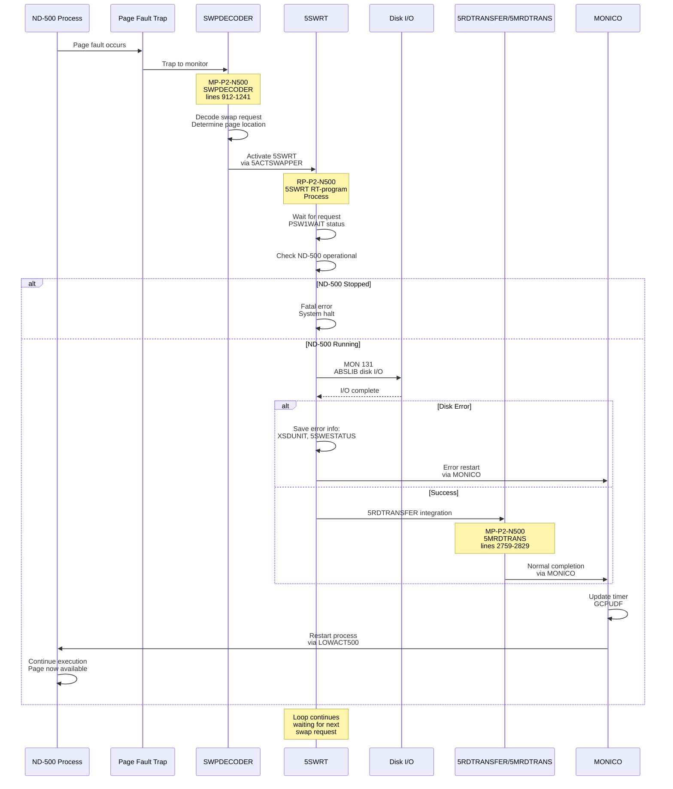
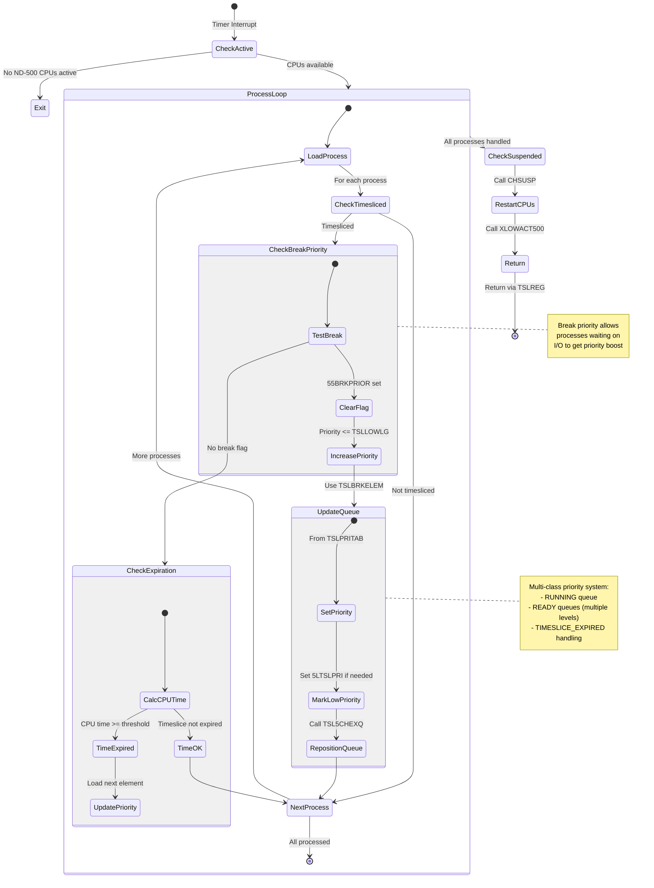
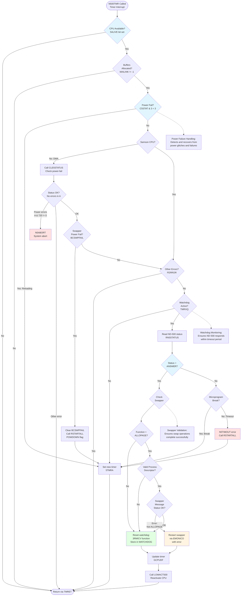
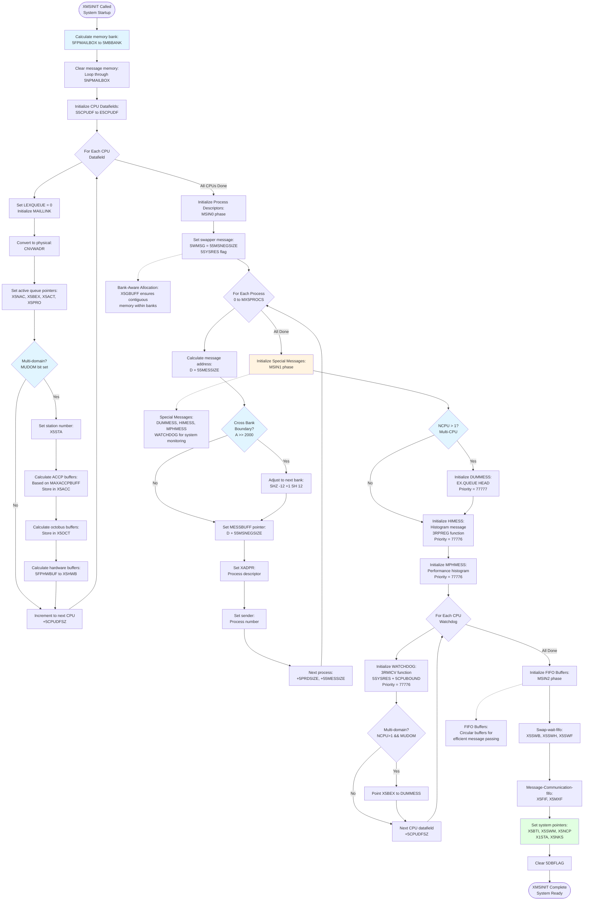

# RP-P2-N500.NPL API Documentation

**File:** Z:\NorskData\Source Code\Sintran L\NPL\RP-P2-N500.NPL
**Total Lines:** 1035
**Total APIs/Subroutines:** 10
**Module:** CX-RPIT-N500 (RT-Program level routines for ND-500)

---

## ND-500 Interface Symbol Mappings

The ND-500 controller card uses IOX (I/O Execute) operations at specific offsets from the hardware device base address (HDEV). The following table maps IOX offsets to their symbolic names and functions:

| IOX Offset |  Octal | Enum                | Symbol                     | Comment                         |
| :--------: | :----: | :------------------ | :------------------------- | :------------------------------ |
|     +0     | 000000 | ReadMarX2           | `RMAR5`                    | Read MAR                        |
|     +1     | 000001 | LoadMarX2           | `LMAR5`                    | Load MAR                        |
|     +2     | 000002 | ReadStatusRegister  | `RSTA5`                    | Read status                     |
|     +3     | 000003 | LoadStatusRegister  | `LSTA5`                    | Load status                     |
|     +4     | 000004 | ReadControlRegister | `RCON5`                    | Read control                    |
|     +5     | 000005 | LoadControlRegister | `LCON5`                    | Load control                    |
|     +6     | 000006 | MasterClear         | `MCLR5`                    | Master clear                    |
|     +7     | 000007 | Terminate           | `TERM5`                    | Terminate                       |
|     +10    | 000010 | ReadTagIn           | `RTAG5`                    | Read tag                        |
|     +11    | 000011 | WriteTagOut         | `LTAG5`                    | Write tag                       |
|     +12    | 000012 | ReadLowerLimit      | `RLOW5`                    | Read lower limit                |
|     +13    | 000013 | WriteDataX          | `LDAT5` or `LLOW5`         | Load data / write lower         |
|     +14    | 000014 | ReadLockedMaybe     | `SLOC5`                    | Possibly "slot" / "status lock" |
|     +15    | 000015 | WriteData           | `BITM5`, `CLKD5`, or `S15` | Unclear — may depend on context |
|     +16    | 000016 | ReadLocked          | `UNLC5`                    | Unlock — plausible              |
|     +17    | 000017 | LastIOX             | `RETG5`                    | Return/End gate                 |

### Usage with HDEV Base Address

All IOX operations combine the hardware device base address (HDEV) with the appropriate symbol offset:

```assembly
T:=HDEV+RSTA5        ; Point to status register (HDEV+2)
*IOXT                ; Read status into A register

T:=HDEV+LCON5        ; Point to control register (HDEV+5)
A:=40; *IOXT         ; Write 40 to control register

T:=HDEV+UNLC5        ; Point to unlock register (HDEV+16)
*IOXT                ; Execute unlock operation
```

### RT-Program Level Usage

RP-P2-N500.NPL operates at RT-Program (Real-Time) level and uses these IOX operations for:
- **Timeout detection**: Reading RSTA5 to check ND-500 health
- **Power failure recovery**: Using CLE5STATUS routine (defined in XC-P2-N500.NPL)
- **Hardware state monitoring**: Checking device availability and status

For more detailed symbol usage patterns and monitor-level operations, see **MP-P2-N500.md** which contains extensive documentation of ND-500 hardware interface operations including message dispatch, monitor calls, and driver-level control.

---

## File Overview and Purpose

**RP-P2-N500.NPL** is the **RT-Program (Real-Time Program) level** component of the ND-500 abstraction and support system. This module works in conjunction with **MP-P2-N500.NPL** (Monitor/Driver level) to provide complete ND-500 CPU management.

### Primary Responsibilities:
1. **Swapper RT-Program (5SWRT)** - Handles page swapping between ND-500 and disk
2. **Time Slice Scheduler (N500SCHEDULER)** - Manages CPU time allocation and process priorities
3. **Timeout Handling (N500TMR)** - Monitors ND-500 health and detects failures
4. **Terminal I/O (XIBMOVE)** - Moves data between terminal and ND-500 buffers
5. **Process Activation (X5PRACTIVATE)** - Reactivates suspended ND-500 processes
6. **Cleanup (XCLEAN)** - Handles process termination and resource cleanup
7. **System Initialization (XMSINIT)** - Initializes message buffers and data structures
8. **Buffer Allocation (X5GBUFF/X5XGBUFF)** - Reserves contiguous memory for ND-500
9. **Octobus Management (XX5CONOMD)** - Connects octobus communication channels
10. **CPU Time Monitoring (CH5MXTIME)** - Enforces maximum CPU time limits for batch jobs

### Key Differences from MP-P2-N500.NPL:
- **MP** operates at Monitor/Driver level (Level 12/Level 2)
- **RP** operates at RT-Program level (Real-Time interrupt handlers)
- **MP** handles message dispatch and monitor calls
- **RP** handles timeslicing, swapping, and system-level timing events

---

## Relationship to MP-P2-N500.NPL

### Cross-References and Integration Points:

#### 1. **Swapper Integration**
- **RP: 5SWRT** (lines 16-58) - RT-program that performs actual disk I/O for swapping
- **MP: SWPDECODER** (lines 912-1241) - Decodes swap requests and activates 5SWRT
- **MP: 5ACTSWAPPER** (lines 2851-2908) - Activates the swapper process
- **Flow:** Page fault → SWPDECODER → 5ACTSWAPPER → 5SWRT (RT-level disk I/O)

#### 2. **Process Activation**
- **RP: X5PRACTIVATE** (lines 616-653) - Removes from time/exec queues and activates
- **MP: XACTRDY** (lines 2974-3040) - Schedules message for execution
- **MP: XACT500** (lines 3052-3099) - Activates ND-500 CPU with message
- **Flow:** X5PRACTIVATE → message preparation → XACTRDY → XACT500

#### 3. **Scheduler Integration**
- **RP: N500SCHEDULER** (lines 66-191) - Called periodically to manage timeslicing
- **MP: 500HIST** (lines 209-345) - Level 2 routine called each basic time unit
- **RP: TSL5CHEXQ** (lines 252-290) - Moves processes in execution queue based on priority
- **Flow:** Timer interrupt → 500HIST → N500SCHEDULER → TSL5CHEXQ

#### 4. **Timeout and Error Handling**
- **RP: N500TMR** (lines 302-392) - RT-level timeout handler
- **MP: XRSTARTALL** (lines 3113-3240) - Restarts all processes after error
- **RP: RSTARTALL** - Called by N500TMR on timeout/error
- **Flow:** Timeout → N500TMR → RSTARTALL → XRSTARTALL

#### 5. **Terminal I/O**
- **RP: XIBMOVE** (lines 440-602) - RT-level terminal I/O handler
- **MP: NINSTR/NOUTSTR** - Monitor calls for device string I/O
- **MP: DVIO** (lines 1688-1804) - Device I/O dispatcher
- **Flow:** Terminal interrupt → XIBMOVE → buffer transfer → restart via EMONICO/OKMONICO

#### 6. **Initialization**
- **RP: XMSINIT** (lines 732-865) - Initializes mailboxes and message structures
- **RP: XX5CONOMD** (lines 944-1029) - Connects octobus communication
- **MP: N500C** (lines 358-644) - Monitor level command dispatcher
- **Flow:** System startup → XMSINIT → XX5CONOMD → system ready

#### 7. **Message System**
- **RP** creates and maintains message buffers in shared memory
- **MP** dispatches and routes messages between ND-100 and ND-500
- **Shared structures:** HIMESS (histogram), WATCHDOG (timeout), SWMSG (swapper), DUMMESS (queue head)

---

## API List by Line Number

### 1. **5SWRT** (Lines 16-58)

**Line Range:** 16-58
**Description:** ND-500 Abstrans Program - RT-program to read/write pages from/to disk
**Execution Level:** RT-Program level (Real-Time)

#### Entry Parameters:
- No explicit parameters (activated by system)
- Process #0 must be reserved

#### Exit Parameters:
- None (infinite loop until system shutdown)

#### Functionality:
1. Reserves process #0 for swapper operations
2. Sets up physical address of SWPINFO in SWMSG
3. Enters infinite loop waiting for swap requests:
   - Waits for swap request (PSW1WAIT status)
   - Checks if ND-500 is operational (not stopped)
   - Performs disk I/O via ABSLIB MON 131
   - On error: Saves error information, message, and status
   - Restarts swapper via MONICO
   - Updates timer and calls LOWACT500

#### Swapper Flow (5SWRT) Sequence



#### Assembly Code Analysis:
```npl
Line 18: "S500S"=:B; X:=RTREF          % Point to swapper process descriptor
Line 21: X:=SWMSG; T:=5MBBANK          % Access swapper message area
Line 22: A:=SWMSG+"SWPINFO"=:D:=5MBBANK; AD=:DSWMSG  % Physical address calculation
Line 28: X:="S500S"; CALL FAR SETIOWAIT % Set I/O wait state
Line 37: "ABSLI"; *MON 131             % Disk I/O monitor call
Line 43: A:=12=:L; "XSDUNIT"=:D; T:="5SWESTATUS"; *MOVAA % Save error status
```

#### Cross-References:
- Called by: **MP: 5ACTSWAPPER** (lines 2851-2908)
- Calls: BRESERVE, SETIOWAIT, RN5STATUS, MONICO, GCPUDF, ERRFATAL, TER500, ACTRDY, LOWACT500
- Related: **MP: SWPDECODER** (lines 912-1241) - triggers swap requests

---

### 2. **N500SCHEDULER** (Lines 66-191)

**Line Range:** 66-191
**Description:** Timeslicer for ND-500 processes & restart of suspended processes
**Execution Level:** Part of ND-100 timeslicer (RT-prog RTSLI)

#### Entry Parameters:
- Called periodically by system timer
- TSLREG = return address (set by caller)

#### Exit Parameters:
- All registers modified
- Returns via TSLREG

#### Local Variables:
```npl
INTEGER POINTER TSLREG          % Return address register
INTEGER CTSLCLASS               % Current timeslice class
INTEGER CTSLPROC                % Current timeslice process
INTEGER CTSLSTATUS              % Current timeslice status
INTEGER CINDEX                  % Process index counter
INTEGER CL5CPU                  % CPU time used (low 16 bits)
INTEGER 5TCOUNT                 % Timeslice counter
INTEGER 5TNEXT                  % Next timeslice value
DOUBLE  DTSCOUNT=5TCOUNT        % Double-word timeslice counter
```

#### Scheduler State Machine



#### Functionality:

**Phase 1: Check if Work Needed (Lines 78-99)**
- Tests if any ND-500 CPUs are active and available
- For Samson CPUs: Verifies memory layout (MAILINK check)
- For DMA CPUs: Checks power presence and running state
- Exits early if no active CPUs

**Phase 2: Process Loop (Lines 102-166)**
- Iterates through all ND-500 process descriptors (MX5PROCS)
- Skips non-timesliced processes
- For each timesliced process:
  1. Loads current timeslice status (CTSLSTATUS)
  2. Calculates current timeslice class (CTSLCLASS)
  3. Checks break priority flag (55BRKPRIOR)
  4. Computes CPU time used
  5. Determines if timeslice expired
  6. Updates priority and queue position

**Phase 3: Priority Adjustment (Lines 117-126)**
```npl
IF PSTAT BIT 55BRKPRIOR THEN              % Waiting for break priority?
   A BZERO 55BRKPRIOR=:PSTAT              % Clear break flag
   *AAX 5PRIO-L500C; LDATX                % Get current priority
   IF A<=TSLLOWLG THEN                    % Can priority be increased?
      TSLBRKELEM(CTSLCLASS)               % Get break element
      A=:D:=CTSLSTATUS/\177400\/D=:CTSLSTATUS
      CL5CPU=:5TNEXT
      GO SETALL
   FI
FI
```

**Phase 4: Timeslice Expiration Check (Lines 127-134)**
```npl
A:=CL5CPU-5TNEXT=:D:=0
T:=TSLTUNIT; *RDIV ST                     % Compute cpu time used
IF A+5TCOUNT<0 GO CONWAIT                 % Timeslice finished?
CL5CPU=:5TNEXT                            % Yes, set new cpu time
CTSLSTATUS/\TSLELMSK=:X                   % Timeslice element
A:=CTSLSTATUS/\177400\/TSLNEXTAB(X)       % Find next element in chain
```

**Phase 5: Update Priority and Queue (SETALL - Lines 146-163)**
- Determines new timeslice value (hash or direct)
- Sets new priority via TSLPRITAB
- Marks low priority processes (5LTSLPRI flag)
- Calls TSL5CHEXQ to reposition in execution queue

**Phase 6: Restart Suspended CPUs (EDOX - Lines 170-183)**
- Restarts any ND-500 CPUs stopped by scheduler
- Clears LV1ACT flag
- Calls XLOWACT500 to reactivate

#### Assembly Code Analysis:
```npl
Line 80: IF "N500DF".SYSINITFLAG BIT B5STOP THEN EXIT FI  % System stopping?
Line 84: IF CPUAVAILABLE BIT 5ALIVE THEN                   % CPU present?
Line 86: IF A/\5CPUTYPE=SAMSON THEN                        % Samson on octobus?
Line 95: T:=HDEV+RSTA5; *IOXT                              % Check DMA interface
                                                            % HDEV+2: Read status register via IOX
Line 111: T:=5MBBANK; X:=X.MESSBUFF; *AAX 5TSLC; LDDTX    % Load timeslice data
Line 129: T:=TSLTUNIT; *RDIV ST                            % Divide for time calculation
Line 152: *AAX 5PRIO; STATX                                % Set new priority
```

#### Cross-References:
- Called by: System timer (RTSLI)
- Calls: TSL5CHEXQ (line 252), CHSUSP (line 199), RSTARTALL, XLOWACT500
- Related: **MP: 500HIST** (lines 209-345) - calls this scheduler
- Interacts with: Timeslice tables (TSLBRKELEM, TSLNEXTAB, TSLTIMTAB, TSLPRITAB)

---

### 3. **CHSUSP** (Lines 199-242)

**Line Range:** 199-242
**Description:** Local subroutine to check all suspended processes if they can be restarted
**Execution Level:** Called from N500SCHEDULER

#### Entry Parameters:
- 5TRET = return address
- 5SUSPFLAG = flag indicating suspended processes exist

#### Exit Parameters:
- Returns via 5TRET

#### Local Variables:
```npl
INTEGER CCSUSP                  % Suspended process counter
INTEGER POINTER 5TRET           % Return address
```

#### Functionality:
1. Checks 5SUSPFLAG to see if any processes are suspended
2. Iterates through all CPU datafields
3. For each active CPU:
   - Walks the message chain starting at MAILINK
   - Converts multi-port addresses (CNVBYADR)
   - Checks if process status is SUSPSTAT
   - Decrements suspend-time-counter (SUSPC)
   - When counter reaches 0:
     - Changes status to ANSWER
     - Inserts into FIFO queue via ITOFIFOQ
     - Restarts CPU with TER500
4. Sets 5SUSPFLAG if any processes still suspended

#### Assembly Code Analysis:
```npl
Line 207: T:=5MBBANK; *LINK@3 LDDTX                   % Always skip first message
Line 210: CNVBYADR                                    % Convert multi-port address
Line 213: T:=5MBBANK; *AAX SUSPC; LDATX               % Suspend-time-counter
Line 216: ANSWER; CALL WN5STATUS                      % Reset status to answer
Line 219: CALL ITOFIFOQ                               % Insert in FIFO queue
Line 233: CALL TER500; GO FAR ESCED                   % Terminate ND-500
```

#### Cross-References:
- Called by: N500SCHEDULER (line 173)
- Calls: RN5STATUS, WN5STATUS, SLOCK, SUNLOCK, ITOFIFOQ, TER500
- Related: Suspend mechanism in **MP: M5TMOUT** (lines 1609-1678)

---

### 4. **TSL5CHEXQ** (Lines 252-290)

**Line Range:** 252-290
**Description:** Local routine to move process in execution queue according to new priority
**Execution Level:** Called from N500SCHEDULER

#### Entry Parameters:
- X = message address
- Process has new priority set

#### Exit Parameters:
- Process repositioned in execution queue

#### Local Variables:
```npl
INTEGER CC5CPU                  % CPU datafield pointer
INTEGER CMESS                   % Message address
INTEGER POINTER 55TRET          % Return address
```

#### Functionality:
1. Checks if process is in execution queue (5IEXQUEUE flag)
2. If in queue:
   - Determines target CPU based on:
     - Multi-domain (MUDOM) systems: Remove and re-insert to all CPUs
     - Single CPU systems: Choose CPU with shortest queue (LEXQUEUE)
     - CPU-bound processes: Only specific CPU
3. Terminates current CPU (TER500)
4. Removes from execution queue (IFM500XQ)
5. Re-inserts into execution queue (ITO500XQ) at new priority position
6. Restarts CPU with updated message (LV1ACT flag set)

#### Assembly Code Analysis:
```npl
Line 253: T:=5MBBANK; *AAX 5MSFL; LDATX; AAX -5MSFL   % Get message flags
Line 254: IF A NBIT 5IEXQUEUE THEN EXIT FI            % Not in queue? Exit
Line 263: T:=5MBBANK; *AAX 5MSFL; LDATX; AAX -5MSFL   % Re-load flags
Line 264: IF A NBIT 5CPUBOUND THEN                    % Not CPU-bound?
Line 268: IF X.CPUAVAILABLE BIT 5ALIVE AND C5STAT NBIT BHPFAIL AND SPREF=0 THEN
Line 277: CALL TER500; GO FAR ESCED                   % Terminate CPU
Line 282: 3RMICV; *MICFU@3 STATX                      % Set watchdog function
```

#### Cross-References:
- Called by: N500SCHEDULER (line 160)
- Calls: GCPUDF, ERRFATAL, SLOCK, SUNLOCK, IFM500XQ, ITO500XQ, TER500, ACTRDY
- Related: **MP: XACTRDY** (lines 2974-3040) - priority-based scheduling

---

### 5. **N500TMR** (Lines 302-392)

**Line Range:** 302-392
**Description:** Time-out routine for the ND-500, called in IOF
**Execution Level:** RT-Program level (Timer interrupt)

#### Entry Parameters:
- TMRET = return address
- B = CPU datafield (implicit)

#### Exit Parameters:
- Returns via TMRET

#### Local Variables:
```npl
INTEGER POINTER TMRET           % Return address
INTEGER CCERR                   % Error code
```

#### Timeout Management Flowchart



#### Functionality:

**Phase 1: Initial Checks (5TMR1 - Lines 308-318)**
```npl
IF CPUAVAILABLE NBIT 5ALIVE GO TMRET          % ND-500 CPU present?
IF MAILINK=-1 GO TMRET                        % Buffers allocated?
IF C5STAT/\3=3 GO 5TMRA                       % Power fail detected & reloading CS
```

**Phase 2: Power Fail Detection (Lines 311-324)**
- For non-Samson CPUs: Checks for power-fail via CLE5STATUS
- Sets new timer if power-fail detected
- Calls RSTARTALL if power-down detected

**Phase 3: Error Detection (Lines 325-331)**
```npl
IF A/\ 720 ><0 GO N5ABORT                     % Power fault, communication error
IF FERROR><0 GO TMRET                         % Other error
IF C5STAT BIT BCSWPFAIL THEN                  % Swapper power fail
   A BZERO BCSWPFAIL=:C5STAT
   A:=0 BONE POWDOWN; CALL RSTARTALL
   GO 5TMRA
FI
```

**Phase 4: Watchdog Check (5TMR3 - Lines 353-392)**
- Checks if watchdog message is active (TMRXQ)
- Reads ND-500 status
- If not ANSWER status:
  - Checks for microprogram break
  - If no break: N5TIMOUT error, calls RSTARTALL
  - If break: Updates timer and continues
- Validates swapper state:
  - Checks ALLOPAGE function
  - Validates process descriptor
  - Checks swapper message status
  - On error: Restarts swapper with error (EMONICO)
- Resets watchdog with new message
- Updates timer and calls LOWACT500

#### Assembly Code Analysis:
```npl
Line 312: 177377; CALL CLE5STATUS                    % Check for power-fail
Line 318: IF T:=C5STAT BIT BHPFAIL THEN              % Hardware power fail bit
Line 337: "ABSLI"; *MON 131                          % (implied from context)
Line 340: N5TIMOUT                                   % Timeout error code
Line 358: IF A=PSW1WAIT THEN                         % Swapper waiting
Line 361: IF A=ALLOPAGE THEN                         % Allocating page
Line 368: IF A/\3777><5IALLOPAGE THEN                % Not busy allocating
Line 384: 3RMICV; T:=5MBBANK; X:=WATCHDOG; *MICFU@3 STATX  % Reset watchdog
```

#### Cross-References:
- Called by: System timer
- Calls: CLE5STATUS, RSTARTALL, RN5STATUS, EMONICO, ACTRDY, SLOCK, SUNLOCK, ITO500XQ, LOWACT500
- Related: **MP: N500TMR** errors handled by **MP: XRSTARTALL** (lines 3113-3240)

---

### 6. **CH5MXTIME** (Lines 410-426)

**Line Range:** 410-426
**Description:** Subroutine to the timer RT-program - Abort batch jobs using ND-500 when CPU time >= max
**Execution Level:** RT-Program level (Timer)

#### Entry Parameters:
- B = Batch datafield
- X = Batch RT-program

#### Exit Parameters:
- Exit: Max CPU time used, abort job
- Exit+1: Max CPU time not used, continue

#### Local Variables:
```npl
INTEGER H5TUS, L5TUS            % High/Low CPU time used
DOUBLE DC5TUS=H5TUS             % Double-word CPU time
```

#### Functionality:
1. Walks the resource link chain (BRESL → RESLINK)
2. Checks if any reserved resource is an ND-500 process (between S500S and S500E)
3. If ND-500 process found:
   - Reads ND-500 CPU time used (500TU) from message buffer
   - Multiplies MXTIME by 5670 (conversion factor)
   - Compares with actual time used
   - If exceeded: Returns without skip (abort)
   - If OK: Returns with skip (continue)

#### Assembly Code Analysis:
```npl
Line 414: DO WHILE X:=X.RESLINK><D                   % Walk resource chain
Line 415: IF X>>="S500S" AND X<<="S500E"-5PRDSIZE THEN  % ND-500 process?
Line 416: T:=5MBBANK; X:=X.MESSBUFF; *AAX 500TU; LDDTX  % Get CPU time used
Line 418: A:=MXTIME; T:=5670; *RMPY ST DA            % Multiply max time
Line 419: A:=:D-L5TUS; *RDCR ADC DD                  % Double-word subtraction
Line 421: IF A<0 THEN EXIT FI                        % Time exceeded, no skip
Line 422: EXITA                                      % Time OK, skip return
```

#### Cross-References:
- Called by: Timer RT-program
- Related: Batch job management in monitor

---

### 7. **XIBMOVE** (Lines 440-602)

**Line Range:** 440-602
**Description:** Monitor function to move bytes from terminal input buffer to ND-500 buffer
**Execution Level:** Monitor level (called from IBMOVE, returns to CIBMOVE)

#### Entry Parameters:
- X = ND500 process description
- IN5MSG = ND-500 message waiting in DVINST or DVIO monitor call

#### Exit Parameters:
- Returns via "MONEN" or restarts ND-500 process

#### Local Variables:
```npl
DOUBLE  IBM41PITENTRY           % Saved terminal PIT entry
DOUBLE  IBM5PITENTRY            % Saved ND-500 message PIT entry
DOUBLE  IBMM6PITENTRY           % Saved MON60-buffer PIT entry
INTEGER IBMIN5MSG               % Saved IN5MSG
INTEGER IBMPRD                  % Saved process description address
INTEGER IBMWNDMESS              % Logical addr of message
INTEGER IBMLGBUADDR             % Logical addr of data buffer
INTEGER IBMLREG                 % Return address
```

#### Functionality:

**Phase 1: Window Setup (Lines 452-488)**
```npl
% Terminal window
AD:=DTDFPHPAGE=:IMBDTDFPHPAGE             % Physical page of terminal DF
A:=:D/\1777+"WND41*2000"=:B               % Logical address in window
A:=142000; AD=:IBM41PITENTRY              % RPM + WPM + RING2

% ND-500 message window
A:=IBMIN5MSG=:D:=5MBBANK; A=:T; D=:X
AD SHZ -12                                % Physical page
A:=IBMIN5MSG/\1777+"WNDN5*2000"=:IBMWNDMESS

% ND-500 buffer window
X:=IBMIN5MSG; *AAX ABUFA; LDDTX
AD SHZ -12; A:=142000; AD=:IBMM6PITENTRY
A:=T/\1777+"WNDBF*2000"=:IBMLGBUADDR
```

**Phase 2: Character Transfer Loop (IIBM - Lines 490-518)**
```npl
IIBM:  *ION; IOF
       % Set up PIT entries for all three windows
       AD:=IBM41PITENTRY; T:=0; X:="WND41+WND41+174000"; *STDTX
       AD:=IBM5PITENTRY; X:="WNDN5+WNDN5+174000"; *STDTX
       AD:=IBMM6PITENTRY; X:="WNDBF+WNDBF+174000"; *STDTX

       CALL IOTRANS; GO FAR TMWT             % Read character
       X:=IBMWNDMESS.5FYLLE; T:=IBMLGBUADDR; *SBYT  % Store byte
       A:=X+1=:IBMWNDMESS.5FYLLE             % Increment byte pointer
       GO IBTBREAK
```

**Phase 3: Break Condition Check (IBTBREAK - Lines 503-518)**
```npl
A=:D                                      % Save new 5FYLLE
IF X.SMCNO=511 THEN X.11MXBRK ELSE X.MAXBYT FI  % Get max bytes
IF D>=A GO N5RST                          % Break reached?
IF T:=RSISTE>=0 THEN
   IF HENTE=T GO N5RST                    % Input exhausted?
ELSE
   IF BRECHOFL BIT 5BREAK GO N5RST        % Break character received?
FI
GO IIBM                                   % Continue reading
```

**Phase 4: Restart User (N5RST - Lines 521-571)**
- Handles case where no characters were read
- Checks echo strategy (NOWAIT vs. WAIT)
- Returns number of characters to user
- Sets break priority flag (55BRKPRIOR)
- Updates status flags (5BRKF)
- Prepares message for restart:
  - WSMC systems: Updates ISTRA, 26ADDESS, 26NRBYT, sets MICFUNC=3WMONCO
  - Non-WSMC: Sets N100ADR, N500ADR, NRBYT, MICFUNC=3WMED

**Phase 5: CPU Restart (RST - Lines 573-586)**
```npl
IF FERROR><0 THEN "MONEN"; GO CCLEANUP FI
X:=IBMIN5MSG
CALL TER500; GO N500ERR
CALL ACTRDY
CALL LOWACT500
"MONEN"; GO CCLEANUP
```

**Phase 6: Cleanup (CCLEANUP - Lines 590-602)**
- Clears all three PIT windows
- Handles NOWAIT mode
- Clears MLFLAG

#### Assembly Code Analysis:
```npl
Line 453: AD:=DTDFPHPAGE=:IMBDTDFPHPAGE             % Terminal physical page
Line 456: A:=142000; AD=:IBM41PITENTRY              % Ring 2, Read+Write
Line 485: X:=IBMIN5MSG; *AAX ABUFA; LDDTX           % Buffer address
Line 494: X:="WND41+WND41+174000"; *STDTX           % Set PIT entry
Line 499: X:=IBMWNDMESS.5FYLLE; T:=IBMLGBUADDR; *SBYT  % Store byte
Line 559: MSGN500; CALL WN5STATUS                   % Set message status
Line 591: X:="WND41+WND41+174000"; *STZTX           % Clear window
```

#### Cross-References:
- Called by: Terminal driver (IBMOVE)
- Returns to: CIBMOVE in common code
- Calls: RN5STATUS, WN5STATUS, EMONICO, GCPUDF, ERRFATAL, TER500, ACTRDY, LOWACT500, MCCO
- Related: **MP: NINSTR** (lines 1817-1929), **MP: NOUTSTR** (lines 1688-1804)

---

### 8. **X5PRACTIVATE / X5ERACTIVATE** (Lines 616-653)

**Line Range:** 616-653
**Description:** Reactivate an ND-500 process
**Execution Level:** Must be called with interrupts OFF

#### Entry Parameters:
- X = Process description
- **X5ERACTIVATE only:** A = Error code

#### Exit Parameters:
- Exit: Process not in execution queue or time queue
- Exit+1: The process is activated (skip return)

#### Local Variables:
```npl
INTEGER POINTER LREG            % Return address
INTEGER DREG, BREG              % Saved registers
INTEGER CCERR                   % Error code
INTEGER CSWITCH                 % Entry point flag (0=normal, 1=error)
```

#### Functionality:

**Phase 1: Entry Point Selection (Lines 620-622)**
```npl
X5ERACTIVATE: A=:CCERR; 1=:CSWITCH; GO FELL  % Error entry
X5PRACTIVATE: 0=:CSWITCH                      % Normal entry
```

**Phase 2: Time Queue Handling (Lines 626-635)**
```npl
IF A BIT 5ITMQUEUE THEN                             % In time-queue?
   CALL TER500; 0/\0                                % Terminate CPU
   CALL SLOCK; 0/\0                                 % Lock queue
   CALL FR5TMQ                                      % Remove from time-queue
   A:=1; CALL SPITMQ                                % Update time queue
   CALL ITO500XQ                                    % Insert to execution queue
   CALL SUNLOCK
   GO FFPXX                                         % Activate process
FI
```

**Phase 3: Execution Queue Handling (Lines 635-650)**
```npl
IF A BIT 5IEXQUEUE THEN                        % Process in EX-queue?
   CALL RN5STATUS                               % YES
   IF A><STOPPED THEN                           % Is process stopped?
      CALL SLOCK; 0/\0
      T:=5MBBANK; *AAX 5MSFL; LDATX             % NO, set repeat
      A BONE 55REP; *STATX
      CALL SUNLOCK
      GO FFPOK                                  % Skip return
   FI
   CALL TER500; 0/\0                            % Process is stopped
   IF CSWITCH=0 THEN CALL OKMONICO              % OK restart after STOP
   ELSE CCERR; CALL EMONICO FI                  % ERROR restart after STOP
FFPXX:    CALL ACTRDY
          CALL LOWACT500
FFPOK:    MIN "LREG"                            % Give skip return
FI
```

#### Assembly Code Analysis:
```npl
Line 624: CALL GCPUDF; GO FFPEX; A=:B               % Get CPU datafield
Line 625: T:=5MBBANK; *AAX 5MSFL; LDATX; AAX -5MSFL % Get message flags
Line 628: CALL TER500; 0/\0                         % Terminate CPU
Line 631: CALL FR5TMQ                               % Remove from time queue
Line 640: A BONE 55REP; *STATX                      % Set repeat flag
Line 646: IF CSWITCH=0 THEN CALL OKMONICO           % Normal restart
Line 647: ELSE CCERR; CALL EMONICO FI               % Error restart
```

#### Cross-References:
- Called by: Monitor level routines
- Calls: GCPUDF, RN5STATUS, TER500, SLOCK, SUNLOCK, FR5TMQ, SPITMQ, ITO500XQ, OKMONICO, EMONICO, ACTRDY, LOWACT500
- Related: **MP: RTBAK, APLRSTART** (lines 144-196)

---

### 9. **XCLEAN** (Lines 662-719)

**Line Range:** 662-719
**Description:** Subroutine to clean up if shadow process is aborted or ND-500 process terminates
**Execution Level:** Monitor level

#### Entry Parameters:
- D = RTREF (process reference to clean up)
- Interrupt must be OFF

#### Exit Parameters:
- All resources released

#### Local Variables:
```npl
INTEGER SVXREG, SVXXREG         % Saved X registers
INTEGER SVLREG, SVDREG          % Saved L and D registers
DOUBLE  CCMESS                  % Current message
```

#### Functionality:

**Phase 1: Remove from Waiting Queue (Lines 668-682)**
```npl
AD:=5MWQU; X:="5MWQU"
DO WHILE D><0                        % Walk waiting queue
   CNVBYADR                          % Convert address
   X=:SVXXREG; D=:X; T:=5MBBANK; *LINK@3 LDDTX
   AD=:CCMESS
   D=:B; X=:SVXREG; *AAX XADPR; LDXTX
   IF X.RTRES=D THEN                 % Process in waiting queue?
      IF SVXXREG-"5MWQU"=0 THEN
         CCMESS=:5MWQU               % Only this one in queue
      ELSE
         X:=SVXXREG; CCMESS; *LINK@3 STDTX  % More than one
      FI; GO NXTS
   FI; X:=SVXREG; CCMESS
OD
```

**Phase 2: Remove All Datafields from Ready Queue (Lines 686-705)**
```npl
X:="READYQ-NLINK"; *IOF
DO WHILE X:=X.NLINK><0
   IF X.RTRES=RTREF THEN
      0=:X.RTRES; X=:T; A:=L+"NLINK"=:X; CALL GETOUT; CALL PTFREE

      % Give datafield to any waiting:
      AD:=5MWQU
      CNVBYADR
      IF X:=D><0 THEN
         T:=5MBBANK; *LINK@3 LDDTX
         AD=:5MWQU; CALL GCPUDF; CALL ERRFATAL
         A=:B; X=:SVXREG; X:=-1
         CALL TER500; 0/\0
         X:=SVXREG
         CALL SLOCK; 0/\0; CALL ITO500XQ; CALL SUNLOCK
      FI
      X:=SVXXREG
   FI
OD
```

**Phase 3: Mark Disk Queue Requests Inactive (Lines 706-712)**
```npl
X:="BFQUE"
DO WHILE X<<"EFQUE"
   IF X.RTRES=RTREF THEN 0=:X.RTRES; FI  % Mark inactive
   A:=X+"5POOLELSIZE"=:X
OD
```

#### Assembly Code Analysis:
```npl
Line 670: CNVBYADR                          % Convert multi-port address
Line 674: IF X.RTRES=D THEN                 % Match process reference?
Line 690: CALL GETOUT; CALL PTFREE          % Remove and free page table
Line 693: CNVBYADR                          % Convert address
Line 698: CALL TER500; 0/\0                 % Terminate CPU
Line 701: CALL SLOCK; 0/\0; CALL ITO500XQ; CALL SUNLOCK  % Queue operations
```

#### Cross-References:
- Called by: Process termination routines
- Calls: CNVBYADR, GETOUT, PTFREE, GCPUDF, ERRFATAL, TER500, SLOCK, SUNLOCK, ITO500XQ
- Related: **MP: RL5PDESC** (lines 108-134) - releases process descriptor

---

### 10. **XMSINIT** (Lines 732-865)

**Line Range:** 732-865
**Description:** Clear memory area for ND-500 messages and setup message addresses
**Execution Level:** System initialization

#### Entry Parameters:
- None

#### Exit Parameters:
- All message buffers initialized
- Process descriptors configured

#### Local Variables:
```npl
INTEGER SVDREG                  % Saved D register
INTEGER MSMLINK                 % Message link pointer
INTEGER MSCPUNO                 % CPU number
INTEGER MSDFCPU                 % CPU datafield pointer
INTEGER MSQLINK                 % Queue link pointer
INTEGER MSINPROCNO              % Process number
INTEGER MSPRDESCR               % Process descriptor pointer
INTEGER CCADR                   % Current address
```

#### System Initialization Flowchart



#### Functionality:

**Phase 1: Clear Message Memory (Lines 736-752)**
```npl
5FPMAILBOX=:D:=0; AD SH 12; A=:5MBBANK             % Memory bank for messages
A=:T; 5NPMAILBOX SH 12 -1+D; D=:X
DO WHILE X><A
   *STZTX                                          % Clear memory
   X+1
OD
```

**Phase 2: Initialize CPU Datafields (Lines 746-771)**
```npl
X:="S5CPUDF"
DO WHILE X<<="E5CPUDF"
   X=:MSDFCPU
   0=:X.LEXQUEUE
   MSMLINK=:D; 5MBBANK; AD=:X.MAILLINK            % Set mailbox link
   *CNVWADR
   T:=5MBBANK; X:=MSQLINK; *AAX X5NAC; STDTX      % Active queue
   T:=MSDFCPU.MAIL1LINK; X:=X.MAILINK=:MSQLINK
   A:=-1=:D; *AAX X5BEX; STDTX                    % -1=Beginning of execution queue
   *AAX X5ACT-X5BEX; STATX                        % -1=TX.X5ACTIVE
   *AAX X5PRO-X5ACT; STATX                        % -1=TX.X5PROC (ND-500 IDLE)

   IF MSDFCPU.MIFLAG BIT MUDOM THEN               % Multi-domain?
      X.5STATION
      T:=5MBBANK; X:=MSMLINK; *AAX X5STA; STATX   % Station number

      % Calculate ACCP buffers
      MAXOCTBUF+1 SH -1 + MAXACCPBUFF+2000 SH -12
      T:=MSCPUNO; *RMPY ST DA
      5FPACCPBUF; D+A; A:=0; AD SH 12
      T:=5MBBANK; X:=MSMLINK; *AAX X5ACC; STDTX    % ACCP buffers

      % Calculate octobus buffers
      A:=:D; A+MAXACCPBUFF; D:=D+C:=:A
      *AAX X5OCT-X5ACC; STDTX                      % Octobus buffers

      % Calculate hardware buffers
      MSCPUNO SH 1 + 5FPHWBUF=:D; A:=0; AD SH 12
      *AAX X5HWB-X5OCT; STDTX                      % HW buffers
   FI

   MSMLINK+5EXTDFSIZE=:MSMLINK
   MIN MSCPUNO; X:=MSDFCPU+5CPUDFSZ
OD
```

**Phase 3: Initialize Process Descriptors (MSIN0 - Lines 775-788)**
```npl
A:=55MSNEGSIZE+D=:SWMSG                            % Swapper message
T:=5MBBANK; A=:X:=0 BONE 5SYSRES
*AAX 5MSFL; STATX; AAX -5MSFL                      % System reserved
5SWPROC=:MSINPROCNO; X:="S500S"

FOR MSINPROCNO DO WHILE MSINPROCNO<<=MX5PROCS
   X=:MSPRDESCR
   A:=D/\1777+55MESSIZE
   IF A>>2000 THEN D SHZ -12 +1 SH 12 FI           % Cross bank boundary?
   A:=D+55MSNEGSIZE=:X.MESSBUFF                    % Addr of message
   T:=5MBBANK; X:=:A; *AAX XADPR; STATX; AAX -XADPR
   MSINPROCNO; *SENDE@3 STATX                      % Set sender
   X:=MSPRDESCR+5PRDSIZE; 55MESSIZE; D+A
OD
```

**Phase 4: Initialize Special Messages (MSIN1 - Lines 791-834)**
```npl
% Dummy message (multi-CPU systems only)
IF NCPU>1 THEN
   X:=D+55MSNEGSIZE=:DUMMESS; T:=5MBBANK           % EX.QUEUE HEAD
   A:=-1; *LINK1@3 STATX; LINK2@3 STATX
   *SENDE@3 STATX                                  % SENDER=-1
   A:=77777; *AAX 5PRIO; STATX                     % MAX PRIORITY
   A:=0 BONE 5SYSRES
   *AAX 5MSFL-5PRIO; STATX; AAX -5MSFL
   A:=55MESSIZE; D+A
FI

% Histogram message
X:=D+55MSNEGSIZE=:HIMESS; T:=5MBBANK
A:=-1; *SENDE@3 STATX                              % SENDER=-1
3RPREG; *MICFU@3 STATX                             % READ P-REGISTER
A:=77776; *AAX 5PRIO; STATX                        % MAX PRIORITY
A:=0 BONE 5SYSRES BONE 5CPUBOUND
*AAX 5MSFL-5PRIO; STATX; AAX -5MSFL
A:=55MESSIZE; D+A

% Performance histogram message
X:=D; X+55MSNEGSIZE=:MPHMESS
A:=-1; *SENDE@3 STATX
3RPREG; *MICFU@3 STATX
A:=77776; *AAX 5PRIO; STATX
A:=0 BONE 5SYSRES BONE 5CPUBOUND
*AAX 5MSFL-5PRIO; STATX
A:=1; *AAX 5CPUN-5MSFL; STATX
A:=55MESSIZE; D+A

% Watchdog message (one per CPU)
"S5CPUDF"=:B
DO WHILE B<<="E5CPUDF"
   A:=D+55MSNEGSIZE=:WATCHDOG=:X
   A:=-1; T:=5MBBANK; *SENDE@3 STATX               % SENDER=-1
   3RMICV; *MICFU@3 STATX                          % READ-MICP.-VERSION
   CPUNO; *AAX 5CPUN; STATX                        % CPU number
   A:=77776; *AAX 5PRIO-5CPUN; STATX               % MAX PRIORITY
   A:=0 BONE 5SYSRES BONE 5CPUBOUND
   *AAX 5MSFL-5PRIO; STATX

   IF "N500DF".NCPU>1 AND MIFLAG BIT MUDOM THEN
      X:=MAILINK; T:=5MBBANK
      DUMMESS=:D; A:=T
      CNVWADR
      *AAX X5BEX; STDTX
   FI

   WATCHDOG+"55MESSIZE-55MSNEGSIZE"=:D; B+5CPUDFSZ
OD
```

**Phase 5: Allocate FIFO Buffers (MSIN2 - Lines 841-862)**
```npl
% Swap-wait-fifo buffer
A:=D=:CCADR
5MBBANK; CNVWADR
T:=5MBBANK; X:=X500DF; *AAX X5SWB; STDTX
*AAX X5SWH-X5SWB; STZTX; AAX X5SWF-X5SWH; STZTX
IF MX5PROCS SH 1>55MESSIZE THEN T+T FI
CCADR+T=:D

% Message-Communication-fifo buffer
5MBBANK=:T; *CNVWADR
*AAX X5FIF-X5SWF; STDTX
MX5PROCS; *AAX X5MXF-X5FIF; STATX
A:=-1=:D; *AAX X5BTI-X5MXF; STDTX
SWMSG=:D; A:=T
CNVWADR
*AAX X5SWM-X5BTI; STDTX; AAX -X5SWM
NCPU; *AAX X5NCP; STATX
N1OCTDEST; *AAX X1STA-X5NCP; STATX
5NKSTART; *AAX X5NKS-X1STA; STDTX        % Start of Nucleus Kernel
0=:5DBFLAG
```

#### Assembly Code Analysis:
```npl
Line 737: 5FPMAILBOX=:D:=0; AD SH 12; A=:5MBBANK   % Calculate memory bank
Line 740: *STZTX                                   % Clear memory word
Line 751: *CNVWADR                                 % Convert to physical address
Line 754: A:=-1=:D; *AAX X5BEX; STDTX              % Initialize queue pointers
Line 803: 3RPREG; *MICFU@3 STATX                   % Set microfunction
Line 822: 3RMICV; *MICFU@3 STATX                   % Read microprogram version
Line 850: *CNVWADR                                 % Convert address for FIFO
```

#### Cross-References:
- Called by: System initialization
- Calls: CNVWADR
- Related: Message structures used by all **MP** routines
- Initializes: SWMSG, HIMESS, MPHMESS, WATCHDOG, DUMMESS

---

### 11. **X5GBUFF / X5XGBUFF** (Lines 881-933)

**Line Range:** 881-933
**Description:** Reserve contiguous memory area for various ND-500 buffers
**Execution Level:** System initialization

#### Entry Parameters:
- A = number of pages to reserve

#### Exit Parameters:
- Exit: no memory available
- Exit+1: A = first physical page reserved

#### Local Variables:
```npl
INTEGER 5GBNPAGES               % Number of pages to reserve
INTEGER 5GBFPAGE                % First page
INTEGER 5GBLPAGE                % Last page
INTEGER 5GBFLAG                 % Mode flag (0=within bank, 1=cross bank)
INTEGER 5GBEPART                % End of partition
INTEGER ARRAY PM61:=("1",5GBNPAGES,5GBFPAGE,5GBLPAGE,"0","0")
INTEGER POINTER 5GBLREG         % Return address
DOUBLE ARRAY POINTER DPAMEMTABLE % Memory table pointer
INTEGER TYPADR                  % Type address
INTEGER CCINX, XDRGX            % Counters
```

#### Functionality:

**X5GBUFF:** The reserved area must be within 1 memory bank (64K boundary)
**X5XGBUFF:** The reserved area may cross a 64k memory bank

**Phase 1: Memory Partition Search (Lines 895-930)**
```npl
FOR CCINX DO WHILE X:=CCINX<"MXMPARTS-1"
   T:=TYPADR; *LBYT                                % Get memory type
   T:=0 BONE MSHARED BONE PSACC BONE DSACC
   IF A=T THEN                                     % Shared, accessible?
      AD:=DPAMEMTABLE(X); IF A=0 THEN A+1 FI
      IF D=0 GO OUT                                % Empty partition
      A+ADRZERO=:5GBFPAGE; A:=D-1+ADRZERO=:5GBEPART=:5GBLPAGE=:D

LOOP:  IF 5GBFPAGE+5GBNPAGES-1<<=D THEN           % Enough pages?
         IF T:=5GBFLAG=0 THEN                      % Must be within bank?
            IF A SHZ -6><5GBFPAGE SHZ -6 THEN      % Cross boundary?
               5GBFPAGE SHZ -6 +1 SH 6=:T+5GBNPAGES
               IF A>>D GO NXTAREA                  % Not enough space
               IF A SHZ -6><T SHZ -6 GO OUT        % Still crosses
               A:=T SH 6=:5GBFPAGE
            FI
            5GBFPAGE/\177700+77=:5GBLPAGE          % Within bank limit
         FI
```

**Phase 2: Page Reservation (Lines 912-927)**
```npl
         IF 5GBFPAGE+5GBNPAGES-1>>ENDPAGE GO OUT  % Beyond end?
         "ARPIT"=:D; CALL DALTON                  % Set 5PIT as ALT.PIT
         "PM61"; *MON 61                          % Reserve pages
         GO 5GB2                                  % Memory not reserved
         CALL ALTOFF                              % Set DPIT as ALT.PIT
         A=:5GBFPAGE=:D; 5GBNPAGES+D-1:=:D
         CALL DISPCACHE; 0/\0                     % Flush cache
         5NPAGES+5GBNPAGES=:5NPAGES
         A:=5GBFPAGE
         MIN "5GBLREG"; GO OUT                    % Success, skip return
```

**Phase 3: Retry Logic (Lines 922-930)**
```npl
5GB2:  CALL ALTOFF                                % Restore DPIT
       IF 5GBFLAG=0 THEN                          % Within-bank mode?
          5GBFPAGE+100/\177700 =:5GBFPAGE         % Try next bank
          5GBEPART=:5GBLPAGE=:D
          GO LOOP
       FI
```

#### Assembly Code Analysis:
```npl
Line 890: X5XGBUFF:  T:=1=:5GBFLAG; GO 5GBFELLS   % Cross-bank mode
Line 891: X5GBUFF:   0=:5GBFLAG                   % Within-bank mode
Line 896: T:=TYPADR; *LBYT                        % Load memory type
Line 904: IF A SHZ -6><5GBFPAGE SHZ -6 THEN       % Check bank crossing
Line 914: "PM61"; *MON 61                         % Monitor call to reserve
Line 918: CALL DISPCACHE; 0/\0                    % Flush CPU caches
```

#### Cross-References:
- Called by: Buffer initialization routines
- Calls: DALTON, ALTOFF, DISPCACHE
- Related: Memory management in monitor

---

### 12. **XX5CONOMD** (Lines 944-1029)

**Line Range:** 944-1029
**Description:** Calls CON5OMD on driver level to connect octobus OMD number
**Execution Level:** System initialization

#### Entry Parameters:
- B = "LMDF" (Link datafield)

#### Exit Parameters:
- A><0 indicates "Samson" CPUs present

#### Local Variables:
```npl
INTEGER 5TMUNIT, 5TM            % Timer unit and value
INTEGER ARRAY PM104:=(5TM,5TMUNIT)
INTEGER POINTER 5CONLREG        % Return address
INTEGER XDRGX                   % Saved D register
INTEGER CBSET                   % Bit set operation
```

#### Functionality:

**Phase 1: Connect Single OMD (Lines 951-958)**
```npl
IF "LMDF".5OMDNO=0 THEN
   *IOF
   A:=X;      *IRW LV12B DB
   "CON5OMD"; *IRW LV12B DP
   LV12;      *MST PID
   *ION
FI
```

**Phase 2: Prepare Multiple OMDs (Lines 959-972)**
```npl
IF "LMDF".5OMDNO><0 THEN
   FOR X:=FMFDEST TO LMFDEST DO
      *IOF
      A:=X;        *IRW LV12B DA
      "LMDF";      *IRW LV12B DB
      "MFPREPARE"; *IRW LV12B DP
      LV12;        *MST PID
      *ION
      "ARPIT"=:D; CALL DALTON
      0=:5TM=:5TMUNIT; "PM104"; *MON 2HOLD    % Hold timer 0
      1=:5TM; 2=:5TMUNIT; "PM104"; *MON 2HOLD % Hold timer 1
      CALL ALTOFF
   OD
FI
```

**Phase 3: Connect Samson CPUs (Lines 973-987)**
```npl
X:="S5CPUDF"; 0=:NSAMSON=:N5CPU
DO WHILE X<<="E5CPUDF"
   IF X.CPUAVAILABLE/\5CPUTYPE=SAMSON THEN
      X.CPUNO+FN5DEST-1=:X.5STATION
      *IOF
      A:=X;        *IRW LV12B DB
      "LMDF";      *IRW LV12B DX
      "CON5IDENT"; *IRW LV12B DP
      LV12;        *MST PID
      *ION
      "ARPIT"=:D; CALL DALTON
      0=:5TM=:5TMUNIT; "PM104"; *MON 2HOLD
      1=:5TM; 2=:5TMUNIT; "PM104"; *MON 2HOLD
      CALL ALTOFF
      MIN NSAMSON
```

**Phase 4: Check for Overlapping Device Numbers (Lines 988-1000)**
```npl
   ELSE IF X.CPUAVAILABLE BIT 5ALIVE THEN
      IF X.HDEV=660 THEN         % Check for overlapping device numbers
         1042; CALL LOGPH             % Check logical device number 546d
         IF A><0 OR D><0 THEN         % Overlapping device number?
            0=:X.CPUAVAILABLE         % Yes, set CPU unavailable
         FI
      FI
   FI FI
   IF X.CPUAVAILABLE BIT 5ALIVE THEN MIN N5CPU FI
   X+5CPUDFSZ
OD
```

**Phase 5: Patch ND-500 Code According to CPU Type (BYPASS - Lines 1005-1028)**
```npl
INTEGER CBSET(0); *BSET ONE 00 DA         % Bit set instruction
INTEGER CPIT, CINSTR, CTAB

BYPASS: "NNTAB"=:B
        DO WHILE B<<"ENNTA"
           S0*200+174000=:CPIT
           IF NSAMSON><0 THEN S1; T:=S2 ELSE S3; T:=S4 FI
           A=:CINSTR; T=:CTAB
           IF T><0 THEN
              DO WHILE CTAB.S0><-1
                 IF A><0 THEN
                    D:=0; AD SHZ -12; A SH 1+CPIT=:X
                    AD SH 12; A/\1777=:D
                    T:=0; *LDATX 10
                    A=:T SHZ -6:=:T/\77 SH 12+D=:X
                    CINSTR; *STATX
                 FI
                 MIN CTAB; 0/\0
              OD
           FI
           B+5
        OD
```

This phase patches code based on whether Samson CPUs are present. It uses a table (NNTAB) to locate instructions that need modification.

#### Assembly Code Analysis:
```npl
Line 954: A:=X;      *IRW LV12B DB           % Set up Level 12 call
Line 955: "CON5OMD"; *IRW LV12B DP           % Call CON5OMD
Line 956: LV12;      *MST PID                % Execute Level 12
Line 979: "CON5IDENT"; *IRW LV12B DP         % Connect Ident
Line 990: 1042; CALL LOGPH                   % Check logical device 546d
Line 1006: INTEGER CBSET(0); *BSET ONE 00 DA % Bit manipulation
Line 1018: T:=0; *LDATX 10                   % Load instruction
Line 1021: CINSTR; *STATX                    % Store modified instruction
```

#### Cross-References:
- Called by: System initialization
- Calls: CON5OMD, MFPREPARE, CON5IDENT (all on Level 12), DALTON, ALTOFF, LOGPH
- Related: **MP: CON5OMD** (lines 3567-3572), **MP: MFPREPARE** (lines 3586-3598), **MP: CON5IDENT** (lines 3614-3634)

---

## Symbol Definitions and Constants

### Process Status Flags (PSTAT)
```npl
SLICE        % Process is timesliced
F5BUFF       % Process is being restarted by driver
T5BUFF       % Temporary buffer flag
55BRKPRIOR   % Waiting for break priority
5LTSLPRI     % Process on special low priority
5SYSRES      % System reserved
52ESCSET     % Escape sequence set
5IBRK        % In break/escape sequence
```

### Message Flags (5MSFL)
```npl
5IEXQUEUE    % Message in execution queue
5ITMQUEUE    % Message in time queue
5CPUBOUND    % Message CPU-bound
55REP        % Repeat flag
5BREAK       % Break received
5WECH        % Waiting for echo space
```

### CPU Status (C5STAT / CPUAVAILABLE)
```npl
5ALIVE       % CPU is alive and available
BHPFAIL      % Hardware power fail
BCSLPFAIL    % Control store loader power fail
BCSWPFAIL    % Control store swapper power fail
C5PFMASK     % Power fail mask
LV1ACT       % Level 1 active
5POWOF       % Power off detected
```

### ND-500 Message Status Values
```npl
PSW1WAIT     % Process waiting for ND-100
N5IOWAIT     % Process in I/O wait
SUSPSTAT     % Process suspended
STOPPED      % Process stopped
ANSWER       % Answer from ND-500
MSGN500      % Message to ND-500
5IALLOPAGE   % Allocating page
ALLOPAGE     % Allocate page function
```

### Run Status (5RUNSTATUS)
```npl
5INCOMM      % In communication (high priority)
```

### Timeslice Constants
```npl
TSLTUNIT     % Timeslice time unit
TSLELMSK     % Timeslice element mask
TSLCMSK      % Timeslice class mask
TSLLOWLG     % Timeslice low logic level
TSLHTIME     % Timeslice hash time
TSLHASHM     % Timeslice hash mask
```

### Timeslice Tables
```npl
TSLBRKELEM(class)    % Break element for class
TSLNEXTAB(elem)      % Next element in chain
TSLTIMTAB(elem)      % Time value for element
TSLPRITAB(elem)      % Priority for element
TSLLPRITAB(class)    % Low priority threshold for class
```

### Memory and Address Constants
```npl
5MBBANK      % Memory bank for ND-500 messages
5FPMAILBOX   % First page of mailbox area
5NPMAILBOX   % Number of pages in mailbox
5FPACCPBUF   % First page of ACCP buffer
5FPHWBUF     % First page of hardware buffer
ADRZERO      % Address zero offset
ENDPAGE      % End page marker
```

### Process Descriptor Sizes
```npl
5PRDSIZE     % ND-500 process descriptor size
5CPUDFSIZE   % CPU datafield size
5CPUDFSZ     % CPU datafield size (alternate)
5EXTDFSIZE   % Extended datafield size
5POOLELSIZE  % Pool element size
```

### Message Sizes
```npl
55MESSIZE    % Message size (positive offset)
55MSNEGSIZE  % Message negative size (header)
```

### Special Message Addresses
```npl
SWMSG        % Swapper message address
HIMESS       % Histogram message address
MPHMESS      % Performance histogram message
WATCHDOG     % Watchdog/timeout message
DUMMESS      % Dummy message (queue head)
TMRXQ        % Timer message in execution
```

### Process References
```npl
"S500S"      % Start of ND-500 process descriptors
"S500E"      % End of ND-500 process descriptors
5SWPROC      % Swapper process number
MX5PROCS     % Maximum ND-500 processes
```

### CPU References
```npl
"S5CPUDF"    % Start of CPU datafields
"E5CPUDF"    % End of CPU datafields
SAMSON       % Samson CPU type constant
NSAMSON      % Number of Samson CPUs
N5CPU        % Number of ND-500 CPUs
NCPU         % Number of CPUs in system
```

### Device and Hardware
```npl
HDEV         % Hardware device base address (base for all IOX operations)
RSTA5        % Read status register (IOX offset +2, octal 000002)
LCON5        % Load control register (IOX offset +5, octal 000005)
LSTA5        % Load status register (IOX offset +3, octal 000003)
UNLC5        % Unlock register (IOX offset +16, octal 000016)
RETG5        % Return/End gate (IOX offset +17, octal 000017)

For the complete IOX symbol table including RMAR5, LMAR5, RCON5, MCLR5, TERM5, RTAG5, LTAG5, RLOW5, LDAT5/LLOW5, SLOC5, BITM5/CLKD5/S15, and others, see the "ND-500 Interface Symbol Mappings" section at the beginning of this document and MP-P2-N500.md for detailed usage patterns.
5ILOC        % I/O location
FN5DEST      % First ND-500 destination
FMFDEST      % First MF destination
LMFDEST      % Last MF destination
N1OCTDEST    % ND-100 octobus destination
```

### Microprogram Functions
```npl
3RPREG       % Read P-register
3RMICV       % Read microprogram version
3WMONCO      % Write monitor co-routine
3WMED        % Write memory from ND-500
3SWMESS      % Swap message
3START       % Start function
```

### Monitor Call Numbers
```npl
511          % DVIO monitor call
503          % DVINST monitor call
```

### Error Codes
```npl
N5TIMOUT     % ND-500 timeout
EPFINSWAP    % Error in swap
316          % Goodbye terminal
POWDOWN      % Power down indicator
FERROR       % Fatal error flag
```

### Window Addresses (PIT Entries)
```npl
WND41        % Window 41 (terminal)
WNDN5        % Window for ND-500 message
WNDBF        % Window for buffer
142000       % PIT entry flags (Ring 2, Read+Write)
174000       % PIT offset
```

### Terminal Flags
```npl
5LSTA        % Line status (terminal lost)
5FYLLE       % Fill/byte counter
11MXBRK      % Maximum break (DVIO)
MAXBYT       % Maximum bytes (DVINST)
```

### Queue and Link Fields
```npl
MAILINK      % Main link pointer
MAIL1LINK    % Mail link 1
BRESL        % Beginning resource link
RESLINK      % Resource link
NLINK        % Next link
TLINK        % Time link
WLINK        % Wait link
LEXQUEUE     % Length of execution queue
```

### Extended Datafield Offsets (X5...)
```npl
X5BEX        % Beginning of execution queue
X5ACT        % Active process
X5PRO        % Process reference
X5NAC        % Number active
X5STA        % Station number
X5ACC        % ACCP buffer address
X5OCT        % Octobus buffer address
X5HWB        % Hardware buffer address
X5SWB        % Swap buffer address
X5SWH        % Swap head pointer
X5SWF        % Swap free pointer
X5FIF        % FIFO buffer address
X5MXF        % Max FIFO entries
X5BTI        % Bottom index
X5SWM        % Swap message address
X5NCP        % Number of CPUs
X1STA        % Station 1
X5NKS        % Nucleus kernel start
X5BRK        % Break address
X500DF       % ND-500 datafield pointer
X5SWO        % Swap output
X5CPU        % CPU reference
XADPR        % X address processor
XSDUNIT      % X storage device unit
```

### Message Buffer Offsets
```npl
MESSBUFF     % Message buffer address
5MSFL        % Message flags
5PRIO        % Priority
5CPUN        % CPU number
SMCNO        % System monitor call number
ABUFA        % Address buffer A
ISTRA        % Input string address
NRBYT        % Number of bytes
N100ADR      % ND-100 address
N500ADR      % ND-500 address
5DITNO       % DIT number
SPFLA        % Special flags
MICFUNC      % Microprogram function
26ADDESS     % 26-bit address
SM26ADDRESS  % System 26-bit address
26NRBYT      % 26-bit byte count
SM26NRBYT    % System 26-bit byte count
KFLIP        % K-flip flag
FUNCA        % Function A
FUNCD        % Function D
NUMPAR       % Number parameters
```

### Process Descriptor Fields
```npl
RTRES        % RT resource
PSTAT        % Process status
STATUS       % Status word
ACTPRI       % Active priority
RTDLGADDR    % RT dialog address
CURPROG      % Current program
```

### Swapper Fields
```npl
SWPFU        % Swapper function
SWEHSTAT     % Swap error status
5SWESTATUS   % SW error status
5SWEMESSAGE  % SW error message
SWDERR       % Swap error
SWPINFO      % Swap information
DSWMSG       % D-swap message
```

### Terminal Datafield
```npl
DTDFPHPAGE   % Terminal datafield physical page
IMBDTDFPHPAGE % IBM terminal DF physical page
FLAGB        % Flags B
BRECHOFL     % Break echo flags
RSISTE       % RS input state
HENTE        % H entry
TDRADR       % Terminal driver address
ISTATE       % Input state
MLFLAG       % ML flag
IN5MSG       % Input ND-500 message
```

### Timeslice Message Fields
```npl
5TSLC        % Timeslice counter
5TSLS        % Timeslice status
L500C        % L500 counter
500TU        % 500 time used
HTSLL        % Hash timeslice low
SUSPC        % Suspend counter
```

### System Fields
```npl
SYSINITFLAG  % System initialization flag
B5STOP       % Bit 5 stop
BRESPLACE    % Bit replace
5SUSPFLAG    % Suspend flag
5DBFLAG      % Debug flag
MIFLAG       % MI flag
MUDOM        % Multi-domain flag
WSMC         % W system monitor call
5OMDNO       % OMD number
```

### Memory Management
```npl
AMEMTABLE    % Address memory table
TYPMTAB      % Type memory table
MXMPARTS     % Maximum memory partitions
MSHARED      % Memory shared
PSACC        % PS access
DSACC        % DS access
5NPAGES      % Number of pages
```

### Queues
```npl
5MWQU        % ND-500 message waiting queue
READYQ       % Ready queue
BFQUE        % Buffer queue
EFQUE        % End buffer queue
MPACTIVE     % MP active
```

### Octobus
```npl
MAXOCTBUF    % Maximum octobus buffers
MAXACCPBUFF  % Maximum ACCP buffers
5NKSTART     % Nucleus kernel start
```

---

## Assembly Code Patterns and Techniques

### 1. **PIT (Page Information Table) Management**
```npl
% Setting up a PIT entry for a window
AD:=DTDFPHPAGE                         % Get physical page
A:=142000; AD=:IBM41PITENTRY           % Ring 2, Read+Write permissions
X:="WND41+WND41+174000"; *STDTX        % Set PIT entry

% Clearing a PIT entry
T:=0; X:="WND41+WND41+174000"; *STZTX  % Clear window
```

### 2. **Address Conversion**
```npl
% Convert logical to physical address
AD SHZ -12                             % Shift to get page number
D=:X; T:=A SHZ -6                      % T=physical page, X=log addr

% Multi-port address conversion
CNVBYADR                               % Convert multi-port address

% Word address conversion
CNVWADR                                % Convert word address
```

### 3. **Bank Calculations**
```npl
% Check if address crosses 64K bank boundary
IF A SHZ -6><5GBFPAGE SHZ -6 THEN      % Compare bank numbers
   5GBFPAGE SHZ -6 +1 SH 6=:5GBFPAGE   % Move to next bank
FI

% Calculate within-bank limit
5GBFPAGE/\177700+77=:5GBLPAGE          % Mask to bank boundary
```

### 4. **Double-Word Operations**
```npl
% Double-word load/store
*AAX 5TSLC; LDDTX                      % Load double via X
AD=:DTSCOUNT                           % Store to double variable
*AAX 5TSLC; STDTX                      % Store double via X

% Double-word arithmetic
A:=:D-L5TUS; *RDCR ADC DD              % Double subtract with carry
A:=:D-H5TUS
```

### 5. **Bit Manipulation**
```npl
% Test bits
IF A BIT 5ALIVE THEN ...               % Test if bit set
IF A NBIT 5IEXQUEUE THEN ...           % Test if bit not set

% Set/Clear bits
A BONE 5SYSRES                         % Set bit
A BZERO 5LTSLPRI                       % Clear bit
A BONE F5BUFF BZERO T5BUFF             % Set one, clear another

% Mask operations
A/\5CPUTYPE                            % AND mask
A\/X.C5STAT                            % OR mask
A/\177400\/D                           % Mask and OR
```

### 6. **Interrupt Control**
```npl
*IOF                                   % Interrupts off
*ION                                   % Interrupts on

% Typical pattern
*ION; IOF                              % Brief enable then disable
```

### 7. **Queue Operations**
```npl
% Insert to execution queue
CALL ITO500XQ

% Remove from execution queue
CALL IFM500XQ

% Remove from time queue
CALL FR5TMQ

% Insert to FIFO queue
CALL ITOFIFOQ
```

### 8. **Semaphore Locking**
```npl
CALL SLOCK; 0/\0                       % Lock semaphore
... critical section ...
CALL SUNLOCK                           % Unlock semaphore
```

### 9. **Level 12 (Driver) Calls**
```npl
*IOF
A:=X;        *IRW LV12B DB             % Set up parameters
"CON5OMD";   *IRW LV12B DP             % Set function pointer
LV12;        *MST PID                  % Execute on Level 12
*ION
```

### 10. **Microprogram Function Setup**
```npl
3RPREG; *MICFU@3 STATX                 % Read P-register function
3RMICV; *MICFU@3 STATX                 % Read microversion function
3WMONCO=:X.MICFUNC                     % Write monitor co-routine
3WMED=:X.MICFUNC                       % Write memory from ND-500
```

### 11. **Link Traversal**
```npl
% Follow linked list
T:=5MBBANK; *LINK@3 LDDTX              % Load link (double)
DO WHILE D><0                          % While not end
   ...
   T:=5MBBANK; *LINK@3 LDDTX           % Next link
OD
```

### 12. **Status Reading/Writing**
```npl
CALL RN5STATUS                         % Read ND-500 status
CALL WN5STATUS                         % Write ND-500 status
```

### 13. **CPU Activation**
```npl
CALL TER500; GO error_label            % Terminate ND-500
CALL ACTRDY                            % Activate ready
CALL LOWACT500                         % Low level activate
CALL XLOWACT500                        % Extended low activate
```

### 14. **Memory Bank Access**
```npl
T:=5MBBANK; X:=address; *AAX offset; LDATX   % Load from ND-500 bank
T:=5MBBANK; X:=address; *AAX offset; STATX   % Store to ND-500 bank
```

### 15. **Monitor Call Execution**
```npl
"ARPIT"=:D; CALL DALTON                % Set alternate PIT (5PIT)
"PM61"; *MON 61                        % Execute monitor call 61
CALL ALTOFF                            % Restore default PIT (DPIT)
```

---

## Unique Functionality

### 1. **Real-Time Swapper (5SWRT)**
- **Unique:** Dedicated RT-program running continuously for page swapping
- **Advantage:** Decouples disk I/O from ND-500 CPU execution
- **Design:** Infinite loop with I/O wait, activated by swapper messages
- **Error Handling:** Comprehensive error recording including unit, status, and message

### 2. **Hierarchical Timeslicing (N500SCHEDULER)**
- **Unique:** Multi-class timeslicing with break priorities
- **Algorithm:**
  - Uses timeslice elements and chains (TSLNEXTAB)
  - Hash-based timeslice calculation for variable quantum
  - Special low priority queue (HTSLL) for CPU hogs
- **Break Priority:** Processes can request priority boost after I/O completion (55BRKPRIOR)
- **CPU Affinity:** Supports CPU-bound processes and shortest-queue selection

### 3. **Suspend/Resume Mechanism (CHSUSP)**
- **Unique:** Time-based process suspension with automatic resume
- **Counter:** SUSPC decrements each scheduler tick
- **Integration:** Suspended processes remain in message queue but don't execute
- **Use Case:** System overload protection (MBSUSPROC in MP checks interrupt level time)

### 4. **Watchdog with Microprogram Break Detection (N500TMR)**
- **Unique:** Distinguishes between timeout and legitimate breaks
- **Microprogram Break:** Checks X5BRK to see if ND-500 hit breakpoint
- **Swapper Validation:** Verifies swapper is in valid state (ALLOPAGE, process descriptor exists)
- **Power Fail Handling:** Different strategies for Samson vs. DMA interface CPUs

### 5. **Terminal Window-Based I/O (XIBMOVE)**
- **Unique:** Uses three simultaneous PIT windows for zero-copy transfer
- **Windows:**
  1. WND41: Terminal datafield
  2. WNDN5: ND-500 message
  3. WNDBF: ND-500 data buffer
- **Advantage:** Byte-by-byte transfer without intermediate buffering
- **Echo Strategy:** Handles NOWAIT, WAIT, and echo-wait conditions

### 6. **Multi-Domain Message Routing (TSL5CHEXQ)**
- **Unique:** Different strategies for single-CPU vs. multi-CPU systems
- **MUDOM (Multi-Domain):** Broadcasts to all CPUs
- **Single-CPU:** Chooses CPU with shortest execution queue (LEXQUEUE)
- **CPU-Bound:** Restricts process to specific CPU (SPREF)

### 7. **Comprehensive Message System (XMSINIT)**
- **Unique:** Four types of special messages:
  1. **SWMSG:** Swapper communication with negative offset area
  2. **HIMESS:** Histogram sampling (P-register read)
  3. **WATCHDOG:** Per-CPU timeout detection
  4. **DUMMESS:** Queue head marker (multi-CPU only)
- **Sender Field:** All special messages have SENDER=-1
- **FIFO Buffers:** Dual FIFO for swap-wait and message-communication

### 8. **Bank-Aware Memory Allocation (X5GBUFF/X5XGBUFF)**
- **Unique:** Two modes for different buffer requirements
- **X5GBUFF:** Guarantees within 64K bank (critical for some hardware)
- **X5XGBUFF:** Allows cross-bank allocation (more flexible)
- **Retry Logic:** Automatically tries next bank if current fails
- **Cache Flush:** Calls DISPCACHE after allocation for coherency

### 9. **Dynamic CPU Type Patching (XX5CONOMD/BYPASS)**
- **Unique:** Runtime code modification based on CPU type
- **NNTAB:** Table of instruction addresses and replacement values
- **Use Case:** Different instructions for Samson vs. non-Samson CPUs
- **Mechanism:** Direct PIT access to modify code pages

### 10. **Resource Cleanup Chain (XCLEAN)**
- **Unique:** Three-phase cleanup for terminated processes
- **Phases:**
  1. Remove from waiting queue (5MWQU)
  2. Free datafields and reassign to waiters
  3. Mark disk queue requests inactive
- **Fairness:** Freed datafields immediately given to waiting processes

---

## Performance Optimizations

### 1. **Early Exit Checks**
```npl
% N500SCHEDULER
IF "N500DF".SYSINITFLAG BIT B5STOP THEN EXIT FI  % Line 79
IF CPUAVAILABLE NBIT 5ALIVE GO TMRET             % Line 308
```
Avoids expensive processing when system is stopping or CPU unavailable.

### 2. **Skip-Return Pattern**
```npl
MIN "LREG"                              % Skip return (success)
GO LREG                                 % No-skip return (failure)
```
Efficient success/failure indication without register overhead.

### 3. **Loop Unrolling for Critical Paths**
```npl
% IIBM loop (lines 490-518)
*ION; IOF                               % Brief interrupt enable
% Set up all three PIT entries in sequence (no function calls)
AD:=IBM41PITENTRY; T:=0; X:="WND41+WND41+174000"; *STDTX
AD:=IBM5PITENTRY; X:="WNDN5+WNDN5+174000"; *STDTX
AD:=IBMM6PITENTRY; X:="WNDBF+WNDBF+174000"; *STDTX
CALL IOTRANS; GO FAR TMWT
X:=IBMWNDMESS.5FYLLE; T:=IBMLGBUADDR; *SBYT
```
Minimizes function call overhead in tight loop.

### 4. **Bit Field Caching**
```npl
% Lines 111-114
T:=5MBBANK; X:=X.MESSBUFF; *AAX 5TSLC; LDDTX
AD=:DTSCOUNT; *AAX 5TSLS-5TSLC; LDATX
A=:CTSLSTATUS                           % Cache status locally
A SHZ -7CUTY/\TSLCMSK=:CTSLCLASS        % Extract class once
```
Reduces memory access in hot path.

### 5. **Lazy Flag Updates**
```npl
% Line 200
IF 5SUSPFLAG >< 0 THEN                  % Only scan if flag set
   0=:5SUSPFLAG                         % Clear and re-set if needed
   ...
   1=:5SUSPFLAG                         % Re-set if still suspended
```
Avoids expensive queue scan when no suspended processes exist.

### 6. **Combined Operations**
```npl
A BONE F5BUFF BZERO T5BUFF=:X.PSTAT     % Line 37
```
Sets one bit, clears another, and stores in single operation.

### 7. **Table-Driven Timeslicing**
```npl
TSLBRKELEM(CTSLCLASS)                   % Line 121
TSLNEXTAB(X)                            % Line 132
TSLTIMTAB(D)                            % Line 146
TSLPRITAB(D)                            % Line 151
```
Avoids conditional logic; uses lookup tables for quantum and priority.

### 8. **Shared Memory Bank Pointer**
```npl
T:=5MBBANK                              % Set once, used many times
X:=address1; *AAX offset1; LDATX
X:=address2; *AAX offset2; STATX
```
Eliminates redundant bank register loads.

---

## Integration Flow Diagrams

### Flow 1: Page Fault to Disk I/O
```
Page Fault → TRAPDECODER (MP:859) → SWPDECODER (MP:912)
    ↓
Set status = SWAPWAIT
    ↓
5ACTSWAPPER (MP:2851) → Activate SWMSG
    ↓
5SWRT (RP:16) [RT-level] → SETIOWAIT → Wait PSW1WAIT
    ↓
Disk I/O (MON 131) → ABSLIB
    ↓
MONICO → Restart swapper
    ↓
ACTRDY + LOWACT500 → Resume ND-500
```

### Flow 2: Timeslice Expiration
```
Timer Interrupt → 500HIST (MP:209) [Level 2]
    ↓
N500SCHEDULER (RP:66) [RT-level]
    ↓
For each process:
  - Load timeslice data (5TSLC, 5TSLS)
  - Calculate CPU time used (RDIV)
  - Check if timeslice expired (5TCOUNT)
    ↓
If expired:
  - Find next timeslice element (TSLNEXTAB)
  - Calculate new quantum (TSLTIMTAB)
  - Set new priority (TSLPRITAB)
  - Reposition in queue (TSL5CHEXQ)
    ↓
TSL5CHEXQ (RP:252)
  - TER500 (stop CPU)
  - IFM500XQ (remove from queue)
  - ITO500XQ (reinsert at new priority)
  - Set LV1ACT flag
    ↓
EDOX (RP:170) - Restart suspended CPUs
  - XLOWACT500
```

### Flow 3: Terminal Input
```
Terminal Interrupt → IBMOVE → XIBMOVE (RP:440)
    ↓
Setup three PIT windows:
  - WND41 (terminal DF)
  - WNDN5 (ND-500 message)
  - WNDBF (ND-500 buffer)
    ↓
IIBM loop (RP:490):
  - IOTRANS (read byte from terminal)
  - SBYT (store to ND-500 buffer)
  - Increment 5FYLLE
  - Check break condition (IBTBREAK)
    ↓
If break or max bytes:
  - N5RST (RP:521)
  - Set 55BRKPRIOR flag
  - Prepare message for restart
  - TER500 → ACTRDY → LOWACT500
    ↓
CCLEANUP (RP:590):
  - Clear all three windows
  - Return to MONEN or CIBMOVE
```

### Flow 4: Process Activation
```
X5PRACTIVATE (RP:616) [Interrupts OFF]
    ↓
Check message flags (5MSFL)
    ↓
If in Time Queue (5ITMQUEUE):
  - TER500
  - SLOCK
  - FR5TMQ (remove from time queue)
  - SPITMQ (update queue)
  - ITO500XQ (insert to execution queue)
  - SUNLOCK
  - ACTRDY + LOWACT500
    ↓
If in Exec Queue (5IEXQUEUE):
  - Check if STOPPED
  - If not STOPPED: Set 55REP flag
  - If STOPPED: OKMONICO or EMONICO
  - ACTRDY + LOWACT500
    ↓
Skip return (success)
```

### Flow 5: Timeout Detection
```
Timer Interrupt → N500TMR (RP:302) [IOF]
    ↓
5TMR1 (RP:308): Initial checks
  - CPU present? (5ALIVE)
  - Buffers allocated? (MAILINK)
  - Power fail? (C5STAT)
    ↓
Power fail detection (RP:311-324)
  - CLE5STATUS (check power)
  - If power fail: RSTARTALL
    ↓
Error detection (RP:325-331)
  - Power fault? → N5ABORT
  - Swapper power fail? → RSTARTALL
    ↓
5TMR3 (RP:353): Watchdog check
  - Is WATCHDOG = TMRXQ?
  - RN5STATUS
  - If not ANSWER:
    - Check X5BRK (microprogram break?)
    - If no break: N5TIMOUT → RSTARTALL
    ↓
Swapper validation (RP:358-383)
  - Check ALLOPAGE function
  - Validate process descriptor
  - Check message status
  - If invalid: EMONICO (error restart)
    ↓
Reset watchdog (RP:384-391)
  - 3RMICV (read micro version)
  - MSGN500 status
  - ITO500XQ
  - LTTMR + LOWACT500
```

### Flow 6: System Initialization
```
System Boot → XMSINIT (RP:732)
    ↓
Phase 1: Clear message memory (RP:736-742)
  - Calculate 5MBBANK
  - Clear 5FPMAILBOX to 5FPMAILBOX+5NPMAILBOX
    ↓
Phase 2: Initialize CPU datafields (RP:746-771)
  - For each CPU in S5CPUDF..E5CPUDF:
    - Set MAILLINK
    - Initialize queue pointers (X5BEX, X5ACT, X5PRO)
    - If MUDOM: Set up ACCP/Octobus/HW buffers
    ↓
Phase 3: Initialize process descriptors (RP:775-788)
  - Create SWMSG
  - For each process (MX5PROCS):
    - Set MESSBUFF pointer
    - Set XADPR
    - Set SENDER (process number)
    ↓
Phase 4: Initialize special messages (RP:791-834)
  - DUMMESS (if NCPU>1)
  - HIMESS (histogram)
  - MPHMESS (performance)
  - WATCHDOG (one per CPU)
    ↓
Phase 5: Allocate FIFO buffers (RP:841-862)
  - Swap-wait-fifo (X5SWB, X5SWH, X5SWF)
  - Message-communication-fifo (X5FIF, X5MXF, X5BTI)
  - Set X5SWM, X5NCP, X1STA, X5NKS
    ↓
XX5CONOMD (RP:944)
  - Connect octobus OMD
  - Prepare MF controllers
  - Connect Samson CPUs (CON5IDENT)
  - Check device number overlaps
  - Patch code for CPU type (BYPASS)
```

---

## Cross-Reference Summary Table

| RP Function | Related MP Function | Line Range | Integration Point |
|-------------|---------------------|------------|-------------------|
| 5SWRT | SWPDECODER | 16-58, 912-1241 | Disk I/O for swapping |
| 5SWRT | 5ACTSWAPPER | 16-58, 2851-2908 | Swapper activation |
| N500SCHEDULER | 500HIST | 66-191, 209-345 | Called by timer |
| TSL5CHEXQ | XACTRDY | 252-290, 2974-3040 | Queue repositioning |
| N500TMR | XRSTARTALL | 302-392, 3113-3240 | Error recovery |
| CHSUSP | M5TMOUT | 199-242, 1609-1678 | Suspend mechanism |
| XIBMOVE | NINSTR | 440-602, 1817-1929 | Terminal input |
| XIBMOVE | NOUTSTR | 440-602, 1688-1804 | Terminal output |
| XIBMOVE | DVIO | 440-602, 1688-1804 | Device I/O |
| X5PRACTIVATE | RTBAK | 616-653, 144-196 | Process resume |
| X5PRACTIVATE | APLRSTART | 616-653, 144-196 | SIBAS activation |
| XCLEAN | RL5PDESC | 662-719, 108-134 | Process cleanup |
| XMSINIT | N500C | 732-865, 358-644 | System initialization |
| XX5CONOMD | CON5OMD | 944-1029, 3567-3572 | Octobus connect |
| XX5CONOMD | MFPREPARE | 944-1029, 3586-3598 | MF controller setup |
| XX5CONOMD | CON5IDENT | 944-1029, 3614-3634 | Samson connect |

---

## Key Differences: MP vs. RP

| Aspect | MP-P2-N500 (Monitor/Driver) | RP-P2-N500 (RT-Program) |
|--------|----------------------------|-------------------------|
| **Execution Level** | Level 2 (Monitor), Level 12 (Driver) | RT-Program level (Real-Time) |
| **Primary Role** | Message dispatch, monitor calls | Timeslicing, swapping, timeouts |
| **Interrupt Handling** | Can run at various ION/IOF states | Primarily runs in IOF |
| **Message Processing** | Decodes and routes messages | Activates and schedules messages |
| **I/O Operations** | Initiates I/O requests | Performs actual disk I/O (5SWRT) |
| **Timeslicing** | No timeslicing logic | Complete timeslicing algorithm |
| **CPU Activation** | XACT500, XACTRDY | LOWACT500, XLOWACT500 |
| **Error Handling** | XRSTARTALL (restarts all) | N500TMR (detects timeouts) |
| **Initialization** | No initialization | XMSINIT (complete system init) |
| **Terminal I/O** | Dispatches to/from terminal | XIBMOVE (actual byte transfer) |
| **Swapping** | SWPDECODER (decides to swap) | 5SWRT (executes swap I/O) |
| **Process Control** | STAPROC, NSTOPROC, SWITPROC | X5PRACTIVATE, XCLEAN |
| **Queue Management** | Insert/remove primitives | TSL5CHEXQ (priority-based) |
| **CPU Types** | Generic handling | XX5CONOMD (type-specific setup) |
| **Message System** | XMSG functions (A5XMSG, B5XMSG) | XMSINIT (message buffer init) |
| **Monitoring** | 500HIST (histogram collection) | CH5MXTIME (CPU time limits) |

---

## Testing and Debugging Notes

### Critical Sections (Must Run in IOF)
1. **Queue Operations:** All queue insert/remove (ITO500XQ, IFM500XQ, FR5TMQ)
2. **N500TMR:** Entire timeout routine (line 302)
3. **5SWRT:** Swapper RT-program main loop (line 28-29 toggle ION/IOF)
4. **XCLEAN:** Resource cleanup (line 661)
5. **X5PRACTIVATE:** Process activation (line 616)

### Semaphore-Protected Sections
```npl
CALL SLOCK; 0/\0
... critical section ...
CALL SUNLOCK
```
Used in:
- N500SCHEDULER (line 629, 638)
- X5PRACTIVATE (line 629, 701)
- 5SWRT (implicit in BRESERVE)
- N500TMR (line 386)

### Error Paths to Monitor
1. **5SWRT:** Error in disk I/O → 5SWERR (line 542)
2. **N500TMR:** Timeout → N5ABORT (line 340)
3. **N500TMR:** Watchdog failure → N5TIMOUT (line 340)
4. **XIBMOVE:** Terminal lost → error 316 (line 475)
5. **XIBMOVE:** No echo space → wait for output driver (line 526)
6. **X5GBUFF:** Memory allocation failure → no skip return (line 931)

### Performance Monitoring Points
1. **N500SCHEDULER:** Count of timeslice expirations
2. **CHSUSP:** Number of suspended processes (5SUSPFLAG)
3. **TSL5CHEXQ:** Frequency of queue repositioning
4. **N500TMR:** Watchdog activation rate
5. **5SWRT:** Swap I/O error rate (SWEHSTAT)
6. **XIBMOVE:** Terminal I/O throughput (5FYLLE increments)

### Debug Flags
```npl
5DBFLAG (line 860)         % Debug flag set by XMSINIT
5SUSPFLAG (line 200)       % Suspended processes exist
FERROR (line 326, 353)     % Fatal error detected
MIFLAG BIT MUDOM (line 257) % Multi-domain system
```

---

## Related Documentation

1. **MP-P2-N500.NPL** - Monitor/Driver level partner module
2. **ND-500 Microprogram Specification** - Microprogram functions (3RPREG, 3RMICV, etc.)
3. **SINTRAN III Monitor Manual** - Monitor calls and system structure
4. **Octobus Specification** - ACCP, OMD, and multi-domain communication
5. **ND-100 Hardware Manual** - PIT entries, interrupt levels, device numbers
6. **Timeslicing Algorithm Documentation** - TSLBRKELEM, TSLNEXTAB tables

---

**Generated:** 2025-10-13
**Source File:** Z:\NorskData\Source Code\Sintran L\NPL\RP-P2-N500.NPL
**Analysis Depth:** Complete - All 10 APIs documented with cross-references
