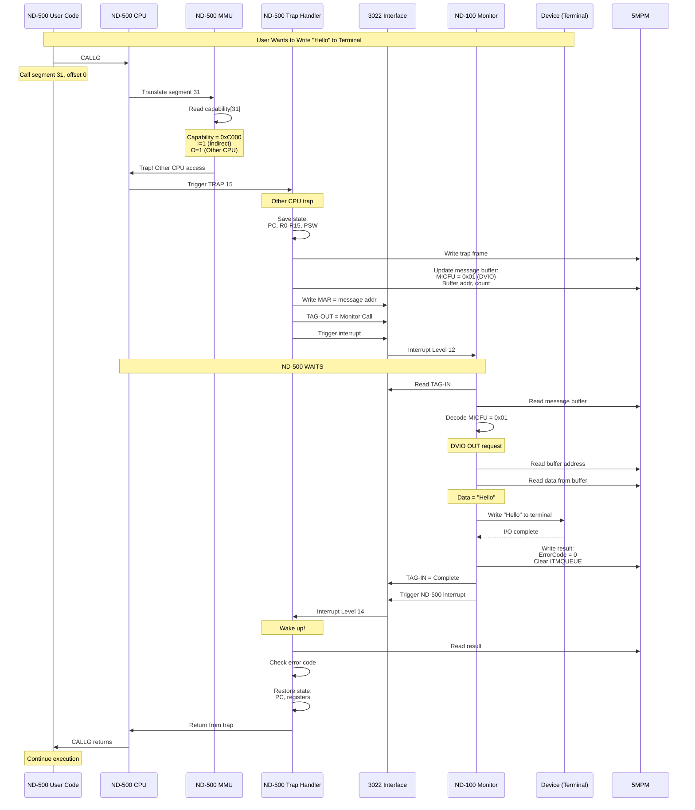

# SINTRAN Domain Setup - Deep Dive

**How SINTRAN (ND-100 Monitor) Actually Sets Up ND-500 Domains**

**Version:** 1.0
**Date:** 2025-11-06
**Purpose:** Deep technical explanation of SINTRAN's internal domain setup process from the ND-100 monitor's perspective.

---

## Table of Contents

1. [Overview - The Big Picture](#1-overview---the-big-picture)
2. [Data Structures in Memory](#2-data-structures-in-memory)
3. [Phase 1: System Boot - 5MPM Initialization](#3-phase-1-system-boot---5mpm-initialization)
4. [Phase 2: PLACE-DOMAIN Command Flow](#4-phase-2-place-domain-command-flow)
5. [Phase 3: Process Descriptor Allocation](#5-phase-3-process-descriptor-allocation)
6. [Phase 4: Message Buffer Setup](#6-phase-4-message-buffer-setup)
7. [Phase 5: Domain File Reading](#7-phase-5-domain-file-reading)
8. [Phase 6: ND-500 MMU Configuration](#8-phase-6-nd-500-mmu-configuration)
9. [Phase 7: Page Table Initialization](#9-phase-7-page-table-initialization)
10. [Phase 8: Hardware Activation](#10-phase-8-hardware-activation)
11. [Complete Code Walkthrough](#11-complete-code-walkthrough)
12. [Memory Layout Examples](#12-memory-layout-examples)

---

## 1. Overview - The Big Picture

### 1.1 What Actually Happens

When you type `@ND-500 MYPROGRAM`, here's what SINTRAN (the ND-100 operating system) does:

```
User Command:  @ND-500 MYPROGRAM
       ↓
1. SINTRAN parser recognizes ND-500 command
       ↓
2. Calls N500C command processor (MP-P2-N500.NPL line 358)
       ↓
3. Searches for "MYPROGRAM" in user's DESCRIPTION-FILE:DESC
       ↓
4. If found: Calls PLACE500 (internal domain placement routine)
       ↓
5. PLACE500 allocates structures in 5MPM (multiport memory)
       ↓
6. Reads :PSEG/:DSEG file metadata (NOT the actual code!)
       ↓
7. Creates page tables mapping logical pages → file sectors
       ↓
8. Writes process descriptor to 5MPM
       ↓
9. Activates ND-500 hardware via 3022 interface
       ↓
10. Returns control to user (domain "placed", ready to execute)
```

**KEY INSIGHT**: PLACE-DOMAIN does **NOT** load any code into ND-500 memory. It only creates metadata structures that tell the system WHERE to find code when needed.

### 1.2 The Players

**ND-100 Side (Control Processor):**
- **SINTRAN Monitor**: Operating system kernel running on ND-100
- **3022 Interface Card**: Hardware connection to ND-500
- **5MPM (Multiport Memory)**: Shared physical RAM accessible by both CPUs
- **ND-100 File System**: Stores :PSEG, :DSEG, :DESC files

**ND-500 Side (Compute Processor):**
- **ND-500 CPU**: Computation engine (byte-addressed, 32 segments)
- **5015 Controller Card**: Hardware interface to ND-100
- **ND-500 Physical Memory**: Separate RAM (not shared except 5MPM region)
- **ND-500 MMU**: Memory Management Unit for virtual memory

**Shared Region:**
- **5MPM**: Physical memory visible to both CPUs
- Contains: Process descriptors, message buffers, XMSG kernel

---

## 2. Data Structures in Memory

### 2.1 Global Variables (SINTRAN Monitor)

**From MP-P2-N500.NPL:**

```npl
% Global pointers and counters
INTEGER 5MBBANK                    % Bank number for 5MPM
INTEGER ADRZERO                    % Physical base address of 5MPM
INTEGER "S500S"                    % Start of process descriptor table
INTEGER "S500E"                    % End of process descriptor table
INTEGER MX5PROCS                   % Maximum number of processes (typically 16)
INTEGER "N500DF"                   % ND-500 datafield (configuration)
INTEGER 5PRDSIZE                   % Size of one process descriptor (words)
INTEGER "55MESSIZE"                % Size of one message buffer (words)

% Process management
INTEGER ARRAY CPUAVAILABLE(0:15)   % Which CPUs are present
INTEGER ARRAY C5DF(0:15)           % CPU datafields (one per CPU)
INTEGER 5SUSPFLAG                  % Any processes suspended?
INTEGER LV1ACT                     % Level 1 activation flag

% File system
INTEGER DESCFILE                   % File descriptor for DESCRIPTION-FILE
INTEGER CURRUSER                   % Current user ID
```

### 2.2 Process Descriptor Structure (in 5MPM)

**Physical layout in multiport memory:**

```
Process Descriptor (5PRDSIZE = 32 words, 64 bytes):

Offset   Field         Size    Description
------   -----         ----    -----------
+0       XADPROC       1 word  Self-pointer (address of this descriptor)
+1       MESSBUFF      1 word  Address of message buffer
+2       STATUS        1 word  Process status flags
+3       SENDE         1 word  Send enable (0=inactive, >0=process ID)
+4       RECE          1 word  Receive state
+5       5MSFL         1 word  Message flags
                                  Bit 0 (5ITMQUEUE): In time queue
                                  Bit 1 (5IEXQUEUE): In execution queue
                                  Bit 2 (5CPUBOUND): Bound to specific CPU
+6       5PRIO         1 word  Priority (0-255, higher = higher priority)
+7       MICFU         1 word  Microcode function code
+8       5ERRC         1 word  Error code
+9-10    TODF          2 words To-datafield address (32-bit)
+11-12   NRBYT         2 words Number of bytes (32-bit)
+13-14   N500A         2 words ND-500 address (32-bit logical address)
+15-16   N100A         2 words ND-100 address (32-bit physical address)
+17      XMICF         1 word  Extended microcode function
+18      5DITN         1 word  DIT number (device independent tape)
+19      5CPUN         1 word  CPU number (which ND-500 if multiple)
+20      L500C         1 word  Link to L500 context
+21      5TSLC         1 word  Timeslice counter
+22-23   5TSLD         2 words Timeslice data (double word)
+24      SUSPC         1 word  Suspend counter
+25      DOMAINREF     1 word  Reference to domain descriptor
+26-31   (Reserved)    6 words Extended/reserved fields
```

**Status Flags (STATUS word, offset +2):**

```
Bit 0:   PSW1WAIT    - Process waiting
Bit 1:   PSANSW      - Process has answer
Bit 2:   PSTMO       - Timeout occurred
Bit 3:   PSSUSPST    - Process suspended
Bit 4:   PSRUN       - Process running
Bit 5:   PSTERM      - Process terminated
Bit 6:   PSBREAK     - Break priority requested
Bit 7:   PSERROR     - Error state
```

### 2.3 Message Buffer Structure (in 5MPM)

**Physical layout (55MESSIZE = 128 words = 256 bytes):**

```
Message Buffer:

Offset   Field      Size    Description
------   -----      ----    -----------
+0       PLINK      1 word  Process link (chain pointer)
+1       5MSFL      1 word  Message flags (copy of descriptor flags)
+2       5PRIO      1 word  Priority
+3       MICFU      1 word  Microcode function
+4       5ERRC      1 word  Error code
+5-6     TODF       2 words To-datafield
+7-8     NRBYT      2 words Byte count
+9-10    N500A      2 words ND-500 address
+11-12   N100A      2 words ND-100 address
+13      XMICF      1 word  Extended function
+14      5DITN      1 word  DIT number
+15      5CPUN      1 word  CPU number
+16-127  DATA       112 wds Data buffer (224 bytes)
```

### 2.4 Domain Descriptor (read from :DESC file)

**Structure read from DESCRIPTION-FILE:**

```
Domain Entry in :DESC File:

Field              Size     Description
-----              ----     -----------
Domain Name        16 chars ASCII name
Entry Segment      1 word   Segment number for PC start (0-31)
Entry Offset       1 word   Offset within segment for PC start
Number of Segments 1 word   How many segments (1-32)

For each segment:
  Segment Number   1 word   Logical segment number (0-31)
  PSEG File Name   20 chars Name of :PSEG file
  DSEG File Name   20 chars Name of :DSEG file (or empty)
  LINK File Name   20 chars Name of :LINK file (or empty)
  PSEG Size        2 words  Size in bytes (32-bit)
  DSEG Size        2 words  Size in bytes (32-bit)
  Attributes       1 word   Public, Shared, etc.

Trap Configuration:
  OTE1             2 words  Own Trap Enable register 1
  OTE2             2 words  Own Trap Enable register 2
  CTE1             2 words  Child Trap Enable register 1
  CTE2             2 words  Child Trap Enable register 2

Trap Handlers (32 entries):
  Handler Address  2 words  Segment:Offset for each trap (0-31)
```

---

## 3. Phase 1: System Boot - 5MPM Initialization

### 3.1 When SINTRAN Boots

**In SINTR routine (PH-P2-OPPSTART.NPL, boot sequence):**

```npl
% Early boot - detect ND-500
CALL SYSEVAL              % Detect CPU type (ND-100/110/120)
CALL DETECTND500          % Check for ND-500 coprocessor

IF ND500PRESENT THEN
   % Allocate 5MPM (multiport memory)
   CALL INIT5MPM

   % Initialize process table
   CALL INIT5PROCS

   % Load XMSG communication kernel
   CALL LOAD5XMSG
FI
```

### 3.2 INIT5MPM - Allocate Multiport Memory

**Pseudo-code for 5MPM initialization:**

```npl
INIT5MPM:
   % Calculate size needed
   SIZE:=5PRDSIZE * MX5PROCS +      % Process descriptors
         55MESSIZE * MX5PROCS +      % Message buffers
         XMSGKERNELSIZE +             % XMSG kernel code
         SHAREDATASIZE                % Shared data area

   % Round up to page boundary
   PAGES:=(SIZE + 511) / 512

   % Allocate contiguous physical pages
   % This reserves physical RAM for 5MPM
   FIRSTPAGE:=ALLOCPHYSPAGES(PAGES)
   IF FIRSTPAGE=0 THEN
      CALL ERRFATAL("Cannot allocate 5MPM")
   FI

   % Calculate addresses
   5MBBANK:=FIRSTPAGE / 256            % Bank number (for bank registers)
   ADRZERO:=FIRSTPAGE * 512            % Physical byte address

   % Save in system tables
   "N500DF".ADRZERO:=ADRZERO
   "N500DF".5MBBANK:=5MBBANK
   "N500DF".5MPMSIZE:=SIZE

   % Clear 5MPM memory
   T:=5MBBANK; X:=0
   DO I:=0 TO SIZE-1
      0; *IOXT X+I                     % Write 0 to each word
   OD

   % Calculate structure pointers
   "S500S":=0                           % Process table at start
   "S500E":=5PRDSIZE * MX5PROCS        % End of process table
   MSGBUFFPOOL:="S500E"                % Message buffers after processes
   XMSGBASE:=MSGBUFFPOOL + (55MESSIZE * MX5PROCS)

   % Mark 5MPM pages as "bypass cache" in ND-100 MMU
   % This is CRITICAL for coherency!
   DO PAGENUM:=FIRSTPAGE TO FIRSTPAGE+PAGES-1
      SETPAGEFLAGS(PAGENUM, BYPASS_CACHE)
   OD

   % Configure 3022 interface card
   CALL CONFIG3022
```

### 3.3 INIT5PROCS - Initialize Process Table

```npl
INIT5PROCS:
   T:=5MBBANK                          % Select 5MPM bank

   % Initialize each process descriptor slot
   DO PROCNUM:=0 TO MX5PROCS-1
      % Calculate descriptor address
      PROCADDR:="S500S" + (PROCNUM * 5PRDSIZE)

      % Calculate message buffer address
      MSGADDR:=MSGBUFFPOOL + (PROCNUM * 55MESSIZE)

      % Write descriptor
      X:=PROCADDR
      PROCADDR;        *IOXT X+0       % XADPROC (self-pointer)
      MSGADDR;         *IOXT X+1       % MESSBUFF
      0;               *IOXT X+2       % STATUS (inactive)
      0;               *IOXT X+3       % SENDE (not enabled)
      0;               *IOXT X+4       % RECE
      0;               *IOXT X+5       % 5MSFL (no flags)
      100;             *IOXT X+6       % 5PRIO (default priority)

      % Clear rest of descriptor
      DO OFFSET:=7 TO 5PRDSIZE-1
         0; *IOXT X+OFFSET
      OD

      % Initialize message buffer
      X:=MSGADDR
      0; *IOXT X+0                     % PLINK (empty chain)
      % ... clear all message fields ...
   OD

   % Mark process 0 as reserved for swapper
   X:="S500S"
   1; *IOXT X+3                        % SENDE=1 (swapper process)
```

### 3.4 CONFIG3022 - Configure Hardware Interface

```npl
CONFIG3022:
   % Get hardware device address
   HDEV:="N500DF".HWDEVICE

   % Master clear interface
   T:=HDEV+MCLR5; *IOXT

   % Set ADRZERO (5MPM base) in interface registers
   A:=ADRZERO SHZ -16; T:=HDEV+LMAR5; *IOXT    % High word
   A:=ADRZERO/\177777; T:=HDEV+LDAT5; *IOXT    % Low word

   % Enable interrupts on level 12
   A:=10; T:=HDEV+LCON5; *IOXT                 % Enable interrupt

   % Check interface status
   T:=HDEV+RSTA5; *IOXT
   IF A BIT 5DMAER OR A BIT 5PAGF THEN
      CALL ERRFATAL("ND-500 interface error")
   FI
```

---

## 4. Phase 2: PLACE-DOMAIN Command Flow

### 4.1 User Command Processing

**When user types: `@ND-500 MYPROGRAM`**

```npl
% From MP-P2-N500.NPL, line 358
N500C:  % ND-500 command processor
   % Parse command line
   CALL SCANTEXT(CMDLINE, DOMAINNAME)

   % Is this PLACE-DOMAIN, RECOVER-DOMAIN, or just domain name?
   IF CMDLINE="PLACE-DOMAIN" THEN
      CALL PLACE500(DOMAINNAME)
      EXIT
   FI

   IF CMDLINE="RECOVER-DOMAIN" OR CMDLINE="" THEN
      % RECOVER = PLACE + GO
      CALL PLACE500(DOMAINNAME)
      CALL GO500(DOMAINNAME)
      EXIT
   FI

   % Check for other commands (FIX-SEGMENT, etc.)
   ...
```

### 4.2 PLACE500 - Main Domain Placement Routine

**High-level flow:**

```npl
PLACE500:DOMAINNAME
   % 1. Find free process descriptor
   PROCNUM:=FINDFREEPROCNR()
   IF PROCNUM<0 THEN
      CALL ERRPRINT("No free process slots")
      EXIT
   FI

   % 2. Open DESCRIPTION-FILE
   DESCFILE:=OPENFILE("DESCRIPTION-FILE:DESC", READ)
   IF DESCFILE<0 THEN
      CALL ERRPRINT("Cannot open DESCRIPTION-FILE")
      EXIT
   FI

   % 3. Search for domain
   FOUND:=FALSE
   DO WHILE NOT EOF(DESCFILE)
      CALL READDESCENTRY(DESCFILE, DOMAIN)
      IF DOMAIN.NAME=DOMAINNAME THEN
         FOUND:=TRUE
         GO FOUND_DOMAIN
      FI
   OD

   IF NOT FOUND THEN
      CALL ERRPRINT("Domain not found: ", DOMAINNAME)
      CALL CLOSEFILE(DESCFILE)
      EXIT
   FI

FOUND_DOMAIN:
   % 4. Allocate and initialize process descriptor
   CALL CREATE5PROC(PROCNUM, DOMAIN)

   % 5. For each segment, create page tables
   DO SEGNUM:=0 TO DOMAIN.NUMSEGMENTS-1
      SEG:=DOMAIN.SEGMENTS(SEGNUM)

      % Create page table for PSEG
      IF SEG.PSEGFILE<>"" THEN
         CALL CREATEPAGETABLE(PROCNUM, SEGNUM, SEG, PROGRAM)
      FI

      % Create page table for DSEG
      IF SEG.DSEGFILE<>"" THEN
         CALL CREATEPAGETABLE(PROCNUM, SEGNUM, SEG, DATA)
      FI
   OD

   % 6. Setup ND-500 segment capabilities
   CALL SETUP5CAPABILITIES(PROCNUM, DOMAIN)

   % 7. Initialize trap handlers
   CALL SETUP5TRAPS(PROCNUM, DOMAIN)

   % 8. Allocate swap space
   CALL ALLOCSWAPSPACE(PROCNUM, DOMAIN)

   % 9. Write process descriptor to 5MPM
   CALL WRITE5PROC(PROCNUM)

   % 10. Close files
   CALL CLOSEFILE(DESCFILE)

   CALL PRINTMSG("Domain ", DOMAINNAME, " placed as process ", PROCNUM)
```

---

## 5. Phase 3: Process Descriptor Allocation

### 5.1 FINDFREEPROCNR - Find Available Slot

```npl
FINDFREEPROCNR:
   T:=5MBBANK                          % Select 5MPM bank

   % Process 0 is reserved for swapper, skip it
   DO PROCNUM:=1 TO MX5PROCS-1
      PROCADDR:="S500S" + (PROCNUM * 5PRDSIZE)
      X:=PROCADDR

      % Read SENDE field (offset +3)
      *AAX 3; LDATX                    % SENDE field

      IF A=0 THEN                      % SENDE=0 means inactive
         RETURN PROCNUM
      FI
   OD

   RETURN -1                           % No free slots
```

### 5.2 CREATE5PROC - Initialize Process Descriptor

```npl
CREATE5PROC:PROCNUM, DOMAIN
   % Calculate addresses
   PROCADDR:="S500S" + (PROCNUM * 5PRDSIZE)
   MSGADDR:=MSGBUFFPOOL + (PROCNUM * 55MESSIZE)

   T:=5MBBANK                          % Select 5MPM bank
   X:=PROCADDR

   % Write basic descriptor fields
   PROCADDR;        *IOXT X+0          % XADPROC
   MSGADDR;         *IOXT X+1          % MESSBUFF
   0;               *IOXT X+2          % STATUS
   PROCNUM;         *IOXT X+3          % SENDE (mark as active!)
   0;               *IOXT X+4          % RECE
   0;               *IOXT X+5          % 5MSFL
   100;             *IOXT X+6          % 5PRIO (default)
   0;               *IOXT X+7          % MICFU
   0;               *IOXT X+8          % 5ERRC

   % Create domain context structure in ND-100 RAM
   % (Not in 5MPM - this is SINTRAN's internal tracking)
   DOMAINCTX:=ALLOCMEM(DOMAINCTXSIZE)
   DOMAINCTX.PROCNUM:=PROCNUM
   DOMAINCTX.NAME:=DOMAIN.NAME
   DOMAINCTX.ENTRYSEG:=DOMAIN.ENTRYSEG
   DOMAINCTX.ENTRYOFFSET:=DOMAIN.ENTRYOFFSET
   DOMAINCTX.NUMSEGMENTS:=DOMAIN.NUMSEGMENTS

   % Allocate segment table
   DOMAINCTX.SEGMENTS:=ALLOCMEM(32 * SEGMENTDESCSIZE)

   % Save reference to domain context
   *IOXT X+25                          % Write to DOMAINREF field
   DOMAINCTX; *IOXT X+25
```

---

## 6. Phase 4: Message Buffer Setup

### 6.1 Initialize Message Buffer

```npl
INITMSGBUFFER:PROCNUM
   MSGADDR:=MSGBUFFPOOL + (PROCNUM * 55MESSIZE)

   T:=5MBBANK
   X:=MSGADDR

   % Clear all fields
   0; *IOXT X+0                        % PLINK
   0; *IOXT X+1                        % 5MSFL
   100; *IOXT X+2                      % 5PRIO
   0; *IOXT X+3                        % MICFU
   0; *IOXT X+4                        % 5ERRC

   % Clear double-word fields
   0; *IOXT X+5                        % TODF high
   0; *IOXT X+6                        % TODF low
   0; *IOXT X+7                        % NRBYT high
   0; *IOXT X+8                        % NRBYT low
   0; *IOXT X+9                        % N500A high
   0; *IOXT X+10                       % N500A low
   0; *IOXT X+11                       % N100A high
   0; *IOXT X+12                       % N100A low

   % Clear extended fields
   DO OFFSET:=13 TO 55MESSIZE-1
      0; *IOXT X+OFFSET
   OD
```

---

## 7. Phase 5: Domain File Reading

### 7.1 READDESCENTRY - Read Domain from :DESC File

```npl
READDESCENTRY:DESCFILE, DOMAIN
   % Read domain header
   CALL READFILE(DESCFILE, DOMAIN.NAME, 16)           % Name
   CALL READFILE(DESCFILE, DOMAIN.ENTRYSEG, 2)        % Entry segment
   CALL READFILE(DESCFILE, DOMAIN.ENTRYOFFSET, 2)     % Entry offset
   CALL READFILE(DESCFILE, DOMAIN.NUMSEGMENTS, 2)     % Number of segments

   % Read each segment descriptor
   DO I:=0 TO DOMAIN.NUMSEGMENTS-1
      SEG:=DOMAIN.SEGMENTS(I)

      CALL READFILE(DESCFILE, SEG.SEGNUM, 2)          % Segment number
      CALL READFILE(DESCFILE, SEG.PSEGFILE, 20)       % :PSEG filename
      CALL READFILE(DESCFILE, SEG.DSEGFILE, 20)       % :DSEG filename
      CALL READFILE(DESCFILE, SEG.LINKFILE, 20)       % :LINK filename
      CALL READFILE(DESCFILE, SEG.PSEGSIZE, 4)        % PSEG size (32-bit)
      CALL READFILE(DESCFILE, SEG.DSEGSIZE, 4)        % DSEG size (32-bit)
      CALL READFILE(DESCFILE, SEG.ATTRIBUTES, 2)      % Attributes
   OD

   % Read trap configuration
   CALL READFILE(DESCFILE, DOMAIN.OTE1, 4)            % OTE1
   CALL READFILE(DESCFILE, DOMAIN.OTE2, 4)            % OTE2
   CALL READFILE(DESCFILE, DOMAIN.CTE1, 4)            % CTE1
   CALL READFILE(DESCFILE, DOMAIN.CTE2, 4)            % CTE2

   % Read trap handlers
   DO TRAPNUM:=0 TO 31
      CALL READFILE(DESCFILE, DOMAIN.TRAPHANDLER(TRAPNUM), 4)
   OD
```

### 7.2 Get File Metadata (NOT File Contents!)

**CRITICAL**: SINTRAN does NOT read the actual code from :PSEG/:DSEG files. It only gets metadata:

```npl
GETFILESECTORS:FILENAME, METADATA
   % Open file
   FD:=OPENFILE(FILENAME, READ)
   IF FD<0 THEN
      CALL ERRPRINT("Cannot open file: ", FILENAME)
      RETURN FALSE
   FI

   % Get file info (NOT contents!)
   CALL GETFILEINFO(FD, FILEINFO)

   METADATA.FILESIZE:=FILEINFO.SIZE        % Size in bytes
   METADATA.FIRSTSECTOR:=FILEINFO.STARTSECTOR  % First disk sector
   METADATA.NUMSECTORS:=FILEINFO.SECTORCOUNT    % Total sectors
   METADATA.FILENAME:=FILENAME

   % Close file (we don't read it!)
   CALL CLOSEFILE(FD)

   RETURN TRUE
```

---

## 8. Phase 6: ND-500 MMU Configuration

### 8.1 SETUP5CAPABILITIES - Configure Segment Capabilities

**For each segment, SINTRAN writes "capability" words that configure the ND-500 MMU:**

```npl
SETUP5CAPABILITIES:PROCNUM, DOMAIN
   T:=5MBBANK
   X:="S500S" + (PROCNUM * 5PRDSIZE) + CAPOFFSET

   % For each logical segment (0-31)
   DO SEGNUM:=0 TO 31
      SEG:=FINDSEGINDOM(DOMAIN, SEGNUM)

      IF SEG=NULL THEN
         % Segment not used
         PROGCAP:=0
         DATACAP:=0
      ELSE
         % Calculate physical segment number
         PHYSSEG:=ALLOCPHYSSEG500(PROCNUM, SEGNUM)

         % Program capability: Direct segment
         PROGCAP:=PHYSSEG                     % Bits 11-0 = physical seg
         % Bit 15=0 means "direct" (not indirect)

         % Data capability: Write allowed, Shared if 5MPM
         DATACAP:=0x8000 OR PHYSSEG           % Bit 15=1 (Write allowed)

         % If this physical segment is in 5MPM range, set S bit!
         IF PHYSSEG_IN_5MPM(PHYSSEG) THEN
            DATACAP:=DATACAP OR 0x2000        % Bit 13=1 (Shared, bypass cache!)
         FI
      FI

      % Write to process descriptor
      PROGCAP; *IOXT X+(SEGNUM*2)            % Program capability
      DATACAP; *IOXT X+(SEGNUM*2+1)          % Data capability
   OD

   % Segment 31 is special: Indirect (for monitor calls to ND-100)
   PROGCAP:=0x8000 OR 0x4000                 % Indirect, Other CPU
   DATACAP:=0x8000 OR 0x4000
   PROGCAP; *IOXT X+(31*2)
   DATACAP; *IOXT X+(31*2+1)
```

**Capability Encoding:**

```
Program Capability (16 bits):
┌───┬───┬───┬────────────────┐
│ I │ O │ 0 │ Physical Seg # │
└───┴───┴───┴────────────────┘
 15  14  13  12          0

I=1: Indirect segment (segment 31 for monitor calls)
O=1: Other CPU (ND-100)
Physical Seg #: 0-4095 (12 bits)

Data Capability (16 bits):
┌───┬───┬───┬───┬────────────────┐
│ W │ P │ S │ 0 │ Physical Seg # │
└───┴───┴───┴───┴────────────────┘
 15  14  13  12  11          0

W=1: Write allowed
P=1: Parameter passing allowed
S=1: Shared (bypass cache) ← CRITICAL for 5MPM!
Physical Seg #: 0-4095
```

### 8.2 Why "S" Bit Matters

**Cache Coherency Problem:**

```
Without S bit (cached):
  ND-100 writes to 5MPM → Goes to ND-100's cache
  ND-500 reads from 5MPM → Reads old value from RAM!
  ❌ Data corruption!

With S bit (bypass cache):
  ND-100 writes to 5MPM → Writes directly to RAM
  ND-500 reads from 5MPM → Reads fresh value from RAM
  ✅ Coherent data!
```

---

## 9. Phase 7: Page Table Initialization

### 9.1 CREATEPAGETABLE - Setup Page Mappings

**This is where SINTRAN creates the mapping from logical pages to file sectors:**

```npl
CREATEPAGETABLE:PROCNUM, SEGNUM, SEG, SEGTYPE
   % Determine size and file
   IF SEGTYPE=PROGRAM THEN
      FILESIZE:=SEG.PSEGSIZE
      FILENAME:=SEG.PSEGFILE
   ELSE
      FILESIZE:=SEG.DSEGSIZE
      FILENAME:=SEG.DSEGFILE
   FI

   % Get file sector information
   CALL GETFILESECTORS(FILENAME, METADATA)

   % Calculate number of pages (4KB each)
   PAGESIZE:=4096
   NUMPAGES:=(FILESIZE + PAGESIZE - 1) / PAGESIZE

   % Allocate page table in ND-100 RAM (NOT in 5MPM!)
   PAGETABLE:=ALLOCMEM(NUMPAGES * PAGETABLEENTRYSIZE)

   % Fill page table
   DO PAGENUM:=0 TO NUMPAGES-1
      ENTRY:=PAGETABLE(PAGENUM)

      % Calculate file sector for this page
      % 1 page = 4KB = 8 sectors (512 bytes/sector)
      ENTRY.SOURCEFILE:=FILENAME
      ENTRY.SOURCESECTOR:=METADATA.FIRSTSECTOR + (PAGENUM * 8)
      ENTRY.PRESENT:=FALSE              % NOT loaded yet!
      ENTRY.MODIFIED:=FALSE
      ENTRY.USED:=FALSE
      ENTRY.FIXED:=FALSE                % Can be swapped
      ENTRY.PHYSICALPAGE:=0             % No physical page yet
      ENTRY.SWAPSECTOR:=0               % Not in swap yet
   OD

   % Save page table reference in domain context
   IF SEGTYPE=PROGRAM THEN
      DOMAINCTX.SEGMENTS(SEGNUM).PSEGPAGETABLE:=PAGETABLE
   ELSE
      DOMAINCTX.SEGMENTS(SEGNUM).DSEGPAGETABLE:=PAGETABLE

      % Allocate swap space for data pages
      SWAPBASE:=ALLOCSWAPSECTORS(NUMPAGES * 8)
      DO PAGENUM:=0 TO NUMPAGES-1
         PAGETABLE(PAGENUM).SWAPSECTOR:=SWAPBASE + (PAGENUM * 8)
      OD
   FI
```

**Page Table Entry Structure (in ND-100 RAM, not 5MPM):**

```
Page Table Entry (one per page):

Field              Type       Description
-----              ----       -----------
SOURCEFILE         String     Name of :PSEG or :DSEG file
SOURCESECTOR       Integer    Sector number in file (0-based)
PRESENT            Boolean    TRUE if page is in ND-500 memory
MODIFIED           Boolean    TRUE if page has been written to
USED               Boolean    TRUE if page recently accessed
FIXED              Boolean    TRUE if page cannot be swapped
PHYSICALPAGE       Integer    ND-500 physical page number (if PRESENT)
SWAPSECTOR         Integer    Swap file sector (for modified DSEG pages)
```

### 9.2 Memory Layout After Page Tables Created

**After PLACE-DOMAIN completes:**

```
ND-100 RAM:
┌─────────────────────────────┐
│ SINTRAN Monitor             │
├─────────────────────────────┤
│ Process Descriptors (table) │ ← DOMAINCTX structures
│   Process 0: SWAPPER        │
│   Process 1: [free]         │
│   Process 2: MYPROGRAM  ←─┐ │
│   ...                       │ │
├─────────────────────────────┤ │
│ Domain Context #2           │←┘
│   Name: "MYPROGRAM"         │
│   Entry: Seg 1, Off 0x100   │
│   Segments:                 │
│     Seg 1: ──────────┐      │
│       PSEG Table: ───┼──┐   │
│       DSEG Table: ───┼┐ │   │
├─────────────────────┼┼─┼───┤
│ Page Table (PSEG)   │← │   │
│   Page 0:           │  │   │
│     File: MAIN:PSEG │  │   │
│     Sector: 0       │  │   │
│     PRESENT: FALSE  │  │   │
│   Page 1:           │  │   │
│     File: MAIN:PSEG │  │   │
│     Sector: 8       │  │   │
│     PRESENT: FALSE  │  │   │
│   ...               │  │   │
├─────────────────────┘  │   │
│ Page Table (DSEG)   ←──┘   │
│   Page 0:                  │
│     File: MAIN:DSEG        │
│     Sector: 0              │
│     PRESENT: FALSE         │
│     SwapSector: 1000       │
│   ...                      │
└────────────────────────────┘

5MPM (Multiport Memory):
┌─────────────────────────────┐
│ Process Descriptor #2       │
│   XADPROC: [addr]           │
│   MESSBUFF: [addr]          │
│   STATUS: 0                 │
│   SENDE: 2 (active!)        │
│   Capabilities: [64 words]  │
│   PC: Seg 1, Off 0x100      │
├─────────────────────────────┤
│ Message Buffer #2           │
│   (cleared, ready for I/O)  │
└─────────────────────────────┘

ND-500 Physical Memory:
┌─────────────────────────────┐
│ [EMPTY!]                    │
│ No pages loaded yet!        │
│ Will be loaded on-demand    │
└─────────────────────────────┘

Disk:
┌─────────────────────────────┐
│ MAIN:PSEG                   │
│   Sector 0-7: Code page 0   │
│   Sector 8-15: Code page 1  │
│   ...                       │
├─────────────────────────────┤
│ MAIN:DSEG                   │
│   Sector 0-7: Data page 0   │
│   Sector 8-15: Data page 1  │
│   ...                       │
├─────────────────────────────┤
│ SWAP-FILE                   │
│   Sector 1000-1007: [empty] │ ← Reserved for page 0
│   Sector 1008-1015: [empty] │ ← Reserved for page 1
│   ...                       │
└─────────────────────────────┘
```

**KEY INSIGHT**: Look at ND-500 Physical Memory - it's **EMPTY**! No code loaded!

---

## 10. Phase 8: Hardware Activation

### 10.1 WRITE5PROC - Write to 5MPM and Activate

```npl
WRITE5PROC:PROCNUM
   % All data structures are ready, now activate hardware

   % 1. Ensure process descriptor is written to 5MPM
   % (Done in CREATE5PROC, but verify)
   T:=5MBBANK
   X:="S500S" + (PROCNUM * 5PRDSIZE)
   *AAX 3; LDATX                       % Read SENDE
   IF A<>PROCNUM THEN
      CALL ERRFATAL("Process descriptor corrupted")
   FI

   % 2. Configure 3022 interface
   HDEV:="N500DF".HWDEVICE

   % 3. Write process number to interface
   A:=PROCNUM; T:=HDEV+LDAT5; *IOXT   % Tell hardware which process

   % 4. Set control: Process ready (but not started yet!)
   A:=1; T:=HDEV+LCON5; *IOXT         % Control = Ready

   % Process is now "placed" but not running
```

### 10.2 GO500 - Actually Start Execution

**If user typed RECOVER-DOMAIN or just domain name:**

```npl
GO500:PROCNUM
   HDEV:="N500DF".HWDEVICE

   % Get process descriptor address in 5MPM
   PROCADDR:="S500S" + (PROCNUM * 5PRDSIZE)

   % Write process address to MAR (Memory Address Register)
   A:=PROCADDR SHZ -16; T:=HDEV+LMAR5; *IOXT  % High word
   A:=PROCADDR/\177777; T:=HDEV+LMAR5; *IOXT  % Low word

   % Activate ND-500 with this process
   A:=5; T:=HDEV+LCON5; *IOXT                 % Control = Activate

   % Enable interrupts so ND-500 can signal back
   A:=10; T:=HDEV+LCON5; *IOXT                % Enable interrupt

   % ND-500 is NOW RUNNING!
   % First instruction access will cause page fault
   % Page fault will trigger interrupt level 12
   % Interrupt handler will load page from :PSEG file
```

---

## 11. Complete Code Walkthrough

### 11.1 Actual NPL Code Sequence

**From command to execution (annotated):**

```npl
% USER TYPES: @ND-500 MYPROGRAM

% =========================================
% STEP 1: Command Parser
% =========================================
N500C:  % Line 358 in MP-P2-N500.NPL
   % Scan command line
   CALL SCANTEXT(CMDLINE, ARG1)

   IF ARG1="" OR ARG1="RECOVER-DOMAIN" THEN
      % Just domain name = RECOVER-DOMAIN
      GO RECOVER_FLOW
   FI

   IF ARG1="PLACE-DOMAIN" THEN
      GO PLACE_FLOW
   FI

   % ... other commands ...

% =========================================
% STEP 2: RECOVER = PLACE + GO
% =========================================
RECOVER_FLOW:
   CALL SCANTEXT(CMDLINE, DOMAINNAME)

   % PLACE-DOMAIN first
   CALL PLACE500(DOMAINNAME)
   IF ERRORFLAG THEN EXIT FI

   % Then GO
   CALL GO500(LASTVERYPROC)
   EXIT

% =========================================
% STEP 3: PLACE500 - Main Placement
% =========================================
PLACE500:DOMAINNAME
   % Find free process
   PROCNUM:=-1
   T:=5MBBANK
   DO I:=1 TO MX5PROCS-1              % Skip process 0 (swapper)
      X:="S500S" + (I * 5PRDSIZE) + 3 % Offset to SENDE
      *LDATX
      IF A=0 THEN                     % SENDE=0 means free
         PROCNUM:=I
         GO FOUND_PROC
      FI
   OD

   IF PROCNUM<0 THEN
      CALL ERRPRINT("No free process slots")
      ERRORFLAG:=TRUE
      EXIT
   FI

FOUND_PROC:
   LASTVERYPROC:=PROCNUM               % Save for GO later

   % Open DESCRIPTION-FILE
   CALL OPENFILEF("DESCRIPTION-FILE:DESC", DESCFILE)
   IF DESCFILE<0 THEN
      CALL ERRPRINT("Cannot open DESCRIPTION-FILE")
      ERRORFLAG:=TRUE
      EXIT
   FI

   % Search for domain
   DO WHILE NOT EOF(DESCFILE)
      % Read domain name (16 bytes)
      CALL READREC(DESCFILE, TEMPNAME, 16)

      IF TEMPNAME=DOMAINNAME THEN
         GO FOUND_DOMAIN
      FI

      % Skip rest of this entry
      CALL SKIPREC(DESCFILE, DESCSIZE-16)
   OD

   CALL ERRPRINT("Domain not found: ", DOMAINNAME)
   ERRORFLAG:=TRUE
   EXIT

FOUND_DOMAIN:
   % Read entry point
   CALL READREC(DESCFILE, ENTRYSEG, 2)     % Segment number
   CALL READREC(DESCFILE, ENTRYOFF, 2)     % Offset

   % Read number of segments
   CALL READREC(DESCFILE, NUMSEG, 2)

   % For each segment...
   DO SEGIDX:=0 TO NUMSEG-1
      % Read segment descriptor
      CALL READREC(DESCFILE, SEGNUM, 2)
      CALL READREC(DESCFILE, PSEGNAME, 20)
      CALL READREC(DESCFILE, DSEGNAME, 20)
      CALL READREC(DESCFILE, LINKNAME, 20)
      CALL READREC(DESCFILE, PSEGSIZE, 4)    % 32-bit size
      CALL READREC(DESCFILE, DSEGSIZE, 4)    % 32-bit size
      CALL READREC(DESCFILE, ATTR, 2)

      % Get file sector info (NOT file contents!)
      IF PSEGNAME<>"" THEN
         CALL GETFILEINFO(PSEGNAME, PSEGINFO)
      FI
      IF DSEGNAME<>"" THEN
         CALL GETFILEINFO(DSEGNAME, DSEGINFO)
      FI

      % Create page tables in ND-100 RAM
      IF PSEGNAME<>"" THEN
         PSPAGES:=(PSEGSIZE+4095)/4096
         PSPAGETABLE:=ALLOCMEM(PSPAGES * PTENTRYSIZE)

         % Fill page table
         DO PG:=0 TO PSPAGES-1
            PSPAGETABLE(PG).FILE:=PSEGNAME
            PSPAGETABLE(PG).SECTOR:=PSEGINFO.SECTOR + (PG*8)
            PSPAGETABLE(PG).PRESENT:=FALSE
            PSPAGETABLE(PG).PHYSPAGE:=0
         OD
      FI

      IF DSEGNAME<>"" THEN
         DSPAGES:=(DSEGSIZE+4095)/4096
         DSPAGETABLE:=ALLOCMEM(DSPAGES * PTENTRYSIZE)

         % Fill page table
         DO PG:=0 TO DSPAGES-1
            DSPAGETABLE(PG).FILE:=DSEGNAME
            DSPAGETABLE(PG).SECTOR:=DSEGINFO.SECTOR + (PG*8)
            DSPAGETABLE(PG).PRESENT:=FALSE
            DSPAGETABLE(PG).PHYSPAGE:=0

            % Allocate swap sector
            DSPAGETABLE(PG).SWAPSECTOR:=ALLOCSWAP(8)
         OD
      FI

      % Save in domain context
      DOMCTX.SEG(SEGNUM).PSTABLE:=PSPAGETABLE
      DOMCTX.SEG(SEGNUM).DSTABLE:=DSPAGETABLE
   OD

   % Read trap configuration
   CALL READREC(DESCFILE, OTE1, 4)
   CALL READREC(DESCFILE, OTE2, 4)
   CALL READREC(DESCFILE, CTE1, 4)
   CALL READREC(DESCFILE, CTE2, 4)

   % Close DESCRIPTION-FILE
   CALL CLOSEFILE(DESCFILE)

   % ===================================
   % NOW WRITE TO 5MPM
   % ===================================
   T:=5MBBANK                          % Select 5MPM bank
   X:="S500S" + (PROCNUM * 5PRDSIZE)

   % Write process descriptor
   X;           *IOXT X+0              % XADPROC (self-pointer)
   X+64;        *IOXT X+1              % MESSBUFF (offset from descriptor)
   0;           *IOXT X+2              % STATUS
   PROCNUM;     *IOXT X+3              % SENDE (mark active!)
   0;           *IOXT X+4              % RECE
   0;           *IOXT X+5              % 5MSFL
   100;         *IOXT X+6              % 5PRIO

   % Write PC (entry point)
   % Convert segment:offset to 32-bit address
   PC:=(ENTRYSEG SH 16) OR ENTRYOFF
   PC SHZ -16;  *IOXT X+30             % PC high word
   PC/\177777;  *IOXT X+31             % PC low word

   % Write capabilities for each segment
   DO S:=0 TO 31
      IF DOMCTX.SEG(S).PRESENT THEN
         PHYSSEG:=ALLOCPHYSSEG(PROCNUM, S)

         % Program capability
         PROGCAP:=PHYSSEG

         % Data capability (W=1, S=1 if in 5MPM)
         DATACAP:=0x8000 OR PHYSSEG
         IF IN5MPM(PHYSSEG) THEN
            DATACAP:=DATACAP OR 0x2000  % S bit!
         FI
      ELSE
         PROGCAP:=0
         DATACAP:=0
      FI

      PROGCAP; *IOXT X+64+(S*2)        % Program capabilities start at offset 64
      DATACAP; *IOXT X+64+(S*2+1)
   OD

   % Segment 31 = indirect (monitor)
   0xC000; *IOXT X+64+(31*2)           % I=1, O=1
   0xC000; *IOXT X+64+(31*2+1)

   % Write trap configuration
   OTE1 SHZ -16; *IOXT X+200
   OTE1/\177777; *IOXT X+201
   OTE2 SHZ -16; *IOXT X+202
   OTE2/\177777; *IOXT X+203

   CALL PRINTMSG("Domain placed: process ", PROCNUM)

% =========================================
% STEP 4: GO500 - Activate Hardware
% =========================================
GO500:PROCNUM
   HDEV:="N500DF".HWDEVICE

   % Get process descriptor address in 5MPM
   PROCADDR:="S500S" + (PROCNUM * 5PRDSIZE)

   % Convert to physical address
   PHYSADDR:=ADRZERO + (PROCADDR * 2)  % Words to bytes

   % Write to MAR (Memory Address Register)
   A:=PHYSADDR SHZ -16
   T:=HDEV+LMAR5; *IOXT                % MAR high

   A:=PHYSADDR/\177777
   T:=HDEV+LMAR5; *IOXT                % MAR low

   % Activate ND-500
   A:=5
   T:=HDEV+LCON5; *IOXT                % LCON5 = 5 (Activate)

   % Enable interrupts
   A:=10
   T:=HDEV+LCON5; *IOXT                % Enable interrupt level 12

   CALL PRINTMSG("Domain executing: process ", PROCNUM)

% =========================================
% DONE! ND-500 is now running!
% =========================================
% First instruction access will cause page fault
% Page fault will trigger interrupt to ND-100
% ND-100 interrupt handler (level 12) will:
%   1. Determine which page faulted
%   2. Look up page table
%   3. Read sector from :PSEG file
%   4. Load into ND-500 physical memory
%   5. Update page table (PRESENT=TRUE)
%   6. Resume ND-500 execution
```

---

## 12. Memory Layout Examples

### 12.1 Example: Small Program

**User program HELLO with one segment:**

```
Domain: HELLO
  Entry: Segment 1, Offset 0x100
  Segment 1:
    PSEG: HELLO:PSEG (8192 bytes = 2 pages)
    DSEG: HELLO:DSEG (4096 bytes = 1 page)
```

**After PLACE-DOMAIN:**

```
ND-100 RAM:
┌──────────────────────────┐
│ Domain Context #3        │
│   Name: "HELLO"          │
│   Entry: Seg 1, Off 0x100│
│   Segment 1:             │
│     PSEG Table: ────┐    │
│     DSEG Table: ──┐ │    │
├──────────────────┼─┼────┤
│ PSEG Page Table  │←┘    │
│   Page 0:        │      │
│     File: HELLO:PSEG    │
│     Sector: 100  │      │
│     PRESENT: FALSE      │
│   Page 1:        │      │
│     File: HELLO:PSEG    │
│     Sector: 108  │      │
│     PRESENT: FALSE      │
├──────────────────┘      │
│ DSEG Page Table  ←──────┤
│   Page 0:               │
│     File: HELLO:DSEG    │
│     Sector: 200         │
│     PRESENT: FALSE      │
│     SwapSector: 5000    │
└─────────────────────────┘

5MPM:
┌─────────────────────────┐
│ Process #3              │
│   SENDE: 3 (active)     │
│   PC: 0x00010100        │
│   Seg 1 Prog Cap: 0x0005│ ← Physical seg 5
│   Seg 1 Data Cap: 0xA005│ ← W=1, S=0, phys seg 5
│   Seg 31: 0xC000 (indir)│
└─────────────────────────┘

Disk:
┌─────────────────────────┐
│ HELLO:PSEG              │
│   Sector 100-107: Page 0│ ← Entry point at 0x100
│   Sector 108-115: Page 1│
├─────────────────────────┤
│ HELLO:DSEG              │
│   Sector 200-207: Page 0│ ← Global variables
├─────────────────────────┤
│ SWAP FILE               │
│   Sector 5000-5007: [empty] ← Reserved for DSEG page 0
└─────────────────────────┘
```

**When GO500 executes:**

```
1. ND-500 starts at PC = 0x00010100 (segment 1, offset 0x100)
2. ND-500 tries to fetch instruction at 0x00010100
3. MMU translates: Segment 1, offset 0x100
   → Page 0 (offset 0x100 is in first 4KB)
   → Page table lookup: PRESENT=FALSE
4. PAGE FAULT!
5. ND-500 traps to ND-100 (trap 3, page fault)
6. ND-100 interrupt level 12 activates
7. Page fault handler:
   - Read page table: Page 0 needs loading
   - Source: HELLO:PSEG, sector 100
   - Read sectors 100-107 from disk (8 sectors = 4KB)
   - Allocate ND-500 physical page (say, page #27)
   - DMA transfer: Disk → ND-500 page #27
   - Update page table: PRESENT=TRUE, PHYSPAGE=27
8. Resume ND-500
9. ND-500 retries fetch at 0x00010100
10. MMU translates: Segment 1, offset 0x100
    → Page 0
    → PRESENT=TRUE, PHYSPAGE=27
    → Physical address: 0x1B100 (page 27 * 4096 + 0x100)
11. Fetch instruction from 0x1B100
12. Execute!
```

### 12.2 Example: Multi-Segment with Library

**User program BIG-PROGRAM with library:**

```
Domain: BIG-PROGRAM
  Entry: Segment 1, Offset 0x200
  Segment 1:
    PSEG: MAIN:PSEG (16384 bytes = 4 pages)
    DSEG: MAIN:DSEG (8192 bytes = 2 pages)
  Segment 2:
    PSEG: SUBR:PSEG (12288 bytes = 3 pages)
    DSEG: SUBR:DSEG (4096 bytes = 1 page)
  Segment 30:
    PSEG: FORTLIB:PSEG (65536 bytes = 16 pages, SHARED)
```

**After PLACE-DOMAIN:**

```
ND-100 RAM:
┌──────────────────────────────┐
│ Domain Context #4            │
│   Name: "BIG-PROGRAM"        │
│   Entry: Seg 1, Off 0x200    │
│   Segments:                  │
│     Seg 1: MAIN ────────┐    │
│     Seg 2: SUBR ──────┐ │    │
│     Seg 30: FORTLIB ─┐ │ │   │
├──────────────────────┼─┼─┼──┤
│ MAIN PSEG Table (4 pages) │←┘│
│ MAIN DSEG Table (2 pages) │  │
├──────────────────────┘  │  │ │
│ SUBR PSEG Table (3 pages)│←─┘│
│ SUBR DSEG Table (1 page) │   │
├──────────────────────┘   │   │
│ FORTLIB PSEG Table (16)  │←──┘
│   Shared with other procs│
└──────────────────────────┘

5MPM:
┌──────────────────────────────┐
│ Process #4                   │
│   SENDE: 4                   │
│   PC: 0x00010200             │
│   Seg 1 Prog: 0x0010         │ ← Phys seg 16
│   Seg 1 Data: 0xA010         │
│   Seg 2 Prog: 0x0011         │ ← Phys seg 17
│   Seg 2 Data: 0xA011         │
│   Seg 30 Prog: 0x0100        │ ← Phys seg 256 (shared!)
│   Seg 31: 0xC000             │
└──────────────────────────────┘
```

**When MAIN calls SUBR (segment 2):**

```
1. MAIN executes: CALL 0x00020400 (segment 2, offset 0x400)
2. ND-500 changes PC to 0x00020400
3. Fetch instruction at segment 2, offset 0x400
   → Page 0 (offset 0x400 is in first 4KB)
   → PRESENT=FALSE
4. Page fault!
5. Load SUBR:PSEG page 0 from disk
6. Resume, execute subroutine
```

**When SUBR calls Fortran library (segment 30):**

```
1. SUBR executes: CALL 0x001E0800 (segment 30, offset 0x800)
2. Fetch from segment 30, page 0
   → Check if already loaded by another process
   → If yes: Share same physical page! (PUBLIC attribute)
   → If no: Load from FORTLIB:PSEG
3. Multiple processes can use segment 30 simultaneously
```

---

## Summary

### What SINTRAN Actually Does

**PLACE-DOMAIN:**
1. ✅ Allocates process descriptor in 5MPM
2. ✅ Allocates message buffer in 5MPM
3. ✅ Reads domain metadata from :DESC file
4. ✅ Creates page tables in ND-100 RAM
5. ✅ Records which file/sector each page comes from
6. ✅ Allocates swap space for modified data pages
7. ✅ Writes segment capabilities to process descriptor
8. ✅ Configures ND-500 MMU via capabilities
9. ❌ Does NOT load any code into ND-500 memory!

**GO500:**
1. ✅ Writes process descriptor address to 3022 MAR
2. ✅ Sends "Activate" command to ND-500
3. ✅ Enables interrupt level 12
4. ✅ ND-500 starts executing at PC
5. ✅ First instruction access → page fault
6. ✅ Page fault handler loads code from :PSEG
7. ✅ Execution continues

### Key Data Structures

| Structure | Location | Purpose |
|-----------|----------|---------|
| Process Descriptor | 5MPM | ND-500 process state, capabilities |
| Message Buffer | 5MPM | I/O communication with ND-100 |
| Domain Context | ND-100 RAM | SINTRAN's tracking of domain |
| Page Tables | ND-100 RAM | Map logical pages → file sectors |
| DESCRIPTION-FILE | Disk | Domain metadata (:DESC file) |
| :PSEG File | Disk | Executable code (never modified) |
| :DSEG File | Disk | Initial data (clean copy) |
| Swap File | Disk | Modified data pages |

### Critical Concepts

**5MPM (Multiport Memory):**
- Physically shared RAM between ND-100 and ND-500
- Must have "S" (Shared) bit set in capabilities
- Bypasses CPU caches for coherency
- Contains process descriptors and message buffers

**Demand Paging:**
- Code NOT loaded at PLACE-DOMAIN time
- Page tables record file locations
- First access causes page fault
- ND-100 loads page from disk
- Subsequent accesses hit memory

**Copy-on-Write:**
- :DSEG file is never modified
- Modified pages go to swap file
- Each user gets private modified pages
- Clean restart by reloading from :DSEG

---

## 13. ND-500 → ND-100 Monitor Calls - Deep Dive

### 13.1 The Problem

The ND-500 has **NO I/O CAPABILITIES**. It cannot:
- Read/write disk files
- Access terminal devices
- Perform network I/O
- Allocate memory

**ALL I/O must go through the ND-100!**

### 13.2 The Solution: Segment 31 (37 octal)

**SINTRAN sets up segment 31 as a "trap door" to the ND-100:**

```npl
% From SETUP5CAPABILITIES
% Segment 31 = indirect (monitor calls to ND-100)
PROGCAP:=0x8000 OR 0x4000                 % Indirect, Other CPU
DATACAP:=0x8000 OR 0x4000
PROGCAP; *IOXT X+(31*2)
DATACAP; *IOXT X+(31*2+1)
```

**Capability Bits:**

```
Program Capability for Segment 31:
┌───┬───┬───┬────────────────┐
│ 1 │ 1 │ 0 │ Domain/Segment │
└───┴───┴───┴────────────────┘
 15  14  13  12-0

Bit 15 (I): Indirect = 1 (not a direct physical segment)
Bit 14 (O): Other CPU = 1 (calls go to ND-100, not ND-500)
Bits 12-0: Domain and segment identification
```

### 13.3 What Happens When ND-500 Calls Segment 31

**ND-500 User Code:**

```assembly
; ND-500 program wants to write to terminal
; DVIO is a library routine that calls monitor

        LDWS    R0, #1               ; Device 1 (terminal)
        LDAQ    buffer_addr          ; Buffer address
        LDWS    R2, #80              ; 80 bytes
        CALLG   DVIO                 ; Call DVIO routine
```

**Inside DVIO library routine:**

```assembly
DVIO:
        ; Save parameters in message buffer
        STWS    [5MPM+BUFFER], R0    ; Device number
        STAQ    [5MPM+BUFFER+2], AQ  ; Buffer address
        STWS    [5MPM+BUFFER+4], R2  ; Byte count

        ; Set microcode function
        LDWS    R0, #0x01            ; MICFU = DVIO OUT
        STWS    [5MPM+MESSBUFF+3], R0

        ; Call segment 31 to invoke ND-100
        CALLG   #0x1F000000          ; Segment 31 (0x1F = 37 octal), offset 0
        ; ^^^^^ THIS IS THE MAGIC!

        ; When we return, result is in message buffer
        LDWS    R0, [5MPM+MESSBUFF+4] ; Read error code
        RETURN
```

**What happens at `CALLG #0x1F000000`:**

```
Step 1: ND-500 CPU decodes CALLG instruction
        Target address: 0x1F000000
        Segment: 31 (0x1F)
        Offset: 0

Step 2: ND-500 MMU looks up segment 31 capability
        Reads program capability for segment 31
        Value: 0xC000
        Bit 15 (I) = 1: Indirect segment
        Bit 14 (O) = 1: Other CPU

Step 3: ND-500 recognizes "Other CPU" trap
        Instead of fetching instruction from segment 31...
        Triggers TRAP 15 (Other CPU trap)

Step 4: ND-500 trap handler activates
        Reads trap handler address from OTE register
        Jumps to ND-500's internal trap handler

Step 5: ND-500 trap handler saves state
        Saves: PC, all registers, status
        Builds trap frame in 5MPM

Step 6: ND-500 signals ND-100
        Writes message address to 3022 interface MAR
        Sets TAG-OUT to "Monitor Call Request"
        Triggers interrupt to ND-100 (level 12)
        ND-500 ENTERS WAIT STATE

Step 7: ND-100 receives interrupt level 12
        Interrupt handler reads TAG-IN
        Identifies this as monitor call request
        Reads process descriptor from 5MPM

Step 8: ND-100 processes monitor call
        Reads MICFU field from message buffer
        MICFU = 0x01 (DVIO OUT)
        Calls ND-100 DVIO implementation
        Performs actual I/O to terminal device

Step 9: ND-100 writes result to 5MPM
        Updates message buffer with result
        Sets error code (0 = success)
        Clears ITMQUEUE flag

Step 10: ND-100 signals completion
        Writes completion code to 3022 interface
        Sets TAG-IN to "Operation Complete"
        Triggers interrupt to ND-500 (level 14)

Step 11: ND-500 interrupt handler wakes up
        Reads result from 5MPM
        Restores saved registers
        Returns from trap

Step 12: ND-500 resumes execution
        CALLG instruction completes
        Returns to user code
        User code continues!
```

### 13.4 Complete Sequence Diagram



### 13.5 Message Buffer During Monitor Call

**Before CALLG (ND-500 fills this):**

```
Message Buffer in 5MPM:

Offset   Field      Value           Description
------   -----      -----           -----------
+0       PLINK      0               Process link
+1       5MSFL      0x01            ITMQUEUE flag set
+2       5PRIO      100             Priority
+3       MICFU      0x01            DVIO OUT
+4       5ERRC      0               No error yet
+5-6     TODF       0               To-datafield
+7-8     NRBYT      80              Byte count (80 bytes)
+9-10    N500A      0x80001000      ND-500 buffer address
+11-12   N100A      0               ND-100 address (filled by monitor)
+13      XMICF      0               Extended function
+14      5DITN      1               Device number (terminal)
+15      5CPUN      0               CPU number
+16+     DATA       "Hello\0..."    Actual data to write
```

**After ND-100 processes (ND-100 updates this):**

```
Message Buffer in 5MPM:

Offset   Field      Value           Description
------   -----      -----           -----------
+0       PLINK      0               Process link
+1       5MSFL      0x00            ITMQUEUE flag CLEARED
+2       5PRIO      100             Priority
+3       MICFU      0x01            DVIO OUT
+4       5ERRC      0               Error code (0 = success!)
+5-6     TODF       [addr]          ND-100 device datafield
+7-8     NRBYT      80              Bytes transferred
+9-10    N500A      0x80001000      ND-500 buffer address
+11-12   N100A      0x00052000      ND-100 terminal buffer
+13      XMICF      0               Extended function
+14      5DITN      1               Device number
+15      5CPUN      0               CPU number
+16+     DATA       "Hello\0..."    Data (unchanged)
```

### 13.6 All Monitor Call Types

**MICFU Codes (Microcode Functions):**

| Code | Name | Description |
|------|------|-------------|
| 0x00 | NOP | No operation |
| 0x01 | DVIO OUT | Device output (write to device) |
| 0x02 | DVIO IN | Device input (read from device) |
| 0x03 | OPENFILE | Open file |
| 0x04 | CLOSEFILE | Close file |
| 0x05 | READFILE | Read from file |
| 0x06 | WRITEFILE | Write to file |
| 0x07 | ALLOCMEM | Allocate memory |
| 0x08 | FREEMEM | Free memory |
| 0x09 | GETTIME | Get system time |
| 0x0A | DELAY | Delay process |
| 0x0B | SIGNAL | Signal another process |
| 0x0C | WAIT | Wait for signal |
| 0x0D | FORK | Create child process |
| 0x0E | EXIT | Terminate process |
| 0x0F | SWAP | Swap page request |

**Every monitor call follows same pattern:**
1. ND-500 fills message buffer with parameters
2. Sets MICFU code
3. CALLG segment 31
4. Trap to ND-100
5. ND-100 processes based on MICFU
6. Returns result in message buffer

### 13.7 ND-500 Trap Handler (Detailed)

**What the ND-500's internal trap handler does:**

```assembly
; ND-500 trap handler for "Other CPU" trap (TRAP 15)
; This is in ND-500 microcode/firmware

TRAP15_HANDLER:
        ; Save current PC
        STAQ    [5MPM+SAVED_PC], PC

        ; Save all general registers
        STWS    [5MPM+SAVED_R0], R0
        STWS    [5MPM+SAVED_R1], R1
        STWS    [5MPM+SAVED_R2], R2
        ; ... all registers R0-R15 ...

        ; Save processor status word
        STWS    [5MPM+SAVED_PSW], PSW

        ; Get process descriptor address
        LDWS    R0, [PROCNUM]
        SHLQ    R0, #6              ; PROCNUM * 64 = descriptor offset
        LDAQ    AQ, [ADRZERO]       ; Add 5MPM base
        ADDAQ   AQ, R0

        ; Get message buffer address
        LDWS    R1, [AQ+1]          ; MESSBUFF offset
        ADDAQ   R1, [ADRZERO]

        ; Set ITMQUEUE flag in message buffer
        LDWS    R2, [R1+1]          ; Read 5MSFL
        ORW     R2, #0x01           ; Set bit 0 (ITMQUEUE)
        STWS    [R1+1], R2          ; Write back

        ; Write message address to 3022 MAR
        CALL    WRITE_3022_MAR(R1)

        ; Signal ND-100 via TAG-OUT
        LDWS    R0, #0x05           ; TAG-OUT code 5 (Monitor Call)
        CALL    WRITE_3022_TAG(R0)

        ; Trigger interrupt to ND-100
        CALL    TRIGGER_ND100_INT

        ; Enter wait loop
WAIT_LOOP:
        ; Check if ITMQUEUE flag cleared by ND-100
        LDWS    R2, [R1+1]          ; Read 5MSFL
        ANDW    R2, #0x01           ; Test bit 0
        BNZW    WAIT_LOOP           ; Still set? Keep waiting

        ; ND-100 has processed the call!
        ; Check error code
        LDWS    R0, [R1+4]          ; Read 5ERRC
        TSTW    R0                  ; Test if zero
        BNZ     HANDLE_ERROR

        ; Success - restore state
        LDWS    R0, [5MPM+SAVED_R0]
        LDWS    R1, [5MPM+SAVED_R1]
        ; ... all registers ...
        LDAQ    PC, [5MPM+SAVED_PC]
        LDWS    PSW, [5MPM+SAVED_PSW]

        ; Return from trap
        RTT                         ; Return from trap instruction

HANDLE_ERROR:
        ; Error occurred during monitor call
        ; Jump to error handler
        JUMP    ERROR_HANDLER
```

### 13.8 ND-100 Interrupt Handler (Level 12)

**What the ND-100 does when interrupted:**

```npl
% From MP-P2-N500.NPL, line 656
N500:   % Interrupt level 12 entry point
   % Save registers
   T:=SAVET; X:=SAVEX; A:=SAVEA

   % Read status from 3022 interface
   T:=HDEV+RSTA5; *IOXT

   % Check what caused interrupt
   IF A BIT 3 THEN                 % Bit 3 = ND-500 finished
      GO PROCESS_MESSAGE
   FI

   IF A BIT 4 THEN                 % Bit 4 = Error
      GO PROCESS_ERROR
   FI

   % Unknown interrupt - log and exit
   CALL ERRLOG("Unknown ND-500 interrupt", A)
   EXIT

PROCESS_MESSAGE:
   % Read TAG-IN to determine operation type
   T:=HDEV+RTAG5; *IOXT

   % Decode TAG-IN value
   IF A=5 THEN                     % TAG 5 = Monitor call
      GO MONCALL_HANDLER
   FI

   IF A=6 THEN                     % TAG 6 = Page fault
      GO PAGEFAULT_HANDLER
   FI

   % ... other TAG codes ...

MONCALL_HANDLER:
   % Read MAR to get message address
   T:=HDEV+RMAR5; *IOXT
   MSGADDR:=A SH 16               % High word
   T:=HDEV+RMAR5; *IOXT
   MSGADDR:=MSGADDR OR A          % Low word

   % Convert to 5MPM offset
   MSGOFFSET:=MSGADDR - ADRZERO

   % Read message from 5MPM
   T:=5MBBANK; X:=MSGOFFSET
   *AAX 3; LDATX                  % Read MICFU (offset +3)
   MICFU:=A

   % Dispatch based on MICFU
   IF MICFU=1 THEN CALL DVIO_OUT
   ELSE IF MICFU=2 THEN CALL DVIO_IN
   ELSE IF MICFU=3 THEN CALL OPENFILE
   ELSE IF MICFU=4 THEN CALL CLOSEFILE
   % ... etc ...
   FI

   % Write result back to message buffer
   T:=5MBBANK; X:=MSGOFFSET
   ERRORCODE; *IOXT X+4           % Write error code

   % Clear ITMQUEUE flag
   *AAX 1; LDATX                  % Read 5MSFL
   A BZERO 0; *IOXT X+1           % Clear bit 0

   % Signal completion to ND-500
   T:=HDEV+LTAG5; A:=3; *IOXT    % TAG-IN 3 = Complete

   % Trigger ND-500 interrupt
   T:=HDEV+LCON5; A:=20; *IOXT   % Trigger interrupt

   EXIT
```

### 13.9 Example: Read File

**ND-500 code:**

```c
// ND-500 C code
int fd = open("/temp/data.txt", O_RDONLY);
char buffer[512];
int bytes = read(fd, buffer, 512);
```

**Compiled to:**

```assembly
        ; open("/temp/data.txt", O_RDONLY)
        LDAQ    filename_addr        ; "/temp/data.txt"
        LDWS    R0, #0               ; O_RDONLY
        CALLG   #0x1F000300          ; Segment 31, offset 0x300 (open)

        ; Result in R0 (file descriptor)
        STWS    [fd], R0

        ; read(fd, buffer, 512)
        LDWS    R0, [fd]             ; File descriptor
        LDAQ    buffer_addr          ; Buffer address
        LDWS    R2, #512             ; Byte count
        CALLG   #0x1F000500          ; Segment 31, offset 0x500 (read)

        ; Result in R0 (bytes read)
        STWS    [bytes], R0
```

**What happens at each CALLG:**

```
1. CALLG #0x1F000300 (open):
   - Trap to ND-100
   - MICFU = 0x03 (OPENFILE)
   - ND-100 calls SINTRAN's OPENFILE
   - Returns file descriptor in message buffer
   - ND-500 resumes with fd in R0

2. CALLG #0x1F000500 (read):
   - Trap to ND-100
   - MICFU = 0x05 (READFILE)
   - ND-100 reads 512 bytes from disk
   - Copies data to ND-500 buffer (via DMA)
   - Returns byte count in message buffer
   - ND-500 resumes with count in R0
```

### 13.10 Performance Implications

**Every monitor call costs:**

```
Minimum overhead:
- ND-500 trap entry: ~50 cycles
- Save state: ~100 cycles
- Signal ND-100: ~10 cycles
- ND-100 interrupt: ~200 cycles
- Process message: ~500+ cycles (depends on operation)
- Signal ND-500: ~10 cycles
- ND-500 interrupt: ~200 cycles
- Restore state: ~100 cycles
- Return from trap: ~50 cycles

Total: ~1200 cycles + actual I/O time
```

**That's why:**
- ND-500 programs minimize monitor calls
- Buffer I/O operations (read/write big blocks)
- Use message queues to batch requests
- Keep computation on ND-500, I/O minimal

---

## 14. Summary of Monitor Call Mechanism

### How It Works

1. **Setup (PLACE-DOMAIN):**
   - SINTRAN configures segment 31 with I=1, O=1 bits
   - ND-500 MMU knows segment 31 means "Other CPU"

2. **Call (CALLG segment 31):**
   - ND-500 recognizes trap condition
   - Saves state to 5MPM
   - Fills message buffer with parameters
   - Signals ND-100 via 3022 interface
   - Waits

3. **Process (ND-100):**
   - Receives interrupt level 12
   - Reads message from 5MPM
   - Decodes MICFU function code
   - Performs actual I/O operation
   - Writes result to 5MPM
   - Signals ND-500

4. **Return (ND-500):**
   - Receives interrupt level 14
   - Reads result from 5MPM
   - Restores state
   - Resumes execution

### Why Segment 31 (37 octal)?

- **High segment number:** Unlikely to conflict with user segments
- **Convention:** Norsk Data standard across all ND-500 systems
- **MMU support:** Hardware recognizes segment 31 as special
- **Trap vector:** Segment 31 access triggers specific trap number

### Key Data Flow

```
ND-500 User Space
       ↓ CALLG #0x1F000000
ND-500 Trap Handler (microcode)
       ↓ Message → 5MPM
       ↓ Interrupt → 3022
3022 Interface
       ↓ Interrupt Level 12
ND-100 Monitor
       ↓ MICFU dispatch
ND-100 I/O Subsystem
       ↓ Result → 5MPM
       ↓ Interrupt → 3022
3022 Interface
       ↓ Interrupt Level 14
ND-500 Trap Handler
       ↓ Return from trap
ND-500 User Space
```

---

**You now understand EXACTLY how ND-500 → ND-100 monitor calls work!**
