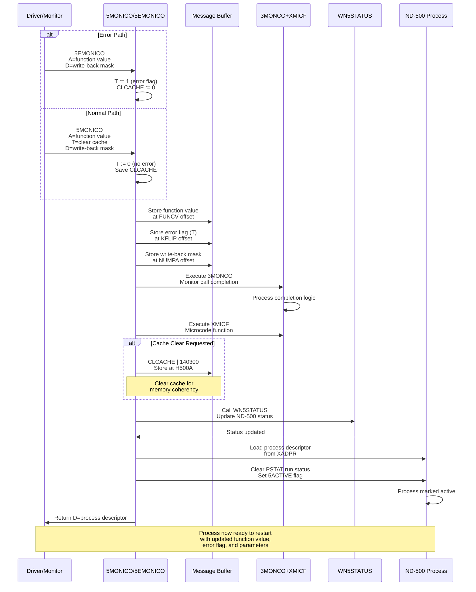
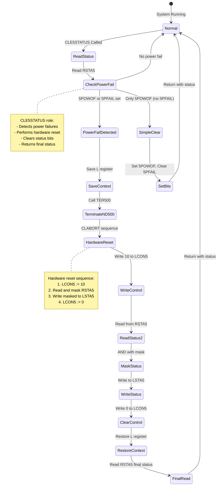
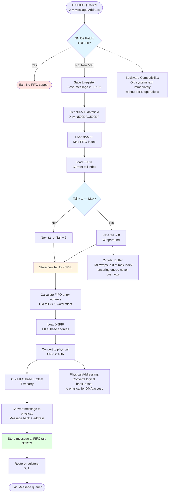

# XC-P2-N500.NPL API Documentation

**File:** Z:\NorskData\Source Code\Sintran L\NPL\XC-P2-N500.NPL
**Total Lines:** 96
**Total APIs/Subroutines:** 3
**Purpose:** ND-500 support routines for monitor call handling, status management, and FIFO queue operations

---

## ND-500 Interface Symbol Mappings

The ND-500 controller card uses IOX (I/O Execute) operations at specific offsets from the hardware device base address (HDEV). The following table maps IOX offsets to their symbolic names and functions:

| IOX Offset |  Octal | Enum                | Symbol                     | Comment                         |
| :--------: | :----: | :------------------ | :------------------------- | :------------------------------ |
|     +0     | 000000 | ReadMarX2           | `RMAR5`                    | Read MAR                        |
|     +1     | 000001 | LoadMarX2           | `LMAR5`                    | Load MAR                        |
|     +2     | 000002 | ReadStatusRegister  | `RSTA5`                    | Read status                     |
|     +3     | 000003 | LoadStatusRegister  | `LSTA5`                    | Load status                     |
|     +4     | 000004 | ReadControlRegister | `RCON5`                    | Read control                    |
|     +5     | 000005 | LoadControlRegister | `LCON5`                    | Load control                    |
|     +6     | 000006 | MasterClear         | `MCLR5`                    | Master clear                    |
|     +7     | 000007 | Terminate           | `TERM5`                    | Terminate                       |
|     +10    | 000010 | ReadTagIn           | `RTAG5`                    | Read tag                        |
|     +11    | 000011 | WriteTagOut         | `LTAG5`                    | Write tag                       |
|     +12    | 000012 | ReadLowerLimit      | `RLOW5`                    | Read lower limit                |
|     +13    | 000013 | WriteDataX          | `LDAT5` or `LLOW5`         | Load data / write lower         |
|     +14    | 000014 | ReadLockedMaybe     | `SLOC5`                    | Possibly "slot" / "status lock" |
|     +15    | 000015 | WriteData           | `BITM5`, `CLKD5`, or `S15` | Unclear — may depend on context |
|     +16    | 000016 | ReadLocked          | `UNLC5`                    | Unlock — plausible              |
|     +17    | 000017 | LastIOX             | `RETG5`                    | Return/End gate                 |

### Usage with HDEV Base Address

All IOX operations combine the hardware device base address (HDEV) with the appropriate symbol offset:

```assembly
T:=HDEV+RSTA5        ; Point to status register (HDEV+2)
*IOXT                ; Read status into A register

T:=HDEV+LCON5        ; Point to control register (HDEV+5)
A:=40; *IOXT         ; Write 40 to control register

T:=HDEV+UNLC5        ; Point to unlock register (HDEV+16)
*IOXT                ; Execute unlock operation
```

For more detailed symbol usage patterns and examples, see **MP-P2-N500.md** which contains extensive documentation of ND-500 hardware interface operations.

---

## File Overview

XC-P2-N500.NPL is a compact but critical support module for the ND-500 subsystem within SINTRAN III. It provides three essential subroutines:

1. **5MONICO/5EMONICO** - Monitor call completion and process restart handling
2. **CLE5STATUS** - ND-500 status register management and power failure detection
3. **ITOFIFOQ** - FIFO queue insertion for ND-500 message handling

This file works in conjunction with MP-P2-N500.NPL (the main ND-500 driver module) and provides low-level primitives used by the broader ND-500 communication infrastructure.

---

## API List

### 1. **5MONICO, 5EMONICO** (Lines 11-26)

**Line Range:** 11-26
**Description:** Restart ND-500 process after monitor call completion
**Execution Level:** Driver level (Level 12)
**Entry Parameters:**
- X = Message address (ND-500 process message)
- A = Function value (return value from monitor call)
- T = Clear cache mask (if 5MONICO entry)
- D = Write back mask (if 5EMONICO entry), or function value (if 5EMONICO)

**Exit Parameters:**
- D = Message address (preserved in X, then copied to D)
- All other registers destroyed

**Purpose:** Handles the completion of ND-500 monitor calls by setting function values, error flags, and parameter write-back masks, then restarting the ND-500 process.

**Entry Points:**
- **5EMONICO:** Error entry - sets error flag (T=1), no write-back (D=0)
- **5MONICO:** Normal entry - uses provided masks and sets no error (T=0)

#### Monitor Call Completion Sequence



**Assembly Code Analysis:**
```
Line 14: 5EMONICO entry
  - T:=D=:WBMASK          ; Save write-back mask from D
  - 0=:CLCACHE            ; No cache clear
  - T:=1                  ; Set error flag
  - GO MOICO              ; Jump to common code

Line 15: 5MONICO entry
  - T=:CLCACHE            ; Save clear cache mask
  - T:=D=:WBMASK          ; Save write-back mask
  - T:=0                  ; Clear error flag

Line 16-19: MOICO common code
  - T=:KKFLIP:=5MBBANK    ; Get message bank, save in KKFLIP
  - A=:D                  ; Save function value in D
  - A:=0                  ; Clear A
  - *AAX FUNCV; STDTX     ; Store function value at FUNCV offset

  - A:=KKFLIP             ; Restore bank
  - *AAX KFLIP-FUNCV      ; Point to KFLIP field
  - STATX                 ; Store error flag (from A)

  - A:=WBMASK             ; Get write-back mask
  - *AAX NUMPA-KFLIP      ; Point to NUMPA field
  - STATX                 ; Store write-back mask

  - 3MONCO                ; Monitor call completion code
  - *AAX -NUMPA           ; Back to base
  - STATX XMICF           ; Store and execute microcode function

Line 20: Cache clear handling
  - CLCACHE\/140300       ; OR with cache clear base
  - *AAX H500A            ; Point to H500A field
  - STATX                 ; Store cache clear command
  - AAX -H500A            ; Back to base

Line 21-22: Status update
  - L=:D                  ; Save D in L
  - MSGN500               ; Call MSGN500 macro
  - CALL WN5STATUS        ; Write ND-500 status

Line 23: Process descriptor access
  - D=:L:=X               ; Restore message address
  - *AAX XADPR            ; Point to process descriptor pointer
  - LDXTX                 ; Load X with process descriptor

Line 23: Activate process
  - X.PSTAT/\5CLRUNSTATUS+5ACTIVE=:X.PSTAT  ; Clear run status, set active

Line 24: Exit
  - D=:X                  ; Return process descriptor in D
  - EXIT                  ; Return to caller
```

**Key Operations:**
1. Store function value and error flag in message
2. Set parameter write-back mask
3. Execute monitor call completion (3MONCO + XMICF)
4. Handle cache clearing if requested
5. Update ND-500 status
6. Mark process as active and clear run status
7. Return process descriptor

**Relationship to MP-P2-N500.NPL:**
- Called from multiple monitor call handlers in MP-P2-N500.NPL
- Lines 2582, 2588, 2681, 2692, 2700, 2810, 2812 in MP-P2-N500.NPL call these routines
- Used after disk transfers (5MTRANS), XMSG operations (A5XMSG/B5XMSG)
- Provides standardized monitor call completion interface

---

### 2. **CLE5STATUS** (Lines 47-64)

**Line Range:** 47-64
**Description:** Clear ND-500 status register and handle power failures
**Execution Level:** Any level (must be called with interrupts off if not at driver level)
**Entry Parameters:**
- A = Mask to clear status with:
  - 177377 = Clear latched "power has been off" status (bit 5POWOF=10)
  - 177177 = Also clear "power fault executed by Microprog" (5PFAIL=7)

**Exit Parameters:**
- A = ND-500 Status after clearing:
  - BIT 5PAGF=4 (000020) = Inclusive "or" of errors
  - BIT 5DMAER=6 (000100) = Communication error
  - BIT 5PFAIL=7 (000200) = Power fault executed by Microprogram
  - BIT 5POWOF=8 (000400) = Latched power fault
  - BIT 5CLOST=9 (001000) = Microclock stopped

**Purpose:** Manages ND-500 status register, specifically handling power failure conditions. Performs hardware reset sequence if power failure is detected.

#### Power Failure Recovery State Diagram



**Assembly Code Analysis:**
```
Line 50: Read status
  - A=:D                  ; Save mask in A
  - T:=HDEV+RSTA5         ; Get hardware device base + RSTA5 offset (HDEV+2)
  - *IOXT                 ; Execute IOX: read status register into A

Line 51-52: Check for power failures
  - IF A BIT 5POWOF OR A BIT 5PFAIL THEN
     - IF A BIT 5PFAIL OR C5STAT BIT BHPFAIL THEN
       ; Power fail from microprogram OR already in power fail state

Line 53-54: Save L register and call TER500
  - A:=L=:"LREG"          ; Save L register
  - CALL TER500           ; Terminate ND-500
  - GO CLABORT            ; Jump to abort sequence

Line 55-58: Hardware reset sequence
  CLABORT:
  - 10                    ; Constant 10
  - T:=HDEV+LCON5         ; Point to control register (HDEV+5)
  - *IOXT                 ; Execute IOX: write 10 to LCON5

  - T+"RSTA5-LCON5"       ; Adjust T to point to RSTA5 (offset +2)
  - *IOXT                 ; Execute IOX: read status from RSTA5

  - A/\D                  ; AND status with original mask
  - T+"LSTA5-RSTA5"       ; Adjust T to point to LSTA5 (offset +3)
  - *IOXT                 ; Execute IOX: write masked status to LSTA5

  - "0"                   ; Zero constant
  - T+"LCON5-LSTA5"       ; Adjust T back to LCON5 (offset +5)
  - *IOXT                 ; Execute IOX: write 0 to LCON5 (clear control)

Line 59: Restore and re-read status
  - "LREG"=:L             ; Restore L register
  - T:=HDEV+RSTA5         ; Point to status register (HDEV+2)
  - *IOXT                 ; Execute IOX: read final status from RSTA5

Line 61-62: Simple power-off case
  ELSE
  - A BONE 5POWOF         ; Set bit 5POWOF
  - BZERO 5PFAIL          ; Clear bit 5PFAIL

Line 63-64: Exit
  - FI; EXIT              ; Return with status in A
```

**Hardware Registers Used:**
- **HDEV** - Hardware device base address (base for all IOX operations)
- **RSTA5** - Read status register (HDEV+2, octal 000002)
- **LCON5** - Load control register (HDEV+5, octal 000005)
- **LSTA5** - Load status register (HDEV+3, octal 000003)

All IOX offsets are relative to HDEV. See the "ND-500 Interface Symbol Mappings" section for the complete table.

**Key Operations:**
1. Read ND-500 status register with mask
2. Check for power failure conditions (5POWOF, 5PFAIL)
3. If power failure detected:
   - Save context
   - Call TER500 to terminate ND-500
   - Perform hardware reset sequence:
     - Write 10 to LCON5
     - Read and mask status
     - Write masked status to LSTA5
     - Clear LCON5
4. Return final status

**Relationship to MP-P2-N500.NPL:**
- Called from MP-P2-N500.NPL line 668 in driver kernel N500
- Called from RP-P2-N500.NPL lines 312, 323 during timeout handling
- Critical for power failure recovery
- Ensures hardware is properly reset after power glitches

**Status Bit Definitions:**
- **5PAGF (bit 4, 000020):** Page fault or general error indicator
- **5DMAER (bit 6, 000100):** DMA/communication error
- **5PFAIL (bit 7, 000200):** Power fault detected by microprogram
- **5POWOF (bit 8, 000400):** Latched power-off condition
- **5CLOST (bit 9, 001000):** Microclock stopped (CPU halted)

---

### 3. **ITOFIFOQ** (Lines 76-93)

**Line Range:** 76-93
**Description:** Insert message into ND-500 FIFO queue
**Execution Level:** Any level (must be called with interrupts off if not at driver level, N100/N500 general semaphore must be locked)
**Entry Parameters:**
- X = Message address to insert in queue

**Exit Parameters:**
- None (message inserted in queue)

**Purpose:** Inserts ND-500 messages into a hardware FIFO queue for newer ND-500 systems. This provides efficient message passing between ND-100 and ND-500.

#### FIFO Queue Operation Flowchart



**Assembly Code Analysis:**
```
Line 81-82: Old 500 check
  *NNJ02=*
  - P+1; EXIT             ; If "old" 500 system, exit immediately (no FIFO)

Line 83-84: Save registers and get FIFO head
  - A:=L=:"LREG"          ; Save L register
  - X=:XREG               ; Save message in XREG
  - T:=5MBBANK            ; Get message bank
  - X:="N500DF".X500DF    ; Get ND-500 datafield base
  - *AAX X5MXF            ; Point to FIFO max index (X5MXF)
  - LDATX                 ; Load A with max FIFO index

Line 85: Get FIFO tail
  - A=:L                  ; Save max in L
  - *AAX X5FYL-X5MXF      ; Point to FIFO tail (X5FYL)
  - LDATX                 ; Load A with current tail index

Line 86-87: Calculate next tail index
  - IF A=:D+1>=L THEN A:=0 FI  ; If tail+1 >= max, wrap to 0
  - *STATX                ; Store new tail index

Line 88: Calculate FIFO entry address
  - D SH 1=:L             ; Shift old tail left by 1 (word index)
  - *AAX X5FIF-X5FYL      ; Point to FIFO base (X5FIF)
  - LDDTX                 ; Load D with FIFO base address

Line 88-89: Convert logical to physical
  - *CNVBYADR             ; Convert bank+offset to physical address
  - X:=D+L                ; X = FIFO base + (old_tail * 2)
  - T:=A+C                ; T = carry from conversion

Line 89-90: Store message in FIFO
  - XREG=:D               ; Get message address
  - A:=5MBBANK            ; Get message bank
  - *CNVWADR              ; Convert to physical write address

Line 91-93: Write and exit
  - *STDTX                ; Store message at FIFO[old_tail]
  - X:=XREG               ; Restore X
  - GO LREG               ; Return (restore L and exit)
```

**Key Operations:**
1. Check if system has FIFO support (NNJ02 patch point)
2. Load FIFO parameters:
   - X5MXF: Maximum FIFO index
   - X5FYL: Current tail index
   - X5FIF: FIFO base address
3. Calculate next tail index with wraparound
4. Store new tail index
5. Calculate physical address of FIFO[old_tail]
6. Convert message address to physical
7. Write message to FIFO entry

**FIFO Data Structure:**
- **X5MXF:** Maximum FIFO index (queue size - 1)
- **X5FYL:** Tail index (next write position)
- **X5FIF:** FIFO base address (array of message pointers)
- Circular buffer with wraparound at max index
- Each entry is a word-sized message pointer

**Relationship to MP-P2-N500.NPL:**
- Called from MP-P2-N500.NPL lines 2602, 2777, 2828 in 5MTRANS (disk transfer completion)
- Called from RP-P2-N500.NPL line 219 in message handling
- Provides efficient queuing for ND-500 messages
- Only used on newer ND-500 hardware with FIFO support

**Patch Point:**
- **NNJ02:** Runtime patch that determines if FIFO hardware exists
  - If "old" 500: Direct exit, FIFO not supported
  - If "new" 500: Full FIFO insertion logic

---

## Symbol Definitions Used

Based on analysis of the code and cross-references:

### Process/Message Symbols
- **5MBBANK:** ND-500 message bank number
- **XADPR:** Process descriptor pointer offset in message
- **PSTAT:** Process status field in process descriptor
- **5CLRUNSTATUS:** Clear run status mask
- **5ACTIVE:** Active process status bit
- **MESSBUFF:** Message buffer pointer field

### Monitor Call Symbols
- **FUNCV:** Function value offset in message
- **KFLIP:** K flip-flop (error flag) offset
- **NUMPA:** Number of parameters / write-back mask offset
- **3MONCO:** Monitor call completion code
- **XMICF:** Execute microcode function

### Status Symbols
- **5POWOF:** Bit 8 (octal 10, 000400) - Latched power-off status
- **5PFAIL:** Bit 7 (octal 7, 000200) - Power fault from microprogram
- **5PAGF:** Bit 4 (000020) - Page fault / error indicator
- **5DMAER:** Bit 6 (000100) - DMA/communication error
- **5CLOST:** Bit 9 (001000) - Microclock stopped
- **BHPFAIL:** High-priority power fail flag in C5STAT
- **C5STAT:** CPU status variable

### Hardware I/O Symbols
- **HDEV:** Hardware device base address (base for all IOX operations)
- **RSTA5:** Read status register (IOX offset +2, octal 000002)
- **LCON5:** Load control register (IOX offset +5, octal 000005)
- **LSTA5:** Load status register (IOX offset +3, octal 000003)
- **IOXT:** I/O execute with T register (executes IOX at address in T)

See the "ND-500 Interface Symbol Mappings" section at the beginning of this document for the complete symbol table and additional IOX operations including RMAR5, LMAR5, RCON5, MCLR5, TERM5, RTAG5, LTAG5, RLOW5, LDAT5/LLOW5, SLOC5, BITM5/CLKD5/S15, UNLC5, and RETG5.

### FIFO Queue Symbols
- **N500DF:** ND-500 datafield descriptor
- **X500DF:** ND-500 datafield offset/address
- **X5MXF:** FIFO maximum index
- **X5FYL:** FIFO tail index (Y = tail)
- **X5FIF:** FIFO base address

### Microcode Operations
- **AAX:** Add A to X (address arithmetic)
- **LDATX:** Load A from address T+X
- **LDXTX:** Load X from address T+X
- **LDDTX:** Load D from address T+X
- **STATX:** Store A at address T+X
- **STDTX:** Store D at address T+X
- **STZTX:** Store zero at address T+X
- **CNVBYADR:** Convert bank/offset to physical address (by-address)
- **CNVWADR:** Convert to physical write address

### Patch Points
- **NNJ02:** ND-500 FIFO support check (line 81)

### External Subroutines
- **WN5STATUS:** Write ND-500 status (defined in CC-P2-N500.NPL)
- **TER500:** Terminate ND-500 (defined in MP-P2-N500.NPL line 2923)
- **MSGN500:** ND-500 message macro/function

---

## Cross-References to MP-P2-N500.NPL

### Calls to 5MONICO/5EMONICO

**From MP-P2-N500.NPL:**

1. **Line 2582 (A5XMSG/B5XMSG - XMSG functions):**
   ```
   A:=11; CALL 5EMONICO
   ```
   Context: XMSG error return

2. **Line 2588 (A5XMSG/B5XMSG):**
   ```
   FI; CALL 5MONICO
   ```
   Context: XMSG normal completion

3. **Line 2681 (5MTRANS - disk transfer):**
   ```
   T:=0; 4=:D; A:=1; CALL 5MONICO
   ```
   Context: Disk transfer completion with 4 parameters

4. **Line 2692 (5MTRANS):**
   ```
   XRXX: X:=CMSGA; D:=0; CALL 5EMONICO
   ```
   Context: Error return from disk transfer

5. **Line 2700 (5MTRANS):**
   ```
   D:=0; T:=0; CALL 5MONICO
   ```
   Context: Normal disk transfer completion

6. **Line 2810 (5MRDTRANS - disk transfer restart):**
   ```
   A:=11; CALL 5EMONICO
   ```
   Context: Disk transfer error

7. **Line 2812 (5MRDTRANS):**
   ```
   A:=3; CALL 5MONICO
   ```
   Context: Disk transfer completion with 3 return parameters

**From RP-P2-MONCALLS.NPL:**

8. **Line 3223 (Monitor call handler):**
   ```
   "171"; CALL 5EMONICO
   ```
   Context: Monitor call error code 171

9. **Line 3225 (Monitor call handler):**
   ```
   T:=CLM; CALL 5MONICO
   ```
   Context: Normal monitor call completion

### Calls to CLE5STATUS

**From MP-P2-N500.NPL:**

1. **Line 668 (N500 driver kernel):**
   ```
   177377; CALL CLE5STATUS
   ```
   Context: Clear latched power-off status during driver initialization/status check

**From RP-P2-N500.NPL:**

2. **Line 312 (Timeout handler):**
   ```
   177377; CALL CLE5STATUS
   ```
   Context: Check for power failure during timeout

3. **Line 323 (Timeout handler):**
   ```
   177177; CALL CLE5STATUS; GO TMRET
   ```
   Context: Clear both power-off and power-fail status

### Calls to ITOFIFOQ

**From MP-P2-N500.NPL:**

1. **Line 2602 (5MTRANS - disk transfer):**
   ```
   CALL ITOFIFOQ                                        % new code
   ```
   Context: Queue message after disk transfer initiated

2. **Line 2777 (5MRDTRANS - disk restart):**
   ```
   CALL ITOFIFOQ                                    % new code
   ```
   Context: Queue message after disk transfer completion

3. **Line 2828 (5MRDTRANS):**
   ```
   CALL ITOFIFOQ                              % new code
   ```
   Context: Queue message for process restart

**From RP-P2-N500.NPL:**

4. **Line 219 (Message handler):**
   ```
   CALL ITOFIFOQ                      % Insert in FIFO queue
   ```
   Context: Insert message in FIFO during normal message processing

---

## Unique Functionality

### 1. Standardized Monitor Call Completion

**5MONICO/5EMONICO** provide a standardized interface for completing ND-500 monitor calls:

- **Dual Entry Points:** Separate entry points for normal and error returns simplify caller code
- **Parameter Management:** Handles function values, error flags, and write-back masks in a consistent way
- **Cache Control:** Integrated cache clearing support for cache-coherent operations
- **Process Activation:** Automatically marks process as active and clears run status

This eliminates code duplication across the dozens of monitor call handlers in MP-P2-N500.NPL.

### 2. Power Failure Recovery

**CLE5STATUS** is unique in its comprehensive power failure handling:

- **Hardware Reset Sequence:** Performs a multi-step hardware reset sequence:
  1. Terminates ND-500 CPU (calls TER500)
  2. Writes control sequence to LCON5
  3. Reads and masks status
  4. Writes masked status to LSTA5
  5. Clears control register

- **Dual Failure Detection:** Handles both:
  - **5POWOF:** Latched power-off (hardware detected power loss)
  - **5PFAIL:** Microprogram power fail (software detected)

- **Status Clearing:** Allows selective clearing of status bits while preserving others

This is critical for system reliability in environments with unstable power.

### 3. Hardware FIFO Abstraction

**ITOFIFOQ** provides a clean abstraction for hardware FIFO queues:

- **Version Detection:** Runtime check (NNJ02) for FIFO hardware support
- **Circular Buffer:** Implements wraparound queue logic
- **Physical Addressing:** Converts logical message addresses to physical for DMA
- **Lock-Free Operation:** Assumes caller holds semaphore, allowing efficient insertion
- **Backward Compatibility:** Gracefully degrades on older hardware

This enables efficient message passing while maintaining compatibility with older ND-500 systems.

---

## Relationship Summary

### Architecture

```
                        SINTRAN III Monitor
                              |
                   +----------+----------+
                   |                     |
          RP-P2-MONCALLS.NPL      MP-P2-N500.NPL
          (Monitor Calls)          (Main Driver)
                   |                     |
                   +----------+----------+
                              |
                      XC-P2-N500.NPL
                   (Support Routines)
                    |    |        |
                    |    |        +---> ITOFIFOQ (FIFO queuing)
                    |    |
                    |    +------------> CLE5STATUS (status/power fail)
                    |
                    +------------------> 5MONICO/5EMONICO (completion)
                                              |
                                              v
                                        ND-500 Hardware
```

### Call Flow Example: Disk Transfer

```
1. User program → MON 500 (disk transfer)
   ↓
2. MP-P2-N500.NPL → 5MTRANS (line 2440)
   ↓
3. Initiate disk I/O
   ↓
4. XC-P2-N500.NPL → ITOFIFOQ (line 2602)
   - Insert message in FIFO queue
   ↓
5. Wait for disk completion...
   ↓
6. MP-P2-N500.NPL → 5MRDTRANS (line 2759)
   ↓
7. XC-P2-N500.NPL → 5MONICO (line 2812)
   - Set function value (error count = 3)
   - Clear error flag
   - Mark process active
   ↓
8. Process restarts in ND-500
```

### Call Flow Example: Power Failure

```
1. ND-500 detects power glitch
   ↓
2. MP-P2-N500.NPL → N500 driver (line 668)
   ↓
3. XC-P2-N500.NPL → CLE5STATUS
   - Read status: 5PFAIL set
   ↓
4. TER500 called (terminate ND-500)
   ↓
5. Hardware reset sequence:
   - Write LCON5
   - Read/mask RSTA5
   - Write LSTA5
   - Clear LCON5
   ↓
6. Return status to driver
   ↓
7. MP-P2-N500.NPL → Recovery logic
   - Set BHPFAIL in C5STAT
   - Restart affected processes
```

---

## Technical Notes

### Interrupt Handling

All three subroutines require careful interrupt management:

- **5MONICO/5EMONICO:** Called at driver level (Level 12) with interrupts managed by caller
- **CLE5STATUS:** Must be called in IOF (interrupts off) if not at driver level
- **ITOFIFOQ:** Requires N100/N500 semaphore locked and IOF if not at driver level

This ensures atomic operations on shared data structures.

### Cache Coherency

**5MONICO** handles cache clearing via the CLCACHE parameter:
```
CLCACHE\/140300; *AAX H500A; STATX
```
This ensures cache coherency between ND-100 and ND-500 memory accesses, critical for shared memory communication.

### Physical Addressing

**ITOFIFOQ** uses physical addressing for DMA compatibility:
- **CNVBYADR:** Convert logical (bank+offset) to physical address
- **CNVWADR:** Convert for write operations

This allows the ND-500 hardware to directly access messages without translation.

### Version Compatibility

Both routines use patch points for version compatibility:
- **NNJ02 (ITOFIFOQ):** Distinguishes "old" vs "new" ND-500 hardware
- Allows single binary to support multiple hardware generations

### Error Handling

**CLE5STATUS** distinguishes between:
1. **Latched power-off (5POWOF):** Hardware detected, requires reset
2. **Microprogram power fail (5PFAIL):** Software detected, may be recoverable
3. **Already in power fail (BHPFAIL):** Prevents cascading failures

This multi-level detection ensures robust power failure recovery.

---

## Performance Considerations

### 5MONICO/5EMONICO

- **Fast Path:** ~20 instructions for normal completion
- **Cache Impact:** Optional cache clear adds overhead but ensures correctness
- **Register Usage:** Minimal register save/restore (uses D for return value)

### CLE5STATUS

- **Fast Path:** Single I/O read for normal status
- **Slow Path:** Power failure requires full reset sequence (~100+ instructions)
- **Recovery Time:** Hardware reset adds significant latency but ensures clean restart

### ITOFIFOQ

- **Conditional Execution:** Early exit on old hardware (1 instruction)
- **Lock-Free:** Assumes semaphore held by caller, no locking overhead
- **Physical I/O:** Physical addressing adds ~10 instructions but enables DMA
- **Wraparound:** Modulo arithmetic for circular buffer (~5 instructions)

---

## Related Files

1. **MP-P2-N500.NPL** - Main ND-500 driver (calls all three routines extensively)
2. **RP-P2-N500.NPL** - ND-500 runtime support (calls CLE5STATUS and ITOFIFOQ)
3. **RP-P2-MONCALLS.NPL** - Monitor call handlers (calls 5MONICO/5EMONICO)
4. **CC-P2-N500.NPL** - ND-500 common routines (defines WN5STATUS, MSGN500)
5. **DP-P2-VARIABLES.NPL** - Variable definitions (defines NNJ02 patch point)

---

## Summary

**XC-P2-N500.NPL** is a lean but essential support module providing three critical primitives:

1. **Monitor Call Completion:** Standardized interface for restarting ND-500 processes after monitor calls
2. **Status Management:** Comprehensive ND-500 status reading and power failure recovery
3. **FIFO Queuing:** Efficient message insertion for newer ND-500 hardware

Despite its small size (96 lines), this file is called from dozens of locations throughout the ND-500 subsystem and is critical for:
- Correct monitor call semantics
- System reliability during power failures
- Efficient message passing on newer hardware

The file demonstrates excellent software engineering:
- Clean abstractions
- Version compatibility
- Error recovery
- Performance optimization

---

**Generated:** 2025-10-13
**Source File Path:** Z:\NorskData\Source Code\Sintran L\NPL\XC-P2-N500.NPL
