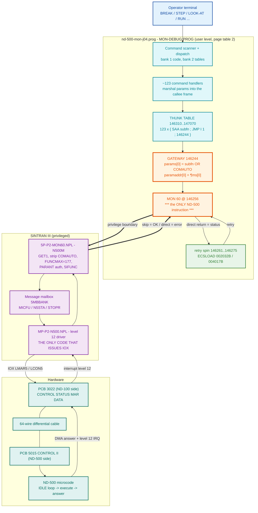
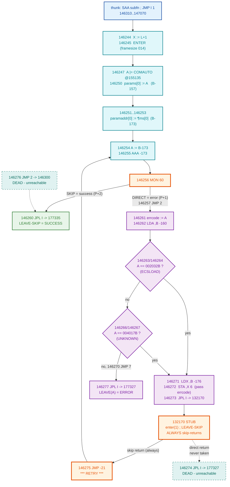
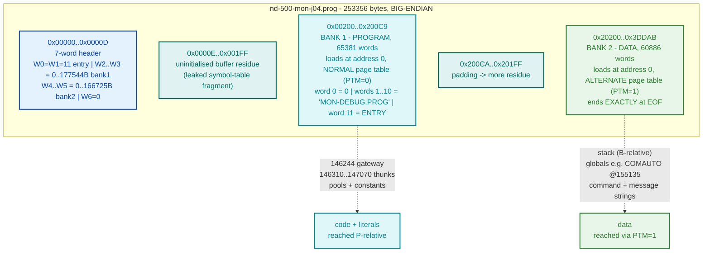
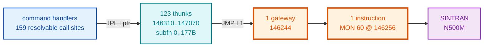

# nd-500-mon-j04.prog - How the ND-500 Loader/Debug Monitor Talks to the ND-500

Analysis of the ND-100 program `MON-DEBUG:PROG` (the ND-500 Loader / Debug Monitor,
ND-60.136.04A) and the exact mechanism by which it drives the ND-500 across the
3022/5015 bus interface.

**Subject file:**
`SINTRAN/ND500/nd-500-mon/nd-500-mon-j04.prog`
(253356 bytes, big-endian, dated 16-JUN-1988)

**Disassembly:**
`SINTRAN/ND500/nd-500-mon/nd-500-mon-j04.prog.asm`
(65460 lines, octal, ND-100 disassembly of BANK 1 at base address 0)

All addresses in this document are **OCTAL ND-100 word addresses** unless marked
otherwise. Every structural claim is traceable to a cited octal address or to a
quoted document path. Claims that are inferred rather than read are labelled.

---

## 1. Summary - the one-sentence answer

**This program never touches the ND-500 bus hardware. It contains zero `IOX`/`IOXT`
instructions. It reaches the ND-500 through exactly one `MON 60` instruction, at
address `146256`, inside a single centralised gateway routine at `146244` that every
ND-500 operation in the program funnels through.**

The gateway is reached by a **thunk table** of 123 three-word stubs at
`146310`-`147070`. Each thunk loads one MON 60 subfunction code into the A register
and tail-jumps into the shared gateway. So the program's entire ND-500 repertoire is
a fan-in: 159 call sites -> 123 thunks -> 1 gateway -> 1 `MON 60`.

Everything below the `MON 60` - the 3022 IOX registers, the message mailbox, the
level-12 interrupt, the ND-500 microcode - lives in **SINTRAN III**, not here.

```
operator command  ->  this program  ->  MON 60  ||  SINTRAN driver  ->  3022 IOX  ->  ND-500
                      ~~~~~~~~~~~~~~~~~~~~~~~~      ~~~~~~~~~~~~~~~~~~~~~~~~~~~~~~~~~~~~~~~
                      user level, page table 2      privileged, level 12 + hardware
                      (this document)               (MP-P2-N500.NPL, 5P-P2-MON60.NPL)
```

### 1.1 What was established here

| Finding | Status |
|---|---|
| Exactly one `MON 60` in the whole program, at `146256` | **PROVEN** - 68 `MON` instructions total, one is MON 60 |
| Zero `IOX`/`IOXT` instructions | **PROVEN** (see 9.1 - the ~403 literal "IOX nnnn" hits in the .asm are mis-decoded data) |
| Gateway routine entry = `146244` | **PROVEN** - target of all 123 thunk pointer words |
| Thunk table `146310`-`147070`, 123 entries, subfunction codes 0-177B | **PROVEN** - bytes |
| Thunk table ends at exactly subfunction `177B` = `FUNCMAX` in the SINTRAN source | **PROVEN** + corroborated |
| 159 resolvable call sites -> subfunction map | **PROVEN** - full call graph, section 6 |
| `146304` = `002032B` = ECSLOAD "CONTROL STORE MUST BE LOADED" | **PROVEN** - bytes |
| `146305` = `004017B` = `0x080F` - identity **UNKNOWN**, is *not* PFECSLOAD | **PROVEN** (bytes) + **corrects the task premise**, see section 10 |
| Retry loop is **unconditional** for those two statuses (the hook at `132170` is an empty stub) | **PROVEN** |
| Frame layout / calling convention / two-bank PTM model | **PROVEN** from ENTER/LEAVE + a PTM-toggling copy loop |
| COMAUTO flag @ `155135` = bit 15 (`100000B`) folded into every function word | **PROVEN** - both writers store `100000B`, section 5.7 |
| ~100 operator commands extracted from bank 2 with verified octal addresses | **PROVEN** (verbatim strings) - command -> subfunction binding still name-based, section 14 |

---

## 2. Container and memory layout

### 2.1 The `:PROG` file

A SINTRAN III two-bank `:PROG`. The 7-word big-endian header is a FIRST/LAST address
table:

| Word | Offset | Value | Meaning |
|---|---|---|---|
| W0 | 0x00 | `000011B` (9) | Start address - PC after `@RECOVER` |
| W1 | 0x02 | `000011B` (9) | Restart address - PC after `@CONTINUE` |
| W2 | 0x04 | `000000B` | Bank 1 FIRST address |
| W3 | 0x06 | `177544B` | Bank 1 LAST address (inclusive) |
| W4 | 0x08 | `000000B` | Bank 2 FIRST address |
| W5 | 0x0A | `166725B` | Bank 2 LAST address (inclusive) |
| W6 | 0x0C | `000000B` | data-bank-copy last address (unused) |

```
0x00000..0x0000D   7-word header
0x0000E..0x001FF   uninitialised buffer residue (NOT a format feature - see 2.4)
0x00200..0x200C9   BANK 1 (PROGRAM), 65381 words, loads at ND-100 address 0
0x200CA..0x201FF   padding -> more buffer residue
0x20200..0x3DDAB   BANK 2 (DATA), 60886 words, loads at address 0 in the
                   ALTERNATE page table. Ends exactly at EOF.
```

**Address mapping:**
- Bank 1: ND-100 word address `A` <-> file offset `0x200 + 2*A`
- Bank 2: ND-100 word address `A` <-> file offset `0x20200 + 2*A`

Bank 1 word 0 = `0`; words `1`-`10` = ASCII `"MON-DEBUG:PROG''"` packed 2 chars/word
(required so `@RECOVER` can find and reload the data bank); word `11` = the entry
point.

### 2.2 The two-bank model - PROVEN, not assumed

Bank 1 spans `0`-`177544` and bank 2 spans `0`-`166725`. **Both cover essentially the
whole 64K ND-100 address space at the same addresses.** They are distinguished by the
**PTM bit** (bit 0 of the ND-100 STS register; the disassembler names it `SSPTM`).

The decisive evidence is a copy loop in the initialisation code at `177137`-`177144`,
immediately after `MON 33` (ALTON):

```
177132  153033   MON 33            ; AltPageTable / ALTON
177133  174200   BSET ONE SSPTM    ; PTM := 1
...
177137  174000   BSET ZRO SSPTM    ; PTM := 0
177140  047325   LDA I ,X -53      ;   read  <- one bank
177141  174200   BSET ONE SSPTM    ; PTM := 1
177142  007324   STA I ,X -54      ;   write -> the other bank
177143  173401   AAX 1
177144  124370   JMP -10           ; loop
```

A loop that toggles PTM around a read and a write, placed directly after `ALTON`,
proves:

- **PTM = 0 -> normal page table -> BANK 1 (program)**
- **PTM = 1 -> alternate page table -> BANK 2 (data)**

The same idiom recurs at `177206`-`177211`. The program's final initialisation state
is `MON 33` ALTON at `177227` followed by `BSET ONE SSPTM` at `177230` - i.e. it runs
with **PTM = 1, data references reaching bank 2**.

### 2.3 Which addressing modes reach which bank (INFERRED)

This matters, because the gateway reads its constants out of bank 1 while reading a
global out of bank 2. The binary's behaviour *requires* the following split. I could
not confirm it against an ND-100 hardware manual, so it is labelled **inferred** -
but it is forced by four independent observations:

| Evidence | Address | Requires |
|---|---|---|
| `LDT 21` compares against ECSLOAD `002032B`. `bank1[146304]=002032`, `bank2[146304]=041517` (ASCII `"CO"`, part of a string) | `146263` | P-relative **direct** operand -> **bank 1** |
| `ORA I 33` reads a flag. `bank1[155135]=006006` is provably an *instruction* (`STA ,X 6`, part of a coherent code sequence at `155134`-`155136`); `bank2[155135]=0` and is written by `STA` at `001565`/`005645` and cleared by `STZ` at `001570`/`011400` | `146247` | pointer word from **bank 1**, final operand from **bank 2** |
| ENTER must clear PTM to read its inline frame-size word with `LDX ,X -1` | `177313`-`177316` | X-relative **direct** -> PTM-selected, so bank 2 by default |
| All pointer pools (`146301`-`146307` etc.) hold valid bank-1 code addresses; `bank2` at those addresses is zero or text | many | P-relative indirect pointer fetch -> **bank 1** |

**Inferred rule:** *P-relative address formation (the code stream: direct operands and
the indirect pointer word) always resolves in the program bank. Every other reference
(B-relative frames, X-relative, and the final operand after indirection) resolves
through PTM.*

> The COMAUTO stores confirm this split from the data side too: `001564 LDA 67`
> (direct, program bank) fetches the literal `100000B` from `001653`, while the
> subsequent `005067 STA I 67` writes it to the *bank-2* global at `155135` through a
> pointer. Literal in bank 1, global in bank 2 - exactly the rule below.

This is exactly the classic ND two-bank compiled-code model: literals sit in the code
stream and are addressed P-relative-direct; globals live in the data bank and are
reached P-relative-**indirect** through a pointer in the code pool (the 8-bit
displacement cannot reach them otherwise); the stack is B-relative in the data bank.

*What would settle it:* the ND-100 Reference Manual (ND-06.014) section on the PTM bit
and page-table selection per addressing mode.

### 2.4 The "symbol table" residue

A `:PROG` file carries **no** symbol table (that is a `:BRF` feature). The
symbol-like records at `0x14`-`0x1FF` and `0x200CA`-`0x201FF` are uninitialised buffer
residue left by the tool that wrote the file - a leaked fragment of the build's own
symbol table. They are **not** part of the `:PROG` format, but they are useful for RE
because they name ND-500 command routines. See section 8.

---

## 3. Entry point and initialisation

Header W0/W1 = `11`, and address `11` is indeed the first instruction:

```
000011  171400   SAX 0
000012  135012   JPL I 12        ; ptr @000024 -> main
```

The `@RECOVER`/`@CONTINUE` restart path and the **data-bank loader** live at
`177060`-`177240`. This is the code that makes the two-bank program work: it reopens
its own `:PROG` file by the embedded name and reads bank 2 into the alternate page
table.

```
177074  174000   BSET ZRO SSPTM  ; PTM := 0
177075  153034   MON 34          ; ALTOFF - NormalPageTable
...
177110  153312   MON 312         ; MOINF  - CheckMonCall (probe monitor-call availability)
...
177132  153033   MON 33          ; ALTON  - AltPageTable
177133  174200   BSET ONE SSPTM  ; PTM := 1
177137..177144                   ; bank1 -> bank2 copy loop (see 2.2)
...
177152  153050   MON 50          ; OPEN   - open the :PROG file
177153  153065   MON 65          ; QERMS  - ErrorMessage
177157  153076   MON 76          ; SETBS  - SetBlockSize
177163  153007   MON 7           ; RPAGE  - ReadBlock
177201  153033   MON 33          ; ALTON
177206..177213                   ; second PTM-toggling copy loop
177216  153117   MON 117         ; RFILE  - ReadFromFile  <- reads BANK 2 image
177221  153043   MON 43          ; CLOSE
177227  153033   MON 33          ; ALTON            <- final state:
177230  174200   BSET ONE SSPTM  ; PTM := 1         <- data refs -> bank 2
```

The `MON 65` (QERMS) after nearly every file call is the standard SINTRAN
"error-message-and-abort-on-error" idiom.

---

## 4. The compiler's calling convention (proven, and needed to read anything else)

The program is compiled code (PLANC/NPL-style). Understanding the convention is a
prerequisite for the gateway, so it is derived here from the runtime helpers.

### 4.1 The three runtime helpers

Resolved from the call graph by frequency and then read directly:

| Address | Role | Call sites |
|---|---|---|
| `177300` | **ENTER** - allocate stack frame; takes an **inline** frame-size word | 439 |
| `177327` | **LEAVE(value)** - store A as result, return to **callsite+1** | 2040 |
| `177335` | **LEAVE-SKIP** - return to **callsite+2** | 569 |

439 ENTERs = 439 routines; 2607 returns. Consistent for a 65k-word program.

**Proof that `177300` takes an inline parameter:** every one of its 439 call sites is
followed by a small constant (83 distinct values, range `0`-`3116`, mode `1`-`14`).
No other target in the program shows this signature.

### 4.2 ENTER, read directly

```
177300  015602   STX I ,B -176   ; mem[ mem[B-176] ] := X   (X = callsite+2, see below)
177301  054602   LDX ,B -176     ; X := old stack top
177302  173577   AAX 177         ; X += 127
177303  173401   AAX 1           ; X += 1      -> newB = old_stacktop + 0200
177304  144037   SWAP SB DX      ; B := newB ; X := old B
177305  014601   STX ,B -177     ; mem[newB-177] := caller's B
177306  056203   LDX ,X -175
177307  014603   STX ,B -175     ; mem[newB-175] := copied from caller (display/static link)
177310  144074   SWAP SX DL      ; X := L  (L points AT the inline size word)
177311  173401   AAX 1           ; X := L+1 = the real return address
177312  014604   STX ,B -174     ; mem[newB-174] := return address
177313  176600   BLDA SSPTM      ; save PTM
177314  174000   BSET ZRO SSPTM  ; PTM := 0  -> program bank
177315  056377   LDX ,X -1       ; X := mem[L] = THE INLINE FRAME SIZE   <-- proof
177316  174600   BSET BAC SSPTM  ; restore PTM
177317  173606   AAX -172
177320  146037   RADD SB DX      ; X := B + framesize - 0172   = new stack top
177321  014602   STX ,B -176
177322  143474   SKP IF DL MLST SX   ; stack-limit check
177323  125604   JMP I ,B -174   ; return
177324  044604   LDA ,B -174     ; (overflow path)
177326  125027   JMP I 27        ; -> stack-overflow handler
```

### 4.3 LEAVE, read directly

```
177327  054600   LDX ,B -200     ; X := saved return address (= callsite+2)
177330  173777   AAX -1          ; X -= 1                    (= callsite+1)
177331  014600   STX ,B -200     ;   -> take the DIRECT return
177332  054601   LDX ,B -177     ; X := caller's B
177333  133002   JXZ 2           ; if 0, skip the store
177334  006205   STA ,X -173     ; mem[callerB-173] := A     <- RESULT slot
177335  054601   LDX ,B -177     ; <-- LEAVE-SKIP entry
177336  144037   SWAP SB DX      ; B := caller's B
177337  056200   LDX ,X -200     ; X := mem[oldB-200]
177340  146172   RADD CLD SX DP  ; P := X                    <- RETURN
```

### 4.4 The resulting frame

A routine's prologue is always:

```
        RADD AD1 CLD SL DX      ; X := L+1  = callsite+2   (L = caller's JPL link)
        JPL I <ptr to 177300>   ; ENTER
        <framesize>             ; inline
        ...body...
```

`newB = old_stacktop + 0200`, and `new_stacktop = newB + framesize - 0172`. So a frame
occupies `B-0200 .. B-0157` for `framesize = 014`, i.e. **6 header words + framesize
locals**:

| Offset | Contents |
|---|---|
| `B-200` | return address (`callsite+2`; `177327` decrements it to `callsite+1`) |
| `B-177` | caller's B |
| `B-176` | stack top (= base of the next frame) |
| `B-175` | display / static link (copied from caller) - *inferred* |
| `B-174` | return address scratch, used by ENTER |
| `B-173` | **result slot** - `177334` writes the callee's result to the *caller's* `B-173` |
| `B-172` ... | locals (`framesize` words) |

**Outgoing parameters.** Since `calleeB = stacktop + 0200`, the callee's first local
`calleeB-0172` is at `stacktop + 6`. Hence the idiom that saturates this program:

```
        LDX ,B -176     ; X := stack top
        STA ,X 6        ; callee's local 1 := A   (parameter 1)
        STA ,X 7        ;                          parameter 2
        STA ,X 10       ;                          parameter 3
```

### 4.5 Skip/direct return at the call site

```
        JPL I <ptr to routine>
        <ERROR path>            ; callsite+1  - reached via 177327 (LEAVE-with-value)
        <SUCCESS path>          ; callsite+2  - reached via 177335 (LEAVE-SKIP)
```

Verified against a real ND-500 call site (RUNN, section 5.5).

---

## 5. The MON 60 gateway

### 5.1 Shape

```
    123 thunks                       one gateway                 one instruction
  146310..147070                       146244                        146256
  ------------                    ----------------              ---------------
  SAA <subfn>  ---\
  JMP I 1          >--- 146244 ---> [ build param block ] ---> MON 60 ---> SINTRAN
  146244       ---/                 [ retry loop        ]
```

### 5.2 A thunk (three words, verified from bytes)

```
146310  170400   SAA 0            ; A := subfunction code 0 (RRREG)
146311  125001   JMP I 1          ; EA = P+1 = 146312, indirect
146312  146244   <ptr>            ; -> the gateway
```

`JMP` does not touch `L`, so the caller's return link survives into the gateway. The
thunk's only job is to place the subfunction code in `A`.

The table is 123 entries covering subfunction codes `0`-`177B`, and stops exactly
there: word `147071` = `044002` is not a thunk. **`177B` is precisely `FUNCMAX`** as
defined in the SINTRAN handler source
`5P-P2-MON60.NPL:287` - independent corroboration of the table's extent from two
unrelated artifacts.

### 5.3 The gateway, verified byte-for-byte

Bytes re-read from the raw file (offset = `0x200 + 2*A`) and confirmed identical to
the `.asm`:

```
addr    offset    word     disassembly
146244  0x19B48   146547   RADD AD1 CLD SL DX  ; X := L+1  (save caller's return link)
146245  0x19B4A   135034   JPL I 34            ; ptr @146301 -> 177300  ENTER
146246  0x19B4C   000014   <inline>            ; frame size = 014 = 12 locals
146247  0x19B4E   075033   ORA I 33            ; ptr @146302 -> 155135; A |= bank2[155135]
146250  0x19B50   004621   STA ,B -157         ; params[0] := A         <- FUNCTION WORD
146251  0x19B52   146135   RADD CLD SB DA      ; A := B
146252  0x19B54   172621   AAA -157            ; A := B-157 = &params[0]
146253  0x19B56   004605   STA ,B -173         ; paramaddr[0] := &params[0]
146254  0x19B58   146135   RADD CLD SB DA      ; A := B                 <-- RETRY re-entry
146255  0x19B5A   172605   AAA -173            ; A := B-173 = &paramaddr[]
146256  0x19B5C   153060   MON 60              ; *** N500M / ND500Function ***
146257  0x19B5E   124002   JMP 2               ; DIRECT return (error)  -> 146261
146260  0x19B60   135023   JPL I 23            ; SKIP return (success)  -> 177335 LEAVE-SKIP
146261  0x19B62   004620   STA ,B -160         ; errcode := A
146262  0x19B64   044620   LDA ,B -160
146263  0x19B66   050021   LDT 21              ; T := [146304] = 002032B  ECSLOAD
146264  0x19B68   142065   SKP IF DA UEQ ST    ; skip if A != T
146265  0x19B6A   124004   JMP 4               ;   A == ECSLOAD          -> 146271
146266  0x19B6C   050017   LDT 17              ; T := [146305] = 004017B
146267  0x19B6E   140065   SKP IF DA EQL ST    ; skip if A == T
146270  0x19B70   124007   JMP 7               ;   A != 004017B          -> 146277
146271  0x19B72   054602   LDX ,B -176         ;   (A == 004017B falls through)
146272  0x19B74   006006   STA ,X 6            ; pass errcode to the hook
146273  0x19B76   135013   JPL I 13            ; ptr @146306 -> 132170   HOOK
146274  0x19B78   135013   JPL I 13            ; ptr @146307 -> 177327   (DEAD - see 5.6)
146275  0x19B7A   124357   JMP -21             ; -> 146254   *** RETRY ***
146276  0x19B7C   124002   JMP 2               ; (DEAD - see 5.6)
146277  0x19B7E   135010   JPL I 10            ; ptr @146307 -> 177327   LEAVE(error)
146300  0x19B80   135003   JPL I 3             ; ptr @146303 -> 177335   LEAVE-SKIP
```

Pointer/constant pool (bank 1) - **data, not code**; the disassembler renders it as
nonsense instructions:

```
146301  0x19B82   177300   -> ENTER
146302  0x19B84   155135   -> address of the function-word flag global (in bank 2)
146303  0x19B86   177335   -> LEAVE-SKIP
146304  0x19B88   002032   CONSTANT  002032B = 0x041A = 1050 dec  = ECSLOAD
146305  0x19B8A   004017   CONSTANT  004017B = 0x080F = 2063 dec  = UNKNOWN
146306  0x19B8C   132170   -> retry hook
146307  0x19B8E   177327   -> LEAVE(value)
```

Raw bytes at `0x19B86`: `FE DD 04 1A 08 0F B4 78` - big-endian words `177335`,
`002032`, `004017`, `132170`. Both constants confirmed at the byte level.

### 5.4 Skip/direct polarity - the task premise was inverted

The ND-100 `MON` contract is **skip return on success**. The instruction at `P+1` is
skipped, so execution resumes at `P+2`. Therefore:

- `146257` (`P+1`) = the **DIRECT / ERROR** path -> `JMP 2` -> `146261` = the error analysis
- `146260` (`P+2`) = the **SKIP / SUCCESS** path -> `JPL I` -> `177335` = LEAVE-SKIP

The task brief annotated these the other way round (`146257 ; SKIP return = success`,
`146260 ; DIRECT return = error handler`). The code itself settles it: `146261`
onwards compares A against **error status codes** (ECSLOAD), which only makes sense on
the error path. And it is confirmed from the other end by the SINTRAN handler source -
`5P-P2-MON60.NPL:2247` (`5OKRET` does `MIN ZPREG`, incrementing the caller's saved P =
skip return, and sets `ZAREG := 0`), while `ERET` at `:1307` stores the error code into
`ZAREG` and falls through **without** `MIN ZPREG`.

`SINTRAN/ND500/ND500-BUS-INTERFACE-REFERENCE.md` section 11
also states "skip-return signals error" - **that is backwards too**. See section 10.

### 5.5 End-to-end verification at a real call site

RUNN (subfunction `12B`, "start program"), caller at `030624`:

```
030624  146135   RADD CLD SB DA   ; A := B
030625  172611   AAA -167         ; A := &local(B-167)
030626  054602   LDX ,B -176
030627  006006   STA ,X 6         ; param 1 := &<stop reason>
030630  044607   LDA ,B -171
030631  006007   STA ,X 7         ; param 2
030632  146135   RADD CLD SB DA
030633  172613   AAA -165
030634  006010   STA ,X 10        ; param 3 := &<returned trap info>
030635  135110   JPL I 110        ; ptr @030745 -> 146346 = thunk(RUNN 12B)
030636  134263   JPL -115         ; callsite+1 = ERROR   -> handler 030521
030637  024611   LDD ,B -167      ; callsite+2 = SUCCESS -> read <stop reason>
```

Three parameters, matching the documented RUNN signature `<stop reason> <returned trap
info> <clear time used>`
(`Developer/MON/calls/60B_N500M.yaml`). The error path is
at `callsite+1` and the success path at `callsite+2` - exactly as the gateway's
`177327`/`177335` choice dictates. The convention closes.

### 5.6 The retry hook at `132170` is an empty stub

```
132170  146547   RADD AD1 CLD SL DX   ; X := L+1
132171  135003   JPL I 3              ; ptr @132174 -> 177300  ENTER
132172  000001   <inline>             ; frame size = 1
132173  135002   JPL I 2              ; ptr @132175 -> 177335  LEAVE-SKIP
132174  177300   <pool>
132175  177335   <pool>
```

Six words. It allocates a one-word frame (receiving the error code at `B-172`), does
nothing with it, and **unconditionally takes the skip return**. It is called from
exactly one place in the program: `146273`.

Consequences, stated plainly:

- `132170` always returns to `callsite+2` = `146275` = `JMP -21` = **retry**.
- Therefore `146274` (`LEAVE(error)`) is **unreachable**.
- `146276` (`JMP 2` -> `146300`) is **unreachable** - nothing jumps to it.
- **The retry loop is unconditional** for statuses `002032B` and `004017B`: the
  gateway re-issues the `MON 60` in a tight busy-spin until the status changes.

This is consistent with what ECSLOAD means. "CONTROL STORE MUST BE LOADED" is a
*transient* condition: the ND-500's writable control store is loaded by a *different*
program over the same 3022/5015 path, and this monitor simply spins until that
finishes. The dead `146274`/`146276` branches are the compiler's emitted "else" arms
for a hook that was reduced to a stub.

*Caveat:* the stub is dead code as shipped. Whether `132170` was intended to be
patched at runtime is **unknown**; nothing in the image writes to it (no store
resolves to `132170`).

### 5.7 The function word is not a bare subfunction code

`146247 ORA I 33` ORs a global (bank 2, address `155135`) into the subfunction code
before it becomes `params[0]`. The global:

- initial value in the bank-2 image: `000000`
- written by `STA` at `001565` and `005645`
- cleared by `STZ` at `001570` and `011400`
- read **only** at `146247`

So it is a program-wide mode flag folded into every MON 60 function word.

The SINTRAN handler explains what it is. `5P-P2-MON60.NPL:134` defines
`SYMBOL COMAUTO=17` (octal 17 = **bit 15**, matching the `100000B` this program stores),
"COMMAND IN AUTO-MODE"; the handler strips it with `BZERO COMAUTO` before the `FUNCMAX`
range check (`:1144`) and before dispatch (`:1278`), and tests it for authorisation at
`:1274`.

**Identification: the flag at `155135` is COMAUTO (bit 15). PROVEN.** The value both
`STA` sites store is now read directly: `001564 LDA 67` loads from `001653` = `100000B`,
and `005644 LDA 56` loads from `005722` = `100000B`. Both are exactly `0100000B` =
bit 15 = COMAUTO. So the `ORA I 33` at `146247` sets bit 15 of the function word iff the
program is in command-auto mode, and clears it (via the `STZ` sites at `001570`/`011400`)
otherwise - precisely what the SINTRAN handler strips with `BZERO COMAUTO`.

> This also **corrects** `SINTRAN/ND500/ND500-MON-RE-FINDINGS.md`
> section 2.2, which describes the same `ORA` as combining "the caller's function code
> with the derived stack param-block address". It does not - it ORs in a mode flag.
> The address arithmetic happens afterwards, at `146251`-`146253`.

### 5.8 The gateway in pseudo-C

```c
/* ---------------------------------------------------------------- *
 *  Gateway @ 146244 - the ONLY path from this program to the ND-500 *
 *  Entered by JMP from a thunk, with A = MON 60 subfunction code.   *
 *  L still holds the ORIGINAL caller's return link.                 *
 * ---------------------------------------------------------------- */

extern word COMAUTO_FLAG;        /* bank-2 global @ 155135; PROVEN = 0100000 (bit 15) or 0 */

#define ECSLOAD    0002032       /* @146304 - "CONTROL STORE MUST BE LOADED" */
#define UNKNOWN_2  0004017       /* @146305 - identity UNRESOLVED (0x080F)   */

static void retry_hook(word errcode)   /* @132170 */
{
    /* 6-word stub: allocates 1 local, ignores errcode, ALWAYS skip-returns. */
    return SKIP;
}

/* Returns SKIP (= caller's callsite+2) on success,
 *         DIRECT (= caller's callsite+1) with the status in A on error.  */
int nd500_gateway(word subfn /* in A, from the thunk */)
{
    word return_link = L + 1;            /* 146244: X := L+1 = callsite+2   */
    enter(/*framesize=*/ 014);           /* 146245/146246                    */

    /* --- local frame (18 words: B-200 .. B-157) --------------------- */
    word *paramaddr = &frame[-0173];     /* B-173: the parameter ADDRESS list */
    word *params    = &frame[-0157];     /* B-157: the parameter block        */
    word  errcode;                       /* B-160                             */

    params[0] = subfn | COMAUTO_FLAG;    /* 146247/146250 - the FUNCTION WORD */
    paramaddr[0] = (word) &params[0];    /* 146251..146253                    */

retry:                                   /* <-- 146254                        */
    A = (word) &paramaddr[0];            /* 146254/146255                     */

    if (MON60(A) == SKIP)                /* 146256 - the one instruction      */
        return SKIP;                     /* 146260 -> 177335  SUCCESS         */

    /* ---- DIRECT return: A holds a MON-60 status code (146257 -> 146261) -- */
    errcode = A;                         /* 146261/146262                     */

    if (errcode == ECSLOAD ||            /* 146263..146265                    */
        errcode == UNKNOWN_2)            /* 146266..146270                    */
    {
        retry_hook(errcode);             /* 146271..146273 - always SKIPs     */
        goto retry;                      /* 146275: JMP -21 -> 146254         */

        /* 146274: return DIRECT(errcode);  -- UNREACHABLE                    */
        /* 146276: return SKIP;             -- UNREACHABLE                    */
    }

    return DIRECT(errcode);              /* 146277 -> 177327  ERROR           */
}
```

---

## 6. The subfunction -> caller map

Built by resolving every `JPL I <disp>` in bank 1 (`EA = P + disp`, then
`target = bank1[EA]`) and keeping the hits that land on a thunk. **123 thunks, 159
resolvable call sites.**

Names from
`Developer/MON/calls/60B_N500M.yaml`.
`??` = no entry in that table (see 6.2).

| Thunk | Subfn | Name | Callers | Call sites |
|---|---|---|---|---|
| `146310` | `000B` | RRREG | 1 | `013143` |
| `146313` | `001B` | WRREG | 1 | `052642` |
| `146316` | `002B` | RPROG | 2 | `022440` `056341` |
| `146321` | `004B` | WPROG | 1 | `055702` |
| `146324` | `003B` | RDATA | 3 | `022462` `055211` `056723` |
| `146327` | `005B` | WDATA | 4 | `002326` `002515` `055140` `056023` |
| `146332` | `006B` | PLACE | 0 | - |
| `146335` | `006B` | PLACE | 2 | `042230` `042535` |
| `146340` | `007B` | SWLOD | 1 | `010214` |
| `146343` | `007B` | SWLOD | 0 | - |
| `146346` | `012B` | RUNN | 2 | `030635` `030737` |
| `146351` | `013B` | CNCFI | 1 | `036440` |
| `146354` | `014B` | CLSFI | 1 | `005123` |
| `146357` | `015B` | RESRV | 2 | `010333` `011142` |
| `146362` | `016B` | RELIS | 2 | `001126` `010322` |
| `146365` | `017B` | LISOP | 1 | `005157` |
| `146370` | `020B` | TIMUS | 1 | `005162` |
| `146373` | `021B` | WHO | 2 | `005165` `007445` |
| `146376` | `022B` | ERRFL | 2 | `005173` `005201` |
| `146401` | `010B` | RRREG_BLOCK | 1 | `052563` |
| `146404` | `011B` | WRREG_BLOCK | 1 | `052711` |
| `146407` | `023B` | REACS | 2 | `123556` `124201` |
| `146412` | `024B` | WRICS | 1 | `123420` |
| `146415` | `025B` | MICST | 4 | `006307` `130130` `130361` `131140` |
| `146420` | `073B` | RPHSG | 1 | `056407` |
| `146423` | `110B` | WPHSG | 1 | `055736` |
| `146426` | `032B` | ABSMR | 4 | `012721` `022616` `056364` `131163` |
| `146431` | `033B` | ABSMW | 1 | `055717` |
| `146434` | `036B` | ?? | 0 | - |
| `146437` | `037B` | LDCS | 0 | - |
| `146442` | `036B` | ?? | 0 | - |
| `146445` | `037B` | LDCS | 1 | `006114` |
| `146450` | `040B` | DEFM | 1 | `135361` |
| `146453` | `034B` | MSTOP | 2 | `006312` `122512` |
| `146456` | `035B` | MSTCL | 3 | `005736` `005744` `122514` |
| `146461` | `041B` | RSTAT | 1 | `127566` |
| `146464` | `042B` | ?? | 0 | - |
| `146467` | `043B` | SPRES | 1 | `007474` |
| `146472` | `044B` | SPREL | 1 | `007505` |
| `146475` | `045B` | DEFSW | 0 | - |
| `146500` | `046B` | ?? | 1 | `007422` |
| `146503` | `047B` | DELSW | 1 | `007430` |
| `146506` | `050B` | TESTF | 0 | - |
| `146511` | `050B` | TESTF | 2 | `007740` `007762` |
| `146514` | `051B` | RIFRG | 1 | `130136` |
| `146517` | `052B` | G500P | 1 | `010232` |
| `146522` | `053B` | T500P | 1 | `010245` |
| `146525` | `054B` | STSWP | 1 | `010217` |
| `146530` | `055B` | SPLAC | 2 | `043552` `063065` |
| `146533` | `056B` | EPLAC | 2 | `044062` `063342` |
| `146536` | `057B` | MPVER | 2 | `005577` `132132` |
| `146541` | `060B` | LIMEM | 1 | `135532` |
| `146544` | `062B` | HIDEF | 1 | `040133` |
| `146547` | `063B` | HISTA | 1 | `010440` |
| `146552` | `064B` | HISTP | 1 | `010435` |
| `146555` | `065B` | HISTN | 1 | `040437` |
| `146560` | `066B` | HIREL | 2 | `010443` `110130` |
| `146563` | `067B` | SPRTE | 0 | - |
| `146566` | `070B` | GPRTE | 3 | `073472` `074030` `110410` |
| `146571` | `071B` | SSGTE | 0 | - |
| `146574` | `072B` | GSGTE | 1 | `110447` |
| `146577` | `073B` | RPHSG | 0 | - |
| `146602` | `074B` | SPRNM | 1 | `010112` |
| `146605` | `075B` | USYST | 4 | `006325` `006411` `006447` `073461` |
| `146610` | `076B` | TOSWP | 5 | `073362` `073675` `073741` `074003` `107434` |
| `146613` | `077B` | RPROC | 6 | `001332` `001510` `001545` `001625` `007531` `104456` |
| `146616` | `100B` | RFLAG | 1 | `005264` |
| `146621` | `101B` | SPFLAG | 1 | `005223` |
| `146624` | `103B` | RSYSP | 1 | `073132` |
| `146627` | `104B` | WSYSP | 1 | `073354` |
| `146632` | `105B` | SPRIO | 3 | `006406` `006444` `006513` |
| `146635` | `106B` | LNKPR | 1 | `006711` |
| `146640` | `107B` | ?? | 0 | - |
| `146643` | `111B` | SLOG1 | 1 | `110161` |
| `146646` | `113B` | RLOG | 3 | `110116` `110243` `110310` |
| `146651` | `114B` | RELLOG | 1 | `006676` |
| `146654` | `115B` | SLOGA | 1 | `110143` |
| `146657` | `117B` | ABORT | 1 | `110346` |
| `146662` | `120B` | SETOUT | 1 | `003573` |
| `146665` | `121B` | RDSWP | 3 | `073152` `074310` `107515` |
| `146670` | `122B` | LOGOUT | 1 | `110355` |
| `146673` | `102B` | GPSGE | 1 | `007514` |
| `146676` | `124B` | SMONLOG | 1 | `007312` |
| `146701` | `125B` | PMONLOG | 1 | `111232` |
| `146704` | `126B` | XMONLOG | 1 | `007320` |
| `146707` | `127B` | DEFDOM | 1 | `046056` |
| `146712` | `130B` | PLADOM | 1 | `043171` |
| `146715` | `131B` | DELDOM | 1 | `007347` |
| `146720` | `132B` | LSTDOM | 1 | `007352` |
| `146723` | `133B` | LSTEXQ | 1 | `111445` |
| `146726` | `134B` | PLADBG | 1 | `002560` |
| `146731` | `136B` | ACTIV | 1 | `010610` |
| `146734` | `137B` | UNUSED | 0 | - |
| `146737` | `140B` | SRESPL | 2 | `043547` `063062` |
| `146742` | `141B` | SETBLK | 1 | `005154` |
| `146745` | `142B` | DEFINF | 6 | `002723` `003014` `003034` `030314` `030370` `030377` |
| `146750` | `144B` | ?? | 2 | `010345` `011231` |
| `146753` | `150B` | ?? | 1 | `111614` |
| `146756` | `151B` | ?? | 0 | - |
| `146761` | `152B` | ?? | 0 | - |
| `146764` | `153B` | ?? | 0 | - |
| `146767` | `154B` | ?? | 1 | `010133` |
| `146772` | `156B` | ?? | 1 | `143074` |
| `146775` | `036B` | ?? | 1 | `005733` |
| `147000` | `160B` | ?? | 2 | `060562` `061135` |
| `147003` | `161B` | ?? | 1 | `071025` |
| `147006` | `162B` | ?? | 1 | `141266` |
| `147011` | `163B` | ?? | 2 | `141002` `143045` |
| `147014` | `164B` | ?? | 1 | `141310` |
| `147017` | `165B` | ?? | 2 | `140617` `141322` |
| `147022` | `166B` | ?? | 1 | `140654` |
| `147025` | `167B` | ?? | 2 | `140621` `143057` |
| `147030` | `155B` | ?? | 1 | `005741` |
| `147033` | `170B` | ?? | 1 | `143134` |
| `147036` | `171B` | ?? | 1 | `123671` |
| `147041` | `172B` | ?? | 1 | `056700` |
| `147044` | `173B` | ?? | 1 | `032605` |
| `147047` | `151B` | ?? | 0 | - |
| `147052` | `152B` | ?? | 0 | - |
| `147055` | `174B` | ?? | 0 | - |
| `147060` | `175B` | ?? | 0 | - |
| `147063` | `176B` | ?? | 0 | - |
| `147066` | `177B` | ?? | 0 | - |

### 6.1 Reading the table

**The thunk table is in source-declaration order, not code order.** Note `146401`
(`010B`) and `146404` (`011B`) appearing *after* `146376` (`022B`), and `146673`
(`102B`) after `146670` (`122B`). This is the compiler emitting one thunk per declared
routine in the order the ND-500 interface module declared them.

**Duplicate thunks exist** for the same subfunction: `006B` (`146332`/`146335`), `007B`
(`146340`/`146343`), `036B` (`146434`/`146442`/`146775`), `037B` (`146437`/`146445`),
`050B` (`146506`/`146511`), `073B` (`146420`/`146577`), `151B` (`146756`/`147047`),
`152B` (`146761`/`147052`). In every duplicate pair at most one thunk has callers.
**Inferred:** these are distinct source-level wrapper routines with different
parameter signatures over the same subfunction (e.g. a string-name form and a
number form), with the unused variant left in by the linker. *What would settle it:*
the ND-500-MONITOR source, or the `PARANT` parameter-count byte table at
`5P-P2-MON60.NPL:293-319`.

**22 thunks have no resolvable `JPL I` caller** (`146332` `146343` `146434` `146437`
`146442` `146464` `146475` `146506` `146563` `146571` `146577` `146640` `146734`
`146756` `146761` `146764` `147047` `147052` `147055` `147060` `147063` `147066`).
They are either genuinely dead, or called through `JPL I ,B <disp>` (a dynamic,
frame-relative dispatch my static resolver cannot follow). Marked **unknown**.

### 6.2 This binary extends past the documented table

The NDInsight subfunction table
(`Developer/MON/calls/60B_N500M.yaml`) documents codes
`0`-`142B` only. **This binary has thunks for `144B`, `150B`-`156B`, and
`160B`-`177B`** - and 15 of them have real callers. It also has thunks for `036B`,
`042B`, `046B` and `107B`, which that table lists as *gaps*; `036B` and `046B` have
callers (`005733`, `007422`).

The table ending at exactly `177B` matches `FUNCMAX=177` in
`5P-P2-MON60.NPL:287`. **The MON 60 function-code space is `0`-`177B`, and the
94-entry NDInsight table is incomplete by roughly 20 live subfunctions.** Their
identities are **unknown** from this binary alone; recovering them needs the
`5IFUNC` dispatch table at `5P-P2-MON60.NPL:1405-1575`.

*(Separately: that yaml's own prose claims "67 subfunctions" while the file contains
94 entries - an internal inconsistency in the source document, noted for the record.)*

---

## 7. The other monitor calls in this program

68 `MON` instructions total. What they are used for:

| MON | Name | Count | Use in this program |
|---|---|---|---|
| `0` | LEAVE - ExitFromProgram | 2 | `176261`, `177472` - program exit |
| `1` | INBT - InByte | 1 | `176264` - terminal input |
| `2` | OUTBT - OutByte | 5 | terminal output |
| `3` | ECHOM - SetEcho | 2 | terminal echo control |
| `4` | BRKM - SetBreak | 2 | terminal break control |
| `7` | RPAGE - ReadBlock | 1 | `177163` - **data-bank loader** |
| `12` | SETCM - SetCommandBuffer | 1 | `120142` - command line |
| `33` | ALTON - AltPageTable | 3 | `177132`, `177201`, `177227` - **bank-2 access** |
| `34` | ALTOFF - NormalPageTable | 1 | `177075` |
| `41` | ROBJE - ReadObjectEntry | 1 | `167303` |
| `43` | CLOSE - CloseFile | 2 | file handling |
| `50` | OPEN - OpenFile | 2 | `176471`, `177152` - **data-bank loader** |
| **`60`** | **N500M - ND500Function** | **1** | **`146256` - THE ND-500 GATEWAY** |
| `62` | RMAX - GetBytesInFile | 1 | |
| `64` | ERMSG - WarningMessage | 2 | |
| `65` | QERMS - ErrorMessage | 10 | error-check-and-abort after file calls |
| `66` | ISIZE - InBufferSpace | 1 | |
| `70` | COMMND - CallCommand | 1 | `176575` |
| `71`/`72` | DESCF / EESCF - Disable/EnableEscape | 1+1 | escape handling |
| `73` | SMAX - SetMaxBytes | 1 | |
| `74` | SETBT - SetStartByte | 1 | |
| `76` | SETBS - SetBlockSize | 3 | **data-bank loader** |
| `104` | HOLD - SuspendProgram | 4 | |
| `113` | CLOCK - GetCurrentTime | 2 | |
| `117` | RFILE - ReadFromFile | 2 | `177216` - **reads the bank-2 image** |
| `120` | WFILE - WriteToFile | 1 | |
| `143` | RSIO - ExecutionInfo | 2 | |
| `155` | GRAPH - GraphicFunction | 1 | `152714` |
| `204` | (unnamed by the disassembler) | 3 | `177347` is inside LEAVE-SKIP's tail |
| `214` | GUSNA - GetUserName | 2 | |
| `217` | GUIOI - GetAllFileIndexes | 1 | |
| `262` | CPUST - GetSystemInfo | 1 | `136537` |
| `312` | MOINF - CheckMonCall | 1 | `177110` - probes monitor-call availability |
| `317` | UECOM - ExecuteCommand | 1 | `177532` |
| `322` | GSGNO - GetSegmentNo | 1 | `060351` |

The picture is consistent: **terminal I/O + file I/O + the data-bank loader + one
ND-500 gateway.** Nothing else. There is no XMSG, no RT-programming, and no direct
device access anywhere in the program.

---

## 8. Data structures

### 8.1 The MON 60 parameter structure

Two levels of indirection, built at `146247`-`146255`:

```
    A (at MON 60)
      |
      v
    B-173  [ &params[0] ]          <- the parameter ADDRESS list (1 entry)
                |
                v
    B-157  [ subfn | COMAUTO ]     <- params[0] = the FUNCTION WORD
    B-156  [ ... ]                 <- params[1..n], written by the CALLER
    B-155  [ ... ]                    into the callee frame before the JPL
```

This matches the documented SINTRAN convention (A -> a list of parameter *addresses*;
`params[0]` = the function code). The SINTRAN handler entry is
`N500M: CALL GET1` at `5P-P2-MON60.NPL:1143`, where `GET1` is the shared "fetch
parameter 1" helper.

Note the gateway itself only ever builds a **one-entry** address list. The
subfunction's own parameters are placed by the *caller* into the callee's locals via
the `LDX ,B -176 / STA ,X 6,7,10` idiom (section 4.4) before the `JPL I` - they are
already contiguous at `B-172` upward by the time the gateway runs. The gateway does
not marshal them.

### 8.2 The gateway's 18-word frame (`framesize = 014`)

| Offset | Contents |
|---|---|
| `B-200` | return address (`callsite+2`) |
| `B-177` | caller's B |
| `B-176` | stack top |
| `B-175` | display / static link |
| `B-174` | ENTER scratch |
| `B-173` | **parameter address list[0]** (reuses the standard result slot) |
| `B-172`..`B-161` | locals (the subfunction's parameters, placed by the caller) |
| `B-160` | saved MON 60 error status |
| `B-157` | **params[0]** - the function word |

### 8.3 The thunk table

`146310`-`147070`, 123 x 3 words, fixed stride 3:

```
+0   SAA <code>      ; 170400 | code
+1   JMP I 1         ; 125001
+2   146244          ; -> gateway
```

### 8.4 Pointer/constant pools

Compiled bank-1 code carries pools of absolute addresses and literals, because the
memory-reference displacement is only a signed 8 bits. Calls are
`JPL I <disp>` -> `EA = P + disp` -> `bank1[EA]` = the absolute target. **The
disassembler renders these pools as garbage instructions** - they are data. The
gateway's pool is `146301`-`146307` (section 5.3).

This is the single biggest hazard when reading `nd-500-mon-j04.prog.asm`.

---

## 9. Anti-patterns - things that look true and are not

### 9.1 The ~403 "IOX nnnn" lines are mis-decoded data

The `.asm` contains many literal `IOX nnnn` decodes. They are **not** I/O. They are
constant pools and packed strings sitting inside the code region that happen to decode
into the `IOX` opcode range. **The program performs no I/O instruction at all.**

Corroborated from the other side:
`SINTRAN/ND500/ND500-MON-RE-FINDINGS.md` section 1
independently reports zero `IOXT` in either bank, and
`SINTRAN/ND500/ND500-BUS-INTERFACE-REFERENCE.md` section 3.3
shows that only the SINTRAN driver issues IOX to the 3022 (and only 8 of its
registers: RSTA5, LSTA5, LCON5, LMAR5, TERM5, SLOC5, UNLC5, RETG5).

**Do not cite any `IOX` line from this disassembly without first proving it is on a
reachable code path.**

### 9.2 Pool words disassemble as plausible instructions

`146304` renders as `STZ ,X 32` and `146305` as `STA 17`. Both are **constants**
(`002032B`, `004017B`). Likewise `146301` (`BAND`), `146303` (`BAND 130 DA`), and the
whole `146231`-`146243` pool.

### 9.3 P-relative arithmetic

`EA = P + disp`, where `P` is the address of the *current* instruction, and `disp` is
a **signed 8-bit** value. Verified repeatedly (`146263 + 21 = 146304`;
`146275 - 21 = 146254`; `146257 + 2 = 146261`). `JPL` sets `L := P + 1`, proven by
ENTER reading its inline word at `[L]` via `LDX ,X -1` with `X = L+1` (`177315`).

---

## 10. Alignment with NDInsight - and three corrections

### 10.1 The `004017B` / `0x080F` constant - the task premise is wrong

The task brief asked me to confirm that `004017B` resolves the open question in
`SINTRAN/ND500/ND500-BUS-INTERFACE-REFERENCE.md` section 11
by showing that "2063B" was a decimal/octal base confusion, i.e. that the constant *is*
PFECSLOAD. **The bytes support the first half and refute the second.**

Section 11 of that document (lines 696-722) currently reads:

> Wait-and-retry statuses: ECSLOAD = 2032B "CONTROL STORE MUST BE LOADED"
> (5P-P2-MON60.NPL:66, matches the disassembly constant 0x041A exactly); the
> second retry constant is most plausibly PFECSLOAD = 2063B "LOAD CS. AFTER POWER
> FAIL" (5P-P2-MON60.NPL:91) but the disassembly recorded 0x080F (= 2063 DECIMAL) -
> a base-confusion discrepancy pending recheck (UNVERIFIED which reading is right;
> see the review note in [ND500-MON-RE-FINDINGS.md](ND500-MON-RE-FINDINGS.md)).

The arithmetic, done carefully:

| Written as | Octal | Decimal | Hex | Verdict |
|---|---|---|---|---|
| `ECSLOAD` | `2032` | 1050 | **`0x041A`** | matches `146304` **exactly**. CONFIRMED. |
| `PFECSLOAD` | `2063` | 1075 | **`0x0433`** | real symbol, but **does not match** `146305` |
| `146305` as stored | `4017` | 2063 | **`0x080F`** | no MON-60 symbol has this value |

The word at `146305` is `004017B` = `0x080F`, read from file offset `0x19B8A`
(raw bytes at `0x19B86`: `FE DD 04 1A 08 0F B4 78`). It is genuinely `0x080F`, not a
misread.

**PFECSLOAD is `2063` OCTAL = `0x0433`. The stored constant is `0x080F` = `2063`
DECIMAL. They are different numbers.** The base confusion was in the *original
analysis* - matching `0x080F`'s decimal rendering against an octal symbol - not in the
symbol table. So:

- The "base confusion" diagnosis is **correct**.
- The conclusion "therefore it is PFECSLOAD" is **wrong**. The constant at `146305` is
  **not** PFECSLOAD.
- **The identity of `004017B` remains UNKNOWN.** There is no `4017B` symbol in the
  MON-60 status table (`5P-P2-MON60.NPL:38-128`, contiguous `2004B`-`2143B` plus a
  `1050B`-`1061B` block).

Section 11 is in fact **stale relative to its own cited evidence**:
`SINTRAN/ND500/ND500-MON-RE-FINDINGS.md` was corrected on
2026-07-08 and already rejects the PFECSLOAD reading at lines 121-133, carrying
`0x080F` as UNKNOWN. **This analysis independently confirms that correction from the
bytes.** Section 11's prose should be updated to match.

Two red herrings worth naming so nobody "rediscovers" them: `004017` occurs twice in
`SINTRAN/ND500/swapper/N500-SYMBOLS.SYMB` as `MBIER`
(line 5128) and `ND500` (line 6636) - both in address-valued neighbourhoods, a
different namespace, almost certainly coincidental.

**What this binary adds to the open question:** `004017B` is treated by the gateway as
a **wait-and-retry status, semantically paired with ECSLOAD** - the two share one code
path and one unconditional retry loop (section 5.6). Whatever `004017B` is, it means
"not ready yet, ask again", in the same family as "control store must be loaded". That
narrows the search. *What would settle it:* the `5P-P2-MON60.NPL` status table from a
**later** SINTRAN revision than the one NDInsight has - this program is dated
JUN-1988, and the constant may postdate the NPL source on hand.

### 10.2 Skip/direct polarity - `ND500-BUS-INTERFACE-REFERENCE.md` section 11 is backwards

Section 11 states "skip-return signals error", and
`ND500-MON-RE-FINDINGS.md:104` annotates the call site "error-skip convention: next
word = error path". **Both are inverted.** The correct contract:

| Return | Meaning | A on return |
|---|---|---|
| **SKIP** (`P+2`) | success | 0 |
| **DIRECT** (`P+1`) | error | MON-60 status code |

Three independent proofs:
1. This binary: `146261` (the `P+1` path) compares A against **ECSLOAD**, an error
   status. Only the error path carries a status.
2. This binary: the real call site at `030635`-`030637` puts its error handler at
   `callsite+1` and its success code at `callsite+2`, matching the gateway's
   `177327`/`177335` choice.
3. The SINTRAN source: `5P-P2-MON60.NPL:2247` - only `5OKRET` does `MIN ZPREG`
   (increment the caller's saved P = skip) and sets `ZAREG := 0`; `ERET` (`:1307`)
   stores the error code and falls through **without** `MIN ZPREG`. The idiom is
   self-annotated at `:678`: `MIN "INZ5LREG"  % OK, SKIP RETURN`.

### 10.3 The `ORA` is COMAUTO, not address arithmetic

See section 5.7. `ND500-MON-RE-FINDINGS.md` section 2.2 misreads the `ORA I` at
`146247` as combining the function code with a stack address. It ORs in the COMAUTO
mode flag (bit 15). **Proven:** the flag's two writers both store `100000B` (bit 15).

### 10.4 Where this analysis agrees

- **Zero IOX in the shipped binary** - confirmed independently (section 9.1).
- **One MON 60, one gateway, param block, status written to caller offset 6** -
  confirmed. (`146271`-`146272` `LDX ,B -176 / STA ,X 6` is that "offset 6" store; it
  is the standard outgoing-parameter idiom, passing the status to the retry hook.)
- **ECSLOAD = `2032B` = `0x041A`** - confirmed at the byte level.
- **`FUNCMAX = 177`** - independently confirmed by the thunk table ending at exactly
  subfunction `177B`.
- **The user program never sees the mailbox, TAG registers, or level 12** - confirmed.

---

## 11. The end-to-end path

Who does what, from a keystroke to the ND-500 and back. Only the first box is this
program.

| # | Stage | Where it lives | Mechanism |
|---|---|---|---|
| 1 | Operator types a command | terminal | |
| 2 | Read + parse + dispatch | **this program** (bank 1 code, bank 2 tables) | `MON 1`/`MON 2`, `MON 12` SETCM |
| 3 | Command handler marshals parameters | **this program** | `LDX ,B -176 / STA ,X 6,7,10` into the callee frame |
| 4 | `JPL I` -> thunk | **this program** `146310`-`147070` | `SAA <subfn>` ; `JMP I 1` |
| 5 | Gateway builds the function word + address list | **this program** `146244` | `ORA` COMAUTO ; `STA ,B -157` ; `STA ,B -173` |
| 6 | **`MON 60`** | **this program** `146256` | A -> parameter address list |
| = | ============ **privilege boundary** ============ | | |
| 7 | `N500M` entry, `GET1`, strip COMAUTO, range-check vs `FUNCMAX=177`, `PARANT` authorisation, `5IFUNC` pre-processing | SINTRAN `5P-P2-MON60.NPL` | page table 0 |
| 8 | Build a **message** in the mailbox bank `5MBBANK`; set `MICFU`, `N5STA=MSGN500` | SINTRAN driver | |
| 9 | Queue it (`ITO500XQ`), priority-insert | SINTRAN `CC-P2-N500.NPL` | |
| 10 | **The IOX poke**: `LMAR5 := 5MBBANK` ; `LMAR5 := msg addr` ; `LCON5 := 5` (interrupt-enable + activate/lock) | SINTRAN `MP-P2-N500.NPL`, **level 12** | the only code in the system that does IOX to the 3022 |
| 11 | Signals cross | **hardware**: PCB 3022 -> 64-wire differential cable -> PCB 5015 | CONTROL bit 2 locks the interface and starts the operation |
| 12 | Microcode leaves its IDLE loop, DMA-fetches the message via MAR, executes `MICFU` | **ND-500 microcode** | "nothing but an activate or a terminate from the ND-100 can cause the micro program to leave the IDLE loop" |
| 13 | Writes the answer into the message; sets `STOPR`, `N5STA=ANSWER`; unlocks | **ND-500 microcode** | |
| 14 | **Level 12 interrupt** on the ND-100 | **hardware** 3022 | gated by CONTROL bit 0 |
| 15 | ISR `5STDRIV`: read STATUS, check the error mask `720`, walk the message queue | SINTRAN, level 12 | |
| 16 | `CHN5STATUS` dispatches on `N5STA`; `DECOMESS` reads `STOPR` | SINTRAN | **this is how ND-500 monitor calls reach SINTRAN - through the message `STOPR` field, not TAG codes and not STATUS bits** |
| 17 | Service, write `FUNCV`/`KFLIP`, `MICFU := 3MONCO`, re-activate | SINTRAN | back to step 10 |
| = | ============ **privilege boundary** ============ | | |
| 18 | `MON 60` returns: **skip** = success, **direct** = status in A | **this program** `146257`/`146260` | |
| 19 | If status is `002032B` or `004017B`: spin and re-issue | **this program** `146261`-`146275` | unconditional retry |
| 20 | Otherwise return to the command handler: `callsite+1` = error, `callsite+2` = success | **this program** | |

### 11.1 The layer boundary, stated once

| Layer | Owns | Never does |
|---|---|---|
| **This program** (`MON-DEBUG:PROG`) | Command parsing, parameter marshalling into frames, the function word, the one-entry address list, `MON 60`, the ECSLOAD retry spin, all operator I/O | **No IOX. No TAG. No mailbox. No level 12. Never sees the 3022.** |
| **SINTRAN MON-60 handler** (`5P-P2-MON60.NPL`) | `N500M`, `GET1`, COMAUTO strip, `FUNCMAX` check, `PARANT` authorisation, `5IFUNC` pre-processing, the status table `2004B`-`2143B`, `5OKRET`/`ERET` | Does not poke the interface itself |
| **SINTRAN level-12 driver** (`MP-P2-N500.NPL` + CC/XC/RP) | **The only code that touches `HDEV+offset`.** 8 registers only. Message build/queue, `5STDRIV` ISR, `CHN5STATUS`, `DECOMESS`, `MCHANDEL`, `XACT500`, `XTER500` | Never reads back MAR/CONTROL; never uses MCLR5 or TAG |
| **Hardware** PCB 3022 / 5015 | CONTROL, STATUS, 24-bit MAR, DATA, limits, lock flip-flop, DMA, level-12 interrupt + ident | |
| **ND-500 microcode** | IDLE loop, DMA message fetch, execute, answer, interrupt | |

The 3022 register map, the CONTROL/STATUS bit assignments, and the TAG protocol are
**out of scope for this program** and are documented authoritatively in
`SINTRAN/ND500/ND500-BUS-INTERFACE-REFERENCE.md`
sections 3 and 4.

---

## 12. Diagrams

### 12.1 Overall architecture and layering



### 12.2 The MON 60 call sequence

```mermaid
sequenceDiagram
    autonumber
    participant U as Operator
    participant H as Command handler<br/>(this program)
    participant T as Thunk<br/>146310..147070
    participant G as Gateway 146244<br/>(this program)
    participant S as SINTRAN N500M<br/>5P-P2-MON60.NPL
    participant D as Level-12 driver<br/>MP-P2-N500.NPL
    participant W as 3022 / 5015
    participant N as ND-500 microcode

    U->>H: command line
    H->>H: LDX ,B -176 / STA ,X 6,7,10<br/>(params into callee frame)
    H->>T: JPL I ptr  (L := callsite+1)
    T->>T: SAA subfn   (A := code)
    T->>G: JMP I 1     (L preserved)
    G->>G: ENTER 014 ; A |= COMAUTO@155135
    G->>G: params[0] := A         (B-157)
    G->>G: paramaddr[0] := &params[0]  (B-173)
    G->>S: MON 60  (A = &paramaddr)

    Note over S: GET1 -> 5FUNCTION<br/>BZERO COMAUTO<br/>range-check vs FUNCMAX=177<br/>PARANT authorisation

    S->>D: build message in 5MBBANK<br/>MICFU, N5STA=MSGN500
    D->>W: IOX LMAR5 := bank, msg addr
    D->>W: IOX LCON5 := 5 (int-enable + activate/lock)
    W->>N: activate (leaves IDLE loop)
    N->>W: DMA-fetch message via MAR
    N->>N: execute MICFU
    N->>W: write answer, STOPR, N5STA=ANSWER
    W-->>D: interrupt level 12
    D->>D: 5STDRIV: read STATUS, mask 720<br/>CHN5STATUS -> DECOMESS (on STOPR)
    D->>S: result

    alt success
        S-->>G: SKIP return (A = 0)
        G-->>H: LEAVE-SKIP 177335 -> callsite+2
        H-->>U: result
    else status = 002032B (ECSLOAD) or 004017B
        S-->>G: DIRECT return (A = status)
        G->>G: hook 132170 (stub, always skips)
        G->>S: JMP -21 -> re-issue MON 60
    else other error
        S-->>G: DIRECT return (A = status)
        G-->>H: LEAVE 177327 -> callsite+1 (A = status)
        H-->>U: error message
    end
```

### 12.3 Gateway control flow, including the retry



### 12.4 The `:PROG` container layout



### 12.5 Call-graph shape - the fan-in



---

## 13. Open questions

| # | Question | Status | What would settle it |
|---|---|---|---|
| 1 | Identity of `004017B` (`0x080F`) at `146305` | **UNKNOWN**. Not PFECSLOAD (= `2063B` = `0x0433`). Known only to be a wait-and-retry status paired with ECSLOAD | The `5P-P2-MON60.NPL` status table from a SINTRAN revision contemporary with this JUN-1988 binary |
| 2 | Identity of subfunctions `144B`, `150B`-`156B`, `160B`-`177B` (and `036B`, `042B`, `046B`, `107B`) | **UNKNOWN** - present in this binary, absent from the NDInsight table | The `5IFUNC` dispatch table, `5P-P2-MON60.NPL:1405-1575` |
| 3 | Is the flag at `155135` really COMAUTO (bit 15)? | **RESOLVED - PROVEN**. Both `STA` sites store `100000B` (from `001653` and `005722`) = bit 15 = COMAUTO | closed |
| 4 | Which page table each ND-100 addressing mode uses | **INFERRED** from four independent constraints (section 2.3) | ND-100 Reference Manual ND-06.014, PTM bit + page-table selection |
| 5 | Why do duplicate thunks exist for `006B`, `007B`, `036B`, `037B`, `050B`, `073B`, `151B`, `152B`? | **INFERRED** as differing source-level parameter signatures | The ND-500-MONITOR source, or the `PARANT` table `5P-P2-MON60.NPL:293-319` |
| 6 | Are the 22 caller-less thunks dead, or dispatched dynamically? | **UNKNOWN** | Resolve `JPL I ,B <disp>` dynamic dispatch; needs a data-flow pass or an emulator trace |
| 7 | Was `132170` meant to be patched at runtime? | **UNKNOWN**. It is a 6-word stub as shipped; nothing writes to it | An earlier/later build of the monitor |
| 8 | `B-175` = display / static link? | **INFERRED** from ENTER copying it from the caller | Trace a nested-routine access in an emulator |
| 9 | Command-name -> handler-address binding | **PARTIAL**. The command-name table is fully extracted with verified addresses (section 14.2); the *outer dispatch table* (handler addresses / param counts indexing these strings) is not yet located, so name -> subfunction is name-correspondence only | Locate the dispatch array in bank 2 that references the string addresses in 14.2, or trace one command through the scanner in an emulator |

---

## 14. The operator command set (bank 2)

### 14.1 The command table and its structure - PROVEN from bytes

The operator command table lives in bank 2, addresses **`012456`-`020050`** (word
address, read at file offset `0x20200 + 2*A`). It is a single packed-ASCII region
(2 chars/word, big-endian) of **backslash-separated fields**. Structure, read directly
from the raw words at the head of the table:

```
012456  043517  "GO"           <- command name
012457  056104  "\D"           <- '\' (0134/0x5C) starts a parameter descriptor
012460  047440  "O "
...     ...      "O Address: "
012465  020134  " \"           <- '\' ends the descriptor
012466  041517  "CO"           <- next command
...              "CONTINUE"
012472  056000  "\" + NUL       <- '\' then NUL pad = end of this command's entry
012473  051125  "RU"  "RUN"
012474  047134  "N\"
012475  044105  "HE"  "HELP"
...
```

- **`\`** (octal `0134`, `0x5C`) separates every field.
- A **command name** field is uppercase, hyphenated, contains no lowercase and no `'`.
- A **parameter descriptor** field begins with a format letter group (`DO`, `DDO`,
  `DOD`, `F D`, `F O`, `F M`, `F N`, `E O`, `S`, ...), optionally a single-quoted
  **default value** (e.g. `DOD40000B'Number of words: `), then the operator prompt.
- The word `056000` (`\`+NUL) pads a command entry to a word boundary.

The command name -> handler address binding requires the *outer* dispatch table (an
array of handler addresses / parameter counts that indexes these strings); that table
was **not located** in this pass and is **open question 9**. The names, prompts, and
defaults below are read verbatim; the subfunction column is a **name-based
correspondence** to section 6, not a code-proven binding, and is marked accordingly.

### 14.2 The commands (verbatim, in table order)

Approximately 130 command names are present. The ND-500-relevant ones - the commands
that must reach the ND-500 through the MON 60 gateway - with their read-back parameter
prompts:

| Address | Command | Parameters (verbatim) | Likely subfunction (name match, unproven) |
|---|---|---|---|
| `012456` | `GO` | Address | RUNN `12B` |
| `012466` | `CONTINUE` | - | RUNN `12B` |
| `012473` | `RUN` | - | RUNN `12B` |
| `012533` | `RECOVER-DOMAIN` | Domain name | - |
| `012557` | `LOOK-AT-PROGRAM` | Address / Domain name | PMEXAM `30B` |
| `012613` | `LOOK-AT-DATA` | Address / Domain name | DMEXAM `26B` |
| `012641` | `LOOK-AT-STACK` | - |  |
| `012650` | `LOOK-AT-RELATIVE` | Relative to |  |
| `012672` | `LOOK-AT-REGISTER` | Register name | RRREG `0B` |
| `013255` | `BREAK` | Address / Count / Command | (BRKDET residue) |
| `013301` | `TEMPORARY-BREAK` | Address / Count / Command |  |
| `013332` | `RESET-LAST-BREAK` | - |  |
| `013413` | `RESET-BREAKS` | Break number |  |
| `013517` | `STEP` | Step start / Execution start / Count | MICST `25B` (CSTEP residue) |
| `013560` | `PLACE-DOMAIN` | Domain name | PLADOM `130B` |
| `013577` | `DEBUG-PLACE` | Domain name | PLADBG `134B` |
| `013616` | `RESIDENT-PLACE` | Domain name |  |
| `014010` | `RESTART-PROCESS` | Process name |  |
| `014031` | `OPEN-FILE` | File name / Connect file number / Access | CNCFI `13B` |
| `014071` | `CLOSE-FILE` | Connect number | CLSFI `14B` |
| `014111` | `SET-BLOCK-SIZE` | Connect number / Size (bytes) | SETBLK `141B` |
| `014145` | `LIST-OPEN-FILES` | - | LISOP `17B` |
| `014155` | `SET-HISTOGRAM` | Start / Max / Number of intervals | HIDEF `62B` |
| `014225` | `PRINT-HISTOGRAM` | - | HISTP `64B` |
| `014235` | `STOP-HISTOGRAM` | - | HISTN `65B` |
| `014245` | `START-HISTOGRAM` | - | HISTA `63B` |
| `014255` | `RELEASE-HISTOGRAM` | - | HIREL `66B` |
| `014266` | `TIME-USED` | - | TIMUS `20B` |
| `014273` | `WHO-IS-ON` | - | WHO `21B` |
| `014506` | `SET-MEMORY-CONTENTS` | From / Up to / Value / Datatype | WDATA `5B` |
| `014562` | `SET-FLAG` | Process number / Value | SPFLAG `101B` |
| `014606` | `GET-FLAG` | Process number | RFLAG `100B` |
| `014625` | `DEFINE-MEMORY-CONFIGURATION` | ND-100 page for ND-500 phys addr 0 | DEFM `40B` |
| `014676` | `MEMORY-CONFIGURATION` | - | MPVER `57B` |
| `014711` | `VERSION` | - |  |
| `014721` | `MASTER-CLEAR` | - | MSTCL `35B` |
| `014730` | `RUN-SELFTEST` | - |  |
| `014737` | `RESET-CPU` | - | MSTOP `34B` |
| `014744` | `INIT-TRACER` | Cycle / Mode / Trigger / CSA / Clear |  |
| `015137` | `WRITE-TRACE-FILE` | File name |  |
| `015157` | `LOAD-CONTROL-STORE` | File name / Start address / Number of words | LDCS `37B` |
| `015231` | `COMPARE-CONTROL-STORE` | File name / Start / Number / Max faults | REACS `23B` |
| `015331` | `LOOK-AT-CONTROL-STORE` | Address | REACS `23B` |
| `015354` | `LOOK-AT-RESIDENT-MEMORY` | Address | ABSMR `32B` |
| `015400` | `LOOK-AT-HARDWARE` | Register name | RRREG `0B` |
| `015423` | `MICRO-START` | Start address | MICST `25B` |
| `015444` | `MICRO-STOP` | - |  |
| `015452` | `SET-PRIORITY` | ND-500 process number / priority | SPRIO `105B` |
| `015513` | `START-PROCESS-LOG-ALL` | - | SLOGA `115B` |
| `015526` | `START-PROCESS-LOG-ONE` | Process number | SLOG1 `111B` |
| `015553` | `PROCESS-LOG-ALL` | First process / Interval | RLOG `113B` |
| `015641` | `PRINT-PROCESS-LOG` | First process | RLOG `113B` |
| `015665` | `SWAPPING-LOG` | Interval | RDSWP `121B` |
| `015704` | `RELEASE-LOG-BUFFER` | - | RELLOG `114B` |
| `015716` | `ATTACH-PROCESS` | Process number | ACTIV `136B` |
| `015741` | `LOOK-AT-PHYSICAL-SEGMENT` | Address / Segment number | RPHSG `73B` |
| `016017` | `SET-SEGMENT-LIMITS` | Segment / Type / Min / Max pages / Process |  |
| `016117` | `FIX-SEGMENT-SCATTERED` | Segment / Type / Low / High |  |
| `016201` | `FIX-SEGMENT-CONTIGUOUS` | Segment / Type / Low / High |  |
| `016264` | `FIX-SEGMENT-ABSOLUTE` | Segment / Type / Low / High / Physical page | ABSMW `33B` |
| `016357` | `UNFIX-SEGMENT` | Segment / Type |  |
| `016412` | `LIST-SYSTEM-PARAMETERS` | - | RSYSP `103B` |
| `016426` | `SET-SYSTEM-PARAMETERS` | Entries | WSYSP `104B` |
| `016457` | `START-MONCALL-LOG` | Own/All | SMONLOG `124B` |
| `016501` | `PRINT-MONCALL-LOG` | - | PMONLOG `125B` |
| `016512` | `STOP-MONCALL-LOG` | - | XMONLOG `126B` |
| `016523` | `DEFINE-STANDARD-DOMAIN` | Standard domain / Domain name | DEFDOM `127B` |
| `016564` | `DELETE-STANDARD-DOMAIN` | Standard domain name | DELDOM `131B` |
| `016615` | `LIST-STANDARD-DOMAINS` | - | LSTDOM `132B` |
| `016630` | `LIST-EXECUTION-QUEUE` | Interval | LSTEXQ `133B` |
| `016654` | `LIST-TIME-QUEUE` | Interval |  |
| `016675` | `DEFINE-SWAP-FILE` | File name | DEFSW `45B` |
| `016715` | `DELETE-SWAP-FILE` | File name | DELSW `47B` |
| `016735` | `SET-ND-500-AVAILABLE` | - | SPRES `43B` |
| `016750` | `SET-ND-500-UNAVAILABLE` | - | SPREL `44B` |
| `016766` | `STOP-ND-500` | - |  |
| `017002` | `LOGOUT-PROCESS` | Process number | LOGOUT `122B` |
| `017024` | `ABORT-PROCESS` | Process number | ABORT `117B` |
| `017045` | `LIST-ACTIVE-PROCESSES` | - | RPROC `77B` |
| `017060` | `LIST-DOMAIN` | Domain name | LSTDOM `132B` |
| `017077` | `DOMAIN-STATUS` | Domain name |  |
| `017136` | `SET-PROCESS-NAME` | Process name | SPRNM `74B` |
| `017160` | `LIST-PROCESS-TABLE-ENTRY` | Process number | GPRTE `70B` |
| `017211` | `LIST-ACTIVE-SEGMENTS` | Process number |  |
| `017240` | `PROCESS-STATUS` | - | RSTAT `41B` |
| `017250` | `LIST-SEGMENT-TABLE-ENTRY` | Physical segment number | GSGTE `72B` |
| `017303` | `LIST-SWAP-FILE-INFO` | Swap file number | RDSWP `121B` |
| `017330` | `DEBUG-SWAPPER` | On/Off | TOSWP `76B` |
| `017347` | `DUMP-SWAPPER` | File name |  |
| `017365` | `DUMP-PHYSICAL-SEGMENT` | File name / Ph segno |  |
| `017417` | `LIST-TABLE` | Table name / Index |  |
| `017442` | `LOAD-SWAPPER` | File name | SWLOD `7B` |
| `017464` | `START-SWAPPER` | - | STSWP `54B` |
| `017473` | `GIVE-N500-PAGES` | Number of pages | G500P `52B` |
| `017516` | `TAKE-N500-PAGES` | Number of pages | T500P `53B` |
| `017541` | `SET-CPU-STATUS` | CPU Number / Image / Save / Status |  |
| `017606` | `CHANGE-CPU` | CPU Number |  |
| `017624` | `SET-PHYSICAL-SEGMENT-ADDRESS` | Segment / Physical page |  |
| `017672` | `CACHE-MODE` | Program cache mode / Data cache mode | (CACHEMODE residue) |
| `017730` | `REMOVE-FROM-TIME-SLICE` | Process number |  |
| `017757` | `INSERT-IN-TIME-SLICE` | Process number / Time slice class |  |

Plus a large set of debugger/inspection commands that operate on the ND-100 side or on
symbol tables (do not necessarily reach the ND-500): `LOOK-AT-FILE`, `INSPECT-DUMP`,
`RESET-INSPECT-DUMP`, `MAIN-FORMAT`, `EXTRA-FORMAT`, `TRACE`, `RESET-TRACE`, `GUARD`,
`RESET-GUARD`, `BRANCH-TRACE`, `RESET-BRANCH-TRACE`, `CALL-TRACE`, `RESET-CALL-TRACE`,
`EXHIBIT-ADDRESS`, `DEBUG-STATUS`, `DEBUGGER`, `SPECIAL-DEBUGGER`, `LOCAL-TRAP-ENABLE`,
`SYSTEM-TRAP-ENABLE`, `LOCAL-TRAP-DISABLE`, `SYSTEM-TRAP-DISABLE`, `RESET-DEBUG`,
`STATUS`, `ENABLED-TRAPS`, `DEFINE-MACRO`, `EXECUTE-MACRO`, `ERASE-MACRO`, `LIST-MACRO`,
`DUMP-MACRO`, `RESUME-MACRO`, `ABORT-BATCH-ON-ERROR`, `AUTOMATIC-ERROR-MESSAGE`,
`RESET-AUTOMATIC-ERROR-MESSAGE`, `ARM-TRACER`, `DISARM-TRACER`, `CLEAR-TRACE-ADDRESS`,
`CLEAR-TRACE-MEMORY`, `DUMP-TRACE-MEMORY`, `EXAMINE-TRACE`, `READ-TRACE-FILE`,
`VALUE-ENTRIES`, `HELP`, `EXIT`.

*The exact command count is uncertain* because the name/descriptor boundary can only be
made rigorous with the outer dispatch table (open question 9). The names themselves are
read verbatim and are not in doubt.

### 14.3 Trap-name table

A separate packed table at `021265`-`021741` holds the ND-500 trap condition names,
used by `LOCAL-TRAP-ENABLE` / `SYSTEM-TRAP-ENABLE`:

`INVALID-OPERATION`, `DIVIDE-BY-ZERO`, `FLOATING-UNDERFLOW`, `FLOATING-OVERFLOW`,
`BCD-OVERFLOW`, `ILLEGAL-OPERAND-VALUE`, `SINGLE-INSTRUCTION-TRAP`, `BRANCH-TRAP`,
`CALL-TRAP`, `BREAK-POINT-INSTRUCTION-TRAP`, `ADDRESS-TRAP-FETCH`, `ADDRESS-TRAP-READ`,
`ADDRESS-TRAP-WRITE`, `ADDRESS-ZERO-ACCESS`, `DESCRIPTOR-RANGE`, `ILLEGAL-INDEX`,
`STACK-OVERFLOW`, `STACK-UNDERFLOW`, `PROGRAMMED-TRAP`,
`DISABLE-PROCESS-SWITCH-TIMEOUT`, `DISABLE-PROCESS-SWITCH-ERROR`, `INDEX-SCALING-ERROR`,
`ILLEGAL-INSTRUCTION-CODE`, `ILLEGAL-OPERAND-SPECIFIER`, `INSTRUCTION-SEQUENCE-ERROR`,
`PROTECT-VIOLATION`, `TRAP-HANDLER-MISSING`, `PAGE-FAULT`, `POWER-FAULT`,
`PROCESSOR-FAULT`, `HARDWARE-FAULT`.

### 14.4 Error / diagnostic messages

Two message pools, `$`-delimited (octal `044`, `0x24`):

- **`023221`-`025554`** - monitor/debugger diagnostics. Selected, verbatim:
  `$BREAK AT`, `$UNKNOWN BREAK AT`, `$NO SUCH COMMAND OR DOMAIN`,
  `$DEPOSIT NOT PERMITTED`, `$NOT IMPLEMENTED`, `$NOT EXISTING BREAK POINT`,
  `$NO SUCH SEGMENT`, `$BOTTOM OF STACK`, `$NO MORE BUFFER AREA`,
  `$NO WELL DEFINED PROGRAM IN MEMORY`, `$SYMBOL NOT FOUND`, `$ILLEGAL FORMAT`,
  `$OUTSIDE SEGMENT BOUNDS`, `$CONTROL STORE NOT SUCCESSFULLY LOADED`,
  `$ILLEGAL REGISTER`, `$NO SUCH DOMAIN`, `$REGISTER NOT MODIFYABLE`,
  `$ND-500 POWER FAIL`, `$ND-500 POWER UP`, `$ILLEGAL MICRO INSTRUCTION CODE`,
  `$PROGRAM SEGMENT EXPECTED`, `$DATA SEGMENT EXPECTED`,
  `$ILLEGAL DOMAIN, PLACE DOMAIN ABORTED`.
- **`026136`-`030000`+** - SINTRAN/driver-level ND-500 errors. Selected, verbatim:
  `$ND-500 OPEN FILE TABLE IS FULL`, `$ERROR IN MONITOR CALL`, `$ODD BYTE ADDRESS`,
  `$HARDWARE STATUS ERROR IN DIRECT TRANSFER`, `$ILLEGAL MONITOR CALL NUMBER`,
  `$WRONG NUMBER OF PARAMETERS IN MON. CALL`, `$PRIVILIGED MONITOR CALL` (sic),
  `$ILLEGAL PROCESS NUMBER`, `$SWAP DEVICE ERROR`, `$ILLEGAL LOGICAL SEGMENT NUMBER`,
  `$NO FREE PHYSICAL SEGMENT`, `$SWAPPING SPACE NOT AVAILABLE`.

The string `CONTROL STORE MUST BE LOADED` corresponding to the ECSLOAD status
(`002032B`) that the gateway spins on (section 5.6) belongs to this SINTRAN-side pool;
the message text is emitted by the driver, while the *status code* the gateway compares
against is the literal `002032B` embedded at `146304` in bank 1.

### 14.5 The residue symbol names

The names in the uninitialised buffer residue (section 2.4) - `CRDOWNLD`/`TDOWNLD`,
`CRBXRDWORD`/`TBXRDWORD`, `CRBRKDET`/`TBRKDET`, `CRCSTEP`/`TCSTEP`,
`CRCACHEMOD`/`TCACHEMODE`, `CRECHOTEST`/`TECHOTEST`, `CREVREP`/`TEVREP`,
`CRDTBFUNC`/`TDTBFUNC`, `CACHEMODE`, `BRKDET`, `BRKFULL`, `STEPDONE`, `STEPPING`,
`ETTESTPATT`, `RINFO`, `S_TERMCNT`, `PTLOAD`, `POLIM`, `ADDERRTYPE`, `AENONE`,
`AESINTRAN`, `AEOCTOBUS`, `AENUCLEUS`, `ADDERRINFO`, `PMMESSACK`, `PMMESSNAK`,
`SOURCEIDEN`, `PROGC`, `BE_DES`, `BMASTER`, `BSLAVE` - align by name with several of the
commands above (`BRKDET`/`BRKFULL` <-> `BREAK`; `CSTEP`/`STEPDONE`/`STEPPING` <-> `STEP`;
`CACHEMODE` <-> `CACHE-MODE`; `ECHOTEST` <-> a self-test; `DOWNLD` <-> control-store
download). The `CRxxxx`/`Txxxx` pairing reads as a "command routine" / "table entry"
convention. But these come from buffer residue with **no addresses attached** - **no
binding of these names to code addresses has been proven**, and none is asserted here.
`AENONE`/`AESINTRAN`/`AEOCTOBUS`/`AENUCLEUS` are plainly the "address-error type"
enumeration (SINTRAN / OCTOBUS / NUCLEUS sources) referenced by the bus-interface
error path - consistent with
`SINTRAN/ND500/ND500-BUS-INTERFACE-REFERENCE.md`, but again
unbound here.

---

## 15. Reference index

**Analysed artifacts**
- `SINTRAN/ND500/nd-500-mon/nd-500-mon-j04.prog`
- `SINTRAN/ND500/nd-500-mon/nd-500-mon-j04.prog.asm`

**Cited documents**
- `SINTRAN/ND500/ND500-BUS-INTERFACE-REFERENCE.md` - authoritative bus/register reference; section 11 corrected here (10.1, 10.2)
- `SINTRAN/ND500/ND500-MON-RE-FINDINGS.md` - prior RE of this same binary; its 2026-07-08 correction is confirmed here
- `SINTRAN/ND500/ND500-BUS-OCTOBUS-HW-INTERFACE.md`
- `SINTRAN/ND500/ND500-MONITOR-CALL-MECHANISM.md`
- `SINTRAN/ND500/ND500-SWAPPER-ANALYSIS.md`
- `Developer/MON/calls/60B_N500M.yaml` - subfunction names
- `Developer/MON/calls/60B_N500M_Functions.md`
- `Developer/MON/calls/60B_N500M_Hardware_Mapping.md`

**SINTRAN sources referenced by line (via the documents above, not read directly here)**
- `5P-P2-MON60.NPL` - `:134` COMAUTO=17 ; `:287` FUNCMAX=177 ; `:293-319` PARANT ;
  `:1143` `N500M: CALL GET1` ; `:1405-1575` 5IFUNC ; `:38-128` status table ;
  `:2247` 5OKRET ; `:1307` ERET
- `MP-P2-N500.NPL` - the level-12 ND-500 driver, the only IOX issuer

**Manuals**
- ND-60.136.04A - ND-500 Loader Monitor (this program)
- ND-06.014 - ND-100 Reference Manual (needed for open question 4)
