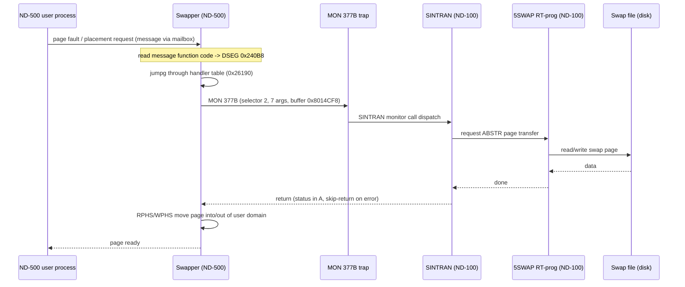
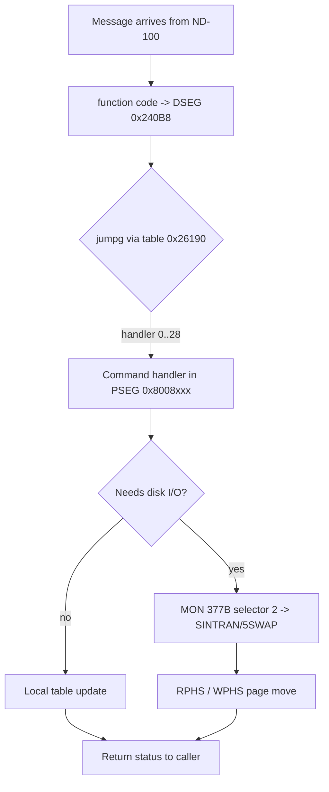
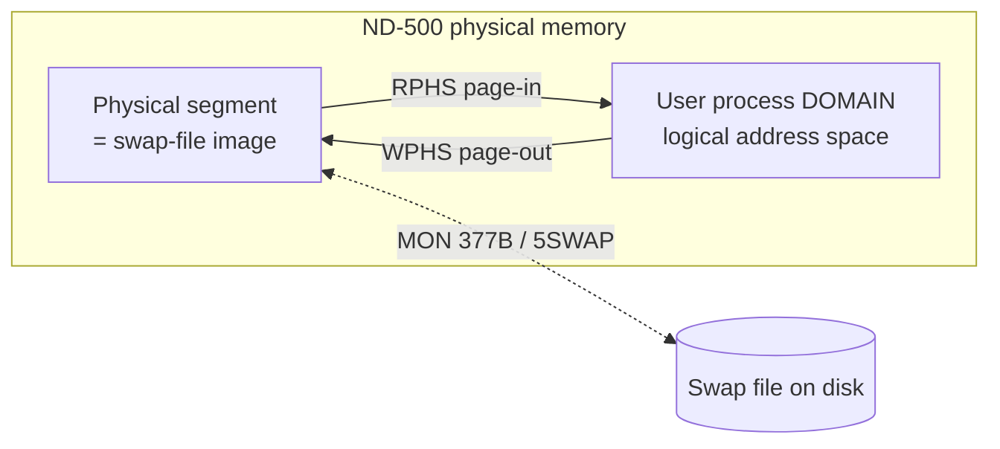

# ND-500/5000 Swapper (SWAPPER-K01) - Reverse Engineering Analysis

**Date:** 2026-07-08
**Artifacts (copied into this folder):**
- `SWAPPER-K01.PSEG` (38161 bytes) - ND-500 program segment (I-space machine code)
- `SWAPPER-K01.DSEG` (218117 bytes) - ND-500 data segment (D-space)
- `SWAPPER-K01.PSEG.asm` (249463 bytes, 12046 lines) - ND-500 disassembly of the PSEG
- `N500-SYMBOLS.SYMB` - resident ND-500 monitor symbol table (7157 symbols,
  `NAME=octal`, 5-char truncated). NOTE: this file is BYTE-IDENTICAL to the repo's
  `../../NPL-SOURCE/SYMBOLS/L07/N500-SYMBOLS.SYMB.TXT` (diff = 0) - it is the
  resident-side symbol set, NOT the swapper's own symbols (the swapper's DSEG
  addresses 0x08xxxxxx are not in it). It is still authoritative for message
  field offsets and status/error CODES, and it is what uniquely identifies the
  SWPFATAL selector in section 5.2.

**Source package:** ND-211305 (ND-500/5000 System Package ver. B), copied by the
SINTRAN III L install as `SWAPPER-K:PSEG` / `SWAPPER-K:DSEG`
(F:\ND\SINTRAN-K05-XMSG-2026\FLOPPY\500).

**Method:** static analysis. The PSEG disassembly was produced with the nd500x
ND-500 disassembler; instruction semantics are cited to
`/home/ronny/repos/nd500x/docs/instructions/asm/*.md`. The DSEG was hex-analysed
directly (`xxd`, byte offsets are file offsets). Every address/value below is
cited to a file offset or an .asm line number. Items that could not be verified
are marked UNVERIFIED.

> HONESTY NOTE: this is the FIRST real ND-500 machine code analysed in this
> project. The ND-500 is a 32-bit, big-endian, byte-addressed, descriptor-based,
> **split instruction/data (I/D)** CPU - fundamentally unlike the ND-100. Do not
> carry ND-100 assumptions across. Where the disassembler's operand notation is
> ambiguous it is flagged.

---

## 1. What the swapper IS

The ND-500/5000 Swapper is an **ND-500-side supervisor process** whose job is
demand paging and segment placement for ND-500 user processes. It runs *on the
ND-500*, not on the ND-100. Its counterpart on the ND-100 side is the RT-program
**5SWAP** ("Performs ABSTR in ND-100 for the ND-500/5000 Swapper", L-release doc
line 2615) plus the resident driver `5P-P2-MON60.NPL`.

It is a two-segment ND-500 **domain**:

```
        ND-500 process "domain"  =  { PSEG , DSEG }
        ┌──────────────────────────┐  ┌──────────────────────────┐
        │  SWAPPER-K01.PSEG        │  │  SWAPPER-K01.DSEG         │
        │  I-space (instructions)  │  │  D-space (data)           │
        │  read/execute only       │  │  read/write               │
        │  base I:0x08000000       │  │  base D:0x08000000        │
        │  ~38 KB of code          │  │  218 KB (mostly zeroed     │
        │                          │  │  BSS - runtime tables)     │
        └──────────────────────────┘  └──────────────────────────┘
```

Both segments are addressed from base **0x08000000** in their own space (I/D
split - the same numeric address means a code word in I-space and a data word in
D-space). In the disassembly:
- `call $0x0800XXXX` / `go $0x...` targets = **I-space** (PSEG) code addresses.
- `$0x0800XXXX` used as a load/store/compare operand = **D-space** (DSEG) data,
  file offset = address - 0x08000000.
- `call $0xFFFFFFFFF80000xx` = a **MON (monitor call) trap** to SINTRAN on the
  ND-100 (the disassembler annotates these `; MON nnnB`).

---

## 2. Identity block (DSEG header, file offset 0x12800-0x12896)

Hex (big-endian words), decoded:

```
offset     bytes                     meaning
0x12800    0803 8000                 descriptor: base 0x08038000 (segment/table)
0x12804    0000 0000
0x12808    0000 09ff                 limit/count 0x09FF
0x1280c    080b 8000  ... ffff       descriptor: base 0x080B8000, sentinel FFFF
0x12818    "REV.-K01"                revision string  (52 45 56 2E 2D 4B 30 31)
0x12856    0000 0006                 count = 6
0x12858    0802 3e86                 pointer 0x08023E86 (into variable region)
0x1286c    0802 6248                 pointer 0x08026248 (end of handler table, sec 6)
0x1287c    "12:41:57"                build/assembly TIME stamp (31 32 3A 34 31 ...)
0x12888    0000 0008                 8
0x1288c    0000 0064                 100 (0x64)
0x12896    0000 1000                 0x1000
```

ASCII field map of the revision/timestamp header:

```
0x12818: 'R''E''V''.''-''K''0''1'     <- REV.-K01
         52  45 56 2E 2D 4B 30 31
0x1287c: '1''2'':''4''1'':''5''7'     <- 12:41:57  (build time)
         31  32 3A 34 31 3A 35 37
```

The revision `-K01` matches the file name `SWAPPER-K01` and the L-release
requirement "ND-500/5000 Swapper (version K)". The init code verifies this string
at runtime (see section 4).

---

## 3. DSEG structure map (the "data portion")

The DSEG is 218 KB but **overwhelmingly zero** - it is mostly uninitialised BSS
(runtime tables/buffers that the swapper fills in as it runs). Only ~90 non-zero
16-byte lines exist. The initialised regions:

| File offset range | Contents | Section |
|---|---|---|
| 0x12800 - 0x12896 | Identity header: descriptors, `REV.-K01`, `12:41:57`, sizes | 2 |
| 0x128f0 - 0x12960 | Staircase sentinel array (8 slots, each ends 0xFFFF) | 3.1 |
| 0x129e0 - 0x12a00 | Init constant table (addresses/limits) | 3.2 |
| 0x12a20 - 0x12a3c | MON-377B selector table (monitor-call numbers) | 5.2 |
| 0x14d10 - 0x14d34 | Small config words (0x60, 0x64, 0x0a, flags) | 3.2 |
| 0x23d40 - 0x23d84 | Runtime status/limit words (masks 0x3FF, 0x1FF, 0xFFFF) | 3.3 |
| 0x23e88 | Log message text `" 254 processes"` | 3.3 |
| 0x23f50 - 0x240a0 | Handler jump tables + arg-count/type tables | 6 |
| 0x26190 - 0x26200 | Command-handler dispatch table (~30 I-space pointers) | 6 |
| 0x28f30 - 0x28f88 | Buffer/segment descriptors (base+length pairs) | 3.4 |
| 0x30f80 - 0x30f94 | Buffer/segment descriptor (base 0x08028F60 len 0x3FF) | 3.4 |
| 0x353f0 - 0x35404 | Segment tail (end padding) | - |

### 3.1 Staircase sentinel array (0x128f0-0x12960)

```
0x128f0: .. .. .. .. .. .. .. FFFF
0x12900: .. .. .. .. .. .. FFFF ..
0x12910: .. .. .. .. .. FFFF .. ..
...                       (0xFFFF shifts left one word per row)
0x12960: FFFF ..
```

Eight records, each terminated by `0xFFFF` (-1). This is an initialised
fixed-size slot array (candidate: per-CPU or per-swap-file slot list) whose empty
entries are pre-marked -1. UNVERIFIED which table (the code index that reads it
was not traced to a symbol).

### 3.2 Init constant / config tables

```
0x129e0: 30000000 00E00000 C0000000 C0000000
0x129f0: 4FF80000 4FF80000 47000000 30000000
0x12a00: 50000000 03000000 05000000 00010000
```
High-bit-heavy words (0xC0000000, 0x4FF80000). These are ND-500 descriptor
fields or physical-address constants used during initialisation. UNVERIFIED exact
role (need the reader in the PSEG).

```
0x14d1c: 0000 0060   0000 0064   0000 000a   0000 0000   (96, 100, 10)
0x14d2c: 0000 0001   0000 0000   0000 0001   0000 0001
```
Small configuration counts/flags. 0x64 = 100, 0x60 = 96, 0x0A = 10.

### 3.3 Runtime status words + log text

```
0x23d40: .. .. 000003FF 0000FFFF ........ 000001FF 0000FFFF 00000002
```
Masks/limits: 0x3FF (1023), 0x1FF (511), 0xFFFF, and a small state word = 2.

```
0x23e88: 0D 0A ' ' '2' '5' '4' ' ' 'p' 'r' 'o' 'c' 'e' 's' 's' 'e' 's' 0D 0A 27
         CR LF  " 254 processes"  CR LF '   (NPL string terminator 0x27)
```
A formatted log/report line. "254" is the ND-500 max-process count
(cf. `5PRSELSIZE`/max processes in `5P-P2-MON60.NPL`). The swapper prints
process-count status.

### 3.4 Buffer / segment descriptors

ND-500 descriptors appear as **(base address, length)** pairs:

```
0x28f3c: 0802 62bc                              base 0x080262BC
0x28f44:            0000 09ff  0802 8abc        len 0x09FF, base 0x08028ABC
0x28f50: 0000 00fe  0802 8eb8                   len 0x00FE, base 0x08028EB8
0x28f5c:                        0000 001c ...    len 0x1C
0x28f70: FFFF FFFF FFFF FFFF FFFF FFFF          empty slots (-1)

0x30f8c: 0802 8f8c                              base 0x08028F8C
0x30f94:            0000 03ff  0802 8f60        len 0x03FF, base 0x08028F60
```

These describe DSEG working buffers (bases 0x08026000-0x08028000 region) with
their lengths. They are the page/transfer buffers the swapper reads into and
writes out of. Note base addresses point back into the swapper's own DSEG
high-BSS area (0x26xxx-0x28xxx), i.e. these are **self-referential buffer
descriptors**, not MPM addresses.

---

## 4. Entry point and calling convention

The PSEG begins (`.asm` lines 12-40) with the ND-500 **INIT** instruction and the
revision check:

```
line 16:  init      $0x8024254,$0x24,$0x1F44   ; set up segment/stack (INIT)
line 17:  w move    $0x1A,b.0x14               ; local := 0x1A
line 19:  w comp2   $0x8012818,$0x5245562E      ; compare DSEG[0x12818] with "REV."
line 20:  if >< go  $0x4                        ;   branch if not equal
line 21:  w set1    b.0x1C                       ; flag "REV. matched"
line 23:  w comp2   $0x801281C,$0x2D4B3031       ; compare DSEG[0x1281C] with "-K01"
line 25:  w set1    b.0x20                       ; flag "-K01 matched"
...
line 40:  call      $0xFFFFFFFFF8000000 ; MON 0B EXITT   (exit if mismatch)
```

So the very first thing the swapper does is **self-verify its own revision
string** `REV.-K01` in its DSEG, and `MON 0B` (EXITT / leave) if it is wrong.
This is a build-consistency guard between PSEG and DSEG.

**Subroutine convention** (verified against nd500x docs):
- `ENTS <words>` - simple subroutine entry: saves return addr + frame pointer,
  allocates `<words>` of stack locals, sets new frame pointer (B). 119 uses.
- `ENTD <words>` - entry with display registers (block-structured scoping). 32
  uses. Used where nested-scope local access is needed.
- `RETD` / `RET` - matching returns.
- Locals are addressed `b.0xNN` (positive = args/locals off frame pointer B),
  registers `r1..r4`, `w`/`w1`/`w2`/`w3` = word-size operand prefixes.
- `INIT <stack>,<...>,<...>` - one occurrence, the domain entry prologue.

---

## 5. How the swapper talks to the ND-100 (SINTRAN)

The swapper reaches SINTRAN services on the ND-100 exclusively through the
**MON monitor-call trap**, encoded as a CALL to `0xFFFFFFFFF80000xx`:

```
call $0xFFFFFFFFF8000000        ; MON 0B    (EXITT / leave)
call $0xFFFFFFFFF80000FF ...     ; MON 377B  (generic SINTRAN monitor-call gateway)
```

### 5.1 The MON 377B gateway

Every SINTRAN service call is `MON 377B` (0xFF) with this argument shape:

```
call  MON377B , <nargs> , <selector-ptr> , <arg2> , <arg3> ...
                  |          |               |
                  |          |               +-- data buffer / parameter (DSEG or local)
                  |          +-- pointer into the selector table (0x12A20..0x12A34)
                  +-- number of CALL arguments
```

Example (`.asm` line 103):
```
call $0xF80000FF,$0x2,$0x8012A34,$0x8023D7C   ; MON 377B, 2 args, sel@0x12A34, buf@0x23D7C
```

### 5.2 The MON-377B descriptor table (DSEG 0x12a20-0x12a3c)

Each `MON 377B` is preceded by an INTERNAL call with IDENTICAL arguments, then
the trap - the "try internally, else trap to the ND-100" pattern:

```
.asm 102:  call $0x8009381,$0x2,$0x8012A34,$0x8023D7C   ; internal wrapper
.asm 103:  call MON377B  ,$0x2,$0x8012A34,$0x8023D7C   ; then trap to SINTRAN
```

The second CALL argument (`$0x8012A34` etc.) points at a one-word CODE in this
table; the third points at a data buffer. Table contents (file offsets):

```
offset    value        symbol lookup (N500-SYMBOLS.SYMB)     used at .asm
0x12a20   0x427 (2047B) SWPFA = SWPFATAL "FATAL ERROR FROM      line 520
                        SWAPPER" (5P-P2-MON60.NPL:79) - UNIQUE  (error path)
0x12a24   2             ambiguous small value                  1359.. (7-arg, common)
0x12a28   1             ambiguous small value                  10535 (4-arg)
0x12a2c   4             ambiguous small value                  3089  (6-arg)
0x12a30   5             ambiguous small value                  8372  (3-arg)
0x12a34   6             ambiguous small value                  103,167 (2-arg)
0x12a38   1
0x12a3c   4
```

**CORRECTED interpretation:** this is NOT a table of SINTRAN monitor-call numbers
(the value 0x427 is far too big for a monitor number, and it resolves cleanly to
the STATUS code SWPFATAL). It is a table of small operation/status CODES that the
swapper hands to SINTRAN. The one firmly identified entry is **0x12a20 = 0x427 =
SWPFATAL (2047B)**, used on the swapper's fatal-error/cleanup path (line 520,
after the internal calls at 0x800894A/0x8008AAA fail) - i.e. the swapper reports
"fatal swapper error" to the ND-100 through MON 377B.

UNVERIFIED: the small values 1/2/4/5/6 are individually ambiguous (many symbols
share each value) and are NOT resolved here. The dominant call (0x12a24 = 2, 7
args, fixed parameter `$0x8014CF8`) is still the swapper's page-transfer request
that the ND-100 turns into a disk `ABSTR` via RT-program 5SWAP; its exact SINTRAN
entry is not pinned down.

### 5.3 Communication flow



---

## 6. Command dispatch (how the swapper reads and acts on a message)

The ND-100 sends the swapper a message (via the mailbox). The message's
**function code** lands in DSEG word `0x080240B8`, and the swapper dispatches on
it with an indexed jump through the handler table:

```
.asm line 10599:  w1 :=  $0x80240B8         ; index := message function code
.asm line 10600:  jumpg  $0x8026198+        ; jump via table[ base 0x26190 + index*? ]
```

The handler table at DSEG **0x26190** is an array of I-space (PSEG) code pointers:

```
0x26198: 080083D8 080083F7 08008474 080083A2 080083BD 0800836C
0x261b0: 08008672 080086E2 08008412 08008431 08008387 0800864C
0x261c0: 0800864F 0800844C 0800848F 080084BD 08008655 080084EB
0x261e0: 08008524 08008542 08008652 08008567 08008582 080085E3
0x261f0: 08008602 0800868E 080086AA 080086C6 0800861F
```

~29 handlers, all in the PSEG 0x08008xxx region - one per swapper command/message
type. A **second** dispatch/vector region sits at DSEG 0x23f90-0x24010:

```
0x23f94: 08003039 08002EBF 08002EB4 08002EB4 08003043 08003082   (code ptrs)
0x23fd0: 080049A7 080049CC 080049CC                              (code ptrs)
0x24004: 08006722 08006839 08006722                              (code ptrs)
```

interleaved with small-int tables (0x0217/0x0218 at 0x23fb0; 0x021d-0x0222 at
0x23fe0; a run of 3/4/7/... counts at 0x24010-0x240a0). These are the per-command
**argument-count / operand-type** tables that parallel the handler vectors.



---

## 7. What the swapper MANAGES on the ND-500 side

The swapper's real work is moving pages between the swap file (physical segments
on disk, reached via the ND-100) and ND-500 process **domains**. Two privileged
'87-architecture instructions are its core primitives (verified in nd500x docs):

### 7.1 RPHS - Read from Physical Segment (swap-IN)

`RPHS <domain number>` - copies bytes from a physical segment into a domain's
logical address space. Register contract:

```
 ┌────────┬──────────────────────────────────────────────┐
 │ I1     │ byte count to move (decrements to 0)          │
 │ I2     │ destination logical address in the domain     │
 │ I3     │ source address on the physical segment        │
 │ I4     │ physical segment number                        │
 │ operand│ destination DOMAIN number                      │
 └────────┴──────────────────────────────────────────────┘
 Loop:  S([I4,I3]) -> D(domain.I2) ; I3++ ; I2++ ; I1--
        stop at page boundary (Z flag set iff I1 reached 0)
```
Used at `.asm` lines 1389, 1436 (`rphs $0x...C4`). This is the **swap-in / page-in**
operation: pull a page from the physical (swap) segment into the faulting
process's domain.

### 7.2 WPHS - Write to Physical Segment (swap-OUT)

`WPHS` - the mirror of RPHS: copies bytes from a domain into a physical segment
(swap-out / page-out / write-back of a dirty page).

### 7.3 Page-boundary semantics

Both stop at a page boundary even if bytes remain (`I1 > 0 -> Z clear`), so the
swapper loops per page - consistent with demand paging one page at a time.



---

## 8. Instruction-mix summary (PSEG)

Counted from the disassembly (`.asm`):

| Instruction | Count | Meaning / role |
|---|---|---|
| `ents` | 119 | simple subroutine entry (most functions) |
| `entd` | 32 | subroutine entry with display registers (nested scope) |
| `retd` | 3 | display-frame return |
| `init` | 1 | domain entry prologue (line 16) |
| `rphs` | 2 | read from physical segment (swap-in) |
| `MON 0B` | 1 | EXITT (revision-mismatch guard) |
| `MON 377B` | 15+ | SINTRAN monitor-call gateway |
| `jumpg` | 1 (key) | message dispatch through handler table 0x26190 |

(Full histogram available by re-running the grep in section notes.)

---

## 9. Cross-reference to the evidence dossier (Q4)

Handoff Q4 asked: entry-point convention, how it reads its message, what
MICFU/status it writes, direct interface interaction.

| Q4 sub-item | Finding | Evidence |
|---|---|---|
| Entry convention | `INIT` prologue + `REV.-K01` self-check, else `MON 0B` exit | .asm 16-40; DSEG 0x12818 |
| Reads its message | function code at DSEG 0x240B8, `jumpg` via table 0x26190 | .asm 10599-10600; DSEG 0x26190 |
| Message field offsets | Layout confirmed from N500-SYMBOLS.SYMB: N5STA=2, SENDE=3, X5CPU=4, X5ACT=5, MICFU=6 (same as dossier 2.6.2). The message buffer in the swapper DSEG is zeroed BSS (filled at runtime), so the offsets come from symbols, not static bytes | N500-SYMBOLS.SYMB |
| MICFU/status writes | Written at runtime into BSS message buffers - not static constants. One status code IS statically present: SWPFATAL (2047B) at DSEG 0x12a20, handed to SINTRAN on the fatal path (sec 5.2). Full runtime MICFU/status set needs a live dump | 0x12a20; sec 5.2 |
| Direct interface (IOX/TAG) | NONE. The swapper uses MON 377B -> SINTRAN, and RPHS/WPHS for page moves. No IOX/interface-register access on the ND-500 side | .asm MON scan; sec 5, 7 |

This is consistent with the bus-interface spec: even the ND-500 swapper does not
touch the 3022/5015 interface registers directly - it goes through SINTRAN (MON
377B) and the CPU's own RPHS/WPHS memory primitives.

---

## 10. Explicitly NOT determined

- MON-377B code words 1/2/4/5/6 (ambiguous small values). The 0x427 = SWPFATAL
  entry IS resolved (sec 5.2); the rest are not.
- The MICFU / message-status values the swapper writes (they are runtime, into
  zeroed BSS buffers - require a live memory dump, handoff 6.2 approach).
- The role of the init constant table (0x129e0) and the staircase array (0x128f0).
- Full per-command semantics of the ~29 handlers at 0x26190 (only the dispatch
  mechanism and their PSEG addresses are established).
- Whether the DSEG descriptors at 0x28f30/0x30f80 map to MPM or stay in-DSEG
  (their bases point into the swapper's own high BSS, suggesting in-DSEG buffers).

---

## 11. Appendix - decoded text strings from the DSEG

| File offset | Bytes | Decoded |
|---|---|---|
| 0x12818 | 52 45 56 2E 2D 4B 30 31 | `REV.-K01` (revision) |
| 0x1287c | 31 32 3A 34 31 3A 35 37 | `12:41:57` (build time) |
| 0x23e88 | 0D 0A 20 32 35 34 20 70 72 6F 63 65 73 73 65 73 0D 0A 27 | `<CR><LF> 254 processes<CR><LF>'` (log line) |

No other ASCII text exists in the DSEG; all remaining non-zero data is numeric
(pointers, descriptors, tables, masks). The PSEG contains no embedded strings
(pure code).
