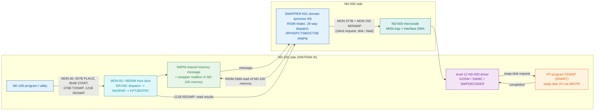
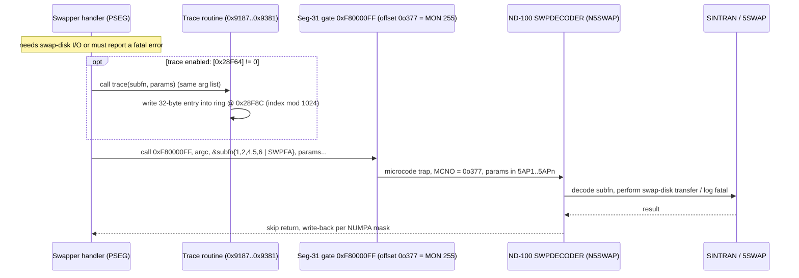
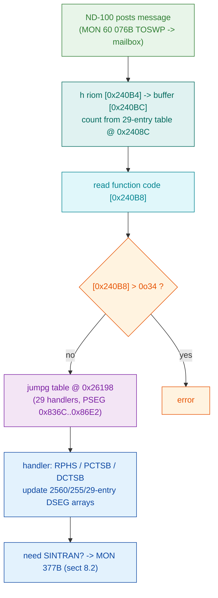

# SWAPPER-K01 - Deep Analysis: ND-100 <-> ND-500 Interaction, MON Traps End to End, and System Role

A dedicated deep-dive that builds on (does not replace) the two companion documents:

- `SINTRAN/ND500/swapper/swapper-k01.pseg.md`
  (entry path, the MON 377B gate mechanism, routine inventory)
- `SINTRAN/ND500/swapper/swapper-k01.dseg.md`
  (DSEG hex dump, PSEG->DSEG cross-reference, descriptor data)

Primary evidence read directly for THIS document:

- Disassembly (ND-500, OCTAL, base 0x08000000):
  `SINTRAN/ND500/swapper/swapper-k01-pseg.asm`
- Raw segments:
  `SINTRAN/ND500/swapper/SWAPPER-K01.PSEG`,
  `SINTRAN/ND500/swapper/SWAPPER-K01.DSEG`
- ND-100 front door (MON 60 worker source):
  `SINTRAN/NPL-SOURCE/NPL/5P-P2-MON60.NPL`
- MON 60 subfunction reference (SINTRAN-source-derived):
  `SINTRAN/ND500/nd-500-mon/mon60-callers/SUBFUNCTION-TABLE.md`
- Per-command carved folders under
  `SINTRAN/ND500/nd-500-mon/mon60-callers/`
- Monitor-call mechanism (prior art, corroborating, NOT from the swapper bytes):
  `SINTRAN/ND500/ND500-MONITOR-CALL-PARAMETER-PASSING.md`,
  `SINTRAN/ND500/ND500-SWAPPER-ANALYSIS.md`,
  `SINTRAN/ND500/swapper/N500-SYMBOLS.SYMB`

Numbers in the disassembly are OCTAL; hex is prefixed `0x`. Every octal<->hex conversion in
this document was computed programmatically (Python `oct()`/`hex()`), not by hand; the ones
that matter are spelled out in section 2. Every factual claim is either cited to a byte
offset / listing line and marked **PROVEN**, or marked **INFERRED** / **UNKNOWN** with the
experiment that would settle it. Where prior art disagrees with the bytes, the bytes win and
the disagreement is stated.

---

## 0. TL;DR - the role, in one paragraph

**SWAPPER-K01 is an ND-500-resident paging/swap worker DOMAIN and a CLIENT of SINTRAN - it
is NOT "the low-level handler that does all ND-500 work for the ND-100".** It is the ND-500
side of ND-500 process #0. It receives work as *messages* posted into ND-100 private memory,
pulls those messages across the interface by DMA (`RIOM`, 3 sites), dispatches them on a
private 29-entry function-code table (`jumpg $0x08026198`, DSEG function code at 0x080240B8),
does the actual page moves itself with ND-500 supervisor instructions (`RPHS` read-physical-
segment x2, `PCTSB`/`DCTSB` cache/table primitives x7), and when it needs a service it cannot
perform in-domain (swap-disk transfer, fatal-error reporting) it *asks the ND-100* by trapping
through the ND-500 monitor-call gate (`MON 377B` = segment-31 offset 0o377 = monitor call 255
= N5SWAP, 15 sites). It never fields the ND-100's low-level requests and contains no
MON-number receive dispatcher; the bus/interrupt/DMA hardware is ND-100 I/O space it cannot
touch, and the swap-disk I/O is done by the separate ND-100 RT-program 5SWAP. Every one of
these statements is proven from the bytes below.

**Correction to the task brief's premise (important).** The brief treats every `$1000225xxx`
operand as a "MON 377B descriptor" and names 225110 (49x) and 225070 (19x) as "the dominant
services". The bytes refute this. Only **six** of the seventeen `$1000225xxx` operands are ever
the first argument of a `MON 377B` call; **225110 and 225070 are never MON 377B arguments at
all** - they are the integer constants 6 and 1, loaded *by value* (`w2 :=`, `w move`). See
section 3, which is the corrected descriptor decode.

---

## 1. What "225110" and "225070" actually are (answering the brief head-on)

The brief asked to "identify 225110 (49x) and 225070 (19x) first and carefully". Done, from
the bytes:

**`$1000225110` = DSEG 0x12A48 = the constant integer 6.** Its 49 references are all value
loads. Grep of `SINTRAN/ND500/swapper/swapper-k01-pseg.asm`:

```
8800:1000065572: 015 304 010 001 052 110       w2 :=  $1000225110
8953:1000066632: 032 304 010 001 052 110 205    w move $1000225110,r.24
... (49 sites, every one a w2:= / w move / w1:= / w4:=, i.e. read-by-value)
```

**`$1000225070` = DSEG 0x12A38 = the constant integer 1.** Its 19 references are all value
loads (`w3 :=`, `w move`, `w2 :=`).

Neither ever appears as `call $1777777777777000000377,<argc>,$1000225070,...` or
`...,$1000225110,...`. They are entries in the compiler-generated constant pool at
0x12A20-0x12A4C documented in `SINTRAN/ND500/swapper/swapper-k01.dseg.md` section 5.6, in the "read by value"
sub-pool (Group B). They are the small integers the swapper's arithmetic uses; they are not
service selectors.

**Why the brief's usage counts still line up.** The brief's list
(225014(8) 225020(7) ... 225110(49) 225070(19) ...) is a raw scan of every absolute operand
in the octal range 0o225014..0o225130 = DSEG 0x12A0C..0x12A58. That range happens to contain
BOTH the six selector constants that `MON 377B` passes by address AND the run-time scalars and
by-value constants that surround them. The scan conflated them. The corrected split is in
section 3.

---

## 2. The gate mechanism, proven from bytes

### 2.1 Two trap targets, verified

Grep of every `call $1777777777777...` (sign-extended segment-31 target) in the 12046-line
listing returns exactly two distinct targets:

| Octal target | = hex | Segment / offset | MON | Count | Site(s) |
|---|---|---|---|---|---|
| `1777777777777000000000` | 0xF8000000 | seg 31, offset 0 | MON 0B (LEAVE) | 1 | line 40 = 0o1000000131 |
| `1777777777777000000377` | 0xF80000FF | seg 31, offset **0o377 = 255** | MON 377B | 15 | see 2.3 |

`0xF8000000` is ND-500 logical segment 31 (the escape/trap segment); the low byte is the
monitor-call offset. `0x00 = 0` -> LEAVE/terminate; `0xFF = 0o377 = 255` -> the SINTRAN
service gate. **PROVEN** from the operand bytes `303 370 000 000 000`/`303 370 000 000 377`
at those lines.

### 2.2 What monitor call 0o377 (=255) is

Offset 0o377 into segment 31 is monitor-call number 255 decimal. Per the monitor-call
reference `SINTRAN/ND500/ND500-MONITOR-CALL-PARAMETER-PASSING.md`
(section 3.4, derived from the SINTRAN kernel source `MP-P2-N500.NPL`, NOT from the swapper
bytes):

```
| Mon Call | Octal | Symbol  | Handler    | Purpose           |
| 255      | 377   | N5SWAP  | SWPDECODER | Swapper internal  |
```

So the swapper's 15 service traps are all **N5SWAP** (MON 255 = 0o377), decoded on the far
side by `SWPDECODER`. This identity is **corroborated inference**, not proven from the two
swapper files: what the swapper bytes prove is the numeric target (offset 0o377); the name
N5SWAP/SWPDECODER comes from the kernel-source-derived reference. Experiment to make it
PROVEN from first principles: single-step the ND-500 at line 103 and observe the STOP-REASON /
MCNO the ND-100 sees (should read MCNO = 0o377).

### 2.3 The 15 MON 377B call sites, with arguments (PROVEN, byte-exact)

Each site is `call $0xF80000FF, <argc>, <selector-ptr>, <params...>`. The selector pointer is
always the ADDRESS of a small constant (ND-500 high-level languages pass arguments by
reference), so the VALUE at that address is the request sub-function code. Reading the operand
bytes directly:

| # | Listing line | I-addr (oct) | argc | selector ptr (oct) | selector DSEG off | value | remaining params |
|---|---|---|---|---|---|---|---|
| 1 | 103 | 1000000507 | 2 | 1000225064 | 0x12A34 | **6** | 1000436574 = 0x23D7C |
| 2 | 167 | 1000001131 | 2 | 1000225064 | 0x12A34 | **6** | 1000436574 = 0x23D7C |
| 3 | 520 | 1000003167 | 2 | 1000225040 | 0x12A20 | **0o2047 SWPFA** | 1000437234 = 0x23E9C |
| 4 | 1359 | 1000010131 | 7 | 1000225044 | 0x12A24 | **2** | b.70,@b.134,b.64,1000246370=0x14CF8,b.44,b.50 |
| 5 | 1987 | 1000013600 | 7 | 1000225044 | 0x12A24 | **2** | @b.174,@b.-200,b.120,0x14CF8,b.100,b.74 |
| 6 | 2109 | 1000014466 | 7 | 1000225044 | 0x12A24 | **2** | @b.-650,@b.-654,b.120,0x14CF8,b.100,b.74 |
| 7 | 2433 | 1000016502 | 7 | 1000225044 | 0x12A24 | **2** | b.70,@b.124,b.64,b.40,b.50,b.44 |
| 8 | 2732 | 1000020237 | 7 | 1000225044 | 0x12A24 | **2** | b.70,@b.140,b.64,b.40,b.44,b.34 |
| 9 | 3089 | 1000022231 | 6 | 1000225054 | 0x12A2C | **4** | @b.-670,1000440264=0x240B4,b.30,b.50,b.54 |
| 10 | 3325 | 1000023534 | 7 | 1000225044 | 0x12A24 | **2** | b.70,@b.124,@b.130,b.64,@b.134,@b.140 |
| 11 | 5252 | 1000037154 | 7 | 1000225044 | 0x12A24 | **2** | b.1020,@b.1100,@b.1104,b.364,@b.1110,b.370 |
| 12 | 5577 | 1000041466 | 7 | 1000225044 | 0x12A24 | **2** | (disassembler lost column sync; arg1 bytes `052 044` = 0x12A24 PROVEN) |
| 13 | 5959 | 1000044151 | 2 | 1000225064 | 0x12A34 | **6** | 1000436600 = 0x23D80 |
| 14 | 8372 | 1000062726 | 3 | 1000225060 | 0x12A30 | **5** | b.44,1000440264=0x240B4 |
| 15 | 10535 | 1000101077 | 4 | 1000225050 | 0x12A28 | **1** | 1000440260=0x240B0,1000440264=0x240B4,b.24 |

Octal->hex spot checks (Python-verified):
`0o1000225064 = 0x08012A34`; `0o1000225044 = 0x08012A24`; `0o1000225040 = 0x08012A20`;
`0o1000246370 = 0x08014CF8`; `0o1000440264 = 0x080240B4`; `0o1000440260 = 0x080240B0`;
`0o1000436574 = 0x08023D7C`; `0o1000437234 = 0x08023E9C`.

---

## 3. Corrected descriptor decode table (the real Task 1 answer)

There is no per-service descriptor *block* in this domain. The "descriptor" of a `MON 377B`
is simply the **address of a one-word sub-function code**. Six such constants are used as
selectors; the remaining `$1000225xxx` operands the brief listed are ordinary data. Full
decode of all seventeen operands in the 0x12A0C..0x12A58 window:

### 3.1 Actual MON 377B selectors (6 of them)

| Selector ptr (oct) | DSEG off | value at addr | # MON 377B sites | argc | site lines | inferred purpose |
|---|---|---|---|---|---|---|
| 1000225040 | 0x12A20 | **0o2047 = SWPFA** (SWPFATAL) | 1 | 2 | 520 | fatal-error report; arg2 = fatal slot 0x23E9C |
| 1000225044 | 0x12A24 | **2** | 8 | 7 | 1359,1987,2109,2433,2732,3325,5252,5577 | **dominant request** (7 params, fixed buffer 0x14CF8 on some) |
| 1000225050 | 0x12A28 | **1** | 1 | 4 | 10535 | passes msg-control 0x240B0 + 0x240B4 |
| 1000225054 | 0x12A2C | **4** | 1 | 6 | 3089 | passes msg pointer 0x240B4 |
| 1000225060 | 0x12A30 | **5** | 1 | 3 | 8372 | passes msg pointer 0x240B4 |
| 1000225064 | 0x12A34 | **6** | 3 | 2 | 103,167,5959 | passes flag word 0x23D7C / 0x23D80 |

Totals: 1+8+1+1+1+3 = **15 sites**, matching the 15 `MON 377B` traps exactly.

**SWPFA = 0o2047 is PROVEN as the SWPFATAL error code**: in
`SINTRAN/ND500/swapper/N500-SYMBOLS.SYMB` the value 002047 resolves
*uniquely* to `SWPFA` (5-char truncation of SWPFATAL), inside a coherent swapper error band
(`SWADE=002040 ... NOMAS=002046 SWPFA=002047 MEMNA=002050 MICFA=002051`). Its single use is the
fatal path at line 520 with arg2 = 0x23E9C (the error slot written by `w1 =: $1000437234` at
line 497).

**The sub-function VALUES 1, 2, 4, 5, 6 are UNKNOWN by name.** They are the parameters
`SWPDECODER` decodes on the ND-100 side; nothing in the two swapper files names them, and no
symbol of magnitude 1..6 can be trusted (2628 distinct values over 7157 symbols). What is
established from the bytes is only their *shape*: function 2 is the heavy one (8 sites, 7
parameters, a fixed 0x14CF8 parameter buffer), functions 1/4/5 carry the message-control block
words (0x240B0/0x240B4), and function 6 carries a small flag word. Experiment to name them:
run the ND-100 side (`5P-P2-MON60.NPL` / the `SWMC` and `N5SWAP` paths) while the swapper
issues each and record which SINTRAN entry each value reaches.

### 3.2 The `$1000225xxx` operands that are NOT selectors (the brief's red herrings)

| Operand (oct) | DSEG off | value / role | how used | NOT a selector because |
|---|---|---|---|---|
| 1000225014 | 0x12A0C | 65536 seed, run-time -> 4096 divisor | `w1 /`, `w move`, `w4:=` | value load; divisor (dseg.md 5.5) |
| 1000225020 | 0x12A10 | halfword counter variable | `h incr`/`h decr` | run-time variable |
| 1000225022 | 0x12A12 | halfword variable | `h decr` | run-time variable |
| 1000225030 | 0x12A18 | word variable | `w move`, `w1 =:` | run-time variable |
| 1000225034 | 0x12A1C | word variable | `w move`, `w1 =:` | run-time variable |
| 1000225070 | 0x12A38 | **constant 1** | `w3:=`,`w move`,`w2:=` (19x) | **read by value; never a MON 377B arg** |
| 1000225074 | 0x12A3C | constant 4 | `w2:=`,`w move` (6x) | read by value |
| 1000225104 | 0x12A44 | constant 5 | `w2:=`,`w move` (10x) | read by value |
| 1000225110 | 0x12A48 | **constant 6** | `w2:=`,`w move` (49x) | **read by value; never a MON 377B arg** |
| 1000225120 | 0x12A50 | record base | `r:=` (record base, 8x) | base register, not an arg |
| 1000225130 | 0x12A58 | word variable | value/store | run-time variable |

So the answer to "identify 225110 and 225070": **225110 is the integer constant 6 and 225070
is the integer constant 1, both read by value; neither selects a SINTRAN service.** The
dominant actual service is MON 377B sub-function **2** (8 sites, 7 parameters).

---

## 4. How the swapper RECEIVES work: the interface, proven from bytes

The swapper is message-driven. Three mechanisms are visible in the listing.

### 4.1 It DMA-reads ND-100 private memory (RIOM x3) - PROVEN

`RIOM` = Read I/O-Processor Memory: a supervisor DMA that copies from ND-100 memory into
ND-500 memory across the interface, in halfword units (`H RIOM <nd100-addr>,<buffer>,<count>`).
Three sites:

```
8008 : 1000060340 : h riom b.34,b.30,$1000437240        ; count = [0x23EA0] = 2
8459 : 1000063341 : h riom b.50,b.26,$1000437774        ; count = [0x23FFC] = 10
10577: 1000101356 : h riom $1000440264,$1000440274,$1000440074+  ; the message pull
```

The third `RIOM` is the message-intake path and ties the message-control block together:

| Address | oct operand | Role | Evidence |
|---|---|---|---|
| 0x080240B4 | 1000440264 | ND-100 source address of the message | `h riom` operand 1 |
| 0x080240BC | 1000440274 | ND-500 message buffer base | `h riom` operand 2; `r:= $1000440274` x15 (record base) |
| **0x0802403C+** | 1000440074+ | halfword count, indexed per command (29-entry table) | `h riom` operand 3 |
| 0x080240B8 | 1000440270 | message function code | `w1 := $1000440270; jumpg $1000460630+` (lines 10599-10600) |

> **CORRECTION 2026-07-25** - this row previously read `0x0802408C+`. That was an arithmetic slip:
> `0o1000440074` = **`0x0802403C`**, not `0x0802408C`. Verify: `0x2403C` = 147516 decimal =
> `0o440074`. The wrong address was inherited by a diagnostic run, which read a count from the
> wrong table and reported "8 halfwords". Measured against the CORRECT base, the table (32-bit
> entries) reads `[0]=13 [1]=10 [2]=15 [3]=138 [4]=9 [5]=70 ...`, and message function code 5
> selects **15 halfwords**. Observed live in
> `RealSwapper_ServiceMon377BAnnounce_HowFarThen` (RetroCore `CPU.ND5000` tests).

So the swapper reads its request out of ND-100 private memory by DMA, into its own D-space
buffer at 0x240BC, and reads the function code at 0x240B8. This **corrects** the older prior-art
claim ("no direct interface access on the ND-500 side") - the swapper does reach ND-100 memory,
but only via the sanctioned `RIOM` supervisor DMA, not by touching interface registers (which
remain ND-100 I/O space).

### 4.2 It dispatches on a private 29-entry function-code table - PROVEN

```
10570:            w comp2 $1000440270,$34      ; [0x240B8] fn code <= 0o34 (=28) - the REAL dispatch bound
10599:            w1 :=   $1000440270           ; index = message function code [0x240B8]
10600:            jumpg   $1000460630+          ; jump via table @ 0x08026198
```

`0o1000460630 = 0x08026198` (PROVEN). The table at 0x26198 is exactly 29 words of PSEG code
pointers, all in the compact block 0x0800836C..0x080086E2 (full list in `SINTRAN/ND500/swapper/swapper-k01.dseg.md`
section 5.12). Three independent structures agree the command count is 29: the handler table
(29 entries), the array descriptor at 0x28F54 (`max_index = 0x1C` = 28 -> 29 entries), and the
per-command count table at 0x2403C (29 entries). The index range is 0..28 - a small
swap-command namespace, **not** the MON-call number space. This is the swapper's own protocol.

> **Routing + handler carves (2026-07-16) - where the function code comes from, and what the
> 29 handlers do.** Two follow-on carves settled the open ends of this dispatch:
> - **The function code carrier is `SWPST`, not `SWPFU`** (the earlier guess is REFUTED). On
>   the ND-100 side, `5ACTSWAPPER` stores the swap activation reason (an `MSW*` code) into the
>   swapper message field `SWPST` (SWMSG offset `0o103`); the swapper receives it as the OUT
>   parameter of `MON 377B` sub-function 1, lands it at DSEG `0x240B0`, and copies it to
>   `0x240B8` (the jumpg index). `SWPFU` is the *reverse-direction* swapper->ND-100 request
>   code. Full field layout + evidence chain:
>   [`SINTRAN/ND500/ND500-SWAPPER-ANALYSIS.md`](../ND500-SWAPPER-ANALYSIS.md) section 12.
> - **The dispatch index range is `0..0o34` (0..28), not 0..20** - the real bound is
>   `[0x240B8] <= 0o34` (line 10570); the `$24`=20 compare cited earlier is line 10598 on a
>   *different* variable. All 29 handlers are reachable. The `MSW*` codes span `MSWFI=0 ..
>   MSWDO=0o34` = 29 codes, matching the table.
> - **The 29 handler bodies are carved** (27 of 29 characterized PROVEN-shape): the full
>   index->target->behaviour table is in
>   [`SINTRAN/ND500/swapper/swapper-k01-handlers.md`](swapper-k01-handlers.md).

### 4.3 It does the page moves itself - PROVEN

The physical page work is done in-domain with ND-500 supervisor instructions, not delegated:

| Instruction | Opcode bytes | Count | Sites | Meaning (disassembler mnemonic) |
|---|---|---|---|---|
| `RPHS` | 377 365 | 2 | 1389, 1436 | Read from PHysical Segment (swap-in page read); operand = local -60 |
| `PCTSB` | 377 034 | 3 | 95, 115, 157 | page/cache-table supervisor primitive |
| `DCTSB` | 377 035 | 4 | 88, 108, 150, 411 | data/cache-table supervisor primitive |
| `WPHS`  | - | **0** | - | **absent** |

Note **WPHS (write physical segment) does NOT occur** - a correction to the prior-art claim
"RPHS/WPHS for page moves" (`SWAPPER-MON-DISPATCH.md` section 3). Only `RPHS` is present.

**CORRECTION (2026-07-20): "via RIOM's companion" is DEAD - there is no companion.** An earlier
revision of this paragraph offered three possibilities for the write-back path; the second was a
supposed write-side partner to `RIOM` ("WIOM"). **No such instruction exists** - it appears in no
ND-500 manual, no manual index, and none of the three opcode tables; the "RIOM/WIOM pair" was
invented prose that had also propagated into the emulator's source comments (since deleted).
Of the three options only **"handled on the ND-100 side"** survives, and the mechanism is now
understood: the ND-500 does not need a write instruction at all, because
1. **ordinary stores into the SHARED segment** are the normal path (`ND500_MMU_SPECIFICATION.md`
   defines `DC_SHSEG 6` "Shared segment (ND-100 <-> ND-500)", mapped `SG_RW | DC_SHS` - read/write,
   caching disabled because a second master touches the same cells);
2. **the CPU microprogram** writes mailbox answers directly ("The CPU microprogram initiates and
   controls the DMA access channel to the I/O-processor memory"), which is why
   `ND500-WHO-ANSWERS-THE-MAILBOX.md` concludes the answerer is THE MICROCODE; and
3. **the ND-100** can reach ND-500 memory itself as the master I/O processor - which is what the
   swapper relies on when it traps outward via `MON 377B` (15 sites), so this route collapses into 2.

`RIOM` is therefore not half of a pair: it is the escape hatch for the one direction nothing else
covers - reading ND-100 memory the ND-500 cannot address ("usually private ND-100 memory, not
directly addressable by the ND-500"). Writing never needed an instruction.

The
`PCTSB`/`DCTSB` mnemonic *names* are as the disassembler emits them; their precise semantics
are not established from these files (INFERRED to be page/data control-table maintenance).

---

## 5. The request/response loop (Task 2)

### 5.1 Startup / self-check (PROVEN)

```
line 4  : 1000000004 : init  $1000441124,$44,$17504     ; frame/stack: bottom=0x24254, total=8004
line 19 : 1000000016 : w comp2 $1000224030,$12221253056 ; [0x12818] vs ASCII 'REV.'
line 23 : 1000000027 : w comp2 $1000224034,$5522630061  ; [0x1281C] vs ASCII '-K01'
line 40 : 1000000131 : call $0xF8000000,$0              ; MON 0B LEAVE on mismatch
```

The domain first verifies its own build tag `REV.-K01` against two literal immediates and
LEAVEs if wrong (build-consistency guard). `INIT` establishes the run-time stack at DSEG
0x24254..0x26197 (8004 bytes; proven by `0x26198 - 0x24254 = 0x1F44 = 8004 = total_demand`).

### 5.2 The MON 377B site is trace-gated, not "try-local-else-forward" (PROVEN, correction)

Every `MON 377B` may be preceded by a call to one of five near-identical trace routines
(PSEG 0x9187/0x9208/0x9272/0x92E8/0x9381). That call is conditional on the trace-enable flag
0x28F64 and the MON 377B runs *either way*:

```
line 99  : 1000000456 : w test $1000507544        ; [0x08028F64] trace enabled?
line 100 : 1000000464 : if = go $23               ; 0o464 + 0o23 = 0o507 -> jump PAST the trace call
line 101 : 1000000466 : call $1000111601,$2,$1000225064,$1000436574  ; trace routine (same args)
line 102 : 1000000506 : ifkret
line 103 : 1000000507 : call $0xF80000FF,$2,$1000225064,$1000436574   ; MON 377B (runs regardless)
```

Branch arithmetic verified: `0o1000000464 + 0o23 = 0o1000000507` = the MON 377B. So the "local
wrapper with identical args" seen in the pseg.md is the **trace/logging** path (it writes the
1024x32-byte ring at 0x28F8C), not a local fast-path substitute for the trap. This corrects the
"try internally, else trap" reading.

### 5.3 Core loop, pseudo-C (reconstructed; structure PROVEN, semantics of codes INFERRED)

```c
/* SWAPPER-K01 - ND-500 process #0 server. All addresses are DSEG offsets. */

void swapper_main(void)
{
    if (memcmp(&dseg[0x12818], "REV.-K01", 8) != 0)   /* line 19/23 */
        MON_LEAVE();                                   /* MON 0B, line 40 */

    for (;;) {
        /* 1. INTAKE: pull the request message out of ND-100 private memory by DMA */
        h_riom(/*nd100*/ dseg_w[0x240B4],              /* line 10577 */
               /*buf*/   dseg_w[0x240BC],
               /*count*/ count_table[0x2408C + idx]);

        /* 2. DISPATCH on the swapper's own function code (0..28) */
        uint32_t fn = dseg_w[0x240B8];                 /* line 10599 */
        if (dseg_w[0x240B8] > 034) error();            /* bound check, line 10570 (034 = 28) */
        goto *handler_table_0x26198[fn];               /* jumpg, line 10600 */

        /* 3. Each handler does page work IN-DOMAIN ... */
        //   rphs(local_-60);                          /* swap-in page read, lines 1389/1436 */
        //   pctsb(); dctsb();                         /* cache/table primitives */
        //   ... and updates the DSEG tables (2560/255/29-entry arrays) ...

        /* 4. ... and, when it needs SINTRAN, traps the ND-100 (client): */
        if (need_swap_disk_or_status) {
            if (dseg_w[0x28F64]) trace_log(fn_code, params);   /* trace-gated */
            mon_255_n5swap(/*argc*/ 7, /*subfn*/ &TWO,          /* MON 377B, sub-fn 2 */
                           p2, p3, p4, &dseg[0x14CF8], p6, p7);
        }
        if (fatal)
            mon_255_n5swap(2, &SWPFA /*0o2047*/, &dseg[0x23E9C]); /* line 520 */

        /* 5. RESPONSE: results left in swapper D-space; the ND-100 reads them back
              via MON 60 subfunction 121B (RDSWP). (See section 7.) */
    }
}
```

The five sub-functions and their argument shapes are byte-proven (section 3.1); the loop's
outer structure (intake by RIOM -> function-code jumpg -> in-domain paging -> MON 377B on
demand) is proven by the cited lines. The *names* of sub-functions 1/2/4/5/6 and the internal
logic of the 29 handlers are INFERRED/UNKNOWN.

---

## 6. Role determination, with byte evidence (Task 3 - the headline)

**Determination: SWAPPER-K01 is an ND-500-side paging/swap worker DOMAIN that is a CLIENT of
SINTRAN.** It is NOT "the low-level handler that does all ND-500 work for the ND-100". The
three specific sub-claims resolve as follows:

**(a) It is process #0's server side - CONFIRMED (consistent with prior art; not contradicted
by any byte here).** The ND-500 swap side is process #0 (`S500S`/`5SWPROC`), served by the
ND-100 RT-program 5SWAP (`SINTRAN/ND500/ND500-SWAPPER-ANALYSIS.md`
header). The swapper domain's message-driven structure (RIOM intake + 29-entry function-code
dispatch, section 4) is exactly the shape of a per-process server; it carries a `254 processes`
build string (0x23E86) and per-process/segment arrays (2560, 255, 29 entries). This part is
corroborated, not independently proven from I/O bytes.

**(b) It requests services FROM the ND-100 (client), it does not field the ND-100's low-level
requests - PROVEN.** Direction of every trap is outward: 15x `MON 377B` are `call` instructions
the swapper *executes* (section 2.3), targeting SINTRAN. There is **no receive-side MON
dispatcher**: grep finds no MON-number entry vector, no trap prologue keyed to a MON number,
and the only inbound dispatch is the swapper's *own* 29-entry function-code table (0..28), a
different and smaller namespace than the MON-call space. The swapper's inbound work arrives as
*messages* (RIOM), not as trapped MON calls. Client, not server-of-MON-calls.

**(c) The low-level bus/interrupt/DMA work lives in SINTRAN's level-12 driver + the ND-500
microcode, and swap-disk I/O in the ND-100 RT-program 5SWAP - CONFIRMED by absence + prior
art.** The swapper contains zero interface-register access: it cannot, as an ND-500 domain,
touch the 3022/5015 interface registers (ND-100 I/O space). Its only cross-boundary primitives
are the sanctioned supervisor ops `RIOM` (DMA read of ND-100 memory) and the `MON 377B` trap.
It has no disk driver, no `ABSTR`/`ABSLI`, no channel code. The disk transfer is what it *asks
for* via MON 377B sub-function 2 (the dominant, 7-parameter request) - the ND-100/5SWAP side
turns that into an actual disk `ABSTR`. This matches the kernel-source picture in
`MP-P2-N500.NPL` (level-12 `GOSW`/`SWMC`) and `RP-P2-N500.NPL` (5SWAP), cited from prior art.

**Net:** the swapper is the *brain* of ND-500 paging (it decides which pages move, maintains
the page/segment tables in-domain, and moves pages with `RPHS`/`PCTSB`/`DCTSB`), but it is the
*client* for everything that crosses the machine boundary - it hands disk-transfer and
error-report requests to the ND-100 and lets SINTRAN + 5SWAP + the microcode do the physical
I/O. It is emphatically not a universal ND-500 MON-call first-responder (that is the resident
ND-500 System Monitor, per `SWAPPER-MON-DISPATCH.md`, unchanged by this pass).

---

## 7. Mapping to the ND-100 front door and the 5MPM handshake (Task 4)

Two directions cross the ND-100 <-> ND-500 boundary. They are distinct and must not be
conflated.

### 7.1 Direction A: ND-100 -> swapper (the front door, MON 60 / N500M)

An ND-100 program controls the ND-500 through **MON 60** (client name `N500M`). The subfunction
codes relevant to the swapper (from
`SINTRAN/ND500/nd-500-mon/mon60-callers/SUBFUNCTION-TABLE.md`,
authoritative from `5P-P2-MON60.NPL`):

| MON 60 subfn (oct) | 5IFUNC handler | Purpose | Carved folder |
|---|---|---|---|
| **007B** | IPLSWAPPER | **PLACE SWAPPER** (load this domain) | (no dedicated folder; see `SINTRAN/ND500/nd-500-mon/mon60-callers/LOAD-SWAPPER/`) |
| **054B** | 5NOPAR | **start swapper** | `SINTRAN/ND500/nd-500-mon/mon60-callers/START-SWAPPER/` |
| **076B** | ITOSWP | **MESSAGE TO SWAPPER** | `SINTRAN/ND500/nd-500-mon/mon60-callers/076B-TOSWP/` |
| **121B** | 5NOPAR | **READ FROM SWAPPERS DATA MEMORY (LOGICAL ADDRS)** | `SINTRAN/ND500/nd-500-mon/mon60-callers/121B-RDSWP/` |
| 046B / 047B | IDEFSWAP / IDELSWAP | define / delete swap file | `SINTRAN/ND500/nd-500-mon/mon60-callers/046B-DEFSWAP/`, `SINTRAN/ND500/nd-500-mon/mon60-callers/047B-DELSW/` |

Note: the brief wrote "7B PLACE SWAPPER" and "54B start swapper" - confirmed as octal 007B and
054B. It also wrote "76B TOSWP" and "121B RDSWP" - confirmed. There is no 007B-named folder,
but the `SINTRAN/ND500/nd-500-mon/mon60-callers/LOAD-SWAPPER/` operator-command folder exercises PLACE SWAPPER; `SINTRAN/ND500/nd-500-mon/mon60-callers/START-SWAPPER/`
exercises the start path.

`076B-TOSWP` (MESSAGE TO SWAPPER) is the intake counterpart to the swapper's `RIOM` in section
4.1: the ND-100 caller builds a message block in its frame, stores a pointer to it in MON 60
gateway param slot 6, and issues `MON 60` TOSWP (thunk `146610`, 5 call sites - all PROVEN in
`SINTRAN/ND500/nd-500-mon/mon60-callers/076B-TOSWP/README.md`). That message is what the swapper later pulls across by DMA and
dispatches on its function code.

`121B-RDSWP` (READ FROM SWAPPER'S DATA MEMORY) is the response counterpart: the ND-100 fills
four MON 60 param slots (6,7,10,11) and issues `MON 60` RDSWP (thunk `146665`, 3 call sites,
PROVEN in `SINTRAN/ND500/nd-500-mon/mon60-callers/121B-RDSWP/README.md`) to read results back out of the swapper's D-space by logical
address. This is how "answers come back" at the operator/utility level.

### 7.2 Direction B: swapper -> ND-100 (MON 377B = N5SWAP)

This is the direction analysed in sections 2-3: the swapper traps outward with monitor call
255 (0o377 = N5SWAP), sub-function in the first parameter, decoded by `SWPDECODER` on the ND-100
side. This is the swapper acting as a SINTRAN client (disk transfer, fatal-error reporting).

### 7.3 Where 5MPM sits (INFERRED from prior art; not in the swapper bytes)

Per the brief's verified context and the NPL front-door source, the ND-100 MON 60/N500M common
path `5NOPAR` ends in `FPT2ENTRY` ("ENTER ND-500 SYSTEM MONITOR"), which builds a message in
the **5MPM shared-memory region** and drives the ND-500. The swapper sits on the ND-500 side of
that handshake: 5MPM (and the swapper's own mailbox in ND-100 memory) is what `076B-TOSWP`
writes and what the swapper's third `RIOM` reads. The 5MPM buffer itself is **not** present in
these two swapper files (its bytes live in ND-100 memory / the kernel image), so its layout is
UNKNOWN from here; the linkage is asserted from `5P-P2-MON60.NPL` and the prior-art bus
reference, and is INFERRED, not proven by the swapper bytes.

---

## 8. Diagrams

### 8.1 System role - who does what across the boundary



### 8.2 MON 377B end-to-end (the client trap)



### 8.3 Intake and dispatch (how work arrives)



---

## 9. Named routines (Task 5)

`SINTRAN/ND500/swapper/N500-SYMBOLS.SYMB` stores symbols as 5-char names = octal *values*, not I-space addresses, so
it does not directly index this domain's PSEG addresses. The only clean value matches useful
here are the error/status constants the swapper loads:

| Constant used by swapper | Value (oct) | Symbol (PROVEN unique) |
|---|---|---|
| MON 377B fatal selector @ 0x12A20 | 002047 | `SWPFA` (SWPFATAL) |

The five trace routines and the 29 command handlers are named only by address (no symbol
resolves to their I-space addresses):

| Address (hex) | Address (oct) | Role (PROVEN) |
|---|---|---|
| 0x08009187 | 1000110607 | trace routine paired with sub-fn 2 |
| 0x08009208 | 1000111010 | trace routine paired with sub-fn 1 |
| 0x08009272 | 1000111162 | trace routine paired with sub-fn 4 |
| 0x080092E8 | 1000111350 | trace routine paired with sub-fn 5 |
| 0x08009381 | 1000111601 | trace routine paired with sub-fn 6 |
| 0x0800836C..0x080086E2 | 1000206... | 29 command handlers (dispatch table @ 0x26198) |

To name the handlers would require the ND-500 System Monitor symbol map cross-referenced by
I-space address (not available in `SINTRAN/ND500/swapper/N500-SYMBOLS.SYMB`'s value-keyed form) or a live trace.

---

## 10. Corrections this pass makes to prior art

| # | Prior claim | Source | Byte evidence | Correction |
|---|---|---|---|---|
| 1 | "225110 (49x) and 225070 (19x) are the dominant SINTRAN services" | task brief | grep: both are only `w2:=`/`w move` value loads; never MON 377B args | They are the constants 6 and 1, read by value - not selectors. Dominant service is sub-fn 2 (8 sites). |
| 2 | Each `$1000225xxx` is a MON 377B descriptor | task brief / pseg.md 5.2 | only 6 of 17 appear as MON 377B arg1 | Only 225040/044/050/054/060/064 are selectors; the rest are data. |
| 3 | "RPHS/WPHS for page moves" | `SINTRAN/ND500/old/SWAPPER-MON-DISPATCH.md` sect 3 | grep: `rphs` x2, `wphs` **x0** | WPHS is absent. Only RPHS present. Write-back path UNKNOWN from these bytes. |
| 4 | "No IOX/interface access on the ND-500 side" | `SINTRAN/ND500/old/SWAPPER-K01-ANALYSIS.md` | `h riom` x3 (lines 8008/8459/10577) | Swapper DMA-reads ND-100 memory via RIOM (sanctioned supervisor DMA, not interface registers). |
| 5 | "try internally, else trap to ND-100" | pseg.md 5.1 | trace-enable flag `[0x28F64]` gates the internal call; MON 377B runs regardless | The internal call is a trace/log routine, not a local fast-path. |

Confirmed unchanged: SWAPPER-K01 is a client/worker domain, not the universal ND-500 MON
dispatcher (`SINTRAN/ND500/old/SWAPPER-MON-DISPATCH.md` conclusion stands); SWPFA=0o2047; the 29-entry
function-code dispatch; the trace ring at 0x28F8C.

---

## 11. Open items / UNKNOWN (with the experiment that settles each)

1. **Names of MON 377B sub-functions 1/2/4/5/6.** Byte shape known; names not. *Experiment:*
   run the ND-100 `SWPDECODER`/`SWMC` path while the swapper issues each value; record the
   SINTRAN entry reached.
2. **N5SWAP identity of offset 0o377.** Proven numerically (offset 255); the name N5SWAP comes
   from kernel-source-derived prior art. *Experiment:* single-step line 103 and read the MCNO
   the ND-100 receives.
3. **Physical write-back (no WPHS).** How swapped-out pages are written to physical segment is
   not visible. *Experiment:* trace a swap-out and watch for the write primitive / RIOM
   companion / ND-100-side write.
4. **The 29 command handlers' semantics.** Only addresses and the dispatch mechanism are proven.
   *Experiment:* trace each function code 0..28 through its handler.
5. **5MPM layout and the exact mailbox address.** Lives in ND-100 memory; not in these files.
   *Experiment:* dump 5MPM from a running SINTRAN and correlate with `[0x240B4]` at intake.
6. **Function-code 6's flag words (0x23D7C, 0x23D80=32).** Passed to MON 377B sub-fn 6; meaning
   UNKNOWN.

---

## 12. File written

`SINTRAN/ND500/swapper/swapper-k01-deep-analysis.md`
(this document). It extends, and does not overwrite, `SINTRAN/ND500/swapper/swapper-k01.pseg.md` and
`SINTRAN/ND500/swapper/swapper-k01.dseg.md`.
