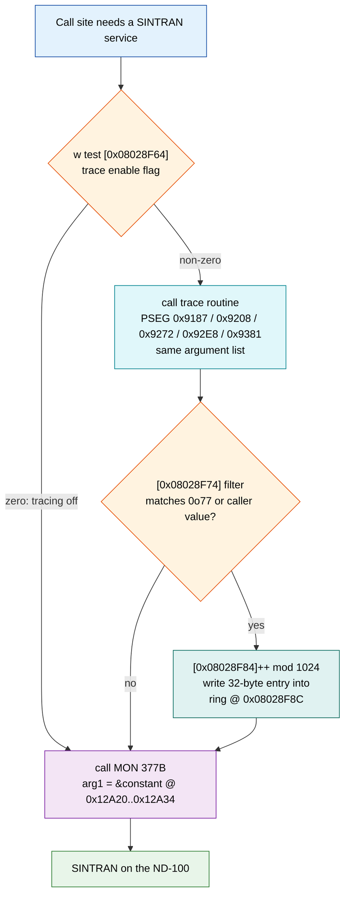

# SWAPPER-K01 DATA SEGMENT (DSEG) - Hex/String Dump and Analysis

**Subject file:** `SINTRAN/ND500/swapper/SWAPPER-K01.DSEG`
**Size:** 218117 bytes (0x35405)
**File date:** 12-Sep-1988
**Companion code listing:** `SINTRAN/ND500/swapper/swapper-k01-pseg.asm`
(12046 lines, ND-500 disassembly, **all numbers OCTAL**, base 0o1000000000 = 0x08000000)
**Prior context read:** `SINTRAN/ND500/old/SWAPPER-K01-ANALYSIS.md`
**Symbol table consulted:** `SINTRAN/ND500/swapper/N500-SYMBOLS.SYMB`

> **Evidence rule applied throughout.** Every statement below is either (a) read directly
> from the bytes of the DSEG file, (b) read directly from the disassembly listing, or
> (c) explicitly labelled `INFERRED` / `UNKNOWN`. Where a claim in the prior analysis is
> contradicted by the bytes, the contradiction is stated and the byte evidence given.

---

## 1. Summary

The SWAPPER-K01 DSEG is the D-space half of a two-segment ND-500 domain
`{ PSEG, DSEG }`, both based at `0x08000000` (I/D split - the same numeric address
denotes a code word in I-space and a data word in D-space). DSEG file offset =
D-address - 0x08000000.

| Property | Value | How established |
|---|---|---|
| Segment size | 218117 bytes (0x35405) | file size |
| Non-zero bytes | **396** (0.18%) | byte scan |
| Contiguous non-zero runs | 177 | byte scan |
| Non-zero runs after coalescing small gaps | **18 islands** | byte scan |
| Last non-zero byte | **0x030F9B** | byte scan |
| Bytes from 0x030F9C to 0x035404 | all zero (17513 bytes) | byte scan |
| Distinct DSEG addresses named by an absolute operand in the PSEG | **143** | listing scan |
| Total PSEG reference sites into D-space | **922** | listing scan |

**What the data is for.** The initialised part of the DSEG is not a database; it is a
small set of *seeds* for a segment that is otherwise built at run time:

1. A **revision self-check string** `REV.-K01` that the very first instructions compare
   against literal immediates, exiting via `MON 0B` on mismatch.
2. Six instances of a recurring **12-byte array descriptor** `{base_address, 0, max_index}`.
   Two of them point *outside* the DSEG file image (to 0x08038000 and 0x080B8000); four
   describe arrays inside the DSEG itself.
3. Several **packed-bit (BI) property tables** indexed by a 3-bit or 4-bit field extracted
   from a record word, plus parallel halfword code tables.
4. A **constant pool** of the small integers 1..6 (plus 0o2047), whose *addresses* are
   passed as the first argument of every `MON 377B` monitor call and of a parallel set of
   trace routines.
5. Seeds for a **1024-entry x 32-byte trace ring buffer** occupying 32 KB of the segment.
6. A **29-entry command handler jump table** of PSEG code pointers, plus 29-entry parallel
   count tables.

Everything else - roughly 217 KB - is zero-initialised (BSS-like): the run-time stack, the
message buffers, the trace ring, and the working tables.

---

## 2. Method, and two corrections to the inputs

### 2.1 Number base

The `.asm` listing is entirely **octal**, for both addresses and `$` operands.
All conversions in this document were done programmatically, not by hand. Spot checks:

| Octal operand | Hex | DSEG offset | Confirmed by |
|---|---|---|---|
| `$1000000000` | 0x08000000 | 0x00000 | segment base |
| `$1000224030` | 0x08012818 | 0x12818 | bytes there are `52 45 56 2E` = `REV.` |
| `$1000224034` | 0x0801281C | 0x1281C | bytes there are `2D 4B 30 31` = `-K01` |
| `$1000441124` | 0x08024254 | 0x24254 | `INIT` bottom-of-stack (section 6.3) |
| `$12221253056` | 0x5245562E | - | immediate = ASCII `REV.` |
| `$5522630061` | 0x2D4B3031 | - | immediate = ASCII `-K01` |

> **Correction 1 - the conversion given in the task brief is wrong.**
> The brief states `$1000507604` octal = 0x0804FD84 -> offset 0x4FD84.
> Recomputed: **0o1000507604 = 0x08028F84**, i.e. DSEG offset **0x28F84**, not 0x4FD84.
> Offset 0x28F84 is real and important (it is the trace ring write index, section 5.9).
> Offset 0x4FD84 does not exist - it is beyond the 0x35405 end of the segment.

### 2.2 Listing-parser hazard (affects any re-run of this work)

In `SINTRAN/ND500/swapper/swapper-k01-pseg.asm` the octal byte column is not fixed-width. Long instructions
(16+ bytes) leave only **one** space before the mnemonic, e.g. line 103:

```
1000000507: 303 370 000 000 377 002 304 010 001 052 064 304 010 002 075 174 call         $1777777777777000000377,$2,$1000225064,$1000436574 ; MON 377B
```

A parser that requires two or more spaces silently drops ~585 lines - **including every
one of the 15 `MON 377B` calls**. The extraction behind this document consumes leading
octal tokens instead, and parses 12001 instructions plus 34 `???` bytes.

### 2.3 Scope limit of the cross-reference (important)

The cross-reference in section 6 finds **absolute `$address` operands only**. ND-500 code
very often loads a base into the R register (`r:= $ADDR`) and then addresses fields as
`r.N`, or indexes with `$ADDR+`. Those field accesses are attributed to the **base**
address, so the tables **understate** which individual words are touched. Example: the
whole of 0x26210-0x26230 is read/written via `r:= $1000461014` (= 0x0802620C) and so
appears only as a reference to 0x2620C.

### 2.4 Discriminating code addresses from data addresses

The PSEG is 38161 bytes and the listing's last instruction is at `1000112420` =
0x08009510, i.e. I-space content exists only in `0x08000000..0x08009510`. Every
`call`/`go` target found is <= 0x080094B6. Every operand discussed below as data is
>= 0x0801280C. The two sets do not overlap, so the I/D split is unambiguous here.
Four operands in the PSEG range (`w2 := $0x08000972`, `$0x08000DA8`, `$0x0800283B`,
`$0x08002C52`, 5 sites) are code addresses loaded as values - two of them are also
`call` targets elsewhere. They are **not** DSEG data.

---

## 3. DSEG memory map

### 3.1 Islands of initialised data

| # | Range (file offset) | D-address | Bytes | Contents | Section |
|---|---|---|---|---|---|
| 1 | 0x012800-0x01281F | 0x08012800 | 32 | 2 array descriptors + `REV.-K01` | 5.1 |
| 2 | 0x012855-0x01285B | 0x08012855 | 7 | halfword 6; pointer 0x08023E86 | 5.2 |
| 3 | 0x01286C-0x01289A | 0x0801286C | 47 | pointer 0x08026248; `12:41:57`; 8; 100; 4096 | 5.3 |
| 4 | 0x0128FE-0x012961 | 0x080128FE | 100 | 8 x 0xFFFF on a 14-byte stride | 5.4 |
| 5 | 0x0129E0-0x012A0D | 0x080129E0 | 46 | 8 packed-bit (BI) property tables + constants | 5.5 |
| 6 | 0x012A22-0x012A4F | 0x08012A22 | 46 | constant pool: 0o2047, 1, 2, 3, 4, 5, 6 | 5.6 |
| 7 | 0x014D1F-0x014D3B | 0x08014D1F | 29 | config words 0x60, 0x64, 0x0A; flags | 5.7 |
| 8 | 0x023D46-0x023D63 | 0x08023D46 | 30 | masks 0x3FF, 0x1FF, 0xFFFF; state words | 5.8 |
| 9 | 0x023D77-0x023D83 | 0x08023D77 | 13 | 1; 0x20 | 5.8 |
| 10 | 0x023E86-0x023ED0 | 0x08023E86 | 75 | PLANC string `" 254 processes"`; RIOM count 2; -1 slots | 5.9 |
| 11 | 0x023F52-0x023F56 | 0x08023F52 | 5 | set bits inside BI array at 0x08023F38 | 5.10 |
| 12 | 0x023F67-0x023F68 | 0x08023F67 | 2 | word 0x000007E0 | 5.10 |
| 13 | 0x023F7B-0x0240AF | 0x08023F7B | 309 | vector/argument-count/code tables | 5.11 |
| 14 | 0x026198-0x02620B | 0x08026198 | 116 | **29 PSEG handler pointers** | 5.12 |
| 15 | 0x026231-0x026240 | 0x08026231 | 16 | 1000000; 5; 15; 0x23 | 5.13 |
| 16 | 0x028F3C-0x028F63 | 0x08028F3C | 40 | 3 array descriptors + flag | 5.14 |
| 17 | 0x028F74-0x028F83 | 0x08028F74 | 16 | trace filters (-1,-1,-1) + flag 1 | 5.15 |
| 18 | 0x030F8C-0x030F9B | 0x08030F8C | 16 | trace-ring descriptor + pointer | 5.16 |

### 3.2 Zero / BSS regions

| Range (file offset) | Size | Established role | Evidence |
|---|---|---|---|
| 0x000000-0x0127FF | 75776 | zero; **no PSEG operand references it at all** | listing scan |
| 0x012820-0x0128FD | 222 | scalars + halfword variables, actively used | 40+ sites |
| 0x0129CC-0x0129DF | 20 | word variables | 26 sites |
| 0x012A50-0x014CF7 | 8872 | zero; only 0x12A50 referenced (as `r:=` base) | 8 sites |
| 0x014CF8-0x014D1B | 36 | working variables; 0x14CF8 is a fixed `MON 377B` argument | 33 sites |
| 0x014D3C-0x023D3B | 61120 | zero; **no references** | listing scan |
| 0x023D3C-0x023F4F | 532 | flags/counters (0x23D6C, 0x23D70 are the hottest words in the segment) | 100+ sites |
| **0x024254-0x026197** | **8004** | **run-time stack** (proven, section 6.3) | `INIT` operands |
| 0x02620C-0x0262BB | 176 | statistics counters (`w incr` x40+) reached via `r:= $0x0802620C` | 14 sites |
| 0x0262BC-0x028ABB | 10240 | array: 2560 entries x 4 bytes (descriptor at 0x28F3C) | 5.14 |
| 0x028ABC-0x028EB7 | 1020 | array: 255 entries x 4 bytes (descriptor at 0x28F48) | 5.14 |
| 0x028EB8-0x028F2B | 116 | array: 29 entries x 4 bytes (descriptor at 0x28F54) | 5.14 |
| **0x028F8C-0x030F8B** | **32768** | **trace ring buffer**, 1024 x 32 bytes (proven, section 5.16) | 5.16 |
| 0x030F9C-0x035404 | 17513 | zero; only 0x35000 referenced (`w1 comp`) | 1 site |

### 3.3 Map diagram

```mermaid
flowchart TD
    subgraph LOW ["0x00000 - 0x127FF : 75776 bytes, never referenced"]
      Z0[Zero fill<br/>no PSEG operand names any address here]
    end
    subgraph HDR ["0x12800 - 0x12A4F : identity + tables"]
      H1[Array descriptors + REV.-K01 + 12:41:57]
      H2[BI property tables 0x129E0]
      H3[Constant pool 1..6 + 0o2047 @ 0x12A20]
    end
    subgraph MID ["0x12A50 - 0x23D3B : 61 KB zero, only 2 refs"]
      Z1[Zero fill]
    end
    subgraph VAR ["0x23D3C - 0x240AF : flags, counters, vectors"]
      V1[Hot flags 0x23D6C / 0x23D70]
      V2[" 254 processes string 0x23E86"]
      V3[Vector + count tables 0x23F7B-0x240AF]
      V4[Message control 0x240B0-0x240BC]
    end
    subgraph STK ["0x24254 - 0x26197 : 8004 bytes"]
      S1[RUN-TIME STACK<br/>INIT bottom_of_stack, total_demand]
    end
    subgraph DSP ["0x26198 - 0x262BB : dispatch + stats"]
      D1[29 handler pointers 0x26198]
      D2[Statistics counters 0x2620C]
    end
    subgraph ARR ["0x262BC - 0x28F2B : descriptor-described arrays"]
      A1[2560 x 4B]
      A2[255 x 4B]
      A3[29 x 4B]
    end
    subgraph TRC ["0x28F3C - 0x30F9B : trace subsystem"]
      T1[Descriptors + enable flag + filters]
      T2[RING BUFFER 1024 x 32B = 32 KB]
      T3[Ring descriptor 0x30F8C]
    end
    subgraph TAIL ["0x30F9C - 0x35404 : 17513 bytes zero"]
      Z2[Zero fill]
    end
    LOW --> HDR --> MID --> VAR --> STK --> DSP --> ARR --> TRC --> TAIL

    style Z0 fill:#E8F5E9,stroke:#2E7D32,color:#000
    style Z1 fill:#E8F5E9,stroke:#2E7D32,color:#000
    style Z2 fill:#E8F5E9,stroke:#2E7D32,color:#000
    style H1 fill:#E3F2FD,stroke:#0D47A1,color:#000
    style H2 fill:#E3F2FD,stroke:#0D47A1,color:#000
    style H3 fill:#E3F2FD,stroke:#0D47A1,color:#000
    style V1 fill:#E0F7FA,stroke:#00838F,color:#000
    style V2 fill:#E0F7FA,stroke:#00838F,color:#000
    style V3 fill:#E0F7FA,stroke:#00838F,color:#000
    style V4 fill:#E0F7FA,stroke:#00838F,color:#000
    style S1 fill:#FFF3E0,stroke:#E65100,color:#000
    style D1 fill:#F3E5F5,stroke:#7B1FA2,color:#000
    style D2 fill:#F3E5F5,stroke:#7B1FA2,color:#000
    style A1 fill:#E0F2F1,stroke:#00695C,color:#000
    style A2 fill:#E0F2F1,stroke:#00695C,color:#000
    style A3 fill:#E0F2F1,stroke:#00695C,color:#000
    style T1 fill:#FFF3E0,stroke:#E65100,color:#000
    style T2 fill:#FFF3E0,stroke:#E65100,color:#000
    style T3 fill:#FFF3E0,stroke:#E65100,color:#000
```



---

## 4. The recurring 12-byte array descriptor

Six places in the DSEG hold the same 12-byte shape. Reading it as three big-endian
32-bit words gives `{ base_address, 0x00000000, max_index }`:

| At offset | word0 = base | word1 | word2 = max_index | entries = max+1 |
|---|---|---|---|---|
| 0x12800 | 0x08038000 | 0 | 0x000009FF | 2560 |
| 0x1280C | 0x080B8000 | 0 | 0x0000FFFF | 65536 |
| 0x28F3C | 0x080262BC | 0 | 0x000009FF | 2560 |
| 0x28F48 | 0x08028ABC | 0 | 0x000000FE | 255 |
| 0x28F54 | 0x08028EB8 | 0 | 0x0000001C | 29 |
| 0x30F8C | 0x08028F8C | 0 | 0x000003FF | 1024 |

**Why 12 bytes, and why `max_index`, are established rather than guessed:**

* Length 12 - the PSEG copies exactly 12 bytes out of one (`$14` octal = 12 decimal):
  ```
  line 9053  pc=0x08006EE5   by bmove  b.114,$1000224014,$14      ; src = 0x0801280C, len = 12
  line 9162  pc=0x08007020   by bmove  b.144,$1000224014,$14
  ```
* word2 is `count - 1` - the PSEG loads word2 and adds one before scaling:
  ```
  line 9057  pc=0x08006EF7   r:=    $1000224014     ; R := 0x0801280C
  line 9058                  w1 :=  r.10            ; r.10 = R+8 = [0x12814] = 0x0000FFFF
  line 9059                  w1 +   $1              ; -> 0x10000  (= 65536 entries)
  line 9060                  w1 *   $10             ; x8         (= 0x80000 bytes)
  ```
  So the array at 0x080B8000 has 65536 elements of **8 bytes**.
* The three descriptors at 0x28F3C/0x28F48/0x28F54 describe **contiguous** arrays of
  **4-byte** elements - each array ends exactly where the next begins:

  | base | entries | next base | span | bytes/entry |
  |---|---|---|---|---|
  | 0x080262BC | 2560 | 0x08028ABC | 0x2800 | 4.00 |
  | 0x08028ABC | 255 | 0x08028EB8 | 0x03FC | 4.00 |
  | 0x08028EB8 | 29 | 0x08028F2C | 0x0074 | 4.00 |

  0x28F2C is independently referenced by the code (`w2 := $0x08028F2C`), and 29 is
  exactly the handler count (section 5.12).

**Two descriptors point outside the segment file.** 0x08038000 (offset 0x38000) and
0x080B8000 (offset 0xB8000) are both past the 0x35405 end of `SINTRAN/ND500/swapper/SWAPPER-K01.DSEG`. They are
therefore *not* in the loaded image; the memory they name must be created or mapped at run
time. This is a fact about the bytes; the mechanism that supplies that memory is **UNKNOWN**
from these two files.

---

## 5. Non-zero runs - hex dumps and analysis

Each dump below is real output from the file, shown 16 bytes per line with the
16-byte-aligned line containing the run. `|...|` is the ASCII rendering (`.` = non-printable).

### 5.1 Run 1 - 0x012800-0x01281F (32 bytes) - descriptors + revision string

```
012800  08 03 80 00 00 00 00 00 00 00 09 ff 08 0b 80 00  |................|
012810  00 00 00 00 00 00 ff ff 52 45 56 2e 2d 4b 30 31  |........REV.-K01|
```

| Offset | Word | Meaning | Evidence |
|---|---|---|---|
| 0x12800 | 0x08038000 / 0 / 0x09FF | array descriptor, 2560 entries, base beyond file image | section 4 |
| 0x1280C | 0x080B8000 / 0 / 0xFFFF | array descriptor, 65536 entries x 8 bytes, base beyond file image | section 4 |
| 0x12818 | 0x5245562E | ASCII `REV.` | bytes; `w comp2` immediate |
| 0x1281C | 0x2D4B3031 | ASCII `-K01` | bytes; `w comp2` immediate |

The revision string is the first thing the domain touches. From the head of the listing:

```
line 16  pc=0x08000004  init   $1000441124,$44,$17504
line 19  pc=0x08000016  w comp2 $1000224030,$12221253056   ; [0x12818] vs 'REV.'
line 20                 if >< go $4
line 21                 w set1  b.34
line 23  pc=0x08000027  w comp2 $1000224034,$5522630061    ; [0x1281C] vs '-K01'
line 25                 w set1  b.40
...
line 40  pc=0x08000059  call   $1777777777777000000000,$0  ; MON 0B LEAVE
```

Both halves are compared, the two results ANDed (`w1 and b.40`), and `MON 0B` (LEAVE) is
executed if they do not match. This is a PSEG/DSEG build-consistency guard. The string
`REV.-K01` matches the file name `SWAPPER-K01` and the L-release "Swapper version K".

Note the descriptor at **0x12800 is never named by an absolute operand** anywhere in the
PSEG; only 0x1280C is (5 sites). Given section 2.3, 0x12800 may still be reached through a
base register. Its role is **UNKNOWN**.

### 5.2 Run 2 - 0x012855-0x01285B (7 bytes) - halfword limit + string pointer

```
012850  00 00 00 00 00 06 00 00 08 02 3e 86 00 00 00 00  |..........>.....|
```

| Offset | Value | Access | Evidence |
|---|---|---|---|
| 0x12854 | **halfword** 0x0006 | 15 sites, all halfword (`h wconv`, `h comp2`, `h1 comp`, `h2 :=`, `h2 =:`) | listing |
| 0x12858 | word 0x08023E86 | not referenced absolutely | bytes |

The halfword reading is not a guess - the code only ever touches it as `h`:

```
line 1034  pc=0x08000C6C  h wconv $1000224124,r2     ; r2 := (word) halfword[0x12854] = 6
line 1035                 w1 comp r2
line 1036                 if <= go $7
line 1037                 w1 :=   $2067              ; error code 0o2067
line 1673  pc=0x080013FF  h comp2 b.324,$1000224124
line 10404 pc=0x08007FF?  h2 =:   $1000224124        ; STORE - it is a variable, not a constant
```

So 0x12854 is a **halfword variable seeded to 6** and used as an upper limit; exceeding it
yields code 0o2067. It is written at run time (`h2 =:`), so 6 is only the initial value.

> One site, line 10457, decodes as `w loopi b.30,$1000224124,$1777777777775560604000`,
> which would read 0x12854 as a *word*. That line is immediately followed by
> `d3 - b.50` and then `??? opcode 0x0000`, i.e. the linear disassembler has lost sync
> there. Against 14 unambiguous halfword accesses this single site is treated as a
> **probable misdecode**, not as evidence.

**0x12858 = 0x08023E86 points exactly at the start of the `" 254 processes"` string**
(section 5.9). That the pointer and the string agree to the byte is strong corroboration
for both. (The prior analysis placed the string at 0x23E88; the bytes place it at 0x23E86.)

### 5.3 Run 3 - 0x01286C-0x01289A (47 bytes) - pointer, build time, sizes

```
012860  00 00 00 00 00 00 00 00 00 00 00 00 08 02 62 48  |..............bH|
012870  68 00 00 00 00 00 00 00 00 00 00 00 31 32 3a 34  |h...........12:4|
012880  31 3a 35 37 00 00 00 00 00 00 00 08 00 00 00 64  |1:57...........d|
012890  00 00 00 00 00 00 00 00 00 00 10 00 00 00 00 00  |................|
```

| Offset | Value | Notes |
|---|---|---|
| 0x1286C | word 0x08026248 | a D-space pointer; 0x26248 is independently written by the code (`w1 =: $0x08026248`) |
| 0x12870 | word 0x68000000 | **UNKNOWN**. Not referenced by any absolute operand. |
| 0x1287C | `31 32 3A 34 31 3A 35 37` | ASCII **`12:41:57`** - 8 bytes, build/assembly time stamp |
| 0x12888 | word 0x00000008 | not referenced absolutely; **UNKNOWN** |
| 0x1288C | word 0x00000064 | = 100; not referenced absolutely; **UNKNOWN** |
| 0x12890 | word 0x00000000 | **written at run time**: `line 10359  w move $1000607630,$1000224220` copies [0x30F98] (= 0x08028F60) into [0x12890] |
| 0x12898 | word 0x00001000 | = **4096**; `line 10060  w move $1000224230,$1000225014` copies it into [0x12A0C] |

The `12:41:57` string is the only other ASCII in the header. There is no date, only a time.

### 5.4 Run 4 - 0x0128FE-0x012961 (100 bytes) - 8 x 0xFFFF on a 14-byte stride

```
0128f0  00 00 00 00 00 00 00 00 00 00 00 00 00 00 ff ff  |................|
012900  00 00 00 00 00 00 00 00 00 00 00 00 ff ff 00 00  |................|
012910  00 00 00 00 00 00 00 00 00 00 ff ff 00 00 00 00  |................|
012920  00 00 00 00 00 00 00 00 ff ff 00 00 00 00 00 00  |................|
012930  00 00 00 00 00 00 ff ff 00 00 00 00 00 00 00 00  |................|
012940  00 00 00 00 ff ff 00 00 00 00 00 00 00 00 00 00  |................|
012950  00 00 ff ff 00 00 00 00 00 00 00 00 00 00 00 00  |................|
012960  ff ff 00 00 00 00 00 00 00 00 00 00 00 00 00 00  |................|
```

The `0xFFFF` halfwords sit at 0x128FE, 0x1290C, 0x1291A, 0x12928, 0x12936, 0x12944,
0x12952, 0x12960 - **exactly 8 of them on a stride of 14 (0x0E) bytes**. That is a
measured fact. The prior analysis called this a "staircase sentinel array"; the visual
staircase is simply the 14-byte stride beating against the 16-byte dump width.

**What is UNKNOWN:** whether each 14-byte record *ends* with the 0xFFFF (records based at
0x128F2 + n*14) or *begins* with it (records based at 0x128FE + n*14). Both fit the bytes.
The code does not settle it, because the surrounding words are addressed as individual
absolute scalars, not through an index:

| Offset | Sites | Access kinds |
|---|---|---|
| 0x128F0 | 2 | `w stz`, `w set1` |
| 0x128F4 | 20 | `h4 :=` x7, `h comp2` x4, `h3 :=` x3, `h2 :=` x2, `h1 :=`, `h2 comp`, `h3 =:`, `h stz` |
| 0x128F6 | 15 | `h move` x6, `h comp2` x2, `h1 -`, `h2 -`, ... |
| 0x128F8 | 14 | `w1 :=` x4, `w3 :=` x2, `h2 :=` x2, `h move` x2, ... |
| 0x128FC | 1 | `w2 :=` (loads 0x0000FFFF as a value) |

Note that the word at 0x128FC is `0x0000FFFF`, whose low halfword *is* the first 0xFFFF at
0x128FE. Whether that word-sized read at line 10068 is reading "the constant 65535" or "the
first record" is **UNKNOWN**. An experiment that would settle the layout: single-step the
domain and watch which addresses a record-walking loop touches (or find the loop that
strides by 14 - none is visible in the absolute-operand set).

### 5.5 Run 5 - 0x0129E0-0x012A0D (46 bytes) - packed-bit (BI) property tables

```
0129e0  30 00 00 00 00 e0 00 00 c0 00 00 00 c0 00 00 00  |0...............|
0129f0  4f f8 00 00 4f f8 00 00 47 00 00 00 30 00 00 00  |O...O...G...0...|
012a00  50 00 00 00 03 00 00 00 05 00 00 00 00 01 00 00  |P...............|
```

The prior analysis listed this as an "init constant table ... UNVERIFIED exact role (need
the reader in the PSEG)". **The readers are in the PSEG, and they identify these as
`BI` (packed-bit) arrays**, which is why the significant bytes sit at the *top* of each
word rather than the bottom:

```
line 7663  pc=0x08005CCC  w2 getbf r.4,$26,$3          ; extract 3-bit field at bit 22 of [R+4]
line 7664                 w2 =:    b.260
line 7665                 bi test  $1000224740+        ; test bit [that field] of BI array @0x080129E0
line 7666                 if = go  $660

line 819   pc=0x080009E5  w1 getbf r.4,$32,$4          ; extract 4-bit field at bit 26 of [R+4]
line 820                  w1 =:    b.113
line 821                  bi test  $1000224744+        ; test bit [that field] of BI array @0x080129E4
```

`bi` is the ND-500 packed-bit data type; `$ADDR+` is indexed addressing. So each of these
words is a **boolean lookup table indexed by a small field extracted from a record word**.

| Offset | Word | Index source | Index width | `bi test` sites (listing lines) |
|---|---|---|---|---|
| 0x129E0 | 0x30000000 | `getbf r.4,$26,$3` | 3 bits (0..7) | 7663, 8247, 8260 |
| 0x129E4 | 0x00E00000 | `getbf r.4,$32,$4` | 4 bits (0..15) | 819, 3065, 4927 |
| 0x129E8 | 0xC0000000 | `getbf r.4,$32,$4` | 4 bits | 3049, 7301 |
| 0x129EC | 0xC0000000 | `getbf r3.(4),$32,$4` | 4 bits | 1074 |
| 0x129F0 | 0x4FF80000 | `getbf r3.(4),$32,$4` | 4 bits | 1082 |
| 0x129F4 | 0x4FF80000 | `getbf r3.(4),$32,$4` | 4 bits | 1090 |
| 0x129F8 | 0x47000000 | `getbf r3.(4),$32,$4` | 4 bits | 1066 |
| 0x129FC | 0x30000000 | `(byte>>6)*32 + r4` | composite | 7145 |

**The field layout of the indexed record word is established:** the word at `[R+4]` carries
a **3-bit field at bit 22** and a **4-bit field at bit 26** (`getbf <operand>,<pos>,<width>`,
octal `$26`=22, `$32`=26, `$3`=3, `$4`=4). Six separate BI arrays are indexed by the 4-bit
field and two by the 3-bit field - i.e. each array answers one boolean property of that
field's value. What the fields and properties *mean* is **UNKNOWN**.

**Consistency check on bit ordering.** For a 3-bit index only bits 0..7 can ever be
tested; 0x129E0 = `30 00 00 00` has non-zero bits only in its first byte. For a 4-bit index
only bits 0..15 matter; 0x129E4 = `00 E0 00 00` has non-zero bits only in its first two
bytes. Every one of the eight words obeys this. That rules out a *word-LSB-first* bit
numbering (which would place 0x30000000's set bits at 28,29 - outside a 3-bit index range)
and confirms the arrays are sized to their index width. Two conventions still survive -
MSB-first across the word (giving set elements {2,3} for 0x129E0) and LSB-first within each
byte in order (giving {4,5}) - and the material at hand does not discriminate them. The
exact set-element numbers are therefore **INFERRED, convention-dependent**. A live
single-step of `bi test` with a known index would settle it.

The last four words are not BI arrays:

| Offset | Word | Access |
|---|---|---|
| 0x12A00 | 0x50000000 | not referenced absolutely - **UNKNOWN** |
| 0x12A04 | 0x03000000 | not referenced absolutely - **UNKNOWN** |
| 0x12A08 | 0x05000000 | not referenced absolutely - **UNKNOWN** |
| 0x12A0C | 0x00010000 | 8 sites; **a run-time divisor** (below) |

0x12A0C is seeded to 65536 but **overwritten at run time with 4096** and then used as a
divisor:

```
line 10060  pc=0x08007C61  w move $1000224230,$1000225014   ; [0x12A0C] := [0x12898] = 4096
line 10061  pc=0x08007C6B  w1 :=  $1000224040               ; w1 := [0x12820]
line 10062  pc=0x08007C72  w1 /   $1000225014               ; w1 := [0x12820] / [0x12A0C]
line 10063                 w1 +   $1
```

(`w move src,dst` direction is confirmed by line 17, `w move $32,b.24`, which the prior
analysis independently reads as "local := 0o32".) Dividing a run-time quantity by 4096 and
adding 1 is a page-count computation; that reading is **INFERRED** - what is *fact* is the
value 4096, the divide, and the source at 0x12820.

### 5.6 Run 6 - 0x012A22-0x012A4F (46 bytes) - constant pool

```
012a20  00 00 04 27 00 00 00 02 00 00 00 01 00 00 00 04  |...'............|
012a30  00 00 00 05 00 00 00 06 00 00 00 01 00 00 00 04  |................|
012a40  00 00 00 02 00 00 00 05 00 00 00 06 00 00 00 03  |................|
```

Twelve words: `0x427, 2, 1, 4, 5, 6, 1, 4, 2, 5, 6, 3`. This is **not** a table indexed by
anything - it is a **constant pool**. It splits cleanly by *how the code uses it*:

**Group A (0x12A20-0x12A34) - addresses passed as the first argument of every `MON 377B`:**

| Offset | Word | Octal | Sites | Paired trace routine | Arg count |
|---|---|---|---|---|---|
| 0x12A20 | 0x00000427 | **0o2047** | 1 | (none) | 2 |
| 0x12A24 | 0x00000002 | 0o2 | 14 | 0o1000110607 = PSEG 0x08009187 | 7 |
| 0x12A28 | 0x00000001 | 0o1 | 2 | 0o1000111010 = PSEG 0x08009208 | 3 / 4 |
| 0x12A2C | 0x00000004 | 0o4 | 2 | 0o1000111162 = PSEG 0x08009272 | 6 |
| 0x12A30 | 0x00000005 | 0o5 | 2 | 0o1000111350 = PSEG 0x080092E8 | 3 |
| 0x12A34 | 0x00000006 | 0o6 | 6 | 0o1000111601 = PSEG 0x08009381 | 2 |

**Group B (0x12A38-0x12A4C) - read as values:**

| Offset | Word | Sites | Access kinds |
|---|---|---|---|
| 0x12A38 | 1 | 19 | `w move` x15, `w2 :=` x3, `w3 :=` |
| 0x12A3C | 4 | 6 | `w2 :=` x4, `w move`, `w1 :=` |
| 0x12A40 | 2 | 0 | not referenced absolutely |
| 0x12A44 | 5 | 10 | `w2 :=` x8, `w move` x2 |
| 0x12A48 | 6 | **49** | `w2 :=` x33, `w move` x12, `w1 :=` x2, `w4 :=` x2 |
| 0x12A4C | 3 | 0 | not referenced absolutely |

The existence of two pools holding the same digits (1,4,2,5,6) is explained by the two
access modes: Group A constants exist so that their **address** can be passed (ND-500
high-level languages pass arguments by reference), Group B so that their **value** can be
loaded. This is a compiler-generated constant pool, not a hand-built dispatch table.

**0o2047 = SWPFA.** In `SINTRAN/ND500/swapper/N500-SYMBOLS.SYMB`
the value 002047 resolves **uniquely** to `SWPFA` (5-char truncation of SWPFATAL). The
neighbourhood is a coherent swapper error band, which strengthens the match considerably:

```
SWADE=002040   NOCMA=002041   SWFIN=002042   SWFNF=002043
NSWFE=002045   NOMAS=002046   SWPFA=002047   MEMNA=002050   MICFA=002051
```

It is used exactly once, on the error path:

```
line 519  pc=0x08000675  dcc
line 520  pc=0x08000677  call $1777777777777000000377,$2,$1000225040,$1000437234  ; MON 377B
                          ;    MON 377B , 2 args , &[0x12A20]=SWPFA , &[0x23E9C]
line 521                  ifkret
```

and 0x23E9C is written just before by `line 497  w1 =: $1000437234`.

**The small values 1,2,4,5,6 remain UNRESOLVED**, as in the prior analysis. Numeric
coincidence with a symbol would be meaningless at these magnitudes (2628 distinct values
over 7157 symbols). What *is* newly established is that each value pairs 1:1 with a
distinct trace routine (section 6.2).

### 5.7 Run 7 - 0x014D1F-0x014D3B (29 bytes) - configuration words

```
014d10  00 00 00 00 00 00 00 00 00 00 00 00 00 00 00 60  |...............`|
014d20  00 00 00 64 00 00 00 0a 00 00 00 00 00 00 00 01  |...d............|
014d30  00 00 00 00 00 00 00 01 00 00 00 01 00 00 00 00  |................|
```

| Offset | Word | Dec | Sites | What the code does |
|---|---|---|---|---|
| 0x14D1C | 0x60 | 96 | 3 | `w comp2 r.126,$...` then `w test $...`; also **written** (`w2 =:` at line 8644) |
| 0x14D20 | 0x64 | 100 | 3 | same shape; written by `w3 =:` at line 8646 |
| 0x14D24 | 0x0A | 10 | 1 | `w2 :=` (read as a value) |
| 0x14D28 | 0 | 0 | 1 | `w2 =:` (written only) |
| 0x14D2C | 1 | 1 | 3 | `w1 :=` x2; stored by `ced=:` at line 10326 |
| 0x14D34 | 1 | 1 | **39** | `w move` x8, `w1 or` x4, `w test` x3, `w stz` x3, `w set1` x3, ... |
| 0x14D38 | 1 | 1 | **38** | `w move` x8, `w stz` x4, `w2 or` x4, `w set1` x3, ... |

0x14D1C and 0x14D20 are read as a **pair** at lines 5776-5787, each compared with a record
field `r.126` and then tested; both are seeded (96, 100) and both are re-written at lines
8644/8646. So they are configurable limits, not constants. 96 and 100 are suggestive of a
process/segment count, but that is **not established** - no symbol or code names them.

0x14D34 and 0x14D38 are two of the most heavily used words in the segment (77 sites
between them), always as booleans (`w set1`, `w stz`, `w test`, `w or`). Their meaning is
**UNKNOWN**.

> The mnemonic `ced=:` (opcode `376 124`) at line 10326 is reproduced as the disassembler
> emits it; its semantics are not established from the nd500x documentation set. It is
> clearly a **store** to 0x14D2C. The surrounding sequence is `entd / l=: b.100 /
> ced=: $0x08014D2C / clrk / jumpg b.100`.

### 5.8 Runs 8 and 9 - 0x023D46-0x023D63 and 0x023D77-0x023D83 - masks and state

```
023d40  00 00 00 00 00 00 03 ff 00 00 ff ff 00 00 00 00  |................|
023d50  00 00 01 ff 00 00 ff ff 00 00 00 02 00 00 00 00  |................|
023d60  00 00 00 01 00 00 00 00 00 00 00 00 00 00 00 00  |................|
023d70  00 00 00 00 00 00 00 01 00 00 00 00 00 00 00 00  |................|
023d80  00 00 00 20 00 00 00 00 00 00 00 00 00 00 00 00  |... ............|
```

| Offset | Word | Sites | Notes |
|---|---|---|---|
| 0x23D44 | 0x000003FF | 0 | 1023; not referenced absolutely - **UNKNOWN** |
| 0x23D48 | 0x0000FFFF | 0 | 65535; not referenced absolutely - **UNKNOWN** |
| 0x23D50 | 0x000001FF | 0 | 511; not referenced absolutely - **UNKNOWN** |
| 0x23D54 | 0x0000FFFF | 0 | 65535; not referenced absolutely - **UNKNOWN** |
| 0x23D58 | 0x00000002 | 2 | `w comp2`, `w2 =:` |
| 0x23D5C | 0x00000000 | **68** | `w comp2` x62 - compared almost everywhere; also `w set1`/`w stz`/`w test` |
| 0x23D60 | 0x00000001 | 4 | `w1 :=`, `w2 :=`, `w stz`, `w set1` |
| 0x23D74 | 0x00000001 | 3 | `w test` x2, `w move` |
| 0x23D80 | 0x00000020 | 2 | = 32; passed as a `MON 377B` argument |

The four mask-shaped constants at 0x23D44-0x23D54 are never named by an absolute operand.
Per section 2.3 they are presumably reached via a base register; which one is **UNKNOWN**.

0x23D5C is the single most-compared word in the DSEG (62 `w comp2` sites). It is
zero-initialised and set/cleared at run time. **UNKNOWN** meaning.

Note the neighbouring BSS words 0x23D6C (35 sites, `w test` x34) and 0x23D70 (47 sites,
`w test` x45) are the hottest *tested* words in the segment - both zero-initialised.

### 5.9 Run 10 - 0x023E86-0x023ED0 (75 bytes) - the only long string

```
023e80  00 00 00 00 00 00 0d 0a 20 32 35 34 20 70 72 6f  |........ 254 pro|
023e90  63 65 73 73 65 73 0d 0a 27 00 00 00 00 00 00 00  |cesses..'.......|
023ea0  00 00 00 02 ff ff ff ff ff ff ff ff 00 00 00 00  |................|
023eb0  01 00 00 00 00 00 00 00 01 00 00 00 00 00 00 00  |................|
023ec0  00 00 00 00 ff ff 00 00 00 00 00 00 00 00 00 00  |................|
023ed0  04 00 00 00 00 00 00 00 00 00 00 00 00 00 00 00  |................|
```

**The string, byte-exact (0x23E86..0x23E98, 19 bytes):**

```
0D 0A 20 32 35 34 20 70 72 6F 63 65 73 73 65 73 0D 0A 27
CR LF  ' '  '2' '5' '4' ' ' 'p' 'r' 'o' 'c' 'e' 's' 's' 'e' 's' CR LF  '''
```

= `<CR><LF> 254 processes<CR><LF>'` - a PLANC/NPL string constant, terminated by the
apostrophe (0x27) that delimits string literals in that language.

* **Start offset is 0x23E86, not 0x23E88.** Independently confirmed: the pointer word at
  0x12858 contains **0x08023E86** (section 5.2).
* "254" is a decimal literal baked into the text, so the count is fixed at build time.
  Relating it to the ND-500 maximum process count is **INFERRED** (the prior analysis cites
  `5PRSELSIZE` in `5P-P2-MON60.NPL`); nothing in these two files proves it.

Other words in this run:

| Offset | Word | Sites | What the code does |
|---|---|---|---|
| 0x23E9C | 0x00000000 | 2 | written by `w1 =:` (line 497), then passed to `MON 377B` with the **SWPFA** selector (line 520) - the fatal-error parameter |
| 0x23EA0 | 0x00000002 | 1 | **`h riom` transfer count** (line 8008) - see section 6.4 |
| 0x23EA4 | 0xFFFFFFFF | 1 | `by bmove` source/dest |
| 0x23EA8 | 0xFFFFFFFF | 0 | not referenced absolutely |
| 0x23EB0 | 0x01000000 | 0 | not referenced absolutely - **UNKNOWN** |
| 0x23EB8 | 0x01000000 | 0 | not referenced absolutely - **UNKNOWN** |
| 0x23EBC | 0x00000000 | 1 | `by bmove` |
| 0x23EC4 | 0xFFFF0000 | 0 | not referenced absolutely - **UNKNOWN** |
| 0x23ED0 | 0x04000000 | 0 | not referenced absolutely - **UNKNOWN** |

### 5.10 Runs 11 and 12 - 0x023F52-0x023F56 and 0x023F67-0x023F68

```
023f50  00 00 0f ff 00 0f ff 00 00 00 00 00 00 00 00 00  |................|
023f60  00 00 00 00 00 00 00 07 e0 00 00 00 00 00 00 00  |................|
```

Run 11 is **not a standalone constant - it is initialised content inside a BI array.**
Two `bi test` sites index bit arrays here, and both are fed by a **byte-wide** index:

```
line 2831  pc=0x080017C1  by1 :=  b.71               ; byte index (0..255)
line 2832  pc=0x080017C3  bi test $1000437470+       ; BI array @ 0x08023F38
line 2833                 if = go $4

line 2841                 by comp2 b.70,$76
line 2842  pc=0x080017DC  bi test $1000437530+       ; BI array @ 0x08023F58
```

A byte index needs 256 bits = **32 bytes**. `0x23F38 + 32 = 0x23F58` - the second array
begins exactly where the first ends. So there are two adjacent 256-bit BI arrays,
0x23F38-0x23F57 and 0x23F58-0x23F77, and the bytes at 0x23F52-0x23F56 are the **only
initialised bits in the first array**. As in section 5.5, the precise element numbers
depend on the unestablished bit-ordering convention and are therefore **not stated**.

Context: both `bi test`s are preceded by `by comp2 b.70,$75` / `by comp2 b.70,$76`
(0o75 = 61 = `=`, 0o76 = 62 = `>`), and the results are ANDed. A byte-indexed 256-bit
lookup adjacent to character comparisons is character-class-shaped, but that is
**INFERRED** and not proven.

Run 12: word 0x23F64 = `0x00000007`, word 0x23F68 = `0xE0000000`. Neither is referenced
absolutely. **UNKNOWN.**

### 5.11 Run 13 - 0x023F7B-0x0240AF (309 bytes) - vector and count tables

```
023f70  00 00 00 00 00 00 00 00 00 00 00 03 00 00 00 07  |................|
023f80  00 00 00 03 00 00 00 07 00 00 00 07 00 00 00 03  |................|
023f90  00 00 00 07 00 00 00 03 08 00 30 39 08 00 2e bf  |..........09....|
023fa0  08 00 2e b4 08 00 2e b4 08 00 30 43 08 00 30 82  |..........0C..0.|
023fb0  00 00 00 00 02 17 02 17 02 17 02 17 02 18 02 18  |................|
023fc0  02 18 02 18 02 18 02 18 02 18 02 18 02 18 00 00  |................|
023fd0  08 00 49 a7 08 00 49 cc 08 00 49 cc 00 00 02 20  |..I...I...I.... |
023fe0  00 00 02 1f 00 00 02 22 00 00 02 21 00 00 02 1d  |......."...!....|
023ff0  00 00 02 1e 00 04 00 02 00 00 00 00 00 00 00 0a  |................|
024000  00 80 00 40 02 00 00 00 08 00 67 22 08 00 68 39  |...@......g"..h9|
024010  08 00 67 22 00 00 00 00 00 00 00 03 00 00 00 03  |..g"............|
024020  00 00 00 03 00 00 00 04 00 00 00 07 00 00 00 07  |................|
024030  00 00 00 07 00 00 00 00 00 00 00 00 00 00 00 0d  |................|
024040  00 00 00 0a 00 00 00 0f 00 00 00 8a 00 00 00 09  |................|
024050  00 00 00 46 00 00 00 08 00 00 00 00 00 00 00 08  |................|
024060  00 00 00 0b 00 00 00 14 00 00 00 09 00 00 00 36  |...............6|
024070  00 00 00 0b 00 00 00 0d 00 00 00 0d 00 00 00 0d  |................|
024080  00 00 00 18 00 00 00 18 00 00 00 09 00 00 00 08  |................|
024090  00 00 00 0b 00 00 00 08 00 00 00 08 00 00 00 22  |..............."|
0240a0  00 00 00 10 00 00 00 22 00 00 00 0e 00 00 00 09  |......."........|
```

This island is several distinct tables. Grouped by what the code does with them:

**(a) Small word tables at 0x23F7C-0x23F94** - values 3,7,3,7,7,3,7,3. Not referenced by
any absolute operand. **UNKNOWN.**

**(b) `jumpg` vector at 0x23F98** - three `jumpg` sites in the PSEG target D-space
vectors, and this is one of them:

```
line 3908  pc=0x08002EA6  w1 getbf r2.(4),$26,$3     ; the same 3-bit field as section 5.5
line 3909  pc=0x08002EAE  jumpg    $1000437630+      ; jump via table @ 0x08023F98
```

Table contents (PSEG code pointers, all inside the 0x08000000-0x08009510 I-space):

```
0x23F98: 08003039  08002EBF  08002EB4  08002EB4  08003043  08003082
```

Six entries, indexed by the **3-bit** field - consistent with the BI array at 0x129E0
being indexed by the same field. Entries 2 and 3 are identical (0x08002EB4).

**(c) Halfword code table at 0x23FB4** - read with a **4-bit** index:

```
line 5800  pc=0x08004656  w3 getbf r.4,$32,$4              ; 4-bit field (0..15)
line 5801  pc=0x0800465B  h wconv  $1000437664+,r4         ; r4 := (word) halfword table[idx]
line 5802                 w4 =:    b.14
```

Halfwords from 0x23FB4: `0217 0217 0217 0217 0218 0218 0218 0218 0218 0218 0218 0218 0218 0000`
(four 0x0217 then nine 0x0218). In octal those are **0o1027** and **0o1030**. The immediate
`w1 := $1027` appears in the PSEG at line 7302, i.e. the same code space. Symbol lookup:
002 of the band resolves (`ILADS=001030`), 0o1027 does not resolve at all. Because the band
0o1020-0o1050 in `SINTRAN/ND500/swapper/N500-SYMBOLS.SYMB` is populated with auto-generated placeholders
(`E1020=001020`, `E1026=001026`, `E1046=001046`) alongside real mnemonics, it **is** an
error/status code space - but the individual identifications are **INFERRED and not
established**, and 3 of the 8 values used here have no symbol at all.

**(d) `jumpg` vector at 0x23FD0** - `line 6050  jumpg $1000437720+`. Entries:
`080049A7  080049CC  080049CC` (three PSEG pointers, last two identical).

**(e) Word code table at 0x23FDC** - read with `w1 := $1000437734+` (4 sites, lines 7055,
7087, 7135, 7474) and `$1000437744+` (2 sites):

```
0x23FDC: 0x220   0x23FE0: 0x21F   0x23FE4: 0x222
0x23FE8: 0x221   0x23FEC: 0x21D   0x23FF0: 0x21E
```

Six consecutive word constants, 0x21D..0x222 (0o1035..0o1042) - the same code band as (c).

**(f) Halfword tables read by `h wconv`:**

| Offset | Word | Halfwords | Read at |
|---|---|---|---|
| 0x23FF4 | 0x00040002 | 0x0004, 0x0002 | line 8010 `h wconv $1000437764+,r2` |
| 0x24000 | 0x00800040 | 0x0080, 0x0040 | line 8456 `h wconv $1000440000+,r3` |

**(g) RIOM count and comparand:**

| Offset | Word | Use |
|---|---|---|
| 0x23FF8 | 0x00000000 | `w test $1000437770` (line 8475) |
| 0x23FFC | 0x0000000A | = 10; **`h riom` halfword count** (line 8459) - section 6.4 |
| 0x24004 | 0x02000000 | `by2 comp $1000440004` (line 8472) |

**(h) `jumpg` vector at 0x24008** - `line 8474  jumpg $1000440010+`. Entries:
`08006722  08006839  08006722` (three PSEG pointers; entries 0 and 2 identical). The word
at 0x23FF8 is `w test`ed immediately after the jump.

**(i) Word tables at 0x24014-0x24030** - values 0,3,3,3,4,7,7,7. `line 9438
w1 := $1000440024+` reads at 0x24014 with an index. **UNKNOWN** meaning.

**(j) The 29-entry count table at 0x2403C-0x240AC** - twenty-nine word values:

```
0x0D 0x0A 0x0F 0x8A 0x09 0x46 0x08 0x00 0x08 0x0B 0x14 0x09 0x36 0x0B 0x0D
0x0D 0x0D 0x18 0x18 0x09 0x08 0x0B 0x08 0x08 0x22 0x10 0x22 0x0E 0x09
```

**29 entries is exactly the number of handler pointers at 0x26198** (section 5.12), so this
is a per-command parallel table. It is read by the third `RIOM`:

```
line 10577  pc=0x080080EE  h riom $1000440264,$1000440274,$1000440074+
                            ;      nd100 addr    buffer      count table @ 0x0802408C, indexed
```

The encoded base 0x2408C is entry 20 of the table (0x2403C + 20*4). Whether the index is
biased, or the table proper starts at 0x2408C and 0x2403C-0x24088 is a different table, is
**UNKNOWN** from the listing. What is certain: these words supply the **halfword count for
DMA transfers from ND-100 memory**, and there is one per command.

### 5.12 Run 14 - 0x026198-0x02620B (116 bytes) - the command handler table

```
026190  00 00 00 00 00 00 00 00 08 00 83 d8 08 00 83 f7  |................|
0261a0  08 00 84 74 08 00 83 a2 08 00 83 bd 08 00 83 6c  |...t...........l|
0261b0  08 00 86 72 08 00 86 e2 08 00 84 12 08 00 84 31  |...r...........1|
0261c0  08 00 83 87 08 00 86 4c 08 00 86 4f 08 00 84 4c  |.......L...O...L|
0261d0  08 00 84 8f 08 00 84 bd 08 00 86 55 08 00 84 eb  |...........U....|
0261e0  08 00 85 24 08 00 85 42 08 00 86 52 08 00 85 67  |...$...B...R...g|
0261f0  08 00 85 82 08 00 85 e3 08 00 86 02 08 00 86 8e  |................|
026200  08 00 86 aa 08 00 86 c6 08 00 86 1f 00 00 00 00  |................|
```

**116 bytes = exactly 29 words.** The table base is **0x26198**, not 0x26190 - the `jumpg`
operand says so directly:

```
line 10598  pc=0x0800835C  w comp2 $1000224344,$24       ; [0x128E4] vs 20
line 10599  pc=0x08008362  w1 :=   $1000440270           ; w1 := [0x080240B8]  (function code)
line 10600  pc=0x08008366  jumpg   $1000460630+          ; jump via table @ 0x08026198
```

(0o1000440270 = 0x080240B8; 0o1000460630 = 0x08026198 - both verified.)

The 29 handler addresses, in order:

| Idx | Address | Idx | Address | Idx | Address |
|---|---|---|---|---|---|
| 0 | 0x080083D8 | 10 | 0x08008387 | 20 | 0x08008652 |
| 1 | 0x080083F7 | 11 | 0x0800864C | 21 | 0x08008567 |
| 2 | 0x08008474 | 12 | 0x0800864F | 22 | 0x08008582 |
| 3 | 0x080083A2 | 13 | 0x0800844C | 23 | 0x080085E3 |
| 4 | 0x080083BD | 14 | 0x0800848F | 24 | 0x08008602 |
| 5 | 0x0800836C | 15 | 0x080084BD | 25 | 0x0800868E |
| 6 | 0x08008672 | 16 | 0x08008655 | 26 | 0x080086AA |
| 7 | 0x080086E2 | 17 | 0x080084EB | 27 | 0x080086C6 |
| 8 | 0x08008412 | 18 | 0x08008524 | 28 | 0x0800861F |
| 9 | 0x08008431 | 19 | 0x08008542 | | |

All 29 lie in PSEG 0x0800836C-0x080086E2, a single compact block. Note the descriptor at
0x28F54 also declares **29** entries, and the count table at section 5.11(j) also has **29**
entries - three independent structures agree on the command count.

### 5.13 Run 15 - 0x026231-0x026240 (16 bytes)

```
026230  00 0f 42 40 00 00 00 05 00 00 00 0f 00 00 00 23  |..B@...........#|
026240  78 00 00 00 00 00 00 00 00 00 00 00 00 00 00 00  |................|
```

| Offset | Word | Dec | Sites |
|---|---|---|---|
| 0x26230 | 0x000F4240 | **1000000** | 2 (`w move` x2) |
| 0x26234 | 0x00000005 | 5 | 0 |
| 0x26238 | 0x0000000F | 15 | 0 |
| 0x2623C | 0x00000023 | 35 | 1 (`w move`) |
| 0x26240 | 0x78000000 | - | 1 (`w move`) |

0x000F4240 = 1000000 exactly. A round decimal million is characteristic of a
microseconds-per-second scale factor, but nothing here establishes that - **INFERRED at
best, otherwise UNKNOWN**. The word at 0x26240 (0x78000000) sitting immediately after a
word of 35 is odd; both are moved by the same kind of instruction. **UNKNOWN.**

This run sits inside the statistics-counter block reached via `r:= $1000461014`
(= 0x0802620C, 6 sites), where the code performs 40+ `w incr` operations on
0x2626C-0x26290. Per section 2.3, these words may be fields of that record.

### 5.14 Run 16 - 0x028F3C-0x028F63 (40 bytes) - three array descriptors

```
028f30  00 00 00 00 00 00 00 00 00 00 00 00 08 02 62 bc  |..............b.|
028f40  00 00 00 00 00 00 09 ff 08 02 8a bc 00 00 00 00  |................|
028f50  00 00 00 fe 08 02 8e b8 00 00 00 00 00 00 00 1c  |................|
028f60  00 00 00 01 00 00 00 00 00 00 00 00 00 00 00 00  |................|
```

Three consecutive 12-byte descriptors (section 4), each read by a `w bmove`:

| At | base | entries | element size | array occupies |
|---|---|---|---|---|
| 0x28F3C | 0x080262BC | 2560 | 4 bytes | 0x262BC-0x28ABB |
| 0x28F48 | 0x08028ABC | 255 | 4 bytes | 0x28ABC-0x28EB7 |
| 0x28F54 | 0x08028EB8 | 29 | 4 bytes | 0x28EB8-0x28F2B |

All three bases are independently referenced by the code (0x262BC: 4 sites; 0x28ABC: 4
sites; 0x28EB8: 2 sites), and 0x28F2C - the first byte past the last array - is also
referenced. The element sizes are derived from base-to-base spans, not assumed.

| Offset | Word | Sites | Notes |
|---|---|---|---|
| 0x28F60 | 0x00000001 | 4 | `w test` x4; also copied out of 0x30F98 into 0x12890 at run time |

### 5.15 Run 17 - 0x028F74-0x028F83 (16 bytes) - trace filters

```
028f70  00 00 00 00 ff ff ff ff ff ff ff ff ff ff ff ff  |................|
028f80  00 00 00 01 00 00 00 00 00 00 00 00 00 00 00 00  |................|
```

| Offset | Word | Sites | What the code does |
|---|---|---|---|
| 0x28F74 | 0xFFFFFFFF (-1) | 10 | `w comp2` x10 - compared with 0o77 (63) and with a caller value |
| 0x28F78 | 0xFFFFFFFF (-1) | 3 | `w2 :=`, `w comp2`, `w1 comp` |
| 0x28F7C | 0xFFFFFFFF (-1) | 3 | `w2 and`, `w comp2`, `w3 comp` |
| 0x28F80 | 0x00000001 | 3 | `w set1`, `w stz`, `w test` |

These are the filter words of the trace subsystem (section 5.16). Seeded to -1, i.e. no
value matches, so tracing is inert until something writes them.

### 5.16 Run 18 - 0x030F8C-0x030F9B (16 bytes) - the trace-ring descriptor

```
030f80  00 00 00 00 00 00 00 00 00 00 00 00 08 02 8f 8c  |................|
030f90  00 00 00 00 00 00 03 ff 08 02 8f 60 00 00 00 00  |...........`....|
```

| Offset | Word | Meaning |
|---|---|---|
| 0x30F8C | 0x08028F8C / 0 / 0x03FF | descriptor: base 0x08028F8C, **1024** entries |
| 0x30F98 | 0x08028F60 | pointer; copied into [0x12890] at run time (line 10359) |

**This descriptor and the code agree exactly, from two independent directions.** Five
near-identical routines at the tail of the PSEG (0x08009187, 0x08009208, 0x08009272,
0x080092E8, 0x08009381) share this body:

```
1000111601: ents    $40
1000111607: w test  $1000507544        ; [0x08028F64] - trace enable flag
1000111615: if = go $134               ;   zero -> return immediately
1000111617: w comp2 $1000507564,$77    ; [0x08028F74] vs 0o77 (63)
1000111626: if = go $16
1000111630: w1 :=   @b.24
1000111633: w comp2 $1000507564,r1     ; [0x08028F74] vs caller value
1000111642: if >< go $107              ;   no match -> return
1000111644: w incr  $1000507604        ; [0x08028F84]++          <- ring write index
1000111652: w comp2 $1000507604,$2000  ; index vs 0o2000 = 1024
1000111663: if < go  $10
1000111665: w stz   $1000507604        ;   wrap index to 0
1000111673: w1 :=   $1000507604
1000111701: w1 *    $40                ; index * 0o40 = 32 bytes/entry
1000111704: by rladdr $1000507614+     ; address into ring buffer @ 0x08028F8C
```

Therefore:

| Address | Role | Established by |
|---|---|---|
| 0x08028F64 | trace **enable flag** (zero = off) | `w test` + early exit; 19 sites total |
| 0x08028F74 | trace **filter** value | `w comp2` vs 0o77 and vs caller value |
| 0x08028F84 | ring **write index**, wraps at 1024 | `w incr` / `w comp2 $2000` / `w stz`; 37 sites |
| 0x08028F8C | ring **buffer base** | `by rladdr $1000507614+` |
| entry size | **32 bytes** (0o40) | `w1 * $40` |

**The arithmetic closes exactly:**

```
0x28F8C + 1024 * 32 = 0x30F8C
```

which is precisely where the descriptor `{0x08028F8C, 0, 0x3FF}` sits. So the 32768-byte
zero region 0x28F8C-0x30F8B **is** the trace ring buffer, and its descriptor is placed
immediately after it. The count 1024 is stated twice - once as `0o2000` in the code, once
as `max_index = 0x3FF` in the data - and the two agree.

---

## 6. PSEG -> DSEG cross-reference

143 distinct DSEG addresses are named by absolute operands, at 922 sites. See section 2.3
for the scope limit.

### 6.1 References landing in initialised runs (54 addresses)

| DSEG off | D-addr | Initial word | Sites | Access kinds (widths as emitted) |
|---|---|---|---|---|
| 0x1280C | 0x0801280C | 0x080B8000 | 5 | `by bmove` x2, `r:=` x2, `w move` |
| 0x12818 | 0x08012818 | 0x5245562E | 1 | `w comp2` |
| 0x1281C | 0x0801281C | 0x2D4B3031 | 1 | `w comp2` |
| 0x12854 | 0x08012854 | h 0x0006 | 15 | `h wconv` x5, `h comp2` x5, `h1 comp` x2, `h2 :=`, `h2 =:` |
| 0x12890 | 0x08012890 | 0x00000000 | 1 | `w move` (dest) |
| 0x12898 | 0x08012898 | 0x00001000 | 1 | `w move` (src) |
| 0x128FC | 0x080128FC | 0x0000FFFF | 1 | `w2 :=` |
| 0x12A0C | 0x08012A0C | 0x00010000 | 8 | `w4 :=` x2, `w3 :=` x2, `w1 :=`, `w move`, `w1 /`, `w add2` |
| 0x12A20 | 0x08012A20 | 0x00000427 | 1 | call-arg (`MON 377B`, SWPFA) |
| 0x12A24 | 0x08012A24 | 0x00000002 | 14 | call-arg x14 |
| 0x12A28 | 0x08012A28 | 0x00000001 | 2 | call-arg x2 |
| 0x12A2C | 0x08012A2C | 0x00000004 | 2 | call-arg x2 |
| 0x12A30 | 0x08012A30 | 0x00000005 | 2 | call-arg x2 |
| 0x12A34 | 0x08012A34 | 0x00000006 | 6 | call-arg x6 |
| 0x12A38 | 0x08012A38 | 0x00000001 | 19 | `w move` x15, `w2 :=` x3, `w3 :=` |
| 0x12A3C | 0x08012A3C | 0x00000004 | 6 | `w2 :=` x4, `w move`, `w1 :=` |
| 0x12A44 | 0x08012A44 | 0x00000005 | 10 | `w2 :=` x8, `w move` x2 |
| 0x12A48 | 0x08012A48 | 0x00000006 | 49 | `w2 :=` x33, `w move` x12, `w1 :=` x2, `w4 :=` x2 |
| 0x14D1C | 0x08014D1C | 0x00000060 | 3 | `w comp2`, `w test`, `w2 =:` |
| 0x14D20 | 0x08014D20 | 0x00000064 | 3 | `w comp2`, `w test`, `w3 =:` |
| 0x14D24 | 0x08014D24 | 0x0000000A | 1 | `w2 :=` |
| 0x14D28 | 0x08014D28 | 0x00000000 | 1 | `w2 =:` |
| 0x14D2C | 0x08014D2C | 0x00000001 | 3 | `w1 :=` x2, `ced=:` |
| 0x14D34 | 0x08014D34 | 0x00000001 | 39 | `w move` x8, `w1 or` x4, `w1 =:` x4, `w test` x3, `w stz` x3, `w3 or` x3, `w3 =:` x3, `w set1` x3, ... |
| 0x14D38 | 0x08014D38 | 0x00000001 | 38 | `w move` x8, `w stz` x4, `w2 or` x4, `w2 =:` x4, `w4 or` x3, `w4 =:` x3, `w set1` x3, ... |
| 0x23D58 | 0x08023D58 | 0x00000002 | 2 | `w comp2`, `w2 =:` |
| 0x23D5C | 0x08023D5C | 0x00000000 | 68 | `w comp2` x62, `w test` x3, `w1 :=`, `w set1`, `w stz` |
| 0x23D60 | 0x08023D60 | 0x00000001 | 4 | `w1 :=`, `w2 :=`, `w stz`, `w set1` |
| 0x23D74 | 0x08023D74 | 0x00000001 | 3 | `w test` x2, `w move` |
| 0x23D78 | 0x08023D78 | 0x00000000 | 2 | `w test`, `w move` |
| 0x23D7C | 0x08023D7C | 0x00000000 | 8 | call-arg x4, `w stz` x2, `r:=` x2 |
| 0x23D80 | 0x08023D80 | 0x00000020 | 2 | call-arg x2 |
| 0x23E9C | 0x08023E9C | 0x00000000 | 2 | `w1 =:`, call-arg (SWPFA path) |
| 0x23EA0 | 0x08023EA0 | 0x00000002 | 1 | **`h riom`** (count) |
| 0x23EA4 | 0x08023EA4 | 0xFFFFFFFF | 1 | `by bmove` |
| 0x23EBC | 0x08023EBC | 0x00000000 | 1 | `by bmove` |
| 0x23F98 | 0x08023F98 | 0x08003039 | 1 | **`jumpg`** (vector base) |
| 0x23FB0 | 0x08023FB0 | 0x00000000 | 1 | `w3 comp` |
| 0x23FB4 | 0x08023FB4 | 0x02170217 | 1 | **`h wconv`** indexed (halfword table) |
| 0x23FD0 | 0x08023FD0 | 0x080049A7 | 1 | **`jumpg`** (vector base) |
| 0x23FDC | 0x08023FDC | 0x00000220 | 4 | `w1 :=` indexed x4 |
| 0x23FE4 | 0x08023FE4 | 0x00000222 | 2 | `w1 :=` indexed x2 |
| 0x23FF4 | 0x08023FF4 | 0x00040002 | 1 | **`h wconv`** indexed |
| 0x23FF8 | 0x08023FF8 | 0x00000000 | 1 | `w test` |
| 0x23FFC | 0x08023FFC | 0x0000000A | 1 | **`h riom`** (count) |
| 0x24000 | 0x08024000 | 0x00800040 | 1 | **`h wconv`** indexed |
| 0x24004 | 0x08024004 | 0x02000000 | 1 | `by2 comp` |
| 0x24008 | 0x08024008 | 0x08006722 | 1 | **`jumpg`** (vector base) |
| 0x24014 | 0x08024014 | 0x00000000 | 1 | `w1 :=` indexed |
| 0x24034 | 0x08024034 | 0x00000000 | 1 | `by bmove` |
| 0x24038 | 0x08024038 | 0x00000000 | 1 | `by bmove` |
| 0x26198 | 0x08026198 | 0x080083D8 | 1 | **`jumpg`** (29-entry handler table) |
| 0x26230 | 0x08026230 | 0x000F4240 | 2 | `w move` x2 |
| 0x2623C | 0x0802623C | 0x00000023 | 1 | `w move` |
| 0x26240 | 0x08026240 | 0x78000000 | 1 | `w move` |
| 0x28F3C | 0x08028F3C | 0x080262BC | 1 | `w bmove` (descriptor) |
| 0x28F48 | 0x08028F48 | 0x08028ABC | 1 | `w bmove` (descriptor) |
| 0x28F54 | 0x08028F54 | 0x08028EB8 | 1 | `w bmove` (descriptor) |
| 0x28F60 | 0x08028F60 | 0x00000001 | 4 | `w test` x4 |
| 0x28F74 | 0x08028F74 | 0xFFFFFFFF | 10 | `w comp2` x10 |
| 0x28F78 | 0x08028F78 | 0xFFFFFFFF | 3 | `w2 :=`, `w comp2`, `w1 comp` |
| 0x28F7C | 0x08028F7C | 0xFFFFFFFF | 3 | `w2 and`, `w comp2`, `w3 comp` |
| 0x28F80 | 0x08028F80 | 0x00000001 | 3 | `w set1`, `w stz`, `w test` |
| 0x30F98 | 0x08030F98 | 0x08028F60 | 1 | `w move` (src) |

### 6.2 References landing in the zero / BSS region (89 addresses)

These are the zero-initialised variables, buffers and tables the swapper fills at run time.

| DSEG off | D-addr | Sites | Access kinds |
|---|---|---|---|
| 0x12820 | 0x08012820 | 2 | `w1 =:`, `w1 :=` (dividend at line 10061) |
| 0x1284C | 0x0801284C | 9 | `w comp2` x2, `w move` x2, `w2 comp`, `w1 comp`, `w2 =:`, `w3 =:`, `w1 =:` |
| 0x128D4 | 0x080128D4 | 7 | `h wconv` x6, `h1 =:` |
| 0x128D8 | 0x080128D8 | 11 | `w1 +` x4, `w3 +` x2, `w4 +`, `w2 +`, `w3 -`, `w2 -`, `w3 =:` |
| 0x128DC | 0x080128DC | 6 | `w comp2` x2, `w1 comp`, `w move`, `w4 comp`, `w4 =:` |
| 0x128E0 | 0x080128E0 | 7 | `w1 comp` x2, `w1 =:` x2, `w1 :=`, `w3 =:`, `w move` |
| 0x128E4 | 0x080128E4 | 10 | `w comp2` x3 (one is `vs $24`=20, just before the handler `jumpg`), `w2 =:` x2, `w3 :=` x2, ... |
| 0x128E8 | 0x080128E8 | 5 | `w4 +`, `w2 :=`, `w4 =:`, `w2 +`, `w2 =:` |
| 0x128EC | 0x080128EC | 10 | `w comp2` x2, `w move` x2, `w add2`, `w4 :=`, `w1 :=`, `w1 =:`, `w2 +`, `w4 =:` |
| 0x128F0 | 0x080128F0 | 2 | `w stz`, `w set1` |
| 0x128F4 | 0x080128F4 | 20 | halfword-only: `h4 :=` x7, `h comp2` x4, `h3 :=` x3, `h2 :=` x2, ... |
| 0x128F6 | 0x080128F6 | 15 | halfword-only: `h move` x6, `h comp2` x2, ... |
| 0x128F8 | 0x080128F8 | 14 | mixed: `w1 :=` x4, `w3 :=` x2, `h2 :=` x2, `h move` x2, ... |
| 0x129CC | 0x080129CC | 9 | `w2 :=` x6, `w move` x3 |
| 0x129D0 | 0x080129D0 | 6 | `w2 =:` x2, `w move`, `w1 :=`, `w1 =:`, `w comp2` |
| 0x129D4 | 0x080129D4 | 6 | `w move` x2, `w stz`, `w comp2`, `w test`, `r:=` |
| 0x129D8 | 0x080129D8 | 7 | `w move` x3, `w2 :=` x2, `w1 :=`, `w test` |
| 0x129DC | 0x080129DC | 4 | `w2 :=` x2, `w comp2`, `w1 =:` |
| 0x12A10 | 0x08012A10 | 7 | `h decr` x2, `h incr` x2, `h3 +`, `h2 :=`, `h1 :=` |
| 0x12A12 | 0x08012A12 | 1 | `h decr` |
| 0x12A18 | 0x08012A18 | 3 | `w move` x2, `w1 =:` |
| 0x12A1C | 0x08012A1C | 2 | `w move`, `w1 =:` |
| 0x12A50 | 0x08012A50 | 8 | `r:=` x3 (record base), `w3 :=` x2, `w2 :=` x2, `w1 :=` |
| 0x144F8 | 0x080144F8 | 1 | `w1 laddr` |
| 0x14CF8 | 0x08014CF8 | 7 | **call-arg x6** (the fixed 7-arg `MON 377B` parameter), `w1 =:` |
| 0x14CFC | 0x08014CFC | 3 | `w test` x2, `w set1` |
| 0x14D00 | 0x08014D00 | 8 | `w move` x3, `w test`, `w comp2`, `w2 :=`, `w3 =:`, `w1 :=` |
| 0x14D04 | 0x08014D04 | 4 | `w1 :=`, `w1 =:`, `w add2`, `w2 :=` |
| 0x14D08 | 0x08014D08 | 11 | `w move` x3, `w incr` x3, `w2 :=` x2, `w3 :=`, `w1 =:`, `w add2` |
| 0x14D0C | 0x08014D0C | 8 | `w set1` x3, `w3 =:` x2, `w test`, `w move`, `w stz` |
| 0x14D10 | 0x08014D10 | 2 | `w incr` x2 |
| 0x14D14 | 0x08014D14 | 1 | `w incr` |
| 0x14D18 | 0x08014D18 | 3 | `h comp2`, `h stz`, `h1 =:` |
| 0x23D3C | 0x08023D3C | 7 | `w stz` x5, `w incr`, `w move` |
| 0x23D64 | 0x08023D64 | 1 | `w3 =:` |
| 0x23D68 | 0x08023D68 | 4 | `w test` x2, `w comp2`, `w4 =:` |
| 0x23D6C | 0x08023D6C | 35 | `w test` x34, `w move` |
| 0x23D70 | 0x08023D70 | 47 | `w test` x45, `w1 =:` x2 |
| 0x23D84 | 0x08023D84 | 6 | `h3 =:` x2, `h2 :=`, `h3 :=`, `h4 =:`, `h1 :=` |
| 0x23F20 | 0x08023F20 | 3 | `w4 =:` x2, `r:=` (record base) |
| 0x23F24 | 0x08023F24 | 2 | `w incr`, `w1 :=` |
| 0x23F28 | 0x08023F28 | 3 | `w incr` x2, `w1 /` |
| 0x23F2C | 0x08023F2C | 3 | `w move`, `r:=` (record base), `w1 :=` |
| 0x23F30 | 0x08023F30 | 1 | `w incr` |
| 0x23F34 | 0x08023F34 | 1 | `w incr` |
| 0x23F38 | 0x08023F38 | 1 | **`bi test` indexed** - 256-bit BI array base (section 5.10) |
| 0x23F58 | 0x08023F58 | 1 | **`bi test` indexed** - 256-bit BI array base (section 5.10) |
| 0x240B0 | 0x080240B0 | 9 | `w1 =:` x2, `w move` x2, call-arg x2, `w test`, `w1 :=`, `w stz` |
| 0x240B4 | 0x080240B4 | 9 | call-arg x5, **`h riom`** (ND-100 address), `w3 +`, `w1 =:`, `w1 :=` |
| 0x240B8 | 0x080240B8 | 10 | **message function code** -> handler `jumpg` index; `w comp2` x4, `w1 :=` x2, ... |
| 0x240BC | 0x080240BC | 27 | **`r:=` x15** (record base = message buffer pointer), `w1 :=` x10, **`h riom`** (buffer), `w3 :=` |
| 0x24254 | 0x08024254 | 1 | **`init` bottom_of_stack** (section 6.3) |
| 0x2620C | 0x0802620C | 14 | `r:=` x6 (record base), `w1 -` x3, `w2 +` x2, `w1 +` x2, `w move` |
| 0x26210 | 0x08026210 | 5 | `w comp2` x4, `w1 =:` |
| 0x26214 | 0x08026214 | 5 | `w2 :=` x4, `w1 =:` |
| 0x26218 | 0x08026218 | 6 | `w1 :=` x5, `w1 =:` |
| 0x2621C | 0x0802621C | 13 | `w1 :=` x10, `w move` x2, `w1 =:` |
| 0x26220 | 0x08026220 | 1 | `w1 =:` |
| 0x26224 | 0x08026224 | 1 | `w2 =:` |
| 0x26228 | 0x08026228 | 1 | `w3 =:` |
| 0x2622C | 0x0802622C | 2 | `w1 =:`, `w2 :=` |
| 0x26244 | 0x08026244 | 1 | `by3 :=` |
| 0x26248 | 0x08026248 | 1 | `w1 =:` (this is the address stored at 0x1286C) |
| 0x2624C | 0x0802624C | 2 | `w1 :=`, `w3 :=` |
| 0x26254 | 0x08026254 | 1 | `w incr` |
| 0x26258 | 0x08026258 | 1 | `w incr` |
| 0x2625C | 0x0802625C | 1 | `w incr` |
| 0x26260 | 0x08026260 | 1 | `w1 =:` |
| 0x26264 | 0x08026264 | 1 | `w incr` |
| 0x26268 | 0x08026268 | 3 | `w incr`, `w2 :=`, `w2 =:` |
| 0x2626C | 0x0802626C | 7 | `w incr` x7 |
| 0x26270 | 0x08026270 | 3 | `w incr` x3 |
| 0x26274 | 0x08026274 | 4 | `w incr` x4 |
| 0x26278 | 0x08026278 | 6 | `w incr` x6 |
| 0x2627C | 0x0802627C | 4 | `w incr` x4 |
| 0x26280 | 0x08026280 | 1 | `w incr` |
| 0x26288 | 0x08026288 | 8 | `w decr` x4, `w incr`, `w stz`, `w1 +`, `w1 =:` |
| 0x2628C | 0x0802628C | 1 | `w incr` |
| 0x26290 | 0x08026290 | 1 | `w incr` |
| 0x26298 | 0x08026298 | 2 | `w1 :=`, `w bmove` |
| 0x262A4 | 0x080262A4 | 1 | `w bmove` |
| 0x262B0 | 0x080262B0 | 1 | `w bmove` |
| 0x262BC | 0x080262BC | 4 | `w stz` x2, `w1 :=`, `w1 =:` - **base of the 2560-entry array** |
| 0x28ABC | 0x08028ABC | 4 | `w2 :=`, `w2 =:`, `w stz` x2 - **base of the 255-entry array** |
| 0x28EB8 | 0x08028EB8 | 2 | `w2 :=`, `w2 =:` - **base of the 29-entry array** |
| 0x28F2C | 0x08028F2C | 1 | `w2 :=` - first word past the 29-entry array |
| 0x28F30 | 0x08028F30 | 2 | `w3 =:`, `r:=` (record base) |
| 0x28F34 | 0x08028F34 | 1 | `w stz` |
| 0x28F38 | 0x08028F38 | 1 | `w2 =:` |
| 0x28F64 | 0x08028F64 | 19 | `w test` x19 - **trace enable flag** (section 5.16) |
| 0x28F68 | 0x08028F68 | 7 | `w test` x7 |
| 0x28F6C | 0x08028F6C | 2 | `w test` x2 |
| 0x28F70 | 0x08028F70 | 2 | `w test` x2 |
| 0x28F84 | 0x08028F84 | 37 | `w1 :=` x10, `w incr` x9, `w comp2` x9, `w stz` x9 - **trace ring write index** |
| 0x35000 | 0x08035000 | 1 | `w1 comp` - the only reference in the last 17 KB |

### 6.3 The run-time stack is proven, not inferred

The `INIT` instruction's documented format
(`/home/ronny/repos/nd500x/docs/instructions/asm/init.md`) is
`INIT <bottom_of_stack>, <main_demand>, <total_demand>`. Line 16 of the listing reads:

```
1000000004: init  $1000441124, $44, $17504
```

| Operand | Octal | Decimal / hex |
|---|---|---|
| bottom_of_stack | 0o1000441124 | **D-space 0x08024254** = DSEG offset 0x24254 |
| main_demand | 0o44 | 36 |
| total_demand | 0o17504 | **8004 = 0x1F44** |

And from the bytes: the handler table (section 5.12) begins at 0x26198.

```
0x26198 - 0x24254 = 0x1F44 = 8004 = total_demand      (exact)
```

So DSEG **0x24254-0x26197 is the run-time stack**, 8004 bytes, ending exactly where the
handler table begins. Two independent sources (the `INIT` operand and the table placement)
agree to the byte. This accounts for the largest *used* BSS block in the segment.

### 6.4 The swapper reads ND-100 memory directly (correction to the prior analysis)

The prior analysis (`SINTRAN/ND500/old/SWAPPER-K01-ANALYSIS.md`, section 9) states:

> "Direct interface (IOX/TAG) | **NONE.** The swapper uses MON 377B -> SINTRAN, and
> RPHS/WPHS for page moves. No IOX/interface-register access on the ND-500 side"

**The listing contradicts this.** There are three `RIOM` instructions. Per
`/home/ronny/repos/nd500x/docs/instructions/asm/riom.md`, `RIOM` is
**Read I/O Processor Memory** - a supervisor-only DMA that "copies data from the I/O
processor (ND-100) memory to ND-500 memory through the ND-500 interface ... allows the
ND-500 to access private ND-100 memory that is not directly addressable by the ND-500",
in halfword units, format `H RIOM <nd100-addr>, <buffer>, <count>`.

| Line | PC | Instruction | nd100-addr | buffer | count |
|---|---|---|---|---|---|
| 8008 | 0x080060E0 | `h riom b.34,b.30,$1000437240` | local | local | **[0x08023EA0] = 2** |
| 8459 | 0x080063E1 | `h riom b.50,b.26,$1000437774` | local | local | **[0x08023FFC] = 10** |
| 10577 | 0x080080EE | `h riom $1000440264,$1000440274,$1000440074+` | **[0x080240B4]** | **[0x080240BC]** | **[0x0802408C + idx]** |

The third one is the interesting one, and it ties the message-control block together:

| Address | Role | Evidence |
|---|---|---|
| 0x080240B4 | **ND-100 source address** for the DMA | `h riom` operand 1 |
| 0x080240B8 | **message function code** -> handler index | `w1 := $1000440270` then `jumpg $1000460630+` (lines 10599-10600) |
| 0x080240BC | **pointer to the ND-500 message buffer** | `h riom` operand 2; and `r:= $1000440274` x15 - loaded as a record base, then fields accessed as `r.N` |
| 0x0802408C+ | **halfword count**, one per command | `h riom` operand 3, indexed; 29-entry table (section 5.11j) |

So the swapper pulls its message out of ND-100 private memory by DMA, dispatches on the
function code, and uses the buffer pointer as a record base. This does not contradict the
`MON 377B` findings - both mechanisms are present - but "no direct interface access on the
ND-500 side" is not correct.

All three `RIOM` counts come from DSEG words. The `RPHS` sites (lines 1389, 1436) take
`$1777777777777777777704` = **-60**, a local/frame operand, not a DSEG address.

### 6.5 The `MON 377B` pattern is trace-gated (correction to the prior analysis)

The prior analysis (section 5.2) describes the pattern as:

> "Each `MON 377B` is preceded by an INTERNAL call with IDENTICAL arguments, then the trap
> - the 'try internally, else trap to the ND-100' pattern"

The listing shows something different. The internal call is **conditional on the trace
enable flag**, and the `MON 377B` is executed either way:

```
line 99   1000000456: w test  $1000507544                            ; [0x08028F64] trace enabled?
line 100  1000000464: if = go $23                                    ; 0o464 + 0o23 = 0o507 -> skip to the MON call
line 101  1000000466: call    $1000111601,$2,$1000225064,$1000436574 ; trace routine, same args
line 102  1000000506: ifkret
line 103  1000000507: call    $1777777777777000000377,$2,$1000225064,$1000436574 ; MON 377B
line 104  1000000527: ifkret
```

The branch arithmetic is verified twice (target = branch address + displacement):

* line 100: 0o1000000464 + 0o23 = 0o1000000507 = the `MON 377B` call. Confirmed.
* line 1339: `w test $1000507544` / `if = go $37` at 0o1000010014 -> 0o1000010053, which is
  line 1343, i.e. it skips the `w3 laddr` / `w3 =:` / `call $1000110607` / `ifkret` block
  and leaves the `MON 377B` at line 1359 intact. Confirmed.

So the five "internal" routines are the **trace/log routines** described in section 5.16
(they are the only callers of the ring buffer), each paired 1:1 with one selector constant:



| Selector constant | Value | Trace routine (PSEG) | `MON 377B` sites (lines) | Args |
|---|---|---|---|---|
| 0x12A20 | 0o2047 (SWPFA) | (none - error path) | 520 | 2 |
| 0x12A24 | 2 | 0x08009187 | 1359, 1987, 2109, 2433, 2732, 3325, 5252 | 7 |
| 0x12A28 | 1 | 0x08009208 | 10535 | 4 |
| 0x12A2C | 4 | 0x08009272 | 3089 | 6 |
| 0x12A30 | 5 | 0x080092E8 | 8372 | 3 |
| 0x12A34 | 6 | 0x08009381 | 103, 167, 5959 | 2 |

The dominant call (selector 2, 7 arguments) always carries the fixed DSEG parameter
`$0x08014CF8` in some of its forms (lines 1359, 1987, 2109) and pure locals in others
(2433, 2732, 3325, 5252). 0x14CF8 is zero-initialised BSS written by `w1 =:`.

### 6.6 Grouping summary

| Group | Addresses | Sites |
|---|---|---|
| References into initialised runs | 54 | 218 |
| References into zero / BSS | 89 | 704 |
| **Total** | **143** | **922** |

The BSS references dominate 3:1, which matches the segment's character: 396 initialised
bytes seeding ~217 KB of run-time structure.

---

## 7. Corrections to `SINTRAN/ND500/old/SWAPPER-K01-ANALYSIS.md`

The DSEG binary analysed here (`SINTRAN/ND500/swapper/SWAPPER-K01.DSEG`) is the same segment
the prior analysis used - **byte-identical** (verified with `cmp`) - so these are corrections
of interpretation, not of input.

| # | Prior claim | Byte/listing evidence | Correction |
|---|---|---|---|
| 1 | "0x353f0 - 0x35404 \| Segment tail (end padding)" | last non-zero byte in the file is **0x030F9B** | **There is no such run.** 0x30F9C-0x35404 is entirely zero. |
| 2 | Log string at 0x23e88 | bytes `0D 0A` begin at **0x23E86**; the pointer word at 0x12858 holds **0x08023E86** | String starts at 0x23E86, length 19. |
| 3 | Handler table "at DSEG 0x26190" | `jumpg $1000460630+` = **0x08026198**; run starts at 0x26198; 116 bytes = 29 words | Base is **0x26198**, exactly 29 entries. |
| 4 | 0x129e0 "init constant table ... UNVERIFIED exact role (need the reader in the PSEG)" | 8 x `bi test $ADDR+` fed by `getbf` 3-bit and 4-bit fields | They are **packed-bit (BI) property tables**; the readers are at lines 819, 1066, 1074, 1082, 1090, 3049, 3065, 4927, 7145, 7301, 7663, 8247, 8260. |
| 5 | 0x12a20 "MON-377B selector table" as a table | 0x12A20-0x12A34 passed **by address** as call arg 1; 0x12A38-0x12A4C read **by value**; the digits repeat | It is a **compiler constant pool**, not an indexed table. (The SWPFA identification at 0x12A20 stands.) |
| 6 | "Each MON 377B is preceded by an INTERNAL call ... 'try internally, else trap'" | `w test $0x08028F64` + `if = go` skips the internal call; the MON call runs regardless | The internal call is a **trace routine**, gated by the trace-enable flag. Section 6.5. |
| 7 | "Direct interface (IOX/TAG): NONE ... No IOX/interface-register access on the ND-500 side" | three `h riom` instructions (lines 8008, 8459, 10577) | The swapper **DMA-reads ND-100 private memory** via `RIOM`. Section 6.4. |
| 8 | 0x128f0 "Staircase sentinel array (8 slots, each ends 0xFFFF)" ... "UNVERIFIED which table" | 8 x 0xFFFF on a **14-byte stride**; still unverified | Stride is 14, not 16; the "staircase" is a dump-width artifact. Record boundary remains **UNKNOWN**. |
| 9 | 0x28f30/0x30f80 descriptors "UNVERIFIED whether they map to MPM or stay in-DSEG" | element sizes derived from base-to-base spans; ring arithmetic closes at 0x30F8C exactly | All four **stay in-DSEG** and are now fully sized. The two at 0x12800/0x1280C point **outside the file image**. |
| 10 | Section 3 table lists ranges like "0x128f0 - 0x12960", "0x12a20 - 0x12a3c" | measured runs are 0x128FE-0x12961 and 0x12A22-0x12A4F | Ranges in section 3.1 of this document are byte-measured. |

The following prior findings are **confirmed** by this pass: the `REV.-K01` self-check and
`MON 0B` guard; the `12:41:57` build time; SWPFA = 0o2047 at 0x12A20 used on the fatal path;
the function code at 0x080240B8; the handler pointers being in PSEG 0x08008xxx; and the
overall "mostly zeroed BSS" character of the segment.

---

## 8. Explicitly NOT determined

* The meaning of the `MON 377B` selector values 1, 2, 4, 5, 6. Each pairs 1:1 with a trace
  routine, but no symbol resolves at these magnitudes and none should be trusted if it did.
* The record layout of the 14-byte-stride array at 0x128F2/0x128FE (section 5.4) - whether
  0xFFFF leads or trails each record.
* The `bi test` element numbering convention, hence the exact set-element sets of the BI
  arrays at 0x129E0-0x129F8 and 0x23F38/0x23F58. Word-LSB-first is **ruled out** by the
  data; MSB-first-across-word and LSB-first-within-byte both survive.
* What the 3-bit (bit 22) and 4-bit (bit 26) fields of the record word at `[R+4]` denote.
* The identity of the code values 0o1027, 0o1030 (table at 0x23FB4) and 0o1035-0o1042
  (table at 0x23FDC). They sit in an error/status band, but 3 of the 8 have no symbol.
* The index bias of the 29-entry RIOM count table (encoded base 0x2408C vs table start
  0x2403C).
* Words never named by any absolute operand and not obviously part of a described
  structure: 0x12800 (descriptor), 0x12870 (0x68000000), 0x12888 (8), 0x1288C (100),
  0x12A00/0x12A04/0x12A08, 0x23D44/0x23D48/0x23D50/0x23D54 (the 0x3FF/0x1FF/0xFFFF masks),
  0x23EB0/0x23EB8/0x23EC4/0x23ED0, 0x23F64/0x23F68, 0x26234/0x26238.
* What memory backs the two out-of-image descriptor bases 0x08038000 and 0x080B8000.
* The semantics of the `ced=:` and `l=:` mnemonics as emitted by the disassembler.
* The run-time contents of the message buffers and the trace ring - these are zero in the
  file by construction and require a live memory dump to observe.

### Experiments that would settle the open items

1. **Bit ordering** - single-step a `bi test $0x080129E0+` (e.g. PSEG 0x08005CCC) with a
   known index in the field and observe the Z flag. One run discriminates the two surviving
   conventions.
2. **14-byte record layout** - set a data breakpoint on 0x1290C and see which base address
   the accessing code computes from.
3. **Out-of-image arrays** - dump D-space at 0x08038000 and 0x080B8000 after the domain has
   initialised; if they are mapped, their element size and content settle section 4.
4. **Selector values** - trace the ND-100 side (`5SWAP` / `5P-P2-MON60.NPL`) while the
   swapper issues `MON 377B` with each selector, and record which SINTRAN entry is reached.
5. **Trace ring** - write a non-zero value to 0x08028F64 and 0o77 to 0x08028F74, then dump
   0x08028F8C after activity; the 32-byte entry format would then be directly readable.

---

## 9. Appendix - every ASCII string in the DSEG

| File offset | D-address | Bytes | Decoded |
|---|---|---|---|
| 0x12818 | 0x08012818 | `52 45 56 2E 2D 4B 30 31` | `REV.-K01` (revision, self-checked at PSEG 0x08000016/0x08000027) |
| 0x1287C | 0x0801287C | `31 32 3A 34 31 3A 35 37` | `12:41:57` (build time; no date present) |
| 0x23E86 | 0x08023E86 | `0D 0A 20 32 35 34 20 70 72 6F 63 65 73 73 65 73 0D 0A 27` | `<CR><LF> 254 processes<CR><LF>'` (PLANC string constant) |

These are the only printable-ASCII sequences of length >= 4 in the file. Every other
non-zero byte is numeric: descriptors, pointers, bit arrays, code tables and masks.
