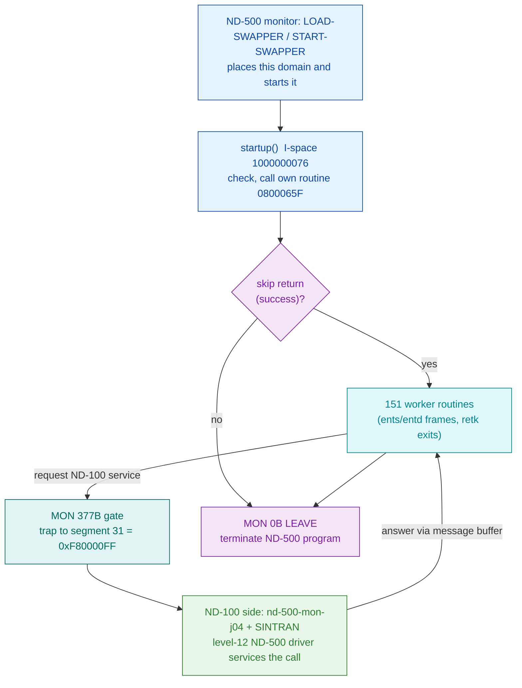
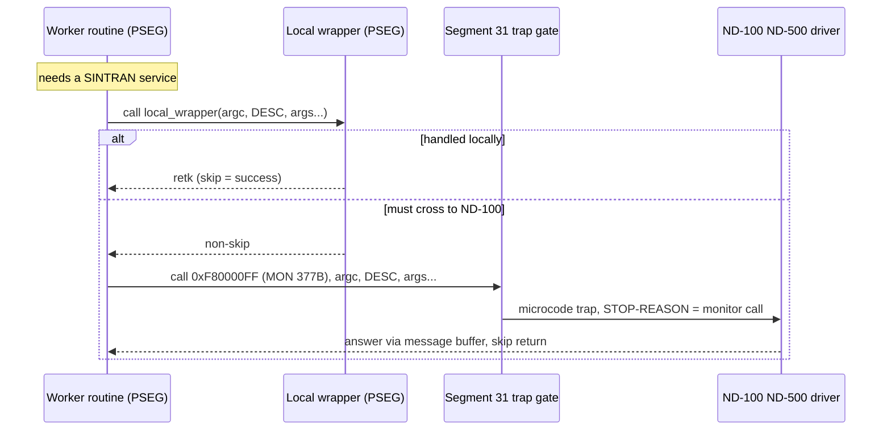

# SWAPPER-K01 Program Segment (PSEG) - Pseudo-C Analysis

Analysis of the ND-500 program segment
`SINTRAN/ND500/swapper/SWAPPER-K01.PSEG`
and its disassembly
`SINTRAN/ND500/swapper/swapper-k01-pseg.asm`.

> Companion documents:
> - Data segment: `SINTRAN/ND500/swapper/swapper-k01.dseg.md`
> - Loader/monitor that places this domain: `SINTRAN/ND500/nd-500-mon/nd-500-mon-j04.prog.md`

All numbers in the disassembly and in this document are OCTAL unless prefixed `0x`
(the disassembly was produced with `nd500-dis -a -o -noansi -b 0x08000000`).
Every claim here was read from the actual bytes or disassembly; anything not provable
from them is labelled `inferred` or `unknown`.

---

## 1. Summary

`swapper-k01.pseg` is the **program (I-space) half of a two-segment ND-500 domain**
`{ PSEG, DSEG }`. It is native ND-500 machine code, 38161 bytes (0x9511), disassembling
to 12046 lines. It is loaded into the ND-500 by the ND-100-side monitor
`SINTRAN/ND500/nd-500-mon/nd-500-mon-j04.prog` (the "ND-500/5000 MONITOR Version J04"), whose `LOAD-SWAPPER` /
`START-SWAPPER` commands place and start this domain.

What the code IS, from the bytes:

- A code segment based at ND-500 logical address `0x08000000` (logical segment 1),
  I/D split: the same numeric address is a code word in I-space (this file) and a data
  word in D-space (the DSEG file).
- **152 routines** (152 entry prologues: 119 `ents`, 32 `entd`, 1 `init`), with
  **43 skip-return exits** (`retk`).
- It reaches SINTRAN / the ND-100 through **exactly two kinds of trap**:
  - one `MON 0B` (LEAVE / terminate) at `1000000131`, and
  - fifteen `MON 377B` calls - the **ND-500 monitor-call gate** (a trap into logical
    segment 31, address `0xF80000FF`), each selecting a SINTRAN service by a descriptor
    operand that lives in the DSEG.

It contains **no** ND-500 bus-interface register access of its own: it does not touch
the 3022/5015 interface. As an ND-500 domain it cannot - the bus registers are ND-100
I/O space. It asks for services by trapping to the ND-100 through segment 31.

> Architectural note (verified against
> `SINTRAN/ND500/old/SWAPPER-MON-DISPATCH.md`): this PSEG
> is a specialised paging/swap worker domain and a *client* of SINTRAN. It is NOT the
> trap target for other ND-500 programs' monitor calls and contains no MON-number
> dispatch table. Do not read it as "the thing that services ND-500 MON calls".

---

## 2. Segment layout

| Region | I-space address | File offset | Content |
|--------|-----------------|-------------|---------|
| Banner / build data | `1000000000`..approx `1000000075` | 0x0000.. | ASCII build strings, not code (see 2.1) |
| Entry / startup | approx `1000000076`..`1000000136` | | first executable code, ends at `MON 0B LEAVE` |
| Routine body | `1000000137`..end | | 152 routines |

File offset = I-space address - `0x08000000`.

### 2.1 Banner / build data (start of file)

The raw file begins with data words, not instructions. Decoded as ASCII they read
(non-printable shown as `.`):

```
.......BT....$..D..EJG....(..REV...MGJH....(..-K01..MH.G.H FD....E..../....@....
```

Legible fragments: `REV`, `MGJH`, `-K01`, `MH`, `FD`. These are build/revision tags:
`-K01` is the segment version (matches the file name `swapper-k01`); `MGJH` / `MH`
are plausibly author or module initials (`inferred`); `REV` labels a revision field.
`nd500-dis` decodes this region as `init`/`move`/`comp2` pseudo-ops because it is data,
not code - the first genuine routine begins at the entry/startup block. This is the
standard ND data-before-code pattern.

---

## 3. Routine inventory

Prologue / epilogue opcodes actually present (counts from the disassembly):

| Opcode | Count | Meaning |
|--------|-------|---------|
| `ents` | 119 | enter, save registers, allocate stack frame (single-word form) |
| `entd` | 32  | enter double / enter with descriptor frame |
| `init` | 1   | (in the banner data region - an artefact of data-as-code, not a real prologue) |
| `retk` | 43  | return with SKIP (skip return = success/answer path) |
| `ret`  | many | plain return (bare `200` byte) |

So the segment holds on the order of **151 real routines** (119 + 32), reached by
internal `call $0800xxxx` / `go $...` transfers. Frame locals are addressed `b.NN`
(base-relative); ND-500 registers appear as `w1..w4` (32-bit halves), `r0..rN`
(registers), and `tos` (top of stack).

A full per-routine map is impractical to hand-verify for all 151 without more time; the
load-bearing routines - the entry/startup path and every routine that traps to SINTRAN -
are reconstructed below and are the ones that matter for "how it talks to the ND-100".

---

## 4. Entry / startup path (verified)

Disassembly `1000000076`..`1000000136`:

```
1000000076  if >< go   $24            ; branch on a prior compare
1000000100  w1 := b.24                ; w1 = local(24)
1000000102  call $1000003057, $0      ; call own routine at 0x0800065F (in this PSEG)
1000000110  if -k go   $12            ; if that routine took the NON-skip (error) return...
1000000112  r := b.0                  ; ...set up result registers
1000000114  r := r.10
1000000116  tos := r.0                ; push result
1000000121  retk                      ; skip-return to caller (success)
1000000122  call $1000100645, $0      ; else call routine at 0x0800A1A5
1000000130  ifkret                    ; expect skip return
1000000131  call $0xF8000000, $0      ; MON 0B  = LEAVE  (terminate this ND-500 program)
```

Pseudo-C:

```c
/* startup() - I-space 0x08000_003E (=1000000076) */
int startup(void)
{
    if (compare_flag_set)             /* 1000000076 if >< go $24 */
        goto alt;

    w1 = local24;                     /* 1000000100 */
    if (routine_0800065F() == OK) {   /* 1000000102 call; 1000000110 if -k go */
        result.lo = local0;           /* 1000000112..1000000116 */
        result.hi = reg10;
        push(result);
        return SKIP;                  /* 1000000121 retk : success */
    }
alt:
    routine_0800A1A5();               /* 1000000122 */
    /* 1000000130 ifkret : expect skip return */
    MON_LEAVE();                      /* 1000000131 MON 0B : terminate */
}
```

`MON 0B` (LEAVE) is the ND-500 program-termination monitor call: it hands control back
to the ND-500 monitor / SINTRAN. Its call target `0xF8000000` is segment 31 offset 0 -
the trap/escape segment - with MON number 0 in the low byte.

---

## 5. The SINTRAN monitor-call gate: `MON 377B` (verified, central)

Fifteen sites issue `MON 377B`. This is how this ND-500 domain requests ND-100 / SINTRAN
services. The mechanism, read directly from the bytes:

- **Trap target** `$1777777777777000000377` = sign-extended `0xF80000FF`. `0xF8000000`
  is logical **segment 31** (the escape/trap segment); the low byte `0xFF` = octal
  `377` is the gate index. Calling into segment 31 traps the ND-500 microcode, which
  signals the ND-100 (STOP-REASON = monitor call); the ND-100-side ND-500 driver then
  services it. (Mechanism per
  `SINTRAN/ND500/ND500-MONITOR-CALL-MECHANISM.md` and
  `.../ND500-BUS-INTERFACE-REFERENCE.md`; the segment-31 trap is consistent with the
  `0xF80000xx` targets seen here.)
- **Call shape**: `call $0xF80000FF, <argcount>, <descriptor>, <arg2>, <arg3>, ...`
  - `<argcount>` is a literal (`$2`, `$3`, `$4`, `$6`, `$7` observed).
  - `<descriptor>` is always a D-space pointer of the form `$1000225xxx`
    (`0x080009xx` region of the DSEG) - it selects WHICH SINTRAN service is requested.
  - remaining operands are the service's parameters: D-space data pointers
    (`$1000436xxx` / `$1000437xxx` / `$1000440xxx` = `0x08002xxx`) or frame locals
    (`b.NN`, `@b.NN` indirect).

### 5.1 The local-wrapper-then-trap pattern

Every `MON 377B` is immediately preceded by a `call` to a **local** routine with the
*same* descriptor and argument list. Example at `1000000466`:

```
1000000466  call $1000111601, $2, $1000225064, $1000436574   ; local wrapper 0x0800xxxx
1000000506  ifkret                                            ; expect skip return
1000000507  call $0xF80000FF, $2, $1000225064, $1000436574    ; MON 377B (same args)
1000000527  ifkret
```

Pseudo-C:

```c
/* request a SINTRAN service (descriptor 0225064B) */
if (local_pre_0800xxxx(2, DESC_0225064, ARG_0436574) == SKIP) {
    /* pre-flight/local handling succeeded */
} else {
    monitor_call(2, DESC_0225064, ARG_0436574);   /* MON 377B : trap to ND-100 */
}
```

Interpretation (`inferred`): the local wrapper does an in-domain fast path / validation;
if it cannot complete the request locally it falls through to the real `MON 377B` trap
that crosses to the ND-100. The `ifkret` guards mean both the wrapper and the trap use
the ND-500 skip-return convention.

### 5.2 Descriptor operands observed (service selectors)

Count of each `$1000225xxx` descriptor across all callers (traps and local wrappers):

| Descriptor (octal addr) | D-space file offset | Uses |
|-------------------------|---------------------|------|
| `$1000225014` | 0x0800_09?? region | 8 |
| `$1000225020` | | 7 |
| `$1000225044` | | 14 |
| `$1000225070` | | 19 |
| `$1000225110` | | 49 |
| `$1000225120` | | 8 |
| (others: 022,030,034,040,050,054,060,064,074,104,130) | | 1-6 each |

The descriptors themselves live in the DSEG; their decoded contents and the exact
service each names are analysed in
`SINTRAN/ND500/swapper/swapper-k01.dseg.md`
(PSEG->DSEG cross-reference section). What is proven here from the PSEG side is the
*mechanism* and *which descriptors are invoked how often* - the heavily-used
`$1000225110` (49x) and `$1000225070` (19x) are the dominant services this domain asks
the ND-100 for. Mapping each descriptor to a named SINTRAN MON service requires reading
the descriptor bytes (see the DSEG document); it is `unknown` from the PSEG alone.

---

## 6. MON traps - complete list

| Site (octal) | Trap | Meaning |
|--------------|------|---------|
| `1000000131` | `MON 0B` | LEAVE - terminate ND-500 program |
| `1000000507` | `MON 377B` | monitor-call gate, desc `0225064`, 2 args |
| `1000001131` | `MON 377B` | desc `0225064`, 2 args |
| `1000003167` | `MON 377B` | desc `0225040`, 2 args |
| `1000010131` | `MON 377B` | desc `0225044`, 7 args |
| `1000013600` | `MON 377B` | desc `0225044`, 7 args |
| `1000014466` | `MON 377B` | desc `0225044`, 7 args |
| `1000016502` | `MON 377B` | desc `0225044`, 7 args |
| `1000020237` | `MON 377B` | desc `0225044`, 7 args |
| `1000022231` | `MON 377B` | desc `0225054`, 6 args |
| `1000023534` | `MON 377B` | desc `0225044`, 7 args |
| `1000037154` | `MON 377B` | desc `0225044`, 7 args |
| `1000041466` | `MON 377B` | desc `0225044`, (multi-arg) |
| `1000044151` | `MON 377B` | desc `0225064`, 2 args |
| `1000062726` | `MON 377B` | desc `0225060`, 3 args |
| `1000101077` | `MON 377B` | desc `0225050`, 4 args |

All fifteen `MON 377B` gates use the same trap address `0xF80000FF`; they differ only in
descriptor and argument list. This is a single monitor-call convention used uniformly.

---

## 7. Control flow

### 7.1 Top-level shape



### 7.2 The monitor-call gate sequence



---

## 8. Data references

The PSEG references DSEG data in two address ranges:

- `$1000225xxx` (= `0x080009xx`) - the **monitor-call descriptors** (service selectors),
  used only as the first argument of the gate calls.
- `$1000436xxx` / `$1000437xxx` / `$1000440xxx` / `$1000246xxx` / `$1000461xxx` / `$1000507xxx`
  (= `0x08002xxx`..`0x0800Axxx`) - **parameter blocks and worker variables** loaded,
  stored, incremented (`w incr`), tested (`w test`) and zeroed (`w stz`) by the routines.

The exhaustive PSEG->DSEG cross-reference (which DSEG address is touched from which PSEG
address, and whether it lands in initialised data or the zero/BSS region) is in
`SINTRAN/ND500/swapper/swapper-k01.dseg.md`.
It is not duplicated here.

---

## 9. Relationship to the residue symbol fragment

The ND-100 monitor file `SINTRAN/ND500/nd-500-mon/nd-500-mon-j04.prog` carries a leaked fragment of the
MON-DEBUG build's symbol table (extracted to
`SINTRAN/ND500/nd-500-mon/nd-500-mon-j04-symtab1.sym`
and `...-symtab2.sym`). Those names (CACHEMODE, BRKDET/BRKFULL, STEPPING/STEPDONE,
DOWNLD, CSTEP, ECHOTEST, EVREP, DTBFUNC) belong to the **ND-100 monitor**, not to this
ND-500 swapper PSEG. They are listed here only to prevent confusion: do not map this
PSEG's routines to those symbols - there is no evidence they correspond.

---

## 10. Open questions / unknowns

1. **Descriptor -> named MON service.** Each `$1000225xxx` descriptor selects a SINTRAN
   service; the mapping requires decoding the descriptor bytes in the DSEG (see the DSEG
   document). Unknown from the PSEG alone.
2. **Per-routine purpose for the ~151 worker routines.** Only the entry path and the
   gate-calling routines are reconstructed. Naming all routines needs either the ND-500
   symbol list `SINTRAN/ND500/swapper/N500-SYMBOLS.SYMB` cross-referenced by address, or more analysis time.
3. **`MGJH` / `MH` banner tags.** Plausibly author/module initials; not proven.
4. **Local-wrapper semantics.** The pattern "local wrapper with same args, then MON 377B"
   is proven structurally; that the wrapper is a local fast-path/validation is inferred,
   not proven from the wrapper body (not yet decoded).

To settle (1) and (2): cross-reference
`SINTRAN/ND500/swapper/N500-SYMBOLS.SYMB` (7157 symbols,
`NAME=octal`) against these I-space addresses, and decode the descriptor words in the
DSEG. Both are mechanical once usage budget allows.
