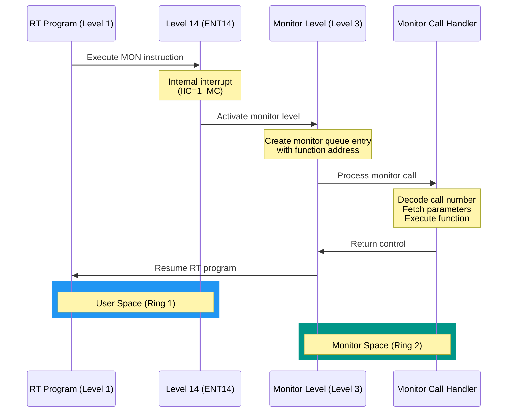
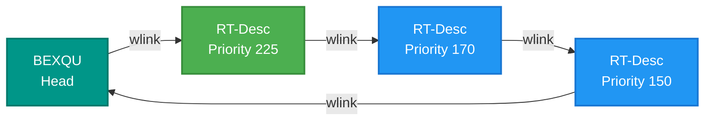
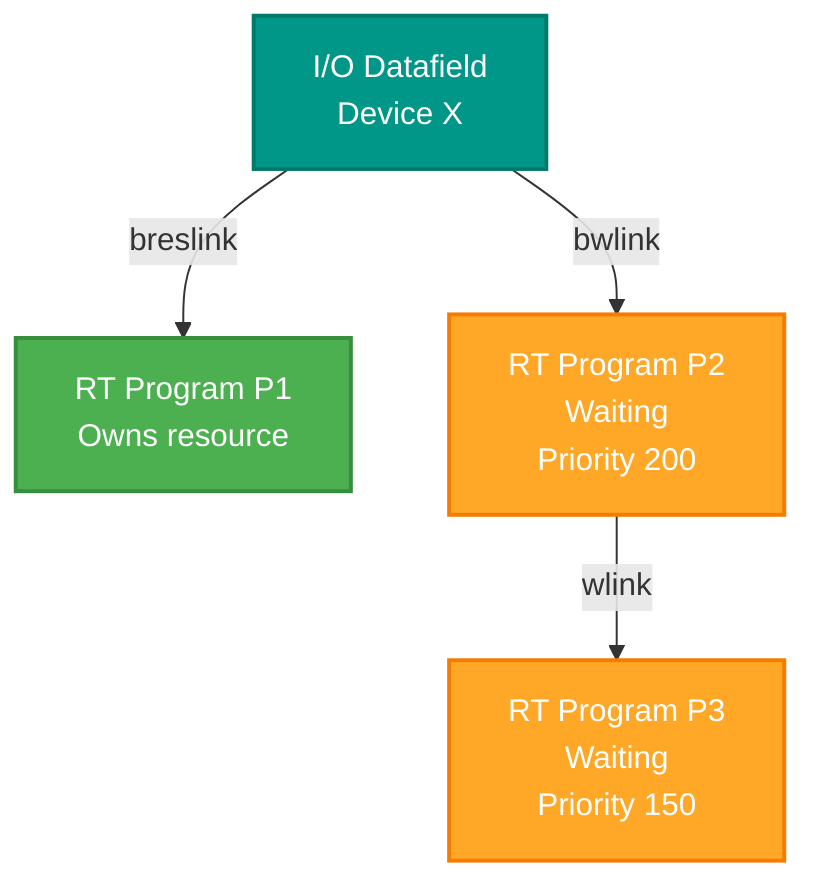

# SINTRAN III System Architecture Overview

**SINTRAN III/VS Operating System - Deep Architecture Analysis**

**Version:** 1.0  
**Last Updated:** October 16, 2025  
**Target System:** NORD-10 Computer Family

---

## Table of Contents

1. [Introduction](#1-introduction)
2. [System Components](#2-system-components)
3. [Interrupt System Architecture](#3-interrupt-system-architecture)
4. [Memory Management System](#4-memory-management-system)
5. [Physical Memory Layout](#5-physical-memory-layout)
6. [Queue Structures](#6-queue-structures)
7. [Data Structures Overview](#7-data-structures-overview)
8. [Key Concepts Glossary](#8-key-concepts-glossary)
9. [Document Cross-References](#9-document-cross-references)

---

## 1. Introduction

### 1.1 Purpose of This Document

This document provides a high-level architectural overview of the SINTRAN III/VS operating system. It serves as the foundation for understanding how the system boots, manages memory, handles interrupts, schedules programs, and performs I/O operations.

**Target audience:**
- Developers implementing NORD-10 emulators
- System programmers analyzing SINTRAN behavior
- Anyone seeking to understand vintage OS architecture

### 1.2 SINTRAN III System Overview

SINTRAN III is a sophisticated real-time operating system designed for the NORD-10 computer family. It provides:

- **Real-time multitasking** with priority-based scheduling
- **Demand paging** virtual memory management
- **Multi-level interrupt handling** (16 hardware interrupt levels)
- **Device independence** through logical device numbers
- **Semaphore-based** resource management
- **Time-sharing and batch** background processing

### 1.3 System Philosophy

SINTRAN III is built on the principle of **hardware-assisted software**:

1. **Interrupt levels as task separators** - Different tasks run on different interrupt levels, letting hardware handle priority decisions
2. **MMU-based protection** - Ring protection and permit systems prevent unauthorized access
3. **Queue-driven scheduling** - Programs move between execution, waiting, and time queues
4. **Minimal overhead** - Context switches are extremely fast (0.9 μs) due to hardware register sets

---

## 2. System Components

### 2.1 Major Components

```mermaid
graph TD
    A[SINTRAN III] --> B[Real Time Monitor]
    A --> C[Background Processor]
    
    B --> D[Kernel]
    B --> E[Segment Handling]
    B --> F[I/O System]
    B --> G[Time Handling]
    B --> H[Error Recording]
    
    C --> I[System Segment]
    C --> J[Time Slicer]
    C --> K[File System Interface]
    
    D --> L[Monitor Queue]
    D --> M[Execution Queue]
    D --> N[Waiting Queues]
    D --> O[Monitor Calls]
    
    E --> P[Paging]
    E --> Q[Swapping]
    E --> R[Page Fault Handler]
    
    F --> S[Device Drivers]
    F --> T[Interrupt Handlers]
    F --> U[DMA Management]
    
    style A fill:#3F51B5,stroke:#303F9F,stroke-width:2px,color:#fff
    style B fill:#2196F3,stroke:#1976D2,stroke-width:2px,color:#fff
    style C fill:#2196F3,stroke:#1976D2,stroke-width:2px,color:#fff
    style D fill:#009688,stroke:#00796B,stroke-width:2px,color:#fff
    style E fill:#009688,stroke:#00796B,stroke-width:2px,color:#fff
    style F fill:#009688,stroke:#00796B,stroke-width:2px,color:#fff
    style G fill:#009688,stroke:#00796B,stroke-width:2px,color:#fff
    style H fill:#009688,stroke:#00796B,stroke-width:2px,color:#fff
    style I fill:#9C27B0,stroke:#7B1FA2,stroke-width:2px,color:#fff
    style J fill:#9C27B0,stroke:#7B1FA2,stroke-width:2px,color:#fff
    style K fill:#9C27B0,stroke:#7B1FA2,stroke-width:2px,color:#fff
```



### 2.2 Real Time Monitor

The **Real Time Monitor** is the core of SINTRAN III. It runs at elevated privilege levels and manages:

| Component | Function | Interrupt Level |
|-----------|----------|----------------|
| **Kernel** | Program scheduling, resource management, queue operations | Level 3 (Monitor Level) |
| **Segment Handling** | Virtual memory, paging, swapping | Level 3 |
| **I/O System** | Device drivers, interrupt handlers | Levels 10-13 |
| **Time Handling** | Clock, scheduling, timeouts | Level 13 (Clock) |
| **Error Recording** | System error logging | Various levels |

### 2.3 Background Processor

The **Background Processor** handles time-sharing and batch programs. It is essentially a special RT program running at lower priority than most real-time programs.

**Key features:**
- Multiple background programs (terminals)
- Batch job processing
- File system interface
- Command processor
- RT loader integration

### 2.4 Device Drivers

SINTRAN supports various device types through a unified driver architecture:

| Device Type | Interrupt Level | Examples |
|-------------|----------------|----------|
| **Mass Storage** | Level 11 | SMD disks, SCSI disks, Winchester, Floppy |
| **Input Devices** | Level 12 | Terminals, Card readers, Tape |
| **Output Devices** | Level 10 | Line printers, Plotters, Tape |
| **Real Time Clock** | Level 13 | System timer |
| **Communication** | Level 12 | HDLC, X.21, PIOC |

---

## 3. Interrupt System Architecture

### 3.1 Interrupt Level Usage

NORD-10 provides **16 interrupt levels** (0-15), each with a complete register set. SINTRAN uses them as follows:

```
┌─────────────────────────────────────────────┐
│ Level 15: (Reserved)                        │
├─────────────────────────────────────────────┤
│ Level 14: Internal Interrupts (ENT14)       │
│   - Monitor calls                           │
│   - Page faults                             │
│   - Memory protection violations            │
│   - Illegal instructions                    │
│   - Power fail                              │
├─────────────────────────────────────────────┤
│ Level 13: Real Time Clock (ICLK)            │
│   - Time quantum expiration                 │
│   - Scheduled program activation            │
├─────────────────────────────────────────────┤
│ Level 12: Input Devices (Character I/O)     │
│   - Terminal input                          │
│   - Communication controllers               │
├─────────────────────────────────────────────┤
│ Level 11: Mass Storage Devices              │
│   - Disk controllers                        │
│   - Transfer completion                     │
├─────────────────────────────────────────────┤
│ Level 10: Output Devices                    │
│   - Line printers                           │
│   - Plotters                                │
├─────────────────────────────────────────────┤
│ Levels 4-9: (Available)                     │
├─────────────────────────────────────────────┤
│ Level 4: INBT/OUTBT Level                   │
│   - Character I/O monitor calls             │
├─────────────────────────────────────────────┤
│ Level 3: Monitor Level (KERNEL)             │
│   - Scheduler                               │
│   - Resource management                     │
│   - Queue operations                        │
├─────────────────────────────────────────────┤
│ Level 2: (Available)                        │
├─────────────────────────────────────────────┤
│ Level 1: RT Programs (User Programs)        │
│   - All RT programs execute here            │
│   - Background processor runs here          │
├─────────────────────────────────────────────┤
│ Level 0: Idle Program                       │
│   - Runs when no other program is ready     │
└─────────────────────────────────────────────┘
```

### 3.2 Internal Interrupt Sources (Level 14)

The **Internal Interrupt Enable Register (IIE)** controls which internal interrupts are active:

| Bit | Mnemonic | Interrupt Source |
|-----|----------|-----------------|
| 1 | MC | Monitor Call |
| 2 | MPV | Memory Protect Violation |
| 3 | PF | Page Fault |
| 4 | II | Illegal Instruction |
| 5 | Z | Error Indicator (Z flag) |
| 6 | PI | Privileged Instruction |
| 7 | IOX | IOX Error (no device response) |
| 8 | PTY | Memory Parity Error |
| 9 | MOR | Memory Out of Range |
| 10 | POW | Power Fail Interrupt |

The **Internal Interrupt Code Register (IIC)** contains the bit number (1-10) of the interrupting source.

### 3.3 Priority Interrupt Control

Two 16-bit registers control interrupt levels:

- **PIE (Priority Interrupt Enable)**: Bit mask of enabled interrupt levels (set by program)
- **PID (Priority Interrupt Detect)**: Bit mask of pending interrupts (set by hardware/software)

At any time, the **highest level** where both PIE and PID bits are set is the running level.

### 3.4 Monitor Call Flow



**Key points:**
1. Monitor calls are **synchronous** - the calling program waits for completion
2. Level 14 acts as a **trampoline** to monitor level
3. Monitor level is **disabled** during some monitor call processing phases
4. Parameters are fetched on RT level to allow page faults

---

## 4. Memory Management System

### 4.1 Page Index Tables (PITs)

NORD-10 provides **4 page index tables**, each mapping the full 64K logical address space into physical memory. Each table has 64 entries (one per 1K page).

**SINTRAN III usage:**

| Page Table | Purpose | Typical Usage |
|------------|---------|---------------|
| **PIT 0** | SINTRAN resident + swapping area + window pages | System kernel, drivers, data fields |
| **PIT 1** | RT programs + RTCOMMON | Foreground real-time programs |
| **PIT 2** | Background user area | Background/time-sharing programs |
| **PIT 3** | Background user area / special applications | Additional background programs |

### 4.2 Page Index Table Entry Format

Each PIT entry is 16 bits:

```
 15  14  13  12  11   10-9    8      7-0
┌───┬───┬───┬───┬───┬─────┬─────┬──────────┐
│WPM│RPM│FPM│WIP│PU │RING │ NA  │ PHYSPAGE │
└───┴───┴───┴───┴───┴─────┴─────┴──────────┘
```

| Bits | Field | Meaning |
|------|-------|---------|
| 0-7 | PHYSPAGE | Physical page number (0-255) |
| 8 | NA | Not used |
| 9-10 | RING | Ring number (0-3) for protection |
| 11 | PU | Page Used (set by hardware when accessed) |
| 12 | WIP | Written In Page (set when page is written to) |
| 13 | FPM | Fetch Permitted (can execute code from page) |
| 14 | RPM | Read Permitted (can read data from page) |
| 15 | WPM | Write Permitted (can write data to page) |

**Special case:** WPM=RPM=FPM=0 means **page not in memory** → generates page fault (PF) interrupt.

### 4.3 Paging Control Register (PCR)

Each interrupt level has a 6-bit **PCR** that specifies:

```
 10-9    8-7      6-3      2    1-0
┌─────┬───────┬─────────┬───┬──────┐
│NPIT │ APIT  │ LEVEL   │ 0 │ RING │
└─────┴───────┴─────────┴───┴──────┘
```

| Bits | Field | Meaning |
|------|-------|---------|
| 0-1 | RING | Current ring number (0-3) |
| 2 | - | Always 0 |
| 3-6 | LEVEL | Which PCR (0-15) |
| 7-8 | APIT | Alternative PIT number (0-3) |
| 9-10 | NPIT | Normal PIT number (0-3) |

This allows different interrupt levels to use different page tables and run at different protection rings.

### 4.4 Ring Protection System

The ring system provides **4 privilege levels**:

```
┌──────────────────────────────────────┐
│          Ring 3 (Reserved)           │
├──────────────────────────────────────┤
│    Ring 2: SINTRAN Kernel & Drivers  │
├──────────────────────────────────────┤
│    Ring 1: User RT Programs          │
├──────────────────────────────────────┤
│    Ring 0: Time-sharing Programs     │
└──────────────────────────────────────┘
```

**Protection rule:** A program on ring R can only access pages with ring ≥ R.

Example:
- Ring 0 program can access Ring 0 pages only
- Ring 2 program can access Ring 2, 1, and 0 pages

### 4.5 Demand Paging

SINTRAN supports **demand paging** where pages are loaded from disk only when accessed:

1. Program accesses a page not in memory (WPM=RPM=FPM=0)
2. **Page Fault** interrupt occurs (Level 14, IIC=3)
3. Page fault handler determines which disk block to load
4. Page is loaded from swap disk
5. PIT entry is updated with physical page number and permissions
6. Instruction is restarted

---

## 5. Physical Memory Layout

### 5.1 Overall Memory Organization

```
Physical Memory Layout (Example 4MB System)

┌──────────────────────────────────────┐ 777777₈ (4MB)
│         RT COMMON                    │
│      (Shared data area)              │
├──────────────────────────────────────┤ 
│                                      │
│      Swappable Program Area          │
│      (RT programs, segments)         │
│                                      │
├──────────────────────────────────────┤ 177377₈
│                                      │
│      POF (Paging Off) Area           │
│   - System tables                    │
│   - Device buffers                   │
│   - Memory map                       │
│   - Code (must be accessible         │
│     even with MMU off)               │
│                                      │
├──────────────────────────────────────┤ 100000₈
│   Open File Tables (pages 34₈-35₈)   │
├──────────────────────────────────────┤ 70000₈
│                                      │
│   SINTRAN III Resident Part          │
│   - Kernel                           │
│   - Time handling                    │
│   - Segment handling                 │
│   - I/O System                       │
│   - Error recording                  │
│   - Background processor             │
│   - Data fields                      │
│   - Swapping area (during boot)      │
│                                      │
└──────────────────────────────────────┘ 0
```

### 5.2 SINTRAN Resident Part (0 - 66000₈)

Organized by function with fixed address ranges:

| Address Range (Octal) | Component | Description |
|----------------------|-----------|-------------|
| 0 - 2000 | Kernel | Monitor queue, execution queue, scheduling |
| 2000 - 4000 | Time Handling | Clock routines, time queue, scheduling |
| 4000 - 6000 | Segment Handling (part) | Paging, swapping initiation |
| 6000 - 10000 | I/O System (part) | Device driver entry points |
| 10000 - 12000 | Error Recording | Error logging routines |
| 12000 - 16000 | Background Processor | Time-sharing management |
| 20000 - 22000 | Data Fields | Device control blocks (DCBs) |
| 22000 - 26000 | Background/Batch Tables | User program descriptors |
| 26000 - 30000 | RT Descriptions | RT program control blocks |
| 30000 - 32000 | Segment/RTCOMMON/IOX Tables | Memory management tables |
| 32000 - 36000 | File System Definition | File system interface |
| 36000 - 40000 | SINTRAN Communication | Inter-processor communication |
| 40000 - 44000 | Spooling RT Program | Print spooler |
| 44000 - 56000 | Optional Drivers | Additional device drivers |

### 5.3 POF (Paging Off) Area (100000₈ - 177377₈)

The **POF area** is special memory that can be accessed even when paging is turned off. It contains:

| Address Range (Octal) | Component |
|----------------------|-----------|
| 100000 - 110000 | Error device, line printers, SINTRAN communication, SIBAS internal devices |
| 110000 - 112000 | Segment handling code |
| 112000 - 114000 | I/O system code |
| 114000 - 126000 | Level 13/14 routines, system stop/start, optional drivers |
| 126000 - 130000 | Logical number tables |
| 130000 - 132000 | Timer table, ident tables |
| 132000 - 136000 | DMA drivers, memory map table, character device buffers |
| 136000 - 177377 | Block device buffers (contiguous area) |

**Why POF area is important:**
- Accessible during page faults (when MMU may be in transition)
- Contains critical system tables needed by interrupt handlers
- DMA buffers must be in fixed physical memory
- Page fault handler code must be in POF area

### 5.4 Physical Page Allocation (from PH-P2-START-BASE.NPL)

The system tracks physical page allocations for various subsystems:

| Subsystem | First Page Symbol | Last Page Symbol | Purpose |
|-----------|------------------|-----------------|---------|
| Memory Map | MMFPAGE | MMLPAGE | Memory page bitmap |
| Device Buffers | DBFPAGE | DBLPAGE | I/O buffer pool |
| LAMU Tables | FLAMPAGE | LLAMPAGE | Logical Address Management Unit |
| Segment Table | SGTFPHPAGE | SGTLPHPAGE | Segment descriptors |
| Logical Number Table | LGTFPHPAGE | LGTLPHPAGE | Device number → datafield mapping |
| RPIT | RPIFPHPAGE | RPILPHPAGE | Page Index Table (RT programs) |
| MPIT | MPIFPHPAGE | MPILPHPAGE | Page Index Table (Monitor) |
| IPIT | IPIFPHPAGE | IPILPHPAGE | Page Index Table (I/O) |
| 5PIT | 5PIFPHPAGE | 5PILPHPAGE | Page Index Table (ND-500 interface) |
| HDLC Buffers | HDLCFPHPAGE | HDLCLPHPAHE | HDLC DMA buffers |
| SCSI Buffers | SCFPHYSPAGE | SCLPHYSPAGE | SCSI DMA buffers |
| Nucleus | NUFPHPAGE | NULPHPAGE | System nucleus |
| Filesystem | FSEFP | FSELP | Filesystem code/data |
| Error Device | IERFPHPAGE | IERLPHPAGE | Error logging buffer |
| Terminal Datafields | TDFPAGE | TDLPHPAGE | Terminal DCBs |
| I/O Buffers | IOBFPHPAGE | IOBLPHPAGE | General I/O buffers |

**Note:** All page numbers are in **octal** in the source code. Value -1 means "not allocated."

---

## 6. Queue Structures

### 6.1 Monitor Queue

The **Monitor Queue** is a FIFO queue of pending monitor activations.

**Structure:**
- Elements are I/O datafields (device control blocks)
- Only locations 5 (MLINK) and 6 (MFUNC) are used
- MLINK points to next element in queue (or -1 for first element, 0 for not in queue)
- MFUNC contains address of routine to execute


**Operation:**
1. Activations are added at the end (newest)
2. Removed from the front (oldest) = FIFO
3. Empty 90% of the time, 1 element 9% of the time

### 6.2 Execution Queue

The **Execution Queue** contains RT programs ready to run, ordered by priority (highest first).

**Structure:**
- Elements are RT-descriptions (program control blocks)
- WLINK field links to next program
- Programs inserted after those with greater/equal priority
- Last program's WLINK points back to head element (BEXQU)



**Physical location:** Head pointer BEXQU is in kernel data area

### 6.3 Waiting Queues

**Waiting Queues** hold programs waiting for resources (devices, semaphores, etc.).

**Structure:**
- One waiting queue per reserved resource
- Organized like execution queue (priority-ordered)
- Head element is an I/O datafield (the resource)
- Resource has RESLINK (links to reservation queue), RTRES (reserving program), BWLINK (first waiter)



**Connection between queues:**

```
Execution Queue          Reservation Queue       Waiting Queue
┌──────────────┐        ┌───────────────┐       ┌──────────────┐
│ RT Program 1 │───────>│ Device A      │──────>│ RT Program 3 │
│ Priority 225 │        │ (reserved)    │       │ (waiting)    │
│   BRESLINK───┼───┐    │   RTRES───────┼──┐    │              │
└──────────────┘   │    │   RESLINK─────┼──┼──> │              │
      │            │    └───────────────┘  │    └──────────────┘
      v            │    ┌───────────────┐  │
┌──────────────┐   └───>│ Device B      │  │
│ RT Program 2 │        │ (reserved)    │<─┘
│ Priority 150 │        │   RTRES───────┼───> (points back to P1)
└──────────────┘        └───────────────┘
```

### 6.4 Time Queue

The **Time Queue** holds programs scheduled for future execution, ordered by scheduled time (earliest first).

**Structure:**
- Elements are RT-descriptions
- TLINK field links to next program
- DTIME (locations 2-3) contains scheduling time
- DTINT (locations 4-5) contains period for periodic programs
- Last program's TLINK = -1


**Clock interrupt handler** (ICLK) scans this queue each time unit, moving due programs to execution queue.

---

## 7. Data Structures Overview

### 7.1 I/O Datafield (Device Control Block)

Each I/O device is represented by a **datafield** (also called DCB - Device Control Block).

**Standard locations:**

| Offset | Symbol | Purpose |
|--------|--------|---------|
| 0 | RESLINK | Links devices in reservation queue |
| 1 | RTRES | Points to RT program reserving this device |
| 2 | BWLINK | Points to first program in waiting queue |
| 5 | MLINK | Link in monitor queue |
| 6 | MFUNC | Monitor function address |

**Variable portion:** Device-specific data (status registers, buffer pointers, etc.)

### 7.2 RT-Description (Program Control Block)

Each RT program has a **26-word RT-description**:

| Offset | Symbol | Size | Purpose |
|--------|--------|------|---------|
| 0 | TLNK | 1 | Time queue link |
| 1 | STATE, PRIORITY | 1 | Program state/priority (packed) |
| 2-3 | DTIM1, DTIM2 | 2 | Scheduled time (double word) |
| 4-5 | DTN1, DTN2 | 2 | Time interval for periodic execution |
| 6 | STADR | 1 | Start address |
| 7 | SEGM, SEGM2 | 1 | Segment numbers (packed) |
| 8 | DPREG | 1 | Saved P register |
| 9 | DXREG | 1 | Saved X register |
| 10 | DTREG | 1 | Saved T register |
| 11 | DAREG | 1 | Saved A register |
| 12 | DDREG | 1 | Saved D register |
| 13 | DLREG | 1 | Saved L register |
| 14 | DSREG | 1 | Saved status register |
| 15 | DBREG | 1 | Saved B register |
| 16 | WLNK | 1 | Waiting/execution queue link |
| 17-18 | ACTSEG1, ACTSEG2 | 2 | Active segments |
| 19 | ACTPRI | 1 | Actual priority |
| 20 | BRESLINK | 1 | Reservation queue link |
| 21 | RSEGM | 1 | Reserved segment info |
| 22-25 | BITMAP-BITM3 | 4 | Segment bitmaps |
| 25 | WINDOW | 1 | Window information |

**STATUS location (offset 1) bit fields:**

| Bit | Symbol | Meaning |
|-----|--------|---------|
| 5WAIT | | Program in waiting state |
| 5REP | | Repeat execution requested |
| 5INT | | Periodic program |
| 5ABS | | Absolute time scheduling |
| 5RWAIT | | Voluntarily waiting |
| 5RTOFF | | RT program inhibited |

### 7.3 Segment Table

Segments are units of memory that can be paged in/out.

**Segment table entry (5 words per segment):**

| Offset | Symbol | Purpose |
|--------|--------|---------|
| 0 | BPAGL | Beginning physical page number (low part) |
| 1 | LOGAD | Logical address |
| 2 | SGSTA | Segment status |
| 3 | SEGLE | Segment length (pages) |
| 4 | PREVI | Previous segment index |

### 7.4 Memory Map Table

Tracks physical page ownership and status.

**Memory map entry (per page):**

| Field | Purpose |
|-------|---------|
| PROTE | Protection bits |
| PAGLI | Page index in logical address space |

### 7.5 Logical Device Number Table

Maps logical device numbers to datafield addresses.

**Structure:**
- Indexed by logical device number >> 6 (high bits)
- Then indexed by low 6 bits
- Contains pointer to device datafield

---

## 8. Key Concepts Glossary

### A

**ATIME** - Actual Time. Double-word counter representing time in basic time units since system start, maintained on level 13.

**Alternative PIT** - Secondary page index table selected by bit 7 of certain instructions. Allows temporary access to different address spaces.

### B

**BASE Variable** - Variables declared in BASE-ESAB blocks, accessed via B register with static offsets.

**BEXQU** - Beginning of Execution Queue. Head pointer for the ready-to-run program queue.

**BTIMQU** - Beginning of Time Queue. Head pointer for the time-scheduled program queue.

### C

**Common Data Area** - Shared memory region accessible by multiple RT programs, protected by semaphores.

### D

**Datafield** - Device Control Block (DCB). Data structure describing an I/O device or resource.

**Demand Paging** - Loading pages from disk only when accessed (on page fault), not all at once.

**DISP Variable** - Displacement variables declared in DISP-PSID blocks, symbolic offsets used with B register for dynamic structures.

**DTIME** - Delta Time. Scheduling time stored in RT-description (when program should run).

**DTINT** - Delta Time Interval. Period for periodic program execution.

### E

**ENT14** - Entry point for level 14 internal interrupt handler.

**Execution Queue** - Priority-ordered queue of RT programs ready to execute.

### G

**Global Variable** - Variables declared outside subroutines, accessed indirectly through P-relative addressing.

### I

**ICLK** - Internal Clock handler. Routine executed on monitor level during each clock interrupt.

**IIE** - Internal Interrupt Enable register. Bit mask controlling which internal interrupts are active.

**IIC** - Internal Interrupt Code register. Contains bit number (1-10) of current internal interrupt source.

**INBT/OUTBT** - Monitor calls for character input/output, executed on level 4.

### L

**LAMU** - Logical Address Management Unit. Tables used for virtual-to-physical address translation.

**Local Variable** - Variables declared inside SUBR-RBUS, accessed directly via P-relative addressing.

**Logical Device Number** - Abstract device identifier used in monitor calls, mapped to physical device datafield.

### M

**MFUNC** - Monitor Function. Address of routine to execute when processing monitor queue element.

**MLINK** - Monitor Link. Pointer to next element in monitor queue.

**MQUEUE** - Monitor Queue head pointer.

**MTIME** - Monitor Time. Time counter maintained on monitor level, catches up to ATIME.

**MMU** - Memory Management Unit. Hardware providing virtual memory and protection.

### N

**Non-demand Segment** - Segment loaded entirely into memory (all pages present), no page faults allowed.

**NPIT** - Normal Page Index Table number (0-3).

### P

**PCR** - Paging Control Register. Per-level register specifying which PITs to use and protection ring.

**PF** - Page Fault. Internal interrupt when accessing page not in memory.

**PID** - Priority Interrupt Detect register. Bit mask of pending interrupts.

**PIE** - Priority Interrupt Enable register. Bit mask of enabled interrupt levels.

**PIT** - Page Index Table. Maps 64K logical address space to physical pages. NORD-10 has 4 PITs.

**POF Area** - Paging Off area. Physical memory (100000₈-177377₈) accessible even with MMU disabled.

### R

**Reservation Queue** - List of resources (devices) reserved by a specific RT program, linked via RESLINK.

**Ring Protection** - 4-level privilege system (rings 0-3) where higher-numbered rings have more privileges.

**RTCOMMON** - Real-Time Common area. Shared memory region at top of physical memory accessible to all RT programs.

**RT-Description** - Real-Time program descriptor. 26-word structure containing program state, registers, queue links.

**RTENTRY** - Routine to insert RT program into execution queue and schedule it.

### S

**Segment** - Unit of virtual memory, can be paged in/out. Multiple pages form a segment.

**Semaphore** - Synchronization primitive for mutual exclusion. Programs wait if semaphore is reserved.

**STATUS** - Location in RT-description containing program state bits (5WAIT, 5REP, 5INT, etc.).

**Swapping** - Moving entire program segments between memory and disk to make room for other programs.

### T

**Time Queue** - Queue of programs scheduled for future execution, ordered by scheduled time.

### W

**Waiting Queue** - Queue of programs waiting for a specific resource, ordered by priority.

**WLINK** - Waiting Link. Pointer to next RT-description in waiting or execution queue.

**Working Field** - Temporary storage for monitor call parameters and saved registers. Separate fields for demand (DEMIFIELD) and non-demand (NDEMFIELD) programs.

---

## 9. Document Cross-References

This overview document provides the foundation. Detailed information is in these documents:

### Core Architecture Documents (00-19)

| # | Document | Focus | Key Topics |
|---|----------|-------|------------|
| **00** | [SINTRAN-ARCHITECTURE-OVERVIEW.md](00-SINTRAN-ARCHITECTURE-OVERVIEW.md) | System Overview | THIS DOCUMENT - Components, interrupts, memory, queues |
| **01** | [BOOT-SEQUENCE.md](01-BOOT-SEQUENCE.md) | Boot Process | SINTR routine, memory initialization, device detection |
| **02** | [QUEUE-STRUCTURES-DETAILED.md](02-QUEUE-STRUCTURES-DETAILED.md) | Queue Mechanisms | Execution, time, waiting, monitor queues |
| **03** | [CPU-DETECTION-AND-INITIALIZATION.md](03-CPU-DETECTION-AND-INITIALIZATION.md) | CPU Detection | Hardware detection, configuration |
| **04** | [MMU-CONTEXT-SWITCHING.md](04-MMU-CONTEXT-SWITCHING.md) | Memory Management | MMU setup, context switching, page tables |
| **05** | [ND500-DMA-KERNEL.md](05-ND500-DMA-KERNEL.md) | ND-500 DMA | DMA operations, physical address translation |
| **05** | [ND500-PROGRAMS-SPECIAL.md](05-ND500-PROGRAMS-SPECIAL.md) | ND-500 Programs | Special ND-500 program handling |
| **06** | [MULTIPORT-MEMORY-AND-ND500-COMMUNICATION.md](06-MULTIPORT-MEMORY-AND-ND500-COMMUNICATION.md) | 5MPM Architecture | Multiport memory, ND-100/ND-500 communication |
| **06** | [MULTIPORT-MEMORY-PART2.md](06-MULTIPORT-MEMORY-PART2.md) | 5MPM Details | Additional multiport memory topics |
| **07** | [ND500-IO-AND-USER-INTERACTION.md](07-ND500-IO-AND-USER-INTERACTION.md) | ND-500 I/O | User interaction with ND-500 |
| **08** | [MESSAGE-PASSING-DETAILED.md](08-MESSAGE-PASSING-DETAILED.md) | Message Passing | ND-100 ↔ ND-500 message protocol |
| **09** | [ND500-CODE-LOADING.md](09-ND500-CODE-LOADING.md) | Code Loading | Loading code into ND-500 domains |
| **10** | [ND500-STANDALONE-EMULATOR.md](10-ND500-STANDALONE-EMULATOR.md) | ND-500 Emulator | Standalone ND-500 emulation |
| **11** | [RT-SEGMENTS-AND-SEGFIL.md](11-RT-SEGMENTS-AND-SEGFIL.md) | Segments | RT segments, SEGFIL structure |
| **12** | [ND500-DOMAIN-SETUP-AND-MEMORY-MAPPING.md](12-ND500-DOMAIN-SETUP-AND-MEMORY-MAPPING.md) | ND-500 Domains | Domain setup, memory mapping |
| **13** | [INT14-HANDLER-DETAILED.md](13-INT14-HANDLER-DETAILED.md) | Interrupt Handler | Level 14, monitor calls, page faults |
| **14** | [MONITOR-KERNEL-MONCALLS.md](14-MONITOR-KERNEL-MONCALLS.md) | Monitor Kernel | System calls, monitor call dispatcher |
| **15** | [DISK-IO-SUBSYSTEM.md](15-DISK-IO-SUBSYSTEM.md) | Disk I/O | Drivers, DMA, block I/O, error handling |
| **16** | [PAGE-FAULT-HANDLER.md](16-PAGE-FAULT-HANDLER.md) | Page Faults | Detection, handling, page loading |
| **17** | [SCHEDULER-AND-PRIORITIES.md](17-SCHEDULER-AND-PRIORITIES.md) | Scheduler | Priority scheduling, time-slicing |
| **18** | [DEVICE-DRIVER-FRAMEWORK.md](18-DEVICE-DRIVER-FRAMEWORK.md) | Device Drivers | Driver framework, task relationships |
| **19** | [MEMORY-MAP-REFERENCE.md](19-MEMORY-MAP-REFERENCE.md) | Memory Layout | Complete ND-100/ND-500 memory map |

### MPM5 Hardware Documentation

| Document | Focus |
|----------|-------|
| [MPM5-KEY-FINDINGS.md](MPM5-KEY-FINDINGS.md) | MPM5 multiport memory hardware details from official manual |
| [MPM5-DOCUMENTATION-UPDATE-SUMMARY.md](MPM5-DOCUMENTATION-UPDATE-SUMMARY.md) | MPM5 documentation updates and corrections |

### Emulator Implementation

| Document | Focus | Location |
|----------|-------|----------|
| [KERNEL-ACCESS-EMULATOR.md](../Emulator/KERNEL-ACCESS-EMULATOR.md) | C# code for reading SINTRAN kernel structures | `SINTRAN/Emulator/` |
| [ND500-EMULATION-COMPLETE.cs](../Emulator/ND500-EMULATION-COMPLETE.cs) | Complete C# ND-500 emulation code | `SINTRAN/Emulator/` |
| [ND500-INTEGRATION-GUIDE.md](../Emulator/ND500-INTEGRATION-GUIDE.md) | How to integrate ND-500 into existing emulator | `SINTRAN/Emulator/` |
| [ND500-QUICK-REFERENCE.md](../Emulator/ND500-QUICK-REFERENCE.md) | Quick reference card for ND-500 development | `SINTRAN/Emulator/` |
| [ND500-MESSAGE-STRUCTURE-VERIFIED.md](../Emulator/ND500-MESSAGE-STRUCTURE-VERIFIED.md) | Verified message structure from NPL source | `SINTRAN/Emulator/` |

### Summary Documents

| Document | Purpose |
|----------|---------|
| [KERNEL-DOCUMENTATION-SUMMARY.md](KERNEL-DOCUMENTATION-SUMMARY.md) | Summary of kernel documentation (Chapters 13-19) |
| [README-NEW-DOCUMENTATION.md](README-NEW-DOCUMENTATION.md) | Overview of new documentation |

### Developer Guides

| Document | Location |
|----------|----------|
| NPL-DEVELOPER-GUIDE.md | `Developer/NPL-DEVELOPER-GUIDE.md` |
| MAC-DEVELOPER-GUIDE.md | `Developer/MAC-DEVELOPER-GUIDE.md` |
| C-DEVELOPER-GUIDE.md | `Developer/C-DEVELOPER-GUIDE.md` |
| PLANC-DEVELOPER-GUIDE.md | `Developer/PLANC-DEVELOPER-GUIDE.md` |

**Navigation Quick Guide:**

- **For system overview** → THIS DOCUMENT (00)
- **For boot process** → 01-BOOT-SEQUENCE.md
- **For queue mechanisms** → 02-QUEUE-STRUCTURES-DETAILED.md
- **For interrupts & monitor calls** → 13-INT14-HANDLER-DETAILED.md, 14-MONITOR-KERNEL-MONCALLS.md
- **For scheduling** → 17-SCHEDULER-AND-PRIORITIES.md
- **For memory/paging** → 04-MMU-CONTEXT-SWITCHING.md, 16-PAGE-FAULT-HANDLER.md, 19-MEMORY-MAP-REFERENCE.md
- **For disk I/O** → 15-DISK-IO-SUBSYSTEM.md
- **For ND-500** → Documents 05-12, plus ../Emulator/ folder
- **For MPM5 hardware** → MPM5-KEY-FINDINGS.md
- **For emulator work** → ../Emulator/ folder documents

---

## Appendix A: Quick Reference Tables

### A.1 Interrupt Levels Quick Reference

| Level | Name | Usage | Priority |
|-------|------|-------|----------|
| 14 | ENT14 | Internal interrupts | Highest |
| 13 | Clock | Real-time clock | ↓ |
| 12 | Input | Character input devices | ↓ |
| 11 | Mass Storage | Disk controllers | ↓ |
| 10 | Output | Character output devices | ↓ |
| 4 | INBT/OUTBT | Character I/O calls | ↓ |
| 3 | Monitor | Kernel, scheduler | ↓ |
| 1 | RT Programs | User programs | ↓ |
| 0 | Idle | Idle loop | Lowest |

### A.2 Memory Regions Quick Reference

| Region | Address Range (Octal) | Access |
|--------|----------------------|--------|
| Resident Part | 0 - 66000 | Always mapped (PIT 0) |
| Open Files | 70000 - 73777 | Mapped for RT programs |
| POF Area | 100000 - 177377 | Direct access (no MMU) |
| RT COMMON | Top of memory | Mapped for all RT programs (PIT 1) |
| Swappable | Middle | Dynamically mapped |

### A.3 Critical Data Structures Physical Locations

| Structure | Symbol | Location | Description |
|-----------|--------|----------|-------------|
| Monitor Queue | MQUEUE | Kernel area | Pending monitor activations |
| Execution Queue | BEXQU | Kernel area | Ready-to-run programs |
| Time Queue | BTIMQU | Kernel area | Scheduled programs |
| Actual Time | ATIME | Time handling | System time counter |
| Monitor Time | MTIME | Time handling | Monitor level time |
| Calendar | ACL7 | Time handling | Clock/calendar values |

**Note:** Exact addresses will be documented in 06-MEMORY-MAP-REFERENCE.md

---

## Revision History

| Version | Date | Changes |
|---------|------|---------|
| 1.0 | Oct 16, 2025 | Initial comprehensive architecture overview |

---

*This document is part of the SINTRAN III Deep-Dive Analysis project. For detailed analysis of specific subsystems, refer to the numbered documents listed in Section 9.*

---

**End of Architecture Overview**

