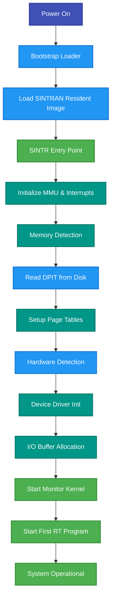
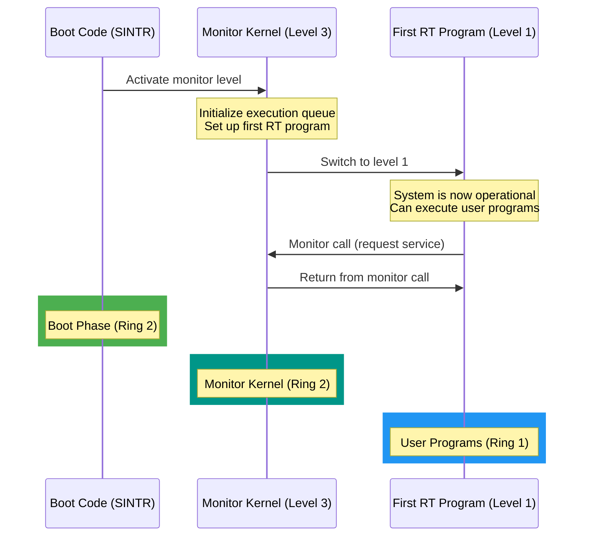
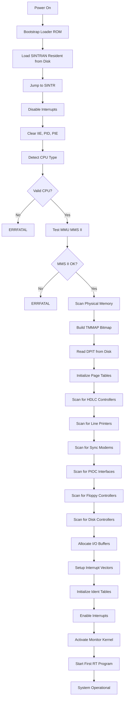
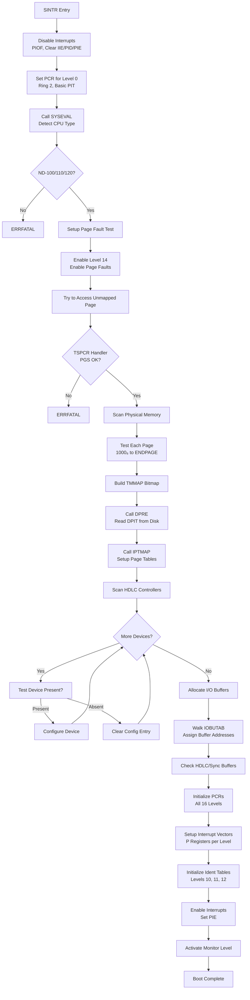
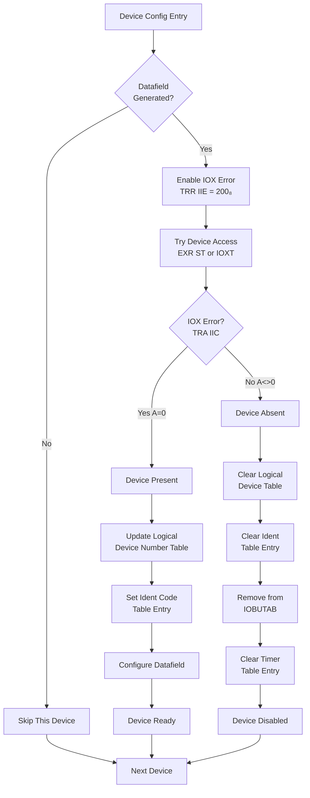

# SINTRAN III Boot Sequence Analysis

**Complete Boot Process from Power-On to First User Program**

**Version:** 1.0  
**Last Updated:** October 16, 2025  
**Primary Source Files:**
- `PH-P2-OPPSTART.NPL` (SINTR routine)
- `PH-P2-RESTART.NPL` (Power fail and restart)
- `PH-P2-START-BASE.NPL` (Memory allocation tables)
- `PH-P2-CONFG-TAB.NPL` (Configuration tables)

---

## Table of Contents

1. [Boot Overview](#1-boot-overview)
2. [Pre-Boot Bootstrap](#2-pre-boot-bootstrap)
3. [SINTR - Main System Initialization](#3-sintr---main-system-initialization)
4. [Memory Detection and Mapping](#4-memory-detection-and-mapping)
5. [Device Detection and Initialization](#5-device-detection-and-initialization)
6. [I/O Buffer Allocation](#6-io-buffer-allocation)
7. [Interrupt System Setup](#7-interrupt-system-setup)
8. [Page Table Initialization](#8-page-table-initialization)
9. [Post-Boot Transition](#9-post-boot-transition)
10. [Boot Sequence Diagrams](#10-boot-sequence-diagrams)

---

## 1. Boot Overview

### 1.1 Boot Phases

The SINTRAN III boot process consists of several distinct phases:



### 1.2 Boot Entry Points

| Entry Point | Location | Purpose |
|-------------|----------|---------|
| **Bootstrap** | ROM/Disk Block 0 | Minimal loader, loads resident image from disk |
| **SINTR** | `PH-P2-OPPSTART.NPL` line 292 | Main system initialization routine |
| **PWFAIL** | `PH-P2-RESTART.NPL` | Power fail handler |
| **RESTART** | `PH-P2-RESTART.NPL` | System restart after power fail |
| **SETPTABL** | `PH-P2-RESTART.NPL` | Set up page index tables during restart |

### 1.3 Boot Goals

By the end of the boot sequence, SINTRAN has:

1. ✓ Detected all physical memory
2. ✓ Configured MMU (all 4 page index tables)
3. ✓ Set up interrupt vectors for all 16 levels
4. ✓ Detected and initialized all hardware devices
5. ✓ Allocated I/O buffers
6. ✓ Created kernel data structures (queues, tables)
7. ✓ Started the monitor kernel
8. ✓ Ready to execute RT programs

---

## 2. Pre-Boot Bootstrap

### 2.1 Bootstrap Loader

The bootstrap loader is stored in ROM or disk block 0. Its sole purpose is to load the SINTRAN resident image into memory.

**Minimal bootstrap responsibilities:**
1. Initialize basic hardware (memory controller, disk controller)
2. Read SINTRAN resident image from known disk location
3. Jump to SINTR entry point

**Disk layout for boot (from disk block 0):**

| Disk Block | Content |
|------------|---------|
| 0 | Bootstrap loader |
| 1-63 | SINTRAN resident image |
| 64+ | System segments, data files |

### 2.2 Main Swapping Disk Table

The system needs to know which disk device to use for swapping. This is defined in the **MDISCS** table:

```npl
% From PH-P2-OPPSTART.NPL, lines 22-32
INTEGER ARRAY MDISCS:=(
        0,    0,    0,    0,    0,    0,    0,    0,   % 00 - 07
    WWDIS,WWDIS,WWDIS,WWDIS,WWDIS,WWDIS,    0,BBDIS,   % 10 - 17
    BBDIS,BBDIS,BBDIS,BBDIS,BBDIS,BBDIS,BBDIS,BBDIS,   % 20 - 27
    BBDIS,BBDIS,BBDIS,BBDIS,BBDIS,BBDIS,SCDIS,    0,   % 30 - 37
        0,    0,    0,    0,    0,    0,    0,    0);  % 40 - 47

INTEGER ARRAY WWDIS:=(WIGDI,1224,ZWDIS,WIDIS,   500);  % ST-506
INTEGER ARRAY BBDIS:=(BIGDI,1100,ZBDIS,BDISK,  1540);  % SMD
INTEGER ARRAY SCDIS:=(SCDI1,2210,SCSWD,SCSWD,144300);  % SCSI
```

**Each entry contains 5 words:**

| Offset | Field | Description |
|--------|-------|-------------|
| 0 | SWDDFIELD | Address of datafield |
| 1 | SWDLOGNO | Logical device number |
| 2 | SWDSWDRIVER | Boot-time swap driver address |
| 3 | SWDDRIVER | Runtime driver address |
| 4 | SWHDEV | Hardware device number for controller |

**Device types:**
- **ST-506**: Winchester disk (e.g., 30MB drives)
- **SMD**: Storage Module Device (e.g., 80MB, 300MB drives)
- **SCSI**: SCSI interface devices

---

## 3. SINTR - Main System Initialization

### 3.1 SINTR Entry Point

```npl
% From PH-P2-OPPSTART.NPL, line 292
SINTR: A:=0; *PIOF; TRR IIE; TRA IIC
       A:=0; *TRR PID; TRR PIE
       A:=6; *TRR PCR; SEX; TRA PGS; TRA STS
       IF A NBIT 5N100 THEN CALL ERRFATAL FI % THIS SYSTEM IS ONLY FOR NORD 100!!!!
       A:="LV0"; *IRW 0 DP; ION
```

**Initial steps:**

1. **Disable all interrupts** (`*PIOF` - Power-Off Interrupt)
2. **Clear interrupt enable register** (`TRR IIE` - Transfer to/from IIE)
3. **Clear internal interrupt code** (`TRA IIC`)
4. **Clear PID and PIE** - No pending/enabled interrupts
5. **Set PCR for level 0** to ring 2, using basic page tables
6. **Verify CPU type** - Must be NORD-100 or higher
7. **Re-enable interrupts** (`ION`)

### 3.2 CPU Type Detection

```npl
% Lines 311-322
CALL SYSEVAL                         % Find CPU type
IF HWINFO(0)/\377 >= 3 THEN 
    CALL GCPUNR                     % Try to get CPU number (multi-CPU)
FI
IF HWINFO(0)/\377 <  2 THEN 
    CALL ERRFATAL                   % Must be ND-100/CX, ND-110/CX, or ND-120/CX
FI
IF HWINFO(0) SHZ -10=4 OR =5 THEN
    13642=:CPULOOPTIME              % CPU loop time for ND-110
    -15=:LPDELAY
ELSE
    IF A=6 OR =7 THEN
        27627=:CPULOOPTIME          % CPU loop time for ND-120
        -30=:LPDELAY
    FI
FI
```

**CPU types detected:**
- **ND-100/CX** (HWINFO(0)/\377 = 2)
- **ND-110/CX** (HWINFO(0)/\377 = 4 or 5)
- **ND-120/CX** (HWINFO(0)/\377 = 6 or 7)

**CPULOOPTIME:** Used for timing calculations and delays.

### 3.3 Test for MMS II (Memory Management System)

```npl
% Lines 302-309
% Test if this ND-100 has MMS II with 10 bits page number in PGS
A:=LV14; *TRR PIE                    % Enable interrupt on level 14
A:=10; *TRR IIE                      % Enable for page fault
A:="TSPCR"; *IRW LV14B DP
A:="ADTPIT+ERNG2"; *TRR PCR          % Level 0: NPIT=0, APIT=DTPIT, RING=2
A:="ERNG2+LV14B"; *TRR PCR           % Level 14: NPIT=APIT=0, RING=2
X:=-1; *PION; 2BANK
X.S0; CALL ERRFATAL                  % Level 14 should increment P on level 0
```

**Test procedure:**

1. Set up special page fault handler on level 14 (`TSPCR`)
2. Enable page faults
3. Try to access an unmapped page
4. Handler checks if PGS register has 10-bit page numbers (MMS II)
5. If test fails → ERRFATAL (system requires MMS II)

**TSPCR handler:**

```npl
% Lines 214-220
TSPCR: *TRA IIC
       IF A><3 THEN CALL ERRFATAL FI                 % Not page fault
       *TRA PGS
       IF A/\1777><1777 THEN CALL ERRFATAL FI        % Not MMS II?
       *IRR 0 DP; AAA 1; IRW 0 DP                    % Increment P-reg on level 0
       *WAIT; JMP *-1
```

This verifies that:
- Page faults work correctly
- PGS register has extended format (10-bit page numbers)
- The memory management unit is functioning

---

## 4. Memory Detection and Mapping

### 4.1 Physical Memory Scan

SINTRAN scans physical memory to determine what's installed:

```npl
% Lines 328-363
1000=:CURRPAGE                       % Start at page 1000₈ (512KB)
% Test if multiport memory, set ENDPAGE accordingly
A:=200; *TRR IIE; TRA IIC; IOX 750; TRA IIC
IF A=0 THEN A:=3777 ELSE A:=37777 FI; A=:ENDPAGE

DO WHILE CURRPAGE><ENDPAGE+1
    % Skip pages used by NINITPAGE table (reserved areas)
    X:=0
    DO WHILE X<<"NINSZ+1*2"
        *1BANK
        AD:=NINITPAGE(X)
        *2BANK
        IF A><0 AND A<<=CURRPAGE AND D>>=T GO NEXT
        X+2
    OD
    
    % Test if page exists and is not wrapped-around memory
    *POF
    X:=0; 124000=:X.S0               % Write test pattern to page 0
    *PON
    A:=CURRPAGE=:D:=162000; X:=177776
    *POF; STD ,X; PON                % Map CURRPAGE to logical address
    
    A:=1000; *TRR IIE; TRA IIC       % Enable for memory out of range
    X:=176000; X.S0; *TRA IIC        % Try to read page
    IF A=0 THEN                      % Memory out of range?
        *PON                          % No, test for wrap-around
        A:=X.S0=:D:=-1=:X.S0; *POF
        X:=0
        IF X.S0=124000 THEN          % Test if phys. addr 0 changed
            A:=D; X:=176000; *PON
            A=:X.S0; *TRA IIC
        ELSE
            124000=:X.S0; *PON
            CURRPAGE-1=:ENDPAGE
            GO LABL1
        FI
    FI
NEXT: CURRPAGE SH 1=:CURRPAGE        % Next power-of-2 page
OD
```

**Memory detection algorithm:**

1. Start at page 1000₈ (512KB)
2. Skip reserved areas (from NINITPAGE table)
3. For each candidate page:
   - Write test pattern to physical page 0
   - Map candidate page into logical address space
   - Try to read from mapped location
   - Check if read causes "memory out of range" error
   - Check for memory wrap-around (does writing to high memory affect page 0?)
4. Build **TMMAP** bitmap of existing memory pages

### 4.2 Memory Map Bitmap

```npl
% Lines 369-378
FOR X:=0 TO 17 DO; 0=:TMMAP(X); OD
A:=0=:LPHYSPAGE

DO WHILE A<<=ENDPAGE
    CALL PHYSPTEST; GO NOTEXIST; A=:CURRPAGE
    IF A/\67=0 THEN
        CURRPAGE SHZ -6; AD SHZ -4; A=:X    % X=Index in bitmap array TMMAP
        AD SH 4; A/\17 SHZ 3 +CCTBSET
        T:=TMMAP(X); *EXR SA
        T=:TMMAP(X)
    FI
    CURRPAGE+37=:LPHYSPAGE; A+1
OD
```

**TMMAP structure:**
- Array of 20₈ (18 decimal) words
- Each word contains 16 bits
- Each bit represents a **32K memory bank** (32 pages)
- Total capacity: 18 × 16 × 32 = 9,216 pages = 18MB (though hardware limit is usually lower)

**Example:** If bit 5 of TMMAP[2] is set, memory bank (2×16+5) = 37₈ exists.

### 4.3 Physical Memory Layout Tables

Physical page allocation tracking (from `PH-P2-START-BASE.NPL`):

```npl
% Lines 29-131
DOUBLE MMDPAGE(0)
INTEGER MMFPAGE:=-1              % First page of memory map
INTEGER MMLPAGE:=-1              % Last page of memory map

DOUBLE DBDPAGE(0)
INTEGER DBFPAGE:=-1              % First page used as device buffer
INTEGER DBLPAGE:=-1              % Last page used as device buffer

DOUBLE DLAMPAGE(0)
INTEGER FLAMPAGE:=-1             % First physical page for LAMU tables
INTEGER LLAMPAGE:=-1             % Last physical page for LAMU tables

% ... many more page range variables ...

INTEGER RPIFPHPAGE:=-1           % First physical page used by RPIT
INTEGER RPILPHPAGE:=-1           % Last physical page used by RPIT

INTEGER MPIFPHPAGE:=-1           % First physical page used by MPIT
INTEGER MPILPHPAGE:=-1           % Last physical page used by MPIT

INTEGER IPIFPHPAGE:=-1           % First physical page used by IPIT
INTEGER IPILPHPAGE:=-1           % Last physical page used by IPIT
```

**All physical memory allocations** are tracked in pairs (first page, last page). Value -1 means "not allocated."

---

## 5. Device Detection and Initialization

### 5.1 Device Detection Overview

After memory is configured, SINTRAN scans for installed hardware devices. The boot code checks for:

1. **HDLC communication controllers**
2. **Line printers**
3. **Sync modems**
4. **PIOC (Programmed I/O Controllers)**
5. **Floppy disk controllers**
6. **Mag tape controllers**
7. **SCSI controllers**
8. **Winchester/SMD disk controllers**

### 5.2 HDLC Controller Detection

```npl
% Lines 393-450 (simplified)
"0HDTA"=:CSVXX                            % Start of HDLC config table
DO WHILE X:=CSVXX>>="0HDEN"               % Until end marker
    *1BANK
    IF X.NHDLC=0 AND X.SYNHDLC=0 GO NXHDLC % Datafields don't exist
    
    A:=200; *TRR IIE; TRA IIC; 2BANK
    T:=D.HDEV+RRTS; *EXR ST; TRA IIC; 1BANK
    IF A=0 THEN                           % Interface is present
        IF CSVXX.HDLCSELECTION=1 THEN     % Normal HDLC
            % Set up logical device number table
            % Configure datafield pointers
            % Set ident code table
        ELSE                               % HDLC sync mode
            % Configure for synchronous operation
        FI
    ELSE
        % Interface not present, clear table entries
    FI
NXHDLC: CSVXX+TBLHDLCSIZE=:CSVXX
OD
```

**Detection method:**
1. Iterate through HDLC configuration table
2. For each entry, try to read status from hardware (`*EXR ST`)
3. If read succeeds (A=0), interface exists
4. Configure logical device number table and ident code table
5. If interface doesn't exist, clear all references

### 5.3 Line Printer Detection

```npl
% Lines 455-478
"0LPTA"=:CSVXY; *1BANK
DO WHILE CSVXY.LPSELECTION><-1            % -1: end of table
    IF A=0 OR A>>3 THEN
        1=:X.LPCLENTRY; GO NXLPENTRY      % Illegal selection
    FI
    
    A-1+"LPIODF"; X+A
    IF X.LPIODF=0 OR X.XLPDMDF=0 THEN     % Datafield(s) not generated
        1=:CSVXY.LPCLENTRY; GO NXLPENTRY
    FI
    
    *2BANK
    T:=A.HDEV+2; A:=200; *TRR IIE; TRA IIC; 1BANK
    IF CSVXY.LPSELECTION-2=0 THEN
        *EXR ST
    ELSE
        *IOXT
    FI
    *TRA IIC
    IF A><0 THEN 1=:X.LPCLENTRY FI        % Interface not present
    
NXLPENTRY:
    IF CSVXY.LPSELECTION><3 OR X.LPCLENTRY><0 THEN
        % Remove from IOBUTAB if not usable
    FI
    CSVXY+LPTBSIZE=:CSVXY
OD
```

**Line printer types detected:**
- **Selection 1:** Standard parallel printer
- **Selection 2:** Serial printer (EXR ST - Execute Read Status)
- **Selection 3:** Other types (IOXT - IOX Test)

### 5.4 PIOC Interface Detection

```npl
% Lines 593-623
0=:CSAVX; A:=200; *TRR IIE; TRA IIC        % Enable for IOX-error
DO
    AD:=PIOCS(CSAVX)
WHILE A><-1
    IF A><0 THEN
        AD=:XAD
        T:=A.HDEV; *IOXT; TRA IIC; 1
        IF A=0 THEN                        % PIOC present
            *PION
            A:=77; T:=X.HDEV; *IOXT
            *PIOF; TRA PGS
            A:=A SH -12+1=:X.PIMPG         % Update PIOC size in datafield
        ELSE                               % PIOC not present
            AD:=XAD; A/\77=:D; X=:T
            A:=LOGDBANK; *POF; STZTX 10; PON % Clear log unit table
        FI
    FI
    CSAVX+2=:CSAVX
OD
```

**PIOC detection:**
- PIOC interfaces are programmed I/O controllers for flexible I/O
- Detection uses IOX Test instruction (`*IOXT`)
- If present, determines memory size by reading PGS after addressing end
- Updates `PIMPG` field in datafield with actual size

### 5.5 Floppy Disk Controller Detection

```npl
% Lines 125-151 from PH-P2-OPPSTART.NPL
FINDFLOPPY: X=:CSAVX                              % X=addr of floppy array
       0=:1CLTIMER=:2CLTIMER
       A:=L=:"FFLLREG"
       IF X.S0><0 OR X.S1><0 THEN                % Any floppy controller generated?
          X:=A; A:=200; *TRR IIE; TRA IIC        % Enable for IOX-errors
          T:=X.HDEV+2; *EXR ST                   % IOX read status
          A=:D; *TRA IIC                         % D=floppy status
          IF A=0 THEN                            % Interface present
             IF D<0 THEN
                CSAVX.S1; T:=X.S0                % New floppy
             ELSE
                CSAVX.S0; T:=X.S1                % Old floppy
             FI
             T=:1CLTIMER                         % Entry to be removed from timer table
          ELSE
             CSAVX.S0=:1CLTIMER; X.S1=:2CLTIMER
             A:=0                                % Interface not present
          FI
          % Update logical device number table and ident code table
       FI
       GO FFLLREG
```

**Floppy types:**
- **Old floppy:** 8-inch single-density
- **New floppy:** 5.25-inch or 8-inch double-density

Detection distinguishes between types by reading status register.

### 5.6 Device Configuration Tables

Configuration tables define all possible devices (from `PH-P2-CONFG-TAB.NPL` and `PH-P2-START-BASE.NPL`):

**PIOC table:**
```npl
DOUBLE ARRAY PIOCS:=(
    PIO01,1700, PIO02,1701, PIO03,1702, PIO04,1703,
    PIO05,1704, PIO06,1705, PIO07,1706, PIO08,1707,
    PIO09,1710, PIO10,1711, PIO11,1712, PIO12,1713,
    PIO13,1714, PIO14,1715, PIO15,1716, PIO16,1717,
    ETRN1,2240, ETRN2,2241, ETRN3,2242, ETRN4,2243,
    -1);
```

**Big disk table:**
```npl
INTEGER ARRAY BDISTABLE:=(
    BIGDI,1100,17,    BIGD2,1207,20,
    BIGD3, 565, 2,    BIGD4, 566, 6,
    -1);
```

**X.21 communication table:**
```npl
INTEGER ARRAY CX21TABLE:=(
    X21F1, 1374,
    X21F2, 1375,
    ...
    -1);
```

All tables end with -1 sentinel value.

---

## 6. I/O Buffer Allocation

### 6.1 Buffer Area Location

The I/O buffer area must be:
1. **Contiguous** in physical memory (for DMA)
2. **Properly aligned** (page boundary)
3. **Accessible** from page tables (RPIT, MPIT)

```npl
% Lines 509-528
LABL2: IF FSDRP(2)>>FSDMP(X) THEN A=:ASCBUF ELSE T=:ASCBUF FI
       A:=ASCBUF+1777 SHZ -12 SH 12=:ASCBUF=:CBUF  % Align to page
       
       0=:0CINX; X:=XIOBUTAB
       DO
           *POF; LDD ,X; PON
       WHILE A><-1
           IF A><0 AND A><276 THEN               % Skip error dev no 276
              IF A NBIT BIHDLC AND A NBIT BISYMOD THEN
                  A:=D/\77777+CBUF
                  IF C THEN CALL ERRFATAL FI      % Buffer cross bank boundary
                  A=:CBUF
              ELSE
                  % Handle HDLC buffers (may be large)
              FI
           FI
           X+2
       OD
```

**Buffer allocation strategy:**
1. Start with base address (ASCBUF)
2. Round up to page boundary
3. Walk through IOBUTAB (I/O buffer table)
4. For each device:
   - Calculate buffer size needed
   - Allocate at current CBUF pointer
   - Advance CBUF by buffer size
5. Ensure no buffer crosses memory bank boundary (would break DMA)

### 6.2 Special Buffer Handling

**HDLC buffers:**
- Can be very large (>2000₈ words for synchronous mode)
- Stored in separate tracking array (ZHDLCSIZE)
- Must be contiguous for DMA operations

```npl
% Lines 554-570
0=:CHDLCF=:BUSYMOD
X:=XIOBUTAB
DO
    *POF; LDD ,X; PON
WHILE A><-1
    IF A BIT BIHDLC THEN
        IF A:=D/\77777<<2000 THEN
            A+CHDLCF=:CHDLCF
            IF C THEN CALL ERRFATAL FI       % Buffer exceed memory bank
        FI
        GO NXT
    FI
    IF A BIT BISYMOD THEN
        A:=D/\77777+BUSYMOD=:BUSYMOD
        IF C THEN CALL ERRFATAL FI          % Buffer exceed memory bank
    FI
NXT: X+2
OD
```

**Sync modem buffers:**
- Also potentially large
- Tracked separately (BUSYMOD accumulator)
- Same bank-crossing check

### 6.3 Error Device Buffer

Special handling for error logging device:

```npl
% Lines 572-575
"99EBU"=:"IERRF".BUFST               % Error device buffer start
IF 2000 < X.MAX THEN
    A=:X.MAX=:X.CFREE
FI
```

The error device (logical number 500₈) gets a fixed buffer at `99EBU`.

### 6.4 Device Buffer Structure

Each device buffer entry in IOBUTAB:

| Word | Field | Description |
|------|-------|-------------|
| 0 | Flags/LogNo | Device flags and logical device number (packed) |
| 1 | BUFST | Buffer start address |
| 2+ | Device-specific | Controller-specific fields |

**Important flags:**
- **BIHDLC** (bit): HDLC device
- **BISYMOD** (bit): Synchronous modem
- **Bit 17**: Buffer size large/normal indicator

---

## 7. Interrupt System Setup

### 7.1 PCR (Paging Control Register) Initialization

Each interrupt level needs its PCR configured:

```npl
% From PH-P2-RESTART.NPL, lines 16-31
INTEGER ARRAY PCCS:=(
    NMPIT+ADPIT+ERNG2+000,      % Level 0
    NMPIT+ADPIT+ERNG2+ALEVB,    % Level 1 (RT programs)
    NMPIT+ADPIT+ERNG2+MLEVB,    % Level 2
    NIPIT+ADPIT+ERNG3+SLEVB,    % Level 3 (Monitor)
    NRPIT+ADPIT+ERNG2+BLEVB,    % Level 4 (INBT/OUTBT)
    NXPIT+ADPIT+ERNG2+50,       % Level 5
    64,                         % Level 6
    74,                         % Level 7
    104,                        % Level 8
    114,                        % Level 9
    NMPIT+ADPIT+ERNG2+LV10B,    % Level 10 (Output devices)
    NIPIT+ADPIT+ERNG2+LV11B,    % Level 11 (Mass storage)
    NMPIT+ADPIT+ERNG2+LV12B,    % Level 12 (Input devices)
    NMPIT+ADPIT+ERNG2+LV13B,    % Level 13 (Clock)
    NMPIT+ADPIT+ERNG2+LV14B,    % Level 14 (Internal interrupts)
    174);                       % Level 15
```

**PCR fields:**
- **NMPIT/NIPIT/NRPIT**: Normal PIT number (0-3)
- **ADPIT**: Alternative PIT (usually DPIT for drivers)
- **ERNG2/ERNG3**: Ring number (2 or 3)
- **LVxxB**: Entry point address for that level

### 7.2 Interrupt Vector Setup

The **P register** for each level must point to its entry routine:

```npl
% During boot, level entry points are loaded
A:=ENTRYPOINT; *IRW LEVEL DP        % Set P register for level
```

**Level entry points:**

| Level | Entry Point | Purpose |
|-------|-------------|---------|
| 0 | LV0 | Idle program |
| 1 | ALEVB | RT program level |
| 3 | MLEVB/SLEVB | Monitor kernel entry |
| 4 | BLEVB | INBT/OUTBT level |
| 10 | LV10B | Output device drivers |
| 11 | LV11B | Mass storage drivers |
| 12 | LV12B | Input device drivers |
| 13 | LV13B | Clock interrupt handler |
| 14 | LV14B/ENT14 | Internal interrupt handler |

### 7.3 Ident Code Tables

For levels 10-12, **ident code tables** map hardware ident codes to datafield addresses:

```npl
% Ident table structure (in IPIT, MPIT)
%  - Level 10: Output devices (ITB10)
%  - Level 11: Mass storage (ITB11)
%  - Level 12: Input devices (ITB12)

% Example: Level 11 ident table entry
ITB11 + (ident_code - 1) → datafield_address
```

**Purpose:** When a device interrupts with ident code N, the interrupt handler looks up ITB[N-1] to find the device's datafield address.

### 7.4 Timer Table

The **timer table** holds programs scheduled for future execution:

```npl
% Lines 130, 191
INTEGER TMRADDR              % Timer table start
INTEGER ETMRADDR             % Timer table end
```

Timer table entries removed during device scanning (for non-existent devices):

```npl
% Lines 102-113
RFTMTABLE:
    IF A><0 THEN
        A=:XA; "TMRTA"-"PITEX"=:X          % Table start address
        RPIFPHPAGE SHZ 12=:D; X+A
        "ETMRT"-"PITEX"; D+A               % End of table
        DO WHILE X<<D                      % Search through table
            T:=RPIBANK; *LDATX
            IF A-XA=0 THEN                 % Found matching entry?
                *STZTX                     % Clear it
                EXIT
            FI; X+1
        OD
    FI; EXIT
```

---

## 8. Page Table Initialization

### 8.1 Page Index Table Structure

NORD-10 has **4 page index tables** (PITs), each with 64 entries:

| PIT | Name | Usage | Location |
|-----|------|-------|----------|
| 0 | Basic PIT | SINTRAN resident, window pages | Always in fixed location |
| 1 | RPIT | RT programs, RTCOMMON | Allocated during boot |
| 2 | MPIT | Monitor pages, drivers | Allocated during boot |
| 3 | IPIT | I/O system pages | Allocated during boot |

**Additional PIT:**
- **DPIT**: Special PIT in bank 1, used for accessing POF area code/data

### 8.2 Reading DPIT from Disk

```npl
% Lines 257-287
DPRE: A:=L=:"L3RG"
      A:="ODDFI"=:B                           % Datafield for disk driver
      T:=ODISP(SWTYP)=:HTABL(0)               % Copy of DISPE on start segment
      T:=T.S0; A:=2000=:D:=0; *RDIV ST        % Sectors/page
      IF D><0 THEN CALL ERRFATAL FI
      A=:LSST
      X:=MDISCS(SWTYPE)                       % Addr of disc attributes
      X.SWHDEV=:HDEV
      
      DPAD=:MEMAD=:CMADR; T:=42; X:=1
LDF:  CALL PSWD; CALL ERRFATAL; GO LDF        % Initiate datafield
      
      DPAD=:MEMAD=:CMADR; A:=DPLN*LSST =:X   % Parameters to driver
      IF HENTFLAG=0 THEN A:=DPSA ELSE A:=DPIM FI
      A+SEGFSTART*LSST=:D:=0; 0=:T
RLOP: CALL PSWD; CALL ERRFATAL; GO RLOP
      GO L3RG
```

**DPIT read process:**
1. Set up disk datafield
2. Calculate sectors per page
3. Call swap driver (PSWD) to read DPIT
4. Load DPIT into memory bank 1 at address 4000₈
5. DPIT contains page table entries for POF area access

### 8.3 Page Table Setup (IPTMAP)

```npl
% Called from SINTR line 300
CALL IPTMAP                          % Set up the page tables
```

**IPTMAP function** (not shown in excerpts, but typical operations):

1. **Initialize PIT 0** (resident part):
   - Map pages 0-33₈ to physical pages 0-33₈ (identity mapping)
   - Set permissions (ring 2, read/write/execute)
   - Map kernel code and data

2. **Initialize PIT 1** (RPIT - RT programs):
   - Clear all entries initially
   - Map RTCOMMON at top of logical address space
   - Will be filled dynamically as programs run

3. **Initialize PIT 2** (MPIT - Monitor):
   - Map monitor kernel pages
   - Map driver pages (levels 10-13)
   - Map ident code tables

4. **Initialize PIT 3** (IPIT - I/O):
   - Map I/O driver pages
   - Map device datafields
   - Map I/O buffers

### 8.4 POF Area Mapping

The **POF (Paging Off) area** is special:

```
Physical Pages 40₈ - 77₈ (100000₈ - 177377₈)
```

This area is accessible:
1. **With paging ON**: Mapped through normal page tables
2. **With paging OFF**: Direct physical address access

**Why POF is needed:**
- Page fault handler code must be in POF (can't take page fault while handling page fault!)
- Critical system tables accessed during interrupts
- DMA buffer headers (hardware needs physical addresses)

---

## 9. Post-Boot Transition

### 9.1 Starting the Monitor Kernel

After all initialization:

1. **Enable all necessary interrupt levels**:
   ```npl
   A:=INTENABLE; *TRR PIE       % Enable levels 14,13,12,11,10,3,1
   ```

2. **Set up execution queue** (empty initially)

3. **Activate monitor level**:
   ```npl
   A:=MLEVB; *IRW 3 DP          % Monitor entry point
   BSET ONE 3 DA; *MST PID      % Activate level 3
   ```

4. **Start first RT program** (usually IDLE on level 1)

### 9.2 First Program Execution

The system transitions to normal operation:



### 9.3 System Operational State

At this point, SINTRAN is fully operational:

✓ All hardware detected and initialized  
✓ Memory management active  
✓ Interrupt system configured  
✓ I/O buffers allocated  
✓ Device drivers loaded  
✓ Monitor kernel running  
✓ Ready to execute user programs

---

## 10. Boot Sequence Diagrams

### 10.1 Complete Boot Flow



### 10.2 SINTR Execution Detail



### 10.3 Device Detection Pattern



### 10.4 Memory Map After Boot

```
Logical Address Space (64K per PIT)

PIT 0 (System):
┌────────────────────────────────────┐ 177777₈
│         Page Index Table 0         │
├────────────────────────────────────┤ 177400₈
│     (Accessible when POF=off)      │
├────────────────────────────────────┤ 177377₈
│                                    │
│      POF Area (mapped)             │
│                                    │
├────────────────────────────────────┤ 100000₈
│   Open File Tables (pages 34-35)  │
├────────────────────────────────────┤ 70000₈
│                                    │
│   SINTRAN Resident Part            │
│   - Kernel (0-2000)                │
│   - Time Handling (2000-4000)      │
│   - Segment Handling (4000-6000)   │
│   - I/O System (6000-10000)        │
│   - Error Recording (10000-12000)  │
│   - Background (12000-16000)       │
│   - Data Fields (20000-22000)      │
│   - RT Descriptions (26000-30000)  │
│   - Drivers (40000-56000)          │
│                                    │
└────────────────────────────────────┘ 0

PIT 1 (RPIT - RT Programs):
┌────────────────────────────────────┐ 177777₈
│         RT COMMON                  │
├────────────────────────────────────┤
│      (varies per program)          │
│                                    │
│     RT Program Segments            │
│     (loaded on demand)             │
│                                    │
└────────────────────────────────────┘ 0

PIT 2 (MPIT - Monitor):
┌────────────────────────────────────┐ 177777₈
│     Page Index Table 2             │
├────────────────────────────────────┤
│      Monitor Pages                 │
│      Driver Code (levels 10-13)    │
│      Ident Tables                  │
│      System Tables                 │
└────────────────────────────────────┘ 0

PIT 3 (IPIT - I/O):
┌────────────────────────────────────┐ 177777₈
│     Page Index Table 3             │
├────────────────────────────────────┤
│      I/O Driver Pages              │
│      Device Datafields             │
│      I/O Buffers                   │
└────────────────────────────────────┘ 0
```

---

## Summary

The SINTRAN III boot sequence is a carefully orchestrated series of steps:

1. **Bootstrap** loads resident image
2. **SINTR** initializes MMU and interrupts
3. **Memory detection** builds physical memory map
4. **DPIT loading** enables POF area access
5. **Page table setup** configures virtual memory
6. **Device scanning** detects all hardware
7. **Buffer allocation** sets up DMA-safe I/O buffers
8. **Interrupt configuration** enables all interrupt levels
9. **Monitor activation** starts the kernel
10. **First program** runs, system is operational

The boot code is defensive, checking for errors at each step and calling `ERRFATAL` if anything critical fails. This ensures the system only becomes operational if all essential components are working correctly.

---

## Appendix A: Key Symbols and Addresses

### Boot Routine Addresses

| Symbol | Value (Octal) | Description |
|--------|--------------|-------------|
| SINTR | See source | Main system initialization entry point |
| DPRE | 042445 | Read DPIT from disk |
| IPTMAP | (external) | Initialize page index tables |
| PHYSPTEST | (external) | Test if physical page exists |
| TSPCR | 042214 | Test MMU/PGS handler (level 14) |
| FINDFLOPPY | 041626 | Detect floppy disk controller |

### Important Tables

| Symbol | Description |
|--------|-------------|
| MDISCS | Main swapping disk table (5 words per entry) |
| TMMAP | Memory bitmap (18 words, 16 bits each) |
| PCCS | PCR values for all 16 interrupt levels |
| PIOCS | PIOC interface table |
| BDISTABLE | Big disk controller table |
| CX21TABLE | X.21 communication interface table |
| IOBUTAB | I/O buffer table |

### Physical Page Ranges

| Symbol Prefix | Description |
|--------------|-------------|
| xxFPHPAGE | First physical page of subsystem |
| xxLPHPAGE | Last physical page of subsystem |
| xxDPHPAGE | Double word (first, last) |

Examples:
- RPIFPHPAGE, RPILPHPAGE → RPIT pages
- MPIFPHPAGE, MPILPHPAGE → MPIT pages
- HDLCFPHPAGE, HDLCLPHPAGE → HDLC buffer pages

---

**Document Status:** Phase 2 Complete - Boot Sequence Fully Documented

**Next:** Phase 3 - Interrupt Handling Deep-Dive (02-INTERRUPT-HANDLING.md)

---

*End of Boot Sequence Documentation*

