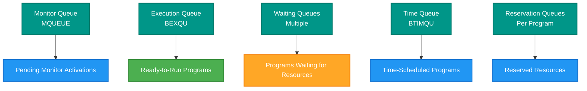
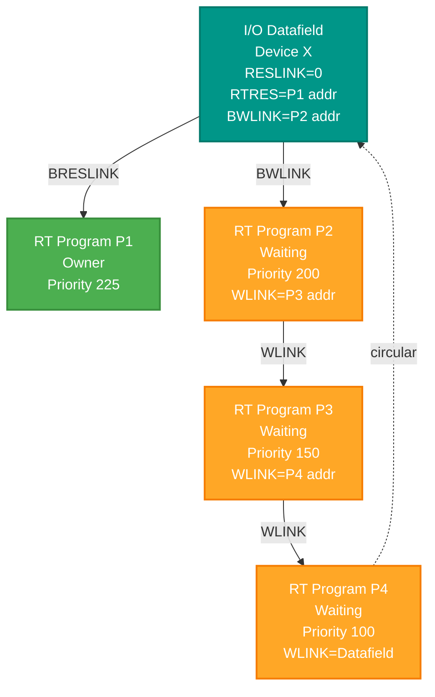
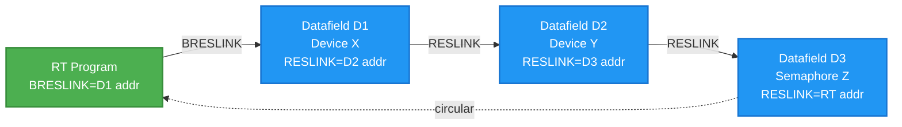
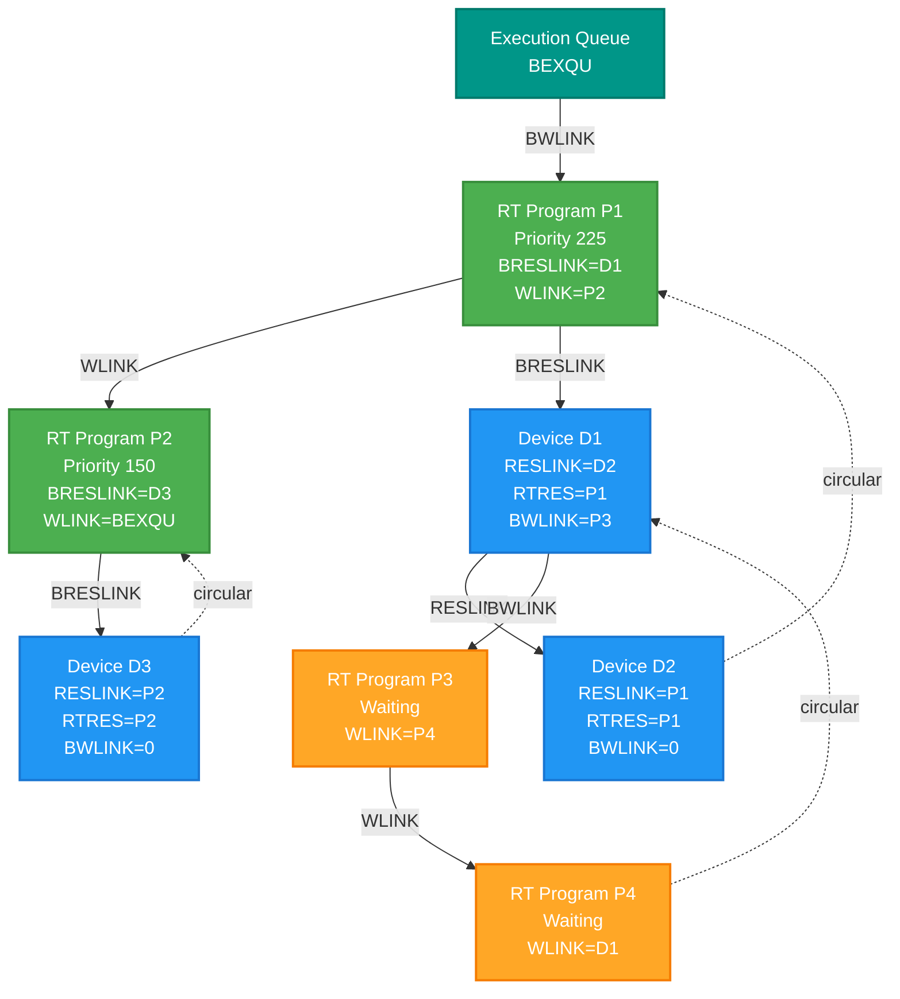

# SINTRAN III Queue Structures - Complete Reference

**Understanding All Queue Types, Link Fields, and Traversal Methods**

**Version:** 1.0  
**Last Updated:** October 16, 2025  
**Purpose:** Complete reference for understanding SINTRAN queue structures, link pointers, and how to trace active processes

---

## Table of Contents

1. [Overview of Queue Architecture](#1-overview-of-queue-architecture)
2. [I/O Datafield (Device Control Block) Complete Structure](#2-io-datafield-device-control-block-complete-structure)
3. [RT-Description (Program Control Block) Complete Structure](#3-rt-description-program-control-block-complete-structure)
4. [Monitor Queue Details](#4-monitor-queue-details)
5. [Execution Queue Details](#5-execution-queue-details)
6. [Waiting Queues Details](#6-waiting-queues-details)
7. [Time Queue Details](#7-time-queue-details)
8. [Reservation Queues Details](#8-reservation-queues-details)
9. [Finding Queue Heads](#9-finding-queue-heads)
10. [Queue Traversal Algorithms](#10-queue-traversal-algorithms)
11. [Complete Memory Map of Key Structures](#11-complete-memory-map-of-key-structures)

---

## 1. Overview of Queue Architecture

### 1.1 Queue Types in SINTRAN

SINTRAN III uses **seven interconnected queue types**:



### 1.2 Link Field Summary

| Link Field | Used In | Purpose | Queue Type |
|------------|---------|---------|------------|
| **MLINK** | I/O Datafield | Link to next in monitor queue | Monitor Queue |
| **WLINK** | RT-Description | Link to next in execution/waiting queue | Execution & Waiting Queues |
| **TLINK** | RT-Description | Link to next in time queue | Time Queue |
| **RESLINK** | I/O Datafield | Link to next reserved resource | Reservation Queue |
| **BRESLINK** | RT-Description | Link to first reserved resource | Reservation Queue (head) |
| **BWLINK** | I/O Datafield | Points to first waiter for this resource | Waiting Queue (head) |
| **RTRES** | I/O Datafield | Points to program that reserved this | Resource ownership |

### 1.3 Data Structure Types

SINTRAN uses **two primary data structure types** for queues:

1. **I/O Datafield** (Device Control Block / DCB)
   - Represents devices, resources, semaphores
   - Variable size (minimum ~200₈ words for mass storage, ~10₈ for simple devices)
   - Contains MLINK, RESLINK, RTRES, BWLINK fields

2. **RT-Description** (Program Control Block / PCB)
   - Represents RT programs
   - Fixed size: 26₁₀ (32₈) words
   - Contains WLINK, TLINK, BRESLINK fields

---

## 2. I/O Datafield (Device Control Block) Complete Structure

### 2.1 Standard Locations (All Devices)

Every I/O datafield has these standard locations:

```
Offset (Octal)  Field Name    Size    Description
─────────────────────────────────────────────────────────────────
    0           RESLINK       1       Link to next resource in reservation queue
                                      = 0 if resource is free
                                      = address of next datafield if in reservation queue
                                      
    1           RTRES         1       RT program that reserved this resource
                                      = 0 if resource is free
                                      = address of RT-description if reserved
                                      
    2           BWLINK        1       Beginning of waiting queue link
                                      = 0 if no programs waiting
                                      = address of first RT-description in waiting queue
                                      
    3           SEMAPHORE     1       Semaphore control word
                                      Bit 0: Reserved flag
                                      Bits 1-15: Reserved count or state
                                      
    4           STATUS        1       Device status word
                                      Device-dependent status flags
                                      
    5           MLINK         1       Monitor queue link
                                      = -1 if first element in monitor queue
                                      = 0 if not in monitor queue
                                      = address of next datafield if in queue
                                      
    6           MFUNC         1       Monitor function address
                                      = address of routine to execute when
                                        this datafield is processed from monitor queue
                                      
    7           DEVICE_TYPE   1       Device type code
                                      Identifies what kind of device this is
                                      
    10          HDEV          1       Hardware device number
                                      IOX address for this device
                                      
    11          IDENT         1       Ident code
                                      Used for interrupt identification
                                      
    12+         BUFST         1       Buffer start address (character devices)
    13+         MAX           1       Maximum buffer size
    14+         CFREE         1       Current free space in buffer
    15+         ...           ...     Device-specific fields
```

### 2.2 Mass Storage Device Datafield (~200₈ words)

Additional fields for disk/drum devices:

```
Offset (Octal)  Field Name    Size    Description
─────────────────────────────────────────────────────────────────
    20          SECTORS       1       Sectors per track
    21          CYLINDERS     1       Number of cylinders
    22          HEADS         1       Number of heads/surfaces
    23          SECSIZE       1       Sector size in words
    24          DISKTYPE      1       Disk controller type
    25          NWLBA         1       Address for spare track list (Winchester)
    30          DMABUF        2       DMA buffer address (double word)
    32          DMACOUNT      1       DMA transfer count
    33          DMASTATUS     1       DMA status flags
    ...
    100+        ERRTABLE      ~50     Error log table
    150+        PARAM         ~30     Device parameters
```

### 2.3 HDLC Communication Controller Datafield

```
Offset (Octal)  Field Name    Size    Description
─────────────────────────────────────────────────────────────────
    20          TXBUF         2       Transmit buffer address (double)
    22          RXBUF         2       Receive buffer address (double)
    24          TXCOUNT       1       Transmit byte count
    25          RXCOUNT       1       Receive byte count
    26          HDLCSTAT      1       HDLC status register mirror
    27          HDLCCTRL      1       HDLC control register settings
    30          PROTOCOLA     1       Protocol flags (LAPB, X.25, etc.)
    31          SEQNR         1       Sequence number (N(S))
    32          SEQNRRECEIVE  1       Receive sequence number (N(R))
    33          VSBIT         1       V(S) - Send state variable
    34          VRBIT         1       V(R) - Receive state variable
    35          VABIT         1       V(A) - Acknowledge state variable
    36          K             1       Window size
    37          N2            1       Maximum retries
    40          T1            1       Acknowledgment timer value
    41          T2            1       Response delay timer value
    42          T3            1       Idle timer value
    43          FRAMEQUEUE    1       Pointer to queued frames
    44          RETRYCOUNT    1       Current retry counter
    ...
```

### 2.4 Terminal Datafield

```
Offset (Octal)  Field Name    Size    Description
─────────────────────────────────────────────────────────────────
    12          BUFST         1       Input buffer start address
    13          MAX           1       Buffer size
    14          CFREE         1       Characters available
    15          INPTR         1       Input pointer
    16          OUTPTR        1       Output pointer
    17          ECHO          1       Echo flags
    20          SPEED         1       Baud rate setting
    21          PARITY        1       Parity setting
    22          DATABITS      1       Data bits (7 or 8)
    23          STOPBITS      1       Stop bits (1 or 2)
    24          FLOWCTRL      1       Flow control flags (XON/XOFF, RTS/CTS)
    25          TERMTYPE      1       Terminal type code
    26          ESCAPESEQ     1       Escape sequence buffer
```

### 2.5 Finding Datafield Type

```npl
% Example: Determining datafield type
A:=DATAFIELD+7              % Load DEVICE_TYPE field
IF A = DISKTYPE THEN
    % This is a disk device
ELSE IF A = HDLCTYPE THEN
    % This is HDLC controller
ELSE IF A = TERMTYPE THEN
    % This is a terminal
FI; FI
```

---

## 3. RT-Description (Program Control Block) Complete Structure

### 3.1 Complete Field Layout

```
Offset (Decimal)  Offset (Octal)  Field Name      Size    Description
──────────────────────────────────────────────────────────────────────────────
    0                0             TLNK            1       Time queue link
                                                           = 0 if not in time queue
                                                           = address of next RT-desc in time queue
                                                           
    1                1             STATE           1       Program state (packed with PRIORITY)
                                   PRIORITY                Bits 0-7: Priority (0-377₈)
                                                           Bit 8 (5WAIT): In waiting state
                                                           Bit 9 (5REP): Repeat execution requested
                                                           Bit 10 (5INT): Periodic program
                                                           Bit 11 (5ABS): Absolute time scheduling
                                                           Bit 12 (5RWAIT): Voluntarily waiting
                                                           Bit 13 (5RTOFF): RT program inhibited
                                                           Bits 14-15: Reserved
                                                           
    2                2             DTIM1           1       Scheduled time (high word)
    3                3             DTIM2           1       Scheduled time (low word)
                                                           Double-word time in basic time units
                                                           
    4                4             DTN1            1       Time interval (high word)
    5                5             DTN2            1       Time interval (low word)
                                                           For periodic programs: period in time units
                                                           
    6                6             STADR           1       Start address
                                                           Entry point when program starts
                                                           
    7                7             SEGM            1       Segment numbers (packed)
                                   SEGM2                   Bits 0-7: Primary segment number
                                                           Bits 8-15: Secondary segment number
                                                           
    8                10            DPREG           1       Saved P register
    9                11            DXREG           1       Saved X register
    10               12            DTREG           1       Saved T register
    11               13            DAREG           1       Saved A register
    12               14            DDREG           1       Saved D register
    13               15            DLREG           1       Saved L register
    14               16            DSREG           1       Saved status register
    15               17            DBREG           1       Saved B register
    
    16               20            WLNK            1       Waiting/execution queue link
                                                           = 0 if not in any waiting queue
                                                           = address of next RT-desc in queue
                                                           = address of BEXQU if last in exec queue
                                                           
    17               21            ACTSEG1         1       Active segment 1
    18               22            ACTSEG2         1       Active segment 2
                                                           Currently loaded segment numbers
                                                           
    19               23            ACTPRI          1       Actual priority
                                                           Modified priority during execution
                                                           Bit 0 (5RTOFF): RT inhibit flag
                                                           
    20               24            BRESLINK        1       Beginning of reservation queue
                                                           = 0 if no resources reserved
                                                           = address of first reserved datafield
                                                           
    21               25            RSEGM           1       Reserved segment info
                                                           Segment reservation data
                                                           
    22               26            BITMAP          1       Segment bitmap word 0
    23               27            BITM1           1       Segment bitmap word 1
    24               30            BITM2           1       Segment bitmap word 2
    25               31            BITM3           1       Segment bitmap word 3
                                                           Non-reentrant page indicators
                                                           Each bit = one page needs clearing
                                                           
    25               31            WINDOW          1       Window information
                                                           (Overlays BITM3 in some contexts)
                                                           Window page mapping data
```

### 3.2 STATE/PRIORITY Word Bit Definitions

```
Bit Position    Symbol      Meaning
────────────────────────────────────────────────────────────
 0-7            PRIORITY    Program priority (0-255 decimal, 0-377 octal)
                            Higher number = higher priority
                            
 8              5WAIT       Program is in waiting state
                            = 0: Program can run
                            = 1: Program is waiting for something
                            
 9              5REP        Repeat execution requested
                            = 0: Normal execution
                            = 1: Execute again after completion
                            
 10             5INT        Periodic program (interval execution)
                            = 0: Not periodic
                            = 1: Execute at regular intervals (DTN1/DTN2)
                            
 11             5ABS        Absolute time scheduling
                            = 0: Relative time (from now)
                            = 1: Absolute time (specific clock time)
                            
 12             5RWAIT      Voluntarily waiting (RTWT mon call)
                            = 0: Not voluntarily waiting
                            = 1: Program called RTWT to suspend itself
                            
 13             5RTOFF      RT program inhibited
                            = 0: Program allowed to run
                            = 1: Program inhibited (RTOFF mon call)
                            
 14-15          (Reserved)  Reserved for future use
```

### 3.3 Example: Reading RT-Description Fields

```npl
% Example: Accessing RT-description fields
X:=RTDESC                   % X points to RT-description

% Read state and priority
T:=X.TLNK                   % Time queue link
A:=X+1; *LDATX             % Load STATE/PRIORITY word
A/\377 =: PRIORITY         % Extract priority (bits 0-7)
A BIT 5WAIT               % Test if waiting
IF A THEN
    % Program is in waiting state
FI

% Read scheduling time
*DTIME@3 LDDTX             % Load double-word scheduled time
AD =: SCHEDULEDTIME        % Save to local variable

% Read saved registers
*DPREG@3 LDATX             % Saved P register
*DXREG@3 LDATX             % Saved X register
*DAREG@3 LDATX             % Saved A register

% Check reservation queue
*BRESLINK@3 LDATX
IF A><0 THEN
    % Program has reserved resources
    A =: FIRSTRESOURCE      % Address of first datafield in res queue
FI
```

---

## 4. Monitor Queue Details

### 4.1 Monitor Queue Structure

The **Monitor Queue** is a **FIFO queue** of pending monitor activations.

**Queue head:** `MQUEUE` (global variable in kernel data area)

**Element type:** I/O Datafields

**Link field:** `MLINK` (offset 5 in datafield)


### 4.2 MLINK States

| MLINK Value | Meaning |
|-------------|---------|
| `-1` | First element in queue (ready to process) |
| `0` | Not in monitor queue |
| `> 0` | Address of next datafield in queue |

### 4.3 Adding to Monitor Queue (RTCACT)

```npl
% Simplified RTCACT routine (from driver level)
% Entry: A = address of datafield
%        T = address of function to call (MFUNC)
RTCACT:
    A =: DATAFIELD
    T =: DATAFIELD+6           % Set MFUNC
    
    *IOF                       % Disable interrupts
    A:=MQUEUE                  % Get current queue head
    IF A=0 THEN                % Queue empty?
        -1 =: DATAFIELD+5      % Mark as first element
    ELSE
        A =: DATAFIELD+5       % Link to current last
    FI
    DATAFIELD =: MQUEUE        % New last element
    
    % Activate monitor level
    BSET ONE 3 DA; *MST PID
    *ION
    EXIT
```

### 4.4 Removing from Monitor Queue

```npl
% Monitor entry routine
MONENTRY:
    *IOF
    DO WHILE MQUEUE >< 0
        % Find first element (MLINK = -1)
        X:=MQUEUE
        DO
            PREVX:=X
            X+5=:T; *LDATX     % Load MLINK
        WHILE A >< -1
            A=:X               % Follow link
        OD
        
        % X now points to first element
        0 =: X+5               % Clear MLINK (remove from queue)
        
        % Update previous element's link
        IF X = MQUEUE THEN
            0 =: MQUEUE        % Queue now empty
        ELSE
            0 =: PREVX+5       % Previous now points to nothing
        FI
        
        % Call function
        X+6=:T; *LDATX         % Load MFUNC
        CALL (A)               % Execute monitor function
    OD
    *ION
    EXIT
```

### 4.5 Traversing Monitor Queue

```npl
% Walk through entire monitor queue
X:=MQUEUE
DO WHILE X >< 0
    % Process datafield at X
    CALL PROCESS_DATAFIELD
    
    % Follow link
    X+5=:T; *LDATX
    IF A = -1 THEN
        EXIT               % Reached first element
    FI
    A =: X                 % Next datafield
OD
```

---

## 5. Execution Queue Details

### 5.1 Execution Queue Structure

The **Execution Queue** contains RT programs ready to run, ordered by priority (highest first).

**Queue head:** `BEXQU` (global variable in kernel data area)

**Element type:** RT-Descriptions

**Link field:** `WLINK` (offset 20₈ = 16₁₀ in RT-description)


### 5.2 Execution Queue Properties

1. **Circular:** Last element's WLINK points back to BEXQU
2. **Priority-ordered:** Highest priority first
3. **Insertion rule:** New program inserted AFTER programs with ≥ priority, BEFORE programs with lower priority

### 5.3 Inserting into Execution Queue (TOEXQU)

```npl
% TOEXQU: Insert RT program into execution queue
% Entry: X = address of RT-description
TOEXQU:
    CPU =: RESOURCE            % CPU is the "resource" for exec queue
    CALL TOWQU                 % Use generic waiting queue insertion
    EXIT

% TOWQU: Insert into any waiting queue
% Entry: X = address of RT-description
%        RESOURCE = head element address
TOWQU:
    *IOF
    X =: RTDESC
    X+1=:T; *LDATX; A/\377 =: PRIORITY  % Get program priority
    
    % Find insertion point
    A:=RESOURCE
    DO
        PREVLINK =: A
        A+2=:T; *LDATX         % Get BWLINK (first in queue)
        IF A = 0 THEN          % Queue empty
            RTDESC =: RESOURCE+2   % Insert as first
            RESOURCE =: RTDESC+20  % Link back to head
            GO DONE
        FI
        A =: X                 % X = current element
        DO
            X+1=:T; *LDATX; A/\377 =: COMPRIO  % Get priority
            IF COMPRIO < PRIORITY THEN  % Found lower priority
                % Insert before this element
                X =: RTDESC+20         % New WLINK
                PREVLINK+20=:T; *LDATX % Get prev WLINK
                IF A = X THEN          % Prev pointed to current
                    RTDESC =: PREVLINK+20  % Update prev
                FI
                GO DONE
            FI
            PREVLINK =: X
            X+20=:T; *LDATX; A =: X    % Follow WLINK
        WHILE X >< RESOURCE
        OD
        % Reached end of queue (all have higher priority)
        RESOURCE =: RTDESC+20          % Point to head
        PREVLINK+20=:T; RTDESC =: (T)  % Insert at end
    OD
DONE:
    *ION
    EXIT
```

### 5.4 Removing from Execution Queue (FREXQU)

```npl
% FREXQU: Remove RT program from execution queue
% Entry: X = address of RT-description to remove
FREXQU:
    *IOF
    X =: RTDESC
    
    % Find program in queue
    A:=BEXQU+2=:T; *LDATX      % First in queue
    IF A = 0 THEN GO DONE FI   % Queue empty
    
    X =: PREV
    DO
        A =: X
        IF X = RTDESC THEN     % Found it
            % Get next element
            RTDESC+20=:T; *LDATX; A =: NEXT
            
            % Update previous element
            IF PREV = BEXQU THEN
                NEXT =: BEXQU+2    % Update head
            ELSE
                NEXT =: PREV+20    % Update previous WLINK
            FI
            
            0 =: RTDESC+20         % Clear our WLINK
            GO DONE
        FI
        PREV =: X
        X+20=:T; *LDATX; A =: X    % Follow WLINK
    WHILE X >< BEXQU
    OD
DONE:
    *ION
    EXIT
```

### 5.5 Traversing Execution Queue

```npl
% Walk execution queue from highest to lowest priority
A:=BEXQU+2=:T; *LDATX          % Get first program
IF A = 0 THEN EXIT FI          % Queue empty

X =: A
DO
    % Process RT-description at X
    CALL PROCESS_PROGRAM
    
    % Get priority for display
    X+1=:T; *LDATX; A/\377 =: PRIORITY
    
    % Follow WLINK
    X+20=:T; *LDATX; A =: X
WHILE X >< BEXQU              % Until back to head
```

---

## 6. Waiting Queues Details

### 6.1 Waiting Queue Structure

**Multiple waiting queues exist** - one per reserved resource.

**Queue head:** `BWLINK` field (offset 2) in the **resource's datafield**

**Element type:** RT-Descriptions

**Link field:** `WLINK` (offset 20₈ in RT-description)



### 6.2 Datafield Fields for Waiting Queue

| Offset | Field | Purpose |
|--------|-------|---------|
| 0 | RESLINK | Links this datafield in reservation queue |
| 1 | RTRES | Points to RT program that owns this resource |
| 2 | BWLINK | Points to first RT program waiting for this resource |

### 6.3 Reserving a Resource (RESRV)

```npl
% RESRV: Reserve a resource
% Entry: A = logical device number
%        D = read/write flag
%        T = wait flag (0=wait, 1=return immediately)
RESRV:
    CALL LOGPH                 % Convert logno to datafield address
    X =: DATAFIELD
    
    *IOF
    X+1=:T; *LDATX            % Load RTRES
    IF A = 0 THEN             % Resource free
        CALL BRESERVE          % Reserve it
        0 =: RETURNCODE        % Success
        GO DONE
    FI
    
    % Resource already reserved
    IF WAITFLAG = 0 THEN       % Should we wait?
        % Yes, put program in waiting queue
        CURRTPROG =: RTDESC
        DATAFIELD =: RESOURCE
        CALL FREXQU            % Remove from execution queue
        CALL TOWQU             % Add to waiting queue
        1 =: RETURNCODE        % Will wait
    ELSE
        2 =: RETURNCODE        % Resource busy, don't wait
    FI
    
DONE:
    *ION
    EXIT

% BRESERVE: Actually reserve a resource
% Entry: X = datafield address
BRESERVE:
    CURRTPROG =: X+1           % Set RTRES
    
    % Add to program's reservation queue
    CURRTPROG+24=:T; *LDATX    % Get BRESLINK
    A =: X+0                   % Set RESLINK
    X =: CURRTPROG+24          % Update BRESLINK
    EXIT
```

### 6.4 Releasing a Resource (RELES)

```npl
% RELES: Release a reserved resource
% Entry: A = logical device number
RELES:
    CALL LOGPH
    X =: DATAFIELD
    
    *IOF
    CALL BRELEASE              % Release the resource
    
    % Check if anyone is waiting
    X+2=:T; *LDATX            % Get BWLINK
    IF A >< 0 THEN            % Someone waiting
        A =: RTDESC
        
        % Remove from waiting queue
        RTDESC+20=:T; *LDATX; A =: NEXT
        NEXT =: DATAFIELD+2    % Update BWLINK
        0 =: RTDESC+20         % Clear WLINK
        
        % Reserve for this program
        RTDESC =: DATAFIELD+1  % Set RTRES
        
        % Add to execution queue
        RTDESC =: X
        CALL TOEXQU
    FI
    
    *ION
    EXIT

% BRELEASE: Remove resource from reservation queue
% Entry: X = datafield address
BRELEASE:
    X =: DATAFIELD
    0 =: X+1                   % Clear RTRES
    
    % Remove from reservation queue
    X+0=:T; *LDATX; A =: NEXT  % Get RESLINK
    
    % Find previous in reservation queue
    X+1=:T; *LDATX; A =: OWNER % Get owning program
    OWNER+24=:T; *LDATX        % Get BRESLINK
    DO WHILE A >< DATAFIELD
        PREV =: A
        A+0=:T; *LDATX         % Follow RESLINK
    OD
    
    % Update previous link
    IF PREV = OWNER+24 THEN
        NEXT =: OWNER+24       % Update BRESLINK
    ELSE
        NEXT =: PREV+0         % Update RESLINK
    FI
    
    0 =: DATAFIELD+0           % Clear RESLINK
    EXIT
```

---

## 7. Time Queue Details

### 7.1 Time Queue Structure

The **Time Queue** contains programs scheduled for future execution, ordered by scheduled time (earliest first).

**Queue head:** `BTIMQU` (global variable in kernel data area)

**Element type:** RT-Descriptions

**Link field:** `TLINK` (offset 0 in RT-description)


### 7.2 Time Queue Properties

1. **Linear:** Last element has TLINK = -1
2. **Time-ordered:** Earliest scheduled time first
3. **Scheduling:** DTIM1/DTIM2 (offsets 2-3) contains scheduled time

### 7.3 Inserting into Time Queue (TTIMQU)

```npl
% TTIMQU: Insert program into time queue
% Entry: X = address of RT-description
TTIMQU:
    *IOF
    X =: RTDESC
    
    % First remove if already in queue
    CALL FTIMQU
    
    % Get scheduled time
    RTDESC+2=:T; *LDDTX; AD =: SCHEDTIME
    
    % Find insertion point
    A:=BTIMQU
    PREVLINK =: BTIMQU - 1     % Special marker for head
    
    DO
        IF A = 0 THEN          % Queue empty
            RTDESC =: BTIMQU
            -1 =: RTDESC+0     % TLINK = -1
            GO DONE
        FI
        
        A =: X                 % Current element
        X+2=:T; *LDDTX         % Get DTIME
        
        % Compare times (double word)
        IF AD << AD THEN       % SCHEDTIME < DTIME
            % Insert before this element
            IF PREVLINK = BTIMQU-1 THEN
                RTDESC =: BTIMQU   % New head
            ELSE
                RTDESC =: PREVLINK+0  % Update prev TLINK
            FI
            X =: RTDESC+0      % Our TLINK
            GO DONE
        FI
        
        PREVLINK =: X
        X+0=:T; *LDATX; A =: A  % Follow TLINK
    WHILE A >< -1
    OD
    
    % Add at end
    -1 =: RTDESC+0
    RTDESC =: PREVLINK+0
    
DONE:
    *ION
    EXIT
```

### 7.4 Clock Interrupt Processing (ICLK)

```npl
% ICLK: Clock interrupt handler - check time queue
ICLK:
    % Update monitor time
    ATIME =: AD; AD+1 =: MTIME
    
    % Scan time queue
    X:=BTIMQU
    DO WHILE X >< 0
        X+2=:T; *LDDTX         % Get DTIME
        AD - MTIME             % Compare with current time
        IF A<0 OR (A=0 AND D<0) THEN  % DTIME > MTIME
            EXIT               % Not due yet (queue is time-ordered)
        FI
        
        % Program is due
        X =: RTDESC
        X+0=:T; *LDATX; A =: NEXT  % Get TLINK
        NEXT =: BTIMQU         % Remove from time queue
        
        % Enter into execution queue
        CALL RTENTRY
        
        X =: NEXT              % Continue with next
    OD
    EXIT
```

---

## 8. Reservation Queues Details

### 8.1 Reservation Queue Structure

Each **RT program in execution queue** may have its own reservation queue listing resources it has reserved.

**Queue head:** `BRESLINK` (offset 24₈ = 20₁₀ in RT-description)

**Element type:** I/O Datafields

**Link field:** `RESLINK` (offset 0 in datafield)



### 8.2 Complete Queue Interconnection



---

## 9. Finding Queue Heads

### 9.1 Queue Head Locations

All queue heads are **global variables** located in the kernel data area (first ~2000₈ words of physical memory).

| Queue | Head Variable | Typical Location (Octal) | Symbol File |
|-------|--------------|--------------------------|-------------|
| Monitor Queue | `MQUEUE` | ~0100 | SYMBOL-1-LIST |
| Execution Queue | `BEXQU` | ~0200 | SYMBOL-1-LIST |
| Time Queue | `BTIMQU` | ~0300 | SYMBOL-1-LIST |

### 9.2 Finding Queue Heads from C# Emulator

```csharp
// C# Example: Reading SINTRAN queue structures
public class SintranQueues
{
    private Memory memory;
    
    // Queue head addresses (from symbol file)
    private const ushort MQUEUE_ADDR  = 0x0040;  // Example address
    private const ushort BEXQU_ADDR   = 0x0080;  // Example address
    private const ushort BTIMQU_ADDR  = 0x00C0;  // Example address
    
    public List<Datafield> GetMonitorQueue()
    {
        var queue = new List<Datafield>();
        ushort current = memory.ReadWord(MQUEUE_ADDR);
        
        if (current == 0) return queue;  // Empty queue
        
        // Walk until we find MLINK = -1 (first element)
        var visited = new HashSet<ushort>();
        while (current != 0 && !visited.Contains(current))
        {
            visited.Add(current);
            var df = ReadDatafield(current);
            queue.Add(df);
            
            ushort mlink = memory.ReadWord((ushort)(current + 5));
            if (mlink == 0xFFFF) break;  // -1 in 16-bit
            current = mlink;
        }
        
        return queue;
    }
    
    public List<RtDescription> GetExecutionQueue()
    {
        var queue = new List<RtDescription>();
        ushort head = BEXQU_ADDR;
        ushort first = memory.ReadWord((ushort)(head + 2));  // BWLINK
        
        if (first == 0) return queue;  // Empty queue
        
        ushort current = first;
        do
        {
            var rtdesc = ReadRtDescription(current);
            queue.Add(rtdesc);
            
            ushort wlink = memory.ReadWord((ushort)(current + 16));  // Offset 20 octal = 16 decimal
            current = wlink;
        }
        while (current != head);  // Circular - stop when back at head
        
        return queue;
    }
    
    public List<RtDescription> GetTimeQueue()
    {
        var queue = new List<RtDescription>();
        ushort current = memory.ReadWord(BTIMQU_ADDR);
        
        while (current != 0 && current != 0xFFFF)
        {
            var rtdesc = ReadRtDescription(current);
            queue.Add(rtdesc);
            
            ushort tlink = memory.ReadWord(current);  // Offset 0
            if (tlink == 0xFFFF) break;  // -1
            current = tlink;
        }
        
        return queue;
    }
    
    private Datafield ReadDatafield(ushort addr)
    {
        return new Datafield
        {
            Address = addr,
            RESLINK = memory.ReadWord((ushort)(addr + 0)),
            RTRES = memory.ReadWord((ushort)(addr + 1)),
            BWLINK = memory.ReadWord((ushort)(addr + 2)),
            SEMAPHORE = memory.ReadWord((ushort)(addr + 3)),
            STATUS = memory.ReadWord((ushort)(addr + 4)),
            MLINK = memory.ReadWord((ushort)(addr + 5)),
            MFUNC = memory.ReadWord((ushort)(addr + 6)),
            DEVICE_TYPE = memory.ReadWord((ushort)(addr + 7)),
            HDEV = memory.ReadWord((ushort)(addr + 8)),  // Octal 10 = decimal 8
            IDENT = memory.ReadWord((ushort)(addr + 9))   // Octal 11 = decimal 9
        };
    }
    
    private RtDescription ReadRtDescription(ushort addr)
    {
        ushort statePri = memory.ReadWord((ushort)(addr + 1));
        
        return new RtDescription
        {
            Address = addr,
            TLNK = memory.ReadWord((ushort)(addr + 0)),
            Priority = (byte)(statePri & 0xFF),
            IsWaiting = (statePri & 0x0100) != 0,      // Bit 8
            RepeatRequested = (statePri & 0x0200) != 0, // Bit 9
            IsPeriodic = (statePri & 0x0400) != 0,      // Bit 10
            IsAbsoluteTime = (statePri & 0x0800) != 0,  // Bit 11
            VoluntarilyWaiting = (statePri & 0x1000) != 0, // Bit 12
            IsInhibited = (statePri & 0x2000) != 0,     // Bit 13
            DTIME = memory.ReadDoubleWord((ushort)(addr + 2)),
            DTINT = memory.ReadDoubleWord((ushort)(addr + 4)),
            STADR = memory.ReadWord((ushort)(addr + 6)),
            SavedP = memory.ReadWord((ushort)(addr + 8)),
            SavedX = memory.ReadWord((ushort)(addr + 9)),
            SavedT = memory.ReadWord((ushort)(addr + 10)),
            SavedA = memory.ReadWord((ushort)(addr + 11)),
            SavedD = memory.ReadWord((ushort)(addr + 12)),
            SavedL = memory.ReadWord((ushort)(addr + 13)),
            SavedSTS = memory.ReadWord((ushort)(addr + 14)),
            SavedB = memory.ReadWord((ushort)(addr + 15)),
            WLINK = memory.ReadWord((ushort)(addr + 16)),
            BRESLINK = memory.ReadWord((ushort)(addr + 20))
        };
    }
}
```

---

## 10. Queue Traversal Algorithms

### 10.1 Complete System State Snapshot

```npl
% Example: Get complete system state
SUBR GETSYSSTATE

GETSYSSTATE:
    % 1. Execution Queue (ready to run)
    CALL PRINTHEADER("EXECUTION QUEUE")
    A:=BEXQU+2=:T; *LDATX
    IF A><0 THEN
        X=:A
        DO
            CALL PRINT_RTDESC
            X+20=:T; *LDATX; A=:X
        WHILE X><BEXQU
        OD
    FI
    
    % 2. Time Queue (scheduled)
    CALL PRINTHEADER("TIME QUEUE")
    X:=BTIMQU
    DO WHILE X><0 AND X><-1
        CALL PRINT_RTDESC
        X+0=:T; *LDATX; A=:X
    OD
    
    % 3. All waiting queues (walk all datafields)
    CALL PRINTHEADER("WAITING QUEUES")
    % Walk through all device datafields
    X:="DATAFIELD_TABLE"
    DO WHILE X << "END_DATAFIELD_TABLE"
        X+2=:T; *LDATX         % Get BWLINK
        IF A><0 THEN           % Has waiters
            CALL PRINTHEADER("Waiting for device")
            CALL PRINT_DATAFIELD
            DO WHILE A><X      % While not circular back
                CALL PRINT_RTDESC
                A+20=:T; *LDATX; A=:A  % Follow WLINK
            OD
        FI
        X+"DATAFIELD_SIZE"=:X
    OD
    
    EXIT

PRINT_RTDESC:
    % X = address of RT-description
    X+1=:T; *LDATX; A/\377=:PRIORITY
    X+6=:T; *LDATX; A=:STADR
    CALL PRINTF("RT-DESC at %o: Priority=%d, Start=%o", X, PRIORITY, STADR)
    
    % Show state flags
    X+1=:T; *LDATX
    IF A BIT 5WAIT THEN CALL PRINTF(" [WAITING]") FI
    IF A BIT 5REP THEN CALL PRINTF(" [REPEAT]") FI
    IF A BIT 5INT THEN CALL PRINTF(" [PERIODIC]") FI
    
    % Show reserved resources
    X+24=:T; *LDATX            % Get BRESLINK
    IF A><0 THEN
        CALL PRINTF(" Reserved:")
        DO WHILE A><X
            CALL PRINTF(" %o", A)
            A+0=:T; *LDATX; A=:A    % Follow RESLINK
        OD
    FI
    EXIT
    
RBUS
```

### 10.2 Finding What a Program is Waiting For

```npl
% FINDWAITINGFOR: Determine what resource a program is waiting for
% Entry: X = address of RT-description
% Exit:  A = address of datafield it's waiting for (or 0 if not waiting)
FINDWAITINGFOR:
    X+1=:T; *LDATX
    IF A NBIT 5WAIT THEN      % Not in waiting state
        0=:A; EXIT
    FI
    
    % Program is waiting - find which datafield
    % Walk through all datafields and check their waiting queues
    A:="DATAFIELD_TABLE"
    DO WHILE A << "END_DATAFIELD_TABLE"
        A=:DFADDR
        DFADDR+2=:T; *LDATX    % Get BWLINK
        IF A><0 THEN           % Has waiting queue
            DO WHILE A><DFADDR  % Search queue
                IF A=X THEN    % Found it!
                    DFADDR=:A; EXIT
                FI
                A+20=:T; *LDATX; A=:A  % Follow WLINK
            OD
        FI
        DFADDR+"DATAFIELD_SIZE"=:A
    OD
    
    0=:A                       % Not found
    EXIT
```

---

## 11. Complete Memory Map of Key Structures

### 11.1 Kernel Data Area Layout

```
Physical Address (Octal)    Symbol          Size    Description
──────────────────────────────────────────────────────────────────
0000 - 0077                 (Interrupt      64      Interrupt vectors (unused by SINTRAN)
                             vectors)
                             
0100 - 0177                 MQUEUE          1       Monitor queue head
                            MFLAG           1       Monitor flag
                            MONACTIVE       1       Monitor active flag
                            ...
                            
0200 - 0277                 BEXQU           1       Execution queue head
                            BEXQUTAIL       1       Execution queue tail (unused - circular)
                            CPU             2       "CPU resource" datafield for exec queue
                            ...
                            
0300 - 0377                 BTIMQU          1       Time queue head
                            ATIME           2       Actual time (double word)
                            MTIME           2       Monitor time (double word)
                            ACL7            7       Calendar/clock array
                            ...
                            
0400 - 0477                 (Working        ...     Working variables
                             areas)
                             
0500 - 1777                 (More kernel    ...     Additional kernel data
                             data)
                             
2000 - 3777                 (Time handling  ...     Time handling routines
                             code)
                             
4000 - 5777                 (Segment        ...     Segment handling routines
                             handling code)
                             
...
                             
20000 - 21777               (Datafield      ...     Device datafields area
                             area)
                             
26000 - 27777               RTDESC_TABLE    ...     RT-description table
                                                    26 words per RT program
                                                    Max programs determined by system gen
```

### 11.2 Example RT-Description Table

```
If max RT programs = 32 (decimal):

Address (Octal)    RT Program     Size
────────────────────────────────────────
26000             RT #0           32₈ (26₁₀) words
26032             RT #1           32₈ words
26064             RT #2           32₈ words
...
27760             RT #31          32₈ words
30000             (End)
```

### 11.3 Accessing RT-Description by Number

```npl
% Get address of RT-description #N
% Entry: A = RT program number (0-based)
% Exit:  X = address of RT-description
GETRTDESC:
    IF A >= MAXRTPROGS THEN
        0=:X; EXIT          % Invalid
    FI
    A*32+"RTDESC_TABLE"=:X
    EXIT
```

---

## Summary

The queue structures in SINTRAN III form an intricate web of linked lists that manage all system activity:

1. **Monitor Queue** - Pending monitor activations (FIFO via MLINK)
2. **Execution Queue** - Ready programs (priority-ordered via WLINK, circular)
3. **Waiting Queues** - Programs waiting for resources (per-resource, via WLINK)
4. **Time Queue** - Scheduled programs (time-ordered via TLINK)
5. **Reservation Queues** - Resources owned by each program (via RESLINK)

**Key insights for emulator development:**

- All queue heads are global variables in kernel data area
- Link fields use **addresses**, not array indices
- Circular queues (execution, reservation, waiting) link back to head
- Linear queues (time) end with -1
- Every data structure has a specific size and field layout
- Traversal requires following pointers with proper boundary checks

**Next steps:**
- Document exact symbol addresses from SYMBOL-*.TXT files
- Create helper functions for safe queue traversal
- Add queue validation checks
- Implement deadlock detection algorithms

---

*End of Queue Structures Reference*

