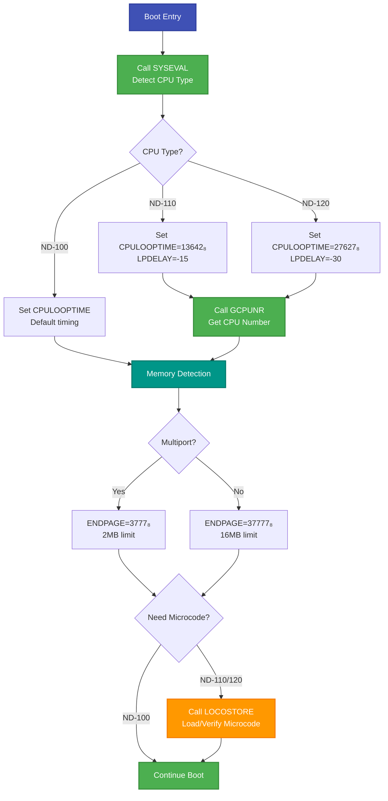
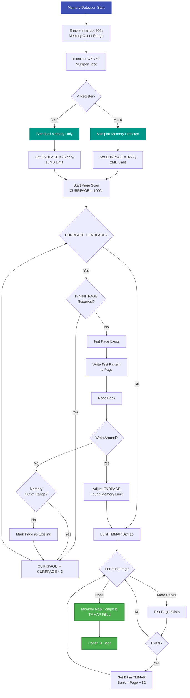

# SINTRAN III CPU Detection and Initialization

**CPU Type Detection, Memory Type Detection, and Microcode Loading**

**Version:** 1.0  
**Last Updated:** October 16, 2025  
**Primary Source Files:**
- `PH-P2-OPPSTART.NPL` (SYSEVAL routine, lines 3397-3532)
- `PH-P2-RESTART.NPL` (LOCOSTORE routine, lines 982-1173)
- `PH-P2-OPPSTART.NPL` (GCPUNR routine, lines 3542-3570)
- `PH-P2-OPPSTART.NPL` (Memory detection, lines 328-377)

---

## Table of Contents

1. [CPU Detection Overview](#1-cpu-detection-overview)
2. [SYSEVAL - CPU Type Detection](#2-syseval---cpu-type-detection)
3. [GCPUNR - CPU Number Detection](#3-gcpunr---cpu-number-detection)
4. [Memory Type Detection](#4-memory-type-detection)
5. [Microcode Loading (ND-110/ND-120)](#5-microcode-loading-nd-110nd-120)
6. [HWINFO Array Structure](#6-hwinfo-array-structure)
7. [Detection Flowcharts](#7-detection-flowcharts)

---

## 1. CPU Detection Overview

### 1.1 Purpose

During the boot sequence, SINTRAN must identify:

1. **CPU Type**: ND-100, ND-110, or ND-120
2. **Floating Point Format**: 32-bit or 48-bit
3. **Instruction Set**: Standard, Commercial (CE), CX, PCX
4. **CPU Number**: For multi-CPU configurations (ND-110/ND-120 only)
5. **Memory Type**: Multiport vs. standard memory
6. **Microcode Version**: For ND-110/ND-120 only

This information determines:
- CPU loop timing constants
- Memory size limits
- Which microcode to load (if any)
- Multi-CPU coordination

### 1.2 Detection Sequence



---

## 2. SYSEVAL - CPU Type Detection

### 2.1 Routine Purpose

**Location:** `PH-P2-OPPSTART.NPL`, lines 3467-3532

The `SYSEVAL` routine determines the CPU type and instruction set by:

1. Testing for floating point format (32-bit or 48-bit)
2. Reading the CPU status register (CPSTA)
3. Testing for various instruction set extensions
4. Detecting ND-110/ND-120 via the `VERSN` instruction
5. Building the `HWINFO` array with system information

### 2.2 CPU Type Detection Logic

```npl
% From PH-P2-OPPSTART.NPL, lines 3473-3516

SYSEVAL:
      TAD=:TADR; X=:SXREG:=B=:SBREG:=L=:"SLREG"

%  32/48 BIT FLOATING?
      T:=0; A:=1; *NLZ 20
      IF T=0 THEN T:=1 ELSE T:=0 FI

%  NORD-10 OR ND-100?
      CPSTA/\10000 SHZ -13+T SH 10
      A=:CHWINFO

%  INSTRUCTION SET
%  COMMERCIAL INSTRUCTION SET?
      *TRA IIC
      A:=20; *TRR IIE
      A:=0; *TRR PIE; TRR PID
      A:=40000; *MST PIE
      *POF
      A:="CLEV14"; *IRW 160 DP; ION
      T:="L1"=:L:=0; *140130; JMP *+1; TRA IIC            % BFILL
L1:   IF A=0 THEN
         "L2"=:L
         B:=0; D:=0; A:=0; X:=0; *142700; TRA IIC         % GECO
L2:      IF A><0 GO OUT
      FI
      *143500                                             % SLWCS
      MIN CHWINFO
      T:="L3"=:L; X:=0; *ICLEP; TRA IIC
L3:   IF A=0 THEN MIN CHWINFO FI
      T:="LL3"=:L; X:=0; *WGLOB; TRA IIC                  % (MICRO-SEGADM FOR 16 PITS?
LL3:  IF A=0 THEN MIN CHWINFO FI
      T:="LL4"=:L; *VERSN; TRA IIC                        % ND-110?
LL4:  IF A=0 THEN
         *VERSN
         A SHZ -15 ; A+CHWINFO=:CHWINFO
         A:=0 ; *TRR PIE; TRR PID; PON
         T=:HWINFO(1)                                     % ND-110/ND-120 MICROPROGRAM VERSION
         CHWINFO/\174777+2000=:CHWINFO
         IF T BIT 17 THEN                                 % ND-120?
            A+1000=:CHWINFO
         FI
      FI
OUT:  A:=0; *TRR PIE; TRR PID; PON
      CHWINFO=:HWINFO(0)
```

### 2.3 Detection Steps Explained

#### Step 1: Floating Point Detection

```npl
T:=0; A:=1; *NLZ 20
IF T=0 THEN T:=1 ELSE T:=0 FI
```

- **NLZ 20**: Normalize Left Zero - tests floating point hardware
- If `T=0` after operation → 48-bit floating point (T=1 in result)
- If `T≠0` after operation → 32-bit floating point (T=0 in result)

**Result in T:**
- `T=0` → 32-bit floating
- `T=1` → 48-bit floating

#### Step 2: Base CPU Type (NORD-10 vs ND-100)

```npl
CPSTA/\10000 SHZ -13+T SH 10
A=:CHWINFO
```

- Read `CPSTA` register (CPU Status)
- Extract bit 3 (bit 10000₈ = bit 13 decimal)
- Combine with floating point type (T)
- Shift left 10 bits to place in high byte
- Result in CHWINFO high byte:
  - 0 = NORD-10, 48-bit
  - 1 = NORD-10, 32-bit
  - 2 = ND-100, 48-bit
  - 3 = ND-100, 32-bit
  - 4 = ND-110, 48-bit
  - 5 = ND-110, 32-bit
  - 6 = ND-120, 48-bit
  - 7 = ND-120, 32-bit

#### Step 3: Instruction Set Detection

The routine then tests for extended instruction sets by attempting to execute special instructions and checking for illegal instruction traps:

| Instruction | Octal | Test | Indicates |
|-------------|-------|------|-----------|
| `BFILL` | 140130 | Block Fill | Commercial instruction set |
| `GECO` | 142700 | Get/Compare | Commercial extended |
| `SLWCS` | 143500 | Slave WCS | Writable control store |
| `ICLEP` | - | IC Leap | Micro-segmentation (16 PITs) |
| `WGLOB` | - | Write Global | Global microcode features |
| `VERSN` | - | Version | ND-110/ND-120 only |

For each instruction:
1. Set up level 14 interrupt handler
2. Attempt to execute instruction
3. If illegal instruction trap (IIC=4) → instruction not supported
4. If success (IIC=0) → instruction supported, decrement CHWINFO

**Result in CHWINFO low byte:**
- 0 = Standard (NORD-10 or ND-100)
- 1 = NORD-10 Commercial, ND-100/CE
- 2 = ND-100/CX
- 3 = ND-110 PCX
- 4 = ND-120 PCX
- 10₈ = ND-120/CX
- 11₈ = ND-110/CX (PRINT 3095)
- 12₈ = ND-110/CX (PRINT 3090)

#### Step 4: ND-110/ND-120 Detection

```npl
T:="LL4"=:L; *VERSN; TRA IIC
LL4:  IF A=0 THEN
         *VERSN
         A SHZ -15 ; A+CHWINFO=:CHWINFO
         A:=0 ; *TRR PIE; TRR PID; PON
         T=:HWINFO(1)                     % Save microprogram version
         CHWINFO/\174777+2000=:CHWINFO
         IF T BIT 17 THEN                 % ND-120?
            A+1000=:CHWINFO
         FI
      FI
```

- Execute `VERSN` instruction
- If successful (A=0), it's an ND-110 or ND-120
- Read microprogram version from `VERSN` result
- Store in `HWINFO(1)`
- Check bit 17 to distinguish ND-120 from ND-110

### 2.4 CPU Type Encoding

The final `HWINFO(0)` value is structured as:

```
Bits 15-8 (High Byte): CPU Type
  0 = NORD-10  48-bit floating
  1 = NORD-10  32-bit floating
  2 = ND-100   48-bit floating
  3 = ND-100   32-bit floating
  4 = ND-110   48-bit floating
  5 = ND-110   32-bit floating
  6 = ND-120   48-bit floating
  7 = ND-120   32-bit floating

Bits 7-0 (Low Byte): Instruction Set
  0 = Standard (NORD-10 or ND-100)
  1 = NORD-10 Commercial, ND-100/CE
  2 = ND-100/CX
  3 = ND-110 PCX
  4 = ND-120 PCX
  10₈ = ND-120/CX
  11₈ = ND-110/CX (PRINT 3095)
  12₈ = ND-110/CX (PRINT 3090)
```

### 2.5 CPU Loop Time Constants

After CPU detection, timing constants are set:

```npl
% From PH-P2-OPPSTART.NPL, lines 315-322

IF HWINFO(0) SHZ -10=4 OR =5 THEN
    13642=:CPULOOPTIME              % CPU loop time for ND-110
    -15=:LPDELAY
ELSE
    IF A=6 OR =7 THEN
        27627=:CPULOOPTIME          % CPU loop time for ND-120
        -30=:LPDELAY
    FI
FI
```

| CPU Type | CPULOOPTIME (octal) | LPDELAY | Notes |
|----------|---------------------|---------|-------|
| ND-100 | Default (not set) | Default | Slower CPU |
| ND-110 | 13642₈ (6050 decimal) | -15 | Medium speed |
| ND-120 | 27627₈ (12183 decimal) | -30 | Fastest CPU |

These constants are used for:
- Timing delays
- Busy-wait loops
- Device timeout calculations
- Scheduler time-slice calculations

---

## 3. GCPUNR - CPU Number Detection

### 3.1 Purpose

**Location:** `PH-P2-OPPSTART.NPL`, lines 3542-3570

For multi-CPU configurations (ND-110/ND-120 only), the `GCPUNR` routine reads the **CPU number** from a backplane wiring PROM. This allows multiple CPUs to share memory and coordinate operations.

### 3.2 GCPUNR Implementation

```npl
% From PH-P2-OPPSTART.NPL, lines 3542-3570

GCPUNR: *PIOF
        400;  *IRW 10 DA; LDA (EXVE; IRW 10 DP
        1000; *IRW 20 DA; LDA (EXVE; IRW 20 DP
        1400; *IRW 30 DA; LDA (EXVE; IRW 30 DP
        2000; *IRW 40 DA; LDA (EXVE; IRW 40 DP
        2400; *IRW 50 DA; LDA (EXVE; IRW 50 DP
        3000; *IRW 60 DA; LDA (EXVE; IRW 60 DP
        3400; *IRW 70 DA; LDA (EXVE; IRW 70 DP
        377; *TRR PIE; TRR PID; ION; IOF; PON
        A:=0; *TRR PIE; VERSN; 1BANK
        T:="INF0"; X:=0; A:=D; *SBYT
        X+1; *IRR 10 DD; SBYT
        X+1; *IRR 20 DD; SBYT
        X+1; *IRR 30 DD; SBYT
        X+1; *IRR 40 DD; SBYT
        X+1; *IRR 50 DD; SBYT
        X+1; *IRR 60 DD; SBYT
        X+1; *IRR 70 DD; SBYT; 2BANK
        IF INF3><52652 THEN EXIT FI             % Not correct PROM
        IF INF0><-1 THEN
            A=:SYSNO=:FCPUN; 1=:PRFLAG          % CPU number
        FI
        IF INF1><-1 THEN A=:HWINFO(2) FI        % CPU type
        IF INF2 SHZ -10><377 THEN A=:NLEGU FI   % Number of legal users
        EXIT
EXVE:   *VERSN; WAIT
```

### 3.3 GCPUNR Logic

#### Microprogram Bug Workaround

Due to a **microcode bug** in the ND-110/ND-120, the `VERSN` instruction must be executed **on the interrupt level corresponding to the byte number to be read**. The routine works around this by:

1. Setting up P-register (DA) for each level (10-70₈)
2. Setting up DP to point to `EXVE` routine
3. Enabling interrupts for that level (PIE)
4. The level interrupt fires, executes `VERSN`, and returns the byte in DD
5. Reading the byte from DD register

#### PROM Data Structure

The backplane PROM contains 8 bytes of information:

| Byte | Variable | Content | Purpose |
|------|----------|---------|---------|
| 0 | INF0 | CPU Number | System number for this CPU |
| 1 | INF1 | CPU Type | Hardware type code |
| 2 | INF2 | License Info | Number of legal users (high byte) |
| 3 | INF3 | Magic Number | Must be 52652₈ (validation) |
| 4-7 | - | Reserved | Future use |

#### Validation

```npl
IF INF3><52652 THEN EXIT FI             % Not correct PROM
```

The magic number 52652₈ (22186 decimal) validates that the PROM is programmed correctly.

#### Result Assignment

```npl
IF INF0><-1 THEN
    A=:SYSNO=:FCPUN; 1=:PRFLAG          % CPU number
FI
IF INF1><-1 THEN A=:HWINFO(2) FI        % CPU type
IF INF2 SHZ -10><377 THEN A=:NLEGU FI   % Number of legal users
```

- **SYSNO**: System number (CPU number for multi-CPU systems)
- **FCPUN**: Fast CPU Number (used by kernel)
- **PRFLAG**: PR flag (indicates PROM was read successfully)
- **HWINFO(2)**: Hardware type (100, 102, 500, 502, 5561, etc.)
- **NLEGU**: Number of legal concurrent users (licensing)

---

## 4. Memory Type Detection

### 4.1 Multiport Memory Detection

**Location:** `PH-P2-OPPSTART.NPL`, lines 328-333

SINTRAN tests for **multiport memory** using the `IOX 750` instruction:

```npl
% From PH-P2-OPPSTART.NPL, lines 328-333

1000=:CURRPAGE
% IF MULTIPORT 3 THEN 3777=:ENDPAGE ELSE 37777=:ENDPAGE FI
A:=200; *TRR IIE; TRA IIC; IOX 750; TRA IIC
IF A=0 THEN A:=3777 ELSE A:=37777 FI; A=:ENDPAGE
A:=0; *TRR IIE
```

### 4.2 IOX 750 - Multiport Test

**IOX 750** is a special I/O instruction that:

1. Attempts to read multiport memory controller status
2. If multiport memory exists → Returns A=0
3. If standard memory only → Causes illegal instruction trap (A≠0)

**Result:**
- **A=0**: Multiport memory detected → `ENDPAGE=3777₈` (2MB limit)
- **A≠0**: Standard memory only → `ENDPAGE=37777₈` (16MB limit)

### 4.3 Memory Configuration Types

SINTRAN supports several memory types, detected and counted by the `MEMCON` routine:

| Memory Type | Code | Symbol | Description |
|-------------|------|--------|-------------|
| Local ND-100 | KMECCR | `MMLOCAL` | Standard local CPU memory |
| PIOC Memory | KMPIOC | `MPIO` | Memory on PIOC boards |
| MPM-3 | KMPM3 | `MM3` | Multiport Memory Module 3 |
| MPM-4 | KMPM4 | `MM4` | Multiport Memory Module 4 |
| MPM-5 | KMPM5 | `MM5` | Multiport Memory Module 5 |

```npl
% From RP-P2-CONFG.NPL, lines 486-514

MEMCON: % Memory configuration
SUBIDEX GOSW MMTOT,MMLOCAL,MPIO,MM3,MM4,MM5,MMSWAP,MMSIN,MMRTC,MM500,FAR MMDAT

MMTOT:  A:=0;      GO MMLOOP    % Not memory
MMLOCAL:A:=KMECCR; GO MMLOOP    % Local ND-100 memory
MPIO:   A:=KMPIOC; GO MMLOOP    % PIOC memory
MM3:    A:=KMPM3;  GO MMLOOP    % MPM 3 memory
MM4:    A:=KMPM4;  GO MMLOOP    % MPM 4 memory
MM5:    A:=KMPM5                % MPM 5 memory
```

### 4.4 Multiport Memory Advantages

**Multiport memory** allows:

1. **Multiple CPUs** to access the same physical memory
2. **I/O devices** to perform DMA without CPU intervention
3. **Better throughput** for multi-CPU configurations
4. **Shared data structures** between CPUs

**Disadvantages:**

1. **Size limit**: Only 2MB (3777₈ pages) vs 16MB (37777₈ pages)
2. **More complex arbitration** (slower access in contention)
3. **Higher cost**

### 4.5 Physical Memory Scanning

After determining the memory type and size limit, SINTRAN scans all physical memory pages:

```npl
% From PH-P2-OPPSTART.NPL, lines 334-377

DO WHILE CURRPAGE><ENDPAGE+1
    % Skip reserved pages in NINITPAGE table
    X:=0
    DO WHILE X<<"NINSZ+1*2"
        *1BANK
        AD:=NINITPAGE(X)
        *2BANK
        IF A><0 AND A<<=CURRPAGE AND D>>=T GO NEXT
        X+2
    OD; *POF
    
    % Test if page exists
    X:=0; 124000=:X.S0
    *PON
    A:=CURRPAGE=:D:=162000; X:=177776
    *POF; STD ,X; PON
    A:=1000; *TRR IIE; TRA IIC     % Enable for memory out of range
    X:=176000; X.S0; *TRA IIC
    IF A=0 THEN                     % Memory out of range?
        % Test for wrap-around
        *PON
        A:=X.S0=:D:=-1=:X.S0; *POF
        X:=0
        IF X.S0=124000 THEN         % Test if phys.addr 0 is changed
            A:=D; X:=176000; *PON
            A=:X.S0; *TRA IIC
        ELSE
            124000=:X.S0; *PON
            CURRPAGE-1=:ENDPAGE
            GO LABL1
        FI
    FI
NEXT: CURRPAGE SH 1=:CURRPAGE
OD
```

### 4.6 TMMAP - Physical Memory Bitmap

After scanning, SINTRAN builds the **TMMAP** (Total Memory Map) bitmap:

```npl
% From PH-P2-OPPSTART.NPL, lines 369-377

FOR X:=0 TO 17 DO; 0=:TMMAP(X); OD
A:=0=:LPHYSPAGE
DO WHILE A<<=ENDPAGE
    CALL PHYSPTEST; GO NOTEXIST; A=:CURRPAGE
    IF A/\67=0 THEN
        CURRPAGE SHZ -6; AD SHZ -4; A=:X    % X=Index in bitmap array TMMAP
        AD SH 4; A/\17 SHZ 3 +CCTBSET
        T:=TMMAP(X); *EXR SA
        T=:TMMAP(X)
    FI
    CURRPAGE+37=:LPHYSPAGE; A+1
OD
```

**TMMAP Structure:**

- Array of 20₈ (18 decimal) words
- Each word has 16 bits
- Each bit represents a **32K memory bank** (40₈ = 32 decimal pages)
- **Total capacity**: 18 × 16 × 32 = 9,216 pages = 18MB

**Example:**
- Bit 0 of TMMAP[0] = Bank 0 exists (pages 0-37₈)
- Bit 5 of TMMAP[2] = Bank 37₈ exists (pages 1400₈-1437₈)

---

## 5. Microcode Loading (ND-110/ND-120)

### 5.1 Overview

**Location:** `PH-P2-RESTART.NPL`, lines 982-1173

The ND-110 and ND-120 CPUs have **writable control store** (WCS) - RAM-based microcode that can be loaded/updated by software. The `LOCOSTORE` routine:

1. Checks if microcode loading is needed (`UCLOAD` parameter)
2. Determines which floating point variant to load (32-bit or 48-bit)
3. Compares CPU microcode version with segment version
4. Loads microcode if CPU version is older
5. Verifies loaded microcode by reading it back

### 5.2 When Microcode Loading Occurs

Microcode loading happens during:

1. **System boot** (from `SINTR`)
2. **Power-fail restart** (from `PWFAIL`)

It is **only called for ND-110 or ND-120 CPUs**.

### 5.3 Microcode Segment Structure

The microcode is stored in a **fixed segment** in memory with the following layout:

```
         ___________
Offset 0 |           |
         | Info Rec  | (6 words)
         |___________|
         |           |
DASTA    |-----------|  ← Start of microcode data
         | . . . . . |
         | . . . . . |
32UST    | * * * * * |  ← 32-bit floating part
         | * * * * * |
         | . . . . . |
         |-----------|
         |           |
48STA    |-----------|  ← 48-bit floating part
         | + + + + + |
         | + + + + + |
         |___________|  ← DASTA + LENGT
```

### 5.4 Info Record Structure

The first 6 words of the segment describe the layout:

| Offset | Field | Description |
|--------|-------|-------------|
| 0 | STATU | Status (unused) |
| 1 | DASTA | Microcode start address in segment |
| 2 | LENGT | Microcode length in 16-bit words (excluding floating part) |
| 3 | 32UST | Floating part start address (in microcode 64-bit words) |
| 4 | 48STA | 48-bit floating data start in segment |
| 5 | 48LEN | 48-bit floating length in 16-bit words |

### 5.5 LOCOSTORE Implementation

```npl
% From PH-P2-RESTART.NPL, lines 1014-1088

LOCOSTORE:
    A:=L=:SAVL
    
    A:=UCFPA=:D:=0
    AD SH 12 =: FLSEG

    % Check if control store should be loaded
    IF UCLOAD =0 THEN
        EXIT
    ELSE
        HWINFO(0) =:D
        IF UCLOAD><40 AND A><60 THEN
            IF D NBIT 10 THEN "1" ELSE "0" FI
        ELSE
            *1BANK
            IF A=40 THEN                       % Floating forced by Sintran
                IF D NBIT 10 THEN "XMG32"; CALL 3UTXT FI
                "0"
            ELSE
                IF D BIT 10 THEN "XMG48"; CALL 3UTXT FI
                "1"
            FI
            *2BANK
        FI
    FI
    A =:48FLOAT =:D :=HWINFO(0)
    IF D=0 THEN A BONE 10
    ELSE A BZERO 10 FI
    A=: HWINFO(X)

    % Get CPU microcode version
    X := 100
    *150017                                    % Read control store version
    A =: MICVER =: D
    IF A<<13 THEN                              % CPU rev too low
        *1BANK
        "XERLC"; CALL 3UTXT                    % Error message
        *2BANK
        GO FAR NOTLOAD
    FI
    
    % Set up pointers to segment
    T:=FLSGB; X:=FLSGA                         % Segment base address
    *AAX DASTA; LDATX
    A=:FLDISP+FLSGA=:SGPNTER                   % Start of microcode data
    
    *AAX LENGT-DASTA; LDATX
    A+SGPNTER =: MXADR                         % End of microcode data
    
    *AAX 32UST-LENGT; LDATX
    A SH 2 + SGPNTER =: FLSTA                  % Start of floating part
    
    *AAX 48STA-32UST; LDATX
    A +SGPNTER -FLDISP =:L -FLSTA =:FLDISP     % Offset to 48-bit part
    
    *AAX 48LEN-48STA; LDATX
    A + L =: FLEND                             % End of 48-bit part
    
    X:=SGPNTER
    *AAX 100; LDATX                            % Microcode version in segment
    A =: CONVER
    
    % Compare versions
    IF A >< D THEN
        *1BANK
        IF A BIT 17 AND D NBIT 17 THEN "XERSG"; CALL 3UTXT; CALL ERRFATAL FI
        IF A NBIT 17 AND D BIT 17 THEN "XERSG"; CALL 3UTXT; CALL ERRFATAL FI
        *2BANK
    FI
    IF A << D GO NOTLOAD                       % CPU version is newer, skip loading
    
    GO CONTLO                                  % Load microcode
```

### 5.6 Microcode Loading Process

```npl
% From PH-P2-RESTART.NPL, lines 1113-1135

CONTLO: 0=:D                                   % Control store start addr
        X:=SGPNTER
        IF 48FLOAT=1 THEN K:="1" ELSE K:="0" FI
        DO
            % 48-bit floating handling
            IF K THEN
                IF X=FLSTA THEN                % Start floating part
                    A:=X+FLDISP=:X             % Jump to 48-bit variant
                FI
                IF X=FLEND THEN                % End floating part
                    A:=X-FLDISP=:X             % Return to main code
                    K:="0"
                FI
            FI
            T := FLSGB
            *LDATX                             % Load word from segment
            X:=:D                              % Swap X↔D
            *150117                            % Store to CPU control store
            X:=:D                              % Swap back
            X+1; D+1
            WHILE X><MXADR
        OD
```

**Key Instructions:**

- **`*150017`** (octal): Read from CPU control store
- **`*150117`** (octal): Write to CPU control store

**Loading Logic:**

1. Start at control store address 0
2. Load word from segment at X
3. Store to control store at D
4. If loading 48-bit floating:
   - When reaching `FLSTA`, jump to 48-bit variant section
   - When reaching `FLEND`, return to main code
5. Continue until all microcode loaded

### 5.7 Microcode Verification

After loading, the routine **reads back** and verifies every word:

```npl
% From PH-P2-RESTART.NPL, lines 1139-1169

CHKCONT:
    0=:D                                       % Control store start addr
    X:=SGPNTER
    IF 48FLOAT=1 THEN K:="1" ELSE K:="0" FI
    DO
        IF K THEN                              % 48-bit floating handling
            IF X=FLSTA THEN
                A:=X+FLDISP=:X
            FI
            IF X=FLEND THEN
                A:=X-FLDISP=:X
                K:="0"
            FI
        FI
        
        T:=FLSGB
        *LDATX
        X:=:D ; A=:L
        *150017                                % Read control store
        X:=:D
        
        IF A >< L THEN                         % Mismatch?
            A:=D=:SGPNTER
            *1BANK
            "XERCR"; CALL 3UTXT                % Error message
            SGPNTER; CALL FOCTU
            CALL ERRFATAL
        FI
        X+1 ; D+1
        WHILE X><MXADR
    OD
```

**Verification:**

1. Read from segment (expected value)
2. Read from CPU control store (actual value)
3. Compare
4. If mismatch → Print error message with address → Fatal error

### 5.8 Microcode Version Comparison

The routine compares CPU microcode version with segment version:

```npl
IF A >< D THEN
    *1BANK
    IF A BIT 17 AND D NBIT 17 THEN "XERSG"; CALL 3UTXT; CALL ERRFATAL FI
    IF A NBIT 17 AND D BIT 17 THEN "XERSG"; CALL 3UTXT; CALL ERRFATAL FI
    *2BANK
FI
IF A << D GO NOTLOAD                           % CPU version is newer
```

**Decision Logic:**

| Segment Version | CPU Version | Action |
|-----------------|-------------|--------|
| Newer (A > D) | Older | Load microcode |
| Same (A = D) | Same | Verify only (no load) |
| Older (A < D) | Newer | Skip (CPU already has newer) |
| Mismatch in bit 17 | - | Fatal error (incompatible) |

**Bit 17 Significance:**

Bit 17 in the version number indicates **major microcode revision**. A mismatch means the microcode is fundamentally incompatible.

### 5.9 Floating Point Variant Selection

The routine selects 32-bit or 48-bit floating point variant:

```npl
HWINFO(0) =:D
IF UCLOAD><40 AND A><60 THEN
    IF D NBIT 10 THEN "1" ELSE "0" FI       % Auto-detect from CPU
ELSE
    *1BANK
    IF A=40 THEN                            % Force 32-bit
        IF D NBIT 10 THEN "XMG32"; CALL 3UTXT FI
        "0"
    ELSE                                    % Force 48-bit
        IF D BIT 10 THEN "XMG48"; CALL 3UTXT FI
        "1"
    FI
    *2BANK
FI
A =:48FLOAT
```

**UCLOAD Parameter:**

| Value | Meaning |
|-------|---------|
| 0 | No microcode loading |
| 40₈ | Force 32-bit floating |
| 60₈ | Force 48-bit floating |
| Other | Auto-detect from CPU type |

**Auto-detection:**

- If HWINFO(0) bit 10 (10000₈) is set → 48-bit floating (48FLOAT=1)
- If HWINFO(0) bit 10 is clear → 32-bit floating (48FLOAT=0)

---

## 6. HWINFO Array Structure

### 6.1 HWINFO Array Layout

The `HWINFO` array contains 12 words (14₈) of system information:

| Offset | Name | Description |
|--------|------|-------------|
| 0 | SYSNO | System number (CPU number) |
| 1 | HWINFO(0) | Hardware information (CPU type + instruction set) |
| 2 | HWINFO(1) | ND-110/ND-120 microprogram version |
| 3 | HWINFO(2) | System type (100, 102, 500, 502, 5561, etc.) |
| 4 | SINVER(0) | Operating system type + version letter |
| 5 | SINVER(1) | Not used (SIBAS system number) |
| 6 | REVLEV | Patch/correction level |
| 7 | GENDAT(0) | System generation time - minutes |
| 8 | GENDAT(1) | System generation time - hours |
| 9 | GENDAT(2) | System generation time - day |
| 10 | GENDAT(3) | System generation time - month |
| 11 | GENDAT(4) | System generation time - year |

### 6.2 HWINFO(0) - Hardware Information

**Bits 15-8 (High Byte): CPU Type**

| Value | CPU Type |
|-------|----------|
| 0 | NORD-10, 48-bit floating |
| 1 | NORD-10, 32-bit floating |
| 2 | ND-100, 48-bit floating |
| 3 | ND-100, 32-bit floating |
| 4 | ND-110, 48-bit floating |
| 5 | ND-110, 32-bit floating |
| 6 | ND-120, 48-bit floating |
| 7 | ND-120, 32-bit floating |

**Bits 7-0 (Low Byte): Instruction Set**

| Value | Instruction Set |
|-------|-----------------|
| 0 | Standard (NORD-10 or ND-100) |
| 1 | NORD-10 Commercial, ND-100/CE |
| 2 | ND-100/CX |
| 3 | ND-110 PCX |
| 4 | ND-120 PCX |
| 10₈ | ND-120/CX |
| 11₈ | ND-110/CX (PRINT 3095) |
| 12₈ | ND-110/CX (PRINT 3090) |

### 6.3 HWINFO(1) - Microprogram Version

For ND-110 and ND-120 only, contains the microcode version number from the `VERSN` instruction.

**Bit 17**: Distinguishes ND-120 (set) from ND-110 (clear)

### 6.4 HWINFO(2) - System Type

Hardware system type code:

| Value | System Type |
|-------|-------------|
| 100 | ND-100 single CPU |
| 102 | ND-100 dual CPU |
| 500 | ND-500 single CPU |
| 502 | ND-500 dual CPU |
| 5561 | ND-5561 (ND-500 variant) |

### 6.5 SINVER(0) - Operating System

**Bits 15-8 (High Byte): OS Type**

| Value | Operating System |
|-------|------------------|
| 0 | SINTRAN III VS |
| 1 | SINTRAN III VSE |
| 2 | SINTRAN III VSE/500 |
| 3 | SINTRAN III RTP |
| 4 | SINTRAN III VSX |
| 5 | SINTRAN III VSX/500 |

**Bits 7-0 (Low Byte): Version Letter**

ASCII character (A-Z) indicating version (e.g., 'L' for SINTRAN-L)

---

## 7. Detection Flowcharts

### 7.1 Complete CPU Detection Flow

```mermaid
flowchart TD
    START[SYSEVAL Entry] --> SAVE[Save Registers<br/>TAD, X, B, L]
    SAVE --> FP[Test Floating Point<br/>NLZ 20]
    
    FP --> FPRES{T Register?}
    FPRES -->|T=0 after| FP48[48-bit Floating<br/>T:=1]
    FPRES -->|T≠0 after| FP32[32-bit Floating<br/>T:=0]
    
    FP48 --> CPUSTA[Read CPSTA Register]
    FP32 --> CPUSTA
    
    CPUSTA --> BUILD1[Build CHWINFO<br/>High Byte from CPSTA bit 3<br/>+ Floating Type]
    
    BUILD1 --> TEST1[Test BFILL Instruction<br/>140130₈]
    TEST1 --> BFRES{Success?}
    BFRES -->|Yes| DEC1[Decrement CHWINFO]
    BFRES -->|No| TEST2
    DEC1 --> TEST2[Test GECO Instruction<br/>142700₈]
    
    TEST2 --> GERES{Success?}
    GERES -->|Yes| DEC2[Decrement CHWINFO]
    GERES -->|No| TEST3
    DEC2 --> TEST3[Test SLWCS Instruction<br/>143500₈]
    
    TEST3 --> SLRES{Success?}
    SLRES -->|Yes| DEC3[Decrement CHWINFO]
    SLRES -->|No| TEST4
    DEC3 --> TEST4[Test ICLEP Instruction]
    
    TEST4 --> ICRES{Success?}
    ICRES -->|Yes| DEC4[Decrement CHWINFO]
    ICRES -->|No| TEST5
    DEC4 --> TEST5[Test WGLOB Instruction]
    
    TEST5 --> WGRES{Success?}
    WGRES -->|Yes| DEC5[Decrement CHWINFO]
    WGRES -->|No| TESTV
    DEC5 --> TESTV[Test VERSN Instruction]
    
    TESTV --> VRES{Success?}
    VRES -->|No| DONE
    VRES -->|Yes| ISND110[ND-110 or ND-120 Detected]
    
    ISND110 --> READV[Read VERSN Result]
    READV --> SAVEV[Save to HWINFO1<br/>Microcode Version]
    SAVEV --> BIT17{Bit 17 Set?}
    
    BIT17 -->|Yes| ND120[ND-120 Detected<br/>Add 1000₈ to CHWINFO]
    BIT17 -->|No| ND110[ND-110 Detected]
    
    ND120 --> DONE[Store CHWINFO to HWINFO0]
    ND110 --> DONE
    
    DONE --> RESTORE[Restore Registers]
    RESTORE --> EXIT[Return]
    
    style START fill:#3F51B5,stroke:#303F9F,stroke-width:2px,color:#fff
    style EXIT fill:#4CAF50,stroke:#388E3C,stroke-width:2px,color:#fff
    style ND120 fill:#FF9800,stroke:#F57C00,stroke-width:2px,color:#fff
    style ND110 fill:#FF9800,stroke:#F57C00,stroke-width:2px,color:#fff
    style ISND110 fill:#009688,stroke:#00796B,stroke-width:2px,color:#fff
```



### 7.2 Microcode Loading Decision Flow

```mermaid
flowchart TD
    START[LOCOSTORE Entry] --> CHK1{UCLOAD = 0?}
    CHK1 -->|Yes| EXIT1[Skip Loading<br/>Return]
    CHK1 -->|No| CHK2{UCLOAD = 40₈<br/>or 60₈?}
    
    CHK2 -->|Yes| FORCE{Which?}
    CHK2 -->|No| AUTO[Auto-detect from<br/>HWINFO0 bit 10]
    
    FORCE -->|40₈| SET32[Force 32-bit Floating<br/>48FLOAT:=0]
    FORCE -->|60₈| SET48[Force 48-bit Floating<br/>48FLOAT:=1]
    
    AUTO --> AUTOBIT{Bit 10 Set?}
    AUTOBIT -->|Yes| SET48A[48-bit Floating<br/>48FLOAT:=1]
    AUTOBIT -->|No| SET32A[32-bit Floating<br/>48FLOAT:=0]
    
    SET32 --> READCPU[Read CPU Microcode Version<br/>IOX 150017₈]
    SET48 --> READCPU
    SET32A --> READCPU
    SET48A --> READCPU
    
    READCPU --> CHKREV{CPU Rev >= 13?}
    CHKREV -->|No| FATAL1[Error: CPU Rev Too Low<br/>ERRFATAL]
    CHKREV -->|Yes| READSEG[Read Segment Info Record<br/>Get DASTA, LENGT, etc.]
    
    READSEG --> READVER[Read Segment Microcode Version<br/>Offset 100₈]
    READVER --> CMP{Compare Versions}
    
    CMP -->|Seg < CPU| SKIP[Skip Loading<br/>CPU Has Newer]
    CMP -->|Seg = CPU| VERIFY[Verify Only<br/>No Load]
    CMP -->|Seg > CPU| LOAD[Load Microcode]
    CMP -->|Bit 17 Mismatch| FATAL2[Error: Incompatible<br/>ERRFATAL]
    
    LOAD --> LOOP1[For Each Word<br/>Segment → CPU]
    LOOP1 --> FLT{48-bit Float?}
    
    FLT -->|Yes| FLTCHK{At FLSTA?}
    FLT -->|No| WRITE
    
    FLTCHK -->|Yes| JUMP48[Jump to 48-bit Section]
    FLTCHK -->|No| FLTEND{At FLEND?}
    
    FLTEND -->|Yes| RETURN32[Return to Main Section]
    FLTEND -->|No| WRITE
    
    JUMP48 --> WRITE[Write to CPU Control Store<br/>IOX 150117₈]
    RETURN32 --> WRITE
    
    WRITE --> MORE1{More Words?}
    MORE1 -->|Yes| LOOP1
    MORE1 -->|No| VERIFY
    
    VERIFY --> LOOP2[For Each Word<br/>Read & Compare]
    LOOP2 --> READ[Read from CPU Control Store<br/>IOX 150017₈]
    READ --> COMP{Match Segment?}
    
    COMP -->|No| FATAL3[Error: Mismatch at Address<br/>ERRFATAL]
    COMP -->|Yes| MORE2{More Words?}
    
    MORE2 -->|Yes| LOOP2
    MORE2 -->|No| SUCCESS[Microcode Loaded Successfully]
    
    SKIP --> SUCCESS
    SUCCESS --> EXIT2[Return]
    
    style START fill:#3F51B5,stroke:#303F9F,stroke-width:2px,color:#fff
    style EXIT1 fill:#4CAF50,stroke:#388E3C,stroke-width:2px,color:#fff
    style EXIT2 fill:#4CAF50,stroke:#388E3C,stroke-width:2px,color:#fff
    style FATAL1 fill:#F44336,stroke:#D32F2F,stroke-width:2px,color:#fff
    style FATAL2 fill:#F44336,stroke:#D32F2F,stroke-width:2px,color:#fff
    style FATAL3 fill:#F44336,stroke:#D32F2F,stroke-width:2px,color:#fff
    style LOAD fill:#FF9800,stroke:#F57C00,stroke-width:2px,color:#fff
    style SUCCESS fill:#4CAF50,stroke:#388E3C,stroke-width:2px,color:#fff
```



### 7.3 Memory Type Detection Flow



---

## Summary

SINTRAN III performs comprehensive hardware detection during boot:

### CPU Detection

1. **SYSEVAL** detects:
   - CPU type (ND-100, ND-110, ND-120)
   - Floating point format (32-bit or 48-bit)
   - Instruction set (Standard, CE, CX, PCX)
   - Microcode version (ND-110/ND-120 only)

2. **GCPUNR** reads (ND-110/ND-120 only):
   - CPU number from backplane PROM
   - System type
   - Number of licensed users

### Memory Detection

1. **IOX 750** detects multiport memory
2. **ENDPAGE** set based on memory type:
   - Multiport: 2MB (3777₈ pages)
   - Standard: 16MB (37777₈ pages)
3. **Physical scanning** builds TMMAP bitmap
4. **TMMAP** tracks all 32K memory banks

### Microcode Loading (ND-110/ND-120)

1. **LOCOSTORE** loads writable control store
2. **Version comparison** determines if loading needed
3. **Floating point variant** selection (32-bit or 48-bit)
4. **Verification** by reading back all loaded words
5. **Fatal error** if mismatch detected

All this information is stored in the **HWINFO** array and used throughout the boot process and runtime operation.

---

## Appendix A: Key Symbols and Values

### CPU Type Codes

| Symbol | Value (Octal) | Description |
|--------|--------------|-------------|
| ND-100 48-bit | 0400 | HWINFO(0) high byte = 2 |
| ND-100 32-bit | 0600 | HWINFO(0) high byte = 3 |
| ND-110 48-bit | 1000 | HWINFO(0) high byte = 4 |
| ND-110 32-bit | 1200 | HWINFO(0) high byte = 5 |
| ND-120 48-bit | 1400 | HWINFO(0) high byte = 6 |
| ND-120 32-bit | 1600 | HWINFO(0) high byte = 7 |

### Memory Limits

| Memory Type | Symbol | Value (Octal) | Decimal | Description |
|-------------|--------|--------------|---------|-------------|
| Multiport | ENDPAGE | 3777₈ | 2047 | 2MB = 2048 pages |
| Standard | ENDPAGE | 37777₈ | 16383 | 16MB = 16384 pages |

### CPU Loop Timing

| CPU | Symbol | Value (Octal) | Value (Decimal) |
|-----|--------|--------------|-----------------|
| ND-110 | CPULOOPTIME | 13642₈ | 6050 |
| ND-120 | CPULOOPTIME | 27627₈ | 12183 |

### Microcode Instructions

| Instruction | Octal Code | Description |
|-------------|-----------|-------------|
| Read Control Store | 150017₈ | Read microcode word from address in X |
| Write Control Store | 150117₈ | Write microcode word to address in X |
| VERSN | - | Get CPU version and type |

### UCLOAD Values

| Value | Meaning |
|-------|---------|
| 0 | No microcode loading |
| 40₈ (32 decimal) | Force 32-bit floating |
| 60₈ (48 decimal) | Force 48-bit floating |
| Other | Auto-detect from CPU |

---

**End of Document**

