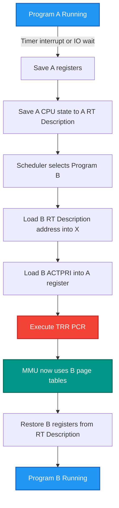
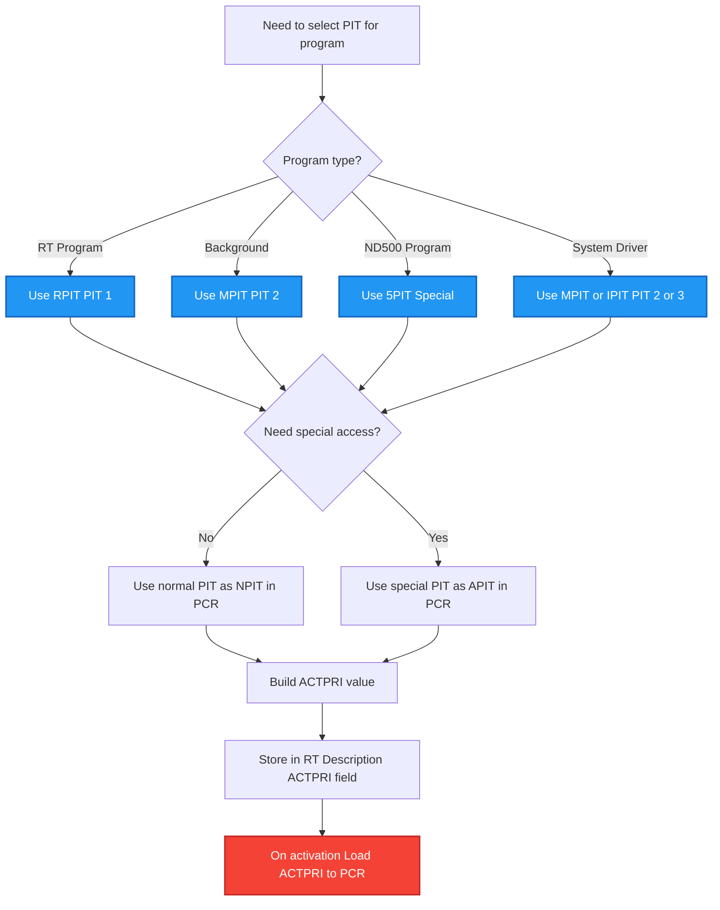

# SINTRAN III MMU Reconfiguration During Context Switches

**Understanding Page Table Switching Between Processes**

**Version:** 1.0  
**Last Updated:** October 16, 2025  
**Purpose:** Explain how the SINTRAN III MMU is reconfigured with new page tables when switching between processes

---

## Table of Contents

1. [Overview](#1-overview)
2. [The ACTPRI Field](#2-the-actpri-field)
3. [Context Switch Mechanism](#3-context-switch-mechanism)
4. [RT-Description Structure](#4-rt-description-structure)
5. [PCR Format and Meaning](#5-pcr-format-and-meaning)
6. [Context Switch Examples](#6-context-switch-examples)
7. [PIT Selection Logic](#7-pit-selection-logic)
8. [C# Implementation](#8-csharp-implementation)

---

## 1. Overview

SINTRAN III uses the ND-100's **Memory Management Unit (MMU)** with **Page Index Tables (PITs)** to provide each program with its own virtual address space. When the operating system switches from one process to another, it must reconfigure the MMU to use the new process's page tables.

### Key Concepts

- **PCR (Paging Control Register)**: A 6-bit register that specifies which PITs to use and what protection ring
- **ACTPRI Field**: Word at offset 19 (023₈ octal) in RT-Description that stores the PCR value for that program
- **TRR PCR**: Machine instruction that loads a new value into the PCR
- **Context Switch**: The process of saving one program's state and loading another's

---

## 2. The ACTPRI Field

### 2.1 Location and Size

```
RT-Description Offset 19 (decimal) = 023₈ (octal)
Field Name: ACTPRI (Actual Priority + PCR)
Size: 16 bits (1 word)
```

### 2.2 ACTPRI Word Format

The ACTPRI field is a **packed 16-bit word** containing:

```
 15  14  13  12  11  10   9   8   7   6   5   4   3   2   1   0
┌───┴───┴───┴───┴───┴───┴───┴───┼───┴───┴───┴───┼───┴───┴───┴───┐
│     Unused/Reserved (bits 8-15)│   PCR (6-10)  │Priority(0-7)  │
└───────────────────────────────┴───────────────┴───────────────┘

Bits 0-7:   Priority value (not used for MMU, used for scheduling)
Bits 8-10:  PCR value (6 bits total, stored in bits 8-13 typically)
Bits 11-15: Unused or reserved
```

**Note**: The exact bit packing varies by implementation, but the key point is that **ACTPRI contains the PCR value** that should be loaded when this program executes.

### 2.3 Building an ACTPRI Value

Common patterns from the source code:

```npl
% Standard RT program (using RPIT=1):
"NRPIT+ADPIT+ALEVB+ERNG2"=:RTREF.ACTPRI

% ND-500 program (using 5PIT):
"N5PIT+ADPIT+ALEVB+ERNG2"=:RTREF.ACTPRI

% User segment access (using special PIT):
"NSPIT+ADPIT+ALEVB+ERNG2"=:RTREF.ACTPRI
```

Where:
- `NRPIT` = Normal PIT number (e.g., 1 for RPIT)
- `N5PIT` = PIT number for ND-500 programs
- `ADPIT` = Alternative PIT (usually DPIT for driver access)
- `ALEVB` = A-level base (interrupt level 1 for user programs)
- `ERNG2` = Execute at ring 2

---

## 3. Context Switch Mechanism

### 3.1 High-Level Context Switch Flow



### 3.2 Detailed NPL Code Example

From `MP-P2-N500.NPL` lines 74-78 (context switch to program in `X`):

```npl
IF X=CURPROG THEN
    "FROMESC"; *IRW ALEVB DP                % Force program to start in FROMESC
    "N5PIT+ADPIT+ALEVB+ERNG2"
    A=:X.ACTPRI; *TRR PCR                   % Load ACTPRI and transfer to PCR
ELSE
    % Different handling for non-current program
FI
```

**Step-by-step:**
1. Check if `X` points to current program's RT-description
2. If yes:
   - Set restart address to `FROMESC`
   - Load the constant `"N5PIT+ADPIT+ALEVB+ERNG2"` (builds PCR value)
   - Load program's `ACTPRI` field into A register
   - Execute `*TRR PCR` - **This is the critical instruction that reconfigures the MMU!**

### 3.3 The TRR PCR Instruction

```
*TRR PCR - Transfer Register to PCR

Before: A register contains new PCR value
After:  PCR contains value from A
        MMU now uses PITs specified in new PCR
        All subsequent memory accesses use new page tables
```

**Hardware behavior:**
- Takes value from A register (bits 0-5 are significant)
- Loads it into the current interrupt level's PCR
- Memory management hardware immediately starts using the new PITs
- No pipeline flush needed (architecture handles this)

---

## 4. RT-Description Structure

### 4.1 Complete RT-Description Layout

```
Offset  Field Name      Size    Description
─────────────────────────────────────────────────────────────────
  0     TLNK           16 bits  Time queue link
  1     STATE/PRIORITY 16 bits  State flags + priority
  2-3   DTIM1/DTIM2    32 bits  Scheduled time (DOUBLE)
  4-5   DTINT1/DTINT2  32 bits  Time interval (DOUBLE)
  6     STADR          16 bits  Start address
  7     SEGM           16 bits  Segment numbers (packed)
  8     DPREG          16 bits  Saved P register (PC)
  9     DXREG          16 bits  Saved X register
 10     DTREG          16 bits  Saved T register
 11     DAREG          16 bits  Saved A register
 12     DDREG          16 bits  Saved D register
 13     DLREG          16 bits  Saved L register
 14     DSREG          16 bits  Saved status register
 15     DBREG          16 bits  Saved B register
 16     WLNK           16 bits  Waiting/execution queue link
 17     ACTSEG1        16 bits  Active segment 1
 18     ACTSEG2        16 bits  Active segment 2
 19     ACTPRI         16 bits  *** ACTUAL PRIORITY + PCR VALUE ***
 20     BRESLINK       16 bits  Beginning of reservation queue
 21     RSEGM          16 bits  Reserved segment
 22-25  BITMAP-BITM3   64 bits  Segment bitmaps (4 words)
```

### 4.2 Why ACTPRI is Crucial

The `ACTPRI` field serves dual purposes:

1. **Scheduling**: Contains priority information (bits 0-7)
2. **Memory Management**: Contains PCR value specifying which page tables to use

When a program is activated, its `ACTPRI` is loaded into the CPU's PCR, immediately changing the memory mapping.

---

## 5. PCR Format and Meaning

### 5.1 PCR Bit Layout (6 bits)

```
Bit:    5    4    3    2    1    0
      ┌────┬────┬────┬────┬────┬────┐
      │NPIT│NPIT│APIT│APIT│RING│RING│
      └────┴────┴────┴────┴────┴────┘
```

| Bits | Field | Values | Meaning |
|------|-------|--------|---------|
| 5-4  | NPIT  | 0-3    | **Normal PIT number** (which of 4 PITs to use) |
| 3-2  | APIT  | 0-3    | **Alternative PIT number** (for special instructions) |
| 1-0  | RING  | 0-3    | **Protection ring** (0=most privileged, 3=least) |

### 5.2 Common PCR Values

From `PH-P2-RESTART.NPL` lines 16-31 (PCR initialization table):

```npl
INTEGER ARRAY PCCS:=(
    NMPIT+ADPIT+ERNG2+000,      % Level 0  - Kernel
    NMPIT+ADPIT+ERNG2+ALEVB,    % Level 1  - RT programs (RPIT)
    NMPIT+ADPIT+ERNG2+MLEVB,    % Level 2  - Monitor
    NIPIT+ADPIT+ERNG3+SLEVB,    % Level 3  - Monitor (IPIT, Ring 3)
    NRPIT+ADPIT+ERNG2+BLEVB,    % Level 4  - INBT/OUTBT (RPIT)
    NXPIT+ADPIT+ERNG2+50,       % Level 5  - Special
    64,                         % Level 6  - Reserved
    74,                         % Level 7  - Reserved
    104,                        % Level 8  - Reserved
    114,                        % Level 9  - Reserved
    NMPIT+ADPIT+ERNG2+LV10B,    % Level 10 - Output devices (MPIT)
    NIPIT+ADPIT+ERNG2+LV11B,    % Level 11 - Mass storage (IPIT)
    NMPIT+ADPIT+ERNG2+LV12B,    % Level 12 - Input devices (MPIT)
    NMPIT+ADPIT+ERNG2+LV13B,    % Level 13 - Clock (MPIT)
    NMPIT+ADPIT+ERNG2+LV14B,    % Level 14 - Internal interrupts (MPIT)
    174);                       % Level 15 - Reserved
```

**Symbol meanings:**
- `NMPIT` = 0 (PIT 0 - resident monitor)
- `NRPIT` = 1 (PIT 1 - RT programs)
- `NIPIT` = 3 (PIT 3 - I/O system)
- `N5PIT` = varies (ND-500 programs)
- `ADPIT` = Driver PIT (alternative)
- `ERNG2` = Ring 2 (standard protection)
- `ERNG3` = Ring 3 (more restricted)

### 5.3 PIT to Address Space Mapping

| PIT# | Name | Primary Use | Typical Contents |
|------|------|-------------|------------------|
| **0** | Basic PIT | Resident OS | SINTRAN kernel code/data<br/>System tables<br/>Common buffers |
| **1** | RPIT | RT Programs | User RT programs<br/>RTCOMMON library<br/>Shared segments |
| **2** | MPIT | Monitor | Monitor kernel<br/>Device drivers<br/>System services |
| **3** | IPIT | I/O System | I/O drivers<br/>Datafields<br/>DMA buffers |

---

## 6. Context Switch Examples

### 6.1 Example 1: Switching to RT Program

From `CC-P2-COMMON.NPL` lines 305-314:

```npl
RCTMOD: IF X.PORTNO=0 THEN EXITA FI
        A:=L+1=:"RETAD"
        X=:L
        "NRPIT+ADPIT+ALEVB+ERNG2"; *IOF    % Build PCR for RPIT
        A=:CURPROG.ACTPRI; *TRR PCR; ION   % Load and switch page tables
        MLEV; *MCL PIE                     % Mask interrupt level
        L=:X; CALL XISTAD; CALL CTMOD
        0/\0
        "NSPIT+ADPIT+ALEVB+ERNG2"; *IOF    % Restore original PCR
        X=:L
        A=:CURPROG.ACTPRI; *TRR PCR; ION   % Switch back
        MLEV; *MST PIE
        L=:X; GO RETAD
```

**Analysis:**
1. Interrupts off (`*IOF`)
2. Load PCR value `"NRPIT+ADPIT+ALEVB+ERNG2"` (use RPIT for RT programs)
3. Get current program's `ACTPRI` and load into PCR
4. Do work with RT program's page tables active
5. Restore original PCR value
6. Interrupts on (`*ION`)

### 6.2 Example 2: Temporary PIT Switch for Access

From `RP-P2-CONFG.NPL` lines 199-210:

```npl
XXVAL:  X=:XAREG; X:=L=:"XLREG"                     % Save registers
        RTREF.ACT1SEG=:XOLD1SEG; X.RSEGM=:XRSEGM    % Save old segments
        T=:X.ACT1SEG; 0=:X.RSEGM                    % Set new segment
        RTREF; CALL LAMINHIBIT                       % No LAMUS
        XAREG=:D:=XFLAG=:L; T:=XVAL                 % Get value and address
        RTREF.ACTPRI/\ACLEAR\/AUPIN=:X.ACTPRI
        *TRR PCR                                     % **Set up PCR to access segment**
        X:=D                                         % Address in X
        IF L=0 THEN
            T=:X.S0                                  % Put value
        ELSE
            T:=X.S0                                  % Get value
        FI
        *IOF
        "NRPIT+ADPIT+ALEVB+ERNG2"; *TRR PCR         % **Restore original PCR**
        A=:RTREF.ACTPRI; *ION
```

**Key operations:**
1. Modify ACTPRI with special flags (`/\ACLEAR\/AUPIN`)
2. `*TRR PCR` - Switch to special PIT for segment access
3. Access data through changed page tables
4. Restore RPIT page tables
5. Continue with original memory mapping

### 6.3 Example 3: ND-500 Specific Switch

From `CC-P2-N500.NPL` lines 72-78:

```npl
IF A=RTREF THEN EXIT FI
OD
A=:D
"N5PIT+ADPIT+ALEVB+ERNG2"
A=:RTREF.ACTPRI; *TRR PCR                 % Switch to 5PIT
T:=5MBBANK; X:=D.MESSBUFF                % X=ND-500 message addr
A:=L; *AAX LRET; STATX                    % Address to return to
```

**ND-500 programs use different PIT:**
- `N5PIT` instead of `NRPIT`
- Allows access to ND-500 specific memory regions
- Message buffers mapped into 5PIT address space

---

## 7. PIT Selection Logic

### 7.1 Decision Tree for PIT Selection



### 7.2 PIT Assignment Rules

1. **RT Programs (Real-Time)**:
   - Use RPIT (PIT 1)
   - Each RT program can have segments mapped differently
   - ACTPRI typically contains `NRPIT+ADPIT+ALEVB+ERNG2`

2. **Background Programs**:
   - Use MPIT (PIT 2) or special background PIT
   - Share page tables with monitor
   - Lower priority, time-sharing

3. **ND-500 Programs**:
   - Use 5PIT (varies by configuration)
   - Access to ND-500 message buffers
   - Communication areas mapped specially

4. **System/Drivers**:
   - Device drivers use MPIT or IPIT
   - Need access to hardware registers
   - Run at elevated privilege (Ring 2)

---

## 8. C# Implementation

### 8.1 ACTPRI Field Access

```csharp
/// <summary>
/// ACTPRI field in RT-Description (offset 19).
/// Size: 16 bits.
/// Contains: Priority (bits 0-7) + PCR value (bits 8+)
/// </summary>
public class RtDescription
{
    // ... other fields ...
    
    /// <summary>
    /// Actual priority and PCR value (ACTPRI).
    /// Offset: 19 words (023₈ octal).
    /// Size: 16 bits.
    /// Bits 0-7: Priority for scheduling
    /// Bits 8-13: PCR value for MMU configuration
    /// </summary>
    public ushort ActualPriority { get; set; }
    
    /// <summary>
    /// Extract PCR value from ACTPRI field.
    /// </summary>
    public byte GetPCR()
    {
        // PCR is typically in bits 8-13 (6 bits)
        return (byte)((ActualPriority >> 8) & 0x3F);
    }
    
    /// <summary>
    /// Decode PCR into component parts.
    /// </summary>
    public (byte npit, byte apit, byte ring) DecodePCR()
    {
        byte pcr = GetPCR();
        byte npit = (byte)((pcr >> 4) & 0x03);  // Bits 5-4
        byte apit = (byte)((pcr >> 2) & 0x03);  // Bits 3-2
        byte ring = (byte)(pcr & 0x03);         // Bits 1-0
        return (npit, apit, ring);
    }
    
    /// <summary>
    /// Get which PIT this program uses.
    /// </summary>
    public string GetPITName()
    {
        var (npit, apit, ring) = DecodePCR();
        return npit switch
        {
            0 => "Basic PIT (resident)",
            1 => "RPIT (RT programs)",
            2 => "MPIT (monitor)",
            3 => "IPIT (I/O system)",
            _ => $"PIT {npit}"
        };
    }
}
```

### 8.2 Context Switch Simulator

```csharp
/// <summary>
/// Simulates MMU context switch behavior.
/// </summary>
public class MmuContextSwitcher
{
    private readonly IMemoryAccess _memory;
    private readonly PageTableReader _pitReader;
    
    // Current MMU state
    private byte _currentPCR;
    private PitEntry[][] _allPits = new PitEntry[4][];
    
    public MmuContextSwitcher(IMemoryAccess memory, PageTableReader pitReader)
    {
        _memory = memory;
        _pitReader = pitReader;
    }
    
    /// <summary>
    /// Simulate context switch from one program to another.
    /// </summary>
    public void ContextSwitch(RtDescription fromProgram, RtDescription toProgram)
    {
        Console.WriteLine($"Context Switch: Program {fromProgram.ProgramNumber} → {toProgram.ProgramNumber}");
        
        // Step 1: Save current program's state (already in RT-description)
        Console.WriteLine($"  Old PCR: 0x{fromProgram.GetPCR():X2} ({fromProgram.GetPITName()})");
        
        // Step 2: Load new program's ACTPRI
        ushort newACTPRI = toProgram.ActualPriority;
        Console.WriteLine($"  New ACTPRI: 0x{newACTPRI:X4}");
        
        // Step 3: Extract PCR from ACTPRI
        byte newPCR = toProgram.GetPCR();
        Console.WriteLine($"  New PCR: 0x{newPCR:X2} ({toProgram.GetPITName()})");
        
        // Step 4: Decode PCR
        var (npit, apit, ring) = toProgram.DecodePCR();
        Console.WriteLine($"  NPIT={npit}, APIT={apit}, RING={ring}");
        
        // Step 5: Load new page tables (simulate *TRR PCR)
        LoadPCR(newPCR);
        
        Console.WriteLine("  MMU reconfigured - now using new program's page tables");
    }
    
    /// <summary>
    /// Simulate the *TRR PCR instruction.
    /// </summary>
    private void LoadPCR(byte newPCR)
    {
        _currentPCR = newPCR;
        
        // Extract PIT numbers
        byte npit = (byte)((newPCR >> 4) & 0x03);
        byte apit = (byte)((newPCR >> 2) & 0x03);
        
        Console.WriteLine($"    Hardware action: MMU now using PIT {npit} for normal access");
        Console.WriteLine($"                     MMU using PIT {apit} for alternative access");
        
        // In real hardware, this happens instantaneously
        // All subsequent memory accesses use the new PITs
    }
    
    /// <summary>
    /// Display current MMU configuration.
    /// </summary>
    public void DisplayMmuState()
    {
        byte npit = (byte)((_currentPCR >> 4) & 0x03);
        byte apit = (byte)((_currentPCR >> 2) & 0x03);
        byte ring = (byte)(_currentPCR & 0x03);
        
        Console.WriteLine("Current MMU State:");
        Console.WriteLine($"  PCR: 0x{_currentPCR:X2}");
        Console.WriteLine($"  Normal PIT: {npit}");
        Console.WriteLine($"  Alternative PIT: {apit}");
        Console.WriteLine($"  Protection Ring: {ring}");
    }
}
```

### 8.3 Usage Example

```csharp
/// <summary>
/// Example: Monitor context switches.
/// </summary>
public void MonitorContextSwitches()
{
    var memory = new PhysicalMemory(); // Your implementation
    var pitReader = new PageTableReader(memory);
    var switcher = new MmuContextSwitcher(memory, pitReader);
    var queueReader = new SintranQueueReader(memory);
    
    // Get execution queue
    var execQueue = queueReader.ReadExecutionQueue();
    
    Console.WriteLine("Execution Queue Programs:");
    foreach (var prog in execQueue)
    {
        var (npit, apit, ring) = prog.DecodePCR();
        Console.WriteLine($"  RT#{prog.ProgramNumber}: PIT{npit}, Ring{ring}, Priority={prog.Priority}");
    }
    
    // Simulate context switches
    if (execQueue.Count >= 2)
    {
        Console.WriteLine("\nSimulating context switch:\n");
        switcher.ContextSwitch(execQueue[0], execQueue[1]);
        
        Console.WriteLine("\nAfter switch:");
        switcher.DisplayMmuState();
    }
}
```

### 8.4 Output Example

```
Execution Queue Programs:
  RT#0: PIT1, Ring2, Priority=200
  RT#1: PIT1, Ring2, Priority=150
  RT#5: PIT2, Ring2, Priority=100

Simulating context switch:

Context Switch: Program 0 → 1
  Old PCR: 0x12 (RPIT (RT programs))
  New ACTPRI: 0x1296
  New PCR: 0x12 (RPIT (RT programs))
  NPIT=1, APIT=0, RING=2
    Hardware action: MMU now using PIT 1 for normal access
                     MMU using PIT 0 for alternative access
  MMU reconfigured - now using new program's page tables

After switch:
Current MMU State:
  PCR: 0x12
  Normal PIT: 1
  Alternative PIT: 0
  Protection Ring: 2
```

---

## Summary

### Key Points

1. **ACTPRI field** at offset 19 in RT-Description stores the PCR value for each program
2. **Context switches** involve:
   - Saving current program's registers to its RT-Description
   - Loading new program's ACTPRI value
   - Executing `*TRR PCR` to reconfigure MMU
   - Restoring new program's registers

3. **PCR determines**:
   - Which PIT (0-3) provides normal address mapping
   - Which PIT provides alternative address mapping  
   - What protection ring (0-3) the program runs in

4. **PIT selection** is based on:
   - Program type (RT, background, ND-500, driver)
   - Special access needs
   - Protection requirements

5. **MMU switching is fast**:
   - Single instruction (`*TRR PCR`)
   - No cache/TLB flush needed (hardware handles it)
   - Immediate effect on all memory accesses

### Critical NPL Pattern

Every context switch follows this pattern:

```npl
% Switch to program pointed to by X
A=:X.ACTPRI    % Load ACTPRI field into A
*TRR PCR       % Transfer to PCR - MMU NOW RECONFIGURED!
% Continue execution with new page tables active
```

This simple two-instruction sequence is what changes the entire memory mapping for the process!

---

**End of MMU Context Switching Documentation**

*For more information, see:*
- `KERNEL/00-SINTRAN-ARCHITECTURE-OVERVIEW.md` - MMU architecture
- `KERNEL/01-BOOT-SEQUENCE.md` - PIT initialization
- `KERNEL/KERNEL-ACCESS-EMULATOR.md` - C# implementation details

