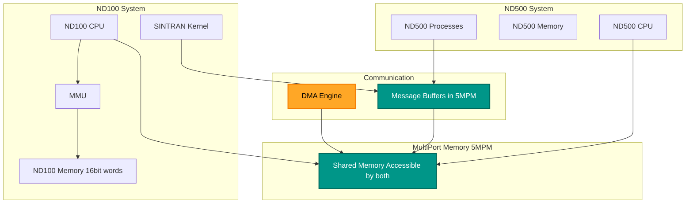
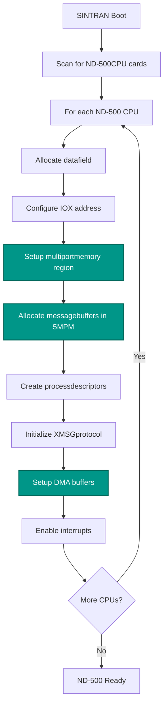
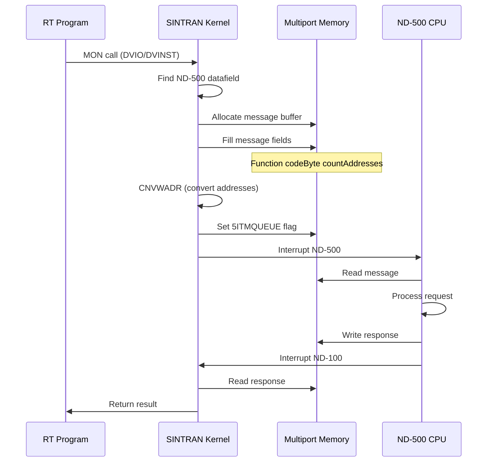
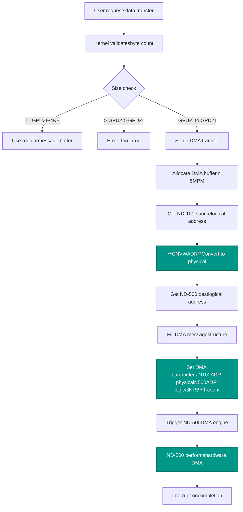
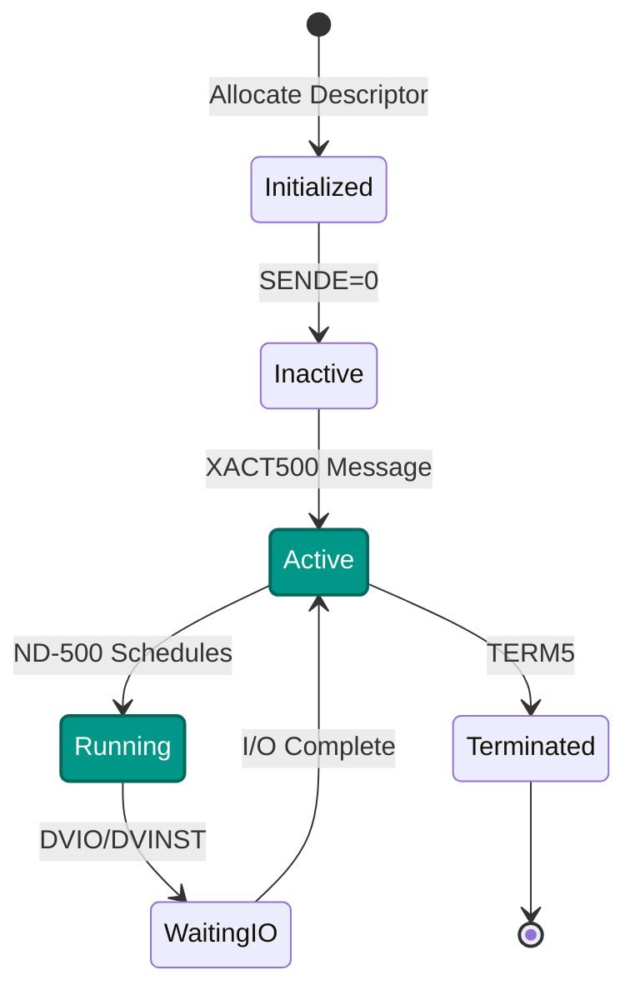
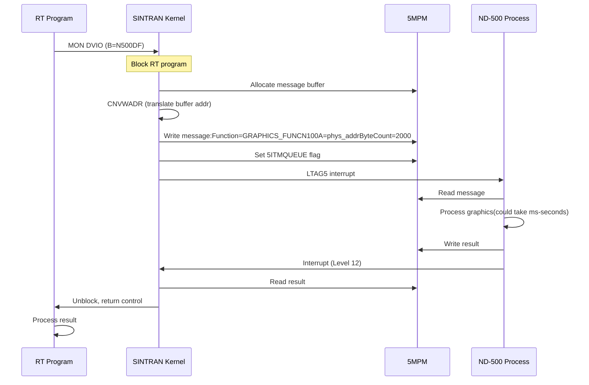

# SINTRAN III ND-500 Integration: Kernel, DMA, and Memory Mapping

**Complete Guide to ND-100/ND-500 Communication, DMA Operations, and Physical Address Translation**

**Version:** 1.0  
**Last Updated:** October 16, 2025  
**Purpose:** Explain how SINTRAN kernel communicates with ND-500, performs DMA operations, and manages shared memory mapping

---

## Table of Contents

1. [Overview](#1-overview)
2. [ND-500 Architecture](#2-nd-500-architecture)
3. [Configuration and Setup](#3-configuration-and-setup)
4. [Message Communication](#4-message-communication)
5. [DMA Operations](#5-dma-operations)
6. [Address Translation (CNVWADR)](#6-address-translation-cnvwadr)
7. [Shared Memory Mapping](#7-shared-memory-mapping)
8. [Kernel Driver Integration](#8-kernel-driver-integration)
9. [Complete Examples](#9-complete-examples)

---

## 1. Overview

### 1.1 ND-100 and ND-500 System Architecture

The SINTRAN system integrates the **ND-100** (main processor) with one or more **ND-500** processors for distributed processing. The ND-500 handles:

- Graphics processing
- Database operations
- Communication protocols
- High-speed computations



### 1.2 Key Communication Mechanisms

| Mechanism | Purpose | Implementation |
|-----------|---------|----------------|
| **Message Buffers** | Command/response exchange | Allocated in multiport memory (5MPM) |
| **DMA Transfers** | Bulk data movement | Hardware DMA with physical address translation |
| **Shared Memory** | Data structures | Multiport memory accessible by both CPUs |
| **XMSG Protocol** | Message passing | ND-500 microcode protocol |

### 1.3 Physical Address Ranges

```
ND-100 Virtual Address:    0000000₈ - 0177777₈ (64K words, 16-bit)
ND-100 Physical Address:   00000000₈ - 77777777₈ (16M words, 24-bit)

Multiport Memory (5MPM):   Varies (configured at boot)
  - Typical range:         20000000₈ - 27777777₈ (banks in physical space)
  - Size:                  256KB - 2MB (configurable)
  - Address width:         24-bit physical, both CPUs see same memory

ND-500 Byte Addressing:    00000000₈ - 77777777₈ (byte addresses, 32-bit)
  - Bit 31 set:            Indicates multiport memory access
  - Bits 0-30:             Byte offset within multiport memory
```

---

## 2. ND-500 Architecture

### 2.1 ND-500 Hardware Interface

The ND-500 appears to the ND-100 as an **IOX device** with multiple control registers:

```
IOX Device Number:  Varies (configured, typically 60₈ - 77₈)
Register Set:       20₈ (16 decimal) registers

From ND-500-INTERFACE.md analysis:
```

| IOX Offset | Octal | Symbol | Purpose |
|-----------|-------|---------|---------|
| +0 | 000000 | RMAR5 | Read MAR (Memory Address Register) |
| +1 | 000001 | LMAR5 | Load MAR |
| +2 | 000002 | RSTA5 | Read Status Register |
| +3 | 000003 | LSTA5 | Load Status Register |
| +4 | 000004 | RCON5 | Read Control Register |
| +5 | 000005 | LCON5 | Load Control Register |
| +6 | 000006 | MCLR5 | Master Clear |
| +7 | 000007 | TERM5 | Terminate |
| +10 | 000010 | RTAG5 | Read Tag |
| +11 | 000011 | LTAG5 | Write Tag |
| +12 | 000012 | RLOW5 | Read Lower Limit |
| +13 | 000013 | LDAT5 | Load Data / Write Lower Limit |
| +14 | 000014 | SLOC5 | Status Lock |
| +15 | 000015 | BITM5 | Bit Mask / Clock |
| +16 | 000016 | UNLC5 | Unlock |
| +17 | 000017 | RETG5 | Return Gate |

### 2.2 ND-500 Datafield Structure

```c
/// <summary>
/// ND-500 CPU datafield in ND-100 memory.
/// Located in datafield area (020000₈+).
/// All fields are 16-bit words unless noted.
/// </summary>
public struct ND500CpuDatafield
{
    // ===== Standard I/O Datafield Header (10 words) =====
    
    /// <summary>Offset 0: Reservation link (16 bits)</summary>
    public ushort RESLINK;
    
    /// <summary>Offset 1: Reserved by RT program (16 bits)</summary>
    public ushort RTRES;
    
    /// <summary>Offset 2: Beginning of waiting queue (16 bits)</summary>
    public ushort BWLINK;
    
    /// <summary>Offset 3: Semaphore (16 bits)</summary>
    public ushort Semaphore;
    
    /// <summary>Offset 4: Status (16 bits)</summary>
    public ushort Status;
    
    /// <summary>Offset 5: Monitor link (MLINK, 16 bits)</summary>
    public ushort MLINK;
    
    /// <summary>Offset 6: Monitor function (16 bits)</summary>
    public ushort MFUNC;
    
    /// <summary>Offset 7: Device type (16 bits)</summary>
    public ushort DeviceType;
    
    /// <summary>Offset 8: Hardware device (IOX address, 16 bits)</summary>
    public ushort HDEV;
    
    /// <summary>Offset 9: Ident code (16 bits)</summary>
    public ushort Ident;
    
    // ===== ND-500 Specific Fields (from MP-P2-N500.NPL) =====
    
    /// <summary>Offset 10-11: MAIL1LINK - First mailbox link (32 bits)</summary>
    public uint MAIL1LINK;
    
    /// <summary>Offset 12: MIFLAG - MIC

ROPCODE flags (16 bits)</summary>
    public ushort MIFLAG;
    
    /// <summary>Offset 13: CPU number (16 bits)</summary>
    public ushort CPUNO;
    
    /// <summary>Offset 14-15: Address zero offset (32 bits)</summary>
    public uint ADRZERO;
    
    /// <summary>Offset 16: Interrupt level (16 bits)</summary>
    public ushort IntLevel;
}
```

### 2.3 ND-500 Process Descriptor

```c
/// <summary>
/// ND-500 process descriptor (in 5MPM).
/// Size: 5PRDSIZE words (from symbols).
/// Located in ND-500 process table.
/// </summary>
public struct ND500ProcessDescriptor
{
    /// <summary>Offset 0: XADPROC - Process address (16 bits)</summary>
    public ushort ProcessAddr;
    
    /// <summary>Offset 1: MESSBUFF - Message buffer address in 5MPM (16 bits)</summary>
    public ushort MessageBuffer;
    
    /// <summary>Offset 2: Status flags (16 bits)</summary>
    public ushort Status;
    
    /// <summary>Offset 3: SENDE - Send enabled flag (16 bits)</summary>
    public ushort SendEnabled;
    
    /// <summary>Offset 4-5: Extended fields (varies)</summary>
    public ushort[] Extended;
}
```

---

## 3. Configuration and Setup

### 3.1 Boot-Time Initialization

From `RP-P2-N500.NPL` lines 751-793:



### 3.2 Multiport Memory Allocation

```npl
% From RP-P2-N500.NPL lines 751-768
*CNVWADR                              % Convert to physical address
T:=5MBBANK; X:=MSQLINK; *AAX X5NAC; STDTX
T:=MSDFCPU.MAIL1LINK; X:=:X.MAILINK=:MSQLINK
A:=-1=:D; *AAX X5BEX; STDTX
*AAX X5ACT-X5BEX; STATX
*AAX X5PRO-X5ACT; STATX           % -1=:TX.X5PROC (ND-500 IDLE)

IF MSDFCPU.MIFLAG BIT MUDOM THEN
   X.5STATION
   T:=5MBBANK; X:=MSMLINK; *AAX X5STA; STATX
   MAXOCTBUF+1 SH -1 + MAXACCPBUFF+2000 SH -12
   T:=MSCPUNO; *RMPY ST DA
   5FPACCPBUF; D+A; A:=0; AD SH 12
   T:=5MBBANK; X:=MSMLINK; *AAX X5ACC; STDTX    % ACCP BUFFERS
   A:=:D; A+MAXACCPBUFF; D:=D+C:=:A
   *AAX X5OCT-X5ACC; STDTX                      % OCTOBUS BUFFERS
   MSCPUNO SH 1 + 5FPHWBUF=:D; A:=0; AD SH 12
   *AAX X5HWB-X5OCT; STDTX                      % HW BUFFERS
FI
```

**Key operations:**
1. `*CNVWADR` - Convert ND-100 logical address to physical address for 5MPM access
2. Allocate ACCP buffers (communication protocol buffers)
3. Allocate OCTOBUS buffers (network interface)
4. Allocate HW buffers (hardware interface)

### 3.3 Message Buffer Setup

From `RP-P2-N500.NPL` lines 775-788:

```npl
A:=55MSNEGSIZE+D=:SWMSG
T:=5MBBANK; A=:X:=0 BONE 5SYSRES
*AAX 5MSFL; STATX; AAX -5MSFL
5SWPROC=:MSINPROCNO; X:="S500S"
FOR MSINPROCNO DO WHILE MSINPROCNO<<=MX5PROCS
   X=:MSPRDESCR
   A:=D/\1777+55MESSIZE
   IF A>>2000 THEN D SHZ -12 +1 SH 12 FI
   A:=D+55MESNEGSIZE=:X.MESSBUFF         % Addr of message into proc.descr.
   T:=5MBBANK; X:=:A; *AAX XADPR; STATX; AAX -XADPR
   MSINPROCNO; *SENDE@3 STATX
   X:=MSPRDESCR+5PRDSIZE; 55MESSIZE; D+A
OD
```

**Process:**
1. Calculate message buffer size: `55MESSIZE` (from symbols, typically ~100 words)
2. Allocate in 5MPM with bank alignment
3. Store buffer address in process descriptor `MESSBUFF` field
4. Setup process ID and enable flags

---

## 4. Message Communication

### 4.1 Message Structure

```c
/// <summary>
/// ND-500 message buffer structure (in 5MPM).
/// Size: 55MESSIZE words (from symbols).
/// All fields are 16-bit words.
/// </summary>
public struct ND500Message
{
    // ===== Message Header =====
    
    /// <summary>Offset 0: PLINK - Process link (16 bits)</summary>
    public ushort ProcessLink;
    
    /// <summary>Offset 1: 5MSFL - Message flags (16 bits)
    /// Bit 5ITMQUEUE: In monitor queue
    /// Bit 5SYSRES: System reserved
    /// </summary>
    public ushort MessageFlags;
    
    /// <summary>Offset 2: Function code (16 bits)</summary>
    public ushort FunctionCode;
    
    /// <summary>Offset 3: Error code (16 bits)</summary>
    public ushort ErrorCode;
    
    /// <summary>Offset 4-5: TODF - To datafield (32 bits)</summary>
    public uint ToDatafield;
    
    /// <summary>Offset 6-7: Number of bytes (32 bits)</summary>
    public uint ByteCount;
    
    /// <summary>Offset 8-9: ND-500 logical address (32 bits)</summary>
    public uint ND500Address;
    
    /// <summary>Offset 10-11: ND-100 physical address (32 bits)</summary>
    public uint ND100Address;
    
    // ===== Message Data Area =====
    
    /// <summary>Offset 12+: Variable data</summary>
    public ushort[] Data;
}
```

### 4.2 Sending a Message



From `MP-P2-N500.NPL` lines 1670-1678:

```npl
A=:N5MESSAGE:=L; *STATX; AAX -PLINK
A:=T; D:=X
*NNC18,  CNVWADR                       % Convert address for ND-500 access
X:=:L; *LINK@3 STDTX
T:=5MBBANK; X:=L; *AAX 5MSFL; LDATX
A BONE 5ITMQUEUE; *STATX              % Set "in monitor queue" flag
CALL SUNLOCK
GO NXTMSG
```

**Critical operations:**
1. `*CNVWADR` - **Address conversion** (see section 6)
2. Set `5ITMQUEUE` bit - Marks message ready for ND-500
3. ND-500 polls or is interrupted to process message

---

## 5. DMA Operations

### 5.1 DMA Transfer Setup



### 5.2 DMA Transfer Code

From `MP-P2-N500.NPL` lines 1701-1707:

```npl
IF MIFLAG NBIT WSMC THEN                      % Is data-buffer in COM-BUFFER?
   T:=5MBBANK; 3RMED; *STATX XMICF            % NO, MIC.FUNC=READ DATA MEMORY
   A:=D; *AAX NRBYT; STATX                    % Number of bytes to read
   *AAX 5DITN-NRBYT; STZTX
   *AAX OSTRA-5DITN; LDDTX; AAX N500A-OSTRA; STDTX  % ND-500 logical data addr
   *AAX ABUFA-N500A; LDDTX; AAX N100A-ABUFA; STDTX  % ND-100 physical addr
   "STTDRIV"; *AAX SPFLA-N100A; STATX; AAX -SPFLA   % Restart in STTDRIV
FI
```

**Key addresses:**
- `NRBYT` - Number of bytes to transfer (16 bits)
- `N500A` - ND-500 logical address (32 bits, byte address)
- `N100A` - ND-100 **physical** address (32 bits, byte address)
- `ABUFA` - Buffer address (before conversion)

From `RP-P2-N500.NPL` lines 561-566:

```npl
AD:=X.ABUFADR
*NNC34,   CNVWADR                             % *** CRITICAL: Address conversion ***
AD=:X.N100ADR                                 % 5MPM byte addr of data buffer
AD:=X.ISTRA=:X.N500ADR
X.5FYLLE=:X.NRBYT                             % Number of bytes
0=:X.5DITNO                                    % Default DIT #0
```

**Physical address setup:**
1. Load logical buffer address `ABUFADR`
2. Execute `*CNVWADR` - **Converts to physical byte address**
3. Store in `N100ADR` field (ND-100 physical address for DMA)
4. Store ND-500 logical address in `N500ADR`
5. Store byte count in `NRBYT`

---

## 6. Address Translation (CNVWADR)

### 6.1 The CNVWADR Instruction

**`*CNVWADR`** is a **special NPL microcode instruction** that converts ND-100 virtual/logical addresses to physical addresses suitable for DMA and ND-500 access.

```
Instruction:  *CNVWADR (NPL microcode)
Input:        AD registers (A=high word, D=low word)
              Contains ND-100 logical address (16-bit word address)
Output:       AD registers
              Contains physical byte address with bit 31 set if in multiport memory
              
Format:       32-bit result
              Bit 31:    1 = multiport memory, 0 = local memory
              Bits 0-30: Physical byte address (word_addr * 2)
```

### 6.2 Address Translation Process

```mermaid
flowchart TD
    A[ND-100 Logical Address16-bit word address] --> B[Get current PITfrom PCR]
    B --> C[Extract page numberbits 15-10]
    C --> D[Extract page offsetbits 9-0]
    D --> E[Lookup in PITget physical page]
    E --> F[Calculate physicalword address:phys_page * 1024 + offset]
    F --> G{In multiportmemory range?}
    G -->|Yes| H[Convert to byte address:word_addr * 2]
    G -->|No| I[Local memorynot accessible to ND-500]
    H --> J[Subtract 5BIASmultiport base address]
    J --> K[Set bit 31physical byte address]
    K --> L[Return 32-bit address0x80000000 | byte_offset]
    I --> M[Error: Not in 5MPM]
    
    style G fill:#009688,stroke:#00695C,stroke-width:2px,color:#fff
    style J fill:#009688,stroke:#00695C,stroke-width:2px,color:#fff
    style K fill:#009688,stroke:#00695C,stroke-width:2px,color:#fff
```

### 6.3 DCNVA - Address Conversion Routine

From `MP-P2-DISK-START.NPL` lines 256-279:

```npl
SUBR DCNVA
INTEGER 5BIA1:=-1         % ND-100 address of ND-500's first page
INTEGER 5BIA2:=-1
DOUBLE  5BIAS=5BIA1
DOUBLE  1ADDR             % Input parameter

DCNVA:  AD=:1ADDR         % Is modified in first call to this routine
        X:="N500D"; A:=X.ADRZERO=:D:=0
        AD SHZ 12; AD=:5BIAS; A:=124012; *STA DCNVA
        AD:=1ADDR
        A:=:D; A-5BIA2; A:=:D; A:=A+C-1-5BIA1  % Subtract bias
        IF A BIT 17 THEN
           EXIT           % Outside multiport memory
        FI
        AD SHZ 1          % Make byte address (word * 2)
        A BONE 17         % Set bit 31 (0x80000000)
        EXITA
```

**Algorithm:**
1. Read `ADRZERO` from ND-500 datafield - **base address of 5MPM**
2. Calculate `5BIAS` - offset of multiport memory in ND-100 address space
3. Subtract bias from physical address
4. Check if result is in multiport range (bit 17 = 0x8000 in 16-bit word)
5. Convert to byte address: `word_address * 2`
6. Set bit 31: `0x80000000 | byte_address`

### 6.4 Physical Address Calculation Example

```
Example: Convert ND-100 address 030000₈ to ND-500 DMA address

Step 1: Logical address
  Logical:    030000₈ (12288 decimal words)

Step 2: MMU translation (assume page 12 mapped to physical page 100₈)
  Page #:     030000₈ >> 10 = 030₈ (24 decimal)
  Offset:     030000₈ & 01777₈ = 0 (page boundary)
  PIT[24]:    Physical page = 100₈ (64 decimal)
  Physical:   100₈ * 1024 + 0 = 100000₈ (32768 decimal words)

Step 3: Check multiport range
  Physical:   100000₈ (32768 decimal)
  5BIAS:      100000₈ (start of 5MPM, from ADRZERO)
  Offset:     100000₈ - 100000₈ = 0

Step 4: Convert to byte address
  Byte addr:  0 * 2 = 0

Step 5: Set bit 31
  Result:     0x80000000 | 0 = 0x80000000

Final ND-500 Address: 0x80000000 (20000000000₈ octal, 32-bit)
```

---

## 7. What Makes ND-500 Programs Special

**IMPORTANT:** ND-500 programs are fundamentally different from regular SINTRAN RT programs!

### Key Differences Summary

| Aspect | RT Programs | ND-500 Programs |
|--------|-------------|-----------------|
| **Execution** | ND-100 CPU | **ND-500 CPU** |
| **Control Structure** | RT-Description @ `026000₈` | **Process Descriptor @ S500S-S500E in 5MPM** |
| **Scheduling** | SINTRAN scheduler | **ND-500 internal + message coordination** |
| **Communication** | Direct MON calls | **Message-based via 5MPM** |
| **Context Switch** | Load ACTPRI → TRR PCR | **Send activation message** |
| **I/O Access** | Direct via drivers | **Proxied through ND-100 (DVIO/DVINST)** |
| **State** | Centralized in RT-Desc | **Distributed (ND-100 + ND-500)** |

### ND-500 Process Lifecycle



### Process Descriptor Location

**NOT in RT-Description table!** ND-500 processes have their own table:

```
Location: S500S to S500E (in multiport memory)
Size:     5PRDSIZE words per process
Count:    MX5PROCS = (S500E - S500S) / 5PRDSIZE

Each descriptor contains:
  Offset 0: XADPROC - Process descriptor address
  Offset 1: MESSBUFF - Message buffer address in 5MPM
  Offset 2: Status flags
  Offset 3: SENDE - Send enabled
  Offset 4: RECE - Receive state
  Offset 5+: Extended fields
```

### Special Monitor Calls

- **5MONICO** - Restart ND-500 process after MON call (not regular restart)
- **EMONICO** - Restart with error code
- **XACT500** - Activate ND-500 process
- **TER500** - Terminate ND-500 process

**→ For complete details, see [05-ND500-PROGRAMS-SPECIAL.md](05-ND500-PROGRAMS-SPECIAL.md)**

---

## 8. Memory Layout Summary

### Complete Memory Map

```
┌─────────────────────────────────────────────────────────────────┐
│ ND-100 Physical Memory                                          │
│ ┌─────────────────────────────────────────────────────────────┐ │
│ │ POF Area (Paging Off) - Always accessible                   │ │
│ │ SINTRAN Kernel, Critical structures                         │ │
│ ├─────────────────────────────────────────────────────────────┤ │
│ │ Datafield Area: 020000₈ - 026000₈                          │ │
│ │ - Device datafields                                         │ │
│ │ - ND-500 CPU datafields                                     │ │
│ ├─────────────────────────────────────────────────────────────┤ │
│ │ RT-Description Table: 026000₈+                             │ │
│ │ - RT program control blocks (26 words each)                 │ │
│ ├─────────────────────────────────────────────────────────────┤ │
│ │ User Memory (paged via PITs)                                │ │
│ │ - RT program code/data                                      │ │
│ │ - Background programs                                       │ │
│ └─────────────────────────────────────────────────────────────┘ │
└─────────────────────────────────────────────────────────────────┘

┌─────────────────────────────────────────────────────────────────┐
│ Multiport Memory (5MPM) - Shared ND-100/ND-500                 │
│ ┌─────────────────────────────────────────────────────────────┐ │
│ │ ND-500 Process Table: S500S - S500E                         │ │
│ │ - Process descriptors (5PRDSIZE words each)                 │ │
│ ├─────────────────────────────────────────────────────────────┤ │
│ │ Message Buffers (55MESSIZE words each)                      │ │
│ │ - One per ND-500 process                                    │ │
│ │ - Contains function, addresses, data                        │ │
│ ├─────────────────────────────────────────────────────────────┤ │
│ │ DMA Transfer Buffers                                        │ │
│ │ - Allocated on demand for large transfers                   │ │
│ ├─────────────────────────────────────────────────────────────┤ │
│ │ Protocol Buffers                                            │ │
│ │ - ACCP buffers (communication protocol)                     │ │
│ │ - OCTOBUS buffers (network)                                 │ │
│ │ - HW buffers (hardware interface)                           │ │
│ └─────────────────────────────────────────────────────────────┘ │
└─────────────────────────────────────────────────────────────────┘

┌─────────────────────────────────────────────────────────────────┐
│ ND-500 Private Memory                                           │
│ ┌─────────────────────────────────────────────────────────────┐ │
│ │ ND-500 Process Code                                         │ │
│ │ ND-500 Process Data                                         │ │
│ │ ND-500 Stack                                                │ │
│ │                                                             │ │
│ │ (Loaded from ND-100 disk segments F5DSG - L5DSG)           │ │
│ └─────────────────────────────────────────────────────────────┘ │
└─────────────────────────────────────────────────────────────────┘
```

### Address Translation Formula

```
For ND-500 DMA access to 5MPM:

1. Start with ND-100 logical address (16-bit word address)
2. MMU translation via PIT → Physical word address (24-bit)
3. Check if in multiport memory range (compare to 5BIAS)
4. Convert to byte address: byte_addr = word_addr * 2
5. Subtract multiport base: offset = byte_addr - 5BIAS_bytes
6. Set bit 31: ND500_addr = 0x80000000 | offset

Result: 32-bit ND-500 DMA address with bit 31 set
```

---

## 9. Complete Examples

### Example 1: ND-100 RT Program Requests ND-500 Service

**Scenario:** RT program on ND-100 wants ND-500 to process graphics data.

```npl
% RT Program code (on ND-100)
SUBR RTPROG
   "N500DF"=:B                         % B = ND-500 device datafield
   A:=1000=:D; AD=:BUFFER_ADDR         % 1000 words to process
   A:=GRAPHICS_FUNC=:FUNCTION          % Graphics function code
   
   *MON DVIO                           % Request ND-500 service
   % This blocks until ND-500 completes
   
   % Result now in buffer
   GO PROCESS_RESULT
```

**What happens:**



### Example 2: Reading ND-500 Process State

```csharp
// C# code in emulator
var nd500Reader = new ND500ProcessReader(memory, 
    S500S: 0x5000,      // From symbols
    S500E: 0x5100,
    PRDSIZE: 6,
    MBBANK: 1);

var processes = nd500Reader.GetAllND500Processes();

Console.WriteLine($"Found {processes.Count} ND-500 processes:");
foreach (var proc in processes)
{
    Console.WriteLine($"Process {proc.ProcessNumber}:");
    Console.WriteLine($"  State: {proc.StateDescription}");
    Console.WriteLine($"  Can Send: {proc.CanSend}");
    Console.WriteLine($"  Message Buffer: {OctalHelpers.ToOctal(proc.MessageBufferAddr, 6)}");
    
    if (proc.MessageBuffer != null)
    {
        Console.WriteLine($"  Current Function: {proc.MessageBuffer.FunctionName}");
        Console.WriteLine($"  Error Code: {proc.MessageBuffer.ErrorCode}");
    }
}
```

---

## Summary

This document has covered:

1. **ND-500 Architecture** - Hardware interface, datafields, registers
2. **Configuration** - Boot-time setup, memory allocation
3. **Message Communication** - XMSG protocol, message structures
4. **DMA Operations** - Complete flow with address translation
5. **Address Translation** - The critical `*CNVWADR` instruction
6. **Shared Memory** - 5MPM layout and usage
7. **ND-500 Programs** - What makes them different from RT programs
8. **Memory Layout** - Complete system memory map
9. **Examples** - Real-world scenarios and C# code

### Critical Points for Emulator Implementation

1. **Address Translation is Key**: `*CNVWADR` must correctly:
   - Perform MMU translation
   - Check multiport memory range
   - Convert word → byte addresses
   - Set bit 31

2. **ND-500 Processes are Separate**: Don't look for them in RT-Description table!
   - Read from S500S-S500E in 5MPM
   - Check SENDE field for active state

3. **Message-Based Communication**: All ND-500 interaction is asynchronous
   - Messages in 5MPM
   - Interrupt-driven on both sides

4. **DMA Address Format**: 
   ```
   0x80000000 | ((phys_word_addr - 5BIAS) * 2)
   ```

---

**For additional details:**
- **[05-ND500-PROGRAMS-SPECIAL.md](05-ND500-PROGRAMS-SPECIAL.md)** - Complete ND-500 program lifecycle and characteristics
- **[KERNEL-ACCESS-EMULATOR.md](KERNEL-ACCESS-EMULATOR.md)** - Emulator integration
- **[04-MMU-CONTEXT-SWITCHING.md](04-MMU-CONTEXT-SWITCHING.md)** - MMU and PIT usage
- **Analysis/ND500/\*.md** - Detailed NPL analysis

---

**End of ND-500 DMA Kernel Documentation**

