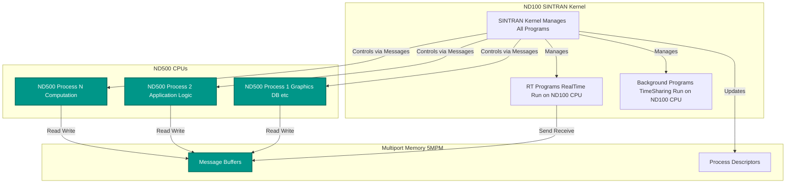
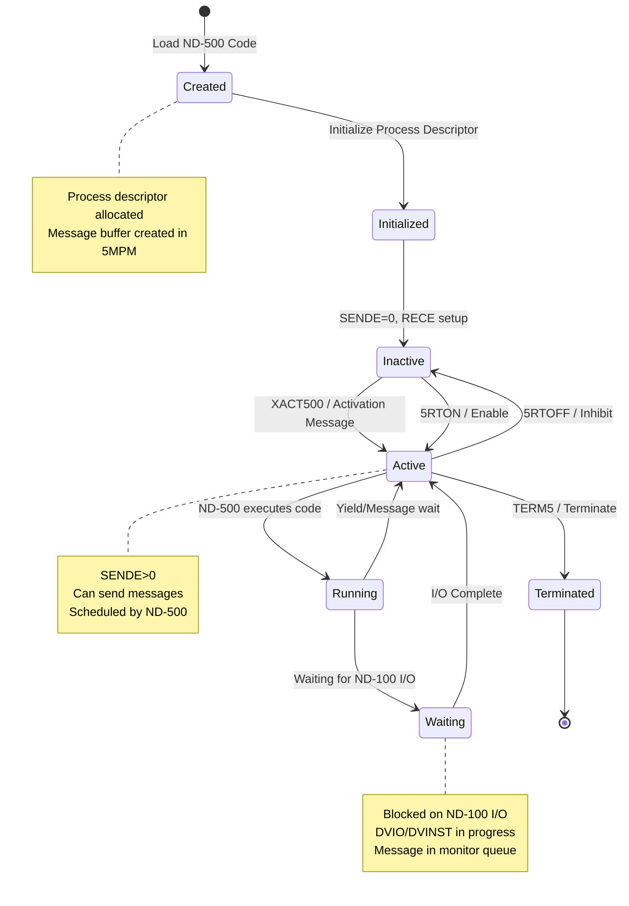
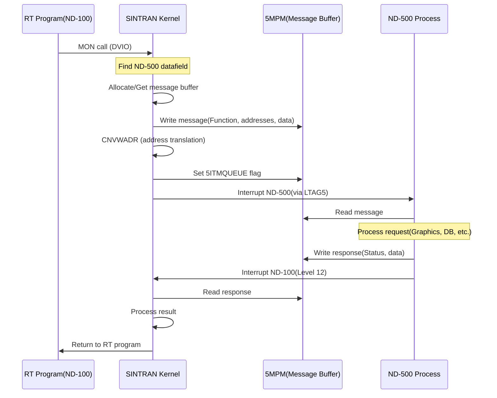

# What Makes ND-500 Programs Special

**Complete Guide to ND-500 Program Characteristics and Differences from RT Programs**

**Version:** 1.0  
**Last Updated:** October 16, 2025  
**Purpose:** Explain the unique characteristics of ND-500 programs compared to regular SINTRAN RT programs

---

## Table of Contents

1. [Overview](#1-overview)
2. [Fundamental Differences](#2-fundamental-differences)
3. [ND-500 Program Structure](#3-nd-500-program-structure)
4. [Lifecycle and Management](#4-lifecycle-and-management)
5. [Communication Mechanisms](#5-communication-mechanisms)
6. [Special Monitor Calls](#6-special-monitor-calls)
7. [Memory Management](#7-memory-management)
8. [Process States](#8-process-states)
9. [C# Implementation](#9-csharp-implementation)

---

## 1. Overview

### 1.1 What are ND-500 Programs?

**ND-500 programs** are **NOT standard SINTRAN RT programs**. They are **shadow processes** that run on the ND-500 CPU(s), controlled and coordinated by the ND-100 SINTRAN kernel.



### 1.2 Key Concept: Shadow Processes

ND-500 programs are **"shadow processes"** because:
- The **process logic runs on ND-500 CPU**
- The **control structures live on ND-100** (SINTRAN kernel)
- **Communication is asynchronous** via message buffers in multiport memory (5MPM)
- **ND-100 coordinates** process lifecycle, I/O, and resource allocation

---

## 2. Fundamental Differences

### 2.1 Comparison Table

| Aspect | RT Programs (ND-100) | ND-500 Programs |
|--------|---------------------|-----------------|
| **Execution** | On ND-100 CPU | On ND-500 CPU(s) |
| **Control Structure** | RT-Description (26 words) | Process Descriptor (5PRDSIZE words) |
| **Location** | RT-Description table at `026000₈` | Process table at `S500S` to `S500E` |
| **Scheduling** | SINTRAN scheduler (levels, priority) | ND-500 internal + SINTRAN coordination |
| **Memory** | ND-100 virtual memory (PITs) | ND-500 memory + 5MPM shared memory |
| **MMU/PIT** | Uses RPIT (PIT 1) or MPIT (PIT 2) | Uses special 5PIT for 5MPM access |
| **Communication** | Direct MON calls | **Message-based via 5MPM buffers** |
| **Context Switch** | Load ACTPRI → TRR PCR | **Send activation message to ND-500** |
| **I/O Access** | Direct through SINTRAN drivers | **Via ND-100 proxy (DVIO/DVINST)** |
| **Segments** | SINTRAN segments | **ND-500 data segments (F5DSG-L5DSG)** |
| **Max Count** | ~32-64 RT programs | **MX5PROCS** (calculated at boot) |
| **Creation** | @START-RT-PROGRAM command | **ND-500 program load + activation** |
| **Termination** | RTOFF/KILL-RT | **Terminate message (TERM5)** |

### 2.2 Not in RT-Description Table!

**CRITICAL:** ND-500 programs do **NOT** have entries in the standard RT-Description table at `026000₈`. They have their own process descriptor table located at symbols `S500S` (start) to `S500E` (end) in multiport memory.

From `PH-P2-OPPSTART.NPL` lines 1417-1419:
```npl
CALL CH5CPUPRESENT; 0=:MX5PROCS           % Check if ND-500 CPU is present
A:="S500E"-"S500S"=:D:=0; T:=5PRDSIZE; *RDIV ST
IF A-1<<MX5PROCS THEN A=:MX5PROCS FI      % Calculate max ND-500 processes
```

**Formula:**
```
MX5PROCS = ("S500E" - "S500S") / 5PRDSIZE

Where:
  S500S    = Start address of ND-500 process table (in 5MPM)
  S500E    = End address of ND-500 process table
  5PRDSIZE = Size of each process descriptor (words)
  MX5PROCS = Maximum number of ND-500 processes
```

---

## 3. ND-500 Program Structure

### 3.1 Process Descriptor (Complete)

```c
/// <summary>
/// ND-500 Process Descriptor (in 5MPM).
/// Location: S500S + (process_num * 5PRDSIZE)
/// Size: 5PRDSIZE words (from symbols, typically 6-10 words)
/// All fields are 16-bit words.
/// </summary>
public struct ND500ProcessDescriptor
{
    // ===== Process Identity =====
    
    /// <summary>Offset 0: XADPROC - Process descriptor address (16 bits)
    /// Points back to this structure (for validation)
    /// </summary>
    public ushort ProcessDescriptorAddr;
    
    /// <summary>Offset 1: MESSBUFF - Message buffer address in 5MPM (16 bits)
    /// Each process has dedicated message buffer for communication
    /// Buffer size: 55MESSIZE words (from symbols)
    /// </summary>
    public ushort MessageBufferAddr;
    
    /// <summary>Offset 2: Process status flags (16 bits)
    /// Bits (specific positions TBD from analysis):
    ///   - Active/Inactive
    ///   - Waiting for message
    ///   - Error condition
    /// </summary>
    public ushort Status;
    
    /// <summary>Offset 3: SENDE - Send enabled flag (16 bits)
    /// 0 = Cannot send messages
    /// >0 = Can send, value is process ID or state
    /// Written by: *SENDE@3 STATX
    /// </summary>
    public ushort SendEnabled;
    
    /// <summary>Offset 4: RECE - Receive state (16 bits)
    /// Indicates if process can receive messages
    /// Written by: *RECE@3 STATX
    /// </summary>
    public ushort ReceiveState;
    
    /// <summary>Offset 5+: Extended fields (varies by system)
    /// May include:
    /// - Error codes
    /// - Timing information
    /// - Resource links
    /// - ND-500 specific state
    /// </summary>
    public ushort[] Extended;
}
```

### 3.2 Process Descriptor Initialization

From `RP-P2-N500.NPL` lines 775-788:

```npl
% Initialize ND-500 process descriptors
A:=55MSNEGSIZE+D=:SWMSG
T:=5MBBANK; A=:X:=0 BONE 5SYSRES
*AAX 5MSFL; STATX; AAX -5MSFL
5SWPROC=:MSINPROCNO; X:="S500S"              % Start at first process descriptor

FOR MSINPROCNO DO WHILE MSINPROCNO<<=MX5PROCS
   X=:MSPRDESCR                              % Save descriptor address
   A:=D/\1777+55MESSIZE                      % Calculate message buffer size
   IF A>>2000 THEN D SHZ -12 +1 SH 12 FI     % Bank align if needed
   A:=D+55MESNEGSIZE=:X.MESSBUFF             % Store message buffer address
   T:=5MBBANK; X:=:A; *AAX XADPR; STATX; AAX -XADPR
   MSINPROCNO; *SENDE@3 STATX                % Initialize SENDE field
   X:=MSPRDESCR+5PRDSIZE; 55MESSIZE; D+A     % Next descriptor
OD
```

**Key operations:**
1. Allocate message buffer in 5MPM (size `55MESSIZE`)
2. Bank-align buffers (cross-bank messages not supported)
3. Store buffer address in `MESSBUFF` field
4. Initialize `SENDE` field with process number
5. Advance to next descriptor (`5PRDSIZE` words)

### 3.3 Message Buffer Structure

```c
/// <summary>
/// ND-500 Message Buffer (in 5MPM).
/// Size: 55MESSIZE words (from symbols, ~100 words typical).
/// Located at: ProcessDescriptor.MessageBufferAddr
/// All fields are 16-bit words.
/// </summary>
public struct ND500MessageBuffer
{
    // ===== Message Header (common to all messages) =====
    
    /// <summary>Offset 0: PLINK - Process link (16 bits)
    /// Links back to process descriptor or next message
    /// </summary>
    public ushort ProcessLink;
    
    /// <summary>Offset 1: 5MSFL - Message flags (16 bits)
    /// Bit flags:
    ///   5ITMQUEUE (bit ?): In monitor queue, ready for processing
    ///   5SYSRES (bit ?): System reserved message
    /// </summary>
    public ushort MessageFlags;
    
    /// <summary>Offset 2: Function code (16 bits)
    /// Specifies what operation to perform:
    ///   1 = DVIO output
    ///   2 = DVINST input
    ///   3 = File operation
    ///   etc.
    /// </summary>
    public ushort FunctionCode;
    
    /// <summary>Offset 3: Error code (16 bits)
    /// 0 = Success
    /// >0 = Error code (EC174, EC175, etc.)
    /// </summary>
    public ushort ErrorCode;
    
    // ===== I/O Operation Fields =====
    
    /// <summary>Offset 4-5: TODF - To Datafield (32 bits)
    /// Address of target datafield (device) on ND-100
    /// </summary>
    public uint ToDatafield;
    
    /// <summary>Offset 6-7: DNOBY/NRBYT - Number of bytes (32 bits)
    /// Byte count for DMA transfers
    /// </summary>
    public uint ByteCount;
    
    /// <summary>Offset 8-9: N500A - ND-500 logical address (32 bits)
    /// Byte address in ND-500 memory space
    /// </summary>
    public uint ND500LogicalAddr;
    
    /// <summary>Offset 10-11: N100A - ND-100 physical address (32 bits)
    /// Physical byte address in ND-100 multiport memory
    /// Result of CNVWADR translation
    /// Bit 31 set = multiport memory
    /// </summary>
    public uint ND100PhysicalAddr;
    
    // ===== Additional Fields (varies by function) =====
    
    /// <summary>Offset 12: XMICF - Microcode function (16 bits)
    /// Specifies microcode operation:
    ///   3RMED = Read data memory
    ///   3WMED = Write data memory
    ///   3START = Start process
    ///   3WMONCO = Write after monitor call
    /// </summary>
    public ushort MicrocodeFunction;
    
    /// <summary>Offset 13: 5DITN - DIT number (16 bits)
    /// Data Interface Table number (usually 0)
    /// </summary>
    public ushort DITNumber;
    
    /// <summary>Offset 14+: Variable data area</summary>
    public ushort[] Data;
}
```

---

## 4. Lifecycle and Management

### 4.1 ND-500 Program Lifecycle



### 4.2 Activation: XACT500

From `MP-P2-N500.NPL` line 692:

```npl
CC5CPU=:B; CALL XACT500
```

**XACT500 routine** (simplified):
```npl
SUBR XACT500
XACT500:
   % B = ND-500 CPU datafield
   T:=B.HDEV+LCON5; A:=...; *IOXT     % Load control register
   T:=B.HDEV+LTAG5; A:=3START; *IOXT  % TAG-OUT: Start operation
   % ND-500 now activates the process
   EXIT
```

**What happens:**
1. ND-100 sends **activation message** to ND-500
2. ND-500 microcode reads message buffer
3. ND-500 loads process context
4. ND-500 starts executing process code
5. Process runs until:
   - I/O request (sends message back to ND-100)
   - Completion (sends termination message)
   - Error (sends error message)

### 4.3 Deactivation and Termination

```npl
SUBR TER500
TER500:
   % B = ND-500 CPU datafield
   T:=B.HDEV+TERM5; *IOXT              % Hardware terminate
   % Or send termination message
   EXIT
```

**Termination process:**
1. ND-100 sends **TERM5** to ND-500 hardware
2. ND-500 stops process execution
3. Process descriptor marked inactive (`SENDE=0`)
4. Message buffers cleared
5. Resources released

---

## 5. Communication Mechanisms

### 5.1 Message Passing Flow



### 5.2 Special: No Direct Scheduling

**CRITICAL DIFFERENCE:**

RT Programs:
```
SINTRAN Scheduler → Pick from EXEC Queue → Load ACTPRI → TRR PCR → Execute
```

ND-500 Programs:
```
SINTRAN sends message → ND-500 internal scheduler → ND-500 executes → Send message back
```

**ND-100 does NOT directly schedule ND-500 processes!** It only:
1. Sends activation/deactivation messages
2. Handles I/O requests from ND-500
3. Manages resources on behalf of ND-500 processes
4. Coordinates between RT programs and ND-500 processes

---

## 6. Special Monitor Calls

### 6.1 ND-500 Specific MON Calls

| MON Call | Purpose | Difference from RT |
|----------|---------|-------------------|
| **DVIO** | Data I/O | Proxied through ND-100 to actual device |
| **DVINST** | Direct input/output | Same as DVIO but direct |
| **5MONICO** | Restart ND-500 process after MON call | Special: Updates message buffer, sends to ND-500 |
| **EMONICO** | Restart with error code | Returns error to ND-500 process |
| **XACTRDY** | Mark process ready | Updates ND-500 descriptor |

### 6.2 5MONICO - The Key Restart Routine

From `RP-P2-MONCALLS.NPL` line 3226:

```npl
T:=CLM; CALL 5MONICO               % Return status to ND-500 proc.
CALL ACTRDY                         % Restart process
CALL LOWACT500; SVB=:B              % Start ND-500
```

**What 5MONICO does:**
1. Updates message buffer with results
2. Clears error flags
3. Sets completion status
4. **Does NOT load into execution queue** (like regular RT)
5. Instead: Sends message to ND-500 to continue execution

### 6.3 EMONICO - Error Restart

From `MP-P2-N500.NPL` line 962:

```npl
X:=CSWPM; CALL EMONICO             % Restart proc. with error code
CALL XACTRDY
```

**EMONICO operation:**
1. Writes error code to message buffer `ErrorCode` field
2. Sets error flags in message
3. Sends notification to ND-500
4. ND-500 process receives error and handles it

---

## 7. Memory Management

### 7.1 Memory Regions

```
ND-100 Memory Spaces:
┌─────────────────────────────────────────────────────────────┐
│ ND-100 Physical Memory                                      │
│  - RT Program Code/Data (via PITs)                          │
│  - SINTRAN Kernel                                           │
│  - Device Datafields                                        │
│  - RT-Descriptions                                          │
└─────────────────────────────────────────────────────────────┘

Multiport Memory (5MPM):
┌─────────────────────────────────────────────────────────────┐
│ Accessible by BOTH ND-100 and ND-500                        │
│  - ND-500 Process Descriptors (S500S - S500E)               │
│  - Message Buffers (one per ND-500 process)                 │
│  - DMA Transfer Buffers                                     │
│  - ACCP Buffers (communication protocol)                    │
│  - OCTOBUS Buffers (network)                                │
│  - HW Buffers (hardware interface)                          │
└─────────────────────────────────────────────────────────────┘

ND-500 Memory:
┌─────────────────────────────────────────────────────────────┐
│ ND-500 Private Memory                                       │
│  - Process Code                                             │
│  - Process Data                                             │
│  - Stack                                                    │
│  - ND-500 Data Segments (F5DSG - L5DSG on ND-100 disk)     │
└─────────────────────────────────────────────────────────────┘
```

### 7.2 ND-500 Data Segments

From `PH-P2-OPPSTART.NPL` lines 1420-1434:

```npl
"F5DSG"=:CSGNO*5SEGSIZE+SEGSTART=:X
T:=SEGTBANK; *SEGLE@3 LDATX
A=:CSGSIZE                          % ND-500 data segment size
...
DO WHILE CSGNO><"L5DSG"             % For each ND-500 segment
   ...
   NXMADR; T:=SEGTBANK; *MADR@3 STATX  % Mass storage of ND-500 data segm
   ...
OD
```

**ND-500 Data Segments:**
- Stored on **ND-100 disk** (symbols `F5DSG` to `L5DSG`)
- Loaded into **ND-500 memory** when process starts
- Each process can have multiple segments
- Managed by SINTRAN segment system
- Can be marked `5INHB` (inhibited) if not used

---

## 8. Process States

### 8.1 State Flags

```c
/// <summary>
/// ND-500 Process state flags (in descriptor Status field).
/// </summary>
[Flags]
public enum ND500ProcessState : ushort
{
    Inactive = 0,
    
    /// <summary>Process can send messages (SENDE > 0)</summary>
    SendEnabled = 1 << 0,
    
    /// <summary>Process can receive messages</summary>
    ReceiveEnabled = 1 << 1,
    
    /// <summary>Process is currently running on ND-500 CPU</summary>
    Running = 1 << 2,
    
    /// <summary>Process is waiting for ND-100 I/O</summary>
    WaitingForIO = 1 << 3,
    
    /// <summary>Process has error condition</summary>
    Error = 1 << 4,
    
    /// <summary>Process is inhibited (5RTOFF equivalent)</summary>
    Inhibited = 1 << 5,
    
    /// <summary>Process is in ND-500 internal wait state</summary>
    InternalWait = 1 << 6,
    
    /// <summary>Message pending in buffer</summary>
    MessagePending = 1 << 7
}
```

### 8.2 State Transitions

Unlike RT programs which have well-defined states in the STATE/PRIORITY word, ND-500 processes have **distributed state**:

- **ND-100 side**: Process descriptor status, message flags
- **ND-500 side**: ND-500 internal process state
- **Coordination**: Via message passing

**Example state check:**
```npl
T:=5MBBANK; X:=PROC_DESC; *AAX SENDE@3; LDATX
IF A=0 THEN
   % Process is inactive, cannot send
ELSE
   % Process is active, can send messages
FI
```

---

## 9. C# Implementation

### 9.1 Complete ND-500 Process Reader

```csharp
/// <summary>
/// Reads ND-500 process information from multiport memory.
/// </summary>
public class ND500ProcessReader
{
    private readonly IMemoryAccess _memory;
    
    // Symbol addresses (read from symbol files or configuration)
    private ushort _s500sAddr;  // Start of process table
    private ushort _s500eAddr;  // End of process table
    private ushort _5prdSize;   // Size of each descriptor
    private ushort _5mbBank;    // 5MPM bank number
    
    public ND500ProcessReader(IMemoryAccess memory, 
                               ushort s500s, ushort s500e, 
                               ushort prdSize, ushort mbBank)
    {
        _memory = memory;
        _s500sAddr = s500s;
        _s500eAddr = s500e;
        _5prdSize = prdSize;
        _5mbBank = mbBank;
    }
    
    /// <summary>
    /// Get all ND-500 processes.
    /// </summary>
    public List<ND500ProcessInfo> GetAllND500Processes()
    {
        var processes = new List<ND500ProcessInfo>();
        
        // Calculate max processes
        int maxProcs = (_s500eAddr - _s500sAddr) / _5prdSize;
        
        ushort addr = _s500sAddr;
        for (int i = 0; i < maxProcs; i++)
        {
            var proc = ReadProcessDescriptor(addr, i);
            if (proc != null && proc.IsValid)
            {
                processes.Add(proc);
            }
            addr += _5prdSize;
        }
        
        return processes;
    }
    
    /// <summary>
    /// Read ND-500 process descriptor.
    /// </summary>
    private ND500ProcessInfo ReadProcessDescriptor(ushort addr, int processNum)
    {
        // Read from 5MPM using bank addressing
        var desc = new ND500ProcessInfo
        {
            ProcessNumber = processNum,
            DescriptorAddress = addr,
            ProcessDescriptorAddr = _memory.ReadWord(addr + 0),
            MessageBufferAddr = _memory.ReadWord(addr + 1),
            Status = _memory.ReadWord(addr + 2),
            SendEnabled = _memory.ReadWord(addr + 3),
            ReceiveState = _memory.ReadWord(addr + 4)
        };
        
        // Read message buffer if valid
        if (desc.MessageBufferAddr != 0)
        {
            desc.MessageBuffer = ReadMessageBuffer(desc.MessageBufferAddr);
        }
        
        return desc;
    }
    
    /// <summary>
    /// Read message buffer.
    /// </summary>
    private ND500MessageInfo ReadMessageBuffer(ushort addr)
    {
        return new ND500MessageInfo
        {
            ProcessLink = _memory.ReadWord(addr + 0),
            MessageFlags = _memory.ReadWord(addr + 1),
            FunctionCode = _memory.ReadWord(addr + 2),
            ErrorCode = _memory.ReadWord(addr + 3),
            ToDatafield = _memory.ReadDoubleWord(addr + 4),
            ByteCount = _memory.ReadDoubleWord(addr + 6),
            ND500LogicalAddr = _memory.ReadDoubleWord(addr + 8),
            ND100PhysicalAddr = _memory.ReadDoubleWord(addr + 10),
            MicrocodeFunction = _memory.ReadWord(addr + 12),
            DITNumber = _memory.ReadWord(addr + 13)
        };
    }
}

/// <summary>
/// ND-500 Process information for display.
/// </summary>
public class ND500ProcessInfo
{
    public int ProcessNumber { get; set; }
    public ushort DescriptorAddress { get; set; }
    public ushort ProcessDescriptorAddr { get; set; }
    public ushort MessageBufferAddr { get; set; }
    public ushort Status { get; set; }
    public ushort SendEnabled { get; set; }
    public ushort ReceiveState { get; set; }
    public ND500MessageInfo MessageBuffer { get; set; }
    
    /// <summary>Is descriptor valid?</summary>
    public bool IsValid => ProcessDescriptorAddr == DescriptorAddress;
    
    /// <summary>Can process send messages?</summary>
    public bool CanSend => SendEnabled != 0;
    
    /// <summary>Is process active?</summary>
    public bool IsActive => CanSend && (Status & 0x80) == 0;  // No error bit
    
    /// <summary>Get state description.</summary>
    public string StateDescription
    {
        get
        {
            if (!CanSend) return "INACTIVE";
            if ((Status & 0x80) != 0) return "ERROR";
            if ((MessageBuffer?.MessageFlags & 0x01) != 0) return "MSG_PENDING";
            return "ACTIVE";
        }
    }
}

/// <summary>
/// Message buffer information.
/// </summary>
public class ND500MessageInfo
{
    public ushort ProcessLink { get; set; }
    public ushort MessageFlags { get; set; }
    public ushort FunctionCode { get; set; }
    public ushort ErrorCode { get; set; }
    public uint ToDatafield { get; set; }
    public uint ByteCount { get; set; }
    public uint ND500LogicalAddr { get; set; }
    public uint ND100PhysicalAddr { get; set; }
    public ushort MicrocodeFunction { get; set; }
    public ushort DITNumber { get; set; }
    
    /// <summary>Is message in monitor queue (ready to process)?</summary>
    public bool InMonitorQueue => (MessageFlags & 0x01) != 0;  // 5ITMQUEUE
    
    /// <summary>Get function name.</summary>
    public string FunctionName => FunctionCode switch
    {
        1 => "DVIO (Output)",
        2 => "DVINST (Input)",
        3 => "File Operation",
        _ => $"Function {FunctionCode}"
    };
}
```

### 9.2 Display ND-500 Processes

```csharp
/// <summary>
/// Display ND-500 processes in debug window.
/// </summary>
public string RenderND500Processes()
{
    var reader = new ND500ProcessReader(_memory, S500S, S500E, PRDSIZE, MBBANK);
    var processes = reader.GetAllND500Processes();
    
    var sb = new StringBuilder();
    sb.AppendLine("╔══════════════════════════════════════════════════════════════════════════════╗");
    sb.AppendLine("║                        ND-500 Processes                                      ║");
    sb.AppendLine("╚══════════════════════════════════════════════════════════════════════════════╝");
    sb.AppendLine();
    
    sb.AppendLine($"Total ND-500 Processes: {processes.Count}");
    sb.AppendLine($"Active: {processes.Count(p => p.IsActive)}");
    sb.AppendLine();
    
    sb.AppendLine("┌──────┬────────────┬────────────────┬──────────────┬────────────────────────┐");
    sb.AppendLine("│ Proc │ Descriptor │ Message Buffer │ State        │ Current Operation      │");
    sb.AppendLine("├──────┼────────────┼────────────────┼──────────────┼────────────────────────┤");
    
    foreach (var proc in processes)
    {
        var desc = OctalHelpers.ToOctal(proc.DescriptorAddress, 6);
        var msgBuf = OctalHelpers.ToOctal(proc.MessageBufferAddr, 6);
        var state = proc.StateDescription.PadRight(12);
        var func = proc.MessageBuffer?.FunctionName ?? "Idle";
        
        sb.AppendLine($"│  {proc.ProcessNumber,2}  │ {desc} │ {msgBuf}       │ {state} │ {func,-22} │");
    }
    
    sb.AppendLine("└──────┴────────────┴────────────────┴──────────────┴────────────────────────┘");
    
    return sb.ToString();
}
```

---

## Summary

### Key Takeaways

1. **ND-500 programs are NOT RT programs** - They are shadow processes on a separate CPU

2. **Different control structures**:
   - RT programs: RT-Description (26 words) at `026000₈`
   - ND-500 programs: Process Descriptor (5PRDSIZE words) at `S500S`-`S500E` in 5MPM

3. **Message-based communication** - Not direct MON calls

4. **No direct scheduling** - SINTRAN sends messages, ND-500 schedules internally

5. **Shared memory is key** - 5MPM contains all coordination structures

6. **Special monitor calls** - 5MONICO, EMONICO instead of regular restart

7. **Address translation critical** - CNVWADR converts for DMA access

8. **Distributed state** - State exists on both ND-100 and ND-500 sides

**ND-500 programs enable offloading compute-intensive tasks (graphics, database, protocols) while SINTRAN maintains overall system control!**

---

**For more details:**
- [05-ND500-DMA-KERNEL.md](05-ND500-DMA-KERNEL.md) - DMA and address translation
- [04-MMU-CONTEXT-SWITCHING.md](04-MMU-CONTEXT-SWITCHING.md) - MMU and PIT usage
- Analysis\ND500\MP-P2-N500.md - Complete API reference

