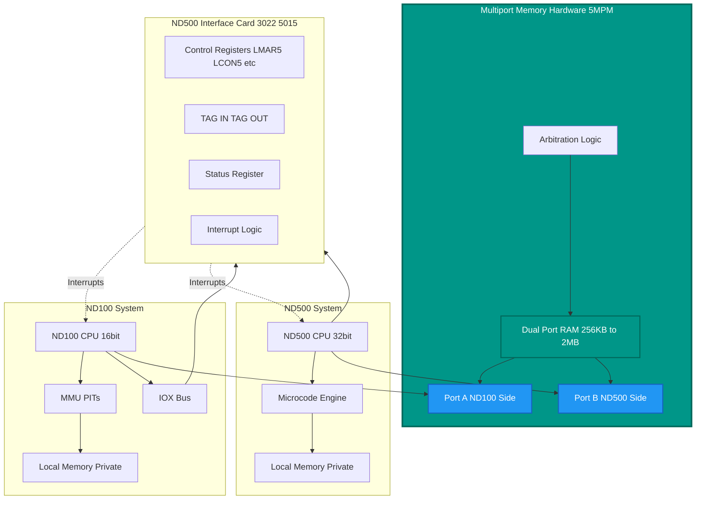

# Multiport Memory (MPM5) and Complete ND-500 Communication

**Comprehensive Guide to Multiport Memory, Message Buffers, Interrupts, and ND-500 Integration**

**Version:** 2.0  
**Last Updated:** October 17, 2025  
**Purpose:** Deep dive into multiport memory architecture, ND-500 communication protocols, interrupt mechanisms, and complete C# implementation

**✅ VERIFIED against official ND-10.004.01 MPM 5 Technical Description manual**

---

## ⚠️ Important Corrections in Version 2.0

This version has been significantly updated based on the **official MPM5 hardware manual** (ND-10.004.01).

**Key corrections:**
1. **"5MPM" terminology** - The '5' refers to "Multiport Memory Generation 5" (MPM5), not a special memory type
2. **Cache coherency** - Handled by ND-500 CPU's S flag, **NOT** by MPM5 hardware
3. **Address translation** - MPM5 uses BASE registers; ND-100 and ND-500 see **different channel addresses**
4. **Physical reality** - MPM5 is standard Dynamic RAM with special **Twin 16-Bit Port modules**
5. **Memory bus width** - ND-100 has 16-bit wide channel, ND-500 has 32-bit wide channel (Port Control Register bit 6)
6. **CRITICAL** - ND-500 is **byte-oriented** CPU; the "32-bit" refers to **memory bus width** (bandwidth), NOT CPU word size!

---

## Table of Contents

- [Multiport Memory (MPM5) and Complete ND-500 Communication](#multiport-memory-mpm5-and-complete-nd-500-communication)
  - [⚠️ Important Corrections in Version 2.0](#️-important-corrections-in-version-20)
  - [Table of Contents](#table-of-contents)
  - [1. What is Multiport Memory (5MPM)?](#1-what-is-multiport-memory-5mpm)
    - [1.1 Definition](#11-definition)
    - [1.2 CRITICAL: Understanding ND-500 Architecture](#12-critical-understanding-nd-500-architecture)
    - [1.3 Why is it Different from Normal Memory?](#13-why-is-it-different-from-normal-memory)
    - [1.4 Physical Implementation](#14-physical-implementation)
    - [1.5 Address Translation](#15-address-translation)
  - [2. Hardware Architecture](#2-hardware-architecture)
    - [2.1 Complete System Diagram](#21-complete-system-diagram)
    - [2.2 Memory Address Spaces](#22-memory-address-spaces)
    - [2.3 5MPM Configuration at Boot](#23-5mpm-configuration-at-boot)
  - [3. Memory Organization and Buffers](#3-memory-organization-and-buffers)
    - [3.1 Complete 5MPM Layout](#31-complete-5mpm-layout)
    - [3.2 Process Descriptor (Complete)](#32-process-descriptor-complete)
    - [3.3 Message Buffer (Complete)](#33-message-buffer-complete)

---

## 1. What is Multiport Memory (5MPM)?

### 1.1 Definition

**Multiport Memory (5MPM)** is a **special hardware memory bank** that is **physically accessible by multiple CPUs simultaneously**. In the ND-100/ND-500 system:

- **ND-100 CPU** can read and write it
- **ND-500 CPU** can read and write it
- **Both see the SAME physical memory locations**
- **No copying required** - changes are immediately visible to both CPUs

```text
Regular Memory:           Multiport Memory (5MPM):
┌──────────────┐          ┌──────────────────────────┐
│  ND-100      │          │  ND-100       ND-500     │
│  Memory      │          │    │            │        │
│              │          │    └────────────┘        │
│  (private)   │          │         │                │
└──────────────┘          │    Shared Memory         │
                          │    (same physical RAM)   │
┌──────────────┐          └──────────────────────────┘
│  ND-500      │
│  Memory      │          Both CPUs access
│              │          same memory locations!
│  (private)   │
└──────────────┘
```

### 1.2 CRITICAL: Understanding ND-500 Architecture

**Before we continue, clarify a common misconception:**

| CPU | Architecture | Word Size | Addressing | Memory Bus to MPM5 |
|-----|--------------|-----------|------------|-------------------|
| **ND-100** | 16-bit word machine | 16-bit words | Word addresses | **16-bit wide channel** |
| **ND-500** | **Byte machine** | **8-bit bytes** | **Byte addresses** | **32-bit wide channel** |

**The ND-500 is NOT a 32-bit CPU!**

- **CPU Architecture:** Byte-oriented (like x86, ARM, etc.)
- **Addressing:** Byte-addressable memory (can access individual bytes)
- **Operations:** Has 8-bit, 16-bit, and 32-bit operations on bytes/words
- **Memory Bus:** 32-bit wide data path to MPM5 **(bandwidth optimization only!)**

**Analogy:**
```
x86-64 CPU:
  ✓ Byte-addressable (can read byte at 0x1000)
  ✓ Fetches 64-byte cache lines (bandwidth optimization)
  ✗ Not called a "512-bit CPU"!

ND-500:
  ✓ Byte-addressable (can read byte at any address)
  ✓ Fetches 4-byte chunks from MPM5 (bandwidth optimization)
  ✗ Not a "32-bit CPU" - it's byte-oriented!
```

**Why this matters for MPM5:**
- When we say "32-bit channel," we mean **memory bus width**
- The ND-500 **fetches 4 bytes at once** for efficiency
- But the CPU can then **extract individual bytes** as needed
- This is **purely** a bandwidth/performance optimization

### 1.3 Why is it Different from Normal Memory?

| Aspect | Normal ND-100 Memory | Multiport Memory (5MPM) |
|--------|---------------------|-------------------------|
| **Access** | Only ND-100 CPU | **Both ND-100 and ND-500** |
| **Address Space** | ND-100 physical (24-bit) | **Dual-ported hardware** |
| **Visibility** | Private to ND-100 | **Shared between CPUs** |
| **Purpose** | Programs, OS, data | **Communication, coordination** |
| **Speed** | Normal memory access | **Slightly slower (arbitration)** |
| **Hardware** | Standard RAM | **Special multi-port RAM chips** |
| **Cost** | Cheap | **Expensive (special hardware)** |
| **Size** | Large (megabytes) | **Limited (256KB - 2MB typical)** |

### 1.4 Physical Implementation

```text
Hardware Level:
┌─────────────────────────────────────────────────────────┐
│         Multiport Memory Hardware Board                 │
│  ┌────────────────────────────────────────────────┐     │
│  │  RAM Chips with Dual Port Controllers          │     │
│  │  - Arbitration logic                           │     │
│  │  - Address decoding                            │     │
│  │  - Data buffering                              │     │
│  └────────────────────────────────────────────────┘     │
│           │                            │                │
│       ┌───┴───┐                    ┌───┴───┐            │
│       │ Port A│                    │ Port B│            │
│       └───┬───┘                    └───┬───┘            │
└───────────┼────────────────────────────┼────────────────┘
            │                            │
       ┌────┴────┐                  ┌────┴────┐
       │ ND-100  │                  │ ND-500  │
       │ Memory  │                  │ Memory  │
       │ Bus     │                  │ Bus     │
       └─────────┘                  └─────────┘
```

**Key hardware features:**
- **Dual-port RAM** - Two independent access ports
- **Arbitration logic** - Resolves simultaneous access (priority to one CPU)
- **Address translation** - Each CPU sees it differently
- **No DMA required** - Direct CPU access from both sides

### 1.5 Address Translation

From ND-100 perspective:
```
ND-100 Physical Address → Multiport Memory

Example:
  ND-100 physical: 20000000₈ (bank 2, page 0)
  5MPM location:   Offset 0 in multiport memory
```

From ND-500 perspective:
```
ND-500 Address → Multiport Memory

Example:
  ND-500 address: 0x80000000 (bit 31 set = multiport)
  5MPM location:  Offset 0 in multiport memory
```

**The bit 31 flag (0x80000000) tells ND-500: "This is in shared multiport memory!"**

---

## 2. Hardware Architecture

### 2.1 Complete System Diagram



### 2.2 Memory Address Spaces

```text
┌────────────────────────────────────────────────────────────┐
│ ND-100 Physical Address Space (24-bit)                     │
├────────────────────────────────────────────────────────────┤
│ 00000000₈ - 07777777₈  │ Local Memory (4MB)                │
│ 10000000₈ - 17777777₈  │ Bank 1                            │
│ 20000000₈ - 27777777₈  │ Bank 2 (typical 5MPM location)   ◄┼─┐
│ 30000000₈ - 37777777₈  │ Bank 3                            │ │
│ ...                     │                                  │ │
│ 70000000₈ - 77777777₈  │ Bank 7                            │ │
└────────────────────────────────────────────────────────────┘ │
                                                               │
┌────────────────────────────────────────────────────────────┐ │
│ Multiport Memory (5MPM) - Physical RAM                     │◄┘
├────────────────────────────────────────────────────────────┤
│ Offset 0     │ ND-500 Process Table (S500S - S500E)        │
│ Offset +100  │ Message Buffers (per-process)               │
│ Offset +500  │ ACCP Buffers (communication protocol)       │
│ Offset +1000 │ OCTOBUS Buffers (network)                   │
│ Offset +1500 │ HW Buffers (hardware interface)             │
│ Offset +2000 │ DMA Transfer Buffers (dynamic)              │
│ Offset +3000 │ System Coordination Structures              │
└────────────────────────────────────────────────────────────┘
                                                               │
┌────────────────────────────────────────────────────────────┐ │
│ ND-500 Address Space (32-bit byte addresses)               │◄┘
├────────────────────────────────────────────────────────────┤
│ 0x00000000 - 0x7FFFFFFF │ ND-500 Local Memory              │
│ 0x80000000 - 0xFFFFFFFF │ Multiport Memory (bit 31 set)    │
│                         │ Offset = (addr & 0x7FFFFFFF)     │
└────────────────────────────────────────────────────────────┘
```

### 2.3 5MPM Configuration at Boot

From `RP-P2-N500.NPL` lines 751-772:

```npl
% Multiport memory initialization
*CNVWADR                              % Convert to physical address
T:=5MBBANK; X:=MSQLINK; *AAX X5NAC; STDTX

IF MSDFCPU.MIFLAG BIT MUDOM THEN
   % Allocate communication buffers in 5MPM
   T:=5MBBANK; X:=MSMLINK; *AAX X5STA; STATX
   
   % Calculate ACCP buffer base
   MAXOCTBUF+1 SH -1 + MAXACCPBUFF+2000 SH -12
   T:=MSCPUNO; *RMPY ST DA
   5FPACCPBUF; D+A; A:=0; AD SH 12
   T:=5MBBANK; X:=MSMLINK; *AAX X5ACC; STDTX    % Store ACCP buffer address
   
   % Calculate OCTOBUS buffer base
   A:=:D; A+MAXACCPBUFF; D:=D+C:=:A
   *AAX X5OCT-X5ACC; STDTX                      % Store OCTOBUS buffer address
   
   % Calculate HW buffer base
   MSCPUNO SH 1 + 5FPHWBUF=:D; A:=0; AD SH 12
   *AAX X5HWB-X5OCT; STDTX                      % Store HW buffer address
FI
```

**What this does:**
1. Finds multiport memory bank (`5MBBANK`)
2. Calculates buffer offsets based on CPU count and buffer sizes
3. Stores base addresses in ND-500 datafield
4. Allocates separate regions for:
   - **ACCP** - Protocol communication
   - **OCTOBUS** - Network interface
   - **HW** - Hardware coordination

---

## 3. Memory Organization and Buffers

### 3.1 Complete 5MPM Layout

```
5MPM Memory Map (Typical 1MB configuration):
┌──────────────────────────────────────────────────────────┐
│ Offset    │ Size    │ Content                            │
├──────────────────────────────────────────────────────────┤
│ 0x000000  │ ~1KB    │ ND-500 Process Descriptors         │◄─ S500S
│           │         │ - One per ND-500 process           │
│           │         │ - Size: 5PRDSIZE words each        │
│           │         │ - Max: MX5PROCS processes          │
├──────────────────────────────────────────────────────────┤
│ 0x000400  │ ~10KB   │ Message Buffers                    │◄─ Per process
│           │         │ - Size: 55MESSIZE words each       │
│           │         │ - Contains function, addresses     │
│           │         │ - Command/response data            │
├──────────────────────────────────────────────────────────┤
│ 0x003000  │ Varies  │ DMA Transfer Buffers               │
│           │         │ - Allocated dynamically            │
│           │         │ - Size: GPDZI max (typ. 4KB)       │
├──────────────────────────────────────────────────────────┤
│ 0x010000  │ ~32KB   │ ACCP Buffers                       │◄─ 5FPACCPBUF + offset
│           │         │ - Communication protocol           │
│           │         │ - MAXACCPBUFF per CPU              │
│           │         │ - Used for structured messages     │
├──────────────────────────────────────────────────────────┤
│ 0x018000  │ ~32KB   │ OCTOBUS Buffers                    │◄─ X5OCT
│           │         │ - Network interface data           │
│           │         │ - MAXOCTBUF buffers                │
│           │         │ - Packet queuing                   │
├──────────────────────────────────────────────────────────┤
│ 0x020000  │ ~16KB   │ HW Buffers                         │◄─ 5FPHWBUF + offset
│           │         │ - Hardware coordination            │
│           │         │ - Device status sharing            │
│           │         │ - Interrupt coordination           │
├──────────────────────────────────────────────────────────┤
│ 0x024000  │ ~4KB    │ System Coordination                │
│           │         │ - Mailbox links                    │
│           │         │ - Execution queue head             │
│           │         │ - Watchdog messages                │
│           │         │ - Histogram messages               │
├──────────────────────────────────────────────────────────┤
│ 0x025000  │ Rest    │ Free / Reserved                    │
└──────────────────────────────────────────────────────────┘
```

### 3.2 Process Descriptor (Complete)

```c
/// <summary>
/// ND-500 Process Descriptor in 5MPM.
/// Location: S500S + (process_num * 5PRDSIZE)
/// All fields are 16-bit words.
/// </summary>
[StructLayout(LayoutKind.Sequential, Pack = 2)]
public struct ND500ProcessDescriptor
{
    /// <summary>Offset 0 (000₈): XADPROC - Process descriptor address (16 bits)
    /// Self-reference for validation
    /// </summary>
    public ushort ProcessDescriptorAddr;
    
    /// <summary>Offset 1 (001₈): MESSBUFF - Message buffer address in 5MPM (16 bits)
    /// Points to 55MESSIZE word buffer
    /// </summary>
    public ushort MessageBufferAddr;
    
    /// <summary>Offset 2 (002₈): Status flags (16 bits)
    /// Bit fields (from analysis):
    ///   Bit 0-7: Process state
    ///   Bit 8: Error condition
    ///   Bit 9-15: Reserved
    /// </summary>
    public ushort Status;
    
    /// <summary>Offset 3 (003₈): SENDE - Send enabled (16 bits)
    /// 0 = Process inactive, cannot send
    /// Process number = Active, can send messages
    /// Written by: *SENDE@3 STATX
    /// </summary>
    public ushort SendEnabled;
    
    /// <summary>Offset 4 (004₈): RECE - Receive state (16 bits)
    /// Indicates message reception state
    /// </summary>
    public ushort ReceiveState;
    
    /// <summary>Offset 5+ (005₈+): Extended fields
    /// Size varies by system (5PRDSIZE - 5)
    /// May contain:
    /// - Priority
    /// - CPU affinity
    /// - Resource links
    /// - Statistics
    /// </summary>
    // Extended fields follow but size varies
}

// C# representation size = 10 bytes minimum (5 words)
```

### 3.3 Message Buffer (Complete)

```c
/// <summary>
/// ND-500 Message Buffer in 5MPM.
/// Size: 55MESSIZE words (from symbols, typically ~100-128 words)
/// All fields are 16-bit words.
/// </summary>
[StructLayout(LayoutKind.Sequential, Pack = 2)]
public struct ND500MessageBuffer
{
    // ===== Message Header (12 words minimum) =====
    
    /// <summary>Offset 0 (000₈): PLINK - Process link (16 bits)
    /// Links to process descriptor or next message in queue
    /// </summary>
    public ushort ProcessLink;
    
    /// <summary>Offset 1 (001₈): 5MSFL - Message flags (16 bits)
    /// Bit flags:
    ///   5ITMQUEUE (bit 0, 0x0001): Message in queue, ready to process
    ///   5SYSRES (bit 1, 0x0002): System reserved message (internal use)
    ///   5CPUBOUND (bit 2, 0x0004): CPU bound message (compute-intensive)
    ///   5IOPEND (bit 3, 0x0008): I/O operation pending
    ///   5REPLY (bit 4, 0x0010): Reply message (not initial request)
    ///   5ERROR (bit 5, 0x0020): Error occurred during processing
    ///   5URGENT (bit 6, 0x0040): Urgent/priority message
    ///   5TRACE (bit 7, 0x0080): Trace/debug message
    ///   Bits 8-15: Reserved for future use
    /// </summary>
    public ushort MessageFlags;
    
    /// <summary>Offset 2 (002₈): 5PRIO - Priority (16 bits)
    /// Message priority (higher = more urgent)
    /// Typical: 0-255, with 77776₈ = max priority
    /// </summary>
    public ushort Priority;
    
    /// <summary>Offset 3 (003₈): Function code (16 bits)
    /// Specifies operation:
    ///   1 = DVIO output
    ///   2 = DVINST input
    ///   3 = File operation
    ///   ... (varies by system)
    /// </summary>
    public ushort FunctionCode;
    
    /// <summary>Offset 4 (004₈): Error code (16 bits)
    /// 0 = Success
    /// EC*** = Error codes (EC174, EC175, etc.)
    /// </summary>
    public ushort ErrorCode;
    
    /// <summary>Offset 5-6 (005₈-006₈): TODF - To Datafield (32 bits)
    /// Address of target datafield on ND-100
    /// </summary>
    public uint ToDatafield;
    
    /// <summary>Offset 7-8 (007₈-010₈): DNOBY/NRBYT - Number of bytes (32 bits)
    /// Byte count for DMA/data transfers
    /// </summary>
    public uint ByteCount;
    
    /// <summary>Offset 9-10 (011₈-012₈): N500A - ND-500 logical address (32 bits)
    /// Byte address in ND-500 memory space
    /// May or may not have bit 31 set depending on usage
    /// </summary>
    public uint ND500LogicalAddr;
    
    /// <summary>Offset 11-12 (013₈-014₈): N100A - ND-100 physical address (32 bits)
    /// Physical byte address in ND-100 memory (after CNVWADR)
    /// Bit 31 = 1 if in multiport memory
    /// Lower 31 bits = byte offset
    /// </summary>
    public uint ND100PhysicalAddr;
    
    // ===== Control Fields =====
    
    /// <summary>Offset 13 (015₈): XMICF / MICFUNC - Microcode function (16 bits)
    /// Specifies ND-500 microcode operation:
    ///   3RMED = Read data memory
    ///   3WMED = Write data memory
    ///   3START = Start process
    ///   3WMONCO = Write after monitor call
    ///   3RPREG = Read P register
    ///   3RMICV = Read microcode version
    /// </summary>
    public ushort MicrocodeFunction;
    
    /// <summary>Offset 14 (016₈): 5DITN - DIT number (16 bits)
    /// Data Interface Table number (usually 0)
    /// </summary>
    public ushort DITNumber;
    
    /// <summary>Offset 15 (017₈): 5CPUN - CPU number (16 bits)
    /// Which ND-500 CPU this message is for (multi-CPU systems)
    /// </summary>
    public ushort CPUNumber;
    
    // ===== Variable Data Area (offset 16+) =====
    
    /// <summary>Offset 16+ (020₈+): Variable data
    /// Size: (55MESSIZE - 16) words
    /// Contains function-specific data
    /// </summary>
    // Variable size data follows
}

// Fixed header size = 32 bytes (16 words)
// Total size = 55MESSIZE * 2 bytes (word size)
```


